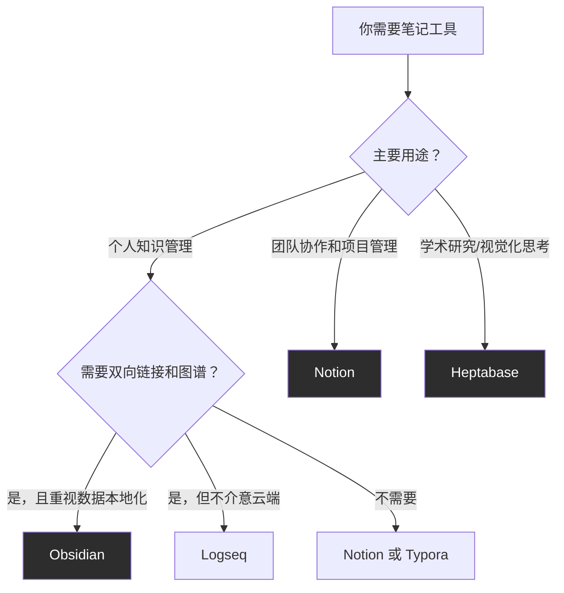
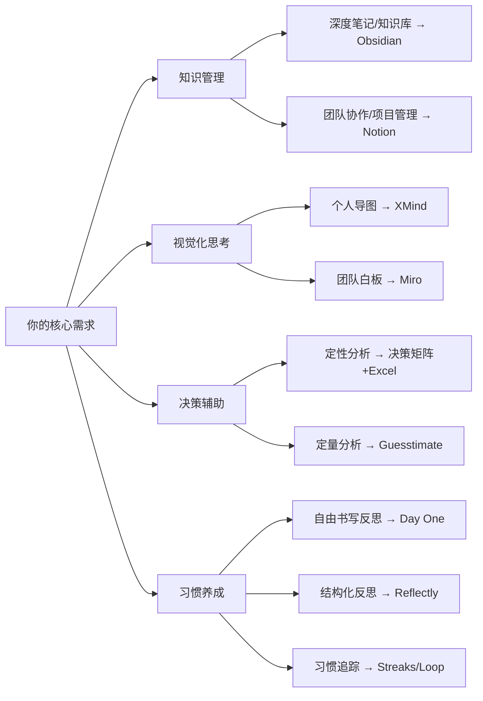

## 三、数字工具推荐

思维提升不是纯靠"想"就能完成的——大脑的工作记忆容量有限（心理学家 George Miller 的经典研究指出短时记忆容量为 7±2 个组块），外部工具能有效扩展你的认知带宽。数字工具在思维训练中的角色可以概括为三层：

1. **思维外化**：把脑中模糊的想法变成可见、可操作的结构（思维导图、白板）
2. **知识管理**：构建可检索、可连接的个人知识网络（笔记系统、知识图谱）
3. **决策辅助**：用量化模型和概率工具对冲人类的认知偏差（决策矩阵、蒙特卡洛模拟）

选工具的原则只有一个：**工具服务于思维习惯，而非反过来**。先建立思维方法，再找趁手的工具——否则你会陷入"工具收集癖"，花大量时间研究工具本身却从不深度使用。

### 3.1 思维导图与可视化思考工具

思维导图的核心价值在于将**发散性思维**（右脑擅长的联想、图像）和**逻辑结构**（左脑擅长的分类、层级）同时呈现在一张图上。Tony Buzan 在 1970 年代提出思维导图时强调：中心主题向外辐射，用关键词而非长句，用颜色和图标区分分支。现代数字工具在此基础上增加了协作、模板、AI 辅助等能力。

#### XMind

- **平台**：Windows / macOS / Linux / iOS / Android / Web
- **核心功能**：
  - 多种图表类型：思维导图、逻辑图、鱼骨图（因果分析）、矩阵图（SWOT）、时间线、组织结构图
  - ZEN 模式：全屏沉浸式编辑，屏蔽干扰
  - 大纲视图与导图视图双向切换，适合从文字提纲到视觉化的一键转换
  - 导出格式丰富：PNG、SVG、PDF、Markdown、OPML、FreeMind
  - 本地文件存储，无需联网即可使用
- **适用场景**：个人头脑风暴、读书笔记结构化、项目规划、演讲提纲
- **优势**：界面简洁美观，上手零门槛；鱼骨图对问题根因分析特别有用；大纲模式可以当写作工具用
- **局限**：协作功能弱，团队场景不如 Miro；免费版导出有水印
- **价格**：免费版可用（有水印），Pro 版约 ¥388/年，买断制约 ¥688
- **实操建议**：
  - 读书时，用 XMind 做"章节骨架图"——把每章的标题、核心概念、案例关系画出来，比划线标记有效 10 倍
  - 遇到复杂决策时，用鱼骨图列出所有影响因素，逐一评估权重
  - 每周用思维导图做一次"知识盘点"，把本周学到的东西连成一张图

#### Miro

- **平台**：Web / Desktop（Windows / macOS）/ Mobile（iOS / Android）
- **核心功能**：
  - 无限画布白板：自由拖拽文字框、图片、便签、形状、箭头
  - 内置思维导图、流程图、看板、时间线模板
  - 实时多人协作，支持评论、@提及、投票
  - 集成生态：Slack、Jira、Google Drive、Notion、Figma 等 100+ 集成
  - 演示模式：把白板变成幻灯片逐步展示
- **适用场景**：团队头脑风暴、用户旅程地图、系统架构图、远程研讨会、设计思维工作坊
- **优势**：协作体验是同类工具中最好的；模板库极其丰富；无限画布适合大型系统性思考
- **局限**：免费版仅 3 个画板；个人离线使用体验一般；功能复杂度高，纯个人笔记场景有"杀鸡用牛刀"感
- **价格**：免费版（3 个画板），Starter 版约 $8/月/人，Business 版约 $16/月/人
- **与 XMind 的选择**：XMind 适合个人深度思考（安静地画图），Miro 适合多人协作和视觉化工作坊（大家一起画）

#### draw.io（现名 diagrams.net）

- **平台**：Web / Desktop（Windows / macOS / Linux）
- **核心功能**：
  - 专业级图表工具：流程图、UML、网络拓扑、ER 图、甘特图
  - 完全免费且开源，文件直接保存到本地或 Google Drive / GitHub
  - 丰富的形状库和模板
  - 支持导出 SVG、PNG、PDF
- **适用场景**：技术架构图、流程梳理、数据库设计、学习笔记中的逻辑关系图
- **优势**：完全免费，无任何限制；离线可用；专业图表能力强于 XMind 和 Miro
- **局限**：界面偏技术化，不够"美观"；没有思维导图的辐射式布局
- **价格**：完全免费
- **实操建议**：学习系统思维时，用 draw.io 画"因果回路图"（Causal Loop Diagram），箭头标注正反馈（+）或负反馈（-），是理解复杂系统最有效的视觉化方法

#### 工具对比速查表

| 维度 | XMind | Miro | draw.io |
|------|-------|------|---------|
| 最适合 | 个人思维导图 | 团队协作白板 | 专业流程/架构图 |
| 协作能力 | 弱 | 极强 | 中等 |
| 美观度 | ★★★★★ | ★★★★ | ★★★ |
| 学习成本 | 极低 | 中等 | 中等 |
| 离线使用 | 完全支持 | 有限支持 | 完全支持 |
| 价格 | 免费/¥388年 | 免费/$8月 | 完全免费 |

### 3.2 笔记与知识管理工具

笔记工具是思维提升的"第二大脑"。认知科学中有一个重要概念叫**外部认知**（External Cognition）：把信息从大脑中"卸载"到外部载体上，释放工作记忆用于更高层次的思考。好的笔记系统不只是"记录"，而是建立**概念之间的连接**——这才是知识真正内化的标志。

#### Obsidian

- **平台**：Windows / macOS / Linux / iOS / Android
- **核心功能**：
  - 双向链接：用 `[[笔记名]]` 语法在任意笔记间建立双向关联
  - 知识图谱（Graph View）：以节点-连线的形式可视化所有笔记之间的关系网络
  - 本地 Markdown 存储：所有笔记就是普通 `.md` 文件，你永远拥有自己的数据
  - 插件生态：1000+ 社区插件，覆盖日历、看板、数据库、AI 辅助、白板等
  - 模板系统：预设日记模板、读书笔记模板、会议记录模板等
  - 强大的全文搜索和正则表达式搜索
- **适用场景**：构建个人知识库、学术研究笔记、写作者的素材库、长期学习笔记
- **为什么对思维提升特别重要**：
  - 双向链接迫使你在写笔记时思考"这个概念和哪些其他概念有关"——这本身就是深度思考
  - 知识图谱让你看到自己知识体系的全貌：哪些领域连接密集（你理解深入），哪些是孤岛（需要补课）
  - 本地存储意味着零成本迁移，不受任何平台绑架
- **上手路径**：
  1. 先只用基本功能：创建笔记、写 Markdown、用 `[[链接]]` 关联笔记
  2. 用两周后安装 Dataview 插件（把笔记当数据库查询）
  3. 用一个月后探索 Canvas（白板）和 Templater（高级模板）
- **价格**：个人使用完全免费；Sync（多设备同步）$4/月；Publish（发布为网站）$8/月
- **替代方案**：Logseq（开源，大纲式写法）、Trilium Notes（自托管，层级结构）

#### Notion

- **平台**：Web / Windows / macOS / iOS / Android
- **核心功能**：
  - 块编辑器：每段内容都是一个"块"（文字、表格、图片、代码、嵌入），可自由拖拽排列
  - 数据库：表格、看板、日历、时间线、画廊视图，灵活度极高
  - 关联数据库和 Rollup：建立表间关系，类似轻量级 SQL
  - 模板市场：数万个社区模板，覆盖项目管理、读书笔记、习惯追踪、OKR 等
  - AI 功能（Notion AI）：摘要、翻译、续写、数据分析
  - Wiki 模式：适合团队知识库
- **适用场景**：知识管理 + 项目管理一体化、团队协作文档、个人生活管理系统（Life OS）
- **与 Obsidian 的选择**：
  - **选 Obsidian** 如果你重视数据所有权（本地文件）、需要双向链接和知识图谱、喜欢高度定制化
  - **选 Notion** 如果你需要数据库功能、团队协作是刚需、喜欢开箱即用的模板
  - **可以共存**：很多人的做法是 Obsidian 存深度笔记和知识库，Notion 管项目和日常事务
- **价格**：个人版免费，Plus 版 $8/月，Business 版 $15/月/人

#### Heptabase

- **平台**：Windows / macOS / Linux / Web
- **核心功能**：
  - 可视化笔记：在白板上用卡片组织笔记，卡片之间用连线建立关系
  - 双向链接 + 白板的结合：既有 Obsidian 的链接能力，又有 Miro 的视觉化体验
  - 标签系统和知识图谱
  - PDF 标注和引用
- **适用场景**：研究型学习、论文写作、复杂主题的知识整理
- **优势**：在视觉化和笔记之间找到了独特的平衡点；特别适合需要"空间思维"的人
- **价格**：$9.99/月（有 7 天免费试用）
- **局限**：价格较高；移动端体验一般；社区生态不如 Obsidian

#### 笔记工具选择决策树



### 3.3 决策辅助工具

人类做决策时会受到大量认知偏差的影响：锚定效应（过度依赖第一个信息）、确认偏差（只看到支持自己观点的证据）、损失厌恶（损失的痛苦是收益快乐的 2 倍）。工具不能消除偏差，但可以通过**结构化框架**和**量化计算**降低偏差的影响。

#### 决策矩阵分析（Decision Matrix Analysis）

- **平台**：Web（MindTools、Decision-Matrix.com 等提供在线工具）/ Excel / Google Sheets
- **核心原理**：
  1. 列出所有备选方案
  2. 确定评估标准（如：成本、效果、可行性、风险）
  3. 为每个标准分配权重（总和为 100%）
  4. 对每个方案在每个标准上打分（1-10 分）
  5. 计算加权总分，最高分即为最优方案
- **适用场景**：面临 3 个以上选项时的理性评估（选工作 offer、选技术方案、选供应商）
- **实操示例——选择笔记工具**：

| 评估标准 | 权重 | Obsidian | Notion | Heptabase |
|---------|------|----------|--------|-----------|
| 知识图谱能力 | 30% | 9 | 4 | 8 |
| 协作能力 | 20% | 3 | 9 | 5 |
| 价格 | 15% | 10 | 7 | 4 |
| 学习成本 | 15% | 6 | 8 | 5 |
| 移动端体验 | 10% | 7 | 9 | 4 |
| 数据所有权 | 10% | 10 | 3 | 5 |
| **加权总分** | **100%** | **7.15** | **6.25** | **5.65** |

- **使用技巧**：
  - 权重分配是最关键的一步，建议先花 10 分钟认真思考"对我而言什么最重要"
  - 打分时避免"中间分综合征"——如果你给所有选项都打 5-7 分，说明你对标准的区分度不够
  - 做完矩阵后，检查结果是否符合你的直觉。如果直觉和计算结果严重矛盾，往往意味着你遗漏了某个重要标准或权重分配有误

#### Guesstimate

- **平台**：Web（[getguesstimate.com](https://www.getguesstimate.com)）
- **核心功能**：
  - 概率估算工具，支持为每个输入变量指定概率分布（正态分布、均匀分布、三角分布等）
  - 自动运行蒙特卡洛模拟（默认 5000 次），输出结果的概率分布图
  - 可视化展示不确定性传播过程
- **适用场景**：
  - 费米估算（如"这座城市有多少个钢琴调音师？"）
  - 商业预测（如"这个产品的年收入范围大概是什么？"）
  - 个人决策中的量化分析（如"考研 vs 直接工作，5 年后的收入差异有多大？"）
- **价格**：免费
- **实操示例——估算考研的机会成本**：
  1. 创建变量"考研备考时间"：三角分布(6, 10, 14)个月
  2. 创建变量"备考期间可赚收入"：正态分布(8000, 2000)元/月
  3. 创建变量"研究生学历薪资溢价"：正态分布(3000, 1500)元/月
  4. 创建计算"投资回收期"= 总机会成本 / 月薪资溢价
  5. 运行模拟，你会看到回收期的分布曲线——比如"有 70% 的概率在 2-5 年内回收"
- **关键洞察**：蒙特卡洛模拟的价值不在于给出一个精确答案，而在于让你看到**答案的不确定性范围**。大多数人做决策时只考虑"最可能的结果"，却忽略了"最坏情况"和"最好情况"

#### Squiggle（编程型概率工具）

- **平台**：命令行 / VS Code 插件
- **核心功能**：用类代码语法编写概率模型，比 Guesstimate 更灵活，支持自定义函数和复杂依赖关系
- **适用场景**：需要更精细建模的高级用户、程序员
- **价格**：免费开源
- **学习路径**：先用 Guesstimate 熟悉概率估算思路，再迁移到 Squiggle 做更复杂的建模

### 3.4 习惯追踪与反思工具

反思是元认知（Metacognition）的核心实践。心理学家 K. Anders Ericsson 的研究表明，**刻意练习**的质量比数量重要得多——而反思就是区分"机械重复"和"刻意练习"的关键步骤。数字工具能帮你建立结构化的反思习惯，避免"反思流于形式"。

#### Day One

- **平台**：iOS / macOS / Android / Web
- **核心功能**：
  - 富媒体日记：文字、照片、视频、音频、手绘、位置标记、天气自动记录
  - On This Day 功能：自动展示去年、前年的今天你写了什么，方便回顾成长轨迹
  - 自动元数据：记录写日记时的位置、天气、正在听的音乐、步数
  - 端到端加密：日记内容只有你自己能看到
  - 支持 Markdown 和富文本混排
- **适用场景**：每日反思日记、记录决策过程和结果（事后复盘）、旅行日志、情绪追踪
- **为什么 Day One 适合思维反思**：
  - "On This Day" 功能让你在一年后重新看到当时的决策逻辑和预期，与实际结果对比——这是最有效的校准思维偏差的方式
  - 自动元数据帮你回忆上下文：那天的天气、位置、你在哪里，都能触发记忆
  - 搜索功能强大，可以按时间、标签、地点、心情多维检索
- **价格**：免费版（1 个日记本，30 天试用 Premium），Premium 约 $34.99/年

#### Reflectly

- **平台**：iOS / Android
- **核心功能**：
  - AI 驱动的结构化反思：每天问你几个问题，引导你思考"今天发生了什么"、"你的感受如何"、"学到了什么"
  - 基于积极心理学设计的问题框架
  - 情绪追踪和趋势分析
  - 每周/每月总结报告
- **适用场景**：不知道"反思该写什么"的人、需要 AI 引导的结构化反思
- **与 Day One 的选择**：Day One 是开放式的自由书写（适合有写作习惯的人），Reflectly 是引导式的问答（适合反思新手）
- **价格**：免费版可用，Premium 约 $47.99/年

#### 习惯追踪：Habitica vs Streaks vs Loop

| 工具 | 平台 | 特色 | 适合人群 | 价格 |
|------|------|------|---------|------|
| **Habitica** | iOS / Android / Web | 游戏化：把习惯变成 RPG 任务，完成任务获得经验值和装备 | 喜欢游戏、需要强激励的人 | 免费（有内购） |
| **Streaks** | iOS / Apple Watch | 极简：只追踪 12 个习惯，核心是"连续天数"链条 | 喜欢简洁、苹果生态用户 | ¥30 买断 |
| **Loop Habit Tracker** | Android | 开源免费：详细的图表统计、灵活的频率设置 | Android 用户、数据控 | 完全免费 |

**反思日志模板（可在任何笔记工具中使用）**：

```markdown
## 日期：YYYY-MM-DD

### 今天的关键事件
- 事件 1：[描述]
- 事件 2：[描述]

### 我做了什么决策？
- 决策：[内容]
- 当时的思考逻辑：[为什么这样做]
- 预期结果：[你期望什么]

### 实际结果是什么？
- [如果已知结果，记录下来]
- [如果不知道，设置一个提醒回来看]

### 学到了什么？
- [这条经验可以怎样用到下次]

### 明天可以改进的一件事
- [具体的行动项]
```

### 3.5 概率与统计学习工具

概率思维是批判性思维的重要组成部分。Daniel Kahneman 在《思考，快与慢》中指出，人类大脑对概率天生不敏感——我们更擅长讲故事和寻找因果关系，而非计算概率。系统学习概率统计能从根本上改善你的判断质量。

#### Brilliant.org

- **平台**：Web / iOS / Android
- **核心功能**：
  - 交互式课程：不是看视频听讲，而是通过解题和模拟来学习——每一步都需要你动手操作
  - 覆盖领域：概率与统计、逻辑与推理、数学基础、科学、计算机科学
  - 渐进式难度：从"贝叶斯定理的直觉理解"到"高级概率模型"
  - 即时反馈：每道题提交后立即看到解答和思路解析
- **适用场景**：系统学习概率思维的入门者、想用"做中学"而非"看视频学"的人
- **推荐学习路径**（概率统计方向）：
  1. "Foundations of Mathematical Reasoning"（数学推理基础）→ 建立逻辑直觉
  2. "Probability"（概率）→ 核心课程，涵盖条件概率、贝叶斯、分布
  3. "Statistics Fundamentals"（统计基础）→ 假设检验、置信区间、回归
  4. "Applied Probability"（应用概率）→ 马尔可夫链、随机过程
- **价格**：部分内容免费，Premium 约 $24.99/月（年付约 $149.99）

#### Seeing Theory（可视化概率学习）

- **平台**：Web（[seeingtheory.io](https://seeingtheory.io)）
- **核心功能**：
  - 布朗大学开发的交互式概率可视化项目
  - 4 个章节：基本概率 → 条件概率 → 概率分布 → 频率推断
  - 每个概念都有可交互的动画演示——比如拖拽调整参数，实时看到分布曲线变化
- **适用场景**：概率初学者建立直觉、觉得公式抽象想"看到"概率是什么样子
- **价格**：完全免费
- **建议**：先用 Seeing Theory 建立直觉，再用 Brilliant.org 系统学习

#### StatQuest with Josh Starmer（YouTube 频道）

- **平台**：YouTube
- **核心内容**：
  - 用极其清晰的方式讲解统计学和机器学习概念
  - 代表作：p 值到底是什么、贝叶斯定理的直觉解释、线性回归的几何意义
  - 每个视频 10-20 分钟，配图清晰，语言简单
- **适用场景**：统计学和概率论的视觉化学习者
- **价格**：完全免费
- **推荐视频**：先看 "StatQuest: Main Ideas in 5 Minutes" 系列，5 分钟搞懂一个核心概念

### 3.6 综合型思维训练平台

除了按功能分类的工具之外，还有一些综合平台专门针对思维能力训练设计。

#### LessWrong

- **平台**：Web（[lesswrong.com](https://www.lesswrong.com)）
- **核心内容**：
  - 理性主义社区，聚焦认知偏差、决策理论、概率推理、AI 安全
  - 经典序列："Rationality: A-Z"（Eliezer Yudkowsky 的理性主义入门文集）
  - 高质量长文，每篇都经过社区评议和迭代
- **适用场景**：对理性思维有深度兴趣的进阶学习者
- **价格**：完全免费
- **建议**：从 "The Core Rationality Sequence"（核心理性序列）开始读，这是入门必读

#### Farnam Street Blog（fs.blog）

- **平台**：Web / Newsletter / Podcast
- **核心内容**：
  - 思维模型：第一性原理、奥卡姆剃刀、逆向思维、能力圈等
  - 决策科学：如何做出更好的决策、避免常见思维陷阱
  - 学习方法：如何深度阅读、如何构建心智模型
- **适用场景**：想通过高质量文章持续学习思维方法的人
- **价格**：博客免费，The Knowledge Project 播客免费，FS Premium 会员 $199/年（含深度课程和社区）

### 3.7 工具选择框架：如何避免"工具焦虑"

很多人的问题不是"没有好工具"，而是"工具太多，不知道该用哪个，最后哪个都没用好"。下面是一个实用的选择框架：

**第一步：明确你的核心需求**



**第二步：每类只选一个，用够 30 天再评估**

工具的价值来自于深度使用，而不是广度收集。以下是最小可行工具组合：

| 场景 | 推荐组合 | 每月成本 |
|------|---------|---------|
| 个人学习者（预算敏感） | Obsidian + draw.io + Guesstimate + Loop | ¥0 |
| 个人学习者（愿意付费） | Obsidian + XMind + Day One + Brilliant | ≈¥280/月 |
| 团队工作者 | Notion + Miro + Day One + Brilliant | ≈¥340/月 |
| 学术研究者 | Obsidian + Heptabase + draw.io + Brilliant | ≈¥200/月 |

**第三步：警惕以下陷阱**

- **工具收集癖**：安装了 10 个 App，每个用 2 天就放弃。正确做法是：选一个，承诺用 30 天，30 天后再决定要不要换
- **完美配置陷阱**：花 3 天配置 Obsidian 主题和插件，却没写 3 篇笔记。正确做法是：先用默认配置写 20 篇笔记，再考虑定制
- **迁移焦虑**：担心"选错了工具以后迁移麻烦"。事实是：Obsidian（本地 Markdown）和 Notion（支持导出）都有成熟的迁移方案，不要让这个假想障碍阻止你开始
- **功能崇拜**：被某个工具的酷功能吸引就换工具。问自己：这个功能我真的会每周用吗？如果答案是"不确定"，就先不换

### 3.8 工具与思维方法的映射关系

选工具的最高境界不是选"最好的工具"，而是把工具嵌入你的思维方法体系中。以下是第六章前面讲到的核心思维方法与工具的对应关系：

| 思维方法 | 推荐工具 | 如何结合 |
|---------|---------|---------|
| 批判性思维 | Obsidian + 决策矩阵 | 用 Obsidian 记录论证结构（前提→推理→结论），用决策矩阵量化评估 |
| 创造性思维 | XMind + Miro | 用 XMind 做个人头脑风暴，用 Miro 做团队创意工作坊 |
| 系统思维 | draw.io + Obsidian | 用 draw.io 画因果回路图，用 Obsidian 建立系统元素间的链接笔记 |
| 概率思维 | Guesstimate + Brilliant | 用 Guesstimate 做实际决策的概率建模，用 Brilliant 系统学习理论 |
| 元认知 | Day One / Reflectly | 每天用反思日记回顾自己的思考过程，校准认知偏差 |
| 逻辑思维 | Obsidian + draw.io | 用 Obsidian 记录论证链条，用 draw.io 画逻辑流程图 |

工具是思维的延伸，而非替代。最终目标是：即使没有这些工具，你也能在脑中完成高质量的思考——工具只是加速器和训练器。
