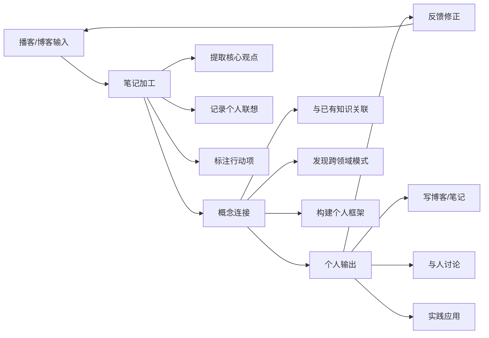

## 四、播客与博客推荐

播客和博客是思维提升的"轻量级武器"——不像书籍需要整块时间，也不像课程需要系统投入，它们可以在通勤、运动、午休等碎片时间里持续为你输送高质量的思维养料。更重要的是，播客中的真实对话和博客中的及时分析，能提供书籍无法替代的"活的思维过程"——你能听到专家如何在实时对话中组织论点、处理反驳、修正观点，这种思维的"现场感"是极其宝贵的学习素材。

### 4.1 为什么播客和博客对思维训练有独特价值

#### 4.1.1 与书籍、课程的互补关系

| 维度 | 书籍 | 在线课程 | 播客 | 博客 |
|------|------|----------|------|------|
| **深度** | 最深，系统性强 | 较深，有结构 | 中等，聚焦单一话题 | 浅到中，快速迭代 |
| **时效性** | 低（出版周期长） | 中（年度更新） | 高（周更/日更） | 最高（实时发布） |
| **思维呈现** | 成品思维 | 教学思维 | 对话思维、实时推理 | 探索思维、半成品思考 |
| **学习场景** | 需要专注时间 | 需要练习时间 | 碎片时间（通勤、运动） | 碎片时间（随时浏览） |
| **互动性** | 无 | 有限（论坛） | 低（评论区） | 中（评论、社交讨论） |
| **成本** | 低（几十元/本） | 中到高 | 免费为主 | 免费为主 |

**关键洞察**：播客最独特的价值在于它展示的是"思维的过程"而非"思维的结果"。当你听 Shane Parrish 采访一位决策科学家时，你不仅在获取知识，还在观察两个人如何在实时对话中构建论点、质疑假设、达成（或未达成）共识。这种"思维过程的旁听"对提升你自己的思维品质有直接的迁移效果。

#### 4.1.2 播客与博客各自的学习机制

**播客的学习机制——被动输入中的主动思考**：

播客看似被动（戴上耳机听就行），但高质量的播客会自然触发你的主动思考。当主持人抛出一个反直觉的观点时，你会本能地产生"真的吗？"的反应；当嘉宾用一个精彩类比解释复杂概念时，你会自然地将其与自己的知识体系关联。这种"被动触发→主动加工"的循环，是播客学习的核心机制。

**博客的学习机制——短周期的认知迭代**：

博客文章通常比书籍短得多（1000-5000字），但更新频率高得多。这意味着你可以在短时间内接触大量不同的思维角度。一篇优秀的博客文章会在10分钟内给你一个清晰的思维框架或分析工具，你可以当天就在工作中应用。这种"学→用"的短周期循环，能快速积累思维工具箱。

### 4.2 播客推荐

#### 4.2.1 第一梯队：思维提升核心播客

**1. The Knowledge Project（知识工程）**

- **主持人**：Shane Parrish（Farnam Street 创始人）
- **更新频率**：每1-2周一期
- **单集时长**：60-90分钟
- **语言**：英语
- **收听平台**：Apple Podcasts、Spotify、官网 fs.blog
- **核心价值**：这是思维提升领域公认的顶级播客。Shane Parrish 本人就是思维模型研究的标杆人物，他的采访对象横跨决策科学、行为经济学、军事战略、运动心理学、商业管理等领域。

**为什么这个播客值得排在第一位**：

Shane Parrish 的采访风格极其克制——他不会抢话，不会炫耀自己的知识，而是用精准的追问引导嘉宾展开深层思考。你会听到他问出这样的问题："你能给我一个具体的例子吗？""你是怎么知道自己错了的？""如果有人反对这个观点，他们最强的论据是什么？"这些问题本身就是批判性思维的示范。

**精选入门集**：
- 与 Daniel Kahneman 的对话：诺贝尔奖得主谈决策中的噪声与偏差
- 与 Annie Duke 的对话：职业扑克手谈不确定性下的决策
- 与 Ray Dalio 的对话：桥水基金创始人谈原则与系统思维
- 与 Angela Duckworth 的对话：坚毅（Grit）理论创始人谈刻意练习与长期主义

**学习建议**：每听完一期，用3句话总结核心观点，并写下"这对我当前面临的一个决策有什么启发"。这个简单的动作能将被动收听转化为主动学习。

**2. Farnam Street Podcast（FS播客）**

- **主持人**：Shane Parrish
- **更新频率**：不定期（月更左右）
- **单集时长**：15-40分钟
- **语言**：英语
- **核心价值**：与 The Knowledge Project 的长访谈不同，FS Podcast 更多是 Shane Parrish 的个人独白或短对话，聚焦单一思维模型或决策原则的深度解析。

**与 The Knowledge Project 的区别**：前者是"通过采访他人学习"，后者是"直接听老师讲课"。如果你时间有限，FS Podcast 的短篇幅更适合碎片化学习。

**3. Rationally Speaking（理性之声）**

- **主持人**：Julia Galef（理性主义运动代表人物）
- **更新频率**：每2-4周一期
- **单集时长**：45-70分钟
- **语言**：英语
- **收听平台**：Apple Podcasts、Spotify、官网 rationalspeakingshow.com
- **核心价值**：聚焦科学哲学、概率推理和理性思维。Julia Galef 的核心理念是"侦察兵心态"（Scout Mindset）——追求真相而非维护自我，这一理念贯穿每一期节目。

**为什么推荐**：Julia Galef 是少数能将抽象的理性主义理念转化为具体可操作建议的思想者。她擅长用生动的思想实验和现实案例来解释复杂的认知概念，比如"你如何区分'我对这件事有强烈感觉'和'我有充分理由相信这件事'？"

**精选入门集**：
- Scout Mindset vs. Soldier Mindset：侦察兵心态与士兵心态的核心区别
- How to Change Your Mind（与 Michael Shermer）：改变观念的科学方法
- Bayesian Reasoning for Everyday Life：贝叶斯推理在日常决策中的应用

**4. EconTalk**

- **主持人**：Russ Roberts（斯坦福大学胡佛研究所研究员）
- **更新频率**：每周一期
- **单集时长**：60-90分钟
- **语言**：英语
- **收听平台**：Apple Podcasts、Spotify、官网 econlib.org/econtalk
- **核心价值**：虽然名字带"Econ"，但这个播客远不止经济学。Russ Roberts 用经济学思维（激励、权衡、意外后果、知识的分散性）来分析几乎一切社会现象。他是"谦逊的认知"的典范——每一期都在展示"我可能是错的"这种思维姿态。

**为什么对思维提升有价值**：经济学思维是理解世界运作方式的底层操作系统。当你理解了激励如何塑造行为、价格如何传递信息、管制如何产生意外后果，你看待社会问题的方式会发生根本性改变。Russ Roberts 的播客不需要你有任何经济学基础，他擅长从日常现象出发，逐步引导你建立经济学直觉。

**精选入门集**：
- 与 Nassim Taleb 的多次对话：黑天鹅理论与反脆弱思维
- 与 Tyler Cowen 的对话：超级预测者与谦逊的认知
- 与 Jonathan Haidt 的对话：道德心理学与政治极化

#### 4.2.2 第二梯队：专业领域思维播客

**5. Lex Fridman Podcast**

- **主持人**：Lex Fridman（MIT 人工智能研究员）
- **更新频率**：每周1-2期
- **单集时长**：2-4小时（超长深度对话）
- **语言**：英语
- **核心价值**：Lex Fridman 的采访风格独特——极其耐心，给嘉宾充足的时间展开论述，不急于打断或转移话题。这使得每一期都像是一场完整的思维实验。嘉宾范围极广：从AI研究者到哲学家，从格斗冠军到宇航员。

**适合人群**：有一定英语基础，愿意投入2-4小时深度沉浸的听众。不适合碎片化收听——这类长对话需要你在一个相对专注的环境中聆听，才能捕捉到其中的思维精华。

**6. Huberman Lab**

- **主持人**：Andrew Huberman（斯坦福大学神经科学教授）
- **更新频率**：每周一期
- **单集时长**：90-150分钟
- **语言**：英语
- **核心价值**：虽然主打神经科学和健康，但 Huberman Lab 对思维提升的价值在于它提供了"思维的硬件基础"——你的大脑如何工作、睡眠如何影响决策、压力如何扭曲判断、注意力如何被分配。理解这些生理机制，能让你从根本上优化自己的思维条件。

**与思维提升的直接关联**：
- 睡眠集：睡眠不足会导致前额叶皮层功能下降，直接削弱你的判断力和决策质量
- 注意力集：多任务处理的神经科学证据——为什么"同时处理多件事"是一个认知幻觉
- 压力集：慢性压力如何缩小你的"认知视野"，让你倾向于短视和保守决策

**7. 80,000 Hours Podcast**

- **主持人**：Rob Wiblin（80,000 Hours 研究总监）
- **更新频率**：每月2-4期
- **单集时长**：90-180分钟
- **语言**：英语
- **核心价值**：聚焦"如何用理性思维做最重要的决策"——职业选择、慈善捐赠、全球性风险评估。嘉宾多为有效利他主义（Effective Altruism）领域的研究者，擅长用量化方法分析复杂的伦理和战略问题。

**思维训练价值**：这个播客训练的核心能力是"在极端不确定性下做高风险决策"。当你听到研究者们如何用概率推理来评估AI风险、全球流行病威胁、气候变化影响时，你会学到一套处理复杂系统的思维工具。

**8. Making Sense（原名 Waking Up）**

- **主持人**：Sam Harris（神经科学家、哲学家）
- **更新频率**：每1-2周一期
- **单集时长**：60-120分钟
- **语言**：英语
- **核心价值**：Sam Harris 是少有的能横跨神经科学、哲学和公共事务的思想者。他的播客深入探讨意识、自由意志、道德基础等根本性问题，同时也会讨论时事话题的理性分析方法。

#### 4.2.3 中文播客推荐

中文播客领域近年涌现了一批高质量的思维类节目：

**9. 忽左忽右**

- **类型**：人文历史与社会科学
- **核心价值**：深度访谈学者和作家，讨论历史事件、地缘政治、文化现象背后的思想脉络。主播程衍樑的提问风格严谨而有深度，嘉宾多为各领域的专业研究者。
- **思维训练价值**：培养历史思维——理解当下的事件如何根植于历史的结构性因素中，避免"活在当下"的认知局限。

**10. 硅谷101**

- **类型**：科技与商业思维
- **核心价值**：主播泓君深入硅谷科技圈，采访创业者、投资人和研究者，讨论技术创新、商业模式和行业趋势。
- **思维训练价值**：学习科技行业精英的决策思维和创新方法论。

**11. 声东击西**

- **类型**：社会科学与文化
- **核心价值**：两位主播从社会学、人类学、心理学等角度分析当代社会现象，风格轻松但内容扎实。
- **思维训练价值**：学习用社会科学的视角看待日常现象——什么是"常识"背后隐藏的假设。

**12. 商业就是这样**

- **类型**：商业分析
- **核心价值**：用通俗语言拆解商业案例，分析企业成功或失败背后的结构性原因。
- **思维训练价值**：培养商业直觉和系统思维——理解一个决策如何在复杂系统中产生连锁反应。

#### 4.2.4 播客对比速查表

| 播客名称 | 语言 | 时长 | 核心思维能力 | 难度 | 推荐指数 |
|----------|------|------|------------|------|---------|
| The Knowledge Project | 英语 | 60-90min | 决策、多元思维模型 | ★★★ | ★★★★★ |
| Farnam Street Podcast | 英语 | 15-40min | 思维模型、心智习惯 | ★★☆ | ★★★★☆ |
| Rationally Speaking | 英语 | 45-70min | 理性思维、概率推理 | ★★★ | ★★★★★ |
| EconTalk | 英语 | 60-90min | 经济学思维、谦逊认知 | ★★★ | ★★★★☆ |
| Lex Fridman Podcast | 英语 | 2-4h | 深度思考、跨学科 | ★★★★ | ★★★★☆ |
| Huberman Lab | 英语 | 90-150min | 神经科学基础、自控 | ★★★ | ★★★★☆ |
| 80,000 Hours | 英语 | 90-180min | 概率推理、战略决策 | ★★★★ | ★★★★☆ |
| Making Sense | 英语 | 60-120min | 哲学思维、批判性分析 | ★★★★ | ★★★★☆ |
| 忽左忽右 | 中文 | 60-90min | 历史思维、结构分析 | ★★☆ | ★★★★☆ |
| 硅谷101 | 中文 | 40-60min | 创新思维、商业判断 | ★★☆ | ★★★★☆ |
| 声东击西 | 中文 | 40-60min | 社会科学视角 | ★★☆ | ★★★☆☆ |
| 商业就是这样 | 中文 | 30-50min | 系统思维、商业分析 | ★★☆ | ★★★☆☆ |

### 4.3 博客与网站推荐

#### 4.3.1 第一梯队：思维提升核心博客

**1. Farnam Street（fs.blog）**

- **创建者**：Shane Parrish
- **更新频率**：每周1-2篇
- **文章长度**：1500-4000字
- **语言**：英语
- **核心内容**：思维模型、决策科学、终身学习、心智习惯
- **网址**：https://fs.blog

**为什么是思维提升博客的第一名**：

Farnam Street（简称FS）是互联网上将"思维模型"（Mental Models）概念普及化的最重要力量之一。Shane Parrish 的写作风格清晰、结构化、有深度——他不会用花哨的修辞来掩盖思想的空洞，每篇文章都有明确的"你读完后能做什么"的价值主张。

**必读文章系列**：
- **Mental Models：The Best Way to Make Intelligent Decisions**：思维模型的入门指南，解释什么是思维模型、为什么需要多个模型、如何建立自己的模型库
- **The Map Is Not the Territory**：关于模型与现实之间差距的深刻讨论
- **Second-Order Thinking：Thinking Ahead**：二阶思维——不仅考虑"如果我做X会怎样"，还要考虑"然后会怎样"
- **Inversion：The Power of Avoiding Stupidity**：逆向思维——有时候避免愚蠢比追求聪明更重要
- **Hanlon's Razor：Don't Attribute to Malice What Can Be Explained by Stupidity**：一个简单但强大的思维工具，帮你避免阴谋论思维

**学习建议**：FS 的文章适合反复阅读。建议用笔记工具（如Obsidian）为每篇重要文章建立一个笔记卡片，记录核心观点、个人联想和应用场景。FS 的文章库有上千篇，建议从"Mental Models"分类下按主题系统阅读。

**2. LessWrong（lesswrong.com）**

- **类型**：理性主义社区博客
- **更新频率**：每天多篇（社区贡献）
- **文章长度**：1000-10000字不等
- **语言**：英语
- **核心内容**：认知偏差、贝叶斯推理、AI对齐、理性决策、哲学分析
- **网址**：https://www.lesswrong.com

**为什么推荐**：LessWrong 是互联网上最严肃的"如何正确思考"社区。它起源于 Eliezer Yudkowsky 的理性主义序列文章（Rationality: A to Z），现在已发展为一个活跃的思想者社区，成员包括AI研究者、哲学家、统计学家和各行各业的理性思考者。

**LessWrong 的核心价值在于三个层面**：

- **认知偏差的深度解剖**：不是简单列出"确认偏差""锚定效应"这样的名词，而是深入分析偏差的心理机制、在什么条件下被触发、如何系统性地防御
- **贝叶斯思维的实践训练**：LessWrong 社区是"贝叶斯思维"最活跃的实践者群体。你会看到成员们用概率语言来表达信念（"我对此有70%的置信度"），用贝叶斯更新来处理新证据
- **高质量的社区讨论**：每篇文章下面的评论区往往是精华所在——不同背景的读者提出反驳、补充和个人经验，形成多角度的思维碰撞

**入门路径**：
- 先读 Eliezer Yudkowsky 的"Rationality: A to Z"序列（已出版为书籍《Rationality: From AI to Zombies》）
- 再读"核心序列"（Core Sequences）中的高赞文章
- 最后参与社区讨论，尝试用概率语言表达自己的信念

**注意**：LessWrong 的部分内容涉及AI对齐和人工智能安全的技术讨论，对初学者可能有一定门槛。建议先从认知偏差和决策理论的文章入手。

**3. Wait But Why（waitbutwhy.com）**

- **创建者**：Tim Urban
- **更新频率**：不定期（月更到季更）
- **文章长度**：3000-10000字（长文为主）
- **语言**：英语
- **核心内容**：用深度长文解析复杂话题，配以独特的火柴人插图
- **网址**：https://waitbutwhy.com

**为什么推荐**：Tim Urban 是那种罕见的能将复杂话题写得既深入又有趣的作者。他的文章特点是：先花大量篇幅建立基础认知框架，然后在此基础上逐步展开分析，最后给出令人印象深刻的核心洞察。

**必读文章系列**：
- **The AI Revolution**（两篇）：关于人工智能未来的深度分析，从弱AI到强AI到超级AI的发展路径
- **The Fermi Paradox**：费米悖论——为什么我们还没有发现外星文明？用系统性思维分析所有可能的解释
- **Why Procrastinators Procrastinate**：拖延症的心理机制分析，用"即时满足猴子"和"恐慌怪兽"的隐喻解释拖延的心理动态
- **How to Pick a Career**：职业选择的系统性框架

**思维训练价值**：Wait But Why 训练的核心能力是"把复杂问题拆解到最基础的组成部分，然后重新组装"。这种结构化分析能力是高阶思维的基础。

**4. Stratechery（stratechery.com）**

- **创建者**：Ben Thompson
- **更新频率**：每周3-5篇
- **文章长度**：1000-3000字
- **语言**：英语
- **核心内容**：科技行业战略分析，商业模式解构
- **网址**：https://stratechery.com（部分文章免费，深度分析需订阅）

**思维训练价值**：Ben Thompson 的分析方法论本身就是一套强大的思维工具——他会用"聚合者理论"（Aggregation Theory）、"破坏性创新"（Disruptive Innovation）、"平台vs管道"（Platform vs. Pipeline）等框架来解构科技公司的战略决策。长期阅读 Stratechery，你会逐渐内化这些分析框架，用于理解任何行业的竞争格局。

**5. Ribbonfarm（ribbonfarm.com）**

- **创建者**：Venkatesh Rao
- **更新频率**：不定期
- **文章长度**：2000-8000字
- **语言**：英语
- **核心内容**：组织理论、认知框架、战略思维、技术哲学
- **网址**：https://ribbonfarm.com

**为什么推荐**：Venkatesh Rao 是那种"一篇改变你思维方式"的作者。他的核心概念"证伪主义游戏"（The Gervais Principle）和"狼群、羊群和游戏者"的组织分析框架，提供了一种理解组织中人类行为的独特视角。他的文章难度较高，但读通之后对你的思维层次提升是质的飞跃。

#### 4.3.2 第二梯队：专业思维博客

**6. Brain Pickings / The Marginalian（themarginalian.org）**

- **创建者**：Maria Popova
- **核心内容**：跨学科的思想探索——科学、哲学、文学、艺术的交叉点
- **思维训练价值**：培养"跨领域连接"的能力——Maria Popova 擅长在看似无关的领域之间找到深层联系，这是创造力的重要来源。

**7. Scott Adams Blog（blog.dilbert.com）**

- **创建者**：Scott Adams（《呆伯特》漫画作者）
- **核心内容**：说服力、概率思维、系统性观察
- **思维训练价值**：Scott Adams 的"大炮筒理论"（Clown World）和对说服力的分析有独到之处，尤其适合对心理学和修辞学感兴趣的读者。

**8. Gwern.net（gwern.net）**

- **创建者**：Gwern Branwen
- **核心内容**：统计学、自实验、暗网研究、AI、深度长文
- **思维训练价值**：Gwern 是互联网上最严谨的独立研究者之一。他的文章特点是：极其详细的参考文献、严格的统计方法、诚实的不确定性表达。阅读 Gwern 能训练你"如何做严谨的独立研究"。

**9. Slate Star Codex / Astral Codex Ten（astralcodexten.substack.com）**

- **创建者**：Scott Alexander（精神科医生）
- **核心内容**：统计分析、社会科学研究的元分析、哲学思辨、时事评论
- **思维训练价值**：Scott Alexander 的核心能力是"用统计思维质疑流行叙事"。当你读到他如何拆解一篇声称"XX导致YY"的研究论文时，你会学到评估证据质量的具体方法。

#### 4.3.3 中文思维类博客与平台

**10. 万维钢（精英日课 / 得到App）**

- **核心内容**：科学思维、英文新书解读、理性分析
- **思维训练价值**：万维钢（同人于野）是中文世界中最优秀的科学思维传播者之一。他的"精英日课"系列将英文世界最新的科学发现和思维工具翻译成通俗易懂的中文，对中文读者的思维提升有直接的帮助。

**11. 刘擎（得到App / 公众号）**

- **核心内容**：哲学思维、思想史、现代社会分析
- **思维训练价值**：刘擎教授擅长用哲学框架分析当代社会问题，帮助读者建立"概念清晰、逻辑严谨"的思考习惯。

**12. 知乎高质量专栏**

- **推荐关注方向**：认知科学、心理学、经济学、逻辑学相关话题下的高赞回答
- **筛选标准**：优先关注有学术背景的答主（标注了大学/研究机构的用户），避免"民科"和营销号
- **思维训练价值**：知乎的优势在于中文原创内容的丰富性，但需要读者具备一定的筛选能力

**13. 少数派（sspai.com）**

- **核心内容**：效率工具、工作方法论、数字生活
- **思维训练价值**：虽然主打效率工具，但少数派上有大量关于"如何学习""如何思考""如何管理知识"的深度文章，对建立个人学习系统有实际帮助。

#### 4.3.4 博客对比速查表

| 博客/网站 | 语言 | 更新频率 | 核心思维能力 | 深度 | 推荐指数 |
|-----------|------|---------|------------|------|---------|
| Farnam Street | 英语 | 周更 | 思维模型、决策 | ★★★★ | ★★★★★ |
| LessWrong | 英语 | 日更 | 理性思维、贝叶斯 | ★★★★★ | ★★★★★ |
| Wait But Why | 英语 | 月更 | 结构化分析 | ★★★★ | ★★★★★ |
| Stratechery | 英语 | 周更3-5篇 | 战略思维、商业分析 | ★★★★ | ★★★★☆ |
| Ribbonfarm | 英语 | 不定期 | 组织理论、认知框架 | ★★★★★ | ★★★★☆ |
| The Marginalian | 英语 | 周更 | 跨学科连接 | ★★★☆ | ★★★★☆ |
| Gwern.net | 英语 | 不定期 | 严谨研究、统计 | ★★★★★ | ★★★★☆ |
| Astral Codex Ten | 英语 | 周更 | 统计批判、元分析 | ★★★★ | ★★★★☆ |
| 万维钢/精英日课 | 中文 | 日更 | 科学思维 | ★★★☆ | ★★★★☆ |
| 刘擎/得到 | 中文 | 周更 | 哲学思维 | ★★★★ | ★★★★☆ |
| 少数派 | 中文 | 日更 | 效率与方法论 | ★★★☆ | ★★★☆☆ |

### 4.4 如何高效利用播客进行思维训练

#### 4.4.1 被动收听 vs. 主动收听

大多数人的播客使用方式是"被动收听"——戴上耳机，边走边听，听完就忘。这能提供一定的信息输入，但对思维训练的效果极其有限。

**主动收听的核心方法——"三层听书法"**：

**第一层：信息层**——"他说了什么？"
- 在收听过程中，识别每一段对话的核心信息点
- 用播客App的"标记"或"剪辑"功能记录精彩片段的位置
- 通勤结束后，用1-2句话概括每段对话的核心内容

**第二层：结构层**——"他怎么说的？"
- 关注嘉宾如何组织论点——先提问题，再给背景，然后展开分析
- 注意主持人的追问方式——哪些问题推动了对话的深度
- 识别修辞手法——类比、反问、举例、数据引用的使用时机

**第三层：元认知层**——"这改变了我什么想法？"
- 反思：听完后，我之前的某个信念是否需要修正？
- 关联：这个观点与我已知的哪些知识有联系或冲突？
- 应用：我可以在什么场景下使用这个思维工具？

#### 4.4.2 播客笔记的最佳实践

**播客笔记模板**：

```markdown
## [播客名] - [集名] - [日期]

### 核心观点（3句话以内）
- 

### 最有价值的思维工具/框架
- 名称：
- 定义：
- 适用场景：
- 例子：

### 与我现有知识的连接
- 与 [X] 概念的联系：
- 与 [Y] 经验的印证/冲突：

### 行动项
- [ ] 

### 精彩语录（带时间戳）
> "[引用]" —— [嘉宾名] @ 00:32:15
```

**工具推荐**：
- **Snipd**：AI驱动的播客笔记工具，支持自动生成时间戳和摘要
- **Airr**：支持从播客中"摘录"精彩片段并添加笔记
- **Obsidian + 播客笔记模板**：手动但最灵活，与个人知识库无缝整合

#### 4.4.3 建立播客学习的节奏

**入门阶段（第1-2周）**：
- 每天听30-45分钟（通勤时间即可）
- 选择1个核心播客（推荐 The Knowledge Project）
- 不做笔记，先建立收听习惯

**进阶阶段（第3-6周）**：
- 增加到2个播客（1个英语 + 1个中文）
- 开始使用"三层听书法"
- 每周完成1份播客笔记

**高级阶段（第7周以后）**：
- 根据兴趣扩展到3-4个播客
- 建立个人播客笔记库
- 开始在对话或写作中引用播客中的观点
- 尝试用播客中学到的思维工具解决实际问题

### 4.5 如何高效利用博客进行思维训练

#### 4.5.1 RSS：信息聚合的最高效方式

在社交媒体算法推荐的时代，RSS（Really Simple Syndication）仍然是最高效的信息获取方式——你主动订阅你信任的信息源，而不是被动接受算法推送的内容。

**为什么RSS比社交媒体更好**：

| 维度 | RSS | 社交媒体 |
|------|-----|---------|
| 信息控制 | 你选择信息源 | 算法选择给你看什么 |
| 信息质量 | 稳定（取决于你选的源） | 不稳定（算法优化参与度，不是质量） |
| 注意力消耗 | 低（集中阅读） | 高（无限滚动、通知干扰） |
| 深度阅读 | 支持（全文订阅） | 不支持（标题党、碎片化） |
| 信息焦虑 | 低（读不完也没关系） | 高（FOMO、刷不完的信息流） |

**推荐RSS阅读器**：
- **Feedly**（Web/iOS/Android）：最流行的RSS阅读器，免费版支持100个订阅源，AI功能可帮你筛选重要文章
- **Inoreader**（全平台）：功能更强大，支持高级过滤规则，免费版即可满足大多数需求
- **NetNewsWire**（macOS/iOS）：开源免费，界面简洁，适合苹果生态用户
- **Miniflux**（自托管）：极简设计，适合有技术能力的用户自行部署

#### 4.5.2 博客深度阅读的方法

**SQ3R博客阅读法**（改编自经典学习方法）：

1. **Survey（浏览）**：花2分钟快速浏览全文——看标题、副标题、加粗文字、图片、结论段
2. **Question（提问）**：基于浏览内容，提出2-3个你想在这篇文章中找到答案的问题
3. **Read（精读）**：带着问题仔细阅读全文，在关键段落做标记
4. **Recite（复述）**：读完后，合上文章，用自己的话复述核心观点（写下来或说出来）
5. **Review（回顾）**：一周后回顾笔记，检查自己还记得多少

#### 4.5.3 建立"思维工具箱"笔记系统

每读一篇高质量的博客文章，提取出一个"思维工具"并记录到你的个人工具箱中：

```markdown
## [工具名称] - 来自 [来源]

### 一句话定义
[用一句话说明这个工具是什么]

### 适用场景
- [场景1]
- [场景2]

### 使用步骤
1. [第一步]
2. [第二步]
3. [第三步]

### 例子
[用一个真实场景演示如何使用]

### 局限性
[这个工具在什么情况下不适用]

### 来源链接
[原文URL]
```

**示例——"逆向思维"工具卡片**：

```markdown
## 逆向思维（Inversion） - 来自 Farnam Street

### 一句话定义
不仅思考"如何成功"，更要思考"什么会导致失败"，然后避免那些失败因素。

### 适用场景
- 项目规划时评估风险
- 做重要决策前排查盲点
- 学习新领域时建立全面认知

### 使用步骤
1. 明确你的目标（比如"我想让这个项目成功"）
2. 翻转问题（"什么会让这个项目彻底失败？"）
3. 列出所有可能导致失败的因素
4. 针对每个失败因素，制定预防措施
5. 优先处理最可能发生的失败因素

### 例子
查理·芒格的名言："反过来想，总是反过来想。"
如果你想知道如何幸福，先研究什么会导致不幸；
如果你想投资成功，先研究什么会导致投资失败。

### 局限性
- 可能导致过度保守（只关注风险而忽视机会）
- 对于全新领域，你可能不知道"失败"长什么样

### 来源链接
https://fs.blog/inversion/
```

### 4.6 常见误区与纠正方法

#### 误区一：收藏=学习

**症状**：收藏了100个播客和博客，标记了200篇"稍后阅读"的文章，但从未真正读完任何一篇。

**根源**：这是一种"信息囤积"心理——收藏的动作给了你一种"我在学习"的错觉，实际上只是在缓解知识焦虑。

**纠正方法**：
- 每周只选1-2篇深度阅读，读完并做笔记
- 设置"收藏夹清理日"——每月清理一次，超过3个月没读的直接删除
- 用"二分钟法则"——如果一篇文章2分钟内读不完且对当前工作无直接帮助，不收藏

#### 误区二：只听/读不输出

**症状**：大量输入信息，但从不写笔记、不做总结、不与人讨论、不实践应用。

**根源**：被动输入是最轻松的学习方式，但也是最低效的。没有输出的学习，信息留存率通常低于10%。

**纠正方法**：
- 强制输出：每听3期播客写1篇听后感，每读5篇博客写1篇总结
- 费曼技巧：尝试向一个不了解这个话题的人解释你学到的内容
- 社交学习：在社交媒体或学习社区中分享你的观点，接受反馈

#### 误区三：信息源过于单一

**症状**：只听一个播客、只读一个博客，导致思维视野狭窄。

**根源**：人天然倾向于接触与自己观点一致的内容（确认偏差），导致信息茧房。

**纠正方法**：
- 确保你的信息源组合中包含至少2个不同领域的来源
- 刻意订阅1-2个与你观点不同的信息源
- 定期（每季度）审视你的信息源组合，淘汰质量下降的，补充新的

#### 误区四：追求"最新"而非"最好"

**症状**：总是追最新的播客集、最新的博客文章，而忽略了经典内容的深度学习。

**根源**：新鲜感带来的多巴胺奖励让人上瘾，但最新不等于最有价值。

**纠正方法**：
- 对每个推荐的信息源，先系统阅读/收听其"经典内容"（高赞、被引用最多的）
- 设置"旧文回顾日"——每周花30分钟重读一篇过去的经典文章
- 用"新旧3:1"法则——每读3篇新文章，就重读1篇旧的

#### 误区五：英语障碍导致放弃

**症状**：想读英文博客/听英文播客，但因为语言障碍频繁受挫，最终放弃。

**根源**：高估了英语水平的门槛要求。

**纠正方法**：
- 播客：从1倍速开始，配合文字稿（很多播客提供transcript），逐步提高到1.25倍速
- 博客：用浏览器翻译插件辅助阅读，先读中译版理解框架，再读原文学英语
- 渐进式过渡：先从中文内容建立基础概念，再用英文内容深化理解
- 工具推荐：沉浸式翻译（Immersive Translate）浏览器插件，支持双语对照阅读

### 4.7 从信息消费者到知识创造者

播客和博客的最终价值不仅在于"你学到了什么"，还在于"你创造了什么"。

#### 4.7.1 建立个人知识输出循环

**输入→加工→输出的完整链条**：



#### 4.7.2 输出形式建议

| 输出形式 | 难度 | 影响力 | 学习效果 | 适合阶段 |
|----------|------|--------|---------|---------|
| 个人笔记 | ★☆☆ | ★☆☆ | ★★★ | 入门 |
| 社交媒体分享 | ★☆☆ | ★★☆ | ★★☆ | 入门 |
| 学习小组讨论 | ★★☆ | ★★☆ | ★★★★ | 进阶 |
| 博客文章 | ★★★ | ★★★★ | ★★★★★ | 进阶 |
| 播客/视频 | ★★★★ | ★★★★★ | ★★★★★ | 高级 |

#### 4.7.3 "20分钟法则"

每花60分钟在播客/博客输入上，至少花20分钟做输出——可以是写一段笔记、发一条社交媒体分享、与朋友讨论一个观点。这个简单的比例法则能确保你不是在"信息消费的跑步机"上空转。

### 4.8 学习路径建议

#### 阶段一：建立习惯（第1-4周）

**目标**：养成定期收听播客和阅读博客的习惯

**行动清单**：
- [ ] 选择1个核心播客（推荐 The Knowledge Project 或 忽左忽右）
- [ ] 安装RSS阅读器，订阅3-5个核心博客
- [ ] 每天固定30分钟播客时间（通勤、午休、运动）
- [ ] 每天花15分钟浏览RSS阅读器
- [ ] 不做笔记要求——先建立习惯

#### 阶段二：提升效率（第5-12周）

**目标**：从被动消费转向主动学习

**行动清单**：
- [ ] 引入"三层听书法"，开始做播客笔记
- [ ] 对博客文章使用SQ3R阅读法
- [ ] 建立"思维工具箱"笔记系统
- [ ] 每周完成1份播客笔记 + 1份博客笔记
- [ ] 开始尝试在日常对话中引用学到的观点

#### 阶段三：深度整合（第13周以后）

**目标**：将播客/博客中的思维工具内化为自己的能力

**行动清单**：
- [ ] 扩展到3-4个播客 + 5-8个博客的信息源组合
- [ ] 建立定期输出机制（博客、社交媒体、学习小组）
- [ ] 每季度审视并优化信息源组合
- [ ] 开始尝试跨领域连接——用A领域的框架分析B领域的问题
- [ ] 将最佳实践整理为个人的"思维原则清单"

***

> **本节核心要点**：播客和博客是思维提升的"日常训练场"。选择3-5个高质量的信息源，用主动学习的方式（而非被动消费）去吸收，并建立输出循环来巩固所学——这比收藏100个播客和博客但一个都不深入有效得多。信息时代的核心能力不是获取信息（信息已经过剩），而是筛选、加工和应用信息的能力。
