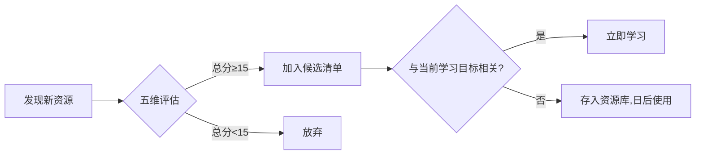
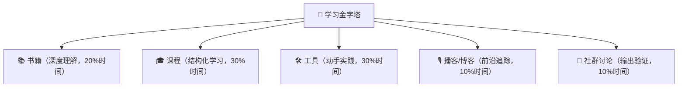
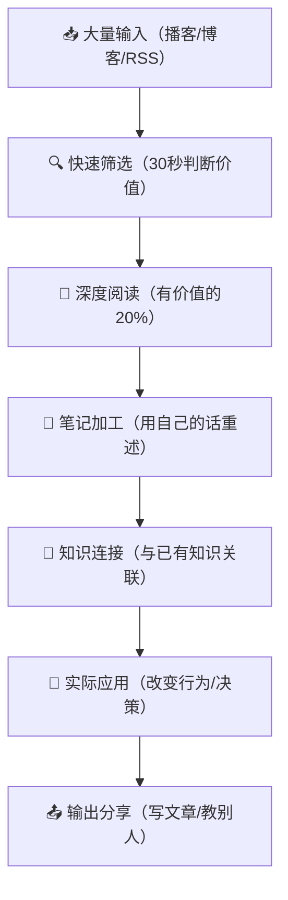
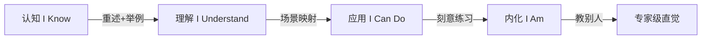
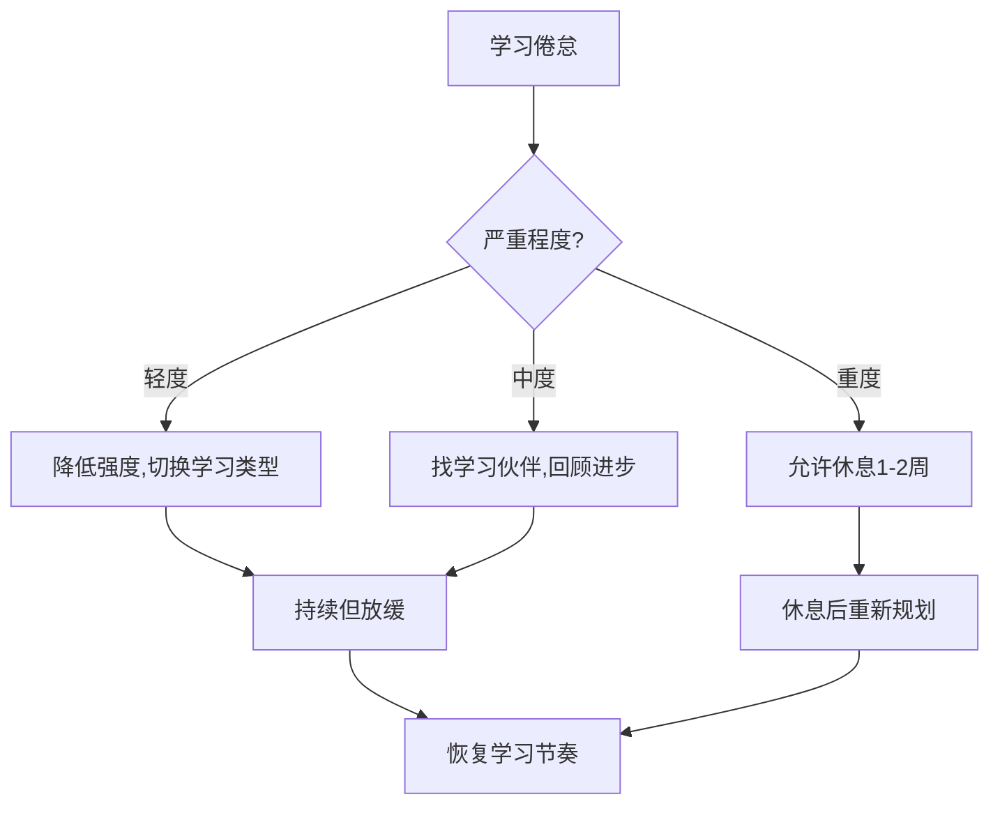

## 五、学习资源使用建议

前面四节推荐了大量学习资源——经典书籍、在线课程、数字工具、播客与博客。但资源本身不等于能力，**如何使用资源**才是决定学习效果的关键变量。很多人买了几十本书、收藏了上百个课程，却始终停留在"知道"层面，从未进入"做到"层面。

本节提供一套完整的学习资源使用框架：从评估筛选、体系搭建、分类型使用策略，到知识内化、效果追踪、常见误区纠正，帮助你把每一分钟的学习投入转化为可衡量的思维能力提升。

### 5.1 资源评估：如何判断一个学习资源值不值得投入

在投入时间之前，先学会评估资源质量。思维提升类资源质量参差不齐，一个低质量资源不仅浪费时间，还可能传递错误的思维框架。

#### 5.1.1 五维评估模型

用以下五个维度对任何学习资源打分（每项1-5分），总分低于15分的资源不值得投入：

| 维度 | 评估标准 | 高分特征 | 低分特征 |
|------|----------|----------|----------|
| **权威性** | 作者/机构的专业背景 | 学术研究者、行业实践者、有实证支撑 | 无专业背景、纯经验分享、标题党 |
| **系统性** | 内容是否有完整知识框架 | 有清晰的理论体系和递进结构 | 碎片化知识点、东拼西凑 |
| **实操性** | 是否提供可执行的方法论 | 有具体步骤、练习、案例 | 纯理论、空泛建议、只有"心法" |
| **时效性** | 内容是否跟上最新发展 | 引用近5年研究、更新维护 | 引用过时理论、长期未更新 |
| **适配性** | 是否匹配你的当前水平 | 有难度分级、前置知识说明 | 要么太浅要么太深、无定位说明 |



#### 5.1.2 快速筛选技巧

当你面对大量资源需要快速决策时，以下技巧能帮你在5分钟内判断资源质量：

**书籍类**：看目录结构是否逻辑清晰，随机翻阅3个章节看论证深度，检查参考文献数量和质量（一本思维类好书通常有50+条参考文献），看再版次数和印次。

**课程类**：看课程大纲是否有递进关系，查看学员评价中的具体内容（不要只看好评率），试听第一节课和中间一节课看质量是否稳定，看讲师是否回应学员问题。

**播客/博客类**：看最近10篇内容的深度是否稳定，检查信息来源是否标注，看评论区讨论质量（高质量内容吸引高质量读者），看更新频率是否稳定。

**工具类**：看用户社区活跃度，检查文档完善程度，看是否有持续更新记录，试用核心功能是否真正解决问题。

#### 5.1.3 资源库的分类管理

建立一个个人资源库，用以下分类法管理：

资源库/
├── 待评估/          # 新发现的资源，等待五维评估
├── 当前学习/        # 正在使用的核心资源（不超过5个）
├── 已完成/          # 学完的资源，附带个人评价和关键收获
├── 队列中/          # 评估通过但尚未开始的资源
└── 归档/            # 不适合当前阶段，但未来可能有用的资源

推荐使用 Notion 或 Obsidian 建立资源数据库，每条记录包含：资源名称、类型、评分、状态、开始/完成日期、核心收获摘要、推荐指数（1-5星）。

### 5.2 构建个人学习体系

#### 5.2.1 学习金字塔：资源类型的合理配比

不同类型的学习资源对应不同的学习深度。一个完整的学习体系应该按金字塔结构配比各类型资源：



**时间分配建议**：

| 学习阶段 | 书籍占比 | 课程占比 | 工具占比 | 播客/博客占比 | 社群占比 |
|----------|----------|----------|----------|---------------|----------|
| 入门期（0-3个月） | 10% | 40% | 20% | 15% | 15% |
| 成长期（3-12个月） | 20% | 30% | 30% | 10% | 10% |
| 进阶期（1-3年） | 30% | 15% | 30% | 15% | 10% |
| 精通期（3年+） | 40% | 10% | 20% | 15% | 15% |

入门期课程占比最高，因为需要结构化引导；进阶期书籍占比上升，因为需要深度理论支撑；精通期社群讨论占比上升，因为需要通过教学和辩论来深化理解。

#### 5.2.2 建立"T型学习结构"

高效的思维提升需要"T型知识结构"——横向广泛涉猎多个思维领域，纵向在1-2个领域深入专精。

**横向（广度）**：每个思维分支（批判性思维、系统思维、创造性思维、概率思维等）都至少读1本入门书、听3-5个相关播客，建立基本认知地图。

**纵向（深度）**：选择与你当前工作/生活最相关的1-2个方向，深入学习3-5本进阶书籍，完成1-2门系统课程，掌握2-3个专业工具。

**判断自己该深入哪个方向的方法**：
1. 列出你当前面临的最大挑战（工作决策、创意产出、问题分析等）
2. 回顾过去3个月你反复遇到的思维瓶颈
3. 看哪个方向的学习让你最有"啊哈"时刻
4. 这三个答案的交集就是你该深入的方向

#### 5.2.3 学习节奏设计

不要试图同时学习所有资源。设计一个可持续的学习节奏：

**周计划模板**：
- **周一至周五**：每天30-60分钟深度学习（书籍/课程）
- **通勤时间**：听播客或音频课程（碎片化输入）
- **周六上午**：2-3小时实践时间（用工具练习、做案例分析）
- **周日下午**：1小时回顾与笔记整理

**月计划模板**：
- **第1周**：新知识输入（阅读/课程）
- **第2周**：深化理解（做笔记、画思维导图、写摘要）
- **第3周**：实践应用（在实际场景中使用所学）
- **第4周**：输出分享（写文章、教别人、参加讨论）

**季度里程碑**：
- 每季度末回顾学习进度，评估是否需要调整方向
- 完成一份"学习成果报告"：学了什么、用了什么、改变了什么
- 根据评估结果调整下一季度的学习计划

### 5.3 分类型使用策略

#### 5.3.1 书籍使用策略：从"读过"到"读懂"再到"用会"

大多数人读书的效率只有理想效率的20-30%，因为他们只做了"阅读"这个动作，没有做"加工"和"输出"。

**四层阅读法**：

| 层级 | 目标 | 方法 | 时间投入 |
|------|------|------|----------|
| **检视阅读** | 判断这本书值不值得深读 | 30分钟翻完目录、前言、每章开头和结尾 | 30分钟 |
| **分析阅读** | 理解作者的核心论点和论证结构 | 逐章精读，做批注，画结构图 | 3-8小时 |
| **主题阅读** | 围绕一个主题对比多本书的观点 | 同时读3-5本同类书，制作对比表 | 2-4周 |
| **实践阅读** | 将书中的方法应用到实际场景 | 选1-3个核心方法，设计实验并执行 | 持续 |

**读书笔记模板**：

```markdown
## 《书名》读书笔记

### 基本信息
- 作者：
- 阅读日期：
- 推荐指数：⭐⭐⭐⭐⭐ (1-5)
- 一句话总结：

### 核心论点（作者最想说的3件事）
1.
2.
3.

### 对我最有启发的5个观点
1. [观点] → [我如何应用到自己的场景]
2. ...

### 我不同意的地方
1. [观点] → [我的理由和反例]

### 行动清单
- [ ] [具体可执行的下一步行动]
- [ ] ...

### 与其他书的关联
- 与《XX书》的第X章观点一致/矛盾，区别在于...
```

**关键原则**：读完一本书后，必须产出至少1个可执行的行动项。如果读完一本书却说不出"我要因此改变什么行为"，这本书等于白读。

#### 5.3.2 课程使用策略：从"看视频"到"构建能力"

在线课程最大的陷阱是"被动观看"——你感觉自己在学习，但大脑并没有真正参与。以下是将课程学习效果提升3-5倍的方法：

**学习前**：
1. 先通读课程大纲，标记你已经掌握的部分（跳过）和薄弱的部分（重点学）
2. 带着问题学：写下3个你希望通过这门课回答的具体问题
3. 准备好实践环境：如果课程涉及工具，提前安装好

**学习中**：
1. 每看完一个章节（15-20分钟），暂停视频，用自己的话复述核心内容
2. 每完成一个模块，做一个小练习或案例分析
3. 遇到不懂的地方，先标记，继续往后看，很多疑问会在后续内容中解答
4. 把课程中的概念与你已有的知识建立联系（"这和我之前学的XX有什么关系？"）

**学习后**：
1. 整理课程笔记，画出整门课的知识结构图
2. 找一个实际问题，用课程中学到的方法去分析
3. 把你的分析写成文章或分享给同事/朋友
4. 3个月后回顾课程笔记，看哪些内容真正影响了你的行为

**课程完成率提升技巧**：
- 设定固定学习时间（如每天早上7:00-7:30），形成习惯
- 找一个学习伙伴，互相监督进度
- 把大课程拆成小目标，每完成一个模块给自己小奖励
- 如果课程太长，优先学与你当前需求最相关的模块，不必按顺序学

#### 5.3.3 工具使用策略：从"试用"到"精通"

思维工具（如思维导图、决策矩阵、系统图等）的价值在于使用频率。一个你每天用的简单工具，比一个你一年用一次的高级工具有价值得多。

**工具学习的三个阶段**：

| 阶段 | 目标 | 方法 | 时间 |
|------|------|------|------|
| **入门** | 能用工具完成基本任务 | 跟着官方教程做3个练习 | 1-2天 |
| **熟练** | 能在日常工作中自然使用 | 每天至少用一次，持续2周 | 2周 |
| **精通** | 能用工具解决复杂问题 | 学习高级功能，尝试创新用法 | 持续 |

**工具选择原则**：
- 选择学习曲线平缓的工具，先用起来再追求功能强大
- 同类工具只选1-2个，深入使用，不要在多个工具间跳来跳去
- 优先选择有活跃社区的工具，遇到问题能找到解答
- 选择能与其他工具集成的工具，构建个人工作流

#### 5.3.4 播客/博客使用策略：从"消遣"到"系统输入"

播客和博客是碎片化学习资源，但碎片化不等于随意化。以下方法能让碎片化输入产生系统化价值：

**播客使用方法**：
1. 建立固定收听场景（通勤、做家务、运动时）
2. 收听前看一眼节目简介，带着问题听
3. 听到有价值的点，用手机语音备忘录快速记录
4. 每周整理一次播客笔记，提取核心观点
5. 每月回顾本月播客笔记，提炼趋势和模式

**博客使用方法**：
1. 用 RSS 阅读器（如 Feedly、Inoreader）订阅，不要依赖社交媒体推送
2. 建立分类文件夹：必读、选读、存档
3. 每篇文章花30秒判断是否值得深读（看标题、开头、小标题）
4. 值得深读的文章做高亮批注，存入笔记系统
5. 每月整理一次博客笔记，与书籍笔记交叉引用

**信息输入的"漏斗模型"**：



### 5.4 知识内化的四阶段模型

学习的终极目标不是"知道"，而是"内化"——让新的思维模式成为你下意识的反应。知识内化需要经历四个阶段：

#### 5.4.1 阶段一：认知（I Know）

**特征**：能复述概念，但不会主动使用
**表现**：别人问起时能解释，但遇到实际问题时想不起来用
**停留时间**：大部分学习者停留在这个阶段
**突破方法**：做笔记时不要抄原文，用自己的话重述，并举一个自己的例子

#### 5.4.2 阶段二：理解（I Understand）

**特征**：能解释原理，知道什么时候该用
**表现**：看到相关场景能识别出来，但需要刻意提醒自己
**突破方法**：做"场景-工具"映射表，列出你常见的5种决策场景和对应的思维工具

#### 5.4.3 阶段三：应用（I Can Do）

**特征**：遇到相关场景能自动调用
**表现**：不需要提醒，自然地使用正确的思维框架
**突破方法**：设计"刻意练习"——每周选一个真实问题，用新学的思维工具去分析，写分析报告

#### 5.4.4 阶段四：内化（I Am）

**特征**：思维模式已融入直觉
**表现**：不需要工具也能做出高质量判断，只是事后能解释自己用了什么框架
**突破方法**：教别人——当你能把一个概念教会一个完全不懂的人，说明你已经真正内化了



**每个阶段的典型时间**：认知→理解：1-2周主动学习；理解→应用：1-3个月刻意练习；应用→内化：6-12个月持续使用。不要急于求成，也不要停留在认知阶段不往前走。

### 5.5 避免学习资源使用的常见误区

#### 误区一：资源收藏癖（Shiny Object Syndrome）

**症状**：不断收藏新资源，但永远不开始学。收藏夹里有200个链接，书架上有50本未拆封的书。

**根因**：收藏资源时产生了一种"虚假的学习成就感"——大脑把"收藏"等同于"学习了"，获得多巴胺奖励后就不再有动力真正学习。

**纠正方法**：
1. 实行"一进一出"规则：开始一个新资源之前，必须先完成一个旧资源
2. 设定资源上限：当前在学的资源不超过5个
3. 每月清理一次收藏夹：超过3个月没看的资源直接删除，真需要时你会再找到
4. 把收藏的冲动转化为行动：看到好资源，立即安排15分钟试读，而不是先收藏

#### 误区二：被动消费（Passive Consumption）

**症状**：看了很多视频、听了很多播客，但不做笔记、不思考、不应用。感觉自己很努力，但能力没有提升。

**根因**：被动消费是最舒适的学习方式，但它产生的学习效果最低。研究表明，被动听讲的知识留存率只有5%，而主动实践的留存率高达75%。

**纠正方法**：
1. 每次学习都带着一个具体问题
2. 学习过程中每15-20分钟暂停一次，用自己的话总结
3. 学完后立即做一个小练习或写一段总结
4. 采用"费曼学习法"：学完一个概念后，假装要给一个完全不懂的人讲解，用最简单的语言

#### 误区三：追求完美体系（Analysis Paralysis）

**症状**：花大量时间设计"完美的学习计划"，却迟迟不开始执行。总觉得"再看一篇攻略"、"再选一个更好的工具"就能事半功倍。

**根因**：对不确定性的恐惧。设计计划给人一种掌控感，但计划本身不产生学习效果。

**纠正方法**：
1. 接受"不完美的开始"比"完美的计划"更有价值
2. 用"5分钟规则"：任何资源，先学5分钟，如果不想继续就换一个
3. 设定"最小学习单元"：每天至少学习15分钟，不设上限
4. 计划只做周级别，不要做月级别的详细计划（变化太多，计划会过时）

#### 误区四：只输入不输出（Input Without Output）

**症状**：读了很多书、上了很多课，但从不写文章、不做分享、不教别人。总觉得"我还没学够，等学够了再输出"。

**根因**：输出比输入痛苦得多——它需要你真正理解并组织知识。回避痛苦导致无限期推迟输出。

**纠正方法**：
1. 从低门槛输出开始：写一条朋友圈、在群里分享一个观点
2. 建立"输出倒逼输入"机制：每周写一篇300字的学习笔记
3. 找一个学习伙伴，每周互相分享一个学到的新概念
4. 记住：输出不是学习的结果，而是学习最有效的方式

#### 误区五：忽视遗忘曲线（Ignoring Spaced Repetition）

**症状**：学完一个概念，过两周就忘得差不多了。反复学同样的内容，效率极低。

**根因**：大脑按照遗忘曲线自动清理不常用的记忆。一次性学习不做复习，30天后只能记住约20%。

**纠正方法**：
1. 使用间隔重复工具（如 Anki）制作关键概念卡片
2. 按照"1天-3天-7天-14天-30天"的间隔安排复习
3. 每月花2小时回顾过去一个月的学习笔记
4. 在新学习中刻意引用旧知识（"这个概念和我之前学的XX有什么关系？"）

### 5.6 学以致用：从知识到行为改变的完整流程

学习的最终目标是行为改变。以下是一个从学习到行为改变的完整流程，每个步骤都有具体操作：

#### 5.6.1 识别应用场景

学完一个思维方法后，立即列出3个你可以在本周使用的场景：

- **工作场景**：下次做决策时用决策矩阵分析选项
- **生活场景**：下次和人争论时练习"钢铁人论证"（先准确复述对方观点再反驳）
- **学习场景**：下次读文章时练习识别逻辑谬误

#### 5.6.2 设计最小实验

不要试图一次性改变所有行为。设计一个"最小可行实验"：

```markdown
## 实验卡片

### 学到的概念
[概念名称]

### 实验假设
如果我在 [具体场景] 中使用 [具体方法]，那么 [预期结果]

### 实验设计
- 时间：[什么时候做]
- 地点：[在哪里做]
- 具体步骤：[1. 2. 3.]
- 观察指标：[怎么判断有没有效果]

### 实验结果
- 实际发生了什么：
- 与预期的差异：
- 学到了什么：

### 下一步
- [ ] 继续使用这个方法
- [ ] 调整方法后再试
- [ ] 这个方法不适合我，换一个
```

#### 5.6.3 建立反馈循环

行为改变需要持续的反馈。建立以下反馈机制：

**自我反馈**：每周日晚上花15分钟回顾本周的"思维实验"，记录成功和失败的案例。

**他人反馈**：找一个信任的朋友或同事，定期讨论你在学习的思维方法，请他们观察你的变化并给出反馈。

**数据反馈**：如果可能，用数据追踪你的变化。例如，记录你每周做出的"高质量决策"数量，或你发现并指出的"逻辑谬误"数量。

#### 5.6.4 从刻意到自然

任何新行为都要经历"刻意→熟练→自然"三个阶段：

1. **刻意阶段**（1-4周）：每次使用都需要提醒自己，速度慢，感觉不自然。这是正常的，坚持下去。
2. **熟练阶段**（1-3个月）：能在大多数相关场景中使用，偶尔忘记。开始感觉轻松。
3. **自然阶段**（3个月+）：不需要提醒就能自动使用，已经成为你的思维习惯。

### 5.7 效果追踪与学习复盘

#### 5.7.1 学习追踪指标

| 指标 | 衡量方法 | 追踪频率 |
|------|----------|----------|
| **输入量** | 读了几本书/完成了几门课/听了几个播客 | 每月 |
| **输出量** | 写了几篇笔记/文章/做了几次分享 | 每月 |
| **应用次数** | 在实际场景中使用新思维方法的次数 | 每周 |
| **决策质量** | 回顾重要决策的正确率变化 | 每季度 |
| **思维速度** | 分析复杂问题所需的时间变化 | 每季度 |
| **认知偏差识别** | 发现自己或他人认知偏差的频率 | 每月 |

#### 5.7.2 月度学习复盘模板

每月花1小时做一次学习复盘，回答以下问题：

```markdown
## 月度学习复盘 —— [月份]

### 本月学习概览
- 读了什么书/课程/播客？（列出清单）
- 总学习时间约多少小时？

### 最大的3个收获
1. [收获] → [如何改变了我的行为/决策]
2. ...
3. ...

### 最有效的学习方法
本月哪种学习方式让我收获最大？为什么？

### 遇到的困难
- 学习上的困难：
- 应用上的困难：

### 下月计划调整
- 继续做的事情：
- 停止做的事情：
- 新增的事情：

### 学习状态自评
- 动力水平：1-10
- 理解深度：1-10
- 实践频率：1-10
- 总体满意度：1-10
```

#### 5.7.3 季度深度复盘

每季度做一次更深度的复盘，重点回答：

1. **能力变化**：我的思维能力相比3个月前有什么可衡量的变化？
2. **行为改变**：我养成了哪些新的思维习惯？放弃了哪些旧的思维模式？
3. **瓶颈识别**：我当前最大的思维瓶颈是什么？下一步应该学什么？
4. **资源评价**：过去3个月的学习资源中，哪些真正有价值？哪些浪费了时间？

### 5.8 不同阶段的学习路线建议

#### 5.8.1 零基础入门（0-3个月）

**目标**：建立基本的思维框架意识，知道"思维是可以训练的"。

**推荐路线**：
1. 读1本入门书（推荐《学会提问》或《思考，快与慢》）
2. 完成1门入门课程（推荐"Learning How to Learn"）
3. 学会使用1个思维工具（推荐思维导图）
4. 每周听1个思维类播客
5. 建立读书笔记习惯

**每天投入**：30-45分钟
**里程碑**：能用批判性思维分析一篇新闻报道

#### 5.8.2 进阶提升（3-12个月）

**目标**：掌握2-3个核心思维框架，能在日常工作中主动使用。

**推荐路线**：
1. 深入学习1-2个思维方向（如系统思维+概率思维）
2. 完成1门进阶课程
3. 掌握2-3个专业思维工具
4. 开始写学习笔记/博客
5. 加入1个思维学习社群

**每天投入**：45-60分钟
**里程碑**：能用系统思维分析一个复杂问题并提出解决方案

#### 5.8.3 精通深化（1-3年）

**目标**：形成个人思维体系，能在复杂场景中灵活运用多种思维框架。

**推荐路线**：
1. 进行主题阅读，深度研究1-2个方向
2. 开始教别人——写文章、做分享、带新人
3. 建立个人知识管理系统
4. 参与高质量的讨论和辩论
5. 将思维方法应用到重大人生决策中

**每天投入**：60-90分钟
**里程碑**：能在30分钟内对一个陌生领域的复杂问题做出结构化分析

#### 5.8.4 专家级（3年+）

**目标**：思维成为直觉，能在高压环境下做出高质量判断。

**推荐路线**：
1. 跨领域融合——把不同思维框架整合成个人方法论
2. 研究思维的前沿发展（认知科学、行为经济学新发现）
3. 建立自己的思维模型库
4. 通过写作和教学持续输出
5. 指导他人学习思维提升

**每天投入**：保持学习习惯，时间不固定
**里程碑**：你的思维方法论被他人认可和引用

### 5.9 个性化学习策略

#### 5.9.1 根据学习风格选择资源类型

不同的人有不同的学习偏好。了解自己的学习风格，选择最适合的资源类型：

| 学习风格 | 最有效资源 | 辅助资源 | 避免 |
|----------|------------|----------|------|
| **视觉型** | 图解书籍、视频课程、思维导图 | 信息图表、流程图 | 纯文字播客 |
| **听觉型** | 播客、音频课程、有声书 | 讨论、讲解视频 | 纯文字长文 |
| **读写型** | 书籍、博客、论文 | 写笔记、做摘要 | 纯视频课程 |
| **动手型** | 实操工具、案例分析、项目制课程 | 互动练习、模拟 | 纯理论课程 |

#### 5.9.2 根据可用时间调整策略

**每天只有15分钟**：聚焦播客和短博客，每周读1篇长文章，每月读1本书的精华章节。

**每天有30-60分钟**：系统学习1门课程，每周读1-2章书，每天听1个播客。

**每天有1-2小时**：同时推进书籍+课程+实践，每周写1篇学习笔记。

**有大量自由时间**：进行主题阅读，深度实践多种工具，参加学习社群。

#### 5.9.3 根据职业需求定制方向

| 职业类型 | 最优先学习的思维方向 | 核心资源推荐 |
|----------|---------------------|-------------|
| **管理者/决策者** | 决策思维、系统思维 | 《穷查理宝典》《第五项修炼》 |
| **产品经理/创业者** | 设计思维、用户思维 | 《精益创业》《创新者的窘境》 |
| **工程师/技术人员** | 逻辑思维、概率思维 | 《统计学的世界》《算法思维》 |
| **创作者/设计师** | 创造性思维、发散思维 | 《创意自信》《水平思考》 |
| **销售/谈判者** | 心理学思维、说服思维 | 《影响力》《思考，快与慢》 |
| **研究者/分析师** | 批判性思维、科学思维 | 《学会提问》《科学研究的逻辑》 |

### 5.10 构建可持续的学习习惯

#### 5.10.1 习惯叠加法

将学习行为叠加到已有的日常习惯上，降低启动成本：

- **早起后** → 花10分钟读一章书（叠加到起床习惯上）
- **通勤时** → 听一个播客（叠加到通勤习惯上）
- **午饭后** → 读一篇博客文章（叠加到午休习惯上）
- **睡前** → 回顾今天的3个学习要点（叠加到睡前习惯上）

#### 5.10.2 环境设计

让学习成为阻力最小的选择：

- **物理环境**：在你最常待的地方放一本正在读的书，手机首屏放学习类App
- **数字环境**：用浏览器插件屏蔽社交媒体（学习时段），把RSS阅读器设为浏览器首页
- **社交环境**：加入1-2个学习社群，让学习行为得到社交强化
- **时间环境**：在日历中固定学习时间段，像对待会议一样不可侵犯

#### 5.10.3 应对学习倦怠

学习倦怠是正常的，关键是正确应对而不是放弃：

1. **降低强度而非停止**：倦怠时把每天学习时间从60分钟降到15分钟，但不要停
2. **切换学习类型**：读累了就听播客，听累了就做实践，保持学习但换一种方式
3. **回顾进步**：翻看3个月前的笔记，你会发现自己进步巨大
4. **找学习伙伴**：倦怠时社群的力量最明显
5. **允许休息**：连续高强度学习后，给自己1-2周的"学习假期"，只做轻松的输入



### 5.11 核心原则总结

以上所有策略可以浓缩为五条核心原则：

1. **少即是多**：深入学习3-5个优质资源，胜过浅尝辄止地浏览100个资源。选定后就坚持学完，不要频繁切换。

2. **输出大于输入**：每学一个概念，必须用自己的话写出来或讲给别人听。输出是最高效的学习方式，不是学习的附属品。

3. **应用驱动学习**：先有要解决的问题，再去找资源学习。不要"先学再找应用场景"，那会导致学了很多用不上。

4. **坚持大于方法**：一个普通的学习方法坚持一年，效果远超一个完美的方法坚持一周。选一个你能坚持的方法，然后坚持下去。

5. **复盘大于计划**：定期回顾和调整比事前计划更重要。每月花1小时复盘，比花10小时设计完美计划有价值得多。

学习资源只是工具，真正的改变来自于你持续的行动。从今天开始，选一个最简单的步骤——打开你收藏的第一本书，读第一页。
