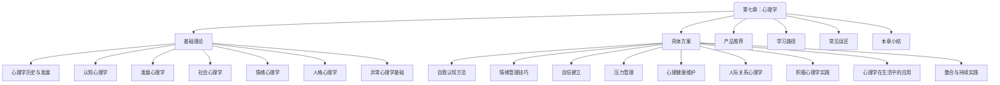

# 第七章：心理学——理解自我、掌控人生的内在科学

## 引言

心理学是研究人类行为与心理过程的科学。它不仅回答"人为什么这样做"，更指导我们"如何做得更好"。在个人提升的所有维度中——学习、工作、社交、健康管理——最终都要通过心理机制来驱动行为。掌握心理学知识，就是拿到了理解自我与他人的底层操作系统。

但大多数人对心理学的认知停留在两个极端：要么是弗洛伊德式的神秘化解读，要么是"心灵鸡汤"式的浅层安慰。本章要做的，是建立一套**科学、系统、可操作**的心理学知识框架——既有严谨的理论根基，也有可以直接上手的训练方案。

本章从**七大心理学分支**出发，覆盖从基础理论到异常心理的完整知识体系，再通过**九大实操方案**将理论转化为日常可用的心理工具，最后附上精选资源和学习路径，确保不同起点的读者都能找到适合自己的进阶通道。

## 全章知识架构

## 理论与方案的对应关系

心理学的价值在于"知行合一"。本章的理论与方案并非割裂的两部分，而是紧密咬合的齿轮系统：

| 理论基础 | 对应的实操方案 | 核心转化 |
|:---|:---|:---|
| 认知心理学 | 自我认知方法、心理学在生活中的应用 | 认知偏误识别 → 决策优化 |
| 发展心理学 | 自我认知方法、整合与持续实践 | 阶段特征理解 → 终身成长规划 |
| 社会心理学 | 人际关系心理学应用 | 社会影响机制 → 人际策略 |
| 情绪心理学 | 情绪管理技巧、积极心理学实践 | 情绪机制理解 → 情绪调节技术 |
| 人格心理学 | 自我认知方法、自信建立 | 特质理论 → 自我接纳与优势发展 |
| 异常心理学 | 心理健康维护 | 病理识别 → 预防与求助决策 |

## 第一节：基础理论（基础理论/）

本节系统梳理七大心理学核心分支，从学科源头讲到前沿进展，帮助读者建立完整的心理学知识地图。

### 心理学的历史与发展

从冯特建立第一个心理学实验室（1879年）讲起，梳理心理学从哲学母体中独立出来的完整历程。覆盖构造主义、机能主义、行为主义、精神分析、人本主义、认知革命六大历史阶段，以及当代心理学的神经科学转向与跨文化研究趋势。理解这段历史，不是为了背年表，而是为了看清每种理论为什么诞生、解决了什么问题、又有什么局限——这种历史视角本身就是批判性思维的训练。

### 认知心理学

研究人类如何获取、加工、储存和运用信息。核心模块包括：

- **注意力**：选择性注意、持续性注意、分配性注意的机制与瓶颈（Broadbent过滤器理论、Treisman衰减模型、晚期选择理论）
- **记忆系统**：感觉记忆→工作记忆→长时记忆的三级模型，编码特异性、间隔效应、提取练习效应等关键发现
- **思维与推理**：演绎推理、归纳推理、类比推理，以及常见的逻辑谬误
- **决策与判断**：前景理论、启发式与偏误（可得性、代表性、锚定效应），Kahneman双系统理论
- **语言与认知**：Sapir-Whorf假说、语言对思维的塑造作用

理解认知机制，能直接优化学习方法（间隔重复、提取练习）、提升决策质量（识别偏误）、减少日常判断错误。

### 发展心理学

研究人从出生到死亡的心理发展规律。这是理解"我为什么成为现在的我"的关键学科：

- **认知发展**：皮亚杰四阶段理论（感知运动→前运算→具体运算→形式运算）、维果茨基的最近发展区
- **道德发展**：科尔伯格三水平六阶段理论，从避罚服从到普遍伦理原则
- **社会性发展**：埃里克森八阶段理论，从信任vs不信任到自我整合vs绝望
- **依恋理论**：鲍尔比的依恋系统、安斯沃斯的四种依恋类型（安全型、回避型、矛盾型、混乱型），以及依恋模式对成年亲密关系的深远影响
- **毕生发展视角**：成人发展（中年危机、退休适应）、认知老化、积极老龄化策略

发展心理学的价值在于：理解当前的心理状态不是凭空产生的，而是有发展脉络可循的——找到源头，才能精准干预。

### 社会心理学

研究个体在社会环境中的心理与行为。核心主题：

- **社会认知**：印象形成、归因理论（海德、韦纳）、刻板印象的形成与克服
- **社会影响**：从众（阿希实验）、服从（米尔格拉姆实验）、社会助长与社会惰化、群体极化与群体思维
- **态度与说服**：精细加工可能性模型（ELM）、认知失调理论、态度改变的中心路径与外周路径
- **偏见与歧视**：偏见的根源（现实冲突理论、社会认同理论）、减少偏见的接触假说
- **亲社会行为与攻击行为**：助人行为的决策模型、旁观者效应、攻击行为的生物学与社会学解释

社会心理学的实用价值：理解这些机制，你就能识别别人何时在试图操控你，也能更智慧地影响他人。

### 情绪心理学

研究情绪的本质、产生机制、功能及其调节方法：

- **经典情绪理论**：James-Lange理论（身体反应先于情绪体验）、Cannon-Bard理论（同时发生）、Schachter-Singer两因素理论（认知标签）、Lazarus认知评价理论
- **基本情绪与维度模型**：Ekman六种基本情绪（快乐、悲伤、恐惧、愤怒、厌恶、惊讶）、Russell环形模型（效价×唤醒度）
- **情绪的功能**：进化适应功能（恐惧→逃跑）、社会沟通功能（表情→信号）、决策引导功能（躯体标记假说）
- **情绪智力**：Salovey-Mayer四分支模型（感知→促进→理解→管理）、Goleman的情商框架
- **情绪与认知的交互**：情绪对记忆的影响（心境一致性记忆）、情绪对决策的影响（风险即情感模型）

掌握情绪心理学，是实现情绪管理的理论前提——你必须先理解情绪"是什么"和"为什么存在"，才能有效调节它。

### 人格心理学

研究个体稳定的心理特征及其形成机制。四大理论取向各有洞见：

- **特质理论**：Allport特质层次、Cattell 16PF、大五人格模型（开放性、尽责性、外向性、宜人性、神经质）——目前最受实证支持的人格描述框架
- **精神分析取向**：弗洛伊德的结构模型（本我/自我/超我）、防御机制体系、心理性欲发展阶段；荣格的集体无意识与原型理论；阿德勒的自卑与补偿
- **人本主义取向**：马斯洛需求层次理论、罗杰斯的自我概念与无条件积极关注、自我实现者的特征
- **社会认知取向**：班杜拉的自我效能理论、Rotter的控制点理论、Mischel的认知-情感人格系统

了解人格理论，不是给自己或别人贴标签，而是理解：人的行为模式有其内在逻辑，理解这个逻辑，才能真正实现自我接纳和有针对性的自我改变。

### 异常心理学基础

研究心理异常的表现、成因和分类。这一节不是为了让读者"自我诊断"，而是建立基本的心理健康素养：

- **正常与异常的边界**：统计标准、社会规范标准、主观痛苦标准、功能损害标准——理解"异常"不是非黑即白
- **主要心理障碍概览**：
  - 焦虑障碍（广泛性焦虑、社交焦虑、恐惧症、惊恐障碍）
  - 心境障碍（抑郁症、双相情感障碍）
  - 强迫及相关障碍
  - 创伤及应激相关障碍（PTSD、急性应激障碍）
  - 人格障碍（边缘型、自恋型、反社会型等核心特征）
- **心理障碍的成因模型**：生物-心理-社会模型（Diathesis-stress模型），遗传易感性×环境压力的交互作用
- **何时需要专业帮助**：识别需要就医的信号（功能持续损害、自杀意念、物质滥用等），消除"看心理医生=有病"的污名化认知

掌握异常心理学基础，能帮助你区分正常的情绪波动与需要干预的心理问题，在自己或身边人出现信号时做出正确的求助决策。

### 基础理论总结

将七大分支的核心要点整合为一张心理学知识全景图，帮助读者在脑中建立分支之间的连接——认知、发展、社会、情绪、人格、异常，这六个维度共同构成了理解人类心理的完整透镜。

## 第二节：具体方案（具体方案/）

本节提供九个可操作的心理训练模块，覆盖从自我觉察到生活应用的完整链条。每个方案均包含：理论依据（为什么有效）→ 具体步骤（怎么做）→ 练习方法（练什么）→ 效果评估（如何确认进步）。

### 自我认知方法

所有心理成长的起点。没有准确的自我认知，后续的改变都是盲人摸象：

- **自我觉察的三个层次**：对情绪的觉察、对思维模式的觉察、对行为模式的觉察
- **科学自我评估工具**：大五人格测评、MBTI（了解局限性）、VIA性格优势测评、控制点量表
- **日常自我观察技术**：情绪日记、ABC思维记录表（激活事件→信念→后果）、行为功能分析
- **盲区识别**：乔哈里视窗模型，通过他人反馈扩大开放区域
- **价值观澄清**：排序法、丧失法、墓志铭练习，找到真正驱动你的核心价值观

### 情绪管理技巧

不是"控制情绪"，而是"与情绪建立健康关系"：

- **情绪识别**：身体感受定位法（焦虑在胸口、愤怒在头部）、情绪词汇精细化（从"不爽"到"失望/委屈/被忽视感"）
- **情绪接纳**：ACT（接纳承诺疗法）中的"认知解离"技术，情绪冲浪（R.A.I.N.四步法：识别→允许→探究→不认同）
- **情绪调节策略**：
  - 认知重评（改变对事件的解读）
  - 注意力部署（转移或聚焦）
  - 反应调节（深呼吸、渐进式肌肉放松）
  - 情境选择与情境修正（主动改变环境）
- **长期情绪训练**：正念冥想（MBSR八周方案）、感恩练习、积极情绪扩展-建构理论的应用

### 自信建立

基于班杜拉自我效能理论的系统性方案：

- **自信vs自尊的区分**：自信是"我能做这件事"，自尊是"我值得被善待"——两者相关但不等同
- **自我效能的四大来源**：
  1. 掌握经验（最强大）：从小目标开始积累成功体验
  2. 替代经验：观察与自己相似的人如何成功
  3. 言语说服：有效使用自我对话和他人鼓励
  4. 生理与情绪状态：管理焦虑和疲劳对自信心的影响
- **自信行为训练**：身体语言调整（权力姿势的实证争议）、自我肯定练习、渐进式暴露法
- **应对自信陷阱**：冒充者综合征的识别与应对、过度自信的校准、完美主义的解构

### 压力管理

多维度压力应对策略：

- **压力的科学认知**：Selye的一般适应综合征（GAS）三阶段模型、急性压力vs慢性压力的区别、压力与免疫系统的关系（Psychoneuroimmunology）
- **Lazarus压力评估模型**：初级评估（威胁程度）→ 次级评估（应对资源），改变任一端都能减轻压力
- **问题聚焦型应对**：时间管理（Eisenhower矩阵、番茄工作法）、问题分解法、寻求社会支持
- **情绪聚焦型应对**：认知重评、正念减压、渐进式肌肉放松（PMR）、引导式想象
- **生理调节**：呼吸技术（4-7-8呼吸法、箱式呼吸）、有氧运动的抗压机制、睡眠卫生
- **压力免疫训练（SIT）**：Meichenbaum的三阶段方案——概念化、技能获得与排练、应用与跟进

### 心理健康维护

预防优于治疗，建立日常心理健康维护习惯：

- **心理健康连续体模型**：心理健康不是"有/没有"的二元状态，而是在"茁壮成长→正常波动→亚临床困扰→临床障碍"之间的连续滑动
- **日常心理保健习惯**：
  - 社交连接（孤独感的健康危害等同于每天吸15支烟——Holt-Lunstad元分析）
  - 身体活动（每周150分钟中等强度运动的抗抑郁效果接近药物治疗）
  - 睡眠质量（睡眠剥夺对情绪调节、认知功能的系统性损害）
  - 自然接触（注意力恢复理论、每周120分钟自然暴露的心理健康效益）
- **心理危机的识别与应对**：自杀风险评估的QPR三步法（提问、劝说、转介）、心理急救（PFA）基本原则
- **何时以及如何寻求专业帮助**：心理咨询vs心理治疗vs精神科的区别、如何选择合适的治疗师、常见循证心理治疗（CBT、DBT、EMDR、ACT）的适用场景

### 人际关系心理学应用

将社会心理学理论转化为人际交往的实际技能：

- **沟通的心理学基础**：非暴力沟通四步法（观察→感受→需要→请求）、积极倾听技术（反映情感、总结内容、开放式提问）
- **关系建立**：自我暴露的社交渗透理论（Altman & Taylor）、相似性-互补性之争、首因效应与近因效应的实际应用
- **冲突处理**：Thomas-Kilmann冲突模式模型（竞争→合作→妥协→回避→顺应）、修复性对话的四要素
- **依恋风格与亲密关系**：识别自己和伴侣的依恋类型、焦虑型与回避型的互动陷阱、向安全型依恋发展的路径
- **社交技能训练**：拒绝的技巧（破唱片法）、边界设定的三步法、社交焦虑的暴露等级表

### 积极心理学实践

不只是"正能量"，而是基于实证的幸福科学：

- **PERMA模型**（Seligman）：积极情绪（Positive Emotion）、投入（Engagement）、关系（Relationships）、意义（Meaning）、成就（Accomplishment）——幸福的五个可操作维度
- **心流体验**：Csikszentmihalyi的心流条件（挑战-技能平衡、明确目标、即时反馈）、在工作和生活中创造心流的方法
- **品格优势与美德**：VIA分类体系（24种品格优势分属6大美德），识别和运用个人核心优势
- **感恩与品味**：感恩三件小事练习、品味技术（记忆建构、自我肯定、感官锐化、分享表达）
- **韧性与成长型思维**：Dweck的固定型vs成长型思维、从失败中提取学习的"复盘四问"

### 心理学在生活中的应用

将心理学知识落地到具体生活场景：

- **学习中的心理学**：间隔重复、交错练习、生成效应、测试效应——四大高效学习策略的实证支持与操作方法
- **工作中的心理学**：目标设定理论（Locke & Latham）、内在动机vs外在动机（自我决定理论）、工作倦怠的三维度模型与预防
- **消费中的心理学**：锚定效应、损失厌恶、禀赋效应在消费决策中的影响——成为更理性的消费者
- **健康行为中的心理学**：跨理论模型（行为改变阶段）、执行意图（"如果-那么"计划）、习惯形成的cue-routine-reward回路
- **数字时代心理学**：社交媒体对心理健康的影响（社会比较、FOMO）、数字极简主义、注意力经济的自我保护

### 整合与持续实践

将所有方案串联为一个可持续的心理成长系统：

- **个人心理学工具箱**：根据自己的核心问题（情绪、自信、压力、人际）选择优先级最高的2-3个方案
- **每日微习惯设计**：将心理练习嵌入日常生活（晨间5分钟正念、晚间3件好事、通勤时的认知重评练习）
- **定期自我评估**：月度心理状态check-in、季度目标复盘、年度价值观重审
- **从知道到做到**：行为改变的障碍分析与应对、"最小可行习惯"策略、社会支持系统的构建
- **终身成长的心态**：心理学学习不是一个有终点的项目，而是一种持续自我更新的生活方式

## 第三节：产品推荐（产品推荐/）

精选心理学领域的优质学习资源，从书籍到数字工具，按学习阶段和用途分类推荐。

### 推荐书籍

从入门到进阶的分层书单，每本书附有推荐理由、适读人群和核心收获：

- **入门级**：建立心理学全局认知（如《心理学与生活》《改变心理学的40项研究》）
- **专题级**：深入某个分支（如《思考，快与慢》《社会性动物》《亲密关系》《发展心理学》）
- **应用级**：直接解决具体问题（如《自控力》《非暴力沟通》《被讨厌的勇气》《正念的奇迹》）
- **专业级**：系统深入学习（如《认知心理学》《社会心理学》教材）

### 推荐APP与数字工具

涵盖心理测评、冥想练习、情绪追踪、认知训练四大类应用，每个推荐附有功能介绍、适用场景和替代方案。

### 选择建议

根据读者的当前阶段、核心需求和学习风格，给出个性化的资源组合建议，避免"收藏了=学过了"的假性学习。

## 第四节：学习路径（04-学习路径.md）

为不同起点的学习者规划从零基础到实践应用的完整学习路径：

- **第一阶段：心理学基础认知（1-2个月）**——建立学科全景，消除常见误解，培养心理学思维
- **第二阶段：核心理论深入（2-4个月）**——系统学习认知、社会、情绪、人格四大分支的核心理论
- **第三阶段：技能训练与实践（3-6个月）**——选择2-3个具体方案深度练习，建立日常心理保健习惯
- **第四阶段：整合应用与持续成长（长期）**——将心理学思维融入决策、关系、工作、健康等所有生活领域

每个阶段附有具体的学习任务、推荐资源、里程碑检查点和常见卡点的应对策略。

## 第五节：常见误区（05-常见误区.md）

揭示十个广泛流传的心理学误区，每个误区均提供：流行原因、科学证据、正确理解：

- "我们只用了大脑的10%"——神经影像学证据表明大脑各区域均有功能
- "左脑人vs右脑人"——脑成像研究显示两侧大脑协同工作
- "记忆像录像机一样精确"——Elizabeth Loftus的错误记忆研究
- "测谎仪能准确识别谎言"——测谎仪测量的是生理唤醒而非谎言本身
- "性格测试能准确描述你"——巴纳姆效应与人格测评的信效度问题
- "催眠能让你做违背意愿的事"——催眠状态的科学理解
- "多任务处理能提高效率"——任务切换的认知成本
- "智力是固定不变的"——神经可塑性与流体/晶体智力的区分
- "积极思考能治愈疾病"——积极心理学≠盲目乐观
- "童年经历决定一切"——发展可塑性与终身成长的证据

建立准确的心理学认知，是有效应用心理学知识的前提——错误的前提会导致错误的结论和行为。

## 第六节：本章小结（06-本章小结.md）

回顾本章七大理论分支和九大实操方案的核心要点，提炼关键行动清单，提供从"读完"到"做到"的转化指南。

## 学习建议

1. **理论与实践并重**：不要停留在"知道"层面。读完一个理论，立刻找到对应的实操方案开始练习。心理学知识的转化率=应用次数/阅读次数
2. **循序渐进，不贪多**：从基础理论开始建立全景认知，然后选择1-2个最切合当前需求的方案深度练习，而不是一次性铺开所有方案
3. **保持批判性思维**：心理学研究结论受样本、文化、情境限制。看到一个研究结论时，先问"这个结论在什么条件下成立"，再问"它对我的情况适用吗"
4. **记录与反思**：建立心理成长日志，记录练习过程中的体验、困难和突破。没有记录就没有反思，没有反思就没有真正的改变
5. **尊重边界**：本章内容是心理学知识的系统介绍和自我提升工具，不替代专业心理咨询。如果你或身边的人正在经历持续的情绪困扰、功能损害或自杀意念，请寻求专业帮助（全国24小时心理援助热线：400-161-9995）

## 核心理念

> "认识你自己。"——德尔斐神庙铭文

心理学的终极目标不是给人贴标签，而是帮助每个人更深刻地理解自己，更智慧地与世界相处。通过本章的学习，你将能够：

- **建立科学的心理学认知框架**——用六大分支的透镜系统性地理解人类行为
- **识别和纠正常见的心理学误解**——在信息洪流中保持判断力
- **掌握实用的心理调节技能**——在情绪、压力、自信、人际等维度拥有可操作的工具
- **建立日常心理保健习惯**——将心理健康维护融入生活方式
- **成为更了解自己、也更理解他人的人**——从自我觉察出发，走向更好的关系和更充实的生活

知识只有转化为行动才有力量。让我们开始这段从"理解"到"做到"的旅程。
