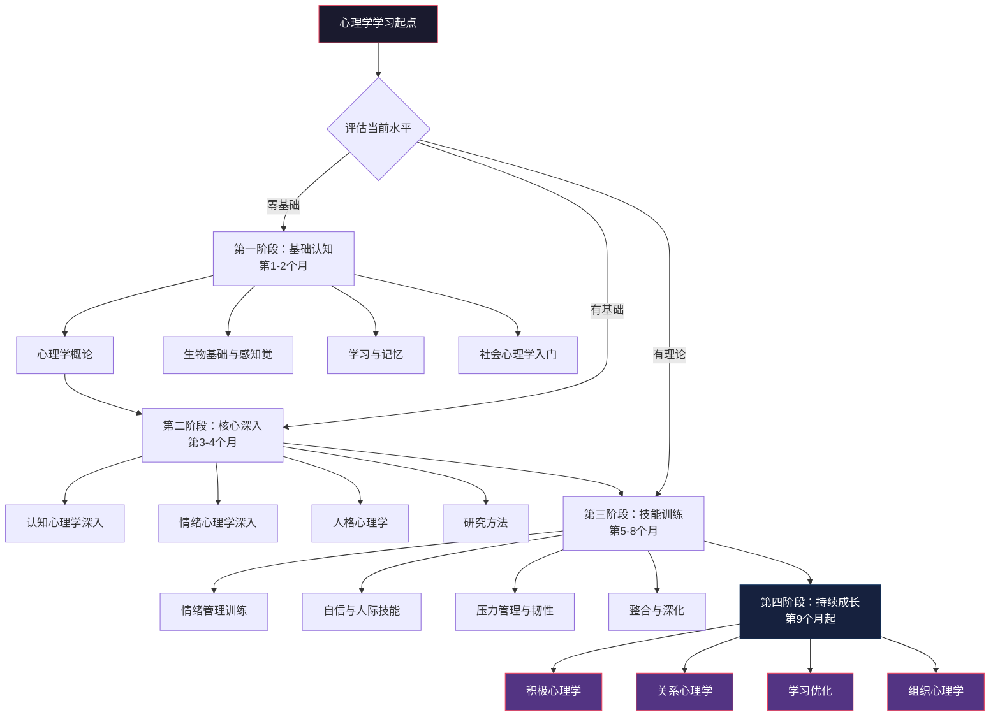
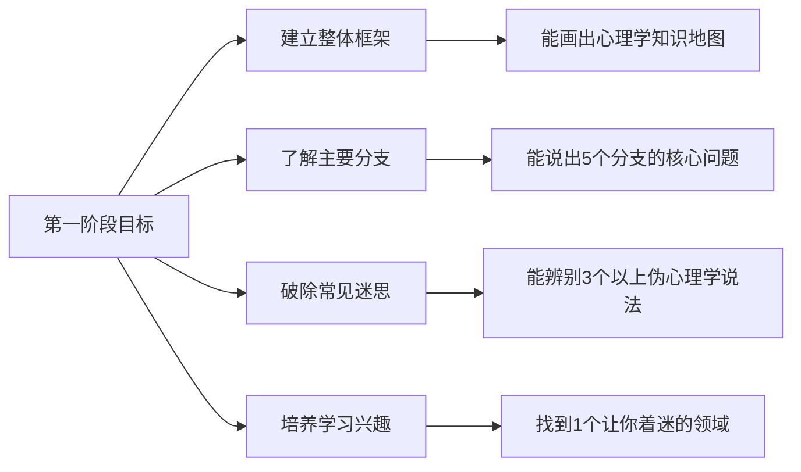
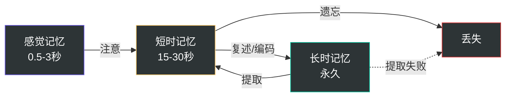
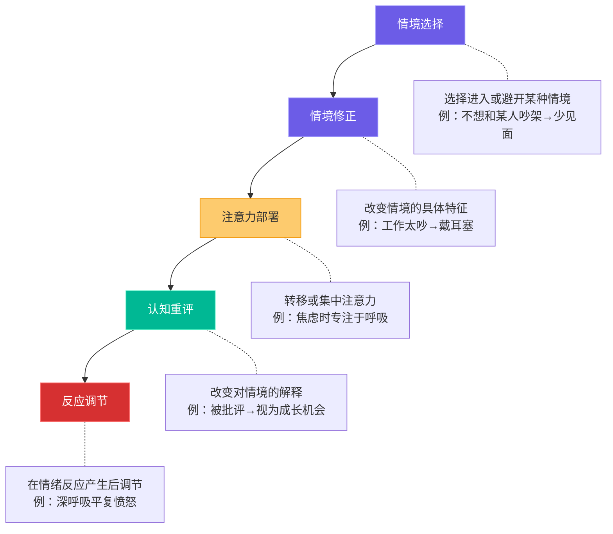

# 心理学学习路径：从零基础到实践应用

学习心理学是一段既需要知识积累又需要自我体验的旅程。与其他学科不同，心理学的学习对象就是你自己——你既是研究者，也是被研究者。这种双重身份决定了心理学学习必须走"理论+体验"的双轨路线，单纯的知识记忆无法带来真正的改变。

本节为不同起点的学习者规划了从零基础到实践应用的完整路径，涵盖四个阶段、十个关键里程碑，帮助你有计划、有步骤地掌握心理学知识并将其转化为生活中的实际技能。

## 学习路径全景图



---

## 总体学习原则

在开始具体的学习路径之前，先掌握五个决定学习成败的核心原则。

### 原则一：双轨并行——理论学习 + 自我体验

心理学不同于数学或历史，它研究的对象就是你自身的思维、情绪和行为。这意味着：

- **输入侧**：阅读书籍、观看课程、学习理论模型
- **输出侧**：在生活中观察、练习、反思、记录

只读书不实践，你只是"知道"了心理学概念，却无法在情绪崩溃时用上任何一个技巧；只实践不学理论，你可能走入伪科学的陷阱（比如用"正能量"压制正常的情绪反应）。两者结合才是真正的"理解"心理学。

**具体操作方法**：每学完一个理论概念，当天就在生活中找一个实例进行观察或练习。例如学完"认知偏误"后，当天记录自己做出的3个决策，逐一检查是否存在确认偏误、可得性偏误等。

### 原则二：需求驱动——从你最痛的点切入

心理学的分支众多，不可能同时深入所有领域。根据你当前最迫切的需求选择切入点：

| 你的核心困扰 | 推荐切入点 | 为什么从这里开始 |
|:---|:---|:---|
| 人际关系困扰 | 社会心理学 | 直接解释人际互动中的心理机制 |
| 情绪问题（焦虑、抑郁、易怒） | 情绪心理学 + CBT | 提供具体的情绪调节工具 |
| 学习效率低、记忆力差 | 认知心理学 | 揭示记忆和学习的认知机制 |
| 自我认识不清、方向迷茫 | 人格心理学 | 帮你建立清晰的自我画像 |
| 自卑、社交恐惧 | 社会心理学 + 自我效能理论 | 理解恐惧来源并建立自信路径 |
| 拖延、自律差 | 行为心理学 + 自控力研究 | 从行为塑造入手而非意志力 |

需求驱动的核心逻辑是：**只有当你感受到"学了就能用"的即时反馈，才能维持长期学习的动力**。从最痛的点切入，你每天都能体验到心理学的实用价值。

### 原则三：建立批判性思维

心理学研究的结论受情境、样本和方法的限制，不能盲目接受。学会区分以下三个层次：

1. **科普结论**（可靠性低）：自媒体文章、畅销书中的简化表述，往往省略了研究的限制条件
2. **学术研究**（可靠性中）：单篇论文的结论，需要看样本量、重复验证、效应量
3. **元分析/系统综述**（可靠性高）：对大量研究的统计汇总，是最接近"定论"的证据

**批判性思维检查清单**：
- 这个结论的原始研究样本是什么？（大学生样本 ≠ 普遍规律）
- 效应量有多大？（统计显著 ≠ 实际有意义）
- 是否被重复验证过？（单次实验结果可能是偶然）
- 是否在不同文化中验证过？（西方研究结论不一定适用于中国）
- 研究者是否有利益冲突？（企业赞助的研究需要额外审视）

### 原则四：记录与反思——建立你的心理学学习日志

学习日志是将知识内化的关键工具。具体格式建议：

```markdown
## 日期：YYYY-MM-DD

### 今日所学
- 知识点：[具体概念名称]
- 来源：[书籍/课程章节]
- 核心要义：[用自己的话概括，不超过3句话]

### 生活观察
- 现象：[观察到的心理学现象]
- 解释：[用哪个理论可以解释]
- 差异：[理论预测和实际观察是否有差异]

### 实践尝试
- 技巧：[尝试了哪个技巧]
- 场景：[在什么情境下使用]
- 效果：[实际效果如何，1-10分]
- 改进：[下次可以怎么调整]

### 疑问与深挖
- [需要进一步了解的问题]
```

### 原则五：尊重个体差异——没有放之四海而皆准的方案

心理学的很多结论是基于群体平均值的，具体到个人身上会有显著差异。例如：
- 内向者和外向者适合的社交策略完全不同
- 高敏感人群和低敏感人群的情绪调节方法有别
- 不同依恋类型的人在亲密关系中的需求各异

学习心理学的过程中，你一定会发现"有些理论特别准，有些好像不适用"。这恰恰说明你需要更深入地理解自己的个体特征，而不是怀疑心理学本身。

---

## 第一阶段：心理学基础认知（第1-2个月）

### 阶段目标



- 建立心理学的整体框架，理解各分支之间的关系
- 了解心理学的主要分支和核心概念
- 破除至少5个常见的心理学迷思
- 培养对心理现象的敏感度，养成"用心理学看世界"的习惯

### 第1周：什么是心理学

**阅读任务**：
- 《心理学与生活》（Gerrig & Zimbardo）第1章：心理学的定义、历史、主要流派
- 补充阅读：《改变心理学的40项研究》（Hock）序言——了解心理学研究的真实面貌

**核心知识点**：
- 心理学的科学定义：心理学是研究行为和心理过程的科学，不是"读心术"或"心灵鸡汤"
- 心理学的主要流派及其核心主张：
  - 行为主义（Watson, Skinner）：关注可观察行为，强调环境塑造
  - 精神分析（Freud）：关注无意识动机，强调早期经验
  - 人本主义（Maslow, Rogers）：关注人的潜能和自我实现
  - 认知心理学：关注信息加工过程，强调心智模型
  - 生物心理学：关注行为的神经和生理基础
- 科学方法在心理学中的重要性：为什么"我觉得"不能算心理学证据

**思考练习**：
- 心理学与"心灵鸡汤"的根本区别是什么？（提示：可证伪性、证据标准、适用条件）
- 为什么弗洛伊德的理论虽然流行但在学术界争议很大？
- 日常生活中哪些"常识"其实是错误的？（如"我们只用了10%的大脑"）

**实践任务**：
在日常生活中观察3个你感到好奇的人类行为，用以下模板记录：

```markdown
观察到的行为：[具体描述]
可能的心理学解释：[至少2种]
我倾向于哪种解释：[及理由]
如何验证这个解释：[设计一个简单的观察]
```

### 第2-3周：生物基础与感知觉

**阅读任务**：
- 《心理学与生活》第2-4章：神经科学与行为、感觉与知觉
- 补充观看：Crash Course Psychology 系列（YouTube）中关于神经科学和感知觉的视频

**核心知识点**：
- 神经元的结构与功能：树突接收→胞体整合→轴突传导→突触传递
- 主要神经递质及其功能：

| 神经递质 | 主要功能 | 与日常行为的关联 |
|:---|:---|:---|
| 多巴胺 | 奖赏、动机、运动控制 | 成瘾行为、目标追求、拖延 |
| 血清素 | 情绪调节、睡眠、食欲 | 抑郁症、焦虑、强迫症 |
| 去甲肾上腺素 | 警觉、注意力、应激反应 | 压力反应、注意力集中 |
| GABA | 抑制性信号传递 | 焦虑（GABA不足时焦虑增加） |
| 乙酰胆碱 | 学习、记忆、肌肉控制 | 阿尔茨海默症（该递质减少） |

- 大脑的关键区域及其功能：前额叶（决策、计划）、杏仁核（恐惧、情绪记忆）、海马体（记忆形成）、前扣带回（冲突监控）
- 感知觉的选择性：你的大脑不是照相机，而是一个主动建构现实的系统
- 格式塔知觉组织原则：接近性、相似性、连续性、闭合性

**实践任务**：
- 进行"选择性注意"实验：观看 Daniel Simons 的"看不见的大猩猩"视频，体验注意盲视
- 记录一天中你的感知觉"选择性"：在同一个场景中，你注意到了什么、忽略了什么？和同行的人对比

### 第4-5周：学习与记忆

**阅读任务**：
- 《心理学与生活》第6-7章：学习、记忆
- 补充阅读：《认知天性》（Make It Stick）前3章

**核心知识点**：
- 经典条件反射（Pavlov）：中性刺激与无条件刺激的反复配对→中性刺激单独引发反应。理解这个机制可以解释很多日常行为（如闻到某种食物的味道就恶心，因为曾经吃完后呕吐过）
- 操作条件反射（Skinner）：行为的后果决定了该行为未来出现的概率
  - 正强化：行为后出现好结果→行为增加（如考前突击得了高分→下次继续突击）
  - 负强化：行为后移除坏结果→行为增加（如吃头痛药后头不痛了→下次头痛吃药）
  - 正惩罚：行为后出现坏结果→行为减少
  - 负惩罚：行为后移除好结果→行为减少
- 记忆的三级存储模型：



- 遗忘曲线（Ebbinghaus）：遗忘在学习后立即开始，先快后慢。24小时内遗忘约70%，之后趋于平缓
- 高效学习策略的科学依据：
  - 间隔重复（Spaced Repetition）：分散学习优于集中学习，因为每次间隔都是一次"记忆再巩固"
  - 提取练习（Retrieval Practice）：主动回忆优于被动重读，因为提取过程本身强化了记忆通路
  - 交叉练习（Interleaving）：混合练习优于同类集中练习，因为交错迫使大脑建立辨别能力
  - 精细编码（Elaborative Encoding）：将新信息与已有知识关联，建立丰富的编码网络

**实践任务**：
- 选择一个你想学习的新知识点（如20个英语单词），用间隔重复法学习一周，记录每天的回忆率
- 对比实验：同样内容，一组用重读法学习，一组用"回忆法"（读完后合上书默写），比较效果

### 第6-8周：社会心理学入门

**阅读任务**：
- 主读：《社会心理学》（Myers）精选章节：社会认知、从众与服从、偏见、吸引力
- 或主读：《影响力》（Cialdini）——以六大影响力原则为主线
- 补充：《乌合之众》（Le Bon）——群体心理学经典（注意：此书年代久远，需结合现代研究批判阅读）

**核心知识点**：
- 社会认知：我们如何理解他人
  - 归因理论：内因归因（他迟到是因为不守时）vs 外因归因（他迟到是因为堵车）
  - 基本归因错误：高估他人行为的内因，低估外因（他迟到=他这个人不行，而不是今天路上真的很堵）
  - 自利偏差：成功归因于自己，失败归因于外部
- 社会影响：他人如何改变我们
  - 从众（Asch 实验）：即使答案明显错误，约75%的人至少从众一次
  - 服从（Milgram 实验）：权威的力量有多大？65%的人服从到最高电压
  - 社会惰化：群体中个人出力减少——"三个和尚没水喝"
  - 去个体化：匿名性导致自我约束降低——网络暴力的心理机制
- Cialdini 的六大影响力原则：

| 原则 | 核心机制 | 日常例子 | 防御策略 |
|:---|:---|:---|:---|
| 互惠 | 收到好处后感到有义务回报 | 免费试用→购买 | 识别"免费"背后的意图 |
| 承诺一致 | 做出承诺后倾向于保持一致 | 公开目标更难放弃 | 区分"承诺"和"理性判断" |
| 社会认同 | 不确定时参考他人行为 | 好评多的餐厅更受欢迎 | 警惕虚假好评和从众 |
| 喜好 | 更容易被喜欢的人说服 | 明星代言效果好 | 分离"喜欢人"和"认可产品" |
| 权威 | 倾向于服从权威 | "专家推荐"更可信 | 检查权威的真实资质 |
| 稀缺 | 越稀缺越有价值 | "限时优惠"制造紧迫感 | 问自己"如果不限时，我会买吗" |

**实践任务**：
- 在社交场景中观察至少3个社会心理现象，用学习日志记录
- 分析一次你被说服的经历：对方使用了哪种影响力原则？
- 尝试"去个体化"观察：匿名环境（如网络评论区）和实名环境中，人们的行为有何不同？

### 第一阶段产出检查清单

- [ ] 完成至少1本入门书籍的完整阅读
- [ ] 能画出心理学5大分支的核心关键词思维导图（每个分支5个关键词）
- [ ] 在生活中找到至少10个心理学现象的实例并记录
- [ ] 完成至少3个常见心理学迷思的辨析（参见05-常见误区.md）
- [ ] 建立学习日志并坚持记录至少4周
- [ ] 能用心理学视角分析一次日常人际互动

---

## 第二阶段：核心理论深入（第3-4个月）

### 阶段目标

- 深入理解认知心理学和情绪心理学的核心理论
- 掌握人格心理学的主要模型
- 学习基本的心理学研究方法，提升信息鉴别能力
- 开始进行系统性的自我心理分析

### 第9-10周：认知心理学深入

**阅读任务**：
- 主读：《思考，快与慢》（Kahneman）——行为经济学奠基之作
- 辅助：《超越智商》（Stanovich）——理性和智力的区别

**核心知识点**：
- 双系统理论（Kahneman）：
  - 系统1（快思考）：自动化、无意识、快速、容易出错。负责日常直觉判断
  - 系统2（慢思考）：需要注意力、有意识、缓慢、更准确。负责复杂计算和逻辑推理
  - 大多数认知偏误来自系统1的"捷径"（启发式）在不适用场景中的误用

- 必须掌握的10种认知偏误：

| 偏误名称 | 定义 | 生活中的典型表现 | 如何克服 |
|:---|:---|:---|:---|
| 确认偏误 | 只关注支持自己观点的信息 | 看新闻只看自己认同的媒体 | 主动寻找反面证据 |
| 可得性偏误 | 容易想到的事被高估概率 | 飞机失事新闻→觉得坐飞机很危险 | 查统计数据而非凭感觉 |
| 锚定效应 | 第一个信息过度影响后续判断 | 原价999现价199觉得便宜 | 先独立评估再看标价 |
| 损失厌恶 | 损失的痛苦是等额收益快乐的2倍 | 不愿卖掉亏损的股票 | 问"如果现在没有这只股票，我会买吗" |
| 框架效应 | 同一信息的不同表述影响决策 | "90%存活率"比"10%死亡率"更让人安心 | 把信息换一种表述重新审视 |
| 后见之明 | 事后觉得"我早就知道了" | 考试后觉得"这题我本来就会" | 事前写下预测来检验 |
| 光环效应 | 对某人某方面的好印象泛化到其他方面 | 长得好看→觉得能力也强 | 分维度独立评估 |
| 达克效应 | 能力低的人倾向于高估自己 | 网上"键盘侠"自信满满 | 接受反馈、多和高手交流 |
| 沉没成本 | 已经投入的成本影响未来决策 | 看了一半的烂电影坚持看完 | 只考虑"从现在起的收益和成本" |
| 聚焦错觉 | 过度关注某因素而忽略其他 | "如果我有钱了就一定幸福" | 列出影响结果的所有因素 |

- 前景理论（Kahneman & Tversky）的核心发现：
  - 人在面对收益时倾向于风险规避（确定得到800元 vs 80%概率得到1000元）
  - 人在面对损失时倾向于风险寻求（确定损失800元 vs 80%概率损失1000元）
  - 参考点效应：人们的满意程度取决于相对变化而非绝对水平

**实践任务**：
- 连续一周，每天记录自己做出的3个重要决策，分析其中可能存在的认知偏误
- 进行"预检验"：对接下来一周的3件事写下预测，一周后回顾准确率

### 第11-12周：情绪心理学深入

**阅读任务**：
- 主读：《情商》（Goleman）——情绪智力的普及之作
- 辅助：《情绪》（Lisa Feldman Barrett）——情绪建构理论的颠覆性观点
- 参考：本章"情绪管理技巧"小节

**核心知识点**：
- 情绪的本质之争：
  - 基本情绪论（Ekman）：人类有6种基本情绪（快乐、悲伤、恐惧、愤怒、惊讶、厌恶），跨文化普遍存在
  - 情绪建构论（Barrett）：情绪不是被"触发"的，而是大脑基于过往经验和当前情境"建构"出来的。没有"纯粹的愤怒"这回事——你的愤怒是由你的身体感受、情境线索和概念知识共同创造的
  - 实用启示：既然情绪是建构的，那么通过改变你对身体感受的解读、改变你的情绪概念知识，就能改变你的情绪体验

- Gross的情绪调节过程模型——五种调节策略按介入时间排列：



- 情绪智力（Goleman）的四个维度：
  1. 自我觉察：识别自己的情绪状态
  2. 自我管理：调节自己的情绪反应
  3. 社会觉察：感知他人的情绪（共情）
  4. 关系管理：在社交中有效运用情绪信息

**实践任务**：
- 开始情绪日记，每天记录3次情绪状态（早中晚各一次），至少坚持4周
- 情绪日记记录模板：

```markdown
时间：HH:MM
情境：[正在做什么，和谁在一起]
情绪标签：[用具体词汇，不要只写"不好"，如"沮丧、焦虑、烦躁"]
强度：[1-10分]
身体感受：[哪里紧绷、哪里放松、心跳如何]
自动思维：[脑海中闪过的想法]
应对方式：[做了什么来调节]
效果：[1-10分]
```

- 学习识别"情绪颗粒度"：尝试用20个不同的词描述你的负面情绪，而不是笼统地说"不开心"

### 第13-14周：人格心理学

**阅读任务**：
- 主读：《自卑与超越》（Adler）或《被讨厌的勇气》（岸見一郎）——个体心理学入门
- 辅助：《人格心理学》（Burger）精选章节——了解主要人格理论
- 参考：大五人格相关研究综述

**核心知识点**：
- 人格心理学的主要理论流派：

| 流派 | 代表人物 | 核心观点 | 对个人成长的启示 |
|:---|:---|:---|:---|
| 精神分析 | Freud | 行为受无意识驱动，早期经验至关重要 | 觉察无意识模式，理解童年影响 |
| 特质理论 | Allport, Costa & McCrae | 人格由稳定的特质维度构成 | 了解自己的特质定位，接纳而非对抗 |
| 人本主义 | Maslow, Rogers | 人有自我实现的内在倾向 | 关注成长需要，追求真实的自我 |
| 社会认知 | Bandura | 人格是个人、行为、环境交互的结果 | 通过改变环境和认知来改变行为模式 |
| 个体心理学 | Adler | 追求优越、社会兴趣、生活风格 | 理解自卑感的动力作用，发展社会兴趣 |

- 大五人格模型（OCEAN）——目前学术界最广泛接受的人格模型：

| 维度 | 高分特征 | 低分特征 | 与行为的关联 |
|:---|:---|:---|:---|
| 开放性（O） | 好奇、有创造力、喜欢新体验 | 务实、保守、偏好常规 | 与创造力和职业兴趣相关 |
| 尽责性（C） | 有组织、自律、可靠 | 随性、灵活、冲动 | 与学业/职业成就相关性最强 |
| 外向性（E） | 热情、社交、精力充沛 | 安静、独处、深思 | 与社交网络大小和积极情绪相关 |
| 宜人性（A） | 合作、信任、善良 | 竞争、怀疑、直接 | 与人际关系质量和利他行为相关 |
| 神经质（N） | 情绪波动、焦虑、易怒 | 情绪稳定、冷静、自信 | 与心理健康问题风险相关 |

- 阿德勒个体心理学的核心概念：
  - 自卑与补偿：每个人都有自卑感，健康的补偿推动成长，过度补偿导致心理问题
  - 生活风格：4岁左右形成的一套应对世界的基本策略，成年后往往在无意识中运行
  - 社会兴趣：衡量心理健康的核心指标——你多大程度上关心他人的福祉
  - 目的论：人的行为由目的驱动（而非原因），问"这个行为想要达成什么"比"为什么这样做"更有建设性

**实践任务**：
- 完成大五人格自评测试（可使用 IPIP-NEO 的简化版，约120题，免费在线可得）
- 将测试结果与你的自我认知对比：哪些维度符合？哪些出乎意料？
- 反思练习：你的"生活风格"是什么？你在面对困难时的默认策略是什么？

### 第15-16周：心理学研究方法

**阅读任务**：
- 《心理学与生活》关于研究方法的章节
- 补充：《这才是心理学》（Stanovich）——批判性思维入门

**核心知识点**：
- 三种主要研究方法的对比：

| 方法 | 核心逻辑 | 优势 | 劣势 | 适用场景 |
|:---|:---|:---|:---|:---|
| 实验法 | 操纵自变量，观察因变量变化 | 可以确定因果关系 | 人工情境，推广性有限 | 验证"X导致Y" |
| 相关法 | 测量两个变量的关联程度 | 自然情境，可研究不能操纵的变量 | 不能确定因果 | 探索"X和Y有关" |
| 问卷法 | 通过标准化问题收集自我报告 | 能测量内心状态，样本量大 | 社会赞许性偏差，回忆偏差 | 大规模调查态度/感受 |

- 必须理解的核心概念：
  - 变量：自变量（被操纵的）、因变量（被测量的）、控制变量（保持恒定的）
  - 信度：测量的一致性——同一个测试反复做，结果是否稳定
  - 效度：测量的准确性——你真的测到了你想测的东西吗
  - "相关不等于因果"：冰淇淋销量和溺水人数正相关，但吃冰淇淋不会导致溺水——两者都由"天气热"这个第三变量驱动

**实践任务**：
- 评估你在阅读中遇到的某个"心理学研究"的方法论质量，用以下检查清单：
  1. 样本量是否足够？（通常N>100较好）
  2. 样本是否有代表性？（全是大学生则推广性有限）
  3. 是否有对照组？
  4. 是否被其他研究重复过？
  5. 效应量有多大？（Cohen's d > 0.8 为大效应）

### 第二阶段产出检查清单

- [ ] 完成2-3本进阶书籍的阅读
- [ ] 坚持情绪日记至少4周，积累至少80条记录
- [ ] 能识别并命名自己最常出现的3种认知偏误
- [ ] 完成大五人格自评，写出500字的自我分析
- [ ] 能用研究方法的视角评估一篇心理学科普文章的可信度
- [ ] 写出一篇1000字的"自我心理画像"

---

## 第三阶段：技能训练与实践（第5-8个月）

### 阶段目标

- 掌握实用的心理调节技能，形成"工具箱"
- 建立日常心理保健习惯
- 发展人际沟通和情绪管理能力
- 培养心理韧性，增强抗压能力

### 第17-20周：情绪管理训练

**阅读任务**：
- 主读：《自控力》（McGonigal）
- 辅助：《正念的奇迹》（一行禅师）——正念入门
- 参考：本章"情绪管理技巧"方案

**核心技能训练**：

**技能1：情绪觉察——成为情绪的"观察者"**
- 扩展情绪词汇：大多数人只能区分"开心""难过""生气"三种状态。实际的情绪词汇库应该包括至少30个精细词汇。例如：
  - 愤怒的梯度：不满→恼怒→愤怒→暴怒→狂怒
  - 悲伤的梯度：惆怅→忧伤→悲伤→悲痛→绝望
  - 恐惧的梯度：不安→紧张→焦虑→恐惧→恐慌
- 身体扫描练习（每日5分钟）：从头顶到脚底，逐一觉察身体各部位的感觉。情绪总是先于认知在身体中显现——胃部紧缩可能是焦虑，胸口压迫可能是悲伤

**技能2：认知重评——改变你对事件的解读**
- ABC分析法（Ellis的理性情绪行为疗法）：
  - A（Activating Event）：触发事件——"同事没有回复我的消息"
  - B（Belief）：信念/解读——"他一定是对我有意见"
  - C（Consequence）：情绪和行为后果——"焦虑、反复检查手机"
  - D（Dispute）：质疑信念——"有没有其他可能？他可能在忙"
  - E（Effective new belief）：新的有效信念——"不知道原因，我可以明天当面问"

**技能3：正念练习——活在当下的能力**
- 每日10分钟正念冥想，推荐工具：
  - Headspace（英文，系统性课程设计，免费基础课程足够入门）
  - 潮汐（中文，自然白噪音+引导冥想，界面优美）
  - 小睡眠（中文，助眠+冥想结合）
- 正念呼吸的具体步骤：
  1. 找一个安静的地方坐下，脊背挺直但放松
  2. 闭上眼睛，把注意力放在呼吸上
  3. 感受空气进出鼻孔的温度变化
  4. 注意腹部的起伏
  5. 思绪飘走时，温和地把注意力拉回呼吸（这不是失败，这正是练习本身）
  6. 从5分钟开始，每周增加1分钟，目标10-15分钟

**技能4：情绪表达——用语言代替行动**
- "我"陈述句练习：把"你总是迟到！"改为"当你迟到的时候，我感到不被尊重，因为我重视守时。我希望你下次能提前告诉我如果会晚到。"
- 结构：当你[具体行为]时，我感到[情绪]，因为[需要/价值观]。我希望[具体请求]。

**实践任务**：
- 每周至少进行一次情绪调节的实战练习，记录过程和效果
- 进阶：学习DBT（辩证行为疗法）中的痛苦忍受技巧——TIPP法：
  - T（Temperature）：用冰水敷脸，激活潜水反射，快速降低心率
  - I（Intense exercise）：高强度运动20分钟，消耗肾上腺素
  - P（Paced breathing）：呼气时间长于吸气（吸4秒-呼6秒）
  - P（Paired muscle relaxation）：配合呼吸进行肌肉放松

### 第21-24周：自信建立与人际技能

**阅读任务**：
- 主读：《自我同情》（Neff）——自我同情的科学研究和实践方法
- 辅助：《非暴力沟通》（Rosenberg）——人际沟通的金标准
- 参考：本章"自信建立"方案

**核心技能训练**：

**技能1：自我效能感培养（Bandura）**
自我效能感是你对自己完成特定任务能力的信念。它不是泛泛的"自信"，而是针对具体领域的。提升四条路径：
1. 直接经验：设置并完成渐进式挑战（最有效）
   - 例：社交恐惧→先和收银员打招呼→和同事闲聊5分钟→在小会议上发言→在大会上演讲
2. 替代经验：观察和你相似的人成功（他能做到，我也可以）
3. 言语说服：来自信任的人的鼓励和反馈
4. 情绪唤醒管理：学会把紧张重新解读为兴奋

**技能2：自我同情练习（Neff）**
自我同情的三个组成部分：
- 自我善待：像对待好朋友一样对待自己，而不是苛责
- 共同人性：认识到"不是只有我一个人这样"，失败和痛苦是人类共同体验
- 正念觉察：既不压抑也不放大痛苦，如实地觉察它

自我同情冥想（5分钟）：
1. 想一个让你感到痛苦或失败的情境
2. 对自己说："这是一个痛苦的时刻"（正念觉察）
3. 对自己说："痛苦是人生的一部分，不是只有我在经历"（共同人性）
4. 对自己说："愿我善待自己，给自己所需要的安慰"（自我善待）
5. 把手放在心口，感受温暖和关怀

**技能3：非暴力沟通四步法（Rosenberg）**
1. 观察（不评判）："你这周有三天没有做家务"
2. 感受："我感到疲惫和有些委屈"
3. 需要："因为我需要公平的分担和被支持的感觉"
4. 请求："你愿意和我一起制定一个家务分工计划吗？"

对比暴力沟通："你太懒了！家里什么事都不做！"——这是评判、指责，只会引发防御和反击。

**技能4：自信阶梯——系统性暴露练习**
选择一个你想提升自信的领域，设计从低到高的10级挑战阶梯：

以社交恐惧为例：

| 级别 | 挑战内容 | 预期焦虑(1-10) | 完成情况 |
|:---|:---|:---|:---|
| 1 | 和便利店收银员说"谢谢"并有眼神接触 | 3 | |
| 2 | 向陌生人问路 | 4 | |
| 3 | 在小组中主动说一句话 | 5 | |
| 4 | 在会议上提出一个问题 | 6 | |
| 5 | 和不太熟的同事一起吃午饭 | 6 | |
| 6 | 在会议上做简短汇报 | 7 | |
| 7 | 主动约一个不太熟的人喝咖啡 | 7 | |
| 8 | 在10人以上的场合做正式演讲 | 8 | |
| 9 | 在社交活动中主动和陌生人搭话 | 8 | |
| 10 | 在50人以上的场合做演讲 | 9 | |

每级至少练习3次，焦虑降到该级别的3分以下后才进入下一级。

### 第25-28周：压力管理与心理韧性

**阅读任务**：
- 主读：《心理韧性》（Southwick & Charney）——基于军人、 POW、急救人员等高压力群体的研究
- 辅助：《自驱型成长》（Stixrud & Ned Johnson）——理解压力对大脑的影响
- 参考：本章"压力管理"和"心理韧性"方案

**核心技能训练**：

**技能1：放松技术**
- 腹式呼吸：吸气4秒（腹部鼓起）→屏息4秒→呼气6秒（腹部收缩）→重复10次
- 渐进式肌肉放松（PMR）：从脚到头，每个部位先紧绷5秒→放松15秒，感受紧张和放松的对比
- 自生训练：通过自我暗示产生温暖和沉重感，激活副交感神经系统

**技能2：问题解决六步法**
1. 定义问题：具体、可操作地描述困扰你的问题
2. 头脑风暴：列出所有可能的解决方案，不做评判
3. 评估方案：对每个方案打分（可行性1-10、效果1-10、代价1-10）
4. 选择方案：综合得分最高的方案
5. 制定行动计划：具体的步骤、时间表、所需资源
6. 执行和评估：执行后回顾效果，必要时调整

**技能3：成长型思维培养（Dweck）**
- 固定型思维："我的能力是固定的，失败说明我不行"
- 成长型思维："能力可以通过努力和学习发展，失败是学习的机会"
- 转化练习：每当内心出现固定型思维的声音，用成长型思维的语言重新表述：
  - "我做不到"→"我还没学会"
  - "这太难了"→"这需要更多时间和练习"
  - "我失败了"→"我学到了什么"

**技能4：逆境叙事重构**
- 把"受害者叙事"重构为"幸存者叙事"再重构为"成长者叙事"
- 例：被裁员
  - 受害者叙事："公司太不公平了，我被抛弃了"
  - 幸存者叙事："虽然很艰难，但我挺过来了"
  - 成长者叙事："那次裁员迫使我重新审视职业方向，最终找到了更适合自己的路"

**技能5：支持系统建设**
- 绘制你的社会支持网络图：列出5-10个你在困难时可以依靠的人
- 分类标注：情感支持型（愿意倾听）、信息支持型（能给建议）、实际支持型（能提供具体帮助）
- 维护策略：定期联系、主动提供支持、表达感谢

**实践任务**：
- 在遇到压力事件时，有意识地运用至少一种应对策略并记录
- 进阶：压力免疫训练（SIT）——Meichenbaum的三阶段模型：
  1. 概念阶段：理解压力反应的机制
  2. 技能获得阶段：学习和练习应对技巧
  3. 应用阶段：在真实压力情境中运用技巧

### 第29-32周：整合与深化

**阅读任务**：
- 主读：《心流》（Csikszentmihalyi）——理解最优体验的心理学
- 辅助：《习惯的力量》（Duhigg）——将心理技能转化为自动习惯

**核心任务**：
1. **回顾过去几个月的学习和实践**：重新翻阅学习日志，哪些知识点对你影响最大？哪些技能你用得最多？
2. **识别最有效的策略**：对你个人而言，哪些情绪调节方法最有效？哪些人际技巧改善最大？
3. **制定个人化的心理保健日常方案**：将最有效的策略固化为日常习惯
4. **建立长期的心理成长计划**：设定未来6-12个月的心理成长目标

**设计你的"心理急救包"**——当你情绪低落/焦虑/愤怒时的应急方案：

```markdown
## 我的心理急救包

### 当我焦虑时（按顺序执行）：
1. 5-4-3-2-1感官接地法：说出5个看到的、4个听到的、3个触摸到的、2个闻到的、1个尝到的
2. 腹式呼吸10次（4-4-6节奏）
3. 写下焦虑的内容，区分"能控制的"和"不能控制的"
4. 对能控制的部分，制定一个最小行动步骤
5. 对不能控制的部分，练习接受和放下

### 当我愤怒时：
1. 暂停——离开当前环境（"我需要几分钟冷静一下"）
2. 用冷水洗手或敷脸
3. 快走或原地跳跃2分钟
4. 用"我"陈述句表达感受
5. 24小时后再做重要决定

### 当我情绪低落时：
1. 给一个信任的朋友发消息或打电话
2. 做10分钟轻度运动（散步即可）
3. 回顾"感恩三件事"
4. 做一件小小的自我善待的事（洗个热水澡、吃点好的）
5. 如果持续超过2周，考虑寻求专业帮助
```

### 第三阶段产出检查清单

- [ ] 坚持正念冥想至少30天
- [ ] 完成至少一个领域的自信阶梯训练（至少通过6级）
- [ ] 在真实压力场景中成功运用压力管理策略至少5次
- [ ] 建立个人化的"情绪调节工具箱"（至少包含5种策略，并标注每种策略适合的情境）
- [ ] 设计完成个人"心理急救包"
- [ ] 写一篇1500字的"心理成长回顾"

---

## 第四阶段：整合应用与持续成长（第9个月起，长期）

### 阶段目标

- 将心理学知识和技能融入日常生活，变成"第二本能"
- 在特定领域进行深入应用
- 建立长期的自我觉察和成长机制
- 有能力帮助身边的人

### 主题深入方向

根据兴趣和需求选择1-2个方向深入：

**方向A：积极心理学与人生设计**

适合人群：感觉生活缺乏意义感、想要提升幸福感的人

| 资源 | 类型 | 核心内容 | 推荐理由 |
|:---|:---|:---|:---|
| 《真实的幸福》Seligman | 书籍 | PERMA模型、优势理论 | 积极心理学之父的代表作 |
| 《心流》Csikszentmihalyi | 书籍 | 最优体验的心理机制 | 理解什么是真正的幸福 |
| 《设计你的人生》Burnett & Evans | 书籍 | 人生设计思维 | 斯坦福大学热门课程的精华 |
| VIA优势测评 | 工具 | 24种品格优势评估 | 免费、科学、有中文版 |

核心实践：VIA优势测评→识别你的Top 5优势→每天有意识地在不同场景中运用优势

**方向B：关系心理学**

适合人群：在亲密关系、家庭关系或社交关系中有困扰的人

| 资源 | 类型 | 核心内容 | 推荐理由 |
|:---|:---|:---|:---|
| 《亲密关系》Miller | 书籍 | 关系心理学的系统教材 | 学术性与实用性兼具 |
| 《依恋》Levine & Heller | 书籍 | 依恋类型与亲密关系 | 理解自己和伴侣的关系模式 |
| 《爱的五种语言》Chapman | 书籍 | 爱的表达方式差异 | 改善伴侣沟通的实用工具 |
| 非暴力沟通工作坊 | 实践 | 深度NVC练习 | 比读书更有效的学习方式 |

核心实践：依恋风格评估→理解你的关系模式→NVC四步法日常练习→冲突后复盘

**方向C：认知心理学与学习优化**

适合人群：学生、终身学习者、知识工作者

| 资源 | 类型 | 核心内容 | 推荐理由 |
|:---|:---|:---|:---|
| 《刻意练习》Ericsson | 书籍 | 专家级能力的培养方法 | 刻意练习原则的权威来源 |
| 《学习之道》Oakley | 书籍 | 科学学习方法 | 适合数学/理科恐惧者 |
| 《认知天性》Brown et al. | 书籍 | 高效学习策略的科学依据 | 学习科学的最佳普及读物 |
| Anki | 工具 | 间隔重复记忆软件 | 免费、跨平台、高度可定制 |

核心实践：将间隔重复、提取练习、交叉练习应用于实际学习→建立个人知识管理系统

**方向D：组织与领导心理学**

适合人群：管理者、团队领导、创业者

| 资源 | 类型 | 核心内容 | 推荐理由 |
|:---|:---|:---|:---|
| 《驱动力》Pink | 书籍 | 内在动机理论 | 重新理解"什么激励人" |
| 《思考快与慢》深入 | 书籍 | 管理决策中的认知偏误 | 避免团队决策陷阱 |
| 《影响力》Cialdini | 书籍 | 影响力的科学原理 | 提升说服力和领导力 |
| 《领导力21法则》Maxwell | 书籍 | 领导力的系统框架 | 实用的领导力发展指南 |

核心实践：在团队管理中有意识地应用动机理论→复盘每次重要决策中的认知偏误

### 长期实践习惯

将心理学融入日常的最小可行习惯系统：

| 频率 | 习惯 | 时间投入 | 目的 |
|:---|:---|:---|:---|
| 每日 | 正念练习 + 情绪觉察 | 10-15分钟 | 维持自我觉察力 |
| 每周 | 学习日志更新 + 深度自我反思 | 30分钟 | 持续学习和反思 |
| 每月 | 月度心理状态回顾 | 1小时 | 调整个人方案 |
| 每季度 | 深入阅读一本新书 | 持续 | 持续知识更新 |
| 每年 | 全面心理健康自评 + 更新成长计划 | 半天 | 系统性自我审视 |

---

## 学习资源对比与选择指南

### 入门书籍对比

| 书名 | 作者 | 特点 | 适合人群 | 难度 |
|:---|:---|:---|:---|:---|
| 《心理学与生活》 | Gerrig & Zimbardo | 全面系统的教科书 | 想要系统学习的人 | ⭐⭐⭐ |
| 《改变心理学的40项研究》 | Hock | 通过经典实验讲故事 | 喜欢故事的学习者 | ⭐⭐ |
| 《社会心理学》 | Myers | 社会心理学的权威教材 | 对人际心理感兴趣的人 | ⭐⭐⭐ |
| 《影响力》 | Cialdini | 影响力原则的科普 | 想提升说服力的人 | ⭐⭐ |
| 《被讨厌的勇气》 | 岸見一郎 | 对话体阿德勒心理学 | 对自我成长感兴趣的人 | ⭐⭐ |

### 进阶书籍对比

| 书名 | 作者 | 特点 | 适合人群 | 难度 |
|:---|:---|:---|:---|:---|
| 《思考，快与慢》 | Kahneman | 认知偏误的百科全书 | 想理解决策机制的人 | ⭐⭐⭐⭐ |
| 《情商》 | Goleman | 情绪智力的普及读物 | 想提升情绪管理的人 | ⭐⭐⭐ |
| 《自卑与超越》 | Adler | 个体心理学经典 | 想深度理解自卑的人 | ⭐⭐⭐ |
| 《心流》 | Csikszentmihalyi | 最优体验的心理学 | 追求幸福感的人 | ⭐⭐⭐ |
| 《自控力》 | McGonigal | 自控力的科学与训练 | 想提升自律的人 | ⭐⭐ |

### 学习工具推荐

| 工具 | 用途 | 平台 | 费用 |
|:---|:---|:---|:---|
| Anki | 间隔重复记忆卡片 | 全平台 | 桌面端免费 |
| Day One / 日记本 | 情绪日记 | 手机/电脑 | 基础免费 |
| Headspace / 潮汐 | 正念冥想引导 | 手机 | 基础课程免费 |
| Notion / 飞书文档 | 学习笔记整理 | 全平台 | 基础免费 |
| VIA Character Strengths | 优势测评 | 网页 | 免费 |

---

## 学习时间安排建议

### 每日时间投入

| 学习阶段 | 理论学习 | 实践练习 | 反思记录 | 总时间 |
|:---|:---|:---|:---|:---|
| 第一阶段（1-2月） | 30-45分钟/天 | 10-15分钟/天 | 5-10分钟/天 | 45-70分钟/天 |
| 第二阶段（3-4月） | 30-45分钟/天 | 15-20分钟/天 | 10分钟/天 | 55-75分钟/天 |
| 第三阶段（5-8月） | 20-30分钟/天 | 20-30分钟/天 | 10分钟/天 | 50-70分钟/天 |
| 第四阶段（9月+） | 灵活安排 | 融入日常 | 每周集中 | 20-30分钟/天 |

### 每周安排建议

- **工作日**：阅读理论（利用通勤/午休时间，每次15-20分钟即可）+ 日常练习（冥想、情绪日记）
- **周末**：较长的深度阅读（1-2小时）+ 深度反思（30分钟）+ 技能实践（主动寻找实践场景）
- **每周留出1天"轻量日"**：只做日常练习，不强制阅读，防止学习疲劳

### 时间不够的极简方案

如果每天只有15-20分钟，采用"最小可行学习"方案：

| 活动 | 时间 | 频率 |
|:---|:---|:---|
| 正念呼吸 | 5分钟 | 每日 |
| 情绪觉察记录 | 3分钟 | 每日 |
| 阅读（任何心理学相关） | 10分钟 | 每日 |
| 学习日志 | 15分钟 | 每周一次 |
| 深度阅读 | 30分钟 | 每周一次 |

即使每天只有15分钟，坚持一年也能完成约90小时的学习，足以建立扎实的心理学基础和实用技能。

### 进度调整原则

- **感觉轻松**→可以加速或深入某个感兴趣的方向
- **感觉困难**→允许放慢节奏，多花时间消化。心理学不是考试，没有截止日期
- **特别感兴趣**→超出计划深入探索，兴趣是最好的老师
- **感到疲劳**→暂停1-2周，只维持日常练习习惯。学习心理学本身就是一次马拉松，不要用冲刺的方式去跑

---

## 学习效果自评体系

### 月度自评量表

完成每个阶段后，在以下维度打分（1-10分）：

**知识维度**：
| 评估问题 | 1-10分 | 备注 |
|:---|:---|:---|
| 能否用自己的话解释本阶段的核心概念？ | | |
| 能否在日常生活中识别相关的心理学现象？ | | |
| 能否区分科学证据和流行说法？ | | |
| 能否向他人解释一个心理学概念（费曼技巧）？ | | |

**技能维度**：
| 评估问题 | 1-10分 | 备注 |
|:---|:---|:---|
| 能否在需要时主动运用情绪调节策略？ | | |
| 能否识别和挑战自己的认知偏误？ | | |
| 能否在压力情境下保持相对冷静？ | | |
| 能否在人际沟通中运用所学技能？ | | |
| 能否在情绪波动后快速恢复？ | | |

**态度维度**：
| 评估问题 | 1-10分 | 备注 |
|:---|:---|:---|
| 对自己心理状态的觉察力是否提高了？ | | |
| 对他人行为的理解和包容度是否增加了？ | | |
| 对心理学的批判性思维能力是否增强了？ | | |
| 是否更愿意面对和处理负面情绪？ | | |

### 最终目标检验

经过完整的学习路径（8-12个月），你应该能够：

1. **分析框架**：用心理学框架分析日常行为和心理现象，而不是凭直觉下结论
2. **情绪管理**：在情绪波动时进行有效的自我调节，平均恢复时间明显缩短
3. **理性决策**：在压力情境下识别认知偏误，做出相对理性的决策
4. **人际沟通**：在人际互动中展现更好的理解和沟通，减少不必要的冲突
5. **心理韧性**：在面对逆境时展现成长型思维，能够从挫折中恢复和学习
6. **持续成长**：拥有持续自我觉察和成长的习惯和能力，学习心理学成为生活方式

---

## 常见问题

**Q：我没有任何心理学基础，能学吗？**
完全可以。本路径从零基础开始设计，不需要任何预备知识。只要你有兴趣和持续学习的意愿，就能走完这条路径。第一阶段的前两周就是专门为零基础设计的入门区。

**Q：我没有那么多时间怎么办？**
优先保证每日的实践练习（10-15分钟正念+情绪觉察），理论学习可以根据时间灵活安排。即使每天只有15-20分钟，坚持半年也能有显著收获。质量比数量更重要——10分钟的深度阅读+反思比1小时的走马观花更有效。

**Q：自学能学到什么程度？**
自学可以掌握心理学基础知识和实用技能，可以显著提升自我觉察、情绪管理、人际沟通和压力应对能力。但如果你想成为专业的心理咨询师或治疗师，需要系统的专业训练、督导经历和资质认证（如国家心理咨询师考试）。自学是专业学习的绝佳起点，但不是终点。

**Q：什么时候需要寻求专业帮助？**
以下情况建议寻求专业心理咨询师的帮助：
- 持续两周以上的情绪低落或焦虑，且自我调节无效
- 心理困扰已经影响了日常工作、学习或人际关系
- 创伤经历（如丧失亲人、事故、暴力）的处理
- 出现自我伤害或自杀的念头——这是紧急信号，请立即寻求帮助
- 自学方法尝试后效果不明显的问题
- 物质滥用（酒精、药物依赖）

**求助渠道**：
- 三甲医院精神/心理科（可使用医保）
- 正规心理咨询机构（如简单心理、壹心理）
- 24小时心理援助热线：全国 400-161-9995，北京 010-82951332，希望24热线 400-161-9995
- 高校心理咨询中心（免费或低价）

**Q：如何判断我的学习是否有效？**
有效的标志包括：
- 你能在日常生活中自然地运用心理学知识分析行为
- 你的情绪管理能力有所提升（情绪恢复更快、爆发频率降低）
- 你对自己和他人的理解更深入（能区分行为和动机）
- 你在面对困难时有更多元的应对策略（不再只有"忍着"或"逃避"）
- 你的自我觉察能力提升（能察觉到自己的自动反应模式）

如果3个月后完全没有这些变化，可能需要：调整学习方法（增加实践比例）、寻找学习伙伴或小组、考虑寻求专业指导。

**Q：心理学学习有什么常见的坑？**
- **只学不做**：读了20本书但从未练习过任何技巧
- **过度诊断**：学了心理学后给自己或别人"贴标签"（"你就是回避型依恋""你这是PTSD"）
- **选择性学习**：只学自己认同的理论，忽略其他视角
- **急于求成**：期望一个月就彻底改变自己，心理成长是以月和年为单位的
- **忽略文化差异**：照搬西方研究结论，不考虑中国文化背景的特殊性
- **替代专业帮助**：用自学心理学来替代治疗，对严重心理问题这是危险的

---

学习心理学不是为了成为心理学家，而是为了成为一个更了解自己、更能掌控自己生活的人。这条路径没有终点——自我觉察和成长是一辈子的事。从今天开始，打开第一本书，做第一次正念练习，写下第一篇学习日志。最重要的不是完美的计划，而是迈出第一步。
