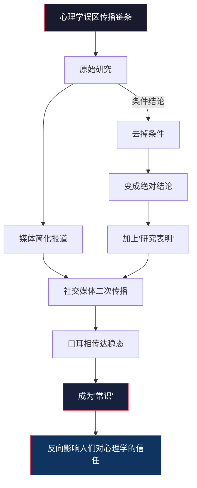
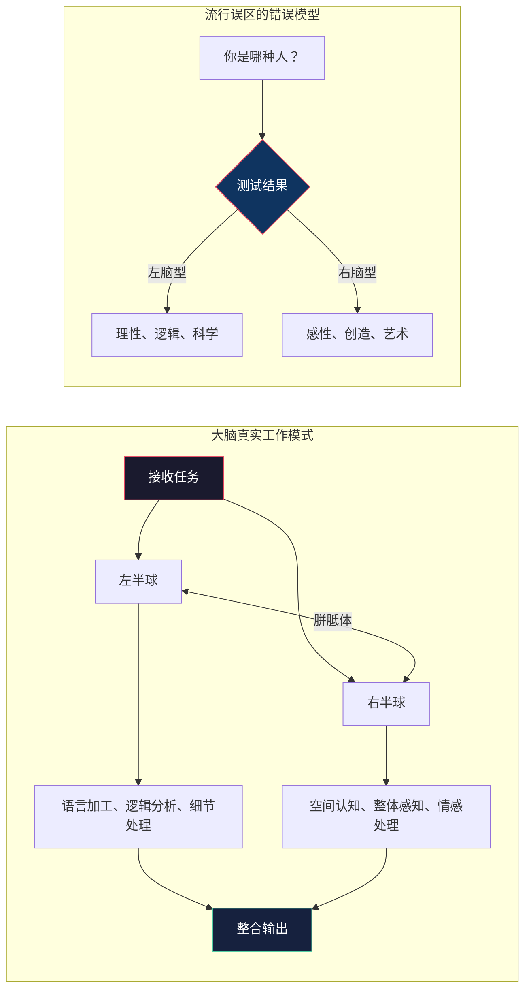
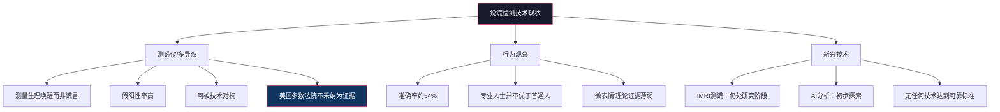
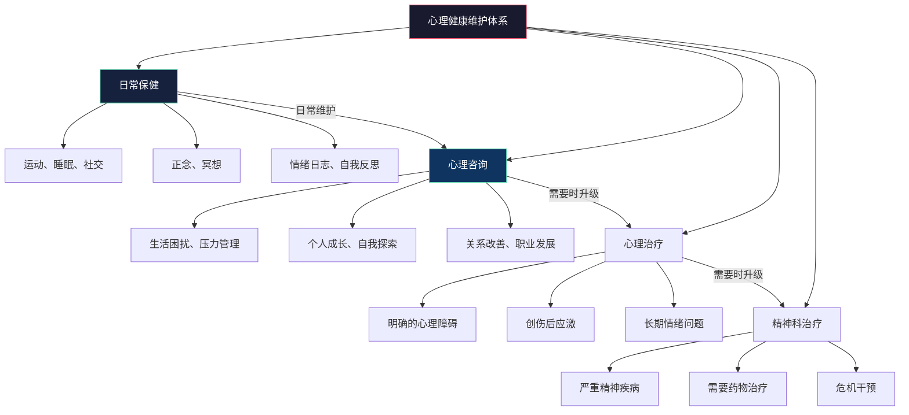
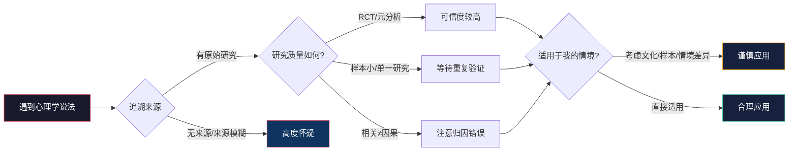

# 心理学十大常见误区：从迷信到科学的认知升级

心理学是被误解最严重的学科之一。打开社交媒体，你会看到"你只用了大脑的10%"、"右脑型人更有创造力"、"性格测试揭示真实的你"之类的说法被大量转发。这些误区之所以危险，不仅因为它们是错的，更因为它们**看起来像科学**——用半真半假的术语包装，引用模糊的"研究发现"，让人难以分辨。

为什么心理学特别容易产生误区？原因有三：

| 因素 | 具体表现 | 为什么心理学特别容易中招 |
|:---|:---|:---|
| **直觉偏差** | 人们倾向于用个人经验替代科学证据 | 心理现象每个人都在经历，所以每个人觉得自己是"专家" |
| **媒体简化** | 复杂研究被简化为标题党 | 心理学研究结论往往有条件限制，简化后变成绝对化断言 |
| **商业利益** | 培训、产品、自媒体需要"爆款"说法 | "10%大脑"比"大脑各区域功能分工复杂"更吸引眼球 |
| **巴纳姆效应** | 模糊描述让人觉得"说的就是我" | 性格测试、星座之所以让人信服，正是利用了这一效应 |

本节逐一拆解十个最广泛流传的心理学误区。每个误区的分析遵循统一框架：**流行说法**→**为什么会有人信**→**科学证据**→**完整真相**→**实操启示**。目标不是让你"知道这是错的"，而是让你掌握**识别心理学误区的方法论**——授人以鱼不如授人以渔。

***

## 误区一：我们只使用了大脑的10%

### 流行说法

"普通人只使用了大脑的10%，如果能激活剩余的90%，就能获得超常的智力或能力。"这个说法被无数培训课程、保健品广告和励志演讲引用，甚至被拍成电影（《超体》Lucy）。有些人将比例改为"只用了20%"或"30%"，但核心逻辑相同：你的大脑有大量"闲置容量"等待开发。

### 为什么会有人信

这个说法之所以经久不衰，因为它满足了三重心理需求：

1. **希望感**：暗示每个人都有巨大的未开发潜能，只要找到"钥匙"就能解锁
2. **简单归因**：把复杂的大脑功能简化为一个容易理解的比喻
3. **商业价值**：任何声称能"激活大脑潜能"的产品都可以借此营销

### 科学证据

这个说法完全没有科学依据。来自多个方向的证据一致否定它：

**神经影像学证据**：fMRI（功能性磁共振成像）和PET（正电子发射断层扫描）研究表明，即使在执行简单任务时，大脑的大部分区域也会出现活跃信号。在24小时内，通过执行不同任务、休息、睡眠等状态的轮换，大脑的**几乎所有区域**都会被使用。没有任何成像研究发现过持续沉默的大脑区域。

**进化论角度**：大脑仅占体重的约2%，却消耗全身约20%的能量（每天约400千卡）。从自然选择的角度看，如果90%的大脑是"闲置"的，进化不会保留如此昂贵的"摆设"。大脑的高能耗恰恰说明它的每一部分都在被充分利用——进化是最高效的"能量审计师"。

**脑损伤研究**：临床神经学的大量案例表明，即使很小的脑损伤也会导致严重的功能障碍。如果90%的大脑是"多余"的，那么大面积脑损伤应该不影响功能——但这与临床事实完全矛盾。Phineas Gage的经典案例（1848年铁棒穿透前额叶导致人格剧变）就是一个早期例证。

**神经退行性疾病**：阿尔茨海默病等神经退行性疾病中，大脑区域的逐步退化直接导致对应功能的丧失。如果存在"闲置"区域，这些区域的退化不应该产生症状——但事实恰恰相反。

**神经科学的基本原则**：神经元遵循"用进废退"原则（Hebb定律："一起放电的神经元连在一起"）。未被使用的神经连接会被修剪（突触修剪），而不是安静等待被"激活"。大脑中不存在"待机模式"的神经元。

### 完整真相

大脑的不同区域负责不同功能，分工明确但协作紧密。你不需要"激活闲置大脑"，你需要的是：

| 真正有效的脑功能优化方法 | 科学机制 | 效果证据 |
|:---|:---|:---|
| **持续学习新技能** | 增强突触连接密度，促进神经可塑性 | 伦敦出租车司机海马体体积增大（Maguire等, 2000） |
| **充足睡眠** | 巩固记忆、清除代谢废物（β-淀粉样蛋白） | 睡眠剥夺后认知测试成绩下降20-30% |
| **有氧运动** | 促进BDNF分泌，增强海马体神经发生 | 每周150分钟运动使认知衰退风险降低30%（Erickson等, 2011） |
| **健康饮食** | 地中海饮食等为大脑提供必需营养素 | MIND饮食将阿尔茨海默病风险降低53%（Morris等, 2015） |
| **社交互动** | 复杂社交认知激活多个脑区协同工作 | 社交活跃者认知衰退速度降低70%（Fratiglioni等, 2004） |

### 实操启示

当你看到任何声称能"激活大脑潜能"的产品或课程时，问自己一个问题：**这个产品能提供什么是持续学习、运动、睡眠和社交不能提供的？** 答案几乎总是"不能"。

***

## 误区二：左脑人理性，右脑人感性

### 流行说法

"左脑型的人理性、逻辑、善于分析；右脑型的人感性、直觉、善于创造。"市面上有大量的"左脑/右脑测试"，企业和教育机构甚至据此设计培训方案。很多人给自己贴上"我是右脑型人"的标签，并以此解释自己的行为偏好。

### 为什么会有人信

1. **二分法的吸引力**：人类大脑喜欢简单的分类框架（男性vs女性、理性vs感性、外向vs内向），左右脑的二分法符合这种认知偏好
2. **部分事实基础**：大脑确实存在功能偏侧化现象（如语言中枢主要在左半球），这让整个说法显得"有道理"
3. **自我认同需求**：给自己贴标签能提供身份认同感和行为解释框架

### 科学证据

**大规模脑成像研究**：2013年，Nielsen等人在PLOS ONE发表了一项分析超过1000人静息态fMRI数据的研究，结果明确显示：**没有任何证据**表明某些人更倾向于使用左脑或右脑。两个半球的功能连接模式在个体间没有系统性差异。

**偏侧化≠偏侧使用**：大脑的功能偏侧化（lateralization）是真实存在的——例如，约95%的右利手者语言处理以左半球为主导。但这不意味着他们"更多地使用左脑"。偏侧化是指某个特定功能由某侧半球主导处理，而不是说某侧半球整体更活跃。

**创造力需要双侧协作**：2008年一项发表在Neuropsychologia上的研究表明，创造性思维需要两个半球的密切配合：右半球提供发散思维和整体模式识别，左半球提供逻辑结构和细节加工。高度创造力的人实际上是**两个半球之间信息传递效率更高**的人。

**为什么偏侧化会被过度解读**：Roger Sperry因裂脑研究获得1981年诺贝尔奖，他的研究对象是胼胝体被切断的癫痫患者——这是极端异常情况。从裂脑患者的研究推广到正常人的"左右脑类型"，是一种严重的过度推广。

### 完整真相

### 实操启示

- **停止给自己贴标签**："我是右脑型人所以不擅长数学"是自我设限，不是事实
- **跨领域学习**：无论你的"偏好"是什么，刻意练习弱项都能带来提升。数学不好的人通过正确方法学习可以变得擅长，创造力不足的人通过发散思维训练可以变得更有创意
- **警惕"脑类型"测试**：任何基于左右脑分类的测试都缺乏科学基础，不应用于自我评估或职业规划

***

## 误区三：记忆像录像机一样精确

### 流行说法

"我清楚地记得那天发生的每一个细节。"人们普遍认为记忆是对过去事件的忠实记录——就像回放录像一样，画面清晰、细节完整、不会出错。当两个人对同一事件有不同记忆时，争论的焦点往往是"谁的记忆更准确"，而不是"记忆本身就是不可靠的"。

### 为什么会有人信

1. **主观体验**：记忆回溯时确实伴随着生动的感觉，让人误以为它是精确的
2. **高信心偏误**：人们对自己的记忆越有信心，就越觉得它准确——但研究表明信心与准确性的相关性很低
3. **日常验证**：大部分日常记忆确实足够准确（比如你记得自己家在哪里），这让人对记忆的可靠性产生过度泛化

### 科学证据

**Elizabeth Loftus的奠基性研究**：Loftus数十年的研究彻底改变了我们对记忆的理解。她的经典"错误信息效应"实验表明，仅仅通过改变提问的措辞（"车辆相接触时速度多少"vs"车辆相撞时速度多少"），就能显著改变被试对车速的估计，甚至影响他们"是否看到碎玻璃"的记忆。

Loftus的"商场迷路"实验更加惊人：通过家人的虚假证词和引导性提问，25%的被试"回忆起"了从未发生过的童年走失事件，并能提供丰富的虚假细节。

**记忆的建构性本质**：认知神经科学研究表明，回忆过程不是简单的"读取"，而是一次"重建"。大脑从多个来源提取碎片化信息（感觉细节、情绪状态、语义知识、场景背景），在前额叶皮层和海马体的协调下重新组装。每次重组都可能引入新元素或丢失旧元素。

**记忆的关键特性**：

| 特性 | 含义 | 经典研究证据 |
|:---|:---|:---|
| **建构性** | 每次回忆都是"重建"而非"回放" | Loftus错误信息效应实验（1974） |
| **可塑性** | 后续信息可以改变原始记忆 | 目击者证词研究系列实验 |
| **想象膨胀** | 想象某事件发生会增加"它确实发生过"的信心 | Garry等人的"想象膨胀"实验（1996） |
| **来源混淆** | 正确记住信息但错误记忆来源 | Johnson的来源监测框架 |
| **情绪增强偏差** | 高情绪唤醒的记忆细节更多，但不一定更准确 | 闪光灯记忆研究（Talarico & Rubin, 2003） |
| **选择性遗忘** | 痛苦经历的某些细节会被主动遗忘 | Anderson的定向遗忘研究 |

**闪光灯记忆的真相**：人们声称对重大事件（如9/11）有"拍照般清晰"的记忆，但Talarico和Rubin（2003）的研究发现，闪光灯记忆虽然更自信，但在准确性上与普通记忆没有显著差异——而且随时间推移衰退得更快。

### 完整真相

记忆不是全有或全无的可靠或不可靠——它是一个**可靠性光谱**：

非常可靠 ◄─────────────────────────────────► 不太可靠
│                                                   │
├─程序性记忆（骑自行车）                            │
├─语义记忆（北京是中国首都）                         │
├─场景记忆（上周做了什么）    ←── 衰退中              │
├─目击者证词（犯罪现场细节）  ←── 高度不可靠           │
└─催眠恢复的记忆            ←── 极度不可靠            │

### 实操启示

- **重要决策不要仅依赖记忆**：会议结论、承诺内容、合同条款——用文字记录下来
- **证人证词需要谨慎对待**：记忆研究是冤假错案的重要研究领域，Innocence Project数据显示约69%的DNA翻案涉及错误的目击者指认
- **与他人记忆不同是正常的**：不是谁在说谎，而是记忆的建构性导致了合理分歧
- **高信心≠高准确性**：不要因为"我记得很清楚"就认为自己一定对
- **记忆是可以被污染的**：避免在事后与他人反复讨论细节——讨论本身可能改变原始记忆

***

## 误区四：测谎仪能准确识别谎言

### 流行说法

"测谎仪能通过检测生理指标来判断一个人是否在说谎。"这是电影和电视剧中最常见的桥段之一——嫌疑人被连上各种传感器，审讯者盯着屏幕上的波动曲线，任何异常都意味着"他说谎了"。

### 为什么会有人信

1. **科技崇拜**：人们倾向于相信技术设备比人类判断更准确
2. **生理反应的直觉逻辑**：说谎→紧张→生理变化，这个因果链"听起来合理"
3. **司法系统的使用**：某些国家的执法机构确实使用测谎仪，这让它获得了"官方认可"的光环

### 科学证据

测谎仪（多导生理记录仪）测量的是四种生理指标：心率、血压、呼吸频率和皮肤电导。它的核心假设是：**说谎导致焦虑，焦虑导致生理变化**。这个假设存在致命缺陷：

**问题一：焦虑不等于说谎**。一个紧张但诚实的人（如被误认为嫌疑人的无辜者）可能表现出与说谎者相同的生理反应。对被审讯的恐惧、对被误解的担忧都会产生生理唤醒。

**问题二：说谎不等于焦虑**。反社会人格特质者、训练有素的情报人员、甚至普通的"冷静说谎者"可以在说谎时保持生理平静。

**问题三：准确性不足**。美国国家科学院2003年的综合评估报告明确指出：测谎仪在实际应用中的假阳性率（将诚实者判断为说谎者）和假阴性率（将说谎者判断为诚实者）都高到不可接受的程度，不应用于高风险的安全决策。

**问题四：存在已知的对抗技术**。已知的反测谎方法包括：在基线问题上故意紧张（控制问题测试的漏洞）、咬舌或脚趾抵地（人为制造生理波动）、服用β受体阻滞剂（降低心率反应）。

**人类的测谎能力同样堪忧**：不借助仪器，纯粹通过观察行为来判断谎言，普通人的准确率约为54%——仅比随机猜测高4个百分点。更令人意外的是，执法人员、心理学家、法官等"专业人士"的准确率并不比普通人显著更高。所谓"微表情测谎"技术在科学界的争议极大，缺乏足够的实证支持。

### 完整真相

### 实操启示

- **不要迷信测谎技术**：任何声称能"百分之百测谎"的产品或服务都是骗局
- **不要过度自信于自己的"识谎"能力**：你没有你以为的那么擅长识别谎言
- **关注证据而非直觉**：在重要决策中，依赖可验证的事实而非对他人诚实性的主观判断
- **理解司法局限**：中国刑事诉讼法明确规定，测谎结果不能作为定案证据——这有充分的科学依据

***

## 误区五：性格测试能准确描述你

### 流行说法

"做完这个测试，你就知道自己是什么样的人了。"MBTI性格测试在全球每年有超过200万人付费参加，企业用它做团队建设和人才招聘，社交媒体上充斥着"INTJ的十大特征""ENFP最适合什么职业"之类的内容。九型人格、DISC等测试也拥有大量信徒。

### 为什么会有人信

1. **巴纳姆效应**（Barnum Effect）：1948年心理学家Bertram Forer的经典实验表明，人们倾向于将模糊的、笼统的人格描述认为是"专门为我定制的"。星座运势和大部分性格测试正是利用了这一效应——描述足够模糊，几乎适用于任何人
2. **自我确认偏误**：人们倾向于注意和记住符合测试结果的信息，忽略不符合的
3. **身份标签的心理需求**：知道自己"是什么类型"能降低身份不确定性，提供归属感
4. **社交货币**："我是INFJ"成为社交话题和群体认同的标签

### 科学证据

**MBTI的信效度问题**：

| 评估维度 | MBTI表现 | 专业标准 |
|:---|:---|:---|
| **重测信度** | 约50%的人在5周后重测得到不同类型 | 专业测评要求>80% |
| **效度** | 对工作绩效的预测力接近零 | 大五人格预测力显著更高 |
| **理论基础** | 基于荣格类型学，荣格本人反对将其固定化 | 需要实证支持的理论框架 |
| **二分法假设** | 将连续维度强行分为两类 | 人格特质呈正态分布 |
| **学术界认可** | 主流人格心理学家几乎不使用 | 大五人格模型获得广泛实证支持 |

MBTI的核心问题在于它将连续的人格维度强行二分。例如，一个人在"外向-内向"维度上的得分如果刚好在中间，MBTI会根据微小的分数差异将其归入E或I——就像把身高170.0cm的人归为"高个"而169.9cm归为"矮个"一样荒谬。

**大五人格模型**（开放性、尽责性、外向性、宜人性、神经质）是目前学术界最广泛认可的人格描述框架，经过跨文化验证，具有更好的信效度。但即使是大五模型，也有其局限性——它描述的是人格倾向，而非确定性标签。

### 完整真相

性格测试不是完全没有价值，但需要正确理解它的定位：

**合理的用途**：
- 作为自我反思的起点（而非终点）
- 促进团队成员相互了解的对话工具
- 培养对个体差异的觉察和尊重

**不合理的用途**：
- 作为招聘筛选或晋升决策的依据
- 作为职业规划的唯一参考
- 作为"认识自己"的最终答案
- 作为解释一切行为的万能框架

### 实操启示

- **对任何性格测试结果持保留态度**：它是对你当前状态的一个快照，不是你本质的定义
- **优先选择有实证支持的工具**：如果需要人格评估，大五人格模型（如NEO-PI-R）比MBTI更可靠
- **警惕"贴标签"的陷阱**：把"我是INTJ"作为拒绝社交的借口，或把"她是ESFP"作为不信任她判断力的理由，都是对测试的误用
- **人比任何测试都复杂**：你的行为受到情境、情绪、经历、成长等无数因素的影响，不是四个字母能概括的

***

## 误区六：催眠可以让人做任何事

### 流行说法

"催眠师可以控制被催眠者，让他们做违背自己意愿的事。"舞台催眠秀中，参与者在催眠师的指令下做出各种滑稽行为，强化了"催眠=失去控制"的印象。电影中的催眠桥段更是将其夸大为一种可以操控人心的超能力。

### 为什么会有人信

1. **舞台催眠的表演效果**：舞台催眠师精心筛选高度易催眠的参与者，利用从众压力和表演性配合
2. **对意识的误解**：人们不了解意识的不同状态，倾向于将催眠理解为"意识关闭"
3. **媒体渲染**：电影和小说将催眠描绘为一种可以完全控制他人的力量

### 科学证据

催眠是一种真实存在的心理状态，有可测量的神经生理基础——高度易催眠者在催眠状态下，前扣带回皮层和前额叶皮层的活动模式确实发生变化。但催眠的**实际能力**远不如流行说法所暗示的：

**核心事实**：

| 流行说法 | 科学事实 |
|:---|:---|
| 催眠让人失去意识 | 被催眠者始终保持意识和自我觉察 |
| 催眠能控制人的行为 | 被催眠者不会执行违背道德和核心意愿的指令 |
| 任何人都能被催眠 | 只有约10-15%的人是高度易催眠的，约15%几乎无法被催眠 |
| 催眠下的记忆更准确 | 催眠反而可能增加虚假记忆的风险（催眠增强的错误记忆效应） |
| 催眠是"睡眠状态" | EEG研究显示催眠状态下的脑电波与清醒状态更相似 |
| 催眠能揭示潜意识真相 | 催眠下产生的"回忆"可能是暗示诱导的虚构产物 |

**为什么舞台催眠"看起来有效"**：舞台催眠师使用了一系列心理学技巧——预先筛选高度易催眠者、利用社会压力（"大家都在看你"）、选择愿意配合的参与者、将自然行为解读为"催眠效果"。多项研究表明，被"催眠"的舞台参与者中，相当一部分是在清醒状态下自愿配合表演。

### 完整真相

催眠的真实价值在于**临床催眠治疗**（Hypnotherapy），这是经过循证研究验证的辅助治疗手段：

- **疼痛管理**：Burns（2003）的元分析表明催眠在减少急性和慢性疼痛方面显著有效
- **焦虑缓解**：催眠可以增强CBT的治疗效果
- **肠易激综合征（IBS）**：英国NICE指南将催眠疗法列为IBS的推荐治疗选项之一
- **戒烟**：催眠辅助戒烟有一定效果，但单独使用的证据不一致

### 实操启示

- **不要害怕催眠**：你不会被"控制"去做违背意愿的事
- **对催眠持开放但审慎的态度**：它是一种有价值的辅助工具，但不是万能的
- **远离声称能用催眠"揭示真相"或"控制他人"的人**
- **如果你有兴趣尝试催眠治疗**，寻找有正规资质的心理治疗师，而非舞台表演者

***

## 误区七：智力是固定不变的

### 流行说法

"智商是天生的，无法改变。""聪明的人天生就聪明，不聪明的人怎么努力也没用。"这种说法常被用来解释学业成绩差异、职业成就差距，甚至被用作种族主义和阶级歧视的"科学依据"。

### 为什么会有人信

1. **基因决定论的吸引力**：简单的因果归因比复杂的多因素解释更容易被接受
2. **成绩差异的直观性**：人们看到不同个体之间的智力差异确实存在，倾向于归因于先天因素
3. **固定型思维的自我保护**："我天生不聪明"比"我不够努力"更容易被接受，因为后者涉及自责

### 科学证据

智力既有遗传成分，也受环境显著影响。以下是关键证据：

**遗传率的正确理解**：智力的遗传率约为50%（Bouchard & McGue, 1981；后续大量研究反复验证）。但"50%遗传率"不意味着"50%由基因决定"。遗传率是一个**群体统计概念**——它描述的是在某个特定环境中，群体中智力差异有多大比例可以用基因差异来解释。当环境条件改变时（如营养改善、教育普及），遗传率的数值本身也会改变。

**弗林效应**（Flynn Effect）：James Flynn发现，全球范围内，平均智商分数在过去100年里持续上升，每十年约3分。在美国，从1932年到1997年，平均IQ提高了约18分。这个效应**只能用环境因素**解释——基因库在几十年内不可能发生如此大的变化。原因可能包括营养改善、教育普及、环境复杂性增加、疾病减少等。

**流体智力vs晶体智力**：

| 维度 | 流体智力 | 晶体智力 |
|:---|:---|:---|
| **定义** | 解决新问题、识别模式的能力 | 积累的知识和技能 |
| **测量** | 瑞文推理测验、数列推理 | 词汇量、常识测验 |
| **发展曲线** | 青年期达到高峰，中年后下降 | 持续增长到老年期 |
| **可训练性** | 有限但存在（如工作记忆训练） | 高度可训练（通过学习和教育） |
| **对成就的影响** | 预测学习新技能的速度 | 预测专业知识和职业表现 |

**认知训练的效果**：虽然对流体智力的大规模提升仍有争议，但特定训练确实能提升特定能力。例如，双N-back工作记忆训练在部分研究中显示出对流体智力的正向迁移效果（Jaeggi等, 2008），尽管后续研究对效应大小存在分歧。

**成长型思维的力量**：Carol Dweck的研究表明，相信智力可以通过努力发展的学生（成长型思维），在学业表现上显著优于相信智力是固定的（固定型思维）的学生。这种信念本身就是影响智力发展的一个因果变量。

### 完整真相

智力不是"固定"与"可变"的二元问题，而是一个**在遗传框架内受环境调节的动态系统**。就像身高一样——基因设定了一个可能的范围，但营养、健康、运动等环境因素决定了你在这个范围内能达到的具体位置。

### 实操启示

- **拒绝"天生笨"的自我标签**：这种标签不仅不准确，还会通过自我实现预言限制你的发展
- **投资于可训练的维度**：晶体智力（知识和技能）几乎可以通过终身学习持续增长
- **采用成长型思维**：将挑战视为学习机会而非能力证明，将失败视为反馈而非判决
- **优化环境条件**：充足睡眠、规律运动、持续学习、减少压力——这些环境因素对认知能力有实质影响

***

## 误区八：童年经历决定一切

### 流行说法

"三岁看大，七岁看老。""童年的创伤会跟随你一辈子。""性格在幼年就定型了，改不了。"这种决定论观点在大众心理学中非常流行，部分源于对弗洛伊德理论的过度简化解读。

### 为什么会有人信

1. **弗洛伊德理论的文化渗透**：精神分析的核心观点之一是早期经历对人格的决定性影响，这一观点已经深入大众文化
2. **因果叙事的吸引力**：把成年问题追溯到童年，提供了一个清晰的因果故事
3. **心理治疗中的发现**：治疗中确实经常发现早期经历与当前问题的关联，这强化了"童年决定论"的印象

### 科学证据

早期经历确实重要，但"决定一切"的说法严重夸大了事实：

**人格发展的可塑性**：大量纵向研究表明，人格特质在成年后仍然可以发生显著变化。Roberts等人（2006）的元分析发现，尽责性和宜人性通常随年龄增长而提高，神经质有所下降——这些变化持续到60岁以上。

**重大生活事件的影响**：创伤、治疗、重要关系、职业转变等重大生活经历都可以在成年期引起可测量的人格特质变化。Roberts和Mroczek（2008）指出，人格变化在任何年龄段都可能发生。

**有意识的改变是可能的**：Hudson和Fraley（2015）的研究表明，当人们设定目标并持续练习时，可以在相当程度上改变自己的人格特质。例如，想要变得更外向的人，通过有意识地增加社交行为，确实可以逐渐变得更外向。

**关键区分：影响≠决定**：

| 错误的决定论观点 | 更准确的理解 |
|:---|:---|
| 童年创伤决定一生 | 童年创伤增加风险，但许多人展现出非凡的韧性 |
| 依恋类型在1岁就定型 | 依恋类型可以在成年关系中改变（Earned Security概念） |
| 人格在3岁定型 | 人格特质相对稳定但持续可变，关键转变点分布在全生命周期 |
| 错过关键期就完了 | 关键期的概念被过度泛化，大多数能力在关键期后仍可发展 |

**韧性研究的力量**：发展心理学中最重要的发现之一是**人类的韧性**（resilience）。大量高风险纵向研究（如Kauai纵向研究，Werner & Smith, 1982）发现，即使在极端不利的童年环境中，约1/3的个体仍然发展出良好的适应能力。保护性因素包括：至少一个稳定的支持性成人关系、自我效能感、问题解决能力。

### 完整真相

童年经历的重要性不应被否认——它们确实会影响人格发展、情绪调节模式、关系模式等。但影响的大小和方向受到**后续经历的调节**。一个在不安全依恋中长大的人，可以通过安全的成人关系、心理治疗和有意识的自我工作，发展出"获得性安全依恋"（Earned Security）。

### 实操启示

- **不要用童年经历为自己的一切问题找借口**：理解过去是为了更好地改变现在，而非为现状辩护
- **重视但不迷信"关键期"**：虽然早期干预确实重要，但任何年龄的成长和改变都是可能的
- **如果有未处理的童年创伤**：寻求专业心理治疗（如EMDR、认知加工治疗）是有效的，不是"沉溺于过去"
- **你有能力成为自己想成为的人**：你的过去影响你，但不定义你

***

## 误区九：积极思维能解决一切问题

### 流行说法

"只要你足够积极，一切都会好起来。""吸引力法则：你吸引你所想的。""不要有负面想法，负面想法会吸引负面结果。"这类说法在成功学、灵修圈和自我提升社群中极为流行，畅销书《秘密》（The Secret）就是这一观点的典型代表。

### 为什么会有人信

1. **控制感的需求**：在面对不确定性和困难时，"只要我积极思考就能改变结果"提供了一种虚假的控制感
2. **积极心理学的误读**：积极心理学的研究发现被过度简化和扭曲
3. **幸存者偏差**：成功人士回顾自己的经历时，倾向于归因于"积极心态"，忽略了其他因素和失败者同样积极但未成功的反例
4. **商业驱动**：积极心态产业（书籍、课程、教练、产品）是一个价值数十亿美元的市场

### 科学证据

积极心理学的研究确实证明了乐观思维的诸多好处——乐观者有更强的免疫系统、更好的心血管健康、更长的寿命、更高的工作绩效。但关键在于，**积极心理学≠盲目乐观**。

**毒性积极性**（Toxic Positivity）：强迫自己只感受积极情绪、压抑和否认负面情绪，反而会导致更大的心理问题。这种"必须积极"的压力本身成为了一种新的压力源。心理治疗中有一个重要概念叫"情绪压抑的反弹效应"——越是压制某种想法或情绪，它越会频繁出现（Wegner的"白熊实验"，1987）。

**积极幻想的反效果**：Gabriele Oettingen的系列研究（从1990年代持续至今）发现了一个惊人的现象——单纯的积极幻想（visualization of positive outcomes）实际上会**降低动力和行动力**。原因是大脑在想象成功时会提前体验到成功的愉悦感，身体指标（血压下降）表明大脑已经"享受"过了，从而减少了采取实际行动的驱动力。

**WOOOOP方法**：Oettingen基于她的研究提出了更有效的替代方案：

| 步骤 | 内容 | 作用 |
|:---|:---|:---|
| **W**（Wish）愿望 | 明确你想要什么 | 设定目标方向 |
| **O**（Outcome）结果 | 想象最好的结果 | 激发动力 |
| **O**（Obstacle）障碍 | 想象实现过程中最大的障碍 | 唤醒对现实的警觉 |
| **P**（Plan）计划 | 制定"如果-那么"应对计划 | 将障碍转化为行动触发器 |

**现实的乐观主义vs盲目的乐观主义**：

| 维度 | 盲目的乐观主义 | 现实的乐观主义 |
|:---|:---|:---|
| **对困难的态度** | 忽视或否认 | 直面并准备应对 |
| **对负面情绪** | 压制和回避 | 接纳并从中获取信息 |
| **行动模式** | 期待"宇宙"回应积极想法 | 制定具体计划并执行 |
| **面对失败** | 更积极地想！ | 分析原因，调整策略 |
| **研究支持** | 效果不确定或负面 | 与更好的成就和心理健康相关 |

### 完整真相

积极思维是一种有价值的认知工具，但它不是万能药，更不应该成为压制真实情感的工具。真正有效的心理策略是**心理灵活性**（Psychological Flexibility）——能够根据情境的需要，在积极和现实之间灵活切换，接纳全部情绪体验（包括负面的），同时保持与个人价值观一致的行动方向。

### 实操启示

- **允许自己有负面情绪**：愤怒告诉你边界被侵犯，悲伤告诉你某些东西对你很重要，焦虑提醒你关注潜在威胁
- **用"现实的乐观"替代"盲目的乐观"**：乐观应该是对自身应对能力的信心，而非对万事顺利的期待
- **练习WOOOOP方法**：下次设定目标时，先想象最好的结果，再想象最大的障碍，然后制定应对计划
- **警惕"吸引力法则"的逻辑陷阱**：如果人生病了是因为"想得不够积极"，那就是在受害者身上寻找原因——这是一种有害的归因方式

***

## 误区十：心理治疗只是"聊天"，只有"心理有病"的人才需要

### 流行说法

"去看心理咨询就是心理有问题。""和朋友聊聊不就行了？""心理咨询就是花钱找人听你说话。""我没有疯，不需要看心理医生。"这种观点在中国文化背景下尤为普遍，对心理咨询的污名化导致大量需要帮助的人不敢或不愿寻求专业支持。

### 为什么会有人信

1. **对心理治疗的不了解**：大多数人没有接受过心理咨询，不知道具体过程和机制
2. **污名化**：社会文化中将"心理问题"等同于"软弱"或"疯了"，寻求心理帮助被视为可耻
3. **"朋友聊天"的替代**：人们认为社交支持可以完全替代专业心理帮助
4. **身体-心理二元论**：人们习惯于为身体问题就医（感冒去医院），但对心理问题的求助犹豫不决

### 科学证据

心理治疗是基于科学证据的专业干预，有大量随机对照试验和元分析支持其有效性：

**有效性证据**：Hofmann等人（2012）在Cognitive Therapy and Research上发表的大规模元分析表明，CBT（认知行为治疗）对抑郁症、广泛性焦虑障碍、社交焦虑障碍、恐慌障碍、PTSD、强迫症等多种心理障碍有显著疗效，效果量（effect size）与药物治疗相当，且在随访中效果更持久。

**心理治疗改变大脑**：神经影像学研究显示，有效的心理治疗可以引起可测量的大脑结构和功能变化。例如，CBT治疗抑郁症后，前额叶皮层的活动增加，杏仁核的过度反应减弱——这与SSRI类药物治疗后的脑部变化方向一致，说明"谈话"确实能改变大脑。

**心理治疗vs聊天的关键区别**：

| 维度 | 和朋友聊天 | 专业心理治疗 |
|:---|:---|:---|
| **理论基础** | 个人经验和直觉 | 循证心理学理论和研究 |
| **技术** | 倾听、建议、安慰 | 结构化技术（认知重建、暴露治疗、行为激活等） |
| **目标** | 一般性支持 | 明确的、可测量的治疗目标 |
| **关系** | 双向的社交关系 | 专业的治疗联盟，聚焦于来访者的需求 |
| **偏见** | 朋友倾向于认同你 | 治疗师提供客观、专业的视角 |
| **保密性** | 社交圈内可能扩散 | 法律保护的严格保密 |
| **训练** | 无专业训练 | 数千小时的专业培训和督导 |

**心理治疗不只是治疗疾病**：心理咨询的应用范围远超"心理疾病"——它同样适用于个人成长、关系改善、职业发展决策、压力管理、自信心建立、生活意义探索等方面。许多接受心理咨询的人并没有任何心理障碍，他们只是想更好地了解自己、提升生活质量。

### 完整真相

### 实操启示

- **消除污名化认知**：寻求心理帮助是自我关怀的表现，是勇气和智慧的体现，不是软弱的标志
- **不要等到"崩溃"才求助**：心理咨询最好的使用时机是问题还在早期阶段时
- **选择有资质的专业人员**：在中国，关注咨询师是否具备国家心理咨询师资格（或CPS注册系统注册）、是否有持续督导
- **了解不同疗法的适用场景**：CBT适合焦虑和抑郁、EMDR适合创伤、DBT适合情绪调节困难、ACT适合价值观和意义探索
- **日常心理保健同样重要**：运动、睡眠、社交、正念——这些不需要专业人员就能实施的心理保健习惯，是心理健康的第一道防线

***

## 超越十大误区：心理学素养的方法论

以上十个误区只是冰山一角。每天都有新的"心理学发现"出现在社交媒体上，其中不少经不起推敲。与其记住这十个具体误区，不如掌握**识别心理学误区的方法论**——这才是真正受益终身的能力。

### 心理学素养的六条原则

#### 原则一：追溯原始来源

"研究表明"是最廉价的说服工具。遇到任何心理学说法时，第一步是找到原始研究。问自己：这是哪个研究？发表在什么期刊上？样本量多大？如果一个说法反复出现但始终找不到原始研究出处，它很可能是以讹传讹。

#### 原则二：区分科普与科学

科学论文的结论通常有严格的条件限制（"在X条件下，对于Y样本，Z效应显著存在"）。媒体和科普在传播时会去掉这些条件，变成绝对化断言。"适量饮酒有益健康"比"在特定条件下，某些类型的酒精摄入与某些心血管指标之间存在统计相关性"传播得更广——但前者是对后者的严重扭曲。

#### 原则三：理解相关不等于因果

"冰淇淋销量与溺水事件正相关"——这个例子说明了相关≠因果的经典逻辑（两者都由第三个变量"夏季高温"驱动）。心理学研究中类似的相关陷阱比比皆是。"快乐的人更长寿"是相关还是因果？也许更健康的人既更快乐也更长寿——健康是第三个变量。

#### 原则四：关注效应大小和可重复性

"统计显著"不等于"实际重要"。一个研究发现了显著差异，但效应量只有0.1（微小），在实际生活中几乎感受不到。同时，心理学领域存在"可重复性危机"——Open Science Collaboration（2015）尝试重复100项心理学研究，只有36%得到了原始结论。不要仅凭单一研究下结论。

#### 原则五：考虑文化边界

大多数心理学研究在WEIRD样本（Western, Educated, Industrialized, Rich, Democratic）上进行。Henrich等人（2010）在Behavioral and Brain Sciences上的经典论文指出，WEIRD人群是人类群体中的极端异常值，不代表全人类。一个在美国大学生身上发现的心理学效应，不一定在中国成年人身上同样成立。

#### 原则六：保持知识更新

心理学是一个不断自我修正的学科。十年前的"定论"可能已被新的证据推翻或修正。例如，"权力姿势"（Power Posing）最初的研究声称摆出扩展性姿势能提高睾酮和自信，但后续大规模重复研究大幅弱化了这一结论。对过时知识的固守比无知更危险。

### 快速检验清单

遇到一个心理学说法时，用以下清单快速评估：

| 检查项 | 红旗信号 | 绿旗信号 |
|:---|:---|:---|
| **来源** | "研究表明"但不指明哪个研究 | 有明确的论文引用或可追溯的来源 |
| **绝对化** | "所有人都""一定""永远" | "在某些条件下""对于大多数人" |
| **简单归因** | 单一因素解释复杂行为 | 承认多因素交互作用 |
| **新奇性** | "颠覆性发现""震惊发现" | 在已有研究基础上的渐进进展 |
| **商业利益** | 研究结论与产品推广捆绑 | 独立研究，无明显利益冲突 |
| **样本** | 不提样本信息，或样本极小 | 大样本、跨文化、预注册研究 |

***

## 总结：从"知道这是错的"到"知道为什么以及怎么办"

本节的十个误区可以归为四大类认知陷阱：

| 认知陷阱 | 涉及的误区 | 核心问题 |
|:---|:---|:---|
| **简化归因** | 大脑10%、左右脑、智力固定 | 将复杂系统简化为单一因素 |
| **绝对化思维** | 记忆精确、童年决定论、性格定型 | 将光谱式现象理解为非黑即白 |
| **因果错觉** | 测谎仪、积极思维万能 | 将相关误认为因果，忽视条件限制 |
| **污名化与标签化** | 性格测试万能、心理治疗=有病 | 用标签替代理解，用偏见替代证据 |

建立准确的心理学认知不是一次性的知识更替，而是一种**持续的思维习惯**。每一次你对一个"心理学常识"保持了健康的怀疑，每一次你追问了"这个结论的证据是什么"，你都在强化自己的心理学素养。

最终，心理学素养的价值不仅在于避免被误导——它在于帮助你**更真实地理解自己和他人**。当你不再相信"大脑只用了10%"时，你才能开始真正理解大脑的精妙；当你不再相信"性格无法改变"时，你才能开始真正的自我成长。

> 知识的敌人不是无知，而是确信自己已经知道的幻觉。——丹尼尔·J·布尔斯廷
