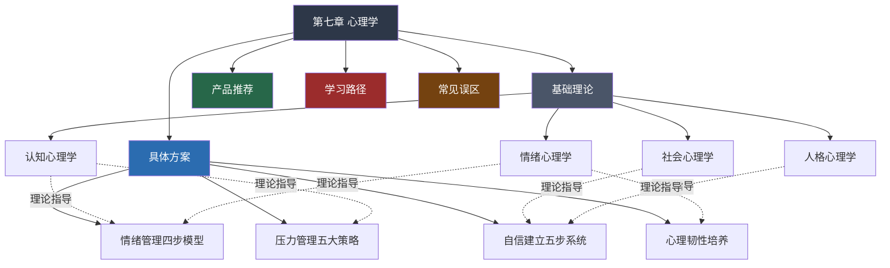
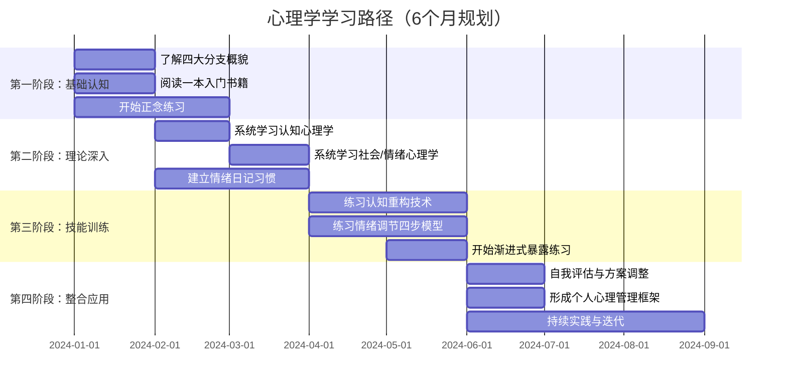

# 第七章小结：心理学

## 本章总览

本章以"认识自己"为核心主线，从认知、社会、情绪、人格四大心理学分支出发，构建了一套从理论理解到日常实践的完整心理学知识体系。下图展示了本章的逻辑结构和各节之间的关联：

## 一、核心理论要点

### 1.1 认知心理学——理解"如何思考"

认知心理学关注人类信息加工的完整链条，从输入到输出的每个环节都有优化空间：

| 认知环节 | 核心机制 | 关键发现 | 实践启示 |
|---------|---------|---------|---------|
| **注意力** | 选择性注意、注意资源有限 | 人无法真正"多任务"，切换成本约15-25分钟 | 单任务工作法、番茄钟、减少干扰源 |
| **记忆** | 编码→存储→提取三阶段 | 间隔重复比集中复习效率高200-400% | Anki卡片、艾宾浩斯复习计划 |
| **思维** | 系统1（快思考）与系统2（慢思考） | 大部分决策由系统1自动完成，存在系统性偏误 | 重要决策强制启动系统2：列清单、延迟判断 |
| **元认知** | 对自身认知过程的监控与调节 | 元认知能力是学业成就最强预测因子之一 | 学习后自问"我真的理解了吗？""我的方法有效吗？" |

**核心洞见**：认知能力不是固定天赋，而是可以通过刻意练习优化的技能。知道"注意力有限"不是为了自责，而是为了设计更好的工作环境；知道"记忆会遗忘"不是为了焦虑，而是为了采用更科学的复习策略。

### 1.2 社会心理学——理解"人在社会中如何行动"

社会心理学揭示了一个令人不安的事实：我们的行为和想法，远比自己以为的更受环境和他人的影响。

**六大核心效应及其应对**：

**从众效应（Conformity）**：Solomon Asch的经典实验表明，即使答案明显错误，约75%的人至少会从众一次。应对策略：在群体讨论前先独立写下自己的判断，避免被"第一个发言者"锚定。

**服从权威（Obedience）**：Milgram实验中65%的普通人愿意对他人施加致命电击，仅仅因为"权威人士"要求。应对策略：对任何"权威要求"保持审问——"这个人真的是这个领域的专家吗？""这个要求合理吗？"

**基本归因错误（Fundamental Attribution Error）**：我们倾向于将他人的失败归因于人格（"他就是懒"），将自己的失败归因于环境（"我最近太忙"）。应对策略：评价他人时先考虑情境因素，评价自己时先审视自身因素。

**旁观者效应（Bystander Effect）**：在场人数越多，个体提供帮助的概率越低。应对策略：紧急情况下指定具体的人（"穿红衣服的先生，请拨打120"），而不是泛泛呼救。

**刻板印象（Stereotype）**：大脑自动将人归类并赋予特征，这一过程在100毫秒内完成。应对策略：意识到"我正在做归类判断"，主动寻找反例来修正认知模型。

**光环效应（Halo Effect）**：对一个人某方面的正面评价会"辐射"到其他方面。应对策略：招聘、评价等场景中使用结构化评分表，独立评估每个维度。

### 1.3 情绪心理学——理解"感受从何而来"

情绪心理学的核心框架是**认知评价理论**（Cognitive Appraisal Theory）：同一事件，不同的认知解读会产生完全不同的情绪反应。

事件 → 认知评价 → 情绪反应 → 行为倾向

示例：
工作被拒绝 → "我不够好" → 沮丧/自我怀疑 → 退缩/放弃
工作被拒绝 → "方向不对，调整就好" → 遗憾/动力 → 复盘/再试

**情绪的功能**（不是bug，是feature）：

- **恐惧**：信号——"有威胁，需要应对"。功能：保护安全。过度时：焦虑症。
- **愤怒**：信号——"边界被侵犯"。功能：保护权益。过度时：攻击行为。
- **悲伤**：信号——"失去了重要的东西"。功能：促进反思和求助。过度时：抑郁症。
- **快乐**：信号——"需求得到满足"。功能：强化有益行为。过度时：依赖成瘾。
- **厌恶**：信号——"有害物质/行为"。功能：保护健康。过度时：偏见和歧视。

**情绪智力的四个层级**（Daniel Goleman模型）：

1. **自我觉察**：能准确识别自己当下的情绪状态（"我现在感到焦虑，不是生气"）
2. **自我管理**：能在情绪升起后做出合理的行为选择（"我虽然愤怒，但不会摔东西"）
3. **社会觉察**：能识别他人的情绪状态和需求（"他看起来很沮丧，需要支持而非建议"）
4. **关系管理**：能在社交场景中有效管理情绪互动（"这个人现在很激动，我先倾听再回应"）

### 1.4 人格心理学——理解"我是谁"

**大五人格模型**（Big Five / OCEAN）是目前心理学界最被广泛接受的人格框架：

| 维度 | 高分特征 | 低分特征 | 职业相关性 |
|-----|---------|---------|----------|
| **开放性（Openness）** | 好奇、创新、喜欢新体验 | 务实、保守、偏好常规 | 高分适合创意类，低分适合执行类 |
| **尽责性（Conscientiousness）** | 自律、有条理、目标导向 | 随性、灵活、不拘小节 | 高分是几乎所有职业成功的最强预测因子 |
| **外向性（Extraversion）** | 热情、社交、精力充沛 | 内敛、独立、偏好独处 | 高分适合销售/管理，低分适合研发/写作 |
| **宜人性（Agreeableness）** | 合作、信任、体贴 | 竞争、怀疑、直率 | 高分适合服务类，低分适合谈判/审计 |
| **神经质（Neuroticism）** | 情绪波动大、易焦虑 | 情绪稳定、冷静 | 低分有利于高压工作环境 |

**自我效能感**（Self-Efficacy）是Albert Bandura提出的最关键心理变量之一——它不是"我有能力做这件事"的客观评估，而是"我相信自己能做成这件事"的主观信念。自我效能感的四个来源（按影响力排序）：

1. **成功经验**（最强来源）：做成过的事最能建立信心。策略：从小目标开始，积累"我做到了"的经验。
2. **替代经验**：看到和自己相似的人成功了。策略：找"参照人物"，不找"仰望对象"。
3. **言语说服**：他人的鼓励和反馈。策略：主动寻求教练/导师的指导。
4. **生理和情绪状态**：焦虑时自我效能感下降。策略：通过运动、呼吸练习管理生理状态。

## 二、实践方案速览

### 2.1 方案对比总览

| 方案 | 核心模型 | 适用场景 | 见效周期 | 难度 |
|-----|---------|---------|---------|-----|
| 情绪管理 | 觉察→理解→调节→适应 | 情绪波动大、易冲动 | 2-4周 | ★★☆ |
| 自信建立 | 觉察→重构→暴露→身体→自我同情 | 自卑、社交焦虑、冒名顶替综合征 | 1-3个月 | ★★★ |
| 压力管理 | 认知重评+问题解决+放松+生活方式+免疫 | 长期高压、职业倦怠 | 2-6周 | ★★☆ |
| 心理韧性 | 成长思维+意义建构+叙事重构+习惯+支持系统 | 面对重大挫折、人生转折 | 3-6个月 | ★★★★ |

### 2.2 关键工具箱

**最值得立刻开始的三个练习**：

**① 正念呼吸（每天10分钟）**
- 坐姿端正，闭眼或半闭
- 关注呼吸的感觉：空气进入鼻腔的凉感、胸腹的起伏
- 思绪飘走时（一定会），温柔地把注意力拉回呼吸，不评判
- 用APP辅助计时和引导（推荐：Headspace、潮汐、小睡眠）

**② 情绪日记（每天3次）**
记录格式：
时间：____
情绪：____（用精确的词，不要只写"不好"）
强度：1-10分
触发事件：____
我的解读：____
替代解读：____（试着换一个角度看）

**③ 认知重构（遇到负面自动思维时）**
三栏法：

| 自动思维 | 认知偏误类型 | 替代想法 |
|---------|------------|---------|
| "我总是搞砸" | 以偏概全 | "这次没做好，但之前有成功的经验" |
| "他们一定在嘲笑我" | 读心术 | "我不知道他们在想什么，也许根本没注意我" |
| "这下完了" | 灾难化 | "最坏的结果是什么？我能应对吗？" |

## 三、推荐资源

### 3.1 分层阅读路径

**入门（零基础友好，建立兴趣）**：
- 《心理学与生活》Richard Gerrig——最经典的心理学入门教材，通俗易懂
- 《思考，快与慢》Daniel Kahneman——诺贝尔奖得主讲认知偏误，改变你看世界的方式
- 《情商》Daniel Goleman——情绪智力概念的奠基之作

**进阶（有一定基础，想深入某领域）**：
- 《自控力》Kelly McGonigal——斯坦福大学自控力科学课程的文字版
- 《自我同情》Kristin Neff——对自己好一点的科学方法
- 《非暴力沟通》Marshall Rosenberg——改变沟通方式就能改变关系质量

**专业（想系统学习）**：
- 《社会心理学》David Myers——社会心理学标准教材
- 《认知心理学》Robert Sternberg——认知科学系统入门
- 《人格心理学》Jerry Burger——大五人格和人格理论全景

### 3.2 数字工具推荐

| 工具类型 | 推荐 | 用途 | 平台 |
|---------|------|------|------|
| 正念冥想 | Headspace / 潮汐 / 小睡眠 | 引导冥想、白噪音 | iOS/Android |
| 情绪追踪 | Daylio / 心情日记 | 记录情绪变化趋势 | iOS/Android |
| 习惯养成 | Habitica / 打卡 | 建立日常心理练习习惯 | iOS/Android |
| 认知训练 | Lumosity / Peak | 注意力、记忆等认知能力训练 | iOS/Android |
| 专业咨询 | 简单心理 / 壹心理 | 在线心理咨询预约 | Web/App |

## 四、学习路径总结

## 五、十大心理学误区速查表

| 误区 | 真相 | 来源 |
|-----|------|------|
| 人只用了10%的大脑 | 大脑各区域都有功能，即使睡眠时也在活跃工作 | 脑成像研究（fMRI/PET） |
| 有人是左脑型，有人是右脑型 | 任何复杂任务都需要两个半球协作 | Nielsen et al., 2013 |
| 记忆像录像机一样忠实 | 记忆是重构性的，每次回忆都会被修改 | Elizabeth Loftus的虚假记忆研究 |
| 测谎仪能准确识别谎言 | 准确率约60-70%，与抛硬币差距不大 | National Research Council, 2003 |
| 抑郁症只是"想太多" | 是涉及神经递质、基因、环境的复杂疾病 | DSM-5诊断标准 |
| 催眠能让人做不想做的事 | 催眠状态下人仍保有判断力和拒绝能力 | 治疗性催眠研究 |
| 智力是固定不变的 | 智力可以被环境、教育、训练所影响 | Flynn效应研究 |
| 三岁看大，性格终身不变 | 人格在一生中都有变化，尤其在20-40岁 | Roberts & Mroczek, 2008 |
| 积极思维能解决一切 | 有毒的积极性会压抑真实情感 | "The Power of Negative Thinking" |
| 心理治疗就是聊天 | 有循证基础的疗法（CBT等）效果已通过大量RCT验证 | APA循证治疗指南 |

## 六、关键行动清单

读完本章后，按以下优先级分阶段行动：

### 立即行动（本周内）

- [ ] **开始正念练习**：每天10分钟正念呼吸，使用APP辅助（推荐潮汐或Headspace）。不追求"完全不走神"，只需要在走神时温柔地拉回来。
- [ ] **建立情绪日记**：每天至少记录3次情绪状态（起床后、午饭后、睡前），使用时间+情绪+强度+触发事件+解读的格式。
- [ ] **做一次自我评估**：用大五人格的在线测试（推荐NEO-PI简化版）了解自己的人格轮廓。

### 短期行动（本月内）

- [ ] **选择一本入门书开始阅读**：从《心理学与生活》或《思考，快与慢》中选一本，每天读20分钟。
- [ ] **识别最需要提升的领域**：回顾本章内容，问自己"我在情绪管理/自信/压力/韧性中哪个最弱？"，选择对应方案开始第一周的练习。
- [ ] **开始认知重构练习**：每天至少识别1个自动思维，用三栏法记录并替换。

### 长期行动（持续进行）

- [ ] **培养心理学视角**：在日常生活中主动观察心理学效应——"刚才这个广告用了什么说服技术？""我刚才为什么会对这句话这么生气？"
- [ ] **建立心理韧性习惯**：每周写一次"逆境复盘"——这周遇到了什么困难？我怎么解读的？有什么成长？
- [ ] **定期自评**：每季度做一次心理状态自评，对比之前的结果，观察变化趋势。

## 七、本章知识体系完整索引

为方便日后查阅，以下是本章所有知识点和工具的快速索引：

### 概念索引

| 概念 | 所属领域 | 核心定义 |
|-----|---------|---------|
| 选择性注意 | 认知心理学 | 大脑从海量信息中筛选关注对象的机制 |
| 工作记忆 | 认知心理学 | 临时存储和加工信息的认知系统，容量约7±2项 |
| 元认知 | 认知心理学 | 对自身认知过程的认知，即"关于思考的思考" |
| 从众效应 | 社会心理学 | 个体在群体压力下改变行为或信念的倾向 |
| 基本归因错误 | 社会心理学 | 过度归因于人格、低估情境因素的系统性偏误 |
| 认知评价理论 | 情绪心理学 | 情绪取决于对事件的认知解读，而非事件本身 |
| 情绪智力 | 情绪心理学 | 识别、理解和管理自己及他人情绪的能力 |
| 大五人格 | 人格心理学 | 开放性、尽责性、外向性、宜人性、神经质五维度模型 |
| 自我效能感 | 人格心理学 | 个体对自己能否完成特定任务的信念 |
| 成长型思维 | 人格心理学 | 相信能力可以通过努力发展的信念系统 |
| 心理韧性 | 综合应用 | 从逆境中恢复并实现成长的能力 |

### 工具索引

| 工具名称 | 适用场景 | 使用频率 | 所属方案 |
|---------|---------|---------|---------|
| 正念呼吸 | 日常觉察训练 | 每天10分钟 | 情绪管理 |
| 情绪日记 | 情绪追踪与模式识别 | 每天3次 | 情绪管理 |
| 认知重构三栏法 | 识别和替换负面自动思维 | 每遇负面思维时 | 自信建立 |
| 渐进式暴露阶梯 | 系统脱敏，克服恐惧 | 每周2-3次 | 自信建立 |
| 4-7-8呼吸法 | 快速降低生理唤醒水平 | 压力来袭时 | 压力管理 |
| 渐进式肌肉放松 | 深度放松，改善睡眠 | 每天1次 | 压力管理 |
| 压力免疫预演 | 提前应对高压场景 | 重要事件前 | 压力管理 |
| 逆境叙事重构 | 将挫折重新解读为成长 | 遇到重大挫折后 | 心理韧性 |
| 感恩日记 | 培养积极关注习惯 | 每天1次 | 心理韧性 |

## 最后的话

心理学学习的终极目标不是成为心理学专家，而是成为更了解自己的人。当你能够觉察自己的情绪、理解自己的思维模式、识别社会环境的影响、善待自己的不完美时，你就已经在心理学上"毕业"了——不是知识的毕业，而是智慧的开始。

> "知人者智，自知者明。"——《道德经》

认识自己，是一切个人提升的起点，也是终身的修行。
