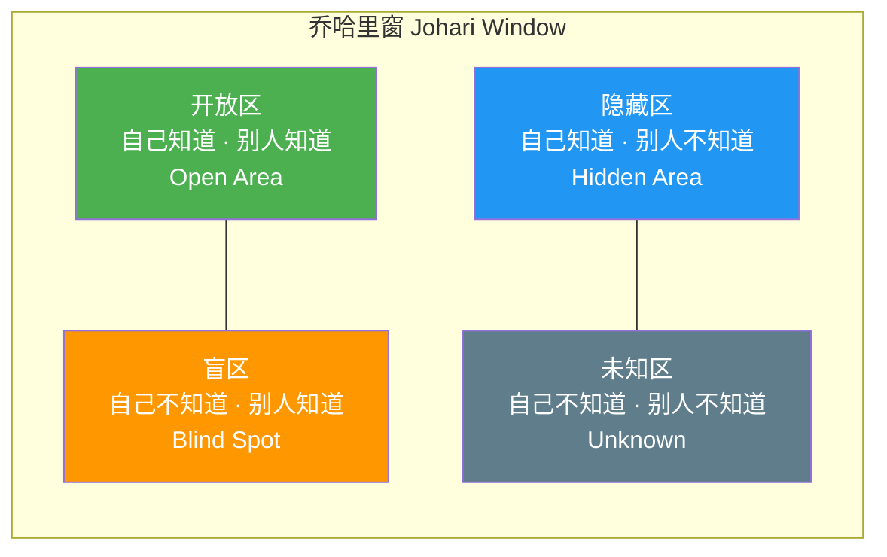
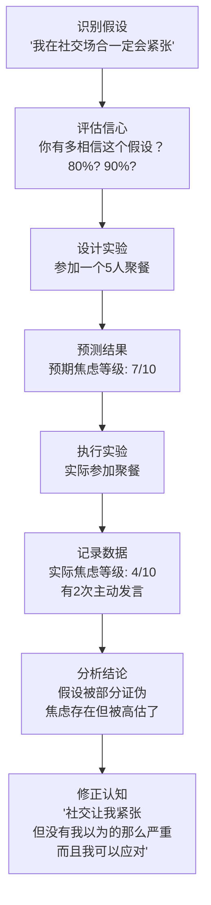
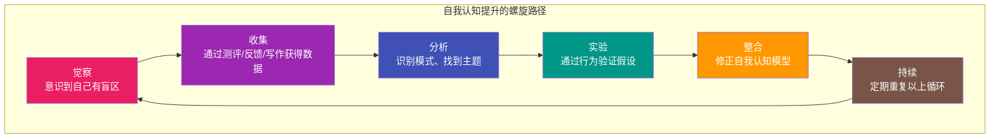

## 一、自我认知方法

自我认知（Self-Awareness）是一切心理成长的基石。Tasha Eurich 在《Insight》中指出，只有约 10%–15% 的人真正具备高水平的自我认知，而这群人在决策质量、人际关系和职业满意度上都显著优于平均水平。本节将从"是什么—为什么—怎么做—如何持续"的完整链路，手把手带你建立系统化的自我认知能力。

### 1.1 自我认知的完整定义与理论基础

#### 1.1.1 核心概念

自我认知是个体对自身内在状态（思想、情感、动机、价值观、人格特质）和外在表现（行为模式、他人印象、社会角色）的准确觉察与理解能力。它不是一种"悟到就完事"的状态，而是一套需要持续练习的技能。

Tasha Eurich 的研究将自我认知分为两个独立维度：

| 维度 | 定义 | 核心问题 | 典型表现 |
|------|------|----------|----------|
| **内部自我认知**（Internal） | 了解自己的内在状态 | "我为什么会有这种感受？我的价值观是什么？" | 能清晰描述自己的情绪、动机和优先级 |
| **外部自我认知**（External） | 了解他人如何看待自己 | "别人眼中的我是怎样的？我的行为产生了什么影响？" | 能准确预判他人对自己的反馈 |

**关键发现**：这两个维度几乎不相关。很多人非常了解自己但完全不知道别人怎么看自己（"内观型"），也有人极度在意别人评价但对自己的内心一无所知（"外观型"）。理想状态是两者兼具。

#### 1.1.2 学术理论框架

**（1）乔哈里窗模型（Johari Window）**

Joseph Luft 和 Harrington Ingham 在 1955 年提出的经典模型，将自我认知分为四个区域：

- **开放区**：你和他人都知道的特质——越大说明自我认知越成熟
- **盲区**：别人看到但你自己看不到的——需要主动收集反馈来缩小
- **隐藏区**：你选择不公开的部分——适度自我披露可以扩展开放区
- **未知区**：通过新体验和深度探索才能开发的潜能

**自我认知提升的本质就是：扩大开放区，缩小盲区和隐藏区。**

**（2）元认知理论（Metacognition）**

John Flavell 提出的"思考关于思考的能力"。元认知包括：
- **元认知知识**：你知道自己擅长什么、不擅长什么、什么环境下表现好
- **元认知调节**：你能监控自己的思维过程，在偏离目标时自我纠正

**（3）自我决定理论（SDT）中的自我认知**

Deci 和 Ryan 认为，真实的自我认知需要区分三种动机来源：
- **内在动机**：做这件事本身就让你快乐
- **认同调节**：你认为这件事对你的目标很重要
- **外部调节**：你为了奖励或避免惩罚而做

能够准确识别自己行为背后的真实动机，是深度自我认知的核心能力。

#### 1.1.3 为什么自我认知是"底层能力"

自我认知不是锦上添花，它直接影响以下维度：

| 生活维度 | 高自我认知者 | 低自我认知者 |
|----------|------------|------------|
| **决策** | 基于真实需求做选择，后悔率低 | 被外部期待驱动，频繁感到"这不是我想要的" |
| **人际关系** | 能准确表达需求，设合理边界 | 要么过度迎合，要么过度防御 |
| **职业发展** | 找到匹配的工作环境和角色 | 频繁跳槽或长期不满 |
| **情绪健康** | 能识别和调节情绪，心理韧性强 | 情绪爆发后才意识到问题 |
| **创造力** | 了解自己的思维风格，发挥优势 | 忽略自身特点，用通用方法低效努力 |

### 1.2 六大核心自我认知方法

以下方法按"从易到难、从被动到主动"排列。建议从第一种开始，逐步叠加。

#### 方法一：正念自我观察

**原理**：正念（Mindfulness）的核心是"不评判地注意当下体验"。哈佛大学 Matthew Killingsworth 的研究发现，人类有 47% 的时间处于"心智游移"（mind wandering）状态。正念练习的本质是训练大脑回到当下，从而增强对思维和情感流的觉察能力。

神经科学研究显示，持续 8 周的正念训练（如 MBSR 课程）能显著改变前额叶皮层和杏仁核的结构和功能，增强情绪调节能力。

**入门练习：5 分钟正念呼吸**

步骤 1：找一个安静的地方坐下，闭眼或半闭眼
步骤 2：将注意力放在呼吸上——感受空气进入鼻腔、胸腔扩张、然后缓缓呼出
步骤 3：当思维出现（它一定会出现），不要自责，标记它："这是想法"
步骤 4：温和地将注意力带回呼吸
步骤 5：重复步骤 3-4，这就是在锻炼"元认知肌肉"

**关键提醒**：走神不是失败。每次发现自己走神再拉回来，相当于做了一次"认知俯卧撑"。目标不是"不想事情"，而是"能观察到自己在想什么"。

**进阶练习体系**：

| 练习层级 | 练习名称 | 时长 | 具体操作 | 训练目标 |
|----------|----------|------|----------|----------|
| L1 入门 | 正念呼吸 | 5 min | 只关注呼吸的感觉 | 建立注意力锚点 |
| L2 初级 | 身体扫描 | 10 min | 从头顶到脚趾逐段觉察身体感受 | 连接身体与情绪 |
| L3 中级 | 思维观察 | 10 min | 想象自己坐在河边，看着"想法"像树叶一样漂过 | 培养"观察者视角" |
| L4 高级 | 情绪标记 | 15 min | 当情绪出现时命名它："我注意到焦虑正在升起" | 从"我是焦虑的"转为"我正在经历焦虑" |
| L5 进阶 | 正念对话 | 20 min | 在与人对话时观察自己的反应模式（防御、评判、逃避） | 在社交情境中保持觉察 |

**推荐工具**：
- **潮汐 APP**（中文，界面简洁，有免费冥想课程）
- **小睡眠 APP**（睡眠+正念双功能）
- **Headspace / Calm**（英文，课程体系完整）
- **Insight Timer**（免费冥想社区，大量中文内容）

**常见误区**：
- ❌ "我做不到不想事情"——目标不是不想，而是觉察到自己在想
- ❌ "必须盘腿坐才能冥想"——坐着、躺着、走路都可以
- ❌ "每天必须练 30 分钟才有用"——5 分钟比 0 分钟好 100 倍
- ❌ "感觉没效果就放弃了"——效果是渐进的，通常 2-4 周开始感觉到变化

#### 方法二：结构化心理测评

**原理**：心理测评通过标准化工具将模糊的自我感觉转化为可量化、可对比的数据。好的测评不是"贴标签"，而是提供一面"心理镜子"，帮你看到自己的盲区。

**核心测评工具详解**：

**（1）大五人格测评（Big Five / OCEAN）**

目前心理学界公认最可靠的人格模型，信效度远高于 MBTI。

| 维度 | 英文 | 高分特征 | 低分特征 | 自我提升方向 |
|------|------|----------|----------|------------|
| 开放性 | Openness | 好奇、有创造力、喜欢新体验 | 务实、偏好传统、喜欢稳定 | 高分者注意聚焦，低分者偶尔尝试新事物 |
| 尽责性 | Conscientiousness | 有条理、自律、目标导向 | 随性、灵活、不喜欢计划 | 高分者避免过度完美主义，低分者建立最小习惯 |
| 外向性 | Extraversion | 热情、喜欢社交、精力充沛 | 安静、喜欢独处、内省 | 高分者留出独处时间，低分者不强求社交 |
| 宜人性 | Agreeableness | 合作、信任他人、善解人意 | 竞争、质疑、直接 | 高分者学会说"不"，低分者练习同理心 |
| 神经质 | Neuroticism | 情绪波动大、易焦虑 | 情绪稳定、冷静 | 高分者重点练习情绪调节，低分者注意不要忽视他人感受 |

**推荐测评平台**：
- **IPIP-NEO**（免费，120 题版，国际人格项目库）：https://www.personal.psu.edu/~j5j/IPIP/
- **大五人格量表中文版**（BFI-2，北师大心理学团队验证）
- **才储**（国内平台，大五测评 + 报告）

**（2）VIA 性格优势测评**

由 Martin Seligman 和 Christopher Peterson 开发，识别 24 种性格优势。这不是找"缺点"的测评，而是帮你发现自己已经拥有的、可以作为"心理资本"使用的优势。

24 种优势分为 6 大美德：

| 美德 | 包含的优势 | 核心意义 |
|------|-----------|----------|
| 智慧与知识 | 创造力、好奇心、热爱学习、洞察力、批判性思维 | 获取和运用知识的途径 |
| 勇气 | 勇敢、毅力、诚实、热情 | 面对内外阻力时的意志力 |
| 人道 | 爱、善良、社交智力 | 关怀和帮助他人 |
| 正义 | 团队合作、公平、领导力 | 健康社区生活的能力 |
| 节制 | 宽恕、谦虚、审慎、自我调节 | 防止过度的能力 |
| 超越 | 对美的欣赏、感恩、希望、幽默、灵性 | 连接更大意义的能力 |

**使用方式**：免费测评网址 https://www.viacharacter.org/，完成约 15 分钟问卷后会得到你的"优势排序"。研究表明，刻意使用排名前 5 的"标志性优势"（Signature Strengths），幸福感会显著提升。

**（3）其他值得做的测评**

| 测评名称 | 测评内容 | 适用场景 | 科学性 |
|----------|----------|----------|--------|
| PHQ-9 | 抑郁症状筛查 | 情绪低落持续 2 周以上 | ★★★★★ 临床标准 |
| GAD-7 | 广泛性焦虑筛查 | 持续担忧影响生活 | ★★★★★ 临床标准 |
| MBTI | 16 型人格 | 了解行为偏好（注意：信效度争议大） | ★★☆ 仅作探索参考 |
| DISC | 行为风格 | 职场沟通和团队合作 | ★★★ 应用广泛 |
| 依恋风格测评 | 亲密关系模式 | 理解自己在关系中的行为 | ★★★★ 心理学基础扎实 |

**使用原则**：
- 测评是"起点"不是"终点"——结果是假设，需要在生活中验证
- 至少间隔 3-6 个月重测——人会变化
- 不要用测评结果给自己贴固定标签——"我是 INFP 所以我就是这样的"是最大的陷阱
- 如有心理健康方面的测评结果异常（PHQ-9 ≥ 10），建议寻求专业帮助

#### 方法三：反思性写作

**原理**：写作是一种"外化思维"的过程。Pennebaker 的经典研究发现，每天写 15-20 分钟的深层情感体验，坚持 4 天以上，就能显著改善心理健康指标和免疫功能。写作不是文学创作，而是帮大脑把混乱的思绪"倾倒"到纸面上，从而看清模式。

**五种核心写作练习**：

**（1）晨间意识流（Morning Pages）**

源自 Julia Cameron《创意之道》（The Artist's Way），是目前最受欢迎的反思写作方法。

规则：
- 每天早上起床后立即写
- 连续写满 3 页（约 750 字）
- 不停笔、不回看、不编辑
- 写任何出现在脑海中的东西——哪怕是"我不知道写什么"

你会经历三个阶段：
第 1-2 周：全是抱怨和琐事（正常，这是"清理"阶段）
第 3-4 周：开始出现洞察和灵感
第 5 周+：模式开始显现——你会看到反复出现的主题、恐惧、渴望

**（2）主题深度写作**

选一个核心问题，连续写 15-20 分钟，不设限。以下是 30 个经过验证的深度写作主题：

| 类别 | 写作主题 | 适合阶段 |
|------|----------|----------|
| 价值观 | "如果明天是最后一天，我最想做什么？" | 入门 |
| 价值观 | "我愿意为什么事情承受痛苦？" | 进阶 |
| 价值观 | "我正在过的生活，是我自己选择的还是被推着走的？" | 进阶 |
| 恐惧 | "我最害怕别人发现我的什么？" | 中级 |
| 恐惧 | "如果失败完全不可怕，我会做什么？" | 入门 |
| 恐惧 | "我一直逃避面对的真相是什么？" | 高级 |
| 关系 | "谁真正了解我？我真正了解谁？" | 中级 |
| 关系 | "我在关系中反复犯的错误是什么？" | 进阶 |
| 关系 | "我在什么时候戴面具？什么时候做真实的自己？" | 中级 |
| 身份 | "10 年前的我会怎么看待现在的我？" | 入门 |
| 身份 | "如果没有任何限制，我想成为怎样的人？" | 入门 |
| 身份 | "我身上最不想改变的特质是什么？" | 中级 |

**（3）情绪日记**

不是记流水账，而是用"事件→情绪→想法→需求"的结构记录：

日期：2026-06-24
事件：开会时提出的方案被否决
情绪：愤怒(7/10)、委屈(8/10)、自我怀疑(5/10)
身体感受：胸口发紧、肩膀僵硬
自动化想法："我的想法不被重视"、"他们不尊重我"
深层需求：被认可、被尊重
后续行动：会后找领导单独沟通，了解否决的具体原因

**（4）对话写作**

写一封给"内心某个部分"的信。例如：
- 给你的"完美主义者"写一封信，感谢它的保护，也告诉它什么时候可以放松
- 给你的"内在批评者"写一封信，听听它想说什么，然后回应它
- 给 10 年前的自己写一封信，你会说什么？

**（5）季度人生审计**

每 3 个月花 1-2 小时做一次全面回顾：

一、这 3 个月我最自豪的 3 件事是什么？
二、这 3 个月我最大的 3 个遗憾是什么？
三、我的价值观是否一致？哪里出现了冲突？
四、我的精力都花在了哪里？和我的优先级匹配吗？
五、下一个 3 个月，我最想改变的 1 件事是什么？

**推荐工具**：
- **Day One**（跨平台日记 APP，支持多媒体）
- **Notion / Obsidian**（可建立结构化反思模板）
- **纸质笔记本**（最低科技、最有效——研究表明手写比打字更能激活深层思考）

#### 方法四：结构化反馈收集

**原理**：你最不了解自己的部分，恰恰是别人看得最清楚的部分。Tasha Eurich 的研究发现，那些主动寻求反馈的人，自我认知准确度比不寻求反馈的人高出约 3 倍。但"随便问问"效果不好——需要结构化的方法。

**方法 A：乔哈里窗实操——缩小盲区**

步骤 1：选择 3-5 个你信任且了解你的人（覆盖不同生活领域）
步骤 2：向每人发送以下问题（可以微信文字或邮件）：

"我正在做一个自我认知练习，想请你花 5 分钟回答以下问题：
1. 你认为我最大的 3 个优点是什么？
2. 你认为我最需要注意的 1-2 个盲区是什么？（我会非常感激你的坦诚）
3. 和我相处时，什么行为让你觉得舒服？什么行为让你不太舒服？"

步骤 3：收到反馈后——
   - 先感谢，不辩解
   - 找共性：多人提到的就是你的"模式"
   - 区分"盲区"（别人看到的你没看到的）和"隐藏区"（你知道但没公开的）

步骤 4：选择 1-2 个可行动的盲区，在接下来 1 个月内刻意改变

**方法 B：360 度反馈（职场场景）**

| 反馈来源 | 问什么 | 怎么问 | 注意事项 |
|----------|--------|--------|----------|
| 直属领导 | 我在什么方面对团队贡献最大？我最需要提升什么？ | 1 对 1 沟通或正式绩效面谈 | 注意区分"政治性反馈"和真实反馈 |
| 同级同事 | 和我合作的感觉如何？我什么地方做得好/可以改进？ | 匿名问卷或信任关系中的直接对话 | 匿名能提高反馈真实度 |
| 下属 | 我的管理风格对你有什么帮助/困扰？ | 匿名反馈问卷 | 领导听到"不好的反馈"时，第一反应决定了以后还有没有反馈 |
| 客户/合作伙伴 | 我的服务/合作方式有什么可以改进的？ | 客户满意度调查或电话回访 | 外部视角往往最客观 |

**方法 C：专业支持**

当你需要深度了解自己但又不知道从哪里开始时：
- **心理咨询师**：用专业工具和对话技术帮你看到盲区（推荐 CBT 或精神动力学取向）
- **人生教练**（Life Coach）：专注于目标设定和行为改变
- **导师**（Mentor）：在特定领域有经验的人给你方向指引

**反馈收集的致命错误**：
- ❌ 问"我有什么问题？"——太宽泛，别人不知道怎么答
- ❌ 只问愿意听好话的人——选择性确认偏差
- ❌ 收到反馈后生气或找理由——下次就没人再给你真实反馈了
- ❌ 试图一次性改变所有问题——选 1-2 个最重要的

#### 方法五：行为实验

**原理**：很多时候你以为的"自己"只是一个未经验证的假设。行为实验就是通过实际行动来检验这些假设——它不是心理治疗的专利，而是一种日常可用的自我认知工具。

**行为实验的完整流程**：

**三个具体的行为实验示例**：

**实验 1：测试"我不擅长公开演讲"**

| 环节 | 具体操作 |
|------|----------|
| 假设 | "我在公开场合说话会紧张到说不出话" |
| 信心度 | 85% |
| 实验设计 | 在下一次团队会议中主动发言 2 分钟 |
| 预测 | 焦虑 8/10，会结巴，会脸红 |
| 实际执行 | 发言了 3 分钟，确实有点紧张但流畅完成了 |
| 实际数据 | 焦虑 5/10，轻微结巴 1 次，脸红但没被注意到 |
| 认知修正 | "我会紧张，但完全在可控范围内。通过练习会越来越好。" |

**实验 2：测试"我必须完美别人才会喜欢我"**

| 环节 | 具体操作 |
|------|----------|
| 假设 | "如果我展示不完美的一面，别人会看不起我" |
| 信心度 | 70% |
| 实验设计 | 在朋友聚餐时主动分享一个最近犯的错误 |
| 预测 | 会被嘲笑或被轻视 |
| 实际执行 | 分享了工作中的一次失误 |
| 实际数据 | 朋友们也分享了自己的类似经历，气氛更亲近了 |
| 认知修正 | "展示脆弱反而拉近了距离。完美主义让我孤立了自己。" |

**实验 3：测试"我做不到早起"**

| 环节 | 具体操作 |
|------|----------|
| 假设 | "我就是夜猫子体质，不可能早起" |
| 信心度 | 90% |
| 实验设计 | 连续 7 天 6:30 起床，前 3 天不加任何要求 |
| 预测 | 会失败，坚持不了 3 天 |
| 实际执行 | 完整执行了 7 天 |
| 实际数据 | 第 1-3 天很痛苦；第 4-5 天适应了；第 6-7 天开始享受早晨安静的时间 |
| 认智修正 | "我不是'做不到'，是从来没有给过自己适应的机会。21 天可以继续试试。" |

**行为实验的关键原则**：
- 实验要小：不需要一次颠覆人生，从最小可行的实验开始
- 记录要具体：不要写"感觉还行"，要量化（焦虑 7/10、主动发言 3 次）
- 失败也是数据：假设被证实也很好——说明你更了解自己了
- 重复验证：一次实验不够，至少 3 次才能确认模式

#### 方法六：身体觉察与情绪定位

**原理**：情绪不只是大脑里的"想法"，它会实实在在地体现在身体上。芬兰阿尔托大学的 Lauri Nummenmaa 团队绘制了"身体情绪地图"（Bodily Sensation Maps），发现每种情绪都有独特的身体模式。

**核心练习：身体情绪扫描**

步骤 1：安静坐下，闭眼，做 3 次深呼吸

步骤 2：从头部开始，逐步扫描全身：
   - 头顶和前额：是否有紧绷？
   - 眼睛和眉毛：是否皱眉？
   - 下颌和喉咙：是否咬紧牙关？
   - 肩颈：是否耸肩或僵硬？
   - 胸口：是否有压迫感或空洞感？
   - 胃部：是否有翻搅或紧缩？
   - 腹部：是否有下坠感或紧绷？
   - 四肢：是否发冷、发麻、发抖？

步骤 3：当你找到不适的身体感受时，停留，好奇地问：
   "如果这个感受有颜色，它是什么颜色？"
   "如果它有形状，它是什么形状？"
   "如果它有温度，它是冷的还是热的？"
   "如果它能说话，它想说什么？"

**常见情绪的身体对应**：

| 情绪 | 典型身体位置 | 常见描述 |
|------|------------|----------|
| 焦虑 | 胸口、胃部 | 胸闷、胃里像有蝴蝶在飞 |
| 愤怒 | 头部、手臂、下巴 | 头部发涨、手握拳、咬紧牙关 |
| 悲伤 | 胸口、喉咙 | 胸口堵、喉咙发紧、眼睛发酸 |
| 恐惧 | 背部、膝盖 | 后背发凉、膝盖发软 |
| 羞耻 | 面部、胸口 | 脸发烫、想缩成一团 |
| 内疚 | 胃部、胸口 | 胃部沉重、胸口有压迫感 |

**为什么身体觉察能提升自我认知**：很多时候等你意识到"我在生气"的时候，情绪已经失控了。但如果你能更早地觉察到"我的下巴在发紧"——这是愤怒的早期信号——你就有了选择的窗口：在情绪升级之前做出响应而不是反应。

### 1.3 自我认知的障碍与系统性突破策略

#### 1.3.1 六大认知障碍

**（1）自我服务偏差（Self-Serving Bias）**

心理学中最稳健的发现之一：人们倾向于把成功归因于自己的能力和努力（内部归因），把失败归因于运气和环境（外部归因）。这让你永远觉得自己没问题。

**突破方法**：每次分析失败时，强制自己写出至少 2 个自身原因；每次分析成功时，强制写出至少 2 个外部因素。

**（2）确认偏差（Confirmation Bias）**

你只愿意接收支持你已有信念的信息，忽略反驳它的证据。比如你相信自己"不擅长社交"，于是只记得社交失败的经历，忽略了那些愉快的社交互动。

**突破方法**：对于任何一个关于自己的信念，主动寻找 3 个反例。"我真的从来不擅长社交吗？有没有哪次社交其实很顺利？"

**（3）邓宁-克鲁格效应（Dunning-Kruger Effect）**

能力不足的人倾向于高估自己的能力，能力很强的人倾向于低估自己。这不是谦虚——是认知结构本身的缺陷。

**突破方法**：定期用客观标准评估自己（而非主观感觉），比如：用测评分数、他人反馈、具体成果数据来校准。

**（4）情感防御机制**

精神分析理论指出，当自我认知威胁到心理安全时，大脑会自动启动防御机制：
- **否认**："我没有这个问题"
- **投射**："不是我焦虑，是你让我不安"
- **合理化**："我不努力是因为努力没用"
- **理智化**："我用理论分析就够了，不需要感受"

**突破方法**：觉察到自己在"解释"而不是"感受"时，暂停，问自己："我现在在保护什么？"

**（5）社会期望效应**

你长期按照父母、社会、文化期待来定义自己，以至于分不清"我想要什么"和"我应该想要什么"。

**突破方法**：做一次"剥离练习"——如果没有任何人知道你的选择，也没有任何人会评判你，你还会做现在正在做的事情吗？

**（6）舒适区固化**

人倾向于重复已知的行为模式，因为熟悉的痛苦比未知的风险更安全。这种固化让你永远只能看到"旧版本的自己"。

**突破方法**：每个月做一件从未做过的事情——不是为了刺激，而是为了发现新的自己。

#### 1.3.2 系统性突破框架

### 1.4 30 天自我认知行动计划

以下是一个可直接执行的 30 天计划，每天投入 15-20 分钟：

| 周次 | 每日任务 | 本周末总结 |
|------|----------|-----------|
| **第 1 周** | 每天 5 分钟正念呼吸 + 情绪日记（记录 1 个情绪事件） | 回顾 7 天日记：反复出现的情绪是什么？触发因素是什么？ |
| **第 2 周** | 完成大五人格 + VIA 优势测评；继续情绪日记 | 对比两个测评结果：一致的地方和矛盾的地方分别是什么？ |
| **第 3 周** | 每天晨间意识流写作 15 分钟；向 3 人收集反馈 | 写作中出现了什么主题？反馈中反复出现的关键词是什么？ |
| **第 4 周** | 设计并执行 2 个行为实验；做一次季度人生审计 | 实验结果是否改变了你对自己的某个假设？整合所有发现 |

### 1.5 常见误区与纠正

| 误区 | 真相 | 纠正方法 |
|------|------|----------|
| "我已经很了解自己了" | 研究表明 95% 的人高估了自己的自我认知水平 | 用客观工具（测评+反馈）来校准你的主观感受 |
| "自我认知就是反思想" | 思维反刍≠自我认知。反刍是重复想同一件事，自我认知是获得新信息 | 如果你发现自己在"想同样的问题"而不是"获得新洞察"，换个方法 |
| "了解自己越多越好" | 过度自我分析会导致决策瘫痪和焦虑 | 设定时间限制（每天反思不超过 30 分钟），然后行动 |
| "自我认知是一次性的事" | 人在变化，自我认知需要持续更新 | 每 3-6 个月重测核心测评，每年做一次全面审计 |
| "只有性格内向的人才需要" | 外向者同样有巨大盲区——他们可能不了解自己独处时的状态 | 选择适合自己的方法，不必回避不舒适的方式 |
| "自我认知就是找缺点" | 它同样包括发现优势和潜能 | VIA 优势测评的核心理念就是"基于优势的成长" |

### 1.6 进阶：将自我认知融入日常系统

当你完成 30 天计划并建立了基本的自我觉察习惯后，以下方法可以让自我认知成为生活的一部分：

**（1）每周 10 分钟"系统回顾"**

固定每周日晚上，回答三个问题：
- 这周我的精力峰值出现在什么时候？在做什么？
- 这周让我最不舒服的时刻是什么？为什么？
- 下周我最想优先做的一件事是什么？

**（2）建立"情绪-行为"追踪系统**

用手机备忘录或 APP 每天记录：
- 今天情绪的"主色调"是什么？（1-10 分）
- 发生了什么关键事件？
- 我的反应模式是什么？（面对/逃避/讨好/攻击）

坚持 2 个月后回顾，你会发现自己的"情绪模式图"——什么触发你、你如何反应、什么方式最有效。

**（3）年度"自我认知大会"**

每年花半天时间（可以安排在生日或新年），系统回顾：
- 我的核心价值观是否发生了变化？
- 我最大的成长在哪里？
- 我最需要继续探索的盲区是什么？
- 下一年我想成为怎样的人？

**（4）推荐深度阅读**

| 书名 | 作者 | 核心内容 | 适合阶段 |
|------|------|----------|----------|
| 《Insight》 | Tasha Eurich | 自我认知的科学研究与实践方法 | 入门必读 |
| 《被讨厌的勇气》 | 岸见一郎、古贺史健 | 阿德勒心理学视角下的自我认知 | 颠覆认知 |
| 《身体从未忘记》 | Bessel van der Kolk | 通过身体觉察理解情绪和创伤 | 身体觉察进阶 |
| 《心流》 | 米哈里·契克森米哈赖 | 通过心流体验发现真正的兴趣所在 | 动机认知 |
| 《自卑与超越》 | 阿德勒 | 理解自卑感如何塑造人格和行为模式 | 深度自我理解 |

---

**核心提醒**：自我认知的最终目标不是"完全了解自己"——那是一个永远无法到达的终点。真正的目标是建立一种"持续好奇地探索自己"的习惯。当你能在日常生活中保持"观察者视角"——观察自己的想法、情绪和行为而不被它们完全控制——你就拥有了最强大的心理工具。
