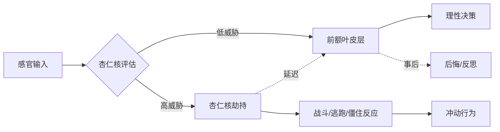
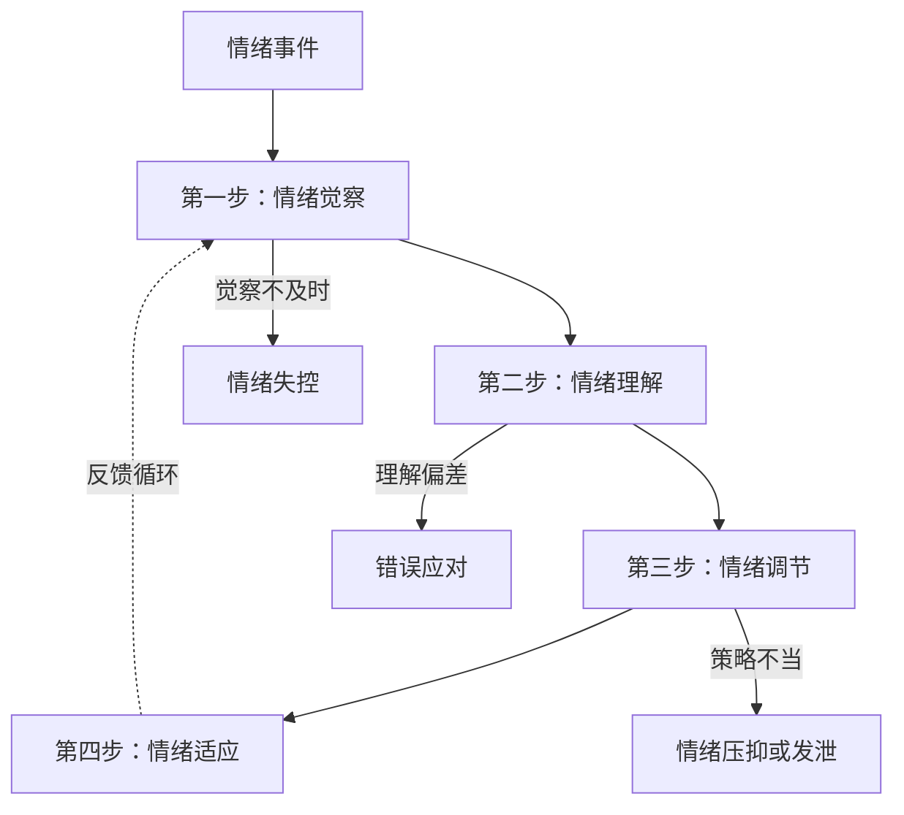
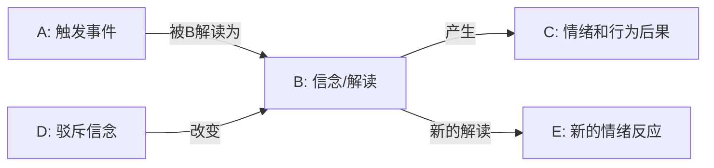
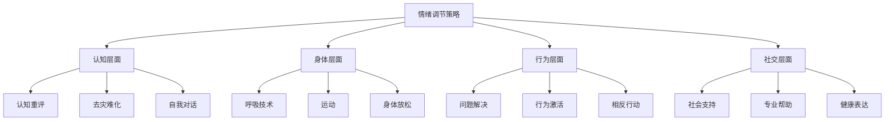
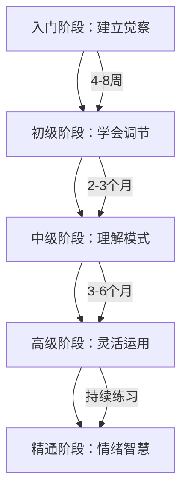

## 二、情绪管理技巧

情绪是人类最基本的心理现象之一。它影响我们的决策、健康、人际关系和生活质量。本章将从神经科学基础到日常实操，系统讲解情绪管理的完整知识体系，帮助你建立科学、有效的情绪管理能力。

### 2.1 情绪管理的科学基础

#### 2.1.1 情绪的本质：不是敌人，而是信号系统

情绪本质上是一种**快速评估系统**——它帮助我们在复杂环境中快速判断"什么是重要的"、"什么是危险的"、"什么是值得追求的"。没有情绪的人不会变得更"理性"，反而会失去行动的动力和方向。神经科学家安东尼奥·达马西奥（Antonio Damasio）的研究表明，情绪受损的患者（如腹内侧前额叶损伤）即使智力正常，也无法做出有效的日常决策——因为他们失去了"这件事对我重要吗"的直觉判断。

情绪管理不是"消灭"负面情绪，而是学会与所有情绪共处，并在适当的时候以适当的方式表达情绪。良好的情绪管理能力与更好的决策质量、更健康的人际关系、更高的工作效率和更好的身心健康密切相关。

#### 2.1.2 情绪的神经科学机制

理解情绪在大脑中如何运作，是掌握情绪管理的基础。

**杏仁核——情绪的"哨兵"**

杏仁核（amygdala）是大脑中处理情绪信息的核心结构，尤其负责恐惧和威胁相关的反应。它的运作速度极快——在你"意识到"自己害怕之前，杏仁核已经启动了战斗-逃跑-僵住（fight-flight-freeze）反应。

**关键机制：杏仁核劫持（Amygdala Hijack）**

当杏仁核感知到强烈威胁时，它会绕过前额叶皮层（负责理性思考的区域），直接触发情绪反应。这就是为什么人在极度愤怒或恐惧时会做出事后后悔的行为——理性大脑被"短路"了。

**前额叶皮层——情绪的"刹车"**

前额叶皮层（prefrontal cortex, PFC）是情绪调节的核心区域。它能够：
- 抑制杏仁核的过度反应（"我知道这不是真正的威胁"）
- 进行认知重评（"换个角度想这件事"）
- 规划适当的情绪表达方式（"我现在应该怎么说"）

前额叶皮层与杏仁核之间的连接强度，决定了一个人的情绪调节能力。好消息是，这种连接可以通过练习加强——就像肌肉一样。

**迷走神经与多迷走神经理论（Polyvagal Theory）**

斯蒂芬·波格斯（Stephen Porges）提出的多迷走神经理论揭示了情绪与身体状态的深层联系：

| 状态 | 神经系统 | 身体反应 | 情绪体验 | 社交倾向 |
|------|---------|---------|---------|---------|
| 安全/社交参与 | 腹侧迷走神经 | 心率平稳、面部肌肉放松 | 平静、愉悦、好奇 | 开放、连接 |
| 战斗/逃跑 | 交感神经系统 | 心率加快、肌肉紧张、出汗 | 愤怒、恐惧、焦虑 | 攻击或回避 |
| 冻结/解离 | 背侧迷走神经 | 心率下降、身体僵硬、消化减缓 | 麻木、绝望、无助 | 退缩、关闭 |

理解这三种状态对情绪管理至关重要：你不能只用"认知"方法来调节一个已经进入背侧迷走神经冻结状态的人——身体层面的干预（如呼吸、运动）必须先行。

#### 2.1.3 情绪管理的常见误区

| 误区 | 真相 | 后果 |
|------|------|------|
| "情绪管理就是不生气、不焦虑" | 情绪管理是选择如何回应，而非消除情绪 | 压抑导致更大的爆发或身心疾病 |
| "负面情绪是不好的，应该消除" | 所有情绪都有功能：恐惧保护安全，愤怒维护边界，悲伤促进反思 | 失去重要的信号系统 |
| "压抑情绪是成熟的表现" | 健康的表达比压抑更需要技巧和勇气 | 慢性压力、心血管疾病、免疫功能下降 |
| "情绪管理是天生的能力，无法学习" | 情绪调节能力可以通过刻意练习显著提升 | 放弃成长机会 |
| "发泄情绪等于情绪管理" | 无节制的发泄会强化负面情绪回路 | 习惯性愤怒、关系破坏 |
| "理性与情绪是对立的" | 理性与情绪协同工作，情绪为决策提供价值判断 | 做出脱离人性的决策 |

#### 2.1.4 情绪粒度：精确命名的力量

情绪粒度（emotional granularity）是指区分和命名不同情绪状态的能力。研究发现，情绪粒度高的人：
- 更少使用酒精或药物来应对负面情绪
- 在遭遇创伤后恢复更快
- 更少出现攻击性行为
- 拥有更好的情绪调节策略

**提升情绪粒度的方法**：

不要只是说"不舒服"，尝试精确区分。以下是一个情绪词汇的分层结构：

**基础情绪及其细分**：
- **愤怒类**：恼怒、烦躁、愤慨、暴怒、怨恨、嫉妒、敌意、挫败感
- **悲伤类**：失落、沮丧、哀伤、孤独、空虚、绝望、无助、怀念
- **恐惧类**：焦虑、紧张、不安、恐慌、畏惧、担忧、惊吓、胆怯
- **快乐类**：愉悦、满足、兴奋、感激、自豪、欣慰、陶醉、释然
- **厌恶类**：反感、鄙视、嫌弃、排斥、不屑、羞耻、尴尬

**复合情绪**（由基础情绪组合而成）：
- 嫉妒 = 愤怒 + 恐惧 + 悲伤
- 内疚 = 恐惧 + 悲伤 + 自我评判
- 怀念 = 快乐 + 悲伤
- 矛盾 = 两种对立情绪同时存在

精确命名本身就具有调节作用——神经影像学研究表明，当人们用语言标记情绪时，杏仁核的活动会降低。这就是"name it to tame it"（命名即驯服）的神经科学基础。

### 2.2 情绪管理的四步模型

#### 第一步：情绪觉察

**目标**：在情绪升起时，能够及时识别自己正在经历什么情绪。

情绪觉察是所有情绪管理的基础。没有觉察，就没有选择——你只能被动地被情绪驱动。神经科学研究表明，情绪觉察能力与前额叶皮层的活动强度正相关，这意味着觉察本身就是一种可以锻炼的"大脑肌肉"。

**练习方法**：

**（1）情绪日记**

每天记录3次情绪状态，建立情绪觉察的习惯。记录模板：

| 记录项 | 说明 | 示例 |
|--------|------|------|
| 时间 | 精确到小时 | 14:30 |
| 情境 | 发生了什么 | 会议上被同事当众质疑方案 |
| 情绪名称 | 使用精确的情绪词汇 | 愤怒、委屈、羞耻（复合情绪） |
| 强度 | 1-10分 | 7/10 |
| 身体感受 | 情绪在身体哪里、什么感觉 | 胸口发紧、脸部发热、拳头不自觉握紧 |
| 自动化想法 | 脑中闪过什么念头 | "他故意针对我"、"大家都觉得我不行" |
| 行为倾向 | 想做什么 | 想当场反驳、想摔门离开 |

坚持2-4周，你会逐渐发现自己的情绪模式——什么情境容易触发你、你的情绪反应是否有规律。

**（2）身体扫描**

情绪首先通过身体表达。学会通过身体信号识别情绪，比依赖思维更快、更准确。

**身体-情绪对应关系**：
- **愤怒**：胸口发热、拳头握紧、下巴收紧、太阳穴跳动
- **焦虑**：胃部紧缩、肩膀僵硬、手心出汗、呼吸变浅
- **悲伤**：胸口沉重、喉咙发紧、眼眶发热、身体无力
- **恐惧**：后背发凉、心跳加速、瞳孔放大、肌肉紧绷
- **羞耻**：脸部发热、想低头、身体蜷缩、想消失

**快速身体扫描步骤**（30秒版）：
1. 从头顶开始，快速扫描全身
2. 特别注意：头部、胸口、腹部、肩膀、双手
3. 注意任何紧张、发热、发冷、沉重的感觉
4. 问自己："这种身体感觉告诉我什么情绪？"

**（3）STOP技术——情绪急救的即时觉察**

当情绪突然袭来时，使用STOP技术：
- **S**（Stop）：停下来，不要立即反应
- **T**（Take a breath）：做一次深呼吸
- **O**（Observe）：观察自己的身体感觉、情绪和想法
- **P**（Proceed）：选择如何回应

这个技术的核心价值在于：在刺激和反应之间创造一个"暂停空间"，让你从自动反应模式切换到有意识选择模式。

**关键原则**：
- 觉察不等于评判——"我在生气"是觉察，"我不应该生气"是评判
- 情绪没有对错——所有情绪都有其存在的意义和功能
- 允许情绪存在——即使它让你不舒服，抗拒情绪只会让它更强烈

#### 第二步：情绪理解

**目标**：理解情绪产生的原因、功能和传递的信息。

觉察到情绪之后，下一步是理解它——"这个情绪从哪来？它在告诉我什么？它想保护我什么？"

**（1）ABC分析法**

基于阿尔伯特·埃利斯（Albert Ellis）的理性情绪行为疗法（REBT）：

**核心洞见**：不是事件（A）直接导致了情绪（C），而是你对事件的解读（B）导致了情绪。

**实战示例**：

| 情境 | A（事件） | B（信念） | C（情绪） | 驳斥B | 新的情绪 |
|------|----------|----------|----------|-------|---------|
| 朋友没回消息 | 3小时没回消息 | "他不在乎我" | 焦虑8分、愤怒5分 | 他在忙/没看到/不知道怎么回 | 焦虑2分 |
| 方案被否 | 领导说"再想想" | "我能力不行" | 沮丧9分、羞耻7分 | 领导可能有更高期望/需要更多信息 | 沮丧3分 |
| 被插队 | 有人插队 | "他不尊重我" | 愤怒8分 | 他可能赶时间/没注意到/素质问题 | 愤怒3分 |

**（2）情绪功能分析**

每种情绪都有其进化功能——它在试图保护你或告诉你什么：

| 情绪 | 进化功能 | 可能传递的信息 | 适应性行动 |
|------|---------|---------------|-----------|
| 愤怒 | 保护边界、动员力量 | 边界被侵犯、需求未被满足 | 明确表达边界、寻求公平 |
| 焦虑 | 预警系统、准备应对 | 有潜在威胁需要准备 | 制定计划、寻求信息、采取预防 |
| 悲伤 | 促进反思、寻求支持 | 失去了重要的东西 | 允许哀悼、寻求连接、重新评估 |
| 羞耻 | 维护社会规范 | 可能违背了价值观或社会期望 | 反思行为、修复关系、调整标准 |
| 恐惧 | 即时保护、逃离危险 | 有直接威胁需要应对 | 评估威胁、采取保护措施 |
| 内疚 | 促进修复、维护关系 | 可能伤害了他人 | 道歉、补偿、改变行为 |
| 嫉妒 | 驱动竞争、保护关系 | 感受到威胁或缺失 | 确认需求、采取建设性行动 |

**（3）触发器地图**

记录反复出现的情绪反应模式，识别你的"情绪热点"：

**绘制方法**：
1. 回顾过去一个月的情绪日记
2. 找出反复出现的情绪反应
3. 识别共同的触发情境、思维模式
4. 发现其中的规律

**常见的触发器类型**：
- **人际触发器**：被忽视、被批评、被拒绝、不被理解、被控制
- **情境触发器**：时间压力、不确定性、不公平、失败、冲突
- **内在触发器**：身体疲劳、饥饿、睡眠不足、回忆、自我批评
- **认知触发器**：非黑即白思维、灾难化、读心术、以偏概全

识别触发器的目的不是避免它们（这通常不可能），而是提前做好准备——知道自己的"雷区"在哪里，就能在触发时更快地觉察和调节。

#### 第三步：情绪调节

**目标**：根据情境需要，选择适当的情绪调节策略。

情绪调节不是"一种方法解决所有问题"，而是拥有一整套工具箱，根据不同情境灵活选择。

**策略一：认知重评（Cognitive Reappraisal）**

认知重评是研究最多、效果最持久的情绪调节策略。它的核心是改变对事件的解读方式，从而改变情绪反应。

**原理**：前额叶皮层可以通过重新解释情境来调节杏仁核的活动。这不是"自我欺骗"，而是承认任何事件都有多种合理的解读方式，而你的自动化思维选择的往往不是最准确的那一个。

**详细步骤**：

1. **识别自动化思维**：写下脑中闪过的想法
   - 例："他没有回复我消息，说明他不在乎我"

2. **收集证据**：
   - 支持这个想法的证据：他确实3小时没回
   - 反对这个想法的证据：他上周主动约我吃饭、他平时回复也慢、他可能在开会

3. **生成替代解读**（至少3个）：
   - "他可能在忙，没看到消息"
   - "他可能不知道怎么回复，正在思考"
   - "他可能手机没电了/在开会/在开车"

4. **评估替代解读**：
   - 选择一个最合理、最让你感到平静的解读
   - 用这个新解读重新评估情绪强度
   - "如果他只是在忙，我的焦虑从8分降到了3分"

5. **行为验证**（可选）：
   - 如果可能，验证你的解读（如直接问对方）
   - 记录验证结果，修正你的认知模式

**日常练习**：每天选择一个引发负面情绪的事件，用认知重评的方法重新解读。坚持4周，你会发现自己的情绪反应模式开始改变。

**策略二：正念觉察（Mindfulness）**

正念不是"什么都不想"，而是"不评判地观察当下"。它的核心价值在于：让你与情绪之间建立一个"观察距离"——你不是情绪本身，你是观察情绪的人。

**原理**：正念练习能够增强前额叶皮层对杏仁核的调节能力，同时降低默认模式网络（DMN）的过度活动——后者与反刍思维（反复想同一件事）密切相关。

**基础练习步骤**：

1. 当情绪升起时，暂停
2. 将注意力转向呼吸，做3-5次深呼吸
3. 觉察情绪在身体中的感受：位置、温度、质地、运动
4. 给情绪一个空间，允许它存在，不做任何改变
5. 观察情绪像云一样飘过——它会升起、达到顶峰、然后消退

**RAIN技术**（正念情绪调节的进阶方法）：
- **R**（Recognize）：识别——"我现在感到焦虑"
- **A**（Allow）：允许——"这个情绪可以在这里"
- **I**（Investigate）：探究——"这个情绪在身体哪里？它什么感觉？"
- **N**（Non-identification）：不认同——"我不是焦虑，我正在经历焦虑"

**进阶练习**：每天10-15分钟正念冥想，系统培养觉察能力。推荐从呼吸冥想开始，逐渐扩展到身体扫描、开放觉察等练习。

**策略三：情绪表达**

适当的情绪表达有助于情绪释放和人际沟通。但"适当"二字是关键——不是所有情绪都需要表达，不是所有场合都适合表达，不是所有方式都是健康的。

**健康表达的四原则**：

1. **使用"我"陈述句**
   - ❌ "你总是不听我说话！"（指责）
   - ✅ "我感到被忽视，因为我说的话没有被听到。"（表达感受）

2. **区分感受和想法**
   - ❌ "你不关心我"（这是对对方的评判/想法）
   - ✅ "我感到不被重视"（这是你的真实感受）

3. **选择合适的时机和对象**
   - 不在愤怒最强烈时表达（等情绪降到可管理的范围）
   - 选择私密、安全的环境
   - 选择你信任的、有能力倾听的人

4. **表达感受而非攻击对方**
   - ❌ "你这个人太自私了！"
   - ✅ "当我的需求没有被考虑时，我感到委屈和失望。"

**策略四：行为调节**

当情绪过于强烈，认知方法难以介入时，从身体和行为层面入手往往更有效。

**运动**：有氧运动能显著改善情绪状态。机制包括：
- 释放内啡肽（天然止痛剂和情绪提升剂）
- 降低皮质醇（压力激素）水平
- 增加脑源性神经营养因子（BDNF），促进神经可塑性
- 改善睡眠质量，间接改善情绪

20-30分钟的中等强度运动（如快走、慢跑、游泳）即可产生即时效果。即使是10分钟的散步也能显著降低焦虑水平。

**呼吸技术**：

| 技术 | 步骤 | 适用场景 | 原理 |
|------|------|---------|------|
| 4-7-8呼吸法 | 吸气4秒→屏气7秒→呼气8秒 | 入睡困难、焦虑发作 | 激活副交感神经系统 |
| 腹式呼吸 | 手放腹部，吸气时腹部鼓起，呼气时收缩 | 日常压力、紧张 | 降低交感神经激活 |
| 方块呼吸 | 吸4秒→屏4秒→呼4秒→屏4秒 | 高压工作、演讲前 | 平衡交感/副交感系统 |
| 生理性叹息 | 双吸气（短吸+长吸）→长呼气 | 即时情绪缓解 | 最快降低唤醒水平的呼吸方式 |

**渐进式肌肉放松**：系统地紧张和放松全身各肌肉群。方法：从脚趾开始，依次向上，每个部位先用力紧张5-7秒，然后完全放松15-20秒，感受紧张和放松的对比。

**社会支持**：与信任的人倾诉，获得情感支持和不同视角。研究发现，仅仅是"被倾听"就能显著降低情绪强度——因为社交连接本身就能激活腹侧迷走神经，促进安全感。

#### 第四步：情绪适应

**目标**：将情绪管理融入日常生活，形成长期的情绪健康习惯。

情绪管理不是一次性技能，而是需要持续练习和适应的终身能力。

**（1）建立情绪自我关怀习惯**

- 定期检查自己的情绪状态（如每天早晚各一次"情绪温度计"）
- 像关注身体健康一样关注情绪健康
- 当情绪状态持续低落时，及时寻求帮助

**（2）培养情绪复原力**

情绪复原力是指在经历强烈情绪后，能够恢复到基线状态的能力。它不是"不感受痛苦"，而是"在痛苦中保持功能，并最终恢复"。

**提升复原力的方法**：
- **建立支持网络**：至少有3个可以信任和倾诉的人
- **培养意义感**：知道"为什么"承受痛苦，痛苦就更容易承受
- **保持身体基础**：睡眠、运动、营养是情绪稳定的生理基础
- **练习自我慈悲**：像对待好朋友一样对待自己

**（3）发展情绪灵活性**

情绪灵活性是指能够根据不同情境选择适当的情绪策略，而不是固着于某一种应对方式。

**灵活性的三个维度**：
- **觉察的灵活性**：能够同时觉察情绪和情境需求
- **选择的灵活性**：拥有多样化的调节策略
- **执行的灵活性**：能够根据反馈调整策略

### 2.3 情绪管理的进阶技巧

#### 2.3.1 辩证行为疗法（DBT）中的情绪调节技能

DBT由玛莎·莱恩汉（Marsha Linehan）创立，专门用于帮助情绪调节困难的人群。以下是从DBT中提炼出的核心技能：

**（1）相反行动（Opposite Action）**

当情绪引发的行为倾向在当前情境下不适应时，故意做出相反的行为。

| 情绪 | 行为倾向 | 相反行动 | 适用条件 |
|------|---------|---------|---------|
| 恐惧 | 逃避、回避 | 面对、接近 | 威胁不真实或被夸大 |
| 愤怒 | 攻击、对抗 | 温和、回避 | 表达愤怒会恶化情境 |
| 悲伤 | 退缩、孤立 | 活动、社交 | 悲伤不是因为真正的丧失 |
| 羞耻 | 隐藏、逃避 | 展示、接近 | 羞耻感不基于真实的道德违背 |
| 内疚 | 过度补偿 | 停止补偿 | 内疚感不基于真实的伤害 |

**关键前提**：相反行动只适用于情绪"不匹配"情境的情况。如果你真的处于危险中，恐惧的逃避反应是适应性的，不应该用相反行动去对抗。

**（2）积攒正面情绪（Build Mastery）**

有意识地安排愉快的活动，增加积极情绪的"存入"。这不是否认负面情绪，而是确保情绪银行账户不会长期"入不敷出"。

**操作方法**：
- 列出让你感到愉快、有成就感或有意义的活动（至少20个）
- 每天至少安排1-2个
- 区分"快乐"活动（带来即时愉悦）和"意义"活动（带来长期满足）
- 理想比例：既有快乐也有意义

**（3）应对波浪（Surf the Urge）**

强烈情绪像海浪一样：升起→达到顶峰→消退。没有人能永远保持情绪的"顶峰"状态——即使你不做任何事情，情绪也会自然消退。

**"情绪冲浪"步骤**：
1. 觉察情绪像波浪一样升起
2. 告诉自己："这个情绪会过去的，它不会永远这么强烈"
3. 不采取行动（尤其是破坏性行为）
4. 专注于呼吸，观察情绪的变化
5. 等待波浪过去——通常强烈情绪的峰值在60-90秒内就会开始下降

**（4）痛苦耐受（Distress Tolerance）**

在强烈情绪中保持功能，不做破坏性行为。这是"危机时刻"的生存技能。

**TIPP技术**（快速降低情绪强度）：
- **T**（Temperature）：用冷水洗脸或冰块敷脸——激活潜水反射，快速降低心率
- **I**（Intense exercise）：短时间高强度运动——消耗肾上腺素
- **P**（Paced breathing）：延长呼气的慢呼吸——激活副交感神经
- **P**（Paired muscle relaxation）：配合呼吸的肌肉放松——降低身体紧张

**ACCEPTS分散注意力技巧**：
- **A**（Activities）：投入一个需要专注的活动
- **C**（Contributing）：帮助他人
- **C**（Comparisons）：与更困难的情境比较（谨慎使用）
- **E**（Emotions）：用不同的情绪体验替代（如看喜剧）
- **P**（Pushing away）：暂时把问题放在一边
- **T**（Thoughts）：用需要思考的任务占据大脑
- **S**（Sensations）：用强烈的感官刺激替代（如冰块、强烈的气味）

#### 2.3.2 情绪管理在不同场景的应用

**（1）职场情绪管理**

职场是情绪管理难度最高的场景之一——你需要在保持专业的同时，处理复杂的人际关系和高压环境。

**职场情绪管理的原则**：
- **情绪劳动**：理解"表面行为"（假装开心）和"深层行为"（尝试真的感受到积极情绪）的区别。长期的表面行为会导致情绪耗竭，而深层行为相对更可持续
- **向上管理情绪**：在向上级汇报坏消息时，先整理好自己的情绪，用事实+解决方案的框架呈现
- **团队情绪管理**：作为领导者，你的情绪状态会传染整个团队（情绪传染效应）。管理好自己的情绪是领导力的基础

**职场高难度场景应对**：

| 场景 | 情绪挑战 | 应对策略 |
|------|---------|---------|
| 被当众批评 | 羞耻、愤怒、防御 | 先深呼吸，说"我会认真考虑您的意见"，事后私下沟通 |
| 不公平对待 | 愤怒、委屈 | 收集证据，冷静表达，通过正式渠道反映 |
| 工作压力过大 | 焦虑、疲惫 | 拆解任务、设定优先级、学会说"不" |
| 被边缘化 | 孤独、自我怀疑 | 主动寻求反馈、展示价值、建立盟友关系 |
| 裁员危机 | 恐惧、不安全 | 更新简历、拓展人脉、控制可控因素 |

**（2）亲密关系中的情绪管理**

亲密关系中的情绪管理难度最高，因为你最在乎的人最容易触发你最深的情绪。

**核心原则**：
- **情绪不是问题，如何回应情绪才是问题**：生气是正常的，但在愤怒中说伤人的话是选择
- **区分"我需要空间"和"我在逃避"**：暂时离开冲突现场是健康的，但长期回避问题是不健康的
- **学会修复**：冲突之后的修复比避免冲突更重要。研究表明，关系幸福的关键不是冲突频率，而是修复能力

**戈特曼的"四骑士"——关系中的情绪杀手**：
1. **批评**（Criticism）：攻击对方的人格而非行为
2. **蔑视**（Contempt）：翻白眼、嘲讽、道德优越感
3. **防御**（Defensiveness）：拒绝承认任何问题
4. **石墙**（Stonewalling）：完全关闭沟通

**应对方法**：用温和的启动（soft startup）替代批评，用欣赏和感谢替代蔑视，用承担责任替代防御，用自我安抚（而非石墙）来管理过度唤醒。

**（3）社交媒体时代的情绪管理**

社交媒体创造了全新的情绪挑战：社会比较、信息过载、网络暴力、FOMO（错过恐惧）。

**应对策略**：
- **设定使用边界**：每天固定的社交媒体时间，避免无意识刷屏
- **觉察社会比较**：意识到你看到的是别人精心筛选的"高光时刻"
- **主动选择内容**：取关让你感到焦虑或自卑的账号
- **数字断联**：定期安排无手机时间，让大脑休息

#### 2.3.3 特殊人群的情绪管理

**（1）高敏感人群（HSP）**

高敏感人群对情绪刺激的反应更强烈、更持久。这不是缺陷，而是一种气质特征。

**高敏感人群的情绪管理要点**：
- 减少过度刺激：学会说"不"，保护自己的能量
- 建立恢复仪式：每天安排独处时间
- 利用敏感性的优势：深度共情、创造力、直觉

**（2）男性的情绪管理**

社会文化对男性的情绪表达有更多限制（"男儿有泪不轻弹"），这导致许多男性缺乏情绪表达的渠道和技能。

**男性情绪管理的特别提示**：
- 愤怒通常是"遮盖情绪"——它背后可能隐藏着悲伤、恐惧、羞耻
- 运动和活动可以成为情绪表达的出口
- 找到可以安全表达脆弱的社交圈
- 寻求专业帮助不是软弱，而是勇气

**（3）职场新人的情绪管理**

刚进入职场的人面临角色转换、能力焦虑、社交压力等多重挑战。

**实用建议**：
- 接受"不舒服是正常的"——成长本身就伴随着不适
- 建立工作之外的支持系统
- 学会区分"合理的高标准"和"不合理的完美主义"
- 遇到困难主动求助，不要独自扛

### 2.4 情绪管理的日常练习系统

#### 2.4.1 情绪管理工具箱

准备5-10种情绪调节策略，根据不同情境选择使用：

| 情绪强度 | 推荐策略 | 具体方法 |
|---------|---------|---------|
| 低（1-3分） | 觉察+认知调节 | 情绪日记、认知重评 |
| 中（4-6分） | 身体+认知 | 呼吸技术+认知重评+社会支持 |
| 高（7-8分） | 身体优先 | 运动、TIPP技术、身体放松 |
| 极高（9-10分） | 危机应对 | TIPP+分散注意力+安全环境+专业帮助 |

#### 2.4.2 每日情绪管理流程

**早晨（5分钟）**：
1. 情绪温度计：今天的整体情绪状态是多少分？
2. 设定意图：今天我想培养什么情绪状态？
3. 预判挑战：今天有什么可能触发负面情绪的事件？

**白天（随时）**：
1. STOP技术：在情绪升起时使用
2. 情绪检查点：上午、下午、傍晚各一次
3. 即时调节：根据情绪强度选择策略

**晚上（10分钟）**：
1. 情绪回顾：今天有哪些情绪高点和低点？
2. 记录模式：是否有新的触发器或模式被发现？
3. 自我慈悲：今天有什么做得好的？有什么可以改进的？

#### 2.4.3 情绪管理的长期进阶路径

**入门阶段（4-8周）**：建立情绪觉察习惯
- 目标：能够在情绪升起时识别它
- 练习：情绪日记、身体扫描、STOP技术
- 成功标准：每天能识别3次以上的情绪状态

**初级阶段（2-3个月）**：学会基本调节策略
- 目标：拥有3-5种可用的情绪调节策略
- 练习：认知重评、呼吸技术、正念觉察
- 成功标准：能够在情绪强度6分以下时有效调节

**中级阶段（3-6个月）**：理解自己的情绪模式
- 目标：识别反复出现的情绪触发器和反应模式
- 练习：触发器地图、ABC分析、情绪日记回顾
- 成功标准：能够预测自己的情绪反应，提前准备

**高级阶段（6个月以上）**：灵活运用多种策略
- 目标：根据不同情境选择最适合的策略
- 练习：策略组合、情境评估、效果反馈
- 成功标准：能够在高压力情境下保持功能

**精通阶段（持续练习）**：发展情绪智慧
- 目标：不仅管理自己的情绪，还能帮助他人
- 练习：共情、情绪教练、关系修复
- 成功标准：能够在复杂的人际情境中保持平衡

### 2.5 常见问题与误区纠正

**Q：情绪管理和情绪压抑有什么区别？**

情绪压抑是试图不去感受或表达情绪，它需要持续的意志力消耗，且情绪会以其他方式表现出来（如身体症状、突然爆发）。情绪管理是允许情绪存在，理解它的信息，然后选择如何回应——这不需要消耗意志力来"压制"什么。

**Q：为什么我知道应该怎么做，但就是做不到？**

这是因为情绪反应的神经通路比理性思考更快。杏仁核的反应速度是前额叶皮层的数倍。解决方法：反复练习新的反应模式，直到它成为自动化反应。这就是神经可塑性——重复的练习会强化新的神经通路。

**Q：情绪管理是不是意味着要一直保持积极？**

不是。追求"永远积极"本身就是一种情绪压抑。健康的情绪状态是有起伏的——关键是起伏的幅度在可管理的范围内，并且你能够在低谷时恢复。追求"永远快乐"反而会增加焦虑和不满。

**Q：什么时候应该寻求专业帮助？**

当以下情况出现时，建议寻求心理咨询师或精神科医生的帮助：
- 情绪问题持续影响工作、社交或日常生活超过2周
- 出现自伤或自杀的想法
- 使用酒精或药物来应对情绪
- 情绪反应与情境明显不成比例
- 自己尝试的方法没有效果

### 2.6 本章小结

情绪管理是一项可以通过学习和练习不断提升的技能。它的核心不是"控制"情绪，而是：

1. **觉察**：知道自己在经历什么情绪
2. **理解**：明白情绪从哪来、在传递什么信息
3. **选择**：根据情境选择适当的回应方式
4. **适应**：将情绪管理融入日常生活，形成长期习惯

记住：情绪没有对错，但回应情绪的方式有优劣。你无法选择自己的情绪，但你可以选择如何与情绪共处。每一次有意识的情绪觉察和调节，都在重塑你的大脑——让情绪管理变得越来越自然、越来越有效。

***

> **行动建议**：从今天开始，选择本章中一个你最感兴趣的练习方法，持续练习2周。推荐从"情绪日记"开始——它是所有情绪管理技能的基础。每天花5分钟记录，2周后你会发现自己的情绪觉察力显著提升。
