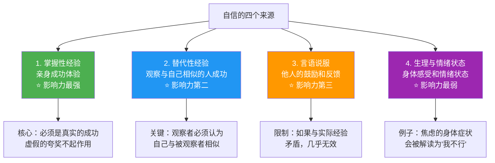
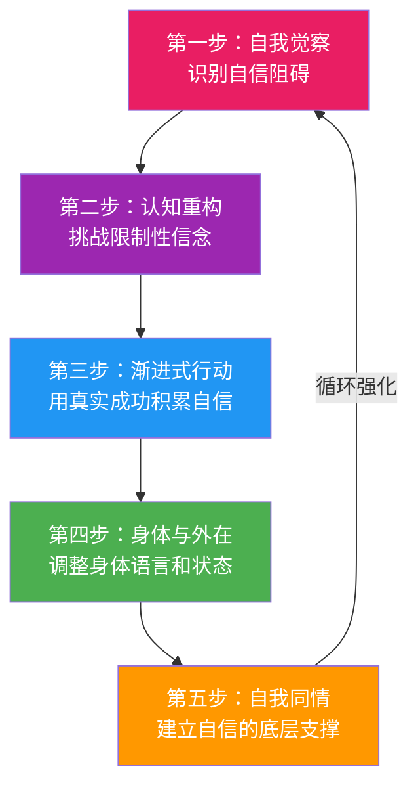
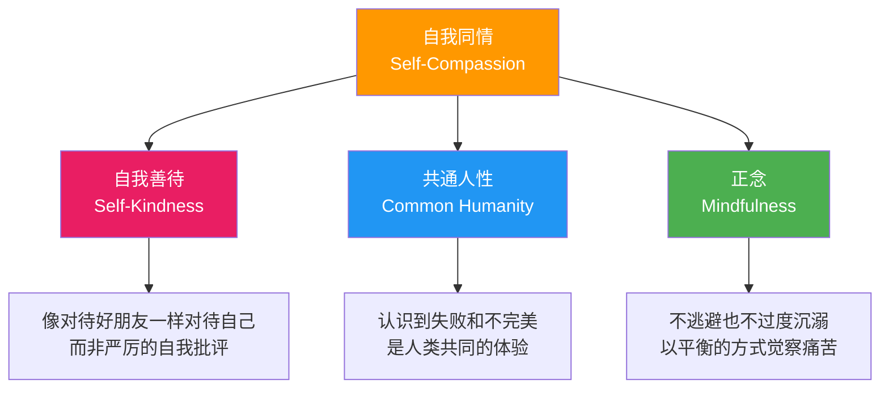

## 三、自信建立

自信不是性格标签，而是一种可以系统培养的心理能力。Bandura 的研究反复证实：自我效能感（自信的心理学核心）可以通过特定方法训练提升，且提升后对学业成绩、职业表现、身心健康和人际关系都有显著正向影响。本章将从理论基础到实操方法，提供一套完整的自信建设体系。

### 3.1 理解自信：从直觉到科学

#### 3.1.1 自信的本质定义

日常语境中的"自信"是一个模糊的词。心理学将其拆解为几个可操作的概念：

| 概念 | 定义 | 特征 | 例子 |
|------|------|------|------|
| **自我效能感**（Self-Efficacy） | 对自己在特定情境中能否完成特定任务的信念 | 具体、可培养、与行为直接相关 | "我能在面试中清晰表达自己的优势" |
| **自尊**（Self-Esteem） | 对自我整体价值的评价 | 整体性、相对稳定 | "我是一个有价值的人" |
| **自信**（Self-Confidence） | 对自己能力和判断的总体信任 | 日常用语，介于上述两者之间 | "我相信自己能处理好这件事" |
| **自我价值感**（Self-Worth） | 感知到自己值得被爱和被尊重 | 与早期依恋经验密切相关 | "我值得拥有好的关系" |

**关键区分**：自我效能感是具体领域的——一个人可能在编程上有极高的自我效能感，但在公开演讲上自我效能感很低。而自尊是整体性的。这就是为什么"提升自信"必须落实到具体领域，而不是笼统地告诉自己"我很棒"。

#### 3.1.2 自信的神经科学基础

自信不仅仅是心理层面的，它有明确的神经生理基础：

**前额叶皮层（Prefrontal Cortex）**：负责评估自身能力和预测结果。当前额叶活动模式偏向"我能应对"时，人会体验到自信感。长期的压力和焦虑会削弱前额叶功能，导致自信下降。

**多巴胺系统**：多巴胺不仅是"快乐分子"，更是"预测分子"。当你预测自己能成功并实际成功时，多巴胺系统会产生奖励信号，强化"我能行"的信念。这就是为什么小的、可实现的目标对建立自信如此重要——每一个小成功都在强化多巴胺回路。

**杏仁核（Amygdala）**：负责威胁检测。在自信不足的人身上，杏仁核对社交威胁（被拒绝、被嘲笑）的反应过度活跃。渐进式暴露训练可以降低杏仁核的敏感度。

**皮质醇**：慢性压力激素。高皮质醇水平会损害前额叶功能，同时增强杏仁核活动，形成"压力→表现差→更不自信→更大压力"的恶性循环。这就是为什么身体层面的干预（运动、呼吸、充足睡眠）对自信建设不是"锦上添花"，而是基础设施。

#### 3.1.3 自信的四个来源

Bandura 的自我效能理论指出，自信来自四个渠道，影响力从强到弱：

**实际意义**：这意味着——

1. **光靠"想"是不够的**。"每天告诉自己我很棒"如果不配合真实的行动和成功经验，效果极其有限
2. **行动是自信的第一来源**。即使是微小的成功经验，也比一百句鼓励更有效
3. **找到"同类榜样"很重要**。看到和自己背景、能力相似的人成功，比看到天才的成功更能提升自信
4. **身体状态会影响自信**。疲劳、饥饿、睡眠不足都会降低自信水平

#### 3.1.4 自信不是什么

理解自信的边界同样重要：

| 不是自信 | 而是 | 区分标准 |
|----------|------|----------|
| 盲目乐观 | 准确的自我评估 | 自信者知道自己的局限，但相信自己能在能力范围内做好 |
| 从不怀疑 | 允许不确定性的存在 | 自信者会说"我不确定，但我愿意尝试" |
| 不在乎他人评价 | 选择性地接收反馈 | 自信者会听取有价值的反馈，但不会被所有评价左右 |
| 永远积极 | 允许自己有负面情绪 | 自信者也会紧张、害怕，但不会因此逃避行动 |
| 需要证明自己 | 内在的安全感 | 真正的自信不需要通过贬低他人来维持 |

### 3.2 自信的七大阻碍

在建设自信之前，需要先识别并清除阻碍。以下是基于认知行为疗法（CBT）和接纳承诺疗法（ACT）研究总结的七大自信阻碍：

#### 3.2.1 认知扭曲

认知扭曲是自动化思维中的系统性偏差，它们像有色眼镜一样扭曲你对自己的看法：

**（1）全或无思维（All-or-Nothing Thinking）**
- 表现："如果我不能做到完美，那还不如不做"
- 例子：演讲时有一处口误，就觉得自己"彻底搞砸了"
- 纠正：用百分比评估——"这次演讲80%的部分做得不错，只有20%需要改进"

**（2）过度概括（Overgeneralization）**
- 表现："我这次失败了，说明我这方面不行"
- 例子：一次面试被拒，就认为"我永远找不到好工作"
- 纠正：加限定词——"这次面试没通过"而不是"我面试不行"

**（3）灾难化思维（Catastrophizing）**
- 表现："如果我发言时出错，所有人都会嘲笑我"
- 例子：还没开始做一件事，就已经想象了最坏的结果
- 纠正：问自己"最坏的结果是什么？发生的概率有多大？即使发生了我能应对吗？"

**（4）读心术（Mind Reading）**
- 表现："他们一定觉得我很蠢"
- 例子：别人没有回应你的招呼，就认为对方不喜欢你
- 纠正：承认你不知道别人在想什么，寻找替代解释

**（5）应该思维（Should Statements）**
- 表现："我应该能做到这个，做不到说明我有问题"
- 例子："一个30岁的人应该已经买了房"
- 纠正：把"应该"换成"我希望"或"我选择"

**（6）标签化（Labeling）**
- 表现："我是一个失败者"
- 例子：一次犯错就给自己贴上永久性的负面标签
- 纠正：描述行为而非定义身份——"我这次做了一个不好的决定"而不是"我是一个做不好决定的人"

**（7）否定正面（Disqualifying the Positive）**
- 表现："这次成功只是运气好"
- 例子：收到表扬时想"他们只是客气"，但收到批评时深信不疑
- 纠正：像记录负面事件一样认真记录正面事件

#### 3.2.2 比较陷阱

社交比较是人类的本能，但不对称的比较会摧毁自信：

- **向上比较的单向使用**：只和比自己强的人比，却从不和比自己弱的人或自己的过去比
- **忽略了对方的全貌**：看到别人的成就，看不到别人背后的努力、资源和运气
- **社交媒体的放大效应**：精心策划的展示创造了"所有人都比我好"的假象

**应对策略**：将"和别人比"替换为"和过去的自己比"。每周记录自己的进步，哪怕是微小的进步。

#### 3.2.3 童年印记

早年经历对自信的影响深远而持久：

- **过度批评的养育环境**："你怎么又做错了""你看看别人家的孩子"——这些话语会内化为内心的声音
- **条件性的爱**："你考了100分妈妈才高兴"——导致将自我价值与成就绑定
- **忽视或情感缺席**：没有被看见和肯定的经历，导致内心深处的"我不值得"信念
- **过度保护**：剥夺了孩子面对挑战和失败的机会，导致"我不能独立应对"的信念

识别这些印记不是为了责怪父母，而是为了理解当前自信问题的根源，从而更有针对性地改变。

### 3.3 自信建立的五步系统

以下是经过实证支持的自信建设系统，五个步骤依次递进、相互支撑。

#### 第一步：自我觉察——识别自信的阻碍

**目标**：清晰地看到哪些信念、思维模式和情绪反应在阻碍你的自信。

**练习：自信审计（Confidence Audit）**

这是一个结构化的自我评估工具，建议用30-45分钟安静地完成：

1. **列出需要自信的5个领域**——工作发言、社交互动、学习新技能、亲密关系、创造性表达，或者任何对你重要的领域
2. **评估每个领域的自信程度**（1-10分），并写下一两个具体场景来说明这个分数
3. **识别阻碍信念**——对于低分领域，写下脑海中关于自己的负面信念。要求：用第一人称写完整句子，如"我在社交场合总是很尴尬"
4. **追溯信念来源**——这个信念最早出现在什么时候？是否与某个具体的经历有关？是谁先告诉你这个信念的？
5. **评估信念的当下适用性**——那个经历发生在多久以前？你的能力、环境和资源是否已经改变了？如果今天遇到同样的情况，结果是否可能不同？

**自信审计模板**：

| 领域 | 自信分数 | 具体场景 | 阻碍信念 | 信念来源 | 当下适用？ |
|------|----------|----------|----------|----------|------------|
| 工作发言 | 4/10 | 上周开会没敢提反对意见 | "我的想法不够好" | 大学时被教授当众否定 | 已经工作5年，经验完全不同 |
| 社交 | 5/10 | 公司聚会不知道说什么 | "我很无趣" | 中学时被同学孤立 | 现在有稳定的朋友圈 |
| ... | ... | ... | ... | ... | ... |

#### 第二步：认知重构——挑战限制性信念

**目标**：用更准确、更平衡的信念替代扭曲的信念。

**练习：信念审判（Belief Trial）**

对每一个阻碍信念进行"法庭审判"——这个练习之所以有效，是因为它要求你像法官一样基于证据做出判断，而不是被情绪驱动。

**操作步骤**：

1. **控方陈词**（支持信念的证据）：列出所有支持这个信念的事实和经历。要求：只列事实，不列推测
2. **辩方陈词**（反对信念的证据）：列出所有反对这个信念的事实。要求：包括反面经历、他人反馈、客观数据
3. **交叉质证**：对每一条证据问——这是事实还是推测？是否有其他解释？样本量是否足够？
4. **法官判决**：基于双方证据，做出更平衡的判断。要求：使用限定性语言（"有时候""在某些情况下"）
5. **撰写新信念**：将判决转化为一个可操作的新信念

**完整示例**：

| 环节 | 内容 |
|------|------|
| **旧信念** | "我在社交场合总是很尴尬" |
| **控方证据** | ① 有三次在派对上不知道说什么；② 有两次说了冷场的话；③ 我不太擅长small talk |
| **辩方证据** | ① 和朋友在一起时完全放松；② 上个月和新同事聊了半小时很愉快；③ 工作中的会议发言没问题；④ 被邀请参加过三次聚会，说明别人愿意和我相处 |
| **交叉质证** | "总是"这个词准确吗？三次派对vs多次愉快交流，哪个样本更大？不知道说什么是否等于"尴尬"？ |
| **判决** | 我在不完全陌生的社交场合表现得不错，在完全陌生的环境中需要一些时间适应，但并非"总是尴尬" |
| **新信念** | "我在新的社交场合需要几分钟热身，但我有能力与人建立连接" |

**关键原则**：
- 新信念必须比旧信念更准确，而不是从一个极端跳到另一个极端
- 新信念应该是可验证的——你可以通过行动来检验它
- 如果找不到辩方证据，这可能不是一个认知扭曲，而是一个需要通过行动改变的真实局限

#### 第三步：渐进式行动——用真实成功积累自信

**目标**：通过系统化的行动积累掌握性经验，这是提升自信最有效的方式。

**原理深入**：Bandura 的研究反复证明，掌握性经验对自我效能感的影响远大于其他三个来源。但关键在于——

- 失败的经验同样会降低自我效能感，而且降低的幅度比成功的提升幅度更大
- 因此，设计"可管理的挑战"至关重要——难度刚好超出舒适区，但不至于让你崩溃
- 每一次成功，无论多小，都会在大脑中强化"我能行"的神经通路

**练习：自信阶梯（Confidence Ladder）**

1. **选择一个你想提升自信的领域**
2. **定义你的"阶梯顶端"**——在这个领域你最终想达到什么水平？（如：在100人面前做30分钟演讲）
3. **将目标分解为5-10个递进步骤**——从最不令你焦虑到最令你焦虑
4. **设计每一步的成功标准**——什么算是"完成了这一步"？要求具体、可观察
5. **从第一步开始**——完成一步后再进入下一步
6. **记录每一步的感受和收获**——这是你未来需要回顾的"成功证据库"

**示例：公开发言的自信阶梯**

| 步骤 | 具体行动 | 焦虑等级 | 成功标准 | 预计时长 |
|------|----------|----------|----------|----------|
| 1 | 在镜子前练习一段2分钟的发言 | 1/10 | 完整说完，不中途停下 | 第1周 |
| 2 | 录制自己发言的视频并回看 | 2/10 | 看完视频并找出3个做得好的地方 | 第1周 |
| 3 | 对一个亲密的朋友做5分钟分享 | 3/10 | 完整分享，朋友表示听懂了 | 第2周 |
| 4 | 在3-4人的小组中主动分享一个观点 | 4/10 | 说出来即可，不论反应如何 | 第2周 |
| 5 | 在团队会议中提出一个问题 | 5/10 | 问出一个完整的问题 | 第3周 |
| 6 | 在团队会议中做一个5分钟汇报 | 6/10 | 完成汇报，接受提问 | 第4周 |
| 7 | 在10-20人的场合做10分钟发言 | 7/10 | 完成发言，收到正面反馈 | 第5-6周 |
| 8 | 在50人以上的场合做正式演讲 | 8/10 | 完成演讲，事后不自我攻击 | 第7-8周 |

**关于"失败"的处理**：
- 如果某一步反复失败（3次以上），不要硬撑——退回上一步，多练习几次
- 失败后做一次简短的复盘：是难度跨度过大？准备不充分？还是临时的身体/情绪状态不好？
- 记住：退步不等于失败，它是正常的波浪形进步过程

#### 第四步：身体与外在——调整身体状态

**目标**：通过身体层面的调整，直接影响心理状态。这一步不是"表面功夫"——神经科学已经证实身体和心理之间的双向影响。

**（1）姿态训练**

Amy Cuddy 的研究（尽管后续有争议）和其他多项研究确认：扩展性姿势可以在短期内影响激素水平和主观感受。更确定的结论是——姿势会影响你对自己的主观感受，而这会影响你的行为表现。

| 姿势类型 | 具体做法 | 日常场景 |
|----------|----------|----------|
| **站立自信姿势** | 双脚与肩同宽，重心均匀分布，肩膀放松下沉，下巴微微抬起 | 等电梯时、排队时 |
| **坐姿自信姿势** | 背部挺直但不僵硬，双手自然放置，占据合理的空间 | 开会时、与人交谈时 |
| **行走自信姿势** | 步伐稳定、速度适中、手臂自然摆动、目光平视前方 | 日常行走 |

**练习**：每天早晚各花2分钟，摆出自信姿势并保持。不是为了"假装"自信，而是让身体习惯这种姿态。

**（2）目光接触**

适度的目光接触是自信的重要信号，同时也能增强自己的自信感：

- **舒适区练习**：先和亲近的人练习，每次保持3-5秒自然的目光接触
- **进阶练习**：在日常对话中，有意识地增加目光接触的比例（目标是60-70%的时间）
- **避免**：死盯着对方（会造成压迫感）和完全回避目光（会被解读为不自信或不诚实）

**（3）语音训练**

声音是自信的放大器：

- **语速**：紧张时人会不自觉地加快语速。刻意放慢10-15%，会立刻显得更沉稳
- **音量**：音量过低是不自信的常见信号。练习用"丹田"发声——说话时感受腹部的震动
- **停顿**：学会在关键点停顿1-2秒。停顿不是"卡壳"，而是有力量的表达方式
- **语调**：避免每句话结尾都上扬（变成疑问句的语调）。陈述句用下降的语调结尾

**（4）外观管理**

这不是说你需要穿名牌——而是说整洁、得体的外在形象会影响你的自我感受：

- 穿让你感到舒适和自信的衣服（研究称之为"enclothed cognition"——衣物对认知的影响）
- 保持基本的整洁：干净的衣物、整齐的发型、清新的气味
- 选择让你感到"像自己"的风格，而不是模仿他人

#### 第五步：自我同情——自信的底层支撑

**目标**：建立一种底层的安全感——即使失败了，你也不会摧毁自己。这是自信可持续的根基。

**原理**：Kristin Neff 的研究表明，自我同情（Self-Compassion）不是自我放纵，而是一种更健康的自我关系。高自我同情的人反而更有动力去改变和成长，因为他们不怕失败——失败不会带来毁灭性的自我否定。

自我同情包含三个核心要素：

**练习一：自我同情日记**

每天晚上花5-10分钟，记录以下内容：

1. **今天发生了什么让我感到不足或失败的事？**（客观描述事实）
2. **我当时对自己说了什么？**（记录内心的声音）
3. **如果一个好朋友遇到同样的情况，我会对TA说什么？**（写下你对朋友说的话）
4. **为什么我不能对自己说同样的话？**（觉察双重标准）
5. **用自我同情的语言重写对自己的回应**（融合自我善待、共通人性和正念）

**练习二：自我同情冥想（10分钟）**

1. 找一个安静的地方坐下，闭上眼睛，做3次深呼吸
2. 回想一个最近让你感到不足或失败的经历
3. 承认痛苦："这一刻，我感到痛苦/难过/失望。这种感受是真实的。"
4. 共通人性："所有人都会经历失败和不足。我不是唯一一个正在经历困难的人。"
5. 自我善待：将一只手或双手放在心口，感受手掌的温度，对自己说："愿我善待自己。愿我给自己所需要的同情。愿我接受不完美的自己。"
6. 保持这个姿势1-2分钟，感受身体中温暖和支持的感觉

**练习三：写给自己的信**

以第三人称给自己写一封信，就好像你在安慰一个遇到同样困境的好朋友。研究发现，第三人称视角能帮助我们跳出自我中心的思维模式，更容易产生自我同情。

### 3.4 不同场景的自信策略

自信不是通用的——在不同场景中需要不同的策略。

#### 3.4.1 社交自信

**核心挑战**：害怕被评价、害怕冷场、不知道说什么。

**具体策略**：
- **提问法**：不知道说什么的时候，提问比陈述更安全。"你觉得这个怎么样？""你是怎么开始做这个的？"
- **FOORD话题公式**：Family（家庭）、Occupation（职业）、Recreation（休闲）、Dreams（梦想）——四个万能话题领域
- **3秒规则**：想说什么的时候，3秒内开口。超过3秒，焦虑会接管你的大脑
- **退出策略**：提前想好退出对话的方式（"我去拿杯饮料""我去打个招呼"），有了退路反而更能放松

#### 3.4.2 职场自信

**核心挑战**：冒充者综合征（Impostor Syndrome）、害怕表达不同意见、不敢争取机会。

**具体策略**：
- **成就清单**：维护一个持续更新的成就清单，包括具体的数据和结果。在自我怀疑时回顾
- **准备过量法**：对重要的汇报/面试，准备量超过需要的2-3倍。过度的准备是自信最可靠的来源
- **"我有一个想法"句式**：在会议中表达不同意见时，用"我有一个想法"开头，比"你错了"更自信也更有效
- **定期向上沟通**：主动和上级分享你的工作进展和成果，不要等着被发现

#### 3.4.3 学习自信

**核心挑战**：觉得自己学不会、和"天才"比较、遇到困难就放弃。

**具体策略**：
- **成长型思维（Growth Mindset）**：Dweck 的研究表明，相信能力可以通过努力提升的人，比相信能力是固定的人更有韧性
- **"还没"策略**：把"我不会"改成"我还不会"。一个字的差别，暗示了学习的可能性
- **分解学习目标**：把大的学习目标拆成可管理的小模块，每完成一个小模块就记录一次成功
- **找到自己的学习风格**：视觉型、听觉型、动觉型——用适合自己的方式学习效率更高，成功的体验也更多

#### 3.4.4 亲密关系中的自信

**核心挑战**：害怕被抛弃、不敢表达需求、过度讨好或过度防御。

**具体策略**：
- **需求表达练习**：用"我感到...当...因为...我希望..."的句式表达需求
- **边界设定**：明确自己的底线，温和而坚定地表达
- **自我完整性**：在关系中保持自己的兴趣、朋友和空间。过度融合会侵蚀自信
- **依恋风格觉察**：了解自己的依恋风格（安全型/焦虑型/回避型），理解自己的关系模式

### 3.5 常见误区与纠正

| 误区 | 问题所在 | 正确做法 |
|------|----------|----------|
| "每天对着镜子说'我很棒'" | 缺乏行动支撑的自我肯定，对低自尊者可能适得其反（Wood et al., 2009） | 用具体的、真实的成功经验来支撑自我肯定 |
| "自信的人不会紧张" | 混淆了自信和无畏。自信者也会紧张，但不会被紧张阻止 | 允许紧张存在，同时依然采取行动 |
| "等我准备好了再行动" | 完美主义的陷阱。永远不会有"完全准备好"的时刻 | 设定一个"足够好"的标准，然后开始行动 |
| "自信是天生的" | 忽视了自我效能感的可塑性 | 自信是一种技能，可以通过系统训练提升 |
| "贬低别人能提升自己" | 这是自恋，不是自信。真正的自信不需要通过比较来维持 | 关注自己的成长，而非他人的不足 |
| "失败说明我不行" | 将行为失败等同于身份缺陷 | 失败是一个事件，不是一个身份标签 |
| "我需要所有人都喜欢我" | 将自我价值建立在外部评价上 | 接受不可能让所有人满意，关注真正重要的人的反馈 |

### 3.6 进阶策略：持久自信的维护系统

自信不是"修好了就完事"的状态，它需要持续的维护和更新。以下是建立长期自信维护系统的方法：

#### 3.6.1 个人成功档案

创建一个"成功档案"，在自信低落时回顾：

- **内容**：你完成的困难任务、收到的正面反馈、克服的困难、学到的技能
- **形式**：可以是文件夹、笔记应用、邮件收藏夹
- **更新频率**：每周至少添加一条
- **使用时机**：当你感到自我怀疑时，打开这个档案，花5分钟回顾

#### 3.6.2 支持性社交圈

自信的维护不是一个人的事：

- **识别你的"充电者"**：哪些人在你身边时让你感到更有力量？
- **识别你的"消耗者"**：哪些人总是让你感到自卑或不足？
- **调整比例**：不是要完全切断关系，而是有意识地增加与"充电者"的互动
- **找到"真话朋友"**：既能鼓励你，也能诚实地指出你的问题的人

#### 3.6.3 周期性自信检查

每月花30分钟做一次"自信体检"：

1. 回顾本月的自信审计表，分数是否有变化？
2. 本月有哪些成功的经验？记录到成功档案
3. 本月有哪些自信阻碍出现了？用了什么策略应对？
4. 下个月想在哪个领域继续提升自信？设计下一步行动计划

#### 3.6.4 与压力管理的协同

自信和压力管理是双向关系——压力过大会侵蚀自信，自信不足会放大压力感知。将自信建设与压力管理结合：

- **运动**：规律运动不仅降低皮质醇，还提供持续的"我能坚持"的掌握性经验
- **睡眠**：睡眠不足会显著降低自我效能感。保证7-8小时的睡眠是自信的基础设施
- **正念冥想**：每天10-15分钟的正念练习，增强对自动化思维的觉察能力
- **呼吸练习**：在自信挑战前（如面试、演讲），做3-5次4-7-8呼吸（吸气4秒、屏息7秒、呼气8秒），降低生理唤醒水平

### 3.7 自信建设的里程碑

自信的提升是一个渐进过程。以下是一些典型的里程碑标志，帮助你判断自己是否在进步：

| 阶段 | 典型表现 | 时间参考 |
|------|----------|----------|
| **觉察期** | 能识别自己的自信阻碍信念，但还无法改变它们 | 第1-2周 |
| **挑战期** | 开始质疑限制性信念，偶尔能用新信念替代旧信念 | 第3-4周 |
| **行动期** | 开始在真实场景中采取小步骤行动，积累了几次成功经验 | 第2-6周 |
| **内化期** | 新信念开始成为默认反应，不再需要刻意提醒自己 | 第6-12周 |
| **维护期** | 偶尔出现自信波动，但能快速调用策略恢复 | 第3个月以后 |

**重要提醒**：进步不是线性的。会有反复、有低谷、有停滞。这都是正常的。自信建设的正确节奏是"波浪式前进"——整体趋势向上，但过程中有起伏。
