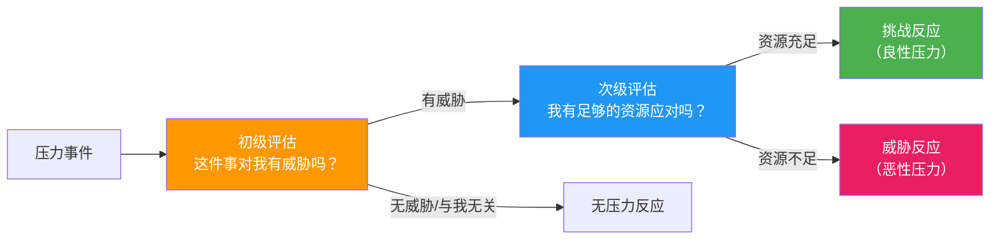
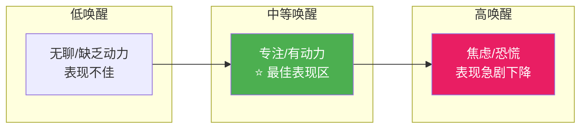
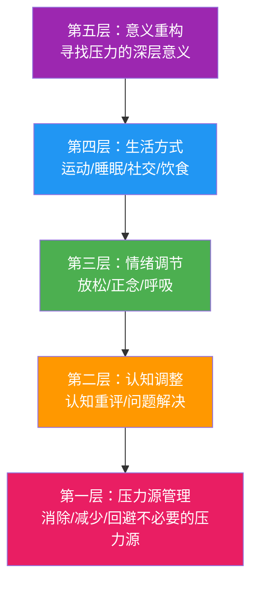

## 四、压力管理

压力是现代生活中无法回避的体验。它不是你的敌人，也不是你的朋友——它是一种生物学信号，提醒你当前的环境要求超出了你的应对资源。真正的问题不是"如何消除压力"，而是"如何与压力建立健康的关系"。本章将从压力的科学机制出发，提供一套完整的压力管理工具箱，帮助你从被动承受压力转变为主动管理压力。

本章与前几章内容紧密关联：情绪管理技巧（第二章）中的认知重评和正念练习是压力管理的核心工具，自信建立（第三章）中讨论的自我效能感直接影响你对压力的评估——一个在某领域高自我效能感的人，面对同样挑战时体验到的压力远低于自我效能感低的人。压力管理不是孤立的技能，它是心理健康的基础设施。

### 4.1 理解压力：从感觉到科学

#### 4.1.1 压力的本质定义

日常语境中的"压力"是一个笼统的词，涵盖了从"今天事情有点多"到"我快要崩溃了"的巨大范围。心理学和神经科学对压力有更精确的定义：

**Lazarus & Folkman 的认知评估模型（1984）**是理解压力最重要的理论框架。该模型的核心观点是：压力不是事件本身的属性，而是个体对事件的评估结果。同样的事件，不同的人可能产生完全不同的压力反应，甚至同一个人在不同情境下也会有不同的反应。

压力产生需要经历两轮评估：

**初级评估**回答的是"这件事和我有什么关系"：
- **威胁**：我可能会受到伤害或损失（如：即将到来的裁员）
- **挑战**：这是一个成长的机会，虽然有风险（如：晋升面试）
- **无关**：这件事和我没关系（如：与自己无关的行业新闻）

**次级评估**回答的是"我能应付吗"：
- 评估自己的能力、资源、社会支持是否足以应对
- 评估是否有足够的时间
- 评估可能的后果有多严重

**关键洞察**：这意味着压力管理可以在两个层面干预——改变对事件的评估（认知层面），或者增强应对资源（能力和支持层面）。后面介绍的所有策略都基于这两个方向。

#### 4.1.2 压力的生物学机制

理解压力的生物学机制，能帮助你更有效地管理它。压力反应不是"心理作用"，而是有明确的神经内分泌通路。

**HPA轴（下丘脑-垂体-肾上腺轴）**是压力反应的核心通路：

1. **感知威胁**：大脑的杏仁核（Amygdala）检测到潜在威胁
2. **启动反应**：杏仁核激活下丘脑（Hypothalamus）
3. **释放CRH**：下丘脑释放促肾上腺皮质激素释放激素（CRH）
4. **激活垂体**：CRH刺激垂体释放促肾上腺皮质激素（ACTH）
5. **释放皮质醇**：ACTH随血液到达肾上腺，触发皮质醇释放
6. **全身效应**：皮质醇进入血液，影响全身多个器官系统
7. **负反馈**：当压力源消除，升高的皮质醇会抑制下丘脑和垂体，关闭反应

**皮质醇的作用**（短期）：
- 提升血糖水平，为肌肉提供能量
- 抑制非紧急功能（消化、免疫、生殖）
- 增强注意力和警觉性
- 帮助将能量从长期建设转向短期应对

**皮质醇的危害**（长期）：
- 损害海马体（记忆中心），导致记忆力下降
- 削弱前额叶皮层功能，降低决策质量
- 增强杏仁核敏感度，使你更容易感知威胁
- 抑制免疫系统，增加感染风险
- 促进腹部脂肪堆积
- 干扰睡眠周期

**自主神经系统的双重调节**：

| 系统 | 状态 | 生理表现 | 功能 |
|------|------|----------|------|
| **交感神经系统** | "战斗或逃跑" | 心跳加速、血压升高、肌肉紧张、瞳孔放大、消化减缓 | 应对紧急威胁 |
| **副交感神经系统** | "休息和消化" | 心跳减缓、血压降低、肌肉放松、消化活跃 | 恢复和修复 |

健康的压力管理本质上是在交感和副交感神经系统之间灵活切换的能力。慢性压力的问题在于交感神经系统持续激活，无法回到副交感主导的状态。

#### 4.1.3 压力的类型

并非所有压力都相同。理解不同类型的压力有助于选择正确的应对策略。

**按持续时间分类**：

| 类型 | 持续时间 | 例子 | 生理特征 | 应对重点 |
|------|----------|------|----------|----------|
| **急性压力** | 分钟到数天 | 重要考试、突发冲突、交通堵塞 | 短暂的HPA轴激活，结束后迅速恢复 | 即时调节技术（呼吸、认知重评） |
| **慢性压力** | 数周到数年 | 长期工作不满意、婚姻问题、贫困、慢性疾病 | 持续的HPA轴激活，皮质醇节律紊乱 | 系统性生活改变、专业干预 |

**按性质分类**（Selye, 1975）：

| 类型 | 定义 | 例子 | 对表现的影响 |
|------|------|------|------------|
| **良性压力（Eustress）** | 被评估为挑战而非威胁，伴随可控的压力感 | 运动比赛、有吸引力的工作挑战 | 提升表现（Yerkes-Dodson定律） |
| **恶性压力（Distress）** | 被评估为威胁，超出应对资源 | 失业、亲人去世、持续的职场霸凌 | 降低表现，损害健康 |

**按来源分类**：

- **外部压力源**：工作要求、人际关系冲突、经济困难、环境噪音、时间紧迫
- **内部压力源**：完美主义倾向、灾难化思维、不合理的自我期望、未处理的创伤记忆

**值得注意**：许多人的最大压力源不是外部事件，而是自己的内部思维模式。一个完美主义者在完成90%的任务时感受到的压力，可能比一个务实主义者面对真正困难时感受到的压力更大。

#### 4.1.4 Yerkes-Dodson定律：压力与表现的关系

1908年，心理学家Yerkes和Dodson发现了压力/唤醒水平与表现之间的倒U型关系：

这个定律有两个重要的补充说明：

1. **任务复杂度的影响**：简单任务的最佳唤醒水平高于复杂任务。搬砖时高度兴奋可能提升效率，但做数学题时高度兴奋只会让你犯错
2. **个体差异**：不同人的最佳唤醒水平不同。有些人天生更能在高压力下保持表现，有些人需要更低的唤醒水平才能发挥最佳

**实际应用**：当你要完成复杂任务（如写报告、编程、学习新知识）时，需要将压力/唤醒水平保持在中等偏低的范围。当你要完成简单或体力任务（如运动、整理文件）时，可以接受更高的唤醒水平。

#### 4.1.5 压力的早期预警信号

学会识别压力的早期信号，是有效管理压力的前提。大多数人直到压力已经严重影响生活时才意识到问题。以下是压力的多维度预警信号：

**身体信号**：
- 肌肉持续紧张（特别是肩颈、下巴、前额）
- 频繁头痛或偏头痛
- 消化问题（胃部不适、腹泻、便秘）
- 睡眠质量下降（入睡困难、早醒、多梦）
- 频繁感冒或感染（免疫功能下降）
- 不明原因的疲劳

**情绪信号**：
- 容易烦躁或发怒
- 持续的焦虑感或"有什么不好的事要发生"的感觉
- 情绪波动加剧
- 对以前感兴趣的事失去兴趣
- 感到无法控制生活

**认知信号**：
- 注意力难以集中
- 反复思考同一件事（思维反刍）
- 做决定变得困难
- 记忆力下降
- 消极思维增多

**行为信号**：
- 拖延增加
- 社交退缩
- 饮食习惯改变（暴食或食欲下降）
- 依赖烟酒或其他物质
- 工作效率明显下降

**压力自评量表**：每周花2分钟检查以上四个维度，用1-5分评估每个维度的压力程度。当任何维度达到4分或以上时，说明需要采取主动的压力管理措施。

### 4.2 压力管理的五层模型

有效的压力管理不是单一技术，而是一个多层次的系统。以下是基于研究和临床实践总结的五层压力管理模型：

这五层从外到内、从基础到高级依次递进。大多数人只关注其中一两层，但真正有效的压力管理需要在每一层都建立能力。

### 4.3 第一层：压力源管理——消除不必要的压力

在学习如何"承受"更多压力之前，先问自己一个更重要的问题：有哪些压力是完全不必要的？

#### 4.3.1 压力源审计

花30分钟做一次"压力源审计"：

1. **列出你当前所有的压力源**——工作、关系、财务、健康、环境……不要遗漏
2. **对每个压力源进行分类**：
   - **可控**：你可以直接改变或消除的（如：不合理的工作安排、某个让你不舒服的社交承诺）
   - **部分可控**：你可以影响但不能完全控制的（如：上司的态度、同事的配合度）
   - **不可控**：你无法改变的（如：经济大环境、已经发生的过去事件、他人的最终决定）
3. **对可控的压力源，制定消除或减少的行动计划**
4. **对不可控的压力源，转向接受和调整自己的反应**

#### 4.3.2 消除不必要压力的具体方法

**学会拒绝**：
- 每次别人提出请求时，给自己一个"决策缓冲期"——"让我看看日程，明天回复你"
- 使用"三振法"：如果一件事让你连续三次感到不情愿，就拒绝它
- 记住：说"不"是对自己的"是"。每次你勉强答应，都在消耗应对真正重要事情的资源

**减少决策疲劳**：
- 将日常琐事标准化（固定早餐菜单、固定穿衣方案、固定工作流程）
- 使用"两分钟法则"：能在两分钟内完成的事立刻做，不放进待办清单
- 每天设定1-3个最重要的任务（MIT），其他都是次要的

**管理信息输入**：
- 设定固定的新闻/社交媒体查看时间，而不是随时刷新
- 关闭不必要的通知——每一条通知都是一个微型压力源
- 在需要专注时使用"飞行模式"或应用屏蔽工具

**改善物理环境**：
- 整理工作空间——杂乱的环境会增加认知负荷和压力感
- 控制噪音（使用降噪耳机、选择安静的工作环境）
- 确保良好的光线和通风

### 4.4 第二层：认知调整——改变对压力的解读

当压力源无法消除时，下一步是改变你对压力事件的认知评估。

#### 4.4.1 认知重评

认知重评（Cognitive Reappraisal）是情绪调节研究中最被证实有效的策略之一（Gross, 2002）。它的核心是改变对事件的解读方式，从而改变情绪反应。

**压力重评三问**：

当感到压力时，依次问自己这三个问题：

1. **"最坏的结果是什么？我能承受吗？"**——降低威胁感知。大多数情况下，即使最坏的结果发生，你也能承受和应对
2. **"最好的结果是什么？"**——增加积极期待，平衡大脑对威胁的过度关注
3. **"最可能的结果是什么？"**——从灾难化回到现实评估

**压力思维转换清单**：

| 自动化思维（威胁导向） | 重新评估（挑战导向） | 原理 |
|--------------------------|----------------------|------|
| "我必须做到完美" | "我只需要做到足够好" | 降低不切实际的标准 |
| "我不能失败" | "失败了我可以学习和调整" | 将失败重新定义为学习机会 |
| "这件事太大了，我做不了" | "我只需要完成下一步" | 分解任务，降低认知负荷 |
| "所有人都在看我出丑" | "大多数人忙于关注自己" | 降低聚光灯效应 |
| "压力是有害的" | "适度的压力可以帮助我表现更好" | 重新框架压力本身 |

最后一条有强有力的研究支持：斯坦福大学Alia Crum的研究发现，仅仅是将压力重新框架为"有益的"而不是"有害的"，就能改变压力的生理效果——在同样的压力水平下，将压力视为积极的人表现出更多的挑战反应（血管扩张、更高的心输出量），更少的威胁反应（血管收缩）。

**思维记录练习**：

当感到强烈压力时，用以下模板记录并挑战你的想法：

| 列 | 内容 | 示例 |
|------|------|------|
| 情境 | 客观描述发生了什么 | 周五要向管理层做季度汇报 |
| 自动化想法 | 脑海中闪过什么？ | "如果我说错话，会被认为不专业" |
| 情绪和强度 | 什么情绪？强度1-10？ | 焦虑 8/10 |
| 证据支持 | 支持这个想法的事实？ | 上次汇报有一页数据说错了 |
| 证据反对 | 反对这个想法的事实？ | 上次汇报整体反馈不错；管理层上次对错误只是随口提了一下 |
| 平衡想法 | 更准确的想法 | "我可能会犯一些小错误，但只要准备充分，整体表现不会有问题" |
| 情绪变化 | 重新评估情绪强度 | 焦虑 4/10 |

#### 4.4.2 系统化问题解决

对于可以控制的压力源，认知重评只是第一步——你还需要实际解决问题。以下是基于D'Zurilla和Goldfried（1971）的问题解决模型的六步法：

**第一步：定义问题**
- 将模糊的压力感转化为明确的问题陈述
- 差："工作压力太大了好"
- 好："我同时负责三个项目，每个都有紧迫的截止日期，我的工作时间不够分配"

**第二步：设定目标**
- 定义你希望达到的理想状态
- 目标要具体、可衡量、有时限
- 示例："在不加班的情况下，合理分配精力给三个项目，确保最关键的两个按时交付"

**第三步：头脑风暴**
- 列出所有可能的解决方案，不急于评判
- 数量优先于质量——先写下来，哪怕是"不靠谱"的想法
- 示例：向上司申请延期、外包部分工作、与同事协商分担、重新排列优先级、延长工作时间（短期）、砍掉最低优先级项目、找实习生帮忙

**第四步：评估方案**
- 对每个方案从以下维度评估：

| 方案 | 可行性(1-5) | 效果(1-5) | 成本(1-5) | 时间 | 综合评分 |
|------|-------------|-----------|-----------|------|----------|
| 向上司申请延期 | 4 | 4 | 1 | 立即 | 9 |
| 与同事协商分担 | 3 | 3 | 2 | 1周 | 8 |
| 重新排列优先级 | 5 | 3 | 1 | 立即 | 9 |
| 延长工作时间 | 5 | 2 | 5 | 立即 | 2 |

**第五步：选择并执行**
- 选择综合评分最高的方案
- 制定具体的行动计划（谁、什么、何时、如何）
- 预想可能的障碍并准备应对方案

**第六步：评估效果**
- 执行后评估是否达到目标
- 如果效果不理想，回到第三步选择其他方案
- 记录经验，建立个人的问题解决案例库

#### 4.4.3 区分可控与不可控

心理学家将应对策略分为两类（Lazarus & Folkman, 1984）：

| 类型 | 适用情境 | 具体策略 | 目标 |
|------|----------|----------|------|
| **问题聚焦应对** | 压力源可控时 | 问题解决、寻求信息、制定计划、提升技能 | 直接消除或改变压力源 |
| **情绪聚焦应对** | 压力源不可控时 | 认知重评、放松训练、正念、寻求情感支持、接纳 | 调节情绪反应，减轻主观痛苦 |

**常见的错误**：在不可控的情境中使用问题聚焦应对（如：反复分析已经发生的错误），或在可控情境中只使用情绪聚焦应对（如：面对可以解决的工作问题，只是做深呼吸而不去解决）。

**判断方法**：问自己"如果我投入时间和精力，我能在多大程度上改变这个情况？"如果答案是"很大程度"，用问题聚焦策略。如果答案是"很小"或"不能"，用情绪聚焦策略。如果不确定，先尝试问题聚焦，如果不奏效再转向情绪聚焦。

### 4.5 第三层：情绪调节——管理压力的生理和情绪反应

当压力已经产生，或者压力源不可控时，你需要直接调节自己的生理和情绪状态。

#### 4.5.1 呼吸技术

呼吸是唯一天然同时受自主神经系统（自动）和随意神经系统（主动控制）管理的生理功能。通过有意识地控制呼吸，你可以直接调节自主神经系统，从交感主导（紧张）切换到副交感主导（放松）。

**腹式呼吸（基础技术）**：
1. 将一只手放在胸部，另一只手放在腹部
2. 用鼻子缓慢吸气4秒，感受腹部鼓起（胸部应该基本不动）
3. 用嘴缓慢呼气6秒，感受腹部回落
4. 重复8-10次
5. 关键：呼气时间长于吸气，这能更强地激活副交感神经

**4-7-8呼吸法（Andrew Weil博士推广）**：
1. 用鼻子吸气4秒
2. 屏住呼吸7秒
3. 用嘴缓慢呼气8秒（发出"呼"的声音）
4. 重复3-4个循环
5. 适用：焦虑发作、入睡困难、需要快速镇静的场合
6. 注意：刚开始练习时可能会感到轻微头晕，这是正常的，缩短每个阶段的时间即可

**方形呼吸/箱式呼吸（Box Breathing）**：
1. 吸气4秒
2. 屏气4秒
3. 呼气4秒
4. 屏气4秒
5. 重复4-5个循环
6. 适用：需要快速集中注意力和镇静的场合（美国海豹突击队使用的技巧）
7. 优势：节奏均匀，容易记忆，可以在任何场合隐蔽地进行

**生理叹息（Physiological Sigh）**：
斯坦福大学Andrew Huberman实验室的研究表明，这是一种极其快速有效的减压呼吸技术：
1. 通过鼻子做两次连续的短吸气（第一次吸到约70%，紧接着再补吸一次到满）
2. 然后通过嘴做一次长而缓慢的呼气
3. 只需要做1-3次就能明显降低压力水平
4. 原理：双吸气重新打开塌陷的肺泡，增大气体交换面积，更有效地排出CO₂

**呼吸技术选择指南**：

| 场景 | 推荐技术 | 理由 |
|------|----------|------|
| 日常练习、基础训练 | 腹式呼吸 | 简单易学，适合建立习惯 |
| 睡前焦虑 | 4-7-8呼吸法 | 长呼气强效激活副交感神经 |
| 会议前/面试前 | 方形呼吸 | 节奏均匀，不引人注意 |
| 突然感到紧张/恐慌 | 生理叹息 | 最快见效，一个循环即有效 |
| 需要长时间保持平静 | 腹式呼吸/方形呼吸 | 可以持续进行5-10分钟 |

#### 4.5.2 渐进式肌肉放松（PMR）

渐进式肌肉放松由Edmund Jacobson在1938年提出，基于一个简单的原理：你不能在肌肉完全放松的同时感到焦虑。通过交替"紧张-放松"各肌肉群，你可以打断身体的紧张模式。

**完整流程（15-20分钟）**：

1. 找一个舒适的位置（坐或躺），闭上眼睛
2. 做3次深呼吸
3. 按以下顺序依次进行每个肌肉群：
   - **脚趾**：用力蜷曲脚趾（5-7秒）→ 完全放松（15-20秒）→ 感受对比
   - **小腿**：脚尖向上勾（紧张小腿肌肉）→ 放松
   - **大腿**：用力绷紧大腿 → 放松
   - **臀部**：夹紧臀部 → 放松
   - **腹部**：收紧腹部（像准备挨一拳）→ 放松
   - **胸部**：深吸气屏住（紧张胸肌）→ 缓慢呼气放松
   - **双手**：用力握拳 → 放松，感受手指的温暖和沉重
   - **前臂**：弯曲手腕（紧张前臂）→ 放松
   - **上臂**：弯曲手臂（紧张二头肌）→ 放松
   - **肩膀**：用力耸肩到耳朵 → 放松（肩膀通常积聚最多的紧张）
   - **颈部**：下巴向胸口压（紧张后颈）→ 放松
   - **面部**：紧皱眉头、紧闭眼睛、咬紧牙关 → 全部放松
4. 最后，做一次全身扫描，感受整体的放松感

**快速版（5分钟）**：当已经熟练掌握后，可以使用快速版：
- 将全身分为3-4个大区域（下半身、躯干、手臂、头颈）
- 每个区域只做一次紧张-放松循环
- 紧张时间缩短到3-4秒，放松时间缩短到8-10秒

**PMR的注意事项**：
- 有肌肉损伤或慢性疼痛的区域，跳过或减轻紧张程度
- 不要过度紧张——目标是感受到明显的紧张，而不是疼痛
- 如果某个部位特别紧张，可以在该部位多做1-2次循环

#### 4.5.3 正念冥想

正念（Mindfulness）是对当下体验的、不评判的觉察。它不是"什么都不想"，而是"觉察到自己在想什么，但不被想法裹挟"。

**正念与压力的关系**：
- 正念能降低杏仁核的反应性（让你不那么容易被触发）
- 增加前额叶皮层的活动（提升情绪调节能力）
- 降低皮质醇水平
- 改善注意力和工作记忆

**基础正念呼吸冥想（10分钟）**：

1. 找一个安静的地方坐下，脊柱自然挺直，双手放在膝盖上
2. 闭上眼睛或保持半闭（目光落在前方约1米处）
3. 将注意力带到呼吸的感觉上——鼻孔的空气流动、腹部的起伏
4. 当你发现注意力被想法带走（这一定会发生），温和地将注意力带回呼吸
5. 不要评判自己走神了——走神和回来的过程本身就是正念的练习
6. 持续10分钟

**身体扫描冥想（15-20分钟）**：
1. 躺下，闭上眼睛
2. 从头顶开始，将注意力缓慢移动到身体的每个部位
3. 在每个部位停留30秒-1分钟，觉察那里的感觉（温度、紧张、麻木、舒适……）
4. 不试图改变任何感觉，只是觉察
5. 从头顶到脚趾，再从脚趾回到头顶
6. 特别适合睡前进行，帮助放松身体和安静思绪

**日常正念练习**（不需要额外时间）：
- **正念吃饭**：一餐饭中至少前5口，全神贯注地感受食物的味道、质地、温度
- **正念行走**：走路时感受脚底与地面的接触、身体的重心转移
- **正念等待**：在排队、等红灯时，做3次有意识的呼吸，而不是刷手机
- **正念倾听**：与人交谈时，全神贯注地听对方说话，而不同时在心里准备回应

**正念的神经科学证据**：
长期正念练习可以改变大脑结构（Davidson & Lutz的研究）：
- 前额叶皮层厚度增加（更好的执行功能和情绪调节）
- 杏仁核体积减小（更低的情绪反应性）
- 海马体灰质密度增加（更好的记忆和学习能力）
- 前扣带回活动增强（更好的注意力控制）

但这些改变需要持续练习——每周至少4次，每次10-20分钟，持续8周以上才能观察到显著的脑结构变化。

#### 4.5.4 生物反馈技术

生物反馈（Biofeedback）是一种使用仪器实时监测生理指标，并通过训练有意识地控制这些指标的技术。

**心率变异性（HRV）训练**：
HRV是指心跳间隔时间的微小变化。高HRV通常与更好的压力适应能力和情绪调节能力相关。HRV训练是目前最容易获得且研究支持最好的生物反馈技术。

训练方法：
1. 使用HRV监测设备（如：心率带、智能手表或手机APP）
2. 以每分钟约6次的频率进行呼吸（吸气5秒，呼气5秒）
3. 观察屏幕上的HRV反馈，当呼吸频率与心血管节律共振时，HRV会显著升高
4. 每天练习10-20分钟
5. 通常在4-6周内可以看到静息HRV的显著提升

**注意事项**：生物反馈训练在临床环境中效果最好，但在家使用消费级设备也能获得显著收益。如果你有心脏疾病，使用前请咨询医生。

### 4.6 第四层：生活方式调整——建立压力管理的基础设施

以上三层都是"在压力发生时"的应对策略。第四层关注的是通过日常生活方式的调整，从根本上提升你承受和应对压力的能力。

#### 4.6.1 运动：最有效的压力缓冲器

运动是研究支持最充分的压力管理策略之一。它的效果不仅限于"让身体累好睡觉"——运动通过多条机制降低压力：

**运动减压的生物学机制**：
- **降低皮质醇**：规律运动可以降低静息皮质醇水平，并加速压力事件后的皮质醇恢复
- **释放内啡肽**：运动促进内啡肽的释放，产生"跑步者的愉悦感"
- **增加脑源性神经营养因子（BDNF）**：BDNF促进神经元生长，保护海马体免受皮质醇损害
- **改善睡眠**：运动提高睡眠质量，而睡眠是压力恢复的关键
- **提供"掌控感"**：完成一次运动本身就是一次小型的掌握性经验

**运动处方**：

| 类型 | 频率 | 时长 | 减压效果 | 适用人群 |
|------|------|------|----------|----------|
| **中等强度有氧运动**（快走、骑车、游泳） | 每周5次 | 每次30分钟 | ⭐⭐⭐⭐⭐ | 所有人 |
| **高强度间歇训练（HIIT）** | 每周2-3次 | 每次15-25分钟 | ⭐⭐⭐⭐ | 有运动基础的人 |
| **瑜伽** | 每周2-3次 | 每次45-60分钟 | ⭐⭐⭐⭐⭐ | 所有人（特别适合高焦虑人群） |
| **力量训练** | 每周2-3次 | 每次30-45分钟 | ⭐⭐⭐ | 所有人 |
| **户外运动**（徒步、跑步） | 任何频率 | 任何时长 | ⭐⭐⭐⭐⭐ | 所有人（自然环境额外减压） |

**关键原则**：
- 最好的运动是你能坚持做的运动——不要强迫自己做讨厌的运动
- 即使10分钟的快走也有减压效果——不要因为"没有30分钟"就不运动
- 户外运动比室内运动减压效果更好——阳光、自然环境和新鲜空气提供额外的减压效果
- 避免在睡前2小时内进行高强度运动

#### 4.6.2 睡眠：压力恢复的核心窗口

睡眠和压力是双向关系：压力影响睡眠质量，睡眠不足又会增加压力反应性。打破这个循环是压力管理的关键。

**睡眠不足对压力的影响**：
- 一晚的睡眠不足就可以使皮质醇水平升高37-45%
- 睡眠不足时，杏仁核的反应性增加60%——你会更容易被小事激怒
- 前额叶功能下降，导致情绪调节能力降低和决策质量下降

**改善睡眠的具体方法**：

| 策略 | 具体做法 | 原理 |
|------|----------|------|
| **固定作息** | 每天同一时间上床和起床（包括周末），误差不超过30分钟 | 稳定昼夜节律 |
| **光照管理** | 早上起床后30分钟内接受强光（最好是自然光）；晚上8点后减少蓝光暴露 | 调节褪黑素分泌 |
| **温度管理** | 卧室温度保持在18-20°C；睡前洗热水澡（洗后体温下降促进睡意） | 核心体温下降触发睡意 |
| **咖啡因管控** | 下午2点后不摄入咖啡因 | 咖啡因半衰期约5-6小时 |
| **睡前仪式** | 睡前30-60分钟进行固定放松活动（阅读、轻柔拉伸、冥想） | 向大脑发出"准备入睡"的信号 |
| **床的专用** | 不在床上工作、看手机或看电视 | 建立"床=睡眠"的条件反射 |
| **限制卧床时间** | 如果20分钟无法入睡，起床做安静活动，感到困意再回到床上 | 避免将床与"睡不着的焦虑"关联 |

#### 4.6.3 社会支持：被低估的压力缓冲器

社会支持是压力研究中最一致的保护因素之一。Cohen等人的经典研究表明，在接触感冒病毒后，社会支持较少的人患病概率是社会支持丰富者的2-3倍。

**社会支持的三种类型**：

| 类型 | 定义 | 示例 | 压力缓冲机制 |
|------|------|------|------------|
| **情感支持** | 被关心、被理解、被接纳 | 倾听、共情、陪伴 | 降低皮质醇，增加催产素 |
| **信息支持** | 提供有用的建议和信息 | 经验分享、指导、反馈 | 增强问题解决能力 |
| **工具性支持** | 实际的帮助和资源 | 经济援助、分担任务、提供住所 | 直接减少压力源 |

**提升社会支持的方法**：
- **主动维护**：定期联系重要的关系，不要等到需要帮助时才联系
- **深度连接**：与其有100个浅层社交关系，不如有3-5个深度信任的关系
- **双向性**：支持是双向的——你给予支持的同时也在建立支持网络
- **多元化**：不要只依赖一个支持来源（如只依赖伴侣），建立多个支持渠道

#### 4.6.4 饮食与压力

饮食对压力的影响经常被忽视，但越来越多的研究表明两者之间有密切联系：

**应避免的**：
- **过量咖啡因**：增加焦虑感、干扰睡眠、提升皮质醇
- **高糖食物**：导致血糖快速波动，引发"反弹"性疲劳和焦虑
- **过量酒精**：虽然短期有放松感，但会干扰睡眠、增加焦虑（所谓"hangxiety"）
- **跳餐**：低血糖会增加应激反应

**推荐的**：
- **富含omega-3的食物**（深海鱼、亚麻籽、核桃）：omega-3脂肪酸可以降低炎症和焦虑
- **富含镁的食物**（深色绿叶蔬菜、坚果、全谷物）：镁参与300多种酶反应，包括与压力调节相关的反应
- **发酵食物**（酸奶、泡菜、味噌）：肠道微生物组与大脑有密切联系（肠-脑轴），健康的肠道菌群有助于情绪调节
- **规律进食**：保持稳定的血糖水平

### 4.7 第五层：意义重构——将压力转化为成长

这是压力管理的最高层级，也是最具挑战性的。它关注的不是"如何减少压力"，而是"如何从压力中找到意义"。

#### 4.7.1 压力与成长

**创伤后成长（Post-Traumatic Growth, PTG）**是Tedeschi和Calhoun提出的概念：经历重大压力或创伤后，有些人不仅恢复了，还在某些方面获得了超越原有水平的发展。

PTG可能体现在五个方面：
1. **人际关系**：与重要的人建立了更深的连接
2. **新的可能性**：发现了新的生活方向或兴趣
3. **个人力量**："既然我能承受住那个，我也能承受住这个"
4. **精神层面**：对生命意义有了更深的理解
5. **对生活的感恩**：对日常生活中的小事更加珍惜

**重要提醒**：PTG不是说压力或创伤是"好事"，也不意味着所有人都会经历成长。它只是说明，在应对重大挑战的过程中，有些人确实会获得意想不到的积极变化。

#### 4.7.2 寻找意义的实践

**压力日记的进阶版**：
在记录压力事件的同时，增加以下问题：
1. "这件事在教我什么？"
2. "如果5年后回头看，我会怎么理解这段经历？"
3. "这段经历让我更清楚自己在乎什么了吗？"
4. "我正在成为什么样的人？"

**价值澄清练习**：
当面临选择时，问自己"哪个选项更符合我的核心价值观？"——与价值观一致的选择即使更困难，产生的压力也更容易承受。

### 4.8 压力免疫训练（SIT）

压力免疫训练（Stress Inoculation Training）是由Donald Meichenbaum在1985年开发的系统化压力管理方法。它不仅能应对当前压力，还能"接种"未来压力。

#### 4.8.1 SIT的三个阶段

**第一阶段：概念化（Conceptualization）**
- 目标：理解压力的本质，识别自己的压力模式
- 步骤：
  1. 记录压力日志（情境、想法、情绪、行为、生理反应）
  2. 识别自己的压力触发模式（哪些情境最容易触发压力？）
  3. 理解压力反应的自我强化循环（焦虑→回避→能力下降→更多焦虑）
  4. 与治疗师/教练建立合作关系

**第二阶段：技能获得（Skills Acquisition）**
- 目标：学习和练习各种应对技能
- 技能包括：
  - 认知重构（见4.4.1节）
  - 问题解决（见4.4.2节）
  - 呼吸和放松技术（见4.5.1和4.5.2节）
  - 自我指导语（见下方）
  - 注意力聚焦训练
- 关键：这些技能需要在非压力情境中反复练习，直到成为自动反应

**第三阶段：应用（Application）**
- 目标：在真实压力情境中应用所学技能
- 渐进式暴露：
  1. 想象中的压力情境（在脑中模拟）
  2. 角色扮演（在安全环境中模拟）
  3. 低风险的真实情境
  4. 高风险的真实情境
- 每次暴露后进行复盘和调整

#### 4.8.2 自我指导语训练

自我指导语（Self-Instructional Training）是SIT的核心技术之一。它通过改变你在压力情境中的内心对话来改变压力反应。

**四个阶段的自我指导语**：

| 阶段 | 内心对话示例 | 目的 |
|------|------------|------|
| **准备阶段** | "我能处理这个。我已经准备好了。一步一步来。" | 建立信心 |
| **面对阶段** | "专注在当下，不担心结果。深呼吸。" | 维持冷静 |
| **应对阶段** | "如果感到紧张，我可以暂停一下。这种感觉会过去的。" | 处理困难时刻 |
| **自我强化** | "我做到了。我为自己感到骄傲。" | 强化积极体验 |

**练习方法**：
1. 先大声说出自我指导语（让意识接受）
2. 然后小声说
3. 最后在心里默念
4. 在真实情境中使用

### 4.9 特定场景的压力管理

#### 4.9.1 职场压力管理

**会议压力**：
- 提前准备2-3个你想表达的观点
- 使用"我有一个补充"或"从另一个角度看"的句式
- 如果被打断，等对方说完后说"回到刚才的点……"
- 会后做5分钟的正念呼吸，释放累积的紧张

**截止日期压力**：
- 将大任务分解为25分钟的番茄钟工作单元
- 为每个工作单元设定明确的产出目标
- 每完成一个单元，做5分钟的放松活动
- 如果感到压倒性的焦虑，先做2分钟的方形呼吸

**职场关系压力**：
- 将难相处的同事视为"学习情绪调节的机会"
- 准备好"如果……那么……"的应对方案
- 设定明确的工作边界——下班后不处理非紧急工作消息
- 建立职场中的支持同盟

#### 4.9.2 考试/评估压力

**考前**：
- 制定合理的学习计划，避免临时抱佛脚
- 考前一周开始调整睡眠，保证充足休息
- 做模拟考试，熟悉考试情境
- 准备好"如果考得不好"的备选方案，降低灾难化思维

**考中**：
- 开始前做3次方形呼吸
- 如果感到焦虑，暂停10秒，做一次生理叹息
- 遇到不会的题先跳过，不卡在一道题上
- 使用自我指导语："我只需要专注在这一题上"

**考后**：
- 不要反复和别人对答案
- 做一些放松活动作为奖励
- 无论结果如何，肯定自己的努力

#### 4.9.3 人际关系压力

**冲突中**：
- 当感到愤怒升级时，使用"暂停"策略："我需要5分钟冷静一下，稍后继续谈"
- 暂停期间做4-7-8呼吸
- 使用"我感到……当……因为……"的句式表达感受，而不是指责对方

**长期关系压力**：
- 定期进行"关系检查"——和伴侣/家人聊聊各自的压力和需要
- 保持各自的独立空间和兴趣
- 学会区分"可以讨论解决的问题"和"需要接受的差异"

### 4.10 常见误区与纠正

| 误区 | 问题所在 | 正确做法 |
|------|----------|----------|
| "压力都是坏的，应该完全消除" | 混淆了良性压力和恶性压力。适度压力提升表现和成长 | 学会区分并管理压力，而不是消除所有压力 |
| "只有在压力很大时才需要管理" | 预防优于治疗。等到"很大"时已经积累了大量损害 | 将压力管理融入日常习惯，即使在压力不大时也保持练习 |
| "喝酒/抽烟/刷手机可以减压" | 这些是回避策略，短期有麻痹效果，长期加重压力和焦虑 | 用真正有效的策略替代（运动、正念、社交、问题解决） |
| "忙碌等于高效" | 持续忙碌导致慢性压力和倦怠，反而降低效率 | 安排休息和恢复时间，遵循工作-休息交替节奏 |
| "我一个人能扛" | 独自承受压力是最大的风险因素之一 | 主动寻求社会支持，必要时寻求专业帮助 |
| "深呼吸就行了" | 单一技术无法解决所有压力问题 | 建立多层次的压力管理系统 |
| "等忙完这一阵就好了" | 如果生活方式不改变，"这一阵"永远不会结束 | 审视并调整产生压力的根本原因 |
| "睡眠是浪费时间" | 睡眠不足会使压力反应大幅上升 | 将睡眠视为压力管理的核心基础设施 |

### 4.11 压力管理的进阶策略

#### 4.11.1 日常压力管理计划

将以上内容整合为一个可执行的日常计划：

**晨间（5分钟）**：
1. 起床后做3次生理叹息
2. 回顾今天的日程，识别潜在压力点
3. 为每个压力点设定"如果……那么……"的应对方案

**日间（随时）**：
1. 感到压力时使用呼吸技术（1-2分钟）
2. 每90分钟做一次"压力检查"——身体紧张吗？情绪如何？
3. 午间做一次10分钟的正念冥想或快走

**晚间（15分钟）**：
1. 做一次PMR或身体扫描冥想
2. 写压力日记（5分钟）：今天的压力事件、我的应对、效果如何
3. 为明天设定1-3个最重要的任务

**每周**：
1. 回顾本周的压力模式——哪些策略有效，哪些需要调整
2. 至少一次30分钟以上的运动
3. 至少一次深度社交互动（不是敷衍的"最近还好吗"，而是真正的交流）

#### 4.11.2 何时寻求专业帮助

以下情况说明你可能需要专业的心理咨询或医疗帮助：

- 压力反应持续超过2周且没有缓解趋势
- 出现明显的身体症状（持续失眠、频繁恐慌发作、不明原因的疼痛）
- 依赖酒精或其他物质来应对压力
- 出现自伤或自杀的想法
- 压力严重影响工作、学习或人际关系
- 自我管理策略尝试了4-6周仍无效

寻求帮助不是软弱的表现，而是负责任的选择。认知行为疗法（CBT）对压力和焦虑有非常好的效果，通常8-12次就可以看到显著改善。

### 4.12 压力管理的里程碑

| 阶段 | 典型表现 | 时间参考 |
|------|----------|----------|
| **觉察期** | 能识别压力的早期信号，知道有哪些策略可以用 | 第1-2周 |
| **练习期** | 开始在压力情境中主动使用呼吸和认知策略 | 第2-4周 |
| **习惯期** | 压力管理策略开始成为自动反应，不需要刻意提醒 | 第4-8周 |
| **灵活期** | 能根据不同情境灵活选择最适合的策略 | 第2-3个月 |
| **整合期** | 压力管理成为生活方式的一部分，不再需要刻意"管理" | 第3个月以后 |

**最后的提醒**：压力管理不是一次性的项目，而是一种持续的生活方式。就像健身一样，你不能只去一次健身房就期望永久的效果。但好消息是，每一次练习都在强化你的"压力管理肌肉"，让你在面对未来的挑战时更有准备、更有韧性。
