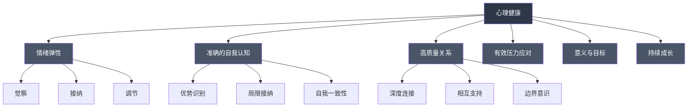

## 五、心理健康维护

心理健康不是一个终点状态，而是一种需要持续维护的动态平衡。就像身体健康需要定期锻炼和均衡饮食一样，心理健康也需要系统性的日常维护。本章将从科学定义出发，构建一套可操作的心理健康维护体系，覆盖生理基础、心理技能、社会连接、意义建构四个维度，并提供预警信号识别和专业求助指南。

### 5.1 心理健康的科学定义

#### 传统定义与误区

世界卫生组织（WHO）将心理健康定义为："一种良好的状态，在这种状态中，个人能够实现自己的能力，能够应对正常的生活压力，能够有成效地工作，并能够为社区做出贡献。"

但这个定义只是起点。许多人对心理健康存在一个根本性误解——认为心理健康就是"没有心理疾病"。这种观点被称为"疾病-健康二元模型"，它忽略了一个关键事实：没有心理疾病不等于心理健康。一个没有被诊断为抑郁症的人，可能长期处于情绪低落、生活无意义、社交退缩的状态，这显然不是真正的心理健康。

#### Keyes 的双连续体模型

心理学家 Corey Keyes 提出了更具解释力的"双连续体模型"（Dual Continua Model），将心理健康分为两个独立维度：

- **心理健康连续体**（Mental Health Continuum）：从"衰竭"（Languishing）到"繁荣"（Flourishing）
- **心理疾病连续体**：从"无疾病"到"有疾病"

这两个维度交叉组合形成四种状态：

| 状态 | 心理健康维度 | 心理疾病维度 | 典型表现 |
|------|------------|------------|---------|
| 繁荣且无疾病 | 高 | 无 | 生活满意度高、充满活力、有目标感 |
| 衰竭但无疾病 | 低 | 无 | 缺乏活力、空虚感、勉强维持功能 |
| 繁荣但有疾病 | 高 | 有 | 虽然被诊断但依然积极参与生活 |
| 衰竭且有疾病 | 低 | 有 | 双重困境，需要最全面的支持 |

这个模型的关键启示是：**心理健康维护的目标不仅仅是消除疾病，而是从"衰竭"走向"繁荣"。**

#### 心理健康的六大标志

根据积极心理学和临床心理学的研究，真正心理健康的人通常具备以下六个标志：

**1. 情绪弹性（Emotional Resilience）**

不是永远保持积极，而是在经历负面情绪后能够恢复。心理健康的人会感到悲伤、愤怒或焦虑，但他们不会被这些情绪长期困住。情绪弹性包含三个要素：情绪觉察（知道自己在感受什么）、情绪接纳（不评判自己的情绪）、情绪调节（有能力从负面情绪中恢复）。

**2. 自我认知的准确性**

能够客观地认识自己的优势和局限，既不自大也不自卑。Carl Rogers 称之为"自我概念"与"理想自我"的一致性——两者差距越大，心理困扰越多。心理健康的人有一个相对准确的自我模型，他们的自我评价与外部反馈基本一致。

**3. 关系的质量而非数量**

能够建立和维持深度的人际关系，能够给予和接受支持。这里强调的是"质量"——拥有3-5个可以深度交流的关系，比拥有100个点赞之交更有心理健康价值。John Cacioppo 的研究表明，孤独感的关键不是社交频率，而是社交满意度。

**4. 压力应对的有效性**

面对压力时能够调动资源、采取行动，而不是陷入无助或回避。这不是说不会感到压力，而是有一套经过验证的应对策略库。关键指标是"压力恢复时间"——从压力事件中恢复到基线状态需要多久。

**5. 意义感和目标感**

生活有方向感，日常行为与个人价值观基本一致。Viktor Frankl 在纳粹集中营中发现，拥有意义感的人比缺乏意义感的人存活率显著更高。意义不必是宏大的使命——照顾家人、精进一门手艺、帮助邻居，都可以是意义的来源。

**6. 持续成长的动力**

不是停滞在舒适区，而是持续学习、挑战自我、拓展边界。Maslow 需求层次的顶端——"自我实现"——本质上就是持续成长的驱动力。

### 5.2 生理基础：心理健康的身体根基

心理健康不是纯粹的"心理"问题。神经科学的研究一再证明，大脑的生理状态直接决定了心理状态。维护心理健康，首先要维护大脑的生理健康。

#### 睡眠：心理健康的基石

睡眠与心理健康的关系是双向的——睡眠问题会导致心理问题，心理问题也会破坏睡眠。但研究显示，**睡眠对心理健康的因果影响更强**。一项大规模纵向研究（Scott et al., 2021, PLOS Medicine）发现，改善睡眠质量可以显著降低抑郁、焦虑和压力水平，效果与某些药物治疗相当。

**睡眠架构与心理健康的关系：**

一个完整的睡眠周期约90分钟，包含以下几个阶段：

| 阶段 | 占比 | 功能 | 与心理健康的关系 |
|------|------|------|----------------|
| N1（浅睡） | 5% | 过渡期 | 影响入睡感受 |
| N2（中度睡眠） | 45% | 记忆巩固、体温调节 | 认知功能基础 |
| N3（深度睡眠/慢波睡眠） | 25% | 身体修复、免疫增强、情绪记忆处理 | **深度睡眠不足与抑郁高度相关** |
| REM（快速眼动） | 25% | 情绪调节、创造性问题解决、记忆整合 | **REM不足导致情绪调节能力下降** |

**关键发现**：深度睡眠阶段，大脑的"胶质淋巴系统"（Glymphatic System）会清除白天积累的代谢废物，包括与阿尔茨海默病相关的β-淀粉样蛋白。慢性睡眠不足相当于让大脑长期浸泡在代谢废物中。

**睡眠优化的具体方案：**

1. **时间管理**：固定就寝和起床时间（误差不超过30分钟），即使周末也不例外。人体的昼夜节律（Circadian Rhythm）需要规律性来维持稳定。褪黑素通常在就寝前2小时开始分泌，如果作息不规律，这个分泌节奏会被打乱。

2. **光照管理**：早晨起床后15分钟内接受自然光照射（至少10,000 lux），傍晚减少蓝光暴露。光线是调节昼夜节律最强的信号。具体做法：起床后走到窗边或户外，直视天空（不要直视太阳）5-10分钟；晚上8点后使用暖光灯或蓝光过滤眼镜。

3. **温度管理**：卧室温度保持在18-20°C。核心体温下降1-2°C是入睡的必要条件。可以在睡前1-2小时洗热水澡——热水澡会让外周血管扩张，之后核心体温会加速下降，模拟自然的入睡温度曲线。

4. **咖啡因管理**：咖啡因的半衰期约5-6小时。如果下午2点喝了一杯咖啡，到晚上10点还有约一半的咖啡因在体内。建议在中午12点前停止摄入咖啡因。注意隐藏的咖啡因来源：茶、巧克力、可乐、某些止痛药。

5. **酒精管理**：酒精虽然能加速入睡，但会严重破坏后半夜的睡眠质量，特别是抑制REM睡眠。研究显示即使少量酒精（1-2杯）也会显著减少REM睡眠。如果要饮酒，至少在睡前4小时完成。

6. **睡前仪式**：建立30-60分钟的固定睡前流程，作为大脑的"关机信号"。例如：洗漱→阅读纸质书→轻度拉伸→写感恩日记→熄灯。关键是每次流程一致，让大脑形成条件反射。

#### 运动：天然的抗抑郁药

2023年发表在《英国运动医学杂志》上的一项元分析（Singh et al.）汇总了97项系统综述和1039项随机对照试验，覆盖了12万名参与者，得出结论：**运动对抑郁、焦虑和心理痛苦的治疗效果，在很多情况下与药物治疗和心理治疗相当，甚至更好。**

**运动改善心理健康的机制：**

- **神经递质调节**：运动增加血清素、多巴胺和去甲肾上腺素的释放——这三种神经递质恰好是大多数抗抑郁药物的作用靶点
- **BDNF 释放**：运动会促进脑源性神经营养因子（BDNF）的分泌，BDNF 能促进神经元生长和新突触形成，特别是在海马体——而慢性压力和抑郁会导致海马体萎缩
- **HPA 轴调节**：规律运动可以降低下丘脑-垂体-肾上腺轴的反应性，减少压力激素皮质醇的基线水平
- **炎症抑制**：慢性低度炎症与抑郁密切相关，运动具有强大的抗炎作用
- **自我效能感**：完成运动目标本身就提升了自我效能感，形成正向循环

**具体运动处方：**

| 运动类型 | 频率 | 时长 | 强度 | 心理健康收益 |
|---------|------|------|------|------------|
| 有氧运动（跑步、游泳、骑车） | 每周3-5次 | 30-45分钟 | 中等（最大心率60-75%） | 抗抑郁、抗焦虑、改善睡眠 |
| 力量训练 | 每周2-3次 | 30-45分钟 | 中等偏高 | 改善自我形象、增强自我效能 |
| 瑜伽/太极 | 每周2-3次 | 45-60分钟 | 低-中 | 降低皮质醇、改善情绪调节 |
| 户外运动 | 每周至少1次 | 60分钟以上 | 任何 | 额外的"绿色运动"加成效果 |

**"绿色运动"效应**：在自然环境中运动的心理健康收益显著高于室内。一项英国研究（Mitchell, 2013）发现，在绿地中运动的人，抑郁和紧张情绪的改善幅度是室内运动的约50%。可能的机制包括：自然环境的注意力恢复效果、自然光对昼夜节律的调节、植物释放的挥发性有机化合物（芬多精）的镇静作用。

**运动习惯的建立策略：**

如果目前完全没有运动习惯，不要试图一步到位。研究表明，从小量开始逐步增加比一开始就追求高强度更容易长期坚持。建议的渐进路径：

1. 第1-2周：每天步行15分钟
2. 第3-4周：每天步行25分钟，加入2次简单力量训练
3. 第5-8周：步行升级为快走或慢跑30分钟，力量训练增加到每周3次
4. 第9周起：根据兴趣选择运动形式，稳定在每周150分钟以上

关键原则：**最好的运动是你能坚持的运动。** 如果你讨厌跑步，就不要强迫自己跑步。游泳、跳舞、打球、攀岩——任何让你心跳加速、持续30分钟以上的活动都有心理健康收益。

#### 营养：肠脑轴与情绪

过去十年，神经科学领域最重要的发现之一是"肠脑轴"（Gut-Brain Axis）的存在。肠道被称为"第二大脑"——它拥有约5亿个神经元，产生人体95%的血清素和50%的多巴胺。肠道微生物群落（肠道菌群）的组成，直接影响大脑的神经化学环境。

**关键营养素与心理健康：**

| 营养素 | 作用机制 | 食物来源 | 与心理健康的关系 |
|-------|---------|---------|----------------|
| Omega-3 脂肪酸 | 降低神经炎症、维持神经元膜流动性 | 深海鱼（三文鱼、沙丁鱼）、亚麻籽、核桃 | 元分析显示对中度抑郁有显著改善效果 |
| 维生素D | 调节血清素合成、免疫调节 | 阳光、蛋黄、强化食品 | 缺乏与抑郁、季节性情感障碍高度相关 |
| B族维生素（B6、B9、B12） | 参与神经递质合成、降低同型半胱氨酸 | 绿叶蔬菜、豆类、瘦肉、鸡蛋 | 缺乏与抑郁和认知功能下降相关 |
| 镁 | 调节GABA受体、降低皮质醇 | 深绿叶蔬菜、坚果、黑巧克力 | 低镁与焦虑、失眠相关 |
| 锌 | 参与BDNF合成、调节谷氨酸 | 牡蛎、红肉、南瓜子 | 低锌与抑郁风险增加相关 |
| 膳食纤维 | 益生元作用，滋养有益菌群 | 全谷物、蔬菜、水果、豆类 | 菌群多样性与情绪稳定性正相关 |
| 发酵食品 | 直接补充益生菌 | 酸奶、泡菜、味噌、纳豆 | 改善肠道菌群组成，间接改善情绪 |

**地中海饮食模式**：多项大型研究（如 SMILES 试验，Jacka et al., 2017）表明，地中海饮食模式对抑郁的改善效果显著。该试验中，采用地中海饮食的中度抑郁患者，12周后有32%达到缓解标准，而对照组仅为8%。

地中海饮食的核心要素：大量蔬菜和水果、全谷物、豆类、坚果、橄榄油为主要脂肪来源、适量鱼类和禽肉、少量红肉和加工食品、适量红酒（可选）。

**需要限制的食物：**

- **超加工食品**：高糖、高脂、高盐的加工食品会促进肠道有害菌群生长，增加全身性炎症。一项2019年的研究发现，超加工食品摄入每增加10%，抑郁风险增加约21%
- **精制糖**：导致血糖剧烈波动，引发情绪波动和疲劳感。高糖饮食还会抑制BDNF的产生
- **过量咖啡因**：适量咖啡因（每天1-3杯）可能有保护作用，但过量会加剧焦虑和失眠。敏感人群可能需要进一步限制

#### 光照：被忽视的心理健康调节器

光照对心理健康的影响远超大多数人的认知。视网膜中的特殊感光细胞（含黑视蛋白的视网膜神经节细胞）直接向大脑的视交叉上核发送信号，这是人体"主时钟"所在的位置。

**光照与心理健康的关键联系：**

- **季节性情感障碍（SAD）**：冬季日照不足导致约5%的人出现季节性抑郁
- **昼夜节律紊乱**：长期室内工作、夜间光照导致的节律紊乱与抑郁、焦虑、注意力缺陷相关
- **光疗的有效性**：10,000 lux 的光疗灯每天30分钟，对SAD的治疗效果与抗抑郁药物相当

**光照管理的日常实践：**

1. **晨间光浴**：起床后尽快接受明亮光照15-30分钟。如果自然光不足（冬季或阴天），使用10,000 lux 的光疗灯
2. **日间光照**：工作期间每隔1-2小时到窗边或户外接受自然光5分钟
3. **傍晚过渡**：日落后逐渐降低光照强度和色温（从白光到暖光）
4. **夜间暗化**：睡前2小时避免蓝光，使用暖色灯或蜡烛。如果必须使用屏幕，开启夜间模式并降低亮度

### 5.3 心理技能：内在的维护工具

生理基础提供的是大脑正常运作的硬件条件，而心理技能是操作这些硬件的软件。以下四项核心心理技能，是心理健康日常维护的内在支柱。

#### 认知灵活性：跳出思维陷阱

认知灵活性（Cognitive Flexibility）是指在不同思维模式之间切换的能力，是执行功能的核心组成部分。高认知灵活性的人能够从多个角度看待问题、快速适应新情况、在遇到障碍时找到替代方案。

**认知灵活性的核心技术：**

**1. 认知重评（Cognitive Reappraisal）**

这是情绪调节中研究最多、效果最稳定的策略。核心原理：不是改变事件本身，而是改变对事件的解读方式，从而改变情绪反应。

操作步骤：
- 识别自动化思维："这件事太糟糕了，我完全无法应对"
- 暂停并质疑：有什么证据支持/反对这个想法？如果朋友遇到同样的事，我会怎么对他说？
- 生成替代解读：有哪些其他可能的理解方式？一年后我会怎么看这件事？
- 选择更有适应性的解读，观察情绪变化

**2. 思维去融合（Cognitive Defusion）**

来自接纳承诺疗法（ACT），核心理念：你不是你的想法。想法只是大脑产生的心理事件，不代表事实。

练习方法：
- 当出现负面想法时，在前面加上"我注意到我在想……"。例如，把"我是个失败者"转化为"我注意到我在想'我是个失败者'"
- 用搞笑的声音（如卡通人物的声音）在心里重复这个想法
- 将想法想象成天空中飘过的云——看到它，不抓取它，让它自然飘走

**3. 心理距离法（Psychological Distancing）**

研究显示，用第三人称思考自己的问题（"他/她现在感到很焦虑，因为他即将做一个重要的演讲"）可以显著降低情绪反应强度。这是因为第三人称视角激活了更多的理性加工系统，减少了情绪加工系统的参与。

#### 情绪颗粒度：精确识别情绪

Lisa Feldman Barrett 的研究发现，能够精确区分和命名不同情绪的人（高情绪颗粒度），情绪调节能力显著更强。这不仅仅是"词汇量"的问题——精确的情绪标签能帮助大脑更有效地预测和调节情绪反应。

**情绪颗粒度的训练方法：**

1. **建立情绪词汇库**：不要只说"不开心"，试着区分是失望、沮丧、懊悔、委屈、孤独、无聊还是空虚。每种情绪都有不同的触发条件、身体感受和应对需求
2. **身体扫描**：不同情绪在身体上产生不同的感觉模式。焦虑可能表现为胸口发紧，愤怒可能是面部发热、肌肉紧张，悲伤可能是胸口沉重。通过身体感受来辅助识别情绪
3. **情绪日记**：每天记录2-3次情绪状态，尽量使用具体的情绪词汇，记录触发事件、身体感受和行为反应

#### 心理韧性的培养

心理韧性（Psychological Resilience）不是一种固定的人格特质——它是可以通过刻意练习提升的能力。美国心理学会（APA）定义心理韧性为"面对逆境、创伤、悲剧、威胁或重大压力源时良好适应的过程"。

**心理韧性的四大支柱：**

**支柱一：连接（Connection）**

与他人建立和维持有意义的关系。在危机中，社会支持是最强的保护因素之一。不是要拥有大量社交关系，而是要确保有2-3个可以在凌晨3点打电话求助的人。

**支柱二：现实性乐观（Realistic Optimism）**

不是盲目乐观（"一切都会好的"），而是在承认现实困难的同时，相信自己有能力应对。Martin Seligman 的研究表明，乐观是一种可以学习的"解释风格"——乐观者倾向于将困难视为暂时的、特定的和外部的，而悲观者倾向于将困难视为永久的、普遍的和内部的。

**支柱三：自我效能（Self-Efficacy）**

相信自己有能力影响事件的结果。Bandura 的研究表明，自我效能感的四个来源：直接成功经验（最强大）、替代学习（观察他人成功）、言语说服（被信任的人鼓励）、生理状态（将身体唤醒解读为积极的兴奋而非消极的焦虑）。

**支柱四：意义建构（Meaning Making）**

在困难中寻找意义和成长的可能性。这不意味着为苦难辩护，而是在经历苦难后，能够从中提取对自我成长有价值的部分。Tedeschi 和 Calhoun 的"创伤后成长"（Post-Traumatic Growth）研究发现，经历重大创伤的人中，有30-70%报告了某种程度的积极变化，包括更强的个人力量、更新的人际关系、更多的生活可能性、更强烈的精神层面体验、对生活更深的感恩。

#### 正念：注意力的训练

正念（Mindfulness）不是冥想的同义词——它是一种注意力状态：有意识地、不评判地关注当下体验。Jon Kabat-Zinn 的正念减压疗法（MBSR）已有超过30年的临床证据支持。

**正念改善心理健康的机制：**

- 降低"默认模式网络"（DMN）的过度活跃——DMN的过度活跃与反刍思维（rumination）和抑郁密切相关
- 增强前额叶皮层对杏仁核的调节能力——简单说，就是增强理性对情绪的控制力
- 减少"时间旅行"——过多沉浸于对过去的后悔和对未来的担忧

**适合初学者的正念练习：**

1. **呼吸锚定**（3分钟）：找一个安静的地方坐下，闭上眼睛，将注意力放在呼吸上。注意空气进入和离开鼻孔的感觉、胸腔和腹部的起伏。当注意力漂移时（这是正常的），温和地将它带回呼吸。每次漂移并回来，就是一次"注意力举重"——注意力的"肌肉"正是通过这种反复拉回来的动作得到锻炼的

2. **身体扫描**（10-15分钟）：从脚趾开始，逐步将注意力移动到身体的每个部位，观察那里的感觉——温度、压力、紧张、疼痛或麻木。不试图改变任何感觉，只是观察。这个练习特别有助于提高身体觉察和情绪颗粒度

3. **日常正念**：将正念融入日常活动——刷牙时注意牙刷在牙齿上的感觉，吃饭时注意食物的味道和质地，走路时注意脚掌与地面的接触。目标是将"自动驾驶"模式切换到"手动驾驶"模式

### 5.4 社会连接：被低估的心理健康支柱

人类是社会性动物。我们的大脑经过数百万年的进化，已经深度适配于群体生活。社会连接对心理健康的影响，可能比大多数人想象的要深远得多。

#### 孤独的流行病

2023年，美国卫生总监 Vivek Murthy 发布了一份关于"孤独与隔离"的公共健康咨询，将其称为"孤独的流行病"。数据触目惊心：

- 孤独感对健康的危害等同于每天吸15支烟（Holt-Lunstad et al., 2010）
- 社会隔离使全因死亡率增加26%（Holt-Lunstad et al., 2015）
- 约22%的美国成年人报告"经常或总是感到孤独"
- 年轻人（18-25岁）的孤独率反而最高

John Cacioppo 的研究表明，孤独不是一种选择，而是一种进化信号——就像饥饿提醒你需要食物，孤独提醒你需要社会连接。但慢性孤独会导致一系列病理变化：皮质醇升高、炎症增加、免疫功能下降、睡眠碎片化、认知功能加速衰退。

#### 社会连接的质量维度

社会连接的质量比数量更重要。以下几个维度决定了社交关系的心理健康价值：

**1. 情感深度**

是否能够进行真实的、脆弱的自我暴露。Brené Brown 的研究表明，脆弱性（vulnerability）是建立深度连接的核心——如果你永远只展示"完美的自己"，你得到的连接也是肤浅的。

**2. 互惠性**

关系是否是双向的——既有给予也有接受。长期单向付出或单向索取的关系都会产生心理压力。

**3. 安全感**

在这段关系中，你是否可以做真实的自己，而不用担心被评判、拒绝或背叛。安全型依恋的关系是心理健康的重要保护因素。

**4. 归属感**

是否感觉自己是群体的一部分。归属感不必来自所有社交圈——一个深度归属的社区（如宗教团体、兴趣小组、运动团队）可以满足这一需求。

**维护和深化关系的策略：**

1. **定期深度对话**：每周至少安排一次与亲密关系的深度对话（不包括日常事务性交流）。使用"扩展性问题"代替"封闭性问题"——"你最近在想什么？"比"今天怎么样？"更能引发深度交流

2. **主动表达感激**：研究表明，表达感激不仅改善接收者的心情，也能显著提升表达者的幸福感。具体做法：每周给一个你感激的人写一条真诚的信息，具体说明你感激什么以及为什么

3. **脆弱性练习**：在安全的关系中，尝试分享一个你通常会隐藏的感受或经历。研究表明，适度的自我暴露会激发对方的自我暴露，形成深度连接的正向循环

4. **"关系投资"思维**：把关系看作需要持续投资的资产——时间、注意力、情感支持都是投资。最重要的"投资"往往不是大事件，而是日常的小互动：一条关心的短信、一个拥抱、一次专注的倾听

### 5.5 意义与目标：心理健康的最高层次

Maslow 需求层次理论和 Frankl 的意义疗法都指向同一个核心：当基本需求满足后，意义感成为心理健康最重要的驱动力。

#### 价值观澄清

价值观不是你"应该"相信的东西，而是你内心深处真正重视的东西。价值观澄清（Values Clarification）是心理健康维护的基础性工作——如果你不知道什么对自己真正重要，你就无法做出让自己满意的决策。

**价值观澄清练习：**

1. **墓志铭练习**：想象你在自己的葬礼上，你最亲近的人在致悼词。你希望他们说什么？你希望被记住的是什么？写下3-5个你希望出现在悼词中的品质

2. **峰值体验回顾**：回忆你生命中3-5个最满足、最有意义的时刻。这些时刻有什么共同点？它们涉及哪些主题？这些主题往往指向你的核心价值观

3. **价值观排序**：从以下列表中选择对你最重要的5个，并按优先级排序：家庭、健康、事业成就、财务安全、创造力、冒险、自由、公平正义、精神成长、社区贡献、知识学习、美学体验、亲密关系、独立自主、领导力

4. **一致性检查**：审视你目前的生活——你的时间和精力分配是否与你的核心价值观一致？如果不一致，差距在哪里？

#### 目标设定的科学方法

目标不仅是实现愿望的工具，更是心理健康的保护因素。Locke 和 Latham 的目标设定理论表明，明确的、有挑战性的目标比"尽力而为"更能激发动力和成就感。

**目标设定的SMART+框架：**

- **S（Specific）**：具体明确。不是"我要变得更健康"，而是"我要每周运动3次，每次30分钟"
- **M（Measurable）**：可量化。有明确的指标来衡量进展
- **A（Achievable）**：可实现。有一定挑战性但不是不可能
- **R（Relevant）**：与你的核心价值观一致。这是传统SMART之外的扩展——一个与你价值观不一致的目标，即使实现了也不会带来满足感
- **T（Time-bound）**：有时间限制。有明确的截止日期
- **+Process-focused**：关注过程而非结果。"每天写作30分钟"比"出版一本书"更可控、更不容易导致挫败感

#### 日常意义感的建构

意义感不必来自宏大的使命。心理学家将意义感分为三个维度（Steger, 2012）：

1. **认知意义**（Coherence）：理解自己的生活，感觉生活有逻辑、可理解
2. **目的意义**（Purpose）：有值得追求的目标和方向
3. **重要性意义**（Significance）：感觉自己存在有价值、有影响

**日常建构意义感的实践：**

- **感恩练习**：每天睡前写下3件值得感恩的事，并说明为什么。这不是"正能量洗脑"——大量研究证实，持续的感恩练习可以显著提升生活满意度和积极情绪
- **利他行为**：每周做一件不求回报的帮助他人的事。研究表明，利他行为激活大脑的奖励回路，产生"温暖的光辉效应"（warm glow effect）
- **心流体验**：寻找或创造能让你进入心流状态的活动。心流的条件：任务有明确目标、难度与技能匹配、有即时反馈。常见的心流活动：演奏乐器、编程、运动、绘画、写作
- **叙事重构**：将自己的人生故事重新叙述，不是改变事实，而是改变对事实的解读角度。将挫折重新定义为转折点，将失败重新定义为学习经历

### 5.6 心理健康的系统性维护方案

以上各个维度的策略不是独立的——它们需要被整合为一个可持续的日常系统。以下是基于研究证据的维护方案框架。

#### 日常维护清单

| 时段 | 活动 | 时长 | 作用 |
|------|------|------|------|
| 起床后 | 自然光照射 | 10-15分钟 | 调节昼夜节律、提升警觉性 |
| 上午 | 专注工作/学习 | 按任务需要 | 心流体验、成就感 |
| 午间 | 户外步行 + 自然接触 | 15-20分钟 | 降压、恢复注意力 |
| 下午 | 社交互动（真实或线上） | 15-30分钟 | 维护社会连接 |
| 傍晚 | 运动 | 30-45分钟 | 神经递质调节、压力释放 |
| 晚间 | 意义活动（阅读、创作、家庭） | 1-2小时 | 意义感和归属感 |
| 睡前 | 正念/呼吸练习 + 感恩日记 | 10-15分钟 | 情绪调节、入睡准备 |

#### 周期性检查

**每周检查（5分钟）：**

- 本周的情绪基线是什么？（1-10分）
- 有哪些情绪突出事件？
- 社交关系的质量如何？
- 运动和睡眠的完成率如何？
- 是否有价值观与行为的偏离？

**每月检查（30分钟）：**

- 回顾本月的情绪日记，识别模式
- 评估目标进展，调整计划
- 审视人际关系——是否有需要修复或深化的关系
- 检查生理基础——睡眠、运动、饮食是否达标

**每季度检查（1小时）：**

- 价值观与生活方向是否一致？
- 是否有未处理的情绪或心理问题需要关注？
- 生活中是否有需要做出的重大改变？

#### 心理健康的自我评估工具

以下是一些经过验证的、可以自评的心理健康筛查工具：

| 工具 | 评估维度 | 来源 | 适用场景 |
|------|---------|------|---------|
| PHQ-9 | 抑郁症状 | Kroenke et al. | 每月自评或情绪低落时使用 |
| GAD-7 | 焦虑症状 | Spitzer et al. | 每月自评或焦虑加重时使用 |
| PSS-10 | 感知压力 | Cohen et al. | 评估压力水平变化 |
| WEMWBS | 心理幸福感 | Tennant et al. | 评估积极心理状态 |
| UCLA 孤独量表 | 孤独感 | Russell | 评估社交质量 |
| CD-RISC-25 | 心理韧性 | Connor & Davidson | 评估抗压能力 |

这些量表可以在网上免费获取。建议每月使用PHQ-9和GAD-7进行自评，得分持续偏高时考虑寻求专业帮助。

### 5.7 心理健康预警信号与危机应对

#### 需要关注的预警信号

以下信号如果持续两周以上，应引起重视：

**情绪层面：**
- 持续的情绪低落、空虚感或无望感
- 无法解释的恐惧或焦虑，影响日常功能
- 情绪波动剧烈，小事就能引发强烈反应
- 对一切事物失去兴趣或快感（快感缺失，anhedonia）

**认知层面：**
- 持续的注意力不集中、记忆力下降
- 反复出现的消极思维、自我否定
- 思维变得模糊或混乱
- 对未来没有希望，觉得"事情不会好转"

**行为层面：**
- 睡眠模式显著改变（失眠或嗜睡）
- 食欲显著改变（暴食或厌食）
- 社交退缩——越来越不想见人
- 工作或学习效率持续下降
- 频繁迟到、缺勤或无法完成基本任务
- 过度依赖酒精、药物或其他方式来逃避

**身体层面：**
- 没有明确医学原因的身体疼痛或不适
- 持续的疲劳感，休息后也无法恢复
- 频繁的头痛、胃痛或其他躯体症状

#### 危机应对

**如果你或你认识的人出现以下情况，需要立即采取行动：**
- 谈论想要结束生命或"活着没有意义"
- 寻找结束生命的方式
- 将珍贵物品送人或整理后事
- 突然从极度低落变得平静（可能意味着已做出决定）

**即时行动步骤：**

1. **不要独处**：立即联系一个你信任的人，或者拨打24小时心理援助热线
2. **移除危险物品**：将可能用于自伤的物品放在不容易拿到的地方
3. **专业联系**：
   - 全国心理援助热线：400-161-9995
   - 北京心理危机研究与干预中心：010-82951332
   - 生命热线：400-821-1215
4. **急诊就医**：如果风险迫在眉睫，拨打120或前往最近医院的急诊科

### 5.8 何时及如何寻求专业帮助

#### 治疗方式概览

| 治疗方式 | 适用情况 | 原理 | 特点 |
|---------|---------|------|------|
| 认知行为疗法（CBT） | 抑郁、焦虑、恐惧症、OCD | 改变不适应的思维和行为模式 | 短程、结构化、证据最充分 |
| 接纳承诺疗法（ACT） | 焦虑、慢性疼痛、价值观迷失 | 接纳不可改变的，承诺于价值行动 | 强调心理灵活性 |
| 辩证行为疗法（DBT） | 情绪调节困难、边缘人格 | 平衡接纳与改变 | 效果显著，需要专业训练 |
| 精神动力学治疗 | 人格问题、关系模式 | 探索潜意识冲突和早期经历 | 长程，适合深层自我探索 |
| 人际关系疗法（IPT） | 抑郁、人际冲突 | 改善人际关系质量 | 短程，聚焦关系议题 |
| 正念认知疗法（MBCT） | 防止抑郁复发 | 正念与认知疗法结合 | 预防复发效果显著 |
| 药物治疗 | 中重度抑郁、焦虑、双相等 | 调节神经递质 | 需精神科医生处方 |

**重要说明**：药物治疗和心理治疗不矛盾。对于中度到重度的心理问题，联合使用通常效果最佳。药物可以快速缓解症状，心理治疗则帮助建立长期的应对能力。

#### 如何找到合适的心理咨询师

1. **确认资质**：在中国，合格的心理咨询师应具备国家心理咨询师资格（二级或三级）或临床/咨询心理学硕士学位。精神科医生具备处方权，适合需要药物治疗的情况

2. **匹配取向**：不同咨询师使用不同的治疗取向。根据你的问题类型选择：需要解决具体问题→CBT；需要自我探索→精神动力学；需要处理情绪→ACT/DBT；需要处理关系→IPT

3. **关系匹配**：研究表明，治疗关系的质量是疗效最重要的预测因素，甚至超过治疗取向。如果在前3-4次会谈后感觉不舒服或不信任，考虑换人

4. **费用考量**：中国心理咨询价格范围通常在300-1500元/次（50分钟）。一些平台提供较低价的实习咨询师服务。大学心理咨询中心通常对学生免费或低价

### 5.9 常见误区与纠正

**误区一："心理健康的人不会感到负面情绪"**

纠正：心理健康的人当然会感到负面情绪。区别在于他们能够接纳这些情绪、理解这些情绪传达的信息，并在合理的时间内从中恢复。试图永远保持积极，本身就是不健康的——这被称为"有毒的积极性"（Toxic Positivity）。

**误区二："心理咨询只有'有病'的人才需要"**

纠正：心理咨询不仅针对心理疾病，也适用于个人成长、关系改善、职业发展等广泛的议题。就像你不需要生病才能去看医生做体检一样，你也不需要"有病"才能去看心理咨询师。事实上，及早寻求帮助可以防止小问题发展成大问题。

**误区三："只要意志力够强，就能克服心理问题"**

纠正：心理问题有生物学基础——神经递质失衡、大脑结构变化、基因易感性——这些不是"意志力"能解决的。对抑郁症患者说"振作起来"就像对近视的人说"看清楚点"一样无用。承认需要帮助是勇气，不是软弱。

**误区四："吃药会上瘾/会改变我的人格"**

纠正：抗抑郁药（如SSRIs）不会成瘾——它们不像安眠药或抗焦虑药那样产生依赖。在医生指导下正确使用和逐步减量，可以安全停药。药物的目的不是改变你的人格，而是将你从症状中解放出来，让你能够做回真正的自己。

**误区五："心理健康问题说明我'不够强'"**

纠正：心理健康问题不分强弱。世界卫生组织数据显示，全球约有9.7亿人受到心理健康问题的影响——每8个人中就有1个。心理问题的风险因素包括基因、童年经历、社会环境、生活事件等，大多数因素在个人控制之外。

**误区六："冥想/瑜伽/运动能'治愈'所有心理问题"**

纠正：这些活动对心理健康有明确的益处，但它们是维护工具，不是治疗工具。对于中度到重度的心理问题，它们不能替代专业的心理治疗和/或药物治疗。把冥想当作万能药，可能会延误真正需要的专业治疗。

### 5.10 进阶：心理健康维护的前沿方向

#### 心理表观遗传学

表观遗传学研究揭示了一个令人兴奋的发现：心理体验可以改变基因的表达方式——虽然不改变DNA序列本身，但可以"打开"或"关闭"某些基因。例如：

- 慢性压力可以激活与炎症相关的基因，关闭与免疫调节相关的基因
- 冥想练习可以改变与端粒酶（telomerase）相关的基因表达，延缓细胞衰老
- 早期亲子互动的质量会影响压力反应基因的表观遗传标记

这意味着心理健康的维护不仅仅是"感觉好"，它在分子层面改变着你的生物学。

#### 数字化心理健康

科技正在改变心理健康维护的方式：

- **生态瞬时评估（EMA）**：通过手机App实时追踪情绪、行为和环境数据，识别心理健康变化的早期信号
- **AI辅助心理治疗**：聊天机器人和AI工具可以提供即时的心理支持，作为专业治疗的补充
- **生物反馈设备**：可穿戴设备可以实时监测心率变异性（HRV）、皮肤电反应等生理指标，帮助学习自我调节
- **VR暴露治疗**：虚拟现实技术为恐惧症、PTSD等提供了安全可控的暴露治疗环境

#### 社会处方

"社会处方"（Social Prescribing）是英国率先推广的一种创新实践：医生不仅开药物处方，还可以"处方"社区活动——如园艺治疗、合唱团、志愿者活动、徒步小组。早期数据表明，社会处方可以减少全科门诊就诊率30-50%，改善心理健康和生活满意度。

这个概念的核心洞察是：**许多心理健康问题的根源不是个人的"故障"，而是社会连接、意义感和归属感的缺失——而这些"药方"不在药房里，在社区中。**

### 5.11 总结

心理健康维护是一个多维度、持续性的过程。它不是一个你可以"完成"然后忘记的任务，而是一种生活方式的选择。

核心框架回顾：

- **生理基础**（硬件）：睡眠、运动、营养、光照——大脑正常运作的必要条件
- **心理技能**（软件）：认知灵活性、情绪颗粒度、心理韧性、正念——内在的调节工具
- **社会连接**（网络）：深度关系、归属感、互惠支持——人类最深层的需求
- **意义与目标**（方向）：价值观澄清、目标设定、日常意义建构——生活前进的动力
- **系统性维护**（运维）：日常清单、周期检查、自我评估——确保一切持续运转

最后，记住一句话：**寻求帮助是力量的表现，不是软弱的标志。** 当自助策略不足以应对时，及时寻求专业支持是对自己最负责任的选择。

***

> **本节要点**：心理健康维护是一个涵盖生理、心理、社会和意义四个维度的系统工程。Keyes 的双连续体模型告诉我们，目标不仅是消除疾病，更是走向繁荣。睡眠、运动、营养和光照构成了心理健康的生理基础；认知灵活性、情绪颗粒度、心理韧性和正念是核心心理技能；深度社会连接是最被低估的保护因素；意义感是最高层次的心理健康驱动力。建立日常维护系统，定期进行自我评估，在需要时勇敢寻求专业帮助——这就是心理健康维护的完整路径。
