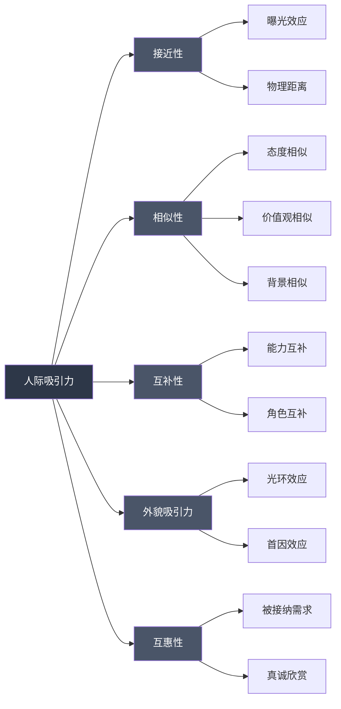
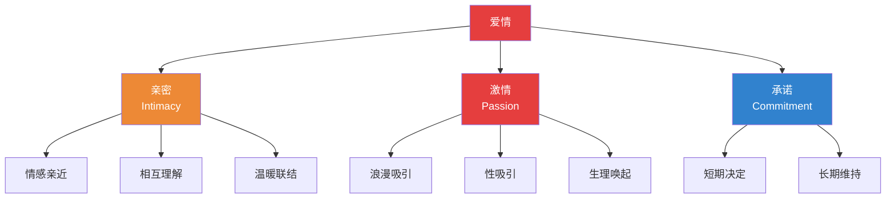

## 六、人际关系心理学应用

人际关系是人类幸福感的最强预测因子。哈佛大学持续85年的"成人发展研究"（Grant Study）得出的核心结论只有一句话：**良好的人际关系让我们更健康、更快乐**。孤独对健康的危害等同于每天吸15支烟（Holt-Lunstad, 2015），而高质量的社会联结能降低50%的早亡风险。

本章将人际关系心理学从理论到实操完整展开：先理解关系运作的心理机制，再掌握沟通、边界、冲突处理的核心技术，最后覆盖亲密关系、职场关系、数字时代关系等场景，帮助你在所有人际场景中建立健康、深度、持久的联结。

### 6.1 人际关系的心理学基础理论

#### 6.1.1 社会交换理论

Thibaut 和 Kelley（1959）提出的社会交换理论认为，人际关系本质上是一种**成本-收益分析**过程。个体在关系中持续评估：

- **回报**：情感支持、陪伴、信息、资源、性、社会地位
- **成本**：时间、精力、情绪消耗、自由度丧失、冲突压力
- **比较水平（CL）**：你认为自己"应该"从关系中得到多少——由过往经历和参照群体决定
- **替代比较水平（CLalt）**：离开这段关系后，你能从其他来源获得多少

当回报 > 成本，且当前关系 > CLalt 时，人倾向于维持关系。这不意味着人际关系是冷冰冰的交易——恰恰相反，理解这个框架能帮助你**有意识地投资关系**，而不是凭感觉消耗关系。

**实操应用**：
- 定期自问：我在这段关系中的投入和收获是否大致平衡？
- 关注对方的"隐性成本"——你以为举手之劳的事，对方可能付出了巨大代价
- 当关系失衡时，先调整自己的投入，而非指责对方

#### 6.1.2 依恋理论：童年如何塑造你的关系模式

Bowlby 的依恋理论是理解人际关系最强大的框架之一。童年与主要照料者的互动模式，会内化为"内部工作模型"，深刻影响你成年后的每一段关系。

| 依恋类型 | 核心信念 | 关系中的表现 | 典型内心独白 |
|----------|---------|------------|------------|
| **安全型**（约56%） | "我是值得被爱的，他人是可信赖的" | 能自如地亲密和独立，信任伴侣，冲突后能修复 | "我们可以一起解决这个问题" |
| **焦虑型**（约20%） | "我不够好，他人会离开我" | 渴望亲密但总担心被抛弃，需要频繁确认，容易"作" | "你为什么不回我消息？你是不是不爱我了？" |
| **回避型**（约25%） | "依赖他人是危险的，我只能靠自己" | 重视独立，对亲密感到不适，倾向于情感关闭 | "我需要自己的空间，你太粘人了" |
| **混乱型**（约5%） | "我需要你但我怕你" | 对亲密既渴望又恐惧，关系模式混乱不可预测 | "别走……你靠近我就害怕" |

**关键认知**：依恋类型不是命运。通过自我觉察、心理咨询和安全的关系体验，不安全依恋可以逐步向"习得性安全"转变（Earned Security）。研究表明，约30%的焦虑/回避型个体在经历一段安全的关系后，依恋模式会发生显著改变。

**自测方法**：回忆你在关系中最大的恐惧是什么——害怕被抛弃指向焦虑型，害怕失去自我指向回避型，两者交替出现可能是混乱型。

#### 6.1.3 人际吸引力的五重机制

为什么你会被某些人吸引？心理学研究揭示了五个核心因素：

**接近性（Proximity）**：物理距离越近，产生好感的概率越高。这不是简单的"近水楼台"，而是**曝光效应**（Zajonc, 1968）——重复接触会增加熟悉感和好感。大学室友、公司邻座、健身房常客之间的友谊概率远高于随机人群。实操意义：想发展某段关系，先增加物理接触频率。

**相似性（Similarity）**：态度、价值观、背景的相似是长期吸引的最强预测因子。Byrne（1971）的实验发现，态度相似度每增加1%，吸引力就上升约1%。但注意：表面兴趣的相似（都喜欢看电影）不如深层价值观的相似（都认为家庭比事业重要）。

**互补性（Complementary）**：在特定维度上，差异也能产生吸引力——尤其是能力互补和角色互补。一个擅长规划的人和一个擅长执行的人往往配合默契。但互补性的作用远弱于相似性，且主要在"差异不影响核心价值观"时才有效。

**外貌吸引力**：Walster（1966）的"计算机舞会"实验发现，外貌是初次见面时吸引力的最强预测因子。但这里有一个关键区分——**光环效应**让我们默认好看的人也更聪明、更善良、更有趣（虽然事实并非如此）。随着关系深入，外貌的重要性会逐步让位于人格特质。

**互惠性（Reciprocity）**：知道某人喜欢自己，是增加对其好感的最快方式。这源于基本的心理需求——被接纳和被重视。实操应用：真诚地表达欣赏和喜欢，是建立关系最高效的策略。

#### 6.1.4 自我表露的互惠原则

社会心理学家 Altman 和 Taylor（1973）提出的**社会渗透理论**指出，关系的发展本质上是**自我表露的逐层深入**——从表层信息（姓名、职业）到中层观点（对某事的看法）再到深层核心（恐惧、创伤、秘密）。

核心规律：
- **互惠性**：你表露多少，对方倾向于回应多少
- **渐进性**：跳层表露会让人不适（第一次见面就倾诉童年创伤）
- **对称性**：长期的表露不对称会导致关系失衡

**实操模板——"洋葱式"自我表露**：
1. 第一层（社交层）：兴趣爱好、日常经历、公开信息
2. 第二层（观点层）：对事物的看法、价值判断、偏好
3. 第三层（情感层）：个人感受、脆弱时刻、担忧和期待
4. 第四层（核心层）：童年经历、深层恐惧、核心信念、创伤记忆

每一层的开放都需要前一层建立的信任基础。在新关系中，每2-3次互动推进一层是安全的节奏。

### 6.2 深度沟通技术

#### 6.2.1 非暴力沟通（NVC）

Marshall Rosenberg 开发的非暴力沟通（Nonviolent Communication）是目前最系统的关系沟通框架。其核心理念是：**所有冲突的背后都是未被满足的需要**。

**四步模型**：

| 步骤 | 含义 | 关键词 | 常见错误 |
|------|------|--------|---------|
| 观察 | 客观描述事实，不加评判 | "当我看到/听到……" | 把评判伪装成观察："你总是……" |
| 感受 | 表达真实情感体验 | "我感到……" | 把想法当感受："我觉得你不尊重我"（这是想法） |
| 需要 | 识别感受背后的需要 | "因为我需要……" | 把策略当需要："我需要你每天打电筒"（这是策略） |
| 请求 | 提出具体、可行、可拒绝的请求 | "你是否愿意……" | 把命令当请求：不接受"不"的回答 |

**完整示例**：
- ❌ 错误示范："你天天就知道打游戏，这个家你管过吗？你根本不在乎我！"
- ✅ NVC示范："这周你每天晚上都打了3小时以上的游戏（观察），我感到孤独和有些委屈（感受），因为我需要陪伴和共同参与家庭生活（需要）。你愿意这周抽两个晚上，我们一起做饭聊天吗？（请求）"

**感受 vs 想想的区分**（这是NVC最容易混淆的点）：
- ❌ "我觉得被忽视了"→ 这是想法（包含"被……"的句式通常是想法）
- ✅ "我感到孤独"→ 这是感受
- ❌ "我觉得你不爱我了"→ 这是想法/判断
- ✅ "我感到害怕和不安全"→ 这是感受

**需要清单**（Rosenberg 归纳的人类基本需要）：
- 存活需要：食物、住所、安全、健康
- 连接需要：爱、归属、亲密、理解、信任、陪伴
- 自主需要：自由、选择、独立、空间
- 意义需要：目标、贡献、创造、成长
- 乐趣需要：玩耍、幽默、放松、美
- 尊重需要：平等、认可、尊严

#### 6.2.2 积极倾听的五层技术

大多数人"听"是为了回应，而不是为了理解。积极倾听是一种需要刻意练习的技术。

**Level 1 — 身体在场**：
- 放下手机，屏幕朝下
- 身体面向对方，保持开放姿态
- 适度眼神接触（60-70%的时间）
- 点头和简短回应（"嗯""我在听"）

**Level 2 — 内容复述**：
- "我听到你说的是……"（用自己的话复述对方的核心观点）
- 作用：确认理解正确，让对方感到被认真对待

**Level 3 — 情感映射**：
- "听起来你感到很……"（命名对方的情绪）
- 作用：让对方感到被理解，不只是被听到
- 关键：猜测不对也没关系，对方会纠正你，纠正本身就是一种深入

**Level 4 — 需要探测**：
- "你是不是希望……"（猜测对方表面诉求背后的需要）
- 作用：从"问题层"进入"需要层"，找到真正需要解决的东西

**Level 5 — 沉默陪伴**：
- 在对方表达强烈情感时，不急于给建议或安慰
- 只是安静地陪伴，传递"我在这里，你不是一个人"
- 这是最高级的倾听——大多数人做不到，因为沉默让人焦虑

**常见倾听陷阱**：

| 陷阱 | 表现 | 为什么有害 | 正确做法 |
|------|------|-----------|---------|
| 急于给建议 | "你应该……" | 对方需要被理解，不是被指导 | 先确认："你想听建议还是只想倾诉？" |
| 转移话题 | "我也有过……" | 让对方觉得你在抢焦点 | 除非对方问，否则留在对方的故事里 |
| 否定感受 | "别想太多""没什么大不了" | 否定了对方的体验 | 承认感受："这确实很难受" |
| 急于解决 | "那你就……" | 跳过了情感处理阶段 | 先处理情绪，再处理问题 |

#### 6.2.3 建设性冲突解决

冲突不是关系的敌人——**破坏性地处理冲突**才是。John Gottman 的研究发现，69%的夫妻冲突是"永久性问题"（源于性格和价值观差异），永远不会真正解决。健康的关系不是没有冲突，而是学会与冲突共处。

**冲突升级的四骑士**（Gottman）——必须避免的四种模式：
1. **批评**（Criticism）：攻击对方的人格而非行为。"你总是迟到"→ 人格攻击；"这次迟到了让我等了很久"→ 行为反馈
2. **蔑视**（Contempt）：翻白眼、嘲讽、冷暴力。这是关系破裂的最强预测因子
3. **防御**（Defensiveness）：拒绝承认任何责任，反过来指责对方
4. **石墙**（Stonewalling）：情感关闭、冷处理、拒绝沟通

**建设性冲突解决七步法**：

1. **暂停与自我调节**：情绪激动时（心率>100次/分钟），认知能力下降60%。Gottman建议至少暂停20分钟——这是神经系统恢复平静所需的最短时间。暂停不是逃避，而是说："我需要20分钟冷静一下，然后我们再继续谈。"
2. **软启动**（Soft Startup）：用"我"开头，描述感受和需要，而非用"你"开头指责。"我感到……因为……我需要……"的句式。
3. **验证对方**：即使不同意，也先让对方知道你理解了他们的立场。"我能理解你为什么会这么想/这么感受。"
4. **找到共同点**：在争论的表面之下，找到双方都认同的深层价值。"我们都希望这个家更好，这是我们的共同点。"
5. **共同定义问题**：把"你 vs 我"的框架变成"我们 vs 问题"的框架。
6. **头脑风暴解决方案**：不评判，先列出来，再筛选。
7. **选择方案并约定复查**：选定一个方案，约定1-2周后回顾效果。

### 6.3 关系边界的建立与维护

#### 6.3.1 什么是健康的关系边界

边界不是墙——墙是把人隔开，边界是**让你决定什么可以进入你的生活空间**。健康边界的核心是区分三个区域：

- **我的责任区**：我的情绪、我的选择、我的行为后果
- **你的责任区**：你的情绪、你的选择、你的行为后果
- **共同责任区**：共同的决定、共享的资源、关系的质量

边界模糊的典型信号：
- 总是为他人的情绪负责（"他不开心都是我的错"）
- 难以拒绝请求，即使自己已经超负荷
- 允许他人随意评价你的人生选择
- 在关系中失去自我，不知道自己想要什么
- 总是牺牲自己来避免冲突

#### 6.3.2 五种核心边界类型

| 边界类型 | 保护对象 | 健康边界的例子 | 被侵犯的信号 |
|----------|---------|--------------|------------|
| **物理边界** | 身体、个人空间 | "我不喜欢被不熟的人拥抱" | 不舒服的身体接触被强迫接受 |
| **情感边界** | 内心感受、情绪空间 | "你的情绪是你的，我不需要替你承担" | 总被他人的情绪裹挟 |
| **时间边界** | 时间和精力分配 | "周末晚上是我的个人时间" | 时间总被他人支配 |
| **物质边界** | 金钱和物品 | "借东西需要提前说" | 物品被随意使用或索取 |
| **信息边界** | 隐私和个人信息 | "这件事我不想讨论" | 秘密被泄露，隐私被窥探 |

#### 6.3.3 设立边界的实操模板

设立边界的三个层次——从温和到坚定：

**层次一：预防性边界**（关系良好时建立）
- "我想提前说一下，我每周三晚上是自己的时间，不安排社交活动。"
- "关于工资的话题，我个人习惯不讨论，希望你理解。"

**层次二：纠正性边界**（边界已被侵犯时）
- "我知道你没有恶意，但当你拿我的体重开玩笑时，我会感到不舒服。以后请不要再这样。"
- "我理解你想帮忙，但未经我同意就帮我做决定让我感到不被尊重。下次请先和我商量。"

**层次三：保护性边界**（多次纠正无效时）
- "我已经表达过我的边界，但你继续这样做。如果你再这样，我会选择结束对话/离开。"
- 关键：**说到做到**。不执行的边界比没有边界更糟糕，因为它教会对方"你的底线可以突破"。

**说"不"的万能公式**：
> 感谢/认可 + 明确拒绝 + （可选）替代方案
> "谢谢你想到我，但这次我无法参加。下次有类似的活动可以再叫我。"

### 6.4 亲密关系心理学

#### 6.4.1 爱情的三角理论与七种爱

Sternberg（1986）的爱情三角理论将爱情分解为三个核心成分：

三个成分的组合产生了七种爱的类型：

| 爱的类型 | 亲密 | 激情 | 承诺 | 典型场景 |
|----------|------|------|------|---------|
| 喜欢 | ✓ | ✗ | ✗ | 深厚的友谊 |
| 迷恋 | ✗ | ✓ | ✗ | 一见钟情、暗恋 |
| 空洞的爱 | ✗ | ✗ | ✓ | 没有感情基础的婚姻 |
| 浪漫之爱 | ✓ | ✓ | ✗ | 热恋期的恋人 |
| 伴侣之爱 | ✓ | ✗ | ✓ | 长期婚姻中的老夫老妻 |
| 愚昧之爱 | ✗ | ✓ | ✓ | 闪婚 |
| 完整之爱 | ✓ | ✓ | ✓ | 理想的爱情（需要持续维护） |

**关键洞察**：完整的爱不是"找到对的人"就能自动拥有的状态，而是需要持续投入的动态过程。激情会自然衰减（多巴胺系统对同一刺激的敏感度会下降），但亲密和承诺可以通过有意识的行为来培养和维持。

#### 6.4.2 关系维护的科学策略

Gottman 实验室通过数十年的追踪研究，发现了维持高质量关系的关键行为：

**"情感银行账户"模型**：每一次积极互动都是存款，每一次消极互动都是取款。Gottman发现，稳定幸福的夫妻的积极-消极互动比为 **5:1**——也就是说，你需要5次积极互动来抵消1次消极互动的伤害。

**日常存款行为清单**：
- 每天至少一次真诚的赞美或感谢
- 每天下班重聚时进行至少6分钟的"减压对话"（倾听对方的一天）
- 每周一次"状态检查"对话（关系满意度、需要、期待）
- 每月至少一次约会（不一定要花钱，但要有质量时间）
- 记住对方在意的小事（喜欢的咖啡口味、重要日期）
- 在他人面前维护伴侣的形象
- 对伴侣的"出价"（bid for connection）做出回应

**"出价"概念详解**（Gottman的核心发现之一）：
伴侣会不断发出微小的情感联结请求——可能是分享一个有趣的事、问你一个问题、指着窗外说"看那只鸟"。你对这些出价的回应方式决定了关系质量：
- **转向**（Turning Toward）：积极回应。"哇，真好看！"→ 关系正向积累
- **转离**（Turning Away）：忽略。继续看手机不回应。→ 关系缓慢损耗
- **转反**（Turning Against）：消极回应。"别烦我，我在忙。"→ 关系快速损伤

Gottman 追踪发现，6年后分手的夫妻在日常互动中只有33%的出价得到了回应，而仍然在一起的夫妻这一比例是86%。

#### 6.4.3 亲密关系中的常见陷阱

**陷阱一：期望对方"读心"**
- 表现：觉得"如果TA真的爱我，就应该知道我想要什么"
- 真相：没有人是读心者，暗示和期待不等于沟通
- 纠正：把"你应该知道"换成"我需要告诉你"

**陷阱二：用指责替代请求**
- 表现："你从来不帮忙做家务！"
- 问题：绝对化词语（从来不、总是）会触发对方的防御反应
- 纠正："这周我做了大部分家务，我感到有点疲惫。你能负责洗碗和倒垃圾吗？"

**陷阱三：关系中的"末日四骑士"**
- 批评→蔑视→防御→石墙的升级链条
- 一旦出现蔑视，关系预测准确率高达93%（Gottman）
- 关键干预点：在"批评"阶段就打断升级链条

**陷阱四：牺牲自我来维系关系**
- 表现：放弃自己的爱好、朋友、目标来迎合对方
- 真相：长期的自我牺牲会导致怨恨，最终摧毁关系
- 纠正：健康的关系是两个完整的人的结合，不是两个半人的拼凑

### 6.5 职场人际关系心理学

#### 6.5.1 职场关系的特殊性

职场关系不同于私人关系，它有三个独特的约束条件：
1. **不可选择性**：你不能选择同事和上级
2. **权力不对等性**：上下级关系天然存在权力差异
3. **目标导向性**：关系服务于工作目标，而非情感需要

**职场关系的四个层次**：
- **联盟关系**：相互信任、资源共享、在关键时刻互相支持——这是最有价值的职场关系
- **合作关系**：能有效协作完成任务，但缺乏深度信任
- **竞争关系**：资源有限时的零和博弈，需要保持表面友好
- **敌对关系**：利益冲突严重，需要保护性策略

#### 6.5.2 向上管理的心理学

向上管理不是"拍马屁"，而是**管理与上级的工作关系，使双方都更有效率**。

核心策略：
1. **了解上级的沟通偏好**：有的领导喜欢详细报告，有的只要关键结论；有的喜欢邮件沟通，有的偏好面谈。先观察，再适应。
2. **管理预期**：承诺80分，交付90分。永远不要过度承诺。
3. **用上级的语言汇报**：关注成本和收益的领导用数据说话，关注风险的领导先说风险管控方案。
4. **主动同步进展**：不要等被问才汇报。定期（每周/每两周）主动同步关键进展、问题和下一步计划。
5. **带着方案提问题**："我遇到了X问题，我考虑了A和B两个方案，各有利弊……您倾向哪个？"比"X出问题了怎么办"好100倍。

#### 6.5.3 处理职场中的困难关系

**应对"有毒"同事的策略**：
- **记录一切**：重要沟通留邮件记录，口头承诺后发邮件确认
- **保持专业**：不卷入情绪对抗，始终以工作目标为导向
- **设定边界**：明确你的职责范围，不被随意甩锅
- **寻求盟友**：建立支持性网络，不要孤立无援
- **升级处理**：如果直接影响工作成果，用事实和数据向上级反映

### 6.6 数字时代的人际关系

#### 6.6.1 社交媒体对关系的影响

社交媒体创造了人类历史上前所未有的"联结幻觉"——你可能有500个微信好友，但深夜想找人倾诉时却不知道该打给谁。

**社交媒体的三个关系陷阱**：
1. **比较陷阱**：看到他人精心策划的"高光时刻"，产生"别人都比我过得好"的错觉。实验证明，每天刷社交媒体超过2小时的人，孤独感评分比少于30分钟的人高2倍。
2. **浅层联结替代深层联结**：点赞和评论创造了"维护关系"的幻觉，但实际上无法替代面对面的深度互动。
3. **冲突放大效应**：文字沟通缺乏语气和表情，误解概率比面对面沟通高4倍（Kruger, 2005）。

**数字时代的健康关系策略**：
- 重要的对话永远选择面对面或电话，而非文字消息
- 每天设定"无屏幕时间"（如吃饭时、睡前1小时）
- 定期清理社交媒体，取关让你感到焦虑或自卑的账号
- 用社交媒体安排线下见面，而非替代线下社交

#### 6.6.2 文字沟通的陷阱与技巧

文字消息是目前最普遍的沟通方式，但也是最容易产生误解的方式。

**文字沟通的四大陷阱**：
| 陷阱 | 示例 | 问题 | 解决 |
|------|------|------|------|
| 缺乏语气 | "好的。" → 被理解为不满 | 没有语调、表情 | 加表情或语气词："好的呀~" |
| 回复速度误读 | 对方2小时没回 → "TA不在乎我" | 投射焦虑 | 约定合理的回复预期 |
| 重要事项文字化 | 分手、批评、重大决定 | 缺乏非语言信息 | 重要的事当面说 |
| 文字证据化 | 情绪化时发的消息被截图保存 | 冲动表达变成永久伤害 | 情绪激动时先不发消息 |

### 6.7 心理操控与有毒关系的识别

#### 6.7.1 常见心理操控行为

识别操控是保护自己的第一步。以下是最常见的操控行为模式：

**煤气灯效应（Gaslighting）**：
- 定义：通过否认对方的记忆和感知，让对方怀疑自己的理智
- 典型话术："你记错了""你太敏感了""这件事根本没发生过"
- 识别方法：相信自己的感受。如果某人反复让你觉得自己"疯了"，你可能正在被操控

**PUA / 情感推拉**：
- 模式：先给大量关注和赞美（推），再突然撤回和冷淡（拉），制造不确定感
- 目的：利用"间歇性强化"让你上瘾——和赌博机制相同
- 识别方法：关系中的情感波动是否异常剧烈？对方是否在用不确定感控制你？

**三角化（Triangulation）**：
- 模式：引入第三方来制造嫉妒、不安全感或施压
- 示例："XX对我可好了""我前任从来不会这样"
- 目的：让你感到竞争压力，更加努力讨好对方

**沉默惩罚（Silent Treatment）**：
- 模式：用长时间的不回应来惩罚你
- 区分：暂时冷静（说"我需要时间"后主动回来沟通） vs 沉默惩罚（不说明原因，等你来求和）

#### 6.7.2 有毒关系的退出策略

当你识别出有毒关系后，退出需要策略：

1. **确认现实**：写下你经历的具体事件，打破"其实没那么严重"的自我欺骗
2. **建立支持系统**：至少告诉一个你信任的人，不要独自面对
3. **制定退出计划**：如果是同居/婚姻关系，提前规划住所、财务、法律问题
4. **干净利落地断联**：退出后不要保持联系，至少3-6个月的完全断联是恢复的基础
5. **寻求专业帮助**：心理咨询不是"有病"才去，创伤后的情绪处理需要专业支持

### 6.8 跨文化人际关系

#### 6.8.1 文化维度对关系的影响

Hofstede 的文化维度理论揭示了不同文化背景下人际关系的深层差异：

| 维度 | 个人主义文化（如美国） | 集体主义文化（如中国） |
|------|---------------------|---------------------|
| 关系定义 | "我选择和谁在一起" | "我们是一个整体" |
| 冲突风格 | 直接表达，对事不对人 | 间接表达，维护面子 |
| 边界设定 | 明确的个人边界是正常的 | 强调边界可能被视为"不近人情" |
| 人情与面子 | 低语境，规则明确 | 高语境，关系和面子重要 |
| 沟通方式 | 直接、明确 | 含蓄、需要"听弦外之音" |

#### 6.8.2 中国文化语境下的关系处理

在中国文化中建立关系，需要理解几个核心概念：

**关系（Guanxi）**：不只是"人脉"，而是一种基于互惠和信任的社会联结网络。关系的建立需要时间、真诚和"人情"的积累。

**面子（Mianzi）**：面子不只是虚荣心，而是一种社会信用货币。给对方"面子"（公开场合的尊重和认可）是关系投资的重要方式；让对方"丢面子"是关系中最具破坏性的行为之一。

**人情（Renqing）**：人情是一种社会债务——帮了你的忙，你就"欠"了对方一个人情。这种互惠循环是关系维系的重要机制。但要注意：人情债不能不还，也不能还得太急（显得见外）。

**实操建议**：
- 公开场合给他人面子，私下场合给真实反馈
- 人情往来看长期，不要计较每一次的得失
- 关系维护重在平时积累，不要"临时抱佛脚"
- 学会读懂"话外之音"——中国文化中的很多信息在"不直说"的部分

### 6.9 人际关系的日常练习体系

#### 6.9.1 每日关系维护清单

关系的维护是日课，不是应急措施。以下是每日可执行的练习：

**晨间（2分钟）**：今天我想主动联系谁？设定一个具体的人和一个具体的行为（发一条关心的消息、打一个电话、当面说一句感谢）。

**日间（自然融入）**：
- 至少一次高质量的倾听（不打断、不评判、不给建议）
- 至少一次真诚的赞美（具体到行为："你今天的报告逻辑特别清晰"，而非泛泛的"你真棒"）
- 至少一次"出价回应"——当有人试图和你联结时，积极回应

**晚间（5分钟）**：关系复盘——今天有没有一段关系让我感到不舒服？是什么触发了这种不舒服？我能做什么不同的选择？

#### 6.9.2 关系健康度自评表

每月用以下维度评估你的关系状态（1-10分）：

| 维度 | 评分 | 说明 |
|------|------|------|
| 情感安全感 | /10 | 在关系中能否自由表达真实感受 |
| 沟通质量 | /10 | 能否就困难话题进行建设性对话 |
| 边界清晰度 | /10 | 是否清楚自己和他人的责任范围 |
| 冲突处理 | /10 | 冲突后能否修复关系 |
| 相互支持 | /10 | 双方是否在需要时提供支持 |
| 独立与亲密平衡 | /10 | 既有联结又有个人空间 |
| 信任程度 | /10 | 是否相信对方会考虑你的利益 |
| 成长支持 | /10 | 关系是否促进双方的个人发展 |

总分低于48分的关系需要重点关注和改善。某一维度低于5分是需要立即干预的信号。

#### 6.9.3 人际关系进阶修炼

**从"被喜欢"到"被尊重"**：初级的人际能力是让人喜欢你，高级的人际能力是让人尊重你。被喜欢可能需要讨好，被尊重需要一致性、边界感和实力。

**从"避免冲突"到"善用冲突"**：冲突暴露了关系中真实存在的问题。逃避冲突不会消除问题，只会让问题以更隐蔽的方式损害关系。学会把冲突当作关系升级的契机。

**从"自我表达"到"场域营造"**：顶级的人际能力不是你说了什么，而是你让他人在你面前感到舒适、安全和被看见。当你走进一个房间，人们会因为你的存在而更愿意表达真实的自己——这是人际能力的最高境界。

**推荐阅读**：
- 《非暴力沟通》Marshall Rosenberg — 沟通技术的经典
- 《亲密关系》Rowland Miller — 大学教材级别的系统知识
- 《爱的五种语言》Gary Chapman — 理解伴侣的独特需要
- 《关系的重建》John Gottman — 基于研究的关系维护方法
- 《被讨厌的勇气》岸见一郎 — 阿德勒心理学视角下的关系观
- 《情感勒索》Susan Forward — 识别和应对操控性关系
