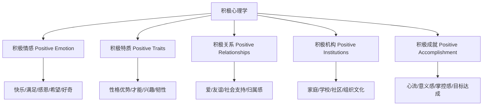
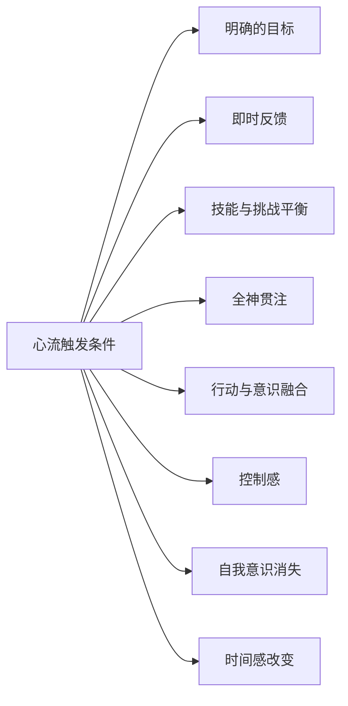

## 七、积极心理学实践

积极心理学不是"心灵鸡汤"，而是一门用实证方法研究人类如何蓬勃发展的科学。它不回避痛苦，而是追问：**除了消除问题，我们还能做什么来构建值得过的生活？** 本章将从理论根基出发，逐层拆解 PERMA 模型、性格优势、心流、感恩等核心议题，并给出可直接落地的练习方案。

### 7.1 积极心理学的诞生与定位

#### 从"修补缺陷"到"构建优势"

20 世纪的心理学被三大势力主导：**精神分析**关注潜意识冲突，**行为主义**关注刺激-反应，**临床心理学**关注病理诊断。这三者有一个共同假设——心理学的任务是"修复出问题的人"。

1998 年，时任美国心理学会（APA）主席的马丁·塞利格曼（Martin Seligman）在年会上提出：心理学不应只研究精神疾病，还应系统研究人的优势、美德和最佳功能状态。这不是一个口号，而是一个研究议程的转向——从"人为什么会痛苦"转向"人为什么会蓬勃"。

#### 积极心理学与"积极思维"的区别

| 维度 | 积极心理学 | 通俗"积极思维" |
|------|-----------|----------------|
| 方法论 | 随机对照实验、纵向追踪、元分析 | 个人经验、轶事、直觉 |
| 对负面情绪的态度 | 承认负面情绪的功能性，不压制 | 否定负面情绪，要求"正能量" |
| 核心目标 | 理解并促进人的蓬勃发展 | 让人"感觉好" |
| 典型代表 | Seligman、Csikszentmihalyi、Fredrickson | "吸引力法则"、心灵鸡汤 |
| 可证伪性 | 是 | 通常不是 |

**关键区分**：积极心理学不教你"假装开心"，而是用科学方法回答"什么样的生活值得过"以及"如何过上这样的生活"。

#### 积极心理学的五大核心主题

这五大主题不是孤立的——它们相互促进、形成正向循环。例如，运用性格优势（C）会带来积极情感（B），进而改善关系（D），而良好的关系又为成就（F）提供支撑。

### 7.2 PERMA 模型：蓬勃人生的五根支柱

塞利格曼在 2011 年的著作《持续的幸福》（*Flourish*）中提出了 PERMA 模型，这是积极心理学最核心的理论框架。PERMA 不是一个"幸福公式"，而是五个可以独立测量、独立提升的维度。

#### P — 积极情感（Positive Emotion）

**是什么**：快乐、感恩、满足、希望、好奇、自豪、敬畏等正面情绪体验。

**为什么重要**：Barbara Fredrickson 的"拓展-建构理论"（Broaden-and-Build Theory）发现，积极情感能拓宽人的注意范围和思维模式，帮助人建构持久的心理资源（如社交技能、问题解决能力、心理韧性）。这不是说"开心就好"——而是说积极情感有具体的功能性价值。

**科学证据**：
- Fredrickson & Joiner（2002）的纵向研究发现，积极情感能预测后续的思维广度和应对策略的多样性
- 积极情感与免疫功能正相关（Pressman & Cohen, 2005）
- 高积极情感人群在面对压力时，心血管恢复速度更快

**实操：积极情感的"银行账户"模型**

把积极情感想象成一个银行账户——日常的小额存款（微快乐）比偶尔的大额存款（度假、升职）更重要。具体做法：

1. **每日三好事**（Three Good Things）：每晚写下今天发生的三件好事，以及它们为什么会发生。坚持一周就能显著提升幸福感，效果可持续 6 个月（Seligman et al., 2005）。
2. **品味练习**（Savoring）：当好事发生时，刻意放慢节奏，调动五感去体验。例如吃到好吃的饭菜时，注意颜色、气味、口感、温度，而不是边吃边刷手机。
3. **预期积极事件**：研究发现，期待一件好事（如周末的计划）带来的积极情感，有时比事件本身更持久。每天花 2 分钟想象明天会发生的积极事件。

#### E — 投入/心流（Engagement）

**是什么**：完全沉浸在一项活动中，以至于忘记时间、忘记自我的状态。塞利格曼称之为"投入"（Engagement），其理论基础是 Csikszentmihalyi 的心流理论（详见 7.4 节）。

**为什么重要**：投入带来的满足感与快乐不同——它是"做这件事本身就值得"的内在满足。研究表明，人们在心流状态中的幸福感，比在被动休闲（如刷视频、看电视）中更高，尽管心流通常需要更多努力。

**核心矛盾**：人类倾向于选择省力的快乐（刷手机、吃零食），但真正带来持久满足的是需要投入的活动（学习、创造、运动）。理解这一点是改变行为模式的关键。

#### R — 积极关系（Relationships）

**是什么**：与他人建立深度、积极的连接。

**为什么重要**：哈佛大学长达 85 年的"成人发展研究"（Grant Study）得出的最核心结论是：**良好的人际关系是幸福和健康的最强预测因子**，超过收入、社会地位、智商等因素。孤独对健康的危害，相当于每天吸 15 支烟（Holt-Lunstad et al., 2010）。

**关键发现**：
- 关系质量比关系数量更重要——3 个深度朋友比 300 个点赞之交更有价值
- 社会支持的"感知"比"实际接收"更能预测幸福感
- 主动给予支持比被动接收支持带来的幸福感更强（"助人者高潮"效应）

#### M — 意义（Meaning）

**是什么**：感觉到自己的生命属于某个比自身更大的存在，有超越个人利益的目的和方向。

**为什么重要**：Viktor Frankl 在《活出生命的意义》中指出，即使在集中营的极端环境中，拥有意义感的人也更有生存意志。现代研究证实，意义感与更低的死亡率、更好的免疫功能、更强的心理韧性相关。

**意义的三个来源**（根据 Steger, 2009 的研究）：

| 来源 | 说明 | 举例 |
|------|------|------|
| 归属感 | 感觉自己属于某个群体或事业 | 加入志愿者团队、参与社区建设 |
| 目的感 | 感觉自己在追求有价值的目标 | 教育下一代、推动社会公正 |
| 理解力 | 能够理解自己经历的意义 | 从挫折中提取教训、整合人生叙事 |

**实操：意义日志**

每周花 15 分钟回答以下问题：
1. 这周我做的事情中，哪些让我感觉"超越了自己"？
2. 我在为谁/什么而活？
3. 如果我明天就消失，什么工作/关系会留下缺口？

#### A — 成就（Accomplishment）

**是什么**：对能力、掌控和精通的追求，包括实现目标、克服挑战、掌握技能。

**为什么重要**：塞利格曼发现，即使一个人在 P、E、R、M 四个维度都表现良好，如果缺乏成就感，仍然不会感到蓬勃。人类有内在的"胜任需求"（Competence Need），这是自我决定论（Deci & Ryan）的三大基本需求之一。

**成就的悖论**：追求成就的过程比结果更重要。研究表明，"目标达成"带来的幸福感通常在 3-6 个月后消退（"享乐适应"），但追求目标过程中的成长感和掌控感更持久。

**实操：最优目标设定**

1. **内在目标优于外在目标**：追求"精通某项技能"比追求"赚到 100 万"更能带来持久满足
2. **过程目标优于结果目标**：设定"每天练习 30 分钟"比设定"三个月后通过考试"更有效
3. **"正好合适"的挑战**：太容易→无聊，太难→焦虑。最佳状态是比当前能力高 10-15% 的挑战

#### PERMA 五维度自评量表

在开始练习前，先评估自己的现状。对每个维度打分（1-10 分）：

| 维度 | 评估问题 | 当前得分 | 目标得分 |
|------|----------|----------|----------|
| P 积极情感 | 我每天体验到多少积极情绪？ | __/10 | __/10 |
| E 投入 | 我有多少时间处于心流状态？ | __/10 | __/10 |
| R 关系 | 我有多少段深度、积极的关系？ | __/10 | __/10 |
| M 意义 | 我是否清楚自己为什么而活？ | __/10 | __/10 |
| A 成就 | 我是否在持续成长和进步？ | __/10 | __/10 |

**行动原则**：优先提升得分最低的 1-2 个维度，而不是试图全面开花。研究表明，"短板提升"比"锦上添花"对整体幸福感的边际收益更高。

### 7.3 VIA 性格优势：发现你的核心竞争力

#### VIA 是什么

VIA（Values in Action）是由 Peterson 和 Seligman 开发的性格优势分类体系，包含 24 种性格优势，归入 6 大美德类别。它是积极心理学中最成熟的测量工具之一，已在 75 个国家、超过 500 万人中使用。

VIA 不是人格测试（如 MBTI），而是**优势评估**——它告诉你"你最擅长什么"，而不是"你是什么类型的人"。

#### 六大美德与 24 种性格优势

| 美德类别 | 包含的优势 | 核心特征 |
|----------|-----------|----------|
| 智慧与知识 | 创造力、好奇心、热爱学习、开放思维、洞察力 | 获取和运用知识的认知优势 |
| 勇气 | 勇敢、毅力、诚实、热情 | 意志优势，面对内外阻力达成目标 |
| 仁爱 | 爱、善良、社交智力 | 关怀和帮助他人的人际优势 |
| 公正 | 团队合作、公平、领导力 | 维护社群健康运转的公民优势 |
| 节制 | 宽恕、谦虚、审慎、自我调节 | 防止过度和保护免受伤害的保护性优势 |
| 超越 | 审美、感恩、希望、幽默、灵性 | 建立与更大存在连接的优势 |

#### 如何发现你的核心优势

**第一步：完成 VIA 测试**

访问 viacharacter.org（免费），完成 120 道题的标准化测试。测试约需 15 分钟，会生成你的 24 种优势排序。

**第二步：识别"标志性优势"（Signature Strengths）**

你的前 5-7 项优势通常是"标志性优势"——它们具有以下特征：
- 感觉"这就是我"，使用时感到真实和自然
- 学习和使用时充满精力，而不是消耗精力
- 你会主动寻找运用这些优势的机会
- 使用时有强烈的满足感和成就感

**第三步：每日优势运用**

Peterson 的研究发现，**每天用新方式运用一个标志性优势**，是提升幸福感最有效的单一干预手段之一。具体做法：

1. 从你的前 5 个优势中选一个
2. 想一个今天可以用新方式运用它的场景
3. 实际执行
4. 晚上记录体验和感受

**示例：如果你的核心优势是"好奇心"**
- 传统运用：看感兴趣的纪录片
- 新方式运用：主动和一个完全不同背景的陌生人聊天 10 分钟；尝试一种从未吃过的菜系并了解其文化背景；用一个从没走过的路线上班

#### 优势运用的常见误区

**误区一："我只需要发挥优势，短板无所谓"**

纠正：优势运用不等于忽视短板。正确的策略是：
- 在优势领域追求卓越
- 在短板领域达到"够用"的水平
- 如果某项短板严重影响了生活（如自我调节能力极弱导致暴饮暴食），需要优先改善

**误区二："优势是固定的"**

纠正：VIA 的研究表明，性格优势在人的一生中会发生变化。通常，审慎、自我调节、感恩等优势随年龄增长而提升，而好奇心、热情等优势可能有所下降。优势可以通过有意识的练习培养。

**误区三："优势测评的结果就是全部"**

纠正：测评只是起点。你还需要：
- 回忆过去的人生经历，验证测评结果是否与实际体验一致
- 向信任的朋友/家人询问他们眼中你的优势
- 在实际生活中反复实验和调整

### 7.4 心流：最优体验的科学

#### Csikszentmihalyi 的发现

米哈里·Csikszentmihalyi（契克森米哈赖）在 20 世纪 70 年代通过对艺术家、运动员、棋手、外科医生等"高表现者"的大量访谈，发现了一种共同的最优体验模式——**心流**（Flow）。

心流的核心特征是：**完全沉浸在一项活动中，以至于忘记了时间、忘记了自我，活动本身就是目的。**

#### 心流的八大条件

在这八个条件中，**技能与挑战的平衡**是最核心的触发因素。Csikszentmihalyi 提出了著名的"心流通道"模型：

| 状态 | 技能水平 | 挑战水平 | 体验 |
|------|----------|----------|------|
| 焦虑 | 低 | 高 | 不知所措，压力过大 |
| 唤醒 | 中 | 高 | 有挑战感，可以应对 |
| **心流** | **高** | **高** | **完全投入，最优体验** |
| 控制 | 高 | 中 | 轻松掌控，但可能无聊 |
| 放松 | 高 | 低 | 舒适但缺乏刺激 |
| 无聊 | 中 | 低 | 提不起兴趣 |
| 冷漠 | 低 | 低 | 无动于衷 |
| 担忧 | 低 | 中 | 缺乏信心 |

**实践启示**：如果你感到焦虑，说明挑战超出了能力——降低难度或提升技能。如果你感到无聊，说明能力超出了挑战——增加难度或寻找新领域。

#### 如何主动创造心流

**第一步：选择合适的活动**

适合心流的活动通常具有以下特征：
- 有明确的规则和目标（如编程、写作、运动、乐器）
- 能提供即时反馈（如弹琴时立刻听到声音，写代码时立刻看到运行结果）
- 需要全身心投入，不能"自动驾驶"

**不适合心流的活动**：
- 目标模糊（如"思考人生"）
- 无反馈（如等待邮件回复）
- 可以轻松完成（如散步、洗碗——除非你刻意提升挑战）

**第二步：消除干扰**

心流的进入需要约 15-20 分钟的无中断专注。研究发现，被打断后重新进入心流平均需要 23 分钟（Mark et al., 2008）。具体措施：

- 手机静音或放到另一个房间
- 关闭所有通知和弹窗
- 告知周围的人"接下来 X 分钟不要打扰我"
- 使用降噪耳机或白噪音
- 准备好所有需要的材料，避免中途起身

**第三步：设定微目标**

不要说"我要写完这篇文章"，而是说"我要完成第一段的初稿"。微目标提供清晰的反馈信号——完成时你知道自己做到了，这有助于维持心流。

**第四步：保持"比能力高 10%"的挑战**

如果任务太容易，主动增加难度（如写作时要求自己用一个新学的修辞手法）。如果任务太难，拆分成更小的步骤。

**第五步：培养"心流习惯"**

心流是可以训练的。Csikszentmihalyi 的研究表明，心流频率高的人通常有固定的"心流仪式"——特定的时间、地点、环境，让大脑自动切换到专注模式。

**心流仪式模板**：
1. 固定时间（如每天早上 9:00-11:00）
2. 固定地点（如书桌前、图书馆）
3. 固定的启动动作（如泡一杯咖啡、戴上耳机、打开特定的背景音乐）
4. 固定的退出动作（如站起来伸展、记录今天的进展）

### 7.5 感恩练习的科学与实践

#### 感恩的神经机制

感恩不只是"觉得好"——它有具体的神经机制。研究表明，感恩激活了大脑的内侧前额叶皮层（mPFC）和前扣带回皮层（ACC），这些区域与道德认知、社会判断和情绪调节相关。

Emmons 和 McCullough（2003）的经典实验发现：
- 感恩组（每周写 5 件感恩的事）在 10 周后，幸福感显著高于对照组
- 感恩组的乐观程度、生活满意度、积极情绪均显著提升
- 感恩组的身体健康自评也更好，运动时间也更多

#### 四种感恩练习详解

**练习一：感恩日记（Gratitude Journal）**

| 要素 | 具体做法 |
|------|----------|
| 时间 | 每天睡前，或每周固定时间 |
| 数量 | 每次写 3-5 件 |
| 深度 | 不只写"是什么"，还要写"为什么让我感恩" |
| 变化 | 避免重复——挑战自己发现新的感恩点 |
| 周期 | 至少坚持 21 天形成习惯 |

**进阶技巧**：
- **具体化**：不要写"感恩家人"，而是写"感恩妈妈今天特意打电话提醒我带伞，因为她关注了天气预报"
- **意外性**：优先记录意料之外的好事——研究表明，意外的感恩体验效果更强
- **人际性**：优先记录与人相关的感恩——比感恩事物的效果更好
- **避免"罗列陷阱"**：如果发现自己只是机械地列清单而没有真正感受，暂停几天，等积累了真实的体验再恢复

**练习二：感恩信（Gratitude Letter）**

这是 Seligman 研究中效果最显著的干预之一。步骤如下：

1. **选人**：选一个对你的生命有重要影响、但你从未正式感谢过的人
2. **写信**：约 300 字，具体描述：
   - 对方做了什么
   - 对你产生了什么影响
   - 你当时的感受
   - 你现在回看时的感受
3. **送达**：最好亲自朗读给对方听（视频通话也可以）。研究表明，当面朗读的效果远好于发邮件
4. **记录**：记录对方的反应和你自己的感受

**练习三：感恩拜访（Gratitude Visit）**

感恩信的升级版——亲自拜访对方，当面朗读信件。Seligman 的实验中，感恩拜访在短期内（一周内）提升幸福感的效果最强，效果可持续长达一个月。

**练习四：感恩冥想**

1. 找一个安静的地方，闭眼，深呼吸 3 次
2. 想象一个你感恩的人，回忆他/她对你做过的事
3. 在心中默念："谢谢你，因为……"
4. 注意身体的感觉——胸口的温暖、嘴角的微笑
5. 将这种感觉扩展到更广的范围：感恩身体、感恩机会、感恩生命本身
6. 持续 5-10 分钟

#### 感恩练习的常见陷阱

| 陷阱 | 表现 | 纠正方法 |
|------|------|----------|
| 强迫感恩 | "我应该感恩但感受不到" | 承认当下的真实感受，从微小的事物开始 |
| 比较式感恩 | "至少我比XX好" | 专注于自身的积极体验，不以他人不幸为参照 |
| 流于形式 | 机械地列清单 | 减少频率、增加深度，每次只写 1 件，详细展开 |
| 忽视负面 | 用感恩压制不满 | 感恩和不满可以共存，感恩不是用来"替代"问题的 |

### 7.6 积极关系的科学与实践

#### 积极建设性回应（ACR）

Shelly Gable 的研究发现，当他人分享好消息时，你的回应方式对关系质量有决定性影响。回应分为四种类型：

| 回应类型 | 特征 | 示例 | 效果 |
|----------|------|------|------|
| 积极建设性（ACR） | 热情、追问细节、帮助放大 | "太棒了！你是怎么做到的？当时什么感觉？" | 增强信任、提升关系满意度 |
| 积极被动 | 简短肯定、不追问 | "不错啊" | 中性，缺乏连接 |
| 消极建设性 | 找问题、泼冷水 | "这有什么好高兴的，小心乐极生悲" | 损害信任 |
| 消极被动 | 忽视、转移话题 | "哦。对了，我跟你说个别的……" | 最具破坏性 |

**实操：ACR 训练**

当别人分享好消息时，用以下公式回应：
1. **匹配对方的能量**：对方兴奋，你也表现出兴奋
2. **追问细节**："具体发生了什么？""你当时怎么想的？"
3. **帮助放大**："这对你意味着什么？""你打算怎么庆祝？"
4. **重提旧事**："我记得你之前一直在努力这个，终于做到了！"

#### John Gottman 的关系研究

Gottman 对 3000 多对夫妻进行了长达 40 年的追踪研究，发现了预测关系破裂的"末日四骑士"：

| 指标 | 表现 | 解药 |
|------|------|------|
| 批评 | 攻击对方的人格而非行为 | 用"我"语句表达感受："我感到……当……的时候" |
| 蔑视 | 嘲讽、翻白眼、冷嘲热讽 | 培养感恩和尊重文化，每天表达欣赏 |
| 防御 | 推卸责任、反向指责 | 承担部分责任："你说得对，我确实……" |
| 石墙 | 沉默、回避、情感关闭 | 学会暂停："我需要 20 分钟冷静一下，然后我们继续谈" |

**Gottman 的"5:1 比例"**：稳定的关系中，积极互动与消极互动的比例至少为 5:1。这意味着，每一次争吵或批评，需要至少 5 次积极互动（赞美、感谢、拥抱、幽默、关心）来平衡。

**每日关系微习惯**：
- 出门前说一句具体的赞美或感谢
- 回家后先花 6 分钟询问对方今天的情况（Gottman 称之为"重逢仪式"）
- 睡前说一件今天对方做的让你感激的事
- 每周至少一次"约会时间"——专注于彼此，不做其他事情

### 7.7 积极心理学在日常生活中的应用

#### 工作场景

**识别和运用工作中的优势**

研究表明，在工作中运用核心优势的人，工作满意度高出 3 倍，绩效评分高出 25%（Harter et al., 2002）。具体做法：

1. 识别你的核心优势（通过 VIA 测试）
2. 分析你的日常工作中哪些任务能运用这些优势
3. 主动争取更多运用优势的任务
4. 对于无法回避的短板任务，尝试用优势来"迂回完成"（如"好奇心"强的人，可以把枯燥的数据录入变成探索数据规律的游戏）

**创造工作中的心流**

| 条件 | 工作场景应用 |
|------|-------------|
| 明确目标 | 把模糊的项目拆分成具体的、有明确完成标准的子任务 |
| 即时反馈 | 设置每日/每周的检查点，而不是等到项目结束才知道结果 |
| 技能匹配 | 和主管沟通，争取难度略高于当前能力的任务 |
| 消除干扰 | 使用番茄工作法（25 分钟专注 + 5 分钟休息），专注时段断网 |

**寻找工作意义**

如果觉得工作缺乏意义，尝试"工作重塑"（Job Crafting）：
1. **任务重塑**：调整工作内容的范围或方式
2. **关系重塑**：改变与谁互动、如何互动
3. **认知重塑**：重新理解工作的意义（如清洁工不只是"打扫卫生"，而是"为病人创造安全的环境"）

#### 家庭场景

**创造积极家庭文化**

1. **家庭感恩仪式**：晚餐时每人分享一件今天感恩的事
2. **优势发现**：帮孩子识别和命名他们的优势，而不是只关注成绩
3. **积极回应**：当家人分享好消息时，用 ACR 方式回应
4. **家庭传统**：建立固定的家庭活动（如周末一起做饭、每月一次家庭日），创造共享的积极记忆

**亲子关系中的积极心理学**

- **描述式表扬**：不说"你真聪明"，而是说"你花了一个小时反复修改这篇文章，这种坚持让我印象深刻"
- **成长型思维**：强调努力和策略，而不是天赋。Dweck 的研究表明，被表扬"努力"的孩子比被表扬"聪明"的孩子更愿意接受挑战
- **情绪教练**：帮助孩子命名和理解情绪，而不是压制情绪

#### 教育场景

**在课堂中应用积极心理学**

1. **优势识别**：开学初让学生完成 VIA 测试，了解各自的优势
2. **优势整合**：设计小组项目时，根据学生的优势分配角色
3. **积极反馈**：每天至少给每个学生一次具体的、真诚的正面反馈
4. **意义连接**：把课程内容与学生的生活、兴趣、未来目标连接起来
5. **心流设计**：根据学生的水平调整任务难度，提供及时反馈

### 7.8 常见误区与纠正

#### 误区一："积极心理学就是让人变开心"

**真相**：积极心理学研究的是"蓬勃发展"（Flourishing），这包含但不限于快乐。一个蓬勃发展的人会经历悲伤、愤怒、恐惧——这些情绪是健康的、有功能的。积极心理学不否认负面情绪，而是强调：除了应对问题，我们还可以主动构建积极的品质。

#### 误区二："幸福有一个固定公式"

**真相**：研究表明，幸福的构成因人而异。有些人从社交中获得最多满足，有些人从创造中获得，有些人从意义中获得。PERMA 模型不是"平均分配精力"的公式，而是帮助你找到自己的"幸福权重"。

#### 误区三："感恩练习就是自我欺骗"

**真相**：感恩不是"假装一切都好"。它是将注意力从"我缺少什么"扩展到"我已经拥有什么"。研究表明，感恩不降低人解决问题的动力——相反，感恩的人更有韧性，因为他们有一个"积极情感的储备"来应对困难。

#### 误区四："心流就是集中注意力"

**真相**：心流不只是"专注"——它需要技能与挑战的平衡、明确的目标、即时反馈等条件。你可以非常专注地做一件无聊的事（如盯着墙壁），但那不是心流。心流是一种"甜蜜点"——当能力恰好匹配挑战时出现的最优体验。

#### 误区五："积极心理学对严重心理问题没用"

**真相**：积极心理学不是临床心理学的替代品，而是补充。对于严重抑郁、焦虑等问题，首先应该寻求专业治疗。但研究发现，即使在临床人群中，积极心理学干预（如感恩练习、优势运用）也能作为辅助手段，提升治疗效果。

### 7.9 进阶工具与资源

#### 推荐测评工具

| 测评工具 | 测评内容 | 费用 | 网址 |
|----------|----------|------|------|
| VIA 性格优势测评 | 24 种性格优势排序 | 免费 | viacharacter.org |
| PERMA Profiler | PERMA 五维度评估 | 免费 | martin.epic.com |
| 心流倾向量表 | 心流体验频率 | 学术研究用 | 联系研究者 |
| 感恩问卷 GQ-6 | 感恩倾向 | 免费 | McCullough et al., 2002 |

#### 推荐阅读

| 书名 | 作者 | 核心内容 | 推荐理由 |
|------|------|----------|----------|
| 《持续的幸福》 | Seligman | PERMA 模型、积极心理学总论 | 积极心理学奠基之作 |
| 《心流》 | Csikszentmihalyi | 心流理论与实践 | 最优体验的经典研究 |
| 《积极情绪的力量》 | Fredrickson | 拓展-建构理论 | 理解积极情感的功能 |
| 《活出生命的意义》 | Viktor Frankl | 意义疗法 | 理解"意义"维度的终极案例 |
| 《优势识别器 2.0》 | Tom Rath | 优势运用 | 职场优势实践指南 |
| 《幸福的方法》 | Tal Ben-Shahar | 幸福与成就的平衡 | 哈佛最受欢迎的幸福课 |

#### 21 天积极心理学启动计划

| 天数 | 练习 | 所需时间 |
|------|------|----------|
| 第 1-7 天 | 每晚写 3 件感恩的事 | 5 分钟 |
| 第 8-14 天 | 每天用新方式运用一个核心优势 | 10 分钟 |
| 第 15-17 天 | 写一封感恩信并朗读给对方 | 30 分钟 |
| 第 18-20 天 | 设计并执行一次心流体验 | 60 分钟 |
| 第 21 天 | 回顾整个过程，重新评估 PERMA 各维度得分 | 15 分钟 |

**关键提醒**：不要试图同时开始所有练习。研究表明，一次只建立一个新习惯的成功率远高于同时建立多个。从最吸引你的练习开始，稳定后再叠加。

---
