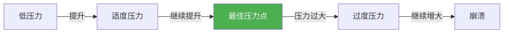
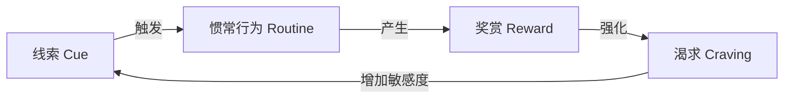

## 八、心理学在生活中的应用

前七节分别讲解了自我认知、情绪管理、自信建立、压力管理、心理健康、人际关系和积极心理学的理论与方法。本节是"收网"——将这些分散的心理学工具整合到日常生活的六大核心场景中：**决策、学习、职业、健康、创造力、幸福感**。每个场景都遵循同一个逻辑：先理解底层心理机制（为什么），再掌握具体操作方法（怎么做），最后识别常见陷阱（怎么避坑）。

### 8.1 决策优化：让认知偏误无处藏身

#### 为什么你的直觉经常出错

人类大脑有两套思维系统（Kahneman, 2011）：

| 系统 | 特征 | 适用场景 | 典型错误 |
|------|------|----------|----------|
| **系统1**（快思考） | 自动化、无意识、快速、省力 | 日常习惯、紧急反应、模式识别 | 过度依赖直觉，容易被偏误劫持 |
| **系统2**（慢思考） | 刻意、有意识、缓慢、耗能 | 复杂决策、数学计算、逻辑推理 | 懒惰，倾向于接受系统1的结论 |

系统1高效但粗糙——它用启发式（经验法则）替代精确分析，这在远古环境中是生存优势，但在现代社会常常导致系统性错误。Daniel Kahneman 和 Amos Tversky 的研究揭示了上百种认知偏误，以下是日常决策中最高频、影响最大的几种：

#### 十大决策偏误与破解策略

**1. 确认偏误（Confirmation Bias）**

- **表现**：只关注支持自己观点的证据，忽视或贬低反面证据
- **经典案例**：你看好一只股票，就只看利好消息；你讨厌一个人，就只注意他的缺点
- **破解**：在做重要决策前，强制自己写"反面论证"——如果我的判断是错的，最可能的原因是什么？具体列出3条

**2. 锚定效应（Anchoring Effect）**

- **表现**：决策被最先接触到的信息（"锚"）不当地影响
- **经典案例**：商品先标"原价999"再打折到"399"，你感觉赚了——实际上399才是市场价
- **破解**：在谈判或购物前，先独立研究市场价格，形成自己的参考区间；主动"重新锚定"

**3. 损失厌恶（Loss Aversion）**

- **表现**：对损失的痛苦是等量收益快乐的2-2.5倍（Kahneman & Tversky, 1979）
- **经典案例**：你有一个亏了30%的基金，明知前景不好却不舍得卖（"卖了就真的亏了"）
- **破解**：用"机会成本"框架重新审视——"这笔钱如果放在别处，能产生什么收益？"

**4. 沉没成本谬误（Sunk Cost Fallacy）**

- **表现**：因为已经投入了时间/金钱/精力，继续投入明知不值得的事情
- **经典案例**：电影看了30分钟发现很难看，但"票都买了"就硬撑看完
- **破解**：问自己"如果我之前没有投入任何东西，我现在还会选择开始做这件事吗？"

**5. 可得性偏误（Availability Bias）**

- **表现**：用事件在记忆中的易得程度来判断其概率
- **经典案例**：飞机失事的新闻铺天盖地，你觉得坐飞机比开车危险——实际上开车的致死率是飞机的数百倍
- **破解**：遇到概率判断时，主动搜索统计数据，而不是依赖记忆中的"画面感"

**6. 从众效应（Bandwagon Effect）**

- **表现**：认为多数人选择的就是正确的
- **经典案例**：餐厅门口排长队，你觉得一定好吃；大家都买基金，你也跟着冲进去
- **破解**：区分"多数人的选择"和"正确的选择"。问自己"如果只有我一个人在做这个决定，我还会这样选吗？"

**7. 过度自信偏误（Overconfidence Bias）**

- **表现**：高估自己知识的准确性和决策的正确率
- **数据**：研究显示，当人们说"我有90%把握"时，实际正确率只有约70%
- **破解**：做预测时给出区间而非点估计；定期回顾自己的预测记录，计算实际准确率

**8. 框架效应（Framing Effect）**

- **表现**：同一信息的不同表述方式会导致不同决策
- **经典案例**："手术存活率90%"vs"手术死亡率10%"——同样的数据，前者让你更愿意接受手术
- **破解**：遇到重要信息时，主动用正面和负面两种方式重新表述，检查自己的判断是否因此改变

**9. 现状偏见（Status Quo Bias）**

- **表现**：倾向于维持现状，即使改变明显更有利
- **经典案例**：你知道另一个手机套餐更划算，但一直懒得换
- **破解**：设定"决策截止日期"——给现状选择设一个默认的复审期限

**10. 光环效应（Halo Effect）**

- **表现**：对某人某方面的好印象泛化到其他方面
- **经典案例**：长得好看的人被认为更聪明、更可信；名校毕业生被认为一定能力更强
- **破解**：评估人或事物时，列出具体维度逐一打分，不让单一维度影响全局判断

#### 四大决策工具

**工具一：10-10-10规则（Suzy Welch）**

面对纠结的决策时，依次问自己三个问题：
1. **10分钟后**，我对这个决定会有什么感受？
2. **10个月后**，我会怎么看待这个决定？
3. **10年后**，这个决定对我的人生意味着什么？

这个工具的价值在于：它强迫你跳出当下的情绪波动，用不同时间尺度审视同一个决策。许多让你此刻纠结到失眠的选择，放到10年的尺度上根本不重要。

**工具二：事前验尸（Pre-mortem Analysis）**

由心理学家Gary Klein提出，步骤如下：
1. 假设你已经做出了决定，并且这个决定**彻底失败了**
2. 在5-10分钟内，写下所有可能导致失败的原因
3. 从最可能的原因开始，逐一评估：这个风险发生的概率有多大？后果有多严重？能否提前预防？

研究表明，事前验尸比传统的"风险评估"能多识别30%的潜在问题，因为它绕过了"群体思维"中的社交压力——在"已经失败"的假设下，人们更愿意说出真实的担忧。

**工具三：决策矩阵（Decision Matrix）**

当面临多选项时，用结构化方法比较：

| 评估维度 | 权重（%） | 选项A得分 | 选项B得分 | 选项C得分 |
|----------|-----------|-----------|-----------|-----------|
| 财务收益 | 30 | ?/10 | ?/10 | ?/10 |
| 个人成长 | 25 | ?/10 | ?/10 | ?/10 |
| 时间成本 | 20 | ?/10 | ?/10 | ?/10 |
| 风险程度 | 15 | ?/10 | ?/10 | ?/10 |
| 享受程度 | 10 | ?/10 | ?/10 | ?/10 |

操作要点：先确定权重（哪项对你最重要），再逐项打分，最后加权求和。注意：打分时要独立评估每个维度，不要让某个维度的极端分数影响其他维度。

**工具四：决策日记**

每周记录1-2个重要决策：
- 决策内容和选项
- 当时的信息和考虑因素
- 最终选择和理由
- 预期结果

3-6个月后回顾：预期是否准确？哪些偏误反复出现？哪些决策策略有效？这是校准决策能力最有力的工具——你不是在学理论，而是在用自己的数据训练直觉。

#### 决策疲劳的管理

心理学家Roy Baumeister的研究发现，意志力和决策能力是一种**有限资源**——做了一连串决策后，后续决策的质量会系统性下降（"决策疲劳"）。这解释了为什么：
- 法官在午餐前做出的假释裁定远比午餐后更严厉
- 乔布斯每天穿同样的衣服——减少低价值决策的消耗
- 超市把糖果放在收银台旁边——利用你决策疲劳后的冲动

**应对策略**：
1. **保护高价值决策时段**：在精力最充沛时（通常是上午）处理最重要的决策
2. **自动化低价值决策**：固定化饮食、穿着、通勤路线等日常选择
3. **设置决策数量上限**：每天给自己一个"决策预算"，超出的推到明天
4. **决策前补充血糖**：研究表明，低血糖状态下的决策质量显著下降——重要决策前吃点东西

### 8.2 学习优化：认知科学驱动的高效学习

#### 记忆增强：四大学习策略

**策略一：间隔重复（Spaced Repetition）**

德国心理学家Hermann Ebbinghaus在1885年发现了遗忘曲线——学习后20分钟内遗忘42%，1小时后遗忘56%，1天后遗忘74%。但每次复习都能重置曲线并减缓遗忘速度。

间隔重复的核心原则：在即将遗忘时复习，效果最好。

| 复习时机 | 记忆保持效果 | 时间投入 |
|----------|-------------|----------|
| 学完立刻复习 | 效果最差（没有"间隔"） | 低 |
| 学完24小时后第一次复习 | 效果好（符合遗忘曲线） | 低 |
| 学完1天→3天→7天→14天→30天 | 效果最优（指数递增间隔） | 低 |
| 考前集中突击 | 短期有效，长期遗忘 | 高 |

**操作工具**：Anki（免费开源）是最成熟的间隔重复软件。制作"原子化"卡片（一张卡只包含一个知识点），每天花15-20分钟复习，就能高效维护大量知识。

**策略二：提取练习（Retrieval Practice）**

Purdue大学Jeffrey Karpicke的研究发现：反复阅读笔记的效果远不如合上书本主动回忆。这被称为"测试效应"（Testing Effect）——提取记忆的行为本身就是最强的学习活动。

具体做法：
- **回忆式笔记**：读完一章后合上书，凭记忆写出要点，然后对照原文补充遗漏
- **自测卡片**：不只是"看答案"，而是先尝试自己回答，再翻看
- **费曼技巧**：用最简单的语言把概念讲给"一个完全不懂的人"听——讲不清楚的地方就是你没真正理解的地方
- **交错练习**：不要按类型集中练习（如只做加法题），而是混合不同类型的题目——虽然感觉更难，但长期效果更好（Rohrer & Taylor, 2007）

**策略三：精细化编码（Elaborative Encoding）**

将新信息与已有知识建立深度联系，而不是孤立地记忆。

| 编码方式 | 示例 | 效果 |
|----------|------|------|
| 浅层编码 | 重复阅读"海马体负责记忆" | 差（只记住文字） |
| 精细化编码 | "海马体像一个'图书管理员'，决定哪些信息存入长期记忆" | 好（建立了语义联系） |
| 自传式编码 | "我的'海马体图书管理员'特别擅长存音乐记忆，但经常弄丢人名" | 最好（与个人经验关联） |

**实操技巧**：
- **类比法**：新概念像什么你已经知道的东西？
- **故事法**：把知识点编成一个连贯的故事
- **画面法**：在脑中形成生动的心理图像
- **自我关联**：这个知识点与我的什么经历/知识有关？

**策略四：多重编码（Dual Coding）**

Allan Paivio的双重编码理论发现，同时使用语言和视觉编码的信息，记忆效果比单一编码高出一倍。

具体做法：
- 读文字时画思维导图或示意图
- 听讲座时同时做结构化笔记（如康奈尔笔记法）
- 学概念时制作对比表格
- 学流程时画流程图

#### 注意力管理

**注意力的三个系统**

| 系统 | 功能 | 训练方法 |
|------|------|----------|
| **警觉**（Alerting） | 维持觉醒状态，等待重要信号 | 充足睡眠、咖啡因（适量）、规律作息 |
| **定向**（Orienting） | 将注意力转向特定刺激 | 冥想练习（专注呼吸）、视觉搜索游戏 |
| **执行控制**（Executive） | 抑制干扰，保持目标导向 | 认知训练（如Stroop任务）、正念冥想 |

**番茄工作法的科学基础**

Francesco Cirillo发明的番茄工作法（25分钟专注+5分钟休息）之所以有效，是因为它匹配了注意力的自然节律——成年人持续专注的极限约20-45分钟。关键优化：
- **第一个25分钟不要追求产出**：它的作用是"启动"——进入心流需要15-20分钟的预热
- **5分钟休息不要刷手机**：真正的休息是"认知卸载"——站起来、看窗外、深呼吸
- **每4个番茄后休息15-30分钟**：让注意力系统彻底恢复

**多任务处理的认知成本**

斯坦福大学Clifford Nass的研究发现，经常同时处理多个任务的人，认知能力反而更差——他们的注意力过滤能力、工作记忆容量和任务切换速度都不如单任务处理者。

原因不是"同时做多件事"，而是"不断切换"——每次切换都有认知成本（切换成本，Switch Cost），研究表明一个任务被打断后平均需要23分钟才能重新进入专注状态（Gloria Mark, UC Irvine）。

应对策略：
- **批处理**：同类任务集中处理（如统一时间回复邮件/消息）
- **时间块**：为不同类型的工作划定专属时段
- **环境控制**：专注时段关闭所有通知，手机放到视线之外

#### 元认知：学会"学习如何学习"

元认知（Metacognition）是"关于认知的认知"——你对自己学习过程的监控和调节能力。高元认知能力的人学习效率更高，因为他们知道"自己不知道什么"以及"该用什么策略"。

**元认知三步法**：

1. **计划阶段**：开始学习前问自己
   - 这个主题我已经知道什么？
   - 我学习的目标是什么？学到什么程度算"够"？
   - 用什么学习策略最适合这个材料？

2. **监控阶段**：学习过程中问自己
   - 我真的理解了吗？还是只是"感觉理解了"？
   - 我能用自己的话解释这个概念吗？
   - 哪些部分我可以跳过？哪些需要重读？

3. **评估阶段**：学习后问自己
   - 我能不看笔记回忆多少内容？
   - 哪些方法有效？哪些方法浪费了时间？
   - 下次遇到类似内容，我会怎么调整策略？

### 8.3 职业发展：心理学视角的职场进阶

#### 职业定位：从"找到对的工作"到"创造对的工作"

**霍兰德职业兴趣理论**

John Holland提出，人的职业兴趣可以归为六种类型（RIASEC）：

| 类型 | 核心特征 | 典型职业 | 优势环境 |
|------|----------|----------|----------|
| **R 现实型** | 动手能力强、务实 | 工程师、技工、建筑师 | 结构清晰、任务明确 |
| **I 研究型** | 好奇心强、善于分析 | 科学家、程序员、数据分析师 | 问题导向、自由探索 |
| **A 艺术型** | 创造力强、表达欲强 | 设计师、作家、音乐家 | 灵活、开放、允许个性 |
| **S 社会型** | 善于沟通、乐于助人 | 教师、咨询师、HR | 人际互动、服务导向 |
| **E 企业型** | 领导力强、目标导向 | 管理者、创业者、销售 | 竞争、权力、结果导向 |
| **C 常规型** | 细心、有条理 | 会计、审计、行政 | 规则清晰、流程规范 |

大多数人的兴趣是2-3种类型的组合。Holland的"六角形模型"表明，相邻类型更兼容（如研究型和艺术型），对角类型最不兼容（如常规型和艺术型）。

**关键洞察**：职业满意度的最强预测因子不是薪资或地位，而是**个人特质与工作环境的匹配度**。一个高度艺术型的人在严格流程化的常规型环境中，无论薪水多高都很难感到满足。

**工作重塑（Job Crafting）**

密歇根大学Amy Wrzesniewski的研究发现，即使是同样的工作，人们也可以通过三种方式"重塑"它：

1. **任务重塑**：调整工作的范围或方式——增加擅长/喜欢的任务比重，优化或委托不喜欢的任务
2. **关系重塑**：改变与谁互动以及如何互动——多花时间与能激发你的人在一起
3. **认知重塑**：重新理解工作的意义——清洁工可以是"维护医疗环境安全的专业人员"

工作重塑不是跳槽，而是在现有岗位上创造更高的匹配度。研究表明，成功的工作重塑能提升工作满意度、工作投入和绩效。

#### 职场成功心理学

**情绪智力在工作中的作用**

Daniel Goleman的研究表明，在高层管理者中，智商和技术技能是"门槛能力"——达到基本水平就够用了，而区分卓越领导者和普通领导者的是情绪智力（Emotional Intelligence），它包含五个维度：

| 维度 | 定义 | 职场表现 |
|------|------|----------|
| **自我觉察** | 了解自己的情绪、优势、局限 | 清楚自己在什么情况下容易犯错 |
| **自我管理** | 控制破坏性情绪和冲动 | 被批评时能冷静回应，而不是本能反驳 |
| **自我激励** | 持续驱动自己追求目标 | 遇到挫折后能快速恢复 |
| **同理心** | 理解他人的情绪和视角 | 能读懂团队的情绪状态 |
| **社交技能** | 管理关系和建立网络 | 能有效说服、调解冲突、激发他人 |

**压力与工作表现的倒U曲线**

Yerkes-Dodson定律揭示了压力与表现的关系：适度压力提升表现（唤醒聚焦注意力），但过度压力损害表现（焦虑占据工作记忆）。

关键不是"消除压力"，而是"管理压力在最优区间"：
- 压力太低时：设定有挑战性的截止日期、承担更大的责任
- 压力太高时：拆分任务、寻求支持、缩短决策清单

**职业倦怠的三维度模型**

Christina Maslach提出职业倦怠包含三个核心维度：

| 维度 | 表现 | 早期信号 |
|------|------|----------|
| **情绪耗竭** | 感觉精力被彻底榨干 | 周日晚上开始恐惧周一 |
| **去人格化** | 对同事/客户产生冷漠、讽刺态度 | 开始用"那些人"而非名字称呼服务对象 |
| **成就感降低** | 觉得自己的工作毫无价值 | 无法说出这周做成了什么有意义的事 |

**预防策略**（从三个维度分别干预）：
- **防耗竭**：严格保护非工作时间，每周至少半天完全不工作；建立"能量恢复活动"清单（运动、自然、社交）
- **防冷漠**：找到工作中与"人"相关的意义面——你不只是在写代码/做报表，你是在帮谁解决问题？
- **防价值感下降**：建立"成就日志"——每天记录1-2件具体完成的事，不管多小

#### 职业发展的心理资本

心理学家Fred Luthans提出"心理资本"（PsyCap）概念，包含四个可培养的心理资源：

| 资本 | 定义 | 培养方法 |
|------|------|----------|
| **自我效能** | "我能完成这个任务"的信心 | 积累小成功、寻找榜样、管理生理状态 |
| **乐观** | 对未来成功的积极归因 | 区分"盲目乐观"和"灵活乐观"——后者承认困难但相信可以应对 |
| **希望** | 目标导向的意志力和路径规划力 | 学习"目标分叉"——每个目标至少准备两条实现路径 |
| **韧性** | 逆境中快速恢复的能力 | 建立"韧性资源库"——社会支持、问题解决技能、自我效能感 |

Meta分析显示，心理资本与工作绩效的相关性（r=0.26）高于单独的自我效能（r=0.23）、乐观（r=0.19）或韧性（r=0.17）——四个资源组合起来的效果大于部分之和。

### 8.4 健康行为促进：让改变真正发生

#### 行为改变的阶段模型

Prochaska和DiClemente的跨理论模型（Transtheoretical Model）发现，行为改变不是一蹴而就的，而是经历五个阶段：

| 阶段 | 心理状态 | 关键任务 | 典型对话 |
|------|----------|----------|----------|
| **前考虑期** | 不认为有问题 | 提升意识，引发矛盾感 | "我挺好的，不需要改变" |
| **考虑期** | 知道有问题，但不确定要改 | 权衡利弊，增强改变动机 | "我该减肥了……但也没那么急" |
| **准备期** | 决定要改，准备行动 | 制定具体计划，小步启动 | "下周一开始每天跑步" |
| **行动期** | 已经在改 | 建立新行为，应对诱惑 | "我已经坚持两周了" |
| **维持期** | 新行为已稳定 | 防止复发，融入身份 | "我就是一个运动的人" |

**关键洞察**：大多数失败发生在两个节点——一是从"考虑期"到"准备期"的转化（想了很久但一直没开始），二是"行动期"的前30天（新行为还没稳定就遇到诱惑）。

针对不同阶段的干预策略：

- **前考虑期**→**考虑期**：提供信息（如健康数据、体检报告），创造"震撼时刻"
- **考虑期**→**准备期**：帮助做利弊分析（决策平衡单），降低启动门槛
- **准备期**→**行动期**：制定极具体的执行意图（"如果……那么……"格式）
- **行动期**→**维持期**：建立社会支持、环境设计、身份重塑

#### 执行意图：如果-那么计划

心理学家Peter Gollwitzer提出的"执行意图"（Implementation Intentions）是行为科学中最强力的干预手段之一。格式为：

> **"如果**（情境X发生），**那么**我就做（行为Y）"。

**为什么有效**：它将模糊的"我要多运动"转化为大脑可以自动执行的"触发器-行为"链——当情境X出现时，行为Y几乎自动启动，不需要消耗意志力来"决定要不要做"。

| 模糊目标 | 执行意图版本 |
|----------|-------------|
| 我要多运动 | "如果周一/三/五早上闹钟响了，那么我就穿上运动鞋下楼跑步" |
| 我要少刷手机 | "如果我拿起手机准备刷短视频，那么我就打开Kindle读3页书" |
| 我要健康饮食 | "如果我走进公司食堂，那么我先拿蔬菜和蛋白质，最后再考虑主食" |
| 我要早睡 | "如果时钟指向10:30，那么我就放下手机、开始洗漱" |

**Meta分析数据**：执行意图的平均效应量d=0.65，能将目标达成率从约22%提升到约62%（Gollwitzer & Sheeran, 2006）。

#### 习惯回路：cue-routine-reward

Charles Duhigg在《习惯的力量》中总结的习惯回路模型：

**改变习惯的四步法**：

1. **识别线索**：记录每次不良行为发生时的五个要素——时间、地点、情绪状态、前一个行为、周围的人
2. **保持线索和奖赏，替换行为**：如果你想戒掉下班后刷手机（线索：到家+疲惫），保持"到家"这个线索和"放松"这个奖赏，但把行为换成散步或听播客
3. **设计奖赏**：新行为必须提供即时反馈——大脑需要"现在就得到"的感觉才能形成回路
4. **植入信念**：习惯要持续，你需要相信改变是可能的。最有效的方式是加入一个"已经做到了"的社群

#### 最小可行习惯（Mini Habits）

Stephen Guise提出的核心策略：把习惯目标设定到"荒谬地小"，小到不可能失败。

| 传统目标 | 最小可行版本 | 为什么有效 |
|----------|-------------|-----------|
| 每天运动30分钟 | 每天做1个俯卧撑 | 消除了"没时间"的借口；启动后往往会多做 |
| 每天读30页书 | 每天读2页 | 进入阅读状态后自然会继续 |
| 每天写日记 | 每天写1句话 | 最难的是"开始"，不是"持续" |
| 每天冥想15分钟 | 每天深呼吸3次 | 降低门槛到无法拒绝 |

**原理**：习惯形成的关键不是单次行为的大小，而是**重复的频率**。每天做1个俯卧撑坚持365天，远比每周去一次健身房坚持不了一个月更有价值。

### 8.5 创造力培养：从"灵感"到"系统"

#### 创造力的认知模型

创造力不是天赋，而是一种可以通过训练提升的认知能力。Graham Wallas在1926年提出的"创造力四阶段模型"至今仍是理解创造过程的经典框架：

| 阶段 | 认知状态 | 你要做什么 | 典型时长 |
|------|----------|-----------|----------|
| **准备期** | 有意识地研究问题 | 广泛阅读、收集信息、明确问题边界 | 数天到数周 |
| **酝酿期** | 潜意识加工 | 做无关的事——散步、洗澡、运动 | 数小时到数月 |
| **顿悟期** | "啊哈！"时刻 | 随时记录灵感——它来得快，去得也快 | 瞬间 |
| **验证期** | 有意识地评估和完善 | 逻辑检验、原型测试、获取反馈 | 数天到数周 |

**关键科学发现**：酝酿期不是"浪费时间"——神经科学研究表明，大脑在"走神"时，大脑的默认模式网络（DMN）仍然在后台处理信息，把之前不相关的概念连接起来，这正是创新的神经基础。

#### 五种创造力提升技术

**技术一：强制关联法（Forced Connections）**

随机选取两个完全不相关的概念或物体，强制寻找它们之间的联系。

示例：把"雨伞"和"手机"关联→
- 带天气预报功能的智能伞
- 可以投影手机屏幕的伞面
- 伞柄内置充电宝

为什么有效：创造力的本质是"远距离联想"——把通常不相关的概念连接起来。Mednick的远距离联想测试（RAT）发现，高创造力者在脑中建立的联想链更长、更远。

**技术二：SCAMPER法**

对现有事物从七个角度提出改进问题：

| 角度 | 问题 | 示例（以椅子为例） |
|------|------|-------------------|
| **S** 替代 | 能用什么替代？ | 用网状材料替代硬质椅面 |
| **C** 结合 | 能与什么结合？ | 椅子+书架+灯 |
| **A** 调整 | 能调整什么？ | 可升降、可旋转 |
| **M** 放大/缩小 | 能放大或缩小什么？ | 超大号懒人椅 |
| **P** 移作他用 | 能用于别的用途？ | 椅子折叠后变成梯子 |
| **E** 消除 | 能去掉什么？ | 去掉传统四条腿→悬挂椅 |
| **R** 反转/重排 | 能颠倒或重组吗？ | 倒挂的椅子（天花板安装） |

**技术三：限制性创新**

故意给自己设定限制条件，逼迫思维跳出常规。

- "如果预算只有1块钱，怎么解决这个问题？"
- "如果必须在今天之内完成，怎么简化？"
- "如果不能用语言沟通，怎么让对方理解？"

为什么有效：无限自由反而让人陷入选择困难和思维惰性。限制条件迫使大脑寻找"非常规路径"——Twitter的140字限制催生了一种全新的表达方式，杜蕾斯的"空气感"广告创意恰恰源于严格的审查限制。

**技术四：跨领域类比**

从不同领域借鉴解决方案：

| 领域 | 现象 | 跨领域类比 | 创新结果 |
|------|------|-----------|----------|
| 生物 | 鲨鱼皮肤的盾鳞结构 | → 泳衣面料 | 速比涛LZR泳衣（后被禁用） |
| 建筑 | 白蚁丘的自然通风系统 | → 建筑空调 | 津巴布韦Eastgate购物中心节能70% |
| 医学 | 超声波碎石 | → 工业清洗 | 超声波清洗机 |
| 日常 | 魔术贴 | → 仿生学 | 牛蒡刺果→魔术贴发明 |

**操作方法**：遇到问题时，搜索"自然界中谁已经解决了类似问题？""其他行业怎么处理同类挑战？"

**技术五：创意环境设计**

物理环境和心理状态都会影响创造力：

| 因素 | 有利于创造力 | 不利于创造力 |
|------|-------------|-------------|
| 噪音 | 适度的环境噪音（约70分贝，如咖啡馆） | 完全安静或过度嘈杂 |
| 光线 | 柔和、偏暗的光线 | 刺眼的荧光灯 |
| 颜色 | 蓝色和绿色 | 红色（会增加警觉，抑制发散思维） |
| 空间 | 天花板较高的房间 | 低矮、拥挤的空间 |
| 姿势 | 躺着或行走 | 久坐不动 |
| 时间 | 非高峰时段（疲惫时发散思维更强） | 高度专注的状态 |

### 8.6 幸福感的日常实践

#### 幸福的科学定义

积极心理学的研究表明，持久的幸福感不是来自外在条件（收入、外貌、地位），而是来自**日常的心理和行为模式**。Lyubomirsky等人（2005）的"幸福饼图"模型显示：

| 因素 | 对幸福的贡献 | 可控程度 |
|------|-------------|----------|
| 遗传设定点 | 约50% | 不可控 |
| 生活境遇（收入、婚姻、健康） | 约10% | 部分可控 |
| **有意图的行为和思维** | **约40%** | **完全可控** |

这意味着：即使你的基因决定了一个"幸福基线"，你仍然有40%的空间通过日常习惯来提升幸福感。

#### 每日幸福微习惯

**晨间：感恩启动（5分钟）**

每天早上醒来后，在起床前或喝咖啡时：
1. 写下3件你感恩的事（尽量具体，避免重复）
2. 其中至少1件与人有关（研究表明人际感恩的效果更强）
3. 用1句话写下今天的一个积极意图

**日间：正念时刻（累计10分钟）**

不需要正式冥想，只需要在日常活动中"短暂回归当下"：
- 吃饭时认真品尝第一口食物
- 走路时注意脚底与地面的接触
- 等红灯时做3次深呼吸
- 与人交谈时全神贯注（而不是想着接下来要说什么）

**晚间：三件好事回顾（5分钟）**

Seligman团队验证过的最有效的幸福干预之一。每晚睡前：
1. 写下今天发生的3件好事（无论多小）
2. 为每件好事写一句"为什么会发生"
3. 如果有困难，写"我做了什么促成了这件好事的发生"

**为什么这个练习如此有效**：它训练了你的注意力系统——你开始在生活中自动"扫描"积极事件，而不是只关注问题和威胁。一周后你会发现，好事一直都在，只是你之前没有注意到。

#### 每周幸福活动

| 活动 | 时间 | 具体做法 | 理论依据 |
|------|------|----------|----------|
| **深度社交** | 60-120分钟 | 与亲密朋友面对面深度对话，不看手机 | 关系质量比数量更重要（Harvard Grant Study） |
| **新体验** | 30-60分钟 | 尝试一件从未做过的事（新路线、新菜系、新技能） | 新奇体验对抗享乐适应 |
| **优势运用** | 30分钟 | 用新方式运用你的VIA核心优势 | 每日优势运用是最有效的幸福干预 |
| **身体活动** | 150分钟/周 | 中等强度运动（快走、游泳、骑行） | 运动的抗抑郁效果接近药物（Blumenthal, 1999） |
| **自然接触** | 120分钟/周 | 在公园、山林、水边度过 | 每周120分钟自然暴露显著提升心理健康（White et al., 2019） |

#### 每月幸福评估

每个月花30分钟做一次"幸福审计"：

1. **生活满意度快速评估**：对以下维度打分（1-10）
   - 身体健康
   - 情绪状态
   - 人际关系
   - 工作/学习
   - 个人成长
   - 娱乐休闲

2. **价值观一致性检查**：我的日常行为与我的核心价值观一致吗？如果有偏差，最大的不一致在哪里？

3. **"能量审计"**：过去一个月，什么活动给了我能量？什么活动消耗了我的能量？下个月我可以增加什么、减少什么？

4. **设定下月一个小实验**：选一个新的幸福习惯试运行一个月——不要贪多，一个就够。

### 8.7 数字时代心理学：保护你的注意力和心理健康

#### 社交媒体的心理学影响

**社会比较的陷阱**

Leon Festinger的社会比较理论指出，人类天生倾向于与他人比较来评估自己。社交媒体将这种比较从"身边人"扩展到了"全世界的精修照片"——你看到的是别人精心策划的"亮点"，拿来和自己完整的"幕后"比较。

| 比较方向 | 触发场景 | 心理效应 |
|----------|----------|----------|
| **向上比较** | 看到别人的成功、财富、美貌 | 自我贬低、嫉妒、不满 |
| **平行比较** | 看到同龄人的成就 | 焦虑（"他都做到XX了，我还在XX"） |
| **向下比较** | 看到别人的不幸 | 短暂庆幸，但长期增加冷漠 |

研究数据：Facebook内部研究（2021年泄露）发现，Instagram使32%的青少年女性用户对自己的身体形象感觉更差。

**FOMO（错失恐惧）**

Fear of Missing Out是一种对他人正在经历美好事物而自己不在场的弥漫性焦虑。社交媒体是FOMO的放大器——你随时随地都能看到"别人在做什么"。

应对策略：
- **JOMO（Joy of Missing Out）练习**：故意不参加一个活动，享受独处的时间，记录感受
- **定时查看**：每天设定2-3个固定时间段查看社交媒体，而不是全天候响应
- **取消关注清理**：定期取关让你产生负面情绪的账号

#### 数字极简主义

Cal Newport提出的数字极简主义不是"拒绝科技"，而是"有意识地选择哪些数字工具值得你的时间和注意力"。

**30天数字清理计划**：

1. **第1-7天（清理期）**：列出你使用的所有数字工具/平台/APP
2. **第8-14天（评估期）**：对每个工具问三个问题——它支持我最在乎的价值吗？它是支持这个价值的最佳方式吗？使用它的方式和时间需要调整吗？
3. **第15-44天（实验期）**：停止使用所有非必要的数字工具30天
4. **第45天（决策期）**：只重新引入那些你真正想念且通过了评估三问的工具

#### 注意力经济的自我保护

当代数字产品被设计为最大化你的注意力消耗——它们的商业模式依赖于此。保护自己的策略：

| 攻击手段 | 设计者的意图 | 你的防御 |
|----------|-------------|----------|
| 无限滚动 | 消除"停止信号" | 设置使用时间限制 |
| 通知推送 | 制造"紧急感"打断专注 | 关闭所有非必要通知 |
| 社交认同（点赞/评论） | 利用社交验证需求 | 减少发布频率，不查看互动数据 |
| 自动播放 | 降低"继续观看"的心理成本 | 关闭自动播放功能 |
| 个性化推荐 | 利用好奇心无限延伸 | 使用"先搜索再浏览"模式 |

### 8.8 消费心理学：做一个聪明的消费者

#### 商家如何利用你的心理

**锚定效应在消费中的应用**

- **价格锚定**：先展示高价商品，再推荐"性价比之选"——后者突然变得很"合理"
- **诱饵效应**：小杯15元、中杯20元、大杯22元——大杯看起来最划算，但这正是商家希望你选的
- **尾数定价**：199元比200元感觉便宜很多，尽管只差1元——大脑用左侧数字（1vs2）快速判断

**损失厌恶在营销中的应用**

- "限量3件"——触发"不买就没了"的损失恐惧
- "免费试用7天"——一旦拥有就难以放弃（禀赋效应）
- "错过再等一年"——利用时间压力绕过理性分析

**社会证明在消费中的应用**

- "月销10万件"——用数量暗示可靠性
- "大家都在看"——利用从众心理
- 精心设计的评价和"买家秀"——制造信任幻觉

#### 消费决策防御策略

1. **等待期规则**：非必需品，等待24-48小时再决定——冲动消费的欲望通常在24小时后减半
2. **成本换算**：把价格换算成"工作时间"——这个东西值你工作X小时吗？
3. **需求三问**：我需要它还是想要它？如果它不打折我还会买吗？一年后我还会用它吗？
4. **预算信封法**：为不同消费类别设定月度上限，花完就停

### 8.9 常见误区与纠正

#### 误区一："了解心理学就能控制别人"

**真相**：心理学的核心目的是**理解**而非**操控**。确实，了解从众、说服、影响力的心理机制可以帮助你更有效地沟通，但把这些知识用于操纵他人，既不道德也不持久——被操控者一旦察觉，信任将彻底崩塌。真正有效的人际影响力来自真诚和互惠，而不是心理技巧。

#### 误区二："心理学方法应该一次见效"

**真相**：心理学干预的效果是**累积性的**。感恩练习第一周你可能觉得"没什么感觉"，但坚持8周后幸福感会显著提升。正念冥想前几次你可能只注意到"脑子好乱"，但10周后注意力和情绪调节能力都会改善。把心理学练习当作"心理健身"——你不会期望去一次健身房就长出肌肉。

#### 误区三："每个人的反应都一样"

**真相**：心理学研究的结论是**群体层面的概率趋势**，不是对每个人、每种情境都适用的定律。同一种干预方法（如感恩练习），对某些人效果显著，对另一些人效果一般——这取决于个人特质、文化背景、具体情境等多种因素。正确做法：以研究结论为起点，通过自己的实验来找到最适合你的方法。

#### 误区四："负面情绪都是坏的，应该消除"

**真相**：每种负面情绪都有其功能——恐惧保护你远离危险，愤怒帮你划定边界，悲伤促进反思和深度处理，焦虑提示你关注重要事物。心理学的目标不是消除负面情绪，而是：（1）减少不必要的、过度的负面情绪；（2）当负面情绪出现时，你能有效应对而不是被淹没；（3）保持情绪的灵活性——该高兴时高兴，该悲伤时悲伤。

#### 误区五："心理学就是心灵鸡汤"

**真相**：真正的心理学是基于**实验验证**的科学学科。区分两者的关键：心灵鸡汤告诉你"相信自己就能成功"，心理学会告诉你"自我效能感确实影响表现，但其来源包括掌握经验、替代经验、言语说服和生理状态四个渠道，其中掌握经验的影响最大"。前者给你一个模糊的方向，后者给你一个可操作的路径。

### 8.10 实践框架：将心理学融入日常生活

#### 个人心理学工具箱

不需要掌握所有技术——根据你当前的核心需求，选择2-3个最高优先级的工具：

| 核心需求 | 优先工具 | 每日投入 |
|----------|----------|----------|
| 决策困难 | 决策日记 + 10-10-10规则 | 10分钟 |
| 学习效率低 | 间隔重复 + 提取练习 | 20分钟 |
| 工作倦怠 | 工作重塑 + 成就日志 | 15分钟 |
| 难以坚持好习惯 | 执行意图 + 最小可行习惯 | 5分钟 |
| 创造力不足 | SCAMPER + 限制性创新练习 | 15分钟 |
| 幸福感不高 | 三件好事 + 每日优势运用 | 10分钟 |
| 注意力差 | 番茄工作法 + 通知管理 | 设置1次 |

#### 30天启动计划

**第1周：基础建设**
- 完成VIA性格优势测试
- 建立简单的"决策日记"模板
- 设置手机通知管理（关闭社交媒体推送）
- 每晚写3件好事

**第2周：习惯植入**
- 选择一个"最小可行习惯"开始执行
- 尝试一个完整的番茄工作法周期
- 完成第一次"10-10-10"决策分析

**第3周：深度练习**
- 进行一次"事前验尸"分析
- 尝试一次SCAMPER或强制关联法
- 完成一次"能量审计"（什么给了我能量/消耗了能量）

**第4周：评估与调整**
- 回顾本月记录，识别哪些工具最有效
- 进行一次PERMA自评（与月初对比）
- 制定下月的"心理学实验计划"

> 心理学的价值不在于"知道"，而在于"做到"。从今天开始，选择一个最吸引你的工具，用最小的规模开始实践。改变不需要完美的计划，只需要持续的行动。

***
