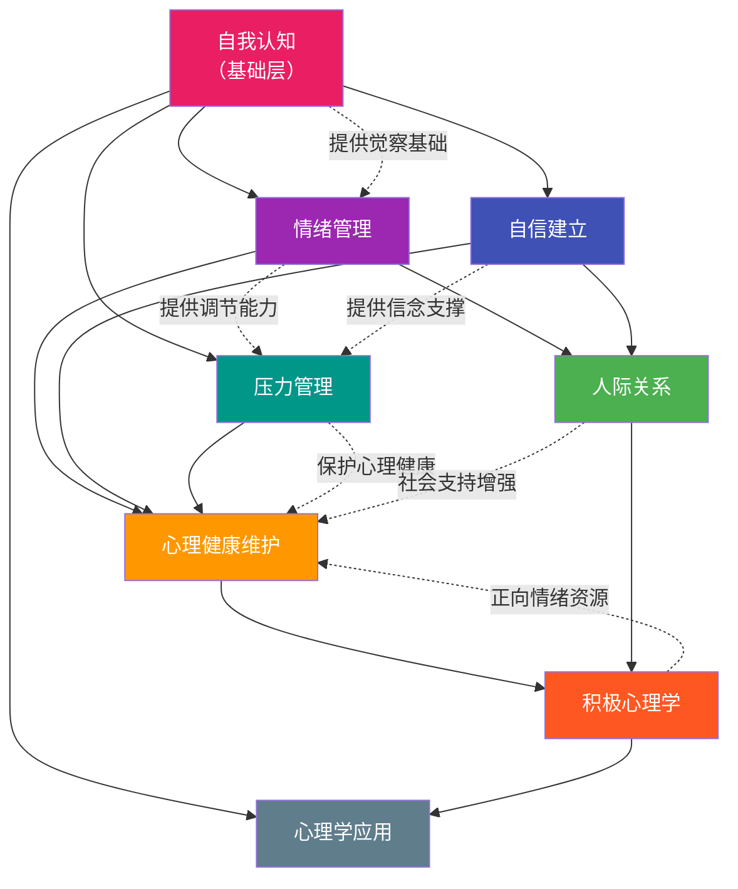

## 九、整合与持续实践

前面八个方案分别解决了心理学的不同面向：自我认知让你看清自己，情绪管理让你掌控内心波动，自信建立让你突破自我限制，压力管理让你在高压下保持效能，心理健康维护让你建立长期防护体系，人际关系心理学让你改善社会连接，积极心理学让你主动创造幸福，心理学在生活中的应用让你把知识转化为行动力。但如果这些方案各自为政、互不关联，效果会大打折扣——就像你买了全套健身器材却从不组合使用，最终每个器材都只发挥了十分之一的价值。

本章的目标是把八个方案编织成一套**统一的、可持续的日常操作系统**，让你不需要每次都"想起来才做"，而是自动运转。

### 9.1 为什么整合比单独练习重要 10 倍

#### 9.1.1 心理能力的"复利效应"

单独练习一个技能是线性增长，组合练习是指数增长。这不是比喻，而是有神经科学依据的：

**神经可塑性的协同机制**：大脑的不同心理功能共享同一套神经网络基础设施。当你练习正念呼吸（情绪管理）时，你同时在强化前额叶皮层的执行控制功能，而这个功能也会提升你在压力管理中的认知重评能力和自信建立中的冲动控制能力。伦敦出租车司机的海马体研究证明，持续的导航训练不仅增强了空间记忆，还提升了工作记忆和注意力——同一块脑区的增强会"溢出"到相关功能。

**习惯堆叠的杠杆效应**：行为科学中的"习惯堆叠"（Habit Stacking）原理表明，将新习惯绑定到已有习惯上，成功率比单独建立新习惯高出 2-3 倍（BJ Fogg, Stanford）。当你把感恩练习（积极心理学）绑定到已有的晚间正念（情绪管理）之后，两个习惯的坚持率都会提升——因为它们共享同一个"触发器"。

#### 9.1.2 各方案之间的支撑关系

下图展示了八个方案之间的核心依赖和增强关系：

**关键依赖链路**：

| 起点方案 | 终点方案 | 依赖关系说明 |
|---------|---------|------------|
| 自我认知 | 情绪管理 | 无法管理你无法识别的情绪。自我认知中的"情绪觉察"能力是情绪管理四步法的第一步 |
| 自我认知 | 自信建立 | 自信必须建立在准确的自我评估上。不了解自己的优势就无法建立真实的自信 |
| 情绪管理 | 压力管理 | 压力反应本质上是情绪反应。情绪调节能力不足时，认知重评和问题解决都无法启动 |
| 情绪管理 + 自信 | 人际关系 | 表达需求（情绪管理）和敢于说"不"（自信）是健康关系的两个基石 |
| 压力管理 | 心理健康维护 | 长期未管理的压力是心理健康的最大威胁。压力管理是心理健康的"第一道防线" |
| 人际关系 | 积极心理学 | 社会连接是幸福感的最强预测因子之一。孤立的积极思维无法替代真实的人际支持 |
| 积极心理学 | 心理学应用 | 正向情绪拓宽认知范围（Fredrickson 的拓展-建构理论），使你在决策、学习、创造中表现更好 |

**核心洞察**：自我认知是"地基"，情绪管理和自信建立是"承重墙"，压力管理和心理健康维护是"防护系统"，人际关系和积极心理学是"生活空间"，心理学应用是"屋顶"。地基不稳，上面的一切都会摇晃。

### 9.2 整合实践的时间架构

整合不是把所有练习堆在一起——那会让你每天花 3 小时在"心理训练"上，一周就会放弃。整合的关键是**用最少的时间杠杆撬动最大的效果**，核心策略是：高频微练习 + 中频深度练习 + 低频全面审计。

#### 9.2.1 每日实践（15-20 分钟）

每日练习的目标不是"深入"，而是"保持连接"——让心理技能像刷牙一样成为自动化行为。

**晨间启动（5 分钟）**

① 正念呼吸（2分钟）
   - 坐姿端正，闭眼
   - 关注鼻尖的空气流动感和胸腹的起伏
   - 思绪飘走时标记"想法"，温柔拉回
   - 这 2 分钟同时训练：情绪管理的觉察 + 自我认知的元注意力

② 意图设定（1分钟）
   - 问自己："今天我最想练习的心理技能是什么？"
   - 用一句话写下来（写在手机备忘录或便签上）
   - 示例："今天遇到冲突时，我先暂停 3 秒再回应"
   - 这一步同时训练：积极心理学的意图设定 + 心理学应用的目标导向

③ 身体快速扫描（2分钟）
   - 从头顶到脚趾，快速觉察身体各部位的状态
   - 特别关注：下巴（是否咬紧？）、肩膀（是否耸起？）、胃部（是否有紧缩感？）
   - 发现不适时，做一次深呼吸，想象呼气时放松那个部位
   - 这一步同时训练：自我认知的身体觉察 + 压力管理的早期预警

**日间练习（随时随地，每次 1-2 分钟）**

这些练习不需要专门时间，嵌入日常场景中即可：

| 触发场景 | 练习内容 | 训练的方案 | 耗时 |
|---------|---------|-----------|------|
| 收到让你不舒服的消息/邮件 | 情绪觉察四步法：命名情绪→定位身体→识别想法→选择回应 | 情绪管理 + 自我认知 | 1-2 分钟 |
| 需要做困难的事情之前 | 自信锚定：回忆一次你成功应对类似挑战的经历，感受当时的自信 | 自信建立 | 30 秒 |
| 感到压力或焦虑时 | 4-7-8 呼吸法：吸气 4 秒→屏气 7 秒→呼气 8 秒，重复 3 轮 | 压力管理 | 1 分钟 |
| 与人互动中感到不适 | 快速觉察："我现在在防御吗？我的需求是什么？对方的需求是什么？" | 人际关系 + 自我认知 | 30 秒 |
| 完成一项任务后 | 微感恩：想一件这件任务中让你感激的事情（可以很小） | 积极心理学 | 15 秒 |

**晚间复盘（8-10 分钟）**

① 情绪日记（5分钟）
   格式：
   ┌──────────────────────────────────────────┐
   │ 日期：____                                  │
   │ 今日最强情绪：____（强度：/10）                │
   │ 触发事件：____                               │
   │ 我的第一反应：____                            │
   │ 我的实际回应：____                            │
   │ 身体信号：____                               │
   │ 回顾：这个回应是我想要的吗？____               │
   │ 明天想改进的一点：____                         │
   └──────────────────────────────────────────┘
   
   这一步同时训练：情绪管理（觉察+记录）+ 自我认知（模式识别）+ 
                  心理学应用（复盘学习）

② 感恩练习（3分钟）
   写下今天 3 件感恩的事，要求：
   - 必须具体（不是"感谢家人"，而是"感谢妈妈今天打电话提醒我带伞"）
   - 至少 1 件是关于自己的（"感谢自己今天在会议上主动发言"）
   - 轮换领域，避免每天都是同样的类型
   
   这一步同时训练：积极心理学 + 自信建立（自我肯定）

③ 明日准备（2分钟）
   - 检查明天是否有高压场景需要准备（压力免疫预演）
   - 确认明日意图（可沿用今日，也可更新）

#### 9.2.2 每周深度练习（30-60 分钟）

每周选一个固定时间（推荐周日晚上），进行一次更深入的练习。八种方案轮流进行，每两周覆盖一轮：

| 周次 | 练习主题 | 具体内容 | 时长 |
|------|---------|---------|------|
| 第 1 周 | 自我认知深度练习 | 完成一次反思写作（晨间意识流 3 页）或向一人收集结构化反馈 | 30 分钟 |
| 第 2 周 | 自信阶梯挑战 | 选择一个中等难度的自信阶梯任务执行，并记录过程和结果 | 30-45 分钟 |
| 第 3 周 | 深度放松 | 渐进式肌肉放松（全身版）或正念冥想（20 分钟以上） | 30 分钟 |
| 第 4 周 | 人际关系建设 | 主动联系一位久未联系的朋友，进行一次深度对话；或练习一次非暴力沟通 | 45-60 分钟 |
| 第 5 周 | 积极心理学专题 | 完成 VIA 优势测评回顾，设计"优势运用计划"——本周每天刻意使用一个标志性优势 | 30 分钟 |
| 第 6 周 | 压力免疫训练 | 选择下周的一个高压场景，进行完整的事前预演（想象→应对策略→自我对话） | 30 分钟 |
| 第 7 周 | 心理健康自评 | 使用 PHQ-9 + GAD-7 进行标准化自评，对比上次结果 | 20 分钟 |
| 第 8 周 | 生活应用实验 | 设计并执行一个心理学行为实验（如测试一个决策偏误、尝试一种新的学习策略） | 45 分钟 |

**轮换的好处**：避免只练习自己擅长或舒服的领域。大多数人倾向于反复做正念呼吸（因为简单舒适）而回避反馈收集（因为有挑战性）。轮换机制确保你不会在薄弱环节上无限期拖延。

#### 9.2.3 每月系统审计（1-2 小时）

每月最后一个周末，进行一次全面的心理状态审计。这不是"打个分就完事"，而是有结构的深度回顾。

**月度审计模板**：

═══════════════════════════════════════
    月度心理状态审计表
    月份：____年____月
═══════════════════════════════════════

一、情绪趋势分析
   1. 本月最强的正面情绪是什么？出现频率如何？
   2. 本月最强的负面情绪是什么？触发因素有哪些？
   3. 与上月相比，情绪整体趋势是上升/平稳/下降？
   4. 我的情绪调节策略效果如何？哪些有效，哪些需要调整？

二、自信进展评估
   1. 本月完成了哪些自信阶梯任务？
   2. 哪些领域我感到更有信心了？
   3. 哪些领域仍然需要重点突破？
   4. 下月的自信挑战目标是什么？

三、压力源审计
   1. 本月主要压力源是什么？是持续性还是突发性？
   2. 我使用的应对策略效果如何？（评分 1-10）
   3. 是否有未处理的慢性压力需要关注？
   4. 下月可能的压力源有哪些？可以提前做什么准备？

四、心理健康检查
   1. 睡眠质量：____/10
   2. 精力水平：____/10
   3. 社交满意度：____/10
   4. 生活意义感：____/10
   5. PHQ-9 得分：____（上次：____）
   6. GAD-7 得分：____（上次：____）

五、人际关系状态
   1. 本月最重要的一段关系状态如何？
   2. 有没有需要修复或深化的关系？
   3. 我的人际边界是否健康？
   4. 是否有新的社交技能在练习中？

六、价值观一致性检查
   1. 回顾本月的时间分配：精力花在了我最重视的事情上吗？
   2. 有哪些"应该做"而非"想做"的事情占据了过多时间？
   3. 下月最想优先投入的一件事是什么？

七、整合技能评估
   对每个心理技能的熟练度评分（1-10）：
   ┌─────────────┬──────┬──────┬──────────┐
   │ 技能         │ 上月 │ 本月 │ 变化趋势  │
   ├─────────────┼──────┼──────┼──────────┤
   │ 情绪觉察     │      │      │          │
   │ 情绪调节     │      │      │          │
   │ 认知重构     │      │      │          │
   │ 自信表达     │      │      │          │
   │ 压力应对     │      │      │          │
   │ 正念能力     │      │      │          │
   │ 人际沟通     │      │      │          │
   │ 感恩与积极   │      │      │          │
   └─────────────┴──────┴──────┴──────────┘

八、下月行动计划
   1. 继续保持的：____
   2. 需要加强的：____
   3. 需要新引入的：____
   4. 需要放弃或减少的：____

#### 9.2.4 每季度深度复盘（半天）

每 3 个月进行一次深度复盘，这是最具战略价值的练习——它让你从"战术执行"层面抽身出来，审视"战略方向"是否正确。

**季度复盘五步法**：

步骤 1：数据回顾（30 分钟）
   - 翻阅 3 个月的情绪日记，找出反复出现的模式
   - 对比 3 次月度审计的评分变化趋势
   - 回顾 3 个月的行为实验结果

步骤 2：成就盘点（20 分钟）
   - 列出本季度最自豪的 5 个心理成长瞬间
   - 分析：这些成功背后的共同因素是什么？
   - 识别：我的"标志性优势"在哪些时刻发挥了作用？

步骤 3：挫折复盘（30 分钟）
   - 列出本季度最大的 3 个挫折或退步
   - 对每个挫折进行叙事重构（参考心理韧性章节的方法）
   - 提取教训：这些挫折暴露了我哪些需要加强的领域？

步骤 4：方向校准（30 分钟）
   - 评估当前的练习组合是否还适合你（生活阶段变化可能需要调整重点）
   - 选择下一个季度的核心聚焦领域（1-2 个，不要超过 3 个）
   - 设定季度关键结果（Key Results），如："情绪日记连续记录 80 天以上"

步骤 5：更新个人心理档案（20 分钟）
   - 更新人格测评结果（如果距离上次测评超过 6 个月）
   - 更新价值观排序（可能随生活阶段变化）
   - 更新优势和劣势清单
   - 写一段"给下季度的自己"的信

#### 9.2.5 年度全面评估与规划

每年进行一次最全面的心理成长评估。这不仅仅是"回顾"，更是重新定义你在心理层面"想成为谁"的时刻。

**年度评估核心内容**：

| 评估维度 | 具体内容 | 方法 |
|---------|---------|------|
| 人格变化 | 重做大五人格测评，对比年度变化 | IPIP-NEO 或 BFI-2 |
| 价值观演变 | 价值观排序是否发生了变化？哪些新增了？哪些淡化了？ | 价值观卡片排序 |
| 关系质量 | 核心关系（家人、伴侣、挚友）的质量变化 | 关系满意度评分 + 关键事件回顾 |
| 心理韧性 | 面对今年最大的挑战时，你的应对方式比去年进步了吗？ | 逆境应对复盘 |
| 幸福感基线 | 整体生活满意度、意义感、积极情绪比例 | 主观评分 + PERMA 模型评估 |
| 职业心理状态 | 工作意义感、倦怠程度、成长空间 | 职业满意度评估 |
| 身心连接 | 身体健康与心理健康的交互情况 | 身心健康综合评估 |

### 9.3 个性化调整框架

以上时间架构是一个"默认模板"，但每个人的起点、目标和生活节奏不同。盲目照搬别人的计划是坚持不下来的。以下是个性化调整的核心原则。

#### 9.3.1 识别你的"最短板"

心理学技能的整合遵循**木桶原理**：你的整体心理韧性取决于最弱的那一环。用以下方法找到它：

**快速短板诊断**：对以下 8 个维度各打 1 分（完全不擅长）到 10 分（非常擅长）：

① 情绪觉察与调节能力：____
② 自我认知准确性：____
③ 自信心水平：____
④ 压力应对效能：____
⑤ 心理健康状态：____
⑥ 人际关系质量：____
⑦ 生活满意度和意义感：____
⑧ 将心理学知识转化为行动的能力：____

得分最低的 1-2 个维度就是你的"最短板"。

**调整策略**：

| 最短板 | 优先练习方案 | 每日增量建议 |
|--------|------------|------------|
| 情绪觉察与调节 | 情绪管理 | 每日增加 2 次情绪觉察练习（每次 1 分钟） |
| 自我认知准确性 | 自我认知 | 每周增加一次反思写作或反馈收集 |
| 自信心水平 | 自信建立 | 每日执行一个微自信任务 |
| 压力应对效能 | 压力管理 | 在压力触发时强制使用 4-7-8 呼吸法 |
| 心理健康状态 | 心理健康维护 | 优先改善睡眠+运动+社会连接 |
| 人际关系质量 | 人际关系 | 每周增加一次深度社交互动 |
| 生活满意度 | 积极心理学 | 每日增加感恩练习和优势运用 |
| 知识转化能力 | 心理学应用 | 每周设计一个小型行为实验 |

**重要原则**：最短板优先，但不要完全放弃其他领域。每天的最低标准（晨间 5 分钟 + 晚间 8 分钟）确保所有技能都保持"温热状态"，然后把额外的时间投入到最短板上。

#### 9.3.2 根据生活阶段调整重点

不同的人生阶段面临不同的心理挑战，练习重点应该相应调整：

| 生活阶段 | 核心心理挑战 | 优先方案 | 调整建议 |
|---------|------------|---------|---------|
| 职场新人（22-28 岁） | 身份转换、冒名顶替综合征、社交焦虑 | 自信建立 + 人际关系 | 加大自信阶梯练习频率，重点练习职场社交 |
| 职业上升期（28-35 岁） | 高压竞争、工作生活平衡、关系维护 | 压力管理 + 心理健康维护 | 加强压力免疫训练，确保睡眠和运动不被牺牲 |
| 人生转折期（换工作/分手/搬家等） | 不确定性、自我怀疑、丧失感 | 心理韧性 + 自我认知 | 重点练习叙事重构，增加自我认知练习频率 |
| 中年反思期（35-45 岁） | 意义危机、角色冲突、代际压力 | 积极心理学 + 自我认知 | 做深度价值观审计，重新定义人生目标 |
| 稳定发展期（45 岁+） | 意义感、传承、接纳 | 积极心理学 + 心理健康维护 | 关注超越性需求（贡献、传承、灵性） |

#### 9.3.3 "最小可行实践"——坚持不下去时的应急方案

有些时候你会崩溃——工作太忙、情绪太差、生活中出了大事——这时不要想着"保持完整计划"，而是切换到**最小可行实践**（Minimum Viable Practice, MVP）：

MVP 模式（每天只需 5 分钟）：

早上 2 分钟：
  → 3 次深呼吸 + 问自己"今天最重要的一件事是什么？"

晚上 3 分钟：
  → 写下 1 件今天感恩的事 + 1 个今天的情绪（不用分析，只命名）

持续时间：
  → 直到你恢复到可以执行完整计划的状态

关键心态：
  → MVP 不是"偷懒"，而是"保护习惯不断裂"
  → 连续 5 天的 MVP 胜过做 1 天完整计划然后中断 2 周
  → 研究表明，习惯中断超过 2 天，坚持率会显著下降

### 9.4 效果追踪与自我评估

#### 9.4.1 量化追踪指标

"感觉变好了"不够精确——你需要可量化的指标来判断心理成长是否真的在发生。以下是经过验证的追踪指标体系：

**核心指标（建议每月追踪）**：

| 指标 | 测量方式 | 评估频率 | 进步标志 |
|------|---------|---------|---------|
| 情绪觉察速度 | 从情绪事件发生到你意识到自己的情绪，平均需要多久？ | 每月自评 | 从"几小时后"到"几分钟内" |
| 情绪恢复时间 | 负面情绪从高峰恢复到基线水平，平均需要多久？ | 每月自评 | 从"几天"到"几小时" |
| 认知重构成功率 | 面对负面自动思维时，能成功替换为替代想法的比例 | 每周统计 | 从 20% 提升到 60% 以上 |
| 自信行为频率 | 每周主动做"让我有点紧张但想做"的事情次数 | 每周记录 | 从 0-1 次到 3-5 次 |
| 压力应对满意度 | 面对压力时，对自己应对方式的满意度（1-10） | 每次压力事件后 | 从 3-4 分到 7-8 分 |
| 正念连续天数 | 连续进行正念练习的天数 | 每日打卡 | 从 3-5 天到 21 天以上 |
| 人际关系满意度 | 对核心关系的满意度评分（1-10） | 每月自评 | 逐步提升 |
| 积极情绪比例 | 正面情绪事件数 / 总情绪事件数 | 每月统计 | 从 30% 提升到 50% 以上 |

**进阶指标（建议每季度追踪）**：

| 指标 | 测量方式 | 评估频率 |
|------|---------|---------|
| 生活满意度 | SWLS（生活满意度量表，5 道题） | 每季度 |
| 心理韧性 | CD-RISC-10（心理韧性量表，10 道题） | 每季度 |
| 抑郁风险 | PHQ-9（9 道题） | 每季度 |
| 焦虑水平 | GAD-7（7 道题） | 每季度 |
| 自我效能感 | GSES（一般自我效能感量表，10 道题） | 每季度 |

#### 9.4.2 "心理成长曲线"——理解非线性进步

心理成长不是线性的，它更像这个模式：

典型心理成长曲线：

效能 │
     │                                    ___________
     │                               ____/
     │                          ____/
     │                     ____/      ← 稳定期：技能内化
     │                ____/
     │           ____/
     │       ___/
     │     _/    ← 瓶颈期：感觉没进步（正常！）
     │    /
     │   |  ← 快速进步期：新鲜感 + 新技能
     │  /
     │ / ← 初始期：可能感觉更差（因为你开始觉察到以前忽略的问题）
     │/
     └──────────────────────────────────────── 时间

**四个关键节点的理解**：

**节点 1：初始期的"变差感"**——开始练习情绪觉察后，你可能觉得"我怎么有这么多负面情绪"。真相是：不是情绪变多了，而是你终于注意到它们了。这是进步，不是退步。就像开灯后看到房间里的灰尘——灰尘一直在那里，只是你以前看不见。

**节点 2：快速进步期的兴奋**——前 2-4 周通常会体验到明显改善。利用这个窗口期建立核心习惯，因为当新鲜感消退后，习惯的"自动化"程度决定了你能否坚持。

**节点 3：瓶颈期的挫败感**——通常出现在第 4-8 周，你会觉得"好像没什么进步了"。这是正常的技能内化阶段，就像学外语的"中间高原"——表面上没进步，底层神经网络正在重新组织。突破瓶颈的方法：换一种练习方式、增加难度、或暂时休息 2-3 天。

**节点 4：稳定期的自动化**——技能开始"不需要想就能用"。这意味着正念觉察、情绪调节、认知重构等能力已经从"刻意练习"变成了"自动反应"。这个阶段通常出现在持续练习 3-6 个月之后。

### 9.5 常见失败模式与应对策略

#### 9.5.1 五种最常见的失败模式

根据行为改变研究和实际经验，以下是人们在心理成长中最容易掉入的陷阱：

**失败模式 1：完美主义陷阱**

表现：
  "我今天没时间做完整练习，算了，今天不做"
  "我漏了 3 天，之前的努力白费了，重新开始吧"
  "正念练习时我又走神了，我不适合这个"

真相：
  习惯研究（Phillippa Lally, 2009）表明，偶尔中断不会破坏习惯。
  一个习惯的平均形成时间是 66 天，且允许不规律。
  "全有或全无"思维本身就是一种认知偏误（分裂思维）。

应对：
  → 采用"两天规则"：允许自己最多跳过一天，但绝不连续跳过两天
  → 记住公式：做得少 > 什么都不做
  → 把"完美执行"的目标替换为"最低限度执行"

**失败模式 2：信息消费代替行动**

表现：
  读了 10 本心理学书但从不做练习
  收藏了 50 篇关于正念的文章但从没坐下冥想过
  做了 3 个人格测评但从不根据结果行动

真相：
  心理学知识和心理学能力之间存在巨大的"知行鸿沟"。
  你知道"应该深呼吸"和你在愤怒时真的能深呼吸，是两件完全不同的事。

应对：
  → 每读完一个知识点，立刻设计一个 5 分钟的实践练习
  → 采用"1:1 法则"：花 1 小时阅读，必须花 1 小时实践
  → 减少信息摄入，增加练习时间

**失败模式 3：只在痛苦时才想起练习**

表现：
  心情好的时候从不做正念练习
  只有焦虑发作时才想起做呼吸练习
  关系出问题了才想到学非暴力沟通

真相：
  心理技能是"肌肉"，需要在平时锻炼，才能在高压时刻调用。
  你在焦虑发作时才第一次尝试 4-7-8 呼吸法，效果几乎为零。

应对：
  → 在好的时候也练习——这叫"预防性心理训练"
  → 把练习绑定到日常固定时间，而非绑定到情绪状态
  → 设定"无论心情如何都做"的最低标准

**失败模式 4：忽视身体基础**

表现：
  每天练习正念 30 分钟但长期睡眠不足
  做了大量认知重构但从不运动
  学了很多情绪管理技巧但饮食极不规律

真相：
  心理健康建立在生理基础之上。睡眠不足会直接损害前额叶功能，
  使情绪调节、冲动控制和认知重评全部失效。
  研究表明，一晚睡眠不足对情绪的影响等同于血液酒精浓度 0.05%。

应对：
  → 优先级排序：睡眠 > 运动 > 营养 > 心理练习
  → 如果只能做一件事，选择"今晚早睡 30 分钟"
  → 把运动本身当作一种心理练习（运动产生内啡肽、改善情绪、降低焦虑）

**失败模式 5：孤军奋战**

表现：
  从不告诉任何人自己在做心理成长练习
  所有练习都是独自完成
  遇到困难时也不寻求帮助

真相：
  社会支持是行为改变最重要的保护因素之一。
  有"问责伙伴"的人，习惯坚持率比独自练习的人高出约 65%。

应对：
  → 找一个"成长伙伴"——不一定是亲密朋友，可以是同样在学习心理学的人
  → 加入心理学学习社群（线上或线下）
  → 定期和伙伴分享进展和困难
  → 如果条件允许，考虑找心理咨询师做定期督导

#### 9.5.2 失败恢复协议

当发现自己掉入了上述陷阱，按以下步骤恢复：

第一步：自我同情（不要自我批判）
  → 对自己说："这很正常。行为改变本来就会反复。"
  → 回忆：你之前的每一次练习都不是白费的，神经通路仍在

第二步：分析原因
  → 是什么触发了退步？（疲劳？压力事件？环境变化？）
  → 这个原因是否需要调整练习计划？

第三步：选择重新入口
  → 不要试图"补回"错过的练习
  → 直接从今天开始，用 MVP 模式重新启动

第四步：调整系统
  → 如果反复掉入同一个陷阱，说明系统有问题，不是你有问题
  → 降低难度、减少数量、更换方法、增加社会支持

### 9.6 从"做练习"到"成为这样的人"——心理技能的内化路径

#### 9.6.1 内化的四个阶段

所有心理技能的掌握都经历四个阶段（改编自 Dreyfus 技能获取模型）：

| 阶段 | 特征 | 表现 | 持续时间 |
|------|------|------|---------|
| **新手期** | 依赖规则和步骤 | "我需要看情绪日记模板才知道怎么记" | 1-4 周 |
| **进阶者** | 开始理解原理 | "我知道为什么要做感恩练习——它在训练注意力偏向" | 1-3 个月 |
| **胜任期** | 能灵活应变 | "今天情况特殊，我调整了练习方式但核心没变" | 3-12 个月 |
| **精通期** | 自动化、无意识 | "我已经自然地在觉察情绪，不需要提醒自己" | 1 年以上 |

**关键洞察**：从新手到精通的路径不是"练得更多"，而是**在不同情境中反复应用同一技能**。就像学开车——在驾校练习 100 次倒库不如在真实道路上开 10 种不同路况。心理技能也一样：在平静时练习正念是"驾校练习"，在争吵中保持觉察才是"真实路况"。

#### 9.6.2 从刻意练习到自然反应的转化策略

**策略 1：设置"心理触发器"**

在日常环境中设置提醒物，让心理练习"自动弹出"：

| 触发器 | 绑定的练习 | 原理 |
|--------|-----------|------|
| 手机解锁时 | 一次深呼吸 + 检查当前情绪 | 高频动作绑定微练习 |
| 开会前 | 快速自信锚定 + 意图设定 | 高压场景前的准备 |
| 睡前关灯后 | 身体扫描 + 感恩回顾 | 固定睡前仪式 |
| 看到红色物品时 | 暂停 + 觉察身体感受 | 随机触发器打破自动化 |
| 进入家门时 | "角色切换"仪式：工作模式→家庭模式 | 场景转换时的意识切换 |

**策略 2："如果-那么"执行意图**

心理学家 Peter Gollwitzer 的研究表明，制定"如果-那么"计划（Implementation Intention）可以将行为执行率从 22% 提升到 62%。格式为：

"如果 [特定情境发生]，那么我就 [执行特定的应对行为]"

示例：
"如果我感到焦虑开始升级，那么我就做 3 轮 4-7-8 呼吸"
"如果有人批评我让我想反击，那么我就先说'谢谢你的反馈，我需要想想'"
"如果我发现自己在想'我做不到'，那么我就回忆上次成功做到的经历"
"如果到了晚上 11 点我还没做晚间复盘，那么我就只做 3 分钟的 MVP 版本"

**策略 3：创建个人"心理应急手册"**

把你最有效的心理工具整理成一本随身手册——可以是手机备忘录、小卡片、或一页 A4 纸。目的是：在情绪高涨、认知资源被占用的时刻，你不需要"想起来该用什么方法"，只需要打开手册"照做"。

┌─────────────────────────────────────────┐
│         我的心理应急手册                  │
├─────────────────────────────────────────┤
│                                         │
│ 当我焦虑时：                              │
│   1. 4-7-8 呼吸 × 3 轮                  │
│   2. 5-4-3-2-1 接地练习                  │
│      （说出 5 个看到的、4 个摸到的、       │
│       3 个听到的、2 个闻到的、1 个尝到的）  │
│   3. 问自己："最坏会怎样？我能应对吗？"    │
│                                         │
│ 当我愤怒时：                              │
│   1. 暂停。离开现场。                     │
│   2. 冷水洗脸或握冰块 30 秒               │
│   3. 写下我的感受，不发送                 │
│   4. 30 分钟后再决定如何回应               │
│                                         │
│ 当我自我否定时：                           │
│   1. 识别认知偏误类型（通常是灾难化/       │
│      以偏概全/读心术）                    │
│   2. 写下自动思维，然后写替代想法           │
│   3. 回忆 3 个我做得好的时刻               │
│                                         │
│ 当我感到孤独/孤立时：                      │
│   1. 给一个人发消息（不用等回复）           │
│   2. 出门散步，观察周围的人                │
│   3. 做一件对自己友善的小事                │
│                                         │
│ 当我感到无力/倦怠时：                      │
│   1. 不要求自己做大事，只做最小的事         │
│   2. 起身活动 5 分钟                      │
│   3. 回顾我的"为什么"——我做这些是为了什么  │
│                                         │
└─────────────────────────────────────────┘

### 9.7 长期视角：心理成长是一生的工程

#### 9.7.1 接受"永远不会有终点"这个事实

心理成长不是一个"完成了"的项目。你不会有那么一天醒来发现"我已经完全了解自己了，所有情绪都能完美管理了"。这不是一个令人沮丧的事实——恰恰相反，它意味着你永远都有成长的空间，生活永远都在变得更丰富。

**心理学家 Abraham Maslow 的原话**："一个人能够成为什么，他就必须成为什么。"（What a man can be, he must be.）这种"自我实现"的驱动力不是外在的目标，而是内在的持续拉力。

#### 9.7.2 不同人生阶段的心理成长主题

| 人生阶段 | 核心心理任务 | 重点练习 |
|---------|------------|---------|
| 20-30 岁 | 建立身份、探索可能性、学会独立 | 自我认知 + 自信建立 + 人际关系 |
| 30-40 岁 | 深化承诺、管理多重角色、应对竞争压力 | 压力管理 + 情绪管理 + 心理健康维护 |
| 40-50 岁 | 重新评估意义、处理中年危机、传承经验 | 积极心理学 + 自我认知（价值观审计） |
| 50 岁以上 | 接纳、智慧、超越性追求 | 积极心理学 + 心理健康维护 + 人际关系深化 |

#### 9.7.3 你的最终目标：建立个人心理管理框架

经过长期的学习和实践，你最终应该发展出一套**属于自己的**心理管理框架——不是照搬任何一本书或一个课程的内容，而是融合了你的经验、价值观和人格特点的独特体系。

这个框架应该回答以下问题：

一、我是谁？（自我认知）
   → 我的核心价值观是什么？
   → 我的优势和局限是什么？
   → 我的人格特点如何影响我的行为？

二、我如何处理内心世界？（情绪管理 + 心理健康）
   → 我的情绪模式是什么？
   → 我最有效的情绪调节策略有哪些？
   → 我的心理健康底线在哪里？什么时候需要寻求帮助？

三、我如何应对外部挑战？（压力管理 + 自信）
   → 我的压力反应模式是什么？
   → 我的"压力免疫"策略有哪些？
   → 我在哪些领域有自信，哪些领域需要加强？

四、我如何与他人连接？（人际关系）
   → 我的关系模式是什么？（依恋风格、沟通偏好）
   → 我的人际边界在哪里？
   → 我如何处理冲突和分歧？

五、我如何创造有意义的生活？（积极心理学 + 应用）
   → 什么让我感到真正的幸福（而非快感）？
   → 我如何将心理学知识应用到决策、学习、创造中？
   → 我的人生目标和日常行动是否一致？

### 9.8 本章小结

整合与持续实践的核心理念可以用一句话概括：**心理成长不是一个额外的"任务"，而是一种生活的"方式"**。

当你的情绪觉察成为本能，当认知重构成为自动反应，当感恩成为看待世界的默认视角，当自信成为你面对挑战的第一反应——你就不再需要"做心理练习"了，因为你已经"成为"了一个有心理素养的人。

> "认识自己，是一切智慧的开始。"——苏格拉底

> "知人者智，自知者明。"——《道德经》

通过系统学习和实践心理学知识，你不仅能更好地理解自己，还能更智慧地应对生活中的挑战，建立更健康的人际关系，创造更有意义的人生。这个过程没有终点，但每一步都值得庆祝。对自己保持耐心，接受偶尔的退步，记住：每一次练习，无论结果如何，都是在重塑你的大脑和心理模式。
