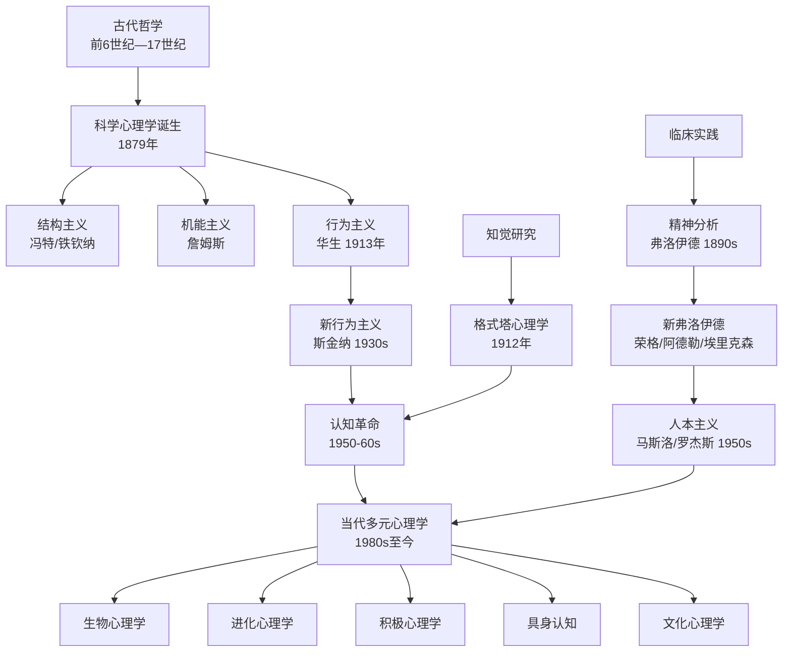

## 一、心理学的历史与发展

心理学是一门研究人类心理现象及其影响下的精神功能和行为活动的科学。它既古老又年轻——说它古老，是因为人类对心灵的追问与文明同步；说它年轻，是因为它作为一门独立实验科学的历史不过一百五十年。理解心理学的发展脉络，不仅是学习这门学科的起点，更是理解"我们如何看待自己"这一根本问题的钥匙。

### 1.1 前科学时代：哲学中的心理学萌芽

在心理学成为独立学科之前，人类对心灵的思考已经持续了数千年。这些思考散布在哲学、宗教、医学和文学之中，构成了心理学的"史前史"。

#### 1.1.1 西方哲学传统

**古希腊时期（公元前6世纪—公元前3世纪）**：

古希腊是西方心理学思想的摇篮。三位哲学家的贡献尤为深远：

- **苏格拉底（Socrates，公元前469—前399年）**：提出"认识你自己"的命题，开创了对自我认知的哲学追问。他的"精神助产术"（问答法）通过不断追问帮助人澄清思维，这与现代认知行为疗法中的苏格拉底式提问有直接渊源。
- **柏拉图（Plato，公元前427—前347年）**：提出灵魂三分说——理性（头脑）、意志（胸部）、欲望（腹部），认为灵魂是不朽的，知识是灵魂对理念世界的"回忆"。这一思想影响了后来弗洛伊德的本我、自我、超我三重人格结构理论。
- **亚里士多德（Aristotle，公元前384—前322年）**：撰写了西方第一部系统论述心理现象的著作《论灵魂》（De Anima）。他反对柏拉图的灵魂不朽论，认为灵魂与身体不可分离，是身体的"形式"。他详细讨论了感觉、记忆、想象、思维等心理过程，提出了联想律（接近律、相似律、对比律），这些思想在两千年后被行为主义心理学重新发现。

**中世纪与文艺复兴**：

- **托马斯·阿奎那（Thomas Aquinas，1225—1274年）**：将亚里士多德的心理学与基督教神学融合，区分了感觉灵魂和理性灵魂。
- **笛卡尔（René Descartes，1596—1650年）**：提出"我思故我在"，确立了心身二元论——心灵和身体是两种不同的实体。这一观点虽然在哲学上备受争议，但它清晰地提出了"心理现象与物理现象有何关系"这一问题，成为心理学的核心议题之一。
- **约翰·洛克（John Locke，1632—1704年）**：提出"白板说"（Tabula Rasa），认为人生来没有先天观念，一切知识来自经验。这为后来的经验主义心理学和行为主义提供了哲学基础。

#### 1.1.2 东方思想传统

中国古代哲学对心灵的探讨同样深刻，且与西方有着截然不同的取向——西方倾向于将心灵作为客观对象来分析，而东方更注重心灵的修养和转化。

**儒家**：

- **孔子（公元前551—前479年）**：提出"性相近也，习相远也"，承认人的天性相近，但后天环境和教育造成差异。他强调"仁"的心理基础——"己所不欲，勿施于人"要求站在他人角度理解其心理状态，这实质上是一种共情能力的训练。
- **孟子（公元前372—前289年）**：主张"性善论"，提出"四端"——恻隐之心（仁之端）、羞恶之心（义之端）、辞让之心（礼之端）、是非之心（智之端）。这四种心理倾向是先天的道德萌芽，需要后天培养才能发展为完整的品德。这一观点与现代进化心理学中"道德直觉是先天的"这一发现有惊人的相似。
- **荀子（公元前313—前238年）**：主张"性恶论"，认为人的天性趋利避害，需要通过"礼义"来矫正。这一观点与行为主义的环境塑造论有相通之处。

**道家**：

- **老子**：提出"致虚极，守静笃"，强调通过清空心灵来达到与道合一的状态。这与现代正念冥想的核心理念高度一致。
- **庄子**：通过"庄周梦蝶"等寓言探讨意识的本质，提出"齐物论"——万物在道的层面上是平等的。这种去中心化的视角挑战了人类以自我为中心的认知偏见。

**佛学**：

- **唯识学**：将意识分为八识——眼、耳、鼻、舌、身（前五识）、意识（第六识）、末那识（第七识，执着于"我"）、阿赖耶识（第八识，储藏一切种子）。这一精密的意识分析体系比弗洛伊德的潜意识理论早了一千多年，且在精细程度上毫不逊色。
- **禅宗**：强调"直指人心，见性成佛"，通过公案（如"什么是你本来面目？"）打破惯性思维模式。这与格式塔心理学中"顿悟"的概念有异曲同工之妙。

**印度瑜伽**：

- **帕坦伽利的《瑜伽经》**：系统描述了心灵的五种状态（心念、正知、睡眠、记忆、昏沉），以及通过八支瑜伽逐步控制心灵的方法。这是世界上最早的系统性"心理训练手册"之一。

> **东西方心理学思想的核心差异**：西方传统将心灵视为需要认识的"对象"，倾向于分析和还原；东方传统将心灵视为需要转化的"主体"，倾向于整合和超越。现代心理学正在融合这两种视角——既需要科学的分析方法，也需要实践的转化智慧。

### 1.2 科学心理学的诞生（1879—1900年）

#### 1.2.1 从哲学到科学的跨越

19世纪下半叶，三股力量推动心理学从哲学中独立出来：

1. **实验生理学的发展**：赫尔姆霍茨（Helmholtz）测量了神经传导速度，证明心理过程可以被精确测量。费希纳（Fechner）创立了心理物理学，建立了物理刺激与心理感受之间的数学关系。
2. **进化论的冲击**：达尔文1859年出版《物种起源》，提出人与动物在心理上存在连续性，这为比较心理学和动物行为研究奠定了基础。
3. **科学方法论的成熟**：实证主义思潮要求一切知识必须建立在可观察、可重复的实验基础之上。

#### 1.2.2 冯特与实验心理学

**威廉·冯特（Wilhelm Wundt，1832—1920年）**：

1879年，冯特在德国莱比锡大学建立了世界上第一个心理学实验室，这被公认为科学心理学诞生的标志。

- **研究方法**：内省法（Introspection）——训练有素的被试在严格控制的条件下报告自己的即时体验。例如，呈现一个视觉刺激后，被试报告自己看到了什么颜色、形状、产生了什么感受。
- **研究内容**：主要研究感觉、知觉、注意、反应时等基本心理过程。
- **局限**：内省法的主观性和不可重复性使其科学性受到质疑。不同实验室的内省报告常常相互矛盾。

#### 1.2.3 结构主义与机能主义的对立

心理学独立之初，就出现了两种截然不同的研究取向：

| 维度 | 结构主义（Structuralism） | 机能主义（Functionalism） |
|------|--------------------------|--------------------------|
| 代表人物 | 铁钦纳（Edward Titchener） | 威廉·詹姆斯（William James） |
| 核心问题 | 意识由哪些基本元素构成？ | 意识的功能和目的是什么？ |
| 研究方法 | 内省法——分解意识的基本成分 | 观察法、比较法、实验法 |
| 隐喻 | 意识像化学——可以分解为元素 | 意识像生物器官——有适应功能 |
| 代表作 | 铁钦纳《实验心理学》 | 詹姆斯《心理学原理》（1890年） |
| 影响 | 开创实验方法，但过于封闭 | 扩大心理学研究范围，影响教育心理学和应用心理学 |

**威廉·詹姆斯的特殊贡献**：

詹姆斯在1890年出版的《心理学原理》是心理学史上最重要的著作之一。他提出了许多至今仍有影响力的概念：

- **意识流（Stream of Consciousness）**：意识不是静止的元素组合，而是连续流动的过程。这一概念不仅影响了心理学，还深刻影响了文学（如乔伊斯、伍尔夫的意识流小说）。
- **习惯**：将习惯定义为"社会的巨大飞轮"，认为习惯是节省心理能量的自动化行为模式。这一观点至今仍是习惯研究的理论基础。
- **情绪的身体理论（詹姆斯-兰格理论）**：不是因为悲伤才哭，而是因为哭才悲伤——身体反应先于情绪体验。虽然这一理论后来被修正，但它开创了情绪的生理基础研究。

### 1.3 精神分析学派（1890s—1950s）

#### 1.3.1 弗洛伊德与精神分析的创立

**西格蒙德·弗洛伊德（Sigmund Freud，1856—1939年）**是心理学史上最具影响力也最具争议的人物。他在维也纳通过临床实践创立了精神分析学派，彻底改变了人类对自身心灵的理解。

**核心理论**：

**（1）潜意识理论**：弗洛伊德提出心灵的冰山模型——意识只是心灵的冰山一角，大部分心理活动发生在潜意识之中。潜意识包含被压抑的记忆、欲望和冲突，它们虽然不被意识到，却持续影响着人的行为、情感和梦境。

**（2）人格结构理论**：

| 结构 | 运作原则 | 功能 | 举例 |
|------|---------|------|------|
| 本我（Id） | 快乐原则 | 即时满足原始欲望 | 婴儿饿了就哭，不考虑场合 |
| 自我（Ego） | 现实原则 | 在现实中协调本我与超我的需求 | 成年人感到饥饿但等到午饭时间再吃 |
| 超我（Superego） | 道德原则 | 内化的社会规范和道德标准 | 即使很想要某样东西，也不去偷窃 |

**（3）心理性发展阶段**：

弗洛伊德认为人格在生命早期通过五个阶段形成，每个阶段的心理冲突如果没有得到适当解决，就会产生"固着"，影响成年后的人格：

- 口唇期（0—1岁）：满足来自口腔活动。固着可能导致成年后的过度依赖或口唇习惯（如咬指甲、抽烟）。
- 肛门期（1—3岁）：满足来自排泄控制。固着可能导致过度洁癖或过度散漫。
- 性器期（3—6岁）：出现俄狄浦斯/厄勒克特拉情结。固着可能导致成年后的权威关系问题。
- 潜伏期（6—12岁）：性冲动暂时压抑，精力转向学习和社交。
- 生殖期（青春期后）：性冲动重新出现，形成成熟的亲密关系能力。

**（4）防御机制**：自我用来应对焦虑和内心冲突的无意识策略：

- **压抑**：将痛苦的记忆或欲望推入潜意识。例如，童年创伤的记忆被遗忘。
- **投射**：将自己不可接受的欲望归咎于他人。例如，自己有攻击性却觉得别人总在针对自己。
- **合理化**：为不可接受的行为找合理的借口。例如，考试失败后说"我本来就不在乎成绩"。
- **升华**：将不被社会接受的冲动转化为建设性活动。例如，攻击性冲动转化为竞技体育的动力。
- **否认**：拒绝承认令人痛苦的现实。例如，亲人去世后坚称"他没有死"。
- **退行**：在压力下退回到早期发展阶段的行为模式。例如，成年人在压力下像孩子一样哭泣。

**（5）梦的解析**：弗洛伊德在1900年出版的《梦的解析》中提出，梦是"通往潜意识的康庄大道"。梦的显内容（表面故事）背后隐藏着梦的隐内容（被压抑的欲望），通过"梦的工作"（凝缩、移置、象征化）伪装成可以被接受的形式。

**弗洛伊德的贡献与局限**：

- **贡献**：开创了心理治疗的先河，发现了潜意识对行为的深刻影响，提出了防御机制、移情、阻抗等至今仍在使用的概念。
- **局限**：理论难以实证验证，过度强调性驱力，样本局限于维也纳中上层神经症患者，存在性别偏见。

#### 1.3.2 新弗洛伊德学派

弗洛伊德的追随者们在继承其基本框架的同时，发展出了各自的修正理论：

**卡尔·荣格（Carl Jung，1875—1961年）**：

- 提出集体无意识概念——人类共享的深层心理结构，其中包含各种原型（如阴影、阿尼玛/阿尼姆斯、自性）。
- 将人格分为内倾和外倾两种态度类型，并结合思维、情感、感觉、直觉四种功能提出了八种人格类型（后发展为MBTI的基础）。
- 强调个体化过程——一个人整合意识与无意识、阴影与人格面具，成为完整自我的终身发展过程。

**阿尔弗雷德·阿德勒（Alfred Adler，1870—1937年）**：

- 创立个体心理学，强调自卑感是人格发展的核心动力。
- 提出"自卑与补偿"理论：每个人在童年都体验到自卑（因为身体弱小、依赖成人），健康的补偿是追求优越和完善，不健康的补偿是自卑情结（退缩、逃避）。
- 提出生命风格（Life Style）概念——个体在4—5岁时形成的基本生活态度和行为模式。
- 强调社会兴趣（Social Interest）——关心他人和社会福祉的倾向，是心理健康的重要指标。

**埃里克·埃里克森（Erik Erikson，1902—1994年）**：

- 将弗洛伊德的心理性发展阶段扩展为八阶段心理社会发展理论，覆盖从出生到死亡的整个生命周期。
- 每个阶段都有一个核心冲突需要解决：信任vs不信任（婴儿期）、自主vs羞耻（幼儿期）、主动vs内疚（学龄前）、勤奋vs自卑（学龄期）、同一性vs角色混乱（青春期）、亲密vs孤独（青年期）、繁殖vs停滞（中年期）、整合vs绝望（老年期）。

### 1.4 行为主义学派（1913—1960s）

#### 1.4.1 行为主义的兴起

20世纪初，行为主义作为对精神分析和内省心理学的反叛而兴起。它主张心理学只应研究可观察的行为，而非不可观察的意识或潜意识。

#### 1.4.2 经典条件反射

**伊万·巴甫洛夫（Ivan Pavlov，1849—1936年）**：

巴甫洛夫在研究狗的消化功能时，意外发现了经典条件反射现象。他发现狗不仅在食物出现时分泌唾液，甚至在看到喂食的实验者时就开始分泌唾液。

**核心机制**：

无条件刺激（食物） → 无条件反应（唾液分泌）
条件刺激（铃声） + 无条件刺激（食物） → 无条件反应（唾液分泌）
——经过多次配对——
条件刺激（铃声） → 条件反应（唾液分泌）

**关键概念**：
- **习得**：条件刺激与无条件刺激反复配对，条件反应逐渐建立的过程。
- **消退**：条件刺激反复单独出现而不伴随无条件刺激，条件反应逐渐减弱。
- **泛化**：与条件刺激相似的刺激也能引起条件反应。例如，对白鼠产生恐惧的婴儿，对白色毛绒玩具也产生恐惧。
- **分化**：通过只对特定刺激强化，学会区分不同刺激。

**日常应用举例**：
- 恐惧症的形成：一次被狗咬的经历（无条件刺激）可能让人对所有狗产生恐惧（条件反应），即使后来遇到的狗很温顺。
- 品牌联想：广告反复将产品（条件刺激）与积极情感（无条件刺激，如性感形象、快乐场景）配对，让消费者对产品产生积极感受。
- 味觉厌恶：一次食物中毒的经历就可能让人永远厌恶某种食物（"加西亚效应"），因为进化使我们的味觉系统对有毒食物特别敏感。

#### 1.4.3 操作条件反射

**B.F.斯金纳（B.F. Skinner，1904—1990年）**：

斯金纳系统研究了行为后果对行为频率的影响，即操作条件反射。他设计了著名的"斯金纳箱"——一个带有杠杆和食物分配器的实验装置，通过观察动物按压杠杆的行为来研究强化和惩罚的效果。

**核心机制**：

| 类型 | 定义 | 效果 | 举例 |
|------|------|------|------|
| 正强化 | 行为后出现愉悦刺激 | 增加行为频率 | 做完作业后可以玩游戏 |
| 负强化 | 行为后移除厌恶刺激 | 增加行为频率 | 系安全带后恼人的警报声消失 |
| 正惩罚 | 行为后出现厌恶刺激 | 减少行为频率 | 闯红灯后收到罚单 |
| 负惩罚 | 行为后移除愉悦刺激 | 减少行为频率 | 打架后被没收游戏机 |

**强化程序及其效果**：

| 程序 | 规则 | 行为模式 | 现实例子 |
|------|------|---------|---------|
| 固定比率 | 每N次行为给予强化 | 高频率，短暂暂停 | 计件工资 |
| 可变比率 | 平均每N次行为给予强化 | 最高频率，极难消退 | 赌博、抽奖 |
| 固定间隔 | 每隔T时间给予强化 | 时间临近时频率增加 | 月底突击工作 |
| 可变间隔 | 平均每隔T时间给予强化 | 稳定中等频率 | 随机抽查的考试 |

> **为什么赌博让人上瘾？** 赌博使用的是可变比率强化程序——你不知道第几次下注会赢，但"下一次可能赢"的预期让人持续投入。这是所有强化程序中行为最难消退的一种，因为"不确定的奖励比确定的奖励更让人着迷"。

#### 1.4.4 约翰·华生的激进行为主义

**约翰·华生（John B. Watson，1878—1958年）**：

1913年发表《行为主义者眼中的心理学》，宣布心理学的研究对象应该是行为而非意识。

- **环境决定论**："给我一打健全的婴儿……我可以把他们训练成任何类型的专家——医生、律师、艺术家、商人，甚至乞丐和小偷。"这句话虽然华生后来否认说过，但它准确概括了激进行为主义的核心信念。
- **小阿尔伯特实验**：华生和他的助手雷纳通过条件反射使一个9个月大的婴儿对白鼠产生恐惧（白鼠出现时制造巨大响声）。这个实验虽然在伦理上受到严厉批评，但它证明了情绪反应可以通过条件反射习得。
- **局限**：完全否认遗传和内在心理过程的作用，过于极端。

#### 1.4.5 行为主义的贡献与局限

**贡献**：
- 使心理学研究更加客观和可重复
- 发展了严格控制的实验方法
- 行为矫正技术至今仍在临床和教育中广泛应用
- 揭示了环境对行为的深刻影响

**局限**：
- 忽视认知过程——无法解释顿悟、问题解决、语言创造等现象
- 过于简化人类行为——将人等同于动物
- 无法解释语言习得——乔姆斯基指出，儿童接触的语言样本不足以解释他们语言能力的快速发展
- 忽视主观体验——痛苦不只是行为反应，还有内在感受

### 1.5 格式塔心理学（1912—1950s）

#### 1.5.1 核心主张

**"整体大于部分之和"**——这是格式塔心理学的核心命题。

格式塔心理学由德国心理学家韦特海默（Wertheimer）、苛勒（Kohler）和考夫卡（Koffka）在1912年创立。他们反对冯特的元素主义——将意识分解为基本感觉元素的做法，认为心理现象是一个有组织的整体，不能通过分析其组成部分来理解。

#### 1.5.2 知觉组织原则

格式塔心理学提出了至今仍在视觉设计、用户体验等领域广泛使用的知觉组织原则：

- **接近律**：空间上接近的元素被知觉为一组。
- **相似律**：相似的元素被知觉为一组。
- **连续律**：倾向于将元素知觉为连续的线条或形状。
- **闭合律**：倾向于将不完整的图形知觉为完整的。
- **图形-背景关系**：将视觉场分为图形（前景）和背景。

#### 1.5.3 顿悟学习

苛勒通过对黑猩猩的研究提出了"顿悟学习"理论。他发现黑猩猩不是通过试错逐渐学会解决问题，而是在某个时刻突然"顿悟"——看清了问题各要素之间的关系。例如，黑猩猩在够不到香蕉的情况下，突然将两根短棍接在一起变成一根长棍。

这一发现直接挑战了行为主义的试错学习理论，为后来的认知革命埋下了种子。

### 1.6 认知革命（1950s—1980s）

#### 1.6.1 革命的背景

20世纪50年代，行为主义的霸权地位开始动摇。几股力量汇聚在一起，引发了心理学的"认知革命"：

1. **计算机科学的兴起**：计算机的信息加工模式为理解人类思维提供了新隐喻——大脑是硬件，思维是软件。
2. **语言学的挑战**：乔姆斯基对斯金纳《言语行为》的毁灭性批评（1959年）揭示了行为主义无法解释语言的创造性。
3. **信息论的发展**：香农的信息论为研究信息的编码、存储和提取提供了理论框架。
4. **二战的推动**：战争中需要理解人的注意、决策和人机交互问题，推动了工程心理学和人因学的发展。

#### 1.6.2 关键人物与里程碑

**乔治·米勒（George Miller，1920—2012年）**：
- 1956年发表《神奇的数字7±2》，揭示短时记忆的容量限制为7±2个信息组块。
- 这篇论文成为认知心理学的奠基之作，因为它证明了即使是最基本的心理过程也有其结构性限制。

**诺姆·乔姆斯基（Noam Chomsky，1928—至今）**：
- 1959年对斯金纳《言语行为》的书评被认为是认知革命的导火索。
- 他指出行为主义无法解释语言的"刺激自由性"——人们能说出从未听过的句子，这不是简单的刺激-反应联结能解释的。
- 提出语言习得装置（LAD）和普遍语法理论——人类天生具有学习语言的生物机制。

**乌尔里克·奈瑟（Ulric Neisser，1928—2012年）**：
- 1967年出版《认知心理学》，正式命名并系统化了这一领域。
- 将心理学重新定义为"对信息加工过程的研究"。

**艾伦·纽厄尔（Allen Newell）和赫伯特·西蒙（Herbert Simon）**：
- 开发了"逻辑理论家"和"通用问题解决器"等早期人工智能程序，用计算机模拟人类思维过程。
- 他们的工作建立了认知科学中"物理符号系统假说"——具有操作符号能力的系统就能产生智能行为。

#### 1.6.3 认知心理学的核心贡献

**信息加工模型**：

认知心理学将人的心理过程类比为计算机的信息加工系统：

输入 → 感觉存储 → 注意选择 → 短时记忆 → 编码 → 长时记忆 → 提取 → 输出
         (毫秒)    (过滤)    (秒-分钟)   (加工)   (永久)    (检索)  (行为)

**主要研究领域**：
- **注意**：选择性注意（鸡尾酒会效应）、注意的瓶颈理论、分配性注意。
- **记忆**：感觉记忆、短时记忆/工作记忆、长时记忆（陈述性vs程序性、情景vs语义）。
- **思维与推理**：演绎推理、归纳推理、启发式与偏见（卡尼曼和特沃斯基的前景理论）。
- **语言**：语言理解、语言产生、双语加工。
- **问题解决**：手段-目的分析、类比推理、创造性思维。
- **决策**：有限理性、启发式策略、决策偏见。

**研究方法创新**：
- 反应时实验：通过测量反应时间推断心理加工过程的性质和时长。
- 眼动追踪：记录眼球运动轨迹，揭示注意分配和信息加工策略。
- 脑成像技术：fMRI（功能性磁共振成像）、PET（正电子发射断层扫描）、EEG（脑电图）——让研究者能够"看到"大脑在执行不同认知任务时的活动模式。
- 计算建模：用数学和计算机模型模拟认知过程，检验理论假设。

### 1.7 人本主义心理学（1950s—1970s）

#### 1.7.1 "第三势力"的崛起

20世纪50年代，一群心理学家对当时两大主流——行为主义和精神分析——都不满意。行为主义把人看作环境刺激的被动反应者，精神分析把人看作潜意识冲突的受害者。人本主义心理学家提出了"第三势力"——强调人的主动性、创造性和自我实现的潜能。

#### 1.7.2 马斯洛的需求层次理论

**亚伯拉罕·马斯洛（Abraham Maslow，1908—1970年）**：

马斯洛提出了心理学史上最广为人知的理论之一——需求层次理论：

                 /  自我实现  \
                /    需求      \
               /   尊重需求    \
              /  归属与爱需求   \
             /    安全需求      \
            /    生理需求        \

- **生理需求**：食物、水、睡眠、空气——最基本的生存需求。
- **安全需求**：身体安全、健康、就业、财产安全——对稳定和可预测环境的需求。
- **归属与爱的需求**：友谊、亲密关系、家庭——对社会连接和情感归属的需求。
- **尊重需求**：自尊、自信、成就、被他人尊重——对自我价值和能力认可的需求。
- **自我实现需求**：发挥潜能、实现理想、追求个人成长——成为"最好的自己"。

**重要补充**：
- 马斯洛晚年增加了**超越需求**——帮助他人实现自我、追求灵性体验。
- 需求层次并非严格的阶梯——人们可以同时追求多个层次的需求，且不同文化的优先顺序可能不同。
- 研究表明，基本需求的满足确实与主观幸福感正相关，但层次的严格顺序并未得到实证支持。

#### 1.7.3 罗杰斯的以人为中心理论

**卡尔·罗杰斯（Carl Rogers，1902—1987年）**：

罗杰斯创立了以人为中心疗法（原称"来访者中心疗法"），这是当今心理咨询和治疗中使用最广泛的方法之一。

**三个核心条件**：
- **无条件积极关注**：无条件地接纳来访者，不做价值判断。"我接纳你这个人，即使我不赞同你的某些行为。"
- **共情理解**：设身处地地理解来访者的内心世界，不是从外部观察，而是从内部感受。
- **真诚一致**：治疗师在关系中保持真实，不戴专业面具。

**自我理论**：
- **自我概念**：你认为自己是什么样的人（"我是内向的""我是不擅长数学的"）。
- **理想自我**：你希望自己成为什么样的人。
- **自我不一致**：自我概念与理想自我之间的差距是心理困扰的根源。差距越大，焦虑和抑郁越严重。
- **充分发挥功能的人**：心理健康的人具有五个特征——对经验开放、活在当下、信任有机体、感到自由、具有创造力。

### 1.8 当代心理学的主要流派与前沿方向

#### 1.8.1 生物心理学/神经科学取向

**核心主张**：心理现象有其神经生物学基础。理解大脑的结构和功能是理解心理的关键。

**主要方法**：
- **脑成像技术**：fMRI（空间分辨率高）、EEG/MEG（时间分辨率高）、PET（代谢活动）、近红外光谱（fNIRS，便携式）。
- **脑损伤研究**：通过研究脑损伤患者的行为缺陷，推断特定脑区的功能。
- **神经递质研究**：研究多巴胺、血清素、去甲肾上腺素等神经递质与情绪、动机、认知的关系。
- **遗传学方法**：双生子研究、基因关联研究、表观遗传学。

**重大发现举例**：
- 海马体与记忆形成：H.M.患者切除双侧海马体后无法形成新的长时记忆，但保留了手术前的记忆和程序性记忆能力。
- 镜像神经元：在观察他人执行动作时激活的神经元，被认为是共情和模仿学习的神经基础。
- 神经可塑性：大脑在学习、训练和损伤后能够重新组织其结构和功能连接。

#### 1.8.2 进化心理学

**核心主张**：人类的心理机制是自然选择的产物，用于解决进化史上的适应性问题。

**关键概念**：
- **适应性问题**：在进化环境中威胁生存和繁殖的问题，如寻找食物、避免捕食者、选择配偶、抚养后代。
- **心理模块**：大脑不是一台通用计算机，而是由许多专门化的"模块"组成，每个模块解决特定的适应性问题。
- **进化失配**：现代环境与进化环境的差异导致的心理和行为问题。例如，人类对高糖高脂食物的强烈渴望在食物匮乏的进化环境中是适应性的，但在食物丰富的现代社会则导致肥胖。

**日常应用**：
- 为什么人类天生怕蛇和蜘蛛而不是汽车和电线？因为蛇和蜘蛛在进化史上是真实的威胁。
- 为什么人们在择偶时看重外表？因为外表是健康和基因质量的线索。
- 为什么婴儿的脸能引发强烈的保护欲？因为婴儿的面部特征（大眼睛、圆脸）触发了人类的照顾本能。

#### 1.8.3 积极心理学

**马丁·塞利格曼（Martin Seligman，1942—至今）**：

1998年，塞利格曼在担任美国心理学会主席期间创立了积极心理学。他指出，传统心理学过度关注病理和问题（修复"-5"到"0"），忽视了人类的优势和美德（从"0"到"+5"）。

**核心研究领域**：
- **幸福的三种生活**：快乐的生活（积极情绪）、投入的生活（心流和投入）、有意义的生活（超越自我的目标）。
- **性格优势与美德（VIA分类）**：24种性格优势归入6大美德——智慧、勇气、人道、正义、节制、超越。
- **心流（Flow）**：契克森米哈赖提出，当挑战水平与技能水平匹配时，人会进入完全沉浸的最佳体验状态。
- **心理韧性**：人在逆境中适应和恢复的能力。研究发现，大多数人在经历创伤后不仅能够恢复，还能实现创伤后成长。
- **感恩练习**：每天写三件感恩的事，被证明能显著提高幸福感和生活满意度。

#### 1.8.4 具身认知（Embodied Cognition）

**核心主张**：认知不仅仅发生在大脑中，而是深深植根于身体和环境中。身体的状态和运动影响着思维、情感和决策。

**关键发现**：
- 温暖的物理体验会增加人际温暖感（手持热咖啡的人更倾向于认为陌生人是友善的）。
- 点头（vs摇头）会增加对所读信息的认同。
- 身体姿势影响自信——"权力姿势"（扩展性姿势）确实能改变激素水平和主观感受（虽然这一发现存在争议）。
- 面部反馈假说：即使被迫微笑（如用牙齿咬住铅笔），也会感到更快乐。

#### 1.8.5 文化心理学

**核心主张**：心理过程受到文化的深刻塑造，不存在"放之四海而皆准"的心理学规律。

**关键发现**：
- **独立型自我vs互依型自我**：西方文化倾向于将自我视为独立的、自主的实体；东亚文化倾向于将自我视为关系网络中的一部分。
- **归因风格的文化差异**：西方人倾向于做出内部归因（"他失败是因为能力不足"），东亚人更倾向于做出情境归因（"他失败是因为环境不利"）。
- **情绪表达的文化规则**：不同文化对情绪表达有不同的规范。例如，日本文化中"读空气"（空気を読む）要求个体根据场合调节情绪表达。

#### 1.8.6 其他重要当代方向

| 方向 | 核心关注 | 代表人物/理论 |
|------|---------|-------------|
| 社会认知 | 社会信息的加工过程 | 班杜拉的社会学习理论、费斯廷格的认知失调理论 |
| 健康心理学 | 心理因素对健康和疾病的影响 | 压力-疾病模型、A型人格与心脏病 |
| 环境心理学 | 人与物理环境的相互作用 | 环境压力、环境偏好、亲环境行为 |
| 法律心理学 | 法律情境中的心理过程 | 目击证人记忆、虚假供述、陪审团决策 |
| 跨文化心理学 | 不同文化中心理过程的异同 | 霍夫斯泰德的文化维度理论 |
| 计算心理学 | 用计算模型理解心理过程 | 贝叶斯大脑假说、深度学习与认知 |

### 1.9 心理学发展的历史脉络图

### 1.10 学习心理学历史的实用价值

理解心理学的历史不只是为了通过考试或满足好奇心，它对普通人的实际生活有三个重要价值：

**（1）识别"流行心理学"的陷阱**

市面上充斥着大量"心理学伪知识"——如"我们只用了大脑的10%"（错误）、"左脑人更理性，右脑人更感性"（过度简化）、"学习风格理论"（缺乏实证支持）。了解心理学的发展脉络能帮助你区分真正的科学发现和商业包装的伪科学。

**（2）理解不同理论的适用场景**

每种心理学理论都有其适用范围。行为主义的原理在动物训练和习惯养成中非常有效，但在理解创造力和存在性焦虑时就力不从心。认知心理学擅长解释信息加工过程，但在理解文化和意义时需要人本主义和文化心理学的补充。没有一种理论能解释所有心理现象——理解这一点能避免"拿着锤子看什么都像钉子"的思维陷阱。

**（3）为自我理解提供多元视角**

当你感到焦虑时，不同的理论会提供不同的解释和应对策略：
- 精神分析：焦虑可能源于潜意识冲突，需要通过自我探索来理解。
- 行为主义：焦虑是习得的反应，可以通过系统脱敏来消除。
- 认知心理学：焦虑源于不合理的认知模式，需要识别和修正这些模式。
- 人本主义：焦虑源于自我概念与理想自我的不一致，需要自我接纳。
- 生物心理学：焦虑有其神经生物学基础，可能需要药物干预。

多元视角不是让你混乱，而是让你拥有更丰富的工具来理解和应对自己的心理状态。
