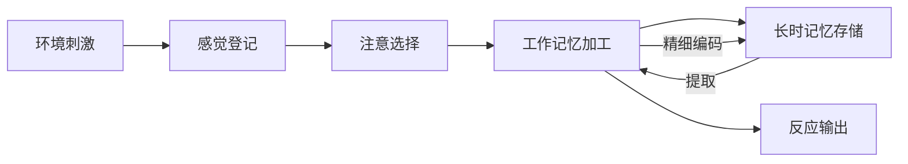
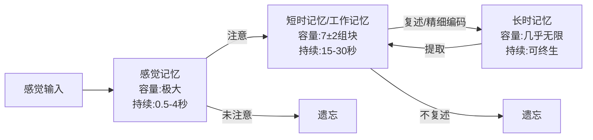
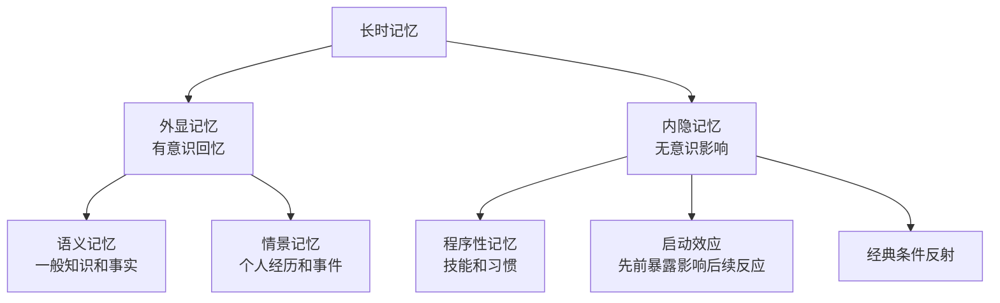
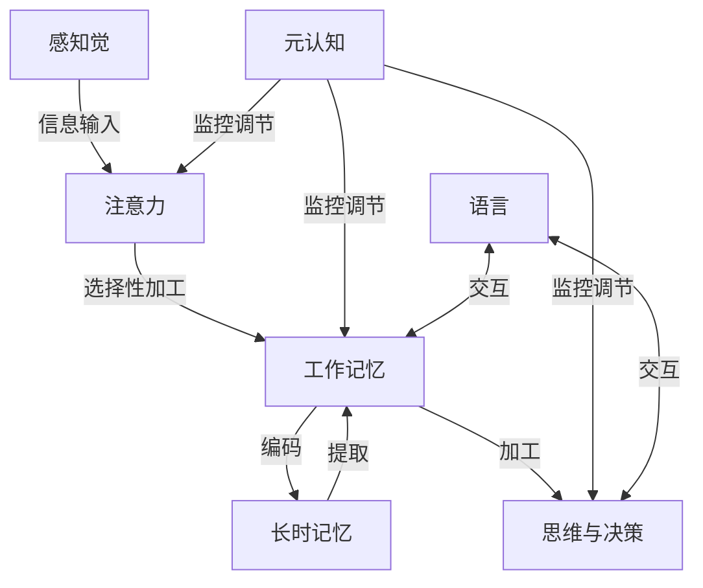

## 二、认知心理学

### 2.1 认知心理学概述

认知心理学（Cognitive Psychology）是研究人类如何获取、加工、储存和运用信息的心理学分支。它将人的心智比作一个信息加工系统，关注从感知觉输入到行为输出之间的所有心理过程。这一领域兴起于20世纪50-60年代，是对行为主义只关注外显行为、忽视内部心理过程的"认知革命"的产物。

**认知心理学的核心假设**：人不是被动地对环境刺激做出反应，而是主动地选择、组织和解释信息。理解这一点，就理解了为什么同样一件事，不同的人会有截然不同的反应——因为他们对信息的加工方式不同。

**认知心理学的发展脉络**：

| 时期 | 关键事件 | 代表人物 | 核心贡献 |
|------|---------|---------|---------|
| 1950s | 认知革命兴起 | 乔姆斯基、西蒙、纽厄尔 | 对行为主义的批判，信息加工范式确立 |
| 1960s | 实验认知心理学 | 奈瑟、Broadbent、Treisman | 注意力和记忆的实验研究 |
| 1970s | 信息加工模型成熟 | Anderson、Rumelhart | 认知架构和联结主义模型 |
| 1980s | 认知神经科学兴起 | Gazzaniga、Posner | 脑成像技术揭示认知的神经基础 |
| 1990s-今 | 具身认知、计算认知 | Barsalou、Griffiths | 认知与身体、环境的交互，贝叶斯大脑假说 |

**信息加工的基本模型**：

感觉登记接收海量环境信息，注意选择其中极小一部分进入工作记忆，工作记忆进行加工后存入长时记忆，长时记忆中的信息又能被提取回工作记忆参与新的加工。这个循环过程构成了人类认知的基本框架。

### 2.2 感知觉

感知觉是认知过程的起点。没有感知觉，就没有信息输入，后续的一切加工都无从谈起。

**感觉与知觉的区别**：
- **感觉**（Sensation）：感觉器官对物理刺激的直接反应，是生理过程。例如光线刺激视网膜、声波振动鼓膜。
- **知觉**（Perception）：大脑对感觉信息的组织和解释，是心理过程。例如从视觉信号中识别出一张人脸、从听觉信号中理解一段话语。

**知觉的组织原则（格式塔原则）**：

格式塔心理学家发现，人类的知觉并非被动接收碎片信息，而是主动将信息组织成有意义的整体。核心原则包括：

- **接近性原则**：空间或时间上接近的元素倾向于被知觉为一组。例如，座位挨着的人更容易被认为是一伙的。
- **相似性原则**：形状、颜色、大小相似的元素倾向于被归为一类。例如，同样颜色的标记在地图上被视为同一区域。
- **连续性原则**：知觉倾向于将线条或形状知觉为连续的、平滑的模式，而非断裂的片段。例如，两条线交叉时，我们倾向于知觉为两条线穿过，而非四条线段。
- **闭合性原则**：知觉倾向于将不完整的图形补全为完整的形状。例如，一个有缺口的圆圈仍被知觉为圆圈。
- **图形-背景原则**：知觉会将刺激区分为图形（前景）和背景。例如，花瓶与人脸的双关图。

**深度知觉**：人类如何从二维视网膜像中获得三维空间信息？

| 线索类型 | 具体线索 | 机制说明 |
|---------|---------|---------|
| 双眼线索 | 双眼视差 | 两眼位置不同导致图像差异，大脑据此计算距离 |
| 单眼线索 | 遮挡 | 近物遮挡远物 |
| 单眼线索 | 相对大小 | 同一物体在视网膜上成像越小，距离越远 |
| 单眼线索 | 线条透视 | 平行线在远处汇聚 |
| 单眼线索 | 纹理梯度 | 近处纹理粗糙，远处纹理细密 |
| 单眼线索 | 明暗与阴影 | 光影分布提供三维形状信息 |
| 运动线索 | 运动视差 | 移动时近物移动快，远物移动慢 |

**知觉恒常性**：尽管感觉输入不断变化，我们对物体的知觉却保持相对稳定。

- **大小恒常性**：远处的汽车看起来仍然是一辆正常大小的汽车，而非一个小点
- **形状恒常性**：从不同角度看一本书，知觉中仍保持矩形
- **颜色恒常性**：在不同光照条件下，白纸仍被知觉为白色

**错觉与知觉的局限性**：错觉不是"眼睛的错误"，而是大脑知觉机制的正常运作方式。理解错觉有助于我们认识知觉的主动建构本质。

| 错觉名称 | 表现 | 原理解释 |
|---------|------|---------|
| 缪勒-莱尔错觉 | 等长线段因箭头方向不同而看起来长度不同 | 大脑将箭头方向解读为深度线索 |
| 蓬佐错觉 | 等长线段在汇聚线中看起来上方更长 | 线条透视引发的深度知觉影响大小判断 |
| 艾姆斯房间 | 人在特殊构造的房间中显得大小变化 | 深度线索被人为扭曲 |
| 运动后效 | 长时间注视瀑布后，静止物体看起来向上移动 | 运动检测神经元的适应与反弹 |

**实践启示**：
- 认识到自己的感知并不总是可靠的，在重要判断中要警惕知觉偏差
- 设计信息展示时（如报告、幻灯片），运用格式塔原则提高可读性
- 了解错觉原理有助于设计更好的用户界面——利用接近性原则分组相关元素，利用连续性原则引导视线流动

### 2.3 注意力

注意力（Attention）是认知系统的门户，决定了哪些信息能够进入深层加工。认知心理学的先驱William James（1890）曾写道："每个人都知道注意力是什么。它是心智以清晰而生动的形式，从若干同时可能的对象或思路中选取一个加以占有。"尽管定义看似简单，注意力的机制却异常复杂。

#### 2.3.1 注意力的基本特性

**选择性注意**：人类的认知资源是有限的，我们无法同时处理所有进入感官的信息。选择性注意使我们能够聚焦于特定信息而忽略其他。经典实验——"鸡尾酒会效应"（Cherry, 1953）：在嘈杂的派对环境中，你仍然能选择性地听到与你对话的人的声音；但当远处有人提到你的名字时，你的注意力会瞬间被吸引过去。这说明，即使被"忽略"的信息，大脑仍在某种程度上进行着监控。

**注意的三种类型**：
- **不随意注意**：由刺激本身特征（如突然的声音、鲜艳的颜色、运动物体）自动引发，不需要意志努力。这是进化赋予我们的生存机制——对潜在威胁的自动反应。
- **随意注意**：由目的驱动，需要意志努力维持，如集中精力阅读一本教科书、完成一项复杂计算。随意注意的能力是有限的，持续使用会导致认知疲劳。
- **随意后注意**：介于两者之间，最初需要意志努力，但随着兴趣和习惯的形成，逐渐变得自动化。例如，学习开车初期需要全神贯注，熟练后可以边开车边聊天。这是最高效率的注意状态。

#### 2.3.2 注意力的理论模型

**过滤器模型（Broadbent, 1958）**：信息在早期就被选择性过滤，只有被注意的信息才能进入后续加工。这就像一个单通道门，一次只能通过一股信息流。支持证据：双耳分听实验中，被试很难报告未注意通道的内容。

**衰减模型（Treisman, 1964）**：未被注意的信息不是完全被阻断，而是被衰减（音量降低），当具有足够重要性时（如自己的名字）仍可被觉察。这更好地解释了鸡尾酒会效应。

**晚期选择模型（Deutsch & Deutsch, 1963）**：所有信息都被加工到语义层面，选择发生在反应阶段。这个模型认为，过滤不是发生在加工早期，而是发生在"选择哪个信息来反应"的阶段。

**认知负荷理论（Sweller, 1988）**：这一理论对教育和工作设计有深远影响。它将认知负荷分为三类：

| 负荷类型 | 定义 | 设计启示 |
|---------|------|---------|
| 内在认知负荷 | 学习材料本身的复杂度 | 将复杂任务分解为小步骤 |
| 外在认知负荷 | 不良设计带来的额外负担 | 消除冗余信息，整合分散注意力的元素 |
| 相关认知负荷 | 促进学习的有效加工 | 引导学习者建立图式、进行精细加工 |

核心原则：工作记忆容量有限（约4±1个组块），教学设计必须控制总负荷不超限。

#### 2.3.3 注意力的分配与切换

**分配性注意**：同时处理多个任务的能力。有限且容易出错。关键发现：人们并不是真正的"多任务处理"，而是在快速切换注意力。每次切换都有认知成本。研究显示，在复杂任务间切换，效率可下降40%（Monsell, 2003）。

**切换成本**：在任务间切换时，需要时间和认知资源。包括：
- **反应时成本**：切换后的第一个反应比连续做同一任务慢
- **错误率成本**：切换后更容易出错
- **重建成本**：需要重新加载之前任务的上下文和规则

**持续性注意**：长时间保持注意的能力。心理学中的"警觉递减"（vigilance decrement）现象表明，持续监控任务的表现会在30分钟左右开始显著下降。

#### 2.3.4 实践应用

**减少干扰源**：不随意注意由刺激特征自动触发，因此物理环境的干扰源（手机通知、背景噪音、视觉杂乱）会自动劫持注意力。最佳策略是消除干扰源，而非靠意志力抵抗。

**维持随意注意**：明确的目标、适度的挑战感、即时反馈是维持随意注意的三大支柱。模糊的目标（"好好学习"）不如具体的目标（"今天掌握二叉树的三种遍历方式"）。

**培养随意后注意**：通过习惯养成，将重要任务转化为随意后注意状态。关键是坚持到行为自动化，通常需要21-66天不等（Lally et al., 2010）。

**番茄工作法的科学基础**：25分钟工作周期符合注意力的自然节律。研究显示，短暂休息（5分钟）能有效恢复注意力资源。长期工作后需要更长休息（15-30分钟）。

**警惕多任务处理**：多任务处理是一种认知幻觉——你以为自己在同时做两件事，实际上是在两件事之间快速切换，每次切换都有损失。对于需要深度思考的任务，单一任务处理的效率比多任务处理高2-5倍。

### 2.4 记忆系统

记忆是认知心理学研究最为深入的领域之一。理解记忆的工作机制，直接关系到学习效率和知识管理。心理学家Endel Tulving（1985）指出，记忆不是单一系统，而是由多个相互协作的子系统组成。

#### 2.4.1 记忆的多存储模型

**Atkinson-Shiffrin模型（1968）**是记忆研究的经典框架，将记忆分为三个阶段：

**感觉记忆**：容量极大但持续极短，是感官信息的暂存区。
- **图像记忆**（Sperling, 1960）：视觉感觉记忆，持续约0.5秒。实验中，给被试呈现一个字母矩阵50毫秒，整体报告只能回忆4-5个字母，但用部分报告法（提示某一行）可以回忆出任何一行的3-4个字母，说明全部信息曾短暂存在于感觉记忆中。
- **回声记忆**：听觉感觉记忆，持续约2-4秒。这就是为什么你有时能"回放"刚听到但没注意的话。

**工作记忆（Baddeley & Hitch, 1974; Baddeley, 2000）**：工作记忆不是简单的短时存储，而是一个主动加工的"心理工作台"。

| 子系统 | 功能 | 容量 | 实例 |
|--------|------|------|------|
| 语音环路 | 处理听觉和语言信息 | 约2秒的语音信息 | 默念电话号码 |
| 视觉空间画板 | 处理视觉和空间信息 | 约3-4个视觉对象 | 想象房间布局 |
| 中央执行系统 | 协调注意力资源分配 | 无固定容量 | 在阅读时忽略背景噪音 |
| 情景缓冲器 | 整合不同来源的信息 | 约4个组块 | 将文字和图像绑定为一个场景 |

**长时记忆的分类**：

- **语义记忆**：你知道"北京是中国的首都"，但不一定记得是什么时候学到的。
- **情景记忆**：你清楚地记得第一次骑自行车的场景，包括当时的感觉和情绪。
- **程序性记忆**：你会骑自行车，但很难用语言描述具体怎么骑。这就是"会做不会说"。

#### 2.4.2 编码、储存与提取

**编码**：将信息转化为可存储的形式。编码深度决定了记忆的持久性。

**Craik & Lockhart的加工水平理论（1972）**：
- **浅层加工**：关注物理特征（这个字是什么字体？）→ 记忆效果差
- **中层加工**：关注语音特征（这个字押韵吗？）→ 记忆效果一般
- **深层加工**：关注语义特征（这个字是什么意思？放在什么语境中？）→ 记忆效果最好

**有效的编码策略**：
- **精细化编码**：将新信息与已有知识建立联系。例如，学习"海马体与记忆有关"时，想象一匹海马在帮你储存记忆。
- **自我参照效应**：将信息与自己联系起来时，记忆效果最好。例如，"这个概念在我生活中有什么例子？"
- **情境依赖性记忆**：在与提取时相同的环境中编码，记忆效果更好（Godden & Baddeley, 1975）。

**储存**：信息在长时记忆中的组织方式。
- **语义网络模型**（Collins & Quillian, 1969）：概念以节点形式存在，通过语义关系连接。"金丝雀"→"是鸟"→"有翅膀"→"能飞"。验证时间与网络距离成正比。
- **图式**（Bartlett, 1932; Rumelhart, 1980）：组织信息的认知框架。例如，"餐厅图式"包括：进入→点餐→进食→付账→离开。图式帮助我们快速理解新信息，但也可能导致记忆扭曲（用图式中的典型信息填补记忆空白）。

**提取**：从记忆中检索信息。
- **编码特异性原则**（Tulving, 1973）：提取时的线索与编码时的线索匹配程度越高，提取越成功。
- **提取练习效应**（测试效应）：主动回忆比被动复习更能增强记忆（Roediger & Karpicke, 2006）。测试不是评估工具，而是学习工具。研究显示，阅读+测试的学习效果比单纯阅读两遍好40%以上。

#### 2.4.3 遗忘

**艾宾浩斯遗忘曲线（1885）**：遗忘在学习后立即开始，最初速度很快，随后逐渐减缓。20分钟后遗忘42%，1小时后遗忘56%，1天后遗忘66%，1个月后遗忘79%。

**遗忘的原因**：
- **衰退说**：记忆痕迹随时间自然消退，神经连接逐渐弱化。
- **干扰说**：其他信息的干扰导致提取失败。前摄干扰（旧信息干扰新记忆）和倒摄干扰（新信息干扰旧记忆）。例如，新旧密码之间的干扰。
- **提取失败**：信息仍在记忆中，但缺乏有效的提取线索。"话到嘴边说不出来"（TOT现象）就是典型的提取失败。
- **动机性遗忘**：压抑不愉快的记忆（弗洛伊德的观点），现代研究对此存在争议但部分支持。

#### 2.4.4 记忆的扭曲与错误

记忆不是录像回放，而是每次提取时的重新建构。这一特性使记忆既灵活又脆弱。

- **错误信息效应**（Loftus, 1975）：后续信息可以改变原始记忆。经典实验：让被试观看车祸视频，然后问"两辆车接触时速度多快？"vs"两辆车碰撞时速度多快？"，后者估计的速度显著更高。
- **想象膨胀**：仅仅想象某个事件，就增加人们相信它发生过的信心。"我越想越觉得真的发生过。"
- **来源混淆**：正确记住信息，但错误记忆来源。例如，你记住了一个事实，但记错了是从哪里听到的。
- **闪光灯记忆**：对重大事件（如911、亲人离世）的记忆，感觉鲜明但不一定准确。研究显示，闪光灯记忆的准确率与普通记忆并无显著差异，只是主观信心更高。
- **虚假记忆**：在特定暗示下，人们可以"回忆"起从未发生过的事情。Loftus的研究显示，通过适当暗示，可以植入"小时候在商场走失"的虚假记忆。

#### 2.4.5 实践应用

**间隔重复**（Spaced Repetition）：对抗遗忘曲线最有效的方法。核心原则是在遗忘即将发生时进行复习。间隔应逐渐拉长：学后1天→3天→7天→14天→30天→90天。Anki等软件自动计算最佳复习间隔。

**精细化编码**：将新信息与已有知识建立多层次联系。不只是"记住"，而是"理解为什么"。费曼学习法（用自己的话解释给外行人听）本质上就是深度编码。

**主动提取**：复习时不要只是重读，而是先尝试回忆，再对照检查。研究表明，"阅读→测试"的循环比"阅读→阅读"效率高50%以上。

**多重编码**：文字+图像+声音+动作，增加编码通道。Paivio的双重编码理论指出，同时以语言和视觉形式编码的信息更容易记住。

**睡眠与记忆巩固**：睡眠期间，大脑会重新激活白天的经历，将短时记忆转化为长时记忆。研究显示，学习后睡眠的被试比不睡眠的被试记忆保持率高20-40%。深度睡眠（慢波睡眠）对陈述性记忆尤为重要，REM睡眠对程序性记忆和情绪记忆尤为重要。

### 2.5 思维与决策

思维是认知的高级过程，包括概念形成、推理、问题解决和决策。如果说感知和记忆是"输入"和"存储"，那么思维就是"处理"——对信息进行变换、组合和判断。

#### 2.5.1 概念形成

**概念**：对事物或事件类别的心理表征。概念使我们能够将无限多样的世界简化为可管理的类别。

**概念的理论**：
- **经典观点**：概念由一组充要条件定义。例如，"三角形"由"三条边封闭图形"定义。但这种方法难以处理自然概念（"什么是游戏？"很难给出精确的充要条件）。
- **原型说**（Rosch, 1973）：概念由最典型的成员表征。判断某物是否属于某类别，看它与原型的相似度。例如，"鸟"的原型可能是麻雀，企鹅与原型差异大，所以人们在判断"企鹅是鸟吗？"时反应更慢。
- **样例说**：概念由所有成员的样例表征。判断某物是否属于某类别，看它与已知样例的相似度。
- **理论说**：概念不仅由特征决定，还由关于该类别的因果理论决定。

**概念层级**：从具体到抽象（如：宠物狗→狗→哺乳动物→动物）。基本层级（"狗"）是认知上最重要的：人们最常用、儿童最先学习、特征最丰富。

#### 2.5.2 推理

**演绎推理**：从一般到特殊，如果前提为真则结论必然为真。
- **三段论**：所有人都会死→苏格拉底是人→苏格拉底会死。逻辑上无懈可击，但人类常因内容偏差而犯错。例如："所有玫瑰都是花，有些花凋谢得快，所以有些玫瑰凋谢得快"——逻辑上不成立，但听起来合理。
- **条件推理**：如果P则Q。人们在验证"如果P则Q"时，倾向于寻找P和Q同时出现的证据（确认偏误），而忽视"非P但Q"和"P但非Q"的检验价值。

**归纳推理**：从特殊到一般，从观察中形成理论。例如，观察到天鹅是白色的→归纳出"所有天鹅都是白色的"。归纳推理的结论是或然的而非必然的（黑天鹅的发现推翻了这一结论）。

**类比推理**：基于相似性进行推理。"心脏像水泵"就是一个类比，它帮助我们理解心脏的功能。Gentner的结构映射理论指出，好的类比基于关系相似性而非表面相似性。

#### 2.5.3 问题解决

**问题解决的策略**：
- **算法**：保证解决问题的方法，逐一尝试所有可能。例如，尝试所有密码组合来打开锁。优点是保证成功，缺点是可能极其耗时。
- **启发式**：快速但不保证成功的方法。常用的启发式包括：
  - **手段-目的分析**：比较当前状态与目标状态的差距，选择能缩小差距的操作
  - **逆向搜索**：从目标状态出发，反向推导到当前状态
  - **类比迁移**：将已知问题的解法迁移到新问题

**问题解决的障碍**：
- **功能固着**（Duncker, 1945）：只看到事物的传统功能，忽视新用途。经典实验：蜡烛问题——给你一根蜡烛、一盒图钉和火柴，如何将蜡烛固定在墙上？解决方案是把图钉盒倒空当烛台，但很多人因为将盒子视为"装图钉的容器"而无法想到。
- **心理定势**：用过去成功的方法解决新问题，即使不适用。经典实验：Luchins的水壶问题——前几题用同一方法解决后，被试在有更简单解法的题目上仍坚持复杂方法。
- **确认偏误在问题解决中的影响**：倾向于寻找支持已有假设的证据，忽视反面证据。

#### 2.5.4 认知偏误

人类的思维并非完全理性，存在系统性的偏误模式。这些偏误不是缺陷，而是进化过程中形成的快速判断机制——在大多数情况下有效，但在特定情境中会导致错误。

| 偏误名称 | 表现 | 实例 | 应对策略 |
|---------|------|------|---------|
| 确认偏误 | 倾向于寻找支持已有信念的信息 | 投资者只关注支持自己判断的新闻 | 主动寻找反面证据 |
| 可得性启发 | 根据信息在记忆中的易获取程度判断概率 | 看到空难新闻后高估飞行风险 | 查阅统计数据而非凭印象 |
| 锚定效应 | 过度依赖最先获得的信息 | 商品先标高价再打折 | 多方比较，独立评估 |
| 框架效应 | 同一信息因表述方式不同导致不同决策 | "成功率90%"vs"失败率10%" | 用两种方式重新表述问题 |
| 损失厌恶 | 对损失的敏感度约为对收益的2倍 | 宁愿不赚100元也不愿损失50元 | 关注长期期望值而非单次结果 |
| 沉没成本谬误 | 因已投入资源而继续投入 | 烂片看了1小时，不想"浪费"已看的时间 | 只考虑未来收益和成本 |
| 后见之明偏差 | 事后认为事件是可预测的 | "我早就知道会这样" | 记录决策时的预测和理由 |
| 基本归因错误 | 过度强调个人特质，低估情境因素 | 别人迟到是"不守时"，自己迟到是"堵车" | 考虑情境因素 |
| 达克效应 | 能力低者高估自己，能力高者低估自己 | 新手自信满满，专家反而谦虚 | 寻求客观反馈 |

#### 2.5.5 双系统理论

**Kahneman（2011）在《思考，快与慢》**中提出的双系统理论，是理解人类思维的核心框架：

| 特征 | 系统1（快思考） | 系统2（慢思考） |
|------|---------------|---------------|
| 速度 | 快速 | 缓慢 |
| 努力程度 | 自动、不费力 | 需要意志努力 |
| 意识程度 | 无意识 | 有意识 |
| 容量 | 大量并行处理 | 有限串行处理 |
| 错误倾向 | 容易受偏误影响 | 更准确 |
| 典型任务 | 面部识别、母语理解 | 复杂计算、逻辑推理 |

大多数时候，系统1在主导我们的判断和决策，系统2更像是一个"懒惰的检查员"——只有在系统1遇到困难或出错时才会介入。

**系统1的"故事化"倾向**：系统1天生喜欢将随机事件组织成因果叙事。看到三个巧合就认为"命运安排"，看到两个相关数据就认为"因果关系"。这种倾向在快速决策中有用，但容易导致迷信和伪科学信念。

#### 2.5.6 实践应用

**重要决策前激活系统2**：
1. 列出正反两方面论据
2. 预设"事前验尸"——假设决策已经失败，分析可能的原因
3. 使用决策矩阵量化各选项的权重和得分
4. 延迟决策——给自己至少24小时的"冷却期"

**减少认知偏误的工具**：
- **决策清单**：列出常见偏误，在决策前逐一检查
- **预设规则**：在冷静时制定规则，避免情绪化决策。例如，"投资亏损超过15%必须卖出"
- **寻找对立观点**：主动与持不同意见的人讨论
- **参考基准率**：不要只看个案，要了解统计上的基本情况

**培养元认知能力**：定期反思自己的思维过程。"我为什么这么想？有没有其他可能？如果我错了会怎样？"

### 2.6 语言与认知

语言是人类最复杂的认知能力之一，也是人类独特性的核心体现。语言不仅是交流工具，更是思维的载体和塑造者。

#### 2.6.1 语言的结构

语言是一个多层次的符号系统：

| 层次 | 研究内容 | 示例 |
|------|---------|------|
| 语音学 | 语言的声音系统 | 汉语有4个声调，英语无声调 |
| 音位学 | 声音如何组合成有意义的单位 | 汉语拼音的声母韵母组合规则 |
| 形态学 | 词的构成和变化 | 英语的复数-s、过去式-ed |
| 句法学 | 句子的结构规则 | 主谓宾结构、修饰语位置 |
| 语义学 | 语言的意义 | 多义词、同义词、反义词关系 |
| 语用学 | 语言在语境中的使用 | "你能把盐递给我吗？"是请求而非提问 |

#### 2.6.2 语言获得

**行为主义观点**（Skinner, 1957）：语言通过强化和模仿习得。儿童说出正确的词得到奖励，从而强化语言行为。这一观点无法解释语言的创造性——儿童能说出从未听过的句子。

**先天论观点**（Chomsky, 1959）：人类天生具有语言习得装置（LAD）和普遍语法。关键证据：
- 儿童语言发展的普遍性（全世界儿童在相似年龄达到语言里程碑）
- 儿童语言中的创造性错误（"我 goed to school"——过度规则化，说明他们在应用规则而非简单模仿）
- 语言输入的贫乏性（poverty of the stimulus）——儿童听到的语言包含大量错误和不完整句，但仍能习得完整语法

**互动论观点**：语言发展是先天能力与环境输入的交互作用。儿童既有先天的语言学习倾向，也需要丰富的语言环境来激活和发展这些能力。

#### 2.6.3 语言与思维

**萨丕尔-沃尔夫假说**：
- **强版本**（语言决定论）：语言决定思维，不同语言的使用者有不同的世界观。这个版本被广泛质疑。
- **弱版本**（语言相对论）：语言影响思维，但不完全决定。这个版本有较多支持证据。

**现代研究证据**：
- **颜色认知**：俄语有两个基本词分别表示浅蓝（goluboy）和深蓝（siniy），研究显示俄语使用者区分蓝色深浅的速度比英语使用者快（Winawer et al., 2007）。
- **空间关系**：有些语言用绝对方向（东南西北），有些用相对方向（前后左右）。使用绝对方向语言的人在空间推理上表现不同。
- **时间隐喻**：英语将时间隐喻为水平线（"向前看"/"回顾"），普通话也有垂直隐喻（"上个月"/"下个月"）。Boroditsky（2001）的研究显示，这影响了人们对时间的空间表征。

**双语与认知**：
- 双语者在某些认知任务上表现更好，特别是执行功能（如抑制控制、任务切换）和认知灵活性。
- 双语可能延缓认知老化约4-5年（Bialystok et al., 2007）。
- 语言切换需要认知资源，双语者在日常中不断练习这种"认知体操"。

#### 2.6.4 实践应用

- 学习新语言不仅是技能获取，更是认知训练——它增强执行功能、延缓认知老化。
- 注意语言框架对决策的影响。"成功率90%"和"失败率10%"是同一事实，但框架效应使人们对前者更积极。在评估信息时，用两种方式重新表述。
- 语言精确性有助于思维清晰性。概念模糊导致思维模糊。学习一个领域的专业术语，就是学习该领域的思维方式。
- 写作是思维的"外部化"过程，它迫使你将模糊的想法具体化。遇到想不清楚的问题，尝试写下来。

### 2.7 元认知

元认知（Metacognition）是"关于认知的认知"，即对自己思维过程的觉察、监控和调节能力。这个概念由心理学家John Flavell（1979）提出，是认知心理学中最具实践价值的概念之一。

#### 2.7.1 元认知的三个成分

**元认知知识**：对自己认知能力、任务特征和策略的了解。
- **个人变量知识**：知道自己擅长什么、不擅长什么。例如，"我的视觉记忆比听觉记忆好。"
- **任务变量知识**：了解不同任务的要求和难度。例如，"这段材料需要反复阅读才能理解。"
- **策略变量知识**：知道在什么情况下使用什么策略。例如，"记忆人名时用联想法效果最好。"

**元认知体验**：在认知活动中的主观感受。
- **知道感**（Feeling of Knowing）：对某个暂时想不起来的信息，感觉"我知道这个"。研究表明，知道感的准确率约为70%，但会受到信息可得性和相似性的影响。
- **学习判断**（Judgment of Learning）：对学习效果的自我评估。常见的偏差是"流畅性错觉"——阅读流畅不等于理解深刻。

**元认知监控与调节**：对认知活动的实时评估和调整。
- **计划**：制定学习策略和分配资源
- **监控**：评估当前进展是否符合预期
- **评估**：任务完成后反思效果

#### 2.7.2 元认知与学习

**元认知能力是学习能力的核心预测指标**。研究表明，善于学习的人不一定是智商最高的人，但一定是元认知能力最强的人——他们知道自己知道什么、不知道什么，并能据此调整学习策略。

**元认知发展的关键发现**：
- 儿童的元认知能力随年龄增长而提高，但差异显著
- 元认知能力可以通过训练提升
- 元认知训练的效果可以迁移到不同领域

**常见的元认知失败**：
- **过度自信**：高估自己的知识和能力。例如，考前觉得"都会了"，考后才发现很多地方没掌握。
- **流畅性错觉**：将阅读的流畅性误解为理解的深度。教材写得好不等于你理解得好。
- **计划谬误**：低估任务所需时间。Kahneman指出，人们在估计时间时倾向于关注最乐观的情景，忽视可能的障碍。

#### 2.7.3 元认知的培养方法

**计划阶段**：
- 设定具体、可衡量的学习目标
- 预估所需时间和资源
- 选择适合的策略

**监控阶段**：
- 定期自问："我现在理解了吗？"
- 使用"费曼技巧"：尝试用简单的话解释刚学的内容
- 标记不确定的地方，事后检查

**评估阶段**：
- 反思哪些策略有效，哪些无效
- 分析错误的原因，不只是纠正答案
- 记录学习日志，追踪进步

**元认知提问清单**（在学习过程中定期自问）：
1. 这个主题的核心问题是什么？
2. 我已经知道什么？还需要知道什么？
3. 我正在使用什么策略？这个策略有效吗？
4. 我理解了多少？能用自己的话解释吗？
5. 这个知识点和已知的知识有什么联系？
6. 学完后，我需要回顾什么？

### 2.8 认知心理学的现代前沿

#### 2.8.1 具身认知

传统认知心理学将心智视为"大脑中的计算机"。具身认知（Embodied Cognition）则认为，认知不仅发生在大脑中，而是根植于身体与环境的交互。

**核心证据**：
- **概念隐喻理论**（Lakoff & Johnson）：抽象概念通过身体经验理解。"理解"是"把握"（grasping），"时间"是"金钱"。
- **身体状态影响判断**：手持热饮的人比手持冷饮的人更倾向于评价他人"热情"（Williams & Bargh, 2008）。
- **手势与思维**：数学家在解释概念时使用手势，手势不仅表达思想，还辅助思维过程。

**实践启示**：学习不只是"坐在那里想"，动手操作、身体参与、多感官体验都能增强认知效果。

#### 2.8.2 认知神经科学

认知神经科学通过脑成像技术（fMRI、EEG、PET）揭示认知过程的神经基础。

**关键发现**：
- 记忆的巩固依赖于海马体，海马体损伤导致无法形成新的陈述性记忆（患者H.M.）
- 注意力涉及前额叶、顶叶等多个脑区的协同工作
- 语言处理主要涉及布洛卡区（语言产生）和韦尼克区（语言理解）
- 决策涉及前额叶（理性分析）和杏仁核（情绪反应）的交互

**实践价值**：了解认知的神经基础有助于理解认知障碍（如ADHD、失语症），也为认知增强提供了理论依据。

#### 2.8.3 贝叶斯大脑假说

这一前沿理论认为，大脑本质上是一个贝叶斯推理机器——它不断地用先验知识（已有图式）解释感觉输入，产生对世界的预测。当预测与实际不符时，大脑更新其模型。

这一框架统一解释了许多认知现象：
- **知觉错觉**：大脑的先验假设（如"光从上方照来"）导致对特定输入的系统性误解
- **学习**：更新先验模型以更好地预测未来
- **创造力**：将不常关联的概念连接起来，产生新的预测

### 2.9 认知能力的评估与提升

#### 2.9.1 认知能力的测量

| 测量工具 | 测量内容 | 特点 |
|---------|---------|------|
| 韦氏智力量表 | 言语理解、知觉推理、工作记忆、加工速度 | 临床标准，个别施测 |
| 瑞文推理测验 | 非言语推理能力 | 文化公平性好 |
| N-back任务 | 工作记忆容量 | 认知训练研究常用 |
| Stroop任务 | 抑制控制能力 | 注意功能的标准测量 |
| Wisconsin卡片分类 | 认知灵活性 | 执行功能测量 |

#### 2.9.2 认知训练的现状

**有效的认知训练**：
- **工作记忆训练**（如N-back训练）：可以提高工作记忆任务本身的表现，但迁移到其他领域（如流体智力）的证据有限且有争议。
- **正念冥想**：有中等强度的证据支持其改善注意力和执行功能。
- **有氧运动**：对认知功能有广泛益处，特别是改善执行功能和记忆。

**需要警惕的"脑力训练"产品**：许多商业化的脑力训练游戏宣称能提高认知能力甚至预防痴呆，但大多数缺乏严格的科学验证。认知训练的效果通常是"训练特异性"的——你只是在训练的任务上变得更好，而不是全面提升认知能力。

#### 2.9.3 认知增强的综合策略

基于现有证据，最有效的认知增强策略不是单一训练，而是综合的生活方式调整：

1. **充足睡眠**（7-9小时）：睡眠是记忆巩固和认知恢复的关键
2. **规律运动**：有氧运动促进神经营养因子分泌，增强海马体功能
3. **健康饮食**：地中海饮食模式与更好的认知功能相关
4. **认知刺激**：持续学习新技能、阅读、社交互动
5. **压力管理**：慢性压力损害海马体和前额叶功能
6. **正念练习**：改善注意力控制和情绪调节

### 2.10 常见误区与纠正

| 误区 | 事实 | 科学依据 |
|------|------|---------|
| "我们只使用了10%的大脑" | 大脑各区域在不同时刻都有功能，损伤任何区域都会导致功能丧失 | 脑成像研究显示大脑活跃区域随任务变化，没有"闲置"区域 |
| "有人是纯视觉型/听觉型学习者" | 没有可靠证据支持学习风格理论 | Pashler et al. (2008) 的元分析未能发现学习风格与教学方式匹配的交互效应 |
| "多任务处理可以提高效率" | 人们在快速切换任务而非同时处理 | 每次切换都有认知成本，复杂任务效率可下降40% |
| "记忆就像录像机一样记录" | 记忆是每次提取时的重新建构，容易出错和扭曲 | Loftus的错误信息效应、虚假记忆研究 |
| "左脑人/右脑人" | 两个半球协同工作，没有"主导半球"决定性格的说法 | Nielsen et al. (2013) 的fMRI研究未发现半球主导与人格的关系 |
| "智力是固定的" | 智力有可塑性，受教育、环境和努力影响 | 成长型思维研究、Flynn效应 |

### 2.11 本节小结

认知心理学揭示了人类信息加工的核心机制。从感知觉的输入，到注意的筛选，到记忆的编码和储存，到思维的高级加工，再到元认知的自我监控，每一步都深刻影响着我们的学习、决策和生活质量。

**核心要点回顾**：

**最关键的实践启示**：
1. **尊重注意力的有限性**——不要试图多任务处理，专注于单一任务
2. **用间隔重复和提取练习对抗遗忘**——被动重读不如主动回忆
3. **警惕认知偏误**——在重要决策中激活系统2，列出正反论据
4. **培养元认知能力**——定期反思自己的思维过程，知道自己"不知道什么"
5. **语言塑造思维**——学习新语言和精确使用语言都能增强认知
6. **认知是具身的**——动手操作、身体参与能增强学习效果

认知心理学不是抽象的理论，而是可以立即应用的日常工具。理解这些机制，你就能更有效地学习、更理性地决策、更清晰地思考。
