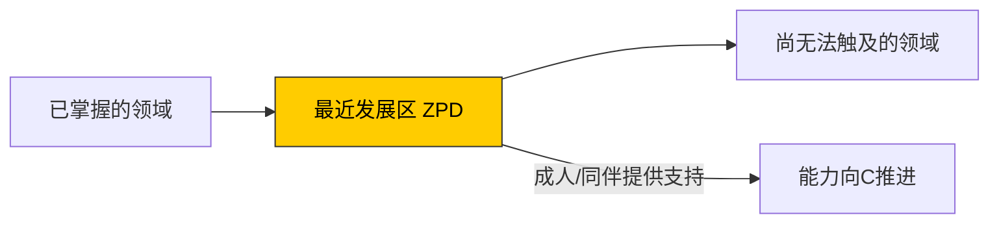
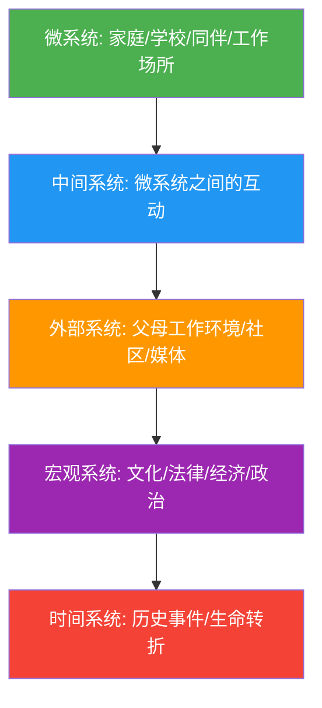

## 三、发展心理学

### 3.1 什么是发展心理学

发展心理学（Developmental Psychology）研究个体从受孕到死亡的整个生命过程中心理和行为的变化规律。它不是只研究"儿童心理"——当代发展心理学覆盖全部年龄段，关注认知、情感、社会性、人格和道德的发展轨迹，以及生物因素和环境因素如何交互塑造这些轨迹。

#### 3.1.1 核心问题

| 问题 | 说明 |
|------|------|
| **连续性 vs 阶段性** | 发展是渐进累积的过程，还是呈现质变的阶段跳跃？ |
| **关键期 vs 敏感期** | 是否存在不可错过的发育窗口？ |
| **天性 vs 教养** | 遗传和环境各占多大比重？ |
| **普遍性 vs 文化特异性** | 发展规律跨文化一致还是因文化而异？ |
| **早期经验 vs 终身可塑性** | 童年决定一切，还是任何时候都能改变？ |

#### 3.1.2 研究方法

发展心理学的研究方法有其独特性，因为研究对象跨越极大年龄范围：

- **横断研究**：同时测试不同年龄组，比较差异。优点是快速高效；缺点是存在**队列效应**（不同年代出生的人经历不同）。
- **纵向研究**：追踪同一批人多年。优点是能看到真实变化轨迹；缺点是耗时、样本流失严重。
- **序列设计**：结合前两者——既比较不同年龄组，又追踪多年，同时检验是否存在队列效应。
- **微观发生学方法**：在短时间内密集观察学习过程，捕捉变化发生的精确时刻。
- **跨文化比较**：在不同文化中重复同一研究，检验理论的普遍性。

**伦理原则**：对未成年被试必须获得家长知情同意，不得施加任何可能造成心理伤害的实验操纵，必须保证被试随时退出的权利。

### 3.2 主要理论框架

发展心理学有多个相互竞争又互补的理论框架，每个框架从不同角度解释"人如何成为今天的自己"。

#### 3.2.1 皮亚杰的认知发展理论

皮亚杰（Jean Piaget）是20世纪最具影响力的儿童心理学家。他的核心主张是：**儿童不是被动接受知识的容器，而是主动建构理解的探索者**。

**核心机制概念**：

| 概念 | 定义 | 实例 |
|------|------|------|
| **图式（Schema）** | 组织和解释信息的认知结构 | 婴儿的"抓握图式"——拿到什么都往嘴里塞 |
| **同化（Assimilation）** | 将新信息纳入现有图式 | 孩子见过狗后，第一次见到猫也叫"狗狗" |
| **顺应（Accommodation）** | 修改图式以适应新信息 | 孩子学会区分"狗"和"猫"，建立新图式 |
| **平衡化（Equilibration）** | 同化与顺应之间动态平衡的过程 | 认知冲突驱动思维升级 |

**四个认知发展阶段**：

**第一阶段：感知运动阶段（0-2岁）**

婴儿通过感觉和动作认识世界。这一阶段最重要的成就是**客体永恒性**（object permanence）——理解物体即使看不见也依然存在。

| 能力 | 出现时间 | 表现 |
|------|----------|------|
| 反射性行为 | 出生 | 吸吮、抓握 |
| 初级循环反应 | 1-4月 | 重复自身动作（反复踢腿） |
| 二级循环反应 | 4-8月 | 重复对外界的影响（摇铃铛发出声音） |
| 三级循环反应 | 8-12月 | 变换方式尝试（用不同力度敲桌子） |
| 心理表征 | 12-18月 | 不用实际尝试就能在脑中解决问题 |

**实操观察**：8个月大的婴儿，你当面把玩具藏在毯子下面，他会去找（A非B错误——玩具移到B处后仍去A处找，要到12个月左右才消失）。这个经典实验可以直接验证客体永恒性的发展水平。

**第二阶段：前运算阶段（2-7岁）**

语言和符号思维爆发，但逻辑推理尚未成熟。典型局限：

- **自我中心主义**：无法从他人角度理解问题。经典实验"三山任务"——让孩子描述对面人看到的山景，他只会描述自己看到的。
- **中心化**：只关注一个维度而忽略其他。守恒实验中，矮胖杯和高瘦杯的水量，孩子只看高度。
- **不可逆性**：不能逆向思考。A>B，问他B和A的关系，答不上来。
- **万物有灵论**：认为太阳会"走路"、风会"生气"。

**第三阶段：具体运算阶段（7-11岁）**

逻辑思维出现，但仅限于具体事物。标志性成就：

- **守恒**：理解物体的物理属性（数量、体积、质量）不因外观改变而改变。
- **可逆性**：能正向和逆向思考问题。
- **分类与序列化**：能按多维度分类（颜色+形状），能排序（A>B>C）。
- **去自我中心化**：开始能理解他人视角。

**第四阶段：形式运算阶段（11岁以上）**

抽象思维和假设演绎推理能力出现：

- 能思考"如果……那么……"的问题。
- 能进行系统性的假设检验（如钟摆实验——系统测试绳长、重量等因素）。
- 理想主义和对社会问题的反思性思维涌现。
- **不是所有人都能完全进入形式运算阶段**——部分成年人在某些领域仍停留在具体运算。

**对皮亚杰理论的客观评价**：

| 维度 | 评价 |
|------|------|
| **贡献** | 首次系统研究儿童认知发展；强调儿童的主动性；开创了"临床法"研究范式 |
| **局限** | 低估幼儿能力（改进实验发现婴儿更早具备某些能力）；阶段划分过于僵硬（阶段过渡更渐进）；忽视个体差异和文化差异；忽视社会互动和语言对认知发展的作用 |

#### 3.2.2 维果茨基的社会文化理论

维果茨基（Lev Vygotsky）的理论与皮亚杰形成鲜明对比。他主张：**认知发展首先发生在社会层面，然后才内化为个体能力**。

**核心概念**：

**最近发展区（Zone of Proximal Development, ZPD）**

儿童独立解决问题的实际发展水平与在成人或更有能力的同伴指导下解决问题的潜在发展水平之间的差距。ZPD不是固定的空间——它随着儿童能力的增长而动态变化。

**支架式教学（Scaffolding）**

在ZPD内提供临时性的支持，随着学习者能力提升逐步撤除支持。这不是"手把手教"——好的支架要把握三个时机：

1. **识别困难点**：判断学习者卡在哪里
2. **提供恰到好处的帮助**：给刚好够用的提示，不多不少
3. **逐步撤除**：学习者能独立完成时，停止帮助

**实例**：教孩子骑自行车——先扶着后座跑（大量支架）→ 跟着但不碰（少量支架）→ 站在旁边看（撤除支架）→ 孩子独立骑行。

**语言与思维的关系**

维果茨基提出了语言发展的三个阶段：

1. **外部言语**（0-3岁）：说出自己想法，对他人说话
2. **自我中心言语**（3-7岁）：自言自语指导自己的行动（"我要先放红色的……"）
3. **内部言语**（7岁以后）：将外部言语内化为无声的思维工具

**关键洞察**：自言自语不是"不成熟"的表现，而是认知发展的高级工具。家长如果打断孩子的自言自语，反而会阻碍其认知发展。

**维果茨基 vs 皮亚杰对比**：

| 维度 | 皮亚杰 | 维果茨基 |
|------|--------|----------|
| 发展动力 | 内在认知冲突 | 社会互动和文化传递 |
| 儿童角色 | 小科学家，独立探索 | 学徒，向专家学习 |
| 语言角色 | 认知发展的产物 | 认知发展的工具 |
| 教育含义 | 让儿童自主发现 | 在ZPD内提供支架指导 |
| 文化角色 | 发展规律普遍 | 文化工具深刻影响认知 |

#### 3.2.3 布朗芬布伦纳的生态系统理论

布朗芬布伦纳（Urie Bronfenbrenner）提出的发展生态系统理论，是理解"环境如何影响发展"的最系统框架。他认为发展中的个体嵌套在一系列相互影响的环境系统中。

| 系统层级 | 含义 | 实例 |
|----------|------|------|
| **微系统** | 个体直接参与的环境 | 家庭、学校、同伴群体、工作场所 |
| **中间系统** | 微系统之间的相互作用 | 家长-老师沟通（家校合作）、家庭-同伴的一致性 |
| **外部系统** | 个体未直接参与但受其影响 | 父母的工作压力影响家庭氛围、社区安全状况 |
| **宏观系统** | 文化价值观、法律、经济制度 | 中国的高考制度、集体主义文化、城乡二元结构 |
| **时间系统** | 历史事件和生命转折 | 疫情期间的童年经历、父母离异的时间点 |

**实操意义**：分析一个孩子的行为问题时，不能只看孩子本身或家庭，还要考虑学校环境（微系统）、家校互动质量（中间系统）、父母工作状态（外部系统）、社会文化期待（宏观系统）、以及问题发生的时机（时间系统）。

#### 3.2.4 班杜拉的社会学习理论

班杜拉（Albert Bandura）的理论核心主张：**人类大部分行为是通过观察和模仿学到的，不需要亲自经历后果**。

**观察学习的四个过程**：

1. **注意过程**：观察者必须注意到榜样的行为。影响因素：榜样的吸引力、地位、与观察者的相似性。
2. **保持过程**：将观察到的行为编码为记忆表象或语言符号。
3. **再现过程**：将记忆中的行为转化为实际行动。取决于观察者的身体能力和练习。
4. **动机过程**：是否执行行为取决于预期后果（强化/惩罚）。这是为什么"看到"不等于"学到"——外部动机决定行为是否表现出来。

**波波玩偶实验**（Bobo Doll Experiment）：儿童看到成人对充气玩偶施加暴力攻击后，在自由游戏时会模仿这些攻击行为——踢、打、用锤子砸。尤其当成人因暴力行为得到奖励时，模仿概率更高。这个实验直接证明了观察学习对攻击行为的影响。

**实操含义**：父母是孩子最重要的榜样。你想让孩子成为什么样的人，你自己首先要成为那样的人。这不仅仅是"身教重于言教"的老话——班杜拉用实验证明了观察学习的精确机制。

#### 3.2.5 信息加工理论

信息加工理论将人脑类比为计算机，研究注意力、记忆、编码、检索等认知过程如何随年龄变化。

**核心发展特征**：

| 认知过程 | 发展趋势 | 具体变化 |
|----------|----------|----------|
| **注意力** | 从不随意到随意 | 幼儿注意力容易被新奇刺激吸引；随年龄增长，逐渐能主动控制注意力 |
| **工作记忆** | 容量增大 | 7岁只能同时处理2-3个信息单元；成人可处理5-9个 |
| **加工速度** | 逐步加快 | 神经髓鞘化提高信息传递速度 |
| **元认知** | 逐步发展 | 对自身思维过程的意识和监控能力逐渐增强 |
| **记忆策略** | 从无到有 | 复述、组织、精细加工等策略从6-7岁开始发展 |

### 3.3 认知发展深入专题

#### 3.3.1 语言发展

语言发展是人类最惊人的认知成就之一——婴儿在短短几年内从零起步掌握母语的全部核心规则。

**语言发展的里程碑**：

| 年龄 | 阶段 | 典型表现 |
|------|------|----------|
| 0-6月 | 前语言期 | 咿呀学语、辨别语音差异（对所有语言的音素敏感） |
| 6-12月 | 语音聚焦 | 对母语音素变得敏感，对非母语音素敏感度下降 |
| 12-18月 | 单词句期 | 说出第一个词，使用"过度扩展"（所有四条腿动物都叫"狗"） |
| 18-24月 | 双词句期 | "妈妈抱"、"要饼干"——电报式语言 |
| 2-5岁 | 语法爆发 | 句子越来越复杂，出现过度泛化（"我跑了"→"我跑了了"） |
| 5岁以后 | 语言完善 | 掌握复杂语法、习语、隐喻、反语 |

**关键争论：语言是先天的还是习得的？**

| 立场 | 代表人物 | 核心论据 |
|------|----------|----------|
| **先天论** | 乔姆斯基（Chomsky） | 人类有先天的"语言习得装置"（LAD）；儿童能生成从未听过的句子（创造性）；世界各地儿童语言发展阶段一致 |
| **经验论** | 斯金纳（Skinner） | 语言通过强化和模仿习得；语言环境的质量直接决定语言能力 |
| **互动论** | 当代主流观点 | 语言能力既有先天基础，也需要环境输入的激发。关键证据：严重被剥夺语言环境的儿童（如"野孩子"Genie）无法正常习得语言 |

**给家长的实操建议**：

1. **大量对话输入**：0-3岁期间，成人对婴儿说话的量和质直接影响语言发展速度和词汇量。研究显示高收入家庭儿童到4岁时比低收入家庭儿童多听到约3000万个词。
2. **回应性互动**：不是单方面灌输，而是对婴儿的咿呀声和手势做出回应。"轮流对话"从婴儿期就开始了。
3. **不要过度纠正语法**：持续提供正确示范比纠正错误更有效。
4. **亲子阅读**：每天15-30分钟的亲子共读是提高语言能力最有效的方式之一。

#### 3.3.2 情绪发展

情绪发展不是"学会控制情绪"这么简单——它涉及情绪识别、情绪理解、情绪调节三个层面的系统发展。

**情绪发展的阶段**：

**婴儿期（0-1岁）**：

- 出生时就有基本情绪：兴趣、厌恶、满足
- 2-7个月：恐惧、愤怒、悲伤、快乐等分化
- 6-8个月：**社会性参照**出现——婴儿开始看父母的脸色来判断陌生情境是否安全
- 12个月：出现自我意识情绪的萌芽（如尴尬）

**幼儿期（1-3岁）**：

- 自我意识情绪明确出现：羞耻、内疚、骄傲
- 情绪语言快速增加，能用语言表达自己的感受
- 情绪调节能力有限——2岁孩子"发脾气"是正常现象，不是行为问题
- 开始理解他人情绪（但还不能真正站在他人立场感受）

**学龄前（3-6岁）**：

- 理解情绪产生的原因（"他哭了，因为他的玩具被抢走了"）
- 理解情绪可以被隐藏（知道"面带微笑但内心难过"的可能）
- 开始使用简单的情绪调节策略（转移注意力、自我安慰）

**学龄期（6-12岁）**：

- 理解复杂混合情绪（"高兴但也难过"）
- 掌握更多调节策略（认知重评、问题解决）
- 情绪理解与心智理论紧密关联

**情绪调节的核心策略**：

| 策略 | 机制 | 适用场景 | 发展年龄 |
|------|------|----------|----------|
| **注意力转移** | 将注意力从负面刺激转向其他事物 | 婴幼儿通用 | 1岁起 |
| **自我安慰** | 吸吮手指、拥抱毛绒玩具 | 无外部支持时 | 6月起 |
| **认知重评** | 重新解读情境含义 | 复杂情绪困境 | 6岁起 |
| **问题解决** | 直接解决引发情绪的问题 | 可控情境 | 8岁起 |
| **表达抑制** | 抑制外在情绪表达 | 社交场合 | 4岁起开始学习 |

**注意**：表达抑制虽然在某些社交场合有必要，但长期过度使用与心理健康问题相关（焦虑、抑郁）。认知重评是更健康、更有效的策略。

#### 3.3.3 心智理论

心智理论（Theory of Mind, ToM）是指理解他人拥有与自己不同的信念、愿望、意图和情绪的能力。这是社会认知的基石。

**经典测试——错误信念任务**：

小明把巧克力放在蓝色柜子里，然后出去玩。妈妈把巧克力移到了红色柜子里。小明回来后，他会去哪里找巧克力？

- 3岁以下：回答"红色柜子"（他们知道巧克力实际在哪）
- 4岁左右：正确回答"蓝色柜子"（理解小明有自己的错误信念）

**心智理论发展的里程碑**：

| 年龄 | 能力 |
|------|------|
| 18月 | 理解他人意图 |
| 2岁 | 理解他人欲望 |
| 3岁 | 理解他人信念（简单任务） |
| 4-5岁 | 通过错误信念任务 |
| 6-7岁 | 理解隐藏情绪和讽刺 |
| 9-12岁 | 理解复杂社会情境中的心理状态 |

**自闭症谱系障碍与心智理论**：自闭症个体在心智理论任务上表现显著落后。Baron-Cohen等人的研究发现，自闭症儿童在错误信念任务上的通过率远低于同龄正常儿童和唐氏综合征儿童。这为理解自闭症的核心社交困难提供了重要理论框架。

### 3.4 社会性与人格发展

#### 3.4.1 依恋理论

依恋（Attachment）是婴儿与主要照料者之间的情感纽带，由鲍尔比（John Bowlby）系统提出，由安斯沃斯（Mary Ainsworth）通过"陌生情境实验"实证研究。

**依恋的发展阶段**：

| 阶段 | 年龄 | 特征 |
|------|------|------|
| 前依恋期 | 0-6周 | 对所有人都有社会性反应 |
| 依恋形成期 | 6周-6/8月 | 对照料者表现出偏好 |
| 明确依恋期 | 6/8月-18/24月 | 分离焦虑出现，对陌生人警惕 |
| 互惠关系期 | 18/24月以后 | 理解照料者的离开和返回 |

**四种依恋类型**：

| 类型 | 母亲行为特征 | 婴儿在陌生情境中的表现 | 内部工作模型 |
|------|------------|----------------------|------------|
| **安全型（B）** | 敏感、一致、及时回应 | 母亲离开时难过，回来后很快被安抚，继续探索 | "我是值得被爱的，他人是可信赖的" |
| **焦虑-矛盾型（A）** | 回应不一致，有时忽视有时过度 | 极度焦虑，母亲回来后既想亲近又抗拒 | "我不确定自己是否值得被爱，他人不可预测" |
| **回避型（C）** | 经常拒绝或忽视 | 母亲离开无所谓，回来后回避接触 | "我是不值得被爱的，他人是不可靠的" |
| **混乱型（D）** | 恐惧、虐待或完全无反应 | 矛盾行为，接近母亲时突然停下或后退 | 没有形成一致的内部模型 |

**内部工作模型的长期影响**：

早期依恋经验形成的关于自我和他人的心理表征，会在不知不觉中影响人一生的关系模式：

- **安全型依恋**的成年人在亲密关系中更信任伴侣，能有效处理冲突，保持情感独立性。
- **焦虑型依恋**的成年人在关系中过度需求确认，害怕被抛弃，容易产生嫉妒。
- **回避型依恋**的成年人回避亲密，强调自给自足，在关系中保持情感距离。
- **混乱型依恋**的成年人在关系中表现出混乱、矛盾的模式，可能出现"想要又害怕"的循环。

**重要提醒**：依恋类型不是终身定论。后续的治疗关系、安全的恋爱关系、有意识的自我反思都可以改变内部工作模型。但改变需要时间和持续的努力。

#### 3.4.2 养育方式

Baumrind（1967）提出三种养育方式，后扩展为四种：

| 养育方式 | 要求程度 | 回应程度 | 典型行为 | 孩子表现 |
|----------|----------|----------|----------|----------|
| **权威型** | 高 | 高 | 设定清晰规则并解释原因，温暖支持 | 自信、自控、学业好、社交能力强 |
| **专制型** | 高 | 低 | 严格控制，少解释，强调服从 | 焦虑、自卑、依赖、社交能力差 |
| **放纵型** | 低 | 高 | 很少规则，对孩子有求必应 | 自私、缺乏自控、学业差 |
| **忽视型** | 低 | 低 | 不参与孩子生活，既不设定规则也不提供情感支持 | 最差结果——行为问题、学业困难、情感障碍 |

**跨文化注意事项**：在中国文化背景下，"权威型"养育的具体表现可能不同于西方——适度的严格要求在高成就文化中不一定导致负面结果。Chao（1994）提出"训练"（guan）的概念——中国式严格是出于关心和投入，而非压制和控制。

#### 3.4.3 埃里克森的心理社会发展理论

埃里克森（Erik Erikson）将人格发展扩展到整个生命周期，每个阶段都有核心的心理社会危机需要解决：

| 阶段 | 年龄 | 危机 | 成功解决 | 未解决 |
|------|------|------|----------|--------|
| 1 | 0-1岁 | 信任 vs 不信任 | 基本信任感，希望 | 恐惧、不安全感 |
| 2 | 1-3岁 | 自主 vs 羞耻/怀疑 | 自我控制、意志力 | 自我怀疑 |
| 3 | 3-6岁 | 主动 vs 内疚 | 目标导向、主动性 | 退缩、内疚 |
| 4 | 6-12岁 | 勤奋 vs 自卑 | 能力感、自信 | 自卑感 |
| 5 | 12-18岁 | 同一性 vs 角色混乱 | 稳定的自我认同 | 迷茫、角色混乱 |
| 6 | 成年早期 | 亲密 vs 孤独 | 建立深层亲密关系 | 孤独、自我封闭 |
| 7 | 成年中期 | 繁衍 vs 停滞 | 关心下一代、创造贡献 | 自我沉溺、停滞感 |
| 8 | 成年晚期 | 自我整合 vs 绝望 | 接受自己的人生 | 悔恨、恐惧死亡 |

**第5阶段特别重要——同一性危机**：Marcia（1966）将同一性发展细分为四种状态：

| 状态 | 探索程度 | 承诺程度 | 描述 |
|------|----------|----------|------|
| **同一性达成** | 高 | 高 | 经过充分探索后做出承诺 |
| **同一性延缓** | 高 | 低 | 正在积极探索但尚未做出承诺 |
| **同一性早闭** | 低 | 高 | 未充分探索就做出承诺（通常是接受他人安排） |
| **同一性扩散** | 低 | 低 | 既不探索也不承诺 |

大部分青少年会经历同一性延缓阶段（"迷茫期"），这是正常且必要的。只有经历过真正的探索，才能达成稳固的同一性。直接跳过探索阶段的同一性早闭，看似"成熟"，实则脆弱。

#### 3.4.4 道德发展

**科尔伯格（Lawrence Kohlberg）的道德发展阶段论**：

| 水平 | 阶段 | 道德推理依据 | 典型思维 |
|------|------|-------------|----------|
| **前习俗** | 1. 避罚服从 | 行为后果（惩罚/奖励） | "偷东西会被关监狱" |
| | 2. 相对功利 | 个人利益交换 | "我帮你，你也帮我" |
| **习俗** | 3. 好孩子定向 | 他人认可和关系 | "做个好人，让别人喜欢我" |
| | 4. 维护权威 | 法律和社会秩序 | "法律就是法律，必须遵守" |
| **后习俗** | 5. 社会契约 | 社会共识和程序正义 | "法律可以修改，但需要公正程序" |
| | 6. 普遍伦理 | 内心的普遍道德原则 | "即使违法，也要做正确的事" |

**科尔伯格理论的局限**：

1. **Gilligan的关怀伦理批评**：科尔伯格的理论以"公正"为核心，Gilligan认为女性更多从"关怀"和"关系"角度进行道德推理——不是更低级，而是不同的道德视角。
2. **文化局限**：后习俗水平的"普遍伦理原则"可能反映的是西方个人主义价值观。集体主义文化中，"维护社会和谐"可能是更高层次的道德推理。
3. **知行差距**：道德推理水平高不代表行为就道德。人们在实际生活中经常做出低于自己推理水平的道德行为。

### 3.5 成年期发展

成年期不是发展的"终点"——它是充满变化和挑战的全新阶段。

#### 3.5.1 成年早期（20-40岁）

**核心发展任务**：

- **亲密关系建立**：按照埃里克森的理论，这一阶段的核心危机是亲密vs孤独。能否建立深度的亲密关系（不仅限于恋爱关系）是关键。
- **职业发展**：探索职业身份、积累专业能力、建立职业声望。
- **"四分之一人生危机"**：20-30岁期间常出现的迷茫感——"我到底想要什么样的人生？"。Arnett（2000）提出"成年初显期"（Emerging Adulthood）概念——18-25岁是一个独立的发展阶段，特征是身份探索、不稳定性、自我关注。

**常见挑战**：

- 恋爱关系中的依恋模式影响
- 工作与生活的平衡初现端倪
- 财务压力（房贷、消费主义陷阱）
- 与原生家庭的重新协商关系

#### 3.5.2 成年中期（40-65岁）

**中年转变**：

Levinson的"中年过渡"理论认为，40-45岁是一个重大转变期，人们重新评估人生目标和价值观。四个核心主题：

1. **年轻vs年老**：接受身体开始走下坡路的事实
2. **破坏vs建设**：审视生活中需要改变的部分
3. **男性化vs女性化**：整合自身的双性特质
4. **依附vs脱离**：重新定义与他人的关系

**代际关怀**：埃里克森的核心概念。通过养育子女、指导年轻人、创造持久的贡献来实现"繁衍感"。不能局限于自我满足——如果只关心自己的成功和快乐，就会陷入"停滞感"。

**积极的一面**：Schaie的西雅图纵向研究发现，许多认知能力（如词汇、常识）在中年保持稳定甚至继续提升，只是流体智力（处理速度、工作记忆）开始缓慢下降。中年是晶体智力的巅峰期。

#### 3.5.3 成年晚期（65岁以上）

**衰老的刻板印象 vs 现实**：

| 刻板印象 | 现实 |
|----------|------|
| 老年人认知全面衰退 | 流体智力下降，晶体智力保持甚至增长 |
| 老年人无法学习新事物 | 学习速度变慢，但仍然可以学习 |
| 老年人都很孤独 | 社交网络缩小但关系质量提升 |
| 老年人都很抑郁 | 大多数老年人并不抑郁，情绪满意度反而提升 |

**埃里克森的"自我整合"**：

成功度过这一阶段的老年人能够回顾自己的人生，接受其中的遗憾和成就，获得"智慧"——一种对生命深刻的理解和接纳。未成功者则陷入"绝望"——对无法重来的人生感到深深的悔恨。

**积极心理学视角**：Socioemotional Selectivity Theory（Carstensen, 1999）指出，当人们意识到时间有限时，会优先追求情感上有意义的目标，减少无意义的社交。这解释了为什么老年人虽然社交网络缩小，但情感满意度反而提升——他们选择了真正重要的人和事。

### 3.6 现代发展心理学前沿

#### 3.6.1 表观遗传学与发展

表观遗传学（Epigenetics）揭示了基因与环境的交互机制：环境因素可以在不改变DNA序列的情况下改变基因的表达方式。

**经典研究**：Meaney等人（2001）发现，大鼠母亲的舔舐和梳理行为（高关怀）会导致幼鼠的糖皮质激素受体基因发生表观遗传修饰，使幼鼠成年后应激反应更低、更善于探索。更重要的是，这些高关怀母鼠的幼崽长大后也会成为高关怀母亲——通过行为而非基因传递。

**人类证据**：荷兰饥荒研究（Dutch Hunger Winter）显示，孕期经历饥荒的母亲，其子女和孙子女的代谢和心理健康受到跨代影响——通过表观遗传机制传递。

**实操含义**：早期养育不仅影响孩子当下的发展，还可能通过表观遗传影响后代。这不是"基因决定论"——恰恰相反，它证明了环境和养育的深远影响。

#### 3.6.2 数字时代的发展

**屏幕时间与发展**：

| 年龄段 | 建议 | 研究支持 |
|--------|------|----------|
| 0-2岁 | 尽量避免屏幕时间 | 过早接触屏幕与语言发展延迟相关 |
| 2-5岁 | 每天不超过1小时高质量内容 | 有教育意义的节目可以促进语言发展 |
| 6岁以上 | 设定合理限制，保证不影响睡眠、运动和社交 | 内容质量比时间更重要 |

**社交媒体与青少年**：

- 社交媒体使用与青少年心理健康的关系是复杂的——不是简单的"越用越抑郁"。
- **被动使用**（只浏览不互动）与较差的心理健康相关。
- **主动使用**（有意义的互动、自我表达）可以促进社会连接。
- **网络霸凌**是一个真实且严重的风险。
- 青少女比青少男更容易受到社交媒体的负面影响（与身体形象和社会比较相关）。

#### 3.6.3 发展的可塑性

**关键期 vs 敏感期**：

- **关键期**：发展某种能力的特定时间窗口，错过则无法完全弥补。视觉系统的发育有严格的关键期。
- **敏感期**：学习某种能力的最佳时间窗口，错过仍可学习但效率较低。语言学习、依恋形成都有敏感期。

**成人发展的可能性**：现代神经科学证明大脑终身具有可塑性（neuroplasticity）。虽然童年是学习的黄金期，但成年后仍然可以：
- 学习新语言（只是口音可能达不到母语者水平）
- 发展新技能
- 改变依恋模式（通过治疗或安全关系）
- 建立新的神经通路

### 3.7 发展心理学的实操应用

#### 3.7.1 育儿实践中的核心原则

将发展心理学理论转化为可操作的育儿原则：

| 原则 | 理论依据 | 具体做法 |
|------|----------|----------|
| **提供安全基地** | 依恋理论 | 做孩子探索世界的后方保障，而非限制探索 |
| **在ZPD内教学** | 维果茨基理论 | 提供"跳一跳够得着"的挑战，而非过难或过易的任务 |
| **尊重认知发展水平** | 皮亚杰理论 | 不期望前运算期的孩子理解抽象逻辑 |
| **做行为榜样** | 班杜拉理论 | 你想让孩子成为什么样的人，自己先做到 |
| **情感教练** | 情绪发展理论 | 帮助孩子命名情绪、理解情绪、调节情绪 |
| **权威型养育** | Baumrind理论 | 高要求+高回应：既设规则又给温暖 |

#### 3.7.2 自我发展的终身视角

发展心理学不仅适用于理解孩子，也适用于理解自己：

1. **识别你的依恋模式**：理解自己在亲密关系中的行为模式来自哪里，然后有意识地调整。
2. **审视同一性发展**：你现在的职业和人生方向是经过深思熟虑的选择，还是随波逐流？如果是后者，"延缓"并不可怕——探索是必要的。
3. **理解当前阶段的核心任务**：你正处于埃里克森的哪个阶段？你的"危机"解决得如何？
4. **保持学习的心态**：大脑终身可塑，"我老了学不了了"只是借口，不是事实。

### 3.8 常见误区与纠正

| 误区 | 事实 |
|------|------|
| "孩子三岁看大，性格定了" | 性格具有可塑性，依恋模式可以改变，神经可塑性终身存在 |
| "棍棒底下出孝子" | 专制型养育与更好的行为无关，反而增加焦虑和行为问题 |
| "孩子哭就是不听话" | 哭是正常的情绪表达，尤其在2-3岁，需要的是引导而非压制 |
| "玩游戏的孩子不如读书的孩子" | 假装游戏是认知发展的重要工具，自由游戏对执行功能发展至关重要 |
| "老人学不了新东西" | 流体智力下降不等于学习能力消失，晶体智力可以继续增长 |
| "母乳喂养决定依恋" | 依恋质量取决于照料者的敏感性和回应性，而非喂养方式 |

***

> **本章总结**：发展心理学告诉我们，人不是在某个年龄"定型"然后保持不变。从子宫到坟墓，发展从未停止。理解发展的规律，不是为了预测或控制，而是为了在每个阶段提供最恰当的支持——对孩子，对伴侣，对自己。
