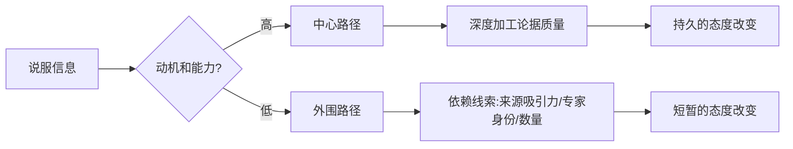
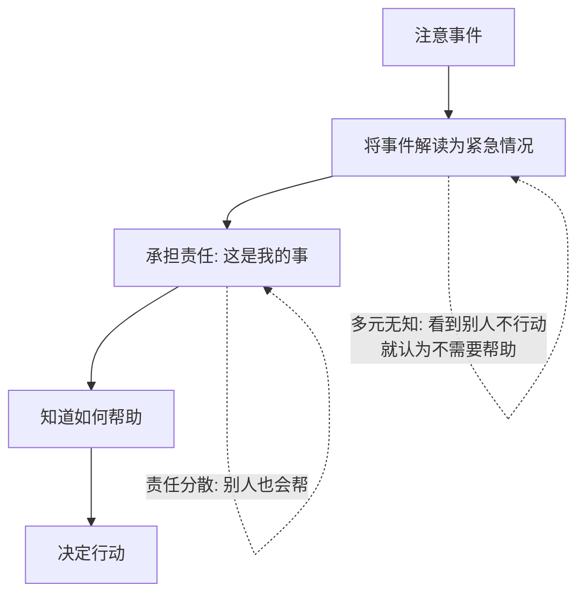

## 四、社会心理学

社会心理学（Social Psychology）是心理学中最具实践价值的分支之一。它研究的核心问题可以用一句话概括：**个体的思想、情感和行为如何被他人——真实的、想象的或隐含的——所影响。** 这门学科的威力在于，它不仅解释"人为什么会这样做"，更揭示了那些你意识不到却在深刻塑造你决策的社会力量。

理解社会心理学，就是理解自己为什么会在群体中做出独自一人时绝不会做的事情，理解为什么"人言可畏"不只是一个成语，而是一个被无数实验反复验证的心理机制。

### 4.1 社会认知：我们如何理解他人

社会认知（Social Cognition）研究人们如何选择、解释、记忆和运用关于他人和社会情境的信息。它是社会心理学的基础模块，因为你怎么"看"世界，决定了你怎么在世界中行动。

#### 4.1.1 归因理论：谁该为这件事负责

归因（Attribution）是人们解释行为原因的心理过程。这个过程看似理性，实际上充满了系统性偏差。

**Heider 的朴素心理学**认为，人们在解释行为时面临一个基本选择：是这个人的内在特质导致了行为（内部归因），还是外部环境导致了行为（外部归因）。例如，同事迟到了，你可能想"他这个人不守时"（内部归因），也可能想"今天早高峰堵车严重"（外部归因）。

**Kelley 的协变模型**提出了三条判断标准：

| 判断标准 | 含义 | 举例 |
|---------|------|------|
| 一致性（Consistency） | 这个人在不同时间、不同场合是否都这样做 | 他每次都迟到？还是只有今天？ |
| 一致性（Distinctiveness） | 这个人对其他事情是否也这样 | 他只在上班迟到？还是做什么都迟到？ |
| 共识性（Consensus） | 其他人在同样情境下是否也这样 | 今天只有他迟到？还是大家都迟到了？ |

当一致性高、独特性高、共识性高时，人们倾向于外部归因；当一致性高、独特性低、共识性低时，人们倾向于内部归因。

**归因中的系统性偏差**：

- **基本归因错误（Fundamental Attribution Error）**：解释他人行为时，过度强调内在特质而低估情境因素。Jones 和 Harris 的经典实验让被试阅读支持或反对卡斯特罗的文章，即使被告知作者是被指定立场的，被试仍然认为"写支持文章的人真的喜欢卡斯特罗"。这个偏差在西方个人主义文化中更为显著——Lee 等人（1999）的研究发现，韩国被试在解释他人行为时比美国被试更多考虑情境因素。

- **行动者-观察者偏差（Actor-Observer Bias）**：解释自己的行为时倾向归因于情境（"我迟到是因为堵车"），解释他人行为时倾向归因于特质（"他迟到是因为不守时"）。这个偏差的根源在于信息不对称——你对自己经历的情境压力有切身感受，对他人的则缺乏了解。

- **自利性偏差（Self-Serving Bias）**：成功时归因于自己的能力和努力，失败时归因于运气差或任务太难。这个偏差在维护心理健康方面有积极作用——适度的自利性偏差与更好的心理适应和更高的自尊相关。但在团队协作中，它会导致责任推诿和冲突升级。

**为什么理解归因很重要？** 因为归因直接影响你的情绪和后续行为。把考试失败归因于"我不够聪明"（稳定、内在、不可控）会导致习得性无助；而归因于"这次复习方法不对"（不稳定、内在、可控）则会促使你调整策略。这就是 Seligman 的归因风格理论的核心——你的解释风格决定了你是乐观者还是悲观者。

#### 4.1.2 刻板印象、偏见与歧视

这三者构成了一个从认知到态度再到行为的递进链条：

- **刻板印象**（Stereotype）：对某群体的过度简化、固定化的认知——"程序员都不善社交"
- **偏见**（Prejudice）：基于刻板印象的负面情感态度——"我不想和程序员交朋友"
- **歧视**（Discrimination）：基于偏见的负面行为——拒绝录用程序员做销售岗位

**偏见的形成机制**：

1. **社会分类（Social Categorization）**：人类大脑天然倾向于将世界分成"我们"和"他们"。Tajfel 的最小群体范式实验发现，即使只是根据"你喜欢克利画还是康定斯基画"这样随机的标准把人分成两组，人们就会立刻开始偏袒自己所在的群体。

2. **内群体偏好（In-Group Favoritism）**：人们倾向于对自己所属群体给予更积极的评价和更优厚的资源分配。这种偏好不需要对外群体的敌意——仅仅是偏爱"自己人"就足以产生不平等。

3. **外群体同质性偏差（Out-Group Homogeneity Bias）**：认为外群体成员彼此相似（"他们都差不多"），而内群体成员各不相同（"我们每个人都很独特"）。这种偏差使得刻板印象得以维持——因为你不会主动去关注外群体中的个体差异。

4. **确认偏差**：一旦形成对某群体的刻板印象，你会倾向于注意和记忆那些与刻板印象一致的信息，而忽视或遗忘不一致的信息。

**偏见的减少途径**（基于 Allport 的接触假说及其后续发展）：

有效减少偏见的群际接触需要满足四个条件：**平等的地位**（双方在接触中处于平等位置）、**共同的目标**（需要合作才能达成的目标）、**制度的支持**（权威和社会规范支持接触）、**个人化的互动**（深入了解个体而非只看到群体标签）。Pettigrew 和 Tropp（2006）对 515 项研究的元分析表明，满足这些条件的接触能有效减少偏见，效应量为 d=0.43。

#### 4.1.3 印象管理：你呈现给世界的自己

Goffman 的拟剧论（Dramaturgical Theory）将社会互动比作舞台表演。每个人都在进行"印象管理"（Impression Management）——有意识或无意识地控制他人对自己的印象。

**印象管理的策略**：
- **自我提升**：展示自己的优点和成就——面试时穿正装、简历上突出成绩
- **讨好**：恭维他人、表达同意、提供帮助——请客吃饭、夸赞对方
- **示范**：以身作则，展示期望他人效仿的行为
- **恳求**：展示自己的弱点和依赖性，以获得他人帮助——"我真的不太懂这个，能教教我吗？"
- **联合**：通过强调与他人的共同点来拉近距离——"我们是校友"

**自我监控（Self-Monitoring）**是影响印象管理风格的个体差异。高自我监控者善于根据情境调整自己的行为表现，像社交变色龙；低自我监控者则在不同情境中保持一致，更注重"做真实的自己"。两种风格各有优劣——高自我监控者社交适应性强但可能被认为不真诚，低自我监控者真实但可能在社交灵活性上受限。

#### 4.1.4 社会比较理论

Festinger（1954）提出，人们有一种驱力想要评价自己的能力和观点，而当缺乏客观标准时，就会通过与他人比较来评价自己。

- **上行比较**（与比自己强的人比）：可能激发动力，也可能引发嫉妒和自卑
- **下行比较**（与比自己差的人比）：可以提升自尊和幸福感，但可能导致自满
- **平行比较**（与和自己相似的人比）：信息最有参考价值，但也最容易引发竞争心理

在社交媒体时代，上行比较变得更加频繁和强烈。人们在朋友圈看到的多是他人精心筛选的美好瞬间，这导致持续的上行比较，与焦虑和抑郁显著相关（Verduyn 等，2015）。

### 4.2 社会影响：他人的力量

社会影响（Social Influence）是社会心理学中最震撼人心的领域——它揭示了人们在群体压力下会做出多么违背自己本性的事情。

#### 4.2.1 从众

从众（Conformity）是个体在群体压力下改变自己的行为或信念以与群体保持一致的现象。

**Asch 的线段实验（1951）**是社会心理学史上最著名的实验之一。被试被安排在一组"托儿"中，判断哪条线段与标准线段一样长。当所有"托儿"故意给出明显错误的答案时，约 **75% 的被试至少有一次从众行为**，总体从众率约为 37%。但当被试可以匿名作答或只需写下答案时，从众率显著下降——这说明很多从众是出于规范性影响而非真正的认知改变。

从众背后的两种机制：

| 机制 | 驱动力 | 内心状态 | 举例 |
|------|--------|---------|------|
| 信息性社会影响 | "他们可能知道我不知道的" | 真正被说服，改变了自己的观点 | 在陌生城市问路，多数人指同一个方向就跟着走 |
| 规范性社会影响 | "我不想被排斥" | 内心不同意但表面顺从 | 明知同事的方案有问题，但会议上不敢反对 |

**影响从众程度的因素**：

- **群体规模**：从众率随群体人数增加而上升，但到 3-5 人后趋于平稳
- **群体一致性**：只要有一个"同盟者"（哪怕他的答案也是错的），从众率就会大幅下降——Asch 的变体实验显示，有一个同盟者时从众率从 37% 降至 5%
- **群体凝聚力**：群体越有吸引力，从众压力越大
- **公共 vs 私下反应**：公共场合下的从众率远高于私下
- **文化因素**：集体主义文化（如日本、中国）中的从众率普遍高于个人主义文化（如美国）
- **任务难度**：任务越困难、越模糊，信息性从众越强

**从众的双面性**：从众并非全是坏事。它促进社会规范的遵守（排队、遵守交通规则），增加群体凝聚力和协作效率。关键在于区分**盲目从众**和**合理采纳群体智慧**。

#### 4.2.2 服从权威

Milgram 的电击实验（1961-1963）是心理学史上最具争议也最发人深省的实验。在"学习实验"的伪装下，被试被要求对另一个人（实际为实验助手）施加逐渐增大的电击。在标准条件下，**65% 的被试一直服从到最高电压（450V）**——尽管"受害者"已经不再回应、发出了痛苦的尖叫甚至恳求停止。

这个结果震惊了学术界。实验前，心理学家预测只有 1% 的人会服从到底；精神病学家预测只有 4%。现实与预测之间巨大的落差揭示了一个令人不安的事实：**在权威的命令下，普通人都可能做出伤害他人的行为。**

**服从的关键条件**：
- **权威的接近性**：当"权威"不在场（通过电话指示）时，完全服从率从 65% 降至 20.5%
- **受害者的接近性**：当被试必须亲手触摸"受害者"时，服从率进一步下降
- **权威的合法性**：实验在耶鲁大学进行时服从率更高；搬到一个不起眼的办公室后有所下降
- **责任的转移**：当被试被告知"一切责任由实验者承担"时，服从率更高
- **渐进式承诺**：电击从 15V 开始，每次只增加 15V——这种"登门槛"效应使得每一步都显得微不足道

**抵抗服从的因素**：当被试看到其他"被试"（实际为同盟者）拒绝继续时，不服从率显著上升——**同伴的反抗是抵抗权威最有效的力量之一**。此外，道德发展水平越高、对权威合法性的质疑越强，越不容易盲目服从。

#### 4.2.3 社会促进、社会惰化与去个体化

**社会促进（Social Facilitation）**：他人在场会唤醒个体的生理唤醒水平，从而提升简单/熟练任务的表现，但降低复杂/新学任务的表现。Zajonc（1965）用驱力理论解释了这个现象——他人在场增强了优势反应（dominant response）。对熟练任务，优势反应是正确答案，所以表现提升；对新任务，优势反应可能是错误的，所以表现下降。**实践意义**：练习阶段找个安静的地方独自学习，展示/表演阶段则让观众在场。

**社会惰化（Social Loafing）**：群体中个人的努力程度随群体规模增大而降低。Latane 等人（1979）的经典实验发现，蒙眼被试被要求喊叫时，2 人组中每人喊叫的音量是单独喊叫时的 82%，6 人组降至 74%。减少社会惰化的方法：让每个人的贡献可被识别、提高任务的意义感和参与感、建立群体认同。

**去个体化（Deindividuation）**：在群体中，个体的自我意识和自我约束降低。Zimbardo 的监狱实验、暴徒行为、网络暴力都是去个体化的极端案例。匿名性和群体淹没感是去个体化的核心触发条件。反面启示：提高个体的自我意识（如放置镜子、强调个人身份）可以减少去个体化导致的反社会行为。

### 4.3 态度与态度改变

态度（Attitude）是社会心理学的核心概念——它由三个成分构成：**认知成分**（对对象的信念）、**情感成分**（对对象的情感）、**行为成分**（对对象的行为倾向）。理解态度如何形成和如何改变，是说服、营销和自我改变的基础。

#### 4.3.1 认知失调理论

Festinger（1957）的认知失调理论是态度改变领域最有影响力的理论。当个体同时持有两个不一致的认知（信念、态度或行为）时，会产生心理不适感（失调），并驱动个体去减少这种不适。

**减少失调的常见方式**：
1. **改变行为**使之与态度一致——知道吸烟有害就戒烟
2. **改变态度**使之与行为一致——"吸烟其实没那么有害"
3. **增加新的认知**来合理化——"吸烟能帮我减压，减压对健康也有好处"
4. **降低认知的重要性**——"反正人总是要死的"

**经典案例**：
- **$1/$20 实验**（Festinger & Carlsmith，1959）：被试被要求做一项极其无聊的任务，然后告诉下一个被试"这个任务很有趣"。获得 $1 报酬的人比获得 $20 的人更倾向于真的认为任务有趣——因为 $1 不足以合理化自己的说谎行为，失调只能通过改变态度来减少。
- **努力正当化**（Effort Justification）：人们为某件事付出越多努力，越倾向于认为这件事很有价值。这就是为什么入会仪式越严苛，成员对组织的忠诚度越高。

#### 4.3.2 精细加工可能性模型（ELM）

Petty 和 Cacioppo（1986）提出的 ELM 模型解释了说服的两条路径：

- **中心路径**：当接收者有动机且有能力深入思考时，论据的质量决定说服效果。这种方式产生的态度改变更持久、更能预测行为。
- **外围路径**：当接收者缺乏动机或能力时，会依赖外围线索——信息来源是否权威、是否有名人代言、论据数量是否多。这种方式产生的态度改变较短暂。

**实践意义**：想要真正说服一个深思熟虑的人，必须提供有力的证据和严密的逻辑；面对不太关心的受众，提升信源可信度和增加论据数量更有效。

### 4.4 人际关系的心理学

人际关系是人类幸福的最强预测因素之一。Harvard Study of Adult Development 追踪了 724 人超过 80 年，发现**良好的人际关系是幸福和健康的最重要因素**，超过了社会阶层、智商甚至基因。

#### 4.4.1 人际吸引

**影响人际吸引的核心因素**：

- **接近性（Proximity）**：地理距离越近，越可能产生好感。Festinger 等人对 MIT 学生宿舍的研究发现，住得越近的学生越可能成为朋友。这背后的机制是**曝光效应（Mere Exposure Effect）**——反复接触某个刺激会增加对它的好感（Zajonc，1968）。

- **相似性（Similarity）**：态度、价值观和兴趣的相似是吸引的最重要因素之一。Byrne（1971）的研究发现，态度相似度与人际吸引呈线性关系——相似度越高，吸引力越强。这适用于友谊和长期关系。"物以类聚"比"异性相吸"有更坚实的实证支持。

- **外貌吸引力**：在初始吸引中作用显著。Walster 等人（1966）的计算机舞会实验发现，外貌吸引力是预测是否愿意再次约会的最强因素，甚至超过了人格和智力。但外貌吸引力在长期关系中的重要性会逐渐降低。**光环效应（Halo Effect）**使得人们倾向于认为外貌有吸引力的人同时也更聪明、更善良、更有趣。

- **互惠性（Reciprocity）**：知道他人喜欢自己会增加对他人的好感。这种"你喜欢我，所以我喜欢你"的模式是建立关系的强大动力。

- **匹配假说（Matching Hypothesis）**：人们倾向于选择与自己吸引力水平相似的人作为伴侣。这不是"降级选择"，而是一种现实策略——追求远超自己吸引力水平的对象成功率低，长期匹配的关系更稳定。

#### 4.4.2 依恋理论与亲密关系

Bowlby 的依恋理论是理解亲密关系最重要的理论框架。核心思想是：**婴儿期与主要照料者的互动模式形成了"内部工作模型"（Internal Working Model），这个模型成为日后所有人际关系——尤其是亲密关系——的蓝图。**

Ainsworth 的陌生情境实验识别了三种婴儿依恋类型，后来 Hazan 和 Shaver（1987）将其扩展为成人依恋类型：

| 依恋类型 | 核心信念 | 在关系中的表现 | 大致比例 |
|---------|---------|---------------|---------|
| 安全型 | "我是值得被爱的，他人是可信赖的" | 能自在地亲密和独立，信任伴侣，有效处理冲突 | ~60% |
| 焦虑-矛盾型 | "我不确定自己是否值得被爱，担心被抛弃" | 渴望极度亲密，容易嫉妒，反复寻求确认，对伴侣的回应高度敏感 | ~20% |
| 回避型 | "依赖他人是危险的，我应该自给自足" | 回避亲密，压抑情感，在关系变得亲密时感到不适 | ~20% |
| 混乱型 | 对自我和他人的认知矛盾 | 既渴望亲密又恐惧亲密，行为模式不一致 | 较少见 |

**重要补充**：依恋类型不是命运。虽然早期经验有影响，但成年后的新关系经验——特别是与安全型伴侣的关系——可以逐步改变依恋模式。这被称为"习得的安全感"（Earned Security）。

#### 4.4.3 爱情理论

**Sternberg 的爱情三角理论**将爱情分解为三个成分：

- **亲密（Intimacy）**：情感亲近、温暖、分享、理解
- **激情（Passion）**：浪漫吸引、身体吸引、性驱力
- **承诺（Commitment）**：短期内决定爱一个人，长期内维持这段关系

不同组合产生不同类型的爱：

| 爱情类型 | 亲密 | 激情 | 承诺 | 典型阶段 |
|---------|------|------|------|---------|
| 喜欢 | ✓ | ✗ | ✗ | 真正的友谊 |
| 迷恋 | ✗ | ✓ | ✗ | 一见钟情 |
| 空洞的爱 | ✗ | ✗ | ✓ | 婚姻的后期阶段 |
| 浪漫之爱 | ✓ | ✓ | ✗ | 恋爱早期 |
| 伴侣之爱 | ✓ | ✗ | ✓ | 长期婚姻 |
| 愚昧之爱 | ✗ | ✓ | ✓ | 闪婚 |
| 完美的爱 | ✓ | ✓ | ✓ | 理想状态，需要持续经营 |

**关系维护的关键行为**：Gottman 的研究（"爱情实验室"）发现，能够预测关系破裂的关键指标是**四大末日骑士**：批评（对人格的攻击而非对行为的反馈）、蔑视（嘲讽、翻白眼、挖苦）、防御（推卸责任、反唇相讥）、石墙（冷暴力、拒绝沟通）。其中**蔑视是最强的预测因子**。维护关系的积极策略包括：保持好奇和关注、表达感激、在小事上表达善意、在冲突中使用温和的开场白。

### 4.5 群体心理

人在群体中的行为方式与独处时截然不同。理解群体心理，是理解社会运动、组织行为和网络舆论的基础。

#### 4.5.1 群体极化

群体极化（Group Polarization）指群体讨论后，成员的态度倾向于向原有倾向的极端方向移动——如果成员初始倾向于冒险，讨论后会更冒险；如果初始倾向于保守，讨论后会更保守。

**产生机制**：
- **信息性影响**：讨论中接触到更多支持初始倾向的论据
- **社会比较**：人们想要表现得比群体平均水平"更"符合群体倾向
- **群体认同**：强化"我们"的立场以区别于"他们"

**现实影响**：这是为什么互联网上的观点越来越极化的心理学基础。算法推荐+回音室效应+群体讨论=极端化加速。了解这个机制有助于你在参与群体讨论时保持警惕——**如果你在讨论后觉得自己的观点"更加正确了"，这可能不是理性思考的结果，而是群体极化在起作用。**

#### 4.5.2 群体思维

Janis（1972）提出群体思维（Groupthink）概念来解释为什么高度凝聚的群体会做出灾难性决策。典型案例包括肯尼迪政府的猪湾入侵决策、挑战者号航天飞机发射决策。

**群体思维的八个症状**：
1. 对群体的无懈可击的幻觉
2. 集体合理化（为决策寻找理由）
3. 对群体道德的坚信不疑
4. 对外群体的刻板印象
5. 对异议者的直接压力
6. 自我审查（成员主动压制自己的疑虑）
7. 一致同意的幻觉（沉默被解读为同意）
8. 自封的"思想警卫"（保护群体免受反对信息的干扰）

**预防群体思维的方法**：
- 领导者鼓励批评性评价，而不是在讨论一开始就表态
- 设立"魔鬼代言人"（Devil's Advocate）角色
- 引入外部专家的意见
- 将群体分成子小组分别讨论，再汇总
- 匿名收集每个成员的意见

#### 4.5.3 旁观者效应

Darley 和 Latané（1968）在 Kitty Genovese 案件的启发下，发现了旁观者效应（Bystander Effect）：**在场人数越多，个体提供帮助的可能性越低。**

他们的实验中，被试在独处或与他人一起时听到隔壁房间有人癫痫发作。独处时 85% 的人寻求帮助；当被试认为还有另外 1 人在场时，降至 62%；当认为还有 4 人在场时，仅 31%。

**旁观者介入的五步决策模型**（Latané & Darley）：

**如何在紧急情况下获得帮助**：不要对人群喊"谁来帮帮我"——这正是责任分散的完美触发条件。**明确指定某个人**："穿红色外套的先生，请帮我打120"。这消除了责任分散，直接将对方从旁观者转变为行动者。

#### 4.5.4 社会认同理论

Tajfel 和 Turner（1979）的社会认同理论（Social Identity Theory）是理解群际关系最重要的理论框架。它解释了为什么"我们"与"他们"的区分如此根深蒂固。

社会认同理论的三个核心过程：

1. **社会分类**：将自己和他人归入不同类别（国籍、职业、兴趣群体等）。分类是认知捷径，但也带来了刻板印象的种子。

2. **社会认同**：从群体成员身份中获取自我价值感。"我是XX大学的学生"不仅是一个事实陈述，也承载着骄傲或耻辱。

3. **社会比较**：通过将内群体与外群体比较来维持积极的社会认同。当内群体在比较中处于劣势时，人们会采用各种策略：改变比较维度、离开群体、或者攻击外群体。

**社会认同的现实意义**：理解了社会认同理论，你就理解了为什么球迷会因球队输球而痛苦（尽管他没有上场），为什么民族主义如此有感染力，为什么网络社群的"圈内人"文化如此强烈，以及为什么组织认同可以成为强大的管理工具。

### 4.6 亲社会行为与攻击行为

#### 4.6.1 亲社会行为：为什么会帮助他人

亲社会行为（Prosocial Behavior）包括帮助、分享、合作和安慰等对他人有益的行为。

**帮助行为的动机分析**：

- **利他主义假说**：人们有时确实会出于纯粹的利他动机帮助他人，不期待任何回报
- **互惠利他**：Trivers 提出，帮助他人是因为期待将来自己也会获得帮助
- **共情-利他假说**：Batson 认为，当对他人产生共情时，会以减轻他人痛苦为目标进行帮助，而不仅仅是为了减轻自己的不适感。他的一系列实验证明，即使可以轻易逃避不帮助（即不用忍受旁观他人痛苦的不适），高共情的被试仍然会选择帮助
- **消极状态缓解模型**：心情不好的人帮助他人是为了让自己感觉好一些

**增加帮助行为的因素**：心情好、时间充裕、与受害者相似、感到内疚、有共情能力。

#### 4.6.2 攻击行为的心理学

攻击行为（Aggression）的理论解释分为两大阵营：

**本能论**：Freud 认为攻击是一种本能（Thanatos，死亡本能），需要宣泄或升华。Lorenz 从进化角度认为攻击有生存功能（争夺资源、保护领地）。但"宣泄假说"并未获得实证支持——发泄攻击（如打沙袋）实际上可能增加而非减少后续攻击行为。

**社会学习论**：Bandura 的波波娃娃实验（1961）证明，攻击行为可以通过观察学习获得。儿童看到成人攻击波波娃娃后，会模仿攻击行为——特别是当攻击者受到奖励时。这说明攻击行为不是不可控的本能释放，而是习得的、受环境影响的行为。

**影响攻击的因素**：高温、疼痛、酒精、挫折（挫折-攻击假说）、媒体暴力、社会学习。

### 4.7 现代社会心理学议题

#### 4.7.1 社交媒体心理学

社交媒体深刻改变了人际互动的方式，也带来了新的心理现象：

- **社交媒体中的印象管理**：人们精心编辑自己的在线形象，展示理想化的自我。这种"策展式生活"导致他人的上行比较和自身的不真实感
- **FOMO（Fear of Missing Out）**：对错过社交活动或信息的焦虑，驱使人们持续查看社交媒体
- **网络去个体化效应**：匿名性和缺乏面对面接触使得网络上的攻击性行为更加普遍（网络暴力、键盘侠现象）
- **信息茧房**：算法推荐和选择性接触导致人们只看到与自己观点一致的信息，加剧群体极化
- **在线亲密关系**：网络关系的建立速度快、深度深（超人际模型），但也面临信任和真实性挑战

#### 4.7.2 文化与社会心理

文化对社会心理过程有深远影响。Triandis 区分了个人主义文化（强调独立自我、个人目标）和集体主义文化（强调互依自我、群体目标）：

| 维度 | 个人主义文化 | 集体主义文化 |
|------|------------|------------|
| 自我概念 | 独立的、独特的 | 互依的、关系性的 |
| 归因风格 | 更多内部归因 | 更多外部归因 |
| 从众倾向 | 较低 | 较高 |
| 情绪表达 | 强调个人情绪 | 强调社会情绪（如面子） |
| 关系取向 | 自主选择 | 角色义务 |

但需注意，个人主义-集体主义是连续体而非二分法，同一文化内部也存在巨大的个体差异和区域差异。

### 4.8 实践应用工具箱

将社会心理学知识转化为日常可用的策略：

**自我认知**：
- 觉察基本归因错误——评价他人时先问"如果我处在他的情境下会怎么做"
- 识别自利性偏差——成功时想想外部因素的帮助，失败时想想自己可以改进的地方
- 定期检查自己的刻板印象——你对哪些群体有自动化的负面联想？

**社交影响力**：
- 想要说服他人时，根据对方的投入程度选择中心路径或外围路径
- 面对群体压力时，记住 Asch 实验的启示——只要有一个同盟者就能大幅降低从众压力
- 在紧急情况下明确指定责任人，避免旁观者效应

**关系经营**：
- 主动创造接近性条件，增加社交曝光
- 学习安全型依恋的行为模式：情感可及性（在对方需要时出现）、回应性（积极回应对方的情感需求）、承诺（一致性和可靠性）
- 识别并避免"四大末日骑士"，在冲突中使用温和的开场白

**团队协作**：
- 预防群体思维：鼓励异见、引入外部视角、匿名收集意见
- 减少社会惰化：使个人贡献可识别、提高任务意义感
- 注意群体极化：重大决策前引入反方观点和外部评估
