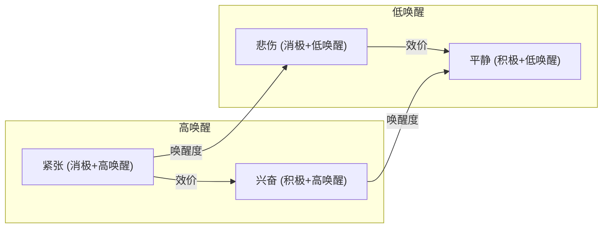
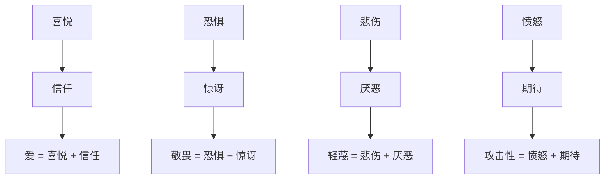

## 五、情绪心理学

情绪是人类心理活动的核心维度之一。它不仅决定了我们的日常体验质量，还深刻影响着决策、记忆、人际关系和身体健康。理解情绪的运作机制，是自我认知和心理健康的基础能力。

### 5.1 什么是情绪

情绪（Emotion）是个体对与其需求和目标相关联的内外在事件所产生的复杂的心理-生理反应。这个定义包含三层含义：第一，情绪不是凭空产生的，它必然与某个"刺激事件"相关联；第二，这个事件必须与个体的"需求和目标"有关——对同一件事，不同人可能产生完全不同的情绪；第三，情绪是"心理-生理"的综合体，它不只是"感觉"，还伴随着身体的切实变化。

情绪包含四个核心成分：

1. **主观体验**：个人感受到的主观状态（如快乐、悲伤、愤怒）。这是情绪最私密的层面，只有当事人能够直接体验到。同一种情绪在不同人身上的体验可能有微妙差异——你的"焦虑"和我的"焦虑"在质感上并不完全相同。
2. **生理唤醒**：自主神经系统的变化（如心跳加速、出汗、肌肉紧张）。这些变化往往先于意识觉察而发生。当你在黑暗中突然听到身后有脚步声，你的心跳加速和肌肉紧绷几乎是在你"意识到恐惧之前"就已经开始了。
3. **认知评价**：对情境意义的解读（"这个威胁有多大？""我能应对吗？"）。这是人类情绪区别于动物情绪的关键——我们不仅对事件本身做出反应，更对事件的"意义"做出反应。同样被朋友取消约会，如果你解读为"ta不在乎我"会感到愤怒，如果解读为"ta可能遇到了困难"则会感到关心。
4. **行为倾向**：准备采取的行动（如逃跑、攻击、接近、回避）。情绪本质上是行动的准备状态。恐惧准备逃跑，愤怒准备攻击，好奇准备接近。理解行为倾向有助于理解为什么我们会在特定情绪下做出特定行为——那不是"失控"，而是进化为我们装备的反应程序。

**情绪与相关概念的区分**：

| 概念 | 持续时间 | 强度 | 是否有明确对象 | 示例 |
|------|----------|------|----------------|------|
| 情绪（Emotion） | 短暂（秒到分钟） | 较强 | 通常有明确对象 | 对某人发火、考试前紧张 |
| 情感（Feeling） | 较长（分钟到小时） | 中等 | 可以模糊 | 整体感到幸福、隐隐不安 |
| 心境（Mood） | 长（小时到天） | 较弱 | 通常没有明确对象 | 这几天心情低落、今天状态不错 |
| 情感特质（Trait） | 持久稳定 | 持续存在 | 个人特征 | 天生乐观、容易焦虑 |

理解这些区别在日常生活中很有价值。当你说"我很焦虑"时，分清这是针对特定事件的情绪反应，还是一种弥散性的心境，抑或是你的一种性格倾向，解决方法会完全不同。

### 5.2 基本情绪理论

#### 5.2.1 离散情绪理论

**基本情绪理论（Ekman）**：Paul Ekman 在对多个文化群体（包括与世隔绝的新几内亚部落）的面部表情研究后提出，存在少数几种全人类共有的基本情绪。这些情绪具有独特的面部表情模式和进化功能，是进化为人类"预装"的心理程序：

| 基本情绪 | 面部特征 | 进化功能 | 触发情境示例 |
|----------|----------|----------|--------------|
| **快乐** | 嘴角上扬、眼角鱼尾纹（真笑标志） | 接近有益事物、增强社会联结 | 获得奖励、与亲近的人在一起 |
| **悲伤** | 眉毛内侧上扬、嘴角下拉 | 应对失去、引发他人同情和帮助 | 失去亲人、目标受阻 |
| **愤怒** | 眉毛下压、嘴唇紧闭或张开 | 对抗威胁和不公、维护边界 | 被侵犯、遭受不公平对待 |
| **恐惧** | 眼睛睁大、眉毛上扬、嘴巴微张 | 逃避危险、提高警觉 | 面对突发威胁、不确定性 |
| **厌恶** | 上唇上扬、鼻子皱起 | 避免有害物质、拒绝道德违背 | 闻到腐臭、看到不道德行为 |
| **惊讶** | 眼睛圆睁、嘴巴张开、眉毛高扬 | 对新异刺激的定向和快速评估 | 意外事件、新信息出现 |

Ekman 后来的研究扩展了基本情绪清单，增加了**轻蔑**（单侧嘴角上扬，被认为是人类独有的）、**兴奋**、**内疚**、**自豪**、**满足**、**羞耻**等情绪类别。值得注意的是，基本情绪理论并非没有争议——一些研究者认为"基本情绪"的数量和类型因文化而异，面部表情的普遍性也受到了一些挑战。

**基本情绪的实际意义**：识别自己的基本情绪是情绪管理的第一步。当你能够准确地将"不舒服的感觉"标注为"愤怒"而非"焦虑"时，你就能选择更合适的应对策略。愤怒指向边界的修复，焦虑指向威胁的评估，两者的应对方式截然不同。

#### 5.2.2 维度情绪理论

**环形模型（Russell）**：James Russell 提出，情绪可以用两个基本维度来描述，所有情绪都可以映射到这个二维空间中的某个位置：

- **效价（Valence）**：从消极到积极，反映情绪的"好坏"属性
- **唤醒度（Arousal）**：从低唤醒到高唤醒，反映情绪激活的强度

维度理论的优势在于：它能精确描述那些"说不清是什么但确实存在"的情绪状态。比如"既紧张又兴奋"对应的就是"高唤醒+偏积极"的区域，这用离散情绪理论很难精确表达。

**Plutchik的情绪轮**：Robert Plutchik 提出了一个更复杂的模型，将八种基本情绪按强度排列并组合，形成复合情绪：

这种组合解释了人类情绪的丰富性：我们体验到的复杂情绪（如嫉妒 = 愤怒 + 悲伤 + 恐惧、怀旧 = 喜悦 + 悲伤）都是基本情绪的组合。

### 5.3 情绪的认知理论

#### 5.3.1 认知评价理论

**认知评价理论（Lazarus）**：Richard Lazarus 的理论是情绪心理学中最具影响力的理论之一，其核心命题是：**情绪的产生取决于个体对事件的认知评价，而非事件本身**。同一个事件可以引发完全不同的情绪，关键在于你如何"解读"它。

Lazarus 将认知评价分为两个阶段：

**初级评价**——"这件事与我有关吗？是好事还是坏事？"

| 评价结果 | 产生的情绪 | 生活实例 |
|----------|------------|----------|
| **无关** | 不产生情绪 | 听说非洲某国换了总统，与你无关 |
| **有益** | 积极情绪（快乐、希望、感激） | 收到心仪公司的录取通知 |
| **有害/威胁** | 消极情绪（恐惧、愤怒、悲伤） | 发现账户被冻结 |
| **挑战** | 兴奋、期待 | 面对一个有难度但有机会的项目 |

**次级评价**——"我能应对吗？我有什么资源？"

| 评价结果 | 情绪走向 | 生活实例 |
|----------|----------|----------|
| 能够应对 | 情绪强度降低，产生适应性行为 | "被裁员了，但我有积蓄和技能，可以找到更好的" |
| 无法应对 | 情绪强度增加，焦虑、无助感 | "被裁员了，房贷还有20年，我什么都不会" |
| 可能获得帮助 | 希望、感激 | "虽然遇到困难，但朋友/家人会支持我" |

这一理论的核心洞见是：**不是事件本身，而是我们对事件的解读决定了我们的情绪反应**。这直接成为了认知行为疗法（CBT）的理论基础——通过改变认知评价，就能改变情绪反应。

**一个具体案例**：同样是收到老板的"来我办公室一下"这条消息：
- 评价1："最近我绩效不好，肯定要挨批了" → 焦虑
- 评价2："可能是要给我升职或分配重要项目" → 期待
- 评价3："最近裁员潮，不会是要裁我吧" → 恐惧
- 评价4："老板可能是想聊聊项目进展" → 平静

消息内容完全一样，但因为认知评价不同，产生了完全不同的情绪。理解这一点的意义在于：当你陷入负面情绪时，你至少有一个可控的干预点——审视和调整你的认知评价。

#### 5.3.2 情绪的功能

情绪不是"需要克服的障碍"，它有明确的心理功能：

- **适应功能**：情绪帮助我们适应环境，做出快速反应。恐惧让我们在危险面前迅速行动（战斗或逃跑），不需要花时间"理性分析"。在进化环境中，那些对蛇和高处有恐惧反应的祖先更容易存活。
- **动机功能**：情绪激发和引导行为。没有情绪参与，人很难"启动"行动。安东尼奥·达马西奥（Antonio Damasio）研究的额叶损伤患者就是例证——他们的理性推理能力完好，但因为无法正常产生情绪体验，连"午饭吃什么"这样的简单决定都无法做出。
- **社会功能**：情绪表达影响人际互动。悲伤引发他人的帮助行为，愤怒传递"你越界了"的信号，恐惧引发群体的警觉。情绪是人类社会的"非语言通信系统"。
- **认知功能**：情绪影响注意、记忆和思维。恐惧使人更关注威胁信息（注意力偏向），愉快状态下记忆更容易提取（心境一致性效应），情绪为信息打上"重要性标签"。

### 5.4 情绪的神经生理机制

理解情绪的生物学基础有助于打破"情绪是软弱的表现"这一偏见——情绪是硬编码在我们神经系统中的生存机制。

#### 5.4.1 大脑中的情绪回路

情绪的产生和调控涉及多个脑区的协同工作：

**杏仁核（Amygdala）**：情绪处理的核心枢纽，尤其与恐惧和威胁检测密切相关。杏仁核的运作有两个特点：第一，它处理速度极快，可以在意识觉察之前就启动恐惧反应（"低通路"——感觉信息通过丘脑直接到达杏仁核，绕过了需要更长时间处理的皮层）；第二，它倾向于"宁可错报，不可漏报"——在进化中，把绳子误认为蛇（假阳性）的代价远小于把蛇误认为绳子（假阴性）的代价。

**前额叶皮层（Prefrontal Cortex, PFC）**：情绪调控的"高级指挥中心"，尤其是腹内侧前额叶和背外侧前额叶。PFC 评估情绪刺激的意义、调节杏仁核的反应强度、执行情绪调节策略。PFC 与杏仁核的关系可以类比为"骑手与马"——PFC 是试图控制方向的骑手，杏仁核是受到惊吓会狂奔的马。当我们说某人"情绪失控"时，通常意味着杏仁核的活动压过了 PFC 的调控能力。

**前扣带皮层（Anterior Cingulate Cortex, ACC）**：监测情绪冲突和错误，参与情绪的意识觉察。当你"感觉到有什么不对劲"但说不出具体是什么，往往是 ACC 在发挥作用。

**岛叶（Insula）**：整合身体内部感觉（如心跳、胃部紧张）与情绪体验。当你"心慌"或"胃里不舒服"时，岛叶正在将身体信号转化为情绪感受。

#### 5.4.2 自主神经系统与情绪

情绪的"身体感受"主要由自主神经系统（ANS）的两个分支介导：

| 系统 | 激活情绪 | 身体反应 | 进化意义 |
|------|----------|----------|----------|
| 交感神经系统 | 恐惧、愤怒、兴奋 | 心跳加速、血压升高、瞳孔扩大、消化减慢、肌肉紧张 | 准备战斗或逃跑（能量调动） |
| 副交感神经系统 | 平静、安全 | 心跳减慢、血压下降、消化活跃、肌肉放松 | 恢复和修复（能量储存） |

**多迷走神经理论（Polyvagal Theory）**：Stephen Porges 提出的理论进一步细化了自主神经系统对情绪的调控，提出三种由高到低的安全状态：社会参与（腹侧迷走神经激活，感到安全、能社交）、战斗或逃跑（交感神经激活，感到威胁）、冻结（背侧迷走神经激活，极度威胁下的"装死"反应）。这个理论对理解创伤反应和社交焦虑特别有价值。

#### 5.4.3 激素与神经递质

情绪体验背后有丰富的化学物质参与：

- **皮质醇**：压力激素，长期高水平与焦虑、抑郁相关
- **肾上腺素/去甲肾上腺素**：与恐惧和愤怒的生理唤醒相关
- **血清素**：与情绪稳定、幸福感相关，血清素水平低与抑郁和焦虑有关
- **多巴胺**：与奖赏、动机和愉悦感相关
- **催产素**：与信任、依恋和社交联结相关
- **内啡肽**：与疼痛缓解和愉悦感相关（如"跑者高潮"）

### 5.5 核心情绪的深入分析

#### 5.5.1 愤怒

**愤怒的本质**：愤怒是一种指向"边界被侵犯"或"不公平对待"的情绪反应。它的行为倾向是"对抗"——维护自己的权益或恢复公平。

**愤怒的认知特征**：
- 自动化思维："这不公平""ta不应该这样对我""我要让ta付出代价"
- 注意力窄化：聚焦于引发愤怒的对象，忽略其他信息
- 归因模式：倾向于将他人的行为归因为故意（"ta就是想伤害我"）

**愤怒的误区**：
- ❌ "发泄愤怒能释放压力"——研究表明，用攻击行为"发泄"愤怒（如砸东西、对沙袋出气）不仅不能降低愤怒，反而会强化攻击行为模式
- ❌ "愤怒是不好的情绪，应该压制"——适度的愤怒是维护边界的必要能力，长期压抑愤怒与高血压、抑郁和关系问题相关
- ❌ "愤怒是自动的，无法控制"——虽然愤怒的初始触发是自动的，但愤怒的持续和升级涉及认知评价，是可以通过练习调节的

**有效的愤怒管理**：
1. **生理冷却**：在愤怒高峰（约6秒的肾上腺素涌过后）再回应，而非在峰值时做决定
2. **认知重评**：将"ta故意伤害我"重新评估为"ta可能没有意识到这对我造成了影响"
3. **需求导向表达**：将"你总是迟到！不尊重我！"改为"你迟到了30分钟，我感到不被重视。下次能否提前告诉我如果会迟到？"
4. **识别触发模式**：记录愤怒日记——什么情境、什么想法、什么身体信号、做了什么反应——找到模式后才能有针对性地改变

#### 5.5.2 焦虑

**焦虑的本质**：焦虑是对未来不确定威胁的情绪反应。与恐惧的区别在于：恐惧有明确的对象（我怕这条蛇），焦虑的对象通常是模糊的（我总觉得要出事）。

**焦虑的适应性功能**：适度的焦虑是生存必需的。它提高警觉性、激发准备行为、促使我们回避真正的危险。考试前适度焦虑的人往往比完全不焦虑的人表现更好。

**焦虑的"失控"模式**：
- **灾难化思维**：从"可能出问题"直接跳到"一定会发生最坏的结果"
- **概率忽视**：高估负面事件发生的可能性
- **无法容忍不确定性**：对"不知道会怎样"感到极度不适
- **反刍**：反复思考威胁和担忧，却无法采取行动

#### 5.5.3 悲伤与哀悼

**悲伤的功能**：悲伤是对"丧失"的反应——失去亲人、失去关系、失去机会、失去身份。它的功能是：减缓行为节奏、引发内省、向他人发出"需要帮助"的信号、促使我们重新评估生活优先级。

**哀悼的阶段（Kübler-Ross模型）**：虽然不是所有人都按顺序经历这些阶段，但这个框架有助于理解哀悼过程：
1. **否认**："这不可能是真的"
2. **愤怒**："为什么是我？这不公平"
3. **讨价还价**："如果……就好了""让我用……来交换"
4. **抑郁**：深深的悲伤和空虚感
5. **接受**：承认现实，开始适应新生活

需要注意的是：哀悼没有"正确的时间表"，每个人的节奏不同。将悲伤视为"需要克服的问题"反而会延长哀悼过程。

#### 5.5.4 积极情绪

**扩展-建构理论（Fredrickson）**：Barbara Fredrickson 提出，积极情绪（如快乐、兴趣、满足、爱、感恩）不仅让人"感觉好"，还有两个重要功能：

- **扩展功能**：拓宽注意和思维范围。消极情绪使人注意力窄化（聚焦于威胁），积极情绪则拓宽认知视野，让人看到更多可能性和选择。
- **建构功能**：建构持久的个人资源（智力资源、社会资源、身体资源）。例如，好奇和兴趣驱动学习和探索，爱和信任建构亲密关系。

**积极情绪比率**：Fredrickson 的研究表明，个人积极情绪与消极情绪的比率达到约 3:1 时，人的心理韧性和生活满意度显著提高。这不是说要消灭消极情绪——消极情绪有其功能——而是要增加积极情绪的频率。

### 5.6 情绪智力

情绪智力（Emotional Intelligence, EI）是识别、理解、管理自己和他人情绪的能力。大量研究表明，情绪智力对工作绩效、人际关系、心理健康和领导力均有显著预测作用，且在某些情境下比智商更能预测成功。

#### 5.6.1 Salovey-Mayer 四维模型

Salovey 和 Mayer 提出的情绪智力模型包含四个逐级递进的能力层次：

**第一层：情绪感知（Perceiving Emotions）**
- 准确识别自己和他人的情绪
- 通过面部表情、语调、身体语言、文字等线索识别情绪
- 这是情绪智力的基础——如果你无法准确"读取"情绪，后续的管理和运用都无从谈起
- 自我检测：你能否在情绪升起的那一刻就识别出它？你能否区分"焦虑"和"兴奋"——它们在身体感受上非常相似

**第二层：情绪促进思维（Using Emotions to Facilitate Thought）**
- 利用情绪来辅助判断和创造性思维
- 不同情境需要不同的情绪状态：创造性工作需要积极+中等唤醒，细致检查需要平静，紧急决策需要适度焦虑
- 实践方法：有意识地利用情绪状态来匹配任务需求

**第三层：情绪理解（Understanding Emotions）**
- 理解情绪的原因、变化规律和复合性
- 理解"愤怒"可能是"悲伤"和"恐惧"的组合
- 理解情绪有触发-升级-高峰-消退的自然过程
- 理解情绪之间的因果链：被忽视 → 愤怒 → 愧疚 → 悲伤

**第四层：情绪管理（Managing Emotions）**
- 调节自己和他人的情绪，以达成目标
- 不是"压制"情绪，而是在理解情绪的基础上做出有意识的选择
- 包括增强积极情绪、调节消极情绪、在合适的时间和地点表达情绪

#### 5.6.2 Goleman 五维模型

Daniel Goleman 在 Salovey-Mayer 模型基础上提出了更通俗实用的五维框架：

1. **自我意识**：识别自己的情绪、优势、局限和价值
2. **自我管理**：控制破坏性情绪和冲动，保持诚信和适应性
3. **内在激励**：对工作和生活有内在的驱动力，追求超越外在奖励的目标
4. **同理心**：感知他人的情绪和需求，理解他人的视角
5. **社交技能**：有效管理关系、建立网络、引导他人

**提升情绪智力的具体方法**：

| 维度 | 练习方法 | 频率建议 |
|------|----------|----------|
| 自我意识 | 每日情绪日记：记录3次情绪事件，标注情绪类型、强度、触发因素 | 每天 |
| 自我管理 | STOP技术：Stop（暂停）→ Take a breath（呼吸）→ Observe（观察）→ Proceed（有意识地回应） | 每次情绪触发时 |
| 同理心 | 倾听练习：在对话中不打断对方，结束后复述对方的核心感受和需求 | 每次对话 |
| 社交技能 | 每周至少一次真诚地表达对他人具体行为的欣赏 | 每周 |

### 5.7 情绪调节

情绪调节（Emotion Regulation）是个体影响自己体验何种情绪、何时体验以及如何表达情绪的过程。它不是"消灭"消极情绪，而是有意识地影响情绪的类型、强度、持续时间和表达方式。

#### 5.7.1 Gross 的情绪调节过程模型

James Gross 提出的情绪调节过程模型是该领域最有影响力的框架。它按照情绪产生的时间线，将调节策略分为五类：

**1. 情境选择（Situation Selection）**
- 主动选择进入或回避特定情境
- 示例：回避令你焦虑的社交场合、主动安排与让你愉快的人见面
- 优势：在情绪产生之前就进行干预
- 局限：过度回避会限制生活范围，某些情境无法回避（如工作、家庭）

**2. 情境修正（Situation Modification）**
- 改变引发情绪的情境的某些方面
- 示例：在嘈杂环境中戴降噪耳机、与室友制定公共区域使用规则、在高压工作中设置清晰的工作边界
- 关键：不是逃避情境，而是在情境内部做出调整

**3. 注意力部署（Attentional Deployment）**
- 将注意力转向或转离情绪刺激
- **分心**：将注意力从负面刺激转移到中性或积极刺激
- **正念**：将注意力集中在当下的感受上，不评判、不反应
- **沉思**（注意：这是负面策略）：反复关注情绪的原因和后果，会延长和加剧消极情绪

**4. 认知重评（Cognitive Reappraisal）**
- 改变对情境的解读，从而改变情绪反应
- 示例：将"面试失败"重新解读为"获得了宝贵的面试经验"；将"紧张"重新解读为"身体在帮我做好准备"
- 这是研究支持最充分的、通常最有效的调节策略

**5. 反应调节（Response Modulation）**
- 在情绪反应产生后对反应本身进行调节
- **表达抑制**：抑制情绪的外在表达（不让人看出你在生气）
- **生理调节**：深呼吸降低愤怒、渐进性肌肉放松降低焦虑
- **宣泄性表达**：在安全环境中释放情绪

#### 5.7.2 策略效果的比较

研究一致表明，不同情绪调节策略的效果差异显著：

| 策略 | 情绪体验效果 | 生理激活 | 社会功能 | 认知负荷 |
|------|------------|----------|----------|----------|
| 认知重评 | ⬇️ 有效降低消极情绪 | ⬇️ 降低 | ✅ 改善 | 中等（需要认知努力） |
| 表达抑制 | ↔️ 不改变主观体验 | ⬆️ 增加 | ❌ 损害 | 高（持续监控） |
| 分心 | ⬇️ 短期有效 | ⬇️ 降低 | ↔️ 中性 | 低 |
| 正念 | ⬇️ 有效降低 | ⬇️ 降低 | ✅ 改善 | 高（需要练习） |
| 沉思/反刍 | ⬆️ 加剧消极情绪 | ⬆️ 增加 | ❌ 损害 | 低（自动化） |

**认知重评 vs. 表达抑制**：这是情绪调节研究中最核心的对比。关键区别在于——认知重评改变的是情绪的"输入端"（你如何解读事件），而表达抑制改变的是"输出端"（你如何表达情绪）。前者从源头调节，后者只是"表面控制"。频繁使用表达抑制与更多的消极情绪体验、更差的社会功能、更多的身体不适和更差的人际关系相关。

#### 5.7.3 情绪灵活性

**情绪灵活性模型（情绪灵活性量表，Bonanno）**：近年来的研究表明，情绪调节的"最优策略"取决于情境，关键不是固定使用某一种策略，而是根据情境灵活切换：

- 严重丧失事件：初期需要接纳悲伤，而非急于重评
- 可控的挫折：认知重评最为有效
- 不可回避的痛苦：接纳和正念比对抗更有效
- 社交冲突：在公共场合适度抑制，在私下进行认知重评
- 创造性工作：允许情绪自由流动，不要过度调节

情绪灵活性的核心是：**能够识别当前情境需要什么，然后切换到最合适的策略**。这比"始终使用认知重评"或"始终使用正念"更健康、更有效。

### 5.8 情绪与认知的交互

情绪和认知不是对立的——它们是深度交织的系统，彼此影响无处不在。

#### 5.8.1 情绪对认知的影响

**心境一致性记忆（Mood-Congruent Memory）**：当你处于某种情绪状态时，更容易回忆起与该情绪一致的记忆。这就是为什么抑郁的人会"越想越觉得人生全是坏事"——不是人生真的全是坏事，而是消极心境激活了更多消极记忆。

**情绪对注意力的影响**：消极情绪（尤其是焦虑）会导致注意偏向威胁信息。焦虑的人在人群中更快地发现愤怒的面孔，花更多时间关注负面信息。这在进化中有利（快速发现威胁），但在现代生活中可能加重焦虑。

**情绪对判断的影响（Affect-as-Information）**：人们常常将自己当下的情绪感受当作信息来使用。如果你在做出判断时感到愉快，你会认为"情况不错"；如果感到不安，你会认为"有什么不对"。这就是为什么在心情好的时候做的决定可能过于乐观，在心情差的时候可能过于悲观。

#### 5.8.2 躯体标记假说

**达马西奥的躯体标记假说（Somatic Marker Hypothesis）**：Antonio Damasio 提出，情绪通过"身体标记"影响决策。当我们面对一个选项时，身体会产生特定的生理反应（如胃部紧张、心跳加速），这些身体信号成为决策的"捷径"。

一个经典实验：赌博任务（Iowa Gambling Task）。参与者不知道哪副牌"好"哪副牌"坏"，但那些额叶（尤其是腹内侧前额叶）受损的患者——他们的情绪反应显著减弱——持续选择不利的牌组，而正常参与者在"知道"哪副牌好之前，身体就已经通过手心出汗的反应"偏向"了有利的牌组。

这意味着：纯粹的"理性决策"并不比"感性决策"更优。情绪不是理性的敌人，而是决策过程中的重要信息来源。

### 5.9 文化与情绪

情绪的表达规则和体验方式深受文化塑造，理解这一点对于跨文化交流和自我觉察都非常重要。

**情绪表达规则（Ekman）**：所有文化中都存在"情绪表达规则"——关于何时、何地、如何表达情绪的社会规范。

| 文化类型 | 情绪表达倾向 | 核心价值观 | 典型规则 |
|----------|------------|------------|----------|
| 个人主义文化（如美国、西欧） | 更外露、更直接 | 自我表达、真实性 | "表达你的真实感受" |
| 集体主义文化（如中国、日本） | 更内敛、更含蓄 | 和谐、面子、关系维护 | "不要让别人难堪" |
| 高语境文化 | 通过暗示和情境表达 | 含蓄、留白 | "说出来就不美了" |
| 低语境文化 | 通过明确的语言表达 | 直接、清晰 | "有话直说" |

**情绪的"好文化"与"坏文化"**：没有哪种文化的情绪表达方式天然更"健康"。集体主义文化的情绪抑制在维护社会和谐方面有优势，但可能增加个体的心理负担；个人主义文化的情绪表达在促进个体心理健康方面有优势，但可能损害人际关系。健康的做法是理解文化规范，同时在需要时做出灵活调整。

### 5.10 情绪觉察的进阶概念

#### 5.10.1 情绪颗粒度

**情绪颗粒度（Emotional Granularity）**：Lisa Feldman Barrett 提出的概念，指个体区分和标识不同情绪体验的精细程度。

- **低颗粒度**："我不舒服""我心情不好""我感觉怪怪的"
- **高颗粒度**："我感到一种介于失望和屈辱之间的情绪""我既嫉妒ta又为ta高兴"

研究表明，情绪颗粒度高的人在情绪调节、人际交往和心理健康方面都表现更好。原因是：精确的情绪识别本身就是调节的第一步——你无法管理你无法识别的东西。

**提升情绪颗粒度的方法**：
1. 建立情绪词汇库：学习和使用更多的情绪词汇，不只是"开心/难过/生气"
2. 身体扫描练习：注意情绪在身体哪个部位、以什么方式呈现
3. "感受命名"练习：每天至少3次暂停，精确命名你当下的情绪
4. 区分相似情绪：焦虑 vs. 恐惧、内疚 vs. 羞耻、失望 vs. 沮丧、烦躁 vs. 愤怒

#### 5.10.2 情感预测

**情感预测（Affective Forecasting）**：人们预测未来事件对情绪影响的能力。研究发现，情感预测存在系统性偏差：

- **影响偏差（Impact Bias）**：高估情绪反应的强度和持续时间。你以为中了彩票会"永远快乐"，以为失恋会"永远痛苦"，但实际的情绪反应总是比预期更温和、消退得更快。
- **免疫忽视（Immune Neglect）**：人们在预测时忽略了自身的"心理免疫系统"——我们比自己想象的更有韧性。
- **聚焦错觉（Focalism）**：在预测时只关注目标事件本身，忽略了生活中其他事件的影响。

**实践意义**：当你相信"如果得不到这个我就完了"或"如果发生那件事我永远无法释怀"时，记住——你的情感预测几乎总是偏高的。你比你想象的更有韧性。

### 5.11 常见误区与纠正

**误区1：情绪分"好"和"坏"**
纠正：所有情绪都有适应功能。愤怒帮助你维护边界，恐惧帮助你回避危险，悲伤帮助你获得支持，焦虑帮助你准备应对。问题不在情绪本身，而在于情绪的强度、持续时间和表达方式是否与情境匹配。

**误区2："控制情绪"意味着不表现出来**
纠正：控制情绪不等于压制情绪。压制情绪（表达抑制）的长期代价包括：更高的生理压力、更差的人际关系、更多的抑郁和焦虑。真正的情绪控制是理解情绪、选择合适的调节策略、在合适的时间和方式表达。

**误区3：理性应该优先于情绪**
纠正：情绪和理性不是对立的。情绪为决策提供重要信息（躯体标记假说），没有情绪参与的决策反而可能更差。健康的心理运作是情绪和认知的协调，而非一方压制另一方。

**误区4：正面思考可以消除消极情绪**
纠正：刻意的正面思考（toxic positivity）不仅不能消除消极情绪，还会让人对自己的真实感受产生内疚和羞耻。更健康的方式是接纳消极情绪的存在，理解它的信息，然后选择合适的调节策略。

**误区5：说出来就好了/发泄是健康的**
纠正：研究表明，反复倾诉和"发泄"消极情绪（co-rumination）不仅不能解决问题，还会延长和加剧情绪困扰。有效的情绪处理包括：在安全环境中适度表达、认知加工（理解和重新评估）、以及采取行动解决问题。

### 5.12 情绪心理学的实践工具

#### 5.12.1 情绪日记模板

日期/时间：
触发事件：
情绪类型（精确命名）：___  强度(1-10)：___
身体感受（哪个部位、什么感觉）：
自动化想法（当时脑海中闪过什么）：
认知评价（我如何解读这件事）：
行为反应（我做了什么）：
事后反思（这个解读合理吗？有没有其他可能的解读）：
替代性评价：

#### 5.12.2 RAIN情绪处理法

RAIN 是一种结构化的情绪觉察和调节方法：

1. **R — Recognize（识别）**：注意到情绪的出现，命名它。"我注意到焦虑正在升起。"
2. **A — Allow（允许）**：允许情绪存在，不对抗它。"焦虑可以在这里，我不需要马上让它消失。"
3. **I — Investigate（探究）**：带着好奇心探索情绪。"这个焦虑在身体的哪个位置？它想告诉我什么？它有什么需要？"
4. **N — Non-Identification（不认同）**：认识到情绪不等于"我"。"我正在经历焦虑，但我不是焦虑本身。情绪是暂时的天气，不是永久的地形。"

#### 5.12.3 情绪急救箱

在情绪高涨时可以立即使用的快速调节技术：

| 技术 | 适用情绪 | 具体操作 | 生效时间 |
|------|----------|----------|----------|
| 方框呼吸 | 焦虑、愤怒 | 吸气4秒→屏气4秒→呼气4秒→屏气4秒，循环4轮 | 1-2分钟 |
| 5-4-3-2-1感官锚定 | 恐慌、失控感 | 说出5个看到的+4个触到的+3个听到的+2个闻到的+1个尝到的 | 1-3分钟 |
| 生理叹息 | 一般性紧张 | 快速吸两口气（一次长、一次短补气）→缓慢长呼气，重复2-3次 | 30秒-1分钟 |
| 冷水刺激 | 极度愤怒/恐慌 | 将脸浸入冷水中或用冰块敷在脸颊两侧，触发潜水反射，激活副交感神经 | 15-30秒 |
| 运动释放 | 积压的愤怒/焦虑 | 快走、俯卧撑、深蹲等任何需要大肌肉群参与的运动 | 5-15分钟 |
