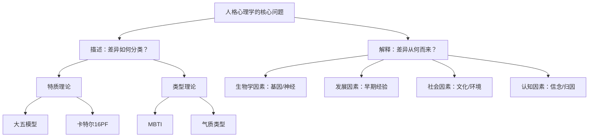

## 六、人格心理学

人格心理学是心理学中最古老、最核心的分支之一。它试图回答一个根本问题：**为什么每个人都是独特的？** 这种独特性不仅体现在外在行为上，更深层地体现在思维模式、情感反应、动机结构和自我认知之中。理解人格，是理解自我和他人的钥匙。

### 6.1 什么是人格

#### 6.1.1 人格的科学定义

人格（Personality）是个体在不同时间和情境中表现出的相对稳定的思维、情感和行为模式。这个定义包含三层含义：

- **模式性**：人格不是单个行为，而是行为的组织模式。一个人不是"外向的"，而是在社交情境中倾向于主动、热情、话多。
- **稳定性**：人格在时间上有连续性。今天的你和五年前的你在核心特质上高度一致，尽管具体行为可能变化。
- **情境一致性**：人格使人在不同情境中有可预测的反应倾向，但并非僵化不变——同一个人在工作和家庭中可能表现出不同侧面。

#### 6.1.2 人格心理学的核心问题

人格心理学围绕两个基本问题展开：

**描述问题**：人与人之间的差异如何系统地描述？这个问题催生了特质理论——用有限的维度来刻画无限的人格差异。

**解释问题**：这些差异从何而来？这个问题驱动了生物学、发展心理学、社会认知等多个方向的研究，涉及基因、神经化学、早期经验、文化环境等多种因素。

#### 6.1.3 人格与相关概念的区分

| 概念 | 定义 | 与人格的关系 |
|------|------|-------------|
| **气质（Temperament）** | 先天的情绪反应性和自我调节特征 | 人格的生物学基础，出生即显现 |
| **性格（Character）** | 后天习得的道德和行为倾向 | 人格的社会文化层面 |
| **能力（Ability）** | 完成特定任务的认知或身体潜力 | 人格的"能做什么"维度 |
| **动机（Motivation）** | 驱动行为的内在力量 | 人格的"想做什么"维度 |

气质是人格的地基。托马斯和切斯（Thomas & Chess）的纽约纵向研究发现，婴儿的气质可以分为三类：**容易型**（约40%）、**困难型**（约10%）和**慢热型**（约15%）。这些早期气质特征在一定程度上预示了成年后的人格轮廓。

### 6.2 特质理论：用维度描述人格

特质理论是当代人格心理学中最具影响力的范式。它假设人格可以用少数几个连续维度来描述，每个人在每个维度上有不同的得分。

#### 6.2.1 特质理论的发展脉络

**奥尔波特（Gordon Allport）——特质心理学的奠基人**

奥尔波特是第一个系统研究特质的心理学家。他将特质分为三个层次：

1. **枢纽特质（Cardinal Traits）**：支配整个人格的核心特质，如林肯的正义感、唐吉诃德的幻想。极少有人拥有枢纽特质。
2. **中心特质（Central Traits）**：构成人格基本轮廓的特质，如诚实、害羞、友善。通常有5-10个。
3. **次要特质（Secondary Traits）**：只在特定情境中表现出来的特质，如在权威面前的顺从。

奥尔波特还强调了**个体特有特质（Idiosyncratic Traits）**的重要性——每个人的人格都有无法用通用维度完全捕捉的独特性。

**卡特尔（Raymond Cattell）——因素分析的先驱**

卡特尔使用因素分析技术，从奥尔波特收集的4500个形容词中提炼出16个根源特质，形成了**16人格因素问卷（16PF）**。16PF至今仍在职业选拔和咨询中使用，但后续研究表明16个因素之间存在较高的相关性，可以进一步简化。

**艾森克（Hans Eysenck）——人格的生物学基础**

艾森克提出了一个简洁的三因素模型：

| 维度 | 高分特征 | 低分特征 | 生物学基础 |
|------|---------|---------|-----------|
| **外向性（E）** | 好交际、活跃、寻求刺激 | 安静、内省、回避刺激 | 大脑皮层唤醒水平（网状激活系统） |
| **神经质（N）** | 情绪不稳、焦虑、易怒 | 情绪稳定、冷静、沉着 | 边缘系统反应性（杏仁核） |
| **精神质（P）** | 冷漠、攻击性、反社会倾向 | 温和、共情、社会化 | 睾酮水平、5-HT系统 |

艾森克的核心贡献在于将人格特质与神经生理机制联系起来。例如，他提出外向者的大脑皮层基线唤醒水平较低，因此需要更多的外部刺激来达到最佳唤醒状态——这就解释了为什么外向者喜欢社交和冒险。

#### 6.2.2 大五人格模型（Big Five / OCEAN）

大五模型是当代人格心理学的主流范式，经过50多年的研究验证，具有跨文化的一致性。五个维度的首字母组成"OCEAN"（海洋）：

**O — 开放性（Openness to Experience）**

开放性衡量个体对新经验、新想法和新体验的接纳程度。

- **高分特征**：富有想象力、好奇心强、欣赏艺术和美、愿意尝试新事物、思维灵活、对抽象概念感兴趣
- **低分特征**：偏好常规和传统、注重实际、思维保守、喜欢确定性
- **核心子维度**：审美感受力、想象力、情感丰富度、行动多样性、思辨能力、价值观开放性
- **与其他变量的关系**：与创造力（r≈0.30）、智力（r≈0.30）、政治自由主义态度正相关
- **职业匹配**：高开放性者适合创意、研究、艺术类工作；低开放性者适合程序化、结构化的工作
- **实际含义**：高开放性不等于"开放"——它也意味着更容易感到无聊、更难忍受单调。在需要持续专注的任务中，适度的开放性反而更有利。

**C — 尽责性（Conscientiousness）**

尽责性衡量个体的自律性、组织性和目标导向程度。

- **高分特征**：有组织、可靠、自律、目标导向、注重细节、延迟满足能力强
- **低分特征**：灵活随意、不太注重计划、容易分心、冲动
- **核心子维度**：能力感、秩序感、责任心、追求成就、自律、审慎
- **与其他变量的关系**：是工作绩效（r≈0.22）和学业成绩（r≈0.25）最强的人格预测指标，与寿命正相关
- **实际含义**：尽责性是"成功"最强的人格预测因子。一项元分析（Barrick & Mount, 1991）表明，高尽责性在几乎所有职业中都与更好的绩效相关。但过高尽责性可能导致完美主义、强迫倾向和工作倦怠。
- **健康影响**：高尽责性者更少吸烟、饮酒，更规律运动和就医，平均寿命更长。这不仅是因为行为习惯，也因为他们在面对疾病时更遵医嘱。

**E — 外向性（Extraversion）**

外向性衡量个体从外部世界获取能量的倾向。

- **高分特征**：精力充沛、善于社交、积极情感多、喜欢刺激、话多、果断
- **低分特征**：安静、内省、偏好独处、社交能量有限、谨慎
- **核心子维度**：热情、合群、果断、活跃、寻求刺激、积极情感
- **与其他变量的关系**：与幸福感（r≈0.35）有较强相关，与收入正相关（社交网络更广）
- **重要区分**：外向性≠社交能力。内向者可以有出色的社交技能，只是社交会消耗他们的能量。苏珊·凯恩在《安静：内向性格的竞争力》中指出，内向者在深度思考、专注工作和一对一关系中有独特优势。
- **实际含义**：外向性与多巴胺系统的敏感性有关。外向者对奖励刺激（尤其是社交奖励）更敏感，这驱使他们主动寻求社交互动。内向者并非"社恐"，只是不需要那么多外部刺激就能达到最佳唤醒状态。

**A — 宜人性（Agreeableness）**

宜人性衡量个体在人际关系中的合作和利他倾向。

- **高分特征**：信任他人、利他、合作、温和、谦虚、乐于助人
- **低分特征**：竞争性强、怀疑他人、直言不讳、自我关注、固执
- **核心子维度**：信任、坦诚、利他、顺从、谦逊、同理心
- **与其他变量的关系**：高宜人性与更好的人际关系正相关，但与收入负相关（因为不善于谈判和竞争）
- **实际含义**：宜人性是一把双刃剑。高宜人性者是优秀的团队成员和朋友，但在需要竞争和自我推销的场景（如薪资谈判、商业竞争）中可能处于劣势。研究表明，低宜人性（在合理范围内）在商业环境中反而有利。
- **性别差异**：在几乎所有文化中，女性的宜人性平均得分高于男性，这是人格性别差异中最大的一个。

**N — 神经质（Neuroticism）**

神经质衡量个体体验负面情绪的倾向和情绪波动程度。

- **高分特征**：情绪不稳定、容易焦虑、易怒、自我意识强、容易感到压力
- **低分特征**：情绪稳定、冷静、自信、抗压能力强、不易受负面事件影响
- **核心子维度**：焦虑、愤怒与敌意、抑郁、自我意识、冲动性、脆弱性
- **与其他变量的关系**：与心理健康问题的风险高度相关，与生活满意度负相关
- **实际含义**：高神经质并非全然负面。适度的焦虑可以增强警觉性和准备性——考试前适度紧张的学生往往比完全放松的学生表现更好。问题在于，高神经质者倾向于将正常压力放大为灾难性威胁。
- **进化视角**：从进化角度看，神经质可能是一种适应性特质——对威胁保持警觉在危险环境中是生存优势。在现代安全环境中，这种过度警觉反而成为负担。

#### 6.2.3 人格的稳定性和可塑性

人格并非一成不变。研究揭示了清晰的变化规律：

**年龄效应**：在20-70岁之间，尽责性和宜人性通常随年龄增长而提高，神经质随年龄下降，外向性在中年后有所下降，开放性在青年期后缓慢下降。这一规律被称为"成熟原则"（Maturity Principle）。

**重大生活事件**：结婚通常提高尽责性和宜人性、降低外向性；失业和离婚可能暂时提高神经质；成为父母通常增加尽责性。

**有意识的努力**：研究（Hudson & Fraley, 2015）表明，当人们有明确目标并采取具体行动（如设定小目标、改变环境线索）时，可以在数周到数月内有意识地改变自己的人格特质得分。

**心理治疗**：有效的心理治疗（尤其是认知行为疗法）可以降低神经质得分，效果在治疗结束后仍能维持。

### 6.3 MBTI人格类型理论

#### 6.3.1 MBTI的理论基础

MBTI（Myers-Briggs Type Indicator）基于荣格的心理类型理论，由凯瑟琳·布里格斯和伊莎贝尔·迈尔斯母女开发。它将人格分为四个二分维度，组合产生16种类型。

**维度一：能量方向（E/I）**

- **外向（E, Extraversion）**：从外部世界获取能量，倾向于行动先于思考
- **内向（I, Introversion）**：从内部世界获取能量，倾向于思考先于行动

**维度二：信息获取（S/N）**

- **感觉（S, Sensing）**：关注具体、实际、当下可感知的信息，信任经验
- **直觉（N, iNtuition）**：关注模式、可能性和未来，信任直觉和灵感

**维度三：决策方式（T/F）**

- **思考（T, Thinking）**：基于逻辑、因果分析和客观标准做决策
- **情感（F, Feeling）**：基于价值观、人际和谐和主观意义做决策

**维度四：生活方式（J/P）**

- **判断（J, Judging）**：喜欢计划、组织和尽快做出决定
- **感知（P, Perceiving）**：喜欢灵活、开放、保留选择余地

#### 6.3.2 十六种人格类型概览

| 类型 | 核心特征 | 典型职业倾向 | 占人口比例（约） |
|------|---------|-------------|----------------|
| **ISTJ** | 检查者——负责、注重细节、可靠 | 会计、审计、军事、行政管理 | 11.6% |
| **ISFJ** | 保护者——温暖、尽责、忠诚 | 护理、教师、社工、图书管理 | 13.8% |
| **INFJ** | 提倡者——有洞察力、理想主义、有使命感 | 心理咨询、写作、非营利组织 | 1.5% |
| **INTJ** | 战略家——独立、有远见、追求效率 | 工程、科学研究、战略咨询 | 2.1% |
| **ISTP** | 鉴赏家——灵活、冷静、善于解决问题 | 工程师、技工、飞行员、法医 | 5.4% |
| **ISFP** | 探险家——温和、敏感、享受当下 | 艺术家、设计师、兽医、厨师 | 8.8% |
| **INFP** | 调解者——理想主义、忠于价值观、富有创造力 | 作家、心理咨询师、社会活动家 | 4.4% |
| **INTP** | 逻辑学家——创新、理论导向、独立思考 | 科学家、程序员、哲学家、数学家 | 3.3% |
| **ESTP** | 企业家——精力充沛、务实、适应力强 | 销售、创业者、运动员、急救人员 | 4.3% |
| **ESFP** | 表演者——热情、自发、享受生活 | 演艺、活动策划、旅游、销售 | 8.5% |
| **ENFP** | 竞选者——热情、有创造力、善于激励 | 咨询、教育、市场营销、媒体 | 8.1% |
| **ENTP** | 辩论家——机智、创新、喜欢挑战 | 律师、创业者、工程师、记者 | 3.2% |
| **ESTJ** | 总经理——组织者、注重效率、有领导力 | 管理、银行、法律、政府 | 8.7% |
| **ESFJ** | 执政官——热心、负责、善于社交 | 教师、医疗、人力资源、客户服务 | 12.3% |
| **ENFJ** | 主人公——有魅力、有同理心、善于引导 | 教育、培训、政治、非营利领导 | 2.5% |
| **ENTJ** | 指挥官——果断、有战略眼光、追求成就 | 高管、律师、企业家、管理咨询 | 1.8% |

#### 6.3.3 MBTI的科学评价

**流行度与应用场景**：MBTI是全球使用最广泛的人格评估工具之一，每年有超过200万人接受测试。它被广泛用于企业培训、团队建设和职业咨询。

**科学争议**：

- **重测信度不足**：约50%的人在5周后重测时至少有一个维度的类型改变。这与"人格稳定"的基本假设矛盾。
- **维度二元化的谬误**：将连续的人格维度强行二分为E或I、T或F，忽略了中间状态。大多数人在任一维度上得分接近正态分布的中间，而非极端。
- **预测效度有限**：对工作绩效的预测效度远低于大五模型。元分析表明MBTI类型与工作表现之间几乎没有显著关系。
- **巴纳姆效应**：MBTI的类型描述足够模糊，使大多数人都觉得"很准"，类似于星座描述的效果。

**使用建议**：MBTI可以作为自我探索和对话的起点，帮助人们思考自己的偏好，但不应作为人事决策、婚恋匹配或心理诊断的依据。如果需要科学严谨的人格评估，应使用大五模型或基于大五的标准化量表（如NEO-PI-R）。

### 6.4 精神分析理论：无意识的力量

精神分析是人格心理学中最古老、最具争议，也最具影响力的理论体系。虽然弗洛伊德的许多具体观点已被修正或否定，但他对无意识过程、心理防御机制和早期经验重要性的强调，深刻塑造了现代心理学。

#### 6.4.1 弗洛伊德的人格结构模型

弗洛伊德提出人格由三个系统组成，它们之间的动态交互决定了人的行为：

**本我（Id）**：人格中最原始的部分，完全存在于无意识中。本我遵循**快乐原则**——追求即时满足，不考虑现实约束或道德规范。它是所有本能冲动（性和攻击）的源泉。

**自我（Ego）**：从本我中分化出来，遵循**现实原则**。自我在本我的冲动、超我的道德要求和外部现实之间进行协调。它是人格的"执行者"，负责做出实际可行的决策。

**超我（Superego）**：内化的社会道德标准和理想，包括**良知**（违反道德标准时的内疚感）和**自我理想**（对理想自我的追求）。超我追求完美而非现实。

三者的关系类似于骑手（自我）骑马（本我）并受路标（超我）指引。当三者平衡时，人格功能良好；当冲突无法调和时，就会产生焦虑，进而触发心理防御机制。

#### 6.4.2 心理防御机制

防御机制是自我为应对焦虑而采用的无意识心理策略。理解防御机制对于认识自己的心理模式至关重要：

| 防御机制 | 定义 | 日常生活示例 |
|---------|------|-------------|
| **压抑（Repression）** | 将痛苦的记忆或冲动排除在意识之外 | 忘记童年创伤的细节 |
| **否认（Denial）** | 拒绝承认不愉快的现实 | 酗酒者坚持自己"随时能戒" |
| **投射（Projection）** | 将自己不可接受的冲动归因于他人 | 自己对同事不满，却觉得"他总是针对我" |
| **合理化（Rationalization）** | 为不可接受的行为找合理借口 | 没得到晋升说"升职也不一定好" |
| **反向形成（Reaction Formation）** | 表现出与真实感受相反的行为 | 对某人有敌意却过度友善 |
| **升华（Sublimation）** | 将不可接受的冲动转化为社会接受的行为 | 攻击性冲动转化为竞技运动的热情 |
| **退行（Regression）** | 退回到更早期的发展阶段的行为模式 | 成年人在压力下像孩子一样哭闹或发脾气 |
| **转移（Displacement）** | 将情绪从原始目标转向更安全的目标 | 在工作中受气后回家对家人发火 |
| **理智化（Intellectualization）** | 用理性分析替代情感体验 | 面对亲人离世时专注于葬礼的每个细节安排 |

防御机制本身不是病态的——每个人都在使用它们。问题在于：如果过度依赖不成熟的防御机制（如否认、投射），就会影响人际关系和心理健康。心理治疗的一个核心目标就是帮助人们认识自己的防御模式，逐步转向更成熟的防御机制（如升华、幽默）。

#### 6.4.3 荣格的分析心理学

卡尔·荣格是弗洛伊德最出色的学生，后来因理论分歧而分道扬镳。荣格的理论更偏向灵性和文化层面：

**集体无意识**：荣格提出，在个人无意识之下，还存在一个所有人类共有的深层心理结构——集体无意识。它储存着人类数百万年进化历程中积累的心理遗产。

**原型（Archetypes）**：集体无意识中的普遍心理模式，存在于所有文化中：

- **人格面具（Persona）**：个体在社会中展示的"面具"，是适应社会需求的角色
- **阴影（Shadow）**：个体不愿承认的黑暗面，被压抑的欲望和特质
- **阿尼玛/阿尼姆斯（Anima/Animus）**：男性心理中的女性意象和女性心理中的男性意象
- **自性（Self）**：人格的核心和整体，是意识与无意识的统一

**心理类型**：荣格提出的外向/内向、思维/情感/感觉/直觉的分类，成为MBTI的理论基础。

**个体化（Individuation）**：荣格认为人格发展的最终目标是个体化——整合意识与无意识、光明面与阴影面，成为一个完整的人。这个过程通常在中年期开始，需要直面内心深处的冲突和恐惧。

#### 6.4.4 现代心理动力学

当代心理动力学已远超弗洛伊德的原始理论，但保留了几个核心洞见：

- **无意识过程**：大量的认知过程发生在意识之外（内隐记忆、自动化加工、无意识情绪），这一点已被认知神经科学充分证实。
- **早期经验**：依恋理论（Bowlby, Ainsworth）证实了早期亲子关系对人格发展的深远影响。
- **内心冲突**：人们确实同时拥有相互矛盾的愿望和价值观，这种冲突影响着行为和情绪。
- **关系模式**：人们倾向于在成年关系中重复早期关系模式（移情），这一点在心理治疗中已被广泛观察和利用。

### 6.5 人本主义理论：人的成长潜能

人本主义心理学被称为心理学的"第三势力"，它反对行为主义的机械论和精神分析的病理取向，强调人的主观体验、自由意志和成长潜能。

#### 6.5.1 马斯洛的需求层次理论

亚伯拉罕·马斯洛提出了人类动机的层次模型：

            ┌─────────────┐
            │  自我实现    │  → 成为最好的自己
            ├─────────────┤
            │   尊重需求   │  → 自尊与他人的认可
            ├─────────────┤
            │ 归属与爱需求  │  → 亲密关系与社会连接
            ├─────────────┤
            │   安全需求   │  → 稳定、保护、可预测
            ├─────────────┤
            │   生理需求   │  → 食物、水、睡眠、空气
            └─────────────┘

**关键要点**：

- 高层次需求在低层次需求基本满足后才成为主要驱动力
- 大多数人同时处于多个层次，只是主导需求不同
- 自我实现者（马斯洛研究的样本）具有共同特征：接受自己和他人、问题导向而非自我导向、有高峰体验、深刻的道德感、创造力、享受独处
- 马斯洛后期增加了**超越性需求**——追求精神意义、服务他人、与更大的整体连接

**对个人发展的启示**：理解自己的需求层次，可以解释为什么在某些方面有动力而另一些方面没有。一个为生存挣扎的人很难有动力去追求创造力；一个感到孤独的人即使事业成功也难以感到满足。

#### 6.5.2 罗杰斯的自我理论

卡尔·罗杰斯是人本主义心理咨询的创始人，他的人格理论围绕"自我"展开：

**自我概念（Self-Concept）**：个体对自己的认知和评价的总和，包括"我是谁"、"我能做什么"、"我值得被爱吗"等核心信念。

**理想自我（Ideal Self）**：个体希望成为的样子，包含自己的目标、理想和价值标准。

**自我不一致（Self-Incongruence）**：自我概念与理想自我之间的差距。差距越大，个体体验到的焦虑和心理困扰就越大。

**无条件积极关注（Unconditional Positive Regard）**：无条件地接纳和尊重个体，不附加任何条件。罗杰斯认为这是人格健康发展的核心条件——当一个人被无条件接纳时，才能发展出真实的自我；当接纳总是有条件时（"你必须表现好我才爱你"），个体会发展出虚假的自我来讨好他人。

**自我实现倾向**：罗杰斯相信每个人都有天生的成长驱动力，就像种子有长成大树的内在倾向。心理问题的根源不是"有问题的人"，而是成长过程中的阻碍——有条件的价值观、不安全的环境、缺乏共情的关系。

**实践应用**：罗杰斯的理论直接催生了**以来访者为中心的心理咨询**，其三个核心条件——**共情（Empathy）、真诚（Congruence）、无条件积极关注**——被认为是所有有效心理咨询关系的基础。

### 6.6 社会认知理论：环境、认知与行为的交互

社会认知理论将人格理解为个体认知过程与环境互动的产物，代表人物是阿尔伯特·班杜拉。

#### 6.6.1 三元交互决定论

班杜拉提出，行为、个人因素（认知、情感、生物因素）和环境三者相互影响、动态交互。没有任何一方单独决定行为——你的人格特质影响你选择什么环境，环境反过来塑造你的认知和行为，你的行为又改变环境。

这个模型的关键意义在于：人格不是固定的"内部特质"，而是个体与环境持续互动中形成的动态模式。改变环境、改变认知、或改变行为，都可以影响人格的发展方向。

#### 6.6.2 自我效能感（Self-Efficacy）

自我效能感是个体对自己在特定情境中能否成功完成某一行为的信念。它是预测行为改变和目标达成的最强心理变量之一。

**重要区分**：自我效能感不是笼统的自信。它是**情境特定的**——一个人可能在编程上高效能感，在公开演讲上低效能感。

**四个来源**：

1. **掌握性经验（Mastery Experiences）**：成功完成任务的经历。这是最强大的来源——一次真实的成功比十次鼓励更有效。
2. **替代性经验（Vicarious Experiences）**：观察与自己相似的人成功完成任务。"如果他能做到，我也能。"
3. **言语说服（Verbal Persuasion）**：他人的鼓励和反馈。效果较弱，但可以配合前两种经验起作用。
4. **生理和情绪状态（Physiological and Emotional States）**：将积极的生理状态（精力充沛、心情愉快）解读为能力的信号，将消极状态（紧张、疲惫）解读为能力不足的信号。

**实践策略**：

- **设计渐进式挑战**：将大目标拆解为小步骤，每完成一步都是一次掌握性经验
- **寻找合适榜样**：选择与自己起点相似但已达到目标的人作为参考
- **管理焦虑**：焦虑会直接降低自我效能感。学习放松技术（如腹式呼吸、渐进性肌肉放松），将焦虑从"我不行"重新解读为"我在乎这件事"
- **记录进步**：写日记记录每次小成功，强化掌握性经验的记忆

### 6.7 人格的生物学基础

人格不仅仅是心理现象，它有坚实的生物学基础。

#### 6.7.1 遗传与人格

双胞胎研究提供了最有力的证据：

- **同卵双胞胎**（基因100%相同）即使在不同家庭长大，其人格特质的相似度也远高于**异卵双胞胎**（基因50%相同）
- 大五人格特质的遗传率约为**40%-60%**，意味着基因解释了人格差异的将近一半
- 但这不意味着人格是"注定"的——遗传率高只说明在统计上基因的贡献大，环境仍然起关键作用

#### 6.7.2 神经递质与人格

| 神经递质系统 | 关联的人格特质 | 机制 |
|-------------|-------------|------|
| **多巴胺（DA）** | 外向性、寻求奖励、新奇寻求 | 多巴胺系统活跃 → 奖励敏感性高 → 更倾向于寻求积极体验 |
| **血清素（5-HT）** | 神经质、情绪稳定性 | 血清素水平低 → 情绪调节能力差 → 更容易焦虑和抑郁 |
| **去甲肾上腺素（NE）** | 外向性、警觉性 | 与应激反应和唤醒水平相关 |
| **睾酮** | 支配性、攻击性、竞争性 | 高睾酮水平与更强的竞争和支配行为相关 |
| **催产素** | 宜人性、信任、社会连接 | 催产素促进社会信任和亲密关系的建立 |

#### 6.7.3 大脑结构与人格

神经影像学研究发现人格特质与大脑结构和功能之间存在关联：

- **杏仁核反应性**：高神经质者的杏仁核对威胁刺激更敏感，反应更强烈，这解释了他们为什么更容易感到焦虑和恐惧
- **前额叶皮层**：高尽责性与更强的前额叶功能相关，前额叶负责计划、冲动控制和目标导向行为
- **纹状体（奖励系统）**：外向者的纹状体对奖励刺激的反应更强，这与他们的奖励敏感性一致
- **默认模式网络**：内向者的默认模式网络更活跃，这与他们的内省和内部思考倾向相符

### 6.8 人格与人生结果

人格特质不是抽象的学术概念——它们真实地影响着人生的重要结果。

#### 6.8.1 人格与职业

**工作绩效**：尽责性是几乎所有职业中最强的人格预测因子。外向性在需要社交的职业（销售、管理）中预测力更强，开放性在创意类职业中更重要。

**职业满意度**：当人格特质与工作环境匹配时，满意度更高。这支持了**人-环境匹配理论（Person-Environment Fit）**——找到与自己人格匹配的工作，比改变自己去适应工作更有效。

**领导力**：有效领导者通常在外向性、尽责性和开放性上得分较高。但"安静的领导力"也有其独特优势——内向型领导者在管理主动型员工时反而更有效（Grant et al., 2011）。

#### 6.8.2 人格与人际关系

**择偶**：相似性吸引假设得到一定支持——在价值观、智力和开放性上相似的伴侣关系更稳定。但在宜人性和神经质上，一方的高神经质对关系质量的负面影响最为显著。

**友谊**：外向者拥有更大的社交网络，但内向者的友谊通常更深、更持久。宜人性是维持友谊最重要的特质。

**冲突处理**：高宜人性者倾向于回避或妥协，低宜人性者倾向于竞争，高神经质者更可能将冲突升级。了解自己和伴侣的人格模式，可以有针对性地改善沟通。

#### 6.8.3 人格与健康

**神经质**是与健康问题关联最强的人格特质。高神经质者更容易患焦虑症、抑郁症，也更容易出现与压力相关的身体疾病（心血管疾病、免疫功能下降）。这既因为高神经质者经历更多的负面情绪，也因为他们更可能采用不健康的应对方式（如暴饮暴食、酗酒）。

**尽责性**是与长寿关联最强的人格特质。高尽责性者更遵守健康行为（规律饮食、运动、就医），也更有能力坚持长期健康计划。

### 6.9 如何运用人格心理学

#### 6.9.1 自我评估的方法

| 方法 | 优点 | 缺点 | 推荐场景 |
|------|------|------|---------|
| **NEO-PI-R（大五量表）** | 科学验证最充分，效度高 | 题目多（240题），需要专业施测 | 正式的人格评估和研究 |
| **BFI-2（简版大五）** | 科学可靠，题目少（60题） | 精度略低于完整版 | 自我了解和快速评估 |
| **HEXACO模型** | 增加了诚实-谦逊维度 | 相对小众 | 对"暗黑三角"特质的评估 |
| **MBTI** | 直觉易懂，促进自我反思 | 科学验证不足 | 团队建设和对话讨论 |

#### 6.9.2 人格知识的日常应用

**认识自己的盲点**：高宜人性的人可能不知道自己在回避必要的冲突；高神经质的人可能分不清真实威胁和想象的威胁；低开放性的人可能错过有价值的新机会。

**改善沟通**：了解对方的人格特质，可以调整沟通方式。对高开放性的人讲创新和可能性，对高尽责性的人讲计划和细节，对高外向性的人讲合作和社交。

**选择适配环境**：与其改变自己的人格去适应环境，不如选择与自己人格匹配的环境。内向者不必强迫自己成为社交达人，高开放性者不必把自己困在重复性工作中。

**设定合理目标**：人格特质会影响达成目标的方式。高尽责性的人可以用"每天打卡"的方式坚持习惯，低尽责性的人可能需要外部监督或更灵活的计划。

#### 6.9.3 人格发展的方向

人格不是命运。以下策略已被研究证明可以帮助人格的积极发展：

1. **提高自我觉察**：通过人格测评、日记反思、心理咨询等方式，客观认识自己的人格模式
2. **设定改变目标**：研究（Hudson & Fraley, 2015）表明，有明确、具体的改变目标的人更可能实现人格变化
3. **改变行为模式**：不要等"感觉对了"再行动——先改变行为，行为会反过来影响自我认知
4. **改变环境**：环境对人格有持续的影响。加入一个需要合作的团队可以提高宜人性，参加社交活动可以提高外向性
5. **寻求专业帮助**：认知行为疗法（CBT）可以有效降低神经质，心理动力学治疗可以帮助理解深层人格模式

### 6.10 常见误区与纠正

**误区一："人格测试告诉我是什么类型，那就是我"**
纠正：人格是连续的维度，不是非此即彼的类型。你在每个维度上的位置是一个点，而非一个标签。MBTI的16种类型只是一个大致的分类框架。

**误区二："性格决定命运，所以改不了"**
纠正：人格特质可以改变，而且人们一直在改变。尽责性、宜人性在成年后持续增长，神经质持续下降。有意识的努力可以加速这个过程。

**误区三："内向就是社恐"**
纠正：内向是一种能量管理方式，不是社交恐惧。内向者可以有出色的社交能力，只是社交会消耗他们的能量，需要独处来恢复。真正的社交恐惧症是一种心理障碍，与内向性是不同的概念。

**误区四："大五人格的遗传率是50%，所以人格是注定的"**
纠正：遗传率是群体统计概念，不适用于个体。遗传率50%意味着在一群人中，基因解释了约50%的个体差异，但环境仍然起着关键作用。而且，基因的表达本身也受环境影响（表观遗传学）。

**误区五："我测出来是高神经质，所以我很脆弱"**
纠正：高神经质反映的是情绪反应的敏感性，不是脆弱性。许多高神经质的人具有深刻的同理心、丰富的内心世界和对美的敏锐感受力。关键是学会情绪调节，而非试图消除情绪。

---

人格心理学为我们提供了一面镜子，帮助我们理解自己的思维、情感和行为模式。但这面镜子的价值不在于贴标签，而在于照见真实的自己——包括优势和局限，然后做出有意识的选择。知道自己是高神经质，不是给自己找借口，而是学会更好地管理情绪。知道自己是低开放性，不是排斥新事物，而是有意识地给自己创造接触新体验的机会。人格是起点，不是终点。
