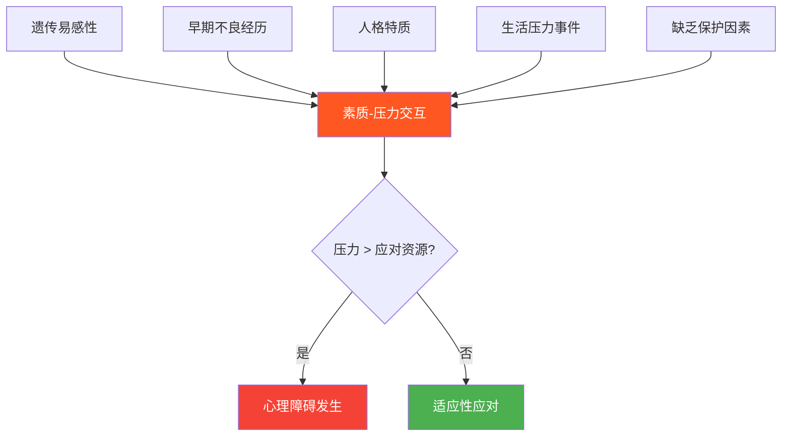

## 七、异常心理学基础

异常心理学（Abnormal Psychology）是心理学中最具现实意义的分支之一。它研究人类心理障碍的本质、成因、分类、评估与治疗，直接关系到数亿人的生活质量。世界卫生组织数据显示，全球约有10亿人受到不同程度心理障碍的影响，抑郁症已成为全球致残的首要原因之一。理解异常心理学不仅能帮助我们识别自身和他人的心理问题，更能破除偏见、减少污名化，为心理健康建立科学的认知基础。

### 7.1 什么是异常心理学

#### 7.1.1 异常心理学的研究对象与历史

异常心理学研究的核心问题是：什么构成了"正常"与"异常"的心理状态？这条界线比想象中模糊得多。

**历史演变脉络**：

异常心理学的发展经历了四个关键阶段，每个阶段都深刻影响了我们今天对心理障碍的理解：

| 时期 | 核心观点 | 代表性事件 |
|------|---------|-----------|
| 古代（前5世纪—15世纪） | 超自然解释→体液学说 | 希波克拉底提出"脑是精神疾病的根源" |
| 理性时代（15—19世纪） | 道德治疗运动 | 菲利普·皮内尔解开精神病患者锁链（1793年） |
| 医学模式（19世纪末—20世纪中） | 疾病分类体系 | 克雷佩林建立精神疾病分类系统 |
| 现代（20世纪中至今） | 生物-心理-社会整合模型 | DSM系列出版，神经科学快速发展 |

#### 7.1.2 判断心理异常的五大标准

判断一个人的心理状态是否"异常"并非简单的二元划分，而是基于多重标准的综合评估。以下五个标准是临床心理学界普遍接受的判断框架：

**标准一：统计学标准（Statistical Deviance）**

以人群中某种特质的分布为参照，处于极端位置的被视为异常。例如，智商低于70（低于均值两个标准差）可被诊断为智力障碍。这个标准的优点是客观、可量化，但存在明显局限：天才的智商同样处于统计极端，却不会被视为"异常"；而某些普遍存在的问题（如轻度焦虑）虽然常见，却仍然是临床问题。

**标准二：社会规范标准（Social Norm Violation）**

偏离社会文化所接受的行为准则。例如，在公共场合大声自言自语在多数文化中被视为异常。这个标准的问题在于：社会规范因文化而异，且随时代变化。同性恋在1973年之前一直被列为精神疾病，直到研究证明它不构成心理障碍。这提醒我们，社会规范标准必须与其他标准结合使用。

**标准三：个人痛苦标准（Personal Distress）**

个体主观感受到显著的心理痛苦。重度抑郁症患者报告的持续绝望感、广泛性焦虑障碍患者体验到的无法控制的担忧，都属于此类。但这条标准也有例外：反社会人格障碍患者可能不会感到痛苦，但他们的行为对他人造成严重伤害；躁狂发作初期，双相障碍患者可能感到愉悦而非痛苦。

**标准四：功能损害标准（Impairment in Functioning）**

心理状态导致个体在工作、学习、社交或日常生活中的功能显著下降。例如，社交焦虑障碍患者因恐惧社交而无法维持工作关系，强迫症患者因反复检查而每天迟到。功能损害是临床评估中最实用的指标之一。

**标准五：不合理性标准（Irrationality）**

思维和行为明显违背理性逻辑。精神分裂症患者坚信自己被外星人监视（妄想），或听到不存在的声音（幻觉），这些体验与现实严重脱节。

**实际临床判断**：在实践中，临床心理学家不会单独依赖任何一条标准，而是综合评估多个维度。DSM-5（《精神障碍诊断与统计手册》第五版）要求诊断必须同时满足：(1) 症状模式达到特定标准；(2) 症状造成显著痛苦或功能损害；(3) 排除其他可能的解释（如药物效应、其他医学状况）。

#### 7.1.3 异常与正常的连续谱

现代心理学更倾向于将心理健康视为一个连续谱（continuum），而非正常与异常的二元划分。每个人在不同人生阶段都可能在连续谱上移动：

这个连续谱视角有助于减少污名化——心理障碍不是"有"或"没有"的问题，而是程度问题。一个人可能因失恋经历两周的抑郁情绪（正常反应），也可能发展为持续数月的重度抑郁障碍（需要治疗），两者之间没有截然的分界线。

### 7.2 主要心理障碍分类

以下按照DSM-5的分类体系，系统介绍最常见的心理障碍类别。每种障碍的介绍包括：核心特征、患病率数据、典型表现和鉴别要点。

#### 7.2.1 焦虑障碍（Anxiety Disorders）

焦虑障碍是最常见的心理障碍类别，全球终身患病率约为25-30%。其核心特征是过度的恐惧和焦虑，以及相关的行为紊乱。

**广泛性焦虑障碍（GAD）**：

核心特征是持续6个月以上的、难以控制的过度担忧，担忧的内容涵盖生活多个领域（工作、健康、家庭、财务等）。患者同时伴有至少3种躯体症状：坐立不安、易疲劳、注意力难以集中、易激惹、肌肉紧张、睡眠障碍。

典型表现：一位35岁的公司职员，每天花费数小时担忧各种"可能发生的坏事"——担心孩子上学路上出车祸、担心公司裁员、担心自己患重病。她知道这些担忧过度，但无法停止。长期的焦虑导致她头痛、失眠，工作效率下降。

患病率：终身患病率约5.7%，女性约为男性的2倍。

**恐慌障碍（Panic Disorder）**：

核心特征是反复出现的、不可预测的恐慌发作（Panic Attack）。恐慌发作是突然涌起的强烈恐惧或不适，在数分钟内达到高峰，伴随至少4种症状：心悸、出汗、颤抖、呼吸困难、胸痛、恶心、头晕、现实解体感（感觉周围世界不真实）、人格解体感（感觉脱离自己的身体）、害怕失控或"发疯"、濒死感、麻木或刺痛感。

关键特征：患者对下一次发作产生持续的预期性焦虑（"等待另一只鞋掉下来"），并因此回避可能诱发发作的场所或情境（如人多的地方、封闭空间），严重时可发展为广场恐惧症。

典型表现：一位28岁男性在地铁上突然感到心跳加速、呼吸困难、浑身发抖，以为自己心脏病发作。急救送医后检查结果完全正常。此后他开始回避乘坐地铁，进一步回避所有公共交通，最终连离开家都感到恐惧。

患病率：终身患病率约4.7%。

**社交焦虑障碍（Social Anxiety Disorder）**：

核心特征是对一种或多种社交情境的显著且持续的恐惧，在这些情境中个体可能被他人审视。患者担心自己会表现出焦虑症状（如脸红、发抖、出汗、说话结巴）而被他人负面评价。

与正常害羞的区别：普通害羞不会导致严重的功能损害。社交焦虑障碍患者可能因此拒绝工作晋升（因为需要做演讲）、无法建立亲密关系、甚至无法在他人面前进食。

患病率：终身患病率约12.1%，是最常见的焦虑障碍之一。

**特定恐惧症（Specific Phobia）**：

对特定对象或情境的显著且持续的恐惧，恐惧程度与实际危险不成比例。常见的恐惧类型包括：动物型（蜘蛛、蛇、狗）、自然环境型（高处、风暴、水）、血液-注射-损伤型（看到血、打针、医疗程序）、情境型（飞机、电梯、封闭空间）、其他型（窒息、呕吐、大声响）。

特殊之处：血液-注射-损伤型恐惧症是唯一一种恐惧反应中包含血管迷走性晕厥（血压骤降导致昏倒）的恐惧症，这与其他恐惧症的生理激活反应相反。

患病率：特定恐惧症的终身患病率约12.5%，是最常见的心理障碍之一。

**强迫症（OCD）**：

核心特征是强迫思维（obsessions）和/或强迫行为（compulsions）。强迫思维是反复出现的、闯入性的、不想要的想法、冲动或意象，引起显著的焦虑或痛苦。强迫行为是患者感到被驱使去执行的重复性行为或精神活动，目的是减轻焦虑或防止某种可怕的事情发生。

常见的强迫思维类型：污染（"门把手上有致命细菌"）、伤害（"我可能伤害自己的孩子"）、对称性（"东西必须摆放整齐否则会出事"）、禁忌想法（亵渎或性相关的闯入性想法）。

常见的强迫行为类型：反复洗手、反复检查（门锁、煤气）、计数、排列、默念。

重要认知：强迫症患者通常知道自己的强迫思维是不合理的，但无法控制。这种"自知力"的存在是强迫症与精神病性障碍的重要区别。

患病率：终身患病率约2.3%。

**创伤后应激障碍（PTSD）**：

核心特征是在经历或目睹创伤性事件后出现的持续性症状群，持续超过1个月。症状分为四类：

1. **侵入性症状**：闪回（感觉创伤正在重新发生）、噩梦、不由自主的创伤记忆、接触创伤线索时的强烈心理痛苦和生理反应
2. **回避症状**：回避与创伤相关的想法、感受、对话、地点、人物、活动
3. **认知和情绪的负面改变**：无法记住创伤的重要部分、持续的负面信念（"都是我的错"）、持续的负面情绪状态、对重要活动兴趣减退、与他人疏离感
4. **过度警觉**：易激惹、鲁莽行为、过度警觉、惊跳反应增强、注意力困难、睡眠障碍

典型表现：一位退伍军人在战场经历爆炸事件后，每当听到汽车回火声就会立即卧倒（闪回），反复梦到战友伤亡的场景（噩梦），回避一切可能突然发出声响的场所（回避），变得情感麻木、与家人疏远（情绪改变），始终处于高度警惕状态（过度警觉）。

患病率：经历创伤的人群中约9.2%会发展为PTSD，女性患病率约为男性的2倍。

#### 7.2.2 心境障碍（Mood Disorders）

心境障碍的核心特征是情绪状态的持续异常，包括抑郁和躁狂两个极端。

**重性抑郁障碍（Major Depressive Disorder, MDD）**：

诊断要求在连续两周内出现至少5项以下症状，且至少包括(1)或(2)之一：

1. 几乎每天大部分时间都有抑郁心境（主观报告或他人观察）
2. 对所有或几乎所有活动的兴趣或愉悦感显著降低
3. 未节食情况下体重显著减轻或增加（一个月内体重变化超过5%）
4. 几乎每天都失眠或嗜睡
5. 几乎每天都精神运动性激越或迟滞（他人可观察到）
6. 几乎每天都疲劳或精力不足
7. 几乎每天都感到自己毫无价值，或过度的、不适当的内疚
8. 几乎每天都思考能力或注意力减退，或犹豫不决
9. 反复出现死亡想法，或有自杀意念、自杀计划或自杀企图

**必须满足**：症状引起临床显著的痛苦或社交、职业等功能损害；排除物质效应和其他医学状况。

关键鉴别：

| 区分点 | 正常的悲伤 | 重性抑郁 |
|--------|----------|---------|
| 持续时间 | 通常数天到数周逐渐减轻 | 持续两周以上不缓解 |
| 内容 | 围绕丧失事件 | 泛化到生活的方方面面 |
| 自尊 | 通常保持 | 显著降低，无价值感 |
| 功能 | 基本维持 | 显著损害 |
| 自杀 | 罕见 | 需要认真评估 |
| 快感 | 丧失事件之外仍可感受快乐 | 快感缺失，几乎所有活动都无法带来愉悦 |

患病率：终身患病率约16.6%，女性约为男性的2倍。重性抑郁障碍是全球致残的首要原因之一。

**双相情感障碍（Bipolar Disorder）**：

分为两种主要类型：

**双相I型**：至少有一次躁狂发作（持续7天以上或需要住院）。躁狂发作的特征包括：情绪高涨或易激惹、自尊膨胀或夸大感、睡眠需求减少（例如只睡3小时仍精力充沛）、比平时话多或有说话冲动、意念飘忽或思维奔逸、注意力易被无关紧要的事物吸引、目标导向活动增加或精神运动性激越、过度参与可能带来不良后果的活动（疯狂购物、轻率的性行为、愚蠢的商业投资）。

**双相II型**：至少有一次轻躁狂发作（症状较轻，持续4天以上，不造成严重功能损害）和至少一次重性抑郁发作。轻躁狂发作的症状与躁狂相似，但程度较轻且不需要住院。

**为什么双相障碍容易被误诊**：约60%的双相障碍患者最初被误诊为单相抑郁。原因在于：(1) 患者往往在抑郁期寻求帮助，躁狂/轻躁狂期可能被忽略或被视为"状态好"；(2) 如果只询问抑郁症状而不主动筛查躁狂史，很容易漏诊；(3) 某些双相障碍以抑郁发作为主，躁狂发作极少且短暂。

误诊后果严重：对双相障碍患者使用抗抑郁药而不用心境稳定剂，可能诱发躁狂发作或快速循环（一年内发作4次以上）。

患病率：双相I型终身患病率约1%，双相II型约1.1%。

**持续性抑郁障碍（Persistent Depressive Disorder，旧称恶劣心境）**：

抑郁症状持续至少2年（儿童和青少年为1年），症状从未消失超过2个月。症状程度比重性抑郁轻，但持续时间极长，患者常感觉"我一直是这样的"，把抑郁当作自己性格的一部分而非需要治疗的疾病。

患病率：终身患病率约3-6%。

#### 7.2.3 精神分裂症谱系障碍（Schizophrenia Spectrum Disorders）

精神分裂症是一组严重影响思维、知觉和行为的精神疾病，发病率约1%，但社会影响巨大。它不是"人格分裂"（那是分离性身份障碍），而是现实检验能力的严重受损。

**三大症状群**：

**阳性症状**（"添加"到正常体验中的异常体验）：
- **妄想**：固定错误信念，无法被证据说服。常见类型包括被害妄想（"邻居在监视我"）、关系妄想（"新闻主播在对我发送暗号"）、夸大妄想（"我是上帝选中的人"）、被控制妄想（"CIA在我的大脑中植入了芯片"）
- **幻觉**：没有外界刺激却体验到感觉。最常见的是幻听（约70%患者出现），如听到评论性声音（两个声音在讨论患者的行为）、命令性声音（命令患者做某事，可能具有危险性）
- **思维紊乱**：言语从一个话题突然跳到另一个（联想松弛），严重时语无伦次（词语沙拉，word salad）
- **紊乱或异常的运动行为**：从孩子般的愚蠢到不可预测的激越，包括紧张症（catalepsy，保持被他人摆放的姿势不动，称为蜡样屈曲）

**阴性症状**（正常功能的"减少"或"缺失"）：
- **情感平淡**：面部表情减少、眼神接触减少、语调变化减少
- **意志减退**：启动和坚持目标导向活动的能力下降
- **言语贫乏**：言语量减少，回答简短，内容空洞
- **快感缺失**：体验快乐的能力下降
- **社交退缩**：对社交活动缺乏兴趣

**认知症状**：
- 注意力困难
- 工作记忆损害
- 执行功能下降（计划、决策能力受损）
- 处理速度减慢

**病因学**：精神分裂症有强烈的遗传成分——同卵双胞胎的同病率约48%（异卵双胞胎约17%），一般人群约1%。多巴胺假说认为阳性症状与中脑边缘系统多巴胺活动过度有关，阴性症状和认知症状与前额叶多巴胺活动不足有关。神经发育假说认为疾病在出生前就开始了，环境因素（如产前感染、童年创伤、城市生活、大麻使用）在易感个体中触发疾病。

**预后**：约14%的患者恢复良好，约50%在多次发作后功能逐渐下降，约16%需要长期住院。早期识别和治疗（特别是首发精神病的持续未治疗时间越短，预后越好）是改善预后的关键。

#### 7.2.4 人格障碍（Personality Disorders）

人格障碍是持久的、不灵活的、跨情境的行为和内心体验模式，显著偏离个体所在文化的期望，导致痛苦或功能损害，在青春期或成年早期开始出现，并随时间保持稳定。

**A类——古怪型/怪异型人格障碍**：

| 障碍 | 核心特征 | 与精神分裂症的关系 |
|------|---------|-----------------|
| 偏执型人格障碍 | 对他人广泛的不信任和猜疑，解读他人的动机为恶意 | 无精神病性症状 |
| 分裂样人格障碍 | 社交关系中的脱离模式，情感表达范围受限 | 不是精神分裂症的前驱期 |
| 分裂型人格障碍 | 急性不适感、认知或感知扭曲、行为古怪 | 与精神分裂症有遗传关联，是精神分裂症谱系的一部分 |

**B类——戏剧型/情感不稳定型人格障碍**：

**反社会型人格障碍（ASPD）**：15岁之前就有品行障碍史，成年后表现为：反复违法、欺骗（为利益或快乐而说谎）、冲动性、易激惹和攻击性、不顾他人安全的鲁莽行为、不负责任、缺乏悔恨。核心问题是缺乏良知——他们知道行为是"错的"，但不会感到内疚。

与精神病态（psychopathy）的区别：ASPD是DSM-5诊断，基于行为模式；精神病态是研究概念，强调情感和人际特征（表面魅力、夸大、缺乏共情、寄生性生活方式）。不是所有ASPD患者都是精神病态者，但大多数精神病态者符合ASPD标准。

**边缘型人格障碍（BPD）**：被称为"心理学中最复杂、最具争议的诊断之一"。核心特征是人际关系、自我形象和情感的不稳定性，以及明显的冲动性。具体表现：

- 疯狂地努力避免真实的或想象中的被抛弃
- 不稳定且紧张的人际关系模式，在极端理想化和极端贬低之间摇摆（"分裂"）
- 身份障碍：不稳定的自我形象或自我感
- 至少两个领域的冲动性（如消费、性行为、物质滥用、鲁莽驾驶、暴食）
- 反复的自杀行为、姿态、威胁或自伤行为
- 情感不稳定（在数小时到数天内从焦虑→愤怒→抑郁→焦虑循环）
- 持续的空虚感
- 不恰当的强烈愤怒或难以控制愤怒
- 短暂的、与压力相关的偏执观念或严重的解离症状

重要发现：BPD患者对他人的面部表情存在"情绪识别偏差"——他们更容易将中性表情解读为愤怒或厌恶，这可能是其人际冲突的机制之一。

**自恋型人格障碍（NPD）**：夸大（幻想或行为）、需要赞美、缺乏共情。具体表现为：夸大自我重要性、沉溺于无限成功或权力的幻想、认为自己是"特殊"的、需要过度赞美、有权利感、人际剥削、缺乏共情、经常嫉妒他人或认为他人嫉妒自己、傲慢行为。

**表演型人格障碍（HPD）**：过度的情绪表达和寻求注意的行为。表现为：在不是注意中心时感到不适、与他人互动时常表现出不恰当的性诱惑或挑逗、情绪表达迅速变化和肤浅、持续利用身体外表来吸引注意力、说话风格过度印象化而缺乏细节、自我戏剧化和夸张的情绪表达、易受暗示、将关系看得比实际更亲密。

**C类——焦虑型/恐惧型人格障碍**：

**回避型人格障碍**：社交抑制、不胜任感、对负面评价高度敏感。与社交焦虑障碍高度重叠，但回避型人格障碍是更广泛、更持久的模式。

**依赖型人格障碍**：过度需要被照顾，导致顺从和依附行为以及对分离的恐惧。表现为：没有他人大量建议就难以做日常决定、需要他人为生活大多数领域承担责任、难以表达不同意（害怕失去支持）、难以独立开始项目、为获得关怀和支持而走极端、独处时感到不适、当亲密关系结束时迫切寻求另一段关系。

**强迫型人格障碍（OCPD）**：对秩序、完美主义和控制的全神贯注（注意：与强迫症不同，OCPD患者认为自己的行为是正确的、合理的，不会感到痛苦）。表现为：过度关注细节和规则以至于失去活动要点、妨碍任务完成、过度奉献工作以至于忽视休闲活动和友谊、对道德和价值观过度尽责和僵化、无法丢弃破旧或无价值的物品、不愿将任务委托给他人、对自己和他人都吝啬、僵化和固执。

#### 7.2.5 神经发育障碍（Neurodevelopmental Disorders）

**注意缺陷多动障碍（ADHD）**：

ADHD是一种神经发育障碍，通常在儿童期被诊断，但症状可持续到成年。其核心特征包括：

**注意力不集中维度**：
- 在学业或工作任务中无法关注细节或犯粗心错误
- 在任务或游戏活动中难以维持注意力
- 直接对他说话时似乎不在听
- 无法完成学校作业或工作任务
- 难以组织任务和活动
- 回避需要持续脑力劳动的任务
- 丢失任务或活动所需物品
- 容易被外部刺激分心
- 日常活动中健忘

**多动-冲动维度**：
- 手脚不安地移动或在座位上扭动
- 在需要坐着的场合离开座位
- 在不适当的场合过度奔跑或攀爬
- 无法安静地参与休闲活动
- "像被马达驱动一样"持续活动
- 说话过多
- 在问题说完之前就说出答案
- 难以等待轮到自己
- 打断或侵扰他人

**ADHD在成人中的表现**：成人ADHD的表现可能与儿童不同。多动症状可能表现为内在的坐立不安感而非外在的过度活动；注意力不集中可能表现为难以维持长期目标、频繁更换工作或关系、时间管理困难、拖延；冲动可能表现为冲动消费、鲁莽驾驶、情绪爆发。

**成人ADHD的识别线索**：如果你在阅读本段内容时感到"这完全就是我"，且这些问题在儿童期就存在、在多个生活领域都出现（不仅仅是工作或家庭），且造成显著功能损害，建议寻求专业评估。

**自闭症谱系障碍（ASD）**：

核心缺陷：社交沟通和社交互动的持续性缺陷，以及受限的、重复的行为模式、兴趣或活动。

社交沟通缺陷表现：社交情感互动困难（如无法正常的一来一回的对话、难以发起社交互动、对社交线索反应减少）、非语言沟通困难（眼神接触、面部表情、手势异常）、发展和维持人际关系困难。

受限和重复行为表现：刻板或重复的动作、语言或物体使用（如排列玩具、模仿语言）、坚持相同性、对常规极度僵化、高度受限和固定的兴趣、对感觉输入的过度或不足反应。

**重要认知**：自闭症是一个"谱系"——从需要大量支持的重度到几乎不需要支持的轻度（过去称为阿斯伯格综合征），个体差异极大。许多自闭症个体拥有非凡的专注力、细节注意力和在特定领域的深度知识。

**学习障碍**：

| 类型 | 核心困难 | 表现 |
|------|---------|------|
| 阅读障碍（Dyslexia） | 识别单词的准确性和/或流畅性困难 | 阅读速度慢、拼写困难、混淆相似字母（b/d） |
| 书写障碍（Dysgraphia） | 书写的准确性和流畅性困难 | 字迹难以辨认、书写费力、难以组织书面表达 |
| 计算障碍（Dyscalculia） | 数字感和数学运算困难 | 难以理解数概念、数学事实记忆困难、数学推理困难 |

#### 7.2.6 其他重要障碍类别

**进食障碍（Eating Disorders）**：

- **神经性厌食症（Anorexia Nervosa）**：限制能量摄入导致显著低体重，对体重增加的强烈恐惧，对体重或体型的感知障碍。死亡率约5-10%，是致死率最高的精神疾病之一。
- **神经性贪食症（Bulimia Nervosa）**：反复发作的暴食（在短时间内吃下大量食物，伴有失控感），随后是不适当的补偿行为（自我催吐、过度运动、禁食、滥用泻药）。患者体重通常在正常范围内。
- **暴食障碍（Binge Eating Disorder）**：反复暴食但不伴有规律的补偿行为，是最常见的进食障碍。

**物质使用障碍（Substance Use Disorders）**：

核心特征是尽管物质使用导致显著问题仍继续使用的模式。诊断维度包括：耐受性（需要更多物质才能达到同样效果）、戒断症状、使用量超过预期、无法减少使用、花费大量时间获取物质、因使用而放弃重要活动、明知有害仍继续使用。

**解离性障碍（Dissociative Disorders）**：

- **解离性身份障碍（DID）**：存在两个或多个不同的身份状态，伴有记忆空白。与流行文化中"多重人格"的戏剧化描写不同，DID通常与严重的童年创伤密切相关。
- **解离性遗忘**：无法回忆重要的个人信息，通常与创伤或压力相关。
- **人格解体/现实解体障碍**：持续或反复地感觉自己脱离了身体或精神过程（人格解体），或感觉周围环境不真实（现实解体）。

**躯体症状及相关障碍（Somatic Symptom and Related Disorders）**：

核心特征是对躯体症状的过度关注、焦虑和投入。包括：躯体症状障碍（对一个或多个躯体症状的过度关注）、疾病焦虑障碍（旧称疑病症，严重担心自己患有严重疾病）、转换障碍（功能性神经症状，如瘫痪、失明，但无医学解释）。

### 7.3 心理障碍的病因：生物-心理-社会整合模型

现代临床心理学采用**生物-心理-社会模型**（Bio-Psycho-Social Model）来理解心理障碍的成因。该模型认为，任何心理障碍都是生物学因素、心理因素和社会文化因素交互作用的结果，而非单一原因所致。

#### 7.3.1 生物因素

**遗传因素**：

遗传对心理障碍的影响通过"易感性"（vulnerability）而非"决定性"起作用。以下是一些关键的遗传数据：

| 障碍 | 同卵双胞胎同病率 | 异卵双胞胎同病率 | 一般人群患病率 |
|------|----------------|----------------|-------------|
| 精神分裂症 | ~48% | ~17% | ~1% |
| 双相障碍 | ~40-70% | ~5-10% | ~1-2% |
| 重性抑郁 | ~37% | ~14% | ~17% |
| 广泛性焦虑 | ~32% | ~13% | ~6% |
| ADHD | ~70-80% | ~30-40% | ~5-7% |

这些数据说明：遗传因素显著增加患病风险，但不是决定性的——同卵双胞胎共享100%基因，但同病率远低于100%，说明环境因素同样重要。心理障碍是多基因遗传（多个基因各贡献少量风险），而非单基因遗传。

**神经化学因素**：

神经递质失衡假说是理解心理障碍生物学基础的重要框架：

- **血清素（5-HT）**：与情绪调节密切相关。血清素功能不足与抑郁、焦虑、强迫症有关。选择性血清素再摄取抑制剂（SSRIs，如氟西汀、舍曲林）通过增加突触间隙中的血清素水平发挥抗抑郁和抗焦虑作用。
- **多巴胺（DA）**：与奖赏、动机和运动控制有关。中脑边缘系统多巴胺活动过度与精神分裂症的阳性症状有关，前额叶多巴胺活动不足与阴性症状和认知缺陷有关。抗精神病药物通过阻断多巴胺D2受体发挥作用。
- **γ-氨基丁酸（GABA）**：大脑主要的抑制性神经递质。GABA功能不足与焦虑、失眠有关。苯二氮䓬类药物（如阿普唑仑）通过增强GABA受体功能发挥抗焦虑作用。
- **去甲肾上腺素（NE）**：与警觉和注意力有关。NE功能异常与焦虑、抑郁、ADHD有关。
- **谷氨酸**：大脑主要的兴奋性神经递质。谷氨酸系统异常正在成为精神分裂症研究的新方向。

**重要说明**：化学失衡假说虽然对理解药物治疗机制有帮助，但过于简化。心理障碍不是简单的"化学物质缺乏"，而是涉及复杂的神经环路、突触可塑性、神经炎症等多层面机制。

**大脑结构和功能**：

神经影像学研究发现多种心理障碍与特定脑区的结构或功能异常有关：

- **抑郁症**：海马体积缩小（与记忆和情绪调节有关）、前额叶活动降低、杏仁核活动增强
- **焦虑障碍**：杏仁核过度激活（恐惧加工的核心脑区）、前额叶对杏仁核的调控减弱
- **精神分裂症**：脑室扩大、灰质体积减少、前额叶活动低下（hypofrontality）
- **ADHD**：前额叶皮层发育延迟、基底节体积减小、默认模式网络（DMN）功能异常
- **PTSD**：海马体积减小、杏仁核过度反应、前额叶（特别是内侧前额叶）活动降低

**其他生物因素**：
- **激素**：皮质醇（应激激素）长期升高与抑郁有关；甲状腺功能异常可导致类似抑郁或焦虑的症状；产后激素剧烈波动与产后抑郁有关
- **感染和免疫**：链球菌感染后自身免疫性神经精神障碍（PANDAS）可导致突发的强迫症状；慢性炎症与抑郁症存在关联
- **表观遗传学**：环境经历（如童年创伤）可以通过表观遗传机制改变基因表达，而不需要改变DNA序列本身，且某些表观遗传变化可能传递给下一代

#### 7.3.2 心理因素

**认知因素——认知模型**：

Aaron Beck的认知模型是理解抑郁和焦虑最有影响力的心理学理论之一。该模型认为，心理障碍的核心在于歪曲的认知模式。

**认知三角**（Cognitive Triad，针对抑郁）：
1. 对自己的负面看法（"我是失败者"）
2. 对世界的负面看法（"世界是不公平的"）
3. 对未来的负面看法（"事情永远不会好转"）

**常见的认知偏误**：

| 认知偏误 | 定义 | 示例 |
|---------|------|------|
| 全或无思维 | 非黑即白地看待事物 | "如果我不是完美的，我就是失败者" |
| 过度概括 | 从单一事件得出普遍结论 | "这次面试失败了，我永远找不到工作" |
| 心理过滤 | 只关注负面信息，忽视正面信息 | 考试得了95分只关注那5分的错误 |
| 贬损正面事物 | 将正面体验解释为不算数 | "他夸我只是出于礼貌" |
| 读心术 | 假设知道别人在想什么 | "他们一定觉得我很蠢" |
| 灾难化 | 将事情想到最坏的结果 | "头痛一定是脑瘤" |
| 情绪推理 | 把感受当作事实 | "我感到焦虑，所以一定有危险" |
| "应该"陈述 | 用僵化的规则要求自己和他人 | "我应该能处理好一切" |

**情绪调节因素**：

情绪调节困难是多种心理障碍的共同因素。James Gross的情绪调节过程模型识别了五个调节策略，按干预时机排列：

1. **情境选择**：选择是否进入可能引发某种情绪的情境（回避社交场合以避免焦虑）
2. **情境修改**：改变情境以改变其情绪影响（在聚会上找一个安静的角落）
3. **注意力部署**：将注意力引向或引离特定刺激（不想某事以避免痛苦）
4. **认知重评**：改变对情境的认知解释（"考试失败是学习的机会"——这是最适应性的策略）
5. **反应调节**：在情绪反应产生后进行调节（深呼吸降低焦虑、抑制外在表情）

研究表明，过度使用"表达抑制"策略（抑制外在情绪表达）与更多的负面心理后果相关，包括记忆下降、社交互动质量降低和更少的正面情绪体验。

**依恋理论**：

John Bowlby和Mary Ainsworth的依恋理论认为，早期与主要照顾者的互动模式形成"内部工作模型"，影响个体一生的人际关系和情绪调节方式。

| 依恋类型 | 婴儿期表现 | 成人期表现 | 与心理障碍的关联 |
|---------|----------|----------|----------------|
| 安全型 | 照顾者离开时难过，回来后容易安抚 | 舒适的亲密关系，信任他人 | 最低风险 |
| 焦虑-矛盾型 | 照顾者离开时极度痛苦，回来后难以安抚 | 对关系过度焦虑，害怕被抛弃 | BPD、焦虑障碍、抑郁 |
| 回避型 | 对照顾者离开和返回都表现冷淡 | 情感疏离，回避亲密关系 | 人格障碍、亲密关系问题 |
| 混乱型 | 对照顾者表现出矛盾行为（靠近又退缩） | 人际关系严重困难 | 解离障碍、BPD、创伤相关障碍 |

**创伤经历**：

童年创伤（虐待、忽视、家庭暴力、父母物质滥用等）是几乎所有心理障碍的强风险因素。著名的ACE研究（Adverse Childhood Experiences Study）发现，童年不良经历的数量与成年后心理健康问题、物质滥用、慢性疾病甚至早亡风险之间存在剂量-反应关系——ACE评分每增加1分，风险就显著上升。

#### 7.3.3 社会文化因素

**社会经济因素**：

贫困通过多条路径影响心理健康：慢性应激、缺乏医疗资源、居住环境恶劣、营养不良、暴力暴露。研究显示，低收入人群的抑郁症患病率约为高收入人群的2-3倍。但财富并不能免疫心理障碍——富裕人群中同样存在高比例的焦虑、抑郁和物质滥用，只是表现形式和求助方式可能不同。

**歧视与少数群体压力**：

属于被歧视群体（种族、性别、性取向等少数群体）的个体面临额外的心理健康风险，这种风险不仅来自歧视行为本身，还来自"少数群体压力"（minority stress）——持续警惕歧视的可能性、隐藏身份的压力、内化社会偏见。

**文化因素**：

文化影响心理障碍的方方面面：定义什么是"正常"、症状的表达方式、求助行为、治疗偏好。例如，许多亚洲文化中，抑郁症状更常以躯体不适（头痛、胸闷、疲劳）而非情绪症状来表达，这可能导致误诊或漏诊。文化结合综合征（Culture-bound syndromes）是指特定文化中出现的独特症状模式，如拉丁美洲的"ataque de nervios"（神经发作，表现为哭泣、颤抖、不受控制的叫喊）。

**家庭因素**：

- **教养方式**：Baumrind识别的四种教养方式中，权威型（高要求+高回应）与最佳心理健康结果相关
- **表达性情感（Expressed Emotion, EE）**：高EE家庭环境（批评、敌意、情感过度卷入）是精神分裂症复发的重要预测因素
- **家庭功能**：家庭冲突、父母精神疾病、家庭不稳定等都是心理障碍的风险因素

**社会支持**：

社会支持是心理健康的保护性因素。高质量的社会关系不仅提供情感支持，还提供信息支持和实际帮助。孤独和社会隔离的风险在某些研究中被发现等同于每天吸15支烟。

#### 7.3.4 素质-压力模型

**素质-压力模型**（Diathesis-Stress Model）是整合生物和环境因素的经典框架。该模型认为：每个人都有一个先天或后天形成的"素质"（易感性），当环境压力超过个体的应对能力时，心理障碍就会发生。

这个模型解释了为什么面对同样的压力事件，有些人会发展出心理障碍而有些人不会——关键在于个体的易感性水平和可用的保护因素（应对技能、社会支持、药物治疗等）。

### 7.4 心理评估与诊断

#### 7.4.1 临床访谈

临床访谈是心理评估的基础。结构化访谈（如SCID——结构化临床访谈）按照固定问题清单系统地询问每种障碍的症状，确保不会遗漏重要信息。半结构化访谈在保持框架的同时允许灵活探索。非结构化访谈更自由，但信效度较低。

#### 7.4.2 心理测验

**智力测验**：韦氏成人智力量表（WAIS-IV）是评估成人智力的标准工具，包含言语理解、知觉推理、工作记忆和加工速度四个指标。

**人格测验**：
- **明尼苏达多项人格问卷（MMPI-2）**：包含567个项目，是应用最广泛的人格病理学评估工具，通过效度量表检测测试态度（如装好、装坏、随机作答）。
- **人格障碍问卷（PDQ-4）**：筛查性工具，用于初步评估人格障碍症状。

**症状自评量表**：
- **贝克抑郁量表（BDI-II）**：21个项目评估抑郁症状严重程度
- **贝克焦虑量表（BAI）**：21个项目评估焦虑症状严重程度
- **患者健康问卷-9（PHQ-9）**：9个项目的抑郁筛查工具，在初级医疗中广泛使用
- **广泛性焦虑量表-7（GAD-7）**：7个项目的焦虑筛查工具

#### 7.4.3 行为评估

直接观察和记录目标行为。例如，使用行为检查表记录ADHD儿童在课堂上的注意行为和多动行为频率，或使用生态瞬时评估（EMA）在日常生活中多次评估情绪和行为。

### 7.5 心理治疗：方法与机制

#### 7.5.1 心理动力学治疗

**理论基础**：源于弗洛伊德的精神分析理论，但经过大量修改和现代化。核心假设是无意识心理过程对行为和情感有重要影响，早期关系经验塑造了人格和症状模式。

**核心方法**：
- **自由联想**：患者不加审查地说出任何进入脑海的内容，以暴露无意识内容
- **梦的解析**：分析梦境的"显内容"（梦境故事）和"潜内容"（隐藏的愿望和冲突）
- **移情分析**：患者将早期关系中的情感模式投射到治疗师身上，治疗师帮助患者识别和理解这些模式
- **阻抗分析**：识别和探索患者回避痛苦话题的方式

**现代心理动力学治疗的特点**：聚焦于特定冲突和关系模式、在较短时间内（通常12-24次）工作、强调治疗关系本身作为改变的工具。

**适用范围**：人格障碍、复杂创伤、关系问题、反复发作的抑郁。

#### 7.5.2 认知行为治疗（CBT）

**理论基础**：基于Beck的认知模型——不是事件本身导致情绪反应，而是对事件的解释（认知）决定了情绪和行为。改变歪曲的认知可以改变情绪和行为。

**核心技术**：

1. **认知重建**：识别自动思维→评估其证据→生成替代性、更平衡的思维。例如：
   - 自动思维："我面试表现很差，一定不会被录用"
   - 证据评估：面试官说了"你的经验很丰富"，面试时间比预计长了15分钟
   - 替代思维："面试中有做得好的地方也有需要改进的地方，结果还不确定"

2. **行为实验**：设计实验来检验灾难性预测。例如，社交焦虑患者预测"如果我在会议上发言，所有人都会嘲笑我"——实际在会议上发言后，发现没有人嘲笑，反馈甚至是积极的。

3. **暴露治疗**：系统地、循序渐进地面对恐惧情境，直到焦虑自然消退（习惯化）。适用于恐惧症、社交焦虑、PTSD、强迫症。

   暴露层级示例（社交焦虑）：

   | 焦虑等级 | 暴露任务 |
   |---------|---------|
   | 20/100 | 在家人面前朗读文章 |
   | 40/100 | 在熟人面前做简短自我介绍 |
   | 60/100 | 在陌生小组中参与讨论 |
   | 80/100 | 在工作会议上发言 |
   | 100/100 | 在大型会议上做正式演讲 |

4. **行为激活**：针对抑郁的行为治疗技术。核心原理：抑郁导致活动减少→积极体验减少→抑郁加重，形成恶性循环。行为激活通过逐步增加愉悦性和掌控性的活动来打破这个循环。

**CBT的实证支持**：CBT是所有心理治疗方法中研究证据最充分的。大量随机对照试验和元分析证明CBT对以下障碍有效：抑郁症（效果量中等偏大）、焦虑障碍（效果量大）、PTSD（效果量大）、强迫症（效果量大）、进食障碍、物质滥用、失眠。

**疗程**：通常12-20次，每次50分钟，每周1次。

#### 7.5.3 第三代行为治疗

**接纳与承诺疗法（ACT）**：

与传统CBT不同，ACT不试图改变或消除不愉快的内心体验，而是改变个体与这些体验的关系。六大核心过程：

1. **接纳**：对不愉快的想法和感受开放，不试图回避或控制它们
2. **认知解离**：从想法中"退后一步"——想法只是想法，不一定是事实（"我是一个失败者"→"我有了'我是一个失败者'这个想法"）
3. **正念当下**：有意识地、不评判地关注当下体验
4. **以己为景**：观察性自我，超越内容的自我意识
5. **价值澄清**：明确生活中真正重要的方向
6. **承诺行动**：按照价值方向采取行动

**辩证行为治疗（DBT）**：

最初为边缘型人格障碍（BPD）开发，特别是有反复自伤和自杀行为的患者。DBT的核心是平衡"改变"与"接受"——既要帮助患者改变不适应行为，又要帮助他们接受当下的现实。

四大技能模块：
1. **正念技能**：活在当下、不评判地观察
2. **人际效能技能**：在维护关系的同时表达需求和设定界限
3. **情绪调节技能**：理解和改变强烈情绪
4. **痛苦耐受技能**：在危机中存活而不采取破坏性行为

**眼动脱敏与再加工（EMDR）**：

一种专门针对创伤的心理治疗方法。在回忆创伤记忆的同时进行双侧刺激（通常是眼球运动），帮助大脑重新加工创伤记忆，降低其情绪强度。世界卫生组织推荐EMDR作为PTSD的一线治疗方法。

#### 7.5.4 人本主义与存在主义治疗

**以人为中心治疗（Person-Centered Therapy）**：

Carl Rogers提出，治疗的核心不是技术，而是治疗师的态度。三个必要且充分的治疗条件：
1. **无条件积极关注**：无条件地接纳患者，不评判
2. **共情理解**：准确地理解患者的内心世界
3. **真诚一致**：治疗师在关系中保持真实

**存在主义治疗**：

关注人类存在的终极问题：死亡、自由与责任、孤独、无意义感。Irvin Yalom的四种"存在关怀"是该治疗的核心框架。

**格式塔治疗**：

强调"此时此地"的体验，通过实验性练习帮助患者觉察被否认或压抑的感受。最著名的技术是"空椅技术"——让患者与想象中的人物（如已故亲人、曾经的自己）对话。

#### 7.5.5 家庭与系统治疗

**家庭系统治疗**的核心假设是：个体的症状是在家庭系统中产生和维持的，改变系统比改变个体更有效。

**关键概念**：
- **三角化**：当两人关系出现冲突时，拉入第三方来缓解紧张
- **家庭结构**：子系统（夫妻子系统、亲子子系统）、边界（清晰/模糊/僵化）
- **代际传递**：问题模式从一代传递到下一代
- **表达性情感（EE）**：高批评、敌意和情感过度卷入的家庭环境增加精神分裂症复发率

**主要方法**：
- 结构式家庭治疗：重新建立健康的家庭结构和边界
- 策略式家庭治疗：设计具体策略来改变问题互动模式
- 叙事家庭治疗：帮助家庭成员重新叙述自己的故事
- 多家庭治疗：多个家庭一起参与，减少孤立感，互相学习

#### 7.5.6 药物治疗

心理障碍的药物治疗是综合治疗的重要组成部分，通常与心理治疗结合使用效果最佳。

**主要精神药物类别**：

| 药物类别 | 代表药物 | 适应症 | 主要机制 | 常见副作用 |
|---------|---------|--------|---------|----------|
| SSRIs | 氟西汀、舍曲林、帕罗西汀 | 抑郁、焦虑、OCD、PTSD | 选择性阻断血清素再摄取 | 恶心、性功能障碍、失眠 |
| SNRIs | 文拉法辛、度洛西汀 | 抑郁、焦虑、慢性疼痛 | 阻断血清素和去甲肾上腺素再摄取 | 恶心、血压升高、头晕 |
| 苯二氮䓬类 | 阿普唑仑、氯硝西泮 | 急性焦虑、失眠 | 增强GABA受体功能 | 嗜睡、依赖风险、认知损害 |
| 非典型抗精神病药 | 奥氮平、利培酮、阿立哌唑 | 精神分裂症、双相障碍 | 多受体作用（5-HT和DA） | 体重增加、代谢综合征 |
| 锂盐 | 碳酸锂 | 双相障碍（心境稳定剂） | 机制复杂，涉及多个神经递质系统 | 需监测血锂浓度，甲状腺和肾功能影响 |
| 兴奋剂 | 哌甲酯、安非他明 | ADHD | 增加多巴胺和去甲肾上腺素活动 | 食欲下降、失眠、心率增加 |

**重要提醒**：
- 精神药物必须由精神科医生或有处方权的临床医生开具
- 任何精神药物都不应自行突然停药，应在医生指导下逐渐减量
- 药物治疗通常需要2-6周才能充分起效（特别是抗抑郁药）
- 药物治疗与心理治疗结合通常优于单独使用任何一种

#### 7.5.7 治疗效果的共同因素

研究发现，不同治疗方法之间的效果差异比预期小得多。这意味着，治疗效果的大部分可由各种方法共有的"共同因素"来解释：

1. **治疗联盟**：治疗师与患者之间的工作关系质量是预测治疗效果最强的因素之一
2. **期望效应**：患者对治疗效果的积极预期本身就能促进改善
3. **治愈叙事**：为痛苦经历提供一个有意义的解释框架
4. **情绪宣泄**：在安全的环境中表达被压抑的情绪
5. **新学习**：获得新的应对技能和认知模式

### 7.6 危机干预与自杀预防

#### 7.6.1 自杀风险评估

自杀是心理健康领域最紧急的问题。全球每年约有70万人死于自杀。以下是临床评估自杀风险的关键要素：

**风险因素（增加自杀可能性）**：
- 既往自杀未遂史（最强预测因素）
- 当前有自杀意念和计划
- 可获取致命性手段（如枪支、大量药物）
- 重度抑郁、精神分裂症急性期、双相障碍抑郁期
- 物质滥用（特别是酒精）
- 近期重大丧失（亲人去世、失业、关系破裂）
- 慢性躯体疾病、慢性疼痛
- 社会隔离
- 家族自杀史

**保护因素（降低自杀可能性）**：
- 良好的社会支持网络
- 有子女（特别是未成年子女）
- 宗教信仰
- 积极的求助行为
- 对治疗的依从性
- 未来导向的思维方式

**直接询问**：研究表明，直接询问自杀想法不会增加自杀风险。可以用以下方式："你有没有觉得活着没有意思？""你有没有想过伤害自己或结束生命？""你有没有想过具体怎么做？"

#### 7.6.2 危机干预原则

当面对处于心理危机中的个体时：

1. **确保安全**：移除致命性手段，不要让处于危机中的人独处
2. **倾听而非评判**：让对方感到被理解和接纳
3. **评估紧迫性**：有计划、有手段、有时限的自杀意图需要立即就医
4. **联系专业资源**：心理危机热线（全国24小时心理援助热线：400-161-9995）、精神科急诊、急救（120）
5. **后续跟进**：危机过后继续关注，而非"警报解除"后忽视

### 7.7 心理健康维护与预防

#### 7.7.1 预防的三个层次

**初级预防**（面向所有人，减少发生率）：
- 心理健康教育和素养提升
- 减少贫困、歧视等结构性风险因素
- 学校心理健康课程
- 工作场所心理健康促进

**二级预防**（早期识别和干预，减少严重程度）：
- 常规心理健康筛查（如PHQ-9、GAD-7）
- 高风险人群的监测和早期干预
- 学校心理辅导员的早期识别
- 初级医疗中的心理问题识别

**三级预防**（治疗和康复，减少功能损害和复发）：
- 循证治疗的可及性
- 康复支持项目
- 社区心理健康服务
- 减少复发的维持治疗

#### 7.7.2 个人心理健康促进策略

以下是经科学研究支持的心理健康促进策略：

1. **规律运动**：元分析研究表明，运动对轻中度抑郁的效果与药物治疗相当。推荐每周150分钟中等强度有氧运动（快走、游泳、骑车）。运动通过增加脑源性神经营养因子（BDNF）、促进神经发生、改善睡眠和增加社交互动发挥作用。

2. **充足睡眠**：睡眠与心理健康是双向关系——睡眠问题增加心理障碍风险，心理障碍也导致睡眠问题。成年人推荐每晚7-9小时。改善睡眠卫生的方法：固定就寝和起床时间、避免睡前使用电子设备、卧室保持凉爽和黑暗、限制咖啡因和酒精摄入。

3. **正念练习**：正念减压（MBSR）和正念认知治疗（MBCT）已被证明对抑郁复发预防有效。每天10-20分钟的正念冥想练习可以减少反刍思维、降低压力反应。

4. **社交连接**：高质量的社会关系是心理健康的强保护因素。投资于深度关系而非追求社交数量。定期与朋友和家人联系，参与社区活动。

5. **有意义的活动**：参与符合个人价值观的活动提供目的感和成就感。这可以是工作、志愿服务、创造性活动或任何个人认为有意义的追求。

6. **限制社交媒体使用**：越来越多的研究表明，被动浏览社交媒体（而非主动互动）与抑郁、焦虑和孤独感增加有关。建议设定使用时间限制，优先选择面对面互动。

7. **写日记/表达性写作**：James Pennebaker的研究表明，定期写下内心最深处的想法和感受可以改善身心健康。特别是关于创伤经历的写作，可以帮助加工和整合创伤记忆。

#### 7.7.3 减少心理障碍污名化

污名化是心理健康领域最大的障碍之一。它阻止人们寻求帮助，导致社会隔离，加重患者的心理负担。

**公共污名**：社会公众对心理障碍患者的偏见和歧视——认为他们是"危险的"、"不可预测的"、"意志薄弱的"。

**自我污名**：患者内化社会偏见——认为自己"有问题"、"不如别人"、"不配得到帮助"。

**减少污名化的策略**：
- **接触**：与心理障碍患者的直接接触是减少偏见最有效的方法
- **教育**：了解心理障碍的科学本质，纠正错误认知
- **语言**：避免使用"疯子"、"精神病"等歧视性语言；使用"人先于疾病"的语言（"患有精神分裂症的人"而非"精神分裂症患者"）
- **正常化**：将心理健康视为与身体健康同等重要的一部分，寻求心理帮助与看感冒一样正常

### 7.8 重要概念辨析

#### 7.8.1 易混淆的心理障碍

| 容易混淆的一对 | 关键区别 |
|--------------|---------|
| 强迫症 vs 强迫型人格障碍 | OCD患者知道自己的强迫思维不合理并感到痛苦；OCPD患者认为自己的行为是正确的 |
| 恐慌障碍 vs 广泛性焦虑障碍 | 恐慌障碍是发作性的、不可预测的强烈恐惧；GAD是持续的、弥漫性的担忧 |
| 双相I型 vs 双相II型 | I型有完整的躁狂发作；II型只有轻躁狂+重性抑郁 |
| 社交焦虑障碍 vs 回避型人格障碍 | 症状重叠但严重程度和范围不同，回避型人格障碍更广泛和持久 |
| PTSD vs 急性应激障碍 | 症状相似但ASD在创伤后3天-1个月内发生，PTSD持续超过1个月 |
| 重性抑郁 vs 持续性抑郁障碍 | 重性抑郁症状更严重但可能持续较短；持续性抑郁症状较轻但持续2年以上 |
| ADHD vs 双相障碍 | ADHD的多动是持续的；双相障碍的活动增多是发作性的，伴随情绪高涨 |

#### 7.8.2 常见误解纠正

**误解1**："心理障碍是意志薄弱的表现"
事实：心理障碍有明确的生物学基础（遗传、神经化学、脑结构），与"意志力"无关。告诉抑郁症患者"振作起来"就像告诉糖尿病患者"自己产生胰岛素"一样荒谬。

**误解2**："精神分裂症患者有'分裂人格'"
事实：精神分裂症（Schizophrenia）的词根来自希腊语"schizein"（分裂）和"phren"（心智），指的是心智功能的分裂（如思维、情感、感知之间的不协调），而非"人格分裂"。分离性身份障碍（DID）才是过去所说的"多重人格"。

**误解3**："心理障碍很罕见"
事实：约1/4的人在一生中会经历至少一种心理障碍。抑郁、焦虑是最常见的，比大多数躯体疾病更普遍。

**误解4**："儿童不会有心理问题"
事实：约10-20%的儿童和青少年存在心理健康问题。约50%的成人心理障碍在14岁前开始出现，75%在24岁前开始出现。早期识别和干预至关重要。

**误解5**："心理治疗就是'谈话'，没什么用"
事实：心理治疗的疗效有大量随机对照试验和元分析支持。其效果量与许多药物治疗相当，某些情况下更优（如维持期预防复发）。神经影像学研究还显示，有效的心理治疗可以产生可测量的大脑功能变化。

**误解6**："只要吃药就行了"
事实：对于许多心理障碍，心理治疗与药物治疗结合效果最佳。特别是对于人格障碍、创伤相关障碍和关系问题，心理治疗通常是主要的治疗方式。药物治疗可能改善症状，但心理治疗帮助建立长期的应对技能和认知模式改变。

### 7.9 实用工具：心理健康自评清单

以下是一个简化的心理健康自评框架，帮助你快速评估自己的心理状态。这不是诊断工具，只是初步筛查——如果多项指标亮红灯，建议寻求专业评估。

**情绪状态**（过去两周内）：
- [ ] 大部分时间感到悲伤或空虚
- [ ] 对以前喜欢的活动失去兴趣
- [ ] 无缘无故地感到焦虑或紧张
- [ ] 容易烦躁或发怒
- [ ] 情绪波动剧烈

**身体状态**（过去两周内）：
- [ ] 睡眠质量明显下降（入睡困难、早醒、多梦）
- [ ] 食欲明显改变（大增或大减）
- [ ] 持续疲劳，休息后不能缓解
- [ ] 不明原因的身体不适（头痛、胃痛、胸闷）

**思维与认知**（过去两周内）：
- [ ] 注意力难以集中
- [ ] 反复出现消极的自我评价
- [ ] 难以做决定
- [ ] 感到未来没有希望

**社交与功能**（过去两周内）：
- [ ] 回避社交活动
- [ ] 工作或学习效率明显下降
- [ ] 与亲密关系的人冲突增加
- [ ] 感到孤独或不被理解

**如果超过一半的项目你打了勾，建议考虑寻求专业心理健康支持。**

### 7.10 本章小结

异常心理学是一门复杂而实用的学科。本章覆盖了以下核心内容：

1. **异常的判断标准**：统计学标准、社会规范标准、个人痛苦标准、功能损害标准、不合理性标准——需要综合评估
2. **主要心理障碍分类**：焦虑障碍、心境障碍、精神分裂症谱系障碍、人格障碍、神经发育障碍、进食障碍、物质使用障碍等
3. **病因模型**：生物-心理-社会整合模型，以及素质-压力模型
4. **评估方法**：临床访谈、心理测验、行为评估
5. **治疗方法**：心理动力学、CBT、第三代行为治疗、人本主义、家庭系统、药物治疗
6. **危机干预**：自杀风险评估和危机处理
7. **心理健康维护**：运动、睡眠、正念、社交连接

**核心认知**：心理障碍不是"别人的事"，它是每个人都可能面对的健康问题。理解异常心理学的最重要意义在于：当自己或身边的人遇到心理健康问题时，能够科学地认识它、正确地应对它、勇敢地寻求帮助。

***
