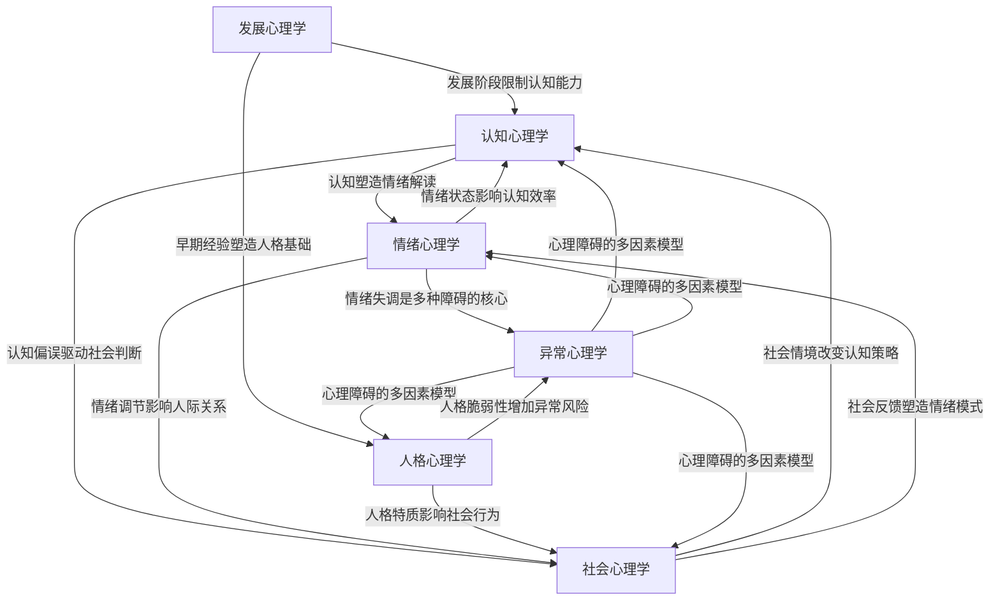
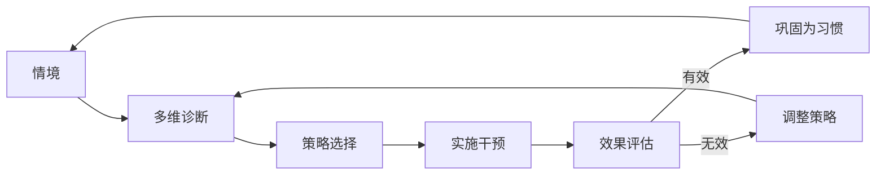

## 总结：心理学基础理论全景图

前面七个专题分别从历史脉络、认知机制、发展规律、社会影响、情绪系统、人格结构和异常状态七个维度，构建了理解人类心理的完整知识框架。本节将这些碎片化的知识整合为一张可操作的全景图，帮助你建立系统化的心理学思维，并为后续的具体方案部分打下坚实基础。

---

### 8.1 七大学科领域的核心要义

每个领域回答一个根本问题，掌握这个核心问题比记忆具体理论更重要。

| 领域 | 核心问题 | 一句话要义 | 关键概念 |
|------|---------|-----------|---------|
| 心理学史 | 心理学如何成为科学？ | 从哲学思辨到实证研究，不同学派提供了互补的视角 | 结构主义、行为主义、认知革命、人本主义 |
| 认知心理学 | 我们如何获取和加工信息？ | 大脑不是计算机，而是一个主动建构意义的系统 | 工作记忆、注意力瓶颈、双系统思维、元认知 |
| 发展心理学 | 人如何随时间变化？ | 发展是基因与环境持续交互的终身过程 | 关键期、依恋类型、认知发展阶段、可塑性 |
| 社会心理学 | 他人如何影响我们？ | 社会情境的力量远超个人直觉 | 归因偏差、从众、认知失调、旁观者效应 |
| 情绪心理学 | 情绪是什么，如何运作？ | 情绪不是需要压制的干扰，而是进化赋予的导航系统 | 情绪调节、情绪智力、情绪颗粒度、躯体标记 |
| 人格心理学 | 什么让人成为独特的个体？ | 人格是基因、环境和自我选择共同塑造的稳定模式 | 大五人格、防御机制、自我效能感、整合自我 |
| 异常心理学 | 什么是"正常"的边界？ | 正常与异常是连续谱，不是二元对立 | 焦虑障碍、抑郁、DSM分类、心理治疗四大流派 |

**理解要点**：这七个领域不是并列的知识清单，而是观察人类心理的七个不同"镜头"。同一个现象——比如一个人在社交场合感到焦虑——可以同时从认知（注意力偏向威胁）、发展（早期依恋经历）、社会（评价恐惧）、情绪（调节策略失效）、人格（神经质特质）和异常（社交焦虑障碍）六个角度进行分析。真正的心理学素养，就是能够灵活切换这些镜头。

---

### 8.2 领域间的深层关联

七个领域之间存在紧密的因果网络，理解这些关联是将知识转化为洞察力的关键。

**六条核心关联链**：

**1. 认知↔情绪：双向驱动**
认知评价理论（Lazarus）告诉我们，情绪不是对事件的直接反应，而是对事件认知评价的结果。同一个考试失利，解读为"我不够聪明"会产生羞耻，解读为"这次方法不对"则产生改进的动力。反过来，情绪状态也会扭曲认知——焦虑时注意力偏向威胁信息，抑郁时记忆更容易提取负面内容。这意味着，改变认知可以调节情绪，调节情绪也可以改善认知。

**2. 认知↔社会：归因与偏见的根源**
社会心理学中的归因理论、刻板印象、群体思维等现象，本质上都是认知过程在社会情境中的表现。基本归因错误（高估个人因素、低估情境因素）源于认知上的"对应偏差"。了解认知心理学的启发式和偏误，能直接帮助你识别社会判断中的系统性错误。

**3. 发展→人格→社会：早期经历的长远影响**
依恋理论清晰地展示了这条因果链：早期与养育者的互动模式（发展心理学）→ 内部工作模型（人格心理学）→ 成年后的亲密关系模式（社会心理学）。安全型依恋的人更容易信任他人、有效调节情绪、建立稳定关系；回避型依恋的人则可能在亲密关系中保持情感距离。但这条链不是宿命的——后续的社会经验和有意识的自我成长可以修正早期模式。

**4. 情绪→异常：从正常波动到临床障碍**
焦虑、悲伤、恐惧都是正常情绪，但当它们的强度、持续时间或触发条件超出正常范围，就可能进入异常心理学的领域。情绪调节能力（情绪心理学）是区分正常情绪反应和情绪障碍的关键变量。这解释了为什么认知行为疗法（CBT）对情绪障碍有效——它同时作用于认知和情绪两个系统。

**5. 人格→异常：脆弱性与韧性的平衡**
高神经质（大五人格中的维度）是几乎所有心理障碍的风险因素，而高尽责性和高宜人性则是保护因素。但人格特质只是风险因素，不是判决书——同样高神经质的人，如果拥有良好的情绪调节能力和社会支持，可以完全不发展出心理障碍。

**6. 元认知：贯穿所有领域的"操作系统"**
认知心理学中的元认知——对自己思维过程的觉察和监控——是连接所有领域的枢纽。能够觉察自己正在使用什么认知策略（认知）、处于什么情绪状态（情绪）、受什么社会力量影响（社会）、处于什么发展阶段（发展）、表现出什么人格模式（人格），这种"觉察能力"本身就是改变的起点。

---

### 8.3 心理学思维的五个层次

学习心理学不仅是积累知识，更是训练一种思维方式。以下是心理学思维的五个递进层次：

**层次一：命名（Naming）**
能够用专业术语描述心理现象。例如，不说"我就是控制不住发脾气"，而说"我正在经历情绪调节困难，可能使用了表达抑制而非认知重评策略"。命名让模糊的感受变得可操作。

**层次二：解释（Explaining）**
能够用心理学理论解释行为背后的原因。例如，理解为什么人在群体中更容易做出极端决策（群体极化），为什么亲密关系中的冲突往往与早期依恋模式有关。解释让你从"是什么"进入"为什么"。

**层次三：预测（Predicting）**
能够基于心理学规律预测行为趋势。例如，知道认知失调理论后，可以预测一个人在做出困难选择后会如何合理化自己的决定；知道旁观者效应后，可以预测紧急情况下人越多个体越不可能施以援手。预测让你从被动理解变为主动应对。

**层次四：干预（Intervening）**
能够运用心理学原理改变行为和状态。例如，使用认知重评改变对压力事件的解读，使用"如果-则"计划（implementation intention）提高目标达成率，使用渐进式暴露减少恐惧反应。干预是理论转化为实践的关键一步。

**层次五：整合（Integrating）**
能够在复杂情境中灵活组合多个心理学视角。例如，面对一个在工作中频繁与同事冲突的人，同时从人格（低宜人性）、认知（敌意归因偏差）、情绪（愤怒调节困难）、发展（童年目睹家庭暴力）和社交技能（缺乏非暴力沟通训练）多个角度理解问题，并设计综合干预方案。整合是心理学思维的最高层次。

---

### 8.4 知识自测：你掌握了什么？

以下问题覆盖各领域核心概念，用于检验理解程度。不需要背诵答案，关键是能够用自己的话解释。

**认知心理学**
- 工作记忆的容量限制是多少？这如何影响信息呈现方式的设计？
- 什么是"变化盲视"？它说明了注意力的什么特性？
- 系统1和系统2思维分别在什么情况下占主导？举一个日常决策的例子。

**发展心理学**
- 皮亚杰的"守恒实验"证明了什么？
- 安全型依恋和焦虑型依恋在成人亲密关系中分别表现为什么模式？
- 为什么说"青春期大脑尚未发育完全"？前额叶皮层的成熟时间线是什么？

**社会心理学**
- 米尔格拉姆服从实验的核心发现是什么？它对理解日常权威服从有何启示？
- 认知失调如何影响决策后的态度变化？
- 如何利用社会认同理论增强团队凝聚力？

**情绪心理学**
- 情绪调节的"先行聚焦"和"反应聚焦"策略有什么区别？哪个更有效？
- 什么是"情绪颗粒度"？高情绪颗粒度有什么优势？
- 躯体标记假说如何解释"直觉"在决策中的作用？

**人格心理学**
- 大五人格中，哪个维度对职业成功预测力最强？
- 什么是"投射"防御机制？举一个日常例子。
- 自我效能感和自尊有什么区别？

**异常心理学**
- 焦虑的正常功能和病理状态的区别是什么？
- CBT、精神动力学、人本主义和生物医学四种治疗取向的核心差异是什么？
- 什么情况下应该寻求专业心理帮助，而不是自我调节？

如果大部分问题你都能用自己的话回答，说明基础理论部分已经扎实。如果某些领域薄弱，建议回头复习对应章节，因为后续的具体方案部分会频繁调用这些理论知识。

---

### 8.5 心理学知识的整合应用框架

理论学习的最终目的是指导实践。以下是将七大学科知识整合应用的框架：

**第一步：情境分析（Situation）**
遇到一个心理相关的情境时，先用描述性语言记录事实，不做判断。
- 发生了什么？（行为层面）
- 我/他人有什么身体反应？（生理层面）
- 我/他人表达了什么感受？（情绪层面）
- 我/他人做了什么解读？（认知层面）

**第二步：多维诊断（Diagnosis）**
用心理学镜头分析情境：

| 维度 | 问什么 | 对应理论工具 |
|------|--------|-------------|
| 认知维度 | 我的信息加工是否准确？有没有认知偏误？ | 启发式与偏误、双系统理论 |
| 情绪维度 | 情绪的强度和类型是否与情境匹配？ | 情绪调节模型、情绪颗粒度 |
| 社会维度 | 社会情境中有哪些影响力在起作用？ | 从众、社会比较、归因理论 |
| 发展维度 | 这个反应是否与某个发展阶段的特征相关？ | 埃里克森阶段、依恋理论 |
| 人格维度 | 这是否反映了稳定的人格模式？ | 大五人格、防御机制 |
| 异常态维度 | 这是否已超出正常范围，需要专业帮助？ | DSM标准、功能损害评估 |

**第三步：策略选择（Strategy）**
根据诊断结果选择干预策略：
- **认知层面**：认知重评、苏格拉底式提问、去灾难化
- **情绪层面**：正念觉察、RAIN技术、情绪日记
- **行为层面**：行为激活、暴露训练、习惯塑造
- **社会层面**：沟通技巧、边界设定、寻求支持
- **人格层面**：自我探索、价值观澄清、优势识别

**第四步：效果评估（Evaluation）**
- 策略实施后，感受和行为有什么变化？
- 如果效果不佳，是策略选择错误还是执行不到位？
- 需要调整什么？

---

### 8.6 从理论到实践的桥梁

基础理论部分建立了"理解框架"，具体方案部分将提供"操作工具"。两者的关系可以用一个比喻来说明：

> 理论是地图，方案是导航。没有地图，导航指令毫无意义（你不知道"左转"在哪里）；没有导航，地图只能让你知道方向，却无法告诉你具体怎么走。

**具体方案部分将覆盖的核心实践领域**：

| 实践领域 | 依赖的理论基础 | 能获得的能力 |
|---------|---------------|-------------|
| 自我认知方法 | 人格心理学、元认知 | 清楚自己的特质、价值观、优势和盲区 |
| 情绪管理技巧 | 情绪心理学、认知心理学 | 识别、接纳和调节情绪的能力 |
| 自信建立 | 社会心理学、人格心理学 | 建立真实的自我效能感和内在价值感 |
| 压力管理 | 情绪心理学、认知心理学 | 有效应对压力源，防止慢性压力损害健康 |
| 心理健康维护 | 异常心理学、发展心理学 | 识别心理问题的早期信号，知道何时求助 |
| 人际关系应用 | 社会心理学、发展心理学 | 改善沟通质量，建立健康的人际边界 |
| 积极心理学实践 | 情绪心理学、人格心理学 | 提升幸福感、生活意义感和心理韧性 |

**学习建议**：

1. **不要跳过理论直接看方案**。方案中的具体技巧（如认知重评、正念呼吸）都有理论根基，理解"为什么有效"比记住"怎么做"更重要——因为当你理解原理后，你可以在不同情境中灵活变通，而不是机械地执行步骤。

2. **选择一个最急需的领域开始实践**。不要试图同时改变所有方面。心理学研究一致表明，行为改变需要聚焦和重复——选择一个最困扰你的问题，用具体方案中的方法持续练习2-4周，形成稳定习惯后再扩展到下一个领域。

3. **建立个人心理学笔记**。记录你在日常生活中观察到的心理学现象——自己的认知偏误、情绪波动模式、人际互动中的归因方式。这种"生活中的心理学实验"是将书本知识内化为个人智慧的最有效方式。

4. **保持科学怀疑精神**。心理学中存在大量相互矛盾的理论和"流行但不准确"的说法（如"我们只用了大脑的10%"）。用本章学到的批判性思维去检验每一个心理学主张：它有实证研究支持吗？研究样本有多大？是否被重复验证过？

---

### 8.7 心理学素养的终身价值

掌握心理学基础理论的价值远不止于解决眼前的心理困扰。它是一种根本性的认知升级，影响你理解世界和自我的方式。

**对个人生活的价值**：
- **自我理解**：知道自己为什么会有某些反应，而不是被无意识的模式驱动
- **情绪自由**：不再被情绪绑架，能够在情绪和行动之间插入一个"选择空间"
- **关系质量**：理解他人行为背后的心理动因，减少误解和冲突
- **决策质量**：识别自己的认知偏误，做出更理性的判断

**对职业发展的价值**：
- **领导力**：理解群体动力学、动机理论和影响力原则
- **沟通能力**：根据对方的认知风格和情绪状态调整沟通方式
- **抗压能力**：有效管理职业压力，防止职业倦怠
- **创造力**：理解认知灵活性和发散思维的心理机制

**对社会参与的价值**：
- **媒体素养**：识别广告、政治宣传和社会运动中的心理学操控手段
- **公民责任**：理解偏见、歧视和群体冲突的心理根源，成为建设性力量
- **代际传递**：如果成为父母，能够为下一代提供更健康的心理发展环境

心理学不是一门可以"学完"的学科。它是持续一生的自我探索之旅。基础理论为你提供了起点和工具，接下来的具体方案将帮助你迈出第一步。最重要的不是掌握多少理论，而是开始用心理学的眼光观察自己的生活——这本身就是改变的开始。
