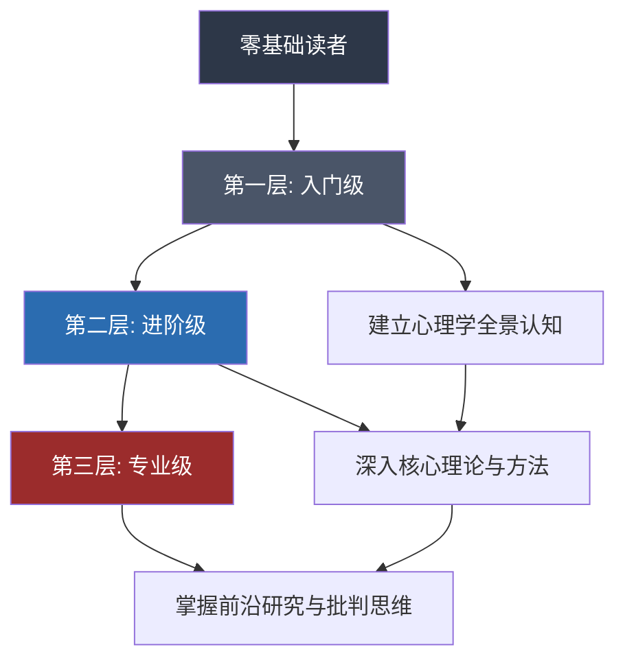
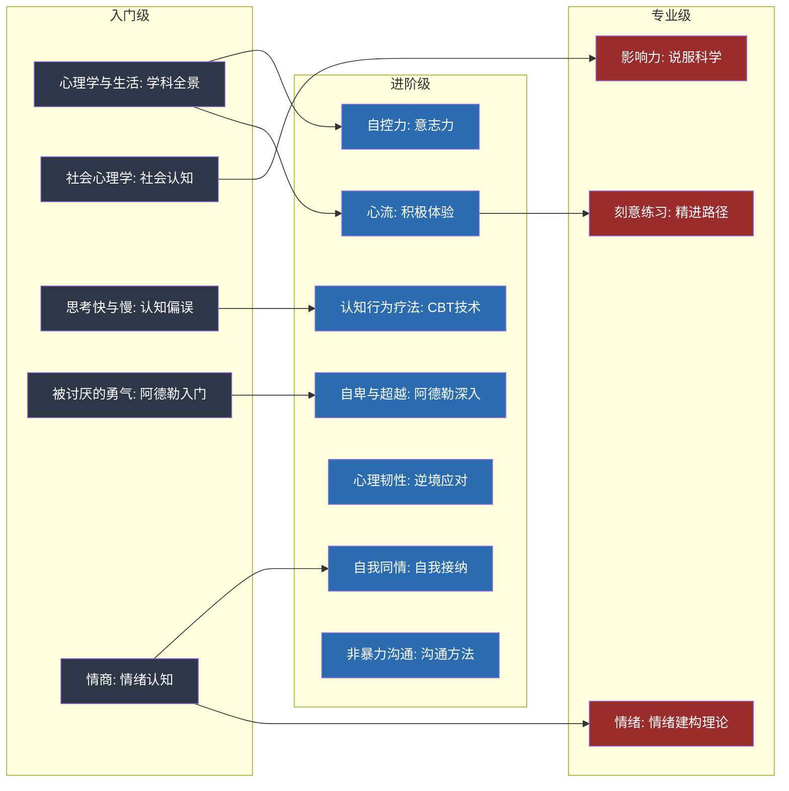

## 一、推荐书籍

心理学是一门庞大的学科，涵盖认知、情绪、人格、社会行为、发展、临床等多个分支。面对浩如烟海的文献和通俗读物，初学者往往不知从何入手，而有一定基础的读者又容易陷入"读了很多却不成体系"的困境。本节按照从入门到精通的逻辑，精选15本覆盖心理学核心领域的书籍，分为三个层级，帮助不同基础的读者构建完整且有深度的心理学知识体系。

### 如何使用这份书单

在正式介绍书籍之前，先说明这份书单的设计逻辑和使用方法：

**选书原则**：每本书都是该领域公认的标杆之作，经受住了时间和学术界的检验。不追新、不追热，只选真正能帮助读者建立扎实认知框架的作品。

**阅读策略**：
- **入门级**：建议全部通读，建立心理学全景认知，每本大约需要2-4周
- **进阶级**：根据个人兴趣和需求选择，每本大约需要3-6周
- **专业级**：适合有明确研究方向或深度兴趣的读者，每本需要6-10周精读

**中英文版本选择**：大部分书籍有中文译本，建议优先阅读中文译本以降低认知负荷，英文版可作为参考对照。部分翻译质量不佳的书籍，会在具体条目中说明。

---

### 第一层：入门级（零基础可读）

入门级书籍的共同特征是：语言通俗，不预设专业知识背景，案例丰富，读完能建立对心理学的整体认知。这个阶段的目标不是掌握某个具体技能，而是"知道心理学研究什么、怎么研究、能解决什么问题"。

#### 1.《心理学与生活》（Psychology and Life）

- **作者**：Richard J. Gerrig, Philip G. Zimbardo
- **版本信息**：最新第20版（英文），中文第19版由人民邮电出版社出版
- **推荐理由**：全球使用最广泛的心理学入门教材，被斯坦福大学等数百所高校采用。它的优势不在于某一个话题讲得有多深，而在于覆盖了心理学几乎所有的主要分支——生物心理学、感知觉、学习与记忆、发展心理学、人格理论、社会心理学、临床心理学、健康心理学——并且每个分支都讲到了足以让读者理解该领域核心问题的程度。语言通俗但不随意，案例贴近生活但不失学术严谨。
- **核心内容拆解**：
  - **生物基础**：神经系统、大脑结构、内分泌系统如何影响行为和心理
  - **认知过程**：感知觉、注意、记忆、思维、语言的心理机制
  - **发展心理学**：从婴儿期到老年期的心理发展规律
  - **人格理论**：精神分析、人本主义、特质理论、社会认知理论的对比
  - **社会心理学**：态度、从众、偏见、群体行为
  - **临床心理学**：心理障碍的分类、诊断与治疗方法
- **阅读建议**：可以选择性阅读感兴趣的章节，不必从头读到尾。每章末尾的"关键术语"和"思考题"很有价值，建议做完再翻下一章。如果时间有限，优先阅读第1-4章（基础框架）和第14-16章（社会心理学），这两部分对日常生活帮助最大。
- **适合人群**：所有想了解心理学的人，没有任何前置知识要求

#### 2.《社会心理学》（Social Psychology）

- **作者**：David G. Myers
- **版本信息**：最新第13版（英文），中文第11版由人民邮电出版社出版
- **推荐理由**：社会心理学领域的经典教材，全球销量超过千万册。与其他社会心理学教材相比，Myers的优势在于文笔极其生动，大量真实研究案例穿插其中，读起来像在读一本有深度的非虚构作品，而不是一本教科书。更重要的是，社会心理学的研究成果对日常生活的指导意义最为直接——理解了从众、说服、偏见、亲密关系的心理机制，你在社交中的判断力和影响力会显著提升。
- **核心内容拆解**：
  - **社会认知**：我们如何形成对他人的印象、归因方式的偏差（基本归因错误）
  - **自我概念**：自尊、自我服务偏差、自我实现预言
  - **说服**：中心路径与边缘路径、态度改变的条件
  - **从众与服从**：Asch实验、Milgram实验的启示
  - **群体影响**：社会懈怠、群体极化、群体思维
  - **偏见与歧视**：偏见的根源、刻板印象的形成与消除
  - **攻击与亲社会行为**：攻击性的影响因素、助人行为的决策模型
  - **亲密关系**：吸引力法则、爱情三角理论、关系维护
- **阅读建议**：特别推荐阅读"社会认知""说服""群体影响"这三个章节，实用性最强。每读完一个实验，试着回忆自己在生活中是否经历过类似的情境，这种自我对照是最有效的学习方式。
- **适合人群**：想理解人际互动底层逻辑、提升社交判断力的读者

#### 3.《思考，快与慢》（Thinking, Fast and Slow）

- **作者**：Daniel Kahneman
- **版本信息**：中文版由中信出版社出版
- **推荐理由**：诺贝尔经济学奖得主Kahneman的毕生总结。这本书的核心贡献是将人类思维分为两个系统：系统1（快速、直觉、自动化）和系统2（缓慢、理性、需要努力），并系统展示了系统1的种种认知偏误如何导致我们在判断和决策中犯错。这不是一本"告诉你怎么思考"的书，而是一本"告诉你为什么你总是想错"的书。理解了这些偏误，你不会变得更聪明，但会更清醒。
- **核心内容拆解**：
  - **系统1与系统2**：两种思维模式的特点、分工和切换条件
  - **启发式与偏误**：可得性启发式、代表性启发式、锚定效应
  - **过度自信**：为什么专家的预测往往不比扔硬币更准
  - **前景理论**：损失厌恶、参考点依赖、确定性效应
  - **经验自我与记忆自我**：峰终定律如何影响我们对经历的评价
- **阅读建议**：这本书内容密度较高，建议慢慢读，每周2-3章即可。每读完一个偏误，在手机备忘录里记下自己生活中中招的实例。读完后回顾这些记录，会发现自己的决策模式有了清晰的自我认知。特别注意前景理论部分，它对投资决策、消费行为、职业选择都有直接的指导价值。
- **适合人群**：想提升决策质量、理解人类非理性行为的读者

#### 4.《被讨厌的勇气》

- **作者**：岸见一郎、古贺史健
- **版本信息**：中文版由机械工业出版社出版
- **推荐理由**：以一位哲学家与一位青年的对话体，系统介绍阿德勒心理学的核心思想。阿德勒与弗洛伊德、荣格并称心理学三大巨头，但他的理论在大众中的传播度远不如另外两位。这本书填补了这个空白。它最大的思想冲击在于"目的论"——不是过去的经历决定了现在的你，而是你为了达到某个目的而选择了现在的行为模式。这个视角对习惯性自我归因于原生家庭、童年创伤的读者来说，是一种根本性的认知重构。
- **核心概念拆解**：
  - **目的论 vs 因果论**：行为由目的驱动，而非由过去决定
  - **课题分离**：区分"自己的课题"和"别人的课题"，不干涉也不被干涉
  - **自卑感与自卑情结**：自卑感是成长的动力，自卑情结是逃避的借口
  - **共同体感觉**：对他人有贡献感，是幸福感的终极来源
  - **活在当下**：不纠结过去，不焦虑未来，聚焦此时此刻
- **阅读建议**：适合在感到人际关系困扰、自我怀疑时阅读，治愈感强。读完后重点实践"课题分离"——下次当你因为别人的态度而焦虑时，问自己"这是谁的课题？"。建议与下一本《自卑与超越》配合阅读，前者是通俗解读，后者是阿德勒本人的原著，互为补充。
- **适合人群**：在人际关系中感到疲惫、习惯性讨好他人、过度在意他人评价的读者

#### 5.《情商》（Emotional Intelligence）

- **作者**：Daniel Goleman
- **版本信息**：中文版由中信出版社出版
- **推荐理由**：1995年出版后全球销量超过500万册，让"情商"（EQ）这个概念从学术圈走向大众视野。Goleman提出情绪智力的五个维度——自我觉察、自我调节、内驱力、同理心、社交技能——并用大量神经科学和心理学研究证据说明，情商对人生成功的预测力甚至超过智商。这本书的价值不在于提供具体的提升方法（那方面的内容在后续进阶书籍中），而在于建立一个认知：情绪不是需要压制的干扰，而是需要理解和运用的信息。
- **核心内容拆解**：
  - **情绪劫持**：杏仁核如何在理性介入前"劫持"行为
  - **自我觉察**：识别和命名自己的情绪状态
  - **自我调节**：延迟满足、情绪调节策略
  - **同理心**：理解他人情绪的能力及其神经基础
  - **社交技能**：情绪在领导力、团队合作、亲密关系中的作用
- **阅读建议**：如果只读一本关于情绪的书，选这本。它建立的认知框架——情绪是可以被理解和管理的——是后续所有情绪相关学习的基础。读完后可以进一步阅读本章推荐的《自控力》和《自我同情》。
- **适合人群**：所有读者，尤其适合认为"情绪是弱点"或"理性高于一切"的人

---

### 第二层：进阶级（有一定基础后的深入阅读）

进入进阶阶段，你已经对心理学的整体面貌有了认知，现在需要深入具体的理论、方法和技术。这个阶段的书籍开始涉及可操作的策略和工具，读完后不仅能"理解"，还能"运用"。

#### 6.《自控力》（The Willpower Instinct）

- **作者**：Kelly McGonigal
- **版本信息**：中文版由文化发展出版社出版
- **推荐理由**：斯坦福大学最受欢迎的心理学课程之一（开设以来累计选课人数超过10万），本书是该课程的书籍版。McGonigal的贡献在于将意志力研究从"鸡汤式鼓励"提升到了科学层面——她解释了意志力的生理基础（前额叶皮层的三个区域分别负责"我要做""我不做""我想要"三种力量），以及为什么意志力会像肌肉一样疲劳。更重要的是，每一章都提供了经过科学验证的提升策略，不是空洞的"坚持就是胜利"。
- **核心内容拆解**：
  - **意志力的三种力量**："我要做"（执行力）、"我不做"（自控力）、"我想要"（目标感）
  - **意志力的生理基础**：心率变异度作为意志力指标、葡萄糖与自控力的关系
  - **意志力陷阱**：道德许可效应（做了好事就放纵）、"那又如何"效应（破罐破摔）、即时满足偏误
  - **提升策略**：冥想训练、充足睡眠、运动、"预先承诺"策略
  - **社会传染**：自控力和诱惑都会在社交网络中传播
- **阅读建议**：强烈建议配合书中的练习做，每周读一章并实践该章的策略。书中最有价值的实操工具是"意志力日记"——每天记录一个你成功运用意志力的时刻和一个失败的时刻，坚持两周就能看到自己的意志力模式。配合下一本《心理韧性》一起读，前者聚焦日常自控，后者聚焦极端压力下的心理应对。
- **适合人群**：拖延症患者、习惯性拖延者、想提升执行力的任何人

#### 7.《心流：最优体验心理学》（Flow: The Psychology of Optimal Experience）

- **作者**：Mihaly Csikszentmihalyi
- **版本信息**：中文版由中信出版社出版
- **推荐理由**：积极心理学的奠基之作。Csikszentmihalyi通过数十年的"经验取样法"研究（让受试者在一天中随机时刻报告自己的状态），发现了一个关键规律：人在全神贯注于一项有挑战性但能力匹配的活动时，会进入一种忘我、愉悦、高效的状态——他称之为"心流"。这个发现回答了一个根本问题：幸福不是来自外部条件（财富、地位、舒适），而是来自内在体验（投入、挑战、成长）。
- **核心内容拆解**：
  - **心流的条件**：明确的目标、即时的反馈、挑战与技能的平衡
  - **心流的特征**：时间感扭曲、自我意识消失、控制感、内在奖赏
  - **控制意识**：注意力是最宝贵的资源，决定了体验的质量
  - **工作中的心流**：为什么有些人在工作中比休闲时更快乐
  - **人际关系中的心流**：深度对话、亲密关系中的共同投入
  - **自成目标**：做事情本身就是目的，而非达到其他目标的手段
- **阅读建议**：特别推荐阅读关于工作和休闲的心流应用章节。读完后做一个练习：回顾你过去一周的体验，标记出你进入心流状态的时刻，分析是什么活动、什么条件促成了心流。这个自我观察会帮助你有意识地在日常生活中创造更多心流体验。与《刻意练习》配合阅读效果更好——前者告诉你什么是心流，后者告诉你如何通过刻意练习进入心流。
- **适合人群**：想理解幸福本质、提升工作和生活体验质量的读者

#### 8.《自卑与超越》（What Life Could Mean to You）

- **作者**：Alfred Adler
- **版本信息**：中文版由民主与建设出版社等多个译本
- **推荐理由**：阿德勒个体心理学的经典著作，也是他本人写的最通俗的入门读物（虽然相比《被讨厌的勇气》仍然更学术化）。阿德勒的核心观点是：自卑感是人类行为的根本动力。每个人在童年时期都会因为弱小和依赖而产生自卑感，健康的反应是通过努力和成长来"超越"自卑，不健康的反应则是形成"自卑情结"——用逃避、补偿、控制来掩盖自卑。理解这个框架，你就能理解为什么有些人越缺什么越炫耀什么，为什么有些人永远在和别人比较。
- **核心内容拆解**：
  - **自卑感与补偿**：自卑感如何驱动行为，过度补偿的表现
  - **生活风格**：4岁左右形成的对自我、他人和世界的基本看法，决定了成年后的行为模式
  - **社会兴趣**：对他人和社会的关心程度，是心理健康的最佳指标
  - **出生顺序**：老大、中间孩子、老幺、独生子的不同心理特征
  - **人生三大课题**：工作、社交、爱情——都涉及与他人的合作
- **阅读建议**：与《被讨厌的勇气》配合阅读效果最佳。前者用对话形式帮你理解概念，后者是阿德勒本人的完整论述。如果你只读了前者觉得"道理我都懂但还是做不到"，后者会给你更深的理解。特别注意"社会兴趣"这个概念——阿德勒认为，一个只关注自己的人注定不幸福，幸福感来自对共同体的贡献感。
- **适合人群**：想深入理解阿德勒心理学体系、探索自卑与个人成长关系的读者

#### 9.《认知行为疗法基础与应用》（Cognitive Behavior Therapy: Basics and Beyond）

- **作者**：Judith S. Beck
- **版本信息**：中文第3版由人民邮电出版社出版
- **推荐理由**：CBT领域最权威的教材之一，作者是CBT创始人Aaron Beck的女儿。CBT是目前循证支持最强的心理治疗方法之一，被广泛用于治疗抑郁症、焦虑症、PTSD等心理障碍。这本书的价值不仅在于面向心理咨询师，更在于其中的认知技术有极大的自我应用价值——你不需要成为治疗师，也能用"识别自动思维→评估证据→生成替代想法"的框架来改善自己的情绪困扰。
- **核心内容拆解**：
  - **认知模型**：情境→自动思维→情绪→行为的循环
  - **认知层级**：自动思维（表层）→中间信念（规则/假设）→核心信念（深层）
  - **苏格拉底式提问**：通过提问而非说教来引导认知改变
  - **认知重建**：识别认知歪曲、寻找替代解释的具体步骤
  - **行为实验**：用实际行动检验消极预期
  - **常见认知歪曲**：非黑即白、灾难化、读心术、以偏概全、情绪推理等
- **阅读建议**：重点阅读关于自动思维、中间信念和核心信念的章节。实操建议：准备一个"思维记录表"（Thought Record），每天记录一次——情境是什么、自动思维是什么、情绪强度多少、有什么证据支持和反对这个想法、替代想法是什么、新的情绪强度多少。坚持记录两周，你会发现自己的认知模式变得非常清晰。
- **适合人群**：想学习自我心理调节技术、对认知疗法有兴趣的读者，以及心理咨询从业者

#### 10.《心理韧性》（Resilience: The Science of Mastering Life's Greatest Challenges）

- **作者**：Steven M. Southwick, Dennis S. Charney
- **版本信息**：中文版由机械工业出版社出版
- **推荐理由**：这本书的研究基础非常独特——作者团队对经历过极端逆境的人群进行了系统研究，包括战俘营幸存者、灾难幸存者、特种部队士兵、失去孩子的父母等。通过这些研究，他们总结出了10种经过验证的心理韧性培养策略。这不是一本"正能量鸡汤"，而是基于科学研究的韧性提升手册。
- **核心内容拆解**：
  - **韧性不是天赋**：心理韧性可以通过训练增强，类似于肌肉可以通过锻炼变强
  - **10种韧性策略**：乐观主义、面对恐惧、建立社会支持网络、模仿榜样、身体锻炼、正念冥想、认知重评、情绪调节、找到意义感、信仰/灵性
  - **面对恐惧**：不是消除恐惧，而是在恐惧中行动（暴露疗法原理）
  - **社会支持**：孤独是韧性的最大敌人，建立深度连接比广泛社交更重要
  - **身体锻炼**：运动不仅改善身体健康，还通过神经可塑性直接增强心理韧性
- **阅读建议**：建议配合本章的心理韧性培养方案一起阅读，将书中策略与具体的日常训练结合起来。重点关注"面对恐惧"和"社会支持"两个章节——前者帮助你直面回避已久的问题，后者帮助你建立真正有效的支持网络。
- **适合人群**：正在经历或刚经历重大困难的人、想提前建立心理防线的人

#### 11.《自我同情》（Self-Compassion: The Proven Power of Being Kind to Yourself）

- **作者**：Kristin Neff
- **版本信息**：中文版由机械工业出版社出版
- **推荐理由**：Neff是自我同情研究领域的开创者。她的核心发现是：自我同情比自尊更能预测心理健康和幸福感。自尊依赖于外部评价和比较（"我比别人好所以我有价值"），而自我同情是一种无条件的自我接纳（"我有不完美但我仍然值得被善待"）。对于习惯性自我批评、完美主义倾向严重的人来说，这本书可能带来根本性的改变。
- **核心内容拆解**：
  - **自我同情的三个成分**：自我善待（而非自我批评）、共通人性（而非孤立感）、正念（而非过度认同）
  - **自我同情 vs 自尊**：前者更稳定、不依赖外部评价、不会导致自恋
  - **自我同情冥想**：具体的冥想练习，培养对自己的温暖和关怀
  - **自我同情与动机**：自我同情的人反而更有动力改变，因为不怕失败后的自我惩罚
  - **常见误解**：自我同情不是自我放纵、不是逃避责任、不是降低标准
- **阅读建议**：特别推荐阅读其中的自我同情冥想练习，每天10分钟，坚持两周会有明显感受。如果你发现自己总是在犯错后对自己说"你怎么这么蠢"，这本书会教你换一种声音。
- **适合人群**：自我批评严重、完美主义倾向、害怕失败、感到孤独和自我孤立的人

#### 12.《非暴力沟通》（Nonviolent Communication）

- **作者**：Marshall B. Rosenberg
- **版本信息**：中文版由华夏出版社出版
- **推荐理由**：不仅是一本沟通技巧书，更是一套理解人类情绪和需求的心理学方法论。Rosenberg的"非暴力沟通"框架——观察（不带评判地描述事实）→感受（识别自己的情绪）→需要（找到情绪背后的深层需求）→请求（提出具体可执行的请求）——看似简单，实则需要大量的练习才能内化。它的核心洞察是：冲突的根源不是对方做错了什么，而是双方的某些需要没有被满足。
- **核心内容拆解**：
  - **观察 vs 评判**："你总是迟到"是评判，"这周你三次会议迟到了15分钟"是观察
  - **感受 vs 想法**："我觉得你不尊重我"是想法，"我感到沮丧和不被重视"是感受
  - **需要的层次**：安全感、被理解、自主性、归属感、成长等
  - **请求 vs 要求**：请求允许对方拒绝，要求不允许
  - **同理倾听**：不急于给建议，先理解对方的感受和需要
  - **自我同情在沟通中的应用**：先善待自己，才能真正善待他人
- **阅读建议**：推荐配合实际的人际沟通场景练习。每次沟通冲突后，用四步框架复盘：我当时观察到什么、感受到什么、需要什么、请求什么。与《自我同情》配合阅读效果好——前者教你如何与他人沟通，后者教你如何与自己对话。
- **适合人群**：在亲密关系、亲子关系、职场沟通中感到困难的读者

---

### 第三层：专业级（深入研究特定领域）

专业级书籍不再只是介绍已有知识，而是挑战既有认知、提供批判性视角或揭示前沿研究。读这些书需要一定的心理学基础，否则容易误解或片面解读。

#### 13.《情绪》（How Emotions Are Made: The Secret Life of the Brain）

- **作者**：Lisa Feldman Barrett
- **版本信息**：中文版由中信出版社出版
- **推荐理由**：这本书彻底颠覆了人们对情绪的传统认知。传统观点认为情绪是"基本的"——快乐、悲伤、愤怒、恐惧、惊讶、厌恶这六种情绪是全人类共有的，由特定的神经回路触发。Barrett用数十年的神经科学研究证据提出"情绪建构理论"：情绪不是被"触发"的，而是大脑根据过去的经验、当前的身体状态和所处情境主动"建构"出来的。这意味着同一种生理唤醒（心跳加速、手心出汗）可以被建构为"紧张""兴奋"或"恐惧"，取决于你如何解释它。
- **核心内容拆解**：
  - **情绪建构理论**：情绪不是被触发的反应，而是大脑的主动预测
  - **情绪粒度**：能区分和命名的情绪种类越多，情绪调节能力越强
  - **身体预算**：大脑持续管理身体的能量消耗，情绪是身体预算状态的反映
  - **概念学习**：情绪概念是通过文化和社会学习形成的，不同文化有不同的"情绪词典"
  - **传统情绪理论的缺陷**：Ekman的基本情绪理论为何在重复实验中站不住脚
- **适合人群**：对情绪科学有浓厚兴趣、愿意挑战既有认知、有一定心理学基础的读者。注意：这本书的论证基于大量神经科学研究，建议先读完《心理学与生活》和《情商》再来读这本，否则可能因为缺乏基础概念而难以理解。
- **延伸阅读**：读完后如果对情绪建构理论感兴趣，可以进一步阅读Barrett的学术论文集和她的TED演讲（有中文字幕），以及Antonio Damasio的《笛卡尔的错误》作为互补视角。

#### 14.《影响力》（Influence: The Psychology of Persuasion）

- **作者**：Robert B. Cialdini
- **版本信息**：中文版由万卷出版公司出版，最新第3版增加了"联盟"原则
- **推荐理由**：社会心理学中被引用最多、应用最广的作品之一。Cialdini花了三年时间"卧底"各种说服行业（汽车销售、房地产、电话营销、慈善募捐等），系统总结出六大（最新版为七大）影响力原则。这本书的价值不仅在于让你理解别人是怎么说服你的，更在于让你理解为什么你明知道是套路还是会中招——因为这些原则利用的是人类大脑的自动化决策模式（即《思考，快与慢》中的系统1）。
- **核心内容拆解**：
  - **互惠**：先给予再索取，即使给予是被迫接受的也会产生亏欠感
  - **承诺与一致**：人一旦做出承诺，就会调整行为以保持一致性（登门槛效应）
  - **社会认同**：在不确定时，人们会参考他人的行为来做决定（从众的升级版）
  - **喜好**：我们更容易被喜欢的人说服（外表吸引力、相似性、赞美、接触与合作）
  - **权威**：头衔、衣着、身份标志如何不自觉地影响我们的服从
  - **稀缺**："限量""最后一件""即将涨价"如何触发冲动购买
  - **联盟**（第3版新增）：当说服者被视为"我们中的一员"时，影响力大增
- **适合人群**：需要理解社会影响和说服机制的读者，包括市场营销从业者、管理者、销售人员，以及任何不想被"套路"的人。建议先读完《社会心理学》再来读，对其中的实验背景会有更好的理解。
- **实践建议**：读完后做一个"影响力审计"——回顾你最近一次大额消费或重要决定，分析其中是否有影响力原则在起作用。这个练习会让你在未来对这些策略更警觉。

#### 15.《刻意练习》（Peak: Secrets from the New Science of Expertise）

- **作者**：Anders Ericsson, Robert Pool
- **版本信息**：中文版由机械工业出版社出版
- **推荐理由**：Ericsson是"刻意练习"研究的开创者，他用数十年时间研究了国际象棋大师、小提琴家、运动员、记忆力冠军等领域的顶尖表现者，得出一个颠覆性的结论：天赋的作用被严重高估了，卓越表现的真正来源是"有目的的刻意练习"。"一万小时定律"是对他研究的粗暴简化——关键不是练习时间，而是练习方式。盲目重复一万小时不会让你成为专家，有目的的、有反馈的、在舒适区边缘的练习才会。
- **核心内容拆解**：
  - **心理表征**：专家与新手的根本区别在于心理表征的质量——专家拥有更精细、更结构化的内部模型
  - **刻意练习的四个要素**：明确的目标、专注的投入、即时的反馈、走出舒适区
  - **天真的练习 vs 有目的的练习 vs 刻意练习**：三者的区别
  - **导师的重要性**：好的导师能提供正确的练习设计和即时反馈
  - **天赋的真相**：早期优势、环境因素、练习动机比基因更重要
  - **年龄与学习**：大脑可塑性终身存在，只是学习方式需要调整
- **适合人群**：追求某一领域精进的学习者、教育工作者、想帮助孩子发展特长的父母。建议与《心流》配合阅读——心流是最佳体验状态，刻意练习是达成高水平的路径，两者互为补充。
- **实践建议**：选择你当前最想提升的一项技能，按照刻意练习的四个要素设计一个为期四周的训练计划，每周复盘调整。

---

### 各层书籍与心理学核心领域的对应关系

为了帮助读者更清晰地看到这15本书如何覆盖心理学的核心领域，下面用表格做了一个系统映射：

| 心理学领域 | 入门级 | 进阶级 | 专业级 |
|:---|:---|:---|:---|
| **认知与思维** | 《思考，快与慢》 | 《认知行为疗法》 | 《刻意练习》 |
| **情绪与情商** | 《情商》 | 《自我同情》 | 《情绪》 |
| **社会与影响** | 《社会心理学》 | 《非暴力沟通》 | 《影响力》 |
| **人格与自我** | 《被讨厌的勇气》 | 《自卑与超越》 | — |
| **动机与意志** | — | 《自控力》 | — |
| **积极心理学** | — | 《心流》 | — |
| **韧性与逆境** | — | 《心理韧性》 | — |
| **学科全景** | 《心理学与生活》 | — | — |

### 阅读路线推荐

根据不同目标，推荐以下几种阅读路线：

**路线一：全面入门路线（3-4个月）**
> 《心理学与生活》→《社会心理学》→《思考，快与慢》→《情商》→《被讨厌的勇气》
> 
> 目标：建立心理学全景认知，对主要分支有基本了解

**路线二：情绪管理路线（3-4个月）**
> 《情商》→《自我同情》→《自控力》→《情绪》
> 
> 目标：理解情绪本质，掌握情绪管理和自控的实用技术

**路线三：人际关系路线（2-3个月）**
> 《社会心理学》→《被讨厌的勇气》→《非暴力沟通》→《影响力》
> 
> 目标：理解人际互动的底层逻辑，提升沟通和社交能力

**路线四：个人成长路线（3-4个月）**
> 《被讨厌的勇气》→《自卑与超越》→《心流》→《刻意练习》→《心理韧性》
> 
> 目标：从自我认知到行动提升的完整成长路径

**路线五：认知升级路线（2-3个月）**
> 《思考，快与慢》→《认知行为疗法》→《刻意练习》
> 
> 目标：理解思维陷阱，掌握认知重构方法，建立高效学习体系

### 关于阅读方法的建议

有了好的书单，还需要好的阅读方法。以下是经过验证的高效心理学阅读策略：

1. **主动阅读**：不要被动地从头读到尾。每读一节，问自己三个问题——作者的核心论点是什么？有哪些证据支持？对我的生活有什么启示？
2. **间隔重复**：读完一本后，间隔2-4周再回顾笔记。遗忘曲线决定了如果没有复习，一个月后你只会记得大约20%的内容。
3. **输出倒逼输入**：每读完一本，写一段300字的摘要（不是摘抄，是用自己的话概括核心观点和收获）。能写清楚说明你真正理解了，写不清楚说明还需要回看。
4. **建立连接**：不同书籍之间有很多概念是相通的（比如《思考，快与慢》的系统1与《影响力》的自动化决策、《情绪》的预测编码与《认知行为疗法》的认知模型）。主动寻找这些连接，会让你的理解从"知识点"升级为"知识网络"。
5. **知行合一**：心理学的价值在于指导行动。每本书至少选择一个策略在日常生活中实践，否则读书只是信息消费，不是能力提升。
