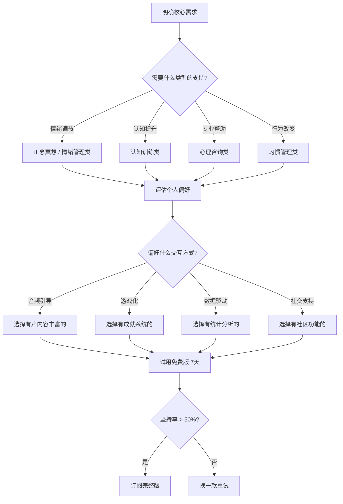

## 二、推荐APP

心理学自愈工具已经从纸质书籍和线下工作坊，延伸到了手机屏幕上的每一个图标。一款设计精良的心理健康APP，可以在你情绪崩溃的凌晨三点、在通勤地铁上的碎片时间、在不方便见咨询师的日常里，提供即时、低成本、可反复使用的支持。

但工具本身不等于疗愈。选错APP、用错方法，不仅浪费时间，还可能强化错误的自我认知。本节按功能分类推荐12款经过验证的APP，同时提供选型框架、使用方法论和常见误区，帮助你把工具用对。

### 选型框架：四步找到适合自己的APP

在逐个介绍APP之前，先建立一个选型框架，避免"下载一堆、用了两天、全部卸载"的典型困境。

**第一步：明确核心需求。** 不要因为"这个APP很火"就下载。问自己：我现在最需要解决的问题是什么？是入睡困难？是情绪波动？是注意力涣散？是需要有人倾听？需求不同，工具完全不同。

**第二步：评估个人偏好。** 你更喜欢听音频引导，还是看文字教程？喜欢游戏化的成就感，还是简洁的数据记录？喜欢独处练习，还是社区互动？偏好决定了坚持率，坚持率决定了效果。

**第三步：试用免费版至少7天。** 大部分APP都有免费功能，先用一周再决定是否付费。重点关注：打开频率（每天是否愿意打开）、单次使用时长（是否觉得时间过得快）、使用后感受（是否有正向反馈）。

**第四步：只保留1-2款主力APP。** 同类型APP不要超过一款。工具过多会分散注意力，产生"选择疲劳"。选定后至少坚持30天再评估效果。

### 一、正念冥想类

正念冥想是目前循证支持最强的自我心理调节方法之一。2014年发表在JAMA Internal Medicine上的一项meta分析（涵盖47项试验、3515名参与者）显示，正念冥想对焦虑、抑郁和疼痛的缓解效果与抗抑郁药物相当，且副作用极小。APP的作用是降低学习门槛——通过语音引导帮你进入状态，避免初学者"坐在那里不知道干什么"的困境。

#### 1. Headspace

- **功能**：引导式正念冥想、睡眠故事、呼吸练习、专注音乐、身体扫描
- **特色**：课程体系是所有冥想APP中最完善的。基础课程分10级，每级10-20分钟，从"什么是正念"教起，循序渐进。动画引导是其标志——用简洁的动画解释抽象的冥想概念，比如用雪花落入湖面的动画教你"让思绪自然落下，不要抓住它"。睡眠故事（Sleepcast）每晚更新，时长45-60分钟，配合环境音效。
- **适用场景**：零基础入门冥想、建立每日冥想习惯、改善睡眠
- **价格**：基础课程免费（前10节），完整版订阅约￥40/月或￥260/年
- **中文替代**：潮汐（Tide）——国产正念冥想APP，界面设计极简，音景质量在国内APP中顶级。提供"专注"、"呼吸"、"冥想"、"睡眠"四种模式，每个模式都有精心制作的自然音景（雨声、海浪、篝火、森林鸟鸣等）。免费版功能已经够用，Pro版约￥128/年。

**使用建议**：初学者从Headspace的基础课程开始，每天10分钟，连续完成10天基础课程后再探索其他内容。不要跳级——第1-3课教的"观察呼吸"看似简单，但这是所有高级技巧的基础。

#### 2. Calm

- **功能**：冥想引导、睡眠故事、呼吸练习、每日正念、情绪签到
- **特色**：睡眠故事是其王牌。"Sleep Stories"系列由名人朗读（Matthew McConaughey、Stephen Fry等），配合精心设计的背景音效和舒缓的叙事节奏，专为帮助入睡设计。自然音景库极其丰富，涵盖海浪、雨声、篝火、雷暴、溪流等数十种场景，支持自由混搭。每日正念（Daily Calm）每天推送一集10分钟的新内容，帮你保持新鲜感。
- **适用场景**：睡眠困难、需要持续新鲜内容、喜欢自然音景
- **价格**：基础内容免费，完整版订阅约￥45/月或￥300/年
- **使用建议**：如果你主要问题是入睡困难，Calm的Sleep Stories比Headspace更胜一筹。建议睡前30分钟打开，调低音量，配合蓝牙耳机或手机外放使用。

#### 3. 小睡眠

- **功能**：白噪音、自然音、ASMR、睡眠监测、冥想引导、梦境记录
- **特色**：音效资源是同类APP中最丰富的——超过200种基础音效，支持同时混合3-5种音效并独立调节音量。比如你可以把"雷雨声"调到40%、"篝火声"调到30%、"低频嗡鸣"调到20%，创造属于自己的专属环境音。针对不同场景（入睡、专注、放松、冥想、阅读）提供预设方案，也支持自定义保存。睡眠监测功能可以记录你的睡眠时长和深浅周期。
- **适用场景**：需要精细调节环境音、睡眠辅助、专注力提升、不想付费
- **价格**：基础功能免费，VIP约￥98/年

**三款冥想APP对比：**

| 维度 | Headspace | Calm | 小睡眠 |
|------|-----------|------|--------|
| 入门引导 | ★★★★★ | ★★★★ | ★★★ |
| 睡眠内容 | ★★★★ | ★★★★★ | ★★★★★ |
| 音景丰富度 | ★★★ | ★★★★ | ★★★★★ |
| 课程体系 | ★★★★★ | ★★★★ | ★★★ |
| 中文支持 | ★★★ | ★★ | ★★★★★ |
| 免费内容 | ★★★ | ★★ | ★★★★ |
| 最适合 | 系统学冥想 | 睡眠+冥想 | 音景控+免费党 |

### 二、情绪管理类

情绪管理APP的核心价值不在于"让你开心"，而在于帮你建立情绪觉察——先看见自己的情绪模式，才能有意识地调节。心理学中有个概念叫"情绪粒度"（emotional granularity），指的是区分和命名不同情绪的能力。情绪粒度越高的人，情绪调节能力越强。以下APP帮你提升情绪粒度。

#### 4. Daylio

- **功能**：情绪日记、活动追踪、情绪统计、趋势分析、数据导出
- **特色**：零文字门槛的情绪记录工具。打开APP，选一个心情图标（从"很棒"到"很糟"五级），再勾选今天做了哪些活动（工作、运动、社交、阅读、游戏等），整个过程不超过10秒。坚持记录后，Daylio会自动生成情绪趋势图，帮你发现"哪些活动和好心情相关"、"哪些天情绪最差"、"情绪波动的周期规律"。支持导出CSV数据，适合喜欢数据分析的用户。
- **适用场景**：情绪觉察训练、发现情绪模式、为心理咨询师提供数据参考
- **价格**：基础功能免费，Premium版约￥128/年（解锁高级统计和自定义图标）

**使用建议**：每天固定时间记录（推荐睡前），坚持至少30天才有统计意义。不要在情绪最差的时候记录——等平静下来再回溯，记录更准确。记录时选择"活动标签"比选择"心情"更重要，因为活动是可控变量。

#### 5. MindDoc（原Moodpath）

- **功能**：心理健康评估、情绪追踪、CBT练习、心理教育内容、进展报告
- **特色**：由德国心理学家和精神科医生团队开发，基于循证心理学设计。每天回答3个简短问题（约2分钟），14天后生成一份结构化的心理健康评估报告，涵盖情绪状态、焦虑水平、睡眠质量、社交功能等维度。报告可以直接拿给心理咨询师或精神科医生参考。内置的CBT（认知行为疗法）练习包括思维记录、行为激活、放松训练等，都是经过临床验证的技术。
- **适用场景**：心理健康自评、焦虑和抑郁的自我管理、为专业咨询做准备
- **价格**：基础功能免费，Premium约￥320/年
- **使用建议**：如果你怀疑自己可能有焦虑或抑郁倾向，先用MindDoc做14天评估。报告不是诊断，但可以帮你判断是否需要寻求专业帮助。如果报告提示中度以上风险，建议直接预约心理咨询。

#### 6. 树洞

- **功能**：匿名倾诉、情绪记录、社区互助、专业咨询师回复
- **特色**：提供匿名的情绪表达空间。你不需要注册真实身份，可以把自己的烦恼、困惑、痛苦写出来发到社区。其他用户可以看到并回复，形成互助氛围。部分帖子会有认证心理咨询师提供专业回复。核心价值在于"被看见"——很多心理困扰在被倾听和理解后会自然缓解，这在心理学中称为"情绪标注效应"（affect labeling）。
- **适用场景**：需要倾诉出口、感到孤独、想获得社会支持、不确定是否需要专业帮助
- **价格**：基础功能免费

**使用建议**：树洞适合轻度情绪困扰的倾诉，不适合替代专业心理咨询。如果发现自己的问题反复出现、持续时间超过两周、影响了正常生活功能，请转用专业心理咨询平台。另外，匿名社区有时会出现负面互动，如果感到不舒服请及时退出。

### 三、认知训练类

认知训练APP的核心争议在于"训练效果是否能迁移到日常生活中"。2014年一个由70多位认知科学家签署的公开信指出，大多数商业脑训练游戏的"认知提升"效果局限于游戏本身，迁移到日常认知能力的证据不足。但这不意味着这类APP毫无价值——它们对延缓老年人认知衰退有一定帮助，对特定认知功能（如工作记忆、注意力持续时间）的训练也有小到中等的效果。关键是不要对它期望过高。

#### 7. Lumosity

- **功能**：认知训练游戏、个人化训练计划、认知能力评估、进度追踪
- **特色**：最老牌的认知训练APP，游戏覆盖注意力、记忆、灵活性、问题解决和速度五大认知领域。每个游戏都有科学研究背景说明，告诉你这个游戏训练的是哪项认知能力。每天推荐一组15-20分钟的训练组合。每月的认知评估帮你追踪长期变化。支持查看自己在同龄人中的排名百分位。
- **适用场景**：保持认知活力、认知能力基线评估、老年人认知维护
- **价格**：部分免费，完整版约￥40/月或￥200/年
- **注意**：Lumosity在2016年因虚假宣传被美国FTC罚款200万美元，此后已不再声称能预防认知疾病。它的训练效果是有限的，不要把它当成"大脑保健品"。

#### 8. Peak

- **功能**：脑力训练游戏、个人化训练、进度追踪、Coach功能
- **特色**：游戏设计比Lumosity更精美，涵盖记忆、专注力、问题解决、语言、情绪协调、协调性等多维度。独特的"Coach"功能会根据你的训练数据提供个性化建议，比如"你的空间记忆比平均水平低，建议多做XX游戏"。支持Apple Watch，可以在手表上完成部分训练。
- **适用场景**：认知训练、游戏化体验、Apple生态用户
- **价格**：基础免费，Pro版约￥260/年

**认知训练APP使用建议：**

- 每天训练15-20分钟足够，超过30分钟边际收益递减
- 不要只玩自己擅长的游戏——挑战认知弱项才有提升空间
- 把认知训练当作"大脑热身"，不要期望它解决实际认知问题
- 如果有明确的认知困扰（注意力严重不集中、记忆力明显下降），建议先做专业评估而非依赖APP

### 四、心理咨询与支持类

以下APP提供的是专业心理咨询服务，不是自助工具。当你的问题超出了自我调节的范围——比如持续两周以上的情绪低落、无法控制的焦虑发作、人际关系中的反复困境、创伤经历的处理——就需要专业帮助。这些APP降低了接触心理咨询师的门槛：不用去线下机构排队，不用面对面的尴尬，在家就能开始。

#### 9. 简单心理

- **功能**：在线心理咨询预约、心理测评、心理科普文章、咨询师直播
- **特色**：国内领先的专业心理咨询平台。咨询师入驻有严格筛选——需要国家二级/三级心理咨询师证书或相关专业硕士以上学历，并通过平台面试。支持按问题类型（焦虑、抑郁、关系问题、职业困惑、创伤、亲子关系等）、咨询流派（CBT、精神分析、人本主义、家庭治疗等）、价格区间筛选咨询师。提供视频和文字两种咨询方式。咨询师主页有详细背景介绍、受训经历、擅长领域和用户评价。
- **适用场景**：需要专业心理咨询支持、有明确心理困扰需要系统处理
- **价格**：按次收费，200-1500元/次不等（50分钟/次），平台不额外收服务费
- **使用建议**：第一次咨询建议选视频形式，方便咨询师观察你的非语言信息。不要期望一次解决所有问题——心理咨询通常需要6-12次才能看到稳定变化。如果第一个咨询师不合适，不要放弃心理咨询本身，换一个咨询师试试。

#### 10. 壹心理

- **功能**：心理测评、心理咨询预约、心理课程、心理FM、社区
- **特色**：内容生态最丰富的中文心理平台。心理测评工具涵盖人格类型（MBTI、大五人格）、心理健康（PHQ-9抑郁量表、GAD-7焦虑量表）、关系（依恋类型、爱情风格）、职业（霍兰德兴趣测评）等数十种。大部分测评免费或低价（9.9-29.9元）。心理课程从入门科普到专业培训都有覆盖。心理FM提供音频内容，适合通勤时听。
- **适用场景**：心理自我探索、心理测评、心理知识学习、寻找咨询师
- **价格**：测评和课程单独收费，咨询预约免费但咨询费另付

**如何选择咨询师：**

选择咨询师比选择APP更重要。几个关键标准：

1. **资质**：国家心理咨询师证书（二级或三级）、心理学或精神医学相关专业学历、持续接受专业督导的经历。三者至少满足两个。
2. **匹配度**：咨询师的擅长领域要和你的问题匹配。处理创伤找擅长创伤的，关系问题找擅长家庭治疗的，不要找"什么都能做"的万金油。
3. **感受**：首次咨询（通常是评估性访谈）结束后问自己：我是否感到被理解？我是否愿意对这个人说真话？如果答案是否定的，换一个。咨询关系的质量是预测咨询效果的最强因素。

### 五、习惯与目标管理类

习惯养成和目标管理严格来说不是"心理学APP"，但它们与心理健康高度相关。行为激活（Behavioral Activation）是CBT中治疗抑郁的核心技术之一——通过有计划地增加愉悦活动和掌控活动来改善情绪。习惯管理APP本质上就是行为激活的工具化。

#### 11. Habitica

- **功能**：习惯追踪、每日任务、待办事项、角色扮演游戏化、组队系统
- **特色**：把习惯养成变成RPG游戏。你创建一个角色，设定要养成的习惯和每日任务。完成任务获得经验值和金币，可以升级角色、购买装备、养宠物。未完成任务会扣血。有组队系统——和朋友组队打Boss，如果有人没完成当日任务，全队都会受到伤害。公会系统让你加入兴趣小组，互相监督。这种社交压力是其最有效的行为改变机制。
- **适用场景**：需要游戏化激励、喜欢RPG游戏、想和朋友一起养成习惯
- **价格**：免费，可选付费道具（不影响核心功能）

**使用建议**：刚开始只设定2-3个核心习惯，不要贪多。习惯难度从最简单的开始——比如"每天冥想1分钟"而不是"每天冥想30分钟"。等前一个习惯稳定后（连续执行21天），再增加新的。社交功能是双刃剑——找到靠谱的队友很重要，不靠谱的队友反而会增加挫败感。

#### 12. Forest（专注森林）

- **功能**：专注计时、手机使用管理、种树游戏化、真实种树计划
- **特色**：极简但有效的"放下手机"工具。设定专注时间（10-120分钟），开始种一棵虚拟树。在专注期间如果切换到其他APP，树就会枯死。坚持完成会获得虚拟金币，积累的金币可以用于在现实中种植真实树木（Forest与Trees for the Future组织合作）。支持好友一起种树，可以看到朋友的专注状态。统计数据帮你了解每天的专注时长分布。
- **适用场景**：手机依赖症、需要专注工作/学习、减少手机使用时间
- **价格**：iOS付费（￥12买断），Android基础免费

**使用建议**：番茄工作法的完美搭配——设定25分钟专注+5分钟休息的循环。把Forest和Daylio结合使用：记录每天的专注时长和对应的情绪，你会发现专注时间越长的日子，情绪往往越好。

### 使用方法论：如何让APP真正起作用

下载APP只是第一步。研究显示，心理健康APP的7天留存率平均只有3-5%，30天留存率不到1%。以下是提高坚持率的方法：

**绑定已有习惯（习惯叠加）。** 不要试图"找时间"用APP——把APP的使用绑定到你已有的日常习惯上。比如："每天刷牙后打开Headspace冥想10分钟"、"每天睡前用Daylio记录情绪"。习惯叠加利用了已有习惯的触发机制，降低启动成本。

**设定最低执行量。** 状态好的时候冥想30分钟，状态差的时候至少打开APP做1分钟的呼吸练习。最低执行量的作用是维持习惯链条不断——连续记录的天数越多，中断的心理成本越高。

**定期回顾数据。** Daylio的情绪趋势图、Forest的专注统计、Lumosity的认知评估，这些数据的价值在于帮你看到长期变化。每周花5分钟回顾一次，比每天记录但从不回看有效得多。

**不要同时使用过多APP。** 同时用5个以上心理APP，每个都浅尝辄止，不如选2个深入使用。推荐组合：一款冥想类 + 一款习惯管理类，或者一款情绪记录类 + 一款咨询类。根据你的核心需求选择。

### 常见误区

**误区一："用了APP就等于在做心理治疗"。** APP是辅助工具，不是治疗。如果症状达到中度以上（持续情绪低落超过两周、无法正常工作/社交、有自伤想法），请立即寻求专业帮助。APP可以作为辅助，但不能替代。

**误区二："免费版够用了，没必要付费"。** 这取决于APP和你的需求。冥想类APP的免费内容通常只够入门，深入课程需要付费。但情绪记录类（如Daylio）的免费版功能已经足够。评估标准是：免费版是否能满足你当前阶段的核心需求。

**误区三："每天都要用，中断一天就是失败"。** 习惯养成不是"全有或全无"。偶尔中断一天很正常，关键是中断后尽快恢复。研究显示，偶尔中断对长期习惯形成的影响很小，真正有害的是"中断后彻底放弃"。

**误区四："APP记录的数据很私密，随便填"。** 心理健康数据是极度敏感的个人数据。使用前务必查看APP的隐私政策，确认数据是否加密存储、是否会出售给第三方、是否可以随时删除。对于国内APP，注意查看是否通过了信息安全等级保护认证。

**误区五："别人推荐的APP一定适合我"。** 每个人的偏好、需求、使用场景都不同。一款APP是否适合你，只有你自己试过才知道。本节的推荐列表是起点，不是终点。

### 进阶玩法：组合使用策略

单一APP的效果有限，组合使用可以产生协同效应。以下是几种经过验证的组合方案：

**方案一：情绪调节组合。** Headspace（每天10分钟冥想）+ Daylio（每天记录情绪）+ 简单心理（每周一次咨询）。适用于：焦虑、抑郁倾向、情绪波动大。Daylio的数据可以在咨询时提供给咨询师，帮助TA更精准地了解你的情况。

**方案二：专注力提升组合。** Forest（番茄工作法）+ Lumosity（每天15分钟认知训练）+ 小睡眠（工作时播放白噪音）。适用于：注意力涣散、拖延症、需要高效工作。

**方案三：睡眠改善组合。** Calm或小睡眠（睡前使用）+ Daylio（记录睡眠质量）+ MindDoc（评估睡眠对心理健康的影响）。适用于：入睡困难、睡眠质量差、失眠。

**方案四：自我探索组合。** 壹心理（心理测评）+ MindDoc（每日心理健康追踪）+ 树洞（社区倾诉）。适用于：不确定自己的问题是什么、想了解自己、轻度心理困扰。

### 隐私与数据安全提醒

心理健康数据属于高度敏感的个人信息。在使用任何心理健康APP之前，请注意以下几点：

1. **查看隐私政策**：确认APP如何收集、存储、使用和分享你的数据。重点关注：数据是否加密传输和存储？是否会出售给广告商？是否可以要求删除所有数据？
2. **匿名使用**：如果APP支持，尽量使用匿名账号注册，不要绑定真实手机号或社交账号。
3. **本地优先**：如果只是做情绪记录或习惯追踪，优先选择数据存储在本地（手机端）而非云端的APP。
4. **定期清理**：每隔3-6个月检查一次各APP的数据权限，卸载不再使用的APP并要求删除数据。
5. **国内合规**：国内APP应查看是否通过了信息安全等级保护认证（等保2.0），是否有ICP备案。
