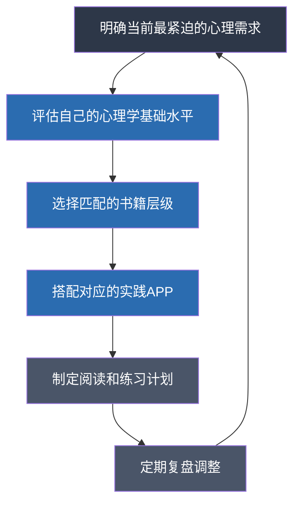

## 三、选择建议

面对前面推荐的15本书籍和12款APP，读者最常遇到的问题不是"有没有好的资源"，而是"这么多资源，我该从哪里开始？"。选择焦虑本身就是一个心理学问题——选项越多，决策质量反而越低（心理学家Barry Schwartz称之为"选择的悖论"）。本节的目标就是帮你消除这种焦虑，给出一套系统的、可执行的选择框架。

### 选择的核心逻辑

选书和选APP不是随意的，它应该遵循一个清晰的逻辑链条：

这个逻辑有两个关键决策点：**你的目标是什么** 和 **你的基础在哪里**。前者决定方向，后者决定起点。

---

### 第一步：诊断你的心理需求

在选择任何资源之前，先做一次诚实的自我诊断。以下问题不是心理测评，而是一个思考工具，帮你找到最需要关注的领域：

#### 需求自评清单

请逐条阅读以下描述，标记出最符合你当前状态的2-3项：

| 序号 | 描述 | 对应领域 |
|:---:|:---|:---:|
| 1 | 我经常因为别人的一句话反复纠结，事后不断回想 | 人际关系/自我认知 |
| 2 | 我很难拒绝别人的请求，即使自己很为难 | 边界感/自我认同 |
| 3 | 我做事拖延严重，明知道该做就是动不起来 | 自控力/执行力 |
| 4 | 我的情绪波动很大，经常因为小事发脾气或低落 | 情绪管理 |
| 5 | 我对自己的未来感到迷茫，不知道自己想要什么 | 自我认知/人生意义 |
| 6 | 我在社交场合感到紧张，担心别人怎么看我 | 社交焦虑/自信 |
| 7 | 我经常自我否定，觉得自己不够好 | 自我接纳/自尊 |
| 8 | 我在工作中很难集中注意力，容易被干扰 | 专注力/认知管理 |
| 9 | 我和伴侣/家人的沟通经常演变成争吵 | 沟通技巧 |
| 10 | 我最近经历了重大变故，感觉很难走出来 | 心理韧性/创伤恢复 |
| 11 | 我觉得自己做了很多但不快乐，幸福感很低 | 积极心理学 |
| 12 | 我想系统了解心理学，但不知道从何开始 | 知识体系构建 |

标记完成后，对照下表找到你的优先方向：

| 你标记的序号 | 优先方向 | 推荐起始书籍 | 推荐起始APP |
|:---:|:---|:---|:---|
| 1、2 | 人际关系与自我边界 | 《被讨厌的勇气》 | Daylio（记录情绪触发点） |
| 3、8 | 自控力与专注力 | 《自控力》 | Forest + Habitica |
| 4 | 情绪管理 | 《情商》 | Daylio + Headspace |
| 5、11 | 自我认知与人生意义 | 《心流》 | Headspace（正念练习） |
| 6、7 | 自信与自我接纳 | 《被讨厌的勇气》+《自我同情》 | 简单心理（必要时） |
| 9 | 沟通能力 | 《非暴力沟通》 | 壹心理（测评） |
| 10 | 心理韧性与恢复 | 《心理韧性》 | Calm + 简单心理 |
| 12 | 全面入门 | 《心理学与生活》 | 壹心理（测评） |

---

### 第二步：根据目标选择资源组合

明确了优先方向后，下面给出六大目标场景的详细选择方案。每个方案都包含书籍搭配、APP搭配、阅读顺序和预期效果。

#### 场景一：建立心理学基础

**适合人群**：对心理学感兴趣但没有任何系统学习经历的零基础读者。

| 维度 | 推荐 | 说明 |
|:---|:---|:---|
| 核心书籍 | 《心理学与生活》 | 学科全景图，必读 |
| 辅助书籍 | 《思考，快与慢》 | 理解人类思维的底层机制 |
| 认知训练APP | 壹心理 | 用测评工具了解自己的心理特征 |
| 学习周期 | 8-12周 | 每周投入4-6小时 |

**具体执行方案**：

1. **第1-6周**：精读《心理学与生活》。不需要每章都读，优先读以下章节——第1-3章（心理学导论、研究方法、生物基础）、第7-9章（学习、记忆、认知）、第14-16章（社会心理学、人格、心理障碍）。每周读2章，每章花30分钟做笔记。
2. **第5-8周**：同步开始《思考，快与慢》。这本书密度高，每周只读1-2章，重点做"偏误日记"——每天记录自己在生活中犯的一个认知偏误。
3. **贯穿全程**：在壹心理上做MBTI、大五人格、情绪智力等测评，建立自我认知基线。

**预期收获**：建立心理学的整体知识框架，能用心理学语言描述日常现象，对自己和他人的行为有初步的理解能力。

---

#### 场景二：提升情绪管理能力

**适合人群**：情绪波动大、容易被情绪控制、或者长期压抑情绪的人。

| 维度 | 推荐 | 说明 |
|:---|:---|:---|
| 理论书籍 | 《情商》 | 理解情绪的本质和功能 |
| 进阶书籍 | 《自控力》 | 掌握情绪调节的生理机制 |
| 深度书籍 | 《自我同情》 | 学会与负面情绪和平共处 |
| 情绪追踪APP | Daylio | 每天记录情绪和触发事件 |
| 正念练习APP | Headspace | 每天10分钟冥想训练 |
| 学习周期 | 10-14周 | 每周投入5-7小时 |

**具体执行方案**：

1. **第1-3周**：精读《情商》，重点理解"情绪劫持"的概念——当杏仁核接管大脑时，你的反应不是"选择"的而是"自动"的。读完后，回顾过去一周中你情绪失控的时刻，试着用"情绪劫持"的框架重新理解它们。
2. **第2周起**：开始使用Daylio，每天睡前花1分钟记录当天的情绪状态和主要活动。目标不是改变什么，只是观察和记录。两周后你会看到清晰的情绪模式。
3. **第2周起**：开始使用Headspace的"基础课程"（免费），每天10分钟。正念冥想的核心训练是"观察情绪而不被情绪卷走"，这正是情绪管理的基础能力。
4. **第4-7周**：精读《自控力》，每周一章，配合书中的"意志力实验"。特别关注第4章关于"道德许可"和第8章关于"意志力传染"的内容——它们解释了为什么你明知道不该发脾气还是发了。
5. **第8-12周**：精读《自我同情》，开始练习自我同情冥想。这本书会改变你对待自己负面情绪的方式——从"我不应该有这种情绪"转变为"有这种情绪是正常的，我可以善待自己"。

**预期收获**：能识别和命名自己的情绪状态，理解情绪背后的需要，在情绪高涨时能暂停而非冲动反应，对自己更加宽容。

---

#### 场景三：改善人际关系

**适合人群**：在亲密关系、家庭关系、职场关系中感到困难的人。

| 维度 | 推荐 | 说明 |
|:---|:---|:---|
| 理论书籍 | 《社会心理学》 | 理解人际互动的社会心理机制 |
| 自我突破书籍 | 《被讨厌的勇气》 | 建立课题分离的边界意识 |
| 技术书籍 | 《非暴力沟通》 | 掌握具体的沟通方法论 |
| 影响力书籍 | 《影响力》 | 识别和防范社会影响策略 |
| 情绪记录APP | Daylio | 记录人际互动中的情绪模式 |
| 学习周期 | 12-16周 | 每周投入5-7小时 |

**具体执行方案**：

1. **第1-4周**：精读《社会心理学》中的社会认知、说服、群体影响三章。这些章节会帮你理解：为什么别人的行为不一定是针对你的，为什么你在群体中的判断力会下降，为什么你总觉得自己是"对的"。
2. **第5-7周**：精读《被讨厌的勇气》。核心练习是"课题分离"——每次你因为别人的行为感到焦虑或愤怒时，问自己三个问题：这件事的结果由谁承担？我能不能控制对方的行为？如果不能，我该把精力放在哪里？
3. **第6周起**：开始使用Daylio，重点记录人际互动中的情绪反应。特别标注"高情绪强度"的互动，两周后回顾这些记录，找共同的触发模式。
4. **第8-11周**：精读《非暴力沟通》。核心练习是"观察-感受-需要-请求"四步复盘法——每次沟通冲突后，用这四个要素分析：我当时观察到了什么事实（不是评判）？我感受到了什么情绪（不是想法）？我未被满足的需要是什么？我可以提出什么具体请求？
5. **第12-14周**：选读《影响力》的互惠、喜好、社会认同三章。理解这些原则不是为了操控别人，而是为了在关系中保持清醒——当对方使用这些策略时，你能识别出来。

**预期收获**：在人际冲突中能区分事实和评判，能识别自己的情绪和需要，能在沟通中提出具体请求而非笼统抱怨，不再过度承担他人的情绪责任。

---

#### 场景四：提升心理韧性

**适合人群**：正在经历或刚经历重大生活变故、长期承受高压力、或想提前建立心理防线的人。

| 维度 | 推荐 | 说明 |
|:---|:---|:---|
| 核心书籍 | 《心理韧性》 | 10种经过验证的韧性策略 |
| 辅助书籍 | 《自我同情》 | 在逆境中善待自己 |
| 冥想APP | Calm | 正念练习+睡眠故事 |
| 心理支持 | 简单心理 | 必要时寻求专业支持 |
| 学习周期 | 6-10周 | 每周投入4-6小时 |

**具体执行方案**：

1. **第1-4周**：精读《心理韧性》。每周重点练习一个策略——第1周练乐观主义（每天写3件好事），第2周练身体锻炼（每天30分钟中等强度运动），第3周练社会支持（主动联系一个信任的朋友），第4周练正念冥想（每天15分钟）。
2. **第2周起**：开始使用Calm的"每日正念"和"睡眠故事"功能。在高压时期，睡眠质量往往是第一个崩塌的，先稳住睡眠再处理其他。
3. **第5-8周**：精读《自我同情》。逆境中最容易出现的反应是自我攻击——"都是我的错""我怎么这么没用"。自我同情的练习会帮你从这个循环中走出来。
4. **贯穿全程**：如果你发现自己持续两周以上处于严重的抑郁或焦虑状态（无法正常工作、失眠、食欲变化、对一切失去兴趣），请不要仅依赖书籍和APP，及时联系简单心理或壹心理的专业咨询师。

**预期收获**：面对逆境时能更快恢复，在压力下保持基本的身心功能，学会在困难中善待而非苛责自己，建立可靠的社会支持网络。

---

#### 场景五：优化决策质量

**适合人群**：经常对自己的决策后悔、容易受情绪或他人影响、想在重要决策中更加理性的读者。

| 维度 | 推荐 | 说明 |
|:---|:---|:---|
| 核心书籍 | 《思考，快与慢》 | 理解认知偏误和决策陷阱 |
| 辅助书籍 | 《影响力》 | 识别外部影响策略 |
| 进阶书籍 | 《认知行为疗法》 | 掌握认知重构技术 |
| 认知训练APP | Lumosity | 认知灵活性训练 |
| 学习周期 | 10-14周 | 每周投入5-7小时 |

**具体执行方案**：

1. **第1-5周**：精读《思考，快与慢》。每读完一个偏误类型，在生活中找3个实例。重点掌握：锚定效应（第一印象如何影响后续判断）、损失厌恶（为什么失去100元的痛苦大于得到100元的快乐）、可得性启发式（为什么你更容易被近期事件影响判断）。
2. **第2周起**：开始使用Lumosity的"问题解决"和"灵活性"模块，每天15-20分钟。认知训练不会让你变聪明，但能保持认知灵活性。
3. **第6-8周**：精读《影响力》。做一个"影响力审计"：回顾你最近一次大额消费、一次重要职业决策、一次人际关系中的让步，分析其中是否有互惠、承诺一致、社会认同、稀缺等原则在起作用。
4. **第9-12周**：选读《认知行为疗法》中的自动思维和认知重建章节。建立一个"决策检查清单"——每次重大决策前，检查自己是否在用"灾难化思维"（想最坏的结果）、"非黑即白思维"（只看到两个极端选项）、"情绪推理"（因为感觉很糟所以认为情况很糟）来做判断。

**预期收获**：在重大决策中能识别自己的认知偏误，能区分理性分析和情绪驱动的判断，能识别外部的影响力策略并做出自主选择。

---

#### 场景六：寻找人生意义与幸福感

**适合人群**：物质条件不错但感到空虚、对生活缺乏热情、想探索"什么是好的生活"的读者。

| 维度 | 推荐 | 说明 |
|:---|:---|:---|
| 核心书籍 | 《心流》 | 理解幸福的内在来源 |
| 辅助书籍 | 《自卑与超越》 | 理解人生意义与社会贡献 |
| 自我探索书籍 | 《被讨厌的勇气》 | 建立"活在当下"的生活态度 |
| 正念APP | Headspace | 正念练习帮助觉察当下 |
| 学习周期 | 8-12周 | 每周投入4-6小时 |

**具体执行方案**：

1. **第1-4周**：精读《心流》。核心练习是"心流日记"——每天记录是否进入了心流状态，如果进入了，在什么活动中、什么条件下进入的。坚持三周，你会看到一个清晰的模式：哪些活动能让你最投入、最愉悦。
2. **第5-7周**：精读《被讨厌的勇气》。核心练习是"目的觉察"——每当你做一件事时，问自己"我做这件事的目的是什么？是我真正想要的，还是别人期望我要的？"
3. **第8-10周**：精读《自卑与超越》。重点关注"社会兴趣"这个概念——阿德勒认为，幸福的终极来源不是自我实现，而是对共同体的贡献感。做一个练习：列出3件让你感到有贡献感的事情，无论大小。
4. **贯穿全程**：使用Headspace的正念练习，训练"活在当下"的能力。焦虑来自对未来的担忧，抑郁来自对过去的反刍，正念训练的是将注意力拉回此刻的能力。

**预期收获**：明确哪些活动能给你带来深度满足感，理解幸福不是外部条件而是内在体验，开始在日常生活中创造更多心流时刻，建立对共同体的贡献感。

---

### 书籍与APP的搭配原则

选好了书籍和APP，如何把它们有效地搭配起来？以下是四条经过验证的搭配原则：

#### 原则一：理论与实践一一对应

每读完一本理论书籍，必须搭配至少一个实践工具。理论是地图，实践是走路——只有地图没有脚，你永远到不了目的地。

| 理论内容 | 对应实践 |
|:---|:---|
| 情绪的本质（《情商》） | 情绪记录（Daylio） |
| 意志力机制（《自控力》） | 习惯追踪（Habitica） |
| 认知偏误（《思考，快与慢》） | 认知训练（Lumosity） |
| 正念理论（《心理韧性》） | 冥想练习（Headspace/Calm） |
| 沟通框架（《非暴力沟通》） | 冲突复盘（手写记录） |
| 心流条件（《心流》） | 心流日记（Daylio自定义标签） |

#### 原则二：不要同时启动太多工具

人的注意力和意志力都是有限资源。同时读3本书+用5个APP，大概率在两周内全部放弃。建议：

- **同时进行的书籍不超过2本**：一本理论型 + 一本应用型，交替阅读
- **同时使用的APP不超过3个**：一个核心工具 + 一个辅助工具 + 一个记录工具
- **每4-6周评估一次**：哪些工具你真的在用？哪些已经闲置？果断放弃闲置的

#### 原则三：从被动学习过渡到主动实践

学习的深度遵循一个阶梯：

大多数人停留在A和B阶段——读了很多书，觉得"道理都懂"，但行为没有任何改变。APP的价值在于帮你从B跨到C和D。Daylio帮你记录，Habitica帮你坚持，Headspace帮你练习。只有到了E阶段（内化为习惯），知识才真正属于你。

#### 原则四：定期复盘，动态调整

每4-6周做一次简短的复盘，回答以下三个问题：

1. **效果**：我选择的书籍和APP真的在帮助我吗？有没有感受到具体的变化？
2. **投入**：我每周实际花了多少时间？是太多（疲惫）还是太少（没有效果）？
3. **调整**：下一阶段我需要继续保持、调整方向、还是尝试新的资源？

---

### 按基础水平选择

除了目标导向，你的心理学基础水平也是一个重要的选择维度。下面给出三个水平层级的选择建议：

#### 零基础读者

**特征**：从未系统学习过心理学，对心理学的认知主要来自影视剧和社交媒体。

**选择策略**：
- 必读《心理学与生活》或《社会心理学》作为第一本——它们会帮你建立正确的学科认知框架
- 暂时不要读专业级书籍（《情绪》《影响力》），缺乏基础会导致误解
- 从Daylio或壹心理开始接触心理学工具，门槛最低
- 不急于追求深度，先建立广度

**推荐路径**：《心理学与生活》→《情商》→《被讨厌的勇气》→Daylio + 壹心理

#### 有一定基础的读者

**特征**：读过1-2本心理学通俗读物，或者对某个心理学分支有基本了解。

**选择策略**：
- 直接从进阶级书籍开始，根据兴趣和需求选择
- 开始使用更专业的工具（Headspace冥想、Lumosity认知训练）
- 尝试"书籍+APP"的搭配学习模式
- 开始做笔记和复盘，将零散知识系统化

**推荐路径**：根据前面六大场景选择对应组合

#### 有较深基础的读者

**特征**：读过5本以上心理学书籍，对主要理论有基本了解，可能有相关专业背景。

**选择策略**：
- 重点阅读专业级书籍，建立批判性视角
- 开始关注不同理论之间的矛盾和争议（如《情绪》对Ekman基本情绪理论的挑战）
- 将心理学知识应用到具体领域（教育、管理、产品设计等）
- 考虑阅读学术论文和综述，获取最前沿的研究成果

**推荐路径**：《情绪》→《影响力》→《刻意练习》→学术论文阅读

---

### 常见的选择误区

在帮助读者选择资源的过程中，以下是最常见的六个误区：

#### 误区一：贪多求全

**表现**：同时买10本书、下载8个APP，觉得"多总比少好"。

**问题**：选择太多会导致注意力分散和决策疲劳。行为科学研究表明，当选项超过4-5个时，人们的选择满意度反而下降（Schwartz, 2004）。更严重的是，拥有大量未读/未用的资源会产生"虚假的完成感"——你觉得自己已经在行动了，但实际上什么都没做。

**纠正方法**：严格遵循"2本书+3个APP"的上限。用完一个再加一个。买书不等于读书，下载APP不等于使用APP。

#### 误区二：只看不练

**表现**：读了大量书籍，笔记做得非常漂亮，但生活中没有任何行为改变。

**问题**：心理学知识的价值在于改变行为和思维模式。如果你读了《非暴力沟通》但在下次争吵中依然口不择言，那这本书对你来说只是一次信息消费，不是能力提升。知识只有通过实践才能转化为技能。

**纠正方法**：每读完一本书，选择1-2个具体策略在接下来的两周中刻意练习。练习时配合APP记录，用数据而非感觉来评估效果。

#### 误区三：跳过基础直接读高阶

**表现**：直接从《情绪》（情绪建构理论）或《影响力》开始读，觉得"入门级太简单了"。

**问题**：专业级书籍的很多论述建立在基础概念之上。比如《情绪》中关于"内感受"和"预测编码"的概念，如果没有读过《心理学与生活》中关于感知觉和神经科学的基础介绍，很容易理解偏差甚至误解。

**纠正方法**：诚实评估自己的基础水平。如果你不能清楚地解释"什么是认知偏误""什么是杏仁核劫持""什么是基本归因错误"，那你还需要先读入门级书籍。

#### 误区四：盲目相信APP的科学性

**表现**：认为所有APP都经过科学验证，效果有保证。

**问题**：很多APP的营销话术中充斥着"基于神经科学""经过临床验证"等说法，但实际上很多APP缺乏严格的随机对照试验（RCT）支持。比如，认知训练APP（Lumosity、Peak）的"迁移效应"——训练中的能力提升是否能迁移到日常生活中——在学术界仍有很大争议。

**纠正方法**：
- 选择有学术研究背书的APP，可以在PubMed上搜索该APP名称看是否有相关论文
- 正念冥想类APP的证据基础最强（MBSR/MBCT已有大量RCT支持）
- 认知训练类APP要降低期望，将其视为"辅助工具"而非"治疗方案"
- 情绪记录类APP的效果取决于你是否坚持使用，而非APP本身的技术

#### 误区五：忽略专业心理咨询的价值

**表现**：试图用书籍和APP解决所有心理问题，包括严重的抑郁、焦虑和创伤。

**问题**：书籍和APP是自我成长工具，不是治疗工具。对于轻度的情绪困扰和日常压力，它们足够有效。但对于持续两周以上的严重抑郁症状、无法控制的焦虑发作、创伤后应激反应等情况，仅靠自助工具是不够的，甚至可能因为延误治疗而加重病情。

**纠正方法**：设定一个明确的界限——如果你的心理困扰已经严重影响到日常工作、社交和生活功能（无法正常上班、失眠超过一周、对一切失去兴趣、有自伤想法），请立即寻求专业心理咨询。简单心理和壹心理都是不错的起点，它们提供在线预约服务，门槛比去医院低。

#### 误区六：追求"读完"而非"读懂"

**表现**：给自己设定"一个月读4本书"的目标，追求数量而非理解深度。

**问题**：心理学书籍不同于小说，不是读完情节就结束了。一本好的心理学书籍，读完只是第一步，真正的价值在于你能否将其中的概念应用到日常生活中。一本真正"读懂"的书，比四本"读完"的书更有价值。

**纠正方法**：
- 放弃"读完"的目标，改为"读懂并能实践一个策略"
- 一本书可以反复读——第一次通读建立框架，第二次精读重点章节，第三次带着生活中的问题回来查阅
- 用"输出检验"的方式评估是否读懂：你能用自己的话把核心观点讲给一个没读过这本书的朋友听吗？

---

### 成本与投入的现实考量

学习心理学需要投入时间和金钱。以下是一个现实的成本分析，帮你做出理性的选择：

#### 金钱成本

| 资源类型 | 费用范围 | 说明 |
|:---|:---|:---|
| 书籍（15本合计） | 约500-800元 | 中文版纸质书单本30-60元，电子版更便宜 |
| 正念APP年度订阅 | 约200-400元/年 | Headspace/Calm的年费 |
| 情绪记录APP | 0-100元/年 | Daylio免费版基本够用 |
| 认知训练APP | 约200-300元/年 | Lumosity/Peak的年费 |
| 专业心理咨询 | 300-800元/次 | 按需使用，不一定要用 |

**低成本方案**：只买3本核心书籍（约100-180元）+ 使用免费APP（Daylio免费版 + Headspace免费课程 + 壹心理免费测评），总投入不超过200元就能开始系统学习。

#### 时间成本

| 学习层级 | 每周投入 | 持续时间 | 总投入时间 |
|:---|:---|:---|:---|
| 基础入门 | 3-4小时 | 8-12周 | 约30-50小时 |
| 目标导向深入 | 5-7小时 | 10-16周 | 约50-100小时 |
| 全面精通 | 7-10小时 | 6-12个月 | 约200-500小时 |

建议将心理学学习融入日常而非额外负担：通勤时间听有声书，睡前10分钟做正念冥想，午休时做Daylio情绪记录。这些碎片化的投入累积起来效果显著。

---

### 学习效果的评估标准

如何判断你的心理学学习是否有效？以下是四个可观察的评估维度：

#### 维度一：认知层面——你能用心理学框架解释现象

**检验方法**：当你看到一条社会新闻、一次人际冲突或自己的一个行为时，能否用至少一个心理学概念来分析？比如，看到"双十一冲动消费"，你能联想到"稀缺效应"和"损失厌恶"吗？

#### 维度二：行为层面——你的日常行为有了可观察的变化

**检验方法**：在开始学习后的4-6周内，你是否至少有一个可观察的行为变化？比如：开始每天记录情绪、在争吵前能暂停几秒、开始做正念冥想、能更清楚地说出自己的感受和需要。

#### 维度三：情绪层面——你的情绪调节能力有了提升

**检验方法**：对比学习前后的记录数据（Daylio的情绪趋势图），你的情绪稳定性是否有改善？不是说负面情绪消失了，而是你能在负面情绪出现时更快地恢复，或者更少地被情绪驱动做出后悔的行为。

#### 维度四：关系层面——你的人际互动质量有了提升

**检验方法**：你和伴侣/家人/同事的沟通是否更顺畅了？冲突的频率是否降低了？冲突的恢复时间是否缩短了？你是否更能理解对方的立场和需要了？

---

### 一个完整的12周学习计划示例

以下是一个面向"提升情绪管理和人际关系"目标的12周学习计划，供参考：

| 周次 | 书籍任务 | APP任务 | 实践练习 |
|:---:|:---|:---|:---|
| 1 | 《情商》第1-3章 | 下载Daylio，开始每日情绪记录 | 回顾本周3次高情绪时刻 |
| 2 | 《情商》第4-6章 | 下载Headspace，完成基础课程第1-5节 | 练习"暂停6秒"再反应 |
| 3 | 《情商》读完 | Headspace基础课程第6-10节 | 识别自己的3个情绪触发模式 |
| 4 | 《被讨厌的勇气》上半部分 | 继续Daylio + Headspace | 练习"课题分离"——本周至少3次 |
| 5 | 《被讨厌的勇气》下半部分 | Headspace进阶课程 | 列出自己的"人生谎言"（逃避的借口） |
| 6 | 《非暴力沟通》第1-4章 | 回顾Daylio数据，找情绪模式 | 用四步法复盘最近一次冲突 |
| 7 | 《非暴力沟通》第5-8章 | 继续正念练习 | 在一次实际沟通中使用四步法 |
| 8 | 《非暴力沟通》第9-12章 | 继续正念练习 | 练习"同理倾听"——不给建议只倾听 |
| 9 | 回顾三本书的核心概念 | 复盘APP使用情况 | 写一篇500字的学习总结 |
| 10 | 选择一本最有共鸣的书重读 | 调整APP使用策略 | 将最有效的策略融入日常生活 |
| 11 | 补充阅读感兴趣的延伸内容 | 保持习惯 | 分享一个心理学概念给朋友 |
| 12 | 制定下一阶段学习计划 | 评估哪些APP值得继续用 | 总结12周的变化和收获 |

> **重要提示**：这个计划是参考模板，不是必须严格遵守的时间表。学习的节奏因人而异，最重要的是保持持续而非追求速度。如果你发现某一周的内容需要两周才能消化，那就用两周——深度比速度重要。

---

### 最终建议

回到文章开头的"选择的悖论"——选项太多确实让人焦虑，但解决焦虑的方式不是找到"唯一正确的选择"，而是**接受"够好就行"的选择**。心理学家Herbert Simon称之为"满意化"策略（satisficing）——不是追求最优解，而是找到足够好的解然后行动。

你不需要读完所有15本书，也不需要用完所有12款APP。你只需要：

1. **选出当前最需要解决的1-2个问题**
2. **选择对应的1-2本书 + 1-2个APP**
3. **开始行动，哪怕只读10页、只用5分钟**
4. **4-6周后复盘，根据实际情况调整**

> **最后的提醒**：APP和书籍是辅助工具，不能替代专业心理咨询。如果你正在经历严重的心理困扰——持续的抑郁、无法控制的焦虑、创伤反应、自伤想法——请寻求专业心理咨询师的帮助。简单心理和壹心理是不错的起点，它们提供在线预约，降低了寻求帮助的门槛。求助不是软弱，而是勇气。
