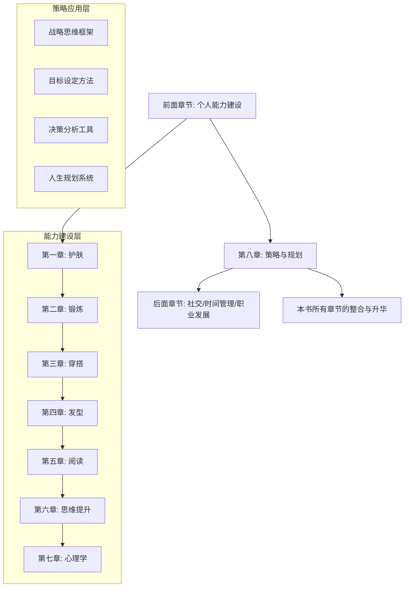
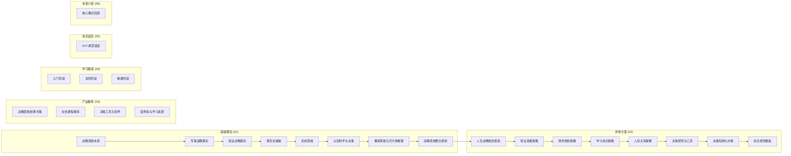

# 第八章：策略与规划

## 一、为什么你需要这一章

在个人提升的旅程中，策略与规划是将愿景转化为现实的桥梁。无论你拥有多么远大的理想、多么优秀的技能，如果没有清晰的策略和系统的规划，你的努力很可能会分散、低效，甚至南辕北辙。

很多人在个人发展中犯的第一个错误就是"埋头苦干"——他们忙于学习各种技能、参加各种培训，却从不停下来思考：这些努力是否指向同一个方向？我的长期目标是什么？当下的行动是否在为那个目标服务？这种"战术上的勤奋掩盖战略上的懒惰"的状态，是大多数人停滞不前的根本原因。

### 1.1 策略思维的本质

策略思维的本质是在资源有限的情况下做出最优选择。每个人的时间、精力和金钱都是有限的——你每天只有24小时，精力会随着消耗而下降，金钱的获取速度远低于想象中的无限需求。如何将这些稀缺资源分配到最能产生价值的地方，这正是策略与规划所要解决的核心问题。

这里存在一个根本性的权衡：

- **聚焦 vs 多元**：专注于一件事能走得更深，但过度聚焦可能错过关键机会
- **短期 vs 长期**：即时满足带来眼前收益，延迟满足才创造长期价值
- **安全 vs 增长**：保守策略降低风险，但也限制了上升空间
- **独立 vs 合作**：单打独斗保持控制权，协同合作放大杠杆效应

策略思维不是让你消除这些矛盾，而是让你在矛盾中做出清醒的、有意识的选择。正如迈克尔·波特所说："战略的本质是选择不做什么。"

### 1.2 数据证据：目标清晰度与人生轨迹

哈佛大学曾进行过一项长达25年的跟踪调查，对象是一批在智力、学历和环境条件上相差无几的毕业生。调查结果令人震惊：

| 群体 | 占比 | 目标状态 | 25年后 |
|------|------|----------|--------|
| A类 | 3% | 有清晰且长远的书面目标 | 几乎都成为社会各界精英，拥有财富和影响力 |
| B类 | 10% | 有清晰但短期的目标 | 大多成为各行各业的专业人士，收入稳定 |
| C类 | 60% | 目标模糊，仅"想要过得好" | 生活在社会中下层，工作不稳定 |
| D类 | 27% | 没有目标，得过且过 | 常常面临失业，抱怨社会不公 |

这项调查深刻揭示了一个事实：**目标的清晰度和规划的系统性，直接决定了一个人的人生轨迹。** 3%和97%之间的差距不是天赋，不是运气，而是"有没有想清楚自己要什么"。

### 1.3 本章的定位与价值

本章在整本书中的位置非常关键——它是**从"能力建设"到"战略运用"的转折点**。前面的章节（护肤、锻炼、穿搭、阅读、思维提升、心理学）帮你构建了个人能力的基础，但能力本身不等于结果。就像一把好刀，如果没有好的刀法，再锋利也切不出精美的菜肴。

本章提供的是一套**"刀法"**——如何将你已有的能力和资源，通过系统性的策略和规划，转化为可衡量的人生成果。

## 二、本章内容架构

本章分为六大板块，从理论到实践、从框架到工具，层层递进。以下是完整的知识体系地图：

### 2.1 基础理论板块（01-基础理论）

这是本章的知识根基，涵盖8个理论体系。每个理论都从"原理→个人应用→实操方法"三层展开：

| 理论体系 | 核心问题 | 关键概念 | 个人应用价值 |
|----------|----------|----------|--------------|
| 战略思维本质与历史 | 什么是战略思维？它如何演变？ | 全局性、长远性、取舍性、动态性 | 建立战略思维的基本认知框架 |
| 军事战略理论 | 古今军事家如何思考战略？ | 孙子兵法、克劳塞维茨、间接路线 | 借鉴千年军事智慧指导人生决策 |
| 商业战略理论 | 企业如何在竞争中获胜？ | 五力模型、蓝海战略、颠覆式创新 | 用商业思维分析个人竞争格局 |
| 博弈论基础 | 多人互动中如何做出最优决策？ | 纳什均衡、囚徒困境、以牙还牙 | 理解合作与竞争的深层逻辑 |
| 系统思维 | 如何看到事物的全貌和相互关联？ | 反馈回路、涌现、杠杆点 | 避免"头痛医头"的线性思维 |
| 认知科学与决策 | 人脑如何做决策？有哪些偏差？ | 锚定效应、确认偏差、损失厌恶 | 识别和纠正自己的认知偏差 |
| 概率思维与贝叶斯推理 | 如何在不确定性中做出判断？ | 先验概率、后验更新、基本比率 | 用概率思维替代直觉判断 |
| 战略思维整合框架 | 如何将所有理论融会贯通？ | OODA循环、情景规划、红队分析 | 建立个人专属的战略决策系统 |

### 2.2 具体方案板块（02-具体方案）

这是本章的实操核心，将理论转化为可执行的方案。8个方案覆盖人生规划的主要维度：

**方案一：人生战略规划框架**——你的"人生总蓝图"
- 从价值观澄清到愿景设定，建立完整的规划体系
- 提供人生平衡轮、使命宣言、十年规划等核心工具

**方案二：职业发展策略**——你的"职业路线图"
- 自我评估→行业分析→能力构建→职业转型的完整路径
- 涵盖求职、晋升、跳槽、创业四大场景

**方案三：财务规划策略**——你的"财富增长引擎"
- 从收支管理到投资理财的阶梯式进阶
- 涵盖应急基金、保险配置、资产配置、退休规划

**方案四：学习成长策略**——你的"能力迭代系统"
- 学习方法论、知识管理体系、技能树规划
- 如何持续学习而不陷入"学习焦虑"

**方案五：人际关系策略**——你的"社交资产规划"
- 人脉分层管理、社交投资回报分析
- 如何建立高质量的人际网络

**方案六：决策矩阵与工具**——你的"决策工具箱"
- 决策矩阵、加权评分、决策树、期望值计算
- 面对复杂选择时的系统化分析方法

**方案七：决策的常见陷阱与对策**——你的"免疫系统"
- 12种认知偏差在决策中的具体表现
- 每种陷阱的识别信号和应对策略

**方案八：综合规划模板**——你的"即用工具"
- 可直接填写的年度/季度/月度规划模板
- 整合所有理论和方案的实操工作表

### 2.3 产品推荐板块（03-产品推荐）

精选策略规划领域的优质资源，按用途分类：

- **经典书籍20本详解**：从《孙子兵法》到《原则》，每本书附有核心观点、适用场景和阅读建议
- **在线课程推荐**：覆盖战略思维、决策科学、职业规划等方向
- **决策工具与软件**：从纸笔模板到专业应用，满足不同需求层次
- **案例库与学习资源**：经典商业案例、个人成长案例和学习社区

### 2.4 学习路径板块（04-学习路径）

为不同基础的读者设计了从入门到精通的系统路径：

| 阶段 | 时长 | 目标 | 核心内容 |
|------|------|------|----------|
| 入门期 | 1-2周 | 理解基本概念，建立初步框架 | 战略思维本质、基本决策工具、简单目标设定 |
| 成长期 | 1-2月 | 掌握核心理论，形成方法论 | 军事/商业战略、博弈论、系统思维、人生规划框架 |
| 精通期 | 3-6月 | 内化为本能，灵活运用 | 认知偏差矫正、概率思维、综合战略决策系统 |

### 2.5 常见误区板块（05-常见误区）

在策略与规划领域，有10个最常见也最致命的错误。每个误区都配有：
- 误区的具体表现
- 为什么会陷入这个误区（心理机制分析）
- 正确的做法和思维转换
- 真实案例对比

### 2.6 本章小结（06-本章小结）

回顾全章核心要点，提供一份可打印的"策略与规划速查卡"，方便日常使用。

## 三、学习目标与预期收益

通过本章的学习，你将能够：

1. **掌握战略思维的核心框架**，学会用系统化的方式分析复杂问题，而不是凭直觉或情绪做决策
2. **建立科学的目标设定方法**，将模糊的愿景转化为可执行的行动计划，避免"目标年年定，年年完不成"
3. **理解主流决策理论**，在面对选择时能够识别信息、评估风险、比较选项，做出理性且果断的决策
4. **制定个人职业发展路线图**，明确短期（1年）、中期（3年）和长期（5-10年）的职业目标与路径，而不是随波逐流
5. **建立个人财务规划体系**，从收支记录开始，逐步建立投资理财能力，实现从月光族到财务安全再到财务自由的跨越
6. **构建整合性的人生规划**，让职业、财务、健康、关系、成长等各维度协调统一，而不是互相拉扯
7. **识别并规避常见的规划误区**，少走弯路，提高规划的有效性和可持续性

**预期收益**：完成本章学习和实践后，你将拥有一套完整的个人战略决策系统。这套系统不是一次性的计划，而是一个可以持续迭代、不断升级的思维操作系统。

## 四、前置知识与准备

### 4.1 前置知识

本章不需要专业背景，但以下知识会让学习更高效：

- **第六章·思维提升**中的批判性思维和逻辑思维基础——帮你更好地分析问题
- **第七章·心理学**中的认知偏差和动机理论——帮你理解自己为什么会做出非理性决策
- 基本的数学常识（加减乘除、百分比）——用于财务规划和决策计算部分

### 4.2 学习准备

在开始之前，建议你准备：

1. **一个笔记本**（纸质或电子均可）：用于记录自我评估结果和规划草案
2. **2-3小时不被打扰的时间**：用于完成人生愿景和目标设定的深度思考
3. **当前的收入和支出数据**：如果你打算同步进行财务规划
4. **开放的心态**：有些内容可能会挑战你现有的认知，保持开放才能真正受益

## 五、如何使用本章

建议你按照以下步骤使用本章：

### 第一步：通读概览（就是你正在读的这个文件）

花10分钟快速浏览本章的整体结构，建立全局认知。不需要记住所有细节，只需要知道"有什么"和"在哪里"。

### 第二步：建立理论框架（01-基础理论）

按顺序阅读8个理论板块。每个理论花30-60分钟，重点理解核心概念和个人应用场景。不需要全部记住，但需要理解每个理论回答了什么问题。

### 第三步：结合自身制定方案（02-具体方案）

这是本章最花时间也最有价值的部分。每个方案都配有实操工具和模板，建议你边读边做。特别是：
- **人生战略规划框架**：花2-3小时认真完成，这是后续所有规划的基础
- **综合规划模板**：下载并填写，建立你的个人规划系统

### 第四步：选择工具和资源（03-产品推荐）

根据你的需求和兴趣，选择1-2本书、1门课程、1-2个工具。不要贪多，深入使用比广泛浏览更有价值。

### 第五步：制定学习路径（04-学习路径）

根据你当前的水平（自评），选择合适的学习阶段，制定具体的学习计划。

### 第六步：对照检查误区（05-常见误区）

逐一检查自己是否存在这些误区。诚实面对，有则改之，无则加勉。

### 第七步：回顾巩固（06-本章小结）

回顾核心要点，确保你已经建立了完整的知识框架。

## 六、阅读建议与注意事项

### 6.1 不要跳过基础理论

很多人一看到"理论"就想跳到"实操"。但没有理论支撑的实操是盲目的——你可能学会了某个工具的使用方法，却不理解它背后的原理，遇到新情况就无法灵活变通。理论是"道"，方法是"术"，有道无术术可求，有术无道止于术。

### 6.2 边读边做，不要只是"看"

本章最大的价值不在文字本身，而在你读完文字之后的思考和行动。每个实操部分都有具体的练习和模板，请务必动手完成。只读不做，等于没读。

### 6.3 规划是迭代的，不是一次性的

不要指望一次读完就能制定出完美的规划。好的规划是经过多次迭代、不断修正的结果。先做出一个60分的规划，然后在执行中逐步完善，远比追求100分的完美规划而迟迟不动手要好。

### 6.4 结合前面章节的知识

本章是整本书的"整合点"——它会用到前面章节的很多概念和方法。如果在阅读过程中遇到不熟悉的概念，可以回到对应章节复习。这不是浪费时间，而是巩固和深化理解。

## 七、核心概念速览

在正式开始之前，先了解本章会频繁出现的核心概念：

| 概念 | 定义 | 一句话解释 |
|------|------|------------|
| 战略（Strategy） | 为实现长期目标而制定的总体计划和行动方案 | 想清楚"做什么"和"不做什么" |
| 战术（Tactics） | 为实现战略目标而采取的具体行动 | 想清楚"怎么做" |
| 愿景（Vision） | 你最终想达到的理想状态 | 你心中的"北极星" |
| 目标（Goal） | 为实现愿景需要达成的具体成果 | 可衡量的里程碑 |
| 杠杆点（Leverage Point） | 系统中影响力最大的关键节点 | "四两拨千斤"的那个点 |
| 机会成本（Opportunity Cost） | 选择A就意味着放弃B的最大价值 | 你为选择付出的隐性代价 |
| 沉没成本（Sunk Cost） | 已经发生且无法收回的投入 | 不应该影响未来决策的过去 |
| 边际效益（Marginal Benefit） | 每增加一单位投入带来的额外收益 | 判断"还要不要继续"的标尺 |
| 纳什均衡（Nash Equilibrium） | 没有人能通过单方面改变策略而获益的状态 | "谁都别想占便宜"的平衡点 |
| 反馈回路（Feedback Loop） | 系统输出反过来影响输入的机制 | "越做越好"或"越做越差"的循环 |

## 八、本章的适用人群

本章内容对以下人群特别有价值：

- **职场新人**：建立职业规划意识，避免前5年走弯路
- **职业瓶颈期人士**：重新审视方向，找到突破口
- **创业者**：用战略思维分析市场、制定竞争策略
- **转行者**：系统评估新方向，降低转型风险
- **所有希望"想清楚再行动"的人**：建立决策框架，减少后悔

无论你处于人生的哪个阶段，只要你想让自己的努力更有方向、更有效率，这一章都值得你反复阅读和实践。

---

**准备好了吗？让我们开始这段策略与规划的学习之旅，为你的个人提升提供方向和方法的指引。**

> 下一步：阅读 [01-基础理论](../_index.md) 来建立战略思维的理论框架
