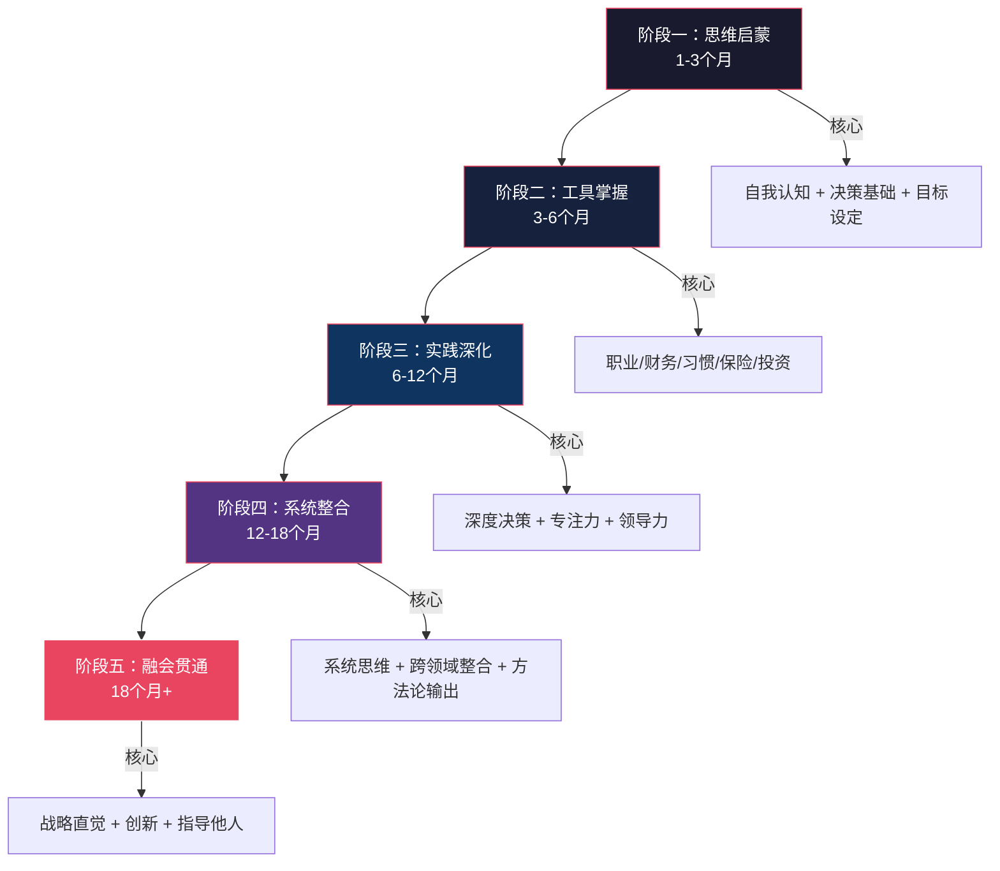
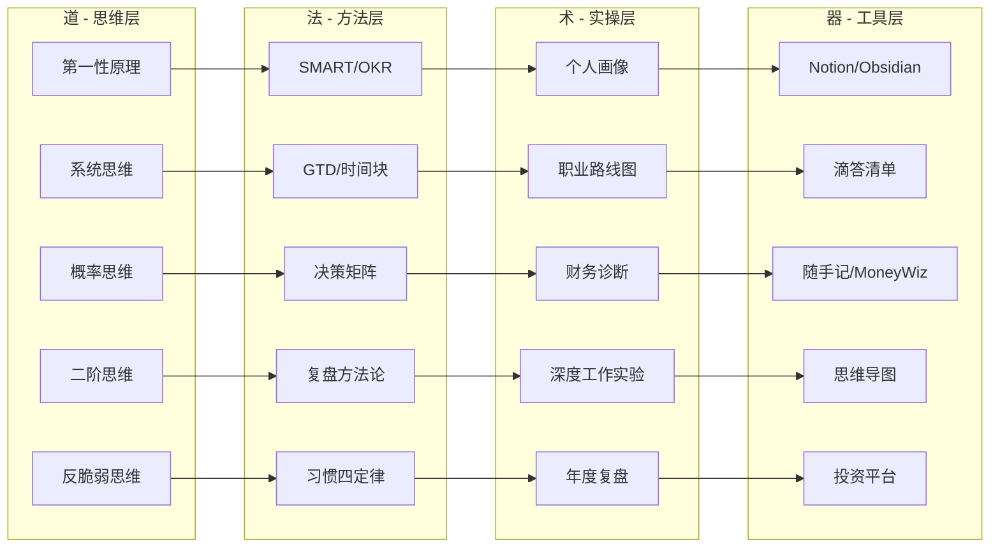
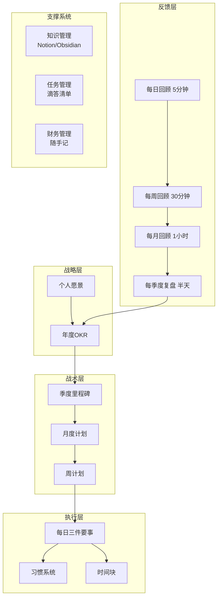

# 策略与规划的学习路径

本节为你设计了一条从入门到精通的系统学习路径，帮助你循序渐进地掌握策略与规划的核心能力。这条路径基于认知科学、成人学习理论和数千名实践者的经验总结，旨在让你在最短时间内建立扎实的策略思维能力。

学习路径不是一份"读完就算"的书单，而是一套**螺旋式上升的能力构建系统**——每个阶段都在前一阶段的基础上叠加新维度，同时回头深化旧知识。正如查理·芒格所说："如果你手里只有一把锤子，你会把所有问题都看成钉子。"本路径的目标是帮你建立一个**多元思维模型的工具箱**，让你在面对任何人生决策时都能找到合适的分析框架。

***

## 一、学习路径总览

### 1.1 路径设计理念

本学习路径遵循以下核心理念，这些理念本身也是你需要内化的思维模式：

**螺旋式上升（Spiral Learning）**

教育学家布鲁纳提出的螺旋式课程理论认为：核心概念应该在不同深度上反复出现。本路径中，"目标设定"在阶段一以SMART入门，在阶段二以OKR深化，在阶段三以多维度目标体系整合，在阶段四以动态目标系统自动化——同一个概念，四次迭代，每次都在更高层次上理解它。

**知行合一（Learning by Doing）**

成人学习理论（Kolb经验学习循环）指出：有效的学习必须经历"具体经验→反思观察→抽象概念化→主动实验"四个阶段。纯读书只能完成"抽象概念化"这一步，必须通过实践项目补全其余三步。这就是为什么每个学习模块都配有实践项目——它们不是"附加练习"，而是学习过程的核心组成部分。

**反馈驱动（Feedback-Driven）**

没有反馈的学习是盲目的。每个阶段都设计了三层反馈机制：**自评清单**（每日/每周）、**量化指标**（目标完成率、习惯坚持率等）、**外部反馈**（导师/同伴/社群）。三者结合才能准确判断你的真实进步。

**个性化适配（Personalized Path）**

没有放之四海而皆准的学习路径。本路径提供了5种人群变体（职场新人、中层管理者、高层管理者、创业者、自由职业者），并且在每个阶段都标注了"必修"和"选修"内容，让你可以根据自己的背景和目标灵活调整。

**反脆弱设计（Antifragile Design）**

借鉴塔勒布的反脆弱理论，本路径不仅追求"不被打断"，更追求"从波动中获益"。当你遇到工作变动、生活变故、时间压缩等"干扰"时，路径中的缓冲机制和弹性设计能让你把干扰转化为学习机会——比如，一次职业危机恰好是"决策能力提升"模块的最佳实践场景。

### 1.2 阶段划分

阶段一：思维启蒙（1-3个月）
  ↓ 建立认知框架，理解"我是谁"和"我要什么"
阶段二：工具掌握（3-6个月）
  ↓ 掌握核心方法论，获得"怎么做"的能力
阶段三：实践深化（6-12个月）
  ↓ 在真实场景中反复练习，形成肌肉记忆
阶段四：系统整合（12-18个月）
  ↓ 把碎片化技能编织成个人操作系统
阶段五：融会贯通（18个月+）
  ↓ 内化为直觉，能指导他人并持续创新

### 1.3 时间投入建议

| 阶段 | 总时长 | 每日投入 | 每周投入 | 关键里程碑 | 最低可行投入 |
|------|--------|----------|----------|------------|-------------|
| 阶段一 | 1-3个月 | 30-60分钟 | 3-5小时 | 建立思维框架 | 每日15分钟 |
| 阶段二 | 3-6个月 | 45-90分钟 | 5-8小时 | 掌握核心工具 | 每日30分钟 |
| 阶段三 | 6-12个月 | 60-120分钟 | 8-12小时 | 完成3个实践项目 | 每日30分钟 |
| 阶段四 | 12-18个月 | 60-120分钟 | 8-12小时 | 形成个人体系 | 每日30分钟 |
| 阶段五 | 持续 | 灵活 | 灵活 | 指导他人 | 每周2小时 |

> **时间压缩方案**：如果你每天能投入2小时以上，阶段一可压缩至1个月，阶段二可压缩至3个月。但阶段三和阶段四不建议压缩——实践需要时间发酵，就像酿酒不能加速。

### 1.4 学习路径全景知识图谱

***

## 二、阶段一：思维启蒙（1-3个月）

> **阶段定位**：这一阶段的目标不是让你成为策略专家，而是帮你"睁开眼睛"——看见自己思维中的盲区，理解什么是真正的战略思维，建立最基本的目标设定和决策能力。就像学游泳之前要先学会在水中睁眼，这个阶段是所有后续学习的地基。

### 2.1 阶段目标

建立策略思维的基本认知框架，了解目标设定和决策理论的核心概念，培养元认知能力——即"对自己思维的思考能力"。元认知是策略思维的底层操作系统：只有当你能观察自己的思考过程时，才能识别偏差、优化决策。

### 2.2 具体学习内容

**第1-2周：认知自我**

*学习目标*：了解自己的思维模式、优势和盲点

*学习内容*：

完成自我认知测评不是为了给自己贴标签，而是为了获得一面"镜子"。你需要了解的不是"我是什么类型"，而是"我在什么情境下会做出什么反应"。

- **MBTI测评**：了解你的认知偏好（信息获取方式、决策方式、能量来源）。MBTI的科学性存在争议，但作为自我探索的起点仍有价值——重点不是类型标签，而是测评过程中对自己偏好的觉察。
- **盖洛普优势识别器**：识别你的天赋主题（34个主题中排名前5的）。盖洛普基于数十年的研究，发现"发挥优势"比"弥补短板"更能带来卓越表现。了解自己的优势主题后，你可以在后续的职业规划和目标设定中优先利用这些天赋。
- **人生轮评估**：在8个维度（健康、职业、财务、关系、个人成长、娱乐、环境、精神）上各打1-10分，绘制雷达图。这个工具来自教练技术领域，能直观地暴露你生活中的"失衡区域"——那些你一直在忽略但其实很重要的维度。
- **撰写3000字自我分析报告**，回答以下核心问题：
  - 我的核心优势是什么？（不是"我觉得"，而是有证据支撑的判断）
  - 我的思维盲点在哪里？（最容易被忽略的认知偏差是什么？）
  - 我的价值观排序是什么？（如果必须在自由和安全之间选择，我选哪个？）
  - 我的人生阶段和当前重心（25岁和35岁的策略完全不同）

*实践项目*：制作个人画像卡

个人画像卡是你后续所有决策的"基准参考系"。它不是一次性作业，而是会随你成长不断更新的活文档。

- 包含：核心优势（3个）、关键弱点（2个）、价值观排序（前5）、短期目标（3个月）、长期愿景（5年）
- 格式：一页纸，可视化呈现。推荐使用Canva或PPT制作，方便随时查阅
- 用途：每当面临重大决策时，先拿出这张卡，问自己"这个选择是否符合我的价值观和愿景？"

*评估标准*：
- 能否清晰地说出自己的3个核心优势，并给出具体事例？
- 能否识别自己的2-3个思维盲点，并说明它们如何影响过你的决策？
- 是否有了一份可随时查阅的个人画像？

**第3-4周：战略思维入门**

*学习目标*：理解什么是战略思维，建立基本的认知框架

*学习内容*：

战略思维不是"想得远"那么简单。它的核心是**在不确定性中做出高质量的资源配置决策**。这一周你要学习战略思维的四个基础构件：

**系统思维的四个核心概念**：

| 概念 | 定义 | 个人发展中的例子 | 为什么重要 |
|------|------|-----------------|-----------|
| 反馈回路 | 系统输出反过来影响输入的机制 | 锻炼→精力提升→工作效率提高→有更多时间锻炼（正反馈）；焦虑→失眠→效率下降→更焦虑（负反馈/恶性循环） | 理解反馈回路能帮你设计"良性循环"、打破"恶性循环" |
| 延迟效应 | 原因和结果之间存在时间差 | 今天开始学习，3个月后才能看到能力提升；今天开始投资，10年后才能看到复利威力 | 理解延迟效应能帮你坚持长期正确的事，不因短期看不到结果而放弃 |
| 杠杆点 | 小投入能产生大产出的关键位置 | 学会一门高杠杆技能（如编程、写作）能改变整个职业轨迹；养成一个关键习惯（如早起）能撬动其他多个习惯 | 找到杠杆点是策略思维的核心——不是做更多事，而是做对的事 |
| 涌现性 | 系统整体展现出部分所没有的特性 | 单独学心理学、经济学、历史可能没什么感觉，但三者交叉后你看待社会现象的视角会发生质变 | 理解涌现性才能明白为什么"跨界学习"比"深耕单一领域"更容易产生创新 |

*第一性原理思维*：这是埃隆·马斯克最推崇的思维方式。核心是**回到最底层的事实和原理，从零开始推理，而不是用类比和经验做判断**。

练习方法：选一个你行业中的"常识"，问自己"这个常识的底层逻辑是什么？如果从零开始推导，结论还一样吗？"比如："买房一定比租房好"——回到最底层：你的目标是居住还是投资？你所在城市的租售比是多少？你的资金有更好的用途吗？

每天记录3个决策，分析背后的思维过程——这是培养元认知最有效的方法。不是记"我做了什么"，而是记"我为什么这样做"、"我考虑了哪些因素"、"忽略了哪些因素"。

*实践项目*：决策分析日记

- 记录每天3个决策（大小决策均可：午餐选择、工作任务优先级、是否回复某条消息）
- 每个决策分析四个维度：
  1. 触发因素：什么触发了这个决策？
  2. 思维模式：我用了什么思维模式？（直觉/分析/类比/第一性原理）
  3. 潜在偏差：这个决策中可能存在什么认知偏差？
  4. 改进空间：如果重来，我会怎么做？
- 每周总结一次，识别自己的思维模式和高频偏差

*评估标准*：
- 能否用自己的话解释系统思维的4个核心概念，并各举一个个人例子？
- 是否养成了每天记录决策的习惯（连续7天以上）？
- 能否识别自己决策中最常出现的2-3种偏差？

**第5-6周：目标设定基础**

*学习目标*：掌握科学的目标设定方法

*学习内容*：

目标设定不是"写个愿望清单"那么简单。研究表明，**有明确目标的人比没有目标的人平均收入高出2-10倍**（洛克和莱瑟姆的目标设定理论）。但关键不是"有目标"，而是"有正确类型的目标"。

**SMART目标框架**——经典但容易用错：

| 要素 | 含义 | 常见错误 | 正确示例 |
|------|------|---------|---------|
| Specific（具体） | 明确"做什么、怎么做" | "提升英语" | "每天用Anki背50个单词，每周看1部英文电影" |
| Measurable（可衡量） | 有明确的量化指标 | "多读书" | "每月读完2本书，每本写500字读书笔记" |
| Achievable（可实现） | 有挑战但可达成 | "3个月成为CTO" | "6个月内独立负责一个中型项目" |
| Relevant（相关） | 与更大目标相关联 | 学一个与职业方向无关的技能 | 选择能增强你核心竞争力的学习内容 |
| Time-bound（有时限） | 有明确截止日期 | "以后要学Python" | "8月31日前完成Python基础课程并完成3个练习项目" |

**OKR方法**（Objectives and Key Results）——Google等公司使用的目标管理方法：

OKR与SMART的区别在于：SMART是单目标的精确描述，OKR是目标体系的管理框架。OKR的核心理念是**设定有野心的目标（完成70%就算成功），然后用可衡量的关键结果来追踪进度**。

- O（目标）：定性描述，回答"我要实现什么？"
- KR（关键结果）：定量指标，回答"我怎么知道自己在靠近目标？"

示例：
- O：建立扎实的策略思维基础
  - KR1：完成《思考，快与慢》阅读并写出3000字读书笔记
  - KR2：连续30天每天记录3个决策分析
  - KR3：完成个人SWOT分析和年度发展蓝图

**目标金字塔**——从愿景到行动的层级分解：

人生愿景（我要成为什么样的人？）
    ↓
5年目标（实现愿景需要先达到什么？）
    ↓
年度目标（今年最重要的3-5件事）
    ↓
季度里程碑（每季度的关键成果）
    ↓
月度计划（本月的具体行动）
    ↓
周计划/日计划（今天的3件要事）

每一层都要能回答"为什么"——日计划为什么服务于月计划？月计划为什么服务于年度目标？如果答不上来，说明你的目标金字塔有断层。

*实践项目*：制定第一季度OKR

- 设定3个核心目标（O），覆盖不同人生维度
- 每个目标2-3个关键结果（KR），每个KR有可衡量的指标
- 建立目标追踪表（推荐Notion或飞书多维表格）
- 每周检查一次KR进度，每月做一次OKR回顾

*评估标准*：
- 设定的目标是否符合SMART原则？（找一个朋友帮你检查）
- 关键结果是否可衡量、有挑战性？（完成70%算成功）
- 是否有明确的行动步骤？（每个KR下面至少有3个具体行动）

**第7-8周：决策理论入门**

*学习目标*：了解常见的决策陷阱和认知偏差

*学习内容*：

卡尼曼在《思考，快与慢》中揭示了人类思维的双重系统：**系统1**（快思考，自动、直觉、容易出错）和**系统2**（慢思考，刻意、分析、费力但准确）。绝大多数决策偏差都来自系统1的"自动驾驶"——它在进化上是为了生存优化的，不是为了准确性优化的。

**必须掌握的10个认知偏差**：

| 偏差名称 | 定义 | 生活中的例子 | 对策 |
|---------|------|-------------|------|
| 确认偏差 | 只关注支持自己观点的信息 | 买了某只股票后只看利好消息 | 主动寻找反对意见，问"什么证据能证明我错了？" |
| 锚定效应 | 过度依赖第一个接触到的信息 | 商品原价999打折到499觉得便宜，实际只值200 | 先独立评估，再看外部信息 |
| 损失厌恶 | 损失带来的痛苦是等额收益快乐的2-2.5倍 | 宁愿不赚100也不愿冒险可能亏50 | 用期望值而非感觉做决策 |
| 沉没成本谬误 | 因为已经投入了所以继续投入 | 电影不好看但因为买了票就看完 | 只考虑未来的成本和收益，忽略已投入的 |
| 从众效应 | 因为别人做了所以我也做 | 大家都在考某个证书所以我也考 | 问"如果只有我一个人知道这件事，我会做吗？" |
| 光环效应 | 因为某个优点而全面高估 | 名校毕业就觉得能力一定强 | 分维度独立评估，不要以偏概全 |
| 幸存者偏差 | 只看到成功者而忽略失败者 | "辍学创业成功了所以辍学创业是对的" | 主动寻找失败案例，计算真实概率 |
| 可得性偏差 | 容易想到的事被认为更常见 | 看了空难新闻就觉得飞机很危险 | 用数据而非感觉判断概率 |
| 框架效应 | 同一信息的不同表述影响决策 | "90%存活率"比"10%死亡率"更让人安心 | 把信息换一种方式重新表述后再判断 |
| 过度自信 | 高估自己的判断准确性 | "这个项目我肯定能在2周内完成" | 用置信区间表达不确定性，参考基准比率 |

**概率思维基础**：学习用概率而非确定性来思考问题。不是"这件事会不会发生"，而是"这件事发生的概率有多大"。推荐阅读《对赌》（安妮·杜克）了解概率思维在决策中的应用。

*实践项目*：认知偏差识别练习

- 每天识别1个自己或他人身上的认知偏差
- 分析这个偏差如何影响了决策结果
- 思考如何设计"去偏差"机制（比如做重大决策前强制等待24小时）
- 每周整理一份"偏差观察周报"

*评估标准*：
- 能否不看笔记说出10个常见认知偏差及其定义？
- 能否在实际决策中识别偏差？（至少连续2周每天1个）
- 是否建立了决策日记的习惯？

**第9-12周：整合练习**

*学习目标*：将前8周的学习整合，形成初步的个人规划体系

*学习内容*：

- **个人SWOT分析**：不是泛泛的四格表，而是基于前8周的自我认知做深度分析。S（优势）要结合盖洛普优势识别器的结果，W（劣势）要结合你发现的认知偏差模式，O（机会）要结合行业趋势，T（威胁）要结合你的人生轮中得分最低的维度。
- **制定第一份个人发展蓝图**（1年期）：用OKR框架设定3-5个年度目标，每个目标分解为季度里程碑。覆盖职业、财务、健康、关系、个人成长五个核心维度。
- **学习基本的项目管理概念**：学会用甘特图、看板、里程碑等工具管理自己的目标执行。
- **建立每周回顾的习惯**：每周日晚花30分钟做"三件事回顾"——本周完成了什么？遇到了什么问题？下周最重要的3件事是什么？

*实践项目*：制定年度发展蓝图

- 包含：愿景描述（200字）、年度OKR（3-5个O）、季度里程碑、月度行动计划
- 覆盖：职业、财务、健康、关系、个人成长
- 格式：可视化、可追踪（推荐Notion模板或飞书多维表格）
- 关键：这份蓝图是"活文档"，每月回顾并根据实际情况调整

*评估标准*：
- 是否有了一份完整的年度蓝图？
- 是否建立了每周回顾的习惯（连续4周以上）？
- 能否清晰地向他人解释什么是战略思维？（用30秒电梯演讲测试）

### 2.3 阶段资源

*必读书籍*：
1. 《思考，快与慢》——丹尼尔·卡尼曼（认知偏差和决策理论的奠基之作，重点读第一部分和第二部分）
2. 《穷查理宝典》——彼得·考夫曼（芒格的多元思维模型理念，演讲部分是精华）
3. 《对赌》——安妮·杜克（概率思维在决策中的应用，比《思考，快与慢》更实操）

*选读书籍*：
4. 《目标》——艾利·高德拉特（用小说形式讲解约束理论，对理解系统思维很有帮助）
5. 《学习之道》——芭芭拉·奥克利（学习方法论，适合在路径起点阅读）

*推荐课程*：
1. Coursera《Learning How to Learn》（学习方法论的入门课程，全球最受欢迎的MOOC之一）
2. Coursera《Model Thinking》（多元思维模型的系统课程）
3. 得到App《宁向东的管理学课》（中文管理学入门，案例丰富）

*工具*：
1. Notion或Obsidian（笔记和知识管理——Notion适合协作和数据库，Obsidian适合双向链接和本地存储）
2. 滴答清单或Todoist（任务管理——滴答清单更符合中文用户习惯，Todoist的自然语言输入更强大）
3. 幕布或XMind（思维导图——幕布的文档/大纲双模式切换很实用）

### 2.4 阶段检验清单

- [ ] 能否清晰地说出自己的核心优势和价值观，并给出具体事例？
- [ ] 能否解释什么是战略思维和系统思维，并各举一个个人例子？
- [ ] 是否掌握了SMART和OKR目标设定方法？（能否现场为一个目标写出OKR？）
- [ ] 能否识别10个常见的认知偏差？（能否在日常生活中发现它们？）
- [ ] 是否有了一份可执行的年度发展蓝图？
- [ ] 是否建立了决策日记和每周回顾的习惯？（连续4周以上）

***

## 三、阶段二：工具掌握（3-6个月）

> **阶段定位**：如果说阶段一是"睁开眼睛"，阶段二就是"拿起工具"。你将学习职业规划、财务规划、习惯系统、风险管理等核心方法论，掌握一套可执行的规划工具箱。这个阶段的关键不是"知道"，而是"做到"——每个模块都有实践项目，你必须真正动手才能内化。

### 3.1 阶段目标

掌握职业规划、财务规划、习惯系统和人生规划的核心方法论和实用工具，建立可执行的规划体系。到这个阶段结束时，你应该有：一份职业路线图、一套财务管理系统、一个习惯养成系统、一份保险配置方案、一个投资入门计划。

### 3.2 具体学习内容

**第1-4周：职业规划深入**

*学习目标*：建立清晰的职业发展路线图

*学习内容*：

职业规划不是"选一个方向然后走到底"，而是一个**持续探索和动态调整的过程**。布赖恩·费瑟斯通豪在《远见》中提出了职业生涯的三个阶段模型：

| 阶段 | 时间跨度 | 核心任务 | 关键策略 |
|------|---------|---------|---------|
| 第一阶段：添加燃料，强势开局 | 0-5年 | 积累可迁移技能、有意义的经验和持久的关系 | 广泛尝试，建立核心竞争力，不急于"定型" |
| 第二阶段：锚定甜蜜区，聚焦长板 | 5-15年 | 找到热爱、擅长、需要的交集 | 深耕优势领域，建立个人品牌，成为领域专家 |
| 第三阶段：优化长尾，持续影响力 | 15年+ | 从执行者转型为影响者 | 导师角色、顾问、投资、知识输出 |

**"职业甜蜜区"模型**：你的最佳职业位置是三个圆的交集——你**热爱**的事（内心驱动）、你**擅长**的事（能力优势）、世界**需要**的事（市场需求）。三者缺一不可：只有热爱和擅长但没人需要，就成了"精致的无用功"；只有擅长和需要但不热爱，长期必然倦怠。

**信息访谈**是职业探索最被低估的工具。与5-10位你感兴趣领域的从业者进行深度对话，每次30-60分钟。核心问题包括：

1. 你一天的典型工作是什么样的？（不要问"你做什么"，要问具体的一天）
2. 这个行业最大的误解是什么？
3. 如果重新选择，你会做什么不同的决定？
4. 这个领域3-5年后会怎样变化？
5. 对于想进入这个领域的人，你有什么建议？

信息访谈的价值不在于得到"正确答案"，而在于获得**多元视角**——每个人的回答都是一面镜子，帮你从不同角度看清这个领域的真实面貌。

*实践项目*：职业探索报告

- 选择3个感兴趣的职业方向
- 对每个方向进行深度调研：行业趋势和前景、核心能力要求、发展路径和天花板、薪资水平和工作生活平衡
- 与从业者进行信息访谈（至少5人，每个方向至少1-2人）
- 制定3-5年的职业发展路线图，包含：目标岗位、能力差距、学习计划、里程碑

*评估标准*：
- 是否完成了至少5次信息访谈？（有访谈记录）
- 是否有了一份清晰的职业发展路线图？（可展示给他人）
- 能否说出自己职业发展的"甜蜜区"在哪里？

**第5-8周：财务规划基础**

*学习目标*：建立健康的财务思维和基本的财务规划能力

*学习内容*：

财务规划的核心不是"省钱"或"赚钱"，而是**理解金钱的运作规律，让钱为你工作**。富爸爸的核心理念"资产是能把钱放进你口袋的东西，负债是把钱从你口袋拿走的东西"看似简单，但很多人一辈子都没真正理解。

**财务规划的五个核心概念**：

| 概念 | 定义 | 关键指标 | 行动指南 |
|------|------|---------|---------|
| 资产vs负债 | 资产生钱，负债花钱 | 净资产 = 资产 - 负债 | 优先增加资产，减少负债 |
| 现金流 | 收入和支出的流动方向 | 月现金流 = 月收入 - 月支出 | 确保现金流为正 |
| 储蓄率 | 储蓄占收入的比例 | 储蓄率 = 储蓄 / 收入 × 100% | 目标：至少30% |
| 投资回报率 | 投资产生的收益 | 年化回报率 | 了解不同资产类别的历史回报率 |
| 复利效应 | 利息产生利息的滚雪球效应 | 72法则：72÷年回报率=资产翻倍年数 | 尽早开始投资，时间是复利最大的盟友 |

**记账不是目的，理解收支结构才是**。记账1个月后，你应该能回答：我的钱花在了哪里？哪些支出是必要的？哪些是可以优化的？我的"消费黑洞"在哪里？

*实践项目*：财务健康诊断

- 记账1个月，使用随手记或MoneyWiz等工具自动同步
- 分析收支结构，计算三个关键指标：
  1. **储蓄率**：目标至少20%，理想30%以上
  2. **负债收入比**：月还款额/月收入，健康值低于30%
  3. **应急储备月数**：应急资金/月支出，目标3-6个月
- 制定3-6-12个月的财务改善计划
- 开始建立应急基金（目标：3-6个月生活费，先从1个月开始）

*评估标准*：
- 是否建立了稳定的记账习惯？（连续30天）
- 能否说出自己的储蓄率和三个财务健康指标？
- 是否有了一份财务改善计划？

**第9-12周：习惯与执行系统**

*学习目标*：建立高效的个人执行系统

*学习内容*：

习惯是行为的"自动驾驶模式"——它消耗最少的认知资源，却能产生最大的长期效果。詹姆斯·克利尔在《原子习惯》中提出的行为四定律是目前最实用的习惯养成框架：

| 定律 | 目标 | 具体策略 | 示例 |
|------|------|---------|------|
| 第一定律：让它显而易见 | 增加提示 | 环境设计、视觉提示、习惯叠加 | 把跑步鞋放在门口、把书放在枕头上 |
| 第二定律：让它有吸引力 | 增加渴望 | 绑定喜好、加入社群、创造仪式感 | 只在跑步时听喜欢的播客 |
| 第三定律：让它简单易行 | 减少阻力 | 两分钟规则、减少步骤、准备环境 | "只做2个俯卧撑"、前一晚准备好运动服 |
| 第四定律：让它令人满足 | 增加奖励 | 即时奖励、追踪记录、社交庆祝 | 完成习惯后打勾、分享进度 |

**习惯堆叠**是把新习惯绑定到已有习惯上的技巧，公式是："在\[已有习惯\]之后，我会\[新习惯\]。"比如："喝完早晨第一杯咖啡后，我会花5分钟写今日三件要事。"

**GTD（Getting Things Done）**是戴维·艾伦提出的任务管理系统，核心理念是**把所有待办事项从大脑中清空到外部系统**，让大脑专注于思考而非记忆。GTD的五个步骤：收集→处理→组织→回顾→执行。

**时间块（Time Blocking）**是把一天划分成若干专注时间块的方法。Cal Newport在《深度工作》中强调：没有计划的时间块默认会被浅层工作（邮件、会议、社交媒体）填满。你需要**主动规划**每个时间块的用途。

*实践项目*：习惯养成实验

- 选择3个关键习惯（建议：1个健康类、1个学习类、1个效率类）
- 为每个习惯设计习惯堆叠和环境设计方案
- 进行30天的习惯养成实验，每天记录：
  - 是否完成？
  - 完成难度（1-5分）
  - 感受和观察
- 每周回顾，根据数据调整习惯设计
- 30天后总结：哪些设计有效？哪些需要调整？

*评估标准*：
- 是否建立了稳定的时间管理系统？（连续使用2周以上）
- 是否成功养成了至少2个新习惯？（连续坚持21天以上）
- 能否解释习惯养成的四大定律，并各举一个自己的例子？

**第13-16周：保险与风险管理**

*学习目标*：建立基本的风险管理意识和能力

*学习内容*：

保险的本质是**用确定的小额支出（保费）对冲不确定的巨额损失（风险事件）**。很多人要么完全不买保险（裸奔），要么被销售忽悠买了不需要的产品。你需要学会自己判断。

**基础保险配置优先级**：

| 优先级 | 险种 | 作用 | 适合人群 | 预算参考 |
|--------|------|------|---------|---------|
| 1 | 医疗险（百万医疗） | 报销大额医疗费用 | 所有人 | 年费200-800元 |
| 2 | 意外险 | 意外伤残/身故保障 | 所有人 | 年费100-300元 |
| 3 | 重疾险 | 确诊重疾一次性赔付 | 家庭经济支柱 | 年费3000-8000元 |
| 4 | 定期寿险 | 身故赔付，保障家人 | 有家庭责任者 | 年费1000-3000元 |

**保险选购的三个原则**：
1. **先保障后理财**：优先买纯保障型产品，不要被"返还型""分红型"迷惑
2. **先大人后小孩**：大人才是孩子最大的保障
3. **先保额后保费**：保额够不够比保费便不便宜更重要

*实践项目*：个人风险评估与保险配置

- 列出自己的主要风险敞口（健康、意外、财务、职业四类）
- 研究各类保险产品的基本条款和价格
- 制定适合自己的保险配置方案（参考上述优先级）
- 完成基础保险配置（至少医疗险+意外险）

*评估标准*：
- 能否说出保险的基本原理和四大险种的作用？
- 是否完成了个人风险评估？
- 是否配置了基础的保险方案？

**第17-20周：人生规划整合**

*学习目标*：建立多维度的人生规划体系

*学习内容*：

柯维在《高效能人士的七个习惯》中提出的"以终为始"是人生规划的核心思维：**先想清楚你人生的终点是什么样子，然后倒推回来规划当下**。这不是一次性的思考，而是需要反复咀嚼的底层逻辑。

撰写个人愿景声明是"以终为始"的具体实践。想象你80岁生日时，你希望别人怎么评价你的一生？把这份"理想中的评价"写成500-1000字的愿景声明。

**人生八维目标体系**：

| 维度 | 核心问题 | 典型目标示例 |
|------|---------|-------------|
| 职业发展 | 我要在职业上达到什么位置？ | 成为某领域的技术专家/管理者 |
| 财务健康 | 我要达到什么财务状态？ | 实现财务自由/应急基金充足 |
| 身体健康 | 我要保持什么身体状态？ | 体脂率15%/能跑半马 |
| 人际关系 | 我要什么样的人际关系？ | 维护5-10个深度关系/家庭和谐 |
| 个人成长 | 我要成为什么样的人？ | 持续学习/情绪稳定/思维清晰 |
| 娱乐休闲 | 我要什么样的生活质量？ | 培养1-2个深度爱好 |
| 环境空间 | 我要什么样的生活环境？ | 整洁有序的居住环境 |
| 精神追求 | 我的人生意义是什么？ | 有清晰的价值观和使命感 |

*实践项目*：制定完整的年度规划

- 撰写个人愿景声明（500-1000字）
- 设定年度目标（覆盖8个维度，每个维度1-2个核心目标）
- 分解为季度里程碑
- 制定月度行动计划
- 设计回顾和调整机制：每周回顾30分钟，每月回顾1小时

*评估标准*：
- 是否有了一份清晰的个人愿景？
- 年度目标是否覆盖了人生的主要维度？
- 是否有可执行的季度和月度计划？

**第21-24周：投资实践入门**

*学习目标*：开始实际的投资实践

*学习内容*：

投资的核心理念可以用四个词概括：**长期、分散、定期、低成本**。大多数个人投资者的最大敌人不是市场波动，而是自己的情绪和行为偏差——追涨杀跌、频繁交易、过度自信。

**指数基金投资为什么适合大多数人**：

| 对比维度 | 主动选股 | 指数基金定投 |
|---------|---------|-------------|
| 时间投入 | 需要大量研究 | 设定后几乎不需要操作 |
| 专业知识 | 需要财务分析能力 | 只需要理解基本原理 |
| 情绪管理 | 容易受市场波动影响 | 自动化执行减少情绪干扰 |
| 历史表现 | 长期跑赢指数的基金经理不到20% | 长期年化回报约8-12%（A股沪深300） |
| 费用 | 交易佣金+时间成本 | 管理费约0.5%/年 |

**投资入门的四步走**：
1. **学习基础**：了解资产类别（股票、债券、基金）、风险收益关系、分散投资原理
2. **选择工具**：推荐从宽基指数基金开始（如沪深300、中证500）
3. **开始定投**：每月固定日期投入固定金额，不择时
4. **记录复盘**：记录每笔投资的逻辑和感受，定期回顾

*实践项目*：投资实践

- 研究并选择2-3只适合自己的指数基金
- 开设证券或基金账户
- 开始每月定投（金额根据自身情况，建议从收入的10%开始）
- 建立投资记录和复盘习惯（每月记录一次）

*评估标准*：
- 能否解释指数基金投资的基本原理和优势？
- 是否开始了实际的投资实践？
- 是否建立了投资记录的习惯？

### 3.3 阶段资源

*必读书籍*：
1. 《远见》——布赖恩·费瑟斯通豪（职业规划三阶段模型）
2. 《富爸爸穷爸爸》——罗伯特·清崎（财务思维启蒙）
3. 《小狗钱钱》——博多·舍费尔（理财入门，适合零基础）
4. 《原子习惯》——詹姆斯·克利尔（习惯养成的最佳实践指南）
5. 《高效能人士的七个习惯》——史蒂芬·柯维（个人管理的经典框架）
6. 《指数基金投资指南》——银行螺丝钉（中文投资入门首选）

*工具*：
1. 滴答清单或Todoist（任务管理）
2. Google Calendar（日程管理，时间块规划）
3. 随手记或MoneyWiz（记账）
4. 蛋卷基金或天天基金（投资）

*社群*：
1. 加入一个关注个人成长的社群（如读书会、成长社群）
2. 加入一个关注投资理财的社群（如基金定投交流群）
3. 找一个学习伙伴或问责伙伴——研究表明，有问责伙伴的人目标完成率高出95%

### 3.4 阶段检验清单

- [ ] 是否有了一份清晰的职业发展路线图？
- [ ] 是否建立了稳定的记账和投资习惯？
- [ ] 是否有了一套可执行的人生规划体系？
- [ ] 是否完成了基础的保险配置？
- [ ] 是否开始了实际的投资实践？
- [ ] 是否建立了高效的任务管理系统？

***

## 四、阶段三：实践深化（6-12个月）

> **阶段定位**：阶段二是"学会用工具"，阶段三是"在真实场景中用工具"。这个阶段的核心是**实践、实践、再实践**。你需要把前两个阶段学到的所有方法论应用到真实的工作和生活中，在压力和复杂性中检验它们的有效性。很多人在学完理论后觉得"我都懂了"，但只有在真实场景中应用过，你才会发现"懂"和"会用"之间有巨大的鸿沟。

### 4.1 阶段目标

将学到的方法论应用到实际生活中，通过实践深化理解，形成自己的规划体系。这个阶段结束时，你不再是"照搬方法论"，而是能根据具体情况灵活调整和创新。

### 4.2 具体学习内容

**第1-3个月：决策能力提升**

*学习目标*：在复杂情境中做出高质量决策

*学习内容*：

阶段一学习了认知偏差的"识别"，现在要学习"对抗"。面对复杂决策，你需要一套结构化的决策工具：

**决策矩阵**——把复杂决策拆解为可比较的维度：

当你面临A、B、C三个选择时，列出所有重要维度（如薪资、成长空间、工作强度、地理位置等），给每个维度赋权重（总和100%），然后给每个选项在每个维度上打分（1-10分），加权求和。决策矩阵不能替你做决定，但能帮你**结构化地思考**，避免被单一因素主导。

**事前验尸（Pre-mortem）**——由心理学家加里·克莱因提出：

方法：假设你的计划已经失败了，然后回溯分析"是什么原因导致了失败？"。这个技巧能激活你的"预防性思维"，发现计划中被乐观情绪掩盖的风险。研究表明，事前验尸能让风险识别率提高30%。

**红队思维**——来自军事领域：

方法：找一个你信任的人（或自己扮演），专门从反对角度挑战你的计划。问："如果我是竞争对手/反对者，我会怎么攻击这个方案？"。红队思维的价值在于打破"群体思维"和"确认偏差"。

**贝叶斯更新**——概率思维的进阶应用：

方法：先给出一个初始概率估计（先验概率），然后根据新证据调整概率（后验概率）。比如你判断某个创业方向的成功概率是30%，做完市场调研后发现竞争比预期激烈，更新为20%。贝叶斯更新的本质是**用证据修正判断**，而不是固守初始观点。

**二阶思维**——追问"然后呢？"

一阶思维只看直接后果："这个选择好不好？"二阶思维追问间接后果："如果我做了这个选择，然后会发生什么？再然后呢？"比如：加班能完成项目（一阶好），但长期加班会导致健康问题和家庭矛盾（二阶坏）。真正的策略决策必须考虑二阶和三阶效应。

*实践项目*：重大决策分析

- 选择一个你当前面临的重要决策（职业选择、是否跳槽、是否搬家等）
- 用决策矩阵进行系统分析
- 做事前验尸：假设计划失败，列出至少5个可能原因
- 做红队分析：找1-2个人挑战你的方案
- 记录完整的决策过程和最终决定
- 3个月后回顾：决策质量如何？结果是否符合预期？

*评估标准*：
- 能否在重大决策中运用概率思维和二阶思维？
- 是否养成了事前验尸的习惯？
- 决策质量是否有明显提升？（通过3个月后的回顾验证）

**第4-6个月：深度工作与专注力**

*学习目标*：建立深度工作的能力，提升专注力

*学习内容*：

Cal Newport在《深度工作》中定义：**深度工作是在无干扰状态下进行的高认知需求的专业活动**。与之对应的是"浅层工作"——邮件、会议、行政事务等。研究表明，深度工作的能力是信息时代最稀缺也最有价值的能力。

**四种深度工作哲学**：

| 哲学 | 适用人群 | 具体做法 | 代表人物 |
|------|---------|---------|---------|
| 禁欲主义哲学 | 可以完全控制工作内容的人 | 大幅减少或消除浅层工作，全身心投入深度工作 | 小说家尼尔·斯蒂芬森（不回复邮件） |
| 双峰哲学 | 有明确深度/浅层工作分区的人 | 将时间分为"深度期"和"浅层期"，两者严格分离 | 卡尔·荣格（上午深度工作，下午看诊） |
| 节奏哲学 | 需要兼顾深度和浅层工作的上班族 | 每天固定时间段做深度工作，形成节奏和习惯 | 大多数上班族的最佳选择 |
| 记者哲学 | 时间碎片化严重的人 | 任何空闲时间都能快速进入深度状态 | 需要较高训练水平，不建议初学者 |

对于大多数人，**节奏哲学**是最实用的选择：每天固定2-3个时间块（建议早晨和午后），每个时间块60-120分钟，期间关闭所有通知和干扰。

**减少干扰的具体策略**：
- 手机：深度工作期间放入另一个房间或使用"专注模式"
- 邮件：每天固定2-3个时间段处理邮件，而非随时查看
- 社交媒体：使用网站屏蔽工具（如Cold Turkey、Freedom）
- 环境：使用降噪耳机或白噪音，固定深度工作的物理位置
- 社交：明确告知同事/家人你的深度工作时间段

*实践项目*：深度工作实验

- 选择适合自己的深度工作哲学（推荐节奏哲学）
- 设计每天的深度工作时间块
- 进行30天的深度工作实验，每天记录：
  - 深度工作时长
  - 产出质量（主观评分1-5分）
  - 干扰次数和来源
- 每周回顾数据，调整策略
- 30天后对比：专注时间和产出质量是否有显著提升？

*评估标准*：
- 是否建立了稳定的深度工作习惯？（连续2周以上）
- 每日深度工作时间是否达到2小时以上？
- 工作产出质量是否有可感知的提升？

**第7-9个月：领导力与影响力**

*学习目标*：提升领导力和影响力

*学习内容*：

领导力不是"管理别人"，而是**在没有正式权力的情况下影响他人行动的能力**。罗伯特·西奥迪尼在《影响力》中提出的六大原则是理解人际影响的基础：

| 原则 | 机制 | 应用场景 | 注意事项 |
|------|------|---------|---------|
| 互惠 | 先给予，再请求 | 帮助同事解决问题后请求协作 | 必须真诚，不能当成交易 |
| 承诺和一致 | 让对方做出小承诺，逐步升级 | 先让团队认同小目标，再推进大目标 | 承诺必须是自愿的 |
| 社会认同 | 展示别人已经做了 | "80%的团队成员已经完成了培训" | 必须真实，不能伪造 |
| 喜好 | 人们更容易被喜欢的人影响 | 建立良好的人际关系 | 真诚比技巧更重要 |
| 权威 | 展示专业性和资质 | 用数据和案例支撑你的建议 | 避免过度依赖权威 |
| 稀缺 | 强调机会的稀缺性 | "这个项目只有2个名额" | 必须真实，不能虚张声势 |

**公开演讲**是影响力的重要载体。从3分钟的电梯演讲开始练习，逐步到10分钟的项目汇报、30分钟的部门分享。关键不是"说得好"，而是**结构清晰、有说服力**。推荐学习"金字塔原理"：先说结论，再说理由，最后给证据。

*实践项目*：领导力实践

- 在工作中主动承担一个领导角色（项目负责人、团队协调人等）
- 组织一次团队活动或项目
- 练习公开演讲（至少3次，从3分钟到15分钟）
- 建立和维护5-10个高质量的人脉关系

*评估标准*：
- 是否在工作中展现了领导力？（有具体事例）
- 公开演讲能力是否有提升？（能做10分钟以上的结构化演讲）
- 人脉网络是否有扩展？

**第10-12个月：复盘与迭代**

*学习目标*：通过深度复盘优化个人规划体系

*学习内容*：

复盘不是"总结"，而是一个**结构化的学习过程**。联想集团的复盘方法论包含四个步骤：

1. **回顾目标**：当初设定的目标是什么？为什么设定这个目标？
2. **评估结果**：实际结果是什么？与目标的差距有多大？
3. **分析原因**：成功/失败的根本原因是什么？（用"5个为什么"追问深层原因）
4. **总结规律**：从这次经历中学到了什么？下次应该怎么做？

**"5个为什么"技术**（来自丰田生产方式）：

不要停在表面原因，要追问到底层根因。比如项目延期了：
- 为什么延期？→ 因为需求变更了
- 为什么需求变更？→ 因为前期调研不充分
- 为什么调研不充分？→ 因为时间太紧
- 为什么时间太紧？→ 因为项目排期不合理
- 为什么排期不合理？→ 因为没有预留缓冲时间

根因是"项目管理中没有预留缓冲"，解决方案才对症。

*实践项目*：年度深度复盘

- 回顾年度目标的完成情况（使用之前设定的OKR）
- 对每个未完成的目标做"5个为什么"分析
- 识别自己在策略与规划方面的优势和不足
- 制定下一年的发展蓝图（在上一年基础上迭代）
- 更新个人愿景和价值观（可能已经发生了变化）

*评估标准*：
- 是否完成了深度的年度复盘？
- 是否识别了自己的优势和不足？
- 是否有了优化后的规划体系？

### 4.3 阶段资源

*必读书籍*：
1. 《反脆弱》——纳西姆·塔勒布（从不确定性中获益的思维框架）
2. 《深度工作》——卡尔·纽波特（专注力和深度工作的实践指南）
3. 《第五项修炼》——彼得·圣吉（系统思维的经典之作）
4. 《影响力》——罗伯特·西奥迪尼（人际影响力的科学基础）

*选读书籍*：
5. 《领导力21法则》——约翰·麦克斯韦尔（领导力框架）

*实践*：
1. 将所学应用到工作和生活中的真实决策
2. 找一个导师或问责伙伴，定期交流和反馈
3. 参与社群活动，扩展人脉

### 4.4 阶段检验清单

- [ ] 在重大决策中是否能有意识地运用战略思维？（有具体事例）
- [ ] 是否建立了深度工作的日常习惯？
- [ ] 领导力和影响力是否有提升？
- [ ] 年度复盘是否发现了明显的思维和行为变化？
- [ ] 是否有了优化后的个人规划体系？

***

## 五、阶段四：系统整合（12-18个月）

> **阶段定位**：这个阶段是从"会用工具"到"设计系统"的跃迁。你不再是学习别人的方法论，而是**把所有方法论整合成属于你自己的个人操作系统**。就像一个优秀的厨师不只是照着菜谱做菜，而是能根据食材和客人口味创造新菜。

### 5.1 阶段目标

将各个维度的规划整合成一个有机系统，形成自己的方法论体系。这个阶段结束时，你拥有的不是一堆零散的工具，而是一个**相互连接、自动运转的个人操作系统**。

### 5.2 具体学习内容

**第1-3个月：系统思维深化**

*学习目标*：掌握系统思维，理解复杂系统

*学习内容*：

彼得·圣吉在《第五项修炼》中提出了**系统基模**（System Archetypes）的概念——反复出现在各种系统中的典型模式。理解这些基模能帮你快速识别问题的深层结构：

| 系统基模 | 结构 | 个人发展中的例子 | 干预策略 |
|---------|------|-----------------|---------|
| 增长极限 | 正反馈+限制因素 | 技能提升遇到瓶颈，越努力越没进步 | 找到限制因素（瓶颈），而非加倍努力 |
| 转嫁负担 | 短期方案掩盖长期问题 | 用加班解决效率问题，导致长期疲劳 | 停止依赖短期方案，投资长期能力 |
| 目标侵蚀 | 降低标准来适应现状 | 发现目标太高后不断降低目标 | 坚持愿景不变，调整路径 |
| 公地悲剧 | 个人理性导致集体非理性 | 过度消耗精力（身体是公共资源） | 建立个人的"使用规则" |
| 饮鸩止渴 | 立竿见影的方案产生长期副作用 | 用咖啡因维持精力，导致睡眠质量下降 | 评估方案的长期副作用 |

**识别杠杆点**是系统思维的核心技能。多内拉·梅多斯（Donella Meadows）提出了系统的12个杠杆点，从低到高排列。在个人发展中，最高杠杆的干预点通常是：
1. **改变目标/愿景**（第2杠杆）：当你的愿景变了，一切都会跟着变
2. **改变思维范式**（第1杠杆）：从"我没时间"到"我没有优先级"，这个范式转变会改变所有行为
3. **改变信息流**（第4杠杆）：让原本看不见的信息变得可见（如记账让你"看见"消费习惯）

*实践项目*：个人发展系统图

- 用系统图（因果回路图）绘制你个人发展的关键变量和它们之间的关系
- 识别至少3个正反馈回路和2个负反馈回路
- 找到系统中的"高杠杆干预点"（至少2个）
- 制定系统性的改进方案

*评估标准*：
- 能否用系统思维分析复杂问题？（画出因果回路图）
- 是否识别了个人发展中的关键杠杆点？
- 是否有了系统性的改进方案？

**第4-6个月：跨领域整合**

*学习目标*：将不同领域的知识和技能整合

*学习内容*：

查理·芒格说："你必须知道重要学科的重要理论，并经常使用它们——全部都用上，而不是只用几个。"这就是**多元思维模型**的核心理念。

跨领域整合的关键方法是**知识迁移**——把一个领域学到的原理应用到另一个领域。比如：
- 物理学的"临界质量"→ 个人习惯养成的"临界点"（习惯达到一定频率后会自动运转）
- 经济学的"边际效用递减"→ 时间管理（第一个小时学习效率最高，逐小时递减）
- 生态学的"生态位"→ 职业发展（找到你的独特生态位，避免红海竞争）
- 工程学的"冗余设计"→ 风险管理（多一层保障，不是浪费而是安全）

**"人生操作系统"设计**——将所有维度的规划整合为一个统一系统：

*实践项目*：设计个人操作系统

- 整合职业、财务、健康、关系、个人成长五个维度的规划
- 设计统一的目标管理和回顾机制（使用上面的架构）
- 建立自动化的习惯和流程（减少日常决策消耗）
- 测试运行1个月，收集数据
- 根据测试结果优化系统设计

*评估标准*：
- 是否有了统一的个人操作系统？（可展示系统架构图）
- 各个维度是否有机整合？（信息是否互通？）
- 系统是否可执行、可持续？（运行1个月以上）

**第7-9个月：压力测试与优化**

*学习目标*：在压力下测试和优化系统

*学习内容*：

一个系统只有在压力下才能暴露真正的脆弱点。**反脆弱**的核心理念是：不要追求"不出错"，而是要建立一个**能从错误和冲击中变得更强的系统**。

**压力测试方法**：
1. **时间压力测试**：在一周特别忙碌时，观察系统是否还能运转
2. **干扰测试**：引入一个意外事件（如临时出差），看系统是否能快速调整
3. **倦怠测试**：当你动力不足时，系统是否有"最小化运转"模式
4. **环境变化测试**：换一个生活环境（如旅行），看系统是否可移植

**系统的三种状态**：
- **脆弱**：遇到压力就崩溃（如依赖意志力的习惯系统）
- **强韧**：遇到压力能抵抗（如有备选方案的系统）
- **反脆弱**：遇到压力反而变强（如每次复盘都能优化的系统）

你的目标是让个人操作系统从脆弱→强韧→反脆弱。

*实践项目*：压力测试

- 主动引入变化和挑战（增加工作强度、改变作息、尝试新领域）
- 观察系统在压力下的表现：哪些部分正常运转？哪些部分崩溃？
- 识别脆弱点和改进空间
- 优化系统设计，增加冗余和弹性

*评估标准*：
- 系统在压力下是否能正常运转？
- 是否识别并修复了系统的脆弱点？
- 系统的韧性和适应性是否增强？

**第10-12个月：方法论输出**

*学习目标*：将个人经验总结成可分享的方法论

*学习内容*：

费曼学习法的核心是：**如果你不能把一个概念简单地解释给别人听，说明你还没有真正理解它**。方法论输出不是"炫耀"，而是检验你是否真正内化了所学知识的终极测试。

**输出的形式**：
1. **写作**：博客文章、笔记、公众号文章
2. **演讲**：社群分享、内部培训、会议发言
3. **教学**：一对一指导、工作坊、在线课程
4. **工具**：设计模板、清单、框架，让别人可以直接使用

输出的关键是**具体、可操作、有案例**。不要写"要学会时间管理"这种空话，要写"我用时间块方法把深度工作时间从每天0.5小时提升到3小时，具体做法是……"。

*实践项目*：方法论输出

- 总结个人的策略与规划方法论（至少5000字）
- 设计可分享的框架和工具（如模板、清单）
- 选择一个输出形式（写作/演讲/教学），完成至少1次分享
- 收集反馈并迭代优化

*评估标准*：
- 是否有了可分享的方法论？（5000字以上）
- 方法论是否清晰、可执行？（找一个不了解这个领域的人测试）
- 是否收到了他人的反馈？

### 5.3 阶段资源

*必读书籍*：
1. 《第五项修炼》——彼得·圣吉（系统思维的经典之作）
2. 《原则》——瑞·达利欧（个人和组织的原则化管理）
3. 《写作是最好的自我投资》——Spenser（知识输出的方法论）

*选读书籍*：
4. 《聪明的投资者》——本杰明·格雷厄姆（投资思维的进阶）

*实践*：
1. 参与社群分享，练习知识输出
2. 指导他人，检验自己的理解深度
3. 持续优化个人系统

### 5.4 阶段检验清单

- [ ] 是否掌握了系统思维？（能画因果回路图，识别杠杆点）
- [ ] 是否有了整合的个人操作系统？
- [ ] 系统是否经过了压力测试？
- [ ] 是否有了可分享的方法论？
- [ ] 是否能够指导他人？

***

## 六、阶段五：融会贯通（18个月+）

> **阶段定位**：这个阶段没有明确的终点——它是一种持续进化的能力状态。你不再是"学习策略与规划"，而是**活在策略与规划中**。战略思维已经成为你的本能反应，就像一个经验丰富的棋手不需要逐个分析每个棋子，而是直觉地"看到"整个棋局。

### 6.1 阶段目标

将策略与规划内化为思维习惯，形成自己的方法论体系，并能够指导他人创新。这个阶段的核心特征是**直觉化**——你不再需要刻意使用决策矩阵或SWOT分析，而是在面对问题时自然地运用系统思维和概率思维。

### 6.2 持续学习方向

**深化阅读**

这个阶段的阅读不再是"学习方法论"，而是**拓宽思维视野和深化理解**：

| 领域 | 推荐书籍 | 阅读目的 |
|------|---------|---------|
| 军事战略 | 《孙子兵法》 | 理解"不战而屈人之兵"的战略智慧 |
| 投资哲学 | 《聪明的投资者》《穷查理宝典》 | 建立长期价值投资的思维框架 |
| 原则化管理 | 《原则》——达利欧 | 学习如何将经验提炼为原则 |
| 行为经济学 | 《助推》——塞勒 | 理解如何设计"选择架构"影响决策 |
| 复杂性科学 | 《复杂》——米歇尔·沃尔德罗普 | 理解复杂系统的涌现和自组织 |
| 哲学 | 《沉思录》——马可·奥勒留 | 斯多葛哲学对个人决策的指导 |

**实践精进**

- 在更大的决策场景中练习战略思维（如职业转型、创业决策、重大投资）
- 尝试更复杂的财务规划（如税务优化、资产配置、遗产规划）
- 探索创业或投资等新的发展路径
- 参与行业或社群的战略讨论

**输出与分享**

- **写作**：将你的学习和实践经验整理成系列文章或书籍
- **教授**：帮助他人建立策略与规划能力（一对一指导、工作坊、在线课程）
- **社群**：加入或创建高质量的学习社群，与同频的人持续交流
- **创新**：在现有方法论基础上创造新的框架和工具

**持续反思**

- 保持决策日记的习惯——即使已经内化为直觉，书面记录仍能帮你发现新的盲区
- 每年进行深度的人生复盘——不只是"完成了什么"，而是"我变成了什么样的人"
- 不断调整和优化个人的规划体系——系统永远有改进空间
- 探索新的方法论和工具——保持学习的饥饿感

### 6.3 高阶能力培养

**战略直觉**

战略直觉不是"天赋"，而是**大量结构化经验积累后的模式识别能力**。心理学家赫伯特·西蒙（诺贝尔经济学奖得主）的研究表明：专家的直觉本质上是"经过编码的经验"。

培养战略直觉的方法：
1. **积累案例**：阅读大量商业、历史、军事案例，分析其中的战略逻辑
2. **刻意练习**：在每次重大决策后复盘，把结果与预期对比
3. **跨领域学习**：在不同领域中识别相似的模式（如军事战略与商业竞争的共通之处）
4. **即时判断训练**：给自己限时做决策练习（如"给你30秒，你选A还是B？为什么？"）

**复杂问题解决**

复杂问题的特征是：**多变量、非线性、不确定性高、没有标准答案**。解决复杂问题的能力包括：
- **问题重构**：把模糊的问题转化为可分析的结构
- **假设驱动**：先提出假设，再寻找证据验证
- **迭代验证**：快速试错，小步快跑
- **跨域整合**：调用多个领域的知识和方法

**创新与创造**

创新不是灵光一现，而是**在现有知识的基础上做新的组合**。彼得·蒂尔在《从0到1》中说："创新是看到别人看不到的联系。"培养创新能力的方法：
1. **广泛输入**：阅读不同领域的书籍和文章
2. **类比思维**：主动寻找不同领域之间的相似性
3. **逆向思考**：问"如果反过来呢？"
4. **实验精神**：把新想法快速变成小实验，验证可行性

### 6.4 阶段检验清单

- [ ] 是否形成了自己的方法论体系？（可向他人完整展示）
- [ ] 是否能够指导他人？（有实际指导经验和成功案例）
- [ ] 是否具备了战略直觉？（能在复杂情境中快速做出高质量判断）
- [ ] 是否能够解决复杂问题？（有跨领域问题解决的案例）
- [ ] 是否具备了创新能力？（创造了新的方法论或工具）

***

## 七、不同背景人群的学习路径变体

> **为什么需要变体**：通用路径是"平均最优"，但你不是"平均人"。不同背景的人有不同的起点、不同的时间约束、不同的核心需求。下面的变体帮你找到最适合自己的"个性化路径"。

### 7.1 职场新人（0-3年经验）

**特点与挑战**：
- 时间相对充裕，但经验有限
- 最大的困惑是"不知道自己想要什么"
- 需要快速建立职业基础和核心竞争力
- 财务上通常是"月光"或低储蓄

**建议路径**：

**具体调整**：
- 阶段一：压缩到1-2个月，重点放在自我认知和目标设定
- 阶段二：职业规划部分加强（多做信息访谈），财务规划从储蓄开始（先建立应急基金），投资可以延后
- 阶段三：重点放在深度工作和习惯养成，领导力部分可以通过主动承担项目来练习
- 阶段四/五：在积累3-5年经验后再进入

**关键提醒**：职场新人最大的错误是"过早定型"。前3年应该广泛尝试，找到自己的"甜蜜区"后再深耕。

### 7.2 中层管理者（3-10年经验）

**特点与挑战**：
- 有一定经验和资源，但时间紧张
- 面临"执行者→管理者"的转型
- 需要提升领导力和战略视野
- 可能面临职业瓶颈

**建议路径**：

**具体调整**：
- 阶段一：快速完成（2-4周），因为基本概念可能已经有所了解
- 阶段二：重点放在人生规划整合和投资实践（中层通常有更多可投资资金）
- 阶段三：重点放在决策能力提升和领导力（这是从执行者到管理者的关键跃迁）
- 阶段四：重点放在系统思维和方法论输出（开始形成自己的管理哲学）

**关键提醒**：中层管理者最大的挑战是"时间不够"。学会授权和建立团队系统比个人效率更重要。

### 7.3 高层管理者（10年+经验）

**特点与挑战**：
- 丰富经验和资源，但时间非常紧张
- 需要从"做事"转向"做决策"
- 需要战略视野和系统思维
- 可能面临中年危机或意义感缺失

**建议路径**：

**具体调整**：
- 阶段一+二：快速过一遍，重点补充薄弱环节（如财务规划、保险配置）
- 阶段三：重点放在战略决策、复杂问题解决、二阶思维
- 阶段四：重点放在系统思维、方法论输出、指导他人
- 阶段五：直接进入，开始写书/做课程/建立个人品牌

**关键提醒**：高层管理者最大的陷阱是"经验主义"——用过去成功的经验应对全新的挑战。保持开放心态和学习饥渴感比任何方法论都重要。

### 7.4 创业者

**特点与挑战**：
- 高度不确定性，需要快速决策和迭代
- 需要全面能力（产品、营销、财务、管理、融资）
- 时间极度紧张，现金流压力大
- 心理压力大，需要强大的心理韧性

**建议路径**：

**具体调整**：
- 阶段一：压缩到2-4周，重点放在决策理论和概率思维
- 阶段二：重点放在财务规划（现金流管理是创业的生命线）和风险管理
- 阶段三：重点放在决策能力（创业就是一连串高风险决策）和领导力（团队管理）
- 阶段四：重点放在系统思维（理解商业系统的杠杆点）
- 额外内容：学习商业画布、精益创业、融资知识

**关键提醒**：创业者最大的错误是"忙于做事而忘了思考"。每周至少留出2小时做战略思考，比多工作2小时更有价值。

### 7.5 自由职业者

**特点与挑战**：
- 高度自主，但需要极强的自律
- 收入不稳定，需要多元收入来源
- 容易陷入"忙碌陷阱"——看起来很忙但收入不增长
- 缺乏社交和归属感

**建议路径**：

**具体调整**：
- 阶段一：正常完成，重点放在自我认知和目标设定
- 阶段二：习惯系统和执行系统是重中之重（自律是自由职业者的生存基础），财务规划重点放在收入多元化和现金流管理
- 阶段三：重点放在深度工作和领导力（建立个人品牌和影响力）
- 阶段四：重点放在系统整合（建立自动化的工作和收入系统）
- 额外内容：学习个人品牌建设、自媒体运营、客户管理

**关键提醒**：自由职业者最大的陷阱是"只做执行不做规划"。花在规划上的时间，会在执行中以10倍的效率回报给你。

### 7.6 学生/应届生

**特点与挑战**：
- 时间充裕但缺乏方向感
- 学校教育与职场需求存在巨大鸿沟
- 没有收入，财务规划从零开始
- 社会经验不足，认知偏差难以识别

**建议路径**：

**具体调整**：
- 阶段一：正常完成，这是你最大的优势——在没有路径依赖时建立正确思维框架
- 阶段二：职业规划是重中之重（充分利用实习、信息访谈），财务规划从记账和储蓄开始
- 阶段三：重点放在深度工作（学习能力是学生最大的资本）和习惯养成
- 阶段四/五：在工作2-3年后再进入

**关键提醒**：学生阶段最大的优势是"试错成本低"。多尝试不同的实习、项目和兴趣方向，找到自己的"甜蜜区"后再全力投入。

***

## 八、实践项目设计库

> **项目设计理念**：每个项目都是一个"迷你实验"——有明确的目标、可衡量的输出、清晰的评估标准。项目不是"作业"，而是你把知识转化为能力的唯一途径。

### 8.1 入门级项目（阶段一）

**项目1：个人画像卡**
- 目标：清晰认识自己
- 时间：1周
- 输入：MBTI测评结果、盖洛普优势识别器结果、人生轮评估
- 输出：一页纸的个人画像（包含核心优势、关键弱点、价值观、短期目标、长期愿景）
- 评估：能否用30秒清晰地说出自己的优势和价值观？
- 进阶：每3个月更新一次，观察自己的变化

**项目2：决策分析日记**
- 目标：培养决策意识和元认知能力
- 时间：4周
- 输入：每天的决策场景
- 输出：每天3个决策分析（触发因素、思维模式、潜在偏差、改进空间）
- 评估：能否识别自己的思维模式和高频偏差？
- 进阶：分析4周数据，撰写"我的决策模式报告"

**项目3：年度发展蓝图**
- 目标：建立规划能力
- 时间：2周
- 输入：个人画像、人生轮评估结果、行业调研
- 输出：完整的年度规划（愿景、OKR、季度里程碑、月度计划）
- 评估：规划是否SMART？是否可追踪？是否覆盖了人生主要维度？
- 进阶：每月回顾并调整，年底做完整复盘

### 8.2 进阶级项目（阶段二）

**项目4：职业探索报告**
- 目标：明确职业方向
- 时间：4周
- 输入：3个职业方向的行业调研、5次以上信息访谈记录
- 输出：职业探索报告（每个方向的趋势、能力要求、发展路径、薪资水平）和3-5年路线图
- 评估：是否有清晰的职业发展路径？是否基于真实数据和访谈？
- 进阶：每6个月更新一次行业趋势

**项目5：财务健康诊断**
- 目标：建立财务意识和基础财务规划能力
- 时间：4周
- 输入：30天的记账数据
- 输出：财务诊断报告（收支结构分析、三个关键指标、3-6-12个月改善计划）
- 评估：是否了解自己的财务状况？改善计划是否可执行？
- 进阶：每月做一次财务检查，每季度调整预算

**项目6：习惯养成实验**
- 目标：建立执行系统
- 时间：30天
- 输入：3个目标习惯、习惯四定律设计
- 输出：习惯养成报告（每日记录、每周分析、30天总结）
- 评估：是否成功养成了至少2个新习惯？
- 进阶：每季度增加1-2个新习惯，持续优化系统

### 8.3 高级项目（阶段三）

**项目7：重大决策分析**
- 目标：提升复杂决策质量
- 时间：1-3个月
- 输入：一个真实的重大决策场景
- 输出：完整的决策分析报告（决策矩阵、事前验尸、红队分析、贝叶斯更新、决策记录和3个月后回顾）
- 评估：决策过程是否系统化？结果是否符合预期？
- 进阶：积累决策案例库，定期分析决策质量趋势

**项目8：深度工作实验**
- 目标：提升专注力和深度工作能力
- 时间：30天
- 输入：深度工作哲学选择、时间块设计
- 输出：深度工作报告（每日专注时长、产出质量、干扰记录、策略调整）
- 评估：每日深度工作时间是否达到2小时？产出质量是否提升？
- 进阶：逐步增加深度工作时间，探索更长时间的专注

**项目9：年度深度复盘**
- 目标：优化规划体系
- 时间：1周
- 输入：年度目标、执行记录、决策日记
- 输出：复盘报告（目标完成率、成功/失败原因分析、思维和行为变化、优化方案、下一年蓝图）
- 评估：是否发现了明显的思维和行为变化？优化方案是否可执行？
- 进阶：对比多年复盘报告，观察长期成长趋势

### 8.4 专家级项目（阶段四）

**项目10：个人发展系统图**
- 目标：用系统思维理解个人发展
- 时间：2周
- 输入：个人发展的所有关键变量和关系
- 输出：因果回路图、杠杆点分析、系统性改进方案
- 评估：能否用系统思维分析问题？杠杆点是否准确？
- 进阶：用系统图预测不同干预措施的效果

**项目11：个人操作系统设计**
- 目标：整合各个维度的规划
- 时间：1个月
- 输入：各维度的规划和系统
- 输出：个人操作系统（架构图、流程文档、工具配置、自动化设置）
- 评估：系统是否可执行、可持续、可迭代？
- 进阶：持续优化，每半年做一次系统大修

**项目12：方法论输出**
- 目标：总结和分享个人方法论
- 时间：1-3个月
- 输入：个人经验和方法论积累
- 输出：文章/课程/工具（至少5000字或1小时课程）
- 评估：方法论是否清晰、可执行？是否收到他人反馈？
- 进阶：持续迭代方法论，建立个人知识品牌

***

## 九、评估标准与能力矩阵

### 9.1 能力矩阵

| 能力维度 | 入门级（阶段一） | 进阶级（阶段二） | 高级（阶段三） | 专家级（阶段四） | 大师级（阶段五） |
|----------|----------------|-----------------|---------------|-----------------|-----------------|
| 自我认知 | 了解基本特点和偏好 | 清晰优势、盲点和价值观 | 深度理解自己的思维模式和行为模式 | 持续自我更新，能觉察到微妙的心理变化 | 自我认知已成为本能，能快速识别任何情境下的自己 |
| 目标设定 | 能写SMART目标 | 熟练使用OKR，有多维度目标体系 | 动态调整目标，平衡短期和长期 | 设计自适应目标系统 | 目标感内化，不需刻意设定也能保持方向 |
| 决策能力 | 能识别常见认知偏差 | 使用决策矩阵等工具辅助决策 | 运用概率思维和二阶思维 | 战略直觉，在复杂情境中快速判断 | 能在极度不确定性中做出高质量决策 |
| 规划能力 | 能制定年度计划 | 有多维度的人生规划 | 系统性规划，考虑反馈回路 | 设计动态规划系统 | 规划能力内化，灵活应对任何变化 |
| 执行能力 | 能建立基本习惯 | 有时间管理和任务管理系统 | 能做深度工作，高效执行 | 自动化系统，减少决策消耗 | 执行力是默认状态，不需要意志力维持 |
| 复盘能力 | 每周回顾 | 月度复盘，有结构化方法 | 季度复盘，能识别深层模式 | 年度深度复盘，能发现系统性问题 | 复盘是持续的过程，每个事件都是学习机会 |
| 学习能力 | 阅读学习，做笔记 | 主题学习，能建立知识框架 | 跨学科学习，能做知识迁移 | 创造新的方法论和框架 | 学习是生活方式，持续进化 |

### 9.2 评估方法

**定量评估**（可量化的指标）：

| 指标 | 测量方法 | 目标值 | 频率 |
|------|---------|-------|------|
| 目标完成率 | 完成的KR数 / 设定的KR数 | ≥70% | 每季度 |
| 习惯坚持率 | 坚持天数 / 计划天数 | ≥80% | 每月 |
| 决策质量评分 | 决策结果回顾评分（1-5分） | ≥3.5分 | 每次重大决策后 |
| 深度工作时间 | 每日深度工作小时数 | ≥2小时 | 每日 |
| 知识输出量 | 输出的字数或课程时长 | 每月≥2000字 | 每月 |
| 财务健康指标 | 储蓄率、负债收入比、应急储备月数 | 储蓄率≥30% | 每月 |

**定性评估**（需要主观判断的指标）：

- **自我反思报告**：每月写一份500字的自我反思，评估自己的成长
- **他人反馈**：每季度向3-5个信任的人征求反馈（使用结构化问卷）
- **成果质量评估**：对自己的产出进行同行评审或专家评审
- **能力提升感知**：定期自评能力矩阵，观察自己的变化趋势

### 9.3 里程碑检查点

**3个月检查点**（阶段一结束）：
- [ ] 建立了思维框架（能解释系统思维、认知偏差、目标设定）
- [ ] 有了年度蓝图（可执行、可追踪）
- [ ] 养成了基本习惯（决策日记、每周回顾）
- [ ] 完成了个人画像卡

**6个月检查点**（阶段二进行中）：
- [ ] 掌握了核心工具（OKR、GTD、习惯四定律、决策矩阵）
- [ ] 有了职业路线图（基于信息访谈和行业调研）
- [ ] 开始了投资实践（建立了定投习惯）
- [ ] 完成了基础保险配置

**12个月检查点**（阶段三结束）：
- [ ] 完成了至少3个实践项目
- [ ] 有了优化后的规划体系（经过压力测试）
- [ ] 有了可分享的经验（至少1次知识输出）
- [ ] 决策质量有明显提升（可对比决策日记）

**18个月检查点**（阶段四结束）：
- [ ] 形成了个人操作系统
- [ ] 能够指导他人（有实际指导经验）
- [ ] 具备了创新能力（创造了新的方法论或工具）
- [ ] 系统经过了压力测试和优化

***

## 十、每日学习建议

### 10.1 工作日（30-60分钟）

**早晨（5分钟）**
- 回顾今日目标和计划
- 确定最重要的3件事（MIT: Most Important Tasks）
- 设定意图和心态："今天我要练习什么能力？"

**通勤时间（15-30分钟）**
- 听相关播客或有声书（推荐列表见11.2节）
- 思考工作中的策略问题
- 回顾昨天的决策，用认知偏差清单检查

**晚上（15分钟）**
- 回顾今天的决策和执行情况（决策日记）
- 记录3个收获或反思
- 规划明天的重点（3件MIT）

### 10.2 周末（2-3小时）

**深度阅读（1小时）**
- 阅读当前阶段的核心书籍
- 做笔记和思考（推荐使用"康奈尔笔记法"或"卡片笔记法"）
- 将新知识与已有知识建立连接

**整理和规划（30分钟）**
- 整理本周的笔记和知识卡片
- 回顾本周目标完成情况
- 更新目标追踪表

**下周规划（30分钟）**
- 规划下周的重点事项
- 安排时间块
- 设定3个核心MIT

**反思和调整（30分钟）**
- 反思本周的收获和不足
- 调整计划和策略
- 更新个人画像卡（如有变化）

### 10.3 每月（半天）

**深度学习（2小时）**
- 深度阅读或课程学习
- 整理和内化知识
- 尝试知识输出（写一篇笔记或分享）

**月度回顾（1小时）**
- 回顾月度目标完成情况
- 分析成功和失败原因
- 调整下月计划

**财务检查（30分钟）**
- 检查财务状况（收支、储蓄率、投资）
- 调整预算和投资计划
- 更新财务健康指标

**系统优化（30分钟）**
- 检查个人系统的运行情况
- 优化流程和工具
- 清理和整理数字空间（笔记、文件、邮件）

### 10.4 每季度（1天）

**季度复盘（半天）**
- 深度回顾季度OKR完成情况
- 分析趋势和变化（用数据说话）
- 识别优势和不足
- 对比能力矩阵自评

**战略调整（2小时）**
- 调整年度目标和计划
- 优化个人系统
- 制定下季度重点

**学习规划（1小时）**
- 规划下季度的学习内容
- 安排阅读和实践
- 更新书单和资源

**休息和充电（1小时）**
- 放松和休息
- 做一些让自己恢复精力的事
- 反思人生方向是否需要调整

***

## 十一、学习资源清单

### 11.1 必读书单（按阶段排序）

**阶段一：思维启蒙**
1. 《思考，快与慢》——丹尼尔·卡尼曼（认知偏差和决策理论的奠基之作）
2. 《穷查理宝典》——彼得·考夫曼（多元思维模型的理念和实践）
3. 《对赌》——安妮·杜克（概率思维在决策中的应用）

**阶段二：工具掌握**
4. 《原子习惯》——詹姆斯·克利尔（习惯养成的最佳实践指南）
5. 《高效能人士的七个习惯》——史蒂芬·柯维（个人管理的经典框架）
6. 《远见》——布赖恩·费瑟斯通豪（职业规划三阶段模型）
7. 《富爸爸穷爸爸》——罗伯特·清崎（财务思维启蒙）
8. 《指数基金投资指南》——银行螺丝钉（中文投资入门首选）

**阶段三：实践深化**
9. 《反脆弱》——纳西姆·塔勒布（从不确定性中获益的思维框架）
10. 《深度工作》——卡尔·纽波特（专注力和深度工作的实践指南）
11. 《影响力》——罗伯特·西奥迪尼（人际影响力的科学基础）

**阶段四：系统整合**
12. 《第五项修炼》——彼得·圣吉（系统思维的经典之作）
13. 《原则》——瑞·达利欧（个人和组织的原则化管理）
14. 《聪明的投资者》——本杰明·格雷厄姆（投资思维的进阶）

**阶段五：融会贯通**
15. 《孙子兵法》（战略智慧的千年经典）
16. 《从0到1》——彼得·蒂尔（创新思维和创业哲学）
17. 《沉思录》——马可·奥勒留（斯多葛哲学的人生指导）

### 11.2 推荐播客

**中文播客**：
1. 《得到·精英日课》——万维钢（科学思维和认知升级）
2. 《知行小酒馆》——投资理财和生活智慧
3. 《硅谷来信》——吴军（科技、商业和人生）
4. 《商业就是这样》——商业案例深度分析
5. 《创业内幕》——创业实战经验分享

**英文播客**：
1. The Tim Ferriss Show——顶级人物的思维和方法论
2. The Knowledge Project——决策和思维模型
3. Invest Like the Best——投资和商业洞察
4. The Art of Manliness——技能、品格和生活方式
5. HBR IdeaCast——哈佛商业评论的管理洞察

### 11.3 推荐在线课程

**Coursera**：
1. Learning How to Learn（学习方法论，全球最受欢迎的MOOC）
2. Model Thinking（多元思维模型的系统课程）
3. Decision Making and Scenarios（决策理论和实践）
4. Strategic Management（战略管理基础）

**得到App**：
1. 宁向东的管理学课（中文管理学入门）
2. 刘润·5分钟商学院（商业思维速成）
3. 吴军·硅谷来信（科技和人生智慧）
4. 万维钢·精英日课（科学思维和认知升级）

**其他平台**：
1. 网易公开课（免费的名校课程）
2. 中国大学MOOC（中文大学课程）
3. TED演讲（短小精悍的思想碰撞）

### 11.4 推荐工具

**笔记和知识管理**：
| 工具 | 特点 | 适合人群 |
|------|------|---------|
| Notion | 协作+数据库+多视图 | 喜欢"全能型工具"的人 |
| Obsidian | 本地存储+双向链接+插件生态 | 重视隐私和知识网络的人 |
| Roam Research | 大纲+双向链接+块引用 | 研究型学习者 |
| 幕布 | 大纲+思维导图双模式 | 喜欢简洁的人 |

**任务管理**：
| 工具 | 特点 | 适合人群 |
|------|------|---------|
| 滴答清单 | 中文友好+日历+番茄钟 | 中文用户首选 |
| Todoist | 自然语言输入+跨平台 | 需要快速输入的人 |
| Things 3 | 设计精美+项目管理 | 苹果生态用户 |
| OmniFocus | GTD专用+强大过滤 | GTD重度用户 |

**日程管理**：
1. Google Calendar（跨平台+协作+时间块）
2. Fantastical（苹果生态+自然语言输入）
3. 滴答清单日历（与任务管理整合）

**财务管理**：
1. 随手记（中文记账首选）
2. MoneyWiz（多平台+多币种）
3. YNAB（零基预算法，英文）

**投资管理**：
1. 蛋卷基金（基金定投+组合投资）
2. 天天基金（基金品种齐全）
3. 且慢（智能投顾+策略组合）

### 11.5 推荐社群

**线上社群**：
1. 知识星球相关社群（搜索"个人成长""投资理财"等关键词）
2. 微信读书社群（与同频读者交流）
3. 得到学友会（得到App用户社群）

**线下社群**：
1. 读书会（樊登读书会、各地线下读书会）
2. 行业交流会（Meetup、活动行等平台查找）
3. 创业社群（孵化器、创业咖啡等）

**选择社群的标准**：
- 成员质量高于数量
- 有定期的活动和互动机制
- 价值观与你一致
- 能提供真实的反馈和支持

***

## 十二、常见问题解答（FAQ）

### 12.1 学习时间相关

**Q：我每天只有30分钟，能完成这个学习路径吗？**

A：可以，但需要调整策略。30分钟的建议分配：早晨5分钟（回顾目标和设定意图）+ 通勤15分钟（听播客/有声书）+ 晚上10分钟（决策日记和明日规划）。周末集中2小时做深度阅读和周回顾。按这个节奏，阶段一需要3个月，阶段二需要6个月，阶段三需要12个月。时间拉长了，但核心内容不会遗漏。关键是**坚持**——每天30分钟坚持18个月，远胜于每天3小时坚持2个月。

**Q：我能加速完成这个学习路径吗？**

A：可以加速，但不建议跳过阶段。加速的方法：1）增加每天投入时间；2）合并相关模块同时学习；3）减少"选修"内容，聚焦"必修"；4）用"费曼学习法"加速内化（学完一个概念立刻用自己的话解释给别人听）。但**实践项目不能省略**——它们是知识转化为能力的唯一桥梁。最快完成全部5个阶段的时间约12-15个月（每天投入2小时以上）。

**Q：我需要连续学习吗？中间能暂停吗？**

A：可以暂停，但需要注意策略。短暂停顿（1周以内）影响不大。中等停顿（1-4周）：每周花15分钟回顾笔记和决策日记，保持思维活跃度。长时间停顿（1个月以上）：重新开始时先花1周回顾之前的内容，不要直接跳到新内容。研究表明，间隔重复比连续学习更有效——适度的暂停反而有助于知识巩固，但超过2个月的停顿会导致显著遗忘。

### 12.2 学习方法相关

**Q：我应该先读书还是先实践？**

A：最佳策略是**交替进行**，比例约为40%阅读+60%实践。具体方法：先花20%时间阅读核心概念（不需要读完整本书），然后用40%时间做初步实践，再用20%时间带着实践中的问题回到阅读，最后用20%时间深化实践。这符合Kolb的经验学习循环：具体经验→反思观察→抽象概念化→主动实验。永远不要"先读完所有书再开始实践"——你永远不会读完。

**Q：我记不住读过的内容怎么办？**

A：这是正常的——人类的遗忘曲线显示，24小时后会遗忘约70%的内容。对抗遗忘的五个策略：

1. **笔记**：不是抄书，而是用自己的话重新表述（"费曼笔记法"）
2. **连接**：把新知识与已有知识建立联系（"这个概念让我想到了……"）
3. **应用**：学完一个概念立刻找机会使用（当天就用）
4. **教授**：把学到的内容讲给别人听（或写成文章）
5. **间隔重复**：在1天、3天、7天、30天后分别回顾

**Q：我应该读纸质书还是电子书？**

A：两者各有优劣，选择你更容易坚持的形式。研究表明：纸质书在深度理解和记忆方面略胜一筹（因为物理翻页提供了空间记忆线索），但电子书在便携性和搜索方面更有优势。最佳策略：核心书籍读纸质版（方便做笔记和标注），辅助书籍和参考书用电子版。无论哪种形式，**做笔记是关键**——不做笔记的阅读，效果减半。

**Q：一本书应该从头读到尾吗？**

A：不必。对于非虚构类书籍，推荐"SQ3R"阅读法：Survey（浏览全书结构）→ Question（提出你想回答的问题）→ Read（带着问题读相关章节）→ Recite（用自己的话复述核心观点）→ Review（定期回顾）。一本书的核心观点通常只占20%的内容，你要做的是高效地找到并内化这20%。

### 12.3 实践应用相关

**Q：我的工作很忙，怎么找时间实践？**

A：四个策略：

1. **嵌入式实践**：不要把实践当成"额外的事"，而是融入日常工作。比如：用决策矩阵分析工作任务的优先级，用OKR管理项目目标，用复盘方法论做项目回顾。
2. **碎片时间利用**：通勤听播客、午休写决策日记、等电梯时回顾今日MIT。
3. **最小可行实践**：从2分钟开始。"只做2个俯卧撑""只写2句话的决策分析"——开始了就会继续。
4. **周末集中**：把需要大块时间的实践（如年度蓝图、职业探索报告）安排在周末。

**Q：我实践了但没效果怎么办？**

A：按以下顺序排查：

1. **理解检查**：你是否真正理解了概念？用费曼学习法测试——能用自己的话解释给别人听吗？
2. **时间检查**：你坚持了足够长时间吗？习惯养成至少需要21天，能力提升至少需要3个月。
3. **方法检查**：这个方法适合你的情况吗？不同的方法适合不同的人和场景，没有万能方法。
4. **反馈检查**：你有获得反馈吗？没有反馈的实践是盲目的。
5. **调整检查**：你根据反馈做了调整吗？第一次的设计几乎不可能完美，需要迭代优化。

**Q：我能只学习不实践吗？**

A：强烈不建议。知识如果不在实践中应用，会在2周内遗忘约80%。更重要的是，很多深刻的领悟**只能在实践中获得**——你可以读100本关于游泳的书，但只有跳进水里才能学会游泳。而且，实践中的"失败"往往比成功更有价值——每次失败都暴露了你理解中的盲区。

### 12.4 效果评估相关

**Q：怎么知道我学得怎么样？**

A：四层评估体系：

1. **自评**：每月做一次能力矩阵自评，观察分数变化趋势
2. **他评**：每季度向3-5个信任的人征求反馈，使用结构化问题（如"你觉得我在XX方面有进步吗？具体表现在哪里？"）
3. **成果**：检查目标完成率、习惯坚持率等量化指标
4. **行为**：观察自己的日常行为是否发生了变化——真正的学习会改变行为，而不仅仅是改变认知

**Q：学习多久能看到效果？**

A：分层来看：

- **认知变化**（1-3个月）：开始意识到自己的思维偏差，开始用系统思维看问题
- **行为变化**（3-6个月）：养成了新的习惯，开始使用工具辅助决策
- **成果变化**（6-12个月）：目标完成率提升，财务状况改善，职业发展有方向感
- **能力变化**（12-18个月）：形成了自己的方法论体系，能在复杂场景中灵活应用
- **直觉变化**（18个月+）：战略思维成为本能反应，不需要刻意使用工具

**Q：如果效果不明显，我应该放弃吗？**

A：不建议轻易放弃。先做"效果不明显"的根因分析：

1. **期望过高**？——能力提升是渐进的，不是突变的。对比3个月前的自己，而不是对比理想中的自己。
2. **方法不对**？——可能当前的方法不适合你的情况，尝试调整方法而非放弃目标。
3. **实践不足**？——"知道"和"做到"之间有很大的鸿沟，增加实践比例。
4. **反馈缺失**？——没有反馈的学习容易走偏，找一个导师或同伴。

如果确实不适合，可以**调整方向**（换一个更适合的方法或目标），但不要完全放弃策略与规划的学习——它就像"元技能"，能提升你做任何事情的效率。

### 12.5 常见误区

**Q：我应该把所有工具都用上吗？**

A：不应该。工具是手段，不是目的。选择2-3个核心工具（如Notion+滴答清单+随手记），深入使用，而不是浅尝辄止10个工具。记住：一个你每天使用的简单工具，胜过一个你偶尔打开的复杂系统。

**Q：我需要完全按照路径来吗？**

A：不需要。路径是"建议"，不是"规定"。根据你的实际情况灵活调整：跳过你已经掌握的内容，加强你的薄弱环节，增加你特别感兴趣的模块。但有一个原则不可违反：**不要跳过实践项目**。它们是知识转化为能力的桥梁。

**Q：我看别人都在用XX方法，我是不是也应该用？**

A：不要盲目追随流行。每个方法都有其适用场景和局限性。选择方法的标准是：1）它是否解决了你当前的实际问题？2）你是否理解它的原理？3）你是否愿意长期使用？如果三个问题的答案都是"是"，才值得投入时间学习。

**Q：我应该同时学多个阶段的内容吗？**

A：不建议。每个阶段都有其逻辑顺序，同时学多个阶段容易导致"什么都学了一点，什么都没学好"。但有一个例外：如果你在阶段二的工作中遇到了需要阶段三知识的场景（如需要做一个重大决策），可以提前学习那个特定的知识点，然后回到主路径继续。

***

## 十三、本节小结

学习策略与规划不是一蹴而就的事情，而是一个**持续迭代的能力构建过程**。就像健身——你不会去一次健身房就期望拥有完美身材，策略思维也需要持续的"练习"才能成长。

**回顾整个路径的核心逻辑**：

思维启蒙 → 工具掌握 → 实践深化 → 系统整合 → 融会贯通
  （道）      （法）      （术）      （器）      （道法术器贯通）

**最重要的三个行动**：
1. 从阶段一开始，不要跳步——地基不牢，地动山摇
2. 每学一个概念，就尝试应用到实际生活中——知识不用就是信息垃圾
3. 建立定期回顾的习惯，持续优化你的学习和规划体系——没有完美的系统，只有不断进化的系统

**记住**：
- 最好的学习方法是"学一点，用一点，反思一点"——这就是Kolb经验学习循环的精髓
- 与其一口气读完10本书，不如认真读完1本并将其核心理念应用到生活中——深度优于广度
- 进步不是线性的，前期缓慢是正常的，坚持才能看到复利效应——复利曲线的拐点往往在你最想放弃的时候出现
- 适合你的才是最好的，不要盲目模仿他人——路径是参考，不是枷锁
- 失败是学习的一部分，每次失败都在暴露你理解中的盲区——拥抱失败，从中学习

**现在就开始**：
1. 评估自己当前所在的阶段（用能力矩阵自评）
2. 选择适合自己的学习路径变体（参考第七节）
3. 制定第一个月的学习计划（参考第十节的每日建议）
4. 立即开始第一个实践项目——个人画像卡（1周即可完成）

***

**下一步**：完成阶段一的自评，制定你的第一个月学习计划，然后——立即开始行动。不要等到"准备好"，因为你永远不会完全准备好。正如管理学大师彼得·德鲁克所说："计划本身没有价值，但计划的过程是无价的。"
