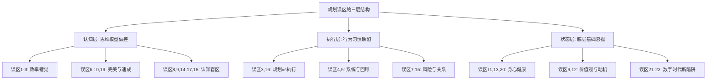
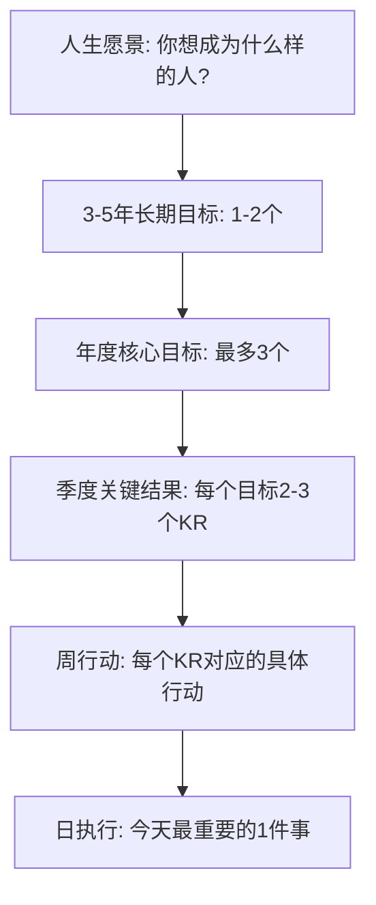
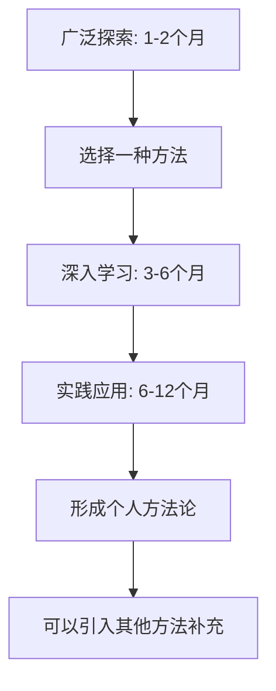
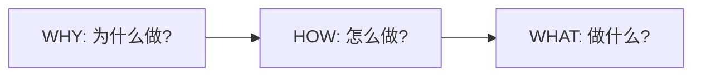
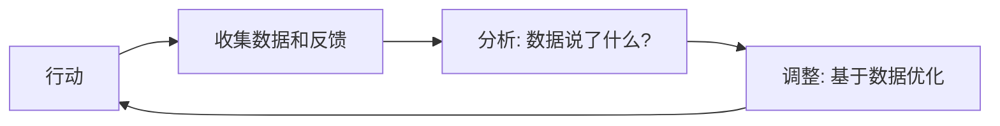
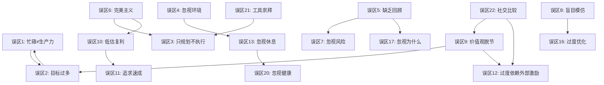

# 策略与规划的常见误区：从认知陷阱到行为纠偏

## 引言：为什么误区比无知更危险

在策略与规划的实践中，最可怕的不是"不知道怎么做"，而是"坚信自己做对了，实际上却在犯错"。无知可以通过学习来弥补，但误区——那些你深信不疑却实际上错误的信念和习惯——会系统性地扭曲你的每一个决策，让你在错误的道路上越走越远，却浑然不觉。

查理·芒格说过："反过来想，总是反过来想。"与其只学习"如何做对"，不如同时了解"如何避免做错"。本节系统梳理策略与规划中最常见的22个误区，从认知层、执行层、状态层三个维度全面覆盖，帮助你识别、理解并纠正这些深层陷阱。

### 误区的三层分类框架

所有规划误区本质上可以归入三个层次，每一层的问题性质和纠正难度都不同：

| 层次 | 核心问题 | 影响范围 | 纠正难度 | 典型表现 |
|------|---------|---------|---------|---------|
| **认知层**（思维误区） | 你对规划本身的理解有偏差 | 决策质量、方向选择 | ★★★★★ 最难纠正，因为需要改变思维模型 | 把忙碌当生产力、追求速成、完美主义 |
| **执行层**（行为误区） | 你知道该怎么做但做不对 | 效率、坚持、调整 | ★★★☆☆ 需要建立新的行为习惯 | 只规划不执行、忽视环境设计、过度优化 |
| **状态层**（根基误区） | 你忽视了支撑规划的底层基础 | 身心状态、持续性 | ★★☆☆☆ 最容易察觉但容易忽视 | 忽视健康、忽视休息、价值观脱节 |

> **阅读建议**：不必按顺序阅读。先扫描目录，找到你最可能犯的3-5个误区优先深入。改变从最有痛感的地方开始，效果最好。

---

## 第一部分：认知层误区——你的思维模型出了问题

认知层误区是最深层的陷阱。它们不是因为你不够努力或不够聪明，而是因为你用来思考规划的"操作系统"本身就存在缺陷。纠正这类误区需要更新你的底层思维模型。

---

### 误区一：把忙碌当作生产力

#### 表现

日程排得满满当当，从早到晚都在"忙碌"，微信消息秒回，会议一个接一个，加班到深夜。但季度回顾时，真正推动核心目标进展的事情几乎没有。用战术上的勤奋掩盖战略上的懒惰——这是最普遍也最隐蔽的误区。

#### 心理机制分析

这个误区之所以顽固，是因为它利用了人类大脑的三个弱点：

1. **完成偏误（Completion Bias）**：大脑从"完成任务"中获得多巴胺奖励，无论这个任务是否重要。回复100封邮件带来的"完成感"远大于花2小时思考产品战略——尽管后者的产出价值可能高出100倍。

2. **可得性启发（Availability Heuristic）**：忙碌让你感觉"做了很多事"，因为这些事是可见的、可数的。但真正重要的战略思考往往是不可见的——你只是坐在那里"想"，看起来什么都没做。

3. **损失厌恶（Loss Aversion）**：拒绝一个会议邀请感觉像"损失"了一个机会，即使参加这个会议的实际价值接近零。

#### 案例深度分析

小张是一名互联网公司的产品经理，典型的一天是这样的：

| 时间段 | 活动 | 重要性评级 | 实际产出 |
|--------|------|-----------|---------|
| 9:00-9:30 | 查看并回复邮件（47封） | 紧急但不重要 | 无实质推进 |
| 9:30-12:00 | 参加3个会议 | 大部分不重要 | 仅1个会议有决策产出 |
| 12:00-13:00 | 午餐+刷手机 | 不重要 | 零 |
| 13:00-15:00 | 写周报和各种文档 | 重要但可委托 | 完成文档但无人阅读 |
| 15:00-17:00 | 处理Slack消息和临时需求 | 紧急但不重要 | 救火式响应 |
| 17:00-18:00 | 准备明天的会议材料 | 重要 | 部分完成 |
| 18:00-21:00 | 加班处理"白天没做完的事" | 低效重复 | 疲惫但无进展 |

年度回顾时，他负责的产品用户增长停滞，关键功能延迟3个月未上线。他的年度总结写了20页，但核心结论只有一句话：**他把80%的时间花在了20%价值的事情上。**

#### 正确做法

**彼得·德鲁克指出："没有什么比高效地做一件根本不应该做的事更无用的了。"** 纠正这个误区的关键不是"做更多"，而是"做更少但更重要的事"。

**实操框架：战略性时间分配**

| 时间类别 | 占比建议 | 具体含义 | 操作方法 |
|---------|---------|---------|---------|
| 深度工作 | 40-50% | 直接推动核心目标的关键任务 | 每天保留至少3小时不被打扰的整块时间 |
| 战略思考 | 10-15% | 审视方向、调整优先级 | 每周固定2小时做"战略审视" |
| 协作沟通 | 20-25% | 必要的会议和协调 | 每个会议设定明确议程和产出要求 |
| 行政事务 | 10-15% | 邮件、报告、杂务 | 批量处理，设定固定时间窗口 |
| 缓冲时间 | 5-10% | 应对突发情况 | 不排满日程，留有余地 |

**具体纠正步骤：**

1. **时间审计**：连续一周记录你每30分钟的活动，然后按上述分类统计实际比例。大多数人的"深度工作"占比不到15%。
2. **设立"不被打扰时间"**：每天至少3小时，关闭通知、关上门、不看消息。这是你的"最高价值产出时间"。
3. **每周"战略审视"**：固定周五下午，问自己三个问题：（1）这周做的事情中，哪些真正推动了核心目标？（2）哪些事情可以不做、少做或委托？（3）下周最重要的一件事是什么？
4. **学会"战略性拒绝"**：对与核心目标不一致的事情说"不"。模板："感谢邀请，但目前我在专注于[核心目标]，无法参加。建议[替代人选]。"
5. **每季度做"减法清单"**：列出你正在做的所有事情，逐一评估其与核心目标的相关性，砍掉底部20%的活动。

---

### 误区二：设定过多目标

#### 表现

年初列了20个"年度目标"，涵盖读书、学英语、减肥、存钱、升职、恋爱、旅行、考证……每个目标看起来都很重要，都"应该做"。结果到了年底，完成的只有最容易的3-5个，真正重要的目标纹丝未动。

#### 心理机制分析

这个误区的根源在于**选择悖论（Paradox of Choice）**和**目标冲突效应**：

1. **注意力稀释**：认知心理学研究表明，人类工作记忆同时处理的目标上限约为4±1个。超过这个数量，每个目标分到的注意力和执行力会急剧下降。

2. **目标间冲突**：多个目标之间往往存在隐性矛盾。"每天学英语2小时"和"每天健身1小时"和"每天读书1小时"加起来就是4小时——这还没算工作和生活。当资源不够分配时，所有目标都"半死不活"。

3. **完成快感陷阱**：设定目标本身会带来一种虚假的成就感，仿佛"写下目标"就等于"完成了目标"。大脑会从"计划未来"中获得与"实现目标"类似的多巴胺奖励。

#### 沃伦·巴菲特的"25-5法则"

巴菲特曾给他的私人飞机飞行员Mike Flint一个著名建议：

1. 写下你职业生涯中最想实现的25个目标
2. 圈出最重要的5个
3. 剩下的20个不是"有空再做"的备选——而是你的**"不惜一切代价避免"清单**

为什么？因为那20个"还不错"的目标，恰恰是你最容易被分散注意力的地方。它们看起来有价值，但会抢走你实现最重要5个目标的时间和精力。

#### 正确做法

**实操框架：目标金字塔**

**具体纠正步骤：**

1. **目标筛选测试**：对每个候选目标问三个问题：
   - "如果只能完成一个目标，我选哪个？"（强制排序）
   - "这个目标的实现是否会让其他目标更容易？"（协同效应）
   - "一年后没完成这个目标，我会后悔吗？"（后悔测试）

2. **设定目标上限**：每个季度最多3个核心目标，每个目标拆解为2-3个关键结果（OKR方法）。

3. **创建"不做的清单"**：与"要做的清单"同等重要。明确列出你决定暂时不投入的事情，减少决策疲劳和内心冲突。

4. **目标健康度检查表**：

| 检查项 | 合格标准 | 不合格信号 |
|--------|---------|-----------|
| 数量 | ≤3个核心目标 | 超过5个 |
| 具体性 | 有明确的衡量标准 | "变得更好"这类模糊表述 |
| 优先级 | 有清晰的1、2、3排序 | "都很重要" |
| 时间框架 | 有明确的截止日期 | "有一天我要……" |
| 价值观对齐 | 能说出"为什么"很重要 | 只因为"别人都在做" |

---

### 误区三：只做规划不执行

#### 表现

花了大量时间制作精美的计划表、思维导图和甘特图，工具换了又换——从Notion到Obsidian到飞书到手账——但执行环节却频频拖延。规划本身成了逃避执行的借口，"准备阶段"无限延长。

#### 心理机制分析

这个误区利用了心理学中的**替代效应（Substitution Effect）**：大脑会自动将"类似的活动"替换为"真正的活动"。规划感觉像是在"做事"——你确实在思考、在写字、在画图——但它不是真正的执行。规划产生的虚假进展感会降低你去执行的紧迫感。

更深层的原因是**对失败的恐惧**。只要你不开始执行，你就永远不会失败。规划是一个"安全区"——在那里，一切都是完美的，一切都有可能。

#### 案例深度分析

小王的"年度规划进化史"：

| 时间 | 行动 | 状态 |
|------|------|------|
| 1月 | 试用Notion，创建年度规划模板 | "工具还不够熟悉" |
| 2月 | 转移到Obsidian，重新搭建系统 | "之前的结构不合理" |
| 3月 | 看了10个规划视频，学习新方法论 | "需要先学好方法再规划" |
| 4月 | 用飞书重新制作甘特图和看板 | "这次应该对了" |
| 5月 | 买了新的手账本，开始手写规划 | "数字化不适合我" |
| 6月 | 半年过去了，一个目标都没有启动 | "我需要重新规划下半年" |

**一年下来，小王在"规划"上花了超过200小时，在"执行"上的时间接近零。**

#### 正确做法

**关键原则：一份被粗略执行的普通计划，远胜于一份从未执行的完美计划。**

1. **"最小可行计划"规则**：规划时间不超过总执行时间的10%。如果一个目标预计需要100小时来实现，你的规划时间不应超过10小时。

2. **"只做5分钟"启动法**：不想执行时，告诉自己"只做5分钟就可以停"。利用的是行为心理学的"启动效应"——一旦开始，大脑倾向于继续下去。研究显示，80%的人在启动后会继续工作超过30分钟。

3. **"两分钟决策"规则**：如果一个行动的决策时间超过2分钟，说明你的计划还不够具体。将大目标拆解到每个步骤只需要2分钟就能决定"做不做"和"怎么做"的程度。

4. **公开承诺与问责机制**：
   - 告诉一个朋友你的具体计划和截止日期
   - 每周向他报告进度
   - 设定"违约代价"（比如没完成就请客吃饭）

5. **"先开枪再瞄准"迭代法**：

不要试图在执行前规划出完美方案。先行动起来，从实际执行中获取反馈，然后调整方向。这就是敏捷开发的核心思想，同样适用于个人规划。

---

## 第二部分：执行层误区——你的行为系统需要升级

执行层误区的特点是：你可能知道正确的方法论，但在实际操作中，你的行为系统（习惯、环境、反馈机制）不支持你持续执行。

---

### 误区四：忽视环境和系统的力量

#### 表现

做规划时只关注"目标"和"行动计划"，完全忽视了"环境设计"和"系统构建"。一切执行都依赖意志力——"我一定要坚持"、"这次我要自律"。结果意志力消耗殆尽后，计划土崩瓦解。

#### 心理机制分析

**意志力的"肌肉模型"**：罗伊·鲍迈斯特（Roy Baumeister）的自我损耗理论（Ego Depletion）表明，意志力像肌肉一样会疲劳。每做一个需要自控的决定，你的意志力储备就会减少一点。到了下午或晚上，你的自控能力会显著下降——这就是为什么你总是在晚上"破戒"。

**环境的"选择架构"效应**：行为经济学家理查德·塞勒（Richard Thaler）的研究表明，环境设计对行为的影响比意志力强大10倍以上。超市把健康食品放在视线高度，销量就能提升25%——不需要任何意志力。

#### 案例深度分析

小陈的"早起锻炼"失败记录：

| 尝试 | 计划 | 失败原因 | 根本问题 |
|------|------|---------|---------|
| 第1次 | 设6:30闹钟 | 闹钟响了关掉继续睡 | 没有"起床触发器" |
| 第2次 | 把手机放到客厅 | 起来关闹钟后直接刷手机 | 手机是"反向触发器" |
| 第3次 | 买运动装备 | 运动服在衣柜深处，找衣服消耗动力 | 增加了"启动摩擦" |
| 第4次 | 找了健身搭子 | 搭子先放弃了 | 依赖外部不可控因素 |
| 第5次 | 报了健身房 | 距离太远，来回要1小时 | "行动成本"太高 |

**每一次失败都不是因为小陈"不够自律"，而是因为他的环境设计有缺陷。**

#### 正确做法

**詹姆斯·克利尔在《原子习惯》中指出："你不会上升到目标的高度，你会下降到系统的水平。"**

**环境设计四原则：**

1. **减少摩擦**：让正确的行为变得尽可能容易
   - 想锻炼？运动服放在床头，睡前就穿好
   - 想读书？书放在枕头旁边，手机放到客厅充电
   - 想健康饮食？周末做好一周的meal prep，工作日只需加热

2. **增加摩擦**：让错误的行为变得尽可能困难
   - 想少刷手机？卸载抖音/微博，设置屏幕使用时间限制
   - 想少花钱？取消信用卡自动填充，删除购物App
   - 想早睡？设定路由器定时关闭，到点就没网

3. **设置触发器**：用环境信号自动触发正确行为
   - 习惯堆叠：喝完早咖啡后→立刻做10分钟冥想
   - 环境锚定：坐到书桌前→立刻打开工作文档（不看手机）
   - 视觉提示：在浴室镜子上贴目标提醒便签

4. **标准化决策**：将重复性决策提前固化
   - 每天穿同样的几套衣服（减少决策疲劳）
   - 每周同一天去超市，买同样的食材
   - 每天同一时间做同一件事（固定日程模板）

---

### 误区五：缺乏定期回顾和调整

#### 表现

年初制定计划，然后把计划书放进抽屉——或者更常见的是，保存在一个再也不会打开的文档里。过程中既不回顾进度，也不根据变化调整方向。等到年底才"恍然大悟"：要么目标早已不再适合，要么走偏了方向却不自知。

#### 心理机制分析

这个误区涉及两个认知偏差：

1. **规划谬误（Planning Fallacy）**：卡尼曼和特沃斯基发现，人类系统性地低估完成任务所需的时间和资源，同时高估自己的执行力。你年初制定的计划，很可能从一开始就过于乐观。

2. **沉没成本谬误**：即使发现方向不对，你也可能因为"已经投入了时间"而不愿调整，导致在错误的道路上越走越远。

#### 正确做法

**建立"回顾节奏"——四层检查系统：**

| 回顾层级 | 频率 | 时长 | 核心问题 | 输出 |
|---------|------|------|---------|------|
| 日回顾 | 每天睡前 | 5分钟 | 今天最重要的事做了吗？明天最重要的事是什么？ | 明天的"第一件事" |
| 周回顾 | 每周日 | 30分钟 | 本周目标进展如何？有什么需要调整？下周重点是什么？ | 下周计划更新 |
| 月回顾 | 每月最后一天 | 1小时 | 本月关键结果完成率？需要加速还是调整方向？ | 目标校准 |
| 季度回顾 | 每季度末 | 半天 | 核心目标还对吗？需要新增或删除目标吗？ | 战略调整 |

**回顾时使用的"红绿灯系统"：**

- 🟢 **绿色**：进度正常，按计划继续
- 🟡 **黄色**：进度滞后或出现风险信号，需要关注和调整
- 🔴 **红色**：严重偏离或目标可能无法达成，需要立即干预

**关键原则：勇于调整方向。** 发现目标不再适合时，果断调整不是"失败"，而是"智慧"。坚持一个已经过时的目标，才是真正的失败。

---

### 误区六：完美主义陷阱

#### 表现

因为追求完美而迟迟无法开始。总觉得条件还不够成熟、准备还不够充分、方案还不够完美。即使开始了，也因为对细节的过度追求而进展缓慢。"等我准备好再开始"变成了永远无法兑现的承诺。

#### 心理机制分析

完美主义的核心不是"追求卓越"，而是**"恐惧失败"**。心理学家布伦·布朗（Brené Brown）的研究表明，完美主义者往往将自我价值与成就绑定——"如果我的作品不完美，就说明我不够好"。这种信念导致他们要么不开始（避免失败），要么无限期地"打磨"（永远不交付）。

#### 案例深度分析

小孙想写一本关于个人成长的书。他的两年"准备"过程：

| 阶段 | 行动 | 内心独白 |
|------|------|---------|
| 第1-3月 | 读了30本书 | "知识储备还不够" |
| 第4-6月 | 又读了40本书，做笔记 | "思路还不够清晰" |
| 第7-9月 | 研究了20本畅销书的结构 | "还不够了解市场" |
| 第10-12月 | 设计了3个版本的大纲 | "大纲还不够完美" |
| 第13-18月 | 学习写作技巧课程 | "文笔还不够好" |
| 第19-24月 | 重新调整大纲，又读了30本书 | "准备还不够充分" |

**两年过去，连第一章的第一句话都没有写出来。**

#### 正确做法

**核心原则：完成比完美更重要。Done is better than perfect.**

1. **设定"足够好"的交付标准**：在开始前就明确，什么样的成果可以交付。比如："第一版草稿只要把核心观点说清楚就行，不需要完美的措辞。"

2. **使用"迭代思维"**：

3. **"70%规则"**：当你对一个方案有70%的把握时就开始执行。等到有100%把握时，往往已经错过了最佳时机。

4. **区分"高杠杆细节"和"低杠杆细节"**：
   - 高杠杆细节：产品核心功能、论文核心论点、简历关键经历——值得精益求精
   - 低杠杆细节：PPT的配色方案、邮件的措辞、文档的排版——"足够好"就行

5. **设定"不可商量的截止日期"**：给自己一个必须交付的时间点。帕金森定律告诉我们，工作会自动膨胀到填满所有可用时间。没有截止日期的任务永远不会"准备好"。

---

### 误区七：忽视风险和备用方案

#### 表现

规划完全是"一路向上"的预期，假设一切都会按最好的情况发展。没有考虑可能的风险、障碍和失败，也没有准备备用方案。一旦遇到意外，就手足无措，计划全线崩溃。

#### 正确做法

**核心工具：事前验尸（Pre-mortem）**

这是心理学家加里·克莱因（Gary Klein）提出的决策工具。与"事后复盘"相反，"事前验尸"是在计划执行**之前**就假设它已经失败了，然后倒推失败的可能原因。

**操作步骤：**

1. **假设你的计划已经失败了**
2. **每个人独立写下可能的失败原因**（避免群体思维）
3. **汇总并分类所有失败原因**
4. **为每个高概率的失败原因制定预防措施和应急方案**
5. **将应急方案纳入主计划**

**风险管理矩阵：**

| 风险 | 发生概率 | 影响程度 | 风险等级 | 预防措施 | 应急方案 |
|------|---------|---------|---------|---------|---------|
| 市场环境变化 | 中 | 高 | 🔴高 | 持续市场监测 | 调整方向，寻找替代市场 |
| 关键人员流失 | 中 | 高 | 🔴高 | 知识文档化，培养backup | 快速招聘或外包 |
| 资金不足 | 低 | 高 | 🟡中 | 控制burn rate | 紧急融资或缩减开支 |
| 技术方案不可行 | 中 | 中 | 🟡中 | 提前做技术验证（PoC） | 切换备选技术方案 |
| 时间延期 | 高 | 中 | 🟡中 | 设定缓冲时间（+30%） | 缩减scope，优先核心功能 |

**原则：在时间和预算上留出20-30%的缓冲。** 不是因为你计划得不好，而是因为世界本身就是不确定的。

---

### 误区八：盲目模仿他人的规划

#### 表现

看到某个成功人士的时间表或规划方法，就原封不动地照搬到自己身上。模仿CEO每天5点起床、模仿博主的学习计划、模仿投资人的资产配置。结果发现完全不适合自己，坚持不了几天就放弃。

#### 心理机制分析

这个误区的根源是**幸存者偏差（Survivorship Bias）**和**基本归因错误（Fundamental Attribution Error）**：

- **幸存者偏差**：你只看到了成功者的习惯，看不到有同样习惯但失败了的无数人。那些5点起床但创业失败的人不会写书分享经验。
- **基本归因错误**：你倾向于将别人的成功归因于他们的习惯（可见因素），而忽视了他们的背景、资源、时机、运气等不可见因素。

#### 案例深度分析

小吴看到某成功企业家每天4:30起床，于是他也开始4:30起床。但小吴是典型的"夜猫子型"（chronotype研究表明，约30%的人天生倾向于晚睡晚起）。早起后他精神萎靡，上午的工作效率下降了40%，下午更是昏昏欲睡。一周后他不得不放弃，还因此对自己的自律能力产生了怀疑——"别人都能做到，为什么我不行？"

**真相是：那位企业家本身就是"百灵鸟型"，4:30起床对他来说是自然状态，不需要意志力。**

#### 正确做法

**核心原则：学习"为什么"，而不是"怎么做"。**

1. **提取底层原则，而非表面方法**：
   - 不要模仿"5点起床"，而是理解背后的"在精力最好的时间做最重要的事"
   - 不要模仿"每天读书2小时"，而是理解"持续输入新知识"
   - 不要模仿"记手账"，而是理解"可视化进度，增强自我反馈"

2. **"个人实验室"方法**：
   - 选择一个新方法，小规模试验2-4周
   - 记录关键指标（效率、心情、完成度）
   - 试验结束后做数据对比：这个方法适合我吗？
   - 适合→保留并优化；不适合→果断放弃，无内疚

3. **了解自己的"操作系统"**：
   - 你的精力模式是什么？（百灵鸟型/夜猫子型/中间型）
   - 你在什么环境下效率最高？（安静独处/有背景音/咖啡馆）
   - 你的注意力持续时间是多久？（25分钟/50分钟/90分钟）
   - 你的社交需求是怎样的？（需要大量独处/需要定期社交）

---

### 误区九：目标与价值观脱节

#### 表现

设定的目标听起来很宏大——赚1000万、成为高管、环游世界——但当你追问"为什么"的时候，却说不出一个让自己内心深处认同的理由。这些目标可能来自社会期望、家庭压力、社交媒体的比较，而不是来自自己真正的价值观。

#### 心理机制分析

**自我决定理论（Self-Determination Theory）** 的研究表明，持久的动机必须建立在三个基本心理需求之上：自主感（Autonomy）、胜任感（Competence）和归属感（Relatedness）。当一个目标来自外部压力而非内在价值观时，它无法满足"自主感"，因此你很难保持持久的动力。

#### 正确做法

**"五个为什么"深度追问法：**

对每个目标连续追问五次"为什么"，直到触及核心价值观：

目标：30岁前赚到1000万
→ 为什么？→ 因为有钱才有安全感
→ 为什么这很重要？→ 因为我不想为钱发愁
→ 为什么不想为钱发愁？→ 因为我想有自由选择的权利
→ 为什么自由选择很重要？→ 因为我想做自己真正热爱的事情
→ 为什么做热爱的事很重要？→ 因为人生的意义在于创造和体验

核心价值观：自由、创造、体验
→ 重新定义目标：建立一个能让我自由创造和体验的生活方式

你会发现，"赚1000万"只是实现"自由、创造、体验"的一种手段，而且可能不是最优手段。也许一份自由度高的工作、一个能产生被动收入的副业、或者降低物质欲望，都能更好地服务于这个核心价值观。

**价值观澄清练习：**

花30分钟完成以下步骤：
1. 列出你认为最重要的10个价值观（自由、安全、成就、家庭、健康、创造、冒险、影响力、知识、归属……）
2. 强制两两比较，最终筛选出最重要的5个
3. 为每个价值观写一句话：它对你意味着什么？
4. 检查你当前的目标：哪些目标服务于这些价值观？哪些与价值观冲突？

---

### 误区十：低估复利效应，高估短期变化

#### 表现

对短期内能取得的变化过于乐观（"一个月内脱胎换骨"），同时对长期持续努力能带来的变化过于悲观（"每天进步一点点有什么用"）。结果短期内过度投入，看不到立竿见影的效果就放弃，无法享受长期复利的巨大回报。

#### 心理机制分析

人类大脑天生偏好**线性增长**——因为我们进化于一个大部分变化都是线性的世界。但个人成长、知识积累、技能习得的规律是**指数增长**的：前期进展极其缓慢，后期才会出现加速。大脑对这种"反直觉"的增长模式非常不适应。

#### 数据验证

假设你每天进步0.1%（一个非常微小的进步）：

| 时间点 | 累积提升 | 直觉感受 |
|--------|---------|---------|
| 1周后 | 0.7% | "几乎没变化" |
| 1个月后 | 3% | "还是看不到效果" |
| 3个月后 | 9.4% | "有点进步但很慢" |
| 6个月后 | 19.7% | "开始有感觉了" |
| 1年后 | 44% | "明显不一样了" |
| 2年后 | 107% | "翻倍了" |
| 5年后 | 516% | "脱胎换骨" |

**关键洞察：你在第1个月放弃，就永远看不到第12个月的44%提升。复利曲线的"拐点"通常在6-12个月之间出现。**

#### 正确做法

1. **关注"过程指标"而非"结果指标"**：
   - ❌ 结果指标："我的英语水平提高了吗？"（短期内难以感知）
   - ✅ 过程指标："我今天学习了30分钟吗？"（每天可以确认）

2. **设定"最低执行标准"**：即使状态不好，也要完成最低标准。比每天30分钟的最低标准是5分钟——做了5分钟就"及格"。

3. **可视化累积进展**：用日历打卡、习惯追踪App或进度条，让你"看见"自己坚持了多少天。连续打卡的"链条效应"会成为强大的动力。

4. **定期做"长期对比"**：每6个月回头看一次自己6个月前的状态。你会惊讶于自己的成长——这种惊讶本身就是最好的动力。

---

### 误区十一：追求"速成"和"捷径"

#### 表现

渴望快速成功，总是在寻找"捷径"和"秘诀"。频繁更换方法，追逐热点——今天学番茄钟，明天学GTD，后天学PARA——无法在任何一条路上坚持足够长的时间来获得真正的回报。

#### 案例深度分析

小高学投资的经历：

| 月份 | 学习内容 | 放弃原因 | 花费 |
|------|---------|---------|------|
| 1-2月 | 技术分析 | "太复杂，指标太多" | ¥2,000（课程费） |
| 3-4月 | 价值投资 | "太慢，要等好几年" | ¥500（书籍） |
| 5-6月 | 量化交易 | "需要编程基础" | ¥3,000（课程费） |
| 7-8月 | 基金定投 | "收益太低" | ¥1,000（试错亏损） |
| 9-10月 | 加密货币 | "波动太大，心态崩了" | ¥5,000（亏损） |
| 11-12月 | 又回到价值投资 | "感觉还是这个靠谱" | ¥300（书籍） |

**一年花费超过¥12,000，但没有一种方法真正掌握。如果一开始就选择价值投资，深入学习一年，效果会好10倍。**

#### 正确做法

**核心原则：慢就是快。**

1. **"6个月承诺"**：选择一条道路后，承诺至少坚持6个月不做大的改变。6个月是一个技能习得的最低有效周期——足以从"入门"达到"初级实践者"水平。

2. **警惕"速成信号"**：
   - "7天掌握XXX"——不可能
   - "一个技巧让你立刻XXX"——夸大其词
   - "我试了这个方法立刻见效"——要么是极端个例，要么是营销话术
   - **判断标准：如果一个方法听起来好得不像真的，那它很可能就不是真的**

3. **"深耕一种方法"策略**：

---

## 第三部分：状态层误区——你的根基需要加固

状态层误区最容易被忽视，因为它们的影响是"隐性"的。你不会立刻感到健康恶化、关系破裂或内心空虚——这些代价会在几个月甚至几年后才显现。但到了那时，修复的成本已经极其高昂。

---

### 误区十二：忽视情绪和精力管理

#### 表现

做规划时只考虑"时间和任务"，假设自己每天都有相同的精力和动力。结果在状态好时过度投入，状态差时完全放弃，执行极不稳定。计划总是"完美地设计，狼狈地执行"。

#### 正确做法

**核心转变：从"时间管理"到"精力管理"。**

精力管理的四个维度（基于吉姆·洛尔《精力管理》）：

| 维度 | 含义 | 恢复方法 |
|------|------|---------|
| 体能精力 | 身体的能量水平 | 运动、睡眠、营养 |
| 情绪精力 | 积极情绪的储备 | 冥想、社交、爱好 |
| 注意力精力 | 专注和集中能力 | 深度工作、减少干扰 |
| 意义精力 | 与使命感的连接 | 回顾愿景、服务他人 |

**设计"弹性计划"：**

| 精力状态 | 计划类型 | 任务分配 |
|---------|---------|---------|
| 高能量日 | 全力推进 | 高难度、高价值的核心任务 |
| 中能量日 | 稳定执行 | 中等难度的常规任务 |
| 低能量日 | 最低标准 | 低难度的维护性任务，但不为零 |

**核心原则：低能量日的"最低标准"不为零。** 哪怕只做5分钟，也比不做强——因为"保持链条不断"本身就是一种胜利。

---

### 误区十三：过度依赖外部激励

#### 表现

需要外部的认可、点赞、奖励或压力才能行动。在朋友圈打卡学习，获得点赞就动力满满，停止打卡就动力消失。追逐热点、迎合他人期望，而不是基于内在价值观行动。

#### 正确做法

**从外部激励到内在动机的过渡：**

| 外部激励（脆弱） | 内在动机（持久） |
|----------------|----------------|
| "我要让别人看到我在学习" | "学习让我理解世界的能力变强了" |
| "老板夸我了，我要继续努力" | "解决难题本身让我有成就感" |
| "朋友圈都在跑步，我也要跑" | "跑步让我感觉身体和精神状态更好" |
| "考试通过了就学，不通过就不学" | "掌握新知识的过程本身就是奖励" |

**具体步骤：**
1. 识别你当前目标中的外部动机成分
2. 对每个外部动机追问"它满足了我的什么内在需求？"
3. 将注意力从"外部反馈"转向"内在体验"
4. 建立"自我认可"系统：完成任务后，花1分钟感受完成带来的满足感

---

### 误区十四：忽视休息和恢复

#### 表现

认为"努力就是不停歇"，把日程排得满满的，没有休息和恢复的时间。结果导致身心俱疲、效率下降，甚至出现健康问题。最终不得不停下来——而且停下来的时间比主动休息的时间长得多。

#### 案例深度分析

小马是一名创业者，他的"拼命模式"：

| 阶段 | 持续时间 | 工作强度 | 身体反应 | 产出效率 |
|------|---------|---------|---------|---------|
| 蜜月期 | 第1-2月 | 每天14小时 | 精力充沛，兴奋 | ★★★★★ |
| 疲劳期 | 第3-4月 | 每天14小时 | 开始失眠，容易发火 | ★★★☆☆ |
| 倦怠期 | 第5-6月 | 每天14小时 | 严重失眠、焦虑、胃病 | ★★☆☆☆ |
| 崩溃期 | 第7月 | 被迫停止工作 | 住院一周 | 零 |
| 恢复期 | 第8-10月 | 每天6小时 | 缓慢恢复 | ★★★☆☆ |

**如果小马从第2个月开始主动安排休息，他的总产出会更高，而且不需要经历崩溃期。**

#### 正确做法

**核心原则：休息不是"偷懒"，而是"充电"。战略性休息是高效能人士的秘密武器。**

1. **微休息（每日）**：每工作50分钟，休息10分钟。站起来走动、看远处、喝水。
2. **中休息（每周）**：保证至少1天完全不工作。不是"在家远程办公"，而是真正地休息。
3. **大休息（每季度）**：安排3-7天的假期。完全脱离工作环境。
4. **保证睡眠**：7-8小时是成年人的基本需求，不是"奢侈品"。睡眠不足会导致决策质量下降30%、创造力下降40%。

---

### 误区十五：追求"平衡"而非"整合"

#### 表现

追求工作与生活的"平衡"，试图在各个领域平均分配时间和精力。结果每个领域都投入不足，没有一个领域做得出色。每天在不同角色间切换，疲惫不堪。

#### 正确做法

**核心转变：从"平衡"（Balance）到"整合"（Integration）。**

"平衡"暗示着各领域之间是竞争关系——给这边多了，那边就少了。"整合"则是寻找各领域之间的协同效应——一个活动能同时服务多个目标。

**协同效应示例：**

| 活动 | 同时服务的目标 |
|------|-------------|
| 与伴侣一起运动 | 健康 + 关系 |
| 参加行业社交活动 | 职业发展 + 人脉 + 学习 |
| 写博客分享专业知识 | 学习 + 个人品牌 + 思维整理 |
| 与孩子一起阅读 | 家庭 + 教育 + 个人成长 |
| 步行通勤时听播客 | 运动 + 学习 |

**人生阶段重心模型：**

| 阶段 | 年龄参考 | 核心重心 | 允许暂时减少的领域 |
|------|---------|---------|-----------------|
| 探索期 | 20-25岁 | 学习、试错、建立基础 | 财富积累 |
| 建设期 | 25-35岁 | 职业发展、能力构建 | 社交、休闲 |
| 稳定期 | 35-45岁 | 家庭、深度影响 | 新技能学习 |
| 贡献期 | 45岁+ | 传承、回馈 | 职业竞争 |

**核心原则：在某个阶段投入80%精力在核心重心上，不是"失衡"，而是"战略性聚焦"。**

---

### 误区十六：忽视人际关系的价值

#### 表现

专注于个人目标，忽视人际关系的建设和维护。认为"只要自己足够优秀，自然会有人脉"。结果在需要帮助时发现无人可依。

#### 正确做法

**马克·格兰诺维特的"弱关系理论"**：对你职业发展帮助最大的，往往不是亲密的"强关系"（家人、好友），而是"弱关系"（不太亲密但广泛的社交联系）。因为弱关系连接着不同的社交圈，能为你带来你圈子之外的信息和机会。

**人际关系投资框架：**

| 关系层级 | 人数 | 维护频率 | 投入方式 |
|---------|------|---------|---------|
| 核心圈 | 3-5人 | 每周 | 深度交流、共同成长 |
| 支持圈 | 10-15人 | 每月 | 定期联络、互相帮助 |
| 扩展圈 | 50-100人 | 每季度 | 社交活动、信息交换 |
| 弱关系网 | 数百人 | 保持在线可见 | 社交媒体、行业活动 |

**关键行动：**
1. 每月主动联系2-3位"支持圈"中的朋友
2. 每季度参加1-2次行业活动，扩展"弱关系"
3. 建立"先给予"的习惯：在求助之前，先提供价值
4. 维护一个简单的"人脉笔记"：记录关键人物的信息和上次联系时间

---

### 误区十七：忽视身体健康

#### 表现

专注于职业发展和财务目标，牺牲睡眠、运动和饮食来换取更多的工作时间。结果健康问题频发，反而影响了长期的生产力和生活质量。

#### 正确做法

**身体健康是一切规划的"底层基础设施"。** 就像一栋大楼的地基——你看不到它，但一旦它出问题，整栋大楼都会倒塌。

**健康投资的"最低有效剂量"：**

| 健康行为 | 最低有效剂量 | 投入回报比 | 对规划能力的影响 |
|---------|------------|-----------|----------------|
| 睡眠 | 7小时/天 | ★★★★★ | 睡眠不足使决策质量下降30% |
| 运动 | 150分钟/周（中等强度） | ★★★★★ | 运动后2小时内认知能力提升20% |
| 饮食 | 三餐规律，少加工食品 | ★★★★☆ | 血糖稳定直接影响注意力 |
| 体检 | 每年1次全面体检 | ★★★★☆ | 早期发现问题，修复成本最低 |

**核心原则：将健康视为"投资"而非"成本"。** 今天在健康上投入的1小时，会在未来以10倍的效率回报给你。

---

### 误区十八：只关注"做什么"，忽视"为什么"

#### 表现

忙于执行任务清单，却从不思考任务背后的目的。像机器一样完成事项，却不知道这些事项如何服务于更大的目标。结果导致努力方向偏离，产出与目标不一致。

#### 正确做法

**西蒙·斯涅克的"黄金圈法则"**：高效的行动从"为什么"开始，而不是从"做什么"开始。

大多数人是从外向内思考的：先确定"做什么"，再想"怎么做"，很少问"为什么"。但真正有效的规划是从内向外的：先明确"为什么"，再确定"怎么做"，最后才是"做什么"。

**每周"目的审视"练习：**
1. 列出你本周计划做的5件最重要的事
2. 对每件事问："这件事服务于我的哪个核心目标？"
3. 如果答不上来，这件事要么应该委托，要么应该删除

---

### 误区十九：忽视反馈和数据

#### 表现

凭感觉做决策，忽视客观数据和反馈。相信自己的直觉，不愿意用数据来检验假设。结果决策质量低下，错误重复发生。

#### 正确做法

**建立"反馈循环"：**

**个人决策的"数据化"方法：**

| 决策领域 | 可追踪的数据 | 工具推荐 |
|---------|------------|---------|
| 时间使用 | 每日时间分配 | Toggl、时间记录表 |
| 学习效果 | 测试分数、输出量 | Anki、学习日志 |
| 财务状况 | 收支、储蓄率、投资回报 | 记账App、Excel |
| 健康状态 | 体重、运动时长、睡眠 | Apple Watch、手环 |
| 目标进度 | 关键结果完成率 | OKR追踪表 |

**核心原则：如果不能衡量，就不能改进。** 开始追踪你关心的领域的关键数据，用数据而非感觉来指导决策。

---

### 误区二十：过度优化，忽视灵活性

#### 表现

追求完美的规划和执行，试图优化每一个细节。系统过于复杂和僵化，无法适应变化。当计划被打乱时，感到焦虑和挫败。花在"维护系统"上的时间比"实际执行"还多。

#### 正确做法

**"反脆弱"规划原则（纳西姆·塔勒布）：**

| 脆弱系统 | 坚韧系统 | 反脆弱系统 |
|---------|---------|-----------|
| 遇到变化就崩溃 | 能扛住变化但不受益 | 从变化中变得更强 |
| 过度优化的计划 | 有缓冲的计划 | 模块化、可重组的计划 |
| "我必须严格遵守" | "我可以在范围内调整" | "变化让我发现更好的方案" |

**设计反脆弱规划的四条原则：**

1. **保持简单**：规则越少越好。你的规划系统应该用一句话就能解释清楚。
2. **模块化**：将大计划拆分为独立的小模块。一个模块出问题不会拖垮整个系统。
3. **留有余地**：永远不要把日程排满。留出30%的空白时间给意外和机会。
4. **拥抱变化**：当计划被打破时，不要问"为什么这会发生在我身上"，而是问"这个变化为我打开了什么新的可能？"

---

## 第四部分：数字时代的新误区

随着技术的发展，规划领域出现了几个全新的误区。这些误区在10年前不存在，但在今天已成为最常见的陷阱。

---

### 误区二十一：工具崇拜——用"选择工具"替代"实际执行"

#### 表现

花大量时间研究和试用各种效率工具——Notion、Obsidian、Todoist、滴答清单、飞书、语雀、Logseq、Roam Research……每个工具都搭建一套精美的系统，但真正的核心工作几乎没有推进。"选工具"和"搭系统"本身成了一种拖延的高级形式。

#### 为什么这是个误区

工具崇拜的本质是**用"准备动作"替代"真正行动"**。搭建Notion数据库感觉像在"做事"——你确实在做设置、在优化、在美化——但这些都不是你的核心工作。更糟糕的是，频繁切换工具会导致"系统迁移成本"——你花了大量时间把数据从一个工具搬到另一个工具，而这些时间本可以用来做事。

#### 如何纠正

1. **"工具禁欲"实验**：一个月内不尝试任何新工具，只用你已经有的工具。看看没有新工具你能不能完成工作——大概率可以。
2. **"最小工具集"原则**：每个领域只用一个工具。笔记用一个、任务管理用一个、日历用一个，够了。
3. **工具评估标准**：

| 评估维度 | 权重 | 说明 |
|---------|------|------|
| 学习成本 | 20% | 上手要多久？ |
| 日常效率 | 30% | 用起来快不快？ |
| 数据可迁移性 | 20% | 能否方便地导出数据？ |
| 稳定性 | 15% | 这个工具5年后还在吗？ |
| 协作能力 | 15% | 需要和别人协作时方便吗？ |

---

### 误区二十二：社交媒体比较——用"他人的高光时刻"衡量自己的日常

#### 表现

在社交媒体上看到别人的"年度总结"——读了100本书、跑了1000公里、收入翻倍、环游世界——然后拿自己的日常生活来对比，感到焦虑和自卑。由此要么过度焦虑地"追赶"，要么干脆放弃——"反正怎么努力也比不过别人"。

#### 为什么这是个误区

社交媒体展示的是**经过筛选和美化后的"高光时刻"**，不是真实的日常生活。你看到的是别人跑了1000公里的成就，看不到的是他也有30天没出门的低谷期；你看到的是别人创业成功的光环，看不到的是他背后99次失败和无数次想放弃。

**研究数据**：宾夕法尼亚大学的一项研究表明，每天使用社交媒体超过30分钟的人，焦虑和抑郁水平显著高于对照组。"向上社会比较"是主要的心理机制。

#### 如何纠正

1. **"自我参照"原则**：唯一的有效比较对象是过去的自己。你比6个月前进步了吗？这才是有意义的问题。
2. **减少信息噪音**：取消关注让你焦虑的账号。关注那些提供真实价值而非焦虑的内容。
3. **"分享低谷"实践**：不仅分享成功，也分享失败和挣扎。这不仅能帮助他人，也能帮你接受自己的不完美。
4. **设定社交媒体使用上限**：每天不超过30分钟。用屏幕使用时间功能强制执行。

---

## 第五部分：误区的系统性分析

### 误区之间的因果网络

这些误区往往不是单独出现的，而是相互关联、相互强化的。理解它们之间的因果关系，有助于你找到"杠杆点"——纠正一个关键误区，可能同时缓解多个相关误区。

**关键因果链：**

| 因果链 | 纠正"源头"的效果 |
|--------|---------------|
| 价值观脱节 → 目标过多 → 忙碌无效 | 一旦价值观清晰，目标自然聚焦 |
| 完美主义 → 只规划不执行 → 低估复利 → 追求速成 | 接受"足够好"后，执行和坚持自然改善 |
| 忽视环境 → 依赖意志力 → 忽视休息 → 健康恶化 | 设计好环境后，对意志力的需求大幅降低 |
| 社交比较 → 价值观脱节 → 外部激励依赖 | 停止比较后，内在动机自然涌现 |

---

### 自我检测评分系统

不只是"勾选有无"，而是量化你当前的误区严重程度：

**评分标准：**
- 0分 = 完全没有这个问题
- 1分 = 偶尔有，但不影响大局
- 2分 = 经常有，影响了效率
- 3分 = 严重，显著阻碍了目标进展

#### 认知层评分

| 序号 | 误区 | 自评分(0-3) |
|------|------|-----------|
| 1 | 我经常把忙碌当作生产力 | ___ |
| 2 | 我同时追求超过3个核心目标 | ___ |
| 6 | 我因追求完美而迟迟不开始 | ___ |
| 9 | 我的目标与内心价值观不一致 | ___ |
| 10 | 我低估长期复利，期待短期见效 | ___ |
| 11 | 我频繁更换方法，追求速成 | ___ |
| 17 | 我做事时不清楚背后的"为什么" | ___ |
| 18 | 我凭感觉而非数据做决策 | ___ |
| 21 | 我花大量时间在工具选择上 | ___ |
| 22 | 我经常因社交媒体比较而焦虑 | ___ |
| **小计** | **认知层总分** | **___/30** |

#### 执行层评分

| 序号 | 误区 | 自评分(0-3) |
|------|------|-----------|
| 3 | 我做了很多规划但执行很少 | ___ |
| 4 | 我依赖意志力而非环境设计 | ___ |
| 5 | 我很少定期回顾和调整计划 | ___ |
| 7 | 我的计划没有备用方案 | ___ |
| 8 | 我盲目模仿他人的方法 | ___ |
| 14 | 我追求绝对平衡，资源分散 | ___ |
| 15 | 我忽视人际关系的建设 | ___ |
| 16 | 我的系统过度复杂和僵化 | ___ |
| **小计** | **执行层总分** | **___/24** |

#### 状态层评分

| 序号 | 误区 | 自评分(0-3) |
|------|------|-----------|
| 12 | 我不管理情绪和精力 | ___ |
| 13 | 我过度依赖外部激励 | ___ |
| 19 | 我忽视休息和恢复 | ___ |
| 20 | 我忽视身体健康 | ___ |
| **小计** | **状态层总分** | **___/12** |

**总分：___/66**

| 总分范围 | 评估 | 建议 |
|---------|------|------|
| 0-15 | 优秀 | 你有很好的规划习惯，关注持续优化即可 |
| 16-30 | 良好 | 有几个需要纠正的误区，优先处理3分项 |
| 31-45 | 中等 | 存在系统性问题，建议从"因果链源头"开始纠正 |
| 46-66 | 警告 | 你的规划系统有严重的结构性缺陷，需要优先重构基础 |

---

### 误区纠正的优先级

不是所有误区都需要立即纠正。根据**因果网络分析**和**影响力排序**，建议按以下优先级处理：

#### 第一优先级：立即行动（本周内）

这些误区是其他误区的"根源"，纠正它们会产生连锁正面效应：

1. **目标与价值观脱节**（误区9）——所有规划的起点
2. **忽视身体健康**（误区20）——所有能力的基础设施
3. **忽视休息和恢复**（误区19）——可持续性的前提

#### 第二优先级：1个月内纠正

4. **只做规划不执行**（误区3）——从行动中学习
5. **忽视环境和系统**（误区4）——减少对意志力的依赖
6. **设定过多目标**（误区2）——聚焦核心

#### 第三优先级：持续改进

7. **完美主义**（误区6）——接受"足够好"
8. **低估复利**（误区10）——耐心坚持
9. **其他误区**——在日常中逐步纠正

---

## 总结：从误区到正途的行动路线

### 七条核心原则

1. **没有完美的规划，只有持续的迭代**——接受不完美，从行动中学习
2. **系统比意志力更重要**——设计环境，建立系统，让正确的行为变得容易
3. **复利需要时间**——坚持至少6个月，才能看到指数增长的拐点
4. **健康是一切的基础**——没有健康的身体和充沛的精力，再好的规划都是空谈
5. **价值观是指南针**——目标要与内心价值观一致，否则你不会持久
6. **灵活比完美更重要**——反脆弱的系统从变化中获益
7. **数据比感觉更可靠**——用客观数据验证假设，而非凭直觉做决策

### 立即行动清单

不要试图一次性纠正所有误区。按以下顺序开始：

1. **今天**：完成自我评分，识别你得分最高的3个误区
2. **本周**：为每个误区选择一个"最小纠正行动"，立即开始执行
3. **本月**：建立每周回顾习惯，追踪纠正进展
4. **本季度**：重新评分，评估改善效果，调整纠正策略

记住，**识别误区是改变的开始，但行动才是改变的关键。** 读完这篇文章后，你最大的风险不是"不知道这些误区"，而是"知道了但什么都不做"——这本身就是误区三（只做规划不执行）的完美体现。

现在就行动吧。
