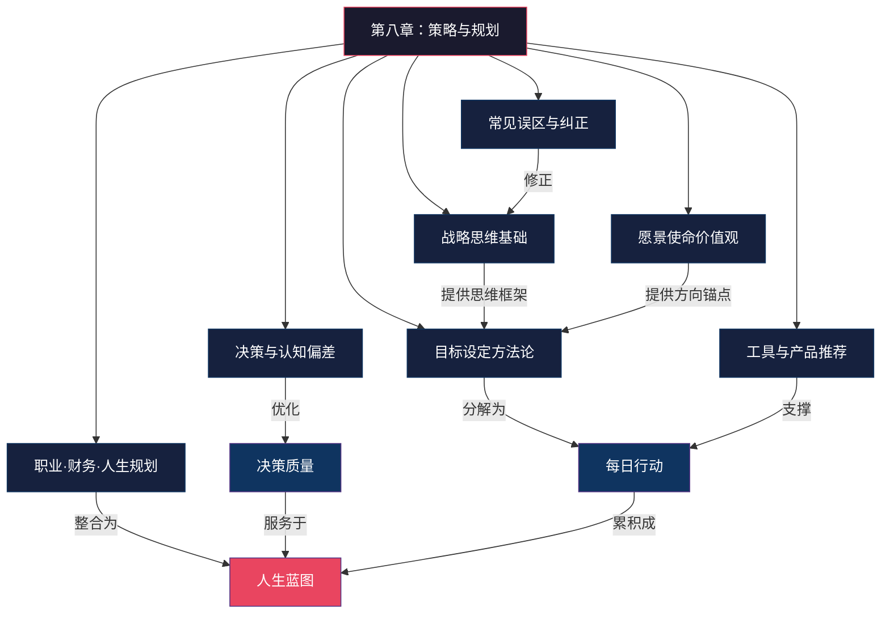
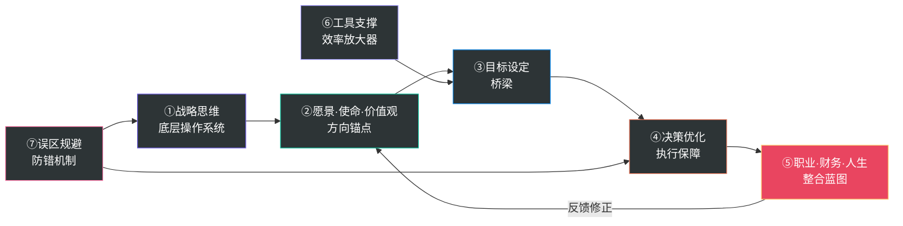
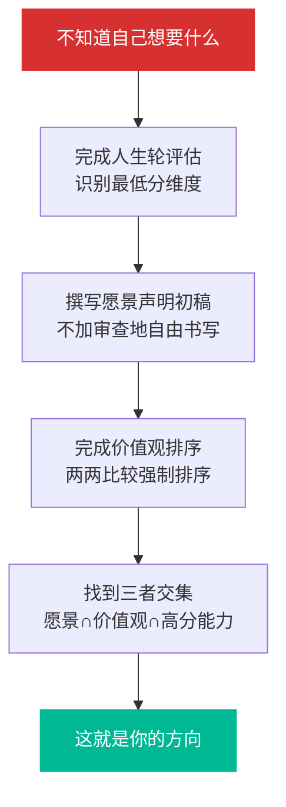
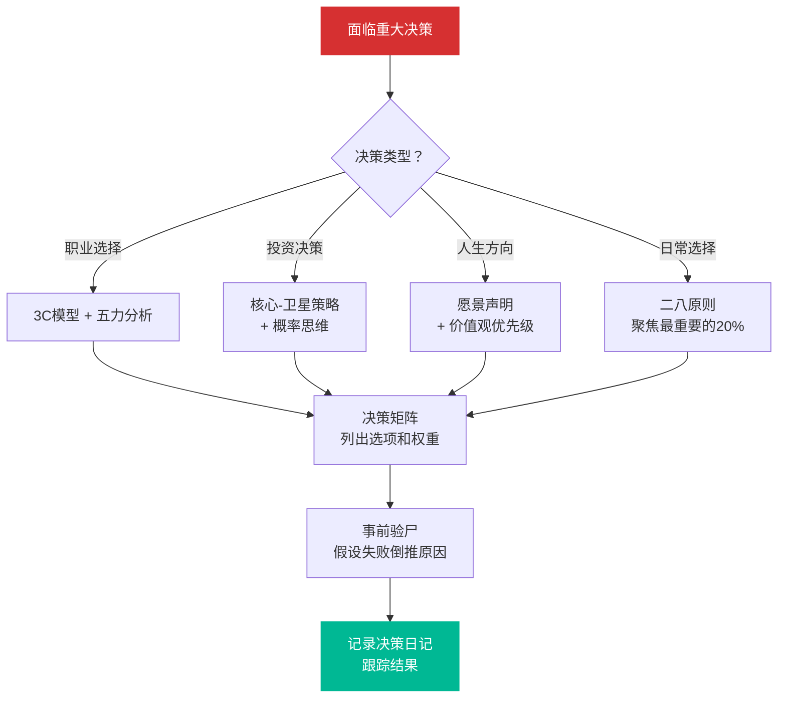
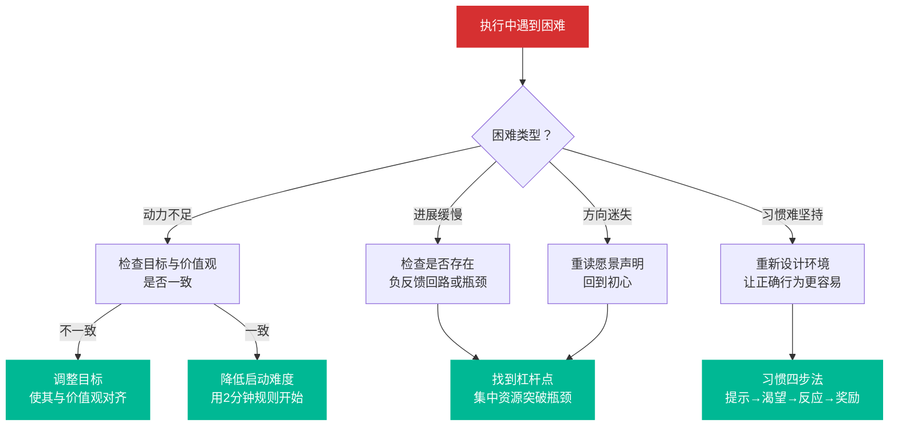
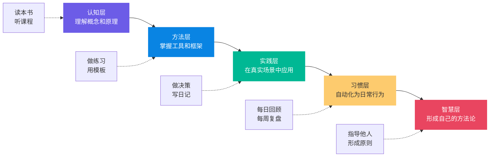

# 第八章小结：策略与规划

本章从基础理论、具体方案、产品推荐、学习路径和常见误区五个维度，系统地构建了个人策略与规划的完整知识体系。策略与规划不是一次性的工作，而是一种持续的思维习惯和行动方式。以下是本章的核心要点回顾、关键概念清单、实践清单和进阶学习建议。

## 一、本章知识全景

本章构建了一套从"道"（战略思维与哲学基础）到"法"（方法论与框架）再到"术"（具体工具与技巧）最后到"器"（软件产品与模板）的完整知识体系。以下全景图展示了各节之间的逻辑关系和知识流向：

这张全景图揭示了本章的核心逻辑：**战略思维**和**愿景价值观**构成规划的双引擎，驱动**目标设定**和**决策优化**两大核心过程，最终汇聚为**职业、财务与人生的整合蓝图**。工具和误区则分别从正面支撑和反面修正两个角度保障这个系统的有效运转。

***

## 二、核心要点回顾

### 1. 战略思维是个人发展的底层操作系统

战略思维不是企业高管的专利，而是每个人都应该具备的核心能力。它帮助你从日常琐事中抽身出来，从全局和长远的视角审视自己的人生方向。战略思维包含六大核心特征：全局性、长远性、取舍性、动态性、竞争性和资源整合性。

战略思维的知识谱系跨越了军事战略（《孙子兵法》、克劳塞维茨《战争论》、利德尔·哈特的间接路线）、商业战略（波特的竞争战略、蓝海战略、颠覆式创新）、博弈论（纳什均衡、重复博弈、信号理论）、系统思维（反馈回路、延迟效应、杠杆点）以及认知科学（认知偏差、概率思维、反脆弱）等多个领域。这些理论的共同指向是：**在资源有限的条件下，做出最优的选择组合。**

系统思维、长期主义、博弈论思维和概率思维，共同构成了战略思维的核心框架。你的时间和精力是最稀缺的资源，战略思维的本质就是如何将这些资源分配到最有价值的地方。

**关键认知**：战略思维不是天赋，而是一种可以通过刻意练习培养的技能。每天花10分钟用"上帝视角"审视自己的决策，比读10本战略书籍更有效。

### 2. 愿景、使命与价值观是规划的根基

任何有效的规划都必须建立在清晰的愿景、使命和价值观之上。愿景回答"我想去哪里"，使命回答"我为什么存在"，价值观回答"我的行为准则是什么"。三者共同构成了个人战略的"北极星"，为所有决策提供方向和判断标准。

愿景需要涵盖人生的四个层次：存在层（你想成为什么样的人）、关系层（你想拥有什么样的关系）、成就层（你想实现什么）、贡献层（你想为世界留下什么）。使命则是愿景的延伸，通常可以通过三个线索来寻找：痛苦（你最想解决的问题）、天赋（你天生擅长什么）、热爱（即使没有报酬你也愿意做的事情）。价值观是做决策时的内在指南针，当面临两难选择时，预设的价值观优先级能帮你快速做出判断。

**关键认知**：最好的目标不是那些听起来最宏大的目标，而是那些与你的核心价值观一致、能够持续激发你内在动力的目标。当目标与价值观脱节时，即使达成目标，也可能感到空虚和不满足。

### 3. 目标设定是连接愿景与行动的桥梁

从SMART目标到OKR，从层级化目标体系到身份认同驱动的目标，目标设定的方法论已经非常成熟。目标金字塔将人生目标（10-30年）逐层分解为长期目标（3-5年）、年度目标、季度目标、月度目标，直到周目标和日任务，让宏大的愿景最终落实到每天的行动中。

OKR（目标与关键结果）方法特别适合个人使用：用定性的、鼓舞人心的目标（Objective）来指明方向，用定量的、可衡量的关键结果（Key Results）来追踪进度。目标追踪系统则需要覆盖日追踪（每天3件最重要的事）、周回顾、月复盘、季审视和年总结五个层次。

**关键认知**：目标设定的关键不在于数量，而在于聚焦和优先级。每个季度最多设定3个核心目标，用"如果只能做一件事，那是什么？"来检验你的目标清单。

### 4. 决策质量决定了人生轨迹

人生就是由无数个大大小小的决策组成的。理解理性决策模型、有限理性、反脆弱决策和概率思维，可以帮助你在面对选择时做出更明智的判断。

决策中最常见的认知偏差包括：确认偏差（只看到支持自己观点的信息）、锚定效应（被初始信息过度影响）、损失厌恶（对损失的敏感度远高于收益）、沉没成本谬误（因为已经投入而不愿放弃）、从众效应（跟随大多数人的选择）、光环效应（因为某个优点而全面高估）、幸存者偏差（只看到成功案例而忽略失败案例）。

提升决策质量的核心方法包括：建立决策日记（记录决策过程和结果，定期回顾）、做"事前验尸"（假设计划失败，倒推可能的原因）、使用决策矩阵进行系统分析、运用概率思维而非确定性思维来评估选项。

**关键认知**：好的决策不等于好的结果。你能控制的是决策过程的质量，而不是结果。建立决策日记，持续改进你的决策过程。

### 5. 职业、财务与人生规划需要整合

职业规划、财务规划和人生规划不是三个独立的项目，而是一个整合系统的三个维度。职业为财务提供收入来源，财务为人生自由提供保障，人生愿景为职业和财务提供方向。三者相互支撑、缺一不可。

在职业规划方面，赛道选择是最重要的战略决策。用"3C模型"（Company公司、Category品类、Competence能力）来评估赛道，用"双轨制"（主赛道+副赛道）来分散风险，用"T型人才"模型来构建能力——在一个领域有深度，在多个领域有广度。

在财务规划方面，核心路径是：优化主动收入→建立被动收入→被动收入超越主动收入。投资策略采用"核心-卫星"配置（60-80%的低成本宽基指数基金 + 20-40%的卫星资产），同时做好风险管理（6个月紧急备用金、保险配置、仓位管理）。

在人生规划方面，需要涵盖健康、关系、成长、意义等多个维度，追求"整合"而非简单的"平衡"。人生不同阶段有不同的重心，关键是找到不同领域之间的协同效应。

**关键认知**：不要孤立地做任何一个领域的规划，要看到它们之间的联系和相互影响。职业、财务和人生是一个相互支撑的系统。

### 6. 工具和方法论是手段，不是目的

无论是日历应用、任务管理软件还是各种规划模板，都只是帮助你实现目标的工具。不要沉迷于工具本身的收集和整理，而忽略了真正重要的执行和产出。

**关键认知**：最好的工具是你真正会持续使用的那个。选择一个任务管理工具、一个日历、一个笔记系统，然后坚持使用，远比不断切换新工具更有效。

### 7. 避免常见误区比学习新方法更重要

本章梳理了20个最常见的规划误区，涵盖了从思维模式到行为习惯的方方面面。很多时候，阻碍你进步的不是缺少新知识，而是陷入了旧的思维和行为误区。定期对照这些误区检查自己，往往比学习10个新方法更有效。

**关键认知**：先堵住漏洞，再注入新水。最常见的误区包括：把忙碌当作生产力、设定过多目标、只做规划不执行、忽视环境和系统的力量、缺乏定期回顾和调整、完美主义陷阱、忽视风险和备用方案、盲目模仿他人、目标与价值观脱节、低估复利效应等。

***

## 三、七大核心要点的内在逻辑

以上七个要点并非独立存在，它们之间形成了一个层层递进、相互支撑的逻辑闭环。理解这个闭环，才能真正将本章知识内化为能力：

这个闭环的运转逻辑是：

1. **战略思维**为你提供分析问题的思维框架（系统思维、博弈论、概率思维）
2. **愿景·使命·价值观**在战略思维的支撑下，帮你确定人生方向
3. **目标设定**将方向转化为可执行的里程碑和日常任务
4. **决策优化**确保你在执行过程中做出高质量的选择
5. **整合规划**让职业、财务、人生三个维度相互支撑、形成合力
6. **工具**放大上述每一步的效率
7. **误区规避**从反面修正整个系统的偏差

任何一个环节的缺失都会导致系统失灵：没有战略思维，愿景就是空想；没有愿景，目标就是瞎忙；没有好的决策，执行就会跑偏；没有整合，各个领域就会相互拖累。

***

## 四、关键概念清单

以下梳理本章涉及的核心概念，按类别整理，便于查阅和回顾。

### 战略思维类

| 概念 | 定义 | 个人应用场景 | 实践要点 |
|------|------|-------------|----------|
| 系统思维 | 从事物之间的相互联系和动态变化来理解问题的思维方式 | 分析你生活中的正反馈和负反馈回路 | 画出你当前生活领域的因果回路图，识别杠杆点 |
| 长期主义 | 以长远视角做决策，不被短期利益迷惑 | 选择能带来长期复利的行动，而非即时满足 | 每次重大决策前问："10年后的我会如何看待这个选择？" |
| 博弈论思维 | 考虑他人行为对自己决策影响的思维方式 | 职业竞争中的策略选择、合作与竞争的平衡 | 分析关键利益相关者的可能反应，制定应对策略 |
| 概率思维 | 用概率而非确定性来评估可能的结果 | 重大决策中的风险评估和期望值计算 | 为每个选项估算成功概率和期望收益，而非二元判断 |
| 第一性原理 | 回到最基本的事实和假设，从头推导结论 | 打破行业惯例和个人思维定式 | 面对"行业惯例"时追问："这个假设的依据是什么？" |
| 反脆弱性 | 在不确定性和冲击中不仅存活还能获益的能力 | 用杠铃策略设计职业和投资组合 | 85%资源投入低风险领域，15%投入高潜力领域 |
| 杠杆点 | 系统中能产生最大影响的关键干预点 | 找到你人生中投入产出比最高的领域 | 识别并聚焦于"四两拨千斤"的关键行动 |
| 间接路线战略 | 通过迂回和差异化而非正面硬碰来获得优势 | 在竞争激烈的领域寻找差异化定位 | 当正面竞争无法取胜时，寻找迂回路径 |

### 目标与规划类

| 概念 | 定义 | 个人应用场景 | 实践要点 |
|------|------|-------------|----------|
| SMART原则 | 目标应具体、可衡量、可实现、相关、有时限 | 设定任何具体目标时的基本检验标准 | 每个目标都用SMART五要素逐一检验 |
| OKR | 目标与关键结果法，用定性目标+定量指标来管理目标 | 季度个人目标管理 | 每季度设3个O，每个O下3个KR，完成率60-70%为佳 |
| 目标金字塔 | 从人生目标到日任务的多层分解体系 | 将宏大愿景转化为每天的行动 | 确保每一层目标都能追溯到上一层的战略意图 |
| 身份认同驱动目标 | 基于"我想成为什么样的人"来设定目标 | 让目标与自我认同一致，提升内在动力 | 用"我是……的人"来定义目标，而非"我要做……" |
| 人生轮 | 涵盖8个人生维度的综合评估工具 | 定期审视人生各维度的满意度和平衡 | 每季度重评一次，观察趋势变化 |
| 人生愿景声明 | 对理想人生终极描绘的书面表达 | 为所有决策提供方向和判断标准 | 每半年重读并修订，确保仍然心动 |

### 职业与竞争类

| 概念 | 定义 | 个人应用场景 | 实践要点 |
|------|------|-------------|----------|
| 五力模型 | 分析行业竞争强度的五种力量 | 评估你所在领域的竞争格局 | 逐一评估五力的强弱，识别行业的关键成功因素 |
| 三大竞争战略 | 成本领先、差异化、聚焦 | 确定你的个人竞争策略 | 选择一种主导策略，避免"夹在中间" |
| 蓝海战略 | 开创新的市场空间而非在红海中竞争 | 寻找竞争较少的职业赛道 | 用"剔除-减少-增加-创造"四步框架重新定义你的价值主张 |
| T型人才 | 在一个领域有深度，多个领域有广度 | 能力构建的指导模型 | 选定一个"纵向"深度领域，搭配2-3个"横向"辅助技能 |
| 核心竞争力 | 有价值、稀缺、难以模仿的能力组合 | 识别和发展你最具价值的能力 | 用VRIO框架评估你的每一项能力 |
| 个人商业模式画布 | 用商业模式九要素来分析个人职业 | 系统地审视你的职业价值创造过程 | 每年更新一次画布，观察各要素的变化 |
| 赛道3C模型 | Company+Category+Competence三维评估 | 选择最佳职业赛道 | 三个C都打高分的赛道才是最佳选择 |
| 颠覆式创新 | 从低端或新兴市场切入，逐步颠覆主流市场 | 警惕被新技术颠覆，主动颠覆自己 | 定期扫描可能颠覆你领域的新兴技术和模式 |

### 财务与投资类

| 概念 | 定义 | 个人应用场景 | 实践要点 |
|------|------|-------------|----------|
| 资产vs负债 | 能产生现金流的是资产，消耗现金流的是负债 | 重新审视你的"资产"清单 | 自住房产是负债而非资产，除非它产生租金收入 |
| 核心-卫星策略 | 大部分投资放在低成本指数基金，小部分追求超额回报 | 构建个人投资组合 | 核心部分70-80%配置宽基指数，卫星部分20-30%配置行业/主题 |
| 定投策略 | 定期定额投资，降低择时风险 | 最适合普通人的投资方式 | 设定自动扣款，避免情绪化操作 |
| 财务韧性 | 能承受多大的财务冲击而不崩溃 | 评估和提升你的财务安全感 | 确保6个月紧急备用金到位后再考虑投资 |
| 收入四象限 | 主动收入（雇佣/自雇）和被动收入（系统/资产） | 规划收入多元化路径 | 逐步将收入重心从左侧（主动）向右侧（被动）转移 |
| 复利效应 | 收益再投资产生指数级增长 | 长期投资和技能积累的心理模型 | 关键是"持续"和"耐心"，前期增长缓慢是正常的 |

### 决策与认知类

| 概念 | 定义 | 个人应用场景 | 实践要点 |
|------|------|-------------|----------|
| 确认偏差 | 只关注支持自己观点的信息 | 重大决策时主动寻找反对意见 | 指定一位"魔鬼代言人"来挑战你的决策 |
| 锚定效应 | 被初始信息过度影响 | 谈判和评估中保持独立判断 | 在谈判前先确定自己的底线和替代方案 |
| 损失厌恶 | 对损失的敏感度远高于对收益的敏感度 | 投资决策中克服恐惧心理 | 用"如果不做会损失什么"来重新框架问题 |
| 沉没成本谬误 | 因为已投入的不可回收成本而继续投入 | 学会"及时止损" | 决策时忽略已投入成本，只看未来收益和成本 |
| 事前验尸 | 假设计划已经失败，倒推可能的原因 | 重大决策前的风险评估 | 在正式启动项目前，召开一次"事前验尸"会议 |
| 红队思维 | 扮演反对者来挑战自己的计划 | 验证计划的稳健性 | 找一位信任的朋友扮演"红队"来攻击你的计划 |
| 贝叶斯更新 | 根据新信息不断修正你的判断 | 持续优化决策的准确度 | 每获得新信息时，有意识地更新你的概率估计 |

### 系统与习惯类

| 概念 | 定义 | 个人应用场景 | 实践要点 |
|------|------|-------------|----------|
| 正反馈回路 | 放大变化，产生指数级增长或衰退 | 设计让你越做越好的良性循环 | 识别并强化你生活中的正反馈回路 |
| 负反馈回路 | 抑制变化，维持系统平衡 | 识别并打破制约发展的瓶颈 | 找到系统中的"瓶颈约束"，优先解决 |
| 延迟效应 | 行动的结果不会立即显现 | 理解复利前期缓慢进展的正常性 | 设定合理预期，避免因短期看不到效果而放弃 |
| 习惯四步法 | 提示→渴望→反应→奖励 | 设计和培养新习惯 | 让提示显而易见，让渴望有吸引力，让反应简便易行，让奖励令人满足 |
| 环境设计 | 通过改变环境来影响行为 | 让正确的行为变容易，错误的行为变困难 | 重新设计你的物理环境和数字环境 |
| 深度工作 | 在无干扰状态下进行的高认知要求活动 | 提升工作产出质量和效率 | 每天固定2-4小时深度工作时间，关闭所有通知 |
| 以牙还牙策略 | 首先合作，然后模仿对方上一次的选择 | 人际合作中的长期博弈策略 | 长期关系中先善意合作，但对背叛行为及时回应 |

***

## 五、实践清单

以下清单按时间维度整理，帮助你将本章所学转化为实际行动。每个行动项都标注了对应的本章知识点，方便你查阅详细方法。

### 本周行动（立即启动）

- [ ] **做一次全面的自我评估**（对应：人生轮工具）：花1-2小时完成人生轮评估（健康、职业、财务、关系、个人成长、娱乐、环境、精神8个维度），给每个维度打分（1-10分），识别当前最需要关注的2-3个领域。画出雷达图，直观看到各维度的差距
- [ ] **撰写个人愿景声明初稿**（对应：愿景·使命·价值观）：花1小时不加审查地写下你对理想人生的所有想象，提炼核心主题，压缩成200-300字的愿景声明。不需要完美，关键是把模糊的感觉变成文字
- [ ] **建立决策日记**（对应：决策质量提升方法）：准备一个笔记本或数字文档，开始记录每天的重要决策，包括决策内容、考虑的因素、最终选择和预期结果。格式可以简化为：日期 + 决策内容 + 选择理由 + 预期结果
- [ ] **审视当前目标清单**（对应：目标聚焦原则）：如果你有目标清单，对照"如果只能做一件事"的原则，砍掉那些次要目标，保留不超过3个核心目标。将被砍掉的目标放入"暂存清单"而非删除
- [ ] **完成一次认知偏差自检**（对应：七大认知偏差）：回顾过去一周你做的5个重要决策，用确认偏差、锚定效应、损失厌恶等框架逐一检查，看看哪些决策可能受到了偏差影响

### 本月行动（建立基础）

- [ ] **完成个人SWOT分析**（对应：战略分析工具）：系统梳理你的优势（Strengths）、劣势（Weaknesses）、机会（Opportunities）和威胁（Threats），写成一份书面报告。每个象限至少列出5条具体事项，每条附带简要说明
- [ ] **制定一份整合性的个人发展蓝图**（对应：职业·财务·人生整合规划）：涵盖职业、财务、健康、关系和个人成长五个维度，设定年度目标和季度里程碑。确保各维度目标之间相互支撑而非冲突
- [ ] **建立记账习惯**（对应：财务规划基础）：使用随手记、钱迹或类似工具，连续记录一个月的收支，分析你的消费模式和储蓄率。重点关注"钱去了哪里"而非"应该花多少"
- [ ] **建立回顾系统**（对应：目标追踪五层体系）：设定每周日晚上30分钟的固定回顾时间，回顾本周目标完成情况，设定下周重点。坚持4周后，这个习惯就会自动化
- [ ] **完成价值观排序**（对应：价值观优先级）：列出你最重要的10个价值观，通过两两比较进行强制排序，得到清晰的优先级列表。这个排序将在未来无数个两难决策中为你提供判断标准
- [ ] **做一次职业赛道评估**（对应：赛道3C模型）：用3C模型评估你当前所在赛道的前景，思考是否需要调整方向。分别给Company、Category、Competence打分（1-10），计算综合得分

### 季度行动（深化实践）

- [ ] **制定并执行季度OKR**（对应：OKR方法论）：设定3个核心目标和对应的关键结果，每周追踪进度。理想的OKR完成率是60-70%——太低说明目标不切实际，太高说明目标不够有挑战性
- [ ] **完成一次重大决策的系统分析**（对应：决策矩阵·事前验尸）：选择一个你面临的重要决策，用决策矩阵进行分析，做"事前验尸"，记录决策过程。分析完成后，将决策过程和结果记入决策日记
- [ ] **开始投资实践**（对应：核心-卫星策略·定投）：研究并选择适合自己的指数基金，开设账户，开始每月定投（金额根据自身情况）。先从宽基指数基金开始，熟悉后再考虑卫星配置
- [ ] **完成基础保险配置**（对应：风险管理）：评估个人风险敞口，配置重疾险、医疗险、意外险等基础保障。优先保障经济支柱（如果家庭有依赖你收入的人）
- [ ] **建立3-5个关键习惯**（对应：习惯四步法·环境设计）：选择对你最重要的习惯，用"习惯四步法"和"环境设计"来培养，进行30天习惯养成实验。每次只培养一个新习惯，成功后再添加下一个
- [ ] **进行5次信息访谈**（对应：职业探索）：与你感兴趣领域的从业者交流，了解真实的行业状况和发展路径。每次访谈准备10个问题，访谈后写总结笔记
- [ ] **建立深度工作习惯**（对应：深度工作理论）：每天安排2-4小时的深度工作时间，关闭所有通知和干扰。从每天1小时开始，逐步增加时长

### 半年行动（系统整合）

- [ ] **回顾并修正愿景声明**（对应：愿景动态更新）：重读你的愿景，看看它是否仍然让你心动，根据成长进行调整。愿景不是一成不变的，它应该随着你的认知升级而进化
- [ ] **做一次全面的目标复盘**（对应：目标追踪系统）：审视年度目标的完成情况，分析哪些做得好、哪些需要调整。重点关注"偏差原因"——是目标设定有问题，还是执行有问题？
- [ ] **建立知识管理体系**（对应：信息处理能力）：用Notion、Obsidian或类似工具建立个人知识库，养成"输入-处理-输出"的学习习惯。知识只有经过处理和输出才能真正内化
- [ ] **审视财务健康指标**（对应：财务规划）：计算储蓄率、负债收入比、应急储备月数，与半年前对比。设定下一年的财务目标
- [ ] **扩展弱关系网络**（对应：社会资本）：参加2-3个行业活动或社群，建立桥梁性社交资本。弱关系（不太熟的人）往往比强关系带来更多新机会

### 持续行动（长期习惯）

- [ ] **每周回顾**：每周日晚上30分钟，回顾本周目标完成情况，设定下周重点。这是一切规划系统的基础——没有回顾的规划等于没有规划
- [ ] **每月复盘**：每月最后一天1小时深度复盘，调整下月计划。除了目标完成度，还要复盘"决策质量"和"习惯执行率"
- [ ] **每季审视**：每季度半天时间做战略回顾，审视OKR完成情况，必要时调整方向。季度审视是"战术"和"战略"的连接点
- [ ] **每年总结**：每年年底做全面总结和新年规划，重读愿景声明。年度总结应该涵盖人生的所有维度，而不仅仅是工作
- [ ] **维护决策日记**：持续记录重大决策，定期回顾决策质量的变化。每隔3个月回顾一次，你会惊讶于自己决策能力的提升
- [ ] **对照误区自检**：每月对照本章的20个常见误区检查自己的思维和行为模式。重点关注那些你最容易犯的误区
- [ ] **持续投资自己**：按照学习路径的五个阶段，持续提升策略与规划能力。学习不是目的，应用才是

***

## 六、实践决策树：遇到具体情况如何选择

在实际生活中，你常常需要快速做出判断。以下决策树将本章的核心方法浓缩为几个关键分支，帮助你在不同场景下选择合适的工具和方法：

### 场景一：不知道自己想要什么

### 场景二：面临重大决策

### 场景三：执行中遇到困难

***

## 七、常见问题排查指南

在实践本章内容的过程中，你很可能会遇到以下问题。这里提供了具体的原因分析和解决方案，帮助你快速恢复正轨。

### 问题1：制定了计划但总是执行不了

**可能原因**：
- 目标过大，启动成本太高（心理学中的"行动阻力"效应）
- 缺乏环境支撑，正确行为需要太多意志力
- 目标与当前身份认同不一致（"我不是那种早起的人"）

**解决方案**：
1. 用"2分钟规则"降低启动门槛：想跑步？先只穿上跑鞋；想写作？先只打开文档写一句话
2. 重新设计环境：把跑鞋放在床边、把手机放在另一个房间、把零食藏起来
3. 身份重塑：把"我要跑步"改为"我是一个跑步的人"，从最小的身份认同开始

### 问题2：设定了很多目标但都没有进展

**可能原因**：
- 目标数量过多，注意力被分散（注意力切换成本极高）
- 缺乏优先级排序，平均分配精力
- 没有将目标分解为可执行的日常任务

**解决方案**：
1. 用"如果只能做一件事"测试，砍到只剩3个核心目标
2. 用艾森豪威尔矩阵区分紧急/重要，优先做"重要但不紧急"的事
3. 将每个目标分解为本周就能开始的第一步行动

### 问题3：做了规划但总是被意外打断

**可能原因**：
- 规划过于刚性，没有留出缓冲时间
- 没有区分"计划内时间"和"响应时间"
- 缺乏应对干扰的预设策略

**解决方案**：
1. 采用"时间块"方法：每天只规划60%的时间，留40%作为缓冲
2. 设定"响应窗口"：只在固定时间段查看消息和邮件
3. 预设"如果-那么"计划：如果被临时会议占用，那么把深度工作移到下午

### 问题4：回顾时发现决策质量不高

**可能原因**：
- 决策时受到情绪影响（恐惧、贪婪、焦虑）
- 没有使用系统化的决策工具
- 信息不足或过度自信

**解决方案**：
1. 重大决策前给自己"冷静期"：至少等24小时再做最终决定
2. 使用决策矩阵和事前验尸等结构化工具
3. 刻意寻找反对意见，主动挑战自己的假设
4. 建立决策日记，定期回顾，追踪决策偏差模式

### 问题5：感觉规划太复杂，不知道从哪里开始

**可能原因**：
- 试图一次性建立完整的规划系统（完美主义陷阱）
- 被太多方法论淹没，陷入"分析瘫痪"
- 没有从最简单的行动开始

**解决方案**：
1. 从"每周回顾"这一个习惯开始，坚持4周后再添加其他
2. 先用纸笔，不要花时间研究工具——工具可以后面再优化
3. 记住：不完美的行动胜过完美的计划

### 问题6：坚持了一段时间后失去动力

**可能原因**：
- 没有看到即时回报（延迟效应）
- 缺乏外部反馈和社交支持
- 目标不再与内心真实需求一致

**解决方案**：
1. 建立"小胜庆祝"机制：每完成一个里程碑就给自己一个奖励
2. 找一个accountability partner（问责伙伴），定期分享进展
3. 重新审视目标：它是否仍然让你心动？如果不动心，调整方向是正确的

### 问题7：不知道如何评估自己的进步

**可能原因**：
- 缺乏量化指标，只有模糊的感觉
- 没有建立基线数据，无法对比
- 评估频率太低，错过调整窗口

**解决方案**：
1. 为每个核心目标设定2-3个可量化的关键结果
2. 在开始时记录基线数据（当前水平），作为未来对比的参照
3. 建立多层回顾体系：日追踪 → 周回顾 → 月复盘 → 季审视 → 年总结

***

## 八、进阶学习建议

### 第一阶段：夯实基础（1-3个月）

**必读书籍**：
1. 《思考，快与慢》——丹尼尔·卡尼曼：理解人类思维的两个系统和常见认知偏差，是所有决策学习的起点。重点阅读第一部分（两个系统）和第二部分（启发式与偏差）
2. 《穷查理宝典》——查理·芒格：学习多元思维模型，建立跨学科的思维工具箱。重点关注"人类误判心理学"章节
3. 《高效能人士的七个习惯》——史蒂芬·柯维：个人管理领域的经典，特别关注"以终为始"和"要事第一"两个习惯

**推荐课程**：
- Coursera《Learning How to Learn》（Barbara Oakley）：学习如何高效学习，是所有学习的基础。课程免费，4周完成
- Coursera《Model Thinking》（Scott Page）：系统介绍多种思维模型，包括博弈论、网络模型、系统动力学等

**核心实践**：
- 每天记录3个决策，分析背后的思维过程
- 完成个人SWOT分析和人生轮评估
- 制定第一季度OKR并开始执行
- 开始写决策日记，坚持30天

### 第二阶段：深化方法论（3-6个月）

**必读书籍**：
1. 《好战略，坏战略》——理查德·鲁梅尔特：区分真正的战略和"愿望清单"。重点理解"杠杆点"和"连贯性行动"概念
2. 《原子习惯》——詹姆斯·克利尔：掌握习惯养成的四大定律。重点关注环境设计和身份认同两个维度
3. 《深度工作》——卡尔·纽波特：在注意力稀缺时代建立深度工作的能力。学习四种深度工作哲学
4. 《富爸爸穷爸爸》——罗伯特·清崎：建立正确的财务观念。重点关注"资产vs负债"和"收入四象限"概念

**推荐课程**：
- 得到App《宁向东的管理学课》：系统学习管理学核心知识，理解组织行为和决策
- Coursera《Financial Markets》（耶鲁大学，罗伯特·席勒）：金融市场全景，适合零基础的投资者

**核心实践**：
- 建立稳定的记账和投资习惯
- 完成职业探索报告，进行5次以上信息访谈
- 开始指数基金定投（即使金额很小）
- 建立深度工作的日常习惯，每天至少2小时
- 用个人商业模式画布分析自己的职业

### 第三阶段：整合应用（6-12个月）

**必读书籍**：
1. 《反脆弱》——纳西姆·塔勒布：学会在不确定性中获益。重点理解杠铃策略和"可选择性"概念
2. 《第五项修炼》——彼得·圣吉：掌握系统思维的核心概念。重点关注反馈回路、延迟效应和杠杆点
3. 《创新者的窘境》——克莱顿·克里斯坦森：理解颠覆式创新的逻辑，警惕被颠覆。重点理解"价值网络"和"破坏性技术"
4. 《聪明的投资者》——本杰明·格雷厄姆：建立价值投资的正确理念。重点理解"安全边际"和"市场先生"隐喻

**推荐课程**：
- 得到App《万维钢·精英日课》：科学思维和理性决策，每天10分钟持续学习
- edX《Strategic Management》（哥本哈根商学院）：战略管理基础，适合有一定基础的学习者

**核心实践**：
- 用决策矩阵、事前验尸、红队思维等高级工具分析重大决策
- 进行30天深度工作实验，量化产出变化
- 制定完整的年度规划并持续执行
- 建立个人知识管理系统，实现"输入-处理-输出"闭环
- 完成一次完整的投资组合配置

### 第四阶段：融会贯通（12个月以上）

**进阶书籍**：
1. 《孙子兵法》（推荐华杉注释版）：古代战略智慧的源头。重点理解"知彼知己""不战而胜""以正合以奇胜"等核心思想
2. 《商业模式新生代》——亚历山大·奥斯特瓦尔德：用商业模式画布审视个人职业。每年更新一次你的画布
3. 《纳瓦尔宝典》——埃里克·乔根森：关于财富、幸福和人生哲学的深刻洞察。重点关注"杠杆"和"专属知识"概念
4. 《金钱心理学》——摩根·豪泽尔：从心理学角度理解金钱和投资行为。重点理解"尾部事件"和"复利的非线性"
5. 《精益创业》——埃里克·莱斯：将人生规划视为一个"精益实验"。重点理解"构建-测量-学习"循环
6. 《漫步华尔街》——伯顿·马尔基尔：投资领域的经典，理解市场效率。适合在开始投资实践后阅读
7. 《超越智商》——基思·斯坦诺维奇：提升理性思维能力。重点理解"理性"和"智商"的区别

**推荐播客**：
- 《知行小酒馆》：投资理财和生活方式，适合中文听众入门
- 《得意忘形》：哲学、心理学和自我认知的深度思考
- 《硅谷101》：科技商业洞察，拓展视野
- Farnam Street（fs.blog）：英文世界的思维模型和决策资源，质量极高
- 《纳瓦尔宝典》播客版：Naval Ravikant的原始访谈，比书更生动

**核心实践**：
- 指导他人学习策略与规划（教是最好的学，费曼学习法的最佳实践）
- 建立个人方法论体系，形成自己的"原则"文档（参考达利欧《原则》的格式）
- 定期进行战略回顾和方向调整（每季度半天，每年一整天）
- 持续迭代和优化你的个人规划系统
- 尝试将策略思维应用到新领域（如创业、投资、公益）

### 推荐思考问题

在学习过程中，定期用以下问题来深化你的思考。建议每月选择1-2个问题，花30分钟深度思考并写下答案：

**关于方向**：
- 如果你只能在剩下的职业生涯中做一件事，那件事是什么？它是否与你的核心价值观一致？
- 你的人生愿景是什么？你当前的行动是否指向那个方向？哪些行动在推动你前进，哪些在拖你后腿？
- 如果五年后的你回头看今天，你会希望自己做了什么决定？你今天就可以开始做的是什么？

**关于效率**：
- 你当前最大的时间黑洞是什么？它如何影响了你的长期目标？你打算如何处理它？
- 你的人生中有哪些正反馈回路在帮助你成长？有哪些负反馈回路在制约你？你如何打破那些恶性循环？
- 你每天有多少时间在做"重要但不紧急"的事？这个比例如何提升？

**关于决策**：
- 你最近做的一个重要决策是什么？你的决策过程是怎样的？如果重新来过，你会做出同样的选择吗？
- 你有没有因为沉没成本而继续投入一个明显不值得的项目？你如何判断"及时止损"的时机？
- 你的决策中最常出现的认知偏差是哪一种？你有什么对策？

**关于竞争力**：
- 你的核心竞争力是什么？它是否足够稀缺和难以模仿？如果有人要颠覆你，他会从哪里入手？
- 你的能力结构是"I型"（只有深度）还是"T型"（深度+广度）？你需要补充哪些横向能力？
- 你所在的赛道，五力模型中哪个力量最强？这对你的职业策略意味着什么？

***

## 九、学习路径总结

本章涉及的知识领域广泛，从战略思维到具体工具，从认知科学到财务规划。以下总结了从"知道"到"做到"的完整路径：

大多数人卡在"认知层"和"方法层"之间——他们读了很多书、学了很多方法，但从未真正应用。突破的关键是：**从最小的可执行行动开始，立刻行动。** 不要等到"准备好了"再开始，因为"准备好了"永远不会到来。

***

## 本章总结

策略与规划不是一次性的工作，而是一种持续的思维习惯。当你养成了定期审视方向、科学设定目标、理性做出决策的习惯，你就拥有了在不确定的世界中持续前行的指南针。

记住本章的三个核心原则：

1. **方向比速度更重要**：在错误的赛道上奔跑，跑得越快偏离越远。先确保方向正确，再提升执行速度。
2. **系统比意志力更可靠**：依赖意志力的计划终将失败，设计良好的系统才能持续运转。让正确的行为变得容易，让错误的行为变得困难。
3. **过程比结果更可控**：你无法控制结果，但可以控制决策过程的质量。专注于你能控制的，接受你不能控制的，持续改进你能影响的。

策略与规划的学习是一个螺旋上升的过程。你不需要一次性掌握所有内容，而是从最需要的地方开始，在实践中不断深化理解，在回顾中持续优化方法。只要方向正确，每一步都算数。

下一章，我们将探讨个人发展中另一个关键领域——社交。良好的社交能力不仅关乎职业发展，更是幸福人生的重要组成部分。
