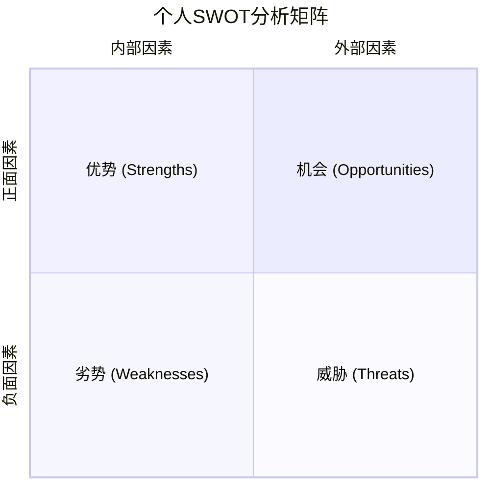
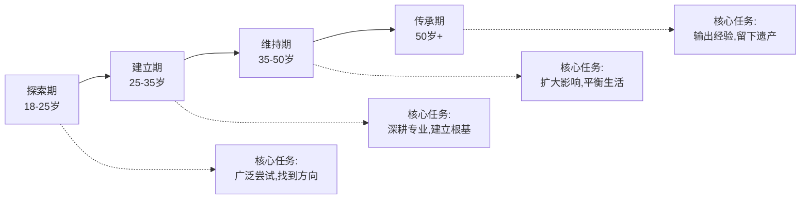
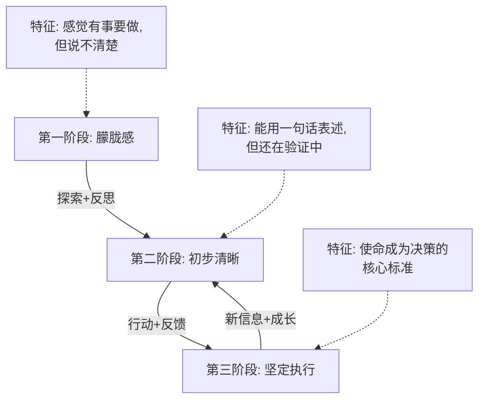
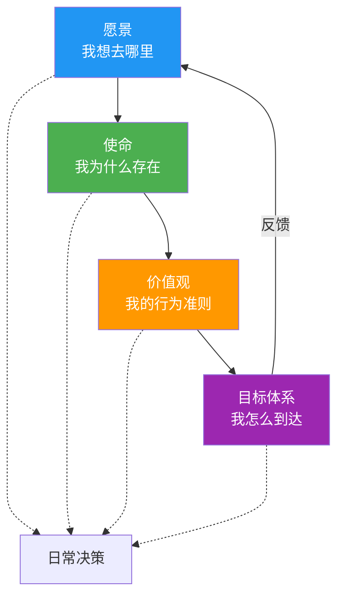

## 一、人生战略规划框架

人生战略规划不是写一份漂亮的年度计划然后束之高阁，而是建立一套持续运转的决策系统——它帮你回答三个根本问题：**我要去哪里？我现在在哪里？我怎么从这里到那里？** 本节将构建一个完整的框架，从愿景到日常行动，从自我评估到资源调配，让你拥有一个可执行、可迭代的人生操作系统。

### 1.1 为什么需要人生战略

大多数人的人生是"反应式"的：考试来了才复习，公司裁员了才想转型，身体出问题了才想到锻炼。这种模式的问题在于——你永远在被动应对，永远被环境推着走。

战略思维的本质是**主动设计**。就像一家公司不会等到市场崩溃才想对策，你也不应该等到人生危机才思考方向。战略规划的价值体现在三个层面：

| 层面 | 没有战略的人生 | 有战略的人生 |
|------|--------------|------------|
| **方向感** | 随波逐流，被环境裹挟 | 有清晰的北极星，知道为什么做每件事 |
| **决策效率** | 每次选择都从零开始分析 | 有预设的决策框架，快速判断 |
| **心理韧性** | 遇到挫折容易迷失 | 知道当下的痛苦服务于什么目标 |
| **资源利用** | 精力分散，什么都做一点 | 聚焦关键领域，产生复利效应 |
| **长期回报** | 线性增长甚至原地踏步 | 指数级成长，积累不可替代的优势 |

**一个关键认知**：战略规划不是预测未来，而是提高你在不确定环境中的适应能力。就像军事战略家赫尔穆特·冯·毛奇说的："没有任何作战计划在与敌人接触后还能存活。"但他同样强调："为战争做计划的过程是不可或缺的。"人生规划也是如此——计划的价值不仅在于结果，更在于规划过程中培养的思维能力。

### 1.2 自我评估：认识真实的自己

在制定任何战略之前，你必须先搞清楚"我现在在哪里"。很多人规划失败的根本原因不是目标不对，而是对自己的认知有偏差。

#### 1.2.1 个人SWOT分析

SWOT分析不只是企业管理工具，它对个人同样有效：



**如何做一次诚实的SWOT自评：**

**优势（Strengths）** ——你比大多数人做得好的事情：
- **技能盘点**：列出你掌握的所有技能，按熟练度打分（1-10分）。包括硬技能（编程、写作、数据分析）和软技能（沟通、领导力、同理心）
- **成就回顾**：过去5年你最骄傲的3-5件事，分析其中你运用了哪些能力
- **他人反馈**：问5个了解你的人："你认为我最突出的优势是什么？"对比自我认知的差异
- **天赋识别**：什么事情你做起来毫不费力，别人却觉得很难？这往往是天赋的信号

**劣势（Weaknesses）** ——拖你后腿的因素：
- **失败复盘**：过去5年你最遗憾的3-5件事，分析失败中暴露的短板
- **回避清单**：你一直在拖延或回避的事情是什么？回避往往意味着能力不足或信心不够
- **身体信号**：什么事情做完后让你精疲力竭？持续的能量消耗说明你在用劣势硬撑
- **诚实面对**：问自己"如果我只能改进一个弱点，哪个对我的人生影响最大？"

**机会（Opportunities）** ——你可以利用的外部条件：
- **行业趋势**：你所在行业/领域的增长点在哪里？哪些新兴领域与你的技能匹配？
- **人脉网络**：你认识哪些人可以帮你打开新的可能性？
- **时代红利**：当前时代提供了哪些前人没有的机会？（远程工作、AI工具、全球化市场等）
- **地理优势**：你所在城市/地区有什么独特的资源和机会？

**威胁（Threats）** ——可能阻碍你的外部因素：
- **竞争压力**：谁在和你争夺同样的机会？他们的优势是什么？
- **技术替代**：你的核心技能是否面临被自动化/AI替代的风险？
- **健康风险**：你的生活方式是否在透支健康？
- **经济环境**：宏观经济变化对你的行业和个人财务有什么影响？

#### 1.2.2 资源盘点

战略不仅要考虑"想做什么"，还要考虑"有什么可用的资源"：

| 资源类型 | 具体内容 | 盘点方法 |
|---------|---------|---------|
| **时间** | 每周可自由支配的小时数 | 记录一周的时间日志，计算扣除工作/通勤/必要生活后的自由时间 |
| **精力** | 一天中精力最旺盛的时段 | 连续一周每2小时记录精力水平（1-10分），找到高能量区间 |
| **金钱** | 可用于投资自己的资金 | 计算月收入扣除固定支出后的可支配金额 |
| **技能** | 已掌握的能力及其市场价值 | 对照招聘网站的岗位要求评估自己的技能定价 |
| **人脉** | 可以求助、合作、学习的人 | 绘制你的人脉地图，标注每段关系的深度和可调动性 |
| **信息** | 获取优质信息的渠道 | 评估你的信息来源质量：是否有行业专家、优质社群、付费数据库？ |

#### 1.2.3 生命周期定位

不同人生阶段的战略重点完全不同。你首先需要判断自己处于哪个阶段：



**各阶段的战略优先级对比：**

| 阶段 | 职业 | 财务 | 关系 | 健康 | 学习 |
|------|------|------|------|------|------|
| 探索期 | ★★★★★ | ★★ | ★★★ | ★★★★ | ★★★★★ |
| 建立期 | ★★★★★ | ★★★★ | ★★★★ | ★★★★ | ★★★★ |
| 维持期 | ★★★★ | ★★★★★ | ★★★★★ | ★★★★★ | ★★★ |
| 传承期 | ★★★ | ★★★★ | ★★★★★ | ★★★★★ | ★★★ |

（★越多表示该阶段的优先级越高）

### 1.3 愿景：你的北极星

人生愿景是你对理想人生的终极描绘，它不是具体的目标清单，而是一幅生动的画面——描绘你希望成为什么样的人、过什么样的生活、留下什么样的遗产。

#### 1.3.1 为什么需要愿景

没有愿景的人生就像没有目的地的航行。你可能很忙碌，但忙碌不等于前进。愿景为你提供方向感，让你在面对无数选择时有一个判断标准：**这件事是否让我更接近我想要的人生？**

心理学研究支持这一点。维克多·弗兰克尔在《活出生命的意义》中指出，意义感是人类最深层的动力来源。哈佛商学院的研究发现，拥有清晰个人愿景的企业家在面对失败时的恢复速度比没有愿景的快2.3倍。神经科学研究则表明，当人想象自己渴望的未来时，大脑会释放多巴胺，这不仅产生愉悦感，还会增强目标导向的行为动机。

**愿景的真正作用不是预测未来，而是在当下创造一致性。** 当你的日常行动与长期愿景对齐时，每一个选择都不再是孤立的判断，而是一个连贯叙事中的有机组成部分。这种连贯性本身就能产生巨大的心理能量。

#### 1.3.2 愿景的四个层次

一个完整的人生愿景应该覆盖四个层面：

**存在层** ——你想成为什么样的人？
- 你的核心品格是什么？（正直、勇敢、慈悲、理性……）
- 你希望拥有什么样的精神状态？（平静、热情、好奇、坚定……）
- 你的人生哲学是什么？你相信什么样的人生才是"好的"？

**关系层** ——你想拥有什么样的关系？
- 亲密关系：你理想中的伴侣关系是什么样的？
- 家庭关系：你想成为什么样的父母/子女/兄弟姐妹？
- 友谊：你想拥有什么样的朋友圈？
- 社群：你想属于什么样的社区或群体？

**成就层** ——你想实现什么？
- 事业：你希望在专业领域达到什么位置？
- 财务：你想达到什么样的财务状态？（注意：不是数字，而是状态——"不再为钱焦虑"、"有能力支持家人"等）
- 影响力：你希望影响多大的范围？一个团队？一个行业？整个社会？

**贡献层** ——你想为世界留下什么？
- 你想解决什么问题？
- 你想帮助什么群体？
- 你离开这个世界后，希望别人怎么评价你？

#### 1.3.3 撰写愿景声明的实操方法

**第一步：自由书写（30-60分钟）**

找一个安静的时间，关闭所有通知，准备至少3页纸。不加审查地写下你对理想人生的所有想象。使用以下引导问题：

- 如果钱不是问题，你会怎么度过每一天？
- 如果你知道自己不会失败，你会尝试什么？
- 在你80岁的生日宴上，你希望谁来致辞？他们会说什么？
- 如果你只剩下5年生命，你会改变什么？
- 你最羡慕谁的人生？具体羡慕什么？

**第二步：提炼核心（1-2天后）**

至少间隔一天再回看你的自由书写。用不同颜色的笔标记：
- 🔴 让你心跳加速的内容（高能量标志）
- 🔵 反复出现的主题（核心关注点）
- 🟢 与你的优势/天赋匹配的内容（可实现性标志）

**第三步：压缩成文**

将标记的内容压缩成200-300字的愿景声明。它应该满足三个标准：
1. **读起来让你激动** ——如果读完无感，说明还没找到真正重要的东西
2. **足够清晰以指引行动** ——别人读了能大致理解你想要什么样的人生
3. **覆盖多个维度** ——不要只写职业或只写关系

**第四步：压力测试**

用以下问题检验你的愿景声明：
- 这真的是我想要的，还是我"应该"想要的？（区分内心渴望和社会期望）
- 如果实现了这个愿景，我真的会满足吗？还是我在迎合别人的期待？
- 这个愿景是否与我的核心价值观一致？

**第五步：定期修正**

每半年重读一次你的愿景声明。问自己：这还让我心动吗？如果有部分不再打动你，说明你已经成长了，需要更新。愿景不是石碑，而是活的文档。

#### 1.3.4 愿景声明的常见陷阱

| 陷阱 | 错误示例 | 问题所在 | 修正方向 |
|------|---------|---------|---------|
| 过于抽象 | "我想成功" | 不具指导性，无法指引行动 | 具体描述"成功"对你的含义 |
| 过于具体 | "35岁前赚500万" | 这是目标不是愿景，且过于单一 | 描述你想要的生活状态和影响力 |
| 模仿他人 | 照搬某位企业家的愿景 | 别人的愿景不适合你 | 从自己的经历和渴望出发 |
| 只关注成就 | 只写事业和财务 | 忽略关系、健康、精神层面 | 用四层次框架检查完整性 |
| 负面表述 | "我不想再穷了" | 愿景应该是朝向什么，而非逃离什么 | 转化为正面："我拥有财务自由和安全感" |
| 完美主义 | 写了3个月还没定稿 | 未完成的愿景不如完成的80分愿景 | 先完成，再迭代 |

### 1.4 使命：你为什么存在

使命是愿景的延伸。如果说愿景是"我想去的远方"，使命就是"我为什么必须走这条路"以及"我打算怎么走"。

#### 1.4.1 使命与愿景的本质区别

很多人混淆愿景和使命，但它们有本质区别：

| 维度 | 愿景 | 使命 |
|------|------|------|
| 回答的问题 | 我想看到什么样的世界？ | 我为什么存在？我能做什么？ |
| 性质 | 结果导向——你渴望的未来状态 | 过程导向——你行走的道路和理由 |
| 时间特征 | 相对稳定，可能终生不变 | 动态调整，随人生阶段演变 |
| 驱动力 | 想象力和渴望 | 责任感和能力 |
| 检验标准 | 它是否让你心潮澎湃？ | 它是否让你感到义不容辞？ |

#### 1.4.2 寻找使命的三条线索

**线索一：痛苦**

你对什么问题感到最痛？什么社会现象让你最愤怒？你的使命往往藏在你最想解决的问题里。

这不是鸡汤。心理学家发现，创伤后成长（Post-Traumatic Growth）的一个重要表现就是"将痛苦转化为意义"。一个曾经贫困的人可能致力于财务教育；一个经历过校园霸凌的人可能致力于青少年心理健康；一个目睹环境污染的人可能致力于可持续发展。痛苦不是诅咒，而是使命的线索。

实操方法：写下你人生中经历过的3-5次重大痛苦。对每一次痛苦，问自己：如果我能阻止别人经历同样的痛苦，我会怎么做？你的答案中可能就藏着使命的种子。

**线索二：天赋**

你天生擅长什么？什么能力对你毫不费力，对别人却很难？你的天赋是你完成使命的工具。

注意区分"天赋"和"技能"。技能是后天学的，天赋是先天的倾向。天赋的特征是：你做这件事时进入心流状态、学得比别人快、别人经常夸你但你觉得"这有什么难的"。

实操方法：回顾你的学生时代和职业生涯，找出那些"不费力就能做得好"的事情。同时收集外部反馈——问10个人"你认为我最擅长什么"。

**线索三：热爱**

即使没有报酬，你也愿意做的事情是什么？纯粹出于热爱而做的事情，往往指向你的使命。

但要注意：热爱不等于爱好。你可以爱好打游戏，但你的使命不太可能是"成为游戏主播"。真正的热爱是那种你深入研究后仍然充满热情、且能为他人创造价值的事情。

实操方法：列出你业余时间最常做的5件事，分析它们的共同特征。是创造？是教导？是组织？是探索？这些共同特征指向你的使命方向。

#### 1.4.3 使命的合成公式

使命 = 我的核心能力 × 我服务的对象 × 我创造的价值

三个要素缺一不可：
- 只有能力和服务对象，没有独特价值 → 平庸的工作
- 只有价值和能力，没有明确服务对象 → 自嗨
- 只有价值和服务对象，没有能力支撑 → 空想

**案例分析：**

| 人物 | 核心能力 | 服务对象 | 创造的价值 | 使命表述 |
|------|---------|---------|-----------|---------|
| 张一鸣 | 算法+产品 | 全球用户 | 高效的信息获取 | "用技术连接人与信息，让信息创造价值" |
| 马斯克 | 工程+商业 | 人类文明 | 可持续能源+星际生存 | "让人类成为多行星物种，加速可持续能源的到来" |
| 一位乡村教师 | 教学+耐心 | 农村孩子 | 优质教育机会 | "让每一个农村孩子都能看到更大的世界" |
| 一位程序员 | 编程+写作 | 初级开发者 | 清晰的技术教育 | "用通俗的语言让编程不再令人畏惧" |

#### 1.4.4 使命的迭代过程

使命不是一次性发现的，而是通过行动逐步清晰的。这个过程可以分为三个阶段：



### 1.5 价值观：你的行为准则

价值观是你做决策时的内在指南针。当面临两难选择时，价值观告诉你什么更重要。没有清晰价值观的人，在面对选择时会陷入无尽的纠结——因为所有选项看起来都差不多好。

#### 1.5.1 价值观的层次结构

价值观不是一张平行的清单，而是一个有层级的金字塔：

**核心价值观（2-3个）** ——你绝对不会妥协的原则。
这些是你的"底线"。违反核心价值观会让你感到深深的自我背叛。例如：诚实——你宁可承受损失也不撒谎；独立——你宁可生活简朴也不依附他人。

**重要价值观（3-5个）** ——你希望坚持但特殊情况下可以灵活调整的原则。
这些是你的"偏好"。例如：效率——你通常追求高效，但在陪伴家人时愿意放慢节奏；创新——你通常喜欢新事物，但在紧急情况下会选择稳妥方案。

**偏好价值观（5-10个）** ——你欣赏但不强求的原则。
这些是你的"审美"。例如：冒险、优雅、传统、幽默。它们影响你的生活方式，但不会在关键时刻成为决策标准。

#### 1.5.2 价值观澄清练习

**练习一：核心价值观识别**

从以下价值观列表中，先选出15个你认为重要的：

> 诚实、善良、独立、自由、安全、公平、效率、创新、勇气、智慧、责任、忠诚、创造力、好奇心、坚韧、谦逊、热情、平衡、感恩、冒险、自律、同理心、正义、卓越、简约、家庭、健康、财富、影响力、真实

然后进行强制排序——两两比较，如果只能保留一个，你选择哪个？重复这个过程，直到剩下3个。这三个就是你的核心价值观。

**练习二：价值观冲突预演**

列出你核心价值观之间可能发生的冲突，预先决定优先级：

| 冲突场景 | 价值观A | 价值观B | 你的选择 | 理由 |
|---------|--------|--------|---------|------|
| 公司要求你夸大产品效果 | 诚实 | 财富 | 诚实 | 核心价值观不可妥协 |
| 家人生病需要照顾，但项目关键期 | 家庭 | 责任 | 家庭 | 人永远比事重要 |
| 一个高薪但无聊的工作机会 | 自由 | 安全 | 取决于人生阶段 | 需要结合上下文判断 |
| 朋友请你帮忙做一件你不认同的事 | 忠诚 | 真实 | 真实 | 真正的友谊经得起诚实 |

**练习三：价值观一致性审计**

每周用10分钟做一次价值观审计。回顾过去一周，用红绿灯标记你的行为：

- 🟢 **绿灯**：行为与价值观完全一致（"我坦诚地向老板表达了我的顾虑"）
- 🟡 **黄灯**：行为部分偏离（"我本该更直接，但选择了委婉"）
- 🔴 **红灯**：行为严重违背价值观（"我明知不对，还是随大流了"）

连续记录一个月，你会发现自己价值观的"薄弱环节"在哪里——那些反复亮红灯的区域，就是你需要加强自律或改变环境的地方。

#### 1.5.3 价值观的来源与检验

你的价值观是真正属于你的，还是被环境植入的？这个区分非常重要。

价值观的三个来源：
1. **原生家庭**：父母传递的价值观往往是你最早的价值观模板。有些值得继承，有些需要审视
2. **社会文化**：你所在的社会推崇什么？集体主义还是个人主义？这些文化默认值会影响你的判断
3. **个人经历**：你亲身经历的事件会塑造或修正你的价值观。经历过不公正的人可能更看重公平

**检验方法**：对你每个核心价值观，问自己——"如果我身边所有人都不认同这个价值观，我还会坚持吗？"如果答案是"是"，那它很可能是真正属于你的。

### 1.6 目标体系：从愿景到行动

目标是愿景的具体化，但不是随意的目标堆砌。一个有效的目标体系应该像一个倒金字塔——从顶层的人生愿景一路分解到今天的行动清单，每一层都与上一层对齐。

#### 1.6.1 目标金字塔的完整结构

人生愿景（永恒不变的北极星）
  └── 人生目标（10-30年）
        └── 长期目标（3-5年）
              └── 年度目标（1年）
                    └── 季度目标（3个月）
                          └── 月度目标（1个月）
                                └── 周计划（7天）
                                      └── 日任务（今天）

**关键原则：每一层目标都必须能回答"为什么"。** 如果你问自己"我为什么要做这个日任务？"，答案应该能一路追溯到人生愿景。如果追溯不到，说明这个任务可能是无效的忙碌。

**各层级目标的特征对比：**

| 层级 | 时间跨度 | 粒度 | 可调整性 | 示例 |
|------|---------|------|---------|------|
| 人生目标 | 10-30年 | 粗：方向性 | 极少调整 | "成为教育领域的思想领袖" |
| 长期目标 | 3-5年 | 中：里程碑 | 每年审视 | "建立一个有10万读者的教育博客" |
| 年度目标 | 1年 | 细：可衡量 | 每季度调整 | "发布50篇深度文章，积累3万读者" |
| 季度目标 | 3个月 | 很细：具体产出 | 每月调整 | "完成12篇文章，开展3次社群分享" |
| 月度目标 | 1个月 | 非常细 | 每周调整 | "完成4篇文章，建立写作SOP" |
| 周计划 | 7天 | 执行级 | 每日微调 | "周一写初稿，周二修改，周三配图发布" |
| 日任务 | 1天 | 动作级 | 灵活安排 | "上午9-12点写初稿，下午2点找参考" |

#### 1.6.2 SMART原则的进阶应用

SMART原则（Specific具体、Measurable可衡量、Achievable可实现、Relevant相关、Time-bound有时限）是基础，但在个人战略规划中需要三个补充维度：

**传统SMART vs 进阶SMART：**

| 维度 | 传统SMART | 进阶补充 | 说明 |
|------|----------|---------|------|
| S | 具体 | + **场景化** | 不仅描述"做什么"，还要描述"在什么情境下做" |
| M | 可衡量 | + **多维度指标** | 不只看数量，还要看质量、满意度、可持续性 |
| A | 可实现 | + **有挑战性** | 适度超出舒适区——完成率在60-80%说明难度适中 |
| R | 相关 | + **有吸引力** | 目标必须让你感到兴奋，否则缺乏内驱力 |
| T | 有时限 | + **有弹性** | 允许根据实际情况调整截止日期，但核心方向不变 |

**进阶补充的三个维度：**

- **有吸引力（Attractive）**：一个让你毫无感觉的目标，即使再SMART也很难坚持。在设定目标时，先感受一下——想到要实现它，你是感到兴奋还是感到压力？理想状态是7分兴奋3分紧张。
- **有挑战性（Stretching）**：如果你的年度目标全部完成，说明目标定得太低。健康的完成率是60-80%。如果完成率低于40%，说明目标不切实际或执行出了问题。
- **有弹性（Flexible）**：人生充满意外。好的目标体系允许你在核心方向不变的前提下调整具体路径。这不是给自己找借口，而是承认现实的复杂性。

#### 1.6.3 个人OKR实践指南

OKR（Objectives and Key Results）是硅谷流行的管理方法，Google、Intel等公司用它管理数万人的团队。但OKR对个人同样有效，甚至更适合——因为个人OKR不需要经过层层审批，你可以完全自主地设定和调整。

**个人OKR的设置规则：**

1. **每个季度设定2-3个Objective**（目标）——不要超过3个，否则精力分散
2. **每个Objective下设3-4个Key Result**（关键结果）——必须是可量化的
3. **Key Result的完成率目标是60-80%** ——如果全部100%完成，说明目标不够有挑战性
4. **每周检查一次KR进度** ——发现偏差及时调整行动

**完整的个人OKR示例：**

> **Objective 1**：成为团队中最有价值的技术专家
> - **KR1**：独立完成2个高难度技术项目，项目评分≥4.5/5
> - **KR2**：发表3篇技术博客，总阅读量≥5000
> - **KR3**：获得1个行业认证（如AWS Solutions Architect）
> - **KR4**：指导2名新人，他们各自独立完成至少1个模块
>
> **Objective 2**：建立可持续的副业收入
> - **KR1**：完成在线课程的录制和上架（≥20节课）
> - **KR2**：课程销售额达到￥10,000
> - **KR3**：积累500个付费用户或订阅者
> - **KR4**：建立每周自动发布的邮件通讯，打开率≥30%
>
> **Objective 3**：改善身体健康和精力管理
> - **KR1**：每周运动≥4次，每次≥30分钟
> - **KR2**：体重从75kg降到70kg（或体脂率降低3%）
> - **KR3**：每天12点前入睡，连续做到≥80%的天数
> - **KR4**：完成一次半程马拉松

#### 1.6.4 目标追踪系统

目标设好了不追踪，等于没设。你需要一个简单但持续运转的追踪系统：

**日追踪（5分钟）**
- 每天早上或前一天晚上，写下当天的3件最重要的事（MIT: Most Important Things）
- 这3件事必须与你的周目标/月目标对齐
- 晚上花2分钟检查：完成了几件？没完成的原因是什么？

**周回顾（30分钟）**
- 每周日晚上，回顾本周的目标完成情况
- 用红绿灯标记每个目标的状态：🟢完成 🟡进行中 🔴未开始
- 设定下周的3-5个重点事项
- 记录本周最大的收获和最大的教训

**月复盘（1-2小时）**
- 每月最后一天，做一次深度复盘
- 回顾月度目标完成率（目标：60-80%）
- 分析：哪些目标推进顺利？哪些停滞不前？根本原因是什么？
- 调整下月计划，确保与季度OKR对齐
- 记录本月最重要的一个认知升级

**季审视（半天）**
- 每季度末，做一次战略性审视
- 评估OKR完成情况（打分0-1.0，理想区间0.6-0.8）
- 问自己：这个季度的方向还对吗？需要调整战略吗？
- 设定下季度的新OKR
- 回顾愿景声明，确认它仍然打动你

**年总结（1天）**
- 每年年底，做一次全面的年度总结
- 回顾年初设定的所有目标，统计完成率
- 评估：这一年我在愿景的四个层次上分别前进了多少？
- 最大的成就、最大的遗憾、最重要的教训
- 设定新一年的主题和3-5个年度目标

### 1.7 战略对齐：让四个支柱协同运作

愿景、使命、价值观、目标——这四个支柱不是独立存在的，它们必须形成一个紧密咬合的系统。



**对齐检验方法：**

当你面临一个重要决策时，用以下四个问题检验：

1. **愿景对齐**：这个选择是否让我更接近我的人生愿景？（方向检验）
2. **使命对齐**：这个选择是否服务于我的使命？（意义检验）
3. **价值观对齐**：这个选择是否与我的核心价值观一致？（底线检验）
4. **目标对齐**：这个选择是否推动我的当前目标？（执行检验）

如果四个答案都是"是"，果断行动。如果有任何一个"否"，停下来仔细分析。如果多个"否"，大概率应该拒绝。

### 1.8 战略规划中的常见陷阱

#### 陷阱一：规划瘫痪

**症状**：一直在规划，从未开始执行。花3个月制定"完美计划"，结果一份都没执行。

**原因**：完美主义 + 对不确定性的恐惧。规划给你一种"已经在做事了"的错觉，实际上是在逃避行动。

**纠正**：采用"70%原则"——当你觉得计划已经完成了70%时，就开始行动。剩下的30%在执行中调整。一个70分的计划+100分的执行，远胜于100分的计划+0分的执行。

#### 陷阱二：目标过多

**症状**：年度目标列了20多项，每项都想做，结果每项都只推进了一点点。

**原因**：缺乏优先级判断，把"想做的事"和"应该做的事"混为一谈。

**纠正**：采用"1-3-5法则"——每天1件大事、3件中事、5件小事。每季度只设2-3个OKR。记住：**战略的本质是选择不做什么**。

#### 陷阱三：忽视反馈循环

**症状**：年初定了计划，年底才看一眼。中间从不检查，导致方向偏离了都不知道。

**原因**：缺乏定期回顾的习惯，或者觉得回顾"浪费时间"。

**纠正**：把回顾当成和吃饭睡觉一样的必要活动。在日历上固定时间——每周日晚30分钟，每月最后一天2小时。没有反馈的规划就是盲飞。

#### 陷阱四：照搬他人框架

**症状**：看到某个成功人士的日程表/规划方法，直接照搬到自己身上，结果水土不服。

**原因**：忽视了每个人的情况、性格、资源都不同。适合别人的不一定适合你。

**纠正**：把任何框架都当成"起点"而非"终点"。先试用2-4周，然后根据自己的实际情况调整。最终形成属于你自己的系统。

#### 陷阱五：只规划不行动

**症状**：买了无数笔记本和App，收藏了无数规划方法论，但实际行动为零。

**原因**：行动需要面对失败和挫折，而规划是安全的。用规划的"忙碌感"替代行动的"不适感"。

**纠正**：从最小行动开始。不要想着"我要建立完整的目标追踪系统"，而是"今天我要写下明天最重要的1件事"。微小的行动会累积成习惯。

#### 陷阱六：过度优化

**症状**：花大量时间优化自己的规划系统——更好的笔记App、更精美的模板、更复杂的标签体系——但实际产出没有增加。

**原因**：工具和系统本身变成了目的，而非手段。

**纠正**：问自己——"我花在优化系统上的时间，是否超过了系统帮我节省的时间？"如果答案是"是"，立刻简化。一个纸笔本子+每周回顾，就足以支撑大多数人的人生规划。

### 1.9 工具与模板

#### 1.9.1 一页纸人生战略画布

将整个战略规划浓缩到一页A4纸上，方便随时查看和更新：

┌─────────────────────────────────────────────────────┐
│                    人生战略画布                        │
├──────────────┬──────────────┬───────────────────────┤
│   愿景声明    │    使命声明    │   核心价值观(3个)      │
│   (200字内)   │   (50字内)    │   1. ________         │
│              │              │   2. ________         │
│              │              │   3. ________         │
├──────────────┴──────────────┴───────────────────────┤
│              当前年度目标 (最多3个)                     │
│  1. ____________ | 衡量指标: ________ | 进度: ___%    │
│  2. ____________ | 衡量指标: ________ | 进度: ___%    │
│  3. ____________ | 衡量指标: ________ | 进度: ___%    │
├─────────────────────────────────────────────────────┤
│              当前季度OKR                              │
│  O: ____________                                     │
│  KR1: ____________ 进度: ___%                        │
│  KR2: ____________ 进度: ___%                        │
│  KR3: ____________ 进度: ___%                        │
├─────────────────────────────────────────────────────┤
│              本周最重要的3件事                          │
│  1. ____________ [ ] 完成                             │
│  2. ____________ [ ] 完成                             │
│  3. ____________ [ ] 完成                             │
├─────────────────────────────────────────────────────┤
│  SWOT摘要: S:____ W:____ O:____ T:____              │
│  人生阶段: ________ | 核心主题: ________              │
│  上次回顾日期: ________ | 下次回顾日期: ________       │
└─────────────────────────────────────────────────────┘

#### 1.9.2 周回顾模板

每周日晚花30分钟填写：

```markdown
# 周回顾 - 第__周 (日期)

## 本周目标完成情况
| 目标 | 状态 | 备注 |
|------|------|------|
| 目标1 | 🟢/🟡/🔴 | |
| 目标2 | 🟢/🟡/🔴 | |
| 目标3 | 🟢/🟡/🔴 | |

## 本周完成率: ___%

## 最大的收获
- 

## 最大的教训
- 

## 价值观审计
- 🟢 绿灯行为:
- 🔴 红灯行为:

## 下周重点 (3-5件事)
1. 
2. 
3. 

## 精力/健康状态 (1-10分): ___
```

#### 1.9.3 推荐的数字工具

| 工具类型 | 推荐工具 | 适用场景 | 费用 |
|---------|---------|---------|------|
| 目标管理 | Notion / Obsidian | OKR追踪、周回顾、知识库 | 免费-低价 |
| 习惯追踪 | Habitica / Loop Habit Tracker | 日常习惯养成、MIT追踪 | 免费 |
| 时间管理 | Google Calendar / 飞书日历 | 时间块安排、会议管理 | 免费 |
| 思维整理 | XMind / MindNode | 愿景梳理、SWOT分析 | 部分免费 |
| 番茄钟 | Forest / Pomodoro Timer | 专注工作、防止分心 | 低价 |
| 日记/反思 | Day One / 格志日记 | 价值观审计、每日反思 | 部分免费 |

**工具选择原则**：先用最简单的工具（纸笔或备忘录App）建立习惯，坚持一个月后再考虑升级工具。不要让工具选择成为行动的替代品。

### 1.10 从规划到执行：启动你的战略系统

了解了完整的框架后，最重要的一步是**开始行动**。以下是具体的启动步骤：

**第一周：自我评估**
- 完成个人SWOT分析（1-2小时）
- 完成资源盘点表（30分钟）
- 确定你当前的人生阶段（10分钟）

**第二周：愿景与使命**
- 完成愿景声明的自由书写（1小时）
- 间隔一天后提炼核心（30分钟）
- 写出愿景声明初稿（30分钟）
- 用三条线索探索使命方向（1小时）

**第三周：价值观与目标**
- 完成价值观澄清练习（1小时）
- 确定3个核心价值观（30分钟）
- 设定下个季度的2-3个OKR（1小时）
- 将OKR分解为月度目标和周计划（30分钟）

**第四周：系统运转**
- 制作一页纸人生战略画布（30分钟）
- 设定每周回顾的时间（在日历上固定下来）
- 开始日追踪——每天写下3件最重要的事
- 周日晚进行第一次周回顾

**之后**：每周回顾，每月复盘，每季审视，每年总结。这个节奏将伴随你一生。

记住：**战略规划不是一次性事件，而是一种生活方式。** 它的价值不在于你写出了多完美的计划，而在于你培养了一种持续思考、持续调整、持续进步的能力。正如管理学大师彼得·德鲁克所说："预测未来的最好方式就是创造它。"
