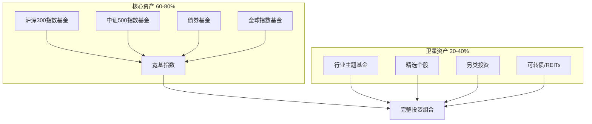

## 三、财务规划策略

财务规划不是"有钱了再想"的事，而是从第一笔收入开始就必须建立的底层操作系统。它的本质是**用确定性的结构去对冲不确定性的风险**——你无法预测市场涨跌、行业兴衰、意外何时降临，但你可以提前搭建一套框架，让任何单一冲击都不会摧毁你的整体财务状况。

本章从收入结构、投资体系、风险防线三个维度展开，给出可落地的策略、工具和实操模板。

---

### 3.1 收入多元化：不把鸡蛋放在一个篮子里

#### 3.1.1 收入的四个象限

理解收入的本质分类，是构建多元收入的起点。罗伯特·清崎在《富爸爸穷爸爸》中提出的"现金流四象限"模型至今仍是最佳框架：

| 象限 | 类型 | 描述 | 典型示例 | 核心特点 | 风险等级 |
|------|------|------|----------|----------|----------|
| E（Employee） | 主动收入-雇佣 | 出卖时间与技能换取报酬 | 工资、奖金、年终奖 | 稳定但有明确天花板 | 低 |
| S（Self-employed） | 主动收入-自雇 | 为自己工作，收入直接挂钩个人产出 | 咨询师、自由设计师、个体户 | 灵活但停手即停收 | 中 |
| B（Business owner） | 被动收入-系统 | 建立可脱离个人运转的盈利系统 | 企业主、加盟连锁、SaaS产品 | 前期投入大，后期可指数增长 | 中高 |
| I（Investor） | 被动收入-资产 | 让资本为你工作 | 股息、房租、版税、基金分红 | 需要本金或知识产权，复利效应强 | 因标的而异 |

**关键认知：** 大多数人终身停留在E象限，少数人进入S象限，真正实现财务自由的人在B和I象限拥有实质性收入。目标不是"辞职创业"，而是**逐步将收入重心从左侧（主动）向右侧（被动）迁移**。

#### 3.1.2 收入多元化路径图

##### 第一阶段：优化主动收入（当前-2年）

这是所有人的起点，核心策略是**最大化单位时间价值**。

**具体行动：**

1. **技能溢价提升**
   - 识别你所在行业薪资最高的技能栈（如：后端开发中，掌握分布式系统设计比只会写CRUD薪资高50-100%）
   - 制定6个月专项学习计划，目标是成为团队中该技能的"go-to person"
   - 每次晋升/跳槽时，薪资涨幅应不低于20%（低于此值说明议价能力不足或市场认可度不够）

2. **副业启动**
   - 优先选择与主业技能高度相关的副业（边际成本最低）：程序员接外包、设计师做模板售卖、运营做自媒体
   - 副业时间投入控制在每周8-12小时，不影响主业质量
   - 目标：副业收入达到主业的20-30%时，说明你的技能有市场溢价

3. **收入结构诊断表**

   收入来源        月均收入    占比     稳定性    可控性    增长潜力
   ─────────────────────────────────────────────────────────────
   主业工资        ¥15,000    75%      ★★★★     ★★       ★★★
   技术咨询副业     ¥3,000    15%      ★★       ★★★★     ★★★★
   技术博客广告     ¥1,000     5%      ★★★      ★★★      ★★★
   其他            ¥1,000     5%      ★        ★★       ★★
   ─────────────────────────────────────────────────────────────
   合计            ¥20,000    100%
   基尼系数(收入集中度): 0.75 → 高度依赖主业，需要改善

   > **基尼系数应用：** 将收入集中度类比基尼系数——如果单一来源占比超过70%，你的收入结构就是"高度不平等"的，任何该来源的波动都会造成严重冲击。

##### 第二阶段：建立被动收入（2-5年）

核心策略：**用主动收入的盈余去购买/建造能产生现金流的资产**。

**具体行动：**

1. **系统性投资**（详见3.2节）
   - 从每月结余中拿出30-50%进入投资账户
   - 建立自动化定投系统，消除人为干预

2. **数字资产建设**
   - **内容型资产**：技术博客（SEO流量→广告/联盟营销）、在线课程（一次制作多次售卖）、电子书
   - **产品型资产**：开源工具+付费高级版、SaaS小工具、模板/素材包
   - **关键指标**：每个资产项目的目标是月均产生≥¥2,000被动收入，10个这样的项目就是¥20,000/月

3. **目标**：被动收入覆盖基本生活开支的30%
   - 假设月生活开支¥8,000，目标被动收入≥¥2,400/月
   - 如果年化收益7%，需要约¥41万的投资本金产生¥2,400/月

##### 第三阶段：被动收入超越主动收入（5-10年）

核心策略：**加速器效应——被动收入本身也在产生被动收入（复利）**。

**具体行动：**

1. **投资组合优化**
   - 随着本金增长，逐步降低高风险资产占比
   - 增加固收类资产（债券基金、REITs）以稳定现金流
   - 年度再平衡，确保资产配置符合当前风险承受能力

2. **被动收入矩阵扩展**

   | 收入类型 | 具体渠道 | 月均目标 | 所需本金/投入 |
   |---------|---------|---------|-------------|
   | 股息收入 | 高股息ETF + 个股 | ¥3,000 | ¥50万本金 |
   | 基金分红 | 指数基金定投收益 | ¥2,000 | ¥35万本金 |
   | 租金收入 | 小户型出租或REITs | ¥2,500 | ¥40万本金或REITs |
   | 内容收入 | 博客+课程+电子书 | ¥3,000 | 前期200小时内容建设 |
   | 版税/授权 | 软件授权、专利 | ¥1,500 | 知识产权积累 |
   | **合计** | | **¥12,000** | |

3. **目标**：被动收入≥月生活开支×1.5（初步财务自由，有安全余量）

#### 3.1.3 收入多元化的常见误区

| 误区 | 真相 | 纠正方法 |
|------|------|----------|
| "副业越多越好" | 精力分散导致每个都做不好 | 同一时期最多深耕2个收入来源 |
| "被动收入不需要维护" | 数字资产需要定期更新，投资需要再平衡 | 每月预留4-8小时维护被动收入系统 |
| "先有钱才能投资" | 月薪5,000也能每月定投500 | 从收入的10%开始，重在习惯养成 |
| "炒股就是投资" | 短线交易是投机不是投资 | 区分投资（长期持有优质资产）和投机（短期博弈） |
| "房产是最好的投资" | 中国一线城市租售比已降至1.5-2%，不如理财 | 用"年租金÷房价"计算真实回报率，与其他资产对比 |

---

### 3.2 投资策略：让钱为你工作

#### 3.2.1 投资前的三个前提条件

在讨论任何投资策略之前，必须确认以下三个条件已满足：

1. **紧急备用金已到位**：至少6个月生活费存在货币基金或银行活期中（如余额宝、零钱通）
2. **高息负债已清除**：信用卡分期（年化13-18%）、消费贷（年化8-24%）必须先还清——没有任何投资能稳定覆盖这个成本
3. **保险基本配置完成**：医疗险+意外险已购买（详见3.3节）

> **为什么要先还高息负债？** 假设你有¥50,000信用卡分期（年化15%），同时用¥50,000投资期望年化10%。表面上你在"一边投资一边还贷"，实际上你每年净亏损2.5%（¥1,250）。先还清负债，等于获得了一个无风险的15%回报。

#### 3.2.2 投资的"核心-卫星"策略

这是全球资产配置中最经典也最适合普通人的框架。将投资组合分为"核心"和"卫星"两部分：

**核心资产（60-80%）——"躺赢"部分**

目标是获取市场平均回报，不需要频繁调整。推荐配置：

| 标的类型 | 推荐品种 | 配置比例 | 年化参考收益 | 选择理由 |
|---------|---------|---------|-------------|---------|
| A股宽基 | 沪深300ETF（510300） | 25-30% | 8-12% | 覆盖A股核心资产 |
| A股中小盘 | 中证500ETF（510500） | 10-15% | 10-14% | 中小盘成长性更高 |
| 债券基金 | 纯债基金/中短债 | 15-20% | 3-5% | 降低组合波动 |
| 全球配置 | 标普500QDII/纳指ETF | 10-15% | 10-15% | 分散单一市场风险 |

**卫星资产（20-40%）——"增强"部分**

追求超额回报，但需要更多研究和监控：

- **行业主题基金**（10-15%）：选择你深度理解的行业，如新能源、半导体、医药
- **精选个股**（5-10%）：不超过5只，每只都有明确的投资逻辑和止损线
- **另类投资**（5-10%）：REITs（不动产信托）、可转债、黄金ETF
- **现金管理**（5%）：货币基金，用于机会出现时的"子弹"

> **为什么不全买个股？** 研究显示，80%的主动管理基金长期跑输指数。对于非专业投资者，核心资产用指数基金是数学上的最优解。

#### 3.2.3 定投策略详解

定期定额投资（Dollar Cost Averaging, DCA）是最适合工薪族的投资策略。它通过时间分散来平滑买入成本，避免"一把梭在最高点"的悲剧。

**三种定投模式对比：**

| 模式 | 操作方式 | 适用场景 | 预期改进 | 操作复杂度 |
|------|---------|---------|---------|-----------|
| 基本定投 | 每月固定日期投入固定金额 | 投资新手、无暇研究 | 基准 | ★☆☆ |
| 价值定投 | 根据PE/PB估值调整金额 | 有一定研究能力 | 超额收益2-5% | ★★★ |
| 目标定投 | 设定目标比例，定期再平衡 | 资产规模较大 | 降低波动 | ★★☆ |

**基本定投操作模板：**

1. 选择平台：支付宝/天天基金/蛋卷基金（费率最低0.1%）
2. 设置自动扣款：每月工资日次日（如每月6号）
3. 金额设定：月结余的40-60%
4. 分配示例（月投¥4,000）：
   ├── 沪深300ETF联接  ¥1,500（37.5%）
   ├── 中证500ETF联接  ¥800（20%）
   ├── 标普500QDII    ¥700（17.5%）
   ├── 债券基金       ¥600（15%）
   └── 行业主题基金    ¥400（10%）
5. 设置提醒：每季度检查一次，不需要每天看

**价值定投进阶——估值调整法：**

核心思路：市场低估时多投，高估时少投。以沪深300为例：

| PE百分位 | 估值判断 | 定投倍数 | 策略说明 |
|---------|---------|---------|---------|
| <20% | 极度低估 | 2.0倍 | 大幅加仓，历史罕见机会 |
| 20-40% | 低估 | 1.5倍 | 适度加仓 |
| 40-60% | 合理 | 1.0倍 | 正常定投 |
| 60-80% | 高估 | 0.5倍 | 减少投入 |
| >80% | 极度高估 | 0倍 | 停止投入，开始分批止盈 |

> **数据来源：** 可在"理杏仁"（lixinger.com）或"且慢"等平台查询各指数的实时PE百分位。

**定投的四个关键纪律：**

1. **自动化优先**：设定自动扣款，消除"这个月要不要投"的人性干扰。研究表明，手动定投的投资者有37%会在市场下跌时中断，而自动定投的中断率仅为8%。
2. **下跌不停**：市场下跌时不要停止定投——这恰恰是你用同样金额买入更多份额的时候。2018年A股大跌期间坚持定投沪深300的投资者，在2019-2020年获得了60%+的回报。
3. **至少一个完整周期**：A股一个完整牛熊周期约3-5年，定投不足2年就下结论"不赚钱"是不公平的。
4. **控制查看频率**：每月或每季度看一次即可。每天看收益会让你做出情绪化决策。

#### 3.2.4 投资中的风险管理

风险管理不是"不投资"，而是**让任何单一事件都不会摧毁你的整体财务状况**。

**四道防线：**

1. **仓位管理**
   - 任何单一资产（单只股票、单只基金）不超过总资产的20%
   - 任何单一行业不超过总资产的30%
   - 任何时候保留5-10%的现金仓位，用于应对机会或意外

2. **止损纪律**
   - 个股：亏损达到15-20%时强制止损（具体比例取决于你的风险承受能力）
   - 基金：如果是宽基指数基金，不需要止损（定投本身就是越跌越买）
   - 行业基金：亏损30%时评估是否行业逻辑已变，决定止损或加仓

3. **流动性管理**
   - 紧急备用金（6个月生活费）：100%放在货币基金
   - 投资资金中保持10-15%的高流动性资产
   - 房产等非流动资产不计入紧急备用金

4. **对冲思维**
   - 股票（进攻）+ 债券（防守）的经典组合
   - 国内资产 + 海外资产的地理分散
   - 不同资产类别之间的低相关性是降低风险的关键

**投资决策检查清单（每次交易前必问）：**

□ 我能用一句话说清为什么要买/卖这个标的吗？
□ 这笔投资占我总资产的比例是多少？（超过20%需要额外谨慎）
□ 如果买入后立刻下跌30%，我能承受吗？
□ 我的投资逻辑是基于研究还是基于情绪（恐惧/贪婪）？
□ 我是否在追涨杀跌？（近期涨幅超过30%的标的需要冷静期）
□ 我是否有明确的退出策略？

#### 3.2.5 不同人生阶段的资产配置建议

投资策略不是一成不变的，它应该随着年龄、收入、家庭状况的变化而调整：

| 阶段 | 年龄参考 | 股票类 | 债券类 | 现金类 | 核心策略 |
|------|---------|--------|--------|--------|---------|
| 积累期 | 22-30岁 | 70-80% | 15-20% | 5-10% | 激进增长，承受波动能力强 |
| 增长期 | 30-40岁 | 60-70% | 20-30% | 5-10% | 平衡增长，开始考虑家庭责任 |
| 保全期 | 40-50岁 | 40-50% | 35-45% | 5-10% | 稳健为主，降低波动 |
| 收获期 | 50岁+ | 20-30% | 50-60% | 10-20% | 保守配置，注重现金流 |

> **简化公式：** 股票配置比例 ≈（110 - 年龄）%。例如30岁，股票占比约80%。这是一个起点，具体还需根据收入稳定性和风险偏好调整。

---

### 3.3 风险管理：为最坏的情况做准备

#### 3.3.1 个人财务风险全景图

大多数人只关注"怎么赚钱"，却忽略了"怎么不亏钱"。风险管理的核心是**识别你面临的全部财务风险，并为每一种风险建立对应的防线**。

| 风险类型 | 发生概率 | 财务冲击 | 应对方案 | 每月成本 |
|---------|---------|---------|---------|---------|
| 重大疾病 | 中（人一生患重疾概率72%） | ¥30-100万+ | 重疾险+医疗险+健康生活方式 | 重疾险¥300-800/月 |
| 意外伤残 | 低但后果严重 | 收入中断数年甚至终身 | 意外险+收入保障+紧急备用金 | 意外险¥50-100/月 |
| 失业 | 中（经济下行期更高） | 收入归零，持续3-12个月 | 6个月紧急备用金+持续技能更新 | 0（提前储备） |
| 投资亏损 | 高（每个投资者都会经历） | 本金损失20-50% | 分散投资+止损纪律+长期视角 | 0（纪律执行） |
| 婚姻变化 | 中（离婚率约40%） | 财产分割50%+ | 保持财务独立+婚前/婚内协议 | 0（制度建设） |
| 经济衰退 | 低（每10年左右一次） | 收入下降+资产缩水 | 多元收入+控制负债+保持流动性 | 0（结构设计） |
| 法律纠纷 | 低 | 律师费+赔偿金 | 合规经营+责任险 | 责任险¥100-300/月 |

#### 3.3.2 保险配置：用最小成本转移最大风险

保险的本质是**用确定的小额支出（保费）去对冲不确定的巨额损失（风险事件）**。它不是投资，不是储蓄，而是风险管理工具。

**工薪族必备保险清单（按优先级排序）：**

**第一优先级：社保（强制）**
- 五险一金是所有保障的基础，务必确保公司足额缴纳
- 医保报销比例50-90%（因地区和医院级别而异），但有起付线和封顶线
- 养老保险累计缴满15年可领退休金

**第二优先级：百万医疗险（年费¥200-600）**
- 弥补社保不足：报销社保外用药、进口药、靶向药
- 通常有1万免赔额，覆盖住院+特殊门诊
- 推荐：众安尊享e生、平安e生保、人保好医保
- **购买要点**：续保条件比保额更重要——选择"保证续保"的产品

**第三优先级：意外险（年费¥100-300）**
- 覆盖意外身故/伤残+意外医疗
- 保额建议：身故/伤残≥50万，意外医疗≥5万
- **购买要点**：注意"伤残"和"全残"的区别，前者保障范围更广

**第四优先级：重疾险（年费¥3,000-8,000）**
- 确诊即赔，不限用途（可弥补收入损失、康复费用）
- 保额建议：年收入×3-5倍（至少30万）
- **购买要点**：消费型（不含身故）比返还型性价比高3-5倍；定期（保至70岁）比终身便宜40-50%

**第五优先级：定期寿险（年费¥500-1,500）**
- 适合有房贷、有家庭责任的人
- 保额建议：房贷余额+子女教育费+父母赡养费
- **购买要点**：纯保障型，不带任何储蓄/分红功能

**保险配置预算参考：**

年收入¥15万的28岁男性（健康体）：
├── 社保        公司缴纳（个人部分约¥1,500/月）
├── 百万医疗险    ¥300/年
├── 意外险      ¥200/年（100万保额）
├── 重疾险      ¥4,500/年（50万保额，保至70岁）
├── 定期寿险     ¥800/年（100万保额，保至60岁）
└── 合计        ≈¥5,800/年（占年收入3.9%）

> **保费占比参考：** 家庭保费总支出建议控制在年收入的5-10%。低于5%说明保障不足，高于10%可能影响生活质量。

#### 3.3.3 紧急备用金：你的财务安全气囊

紧急备用金是**最容易建立、也最容易被忽视的财务防线**。

**备用金规模计算：**

月固定支出 = 房租/房贷 + 餐饮 + 交通 + 通讯 + 保险 + 必要订阅
例如：¥3,000 + ¥2,000 + ¥500 + ¥200 + ¥500 + ¥100 = ¥6,300/月

紧急备用金 = 月固定支出 × 6 = ¥37,800

特殊情况下应增加到9-12个月：
- 自由职业者/收入不稳定
- 单一收入来源
- 行业处于下行周期
- 有需抚养的家庭成员

**存放要求：**
- **安全性第一**：不追求收益，本金安全是唯一目标
- **高流动性**：随时可取，T+0到账
- **推荐方案**：
  - 50%银行活期/智能存款（即时可用）
  - 50%货币基金如余额宝、零钱通（T+0，年化1.5-2.5%）
  - 不推荐：定期存款（提前支取损失利息）、股票基金（可能亏损）

#### 3.3.4 "财务韧性"建设

财务韧性 = 你能承受多大的财务冲击而不崩溃。

**财务韧性评估模型：**

财务韧性得分 = 加权平均（以下5项，每项1-10分）

1. 储备充足度（权重25%）
   紧急备用金月数：  0月=1分  3月=4分  6月=7分  12月=10分

2. 收入稳定性（权重25%）
   收入来源数量：    1个=2分  2个=5分  3个=7分  4个+=10分
   被动收入占比：    0%=1分   20%=4分  50%=7分  80%+=10分

3. 负债健康度（权重20%）
   月供/月收入比：   >50%=2分  30-50%=4分  <30%=7分  无负债=10分

4. 保障覆盖度（权重15%）
   保险配置情况：    无=1分  仅社保=3分  基本商业险=7分  完整方案=10分

5. 职业弹性（权重15%）
   技能可迁移性：    仅限当前公司=2分  行业内通用=5分  跨行业通用=8分  可独立变现=10分

**示例评估：**

某28岁互联网从业者（月薪¥15,000）：
1. 储备充足度：6个月备用金 → 7分
2. 收入稳定性：单一收入+少量副业 → 4分
3. 负债健康度：无房贷无车贷 → 10分
4. 保障覆盖度：仅社保 → 3分
5. 职业弹性：编程技能行业通用 → 5分

韧性得分 = 7×25% + 4×25% + 10×20% + 3×15% + 5×15%
         = 1.75 + 1.00 + 2.00 + 0.45 + 0.75
         = 5.95 / 10

诊断：中等偏上。短板在保障覆盖度和收入稳定性，
      优先购买基础商业保险（3个月内），
      同时发展副业（6个月内）。

**提升财务韧性的行动优先级：**

1. **立即行动（本周）**：检查社保缴纳是否足额；开通货币基金账户存放紧急备用金
2. **短期行动（1个月内）**：购买百万医疗险+意外险（年费合计<¥600）
3. **中期行动（3个月内）**：建立6个月紧急备用金；评估是否需要重疾险
4. **长期行动（6-12个月）**：发展第二收入来源；开始系统性投资

---

### 3.4 财务规划实操工具箱

#### 3.4.1 月度财务报表模板

┌─────────────────────────────────────────────────────────┐
│                   月度个人财务报表                         │
│                   2026年 ___月                            │
├─────────────────────────────────────────────────────────┤
│ 收入项                          金额        占比          │
│ ├── 主业税后工资                 ¥______     ___%         │
│ ├── 副业/兼职收入                ¥______     ___%         │
│ ├── 投资收益（股息/利息）          ¥______     ___%         │
│ └── 其他收入                    ¥______     ___%         │
│ 收入合计                         ¥______     100%         │
├─────────────────────────────────────────────────────────┤
│ 支出项                          金额        占比          │
│ ├── 固定支出                                      │
│ │   ├── 房租/房贷                ¥______     ___%         │
│ │   ├── 保险                    ¥______     ___%         │
│ │   ├── 通讯/网络                ¥______     ___%         │
│ │   └── 订阅服务                 ¥______     ___%         │
│ ├── 可变支出                                      │
│ │   ├── 餐饮                    ¥______     ___%         │
│ │   ├── 交通                    ¥______     ___%         │
│ │   ├── 日用品                  ¥______     ___%         │
│ │   └── 娱乐社交                 ¥______     ___%         │
│ └── 特殊支出                                      │
│     ├── 学习/教育                ¥______     ___%         │
│     └── 医疗                    ¥______     ___%         │
│ 支出合计                         ¥______     100%         │
├─────────────────────────────────────────────────────────┤
│ 月结余 = 收入 - 支出              ¥______                  │
│ 储蓄率 = 月结余 / 收入              ___%                   │
│ 目标储蓄率: ≥30%                                         │
├─────────────────────────────────────────────────────────┤
│ 投资执行检查:                                             │
│ □ 定投已自动执行  □ 备用金充足  □ 无计划外大额支出         │
└─────────────────────────────────────────────────────────┘

#### 3.4.2 推荐工具清单

| 用途 | 推荐工具 | 费用 | 说明 |
|------|---------|------|------|
| 记账 | 随手记/MoneyPro | 免费-¥30/月 | 养成记账习惯，3个月后分析消费结构 |
| 基金定投 | 蛋卷基金/天天基金 | 申购费0.1% | 费率最低，支持智能定投 |
| 估值查询 | 理杏仁/且慢 | 免费基础版 | 查看指数PE百分位，指导价值定投 |
| 保险比价 | 蜗牛保险/深蓝保 | 免费 | 产品对比和方案规划 |
| 资产追踪 | 且慢/雪球 | 免费 | 统一查看各平台投资资产总览 |
| 预算管理 | YNAB/随手记预算 | 免费-¥50/月 | 预算编制和超支提醒 |

#### 3.4.3 常见财务陷阱清单

| 陷阱 | 表现 | 危害 | 如何避免 |
|------|------|------|----------|
| 消费主义陷阱 | "犒劳自己"变成常态消费 | 月光甚至负债 | 延迟24小时再决定非必要消费 |
| 伪资产购买 | 买车认为是"资产"（实际是贬值消费品） | 大额支出+持续养车成本 | 用车辆年化持有成本÷使用次数计算真实单价 |
| 高收益诱惑 | P2P、高息理财、量化私募承诺年化20%+ | 本金全损 | 记住：承诺收益超过10%的都要打问号 |
| 杠杆炒股 | 融资融券、配资 | 亏损成倍放大 | 永远不用借来的钱投资 |
| 忽视通胀 | 钱全部存活期 | 购买力每年缩水3-5% | 至少让投资回报率>通胀率 |
| 保险理财化 | 买分红险、万能险 | 保障不足+收益低于理财 | 保险和投资分开：纯保障型保险+独立投资 |

---

### 3.5 进阶：从财务规划到财务自由

#### 3.5.1 财务自由的量化定义

财务自由 = 被动收入 ≥ 生活支出

具体公式：
所需本金 = 年生活支出 × 25（基于4%安全提取率法则）
示例：年支出¥100,000 → 需要本金¥2,500,000

保守公式（考虑中国市场波动）：
所需本金 = 年生活支出 × 30（基于3.3%提取率）
示例：年支出¥100,000 → 需要本金¥3,000,000

> **4%法则来源：** 1998年Trinity Study研究表明，如果每年从投资组合中提取不超过4%用于生活开支，组合大概率可以永续运转（基于美国股市历史数据）。中国市场波动更大，建议用3-3.5%更安全。

#### 3.5.2 财务自由的三个层次

| 层次 | 定义 | 被动收入目标 | 意味着什么 |
|------|------|-------------|-----------|
| 基础自由 | 被动收入覆盖基本生活 | ≥月支出×1.0 | 可以不为生存工作，但仍需工作提升生活品质 |
| 舒适自由 | 被动收入覆盖当前生活水平 | ≥月支出×1.5 | 可以选择喜欢的工作，不受薪资约束 |
| 完全自由 | 被动收入覆盖理想生活 | ≥月支出×2.0+ | 完全自主选择如何度过时间 |

#### 3.5.3 加速实现财务自由的杠杆

1. **收入杠杆**：从E象限向B/I象限迁移，收入上限从线性变为指数
2. **复利杠杆**：时间是最大的杠杆——25岁开始月投¥3,000（年化8%），到50岁有约¥290万；35岁才开始同样条件只有约¥115万
3. **知识杠杆**：持续学习投资知识，将年化收益从6%提升到10%，30年后资产差距可达3倍以上
4. **地理杠杆**：在低成本城市/国家生活，用一线城市的收入水平支撑三线城市的消费水平（"地理套利"）

> **复利的数学真相：** 假设每月投入¥3,000，年化收益8%：
> - 第10年：¥55万（投入本金¥36万，收益¥19万）
> - 第20年：¥176万（投入本金¥72万，收益¥104万）
> - 第30年：¥440万（投入本金¥108万，收益¥332万）
>
> 第30年的收益是本金的3倍——这就是时间的力量。越早开始，复利越强大。

---

> **本章核心要义：** 财务规划的本质不是"赚更多钱"，而是**建立一套确定性的系统来管理不确定性的未来**。收入多元化降低单一风险，投资体系让资产增值，风险防线确保不会一夜归零。三者缺一不可，互为支撑。从今天开始，哪怕只是开通一个货币基金账户、记下本月的收支明细，都是向财务健康迈出的第一步。
