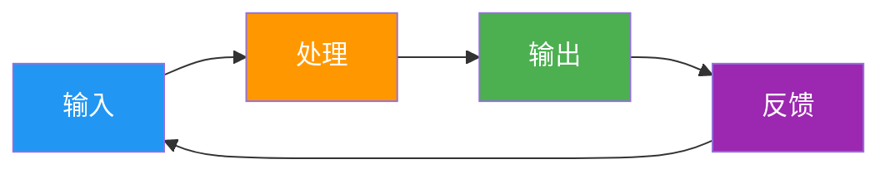
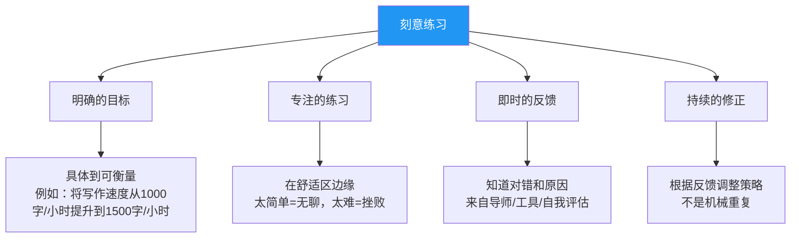
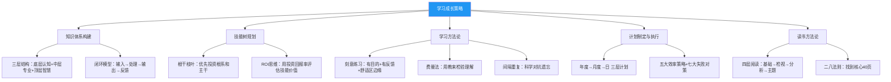

## 四、学习成长策略

> 学习不是为了囤积知识，而是为了构建一个能在未知世界中持续运转的思维操作系统。——改编自查理·芒格

在信息爆炸的时代，学习能力本身就是最核心的竞争力。但"学习"二字说起来简单，做起来却充满陷阱：读了很多书却记不住、学了很多课程却用不上、收藏了无数文章却从未回看。本章将从**知识体系构建、技能树规划、学习方法论、计划执行、读书方法**五个维度，帮你建立一套可落地的学习成长系统。

---

### 4.1 知识体系构建：打造你的认知大厦

#### 4.1.1 为什么需要知识体系

碎片化学习是现代人最大的认知陷阱。你以为自己在"学习"，实际上只是在"浏览"——每天刷30分钟知识短视频，大脑获得的不是知识，而是**知道感**（feeling of knowing），一种"我好像懂了"的错觉。

认知心理学研究（Bjork, 2011）表明，**孤立的信息片段几乎无法被长期记忆编码**。只有当新知识与已有知识建立连接、形成网络时，学习才真正发生。这就是为什么你需要一个知识体系——它不是书架上的分类标签，而是你大脑中的一张**认知地图**。

#### 4.1.2 知识体系的三层结构

底层：基础认知（心理学、经济学、哲学、科学方法论）
  │
  ├── 基础认知是"元知识"，它决定了你如何理解其他所有知识
  ├── 心理学：理解人的行为和决策机制
  ├── 经济学：理解资源配置和激励机制
  ├── 哲学：理解思考的方式和逻辑
  └── 科学方法论：理解如何验证假设和发现规律
  │
中层：领域知识（你的专业领域 + 相关领域的知识）
  │
  ├── 这是你安身立命的本事
  ├── 深度：在你的专业领域达到前10%的水平
  └── 广度：理解相邻领域的基本逻辑和术语
  │
顶层：实践智慧（从经验中提炼的个人方法论）
  │
  ├── 这是从"知道"到"做到"的桥梁
  ├── 包括：个人原则、决策框架、工作流模板
  └── 只有通过实践和反思才能形成，无法直接从书中获取

**三层之间的关系**：底层决定了你的认知天花板，中层决定了你的专业深度，顶层决定了你的实际产出能力。很多人的问题是只关注中层（学专业知识），忽略底层（缺乏思维框架）和顶层（不沉淀经验）。

#### 4.1.3 构建知识体系的"输入-处理-输出"模型

学习是一个完整的闭环，而非单向的信息接收：

**输入层**——有质量的信息源

| 信息源类型 | 质量指标 | 占比建议 | 典型代表 |
|-----------|---------|---------|---------|
| 经典书籍 | 经过时间验证，体系完整 | 40% | 教材、行业经典 |
| 学术论文 | 严谨、前沿、可追溯 | 15% | Google Scholar、arXiv |
| 行业报告 | 有数据、有趋势 | 15% | 麦肯锡、Gartner报告 |
| 高质量播客/视频 | 深度访谈、案例丰富 | 15% | 长对话类节目 |
| 社群交流 | 有实践者的真实经验 | 15% | 专业社群、行业论坛 |

**关键原则**：输入不是越多越好，而是**越有质量越好**。每天花2小时刷100条碎片信息，不如花1小时深度阅读一篇高质量文章。

**处理层**——将信息转化为知识

处理是整个学习闭环中最关键、最容易被跳过的环节。常见误区是"输入即学习"——读完一本书就觉得自己掌握了。事实上，没有经过处理的信息只是短期记忆的过客。

有效的处理方法：

1. **概念化**：用自己的话重述核心概念，不是摘抄原文
2. **结构化**：将新概念放入已有的知识框架中，找到它应处的位置
3. **关联化**：找出新知识与已有知识之间的联系，建立3个以上连接点
4. **质疑化**：对新知识提出问题——这个结论的证据是什么？有什么反例？
5. **情境化**：将抽象知识与具体场景结合——"这个知识在什么情况下能用？"

**输出层**——检验学习成果的唯一标准

输出是最好的学习方式。费曼技巧的核心就是：**当你能把一个概念教给别人时，你才真正理解了它**。

输出的形式：

| 输出形式 | 难度 | 学习效果 | 适合阶段 |
|---------|------|---------|---------|
| 在笔记中写总结 | ★☆☆ | 巩固记忆 | 学完即刻 |
| 写博客/文章 | ★★☆ | 深化理解 | 学完1周内 |
| 做内部分享/演讲 | ★★★ | 系统整合 | 学完1月内 |
| 教授他人/带团队 | ★★★★ | 精通检验 | 学完3月内 |
| 实际项目应用 | ★★★★★ | 真正掌握 | 持续进行 |

#### 4.1.4 知识管理工具链

工具不是目的，但好的工具能让流程顺畅10倍。以下是经过验证的知识管理流程：

**第一步：捕捉（Capture）**

| 场景 | 推荐工具 | 特点 |
|------|---------|------|
| 随时记录灵感 | Flomo、苹果备忘录 | 轻量、零摩擦、随时可写 |
| 网页内容摘录 | Cubox、简悦 | 网页高亮、稍后阅读 |
| 会议/对话笔记 | 讯飞听见、飞书妙记 | 语音转文字、重点标记 |

**第二步：整理（Organize）**

| 需求 | 推荐工具 | 适用人群 |
|------|---------|---------|
| 双向链接笔记 | Obsidian | 重度思考者、研究者 |
| 全能工作台 | Notion | 团队协作、多场景 |
| 卡片笔记法 | Heptabase、Logseq | 知识工作者、写作者 |
| 即时简洁 | Bear、Typora | 轻度用户、纯文本偏好 |

**第三步：连接（Connect）**

笔记的价值不在于单条内容，而在于**连接密度**。建议：

- 每条笔记至少打3个标签或链接到相关笔记
- 定期（每周一次）做"笔记巡检"，发现孤立节点并建立连接
- 使用图谱视图（Obsidian的Graph View）直观查看知识网络

**第四步：回顾（Review）**

- **日回顾**：今天学了什么？有什么值得记录的？（5分钟）
- **周回顾**：本周的知识地图有什么变化？哪些笔记需要更新？（30分钟）
- **月回顾**：本月的学习目标完成情况如何？需要调整什么？（1小时）
- **年回顾**：今年构建了哪些新能力？知识体系有哪些结构性提升？（半天）

**第五步：输出（Output）**

将知识转化为可见的成果：文章、课程、产品、决策。输出是知识体系的"质量检验"——如果输出时发现逻辑不通，说明你的知识体系还有漏洞。

#### 4.1.5 常见误区与纠正

| 误区 | 为什么是错的 | 正确做法 |
|------|------------|---------|
| 收藏=学习 | 收藏的信息99%不会再看 | 收藏后24小时内做至少一次处理 |
| 笔记越详细越好 | 摘抄式笔记不产生理解 | 用自己的话重述，宁可简洁 |
| 只输入不输出 | 没有输出的学习是自我欺骗 | 每个学习单元至少做一次输出 |
| 追求完美的工具 | 工具的选择本身就是拖延 | 用最简单的工具开始，迭代升级 |
| 知识体系要一开始就完美 | 体系是在使用中逐渐成型的 | 先有个粗糙的框架，边学边优化 |

---

### 4.2 技能树规划：有策略地提升能力

#### 4.2.1 技能树的"根-干-枝-叶"模型

不是所有技能的价值都相同。盲目学习是最大的时间浪费——很多人学了大量"叶子技能"（流行但短命），却忽略了"根系技能"（不显眼但支撑一切）。

🌱 根（Root）——元技能
│  学习能力、思考能力、沟通能力、情绪管理能力
│  → 看不见但支撑一切，是一切技能的"操作系统"
│
🌳 干（Trunk）——核心专业技能
│  你在某个领域的核心竞争力
│  → 你的立身之本，必须达到行业前20%
│
🌿 枝（Branch）——辅助技能
│  增强核心技能效能的配套能力
│  → 例如：程序员的产品思维、设计师的数据分析能力
│
🍂 叶（Leaf）——热点技能
   可能有用但不一定持久的技能
   → 例如：某个特定工具的使用、某个框架的API

**关键洞察**：根系技能的投资回报最高但最难被看见。一个学习能力强的人（根），即使暂时落后，也能快速追赶；一个只会某个具体工具的人（叶），一旦工具被淘汰，就失去了全部优势。

#### 4.2.2 技能投资的"ROI思维"

时间是最稀缺的资源。不是所有技能都值得投入相同的精力，用**投资回报率（ROI）**来评估技能投资：

技能ROI = （技能带来的收入增长 + 技能带来的机会价值 + 技能带来的认知提升）/
          （学习该技能所需的时间 + 维持该技能的成本 + 机会成本）

高ROI技能的四个特征：

| 特征 | 说明 | 示例 |
|------|------|------|
| **通用性强** | 在多个场景都有用 | 写作能力、数据分析、英语 |
| **复利效应** | 越用越值钱，知识之间互相增强 | 批判性思维、系统设计能力 |
| **供给稀缺** | 掌握的人不多 | 复杂系统架构设计、跨文化谈判 |
| **需求增长** | 市场越来越需要 | AI应用能力、数据工程、用户体验设计 |

#### 4.2.3 技能发展的四个阶段

每个技能的习得都遵循一个可预测的路径：

- **阶段一：无意识无能力**——不知道自己不会，典型的"不知道自己不知道"
- **阶段二：有意识无能力**——知道自己不会，这是进步的开始
- **阶段三：有意识有能力**——能做好但需要刻意注意，比较累
- **阶段四：无意识有能力**——内化为本能，轻松自如

**实操建议**：评估你当前每项重要技能处于哪个阶段。阶段一到阶段二需要"暴露"（看到差距）；阶段二到阶段三需要"练习"（刻意练习）；阶段三到阶段四需要"重复"（大量实战）。

#### 4.2.4 2024-2026年高ROI技能清单

以下技能基于当前市场趋势、技术发展和劳动力需求分析：

**第一梯队：必学技能（通用性极强，几乎所有行业受益）**

| 技能 | ROI理由 | 学习路径 | 预期投入 |
|------|---------|---------|---------|
| AI工具使用能力 | 10倍效率提升，所有行业通用 | ChatGPT/Claude提示工程→AI Agent工作流→领域定制 | 50-100小时 |
| 数据分析能力 | 数据驱动决策是不可逆趋势 | Excel高级→SQL→Python数据分析→可视化 | 200-400小时 |
| 写作与表达能力 | 影响力的基础，所有沟通场景通用 | 结构化写作→公开写作→演讲表达 | 持续积累 |

**第二梯队：高价值技能（特定领域高效能）**

| 技能 | ROI理由 | 学习路径 | 预期投入 |
|------|---------|---------|---------|
| 编程基础 | 数字时代的"识字"，自动化思维 | Python基础→脚本自动化→Web开发基础 | 300-500小时 |
| 项目管理能力 | 跨职能协作的核心能力 | 敏捷/Scrum认证→实际项目管理→复杂项目操盘 | 200-300小时 |
| 英语能力 | 获取全球信息和机会的钥匙 | 日常阅读→口语练习→专业英语 | 500-1000小时 |
| 销售与谈判能力 | 无论什么岗位都在"销售"自己 | 销售基础理论→实际谈判练习→高级策略 | 200-400小时 |

**第三梯队：差异化技能（建立个人独特优势）**

| 技能 | ROI理由 | 学习路径 |
|------|---------|---------|
| 系统设计思维 | 解决复杂问题的能力 | 系统论→案例分析→实际系统设计 |
| 心理学/行为经济学 | 理解人性，应用面极广 | 基础教材→认知偏误→应用场景 |
| 视觉设计能力 | 让想法更直观地表达 | 设计基础→工具(Figma)→实际项目 |
| 跨文化沟通 | 全球化背景下的稀缺能力 | 文化理论→实际接触→深度理解 |

#### 4.2.5 技能树的动态调整策略

技能树不是一成不变的。每半年做一次**技能审计**：

1. **盘点**：列出你当前掌握的所有技能，评估每个技能的熟练度（1-5分）
2. **对标**：对照你目标岗位/目标行业的技能要求，找出差距
3. **排序**：根据ROI和紧迫性，对需要学习的技能进行优先级排序
4. **聚焦**：同一时间最多深入学习2项新技能，避免贪多嚼不烂
5. **淘汰**：识别过时或低价值的技能，减少维护投入

#### 4.2.6 技能学习的常见误区

| 误区 | 为什么是错的 | 正确做法 |
|------|------------|---------|
| 什么火学什么 | 热点会变，但底层能力不会 | 优先投资元技能和通用技能 |
| 只学不练 | 知识不等于技能，技能需要练习 | 每学一个概念就找机会实践 |
| 追求证书而非能力 | 证书是入场券，能力才是饭碗 | 以实际产出衡量技能掌握程度 |
| 孤立地学技能 | 技能之间有协同效应 | 构建技能组合，让1+1>2 |
| 忽视软技能 | 硬技能决定下限，软技能决定上限 | 刻意练习沟通、领导力等软技能 |

---

### 4.3 学习方法论：如何高效学习

#### 4.3.1 刻意练习：技能习得的黄金标准

刻意练习（Deliberate Practice）是心理学家Anders Ericsson提出的概念，经过30年研究验证，被公认为最有效的技能习得方法。它不是简单的"重复"，而是一种**有目的、有反馈、在舒适区边缘**的练习方式。

刻意练习的四要素：

**实操案例**：如果你想提升写作能力——

| 阶段 | 目标 | 练习方式 | 反馈来源 |
|------|------|---------|---------|
| 入门 | 写出结构清晰的文章 | 每天写500字，模仿优秀文章结构 | AI写作工具评分 |
| 进阶 | 写出有说服力的文章 | 研究修辞技巧，每周写一篇分析文章 | 读者反馈、专业编辑意见 |
| 高阶 | 写出有影响力的文章 | 研究传播规律，写公共领域文章 | 阅读量、转发量、评论质量 |
| 精通 | 形成个人写作风格 | 大量写作+深度复盘 | 行业影响力、被引用次数 |

#### 4.3.2 费曼学习法：理解的终极检验

费曼学习法的核心思想极为简洁：**如果你不能用简单的语言解释一个概念，你就没有真正理解它**。

四步执行流程：

**第一步：选择概念**——明确你要学习什么

不要一次试图理解太多。选择一个具体的概念或知识点，写在纸的顶部。

**第二步：教给别人**——用最简单的语言解释

想象你要向一个12岁的孩子解释这个概念。不能使用专业术语，不能用"等"字省略，必须完整地讲清楚。

**第三步：发现卡壳的地方**——这就是你的知识盲区

当你解释不清楚时，不要自欺欺人地跳过。这就是你还没理解的地方——回到原始材料，重新学习这部分。

**第四步：简化和类比**——找到最直观的表达

好的解释往往包含一个精准的类比。例如：
- CPU就像人的大脑——负责思考和计算
- 内存就像书桌——临时存放正在处理的工作
- 硬盘就像书柜——长期存放所有资料

**进阶用法**：费曼学习法不只适用于学习新知识，也是**检验知识体系漏洞**的利器。定期选择你以为自己懂的概念，尝试写一篇解释文章——你会发现很多"以为懂"其实并不真懂。

#### 4.3.3 间隔重复：对抗遗忘的科学武器

德国心理学家赫尔曼·艾宾浩斯在1885年发现了遗忘曲线：学习后20分钟就忘掉42%，1天后忘掉67%，1个月后忘掉79%。这不是记忆力差，而是人类大脑的正常工作方式。

间隔重复（Spaced Repetition）利用的是"测试效应"和"间隔效应"两个认知心理学原理：

- **测试效应**：主动回忆比被动复习有效3-5倍
- **间隔效应**：间隔复习比集中复习有效2-3倍

**科学的复习时间表**：

| 复习次数 | 距首次学习 | 目标 | 方法 |
|---------|-----------|------|------|
| 第1次 | 学习后1天 | 巩固短期记忆 | 闭卷回忆要点 |
| 第2次 | 学习后3天 | 防止快速遗忘 | 写出核心概念的解释 |
| 第3次 | 学习后7天 | 进入长期记忆 | 费曼法复述 |
| 第4次 | 学习后14天 | 强化长期记忆 | 与新知识建立连接 |
| 第5次 | 学习后30天 | 稳固记忆网络 | 尝试教给别人 |
| 后续 | 每隔1-2个月 | 长期保持 | 间歇性回忆 |

**工具推荐**：

| 工具 | 特点 | 适合场景 |
|------|------|---------|
| Anki | 高度自定义，算法优化，免费（桌面版） | 语言学习、考试、专业知识 |
| SuperMemo | 间隔重复算法的鼻祖，算法最优 | 重度学习者 |
| Quizlet | 社区共享卡片，界面友好 | 入门用户 |
| 麦默（微信小程序） | 中文生态，无需翻墙 | 移动场景 |

**使用间隔重复的常见错误**：

1. **卡片信息太多**：一张卡片应该只有一个知识点，不是一段话
2. **只有被动回忆**：看到答案觉得"对对对"≠能主动想起答案
3. **三天热度**：间隔重复的效果需要2-3个月才能显现，坚持是关键
4. **不做增量更新**：随着理解加深，卡片内容也需要迭代

#### 4.3.4 主动学习 vs 被动学习

学习科学中有一个被反复验证的发现：**主动学习的效果远超被动学习**。

| 学习方式 | 平均知识留存率 | 类型 | 示例 |
|---------|--------------|------|------|
| 听讲 | 5% | 被动 | 听课、听播客 |
| 阅读 | 10% | 被动 | 读书、看文章 |
| 视听结合 | 20% | 被动 | 看教学视频 |
| 演示 | 30% | 半主动 | 看操作演示 |
| 讨论 | 50% | 主动 | 小组讨论、社群交流 |
| 实践 | 75% | 主动 | 动手做项目、解决问题 |
| 教授他人 | 90% | 主动 | 写教程、做分享、带新人 |

*数据来源：National Training Laboratories "Learning Pyramid"*

**关键启示**：不要只靠"看"和"听"来学习，要大量"做"和"教"。

#### 4.3.5 学习的元认知：学会"学习"本身

元认知（Metacognition）是"关于认知的认知"——你知道自己是如何学习的，你能在学习过程中监控和调整自己的策略。

**元认知自检清单**：

在学习任何新内容之前和之后，问自己：

- 学习前：我对这个主题已经知道什么？我的学习目标是什么？我用什么方法来学？
- 学习中：我现在理解到什么程度？哪里卡住了？需要换一种方法吗？
- 学习后：我真正理解了多少？哪些地方还有模糊？我能教给别人吗？

研究表明（Flavell, 1979），**元认知能力强的学习者，学习效率是普通学习者的2-3倍**，因为他们不会在无效的方法上浪费时间。

---

### 4.4 学习计划的制定与执行

#### 4.4.1 年度学习计划模板

制定年度学习计划时，需要平衡**深度学习**和**广度学习**，避免两个极端：只学一个窄领域（视野受限）和什么都学一点（什么都不精）。

| 学习类型 | 时间占比 | 具体内容 | 投入方式 |
|---------|---------|---------|---------|
| 核心专业深化 | 40% | 与核心竞争力直接相关的知识和技能 | 系统学习+项目实战 |
| 跨领域拓展 | 25% | 与专业相关但不完全重叠的领域 | 主题阅读+社群交流 |
| 元能力提升 | 20% | 学习能力、思考能力、沟通能力 | 刻意练习+反馈修正 |
| 兴趣探索 | 15% | 纯粹出于兴趣的学习 | 自由探索，不设目标 |

**为什么保留15%的兴趣探索**：看似"浪费"的时间其实极为重要。创新往往发生在不同领域的交叉点，而这种交叉需要你有足够的知识广度。很多重大发现都来自于"无用"的好奇心。

#### 4.4.2 从年度到月度到日的计划拆解

年度计划太远，日计划太近。关键是**三层嵌套的计划结构**：

**年度计划（方向层）**：
- 确定本年度的3个主要学习主题
- 每个主题设定具体的里程碑（不是"学会XX"，而是"能独立完成XX项目"）
- 分配季度重点

**月度计划（策略层）**：
- 将年度主题拆解为月度可执行的学习单元
- 每月设定1-2个具体的学习输出目标（如完成一篇技术博客、做完一个练习项目）
- 月末做一次学习复盘

**周计划/日计划（执行层）**：
- 每周日晚规划下周的学习任务，分配到每天
- 每天安排2-3个学习时间块（每个45-90分钟）
- 每天结束前花5分钟回顾当天学习收获

**具体模板示例**：

【月度学习计划模板】

本月主题：_______________

目标输出：
  - 输出1：_______________（截止日期：___）
  - 输出2：_______________（截止日期：___）

每周安排：
  第1周：基础概念学习（输入为主）
  第2周：核心内容深入（输入+处理）
  第3周：实践应用练习（输出为主）
  第4周：总结输出+复盘调整

时间分配：
  工作日：每天1小时（早起或午休）
  周末：每天2-3小时
  
复盘检查点：
  □ 第1周末：基础概念是否清楚？
  □ 第2周末：核心内容掌握程度？
  □ 第3周末：实践应用是否有心得？
  □ 第4周末：输出成果是否达标？

#### 4.4.3 学习效率的最大化策略

**策略一：时间匹配——在对的时间做对的事**

人的认知能力在一天中不是恒定的。研究表明（Pinker, 1997），大多数人的认知高峰出现在起床后2-4小时。

| 时段 | 认知状态 | 适合的学习任务 |
|------|---------|--------------|
| 早晨（6-10点） | 注意力最集中 | 刻意练习、深度学习、复杂概念理解 |
| 上午（10-12点） | 认知能力次高峰 | 分析类任务、写作、编程 |
| 午后（14-16点） | 精力低谷 | 轻松阅读、整理笔记、回顾 |
| 傍晚（16-19点） | 精力回升 | 实践练习、协作学习 |
| 晚间（20-22点） | 适合发散思维 | 兴趣探索、轻松阅读、创意工作 |

**策略二：环境设计——让好行为更容易发生**

行为科学的核心发现之一：**环境对行为的影响远大于意志力**。

| 环境要素 | 优化方案 | 原理 |
|---------|---------|------|
| 手机 | 学习时放在另一个房间 | 消除即时诱惑 |
| 学习空间 | 固定一个只用于学习的地方 | 空间锚定效应 |
| 桌面 | 只放当前学习材料 | 减少视觉干扰 |
| 社交 | 告诉朋友你的学习计划 | 利用社交压力 |
| 声音 | 白噪音/纯音乐（非歌词） | 维持注意力水平 |

**策略三：社交学习——利用群体力量**

独自学习容易懈怠。加入学习社群或找学习伙伴，可以利用**社会认同**和**社会承诺**效应保持动力：

- 找1-2个水平相近的学习伙伴，每周做一次学习分享
- 加入专业社群，参与讨论和问答
- 在社交媒体公开承诺学习计划（利用公众监督）
- 参加读书会或学习小组，定期交流

**策略四：输出倒逼——用截止日期推动学习**

没有输出承诺的学习容易拖延。建议：

- 承诺在某个日期前发表一篇博客文章
- 约定在团队内部做一次知识分享
- 报名某个认证考试（给自己一个硬性截止日期）
- 参加某个需要交付成果的训练营

**策略五：定期评估——让学习计划保持活力**

每月做一次学习评估，回答以下问题：

1. 本月的学习目标完成情况如何？（用具体数字衡量）
2. 哪些学习方法效果好？哪些效果不好？
3. 学习进度是否符合预期？需要调整什么？
4. 下月的学习重点应该是什么？

#### 4.4.4 学习计划失败的七大原因及对策

| 失败原因 | 具体表现 | 解决方案 |
|---------|---------|---------|
| 目标太大 | "今年要学会AI" | 拆解为可衡量的小目标 |
| 没有固定时间 | "有空就学" | 在日历中固定学习时间 |
| 缺乏输出 | 只看不练不写 | 每个学习单元必须有输出 |
| 环境干扰 | 学习时不断看手机 | 物理隔离干扰源 |
| 没有反馈 | 不知道学得对不对 | 找导师、做练习题、参加考试 |
| 一次性太多 | 同时学5个新技能 | 同一时间最多学2个 |
| 缺乏复盘 | 学完就丢，不回顾 | 每周固定时间复盘 |

---

### 4.5 读书方法论

#### 4.5.1 阅读的四个层次

阅读能力不是天生的，是可以系统训练的。莫提默·阿德勒在《如何阅读一本书》中将阅读分为四个层次，每个层次建立在前一个层次之上：

**第一层：基础阅读（Elementary Reading）**

这是识字层面的阅读——能看懂每个字的含义。大多数人在这个层面没有问题，但仅停留在这一层会让你"读了很多但什么都没学到"。

**第二层：检视阅读（Inspectional Reading）**

快速浏览一本书，抓住核心观点和结构。不是偷懒，而是**战略性地获取全局视角**。

检视阅读的具体步骤（15-30分钟完成）：
1. 看书名、副标题、封底——理解书的定位和核心主张
2. 看目录——理解书的结构和逻辑走向
3. 看序言/前言——理解作者写书的动机和背景
4. 随机翻阅几个章节的开头和结尾——了解写作风格和论证方式
5. 快速浏览全书——每页花几秒，注意标题、粗体、图表

**做完这步后，你应该能回答**：这本书在说什么？它的结构是怎样的？哪些部分对我最有价值？

**第三层：分析阅读（Analytical Reading）**

深入理解一本书，与作者进行深度对话。不是被动接受，而是**主动质疑和验证**。

分析阅读的实操清单：

□ 确定这本书的主题是什么（一句话概括）
□ 找出作者的核心论点（通常是2-3个关键主张）
□ 理解作者的论证逻辑（前提→推理→结论）
□ 评估论证的质量（证据是否充分？逻辑是否严密？）
□ 找出书中的关键概念并用自己的话解释
□ 找出作者的假设和局限
□ 记录你同意和不同意的观点，以及理由
□ 这本书改变了我的哪些认知？

**第四层：主题阅读（Syntopical Reading）**

围绕一个主题阅读多本书，形成自己的系统认知。这是最高级的阅读形态，也是**构建知识体系的核心方法**。

主题阅读的步骤：
1. 确定你要研究的主题
2. 收集5-10本相关的书（经典+新书+对立观点）
3. 做检视阅读，筛选出最值得深入的3-5本
4. 对每本做分析阅读，提取核心观点和论据
5. 比较不同作者的观点——他们一致的地方是什么？分歧在哪里？
6. 形成你自己的立场——你同意谁？为什么？你有什么独到的见解？
7. 将你的理解整合为一篇系统性的文章或笔记

#### 4.5.2 高效阅读的实操技巧

**技巧一：先看目录和序言**

在开始阅读前，花10分钟了解全书结构和核心论点。这10分钟的投入会让你后续的阅读效率提升30%以上，因为你已经知道哪些内容重要、哪些可以跳过。

**技巧二：带着问题阅读**

阅读前写下你想从这本书中获得什么答案（3-5个问题）。带着问题阅读，你会自动过滤无关信息，专注于对你有价值的内容。

**技巧三：做结构化笔记**

推荐两种经过验证的笔记方法：

**康奈尔笔记法**（适合课堂/阅读笔记）：

┌──────────────────────────────────────────┐
│  关键词/问题栏     │    笔记内容区         │
│  （宽度：1/3）     │    （宽度：2/3）       │
│                    │                      │
│  核心概念1         │    概念1的详细解释     │
│  核心概念2         │    概念2的详细解释     │
│  关键问题          │    书中的关键论据       │
│                    │                      │
├──────────────────────────────────────────┤
│  总结区（用自己的话概括这页的核心内容）        │
└──────────────────────────────────────────┘

**卡片笔记法**（适合长期知识积累）：

- 每张卡片只写一个知识点
- 用自己的话重述，不是摘抄
- 标注来源（书名、页码）
- 与已有卡片建立链接

**技巧四：读完后写书评**

用500字概括这本书的核心观点和你最大的收获。这500字的价值远超你花50小时泛读——它迫使你提炼核心、形成判断、完成输出。

书评模板：
【书名】_______________
【一句话概括】_______________
【核心观点（3个以内）】
  1. _______________
  2. _______________
  3. _______________
【对我最有启发的点】_______________
【我不同意的地方】_______________
【我要采取的行动】_______________
【推荐指数】★★★★★（理由：_______________）

**技巧五：实践应用**

选择至少一个书中的观点在现实生活中尝试应用。读书的最终目的是改变行为，而不是积累知识。读完一本关于时间管理的书，却依然用老方法管理时间——这书就白读了。

#### 4.5.3 读书的ROI最大化

不是每本书都值得从头读到尾。以下是根据书的类型采取的不同阅读策略：

| 书的类型 | 阅读策略 | 时间投入 | 占比 | 笔记方式 |
|---------|---------|---------|------|---------|
| **经典书** | 精读，反复读，做详细笔记 | 长 | 30% | 结构化笔记+书评 |
| **实用书** | 选择性读，重点部分深入 | 中 | 40% | 提取可执行清单 |
| **信息类书** | 检视阅读，抓核心观点 | 短 | 20% | 关键观点摘录 |
| **消遣类书** | 享受阅读过程 | 灵活 | 10% | 不需要做笔记 |

**"二八法则"在阅读中的应用**：一本200页的书，核心内容通常集中在40页左右（通常在开头2-3章和结尾1-2章）。先通过检视阅读找到这40页，然后集中精力深入。

#### 4.5.4 如何建立阅读习惯

习惯的建立需要三个要素：**提示（Cue）→ 例行行为（Routine）→ 奖赏（Reward）**。

**具体做法**：

1. **固定时间**：每天在同一个时间段阅读（如早起后30分钟、睡前30分钟）
2. **固定地点**：在同一个地方阅读（如书桌前、阳台的椅子上）
3. **降低启动成本**：书/Kindle放在固定位置，随时可以拿起
4. **设定最小目标**：每天至少读10页（不是30分钟——页数比时间更容易衡量）
5. **可视化进度**：用阅读打卡APP或日历标记，积累"连续阅读天数"
6. **读自己真正感兴趣的书**：不要为了"应该读"而读，兴趣是最好的驱动力

**阅读量参考**：

| 级别 | 年阅读量 | 日均时间 | 适合人群 |
|------|---------|---------|---------|
| 入门 | 12本 | 15-20分钟 | 刚开始培养习惯 |
| 进阶 | 36本 | 30-40分钟 | 有稳定阅读习惯 |
| 高级 | 52本 | 45-60分钟 | 阅读是核心习惯 |
| 专家 | 100+本 | 90分钟+ | 以知识工作为职业 |

#### 4.5.5 阅读的常见误区

| 误区 | 为什么是错的 | 正确做法 |
|------|------------|---------|
| 必须从头读到尾 | 不是每本书的每一页都有价值 | 检视阅读后选择性深入 |
| 读书速度越快越好 | 速度不等于效率，理解才是目标 | 根据内容类型调整速度 |
| 读完就算完成了 | 没有输出的阅读是半成品 | 读完后写总结或做应用 |
| 只读畅销书 | 畅销≠经典，经典需要时间验证 | 经典和畅销搭配阅读 |
| 同时读太多书 | 多线程阅读降低每本书的理解深度 | 同时不超过3本（不同类型） |
| 笔记越多越好 | 摘抄式笔记不产生理解 | 用自己的话重述关键内容 |

---

### 4.6 本节总结

学习成长是一个系统工程，不是碎片化的知识收集。回顾本节的核心框架：

**核心行动清单**（读完本节后立即可以做的）：

1. ✏️ 选择一个你最近学过的概念，尝试用费曼法向"12岁的孩子"解释
2. 📊 列出你当前掌握的5个主要技能，用ROI思维评估是否需要调整投入
3. 📅 在日历中固定每天的"学习时间块"（即使只有30分钟）
4. 📖 选一本你一直想读的书，先花15分钟做检视阅读
5. 📝 建立你的知识管理工具链（哪怕从一个简单的笔记工具开始）

学习是一辈子的事，但**开始系统学习的最佳时机永远是现在**。不需要等到找到"完美的方法"或"完美的工具"——用最简单的方式开始，在实践中迭代优化。
