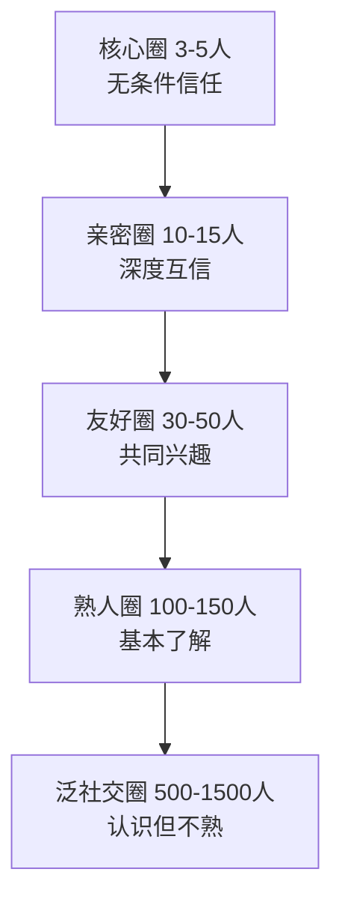
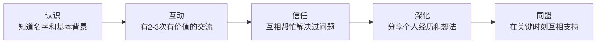

## 五、人际关系策略

人际关系是个人发展的"隐形基础设施"——它不像技能那样可以量化考核，却深刻影响着你能获得的机会质量、解决问题的速度、以及面对挫折时的心理韧性。本节从社交资本的底层逻辑出发，建立一套可操作的人际关系经营系统，帮助你在有限的时间和精力下，构建高质量的社交网络。

### 5.1 社交资本的深层逻辑

#### 5.1.1 什么是社交资本

人际关系不仅仅是"认识多少人"的问题，而是一种可以积累、投资和管理的资本。法国社会学家皮埃尔·布尔迪厄（Pierre Bourdieu）在1986年正式提出社会资本理论，指出社交资本是一种存在于关系网络中的实际或潜在资源，它可以像金融资本一样被转化为其他形式的价值——经济机会、信息优势、情感支持、社会地位。

布尔迪厄的核心洞察是：**你的社会关系网络本身就是一种资源，而这种资源的获取、维护和使用都有规律可循。** 这意味着人际关系不是纯粹靠"缘分"或"性格"决定的，而是可以通过策略性思维来经营的。

#### 5.1.2 社交资本的三种类型

哈佛大学教授罗伯特·帕特南（Robert Putnam）将社交资本细分为三种类型，每一种有不同的功能和经营方式：

| 类型 | 定义 | 核心功能 | 典型场景 |
|------|------|---------|---------|
| **连接性社交资本**（Bonding） | 同质群体内的紧密关系 | 情感支持、信任基础、资源互助 | 家人、挚友、同乡会 |
| **粘合性社交资本**（Bridging） | 跨群体的弱连接 | 信息流通、机会获取、视野拓宽 | 行业会议、跨部门同事、校友 |
| **链接性社交资本**（Linking） | 跨越权力层级的垂直连接 | 获取决策层资源、政策信息、高层支持 | 导师、行业领袖、政策制定者 |

三种资本的经营策略完全不同：

- **连接性资本**需要深度投入：长期陪伴、关键时刻的在场、无条件的信任积累。这类关系数量少但质量极高，是你的"安全网"。
- **粘合性资本**需要广度和频率：定期出现在不同圈子、主动分享信息、乐于做"中间人"。这是你获取新机会的主要渠道。
- **链接性资本**需要主动性和价值展示：向上社交的前提是你自身有足够的专业能力或独特价值，否则高层级的关系很难建立和维持。

**关键认知：** 大多数人过度经营连接性资本（和熟人反复社交），而严重低估粘合性和链接性资本的价值。研究表明，对你职业发展最有帮助的往往不是你的亲密好友，而是那些你不太熟悉的人——这就是社会学家马克·格兰诺维特（Mark Granovetter）提出的"弱关系力量"理论。

#### 5.1.3 邓巴数与社交分层

人类学家罗宾·邓巴（Robin Dunbar）基于大脑新皮层容量的研究提出，人类能维持的稳定社交关系上限约为150人（即"邓巴数"）。但这150人并非同等重要，而是呈同心圆分布：

| 层次 | 人数 | 关系特点 | 投入策略 | 时间分配建议 |
|------|------|---------|---------|------------|
| 核心圈 | 3-5人 | 无条件信任、深度连接、在你最困难时依然在身边 | 最大的情感和时间投入，双向奔赴 | 40%社交时间 |
| 亲密圈 | 10-15人 | 定期交流、互相支持、了解彼此近况 | 每周至少一次深度交流（电话/见面/长消息） | 25%社交时间 |
| 友好圈 | 30-50人 | 有共同兴趣、偶尔互动、需要时可以求助 | 每月保持联系（朋友圈互动/群聊/小聚） | 20%社交时间 |
| 熟人圈 | 100-150人 | 认识但不深入、特定场景下互动 | 每季度保持存在感（节日问候/转发分享） | 10%社交时间 |
| 泛社交圈 | 500-1500人 | 只是认识、可能叫不出名字 | 不需要主动维护，保持开放连接即可 | 5%社交时间 |

**实操要点：**

1. **定期审视你的圈子**：每季度花30分钟审视你的核心圈和亲密圈——哪些人还在？哪些人应该晋升或降级？关系是动态的，不审视就会被惯性驱动。
2. **接受邓巴数的限制**：你不可能和所有人都保持深度关系。与其广撒网，不如把有限的社交精力集中在各圈层最有价值的关系上。
3. **圈层晋升机制**：当一个人从熟人圈晋升到友好圈，或从友好圈晋升到亲密圈时，你需要主动增加互动频率和深度——这不会自动发生。

#### 5.1.4 社交资本的"复利效应"

社交资本有一个独特的属性：**它会随时间增值，前提是你要持续"存款"。** 每一次真诚的帮助、每一次有价值的分享、每一次关键时刻的在场，都是在你的"社交账户"中存款。而当你需要帮助时，就是在"取款"。

如果你只在需要帮助时才联系别人（只取不存），你的社交资本会迅速耗尽。这就是为什么很多人发现"认识很多人，但关键时候没人帮忙"——不是别人冷漠，而是你的社交账户余额为零。

### 5.2 人脉经营：有策略地建立和维护关系

#### 5.2.1 "给予者"心态

沃顿商学院教授亚当·格兰特（Adam Grant）在《给予与索取》中通过大量数据研究发现，在社交网络中"给予者"（Givers）占据两个极端——最成功的人和最失败的人都是给予者。区别在于：成功的给予者是有策略的给予，失败的给予者是无底线的付出。

**给予的价值维度：**

| 价值类型 | 具体形式 | 适用场景 | 示例 |
|---------|---------|---------|------|
| 信息价值 | 有价值的资讯、行业洞察、数据报告 | 专业社交 | 分享一篇行业研报并附上你的解读 |
| 连接价值 | 引荐合适的人脉、撮合合作 | 跨圈社交 | "我认识一个人，你们应该聊聊" |
| 技能价值 | 分享专业技能、帮解决技术问题 | 职场社交 | 帮同事调试一个代码bug |
| 情感价值 | 倾听、鼓励、陪伴、共情 | 亲密关系 | 朋友失意时的陪伴和理解 |
| 信誉价值 | 为他人背书、推荐、站台 | 向上社交 | 在重要场合推荐某人的能力 |
| 视角价值 | 真诚的反馈、不同角度的分析 | 深度交流 | 指出朋友方案中的盲点 |

**成为"成功给予者"的四条原则：**

1. **有策略地给予**：选择你能提供最大价值的领域来帮助他人。不要试图在所有方面都做老好人，而是在你的专业优势领域慷慨输出。
2. **设置边界**：学会说"不"。帮助他人不能影响你的核心任务和心理健康。格兰特的研究发现，无底线的给予者最终会耗尽自己，变得怨恨和低效。
3. **创造互惠**：你的给予应该激发良性循环，而不是单向付出。如果一段关系长期只有你单方面输出，需要重新评估这段关系的健康度。
4. **公开与私下兼顾**：公开的给予（如在社群中分享知识）建立声誉和广度，私下的给予（如一对一的深度帮助）深化信任和深度。

#### 5.2.2 "弱关系"的力量

格兰诺维特在1973年的经典论文《弱关系的力量》中发现了一个反直觉的事实：**对你职业发展最有帮助的往往不是你的亲密好友（强关系），而是那些你不太熟悉的人（弱关系）。**

原理很简单：强关系的人和你的信息圈重叠度高——你们认识同样的人、关注同样的信息源、拥有相似的视野。而弱关系能带来全新的信息、机会和视角。数据显示，超过80%的工作机会是通过弱关系获得的，而不是通过强关系。

**弱关系经营的实操方法：**

1. **参加行业活动和社群**：每月至少参加1-2个行业活动（线下优先于线上）。不是去"认识人"，而是去"被认识"——主动发言、提问、分享观点。
2. **维护"休眠关系"**：那些曾经联系但后来断联的人（前同事、校友、会议认识的人）是弱关系的金矿。每季度花1小时给10个休眠关系发一条个性化消息（不是群发模板）。
3. **做"桥梁人"**：主动将不同圈子的人连接起来。当你介绍A和B认识时，你同时加强了与A和B的关系，也提升了自己在两个圈子中的价值。
4. **在社交媒体上输出价值**：定期分享有深度的内容（不是转发鸡汤），让你的弱关系在信息流中看到你的专业能力。
5. **保持开放姿态**：对陌生人的求助和社交邀请保持开放态度。很多重要的弱关系就是从一次意外的互动开始的。

#### 5.2.3 人脉经营实操系统

理论再好也需要系统化的执行。以下是经过验证的人脉经营操作框架：

**第一步：建立关系档案**

为核心圈和亲密圈的每个人建立一份简单的档案，包含：

姓名：张三
关系类型：行业前辈/前同事
认识时间：2022年3月
认识场景：XX行业大会
核心信息：在XX公司做技术总监，孩子3岁，喜欢跑步
上次联系：2024年1月15日
互动频率：每两周一次
待办事项：下周推荐他认识李四（他们都在做AI方向）

**工具选择：**
- 轻量级：微信备注+标签（适合关系数<100人）
- 中等：Notion/Airtable数据库（适合100-500人）
- 专业：CRM工具如HubSpot免费版（适合500人以上）

**第二步：设定互动节奏**

| 圈层 | 互动频率 | 互动方式 | 检查机制 |
|------|---------|---------|---------|
| 核心圈 | 每周 | 深度对话、面对面、共同活动 | 月度审视 |
| 亲密圈 | 每两周 | 电话/视频/长消息 | 月度审视 |
| 友好圈 | 每月 | 朋友圈互动/群聊/小聚 | 季度审视 |
| 熟人圈 | 每季度 | 节日问候/内容分享/活动邀请 | 半年审视 |

**第三步：价值输出日历**

每月规划你的"社交价值输出"：

- **第1周**：分享一篇行业深度文章给3-5个可能感兴趣的人（附上你的解读）
- **第2周**：组织一次小型线上/线下交流（3-5人，跨圈子最佳）
- **第3周**：给2-3个需要帮助的人提供具体的支持
- **第4周**：回顾本月社交互动，更新关系档案，规划下月策略

**第四步：社交复盘**

每季度花1小时做一次社交复盘，问自己：

- 过去3个月，哪些关系得到了加强？哪些在衰退？
- 有没有新的弱关系可以发展为更深层的关系？
- 我的社交资本在增长还是在消耗？
- 有没有过度社交（占用太多时间）或社交不足（孤立自己）的倾向？

### 5.3 不同场景的社交策略

#### 5.3.1 职场社交

职场社交是最具功利价值的社交场景——它直接影响你的晋升速度、信息获取质量和工作体验。

**向上社交（与上级/高层的关系）：**

向上社交不是"拍马屁"，而是让你的价值被决策层看到。有效的向上社交策略：

1. **理解上级的压力和目标**：你的上级关心什么？他的KPI是什么？他的上级给他什么压力？理解这些，你才能提供真正有价值的支持。
2. **主动汇报，减少信息差**：定期向上级同步工作进展，不要等到被问才说。格式：进展+问题+建议方案（而不是只抛问题）。
3. **在公开场合展示专业能力**：会议发言、项目汇报、技术分享——这些都是让高层看到你的机会。
4. **寻求反馈而非赞美**：主动问"我哪里可以做得更好"比"我做得怎么样"更能建立信任。
5. **成为"解决方案的一部分"**：当团队遇到困难时，主动站出来承担，而不是缩在后面。

**平行社交（与同事的关系）：**

1. **跨部门项目**：主动参与跨部门项目是拓展组织内人脉最高效的方式。你不仅认识了其他部门的人，还在协作中展示了你的能力。
2. **午餐社交**：不要总和固定的几个人吃饭。每周至少有1-2次和不同团队的人共进午餐。
3. **分享而非竞争**：在不影响自身利益的前提下，乐于分享信息、经验和资源。同事间的信任是长期投资。
4. **处理竞争关系**：当你和同事存在竞争关系（如竞争同一个晋升机会），保持专业和友善。竞争是暂时的，关系是长期的。

**向下社交（与下属/新人的关系）：**

1. **投资培养下属**：你培养的下属会成为你未来最忠诚的盟友。不要吝啬时间和知识的分享。
2. **保持开放的沟通渠道**：让下属敢于向你反馈真实情况，而不是只说你想听的话。
3. **在关键时刻为下属站台**：当你的下属受到不公正对待时，你的态度决定了团队对你的信任程度。

#### 5.3.2 线上社交

线上社交已经不是"辅助手段"，而是现代社交的主战场之一。但很多人在线上社交中浪费了大量时间却收效甚微。

**平台选择策略：**

| 平台类型 | 适用场景 | 经营策略 | 时间投入建议 |
|---------|---------|---------|------------|
| 专业社交（LinkedIn/脉脉） | 求职、行业连接、B2B合作 | 完善档案+定期发布行业见解+主动连接目标人 | 每周2-3小时 |
| 内容平台（公众号/知乎/小红书） | 个人品牌建设、吸引同频者 | 持续输出垂直领域深度内容 | 每周3-5小时 |
| 即时通讯（微信/飞书） | 日常关系维护、深度交流 | 分层管理+个性化互动 | 每天30分钟 |
| 兴趣社群（Discord/知识星球） | 结识同好、深度交流 | 参与讨论+分享资源+组织活动 | 每周1-2小时 |

**线上社交的核心原则：**

1. **深耕1-2个平台，不要广撒网**：与其在5个平台都平庸，不如在1-2个平台做到头部。选择标准：你的目标受众在哪里活跃，你就去哪里。
2. **输出大于输入**：线上社交的货币是"有价值的内容"。你分享的每一条内容都在建立或削弱你的个人品牌。
3. **从线上到线下**：线上建立的弱关系如果不转化为线下互动，很难升级为更强的关系。当你和一个线上认识的人有了3-5次有价值的线上互动后，约一次线下见面。
4. **避免"点赞之交"**：不要满足于互相点赞的浅层互动。在对方的内容下留有深度的评论，比100个点赞更有价值。

#### 5.3.3 社交焦虑的应对

社交焦虑不是"性格内向"那么简单——它是一种可以被管理和改善的心理状态。以下是经过心理学验证的应对策略：

**认知层面：**

1. **识别灾难化思维**：社交焦虑者往往会想"如果我说错话，大家会嘲笑我"。实际上，大多数人更关注自己，而不是盯着你的每一个错误。心理学研究显示，我们高估了别人对我们的关注程度约2倍（"聚光灯效应"）。
2. **重新定义"社交成功"**：社交的目标不是"让所有人都喜欢我"，而是"和1-2个人建立真实的连接"。把目标从"成为全场焦点"降低到"和一个人有一次有意义的对话"，压力会骤减。
3. **接受不完美**：不是每次社交都会成功，不是每段关系都会发展。接受这个事实，反而能让你更放松地去社交。

**行为层面：**

1. **渐进暴露法**：从低压力的社交场景开始（如1对1的咖啡交流），逐步过渡到更大的场景（如小组讨论、行业活动）。每次成功后给自己正向反馈。
2. **准备"社交工具包"**：
   - 3-5个万能开场白（如"你是怎么进入这个行业的？""最近有什么让你兴奋的项目吗？"）
   - 2-3个你擅长聊的话题
   - 1个优雅退出对话的方式（如"很高兴和你聊天，我去打个招呼"）
3. **设定"社交配额"**：给自己设定可执行的目标，如"每周参加1次社交活动"、"每月认识2个新朋友"。有了具体目标，行动就更容易。
4. **社交后充电**：如果你是内向型人格，社交后需要独处时间来恢复能量。这是正常的，不是缺陷。规划社交活动时，给自己预留充电时间。

**深层工作：**

如果社交焦虑严重影响了你的生活和工作，建议寻求专业心理咨询。认知行为疗法（CBT）对社交焦虑的有效率高达75-80%。这不是软弱，而是对自己负责。

#### 5.3.4 跨文化社交

在全球化的今天，跨文化社交能力越来越重要——无论是和外国同事协作、参加国际会议、还是和不同文化背景的合作伙伴谈判。

**关键文化维度（基于霍夫斯泰德文化维度理论）：**

| 维度 | 高分文化特征 | 低分文化特征 | 社交影响 |
|------|------------|------------|---------|
| 个人主义vs集体主义 | 强调个人成就（美国、英国） | 强调群体和谐（中国、日本） | 直接赞美个人vs赞美团队 |
| 权力距离 | 接受等级差异（中国、印度） | 追求平等（北欧、荷兰） | 对上级的态度和沟通方式 |
| 不确定性规避 | 规则导向、风险规避（日本、德国） | 灵活开放（新加坡、丹麦） | 谈判和决策的风格差异 |
| 长期导向 | 注重长远关系和耐心（中国、韩国） | 注重即时结果（美国、英国） | 关系建立的速度和深度 |

**跨文化社交的实操建议：**

1. **提前了解对方文化的基本礼仪**：见面是握手还是鞠躬？谈话距离多远合适？送礼有什么禁忌？这些基础功课能避免很多尴尬。
2. **保持好奇心而非评判**：面对文化差异时，第一反应应该是"有意思，为什么他们这样做？"而不是"这样做好奇怪"。
3. **语言学习**：至少掌握一门外语的基础社交用语（问候、感谢、道歉、简单寒暄）。即使说得不好，努力本身就会赢得尊重。
4. **观察和模仿**：在不确定时，观察当地人怎么做，然后模仿。大多数文化对"善意的尝试"都是宽容的。
5. **建立跨文化盟友**：在每个你经常接触的外国文化中，找到一个可以帮你解释文化差异的"盟友"。这个人可以是该文化的朋友、同事或合作伙伴。

#### 5.3.5 高难度对话与冲突管理

人际关系中不可避免会出现冲突。大多数人面对冲突时有两个极端反应：要么激烈对抗，要么回避退让。这两种都不是有效策略。

**冲突管理的五步框架：**

**第一步：情绪管理——先处理情绪，再处理问题**

当冲突发生时，你的杏仁核（大脑的情绪中心）会先于前额叶（理性思考区域）做出反应。这意味着在情绪高峰期，你的判断力会严重下降。

实操技巧：
- **6秒暂停**：情绪爆发后，强迫自己等6秒再说话。这6秒足够让前额叶重新夺回控制权。
- **身体信号识别**：心跳加速、手心出汗、肌肉紧绷——这些都是情绪即将失控的信号。识别到这些信号时，主动要求"暂停5分钟"。
- **深呼吸**：4秒吸气-7秒屏息-8秒呼气。这个4-7-8呼吸法能快速激活副交感神经，降低应激反应。

**第二步：理解立场背后的利益**

哈佛谈判项目的研究表明，每个立场（"我要求加薪30%"）背后都有一个或多个利益（"我觉得自己的付出没有被认可"、"我需要更多的钱来支付孩子的学费"）。

区分立场和利益的方法：
- 问"为什么这对你是重要的？"而不是直接反驳对方的立场
- 列出对方可能的所有利益（不只是表面的）
- 寻找能满足双方核心利益的方案，而不是在立场上互相妥协

**第三步：使用"我"语句而非"你"语句**

| 无效表达（"你"语句） | 有效表达（"我"语句） |
|-------------------|-------------------|
| "你总是迟到，根本不在乎我的时间" | "当你迟到的时候，我会感到不被尊重，因为我特意调整了时间" |
| "你从来不听我说话" | "当我说话被打断时，我会感到沮丧，因为我觉得自己的想法没有被认真对待" |
| "你这样做太不负责任了" | "当这件事没有按时完成时，我会感到焦虑，因为这会影响整个项目的进度" |

"我"语句的公式：**"当（具体行为）发生时，我感到（情绪），因为（原因/影响）"**

**第四步：寻找共同点**

在讨论分歧之前，先确认双方的共同目标和价值观。这能将"你vs我"的对立框架转化为"我们一起解决问题"的合作框架。

示例："我知道我们都希望这个项目成功。我们现在的问题是时间安排，让我们一起看看有什么方案能既保证质量又按时交付。"

**第五步：聚焦未来解决方案**

不要纠缠于过去的对错——"谁对谁错"的讨论永远不会有结果，因为它只涉及过去。聚焦于未来的解决方案："下次遇到类似情况，我们怎么处理会更好？"

**冲突后的修复：**

冲突后的修复和冲突本身一样重要。一次冲突如果处理得当，反而能加深关系——因为你们一起经历并克服了一个困难。

修复步骤：
1. 主动发起修复对话（不要等对方先低头）
2. 承认自己在冲突中的责任（即使你认为自己只承担20%的责任）
3. 表达你对这段关系的重视
4. 一起制定"下次怎么办"的协议

### 5.4 关系的深度经营

#### 5.4.1 亲密关系的维护

亲密关系（核心圈和亲密圈）的维护不是靠偶尔的大行动，而是靠日常的小投入。

**亲密关系的"5:1法则"：** 心理学家约翰·戈特曼（John Gottman）在婚姻研究中发现，稳定幸福的关系中，积极互动与消极互动的比例至少为5:1。这个比例同样适用于亲密友谊和家庭关系。

每天的"微投入"清单：
- 一条关心的消息（"今天怎么样？"）
- 一个真诚的赞美（具体的、而非笼统的）
- 一次主动倾听（放下手机，全神贯注）
- 一个小小的帮助（不需要对方开口就注意到需求）
- 一次共同活动（一起吃饭、散步、看剧）

#### 5.4.2 导师关系的建立

拥有一位或多位导师（Mentor）是个人成长最快的途径之一。但很多人不知道如何找到导师、也不知道如何维护导师关系。

**找到导师的策略：**

1. **明确你需要什么类型的指导**：是职业方向？技术能力？行业洞察？管理技能？不同类型的需求对应不同的导师。
2. **从你已有的网络中寻找**：你的前领导、大学教授、行业前辈、甚至你的同事——导师不一定是"大人物"，而是比你在这个特定领域有更多经验的人。
3. **先建立价值再请求指导**：不要上来就问"你愿意做我的导师吗？"。先通过帮助对方（哪怕很小的事情）建立关系，然后再寻求指导。
4. **正式邀请**：当你和潜在导师有了几次互动后，可以正式邀请："我很敬佩您在XX领域的经验，如果方便的话，我能否每月和您请教一次？我会提前准备好问题，不占用太多您的时间。"

**维护导师关系的原则：**

- **尊重时间**：每次见面前准备充分，不浪费导师的时间
- **展示成长**：定期汇报你的进展和成果，让导师看到指导的价值
- **回馈价值**：导师关系不应该是单向的。找到你能为导师提供的价值（信息、视角、执行力支持）
- **感恩表达**：真诚地表达感谢，不仅是礼貌，更是对关系的投资

#### 5.4.3 "弱关系"升级为"强关系"的路径

弱关系向强关系的升级不是随机的，它遵循一个可观察的路径：

**升级的关键节点：**

1. **从"认识"到"互动"**：主动发起一次有价值的信息分享或问题请教。不要只发"你好"，要提供具体内容。
2. **从"互动"到"信任"**：主动提供一次帮助，且不求回报。或者在对方需要时，快速响应。
3. **从"信任"到"深化"**：在一次深度对话中，分享一些个人经历或真实想法。适度的脆弱性是深化关系的催化剂。
4. **从"深化"到"同盟"**：在一次关键事件中（如职业变动、项目危机）互相支持。共同经历困难是关系升级最快的方式。

### 5.5 社交中的常见误区

#### 误区一：人脉=通讯录里的人数

**真相**：通讯录里有3000人不等于你有3000条人脉。如果你给这3000人发消息求助，能收到回复的不超过30人。真正的人脉是那些在你需要时会回应的人——这才是你的实际社交资本。

**纠正方法**：定期清理你的"社交投资组合"，把精力集中在真正有双向互动的关系上。

#### 误区二：社交就是参加活动、交换名片

**真相**：参加10个活动、交换100张名片，如果不做后续跟进，等于零。社交的价值不在"认识"的那一刻，而在之后的维护和深化。

**纠正方法**：每次参加活动后24小时内，给3-5个你想继续联系的人发一条个性化消息（提到你们聊过的内容）。

#### 误区三：我性格内向，不适合社交

**真相**：内向不是社交的障碍。内向者在深度一对一交流中往往比外向者更有优势。社交不等于"在派对上和所有人打成一片"，而是"建立和维护有价值的关系"。

**纠正方法**：选择适合内向者的社交方式——小规模聚会、一对一咖啡、深度文字交流。质量远比数量重要。

#### 误区四：只要能力强，不需要搞关系

**真相**：能力是基础，但能力的展示和机会的获取都需要社交网络的支持。很多能力很强但社交薄弱的人，职业发展远不如能力中等但社交出色的人。

**纠正方法**：把社交能力视为和专业能力同等重要的"职业技能"来培养。

#### 误区五：社交就是功利的、不真诚的

**真相**：策略性的社交不等于虚伪的社交。你可以在保持真诚的前提下，有意识地选择在哪里投入社交精力。就像你有策略地规划职业发展一样，有策略地经营人际关系并不虚伪。

**纠正方法**：策略性社交的核心不是"装"，而是"选择"——选择在正确的时间、正确的场景、和正确的人建立真实的连接。

#### 误区六：关系好就不需要维护

**真相**：即使是最亲密的关系，长期不维护也会退化。很多人和最好的朋友渐行渐远，不是因为发生了矛盾，而是因为"太熟了，就不联系了"。

**纠正方法**：为你的核心关系设定"最低互动频率"，像对待重要会议一样对待和亲密朋友的定期交流。

### 5.6 进阶：构建你的社交生态系统

当你的人际关系经营从"随机社交"进化为"系统化经营"后，下一步是构建一个自运转的社交生态系统。

**社交生态系统的四个支柱：**

1. **信息枢纽**：你是多个信息圈的交叉点，别人从你这里获取跨圈子的有价值信息。
2. **信任网络**：你在多个圈子里建立了足够的信任，人们愿意向你求助，也愿意帮助你。
3. **价值交换平台**：你定期撮合不同圈子的人合作，创造1+1>2的价值。
4. **个人品牌**：你的专业能力和社交声誉已经超越了你的直接关系网，人们会主动找你建立连接。

**衡量你的社交健康度：**

每半年用以下指标自评（1-10分）：

| 指标 | 自评分 | 说明 |
|------|-------|------|
| 核心圈质量 | ___ | 你的核心3-5人是否在你需要时可靠？ |
| 弱关系多样性 | ___ | 你的弱关系是否覆盖了多个行业和领域？ |
| 向上链接 | ___ | 你是否有比你层级更高的信任关系？ |
| 价值输出频率 | ___ | 你每周为他人提供价值的频率如何？ |
| 社交满意度 | ___ | 你的社交生活是否让你感到充实而非疲惫？ |
| 社交效率 | ___ | 你投入的社交时间是否产生了足够的回报？ |

如果大多数指标低于5分，说明你的社交生态系统需要系统性调整。回到本节的方法论，从最薄弱的环节开始改进。

---

**本节要点回顾：**

- 社交资本分为连接性、粘合性和链接性三种，大多数人过度经营连接性而忽视另外两种
- 邓巴数（150人）限定了你能维护的关系数量上限，分层经营是关键
- "给予者"心态是人脉经营的核心，但需要有策略、有边界地给予
- 弱关系的力量强于强关系——80%以上的工作机会来自弱关系
- 不同社交场景（职场、线上、跨文化、冲突）需要不同的策略工具包
- 社交是需要系统化经营的"职业技能"，不是靠性格和运气就能做好的
