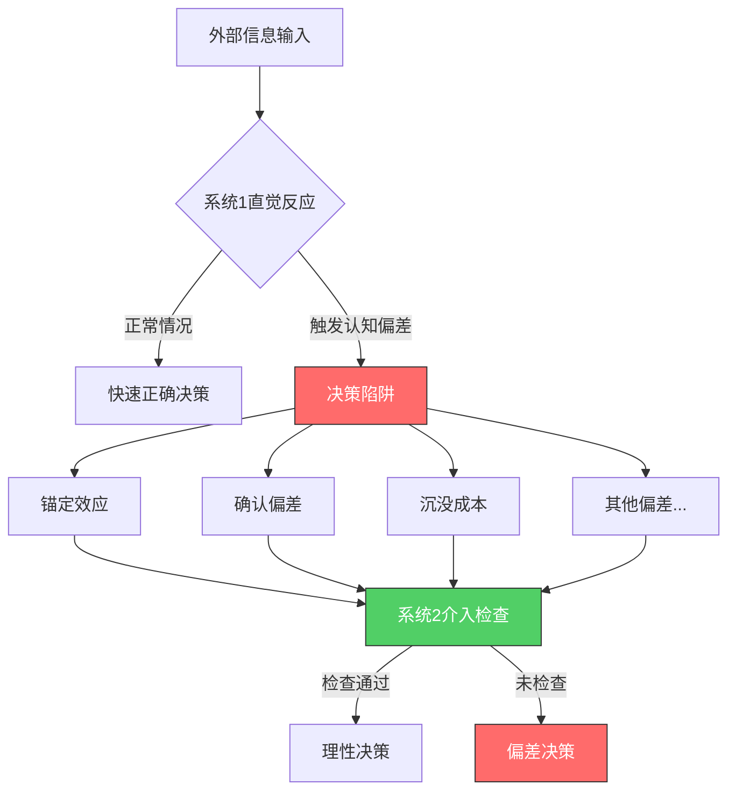
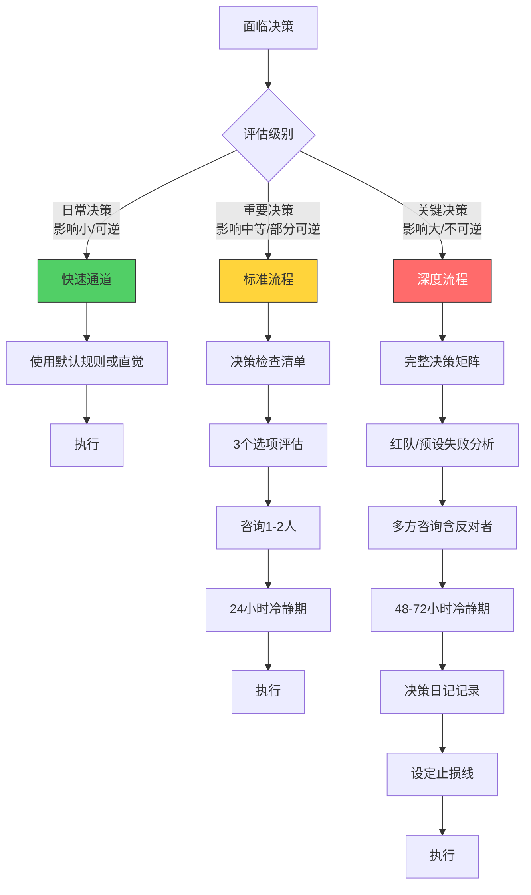

## 七、决策的常见陷阱与对策

决策是人类最高频也最高风险的认知活动。诺贝尔经济学奖得主丹尼尔·卡尼曼（Daniel Kahneman）在《思考，快与慢》中指出：人类大脑有两套思维系统——系统1（快速、直觉、自动）和系统2（缓慢、理性、费力）。绝大多数决策陷阱都源于系统1在不该主导的时候抢了方向盘。本章系统梳理决策中最常见的心理陷阱，深入剖析其认知机制，并提供经过验证的对策工具箱。

### 7.1 理解决策陷阱的认知根源

决策陷阱不是"粗心"或"不够聪明"的结果，而是大脑进化出的认知捷径（启发式）在现代复杂环境中的系统性失效。理解这一点至关重要——它意味着仅靠"提醒自己注意"是不够的，你需要建立结构性的防御机制。



认知偏差的三个特征决定了对策方向：

| 特征 | 说明 | 对策启示 |
|------|------|----------|
| 无意识性 | 你意识不到自己正在被偏差影响 | 需要外部触发机制（检查清单、他人提醒） |
| 系统性 | 偏差方向可预测，不是随机错误 | 可以设计针对性的对冲策略 |
| 抗纠正性 | 知道偏差存在不等于能自动避免 | 需要结构性工具，不能仅靠意志力 |

### 7.2 十大决策陷阱：机制、识别与对策

#### 7.2.1 锚定陷阱（Anchoring Trap）

**机制剖析：** 人类大脑在处理数值信息时，会不自觉地以最先接触到的数字作为"锚点"，后续的判断围绕这个锚点进行调整。关键问题在于——调整通常是不充分的。卡尼曼和特沃斯基的经典实验中，让受试者先转一个随机数字转盘（比如停在10或65），然后估计非洲国家在联合国中的百分比。转到10的人平均估计25%，转到65的人平均估计45%——一个完全随机的数字显著影响了判断。

**常见触发场景：**
- 薪资谈判：对方先报价，你的后续出价围绕这个数字波动
- 房产购买：挂牌价成为你心中的"参考标准"
- 项目评估：初始估算（即使很粗糙）成为后续所有调整的基准
- 商业谈判：第一个提出的条件设定了整个讨论的框架

**深层对策：**

1. **锚点对冲法**：在接触对方的锚点之前，先建立自己的独立锚点。面试前研究行业薪资中位数，看房前研究区域成交均价。
2. **极端锚点测试**：主动设想极端高值和极端低值，打破单一锚点的束缚。比如评估项目成本时，先问"如果一切顺利，最低成本是多少？"再问"如果最坏情况发生，最高成本是多少？"
3. **多源锚定**：从三个以上独立来源获取参考值，取中位数而非平均值（中位数对极端值更鲁棒）。
4. **事后审计**：回顾你的估计过程，问自己"如果初始信息完全不同，我的结论会变吗？"如果答案是"会"，说明你的判断受了锚点影响。

**真实案例：** 一位创业者在融资谈判中，投资人先提出"我们通常投300万占15%"。创业者原本的估值模型显示公司值3000万，但听到对方的锚点后，不自觉地将期望下调到2000万。如果他提前建立了自己的估值锚点（用DCF法和可比公司法得出），就不会被对方的数字牵着走。

#### 7.2.2 确认偏差（Confirmation Bias）

**机制剖析：** 确认偏差是所有认知偏差中影响最广泛、最持久的一种。它的运作方式是：一旦你形成了某个信念，大脑会自动——注意，是自动且无意识地——优先注意支持这个信念的信息，忽略或贬低矛盾信息。更可怕的是，你寻找"反面证据"的努力往往是表面的：你会找到反面证据，但给它更低的权重。

**神经科学基础：** fMRI研究表明，当人们接收到支持自己政治立场的信息时，大脑的奖励中枢（伏隔核）会被激活——确认偏差本质上是大脑在"奖励自己"。

**常见触发场景：**
- 招聘面试：前3分钟的好印象让你在后续30分钟里只关注候选人的优点
- 投资决策：看好某只股票后，自动过滤利空消息
- 技术选型：对某种技术栈的偏好让你低估其缺陷
- 人际关系：对某人的初始判断影响后续所有互动的解读

**深层对策：**

1. **红队思维（Red Team Thinking）**：在重大决策前，指定一个人或自己扮演"魔鬼代言人"，任务就是找理由反对你的方案。这不是形式主义——扮演者需要真正投入，找到至少3个有说服力的反对理由。
2. **预设失败分析（Pre-mortem）**：假设你的决策已经失败了，然后倒推"是什么原因导致了失败？"。这个方法由心理学家加里·克莱因提出，比"风险评估"更有效，因为它绕过了乐观偏差。
3. **决策矩阵法**：将所有选项的优缺点列成表格，对每个因素赋予权重，计算加权得分。这个过程强迫你面对那些你不想看的因素。
4. **外部视角法（Outside View）**：问自己"在类似情况下，其他人的成功率是多少？"。如果你要做一个创业项目，不要只看自己的计划多完美，先看看同行业创业者的统计数据。

**决策矩阵示例：**

| 评估因素 | 权重 | 方案A得分 | 方案B得分 | 方案C得分 |
|---------|------|----------|----------|----------|
| 成本 | 0.25 | 8 | 6 | 9 |
| 时间 | 0.20 | 7 | 9 | 5 |
| 质量 | 0.30 | 9 | 7 | 8 |
| 风险 | 0.15 | 6 | 8 | 7 |
| 可扩展性 | 0.10 | 5 | 8 | 6 |
| **加权总分** | **1.00** | **7.35** | **7.40** | **7.15** |

#### 7.2.3 沉没成本谬误（Sunk Cost Fallacy）

**机制剖析：** 经济学中最基本的原则之一是"沉没成本不应影响未来决策"，但这与人类的损失厌恶心理直接冲突。损失厌恶系数约为2.0——放弃已投入的东西带来的痛苦，是获得同等价值东西带来的快乐的两倍。这就是为什么你明知一个项目应该止损，却总觉得"再坚持一下"。

**更隐蔽的变体：**
- **升级承诺（Escalation of Commitment）**：不仅不放弃，反而追加投入来"证明之前的决定是对的"。越战中美军的持续增兵就是经典案例。
- **身份绑定**：将项目与自我身份绑定（"这个项目代表了我的能力"），导致客观评估变得几乎不可能。
- **虚假希望综合征**：用"也许再投入一点就能回本"的幻想来合理化继续投入。

**深层对策：**

1. **归零测试（Zero-Based Thinking）**：问自己"如果我今天没有投入任何东西，我会选择开始这个项目吗？"如果答案是否定的，那就应该止损。这个方法强制你剥离沉没成本来评估未来价值。
2. **机会成本视角**：继续投入意味着放弃其他机会。把继续投入的成本转化为"我放弃了什么"来思考。
3. **预设止损线**：在开始项目前就定义"如果出现X情况，我就止损"。将止损决策从事后的感性挣扎变成事前的理性规则。
4. **外部顾问**：让不带情感包袱的外部人士评估你的项目。他们没有沉没成本的心理负担，能给出更客观的判断。

**真实案例：** 某软件公司在内部管理系统项目上已经投入800万和2年时间，但系统的技术架构已经过时，市场上有更好的现成方案（200万即可部署）。管理层因为"已经投了这么多"而继续追加预算。归零测试的答案很清楚：如果从零开始，没有人会选择自研这个系统。最终公司止损，采用现成方案，节省了后续预计的1200万投入。

#### 7.2.4 可得性偏差（Availability Bias）

**机制剖析：** 大脑判断某件事发生的概率时，不是去查统计数据，而是看"这件事有多容易被想起来"。越生动、越近期、越情绪化的事件越容易被回忆，因此会被认为更可能发生。这就是为什么飞机失事后很多人改坐火车——尽管统计数据明确显示飞行比驾车安全得多。

**常见触发场景：**
- 风险评估：媒体报道的罕见风险（如恐怖袭击）被高估，常见的致命风险（如心血管疾病）被低估
- 招聘决策：最近面试的候选人印象更深，影响公平评估
- 项目管理：最近发生的问题获得过多关注，忽略了统计上更常见的风险
- 健康决策：亲友的个案经历比医学统计数据更能影响你的健康选择

**深层对策：**

1. **基准率查询**：在做概率判断前，强制自己查一次统计数据。"这件事的实际发生率是多少？"
2. **频率而非概率**：将概率转化为具体数字。"这个项目失败的概率是30%"不如"每10个类似项目中有3个失败"更有冲击力。
3. **多元信息源**：不要只看新闻报道和社交媒体，主动查阅学术研究和行业报告。
4. **时间衰减校正**：提醒自己，最近看到的信息并不代表整体趋势。刻意回顾更长时间范围的数据。

#### 7.2.5 过度自信偏差（Overconfidence Bias）

**机制剖析：** 过度自信是人类最稳定、最普遍的认知偏差之一。研究反复表明，当人们说"我有90%的把握"时，实际正确率只有70-75%。过度自信有三种表现形式：
- **校准偏差**：对自己的判断过于确定（置信区间过窄）
- **优于平均效应**：70%的司机认为自己的驾驶水平高于平均
- **规划谬误**：系统性地低估完成任务所需的时间和资源

**深层对策：**

1. **置信区间校准训练**：做练习题时给出90%置信区间，长期追踪你的校准度。目标是让90%的区间真正包含90%的正确答案。
2. **参考类别预测（Reference Class Forecasting）**：不要只看自己的计划，看看同类项目的统计数据。你的项目预计3个月完成？看看行业平均是多久。
3. **事前验尸（Pre-mortem）**：假设项目失败，列出所有可能的原因。这比乐观地列风险清单有效得多。
4. **决策日志追踪**：记录你的预测和实际结果。当你看到自己的预测准确率只有60%时，过度自信自然会收敛。

**规划谬误的经典案例：** 悉尼歌剧院预计4年完工、预算700万澳元，实际耗时16年、花费1.02亿澳元。这不是特例——大型基础设施项目平均超预算80%、超工期20%。

#### 7.2.6 框架效应（Framing Effect）

**机制剖析：** 同一个事实，用不同的方式表述，会导致截然不同的决策。经典实验：手术存活率90% vs 手术死亡率10%——前者的接受度显著更高，尽管信息完全相同。框架效应之所以强大，是因为人们通常意识不到自己正在被框架影响。

**常见触发场景：**
- 产品定价："每月仅需99元"比"每年1188元"听起来便宜
- 营销话术："95%无脂"比"含5%脂肪"更有吸引力
- 管理汇报："项目完成了80%"比"项目还有20%未完成"更正面
- 谈判策略："你将获得X" vs "如果你不接受，你将失去X"

**深层对策：**

1. **多框架重构**：对同一个问题，至少用三种不同的方式重新描述。正面框架、负面框架、中性框架各写一遍。
2. **数字归一化**：把所有表述转化为同一单位和同一时间尺度的数字。"每天10元"、"每月300元"、"每年3650元"放在一起看。
3. **零基框架**：去掉所有修饰语，只看原始数据和事实。
4. **反向测试**：如果一个选项在正面框架下看起来好但在负面框架下看起来差，说明你需要更仔细地分析真实价值。

#### 7.2.7 群体思维（Groupthink）

**机制剖析：** 社会心理学家欧文·贾尼斯（Irving Janis）在分析猪湾事件等重大决策失误后提出了群体思维理论。当群体凝聚力过强时，成员会不自觉地追求一致性，压制异议，导致集体做出明显不合理的决策。

**群体思维的八个症状：**
1. 无敌幻觉：群体相信自己不会犯错
2. 集体合理化：为决策找理由来忽略警告
3. 坚信群体道德：认为群体的决定天然正确
4. 对外群体的刻板印象：看不起反对者的意见
5. 对异议者施压：直接或间接地惩罚持不同意见的人
6. 自我审查：成员主动隐藏疑虑
7. 一致同意的幻觉：沉默被误读为同意
8. 心理防御者：成员主动屏蔽外部矛盾信息

**深层对策：**

1. **匿名预投票**：在讨论前让每个人匿名写下自己的判断和理由。这确保每个人的意见在被群体影响前就被记录。
2. **指定反对者**：每次会议指定一个人专门提出反对意见，这个角色应该轮流担任。
3. **外部邀请**：定期邀请不参与项目的人参加会议，他们没有维护和谐的动机。
4. **分组独立讨论**：将大组拆成2-3个小组分别讨论，再汇总结果。小组之间的差异会暴露被压制的异议。
5. **领导最后发言**：如果团队领导先表态，其他人会倾向于附和。领导应该在听完所有意见后再发言。

**真实案例：** NASA的挑战者号航天飞机灾难（1986年）是群体思维的经典案例。工程师们对O型环在低温下的安全性有严重担忧，但在"不能延误发射"的群体压力下，这些担忧被逐步合理化和压制。事后分析表明，如果决策过程允许独立表达异议，悲剧很可能被避免。

#### 7.2.8 现状偏差（Status Quo Bias）

**机制剖析：** 人类对改变有一种本能的抗拒，即使改变明显有利。这源于损失厌恶——改变意味着放弃已知的东西（确定的），去获得未知的东西（不确定的）。即使现状明显不理想，"不确定性"本身就被大脑解读为损失。

**常见触发场景：**
- 职业发展：在一份不满意的工作上待了多年，总觉得"再等等看"
- 投资组合：不愿意卖出亏损的股票，即使有更好的投资机会
- 产品设计：不愿意改变已有的功能，即使用户反馈明确要求改进
- 组织变革：公司明知流程低效，但"一直以来都是这样做的"

**深层对策：**

1. **归零选择测试**：问自己"如果我现在不在这个位置/不做这件事，我会选择它吗？"如果答案是否定的，现状就不是最优选择。
2. **变更成本明确化**：列出维持现状的长期成本，与改变的短期成本对比。很多时候，不变的代价远高于改变。
3. **小步实验**：不需要一次性做出巨大改变。先做一个小规模的试点，降低不确定性。
4. **设定审查节点**：定期（如每季度）审查当前的状态，问"如果今天是第一天，我还会做同样的选择吗？"

#### 7.2.9 决策疲劳（Decision Fatigue）

**机制剖析：** 意志力和决策能力是有限的认知资源，会随着使用而消耗。心理学家罗伊·鲍迈斯特（Roy Baumeister）的研究表明，在做出一系列决策后，后续决策的质量会系统性地下降。这解释了为什么：
- 购物者在商场逛久了更容易买不需要的东西
- 法官在午餐前做出的假释决定明显更严厉
- CEO们穿着同样的衣服（乔布斯的黑色高领毛衣、扎克伯格的灰色T恤）来减少日常决策消耗

**深层对策：**

1. **决策排程**：把最重要的决策安排在精力最充沛的时候（通常是上午）。不重要的决策推到下午或委托他人。
2. **决策自动化**：为重复性决策建立规则。"周一到周五穿什么"、"午餐吃什么"、"每天几点运动"——把这些变成自动执行的习惯。
3. **决策配额**：每天给自己设定一个"决策预算"。如果今天已经有5个重要决策，第6个就应该推迟到明天。
4. **能量管理**：充足的睡眠、规律的运动、适当的休息都能恢复决策能力。这不是鸡汤，而是神经科学事实——前额叶皮层的葡萄糖消耗与决策质量直接相关。
5. **默认选项设计**：提前为常见场景设定默认选项。只有当情况明显偏离默认时，才需要消耗决策能量。

#### 7.2.10 情绪干扰（Emotional Interference）

**机制剖析：** 情绪不是决策的"敌人"——它提供了重要的价值信号。问题是当情绪强度与决策重要性不匹配时，比如在愤怒时做人事决定、在兴奋时做投资决定、在恐惧时做战略决定。杏仁核（情绪中枢）的激活会抑制前额叶皮层（理性中枢）的功能，导致你做出平时不会做的决定。

**常见触发场景：**
- 愤怒时：发送后悔的邮件、做出报复性决定、解雇不该解雇的人
- 恐惧时：过度保守、错过重大机会、在市场低点恐慌卖出
- 兴奋时：过度乐观、忽略风险、在市场高点追涨
- 悲伤时：低估自己的能力、做出过于保守的选择
- 焦虑时：过度分析、无法做出决定、拖延

**深层对策：**

1. **24小时冷静期**：任何重大决策，至少等待24小时。这不是拖延，而是给情绪消退的时间。把你的初步决定写下来，第二天再看——你会发现很多想法会改变。
2. **情绪标签化**：在做决定前，先明确命名你当前的情绪。"我现在感到愤怒/恐惧/兴奋"。研究表明，仅仅是命名情绪就能降低其强度（称为"情感标签化效应"）。
3. **身体状态检查**：饥饿、疲劳、生病时不做重大决定。这些生理状态会放大情绪反应。
4. **情绪日记**：记录你在什么情绪状态下做出了什么决定，以及结果如何。长期积累后，你会识别出自己的情绪-决策模式。
5. **物理隔离**：情绪激动时，物理上离开决策环境。去散步、运动、或做一件完全不同的事。

### 7.3 决策日记系统：从记录到优化

决策日记不仅仅是"记录"，它是一个完整的反馈系统，帮助你识别自己的决策模式、校准认知偏差、持续提升决策质量。

#### 7.3.1 决策日记的核心模板

```markdown
## 决策记录 #{{编号}}

### 基本信息
- **日期**：{{YYYY-MM-DD}}
- **决策事项**：{{具体描述}}
- **决策类型**：{{日常/重要/关键}}
- **时间压力**：{{低/中/高}}

### 背景分析
- **触发因素**：{{什么情况导致需要做这个决定？}}
- **关键信息**：{{我掌握了哪些信息？}}
- **信息缺口**：{{我还不知道什么？}}
- **利益相关方**：{{谁会受到影响？}}

### 选项评估
| 选项 | 优势 | 劣势 | 预期结果 | 概率估计 |
|------|------|------|----------|----------|
| A: {{描述}} | | | | % |
| B: {{描述}} | | | | % |
| C: {{描述}} | | | | % |

### 决策过程
- **使用的决策方法**：{{直觉/分析/咨询/投票...}}
- **咨询了谁**：{{或"未咨询"}}
- **当时的情绪状态**：{{1-10分}}
- **当时的身体状态**：{{精力充沛/一般/疲惫}}
- **信心水平**：{{1-10分}}
- **选择的方案**：{{A/B/C}}

### 预期与实际
- **预期结果**：{{具体描述}}
- **预期时间线**：{{何时能看到结果？}}
- **实际结果**：{{事后填写}}
- **实际时间线**：{{事后填写}}

### 偏差自查（事后填写）
- [ ] 我是否受到了锚点的影响？
- [ ] 我是否只关注了支持性证据？
- [ ] 沉没成本是否影响了我的判断？
- [ ] 我是否过度自信？
- [ ] 情绪是否干扰了决策？
- [ ] 我是否受到了框架效应的影响？

### 反思与教训
- **做得好的地方**：
- **可以改进的地方**：
- **下次会怎么做**：
```

#### 7.3.2 决策日记的使用方法

**记录频率：** 不需要记录每个决定。聚焦于三类决策：
1. 不可逆或难以逆转的重大决策
2. 涉及重大资源（时间、金钱、人力）的决策
3. 结果出乎意料的决策（无论好坏）

**回顾节奏：**
- **每周回顾**：快速浏览本周的决策记录，识别是否有遗漏的偏差
- **月度分析**：统计本月决策的预期vs实际吻合度，计算校准率
- **季度总结**：识别系统性的偏差模式，调整决策流程

**校准率计算方法：**

校准率 = 实际结果与预期一致的决策数 / 总决策数 × 100%

偏差方向统计：
- 乐观偏差比例 = 实际结果差于预期的比例
- 悲观偏差比例 = 实际结果好于预期的比例
- 时间低估比例 = 实际用时超过预期的比例

### 7.4 不确定性下的决策框架

现实中，你永远不会有完美的信息。以下框架帮助你在信息不完全时做出更可靠的决策。

#### 7.4.1 贝佐斯的"单向门/双向门"框架

亚马逊创始人杰夫·贝佐斯提出的决策分类法：

| 类型 | 特征 | 决策策略 | 决策速度 |
|------|------|----------|----------|
| **单向门（不可逆）** | 做了就回不来，错误成本高 | 深入分析，收集更多信息，多方咨询 | 慢——值得花时间 |
| **双向门（可逆）** | 可以撤销或调整，试错成本低 | 快速决定，先做再调，用数据迭代 | 快——不要过度分析 |

**实操步骤：**
1. 评估可逆性：这个决定能在多大程度上被撤销？
2. 评估时间敏感性：拖延这个决定的代价有多大？
3. 根据可逆性和时间压力选择决策策略
4. 对于双向门决策，设定一个"最迟决定时间"，在此之前快速行动

#### 7.4.2 70%信息原则

贝佐斯和美军将领科林·鲍威尔都推崇的原则：当你掌握了约70%的信息时，就应该做出决定。等待100%的信息意味着你已经错过了最佳时机。

**为什么是70%？**
- 低于50%：信息太少，决定接近赌博
- 50-70%：边际信息价值递减，但机会窗口开始关闭
- 70-90%：最佳决策区间，信息足够判断方向，又不至于错过时机
- 超过90%：信息已经充分，但机会可能已经溜走

**适用条件：**
- 决策是可逆的（双向门）
- 市场或环境变化迅速
- 存在明确的时间窗口
- 你可以通过行动获取更多信息（边做边学）

**不适用条件：**
- 决策不可逆且后果严重
- 存在法律或安全约束
- 信息获取成本很低且速度很快

#### 7.4.3 预期价值分析（Expected Value Analysis）

当面对不确定的结果时，用预期价值来量化决策：

**计算公式：**

预期价值 = Σ (每种结果的概率 × 该结果的价值)

示例：是否跳槽到创业公司？
- 选项A（留在原公司）：
  - 90%概率：年薪30万，稳定增长 → 价值30万
  - 10%概率：公司裁员 → 价值0
  - 预期价值 = 0.9×30万 + 0.1×0 = 27万

- 选项B（加入创业公司）：
  - 30%概率：公司成功，年薪+股权价值100万 → 价值100万
  - 50%概率：公司平稳，年薪25万 → 价值25万
  - 20%概率：公司失败，失业6个月 → 价值-10万
  - 预期价值 = 0.3×100万 + 0.5×25万 + 0.2×(-10万) = 40.5万

**注意事项：**
- 概率估计本身就有不确定性，建议给出敏感性区间
- 金钱价值不等于效用价值——对大多数人来说，损失10万的痛苦远大于获得10万的快乐
- 有些价值难以量化（如工作满足感、家庭时间），需要定性考虑

#### 7.4.4 最小化后悔框架

当你无法用概率和数字做出判断时，使用"最小化后悔"原则：

1. 列出所有可能的选项
2. 对每个选项，想象"如果选了它，最坏的结果是什么？"
3. 对每个选项，问"如果我80岁回顾今天，我会后悔选择/不选择这个吗？"
4. 选择那个在最坏情况下后悔最小的选项

这个框架特别适合以下场景：
- 职业选择（"我会后悔没有尝试吗？"）
- 创业决策（"我会后悔没有抓住这个机会吗？"）
- 重大人生决定（移居海外、结束关系等）

### 7.5 高级决策工具箱

#### 7.5.1 决策检查清单（Decision Checklist）

在做重要决策前，逐项检查以下内容：

```markdown
## 决策前检查清单

### 信息质量
- [ ] 我的信息来源是否多元？（至少3个独立来源）
- [ ] 我是否区分了事实和意见？
- [ ] 我是否考虑了"我不知道什么"？（信息缺口）
- [ ] 我的信息是否过时？（时效性检查）

### 偏差检查
- [ ] 我是否在情绪平静时做这个决定？
- [ ] 我是否受到了初始信息的锚定？
- [ ] 我是否主动寻找了反面证据？
- [ ] 沉没成本是否影响了我的判断？
- [ ] 我是否过度自信？（校准检查）
- [ ] 我是否考虑了维持现状的隐性成本？

### 选项质量
- [ ] 我是否至少考虑了3个选项？（避免二元思维）
- [ ] 我是否考虑了"什么都不做"这个选项？
- [ ] 每个选项的最坏情况是什么？
- [ ] 这个决定是否可逆？（单向门/双向门判断）

### 决策过程
- [ ] 我是否咨询了持不同意见的人？
- [ ] 我是否给了自己足够的思考时间？
- [ ] 我是否做了"事前验尸"（假设失败找原因）？
- [ ] 我是否用不同的框架重新描述了这个问题？
```

#### 7.5.2 费米估算训练

费米估算是指通过分拆问题、逐层估计来得出数量级合理的近似值。这个技能能显著提升你在信息不完全时的判断能力。

**练习方法：**
1. 选择一个你不知道确切答案的数量问题（如"你所在城市有多少家咖啡店？"）
2. 将问题拆解为可估计的子问题（城区面积 × 单位面积咖啡店密度）
3. 对每个子问题给出区间估计（不是点估计）
4. 计算最终结果的区间
5. 查找真实数据验证

**费米估算模板：**

问题：{{要估算的数量}}

拆解：
- 因素A：{{描述}} → 估计值：{{区间}}
- 因素B：{{描述}} → 估计值：{{区间}}
- 因素C：{{描述}} → 估计值：{{区间}}

计算：
- 最小值 = A_min × B_min × C_min = {{结果}}
- 最大值 = A_max × B_max × C_max = {{结果}}
- 最佳估计 = A_mid × B_mid × C_mid = {{结果}}

验证：{{查找实际数据}}
校准偏差：{{实际值 vs 估计值}}

#### 7.5.3 决策复盘的五个层次

决策复盘不是简单的"对错判断"，而是分层深入的系统分析：

| 层次 | 问题 | 目的 |
|------|------|------|
| 第1层：结果层 | 结果是好是坏？ | 基本评估 |
| 第2层：过程层 | 决策过程是否合理？ | 区分运气和能力 |
| 第3层：信息层 | 当时的信息是否充分？ | 检验信息收集能力 |
| 第4层：偏差层 | 是否存在认知偏差？ | 识别系统性弱点 |
| 第5层：系统层 | 如何改进决策系统？ | 长期能力建设 |

**关键洞察：** 一个好的决策过程可能产生坏结果（因为运气），一个坏的决策过程也可能产生好结果（也是因为运气）。不要因为结果好就觉得决策对，也不要因为结果差就觉得决策错。聚焦于过程的改进，而非结果的评判。

### 7.6 团队决策的特殊陷阱

当决策从个人扩展到团队时，除了上述个人偏差外，还会出现团队特有的陷阱。

#### 7.6.1 信息瀑布（Information Cascade）

当团队成员依次表态时，前面的人的意见会影响后面的人。即使每个人私下都有疑虑，但他们看到前面所有人都同意，就会推断"也许他们知道什么我不知道的"，于是也同意——形成虚假的共识。

**对策：**
- 同时收集所有人的意见（匿名投票、同时写下想法）
- 在讨论前先让每个人独立分析
- 鼓励"第一个吃螃蟹"——第一个发言的人要大胆表达真实看法

#### 7.6.2 群体极化（Group Polarization）

群体讨论不仅会趋向一致，还会趋向极端。如果成员初始倾向于冒险，讨论后会更冒险；如果初始倾向于保守，讨论后会更保守。这是因为：
- 人们倾向于提出更极端的观点来显得"有见地"
- 重复听到类似观点会强化原有立场
- 社会比较效应使人们向群体的"平均方向"移动

**对策：**
- 引入外部视角——让不参与讨论的人独立评估
- 设定"极端值预警"——当决策方向明显偏激时触发暂停
- 分组独立讨论后对比结果

#### 7.6.3 责任分散（Diffusion of Responsibility）

当"所有人都参与决策"时，反而没人真正为结果负责。"集体决定"往往意味着"没人负责"。

**对策：**
- 明确指定决策负责人（DRI：Directly Responsible Individual）
- 团队提供输入，但最终由一个人做决定并承担责任
- 记录每个人的建议和理由，便于事后复盘

### 7.7 构建个人决策防护体系

识别单个陷阱只是第一步。真正的目标是建立一个系统性的防护体系，让你在面对任何决策时都有一套可靠的流程。

#### 7.7.1 分级决策流程



#### 7.7.2 个人决策能力的持续提升路径

决策能力的提升是一个渐进过程，建议按以下阶段推进：

**阶段一：意识建立（第1-2周）**
- 学习本章的十大陷阱，能识别它们的名称和基本特征
- 开始记录决策日记，每天至少记录1个决策
- 保持对自身决策过程的觉察

**阶段二：工具应用（第3-6周）**
- 在重要决策中使用决策检查清单
- 练习费米估算，每周至少做3次
- 开始使用决策矩阵评估选项
- 在团队讨论中尝试指定反对者

**阶段三：模式识别（第7-12周）**
- 回顾决策日记，识别自己的系统性偏差
- 统计预期vs实际的吻合度，计算校准率
- 针对性地强化自己的薄弱环节

**阶段四：直觉校准（第13周以后）**
- 你的直觉开始被数据校准，快速判断的准确率提升
- 能在决策过程中实时识别偏差并纠正
- 建立起适合自己的决策流程和工具组合
- 开始帮助他人识别和避免决策陷阱

**最终目标不是消除偏差（不可能），而是建立一套能自动检测和纠正偏差的系统。** 就像飞行员依赖检查清单来避免人为失误一样，你需要一套决策流程来保护自己免受认知偏差的影响。

决策质量的提升是复利式的——每一个更好的决策都会为后续决策创造更好的条件。从今天开始记录你的第一个决策日记，这就是你的决策能力复利增长的起点。
