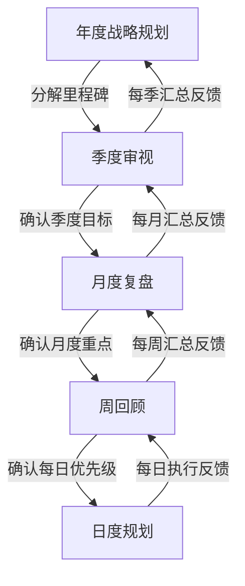

## 八、综合规划模板

前面七节分别拆解了人生战略框架、职业发展、财务规划、学习成长、人际关系、决策工具和决策陷阱。本节将这些分散的模块整合为一套可落地的规划模板体系——从年度战略到每日行动，从系统性的深度复盘到快速的周度检查，让你拥有一套"开箱即用"的个人规划操作系统。

### 8.1 为什么需要规划模板

很多人对"规划"有两个误解：要么觉得规划就是写一份漂亮的计划然后束之高阁，要么觉得规划太死板会束缚自己。这两个极端都源于一个根本问题——**没有把规划变成可重复、可迭代的系统**。

模板的价值在于：

| 没有模板的规划 | 有模板的规划 |
|:---:|:---:|
| 每次从零开始，消耗大量意志力 | 框架固定，填入当期内容即可 |
| 容易遗漏关键维度 | 查漏补缺，系统覆盖 |
| 复盘时缺乏对比基准 | 历史数据可追溯，趋势可分析 |
| 做着做着就忘了当初的目标 | 定期触发回顾，保持方向感 |
| 凭感觉做决策 | 用结构化框架约束认知偏差 |

本节提供五个时间尺度的模板，分别对应年度、季度、月度、周度和日度，覆盖个人规划的完整周期。

### 8.2 年度战略规划模板

年度规划是最具战略性的规划。它回答的是"今年我要重点攻克什么"以及"今年的行动如何服务于我的人生愿景"。建议每年年初（或你的生日月）花一个完整的工作日来完成。这不是浪费时间——这一天的投入，可以避免你用365天去弥补方向上的错误。

#### 8.2.1 Part 1：年度回顾与反思（2小时）

这一步的本质是**校准基线**。不回顾就定计划，等于闭着眼睛画靶子。

**操作要点**：先不翻任何记录，凭记忆回答以下问题，写完后再翻阅日记、日历、聊天记录等做补充。两次答案的差异本身就是有价值的信号——你的记忆偏好暴露了哪些事情对你真正重要。

**1. 成就盘点（30分钟）**

回答以下问题，每个成就用完整的 STAR 框架描述（Situation 情境 → Task 任务 → Action 行动 → Result 结果）：

- 过去一年你最骄傲的3个成就是什么？
- 这些成就背后，你运用了哪些核心能力？（参照第1节SWOT分析中的优势识别）
- 哪些成就超出了你年初的预期？是什么因素促成了这个超额？

**2. 遗憾与教训（30分钟）**

- 过去一年最大的3个遗憾是什么？
- 每个遗憾的根本原因是什么？（用5Why分析法追问：问五次"为什么"直到触达根本原因）
- 如果重来一次，你会怎么做？这个新做法是否可以写入今年的行动清单？

**3. 人生轮打分（30分钟）**

参照人生轮的8个维度，为自己过去一年的状态打分（1-10分）：

| 维度 | 打分标准 | 去年分数 | 今年目标 |
|:---:|:---|:---:|:---:|
| 健康与活力 | 体能、睡眠、饮食、运动习惯 | _ | _ |
| 职业与事业 | 工作满意度、职业成长、收入增长 | _ | _ |
| 财务状况 | 储蓄率、投资收益、财务安全感 | _ | _ |
| 学习与成长 | 新技能获取、阅读量、认知升级 | _ | _ |
| 人际关系 | 核心关系质量、社交圈广度与深度 | _ | _ |
| 家庭与亲密 | 家庭和谐度、亲密关系质量 | _ | _ |
| 娱乐与爱好 | 生活乐趣、爱好的投入与收获 | _ | _ |
| 使命与贡献 | 社会参与、利他行为、人生意义感 | _ | _ |

**关键提示**：不要所有维度都想拉到满分。人的精力有限，识别2-3个今年需要重点突破的维度，其余维度维持现状即可。详见第3节"财务规划策略"和第4节"学习成长策略"中关于资源分配的讨论。

**4. 关键数字回顾（30分钟）**

数据是冷酷但诚实的。回顾以下硬指标：

```text
□ 收入总额 & 收入结构（工资/副业/投资）
□ 储蓄率 = （收入-支出）/ 收入
□ 阅读量（本数）& 深度阅读占比
□ 运动次数 & 每次平均时长
□ 有效社交次数（深度对话 > 30分钟）
□ 新掌握的技能数量
□ 重大决策数量 & 决策质量回顾（参照第7节决策日志）
```

#### 8.2.2 Part 2：战略审视（1.5小时）

回顾完成后，抬头看看方向是否正确。

**1. 愿景校准（20分钟）**

拿出你之前写下的人生愿景（如果还没有，参照第1节"人生战略规划框架"中1.3节的方法来创建）。逐字读一遍，然后问自己：

- 这个愿景是否仍然让我感到兴奋和心动？
- 如果我明天就实现了这个愿景，我会满足吗？
- 过去一年的经历是否改变了我真正想要的东西？

如果答案显示你的愿景需要调整，先不急着改。在旁边记下疑虑，等年度规划做完再回头看。很多时候，愿景的不适感来自于短期挫折，而不是方向真的变了。

**2. 宏观环境扫描（30分钟）**

用 PEST 框架扫描你所处的大环境：

| 维度 | 关注点 | 今年的变化 | 对我的影响 |
|:---:|:---|:---|:---|
| **P** 政策/政治 | 行业政策、监管趋势 | _ | _ |
| **E** 经济 | 宏观经济走势、通胀/利率 | _ | _ |
| **S** 社会 | 人口趋势、消费习惯变化 | _ | _ |
| **T** 技术 | AI、自动化、新技术浪潮 | _ | _ |

**3. 赛道评估（20分钟）**

结合第2节"职业发展策略"中的赛道选择方法论，回答：

- 我当前的赛道（行业+岗位+公司）是否仍有增长空间？
- 我在这条赛道上的竞争力是在增强还是在衰减？
- 如果需要切换赛道，窗口期是什么时候？切换成本有多大？

**4. 更新个人SWOT（20分钟）**

基于第一部分的回顾，更新你的SWOT分析。特别关注：

- 去年新获得的优势（新技能、新人脉、新经验）
- 仍然未解决的劣势（哪些短板已经拖了你两年以上？）
- 新出现的机会（行业变化、政策利好、技术工具）
- 新出现的威胁（AI替代风险、竞争加剧、健康隐患）

#### 8.2.3 Part 3：年度目标设定（2小时）

这是整个年度规划的核心环节。目标设定的质量直接决定了这一年是否有方向感。

**1. 识别年度主题（20分钟）**

在设定具体目标之前，先确定今年的"年度主题"——用一个词或一句话概括今年的重心。例如：

- "突破收入天花板"——今年重点是提升赚钱能力
- "构建护城河"——今年重点是积累不可替代的专业优势
- "修复健康"——今年重点是调整生活方式
- "打开视野"——今年重点是跨界学习和拓展人脉

年度主题的作用是：当两个目标冲突时，它帮你做取舍。

**2. 设定3-5个核心目标（40分钟）**

使用 OKR 框架（Objectives and Key Results），每个目标的结构如下：

```text
目标（Objective）：[定性描述，有激励感]
  关键结果1（KR1）：[可量化的结果指标]
  关键结果2（KR2）：[可量化的结果指标]
  关键结果3（KR3）：[可量化的结果指标]
  关键行动：达成这个目标需要做的最重要的3件事
  截止日期：_
  目标来源：□职业 □财务 □学习 □健康 □关系 □其他
```

**填写示例**：

```text
目标：成为一名能独立带项目的高级工程师
  KR1：主导完成2个以上中型项目，获得"优秀"绩效评级
  KR2：通过系统设计面试（模拟面试得分≥8/10）
  KR3：在团队内做3次以上技术分享，获得正面反馈
  关键行动：
    ① 系统学习分布式系统设计（每周投入5小时）
    ② 主动请缨负责一个跨团队项目
    ③ 每月进行一次模拟系统设计面试
  截止日期：12月31日
  目标来源：□职业 ✓ □财务 □学习 ✓
```

**目标质量自检清单**：

```text
□ 每个目标都有至少1个可量化的关键结果（KR）
□ KR的达成与否有明确的判断标准（是/否，不是"大概完成了"）
□ 目标之间没有严重冲突（比如"每天运动2小时"和"每天学习4小时"+"全职上班"可能冲突）
□ 目标总数不超过5个——少即是多，聚焦才能突破
□ 至少1个目标是"防御性"的（健康、财务安全），不全是"进攻性"的（赚钱、升职）
□ 每个目标都回答了"为什么这个目标重要"——如果答不出来，这个目标可能不是你真正想要的
```

**3. 季度里程碑分解（40分钟）**

年度目标太远，容易失去紧迫感。将每个目标分解为4个季度里程碑：

```text
Q1（1-3月）：启动期——建立基础，验证方向
  - 目标A的里程碑：_
  - 目标B的里程碑：_
  - 本季度的关键行动：_

Q2（4-6月）：加速期——加大力度，产出初步成果
  - 目标A的里程碑：_
  - 目标B的里程碑：_
  - 本季度的关键行动：_

Q3（7-9月）：收获期——收割成果，调整偏差
  - 目标A的里程碑：_
  - 目标B的里程碑：_
  - 本季度的关键行动：_

Q4（10-12月）：冲刺期——收尾、总结、为下一年做准备
  - 目标A的里程碑：_
  - 目标B的里程碑：_
  - 本季度的关键行动：_
```

**4. 风险识别与应对（20分钟）**

对每个目标，提前识别可能的障碍：

```text
目标A：_
  风险1：_  → 应对方案：_
  风险2：_  → 应对方案：_
  最坏情况：_ → 保底方案：_

目标B：_
  风险1：_  → 应对方案：_
  风险2：_  → 应对方案：_
  最坏情况：_ → 保底方案：_
```

这不是悲观主义，而是参照第7节"决策陷阱"中的"预设失败法"（Pre-mortem）——提前想象失败场景，反而能提高成功率。

#### 8.2.4 Part 4：行动计划与系统建设（1.5小时）

目标是方向，行动才是引擎。这一步将目标转化为具体的、可执行的第一步。

**1. 第一个月行动清单（30分钟）**

只看第一个月，不看全年。列出所有能想到的行动项，然后用"紧急-重要"矩阵筛选：

```text
必须在第一周完成的行动（不做则目标无法启动）：
  ① _
  ② _
  ③ _

第一月内完成的行动：
  ① _
  ② _
  ③ _
```

**2. 资源与支持清单（20分钟）**

| 需要的资源 | 类型 | 获取方式 | 成本 |
|:---|:---:|:---|:---:|
| _ | 时间 | 每天早起1小时 / 减少刷手机 | 0 |
| _ | 金钱 | 课程费用 / 工具订阅 | _ |
| _ | 人脉 | 需要认识_领域的专家 | 请朋友介绍 |
| _ | 技能 | 需要学习_技能 | 报名课程 |

**3. 停止-开始-继续清单（20分钟）**

这是一份"行为审计"清单，帮你清理时间黑洞，释放精力：

```text
停止做（Stop）——消耗精力但产出低的事情：
  ① _  释放时间：约_小时/周
  ② _  释放时间：约_小时/周

开始做（Start）——有助于目标达成但目前没做的事情：
  ① _  预计投入：_小时/周
  ② _  预计投入：_小时/周

继续做（Continue）——正在做且应该持续的事情：
  ① _
  ② _
```

**4. 系统建设（20分钟）**

规划不是写完就结束，需要建立"防遗忘系统"。参照第6节"决策矩阵与工具"中的工具推荐，搭建你的规划追踪系统：

```text
□ 选择一个记录工具（Notion / 飞书文档 / 纸质笔记本 / Obsidian）
□ 创建年度目标页面，把上面的OKR粘贴进去
□ 设定定期提醒：
  - 每周日晚上30分钟 → 周回顾（见8.3节）
  - 每月最后一天1小时 → 月度复盘（见8.4节）
  - 每季度最后一周 → 季度审视（见8.5节）
□ 找到你的"问责伙伴"（Accountability Partner）——一个愿意每月互相分享进度的朋友
  注意：问责伙伴不是监督者，而是彼此激励的同行者。最佳人选是和你有类似目标但不在同一领域的朋友，避免竞争关系干扰坦诚交流。
```

### 8.3 周回顾模板（每周30分钟）

周回顾是整个规划系统中性价比最高的环节。它足够短（30分钟），足够频繁（每周一次），是连接"战略意图"和"日常行动"的关键桥梁。

**最佳时间**：每周日晚上，或你一周中相对空闲的固定时段。关键是**固定**——把它变成和刷牙一样的习惯。

**操作步骤**：

**第一步：快速回顾本周（10分钟）**

```text
本周完成的重要事项：
  ① _  [关联年度目标：目标A / 目标B / 无]
  ② _  [关联年度目标：_]
  ③ _  [关联年度目标：_]

本周未完成的事项及原因：
  ① _ → 原因：□ 时间不够 □ 优先级变了 □ 拖延了 □ 外部阻碍
  ② _ → 原因：_

本周时间分配概况（估算）：
  工作/事业：_小时    学习成长：_小时
  运动健康：_小时      人际关系：_小时
  休息娱乐：_小时      其他：_小时
```

**第二步：能量与情绪自评（5分钟）**

```text
本周整体能量水平（1-10）：_
本周情绪主基调：□ 积极平稳 □ 有波动但总体可控 □ 低落 □ 焦虑
能量最高的时刻：_（什么活动/场景让你状态最好？）
能量最低的时刻：_（什么活动/场景让你最疲惫？）
```

这个看似"感性"的记录其实非常有价值。长期积累后，你会发现哪些活动给你充电、哪些活动在消耗你。这直接影响你的时间分配和"停止-开始-继续"清单。

**第三步：下周规划（10分钟）**

```text
下周最重要的3件事（必须完成的）：
  ① _  截止：_
  ② _  截止：_
  ③ _  截止：_

下周需要提前准备的事项：
  □ _
  □ _

下周需要特别注意的风险：
  □ _
```

**第四步：快速检查（5分钟）**

```text
□ 年度目标进度检查：每个目标当前进展是否在轨道上？
□ 偏差预警：如果某个目标连续两周没有推进，红色标记
□ 意外收获：本周是否有计划外的好事发生？值得记录。
```

### 8.4 月度复盘模板（每月1.5小时）

月度复盘是"战术层"的检查点。它比周回顾更深，但比季度审视更轻。月度复盘的核心价值是**发现模式**——单周的波动可能是偶然，但连续四周的趋势说明了真实问题。

**最佳时间**：每月最后一天或下月第一天。建议在安静的环境中完成，关掉手机通知。

**Part 1：目标完成情况审计（30分钟）**

逐一检查每个年度目标的当月进展：

```text
目标A：[目标描述]
  本月计划完成的KR：_
  实际完成情况：□ 完成 □ 部分完成 □ 未完成
  完成度百分比：__%
  偏差原因：_
  下月调整计划：_

目标B：[目标描述]
  本月计划完成的KR：_
  实际完成情况：□ 完成 □ 部分完成 □ 未完成
  完成度百分比：__%
  偏差原因：_
  下月调整计划：_

（对每个目标重复以上格式）
```

**Part 2：深度复盘（30分钟）**

**成就与收获**：

```text
本月最有价值的3件事（按影响力排序）：
  ① _ → 它为什么有价值？_
  ② _ → 它为什么有价值？_
  ③ _ → 它为什么有价值？_
```

**教训与反思**：

```text
本月最大的3个教训：
  ① _ → 这个教训如何改变我未来的行为？_
  ② _ → _
  ③ _ → _
```

**Part 3：资源与精力审计（15分钟）**

```text
本月时间分配（实际 vs 计划）：
  计划重点：_  → 实际投入：_  → 差距：_
  计划重点：_  → 实际投入：_  → 差距：_

本月财务快照：
  收入：_  支出：_  储蓄率：_%
  与目标储蓄率的差距：_

本月健康快照：
  运动次数：_（目标：_）
  平均睡眠时长：_小时
  身体不适/就医：□ 无 □ 有（_）
```

**Part 4：下月规划（15分钟）**

```text
下月最重要的3个目标：
  ① _
  ② _
  ③ _

下月需要特别注意的风险：
  □ _
  □ _

下月需要维护的关系：
  □ _（什么时候联系？怎么联系？）

需要调整或放弃的目标：
  □ _ → 原因：_
```

### 8.5 季度审视模板（每季度2-3小时）

季度审视是"战略层"的检查点。它和月度复盘的关键区别在于：月度复盘关注"做得对不对"，季度审视关注"方向对不对"。

**Part 1：季度OKR复盘（45分钟）**

```text
本季度初设定的里程碑：
  目标A：_ → 完成度：_% → 评级：□ 超预期 □ 达标 □ 未达标
  目标B：_ → 完成度：_% → 评级：□ 超预期 □ 达标 □ 未达标

本季度最骄傲的1件事：_
本季度最后悔的1件事：_
如果只能保留一个目标继续投入，我会选哪个？为什么？_
```

**Part 2：战略调整（45分钟）**

```text
下季度是否需要调整年度目标？
  □ 目标A 需要调整：_
  □ 目标B 需要调整：_
  □ 不需要调整

是否有新的机会或威胁出现？
  □ 新机会：_ → 是否值得加入目标？
  □ 新威胁：_ → 需要什么应对措施？

资源分配是否需要重新平衡？
  □ 时间分配：_
  □ 精力分配：_
  □ 资金分配：_
```

**Part 3：关系网络审视（30分钟）**

参照第5节"人际关系策略"中的人脉管理方法：

```text
本季度新增的重要关系：_
本季度需要维护但疏忽了的关系：_
下季度需要主动拓展的关系类型：_

核心圈子评估（5-15人）：
  谁在帮助我成长？→ 继续投入
  谁在消耗我的能量？→ 设定边界
  谁的角色发生了变化？→ 更新分类
```

**Part 4：下季度规划（30分钟）**

```text
下季度核心目标（不超过3个）：
  ① _ → 关键里程碑：_
  ② _ → 关键里程碑：_
  ③ _ → 关键里程碑：_

下季度第一个月的具体行动清单：
  ① _
  ② _
  ③ _
```

### 8.6 日度规划模板（每天5分钟）

日度规划不需要长篇大论——5分钟就够。它解决的是"今天我到底该干什么"这个每天都会面对的问题。

**晨间规划（2分钟）**：

```text
今天最重要的1件事（如果今天只能完成一件事，那就是它）：_
今天要做的其他事项（不超过4件）：
  □ _
  □ _
  □ _
  □ _
今天需要特别注意的：□ 精力管理 □ 情绪管理 □ 时间陷阱（_）
```

**晚间复盘（3分钟）**：

```text
最重要的那件事完成了吗？□ 是 □ 否 → 原因：_
今天最有价值的收获：_
今天的精力水平（1-10）：_
明天最重要的1件事：_
```

日度规划看似简单，但它的价值在于**减少决策疲劳**。每天早上花2分钟确认今天的优先级，远好过一整天在不同任务之间随机切换。

### 8.7 模板整合与执行建议

有了五套模板（年度、季度、月度、周度、日度），如何让它们协同运转而不是变成五个独立的负担？

#### 8.7.1 嵌套联动机制



每一层的规划都不是独立的——上层为下层提供方向，下层为上层提供数据反馈。年度目标调整必须基于季度审视的数据，季度里程碑的修订必须基于月度复盘的趋势。

#### 8.7.2 时间投入预算

| 规划类型 | 频率 | 每次耗时 | 全年总投入 | 性价比评级 |
|:---:|:---:|:---:|:---:|:---:|
| 年度战略规划 | 1次/年 | 7-8小时 | 8小时 | ★★★★★ |
| 季度审视 | 4次/年 | 2-3小时 | 10-12小时 | ★★★★★ |
| 月度复盘 | 12次/年 | 1-1.5小时 | 12-18小时 | ★★★★☆ |
| 周回顾 | 52次/年 | 30分钟 | 26小时 | ★★★★★ |
| 日度规划 | 约250工作日 | 5分钟 | 约21小时 | ★★★★☆ |

全年总投入约77-85小时，占全年8760小时的不到1%。这不到1%的投入，换来的是其余99%时间的方向感和行动效率——这是你能做的最划算的时间投资。

#### 8.7.3 常见执行障碍与对策

**障碍1："坚持不下来"**

最常出现的问题。对策不是靠意志力硬撑，而是降低阻力：

- 把周回顾绑定到一个已有的习惯上（比如周日晚上的咖啡时间）
- 用最简版本开始——第一个月只做周回顾，不做月度复盘
- 手机日历设提醒，不要依赖记忆
- 找一个问责伙伴互相督促

**障碍2："模板太复杂，每次都填不完"**

解决方法：按优先级分层，只填最重要的部分：

```text
最低限度版本（5分钟）：
  年度：写3个核心目标 + 每个目标1个KR
  月度：检查3个目标的进度 + 下月3件最重要的事
  周度：本周3件成就 + 下周3件要事
  日度：今天最重要的1件事

标准版本（按本模板完整执行）
深度版本：增加自由写作/深度反思环节
```

**障碍3："计划赶不上变化"**

这是最正确的反对意见。对策是把变化本身纳入规划系统：

- 月度复盘中专门设置"意外事件记录"
- 季度审视中检查是否需要调整目标
- 允许自己放弃一个不再重要的目标——放弃不重要的事，是战略规划能力的核心体现
- 参照第7节决策框架：用"可逆性判断"来决定哪些决策需要深思熟虑，哪些可以快速调整

**障碍4："不知道填什么"**

初期常见。解决方法：

- 先从"记录"开始，不做"分析"。第一周只记录时间花在哪里、精力曲线如何
- 参照本章前面各节的具体方法论来填充对应内容
- 不要追求完美——一个70%完成度的规划，远好过一个从未开始的完美计划

#### 8.7.4 工具推荐与选择

| 工具类型 | 推荐工具 | 适合人群 | 优势 |
|:---:|:---|:---|:---|
| 数字笔记 | Notion、飞书文档 | 喜欢结构化、需要多设备同步 | 模板丰富、支持数据库视图 |
| 知识管理 | Obsidian | 喜欢本地存储、注重隐私 | 双链笔记、插件生态丰富 |
| 项目管理 | 滴答清单、Todoist | 需要任务管理+提醒 | 自然语言输入、重复任务 |
| 纸质 | Bullet Journal | 喜欢手写、需要仪式感 | 触感记忆强、不受电子干扰 |
| 表格 | Excel / Google Sheets | 喜欢数据化、需要计算 | 灵活公式、图表可视化 |

**选择原则**：不要在工具选择上花太多时间。最重要的是**一个你愿意每天打开的工具**，而不是功能最强大的工具。纸质笔记本如果让你更愿意记录，就比任何数字工具都好。

### 8.8 从模板到系统：进阶建议

当你使用上述模板3个月以上、形成了稳定习惯后，可以考虑以下进阶优化：

**1. 建立个人仪表盘（Dashboard）**

把所有关键指标放在一个页面上，一目了然：

```text
┌─────────────────────────────────────────────────┐
│              年度目标仪表盘                       │
├────────────────┬────────────────┬────────────────┤
│  目标A         │  目标B         │  目标C         │
│  进度：65%     │  进度：40%     │  进度：80%     │
│  状态：🟢      │  状态：🟡      │  状态：🟢      │
│  下个里程碑：  │  下个里程碑：  │  下个里程碑：  │
│  _             │  _             │  _             │
├────────────────┴────────────────┴────────────────┤
│  本月关键数字                                      │
│  储蓄率：_%  运动：_次  阅读：_本  社交：_次      │
├─────────────────────────────────────────────────┤
│  能量趋势：本周 ▲ / ▼ / ─                        │
│  本周焦点：_                                      │
└─────────────────────────────────────────────────┘
```

**2. 加入量化追踪**

对重要指标建立自动或半自动的追踪机制：

- 使用时间追踪工具（Toggl、RescueTime）自动记录时间分配
- 使用记账App自动归集财务数据
- 使用运动App记录锻炼数据
- 每月把这些数据导入仪表盘，减少手动记录的负担

**3. 年度规划迭代**

每使用一年，回顾你的规划系统本身：

- 哪些模板环节你每次都跳过？是否应该删减？
- 哪些环节你觉得信息量不够？是否应该增加？
- 你的规划系统是否帮助你更接近了目标？如果是，继续优化；如果不是，重新审视框架本身

规划系统和人生一样，需要持续迭代。最好的规划系统不是最完善的那个，而是最适合你、你能持续使用的那个。

***
