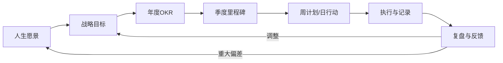

## 本节小结

"具体方案"这一节完成了从**道（战略思维）→法（规划框架）→术（执行策略）→器（决策工具）**的完整闭环。八个章节分别覆盖人生战略规划、职业发展、财务规划、学习成长、人际关系、决策矩阵、决策陷阱、综合模板——它们不是孤立的知识模块，而是一个相互咬合的系统。本小结将提炼各章核心要点，梳理跨章节的隐藏逻辑线，并给出一个可落地的整合行动方案。

---

### 一、各章核心要点回顾

#### 1.1 人生战略规划框架：你的北极星系统

人生战略规划的本质是**主动设计**而非被动应对。它回答三个根本问题：我要去哪里？我现在在哪里？我怎么从那里到这里？

核心方法论包括：

- **自我评估**：用SWOT分析和"人生轮"工具量化当前状态，避免对自己认知偏差导致的规划偏差。人生轮涵盖事业、财务、健康、关系、学习、娱乐、家庭、精神八个维度，每个维度1-10分打分，识别最薄弱的环节。
- **愿景构建**：不是写一句口号，而是通过"墓志铭练习"和"理想一天描写"来锚定深层驱动力。愿景必须同时满足"让你心动"和"值得长期投入"两个条件。
- **目标分解**：从愿景拆解为10年目标→3年目标→年度OKR→季度里程碑→月度计划→周计划→日行动。每一层都是上一层的可执行子集。
- **资源盘点**：时间、精力、金钱、人脉——四种核心资源的有限性决定了你不可能同时推进所有目标，必须做出取舍。

#### 1.2 职业发展策略：设计你的成长路径

职业发展不是等机会来找你，而是主动构建比较优势。核心框架包括：

- **赛道选择的五维模型**：从行业增长性、竞争强度、个人适配度、退出壁垒、收入天花板五个维度评估赛道。关键洞察——在朝阳行业做到前20%，回报往往超过在夕阳行业做到前1%。
- **能力构建的T型策略**：一竖代表专业深度（不可替代的核心竞争力），一横代表跨领域知识面（增加协作价值和转型弹性）。先深后广，深度决定你的定价权，广度决定你的适应性。
- **晋升路径的三阶段模型**：执行者（做好交代的事）→影响者（带领团队做事）→决策者（决定做什么事）。每个阶段需要的能力组合完全不同。
- **职业风险管理**：识别你的职业"单点故障"——如果你的收入、技能、人脉全部依赖单一来源，任何一次行业震荡都可能让你归零。

#### 1.3 财务规划策略：构建确定性结构

财务规划的本质是**用确定性的结构对冲不确定性的风险**。

- **收入多元化四象限**：主动收入（工资）、被动收入（投资/版税）、组合收入（合伙/提成）、杠杆收入（创业/内容）。目标是从100%依赖主动收入，逐步提高被动收入占比。
- **投资体系的三层架构**：底层是安全垫（6个月生活费的应急基金），中层是稳健增值（指数基金、债券），顶层是高风险高回报（个股、创业投资）。三层的比例随年龄和风险承受力动态调整。
- **财务自由的计算公式**：年支出 × 25 = 财务自由数字（基于4%安全提取率）。这个数字不是终点，而是让你有选择权的起点。
- **风险防线**：保险不是消费，是杠杆——用确定的小额支出对冲不确定的大额损失。必备保险清单：医疗险、重疾险、意外险、寿险（有家庭责任时）。

#### 1.4 学习成长策略：构建认知操作系统

学习能力是元能力——它决定你获取其他所有能力的效率。

- **知识体系构建**：碎片化学习的陷阱在于制造"知道感"而非真正的理解。解决方案是建立个人知识管理系统（PKM），用"输入→处理→输出"的闭环替代"收藏→遗忘"的死循环。
- **技能树规划**：区分"基础技能"（沟通、写作、逻辑思维）和"专业技能"（编程、设计、财务分析）。基础技能是所有职业的底层公分母，投资回报率最高。
- **学习方法论**：费曼学习法（用教别人的方式检验理解）、间隔重复（对抗遗忘曲线）、刻意练习（在舒适区边缘反复锤炼）。三者组合构成最高效的学习引擎。
- **读书方法**：检视阅读（30分钟判断值不值得精读）→分析阅读（拆解结构和论证）→主题阅读（围绕一个主题对比多本书）。90%的书只需要检视阅读，把精力留给真正重要的10%。

#### 1.5 人际关系策略：经营社交资本

人际关系是个人发展的"隐形基础设施"——机会、信息、情感支持都通过关系网络流动。

- **社交资本三种类型**：连接型资本（桥梁作用，帮你接触不同圈子）、情感型资本（深度信任关系，提供心理支撑）、信息型资本（获取稀缺信息的渠道）。三种资本需要平衡发展。
- **邓巴数与分层管理**：人的认知极限决定了你只能维持约150段有效关系。因此必须分层——核心圈（5人，无条件信任）、亲密圈（15人，定期深度交流）、活跃圈（50人，保持互动）、外围圈（150人，维持存在感）。每一层的投入策略完全不同。
- **社交投资的ROI思维**：时间是最稀缺的社交资源。优先投资那些"双向价值交换"的关系，避免单向消耗。
- **弱关系的力量**：马克·格兰诺维特的研究表明，给你带来新机会的往往不是亲密的强关系，而是不太熟的弱关系——因为他们连接着你接触不到的信息网络。

#### 1.6 决策矩阵与工具：从直觉到系统

人生是一连串决策的总和，决策质量的差异经过数十年复利放大会造成完全不同的人生轨迹。

- **12种核心决策工具**：覆盖信息收集→方案评估→风险预判→执行跟进的完整决策链路。包括决策树、决策矩阵、加权评分法、SWOT分析、六顶思考帽、预验尸法等。
- **工具选择原则**：简单决策用直觉（系统1），复杂决策用框架（系统2）。关键不是用哪个工具，而是**识别什么时候需要从直觉切换到系统化决策**。
- **决策日志**：记录每个重要决策的背景、选项、推理过程和结果。定期回顾可以校准你的决策偏差——哪些判断被证明是对的，哪些是错的，偏差模式是什么。

#### 1.7 决策的常见陷阱与对策：认识你的认知敌人

决策陷阱不是粗心的结果，而是大脑进化出的认知捷径在现代复杂环境中的系统性失效。

- **十大认知偏差**：锚定效应（被第一个数字牵着走）、确认偏差（只看支持自己的证据）、沉没成本谬误（因为已经投入而不肯放弃）、可得性偏差（用印象代替概率）、从众效应（别人做了所以我也做）。
- **结构性防御机制**：仅靠"提醒自己注意"不够，需要建立外部结构来约束——如预验尸法（假设决策已经失败，反推原因）、红队思维（专门找反对理由）、决策委员会（引入不同视角）。
- **情绪与决策的关系**：愤怒时倾向于冒险，恐惧时倾向于保守，兴奋时倾向于低估风险。识别自己的情绪状态是高质量决策的前提条件。

#### 1.8 综合规划模板：把理论变成日程

前面七章的所有框架和工具，最终都要落进一个可执行的规划系统。

- **年度战略规划**：每年花一个完整工作日，完成回顾反思（2小时）→战略审视（1小时）→目标设定（2小时）→行动计划（2小时）→风险预案（1小时）。
- **季度复盘**：每季度花半天时间，对照OKR检查进度，识别偏差原因，调整下季度计划。
- **周计划与日行动**：每周日晚30分钟规划下周重点，每天早上10分钟确认当日三件最重要的事（MIT：Most Important Tasks）。

---

### 二、跨章节的隐藏逻辑线

这八个章节之间存在三条贯穿始终的逻辑线，理解它们才能真正将知识内化为能力。

#### 2.1 逻辑线一：愿景→目标→行动→复盘的循环

第一章建立了愿景和目标分解体系，第二到五章分别在职业、财务、学习、人际关系四个维度给出了具体的目标设定方法，第六到七章提供了决策工具确保每个选择都指向目标，第八章的综合模板则把这个循环变成了可执行的日程。

**关键洞察**：规划不是线性的，而是螺旋上升的。每次复盘都可能修正目标，甚至修正愿景——这不是规划失败，而是规划在发挥作用。

#### 2.2 逻辑线二：系统思维贯穿所有维度

系统思维（第一章和基础理论部分的核心内容）不是独立的知识模块，而是渗透在每一个具体策略中的底层方法论：

| 维度 | 系统思维的体现 |
|------|--------------|
| 职业 | 赛道选择考虑行业生态、竞争格局、技术趋势的系统性变化 |
| 财务 | 资产配置考虑相关性、流动性、风险敞口的系统性平衡 |
| 学习 | 知识体系强调节点之间的连接而非孤立的知识点 |
| 人际 | 社交网络考虑强弱关系、信息流动、社会资本的系统性结构 |
| 决策 | 决策框架考虑选项之间的互动、外部性的系统性影响 |

#### 2.3 逻辑线三：能量管理是所有策略的底层支撑

所有策略的执行都需要能量——时间、精力、注意力、意志力。如果能量管理失败，再好的规划也是空中楼阁。

- **时间管理**：不是把日程塞满，而是为高价值活动保留"深度工作时间块"（每天至少2-4小时不受打扰的专注时间）。
- **精力管理**：遵循"90-120分钟节律"——人的注意力周期约为90分钟，之后需要15-20分钟的主动恢复。
- **注意力管理**：识别并消除"注意力黑洞"（无目的的手机使用、低质量的会议、情绪化的社交媒体浏览）。
- **意志力管理**：意志力是有限资源，把最重要的决策和行动放在意志力最充沛的时段（通常是上午）。

---

### 三、从知识到行动：整合执行框架

读完八个章节，最危险的状态是"什么都懂了但什么都没做"。以下是将所有知识整合为可执行行动的框架。

#### 3.1 第一周：建立基础系统

| 天数 | 行动 | 对应章节 |
|------|------|---------|
| Day 1 | 完成人生轮评估，识别最薄弱的2个维度 | 第一章 |
| Day 2 | 写下人生愿景初稿（墓志铭练习） | 第一章 |
| Day 3 | 做一次职业赛道评估（五维模型） | 第二章 |
| Day 4 | 盘点当前财务状况，建立应急基金计划 | 第三章 |
| Day 5 | 搭建个人知识管理系统（选一个工具：Notion/Obsidian/Logseq） | 第四章 |
| Day 6 | 绘制当前社交网络地图，识别核心圈和弱关系 | 第五章 |
| Day 7 | 建立决策日志模板，回顾最近3个重要决策 | 第六、七章 |

#### 3.2 第一个月：建立规划节奏

- **每周日晚**：30分钟周回顾与下周计划（对应第八章综合模板）
- **每月底**：2小时月度复盘，对照OKR检查进度
- **持续记录**：每天睡前5分钟，记录当天最重要的一个决策及其推理过程

#### 3.3 第一个季度：校准与迭代

- 完成第一次完整的季度复盘
- 评估哪些策略真正产生了效果，哪些只是"看起来有用"
- 根据实际情况调整人生轮的重点维度和年度OKR

---

### 四、常见整合性误区

#### 误区一：追求"完美的规划系统"

很多人花几周时间研究各种规划工具和模板，试图找到一个"最优系统"，结果永远停留在准备阶段。真相是：**任何系统只要被持续执行，都比完美的系统被束之高阁要好一百倍。** 从最简单的系统开始——一个笔记本加一支笔就足够——然后在使用中逐步迭代。

#### 误区二：同时推进所有维度

人生轮有八个维度，但这不意味着你要同时在八个维度发力。资源有限的情况下，**聚焦2-3个最关键的维度**，其他维度维持现状即可。试图同时优化所有维度的结果是所有维度都做不好。

#### 误区三：把策略当成目标

"学会决策矩阵"不是目标，"用决策矩阵在下一次职业选择中做出更好的决定"才是。策略是手段，不是目的。检验策略是否有效的唯一标准是：它是否帮你做出了更好的决策、达成了更好的结果。

#### 误区四：忽视复盘的复利效应

很多人认真做规划但很少复盘。复盘的价值不亚于规划——它校准你的决策偏差，积累你的经验数据库，让你的下一次规划更精准。没有复盘的规划就像没有反馈的实验，你永远不知道自己的假设是否正确。

#### 误区五：低估环境变化的速度

五年前制定的职业规划今天可能完全不适用——AI技术、行业格局、政策环境都在快速变化。好的规划系统必须内置"环境扫描"机制：每季度至少做一次宏观环境审视（类似PEST分析），识别可能影响你战略假设的重大变化。

---

### 五、进阶思考：从执行者到设计者

当你把前八个章节的内容基本内化之后，可以开始思考更高层次的问题：

**从"做正确的事"到"设计做正确的事的系统"**：初级策略者关注"我应该做什么"，高级策略者关注"我如何建立一个自动帮我做正确事情的系统"。习惯系统、环境设计、自动化决策——这些都是"元策略"。

**从"个人最优"到"系统最优"**：个人策略的天花板在于你一个人的时间和精力。当你开始思考"如何通过杠杆放大自己的影响力"——培养团队、建立品牌、创造被动收入流——你就从个人策略进入了系统策略。

**从"确定性规划"到"反脆弱设计"**：纳西姆·塔勒布的反脆弱理论指出，最好的策略不是预测未来，而是建立一个在任何未来中都能获益的结构。具体表现为：保持选择权（optionality）、避免不可逆的负面后果、在小规模试错中积累经验。

---

### 六、一句话总结

**策略与规划的本质不是控制未来，而是在不确定的世界中持续做出数学期望为正的决策，并通过复盘不断校准你的决策模型。** 愿景给你方向，框架给你结构，工具给你精度，行动给你反馈，复盘给你智慧——这五个环节缺一不可，循环运转才是完整的系统。

