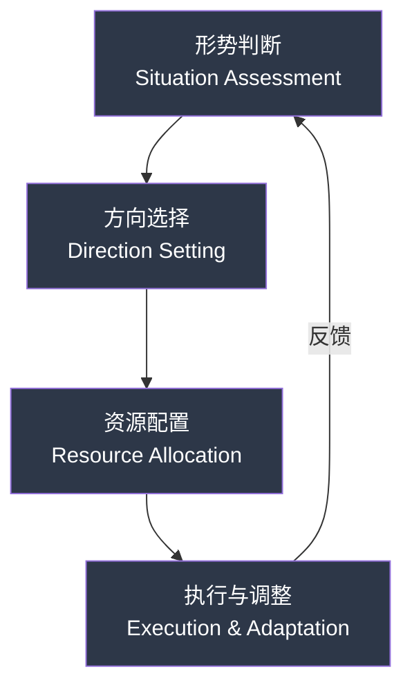

## 一、战略思维的本质与历史演变

> "在战争中，没有什么比理解战略更重要的了。" ——孙子

战略思维是人类认知能力中最稀缺也最有价值的一种。大多数人终其一生都在战术层面忙碌——做更多的事、学更多的技能、认识更多的人——却很少停下来问一个根本性的问题：**我做的事情对吗？** 本节将从本质定义、历史脉络、认知基础和训练方法四个维度，为你建立战略思维的完整认知框架。

### 1.1 为什么你需要战略思维

在展开理论之前，先看一个真实的对比案例：

**案例：两位同班毕业生的十年轨迹**

2013年，小王和小李同时从某985高校计算机专业毕业，成绩相近。小王拿到5个offer，选择了薪资最高的一家游戏公司的客户端开发岗位。小李拿到3个offer，选择了一家薪资略低但正在快速增长的云计算创业公司，做基础设施方向。

十年后（2023年）：

| 维度 | 小王 | 小李 |
|------|------|------|
| 职位 | 高级客户端工程师 | 某云厂商VP of Engineering |
| 年薪 | 约60万 | 约200万+股票 |
| 行业地位 | 可替代性中等 | 行业稀缺人才 |
| 职业选择面 | 游戏/前端/移动端 | 云计算/基础设施/技术管理多条路 |
| 当初的决策逻辑 | 选薪资最高的 | 选赛道增长最快的 |

两人的智力、学历、起跑线几乎一样，十年后的差距却如此之大。这不是运气的差异，而是**战略思维的差异**。小王做了战术最优选择（短期薪资最高），小李做了战略最优选择（长期价值最大化）。

这个案例揭示了一个残酷的事实：**方向错了，越努力越糟糕。** 战略思维不是锦上添花的"高级技能"，而是决定你人生走向的底层操作系统。

### 1.2 战略思维的本质定义

战略思维（Strategic Thinking）是一种高层次的认知能力，它要求我们超越日常的战术层面，从更宏观、更长远的视角来审视问题和制定方案。在个人发展的语境下，战略思维意味着你能够跳出眼前的具体事务，思考"我应该做什么"和"我不应该做什么"这两个同样重要的问题。

要真正理解战略思维，需要区分三个容易混淆的概念：

| 概念 | 关注点 | 核心问题 | 时间尺度 | 举例 |
|------|--------|----------|----------|------|
| 战略思维 | 方向与取舍 | "做对的事" | 3-10年 | 选择什么行业深耕 |
| 战术思维 | 执行与效率 | "把事做对" | 周/月 | 如何高效完成一个项目 |
| 操作思维 | 具体动作 | "怎么做" | 天/小时 | 今天先做哪个任务 |

**战略思维的核心是"选择"，战术思维的核心是"执行"。** 一个人可以战术执行能力极强——每天高效工作12小时——但如果方向选择错误，所有的努力都是在加速跑向错误的终点。这就是"战术上的勤奋掩盖战略上的懒惰"的本质含义。

#### 1.2.1 战略思维的六大特征

**第一，全局性。** 能够看到事物之间的相互联系和影响，而不是孤立地看待每个问题。一个决定往往牵一发而动全身，战略思维者会考虑其连锁反应。比如，选择一份高薪但需要频繁加班的工作，表面上是职业决策，实际上会影响你的健康、家庭关系、个人成长等多个维度。全局性思考要求你建立"决策影响图"——画出一个决策会波及的所有领域，评估每个领域的得失，再做综合判断。

**第二，长远性。** 不被短期利益所迷惑，能够看到当下的选择在未来3年、5年、10年甚至更长时间内会产生什么影响。亚马逊创始人贝索斯有一个著名的决策框架："如果你做的决策能影响未来三年，那你面对的竞争就少得多，因为大多数人都在优化未来三个月的事情。" 长远性不是空想，而是对趋势的判断和对复利效应的理解。每天读书30分钟，十年后你比不读书的人多出18000小时的阅读量——这种差距是碾压性的。

**第三，取舍性。** 战略的本质是选择做什么，更重要的是选择不做什么。迈克尔·波特指出："战略的本质是选择不做什么。" 这句话值得反复咀嚼。在个人发展中，这意味着你需要学会拒绝那些看似有吸引力但与你的核心目标不一致的机会。巴菲特有一个"25-5法则"：列出你人生中最重要的25个目标，圈出最重要的5个，然后把另外20个列为"不惜一切代价避免"的事项——因为那些"还不错"的机会，恰恰是你实现最重要目标的最大威胁。

**第四，动态性。** 战略不是一成不变的，它需要根据环境的变化和自身的成长不断调整。好的战略规划包含定期的回顾和调整机制。VUCA时代（易变性、不确定性、复杂性、模糊性）尤其如此——你的三年前制定的战略可能因为行业变革而失效。动态性要求你建立"战略回顾"的习惯，至少每季度回顾一次方向是否正确，每年做一次深度战略复盘。

**第五，竞争性。** 战略思维天然带有竞争视角。它要求你不仅关注自身的行动，还要关注竞争对手、合作伙伴和整个生态系统的变化。在个人发展中，你的"竞争对手"是和你争夺同一岗位、同一机会的所有人。理解竞争格局——谁是你的直接竞争者？他们的优势是什么？差异化机会在哪里？——是制定有效战略的前提。

**第六，资源整合性。** 战略思维要求你有效地整合和配置有限的资源（时间、精力、金钱、人脉），使其发挥最大的效用。资源永远是稀缺的，战略的价值在于指导稀缺资源的分配。你每天只有24小时，精力有上限，金钱需要积累——如何将这些有限资源投入到产出最高的方向，是战略思维的终极考验。

#### 1.2.2 战略思维与相关概念的区分

| 概念 | 与战略思维的关系 | 区别 |
|------|------------------|------|
| 战术思维 | 战略的执行层 | 战略关注"做什么"，战术关注"怎么做" |
| 系统思维 | 战略的分析工具 | 系统思维看到结构，战略思维做出选择 |
| 批判性思维 | 战略的认知基础 | 批判性思维质疑假设，战略思维构建路径 |
| 创造性思维 | 战略的创新来源 | 创造性思维生成选项，战略思维评估和取舍 |
| 设计思维 | 战略的用户视角 | 设计思维关注用户体验，战略思维关注全局格局 |

战略思维不是孤立存在的，它整合了系统思维的全局观、批判性思维的质疑精神、创造性思维的创新能力和设计思维的用户意识，形成一个更高层次的综合决策能力。

### 1.3 战略思维的历史演变

了解战略思维的历史脉络，不是为了学术考据，而是为了理解：这些跨越千年、跨越文化的智慧，经过了怎样的验证和提炼，哪些核心原则至今仍然有效。

#### 1.3.1 古代东方：《孙子兵法》与道家智慧

公元前5世纪，中国军事家孙武撰写了《孙子兵法》，这是人类历史上第一部系统性的战略著作。全书6000余字，13篇，却涵盖了战略思维的几乎所有核心命题：

**核心思想解读：**

- **"知己知彼，百战不殆"** ——这不仅仅是"了解对手"那么简单。"知己"要求你对自己有清醒的认知：你的核心能力是什么？你的致命弱点是什么？你容易在什么情况下犯错？"知彼"要求你对竞争环境有准确的判断：对手的战略意图是什么？他们的资源约束是什么？他们可能采取什么行动？现代认知心理学将这种能力称为"元认知"——对自身认知过程的认知。
- **"不战而屈人之兵"** ——最高明的战略是不通过直接冲突就达到目的。在个人发展中，这意味着：与其在面试中与100个人竞争，不如通过建立个人品牌让机会主动找上门；与其在红海市场厮杀，不如找到一个蓝海领域。
- **"凡战者，以正合，以奇胜"** ——常规与创新的结合。"正"是你的基本功和底线能力，"奇"是你的差异化优势和创新打法。只有"正"没有"奇"，你只能打平手；只有"奇"没有"正"，你的根基不稳。
- **"兵贵胜，不贵久"** ——战略执行要果断，不要拖延。很多人制定了完美的计划，却在执行上犹豫不决，错过了最佳时机。

同期，中国的《道德经》也蕴含着深刻的战略智慧：

- **"上善若水"** ——水善利万物而不争，处众人之所恶，故几于道。这教导我们：最好的战略不是硬碰硬，而是像水一样灵活适应环境，找到阻力最小的路径。
- **"以柔克刚"** ——柔弱胜刚强。在竞争中，有时候示弱是一种策略，让对手放松警惕，为自己争取时间和空间。
- **"无为而治"** ——不是什么都不做，而是不做不必要的事情，让系统自然运转。在个人发展中，这意味着识别哪些事情应该主动干预，哪些事情应该顺其自然。

#### 1.3.2 古代西方：修昔底德与罗马战略

古希腊历史学家修昔底德在《伯罗奔尼撒战争史》中，深入分析了战争的起因和战略决策。他提出的"修昔底德陷阱"——崛起大国与守成大国之间的结构性冲突——至今仍是国际关系研究的重要框架。修昔底德的战略洞察在于：**冲突的根源往往不是某一方的恶意，而是结构性的力量对比变化。** 在个人发展中，理解这一点意味着：当你在组织中的地位发生变化时（晋升、跳槽、创业），你与其他人的关系也会随之变化，这是结构性的，不必归咎于个人恩怨。

古罗马的战略思维则体现在三个方面：

- **军事组织**：罗马军团的编制（大队-中队-小队的层级结构）是最早的"模块化组织"思想，每个单元都能独立作战又能协同配合。这启示我们：个人能力也应该具备模块化特征——每项技能可以独立使用，也可以组合使用。
- **后勤保障**："业余者谈战术，专业者谈后勤"。罗马人深知，战争的胜负往往取决于后勤而非前线。在个人发展中，"后勤"就是你的财务安全网、健康基础和人际关系支撑——没有这些，再好的战略也无法执行。
- **基础设施**：罗马道路网络的建设体现了系统性的战略规划——不是修一条路，而是修一个网络。在个人发展中，这意味着：不要只建立一项能力，而要建立一个能力网络，让各能力之间相互支撑。

#### 1.3.3 中世纪到近代：从马基雅维利到克劳塞维茨

文艺复兴时期，意大利思想家马基雅维利在《君主论》中，将政治战略从道德和宗教的束缚中解放出来，提出了基于现实主义的权力分析框架。马基雅维利的核心贡献在于：**战略分析应该基于"世界实际的样子"，而非"世界应该是什么样子"。** 这种现实主义精神是战略思维的基石——你必须先接受现实的残酷，才能在现实中找到出路。

19世纪初，普鲁士军事理论家卡尔·冯·克劳塞维茨撰写了《战争论》，这是西方军事战略理论的巅峰之作。克劳塞维茨提出了几个至今仍有深远影响的概念：

- **"战争是政治的延续"** ——军事行动本身不是目的，政治目标才是。在个人发展中，你的行动（学习、工作、社交）本身不是目的，你的人生愿景才是。所有的战术行动都应该服务于战略目标。
- **"摩擦"（Friction）** ——理论上完美的计划，在执行中总会遇到各种意外和阻碍。克劳塞维茨说："在战争中，一切都是简单的，但最简单的事情也是困难的。" 这提醒我们：制定战略时必须为"摩擦"留出余量——计划永远赶不上变化，好的战略必须包含应变机制。
- **"重心"（Center of Gravity）** ——每个系统都有一个"重心"，打击这个重心可以产生最大的效果。在个人发展中，找到你的"重心"意味着识别出对你最重要的那1-2件事，把主要资源集中于此。

#### 1.3.4 20世纪：战略思维的商业化

20世纪下半叶，战略思维从军事领域大规模进入商业领域。这一转变的背景是：二战后全球经济复苏，企业竞争加剧，商界迫切需要系统化的竞争分析和规划方法。

关键里程碑：

| 年代 | 代表人物/事件 | 核心贡献 | 对个人战略的启示 |
|------|--------------|----------|-----------------|
| 1960s | 阿尔弗雷德·钱德勒 | "结构跟随战略"——组织结构应该服务于战略目标 | 你的日常习惯和时间分配应该服务于你的战略目标 |
| 1970s | 迈克尔·波特 | 五力模型、竞争战略、价值链分析 | 分析你所在领域的竞争格局，找到差异化定位 |
| 1980s | 加里·哈默尔/C.K.普拉哈拉德 | 核心竞争力理论 | 识别和发展你的核心竞争力——那些难以模仿、能带来持续优势的能力 |
| 1990s | 亨利·明茨伯格 | "应急战略"——战略不是规划出来的，而是在实践中涌现的 | 不要过度规划，保持灵活，在行动中发现和调整战略 |
| 2000s | W.钱·金/勒妮·莫博涅 | 蓝海战略——创造无竞争的市场空间 | 寻找"蓝海"——那些尚未被充分开发的个人发展领域 |

#### 1.3.5 21世纪：个人战略思维的兴起

进入21世纪，随着知识经济的发展和个人品牌意识的觉醒，战略思维开始从组织层面延伸到个人层面。几个重要的思想流派：

**查理·芒格的"多元思维模型"。** 芒格认为，你不需要成为每个领域的专家，但你需要掌握每个领域最重要的几个模型，然后用这些模型从不同角度分析同一个问题。这就像手里握着一把锤子的人看什么都像钉子——你需要的不是一把更贵的锤子，而是一个包含锤子、螺丝刀、扳手的工具箱。芒格本人就综合运用了心理学、经济学、物理学、生物学等多个学科的核心模型来做投资决策。

**纳西姆·塔勒布的"反脆弱"理论。** 塔勒布将事物分为三类：脆弱的（受压力会损坏）、坚韧的（受压力不受影响）、反脆弱的（受压力会变强）。在个人战略中，你应该追求"反脆弱"的布局——不要把所有鸡蛋放在一个篮子里，保持选择权，让自己能够从波动和不确定性中受益。比如，不要把全部收入来源依赖于单一雇主，培养多元的收入渠道。

**雷·达里奥的"原则"。** 桥水基金创始人达里奥将自己几十年的投资和管理经验提炼为一套"原则"——可重复使用的决策规则。他的核心方法论是：痛苦+反思=进步。每一次失败和挫折都是一次学习机会，但前提是你必须诚实地反思原因，而不是逃避或自我安慰。

**安妮·杜克的"对赌思维"。** 职业扑克冠军杜克将博弈论和概率思维引入日常决策。她的核心观点是：好的决策不等于好的结果。你可能做了一个正确的决定，但因为运气不好而得到了坏结果——这并不意味着你的决策过程有问题。反之亦然。评估决策质量应该基于决策过程，而非结果。

### 1.4 战略思维的认知科学基础

战略思维不是一种玄学，它有坚实的神经科学和认知科学基础。了解这些基础，能帮助你更有针对性地训练自己的战略思维能力。

#### 1.4.1 大脑如何进行战略思考

丹尼尔·卡尼曼在《思考，快与慢》中提出了大脑的两套系统：

- **系统1（快思考）**：自动、直觉、快速、几乎不费力。这是大脑的"默认模式"——走路、骑车、看表情、做日常决策都依赖系统1。
- **系统2（慢思考）**：刻意、分析、缓慢、消耗精力。战略思考主要依赖系统2——你需要有意识地分析信息、评估选项、做出判断。

问题在于：**大脑天然倾向于使用系统1，因为系统2太耗能了。** 这意味着，大多数人在大多数时候都在用直觉和习惯做决策，而不是用战略思维。要进行真正的战略思考，你必须刻意激活系统2——这需要消耗额外的认知资源，但回报是巨大的。

神经科学研究表明，战略思考主要激活前额叶皮层（prefrontal cortex），这个区域负责：
- 工作记忆：同时处理多个变量
- 抽象推理：从具体事物中提取一般规律
- 计划和组织：制定和执行多步骤计划
- 冲动控制：抑制即时满足的冲动，选择延迟回报

#### 1.4.2 认知负荷与战略思考的时机

认知负荷理论告诉我们：人的工作记忆容量有限（米勒的7±2法则），当认知负荷过高时，大脑会自动切换到系统1模式——也就是"自动驾驶"模式。这意味着：

- **不适合进行战略思考的时候**：疲惫、焦虑、信息过载、时间紧迫
- **适合进行战略思考的时候**：精力充沛、心态平和、信息适度、有充足时间

这就解释了为什么很多重大的战略决策不应该在会议室里做，而应该在散步、洗澡、运动后的放松状态下酝酿。爱因斯坦说他的最好的想法是在刮胡子时产生的，牛顿在苹果树下顿悟——这些都不是巧合，而是大脑在低认知负荷状态下进行深层思考的自然结果。

**实操建议**：每周至少安排2次"战略思考时间"——30-60分钟的独处，不看手机，不处理事务，只是安静地思考你的长期方向、当前进展和需要调整的地方。这是你能为自己做的最有价值的投资之一。

### 1.5 战略思维的核心要素

无论是在军事、商业还是个人领域，战略思维都包含以下四个核心要素，它们构成一个完整的循环：

#### 1.5.1 形势判断（Situation Assessment）

战略思维的第一步是准确判断当前的形势。没有准确的形势判断，所有后续的方向选择、资源配置和执行都是建立在幻觉之上。

形势判断需要回答四个问题：

**外部环境分析**：你所处的环境正在发生什么变化？哪些变化是趋势性的（不可逆转），哪些是周期性的（会反复）？技术变革、政策变化、市场趋势、社会文化变迁——这些外部力量如何影响你的领域？

**内部条件评估**：你的核心能力是什么？你的致命弱点是什么？你拥有哪些独特资源？你的可替代性有多高？对自己要诚实——高估自己和低估自己都会导致错误的战略选择。

**竞争格局理解**：你的直接竞争者是谁？他们的优势和劣势各是什么？潜在的进入者有哪些？替代品的威胁有多大？

**关键变量识别**：在所有影响你未来发展的变量中，哪几个最关键？这些变量之间有什么相互作用？哪个变量的变化对你的影响最大？

一个实用的形势判断工具是SWOT分析的个人版：

| 维度 | 内容 | 你需要诚实回答的问题 |
|------|------|---------------------|
| 优势（Strengths） | 你擅长什么？你拥有什么独特资源？ | 别人经常夸你什么？你做什么事情比大多数人做得好？ |
| 劣势（Weaknesses） | 你不擅长什么？你缺乏什么资源？ | 你经常在什么地方犯错？什么任务让你感到痛苦？ |
| 机会（Opportunities） | 外部环境中有什么有利趋势？ | 你看到哪些行业/领域的增长机会？哪些技能正在变得更有价值？ |
| 威胁（Threats） | 外部环境中有什么不利因素？ | AI会取代你的工作吗？你的行业正在萎缩吗？ |

#### 1.5.2 方向选择（Direction Setting）

在准确判断形势的基础上，确定前进的方向。方向选择是战略思维中最关键的一环——方向错了，越努力越糟糕。

方向选择包含四个层次：

**愿景设定**：你最终想达到什么状态？愿景不需要非常具体，但必须清晰且有感召力。一个好的愿景应该能回答：5年、10年后，我希望自己的生活是什么样子？

**目标确定**：为了实现愿景，需要达成哪些具体目标？目标应该是SMART的（具体的、可衡量的、可实现的、相关的、有时限的），但更重要的是——目标之间必须是协调的，而不是互相矛盾的。

**策略制定**：通过什么路径来实现这些目标？策略不是具体的行动步骤，而是"用什么方式"去达成目标。比如，"每天背50个单词"是行动步骤，"通过沉浸式学习掌握英语"是策略。

**取舍决策**：选择不做什么与选择做什么同样重要。每一个"是"的背后都有一个"否"。接受一份新工作，意味着放弃当前工作的所有潜在收益；全身心投入创业，意味着牺牲陪伴家人的时间。战略思维要求你清醒地面对这些取舍，而不是假装它们不存在。

#### 1.5.3 资源配置（Resource Allocation）

战略的价值在于指导资源的配置。再好的战略，如果没有资源支撑，就是空中楼阁。

个人的四种核心资源：

| 资源类型 | 特征 | 配置原则 |
|----------|------|----------|
| 时间 | 绝对稀缺，不可再生，每人每天24小时 | 把时间投入到回报最高的方向，学会说"不" |
| 精力 | 有限且会消耗，有高峰低谷 | 把最难的思考和决策安排在精力高峰期 |
| 金钱 | 可积累，可投资，有杠杆效应 | 先建立安全垫，再投资于能力提升和资产积累 |
| 人脉 | 需要长期维护，有网络效应 | 质量优于数量，深度优于广度 |

资源配置的三个原则：

**80/20法则**：20%的投入产生80%的产出。识别出你的"20%"——哪些活动对你的目标贡献最大？把资源集中于此。

**保留余量**：不要把资源100%分配完毕。保留10-20%的弹性余量，用于应对意外和抓住突发机会。塔勒布称之为"杠铃策略"——80%的资源放在安全的底仓，20%的资源用于高风险高回报的探索。

**机会成本意识**：每次分配资源时，都要问自己：如果把这些资源用在其他地方，能产生什么价值？这能帮助你避免把资源浪费在"看起来不错但实际上回报不高"的事情上。

#### 1.5.4 执行与调整（Execution & Adaptation）

战略最终要在执行中体现价值。没有执行的战略只是白日梦，没有反馈的执行只是蛮干。

执行的关键步骤：

**分解行动**：将战略目标分解为可执行的行动步骤。年度目标→季度里程碑→月度计划→周计划→日任务。每一层分解都要确保与上层目标对齐。

**建立反馈机制**：及时了解执行的效果。哪些行动产生了预期的结果？哪些没有？为什么？反馈可以来自数据（业绩指标、学习进度）、他人（导师、同事的评价）和自我反思（定期回顾）。

**持续调整**：根据反馈信息调整战略和行动。这不是说频繁改变方向——那会导致战略漂移——而是在保持大方向稳定的前提下，微调具体路径和方法。

**保持韧性**：在遇到挫折时保持方向感和行动力。战略执行从来不是一帆风顺的，克劳塞维茨的"摩擦"理论告诉我们：意外和阻碍是常态。韧性不是盲目坚持，而是在遇到阻碍时灵活调整路径，但不放弃目标。

### 1.6 战略思维的自我评估

在继续深入之前，先评估一下你当前的战略思维水平。以下是10个自测问题，每个问题按1-5分评分（1=完全不符合，5=完全符合）：

| # | 自测问题 | 评分 |
|---|---------|------|
| 1 | 我能清楚地说出自己未来3-5年的人生目标 | __ |
| 2 | 我做重大决策时会考虑对生活多个维度的影响 | __ |
| 3 | 我能识别出当前最重要的一件事，并把大部分精力投入其中 | __ |
| 4 | 我会定期回顾自己的方向是否正确（至少每季度一次） | __ |
| 5 | 我能坦然拒绝与核心目标不一致的"好机会" | __ |
| 6 | 我了解自己所在领域/行业的竞争格局和发展趋势 | __ |
| 7 | 我对自己的优势和劣势有清醒的认知 | __ |
| 8 | 我能区分"紧急但不重要"和"重要但不紧急"的事情 | __ |
| 9 | 我有意识地为意外和不确定性保留资源余量 | __ |
| 10 | 我会从失败中提取教训，并调整后续行动 | __ |

**评分解读：**

- **40-50分**：战略思维成熟，继续保持并深化
- **30-39分**：有战略意识，但执行不够系统化，需要建立固定的战略回顾习惯
- **20-29分**：战略思维处于萌芽阶段，需要系统学习和刻意练习
- **10-19分**：主要在战术层面运作，急需建立战略思维框架

### 1.7 战略思维的日常训练方法

战略思维不是天赋，而是一种可以训练的能力。以下是经过验证的训练方法：

**方法一：决策日记。** 每次做出重要决策时，记录以下内容：(1) 决策的背景是什么？(2) 你考虑了哪些选项？(3) 选择的依据是什么？(4) 预期的结果是什么？(5) 三个月后回顾，实际结果如何？这个方法的威力在于：它迫使你将隐性的决策过程显性化，让你能够发现自己的决策模式和盲点。

**方法二：逆向思考。** 查理·芒格最喜欢的思维方式之一："反过来想，总是反过来想。" 与其问"我如何成功"，不如问"什么会导致我失败？然后避免那些事情。" 与其问"我应该学什么技能"，不如问"什么技能如果我不学，五年后会让我后悔？"

**方法三：10-10-10法则。** 面对决策时问自己：这个决定在10分钟后会怎样？10个月后会怎样？10年后会怎样？这个简单的框架能帮你跳出即时满足的陷阱，看到决策的长期影响。

**方法五：多角度审视。** 用"六顶思考帽"的方法，从不同角度分析同一个问题：白色（事实）、红色（直觉）、黑色（风险）、黄色（收益）、绿色（创新）、蓝色（全局）。这能避免你只从单一角度看问题。

**方法五：战略对话。** 找一个你信任的、有战略思维的朋友或导师，定期进行"战略对话"——不是聊八卦，而是讨论彼此的人生方向、重大决策和职业发展。他人的视角能帮你看到自己的盲点。

### 1.8 本节小结

本节建立了战略思维的基础认知框架：

| 维度 | 核心要点 |
|------|---------|
| 定义 | 战略思维是在资源有限条件下做出最优选择的高层认知能力 |
| 特征 | 全局性、长远性、取舍性、动态性、竞争性、资源整合性 |
| 历史 | 从孙子兵法到现代商业战略，核心原则一脉相承：知彼知己、灵活应变、集中资源 |
| 认知基础 | 战略思考依赖系统2（慢思考），需要在低认知负荷状态下进行 |
| 核心要素 | 形势判断→方向选择→资源配置→执行调整，形成闭环 |
| 训练方法 | 决策日记、逆向思考、10-10-10法则、多角度审视、战略对话 |

**下一步**：了解了战略思维的本质之后，下一节将深入探讨军事战略理论——那些经过数千年战争检验的战略智慧，如何指导你的人生决策。
