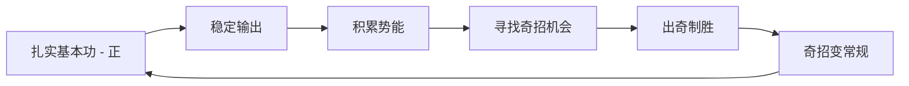
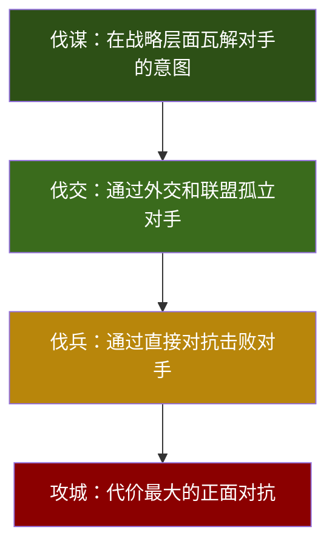

## 二、军事战略理论

军事战略是人类最早系统化的博弈智慧。数千年来，无数将领和思想家在生死存亡的压力下锤炼出的战略原则，远比商业理论和个人成长方法论更加深刻和残酷——因为错误的代价不是业绩下滑，而是全军覆没。正是这种极端压力环境，使军事战略成为理解"如何在不确定环境中做出最优决策"的最佳教材。

本章系统梳理东西方军事战略的核心理论，提取其中对个人战略规划最具价值的原理，并通过历史案例和现代应用加以阐释。

### 2.1 为什么军事战略对个人发展有指导意义

在深入具体理论之前，有必要先回答一个根本问题：战争和职业发展有什么关系？

战争和个人发展的共性在于：

| 维度 | 战争 | 个人发展 |
|------|------|----------|
| 环境特征 | 高度不确定、信息不完整 | 未来难以预测、信息不对称 |
| 资源约束 | 兵力、补给有限 | 时间、精力、金钱有限 |
| 竞争本质 | 零和或负和博弈 | 市场竞争、资源争夺 |
| 决策压力 | 错误决策代价极高 | 重大选择影响深远 |
| 时间因素 | 时机把握至关重要 | 窗口期、红利期不可逆 |
| 对手行为 | 对手会根据你的行动调整 | 竞争者会模仿、反击 |

正因为这些共性，军事战略中提炼出的原则——如何分配有限资源、如何在信息不完整时决策、如何把握时机、如何应对不确定性——对个人发展具有直接的指导价值。

但也要注意二者的差异：战争是你死我活的对抗，而个人发展中合作和共赢是可能的。因此，军事战略的原则需要经过"翻译"才能应用于个人场景，不能机械照搬。

### 2.2 《孙子兵法》的核心智慧

《孙子兵法》成书于春秋末期（约公元前512年），是世界上最早的系统性军事著作，全书十三篇，约6000字，却涵盖了战略规划、情报收集、战术运用、后勤保障、地形利用、心理博弈等多个维度。其核心价值在于：不是教你如何打仗，而是教你如何在开战之前就赢得胜利。

#### 2.2.1 全书架构与逻辑脉络

《孙子兵法》十三篇的编排有着严密的内在逻辑，从战略全局到具体战术，层层递进：

1. **始计篇**——战略评估：开战前的系统性分析
2. **作战篇**——资源核算：战争的经济成本与可持续性
3. **谋攻篇**——战略选择：最优策略的层级排序
4. **军形篇**——防御态势：先立于不败之地
5. **兵势篇**——进攻态势：如何创造压倒性优势
6. **虚实篇**——主动权：如何调动敌人而不被敌人调动
7. **军争篇**——战场机动：争夺有利条件
8. **九变篇**——灵活应变：打破常规的权变智慧
9. **行军篇**——环境识别：如何判断战场形势
10. **地形篇**——地利分析：利用环境因素
11. **九地篇**——情境策略：不同处境下的应对之道
12. **火攻篇**——特殊手段：非对称打击方式
13. **用间篇**——情报体系：信息的获取与运用

这个架构本身就提供了一个完整的问题分析框架：先评估、再算账、再选择策略、再布局、再执行、再应变。

#### 2.2.2 "知己知彼，百战不殆"——认知是战略的基石

> "知彼知己，百战百胜；不知彼而知己，一胜一负；不知彼不知己，每战必殆。"——《孙子兵法·谋攻篇》

这是《孙子兵法》中最广为人知的名言，也是整部著作的认识论基础。孙子认为，战争的胜负在开战之前就已经决定了——取决于你对自己和对手的了解程度。

**"知己"的四个层次：**

- **资源盘点**：你拥有什么？包括硬实力（学历、技能、资金、人脉）和软实力（性格、韧性、学习能力、领导力）。大多数人高估自己的优势，低估自己的短板。建议定期做SWOT分析，邀请信任的朋友给出诚实反馈。
- **价值观澄清**：你真正想要什么？不是别人告诉你应该想要的，而是你内心深处真正在乎的。很多人追逐社会定义的"成功"（高薪、地位），却在达成后感到空虚，因为这并非他们真正的追求。
- **动机觉察**：你为什么想要？同样的目标，出于恐惧（"我怕被淘汰"）还是出于热爱（"我想探索"），会导向完全不同的路径和体验。
- **模式识别**：你的行为模式是什么？你在压力下是战斗、逃跑还是冻结？你在团队中是自然的领导者还是执行者？你更擅长从0到1的创新还是从1到100的优化？

**"知彼"的三个维度：**

- **环境扫描**：你所处行业的整体趋势是什么？技术变革（如AI）会如何影响你的领域？政策风向有无变化？人口结构变化带来什么机会或威胁？
- **竞争格局**：你的直接竞争者是谁？他们的优势和策略是什么？有没有潜在的跨界竞争者？行业内的权力结构如何分布？
- **关键人物**：谁能影响你的发展？决策者、意见领袖、合作伙伴、潜在对手，他们的利益诉求和行为逻辑是什么？

**"知天知地"——时代背景认知：**

- 技术周期：你处于哪一轮技术革命的哪个阶段？创新期、成长期、成熟期还是衰退期？
- 经济周期：当前是扩张期还是收缩期？这决定了你的风险偏好应该是激进还是保守。
- 社会变迁：价值观、消费习惯、工作方式的变化趋势。

**历史案例：诸葛亮的"隆中对"**

公元207年，刘备三顾茅庐时，诸葛亮对天下形势的分析堪称"知己知彼"的典范。他精准评估了曹操（拥百万之众，挟天子以令诸侯，不可争锋）、孙权（据有江东，已历三世，可以为援而不可图），以及刘备自身的优势（帝室之胄，信义著于四海，思贤如渴）。基于这个认知，他提出了"跨有荆益，保其岩阻，西和诸戎，南抚夷越，外结好孙权，内修政理"的战略——一个完美匹配刘备资源禀赋的战略。

**个人应用实操框架——"知己知彼清单"：**

每季度花2小时，用以下模板做一次自我审计：

【知己】
1. 我的核心优势（3项）：___
2. 我的关键短板（3项）：___
3. 我真正看重的价值观（3项）：___
4. 我当前的资源储备（时间/金钱/技能/人脉）：___
5. 我的行为模式/习惯：___

【知彼】
1. 我所在行业/领域的3个趋势：___
2. 我的3个主要竞争者/对标对象：___
3. 能影响我发展的3个关键人物：___
4. 我面临的最大外部威胁：___
5. 我面临的最大外部机会：___

【行动】
基于以上分析，下季度最重要的1件事：___

#### 2.2.3 "不战而屈人之兵"——最高明的战略是避免冲突

> "百战百胜，非善之善者也；不战而屈人之兵，善之善者也。"——《孙子兵法·谋攻篇》

孙子认为，百战百胜虽然看起来很厉害，但实际上说明你不断地在消耗资源。最高明的战略是不通过直接对抗就达成目标——通过外交、谋略、威慑来赢。

**个人发展的四种"不战而胜"策略：**

1. **差异化定位**：与其在热门赛道上和千万人竞争，不如找到一个竞争强度低但价值高的细分领域。比如，不是做又一个普通的前端工程师，而是成为"医疗行业前端性能优化专家"——竞争者极少，但客户愿意付高价。
2. **合作创造增量**：不是争夺现有的蛋糕，而是把蛋糕做大。与互补的人合作，创造1+1>2的效果。商业史上最经典的案例是微软和英特尔的"Wintel联盟"——两家公司联合统治了PC时代，而不是互相消耗。
3. **提升不可替代性**：当你在某个领域的价值足够独特时，竞争自然消失。你不是在"抢"职位，而是别人来"求"你。
4. **选择低竞争赛道**：2010年选择移动互联网，2015年选择人工智能，2020年选择新能源——选择比努力重要，而选择的前提是"知天"。

**历史案例：秦统一六国的"远交近攻"**

秦昭襄王时期，范雎提出"远交近攻"战略——与距离远的国家（齐、燕）交好，集中力量攻打邻近的国家（韩、魏）。这个策略的核心是：不要同时与所有人为敌，要通过外交分化来降低每个阶段的对抗强度。在个人发展中，这意味着：识别哪些是当前需要重点攻克的"近敌"（眼前的核心挑战），哪些是可以暂时结盟或忽略的"远交"。

#### 2.2.4 "以正合，以奇胜"——常规与创新的辩证法

> "凡战者，以正合，以奇胜。"——《孙子兵法·兵势篇》

"正"是常规的、可预期的力量部署，"奇"是非常规的、出人意料的力量运用。两者不是非此即彼的关系，而是相互依存、相互转化的。

**"正"——你的基本盘：**

- 核心技能的持续精进（程序员写代码、设计师画图、销售跑客户）
- 稳定的日常习惯和节奏（早起、运动、阅读、复盘）
- 可靠的职业信誉和口碑
- 健康的身体和心理状态

没有"正"，"奇"就是无根之木。一个基本功不扎实的人，偶尔的灵光一现无法带来持续的成功。

**"奇"——你的突破点：**

- 跨界知识的融合（懂技术+懂商业+懂心理学的复合型人才）
- 非常规的表达方式和沟通风格
- 别人不敢想或不愿做的尝试
- 对趋势的提前判断和布局

**"正奇转换"的动态平衡：**

今天的"奇"可能变成明天的"正"。2010年会写App是"奇"（少数人会），到2015年就变成了"正"（基本技能）。因此，你需要不断地发展新的"奇"来保持差异化优势。

**实操建议：**

- 把70%的时间用于打磨"正"（核心技能），20%用于探索"奇"（新领域、新方法），10%用于实验和试错
- 每年学习一个与本职无关的新技能（设计思维、数据分析、写作表达），为"奇"储备弹药
- 关注行业内"反共识"的观点和做法，这些往往是"奇"的来源

#### 2.2.5 "先为不可胜，以待敌之可胜"——防守优先原则

> "昔之善战者，先为不可胜，以待敌之可胜。不可胜在己，可胜在敌。"——《孙子兵法·军形篇》

这句话的深刻之处在于：不可胜取决于你自己（防守能力），可胜取决于对手（是否暴露弱点）。你能控制的只有前者，后者需要耐心等待。

**个人发展的"不可胜"体系：**

| 层面 | 不可胜的基础 | 具体做法 |
|------|-------------|----------|
| 身体 | 健康是一切的基础 | 规律运动、充足睡眠、合理饮食 |
| 财务 | 财务安全垫 | 6-12个月的应急资金、合理保险配置 |
| 技能 | 至少一项不可替代的核心技能 | 深耕一个领域3-5年，达到前10%水平 |
| 关系 | 可信赖的支持网络 | 维护5-10个深度关系，互相信任、可以求助 |
| 心理 | 情绪韧性和抗压能力 | 冥想、写日记、心理咨询、建立内在价值感 |

**等待时机的智慧：**

很多人犯的错误是：基础还没打好就急于出击，结果在机会来临时没有能力抓住，或者在风险来临时没有缓冲承受。巴菲特的名言"别人贪婪时恐惧，别人恐惧时贪婪"，本质上就是"先为不可胜，以待敌之可胜"的现代版。

#### 2.2.6 "水因地而制流，兵因敌而制胜"——灵活应变原则

> "夫兵形象水，水之形，避高而趋下；兵之形，避实而击虚。水因地而制流，兵因敌而制胜。故兵无常势，水无常形。能因敌变化而取胜者，谓之神。"——《孙子兵法·虚实篇》

孙子用"水"来比喻理想的军事策略——没有固定的形态，总是根据环境来调整。这是对"教条主义"最有力的批判。

**为什么灵活应变如此重要：**

环境在变、对手在变、技术在变，唯一不变的就是变化本身。那些固守过去成功经验的人，往往成为环境变化的牺牲品。诺基亚在功能机时代的成功策略，在智能手机时代变成了失败的根源。柯达发明了数码相机，却因为固守胶片业务而破产。

**培养灵活应变能力的三个方法：**

1. **保持战略弹性**：不要过早地把所有资源押在一个方向上。保留20%的资源用于应对意外和抓住新机会。
2. **建立快速反馈机制**：缩短"行动→观察→调整"的循环周期。每个项目设置检查点，每两周回顾一次进展，每季度做一次战略校准。
3. **培养多种能力组合**：像瑞士军刀一样，拥有多种能力的组合，而不是像锤子一样只能做一件事。当一种能力的需求下降时，其他能力可以补位。

#### 2.2.7 战略层级："上兵伐谋"

> "上兵伐谋，其次伐交，其次伐兵，其下攻城。"——《孙子兵法·谋攻篇》

孙子将战略手段分为四个层级，从高到低依次是：

**个人发展的四级战略：**

1. **伐谋层（最高）**：通过战略选择和定位，从根本上改变竞争格局。选择一个你有天然优势的领域，让竞争变得不必要。比如：一个既懂法律又懂编程的人选择做"法律科技"，在两个领域的交叉地带几乎没有竞争者。
2. **伐交层**：通过建立人脉网络和战略联盟，获得信息、资源和机会。不是泛泛社交，而是有策略地与关键人物建立深度互信关系。
3. **伐兵层**：通过提升硬实力在正面竞争中胜出。这是大多数人关注的层面——考证、刷题、加班、内卷。虽然必要，但成本最高。
4. **攻城层（最低）**：通过消耗和苦战来争夺有限资源。比如为了一个热门岗位和1000人竞争，即使最终胜出，投入产出比也很低。

**关键认知：大多数人在"攻城"层面消耗了太多精力，却忽略了"伐谋"和"伐交"的可能性。** 花一天时间思考战略方向，可能比花一个月在战术执行上更有价值。

### 2.3 克劳塞维茨与《战争论》

卡尔·冯·克劳塞维茨（Carl von Clausewitz，1780-1831）是普鲁士将军，参加了反法战争的多次重大战役。他的《战争论》（Vom Kriege）写于1816-1830年间，虽然未完成就去世了，但仍被视为西方军事理论的奠基之作。与《孙子兵法》的精炼格言式风格不同，《战争论》是一部系统的理论著作，更注重概念的严格定义和逻辑推演。

#### 2.3.1 "战争是政治的延续"——目的导向思维

> "战争无非是政治通过另一种手段的延续。"——《战争论》第一卷

这是克劳塞维茨最著名的论断，也是他对军事理论最深远的贡献。其核心含义是：军事行动本身不是目的，而是服务于更高层政治目标的工具。每一次战役、每一次部署，都应该与政治目标对齐。

**个人发展的"政治-战争"框架：**

在个人发展中，"政治"对应的是你的愿景和价值观，"战争"对应的是你采取的具体行动。这个原则的启示是：

- **行动必须服务于目标**：你每天做的事情，是否真的在推动你接近目标？很多人陷入"忙碌陷阱"——每天都很忙，但忙的事情和自己的长期目标毫无关系。
- **定期校准"政治目标"**：政治目标本身也会变化。18岁时你可能追求财富自由，35岁时可能更看重家庭和健康。定期审视和更新你的"政治目标"，确保行动与之一致。
- **不要为了行动而行动**：战术上的成功如果不能服务于战略目标，就是浪费。一个产品经理花三个月把一个没人用的功能做到极致，这不是卓越，是资源浪费。

**实操：每月用"目的-手段对齐测试"审查自己的行动清单：**

【我的长期目标（政治）】：___
【我本月的主要行动（战争）】：
1. ___  →  服务于哪个目标？___
2. ___  →  服务于哪个目标？___
3. ___  →  服务于哪个目标？___

【发现的问题】：
- 哪些行动没有明确的目标对应？___
- 哪些目标缺少对应的行动？___

#### 2.3.2 "摩擦"——不确定性是常态

> "战争中的一切都很简单，但最简单的事情也是困难的。困难累积起来，产生了一种叫做'摩擦'的效应。"——《战争论》第一卷

克劳塞维茨提出的"摩擦"（Friktion）概念，可能是军事理论中最被低估的洞见。它指的是：在实际执行中，无数小的困难和意外会累积起来，使完美的计划变得面目全非。天气变化、通信中断、士兵疲劳、情报错误、装备故障、指挥混乱——每一个单独来看都不是致命的，但它们叠加起来的效果足以让一个看似万无一失的计划彻底失败。

**"摩擦"在个人发展中的体现：**

- 你计划每天学习3小时，但身体不适、社交应酬、工作加班、网络诱惑……这些"小摩擦"不断累积，最终你可能一周只学了3小时。
- 你制定了完美的职业转型计划，但行业突然裁员、家人需要照顾、健康出了问题……计划永远赶不上变化。
- 你投入大量精力做了一个项目，但市场反馈远不如预期、合作伙伴中途退出、技术方案需要推倒重来……

**应对"摩擦"的五条原则：**

1. **留出缓冲余量**：做计划时，把预期时间乘以1.5到2倍。不是因为你偷懒，而是因为现实中"摩擦"是必然存在的。
2. **简化执行路径**：步骤越多，摩擦越大。把复杂的计划简化为最核心的几个步骤，降低执行门槛。
3. **建立冗余机制**：关键环节要有备份方案。单点依赖是最大的风险。
4. **缩短反馈循环**：不要做"年底才验收"的计划。每周检查进度，每月调整方向，及时发现和修正偏差。
5. **接受不完美**：完成比完美更重要。一个80分但已完成的方案，远胜于一个100分但永远停留在纸面上的方案。

**历史案例：拿破仑入侵俄国（1812年）**

拿破仑组织了60万人的"大军"入侵俄国，从纸面上看，兵力优势压倒性。但"摩擦"摧毁了一切：漫长的补给线（从巴黎到莫斯科超过2500公里）、俄国的焦土战术（无法就地补给）、极端寒冷的冬天（零下30度）、疾病和逃兵（抵达莫斯科时只剩不到10万战斗人员）。每一个因素单独来看都不是不可克服的，但它们叠加在一起产生了毁灭性的效果。

#### 2.3.3 "重心"——找到关键点

> "重心是一切力量和运动的中心，所有力量都依赖于它……对重心的一击，就是对整体的最有效打击。"——《战争论》第八卷

克劳塞维茨认为，每个力量体系都有一个"重心"（Schwerpunkt），打击这个重心可以产生最大的效果。找到重心，就找到了以最小代价获得最大成果的关键。

**如何识别不同场景下的"重心"：**

| 场景 | 重心可能在哪里 | 如何确认 |
|------|--------------|----------|
| 职业发展 | 核心技能、关键人脉、平台选择 | 问：去掉哪个因素，我会损失最大？ |
| 竞争对手 | 他们的核心优势或关键弱点 | 问：他们最害怕失去什么？ |
| 项目推进 | 关键路径上的瓶颈环节 | 问：哪个环节卡住了，整个项目就卡住了？ |
| 学习新领域 | 基础概念和核心原理 | 问：理解了哪个概念，其他知识就豁然开朗？ |
| 个人困境 | 最根本的制约因素 | 问：如果只能改变一件事，改变什么最有用？ |

**案例：识别职业发展的"重心"**

一位软件工程师发现自己陷入了职业瓶颈：薪资增长缓慢、工作缺乏挑战、看不到晋升机会。他列出可能的改进方向：学新框架、考证书、跳槽、转管理、读MBA、创业……经过分析，他发现真正的"重心"是"缺乏可展示的影响力"——他做的事情都是执行层面的，没有可见的成果和影响力。因此，他选择参与开源项目、写技术博客、在会议上演讲——这些直接打击了"重心"，比学十个新框架更有效。

#### 2.3.4 "天才"与"直觉"——超越规则的判断力

> "在战争中，一切都很简单，但最简单的事情也是最困难的。没有经验的人不要以为战争中没有什么需要深思的。一位伟大的将军需要的是什么？是判断力和一双锐利的眼睛。"——《战争论》

克劳塞维茨承认，规则和理论只能提供指导，最终的决策往往依赖于指挥官的直觉和判断力。他称之为"天才"——一种在不确定环境中凭借经验和洞察力做出正确判断的能力。

**直觉不是天赋，而是积累的结果：**

神经科学的研究表明，专家的"直觉"实际上是大量经验在潜意识中的快速模式识别。一位经验丰富的急诊科医生看到病人的第一眼，就能判断病情的紧急程度——这不是超能力，而是数千次类似经验的累积。

**培养"战略直觉"的路径：**

1. **大量积累案例**：阅读历史、传记、商业案例，建立丰富的"案例库"。你的大脑需要素材来进行模式识别。
2. **刻意练习决策**：对自己遇到的每一个选择，先写下判断和理由，事后回顾验证。逐步校准你的判断力。
3. **培养观察习惯**：训练自己注意细节、识别模式、感知变化。好的判断力始于好的观察力。
4. **信任但验证**：在时间允许的情况下，信任你的直觉但用逻辑验证；在时间紧迫时，相信经过深思熟虑的直觉。

### 2.4 毛泽东的游击战争战略

毛泽东（1893-1976）在领导中国革命战争的实践中，发展出了一套独特的军事战略思想，其核心著作包括《论持久战》《中国革命战争的战略问题》《抗日游击战争的战略问题》等。毛泽东战略思想的突出特点是：从极端弱势出发，通过正确的战略逐步扭转力量对比，最终取得胜利。这使其对资源有限的个人尤其具有参考价值。

#### 2.4.1 "集中优势兵力，各个歼灭"

> "我们的战略是'以一当十'，我们的战术是'以十当一'。"——毛泽东

这是毛泽东军事思想中最核心的原则之一。在战略层面，承认自己总体力量处于弱势；但在每一个具体的战斗中，通过灵活机动，集中超过对手的兵力，确保每一次战斗都有压倒性的优势。

**个人应用——"T型人才"策略：**

- 战略层面（一横）：广泛涉猎多个领域，建立全局视野
- 战术层面（一竖）：在每一个具体项目中，集中全部精力攻克关键问题

不要同时在10个方向发力。选定当前最重要的1-2个目标，集中所有可用资源（时间、精力、注意力）全力突破。完成后再转向下一个目标。这就是"伤其十指，不如断其一指"的智慧。

#### 2.4.2 "敌进我退，敌驻我扰，敌疲我打，敌退我追"——灵活机动的十六字诀

这十六字诀是毛泽东在井冈山时期总结的游击战术核心，其精髓是：不与对手硬碰硬，而是根据对手的状态灵活调整自己的策略。

**个人发展的"十六字诀"：**

| 对手状态 | 军事行动 | 个人发展对应 |
|---------|---------|------------|
| 敌进（对手强势进攻） | 退（避开锋芒） | 在竞争激烈时，不要正面对抗，转而积蓄实力或寻找新方向 |
| 敌驻（对手处于守势） | 扰（持续施压） | 在对手松懈时，持续学习、积累、建立影响力 |
| 敌疲（对手疲惫） | 打（果断出击） | 在对手犯错或露出破绽时，果断出击抢占机会 |
| 敌退（对手撤退） | 追（扩大战果） | 在取得优势后，乘胜追击，扩大成果 |

**案例：字节跳动的战略机动**

字节跳动在与巨头的竞争中展现了这种智慧。当BAT在信息流领域强势时（敌进），字节退让一步，专注于算法推荐这个细分能力（退）。当巨头们安于现状时（敌驻），字节通过今日头条持续骚扰（扰）。当巨头们反应迟缓时（敌疲），字节果断推出抖音抢占短视频赛道（打）。当抖音确立优势后（敌退），字节迅速扩展到海外（TikTok）、电商、教育等领域（追）。

#### 2.4.3 "农村包围城市"——边缘突破策略

> "星星之火，可以燎原。"——毛泽东

在正面战场无法取胜时，从对手力量薄弱的边缘地带切入，建立根据地，逐步发展壮大，最终包围和夺取中心城市。

**个人应用——"边缘创新"路径：**

- 当主流赛道竞争过于激烈时，寻找被忽视的细分市场或边缘领域
- 在边缘领域建立核心能力和口碑（"根据地"）
- 逐步向主流市场扩展，用在边缘积累的优势对原有玩家形成降维打击

很多成功的创业者都走了这条路：拼多多从五环外的下沉市场起步，逐步向一二线城市渗透；B站从二次元小众社区起步，逐步成为主流视频平台。

#### 2.4.4 "论持久战"——时间维度的战略思维

毛泽东在《论持久战》中驳斥了"速胜论"和"亡国论"两种极端观点，提出抗日战争将经历战略防御、战略相持、战略反攻三个阶段，最终胜利属于中国。

**个人应用——"三阶段"思维：**

在面对重大挑战（职业转型、创业、学习新领域）时：

1. **防御阶段**（0-1年）：承认自己的弱势，以生存和学习为主，不急于求成。建立基础能力，积累资源和经验。
2. **相持阶段**（1-3年）：持续投入，虽然进展缓慢，但不要放弃。这是最容易放弃的阶段，因为看不到明显的成果，但量变正在积累。
3. **反攻阶段**（3-5年）：前期的积累开始产生复利效应，能力和机会开始指数级增长。

**关键认知：大多数人高估了短期效果，低估了长期效果。** 在"相持阶段"放弃，是最大的战略错误。

### 2.5 利德尔·哈特的"间接路线战略"

巴兹尔·亨利·利德尔·哈特（B.H. Liddell Hart，1895-1970）是英国军事理论家，一战老兵，被誉为"西方战略之父"。他在《间接路线战略》一书中，通过研究2500年来的30场战争和280次战役，发现了一个惊人的规律：在所有决定性战役中，只有不到5%是通过直接攻击取胜的，绝大多数胜利都是通过间接路线取得的。

#### 2.5.1 间接路线的核心原则

利德尔·哈特总结了间接路线的八条原则：

1. **调整目的以适应手段**：不要制定超出能力范围的计划
2. **始终记住目标**：战术灵活，但战略目标不变
3. **选择最意想不到的路线**：对手的注意力在哪里，就不去哪里
4. **选择最不易防守的目标**：攻击对手最薄弱的环节
5. **保持灵活性**：不要把力量固定在一个方向上
6. **确保退路**：进可攻退可守
7. **不要重复失败的攻击**：同样的策略失败了就换一个
8. **制定计划要考虑失败的可能**：做好Plan B

#### 2.5.2 个人发展的"间接路线"

**直接路线（高成本、高风险）：**
- 和所有人挤同一个热门岗位
- 在所有方面都追求完美
- 正面对抗比你强大得多的对手
- 强迫自己做不适合的事情

**间接路线（低成本、高收益）：**
- 通过侧面展示能力来获得机会（作品集 > 简历）
- 通过帮助别人来建立影响力和人脉（先给予再索取）
- 通过讲故事来影响决策（情理并茂 > 干巴巴的数据）
- 通过建立平台来连接资源（做连接者 > 做被连接者）

**案例：个人品牌的"间接路线"建设**

不要直接说"我很厉害"（直接路线，效果差）。而是通过以下间接方式建立个人品牌：
- 写深度技术文章，让别人发现你的专业能力
- 参与开源项目，用代码证明你的实力
- 在社区中积极帮助他人，建立"靠谱"的口碑
- 组织行业活动，自然地展示你的组织力和影响力

### 2.6 东西方战略思维的比较与融合

《孙子兵法》代表东方战略思维，《战争论》代表西方战略思维，二者有显著差异，也有深刻的互补性。

| 维度 | 东方战略思维（孙子兵法） | 西方战略思维（战争论） |
|------|----------------------|---------------------|
| 核心目标 | 不战而胜，以最小代价达成目标 | 通过决定性会战消灭敌人主力 |
| 方法论 | 整体论，强调系统和关系 | 分析论，强调分解和逻辑 |
| 对不确定性的态度 | 接受并利用不确定性 | 试图通过计划和分析减少不确定性 |
| 时间观 | 循环的、耐心的 | 线性的、追求效率的 |
| 对"虚实"的运用 | 重视"虚"的力量（声东击西、虚张声势） | 更注重"实"的力量（兵力、火力、后勤） |
| 决策依据 | 直觉、经验、整体判断 | 分析、推理、数据支撑 |
| 最高境界 | 无形无象，随机应变 | 系统规划，精确执行 |

**融合之道：**

在个人发展中，最理想的做法是融合两种思维方式：

- 用东方思维做"方向选择"：保持灵活，不执着于单一路径，像水一样寻找最优路径
- 用西方思维做"执行规划"：制定清晰的计划、定义可衡量的目标、建立反馈机制
- 用东方思维做"危机应对"：在计划被打乱时，保持冷静，灵活应变
- 用西方思维做"长期建设"：系统地积累能力、建立体系、培养人才

### 2.7 现代军事战略的启示

除了古典军事理论，现代军事战略也提供了有价值的思维框架。

#### 2.7.1 OODA循环——快速决策模型

美国空军战略家约翰·博伊德（John Boyd）提出的OODA循环，描述了决策的四个阶段：

1. **观察（Observe）**：收集信息
2. **判断（Orient）**：分析和解读信息
3. **决策（Decide）**：选择行动方案
4. **行动（Act）**：执行决策

博伊德的核心洞见是：**在竞争中，速度不是指物理速度，而是指OODA循环的速度。** 谁能更快地完成"观察-判断-决策-行动"的循环，谁就能掌握主动权。

**个人应用：**

- 缩短你的"学习→应用→反馈→调整"循环
- 在面对变化时，不要追求"完美决策"，而是追求"足够好且足够快的决策"
- 通过建立快速反馈机制（如每日复盘），提高你OODA循环的转速

#### 2.7.2 网络中心战——连接的力量

现代军事理论强调"网络中心战"（Network-Centric Warfare），即通过信息技术将分散的作战单元连接成一个整体网络，使信息共享和协同作战能力大幅提升。

**个人应用：**

- 你的"作战网络"就是你的知识和人脉网络
- 不要成为信息孤岛——主动连接不同领域的人和知识
- 成为网络中的"节点"而不是"终端"——连接别人的能力比自己单打独斗更有价值

### 2.8 军事战略思维的常见误区

在将军事战略应用于个人发展时，需要警惕以下误区：

**误区一：过度竞争思维**

军事战略诞生于战争环境，天然具有对抗性。但个人发展不完全是零和博弈。过度套用军事思维可能导致：把所有人都视为敌人、过度防御心理、忽略合作共赢的可能。

纠正：军事战略中也有"合纵连横"的智慧，合作和联盟本身就是战略的一部分。

**误区二：机械套用原则**

"知己知彼"是好的，但不能把每一个军事原则都机械地套用到生活场景中。"兵者，诡道也"适用于商业竞争，但不适用于人际关系。

纠正：区分"战争场景"（竞争性环境，如求职、竞标）和"和平场景"（合作性环境，如团队协作、亲密关系），在不同场景中使用不同的策略。

**误区三：忽视执行细节**

战略再好，如果执行不到位，也是空谈。很多人热衷于谈论战略和方向，却忽略了执行层面的细节和纪律。

纠正：好的战略思维者也是好的执行者。在思考方向的同时，也要建立良好的执行习惯和纪律。

**误区四：过度简化复杂性**

军事格言往往精炼有力，但现实世界比任何格言描述的都要复杂。"知己知彼"说起来简单，但真正做好需要持续的努力和诚实的自我审视。

纠正：把格言作为思维的起点，而不是终点。在具体应用时，要深入分析具体的场景和约束条件。

### 2.9 军事战略理论的个人应用框架

综合以上所有理论，提炼出一个实用的个人战略决策框架——**"战略六问"**：

| 问题 | 对应理论 | 核心作用 |
|------|---------|---------|
| 1. 我在打什么仗？（定义战场） | 克劳塞维茨——战争是政治的延续 | 明确你真正想要什么 |
| 2. 我有多少兵力？（资源盘点） | 孙子——知己知彼 | 诚实评估自己的资源 |
| 3. 敌人的重心在哪？（关键点识别） | 克劳塞维茨——重心理论 | 找到最有效的突破点 |
| 4. 走直路还是弯路？（路径选择） | 利德尔·哈特——间接路线 | 选择成本最低、收益最高的路径 |
| 5. 怎样分配兵力？（资源配置） | 毛泽东——集中优势兵力 | 把资源用在刀刃上 |
| 6. 摩擦怎么办？（风险预案） | 克劳塞维茨——摩擦理论 | 为不确定性留出缓冲 |

每次面临重大决策时，依次回答这六个问题，就能做出更理性和全面的战略选择。

***

**本节小结**

军事战略理论提供了在高度不确定环境中进行理性决策的系统方法。《孙子兵法》教会我们如何在开战前就赢得胜利——通过认知优势、战略选择和灵活应变。克劳塞维茨教会我们如何面对现实的残酷——接受不确定性、找到关键点、培养判断力。毛泽东教会弱势者如何翻盘——集中力量、灵活机动、持久作战。利德尔·哈特教会我们如何聪明地赢——走间接路线而非硬碰硬。

这些理论的共同启示是：**战略的本质不是在战场上拼杀，而是在战场之外做出正确的选择。** 在个人发展中，最大的竞争优势不是你有多努力，而是你在什么方向上努力、用什么方式努力、以及你是否在正确的时间做了正确的事。
