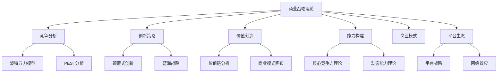
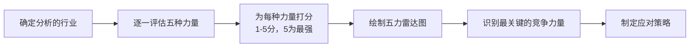
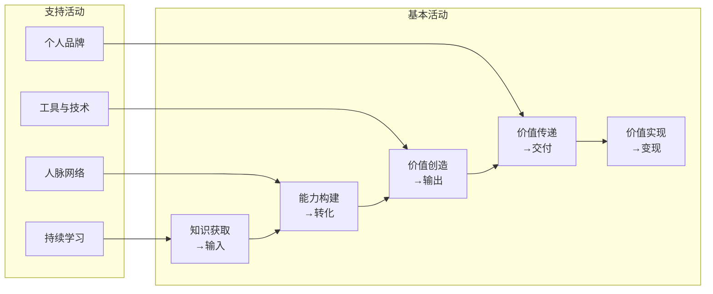
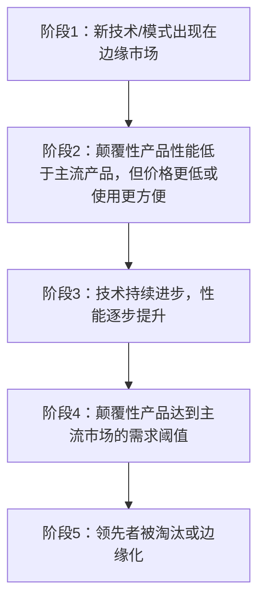
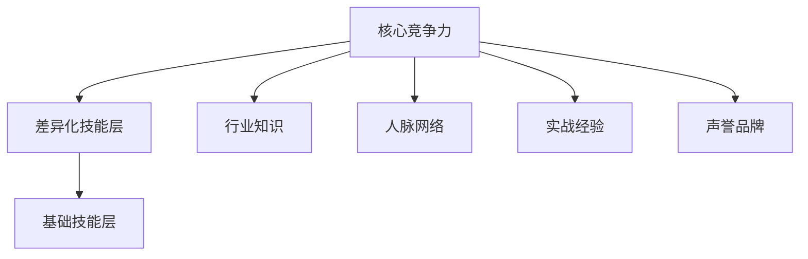
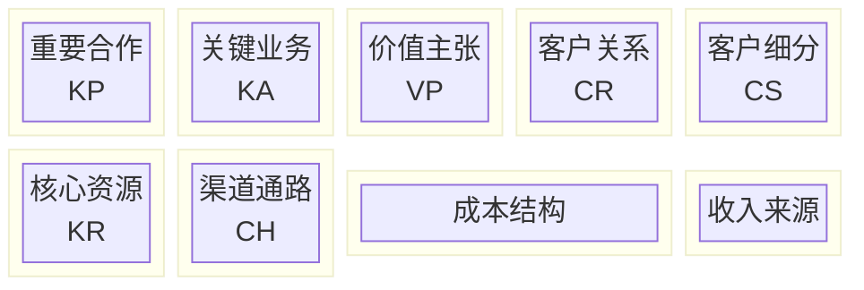
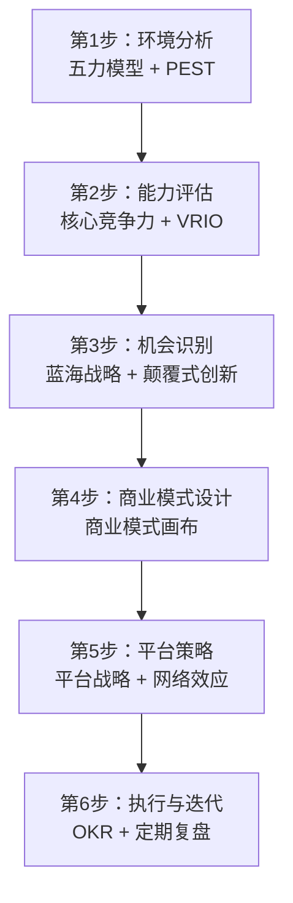

## 三、商业战略理论

20世纪下半叶以来，商业战略理论经历了从经验主义到科学分析的深刻变革。从波特的结构主义到克里斯坦森的颠覆式创新，再到当代的平台战略和生态思维，这些理论构建了一套完整的竞争分析与战略制定方法论。

这些理论虽然源于企业管理，但其底层逻辑——**如何在竞争环境中识别机会、构建优势、实现持续增长**——同样适用于个人战略规划。本节将系统梳理六大核心战略理论，深入剖析原理机制，并给出可直接落地的个人应用框架。

### 3.1 迈克尔·波特的竞争战略体系

迈克尔·波特（Michael Porter）是哈佛商学院教授，被公认为现代竞争战略之父。他在1980年代构建的三大分析工具——五力模型、三大竞争战略、价值链分析——至今仍是战略分析的基石框架。

#### 3.1.1 五力模型（Five Forces Model）

波特在1979年发表的《竞争力量如何塑造战略》中提出了五力模型。这一模型的核心洞察是：**一个行业的盈利能力不是由行业内的企业决定的，而是由行业结构决定的**。五种竞争力量共同决定了行业的利润潜力和竞争格局。

**五种力量详解：**

| 力量 | 定义 | 高强度表现 | 低强度表现 |
|------|------|-----------|-----------|
| 现有竞争者的竞争 | 行业内已有企业之间的对抗程度 | 价格战频繁、产品同质化严重、退出壁垒高 | 行业增长快、差异化明显、企业数量少 |
| 新进入者的威胁 | 新企业进入行业的难易程度 | 资本门槛低、技术壁垒低、品牌忠诚度弱 | 需要大量资本、有专利保护、规模经济显著 |
| 替代品的威胁 | 其他产品或服务满足相同需求的可能性 | 替代品价格低、质量好、转换成本低 | 替代品不存在或体验差距大 |
| 供应商的议价能力 | 供应商对行业的影响力 | 供应商集中、替代品少、转换成本高 | 供应商众多、原材料标准化、买方可后向整合 |
| 购买者的议价能力 | 客户对行业的影响力 | 买方集中、购买量大、转换成本低、信息透明 | 买方分散、产品独特、品牌忠诚度高 |

**五力模型的分析流程：**

**个人应用——职业五力分析：**

将五力模型映射到你的职业领域，可以系统性地评估你的竞争环境：

- **现有竞争者**：你所在领域有多少人在争夺同样的机会？他们的水平如何？如果你是前端开发者，你的竞争者可能是数百万同级别的开发者。
- **新进入者威胁**：新人进入这个领域的门槛高吗？编程的入门门槛在降低（AI辅助编码、低代码平台），但高级架构师的门槛依然很高。
- **替代品威胁**：你的技能是否容易被替代？AI正在替代初级翻译、初级客服、初级代码编写，但高级的系统设计和创意工作短期内难以替代。
- **供应商议价能力**：你的"供应商"——教育机构、培训平台、认证机构——对你有多大影响力？如果你的技能完全依赖某个特定认证，该认证机构就掌握了你的命脉。
- **买方议价能力**：你的雇主或客户对你的议价能力如何？如果你是稀缺人才，你的议价能力强；如果你是可替代的，雇主就掌握了主动权。

**实战案例**：一个传统平面设计师的五力分析。现有竞争者数量庞大（众包设计平台使竞争全球化）；新进入者威胁极高（Canva等工具让非专业人员也能做设计）；替代品威胁大（AI生成图片工具如Midjourney正在快速替代基础设计需求）；供应商议价能力中等（设计教育渠道多元）；买方议价能力高（客户对价格敏感且选择多）。结论：基础平面设计是典型的"红海"，需要向上游转型（品牌策略、用户体验设计）或找到细分蓝海。

#### 3.1.2 三大竞争战略

波特在《竞争战略》（1980）中提出了三种基本的竞争战略。他强调，企业**必须**选择其中一种，否则会陷入"夹在中间"（stuck in the middle）的困境——既没有成本优势，也没有差异化优势，也没有聚焦优势。

| 战略类型 | 核心逻辑 | 适用条件 | 风险 | 个人映射 |
|---------|---------|---------|------|---------|
| 成本领先 | 成为行业成本最低的生产者 | 价格竞争激烈、产品同质化 | 技术变革可能使低成本优势消失 | 成为效率最高的执行者——用更少的时间产出同等质量的工作 |
| 差异化 | 提供独特的产品或服务 | 客户需求多样化、创新空间大 | 溢价能力不足、模仿者众多 | 发展独特的技能组合——比如"技术+设计+商业"的交叉能力 |
| 聚焦 | 专注于某个细分市场 | 细分市场有独特需求、大企业忽视 | 市场过小、大企业下沉 | 在一个极窄的领域做到极致——比如"精通React性能优化的前端专家" |

**个人应用的深层思考：**

三种战略不是互相排斥的，在不同职业阶段可以切换：

- **早期职业**（0-5年）：适合**聚焦战略**。选择一个足够窄的领域深耕，建立专业口碑。此时资源有限，分散投资会导致每样都平庸。
- **成长期**（5-10年）：适合**差异化战略**。在核心技能基础上，叠加第二、第三技能，形成独特的"技能栈"。比如在编程能力之上叠加写作能力、业务理解能力。
- **成熟期**（10年+）：可以选择**成本领先**——通过积累的方法论、工具链和经验，以极高的效率交付成果，或者继续在差异化路线上走更远。

**警惕"夹在中间"**：最常见的职业困境就是"什么都会一点，什么都不精"。这在战略理论中对应的就是"stuck in the middle"——你既没有聚焦专家的深度，也没有差异化人才的独特性，也没有成本领导者的效率。破解之道是**先聚焦、再差异化**。

#### 3.1.3 价值链分析（Value Chain Analysis）

价值链模型将企业的活动分为**基本活动**（直接创造价值）和**支持活动**（为基本活动提供支撑），分析每个环节如何创造价值以及成本如何分布。

**个人价值链模型：**

**价值链诊断清单：**

逐一审视你的每个环节，找出瓶颈：

1. **知识获取**（输入环节）：你的信息源质量如何？是否有系统化的学习路径？还是随机刷文章？
2. **能力构建**（转化环节）：你学到的知识有多少转化成了可执行的能力？学习/转化比是多少？
3. **价值创造**（输出环节）：你的产出质量如何？与同领域的人相比处于什么水平？
4. **价值传递**（交付环节）：你的价值通过什么渠道触达客户或雇主？渠道是否高效？
5. **价值实现**（变现环节）：你的价值是否得到了合理的回报？定价是否合理？

**常见瓶颈及解决方案：**

| 瓶颈环节 | 表现 | 解决方案 |
|---------|------|---------|
| 输入环节 | 学了很多但感觉没用 | 建立"以输出为导向"的学习体系，先明确需要什么再学 |
| 转化环节 | 学了但不会用 | 建立刻意练习机制，每学一个概念就找机会实践 |
| 输出环节 | 做了但质量不够 | 建立反馈循环，找到领域内高手进行对比学习 |
| 交付环节 | 有能力但没人知道 | 建立个人品牌，通过写作、演讲、开源等方式扩大影响力 |
| 变现环节 | 有价值但收入低 | 重新评估定价策略，考虑从"卖时间"转向"卖价值" |

### 3.2 蓝海战略

W·钱·金（W. Chan Kim）和勒妮·莫博涅（Renée Mauborgne）在2005年出版的《蓝海战略》中提出了一个颠覆性的竞争理念：**与其在现有市场中击败竞争对手，不如开创全新的市场空间**。

#### 3.2.1 红海与蓝海的本质区别

| 维度 | 红海（Red Ocean） | 蓝海（Blue Ocean） |
|------|-------------------|-------------------|
| 市场空间 | 已知的、现有的市场 | 未知的、未开发的市场 |
| 竞争规则 | 已被广泛接受的行业规则 | 规则尚未建立，需要自己定义 |
| 战略目标 | 击败竞争对手，争夺现有需求 | 创造新需求，使竞争变得无关 |
| 价值与成本 | 差异化和低成本二选一 | 同时追求差异化和低成本 |
| 典型策略 | 定位、细分、营销战 | 价值创新、跨界重组、需求创造 |

**关键洞察**：红海思维的本质是"零和博弈"——你的所得就是别人的所失。蓝海思维的本质是"正和博弈"——通过创造新价值来扩大整个市场。

#### 3.2.2 价值创新——蓝海战略的核心

蓝海战略的核心概念是**价值创新**（Value Innovation）。传统战略理论认为差异化和低成本是不可兼得的——要提供更好的产品就需要更高的成本。蓝海战略打破了这个假设：**通过重新定义问题本身，可以同时实现差异化和低成本**。

价值创新的逻辑是：不是在现有维度上做得更好（那是红海思维），而是重新定义哪些维度重要。这需要你：

1. **识别客户的真正需求**——不是客户说的需求，而是客户真正痛的问题
2. **剔除行业惯例中的冗余**——很多"行业标准"其实不创造价值，只是惯例
3. **跨行业寻找灵感**——蓝海往往出现在行业的交叉地带

#### 3.2.3 ERRC四步框架——剔除-减少-增加-创造

蓝海战略提供了**ERRC框架**作为实操工具：

| 步骤 | 问题 | 示例（以个人职业为例） |
|------|------|---------------------|
| **剔除**（Eliminate） | 哪些被视为理所当然的因素应该被剔除？ | 剔除"必须在大公司工作才算成功"的观念 |
| **减少**（Reduce） | 哪些因素可以降低到行业标准以下？ | 减少在低价值行政事务上的时间投入 |
| **增加**（Raise） | 哪些因素应该提高到行业标准以上？ | 增加深度思考和创造性工作的时间比例 |
| **创造**（Create） | 哪些行业从未提供的因素应该被创造出来？ | 创造一种全新的工作模式或服务形式 |

**完整案例——个人蓝海战略的ERRC分析：**

以一个想转型的后端开发者为例：

| 维度 | 分析 |
|------|------|
| 剔除 | 剔除"只会写代码"的单一身份认同；剔除对特定编程语言的过度依赖 |
| 减少 | 减少在纯技术社区的投入时间（那里的竞争已经白热化） |
| 增加 | 增加对业务逻辑和产品思维的学习；增加跨领域知识的积累 |
| 创造 | 创造"技术顾问"的角色——既能理解技术细节，又能站在商业角度给建议 |

结果：这个开发者不再是一个普通的后端工程师，而是一个"懂技术的商业顾问"——这是一个竞争者少得多的蓝海空间。

#### 3.2.4 战略画布——可视化竞争格局

蓝海战略提供了**战略画布**（Strategy Canvas）作为诊断工具。横轴是行业的关键竞争要素，纵轴是各要素的提供水平。通过绘制自己和竞争对手的战略画布，可以直观地看到竞争同质化程度以及蓝海机会。

**绘制个人战略画布的步骤：**

1. 列出你所在领域的10-15个关键竞争维度（如：技术深度、项目经验、沟通能力、行业知识、学历背景等）
2. 为自己和主要竞争者（假想的或真实的）在每个维度上打分（1-10）
3. 将结果连线绘制在同一张图上
4. 如果你的曲线与大多数人高度重叠——你身处红海
5. 如果你的曲线在某些维度上显著高于或低于行业均值——你可能找到了蓝海方向

### 3.3 颠覆式创新理论

克莱顿·克里斯坦森（Clayton Christensen）在1997年的《创新者的窘境》中提出了颠覆式创新理论，解释了一个困扰商界数十年的悖论：**为什么管理良好、倾听客户、积极投资的领先企业，反而会被新进入者击败？**

#### 3.3.1 颠覆式创新的两种类型

克里斯坦森识别了两种不同的颠覆模式：

**低端颠覆（Low-end Disruption）：**

从现有市场的低端客户开始，这些客户的需求被过度服务（over-served）。颠覆者提供"够用就好"的产品，价格更低、使用更方便。典型案例：廉价航空（西南航空）对传统航空公司的颠覆——不是提供更好的飞行体验，而是针对"只想从A到B"的客户，提供更便宜、更简单的选择。

**新市场颠覆（New-market Disruption）：**

创造一个全新的市场，让之前不消费的人开始消费。颠覆者不是从现有客户中抢夺份额，而是创造新客户。典型案例：个人电脑对小型机的颠覆——个人电脑最初无法运行企业级应用，但它让从未拥有过计算机的人开始使用计算机。

#### 3.3.2 颠覆式创新的五阶段路径

**为什么领先者难以应对颠覆？**

克里斯坦森给出了一个深刻的解释，被称为"**资源-流程-价值观**"框架（RPV Framework）：

- **资源**（Resources）：领先者拥有丰富的资源，但这些资源被锁定在现有业务中。一个年收入100亿的公司很难对一个只有100万市场的新机会投入足够的关注。
- **流程**（Processes）：企业的流程是为了优化现有业务而设计的，这些流程在面对全新的、不确定的市场时反而会成为障碍。
- **价值观**（Values）：企业的价值观决定了它如何做决策。一个习惯了高利润率的企业，很难接受一个利润率很低的新市场——不是因为它看不到机会，而是因为它的"价值观"（决策标准）不允许它投入资源。

#### 3.3.3 个人应用——警惕被颠覆，主动颠覆自己

**识别你是否面临颠覆风险的清单：**

- 你所在领域是否有新的技术或模式正在从边缘崛起？
- 这些新技术/模式是否在某些维度上比你的技能更便宜、更便捷？
- 这些新技术/模式是否在持续进步？
- 是否有一群之前"不消费"的客户开始被这些新技术/模式服务？

如果以上多数答案是"是"，你正面临颠覆风险。

**应对颠覆的四种策略：**

1. **向上迁移**：当基础工作被颠覆时，向更高端、更复杂的工作迁移。AI能写基础代码，但还不能设计复杂系统架构——那就成为架构师。
2. **拥抱颠覆**：与其被颠覆，不如成为驾驭颠覆的人。学习并掌握颠覆性技术，让自己成为"新旧之间的桥梁"。
3. **横向扩展**：将你的核心能力迁移到颠覆风险较低的相邻领域。
4. **创造不可替代性**：投资于那些AI和自动化短期内难以替代的能力——创意、同理心、复杂判断、跨文化沟通。

**真实案例——摄影行业的颠覆历程：**

胶片相机行业被数码相机颠覆，这是一个教科书级别的案例。柯达（Kodak）是胶片时代的绝对霸主，它甚至在1975年发明了第一台数码相机——但它选择压制这项技术，因为它会蚕食胶片业务的高利润。最终，佳能、尼康等企业从低端数码相机切入，逐步提升画质，最终彻底颠覆了胶片行业。柯达在2012年申请破产保护。

个人启示：不要因为现有技能的"高利润"而拒绝学习新技能。如果柯达的工程师主动拥抱数码技术，他们不会失业。

### 3.4 核心竞争力理论

加里·哈默尔（Gary Hamel）和C.K.普拉哈拉德（C.K. Prahalad）在1990年的《公司的核心竞争力》一文中提出了核心竞争力理论，随后在1994年的《竞争大未来》中进一步深化。

#### 3.4.1 核心竞争力的三个识别标准

一项能力要成为核心竞争力，必须同时满足三个条件：

| 标准 | 定义 | 测试问题 |
|------|------|---------|
| 有价值（Valuable） | 能够为客户创造重要价值 | 这项能力是否直接解决了客户的痛点或需求？ |
| 稀有（Rare） | 只有少数竞争者拥有 | 在你的领域中，拥有这项能力的人有多少比例？ |
| 难以模仿（Inimitable） | 竞争对手难以快速复制 | 这项能力是否有因果模糊性、路径依赖性或社会复杂性？ |

**第四个标准——不可替代性（Non-substitutable）**：后来的研究者补充了第四个标准：即使能力本身难以模仿，如果存在替代方案，核心竞争力的地位也会被削弱。比如，你可能拥有某项独特技能，但如果AI能做到80%的效果且成本极低，这项技能的战略价值就大幅降低。

#### 3.4.2 核心竞争力的构建路径

核心竞争力不是单一技能，而是**多种技能、技术和知识的有机整合**。它的构建需要三个层次：

**第一层：基础技能（Foundation Skills）**
- 这是你的"入场券"——没有它你连参与竞争的资格都没有
- 例如：编程语言的掌握、基本的沟通能力、行业基础知识
- 这些技能是必要条件，但不是充分条件

**第二层：差异化技能（Differentiating Skills）**
- 这是让你脱颖而出的能力
- 通常是两种以上基础技能的交叉组合
- 例如："编程 + 写作"的能力组合，或"技术 + 商业理解"的组合

**第三层：核心竞争力（Core Competency）**
- 这是你独特的、难以替代的能力体系
- 通常是多年积累形成的，具有路径依赖性
- 例如：一个在特定行业深耕10年的技术专家，他的核心竞争力不仅是技术能力本身，还包括对行业的深度理解、业内的人脉网络、以及将技术方案与业务需求精准对接的直觉

**核心竞争力的"洋葱模型"：**

#### 3.4.3 VRIO分析框架

杰伊·巴尼（Jay Barney）将核心竞争力理论进一步细化为**VRIO分析框架**，提供了一个更结构化的评估工具：

| 问题 | 含义 | 如果"是" |
|------|------|---------|
| **V**aluable（有价值？） | 这项能力是否能帮助你抓住机会或抵御威胁？ | 你处于竞争均势（competitive parity）以上 |
| **R**are（稀有？） | 拥有这项能力的人是否很少？ | 你拥有暂时竞争优势（temporary advantage） |
| **I**mitable（难模仿？） | 其他人获取或发展这项能力的成本是否很高？ | 你拥有持续竞争优势（sustained advantage） |
| **O**rganized（有组织？） | 你是否有组织和流程来充分利用这项能力？ | 你能实现持续竞争优势的全部潜力 |

**实战应用——用VRIO评估你的能力：**

对你的每一项技能和能力进行VRIO评估，然后分类：
- 只有价值 → 基本要求，继续维持
- 有价值 + 稀有 → 暂时优势，需要持续投资
- 有价值 + 稀有 + 难模仿 → 持续优势，核心投资方向
- 全部满足但缺乏组织 → 潜力未释放，需要建立个人体系

### 3.5 商业模式画布

亚历山大·奥斯特瓦德（Alexander Osterwalder）和伊夫·皮尼厄（Yves Pigneur）在2010年的《商业模式新生代》中提出了**商业模式画布**（Business Model Canvas），将商业模式分解为九个相互关联的要素，提供了一种可视化、结构化的商业模式描述和设计工具。

#### 3.5.1 商业模式画布的九要素

#### 3.5.2 个人商业模式画布详解

将商业模式画布映射到个人发展，每个要素的含义和操作指南如下：

**1. 客户细分（Customer Segments）——谁是你的"客户"？**

在个人商业模式中，"客户"是指你创造的价值的接收方：

- **直接客户**：你的雇主、你的客户、你的用户
- **间接客户**：你的读者、你的听众、你的社群成员
- **潜在客户**：未来可能需要你的价值的人群

操作：列出你当前服务的所有"客户"群体，评估每个群体的规模、付费意愿、增长潜力。选择1-2个最具价值的客户群体作为核心。

**2. 价值主张（Value Propositions）——你能提供什么独特价值？**

价值主张回答一个核心问题：**客户为什么要选择你而不是别人？**

一个好的价值主张应该：
- 明确解决客户的某个痛点
- 与竞争对手有清晰的差异
- 能够用一句话说清楚

操作公式：我帮助 **[目标客户]** 通过 **[独特方法]** 解决 **[具体问题]**，从而实现 **[价值结果]**。

**3. 渠道通路（Channels）——你如何触达客户？**

- **被动渠道**：你的简历、GitHub主页、个人网站——让别人能找到你
- **主动渠道**：社交媒体、技术社区、线下活动——主动出击接触潜在客户
- **传播渠道**：口碑、推荐、内容营销——让现有客户帮你传播

**4. 客户关系（Customer Relationships）——你与客户的关系模式是什么？**

- **获取型**：如何获得新客户？（求职、接项目、获取新读者）
- **维持型**：如何保持现有关系？（持续交付价值、定期沟通）
- **增长型**：如何从现有关系中创造更多价值？（从技术执行者升级为技术顾问）

**5. 收入来源（Revenue Streams）——你通过什么方式获得回报？**

| 收入类型 | 个人映射 | 稳定性 | 上限 |
|---------|---------|--------|------|
| 工资收入 | 受雇于企业 | 高 | 中 |
| 项目收入 | 自由职业、咨询 | 中 | 中高 |
| 产品收入 | 课程、电子书、SaaS产品 | 低（初期） | 高 |
| 投资收入 | 理财、股权 | 低 | 高 |
| 版税/许可 | 专利、版权 | 中 | 极高 |

**6. 核心资源（Key Resources）——你拥有的关键资产是什么？**

- **人力资本**：你的技能、知识、经验
- **社会资本**：你的人脉网络、行业关系
- **智力资本**：你的个人品牌、声誉、作品集
- **财务资本**：你的储蓄、投资、可变现的资产

**7. 关键业务（Key Activities）——你每天需要做什么？**

列出你必须持续投入的核心活动：
- 专业技能的精进和维护
- 知识的获取和更新
- 价值的创造和交付
- 人脉的拓展和维护
- 个人品牌的建设

**8. 重要合作（Key Partnerships）——你需要与谁合作？**

- **互补型伙伴**：拥有你所缺乏的能力的人（技术 + 设计、技术 + 商业）
- **导师/前辈**：能指导你加速成长的人
- **同行/盟友**：与你处于同一阶段、可以互相支持的人
- **平台/社区**：能放大你影响力的平台和社区

**9. 成本结构（Cost Structure）——你需要付出什么代价？**

- **时间成本**：学习时间、工作时间、社交时间
- **精力成本**：认知负荷、情绪消耗
- **机会成本**：选择这条路意味着放弃了什么
- **金钱成本**：教育投资、工具订阅、社交支出

#### 3.5.3 画布的填写流程和使用方法

**填写步骤：**

1. 先从**价值主张**开始——明确你的核心价值
2. 然后确定**客户细分**——你的价值要交付给谁
3. 接着设计**渠道通路**——如何触达他们
4. 依次完成其他六个要素
5. 检查所有要素之间的一致性和协调性

**使用场景：**

- **职业转型**：画出当前画布和目标画布，识别需要改变的要素
- **能力投资决策**：评估新技能是否能增强你的价值主张或打开新渠道
- **年度复盘**：每年底重画画布，对比变化，制定下年计划

### 3.6 平台战略与网络效应

在数字化时代，平台战略已经成为最重要的商业模式之一。杰奥弗雷·帕克（Geoffrey Parker）、马歇尔·范·阿尔斯泰恩（Marshall Van Alstyne）和桑吉特·乔杜里（Sangeet Paul Choudary）在2016年的《平台革命》中系统阐述了平台战略的原理。

#### 3.6.1 管道模式 vs 平台模式

传统商业模式是"管道"（Pipeline）模式——企业生产产品，然后通过渠道销售给客户。价值是单向流动的。

平台模式则不同——平台本身不生产价值，而是**连接不同的用户群体，让他们之间创造和交换价值**。平台的价值在于**促进连接**。

| 维度 | 管道模式 | 平台模式 |
|------|---------|---------|
| 价值创造 | 企业内部 | 用户之间 |
| 价值流动 | 单向（生产→消费） | 多向（生产者⇄消费者⇄平台） |
| 竞争优势 | 控制资源和供应链 | 控制交互和数据 |
| 增长方式 | 线性增长 | 指数增长（网络效应） |
| 代表企业 | 传统制造企业 | Airbnb、Uber、微信、抖音 |

#### 3.6.2 网络效应——平台战略的核心引擎

网络效应（Network Effects）是平台战略最关键的概念：**一个产品或服务的价值随着用户数量的增加而增加**。

网络效应的类型：

- **直接网络效应**：同一类用户之间的正外部性。例如：微信的用户越多，每个用户能联系到的人就越多，微信的价值就越高。
- **间接网络效应**：不同类用户之间的正外部性。例如：淘宝上买家越多，卖家就越多；卖家越多，商品种类越丰富，买家就越多。
- **数据网络效应**：用户生成的数据使产品变得更好，从而吸引更多用户。例如：推荐算法越用越精准。
- **负网络效应**：用户过多反而降低价值。例如：社区拥挤导致内容质量下降、用户体验变差。

#### 3.6.3 个人如何利用平台战略

**原则一：在正确的平台上建立存在感**

选择那些网络效应强、与你的价值主张匹配的平台：
- 技术人才：GitHub、Stack Overflow、技术博客平台
- 内容创作者：YouTube、B站、微信公众号、知乎
- 专业人士：LinkedIn、行业论坛

**原则二：成为"关键节点"而非"普通参与者"**

在平台生态系统中，不是所有参与者都是平等的。你应该追求成为**关键节点**——那些连接不同群体、拥有大量连接的人。例如：一个技术博主如果同时连接了"初学者"和"行业专家"两个群体，他就是一个关键节点。

**原则三：利用网络效应放大你的价值**

当你在某个平台上积累了足够的影响力，你的价值会随着平台的增长而增长。这是"搭便车"效应——平台的增长自动放大了你的影响力。

### 3.7 理论的整合与应用框架

以上六大理论不是孤立的，它们各自从不同角度分析了竞争和战略问题。下面提供一个整合框架，帮助你在实际决策中选择合适的工具。

#### 3.7.1 理论适用场景对照表

| 分析需求 | 推荐理论 | 核心问题 |
|---------|---------|---------|
| 评估当前的竞争环境 | 五力模型 | 这个领域的竞争有多激烈？ |
| 寻找竞争较少的新领域 | 蓝海战略 | 有哪些未被开发的机会空间？ |
| 评估是否面临技术颠覆风险 | 颠覆式创新 | 新技术是否正在从边缘崛起？ |
| 识别和发展核心优势 | 核心竞争力 + VRIO | 我的优势是否真正有价值、稀有且难以模仿？ |
| 设计完整的个人商业模式 | 商业模式画布 | 我的九个要素是否协调一致？ |
| 放大个人影响力 | 平台战略 | 如何利用网络效应放大我的价值？ |

#### 3.7.2 个人战略制定的完整流程

将六大理论整合为一个可执行的个人战略制定流程：

**第1步——环境分析**：用五力模型分析你当前的竞争环境，识别哪些力量对你最不利，哪些领域竞争压力较小。

**第2步——能力评估**：用核心竞争力理论和VRIO框架评估你现有的能力，识别哪些是真正的核心竞争力，哪些只是基本技能。

**第3步——机会识别**：用蓝海战略的ERRC框架寻找未被充分开发的机会空间；用颠覆式创新理论评估你所在领域的未来趋势。

**第4步——商业模式设计**：用商业模式画布将你的职业/事业设计成一个完整的商业模式，确保九个要素协调一致。

**第5步——平台策略**：选择合适的平台建立存在感，利用网络效应放大你的影响力。

**第6步——执行与迭代**：将战略分解为可执行的目标（OKR），定期复盘和调整。

### 3.8 常见误区与纠正

**误区一：把战略理论当成万能公式**

纠正：战略理论是分析工具，不是答案。五力模型告诉你如何分析竞争环境，但不能告诉你应该做什么。理论的价值在于**提供思考框架**，而不是提供现成答案。

**误区二：追求"完美战略"而不行动**

纠正：战略不是一成不变的。在快速变化的环境中，"大致正确且快速执行"远胜于"完美正确但迟迟不动"。先用商业模式画布做出一个v1，然后在执行中迭代。

**误区三：只关注竞争，忽略合作**

纠正：波特的五力模型侧重竞争分析，但在网络效应时代，合作和生态建设同样重要。平台战略告诉我们，最好的策略往往不是击败对手，而是与互补者合作，共同做大蛋糕。

**误区四：低估颠覆的威胁**

纠正：克里斯坦森的理论已经反复证明，颠覆往往从边缘开始，初期看似微不足道，但进步速度远超预期。AI正在颠覆大量知识工作——不是因为它现在做得有多好，而是因为它的进步速度极快。

**误区五：核心竞争力变成核心刚性**

纠正：核心竞争力有一个阴暗面——它可能变成"核心刚性"（Core Rigidity）。当你过于依赖某项能力时，它会阻碍你学习新能力。定期用VRIO框架重新评估你的能力组合，及时更新。

**误区六：把蓝海等同于"没有竞争"**

纠正：蓝海不是没有竞争，而是竞争较少。而且蓝海是暂时的——一旦被发现，模仿者会迅速涌入，蓝海会逐渐变成红海。蓝海战略的价值在于**争取时间窗口**，让你在竞争到来之前建立先发优势。

### 3.9 推荐阅读

| 书名 | 作者 | 核心贡献 | 推荐理由 |
|------|------|---------|---------|
| 《竞争战略》 | 迈克尔·波特 | 五力模型、三大竞争战略 | 战略分析的基础，必读经典 |
| 《竞争优势》 | 迈克尔·波特 | 价值链分析 | 理解价值创造的底层逻辑 |
| 《蓝海战略》 | W·钱·金、勒妮·莫博涅 | 价值创新、ERRC框架 | 打破零和竞争思维 |
| 《创新者的窘境》 | 克莱顿·克里斯坦森 | 颠覆式创新理论 | 理解技术变革中的竞争逻辑 |
| 《竞争大未来》 | 加里·哈默尔、C.K.普拉哈拉德 | 核心竞争力理论 | 理解如何构建持久竞争优势 |
| 《商业模式新生代》 | 亚历山大·奥斯特瓦德 | 商业模式画布 | 可视化设计你的商业模式 |
| 《平台革命》 | 帕克等 | 平台战略、网络效应 | 理解数字经济时代的竞争逻辑 |
