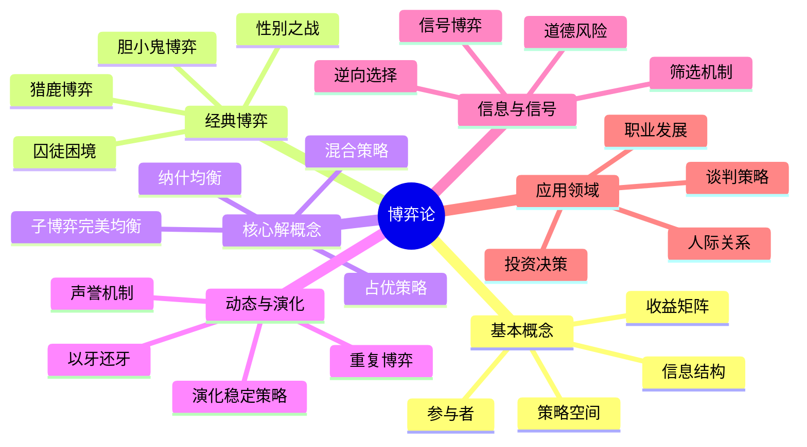
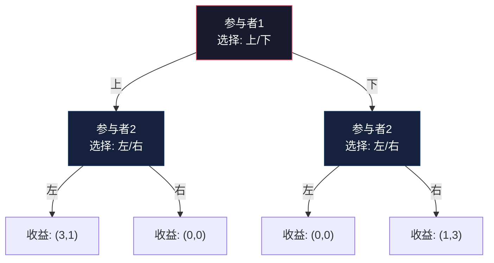
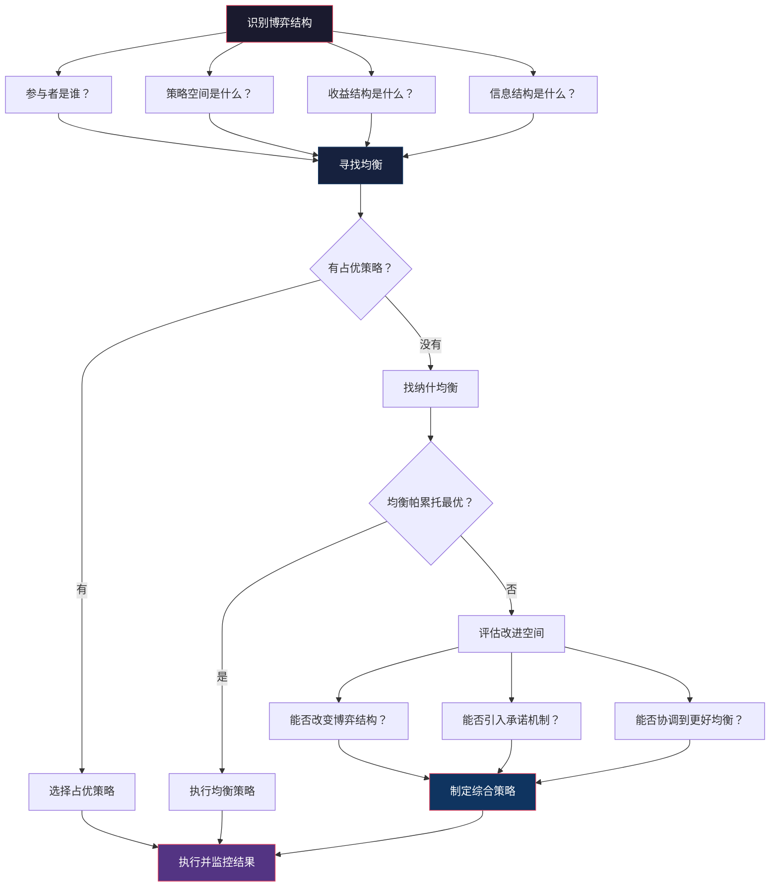

## 四、博弈论基础

博弈论（Game Theory）是研究理性决策者在策略互动中如何选择最优行动的数学理论。它的核心问题只有一个：**当你不知道别人会怎么做时，你应该怎么做？** 这个问题贯穿个人生活的方方面面——薪资谈判、职业选择、人际关系、商业竞争、甚至家庭内部的资源分配。

博弈论不是教你"算计"别人，而是帮你理解互动结构，避免在复杂的策略环境中犯下系统性错误。很多看似"聪明"的决策，在博弈结构下反而是陷阱；很多看似"吃亏"的行为，恰恰是长期最优策略。

### 4.1 博弈论的基本概念

#### 4.1.1 博弈的五要素

任何一个博弈场景，都可以拆解为五个核心要素：

| 要素 | 含义 | 生活实例 |
|------|------|----------|
| **参与者（Players）** | 做出决策的主体 | 谈判中的你和对方 |
| **策略（Strategies）** | 每个参与者可选的行动方案集合 | 坚持要价、让步、退出 |
| **收益（Payoffs）** | 每种策略组合下各参与者获得的结果 | 薪资水平、工作满意度 |
| **信息（Information）** | 参与者对博弈结构和其他参与者策略的了解程度 | 是否知道对方的底线 |
| **规则（Rules）** | 博弈进行的约束条件和时序 | 谈判轮次、是否可以中途退出 |

理解博弈的第一步，不是急着找"最优策略"，而是**准确识别你所处的博弈结构**。很多人在博弈中犯错，不是因为分析能力不够，而是从一开始就错误地定义了博弈——遗漏了关键参与者、忽略了隐含规则、或者误判了信息结构。

#### 4.1.2 博弈的分类体系

博弈可以从多个维度进行分类，每种分类对应不同的分析方法：

**按参与者关系分：**

| 类型 | 特征 | 典型场景 | 分析工具 |
|------|------|----------|----------|
| 合作博弈 | 可以达成有约束力的协议 | 联盟谈判、合伙创业 | Shapley值、核心解 |
| 非合作博弈 | 无法强制执行协议 | 价格战、资源争夺 | 纳什均衡 |

**按收益结构分：**

| 类型 | 特征 | 典型场景 |
|------|------|----------|
| 零和博弈 | 一方所得 = 另一方所失 | 赌博、竞技比赛 |
| 非零和博弈 | 双方可以同时受益或同时受损 | 商业合作、国际谈判 |

**按信息结构分：**

| 类型 | 特征 | 典型场景 |
|------|------|----------|
| 完全信息博弈 | 所有参与者了解博弈的完整结构 | 棋类游戏 |
| 不完全信息博弈 | 参与者不了解某些关键信息（如对手的真实类型） | 拍卖、求职面试 |
| 完美信息博弈 | 参与者能看到对手之前的所有行动 | 围棋、象棋 |
| 不完美信息博弈 | 参与者无法看到对手之前的某些行动 | 扑克牌 |

**按时序结构分：**

| 类型 | 特征 | 典型场景 | 分析方法 |
|------|------|----------|----------|
| 静态博弈 | 参与者同时做出决策 | 拍卖出价、选课 | 收益矩阵 |
| 动态博弈 | 参与者依次做出决策，后行动者可观察到先行动者的选择 | 谈判、进入市场 | 博弈树（展开式） |

**关键洞察**：大多数现实生活的博弈都是**不完全信息的非零和动态博弈**。这意味着我们面临的挑战是：在不确定对方类型和意图的情况下，在多次互动中找到最优策略。

#### 4.1.3 博弈的标准表示

博弈有两种标准表示方式：

**策略式（Normal Form）**——用收益矩阵表示，适合静态博弈：

            参与者B
            策略X    策略Y
参与者A  策略P  (a1,b1)  (a2,b2)
         策略Q  (a3,b3)  (a4,b4)

**展开式（Extensive Form）**——用博弈树表示，适合动态博弈：

对于个人决策者，关键是学会将现实问题**映射**到这些标准形式——一旦问题被正确建模，最优策略往往水落石出。

### 4.2 占优策略与劣策略

在讨论纳什均衡之前，需要先理解两个更基础的概念。

#### 4.2.1 占优策略

**占优策略（Dominant Strategy）** 是指无论对手选择什么，这个策略都是最优的。如果一个参与者有占优策略，那么他的决策就变得非常简单——直接选择占优策略即可。

**严格占优** vs **弱占优**：
- 严格占优：无论对手做什么，这个策略的收益**严格大于**其他所有策略
- 弱占优：无论对手做什么，这个策略的收益**大于等于**其他所有策略，且至少在一种情况下严格大于

#### 4.2.2 劣策略与重复剔除

**劣策略（Dominated Strategy）** 是指无论对手选择什么，存在另一个策略总是更好。理性的参与者永远不会选择劣策略。

**重复剔除严格劣策略（IESDS）** 的逻辑是：
1. 找出某参与者的严格劣策略，将其剔除
2. 在简化后的博弈中，再找出另一参与者的严格劣策略，剔除
3. 重复直到无法继续剔除

这个过程可能收敛到一个唯一解（此时无需纳什均衡概念即可求解），也可能剩下多个策略无法继续剔除。

**个人应用**：在做决策时，先排除那些"无论怎样都不是最优"的选项——这一步本身就能大幅简化决策空间。例如，在选择职业方向时，先排除那些无论市场环境如何变化都不会是最优选择的选项。

### 4.3 纳什均衡

#### 4.3.1 定义与直觉

约翰·纳什在1950年证明了：在任何有限博弈中，至少存在一个纳什均衡（可能是混合策略均衡）。这个定理奠定了现代博弈论的基石。

**纳什均衡的形式化定义**：策略组合 $(s_1^*, s_2^*, ..., s_n^*)$ 是纳什均衡，当且仅当对每个参与者 $i$，$s_i^*$ 是对其他参与者策略 $(s_1^*, ..., s_{i-1}^*, s_{i+1}^*, ..., s_n^*)$ 的最优反应。

用直觉语言描述：**在纳什均衡中，如果告诉你其他人的选择，你也不会想要改变自己的选择。** 每个人都在给定他人策略的情况下做了最优选择——没有人有动机"偏离"。

需要注意，纳什均衡有三个容易被忽视的特性：
1. **不保证全局最优**：纳什均衡可能对所有人来说都不是最好的结果
2. **可能不唯一**：一个博弈可能存在多个纳什均衡，选择哪个取决于协调机制
3. **可能存在混合策略均衡**：参与者以一定概率随机选择不同策略

#### 4.3.2 经典案例：囚徒困境

两个嫌疑人被逮捕并分开审讯。每个嫌疑人都面临两个选择：沉默（合作）或坦白（背叛）。

|  | B沉默 | B坦白 |
|--|-------|-------|
| A沉默 | A:-1, B:-1 | A:-10, B:0 |
| A坦白 | A:0, B:-10 | A:-5, B:-5 |

（注：数字表示监禁年数，负号表示这是成本）

**分析过程**：
- 从A的视角：如果B沉默，A坦白得0年 vs 沉默得1年 → 坦白更好
- 从A的视角：如果B坦白，A坦白得5年 vs 沉默得10年 → 坦白更好
- 因此，无论B怎么做，A的严格占优策略都是坦白
- 对称地，B的严格占优策略也是坦白

**结果**：（坦白，坦白）是唯一的纳什均衡，每人判5年。但如果他们都沉默，每人只需1年——这是一个帕累托更优的结果，却不是纳什均衡。

**这个博弈的深刻含义**：

囚徒困境揭示了**个体理性与集体理性的根本冲突**。在个人生活中，这种结构无处不在：

| 场景 | "合作" | "背叛" | 困境本质 |
|------|--------|--------|----------|
| 团队项目 | 认真完成自己的部分 | 搭便车、偷懒 | 每个人都有偷懒的动机 |
| 环境保护 | 减少碳排放 | 继续高排放 | 减排成本自己承担，收益所有人共享 |
| 价格竞争 | 维持合理价格 | 大幅降价抢市场 | 降价是短期最优，但所有人都降价则所有人亏损 |
| 人际信任 | 诚实守信 | 背信弃义获取短期利益 | 信任需要长期建立，但背叛的短期收益诱人 |

**破解囚徒困境的方法**：

| 方法 | 机制 | 适用场景 |
|------|------|----------|
| 重复博弈 | 未来的交互使背叛有代价 | 长期合作关系 |
| 声誉机制 | 背叛的声誉损失超过短期收益 | 封闭社区、行业圈子 |
| 外部强制 | 第三方执行合作协议 | 法律合同、行业监管 |
| 改变收益 | 将"背叛"的收益降低或成本增加 | 设计激励机制 |
| 选择参与者 | 只与有合作意愿的人互动 | 筛选合作伙伴 |

#### 4.3.3 经典案例：胆小鬼博弈（Chicken Game）

两辆车相向而行，每个司机可以选择"直行"或"转向"。

|  | B直行 | B转向 |
|--|-------|-------|
| A直行 | A:-100, B:-100 | A:1, B:-1 |
| A转向 | A:-1, B:1 | A:0, B:0 |

这个博弈与囚徒困境的关键区别在于：**没有占优策略**。A的最优选择取决于A认为B会怎么做。如果A认为B会直行，A就应该转向；如果A认为B会转向，A就应该直行。

这个博弈存在两个纯策略纳什均衡：（直行，转向）和（转向，直行）。问题在于：谁会是那个"直行"的人？

**个人应用**：在谈判、竞争和冲突中，胆小鬼博弈的结构经常出现。关键策略包括：
- **承诺装置（Commitment Device）**：让对方确信你不会转向（例如公开声明、烧掉退路）
- **声誉建设**：建立"绝不退让"的声誉，在未来的博弈中获得优势
- **理性评估**：如果对方的承诺是可信的，及时转向不是懦弱而是智慧

#### 4.3.4 经典案例：猎鹿博弈（Stag Hunt）

一群人合作可以猎到鹿（高收益），但每个人都有动机去单独抓兔子（低但确定的收益）。

|  | B猎鹿 | B抓兔 |
|--|-------|-------|
| A猎鹿 | A:5, B:5 | A:0, B:3 |
| A抓兔 | A:3, B:0 | A:3, B:3 |

这个博弈存在两个纳什均衡：（猎鹿，猎鹿）和（抓兔，抓兔）。前者是帕累托最优的，但后者是"安全"的——即使对方不合作，你也不会空手而归。

**个人应用**：猎鹿博弈完美描述了信任与合作的困境：
- 创业伙伴：全力以赴 vs 各留后手
- 团队协作：全力投入 vs 保留精力做副业
- 亲密关系：完全信任 vs 保持独立性

猎鹿博弈的启示是：**在高信任环境中，协调到最优均衡是可能的；在低信任环境中，人们会退化到安全但次优的均衡。** 建设信任环境本身就是一种战略行为。

#### 4.3.5 帕累托最优与纳什均衡的关系

一个常见的误解是"纳什均衡就是最优结果"。实际上，纳什均衡和帕累托最优是两个独立的概念：

| 概念 | 含义 | 关系 |
|------|------|------|
| 纳什均衡 | 没有人有单方面偏离的动机 | 稳定性标准 |
| 帕累托最优 | 无法在不损害他人的情况下改善某人的结果 | 效率标准 |

纳什均衡可能是帕累托最优的（如猎鹿博弈的（猎鹿，猎鹿）），也可能是帕累托低效的（如囚徒困境的（坦白，坦白））。**理性的参与者在纳什均衡处稳定，但这个稳定点可能对所有人都不是最好的。**

这对个人决策的启示：在选择合作对象和合作模式时，不仅要考虑"是否稳定"，还要考虑"是否高效"。一个稳定的低效均衡远不如一个需要维护但高效的均衡。

### 4.4 混合策略

#### 4.4.1 什么是混合策略

当一个博弈没有纯策略纳什均衡时（如猜拳），参与者需要以一定的概率随机选择不同策略——这就是**混合策略（Mixed Strategy）**。

经典的例子是"匹配硬币"：两个人各选正面或反面，如果一样则A赢，不一样则B赢。这个博弈没有纯策略纳什均衡（因为总有偏离的动机），但存在混合策略均衡：双方各以50%的概率选择正面或反面。

#### 4.4.2 混合策略的直觉

混合策略均衡的核心直觉是：**在均衡中，你选择的混合比例应该让对手对他的任何纯策略选择都无差异。**

例如在网球中，发球方选择发向对手正手或反手。如果发球方总是发向正手，对手就会提前移动；如果总是发向反手，对手也会提前移动。最优策略是按照一定比例混合，让对手无法预测——而这个比例取决于正手和反手的相对能力。

#### 4.4.3 个人应用

混合策略在生活中有广泛的应用：

**避免被预测**：当你与某人反复互动时，如果你的行为模式过于固定，对方就可以利用这种可预测性。适度的"随机性"反而是一种策略优势。例如：
- 在谈判中，不要总是强硬或总是妥协——混合使用才能让对方无法摸清你的底牌
- 在竞争中，不要总是选择同类项目——偶尔跨界可以避免被直接对标
- 在人际互动中，保持一定的不可预测性可以增加吸引力

**接受不确定性**：混合策略告诉我们，最优策略本身可能包含不确定性。这意味着即使你做了最优决策，结果也可能不好——因为你在"玩概率"。区分"决策质量"和"结果质量"是成熟决策者的核心能力。

### 4.5 重复博弈与合作的演化

#### 4.5.1 从一次性博弈到重复博弈

在一次性的囚徒困境中，背叛是占优策略。但当博弈无限次（或不确定次数）重复进行时，**合作可以成为均衡**。这就是著名的**无名氏定理（Folk Theorem）**。

无名氏定理的核心结论是：在无限重复博弈中，只要参与者对未来足够重视（折现因子足够大），任何可行的、帕累托优于最小最大收益的结果都可以成为子博弈完美纳什均衡。

用通俗的话说：**如果你们要长期打交道，合作就是可以维持的——但前提是你足够重视未来。**

#### 4.5.2 "以牙还牙"策略（Tit for Tat）

罗伯特·阿克塞尔罗德在1980年代组织了两次著名的计算机锦标赛，让各种策略在重复囚徒困境中相互竞争。结果出人意料：最简单的策略——"以牙还牙"（第一轮合作，之后模仿对方上一轮的选择）——两次都赢得了比赛。

**"以牙还牙"的四个成功要素**：

| 要素 | 含义 | 为什么有效 |
|------|------|-----------|
| **善良（Nice）** | 从不首先背叛 | 避免引发不必要的报复循环 |
| **可激怒（Retaliatory）** | 对背叛立即回应 | 让背叛者知道背叛有代价 |
| **宽容（Forgiving）** | 一旦对方恢复合作，也恢复合作 | 避免陷入永久报复的死循环 |
| **清晰（Clear）** | 策略简单，容易被对方理解 | 让对手知道如何与你合作 |

**重要修正**：阿克塞尔罗德的锦标赛有一个关键条件——参赛者知道博弈会重复进行，但不知道具体次数。如果参赛者知道确切的最后一轮，那么逆向归纳会导致合作崩溃（最后一轮没有合作动机，因此倒数第二轮也没有，以此类推）。这揭示了一个重要的现实条件：**合作在"不确定何时结束"的环境中更容易维持。**

#### 4.5.3 声誉机制

在多次博弈中，你的"声誉"成为一种资产。声誉的本质是：**过去的行为传递了你未来行为的信号。**

声誉的经济学分析：
- **建立声誉需要成本**：你需要在早期牺牲短期利益来展示合作意愿
- **声誉可以产生收益**：一旦建立了好声誉，对方会更愿意与你合作
- **声誉容易被破坏**：一次背叛可能毁掉多年积累的声誉
- **声誉的价值取决于未来的交互次数**：如果不再有未来交互，声誉就没有价值

**个人应用**：

在职业和人际发展中，声誉是最有价值的无形资产之一：
- **一致性**：让别人能够预测你的行为——这不是无聊，而是建立信任的基础
- **小代价验证**：在不确定的环境中，先通过小规模互动验证对方的可靠性
- **公开承诺**：将你的原则和标准公开表达，让声誉有"锚点"
- **选择环境**：在重视声誉的环境中互动（如封闭行业、专业圈子），声誉的价值更高

### 4.6 信号博弈与信息不对称

#### 4.6.1 信号理论的基本框架

迈克尔·斯宾塞在1973年提出的信号理论解释了一个看似矛盾的现象：为什么人们会花费大量时间和金钱获取学历，即使学历本身并不直接提升能力？

核心机制是**信息不对称**：雇主无法直接观察求职者的真实能力，但求职者自己知道自己的能力。在这种情况下，高能力者可以通过获取学历来"发送信号"——因为获取学历对高能力者来说成本较低，对低能力者来说成本较高。

**信号有效性的三个条件**：

| 条件 | 含义 | 反例 |
|------|------|------|
| **区分度** | 信号能够有效区分不同类型的人 | 所有人都能轻易获得的信号没有区分度 |
| **成本差异** | 获得信号的成本对不同类型的人不同 | 如果高能力者和低能力者获取信号的成本相同，信号无效 |
| **可信性** | 信号难以伪造 | 容易伪造的信号会失去区分度 |

#### 4.6.2 信号与筛选

信号博弈中有两种角色：

**信号发送者**（如求职者）：选择发送什么信号来让对方了解自己的类型。

**信号接收者**（如雇主）：设计筛选机制来区分不同类型的人。

在实际场景中，这两种角色经常互换——你既是信号发送者（向他人展示自己的价值），也是信号接收者（判断他人的真实能力）。

#### 4.6.3 现实中的信号体系

| 信号类型 | 具体形式 | 区分度 | 可信度 | 适用场景 |
|----------|----------|--------|--------|----------|
| 学历信号 | 学校排名、学位 | 中（正在通胀） | 中 | 求职初期 |
| 成果信号 | 作品集、项目、开源贡献 | 高 | 高 | 技术和创意领域 |
| 社交信号 | 推荐信、人脉背书 | 中 | 中高 | 需要信任的场景 |
| 时间信号 | 在某领域的持续投入 | 高 | 高 | 专业领域 |
| 代价信号 | 免费提供价值、自降利润 | 高 | 高 | 建立初期信任 |
| 隐私信号 | 主动暴露弱点或风险 | 高 | 高 | 深度合作关系 |

**个人应用**：构建信号策略的关键原则

1. **投资高可信度信号**：与其花钱买证书，不如做出实际成果——一个GitHub项目比一张证书更有说服力
2. **组合多重信号**：单一信号容易被质疑，多重信号交叉验证更有说服力
3. **注意信号通胀**：当所有人都拥有某个信号时，它的区分度就会下降（如本科学历在当代的价值下降）
4. **主动设计筛选机制**：当你需要判断他人时，设计低成本的测试来区分对方的真实类型——例如给候选人一个小项目试做，比面试问答更能区分能力

#### 4.6.4 逆向选择与道德风险

信息不对称导致的两个核心问题是：

**逆向选择（Adverse Selection）**——交易前的信息不对称：
- 高质量卖家被低质量卖家挤出市场
- 典型案例：二手车市场（"柠檬问题"）
- 个人对策：在选择合作伙伴、投资标的、工作机会时，警惕"逆向选择"——太容易得到的机会往往质量更低

**道德风险（Moral Hazard）**——交易后的信息不对称：
- 一方的行为无法被另一方完全观察到
- 典型案例：代理问题（代理人可能不按委托人利益行事）
- 个人对策：在委托他人做事时，设计合理的监督和激励机制；在被委托时，主动增加透明度以消除对方的顾虑

### 4.7 协调博弈与谢林点

#### 4.7.1 协调博弈的本质

并非所有的博弈都是对抗性的。在协调博弈中，参与者需要**协调他们的行动来达到共同的最优结果**。冲突不是来自利益对立，而是来自协调失败。

经典例子：两个人需要在纽约市见面，但没有事先约定地点。如果他们能"协调"到同一个地点，双方都受益；如果各去各的地方，双方都浪费时间。

#### 4.7.2 谢林点（Focal Point）

托马斯·谢林在1960年提出：在缺乏沟通的情况下，人们会倾向于选择那些"显而易见"的协调点——这些点被称为**谢林点（Schelling Point）**。

谢林点的特征：
- **显著性**：在选项中显得"突出"
- **共同认知**：参与者都知道对方也知道这个选项是突出的
- **文化共识**：基于共享的文化背景和经验

**个人应用**：

| 场景 | 谢林点策略 |
|------|-----------|
| 团队协调 | 建立清晰的规范和惯例，减少协调成本 |
| 人际沟通 | 使用共同熟悉的框架和参照系 |
| 品牌建设 | 占据品类中"第一提及"的位置 |
| 选择标准 | 在缺乏信息时，选择最"显而易见"的选项往往是最安全的 |

#### 4.7.3 网络效应与正反馈

网络效应是协调博弈的一种特殊形式：**一个选择的价值取决于有多少人做出了相同的选择。**

网络效应的类型：
- **直接网络效应**：用户越多，产品对每个用户的价值越高（如社交平台、通讯工具）
- **间接网络效应**：一方用户越多，另一方的参与价值越高（如电商平台：买家多→卖家多→买家更多）
- **数据网络效应**：用户越多，数据越多，产品越智能（如推荐系统）

**个人应用**：
- **选择平台**：加入有网络效应的平台，享受正反馈带来的红利
- **建设网络**：你的人脉、影响力和品牌都具有网络效应——规模越大，边际价值越高
- **避免锁定**：警惕网络效应带来的"锁定效应"——在一个平台投入太多，迁移成本会越来越高
- **选择时机**：在网络效应的早期（尚未形成垄断）介入，收益最大

### 4.8 演化博弈论

#### 4.8.1 从理性选择到演化稳定

经典博弈论假设参与者是理性的，会主动选择最优策略。演化博弈论则从另一个角度出发：**不假设理性，而是看哪些策略在长期竞争中能够存活下来。**

这个框架最初用于解释生物进化中的策略行为（如动物的争斗策略），后来被广泛应用于社会科学。

#### 4.8.2 演化稳定策略（ESS）

**演化稳定策略（Evolutionarily Stable Strategy）** 是这样一个策略：如果群体中大多数个体都采用这个策略，任何小比例的"变异"策略都无法入侵——即变异策略的收益不会高于当前策略。

ESS比纳什均衡的要求更严格：纳什均衡只要求没有人有动机单方面偏离，ESS还要求策略能够抵御"入侵"。

**经典案例：鹰鸽博弈**

在一个种群中，"鹰"策略是每次遇到资源都争斗到底，"鸽"策略是遇到争斗就退让。纯鹰策略和纯鸽策略都不是ESS——纯鹰种群会被少量鸽入侵（鸽不需要受伤就能获得资源），纯鸽种群会被少量鹰入侵（鹰总能赢）。ESS是一个混合策略：大多数时候做鸽，偶尔做鹰。

#### 4.8.3 个人应用

演化博弈论对个人发展的启示：

1. **策略的环境适应性**：没有放之四海而皆准的最优策略。最优策略取决于你所处的"生态环境"——周围的人采用什么策略。在一个合作型环境中，合作策略收益最高；在一个竞争型环境中，过于天真地合作反而会被利用。

2. **关注长期可持续性**：演化博弈论的核心视角是长期。那些短期收益高但不可持续的策略（如一次性背叛的高收益），在长期竞争中会被淘汰。**选择能在十年后依然有效的策略，而非只看眼前的收益。**

3. **不要盲目追随"流行"策略**：当一个策略变得流行时，它的收益可能已经在下降了（因为越来越多的人在使用它，竞争加剧）。真正有价值的策略往往在大多数人还没注意到时就已经被少数人采用了。

4. **变异与创新**：在演化中，变异是进化的源泉。在个人发展中，偶尔偏离常规、尝试新方法，是发现更好策略的前提。关键是控制变异的幅度——太大的变异风险太高，太小的变异无法带来突破。

### 4.9 谈判博弈

#### 4.9.1 纳什讨价还价解

纳什在1950年还提出了一个优美的谈判理论：在两个理性参与者的谈判中，最终结果将最大化双方从谈判中获得的"剩余"的乘积。

**纳什讨价还价解的四个公理**：
1. **帕累托效率**：谈判结果不会浪费任何"剩余"
2. **对称性**：如果双方完全对称，结果应该平分
3. **线性不变性**：改变收益的度量单位不影响结果
4. **无关替代方案的独立性**：增加一个不会被选择的备选方案不影响结果

#### 4.9.2 鲁宾斯坦交替出价模型

阿里尔·鲁宾斯坦在1982年提出了一个动态谈判模型：两个人轮流出价，直到一方接受。这个模型的关键结论是：**先行动者有优势，优势的大小取决于双方的耐心程度（折现因子）。**

核心洞察：
- **耐心是力量**：更耐心的一方在谈判中获得更大的份额
- **先发优势**：在同等耐心条件下，先出价的一方有优势
- **外部选择权的价值**：有更好备选方案（BATNA）的一方获得更大份额
- **截止日期效应**：当谈判有明确截止日期时，最后一刻才容易达成协议

#### 4.9.3 谈判策略的博弈论框架

| 策略维度 | 具体做法 | 博弈论原理 |
|----------|----------|-----------|
| 了解自己的BATNA | 在谈判前明确自己的最佳替代方案 | 确定你的"威胁点" |
| 了解对方的BATNA | 尽可能收集对方的信息 | 评估对方的底线 |
| 创造价值 | 找到双方偏好的差异，进行利益交换 | 将零和博弈转为正和博弈 |
| 承诺与威胁 | 让对方相信你的底线是可信的 | 子博弈完美均衡中的可信承诺 |
| 耐心 | 不急于达成协议 | 折现因子越大，获得份额越大 |
| 锚定效应 | 先提出一个极端但合理的出价 | 设定谈判的参照点 |

### 4.10 机制设计：从被动博弈到主动设计

#### 4.10.1 机制设计的思维转换

如果说博弈论是"在给定规则下找最优策略"，那么**机制设计（Mechanism Design）** 就是"设计规则使得期望的结果成为均衡"。机制设计被称为"逆向博弈论"——从结果出发，反推什么样的规则能诱导出这个结果。

#### 4.10.2 显示原理

机制设计中的核心定理是**显示原理（Revelation Principle）**：任何机制能达到的结果，都可以通过一个"直接机制"（参与者直接报告自己的真实类型）来达到。

通俗地说：**与其费心设计复杂的机制，不如设计一个让人"说真话"就是最优策略的机制。**

#### 4.10.3 个人应用

机制设计思维在日常生活中的应用：

| 场景 | 机制设计思路 |
|------|-------------|
| 团队管理 | 设计激励机制使得"努力工作"成为每个人的最优选择 |
| 项目合作 | 设计分工和分配规则，使每个人都有动机完成自己的部分 |
| 筛选人才 | 设计面试流程，使得只有真正有能力的人才能通过 |
| 鼓励创新 | 设计容错机制，使"尝试新方法"的期望收益为正 |

**核心原则**：不要期望别人"应该"怎么做，而要设计环境使得他们"想要"怎么做。好的机制让正确的行为成为自然的选择，而不是需要不断监督和提醒。

### 4.11 公地悲剧与集体行动

#### 4.11.1 公地悲剧

加勒特·哈丁在1968年提出的"公地悲剧"描述了一个博弈结构：共享资源对每个个体开放，每个个体都有动机过度使用（因为成本由所有人分担，收益归自己），最终导致资源枯竭。

公地悲剧的本质是**外部性问题**：个体决策的成本没有完全由个体承担。

#### 4.11.2 奥尔森的集体行动逻辑

曼瑟尔·奥尔森在1965年指出：即使所有人都从集体行动中受益，理性的个体仍然有动机"搭便车"——享受他人努力的成果而不付出。这解释了为什么"大家都受益"的事情反而难以推进。

**集体行动成功的条件**：
1. **小群体**：群体越小，每个人的贡献越可见，搭便车越困难
2. **选择性激励**：对贡献者给予额外回报，对搭便车者施加惩罚
3. **企业家精神**：有人愿意承担初始成本来推动集体行动
4. **社会资本**：群体中存在信任和互惠规范

#### 4.11.3 个人应用

在参与集体行动（社区建设、开源项目、公益事业）时：
- **加入小而精的群体**：大群体中搭便车太容易，你的贡献也容易被稀释
- **建立可观察的贡献记录**：让你的付出被看见，既是声誉投资，也是防止搭便车
- **设计选择性激励**：如果你在领导一个团队，确保贡献者获得认可和回报
- **从自己开始**：在不确定他人是否合作时，先做出小规模的"善意投资"来测试反应

### 4.12 常见误区与陷阱

#### 误区一：把所有互动都当作零和博弈

**错误表现**：认为"你赢就是我输"，在合作场景中也采取对抗态度。

**纠正**：大多数现实互动都是非零和博弈。在谈判中，通过发现双方偏好的差异（你更在意薪资，我更在意弹性时间），可以创造"双赢"空间。先问"能否把蛋糕做大"，再讨论"怎么分蛋糕"。

#### 误区二：过度追求纳什均衡而忽视帕累托改进

**错误表现**：接受一个稳定的低效结果，因为"没有人有动机改变"。

**纠正**：纳什均衡只是"没有人想单方面偏离"，不代表"没有更好的方案"。有时候需要跳出博弈框架，通过改变规则、引入外部约束或重新定义问题来达到更好的均衡。

#### 误区三：用一次性博弈的思维处理重复博弈

**错误表现**：在长期关系中采用短期占优策略（如在团队中搭便车）。

**纠正**：在重复博弈中，声誉、信任和长期收益远比短期利益重要。问自己："如果对方知道我一贯的行为模式，他还会愿意和我合作吗？"

#### 误区四：忽视承诺的可信度

**错误表现**：做出威胁或承诺，但没有能力或意愿执行。

**纠正**：在博弈论中，一个威胁只有在它是"可信的"时才有效。如果你说"不加薪就离职"，但对方知道你不会真的离职，这个威胁就是空话。要么确保你的承诺是可信的，要么不要做出承诺。

#### 误区五：信号选择不当

**错误表现**：投入大量资源发送无效信号（如花钱买很多低价值证书），或忽视高价值信号（如不重视作品集建设）。

**纠正**：评估信号时考虑三个维度——区分度（能否区分你和别人）、成本差异（对高能力者是否更便宜）、可信性（是否难以伪造）。将资源集中在高价值信号上。

#### 误区六：忽视博弈结构本身

**错误表现**：在一个注定是囚徒困境的结构中试图靠"善意"解决问题。

**纠正**：有些博弈结构不支持合作均衡。在这种情况下，改变博弈结构（如引入第三方监管、改变激励、增加重复性）比改变参与者的态度更有效。

### 4.13 博弈论决策框架

将博弈论应用于日常决策的实用框架：

**第一步：识别博弈结构**
- 谁是参与者？
- 每个人有哪些策略选择？
- 每种策略组合的结果是什么？
- 这是一次性博弈还是重复博弈？
- 信息结构是什么？

**第二步：寻找均衡**
- 有没有占优策略？
- 能否通过重复剔除劣策略缩小选择范围？
- 纳什均衡是什么？有几个？
- 均衡是否帕累托最优？

**第三步：评估改进空间**
- 当前均衡是否对所有人都不好？能否协调到更好的均衡？
- 能否改变博弈结构来获得更好的结果？
- 能否引入承诺、声誉或其他机制来改善结果？

**第四步：制定策略**
- 在当前博弈中，我的最优行动是什么？
- 我需要发送什么信号？
- 我需要建立什么声誉？
- 我需要什么承诺装置？

### 4.14 本节小结

| 核心概念 | 核心洞察 | 个人应用 |
|----------|----------|----------|
| 囚徒困境 | 个体理性导致集体非理性 | 设计机制让合作成为自然选择 |
| 纳什均衡 | 稳定的结果不一定是最好的 | 追求帕累托改进，不满足于"没人想动" |
| 重复博弈 | 未来交互的阴影让合作成为可能 | 重视声誉，用长期视角做决策 |
| 信号理论 | 信息不对称下需要可信信号 | 投资高价值、难伪造的信号 |
| 谢林点 | 缺乏沟通时人们依赖显著性 | 建立清晰的规范和惯例 |
| 演化博弈 | 策略的长期存活取决于环境适应性 | 选择可持续的策略，不追短期投机 |
| 谈判博弈 | 耐心和BATNA决定谈判结果 | 先建立好备选方案，再进入谈判 |
| 机制设计 | 设计规则让正确行为成为均衡 | 不要期望别人"应该"怎样，设计让他们"想要"怎样的环境 |
| 混合策略 | 可预测性是一种劣势 | 保持适度的不可预测性 |
| 公地悲剧 | 共享资源被过度使用 | 加入小群体，建立贡献可见性 |

博弈论的终极价值不在于教你"赢"，而在于帮你**看清互动结构**——知道自己在什么博弈中、对手有什么选择、自己有什么选择、均衡在哪里、能否改变博弈规则。当你能准确识别博弈结构时，好的策略自然浮现。
