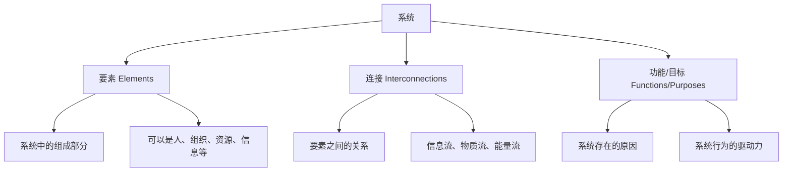
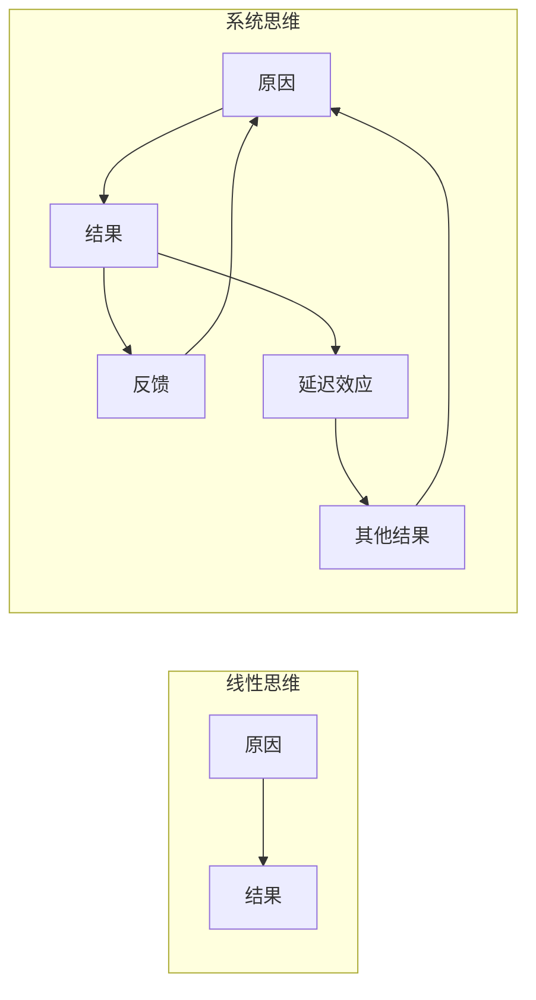
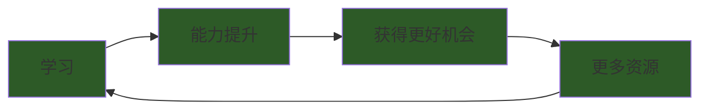
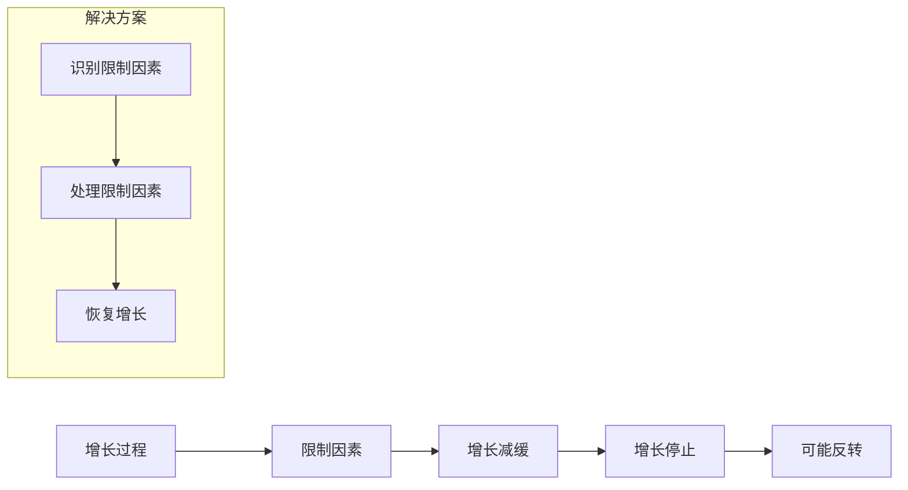
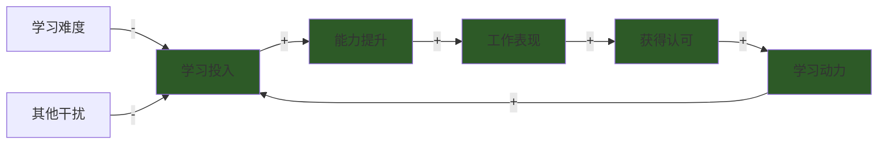
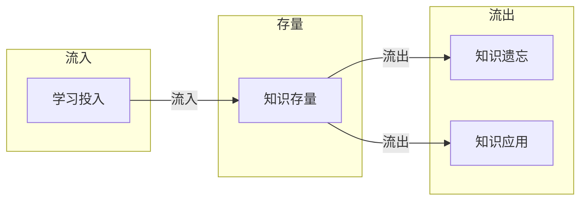
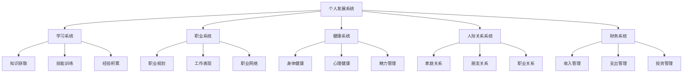
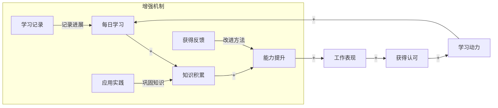

## 五、系统思维

系统思维是战略思维的核心引擎。它帮助我们看到事物之间的相互联系和动态变化，而不是孤立地、静态地看待问题。掌握系统思维，意味着你能够识别隐藏的结构，理解复杂的行为模式，并找到撬动变化的杠杆点。

### 5.1 系统思维的理论基础

#### 5.1.1 彼得·圣吉与《第五项修炼》

彼得·圣吉在《第五项修炼》中将系统思维称为"第五项修炼"，认为它是整合其他四项修炼（自我超越、心智模式、共同愿景、团队学习）的基石。圣吉认为，系统思维是一种"看到整体"的框架，它是一种看到相互关联而非单一事件的思维模式，是看到变化的形态而非静态"快照"的方法。

**为什么系统思维是"第五项修炼"？**

圣吉将系统思维置于第五位，不是因为它最不重要，恰恰相反——它是其他四项修炼的整合器。没有系统思维，其他四项修炼就像散落的珠子，无法串联成完整的项链。

| 修炼 | 核心内容 | 与系统思维的关系 |
|------|----------|------------------|
| 自我超越 | 持续学习和成长 | 系统思维帮助理解个人成长的动态结构 |
| 心智模式 | 改善内心的思维假设 | 系统思维揭示心智模式如何影响行为 |
| 共同愿景 | 建立共享的目标 | 系统思维帮助理解愿景如何影响组织行为 |
| 团队学习 | 通过对话和讨论共同学习 | 系统思维帮助理解团队互动的模式 |

#### 5.1.2 系统的基本构成

理解系统思维，首先要理解"系统"是什么。一个系统由三个基本要素构成：

**要素（Elements）**：系统中的组成部分。在个人发展中，要素包括你的技能、知识、习惯、人际关系、资源等。

**连接（Interconnections）**：要素之间的关系和互动方式。这些连接决定了系统的行为。例如，你的学习习惯与工作效率之间的关系，你的社交网络与职业机会之间的关系。

**功能/目标（Functions/Purposes）**：系统存在的原因和行为的驱动力。系统的功能往往不是显而易见的，需要通过观察系统行为来推断。

**关键洞察**：改变系统的要素往往比改变连接更容易，但改变连接比改变要素更能改变系统行为。改变系统的目标则是最深层次的改变。

#### 5.1.3 系统思维与线性思维的对比

| 维度 | 线性思维 | 系统思维 |
|------|----------|----------|
| 因果关系 | 单向因果 | 循环因果、反馈回路 |
| 时间视角 | 关注即时结果 | 关注长期动态 |
| 边界意识 | 局部视角 | 整体视角 |
| 解决方案 | 针对症状 | 针对结构 |
| 复杂性处理 | 简化问题 | 拥抱复杂性 |
| 变化模式 | 线性变化 | 非线性变化 |

### 5.2 系统思维的核心概念

#### 5.2.1 反馈回路（Feedback Loops）

系统中的因果关系往往不是线性的，而是形成回路。反馈回路是系统思维中最基本的概念，理解反馈回路是掌握系统思维的第一步。

**正反馈回路（增强回路）**

正反馈回路放大变化，产生指数级增长或衰退。它就像一个不断加速的飞轮，一旦启动就会越来越快。

个人发展中的正反馈回路案例：

- **学习飞轮**：学习→能力提升→获得更好的机会→更多资源用于学习→能力进一步提升
- **复利效应**：投资→收益→再投资→更多收益
- **声誉积累**：优质工作→获得认可→更多机会→更优质的工作
- **负向案例（拖延螺旋）**：拖延→焦虑→更难集中注意力→更多拖延
- **负向案例（债务陷阱）**：借贷→利息→更多借贷→更高利息

**负反馈回路（调节回路）**

负反馈回路抑制变化，维持系统的平衡。它就像恒温器，当温度偏离设定值时自动调节。

个人发展中的负反馈回路案例：

- **工作-休息平衡**：过度工作→身体疲劳→效率下降→被迫减少工作量→身体恢复
- **消费-收入平衡**：收入增加→消费增加→储蓄没有增长→需要继续工作
- **技能-市场匹配**：技能过时→竞争力下降→收入减少→被迫学习新技能→竞争力恢复

**如何识别和利用反馈回路**

理解你生活中的反馈回路，可以帮助你：

1. **设计和强化正反馈回路**：让你的好习惯形成良性循环。例如，建立"学习→应用→获得反馈→改进→学习"的循环。
2. **识别和打破负反馈回路**：找到制约你发展的瓶颈。例如，识别"收入增加→消费增加"的循环，主动控制消费。
3. **避免系统陷阱**：理解那些让你陷入困境的系统结构。例如，理解"拖延→焦虑→更多拖延"的循环，找到打破循环的关键点。

#### 5.2.2 延迟效应（Delays）

很多行动的结果不会立即显现，而是存在时间延迟。今天开始锻炼，可能几个月后才看到明显效果；今天学习的投资知识，可能几年后才派上用场。

**延迟效应的类型**

| 延迟类型 | 描述 | 个人发展案例 |
|----------|------|--------------|
| 物理延迟 | 物理过程需要时间 | 健身效果需要数月显现 |
| 信息延迟 | 信息传递需要时间 | 市场变化需要时间被感知 |
| 决策延迟 | 做出决策需要时间 | 职业转型需要数月规划 |
| 执行延迟 | 执行计划需要时间 | 学习新技能需要数年精通 |
| 感知延迟 | 意识到变化需要时间 | 认识到问题的严重性需要时间 |

**延迟效应的陷阱**

- **放弃陷阱**：因为看不到即时效果而放弃。例如，学习编程三个月后觉得没有进步而放弃。
- **过度反应陷阱**：因为延迟而在问题显现时措手不及。例如，健康问题积累多年后突然爆发。
- **错误归因陷阱**：在延迟期间做出错误的归因。例如，将成功归因于某个偶然因素，而忽略了真正的原因。

**如何应对延迟效应**

1. **保持耐心和坚持**：理解延迟是系统的正常特性，不是你的努力无效。
2. **提前规划和预防**：在延迟期间持续行动，而不是等到问题显现才反应。
3. **建立里程碑**：在长期目标中设置短期里程碑，帮助你看到进展。
4. **记录和回顾**：定期记录你的行动和进展，帮助你识别延迟效应。

#### 5.2.3 杠杆点（Leverage Points）

在系统中，有些地方的微小改变可以带来巨大的系统性变化。德内拉·梅多斯在《系统之美》中识别了系统的12个杠杆点，从低到高依次是：

| 层级 | 杠杆点 | 个人发展应用 | 影响力 |
|------|--------|--------------|--------|
| 1 | 数字（参数、常量） | 调整工作时间、学习时间 | 低 |
| 2 | 缓冲区（库存） | 建立应急基金、知识储备 | 低 |
| 3 | 存量-流量结构 | 调整收入支出结构 | 中低 |
| 4 | 延迟 | 调整反馈周期 | 中低 |
| 5 | 负反馈回路 | 建立自我调节机制 | 中 |
| 6 | 正反馈回路 | 设计良性循环 | 中 |
| 7 | 信息流 | 改变信息获取方式 | 中高 |
| 8 | 规则 | 改变行为准则和习惯 | 中高 |
| 9 | 自组织能力 | 培养自主学习和适应能力 | 高 |
| 10 | 目标 | 重新定义人生目标 | 高 |
| 11 | 范式 | 改变世界观和价值观 | 极高 |
| 12 | 超越范式 | 保持灵活性，不执着于任何范式 | 最高 |

**如何找到你的杠杆点**

1. **识别系统瓶颈**：找到限制你发展的关键因素。例如，是技能不足、资源有限，还是方向不明确？
2. **分析投入产出比**：在不同领域投入相同的时间和精力，哪个领域的回报最高？
3. **寻找高杠杆活动**：哪些活动能够同时影响多个领域？例如，学习沟通技巧可以同时提升工作效率、人际关系和领导力。
4. **测试和迭代**：小规模测试你的杠杆点假设，根据结果调整。

#### 5.2.4 涌现性（Emergence）

系统的整体行为往往是其组成部分单独不具备的。你的个人能力体系也是如此——单项技能的组合可以产生远超各部分之和的效果。

**涌现性的特征**

- **不可还原性**：整体行为无法通过分析部分来预测
- **自组织性**：涌现行为是系统自发产生的
- **层次性**：涌现可以在不同层次上发生

**技能组合的涌现案例**

| 技能组合 | 涌现的职业/能力 | 单一技能无法达到的效果 |
|----------|------------------|------------------------|
| 编程 + 写作 | 技术写作者/编程教育者 | 能够将复杂技术转化为易懂内容 |
| 设计 + 商业思维 | 产品经理 | 能够设计既有用户体验又能盈利的产品 |
| 数据分析 + 行业知识 | 数据驱动的行业顾问 | 能够用数据解决行业特定问题 |
| 心理学 + 技术 | 用户体验设计师 | 能够设计符合用户心理的产品 |
| 金融 + 技术 | 金融科技专家 | 能够用技术解决金融问题 |

**如何利用涌现性**

1. **建立技能组合**：不要只专注于单一技能，建立互补的技能组合。
2. **寻找连接点**：思考你的不同技能如何相互增强。
3. **创造应用场景**：主动寻找能够同时运用多种技能的场景。
4. **接受不确定性**：涌现行为是不可预测的，保持开放心态。

### 5.3 复杂系统理论

复杂系统理论是系统思维的进阶领域，它研究那些由大量相互作用的组成部分构成的系统。

#### 5.3.1 复杂适应系统的特征

约翰·霍兰德在《隐秩序》中描述了复杂适应系统的四个特征：

**聚集（Aggregation）**

简单的组成部分形成更高层次的结构。在个人发展中，你的各种技能和经验可以"聚集"成独特的能力体系。例如，你的编程技能、沟通能力和行业知识可以聚集成"技术领导力"这一更高层次的能力。

**标识（Tagging）**

组成部分通过标识来识别和互动。在个人发展中，你的个人品牌和声誉就是你的"标识"。它帮助你在复杂的环境中被识别和定位。

**非线性（Non-linearity）**

小的输入可能产生大的输出。在个人发展中，这意味着：
- 一个小的决定可能改变你的人生轨迹
- 一个关键的人脉可能带来巨大的机会
- 一个微小的习惯改变可能产生深远的影响

**多样性（Diversity）**

系统中的多样性是其适应能力的基础。在个人发展中，保持技能和经验的多样性，增强你的适应能力。不要把所有鸡蛋放在一个篮子里。

#### 5.3.2 混沌理论与蝴蝶效应

混沌理论指出，在某些系统中，初始条件的微小差异会导致结果的巨大差异。这就是"蝴蝶效应"——一只蝴蝶扇动翅膀可能在远处引发一场风暴。

**混沌系统的特征**

- **对初始条件的敏感依赖**：微小的差异会被放大
- **确定性但不可预测**：系统遵循确定性规则，但长期行为无法预测
- **内在随机性**：看似随机的行为实际上由确定性规则产生

**个人发展中的蝴蝶效应**

- 你的每一个小决定都可能对未来产生重大影响
- 保持对细节的敏感，但不要陷入对微小差异的过度担忧
- 在关键的决策点上花更多的时间和精力
- 接受不确定性，专注于你能控制的因素

#### 5.3.3 自组织与涌现

自组织是指系统在没有外部指令的情况下，通过组成部分之间的互动自发地形成有序结构。在个人发展中：

- 建立良好的习惯和系统，让正确的行为自然发生
- 信任过程——有时候"放手"比"控制"更有效
- 创造有利于自组织的条件和环境

### 5.4 系统基模

彼得·圣吉在《第五项修炼》中识别了常见的系统基模（System Archetypes），它们是反复出现的系统结构模式。理解这些基模可以帮助你快速识别问题的深层结构。

#### 5.4.1 增长极限（Limits to Growth）

增长过程会遇到限制因素，如果不处理这些限制因素，增长最终会停止甚至反转。

在个人发展中：
- 你的职业发展可能会遇到"天花板"——技能、学历、行业限制等
- 识别并突破这些限制因素，而不是在旧的模式中加倍努力
- 当增长停滞时，问自己："什么在限制我？"而不是"我需要更努力吗？"

#### 5.4.2 转移负担（Shifting the Burden）

当面对问题时，人们倾向于使用"症状解"（快速但治标不治本的方法）而不是"根本解"（慢但治本的方法）。长期依赖症状解会使问题变得更难解决。

| 问题 | 症状解 | 根本解 | 长期后果 |
|------|--------|--------|----------|
| 疲劳 | 咖啡因 | 改善睡眠和生活习惯 | 健康恶化 |
| 压力 | 消费缓解 | 找到压力根源并解决 | 财务问题 |
| 忙碌 | 效率工具 | 精简任务和优先级 | 更多忙碌 |
| 技能不足 | 投机取巧 | 系统学习和实践 | 能力停滞 |
| 人际关系问题 | 回避冲突 | 沟通和解决根本问题 | 关系恶化 |

**如何避免转移负担**

1. **识别症状解**：当你使用快速解决方案时，问自己："这是治标还是治本？"
2. **投资根本解**：即使根本解需要更多时间，也要坚持投资。
3. **设置时间限制**：给自己使用症状解的时间限制，同时并行处理根本解。
4. **定期检查**：定期回顾你是否过度依赖症状解。

#### 5.4.3 公地悲剧（Tragedy of the Commons）

当共享资源没有有效的管理机制时，个体的理性行为会导致资源的枯竭。

在个人发展中：
- 你的时间和精力是有限的"共享资源"，被各种需求竞争
- 如果没有明确的优先级，所有需求都会消耗你的时间，最终没有任何一项得到充分的投入
- 解决方案：建立明确的优先级和资源分配机制

#### 5.4.4 成功者惹的祸（Success to the Successful）

当资源分配给已经成功的个体时，会进一步增强他们的优势，形成"赢家通吃"的局面。

在个人发展中：
- 成功会带来更多机会，但也会让你忽略其他重要领域
- 解决方案：保持平衡，不要让某一方面的成功掩盖其他方面的需求

#### 5.4.5 饮鸩止渴（Fixes that Fail）

短期解决方案可能会带来长期的负面影响。

在个人发展中：
- 为了短期业绩而牺牲长期发展
- 为了眼前利益而忽略长期风险
- 解决方案：评估解决方案的长期影响，而不仅仅是短期效果

#### 5.4.6 目标侵蚀（Eroding Goals）

当系统表现不佳时，人们倾向于降低目标而不是提升表现。

在个人发展中：
- 当无法达到目标时，降低目标而不是提升能力
- 逐渐接受越来越低的标准
- 解决方案：坚持高标准，同时寻找提升表现的方法

#### 5.4.7 恶性竞争（Escalation）

两个或多个个体相互竞争，导致双方都付出更大代价。

在个人发展中：
- 与他人比较导致过度竞争
- 为了"赢"而忽略真正重要的目标
- 解决方案：专注于自己的目标，而不是与他人竞争

### 5.5 系统思维工具箱

#### 5.5.1 因果回路图（Causal Loop Diagrams）

因果回路图是可视化系统结构的基本工具。它用箭头表示变量之间的因果关系，用"+"和"-"表示关系的极性。

**绘制步骤**

1. **识别关键变量**：找出系统中的关键因素
2. **绘制因果关系**：用箭头连接相关变量
3. **标注极性**：在箭头上标注"+"（同向变化）或"-"（反向变化）
4. **识别回路**：找出闭环的因果链
5. **判断回路类型**：偶数个"-"为正反馈回路，奇数个"-"为负反馈回路

**示例：学习动力的因果回路图**

#### 5.5.2 存量-流量图（Stock and Flow Diagrams）

存量-流量图用于描述系统中的积累和流动。

- **存量（Stock）**：系统中可以积累的量（如知识、金钱、健康）
- **流量（Flow）**：导致存量变化的速率（如学习速率、收入、消耗）

**示例：知识存量的流量图**

#### 5.5.3 行为模式图（Behavior Over Time Graphs）

行为模式图用于观察系统随时间的变化趋势。

**常见的行为模式**

| 模式 | 描述 | 个人发展案例 |
|------|------|--------------|
| 指数增长 | 快速增长 | 复利效应、技能积累 |
| 指数衰退 | 快速衰退 | 习惯恶化、技能退化 |
| S形增长 | 增长后趋于稳定 | 学习曲线、职业发展 |
| 振荡 | 周期性波动 | 情绪波动、业绩波动 |
| 平台期 | 长期稳定 | 职业高原、技能瓶颈 |

#### 5.5.4 系统思维检查清单

在分析问题时，使用以下检查清单：

- [ ] 我是否看到了整体，而不仅仅是局部？
- [ ] 我是否识别了反馈回路？
- [ ] 我是否考虑了延迟效应？
- [ ] 我是否找到了杠杆点？
- [ ] 我是否考虑了涌现性？
- [ ] 我是否识别了系统基模？
- [ ] 我是否考虑了长期影响？
- [ ] 我是否考虑了非线性关系？

### 5.6 系统思维的个人应用

#### 5.6.1 个人发展的系统模型

将你的个人发展视为一个系统，包含以下子系统：

**子系统之间的相互作用**

- 学习系统影响职业系统和财务系统
- 健康系统影响所有其他系统
- 人际关系系统影响职业系统和心理健康
- 财务系统影响学习机会和生活质量

#### 5.6.2 识别你的系统瓶颈

**诊断步骤**

1. **观察行为模式**：你的个人发展呈现什么模式？是增长、停滞、还是振荡？
2. **识别反馈回路**：什么在驱动你的行为？什么在限制你的发展？
3. **找到杠杆点**：在哪里投入可以产生最大的回报？
4. **分析延迟效应**：你的努力需要多长时间才能看到效果？

**常见瓶颈类型**

| 瓶颈类型 | 表现 | 解决方案 |
|----------|------|----------|
| 技能瓶颈 | 能力不足限制发展 | 系统学习和实践 |
| 资源瓶颈 | 时间、金钱、人脉不足 | 优化资源配置 |
| 方向瓶颈 | 目标不明确 | 重新定义目标 |
| 动力瓶颈 | 缺乏内在动力 | 找到内在动机 |
| 环境瓶颈 | 外部环境限制 | 改变环境或适应环境 |

#### 5.6.3 设计你的正反馈回路

**设计步骤**

1. **明确目标**：你想要增强什么？
2. **识别关键变量**：什么因素会影响这个目标？
3. **绘制因果关系**：这些因素如何相互影响？
4. **找到增强点**：在哪里投入可以产生最大的增强效果？
5. **建立机制**：如何确保正反馈回路持续运行？

**示例：设计学习飞轮**

### 5.7 系统思维的进阶应用

#### 5.7.1 系统基模的组合应用

在实际问题中，系统基模往往不是单独出现，而是组合出现。识别基模组合可以帮助你更全面地理解问题。

**示例：职业发展的基模组合**

1. **增长极限**：职业发展遇到天花板
2. **转移负担**：用忙碌掩盖能力不足
3. **目标侵蚀**：降低职业目标以适应现状

**解决方案**：同时处理多个基模，而不是只解决一个。

#### 5.7.2 系统思维与战略规划

将系统思维应用于战略规划：

1. **识别系统结构**：理解你所处的系统
2. **找到杠杆点**：确定高影响力行动
3. **设计反馈机制**：建立监控和调整机制
4. **考虑延迟效应**：制定长期计划
5. **准备应对意外**：接受不确定性

#### 5.7.3 系统思维与决策制定

在决策时使用系统思维：

1. **扩大边界**：考虑决策的更广泛影响
2. **分析反馈**：决策会如何影响系统？
3. **考虑延迟**：决策的长期影响是什么？
4. **寻找杠杆**：有没有更高杠杆的选择？
5. **测试假设**：小规模测试你的假设

### 5.8 常见误区与纠正

#### 误区一：只关注要素，忽略连接

**表现**：只关注技能、资源等要素，忽略它们之间的关系。

**纠正**：绘制因果回路图，分析要素之间的连接。

#### 误区二：追求线性因果

**表现**：认为A导致B，B导致C，忽略循环因果。

**纠正**：寻找反馈回路，理解循环因果。

#### 误区三：忽略延迟效应

**表现**：期望立即看到结果，看不到就放弃。

**纠正**：理解延迟是系统的正常特性，设置里程碑追踪进展。

#### 误区四：过度简化系统

**表现**：将复杂系统简化为简单模型，忽略重要变量。

**纠正**：接受复杂性，使用系统工具分析。

#### 误区五：只看短期，忽略长期

**表现**：追求短期效果，忽略长期影响。

**纠正**：使用行为模式图分析长期趋势。

#### 误区六：过度控制

**表现**：试图控制系统的每一个部分。

**纠正**：理解自组织，创造有利于涌现的条件。

### 5.9 系统思维的训练方法

#### 5.9.1 日常练习

1. **因果日记**：每天记录一个因果关系，分析它是否是回路的一部分。
2. **模式识别**：观察日常生活中的系统模式，如消费习惯、学习习惯。
3. **杠杆点分析**：每周分析一个领域的杠杆点。
4. **延迟追踪**：记录你的行动和结果，追踪延迟效应。

#### 5.9.2 案例分析

1. **分析成功案例**：研究成功人士的系统结构。
2. **分析失败案例**：研究失败案例中的系统陷阱。
3. **模拟系统**：用纸笔或软件模拟系统行为。

#### 5.9.3 工具学习

1. **学习因果回路图**：练习绘制因果回路图。
2. **学习存量-流量图**：练习绘制存量-流量图。
3. **使用系统动力学软件**：如Vensim、Stella等。

### 5.10 总结

系统思维是战略思维的核心引擎。它帮助你：

- **看到整体**：理解事物之间的相互联系
- **理解动态**：理解系统随时间的变化
- **找到杠杆**：识别高影响力的行动点
- **避免陷阱**：识别和避免系统陷阱
- **设计系统**：设计有利于你发展的系统

掌握系统思维需要时间和练习，但它是值得投资的能力。从今天开始，用系统思维的视角看待你的个人发展，你会发现新的机会和解决方案。

