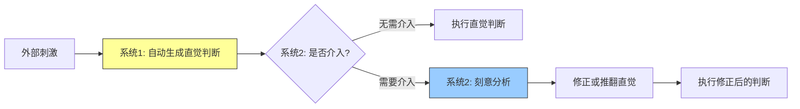
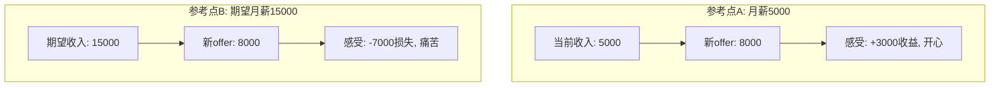
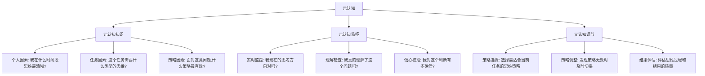
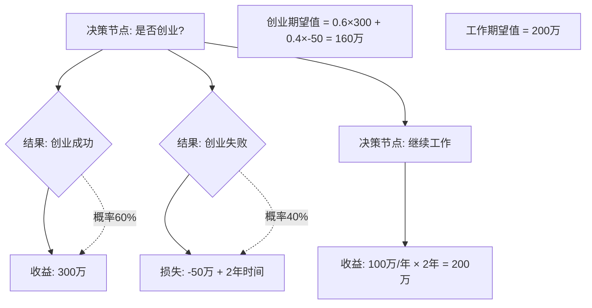

## 六、认知科学与决策

认知科学是研究人类思维、学习和决策机制的跨学科领域，融合了心理学、神经科学、经济学、计算机科学和哲学的核心发现。在个人策略与规划中，理解认知科学的价值在于：**你的大脑不是一台完美的推理机器，而是一个充满捷径和偏差的信息处理器**。只有认识到这些系统性偏差，你才能设计出超越本能的决策流程。

本章从三个层次展开：**道**（决策的底层理论——人类如何思考）、**法**（决策偏差的系统性识别与去偏差方法）、**术**（可执行的决策工具与实操框架），帮助你从「知道自己不理性」进阶到「系统性地变得更理性」。

### 6.1 人类决策的底层机制

#### 6.1.1 双系统思维模型

诺贝尔经济学奖得主丹尼尔·卡尼曼在《思考，快与慢》中提出了最具影响力的决策框架——双系统思维模型（Dual-Process Theory）。这一模型并非卡尼曼原创，其思想根源可追溯到威廉·詹姆斯（1890年）对「直觉思维」与「逻辑思维」的区分，后经斯坦诺维奇（Stanovich）和韦斯特（West）在2000年正式命名为系统1和系统2。

**系统1：快速思维**

系统1是大脑的「自动驾驶」模式，它以毫秒级速度完成判断，不需要主观努力的参与。

| 特征 | 说明 |
|------|------|
| 运行方式 | 自动、无意识、并行处理 |
| 速度 | 极快（毫秒级） |
| 认知负荷 | 几乎为零 |
| 信息处理 | 基于模式匹配和联想记忆 |
| 容量 | 可同时处理多个信息流 |
| 错误倾向 | 容易受启发式和偏差影响 |

系统1处理的典型任务：驾驶时自动踩刹车、读懂朋友脸上的愤怒表情、回答「2+2等于几」、在嘈杂环境中识别自己的名字（鸡尾酒会效应）。这些任务的共同特征是：你有大量的练习经验，大脑已经形成了自动化的处理通路。

**系统2：慢速思维**

系统2是大脑的「手动驾驶」模式，它负责需要逻辑推理、刻意注意力和工作记忆参与的任务。

| 特征 | 说明 |
|------|------|
| 运行方式 | 刻意、有意识、串行处理 |
| 速度 | 慢（秒级到分钟级） |
| 认知负荷 | 高，消耗大量认知资源 |
| 信息处理 | 基于规则和逻辑推理 |
| 容量 | 有限，同一时间只能聚焦一件事 |
| 错误倾向 | 相对准确，但容易因疲劳而退化 |

系统2处理的典型任务：计算17×24、在多个工作offer之间做比较、理解一份复杂的法律合同、在被激怒时控制情绪不发作。

**两个系统如何协作**

现实中，系统1和系统2不是独立运作的，而是形成一条「提议-审核」的流水线：

系统1不断向系统2「提议」直觉判断，系统2通常处于低耗能的「默认接受」状态——除非触发了特定的警报信号（如惊讶、矛盾、困难感）。这意味着：**大多数时候，你的行为是由系统1驱动的，即使你以为自己在「理性思考」**。

关键概念——**认知放松（Cognitive Ease）**：当信息呈现流畅、环境熟悉、心情愉快时，大脑处于认知放松状态，系统2会降低警觉性，系统1的直觉判断更容易被接受。广告商深谙此道：重复播放的广告让人产生熟悉感，熟悉感触发认知放松，认知放松让人对广告信息不加批判地接受。

#### 6.1.2 启发式：大脑的思维捷径

启发式（Heuristics）是系统1用来快速做出判断的心理捷径。阿莫斯·特沃斯基和丹尼尔·卡尼曼在1974年的经典论文《不确定性下的判断：启发式与偏差》中识别了三种核心启发式：

**代表性启发式（Representativeness Heuristic）**

人们根据「某事物与某个类别的典型特征有多相似」来判断它属于该类别的概率，而忽略了基础概率（base rate）。

经典实验——「琳达问题」：「琳达31岁，单身，性格直爽，非常聪明。她主修哲学，学生时代非常关注歧视和社会正义问题，也参加过反核示威游行。请问：(A) 理发店收银员 (B) 理发店收银员且积极参与女权运动，哪个概率更高？」大多数人选B，但B是A的子集，其概率不可能高于A。人们被「琳达像女权活动家」的叙事代表性所迷惑，违反了基本的合取规则。

**日常陷阱**：面试时，一个「看起来像」优秀候选人的人（名校毕业、表达流利、着装得体）容易被高估，而忽略了该岗位所需能力与这些表面特征之间的实际相关性。

**可得性启发式（Availability Heuristic）**

人们根据某类信息「多容易被想到」来判断其频率或概率。媒体大量报道的事件会被高估概率，而统计上更常见但不引人注目的事件会被低估。

| 被高估的风险 | 被低估的风险 | 原因 |
|------------|------------|------|
| 恐怖袭击 | 心脏病 | 媒体报道频率差异巨大 |
| 飞机失事 | 车祸 | 画面冲击力不同 |
| 鲨鱼攻击 | 溺水 | 叙事生动性差异 |
| 核泄漏 | 空气污染 | 恐惧情绪的放大效应 |

**锚定启发式（Ananchoring Heuristic）**

人们在估计数值时，会以最初接触到的数字（锚）为基准进行调整，但调整通常是不充分的。特沃斯基和卡尼曼的经典实验：让两组学生估计联合国中非洲国家的百分比，先转一个幸运转盘（一组转到10，一组转到65），结果转到10的组平均估计25%，转到65的组平均估计45%——一个完全随机的数字深刻影响了判断。

#### 6.1.3 有限理性与满意化

赫伯特·西蒙（Herbert Simon）提出了与「完全理性」相对的「有限理性」（Bounded Rationality）理论，为此获得1978年诺贝尔经济学奖。其核心洞察是：

**人类不是在所有选项中寻找最优解，而是在有限的时间、信息和认知能力下寻找「足够好」的解。**

西蒙用「满意化」（Satisficing）一词来描述这种策略——从可用选项中找到第一个满足最低标准的选项，然后停止搜索。这与「最大化」（Maximizing）策略（搜索所有选项并选择最优）形成对比。

研究表明，最大化者（Maximizers）虽然在客观结果上可能稍好于满意化者（Satisficers），但他们在主观幸福感、生活满意度和后悔程度上都显著更差——因为他们总在想象「也许有更好的选项我没看到」。

**个人应用框架**：

| 决策类型 | 推荐策略 | 理由 |
|---------|---------|------|
| 低风险、可逆的决策 | 满意化 | 节省认知资源，不值得过度投入 |
| 高风险、不可逆的决策 | 有限度的最大化 | 设定搜索范围和时间上限，然后做出选择 |
| 有明确标准的决策 | 设定门槛值 | 达到门槛即停止，不追求绝对最优 |
| 没有明确标准的决策 | 先定义标准 | 先花时间搞清楚「好」的定义，再搜索选项 |

### 6.2 前景理论：价值判断的非理性

前景理论（Prospect Theory）由卡尼曼和特沃斯基在1979年提出，是行为经济学的奠基性理论，卡尼曼因此获得2002年诺贝尔经济学奖。前景理论描述了人们在面对风险和不确定性时如何做出实际决策——与传统经济学假设的「期望效用理论」有系统性偏离。

#### 6.2.1 核心原理

**原理一：参考点依赖（Reference Dependence）**

人们对结果的评价不是基于最终状态的绝对值，而是基于相对于某个「参考点」的变化量。同一个结果，不同参考点会产生截然不同的感受。

**关键洞察**：你可以主动选择参考点。将参考点从「当前状态」切换到「理想状态」或「零基线」，可以改变你对同一结果的情绪反应，从而做出更理性的决策。

**原理二：损失厌恶（Loss Aversion）**

损失的心理影响约为等量收益的2-2.5倍。这个比率被称为损失厌恶系数（λ），在不同文化和情境中相当稳定。

损失厌恶的深远影响：
- **禀赋效应**：人们对已拥有的物品估价显著高于未拥有的状态。经典实验中，大学生获得一个杯子后，平均愿意以7.12美元卖出；而没有杯子的学生平均只愿出2.87美元购买。
- **现状偏差**：因为改变意味着可能的损失，所以人们倾向于维持现状，即使改变在期望值上更优。
- **沉没成本谬误**：已投入的成本被感知为「如果放弃就损失了」，导致人们在明知错误的路径上越走越远。
- **处置效应**：投资者倾向于过早卖出盈利的股票（锁定收益，避免「失去」利润），而过久持有亏损的股票（不愿确认损失）。

**原理三：概率权重函数（Probability Weighting）**

人们不是按照客观概率来评估事件，而是经过一个非线性的权重函数转换：

| 客观概率 | 主观感受 | 行为表现 |
|---------|---------|---------|
| 接近0% | 被大幅高估 | 买彩票（极小概率×大奖） |
| 小概率（1-10%） | 被高估 | 买保险（防极小概率大灾难） |
| 中等概率（30-70%） | 相对准确 | 日常决策偏差较小 |
| 大概率（90-99%） | 被低估 | 「99%成功」感觉不如「确定成功」 |
| 接近100% | 被赋予过高权重 | 确定性效应——为100%付出过高溢价 |

**原理四：框架效应（Framing Effect）**

同一客观信息的不同表述会导致不同的决策。卡尼曼和特沃斯基的「亚洲疾病问题」是经典案例：面对600人可能死亡的疫情，表述为「拯救200人」（收益框架）时人们偏好确定选项，表述为「400人死亡」（损失框架）时人们偏好冒险选项——实质上是同一个结果。

#### 6.2.2 前景理论的个人应用矩阵

| 认知陷阱 | 触发机制 | 纠正策略 |
|---------|---------|---------|
| 不敢换工作 | 损失厌恶——害怕失去现有稳定 | 将参考点切换为「5年后的自己」，评估不换的隐性成本 |
| 过度持有亏损投资 | 损失厌恶——不愿确认损失 | 设定止损线并自动化执行，去除情绪干扰 |
| 过度买彩票/保险 | 概率权重——高估小概率事件 | 用期望值公式重新计算，关注基础概率 |
| 被话术左右 | 框架效应——同一信息不同表述 | 对每个重要决策，主动用收益和损失两种框架分别描述 |
| 拖延重大改变 | 现状偏差+损失厌恶叠加 | 将「不行动」也定义为一种决策，评估其成本 |
| 对确定性过度支付 | 确定性效应 | 计算确定选项的「确定性溢价」，评估是否值得 |

### 6.3 认知偏差全景图

认知偏差是系统1启发式思维的系统性副产品。2000年以来，行为科学研究已经识别了超过180种认知偏差。以下是最常见、对个人决策影响最大的偏差，按照「信息获取→信息处理→信息输出→反馈学习」的决策流程分类。

#### 6.3.1 信息获取阶段的偏差

**确认偏差（Confirmation Bias）**

这是最普遍、最顽固的认知偏差。人们倾向于选择性地搜索、解读和记忆支持自己已有信念的信息，而忽略或贬低矛盾信息。

神经科学研究发现：当人们接触到支持自己观点的信息时，大脑中与奖励相关的区域（如腹侧纹状体）会被激活——确认自己的正确本身就是一种愉悦体验。而接触矛盾信息时，大脑中与负面情绪相关的区域会被激活。

纠正方法：
1. **魔鬼代言人法**：为每个重要决策指定一个人（或自己扮演）专门寻找反对理由
2. **反向搜索**：在搜索信息时，刻意搜索「为什么X是错的」而非「为什么X是对的」
3. **概率思维**：问自己「如果我的判断是错的，我会看到什么证据？」然后去找这些证据
4. **多元化信息源**：主动关注与自己观点不同的高质量信息源

**选择性感知（Selective Perception）**

人们倾向于注意到环境中与自己当前关注点、需求或信念一致的信息，而忽略不一致的信息。新晋父母会突然「发现」到处都是婴儿和孕妇——不是他们变多了，而是你的注意力筛选器变了。

**可得性偏差（Availability Bias）**

在信息获取阶段，人们倾向于依赖最容易回忆起来的信息。这不仅受媒体影响，还受个人经历的影响：经历过车祸的人会高估车祸概率，经历过地震的人会高估地震风险。

纠正策略：建立个人的「基础概率数据库」——在做重大决策前，先查阅客观统计数据，用数字代替直觉印象。

#### 6.3.2 信息处理阶段的偏差

**锚定效应（Anchoring Effect）**

即使人们知道某个锚是随机的、不相关的，它仍然会影响判断。在一项实验中，让法官先掷骰子得到一个数字（1或10），然后判决一个商店盗窃案的刑期——掷到10的法官平均判8个月，掷到1的法官平均判5个月。

对抗锚定的方法：
1. **多锚策略**：主动为自己设置多个参考锚（最低价、最高价、中位价），避免被单一锚点锁定
2. **反向锚定**：在谈判中，主动设定一个对自己有利的锚
3. **独立评估**：在做判断前，先独立评估各个维度，最后再综合

**光环效应（Halo Effect）**

人们对某人或某物在一个维度上的好印象会「辐射」到其他不相关的维度。爱德华·桑代克（Edward Thorndike）在1920年首次记录了这一现象：军官们对士兵外貌的评价与其智力、领导力评价高度相关——但外貌与这些能力并无实际关联。

光环效应的商业应用无处不在：品牌溢价（苹果产品的设计美感让人认为其功能也更好）、名人代言（运动员代言汽车让人觉得汽车性能更好）、面试偏见（穿着得体的候选人被认为工作能力更强）。

**框架效应（Framing Effect）**

同一事实的不同表述方式会导致不同的决策。这不仅是修辞问题——框架效应揭示了人类价值判断的根本不稳定性：如果一个人在收益框架下选A、损失框架下选B，说明他对A和B的真实偏好其实是不确定的。

常见框架陷阱：
- 「95%无脂肪」vs「含5%脂肪」
- 「每年收费960元」vs「每月仅需80元」
- 「1000人中有3人受益」vs「0.3%的治愈率」
- 「成功率95%的手术」vs「每20个患者有1人死亡」

**可识别受害者效应（Identifiable Victim Effect）**

人们对一个具体的、可识别的受害者产生的同情和援助意愿，远大于对大量统计意义上的受害者。斯大林曾说：「一个人的死亡是悲剧，一百万人的死亡是统计数字。」这精确描述了这一偏差。

对个人决策的影响：你可能因为一则感人新闻而捐出大笔善款，却忽视了将同样的钱用于更具成本效益的公益项目。

#### 6.3.3 信息输出阶段的偏差

**过度自信偏差（Overconfidence Bias）**

过度自信是人类最稳定的认知偏差之一，存在三种形式：

| 类型 | 定义 | 实验结果 |
|------|------|---------|
| 校准过度自信 | 对自己判断的置信区间设定过窄 | 当人们说「90%确信」时，实际正确率只有约70% |
| 优于平均效应 | 认为自己高于平均水平 | 90%的司机认为自己驾驶技术高于平均水平 |
| 规划谬误 | 低估完成任务所需时间 | 学生估计毕业论文需34天，实际平均55天 |

过度自信的成因：
1. **动机性因素**：乐观让人感觉良好，大脑倾向于维护积极的自我形象
2. **认知因素**：人们倾向于考虑「计划如何成功」的场景，而忽略「计划如何失败」的场景
3. **社会因素**：自信在社交中受到奖励，谦逊可能被视为软弱

纠正方法：
1. **建立决策日记**：记录每次重要决策的预测、置信度和实际结果，定期回顾校准
2. **区间估计法**：给出一个范围而非点估计，并刻意将区间设宽（「我90%确信完成时间在2-8周之间」而非「需要4周」）
3. **参考类别预测法**：不看自己的计划多完美，而是看类似项目的平均结果——「过去的项目平均用了多久？」
4. **Pre-mortem分析**：在项目开始前，假设项目已经失败了，然后回溯「是什么原因导致了失败？」

**后见之明偏差（Hindsight Bias）**

在知道结果后，人们倾向于认为自己「早就知道了」或「早就预见到了」。这会削弱从经验中学习的能力——如果你觉得自己早就知道了，就不会去反思决策过程中真正出了什么问题。

纠正方法：在做决策时，写下你的预测和理由，密封保存，在结果出来后打开对照。这能让你对自己的预测能力有更诚实的认识。

**行动偏差（Action Bias）**

人们倾向于在面对不确定性时采取行动，即使不行动可能是更优的选择。足球比赛中，罚球方向与射门方向不一致时，守门员更倾向于向左或向右扑（行动），而不是待在中间——但实际上待在中间的扑救成功率最高（因为约1/3的罚球射向中间）。

纠正方法：问自己「如果我什么都不做，会发生什么？」——如果不行动的后果可接受，且没有足够信息支持行动，那么不行动可能就是最优选择。

#### 6.3.4 反馈学习阶段的偏差

**后见之明偏差（Hindsight Bias）**

如上所述，后见之明偏差严重干扰了从经验中学习的能力。

**自利性归因偏差（Self-Serving Attribution Bias）**

人们倾向于将成功归因于自己的能力和努力（内部归因），将失败归因于外部环境和运气（外部归因）。这保护了自尊，但阻碍了真实的自我提升。

纠正方法：对每次失败进行「5个为什么」分析，至少找到3个自己可以改进的内因；对每次成功，列出3个自己不可控的外因。

**幸存者偏差（Survivorship Bias）**

人们只看到「幸存者」（成功者），而看不到「阵亡者」（失败者），从而对成功概率产生系统性高估。二战中，美军最初想根据返航飞机的弹孔分布来加强装甲，统计学家亚伯拉罕·瓦尔德指出应该加强没有弹孔的部位——因为被击中那些部位的飞机根本没有返航。

日常中的幸存者偏差：
- 创业成功故事：媒体大肆报道成功者，但90%的创业公司在10年内失败
- 退学创业神话：比尔·盖茨、马克·扎克伯格被反复提及，但退学创业的平均结果远差于完成学业
- 投资大师的「秘诀」：你只看到幸存下来的投资人，看不到用同样方法亏损消失的人

#### 6.3.5 社会性偏差

**从众效应（Bandwagon Effect）**

人们倾向于采纳多数人的观点或行为，即使与自己的判断相矛盾。所罗门·阿希（Solomon Asch）的经典实验中，当房间里其他7个人（都是托）都给出了明显错误的答案时，约75%的被试至少从众了一次。

**群体极化（Group Polarization）**

群体讨论后，成员的观点会比讨论前更加极端——原本倾向冒险的群体会更加冒险，原本倾向保守的群体会更加保守。这是因为：
1. 信息性影响：群体中出现的新论据强化了原有倾向
2. 规范性影响：人们为了表现得「更好」而采取更极端的立场

**群体思维（Groupthink）**

当群体凝聚力很强、与外部观点隔绝、缺乏系统的决策程序时，群体成员会倾向于达成共识而压制异见。欧文·贾尼斯（Irving Janis）通过分析猪湾事件、珍珠港事件和越战升级等决策失误，识别了群体思维的8个症状，包括「无懈可击的错觉」「集体合理化」「对异议者的压力」等。

对抗群体思维的方法：
1. 领导者最后发言，避免锚定团队
2. 指定专门的「反对者」角色
3. 邀请外部专家参与讨论
4. 在投票前让成员先独立写下自己的观点

**权威服从偏差（Authority Bias）**

人们倾向于服从权威人物的意见，即使这些意见与自己的判断相矛盾。米尔格拉姆（Milgram）的服从实验中，65%的普通人在权威指示下对无辜者施加了「致命级别」的电击。

对个人决策的影响：在医疗决策中盲目听从单一医生的建议、在投资决策中盲从「专家」推荐、在职业选择中完全听从父母或导师的意见——这些都可能是权威服从偏差的体现。

### 6.4 决策疲劳与意志力管理

#### 6.4.1 决策疲劳的科学

决策疲劳（Decision Fatigue）是指在连续做出大量决策后，决策质量系统性下降的现象。

以色列假释委员会的研究提供了惊人证据：法官在一天开始时批准假释的比例约为65%，在午餐前降至接近0%，午餐后恢复到65%，然后再次下降到接近0%。饥饿和疲劳让法官不自觉地倾向于默认选项（拒绝假释，维持现状）。

决策疲劳的表现：
1. **冲动决策**：不再权衡利弊，选择最简单或最吸引人的选项
2. **回避决策**：推迟决策或选择默认选项（通常是维持现状）
3. **决策质量退化**：忽略关键信息，过度依赖直觉
4. **自我控制力下降**：研究显示，做完一系列困难决策后，人们在后续的自控任务（如握力测试、忍受冷水）中表现更差

#### 6.4.2 意志力的「肌肉模型」

罗伊·鲍迈斯特（Roy Baumeister）提出的「自我损耗」（Ego Depletion）理论认为，意志力像肌肉一样是有限资源，使用后会暂时耗竭，需要恢复。

**重要更新**：2016年的大规模重复实验（Registered Replication Report）对自我损耗效应提出了质疑——效应量可能比最初认为的小得多。后续研究提出了修正理论：**意志力的「损耗」更多是动机性的而非生理性的**——大脑在决定是否值得继续投入努力，而非真的「用完了」能量。

无论理论争议如何，实际的管理策略仍然有效：
1. **减少决策数量**：将日常低价值决策自动化（固定早餐菜单、固定穿衣模板）
2. **高价值时段做高价值决策**：大多数人上午认知状态最佳
3. **关键决策前留出恢复时间**：不要在连续会议后做重要决定
4. **用系统替代意志力**：与其每天「抵抗」吃零食的诱惑，不如不在家里放零食

#### 6.4.3 日常决策的管理系统

**决策日历**

将决策按照时间和重要性分类管理：

| 决策类别 | 频率 | 处理策略 | 示例 |
|---------|------|---------|------|
| 日常琐碎 | 每日 | 自动化/标准化 | 今天穿什么、午餐吃什么 |
| 常规工作 | 每周 | 模板化/批量处理 | 邮件回复、日程安排 |
| 重要决策 | 每月 | 系统分析、充足时间 | 职业方向、大额消费 |
| 重大人生决策 | 每年或更少 | 深度研究、多方咨询 | 换城市、结婚、创业 |

**「决策检查清单」**

在做重要决策时，按顺序检查以下项目：

1. 我是否处于决策疲劳状态？（如果是→推迟决策）
2. 我的情绪状态如何？（强烈情绪→等到平复后再决策）
3. 我的参考点是什么？（是否可以换一个参考点？）
4. 我是否只在寻找支持我已有想法的证据？（确认偏差）
5. 这个决定有多少是受「锚」的影响？（锚定效应）
6. 如果我没有已投入的成本，我还会做同样的选择吗？（沉没成本）
7. 我是否过度自信？（校准检查）
8. 相反的情况有多大可能？（基础概率）
9. 我的信息来源是否多样化？（信息茧房）
10. 10年后的我会怎么看这个决定？（时间距离法）

### 6.5 元认知：对思维的思维

#### 6.5.1 元认知的三层结构

元认知（Metacognition）是认知科学家约翰·弗拉维尔（John Flavell）在1979年提出的概念，指对自己认知过程的认知和调控。它是人类区别于其他动物的最高认知能力之一。

#### 6.5.2 元认知能力的培养

**第一层：自我觉察——认识你的认知模式**

每个人都有独特的认知模式和偏好偏差。通过以下方法识别你的模式：

1. **决策日记**：记录每次重要决策的背景、过程、结果和感受。持续3个月后回顾，你会发现自己反复犯的错误。
2. **偏差自测**：定期做认知偏差测试（如剑桥大学的认知偏差测试），了解自己的薄弱环节。
3. **情绪-决策关联追踪**：记录做决策时的情绪状态和决策质量的关系，找到自己的「决策雷区」。

**第二层：策略工具箱——积累思维工具**

| 思维工具 | 适用场景 | 操作方法 |
|---------|---------|---------|
| 费米估计 | 需要快速估计但缺乏数据 | 分解问题为可估计的小单元，逐个估算后合成 |
| 决策矩阵 | 多个选项、多个评估维度 | 列出选项和维度，加权评分 |
| 二阶思维 | 决策的连锁反应 | 问「然后呢？」至少追问两层 |
| 逆向思维 | 避免常见的失败路径 | 问「什么会导致这个计划失败？」 |
| 事前验尸法 | 项目开始前的风险识别 | 假设项目已经失败，回溯可能的原因 |
| 10-10-10法则 | 情绪化决策 | 这个决定10分钟/10个月/10年后会怎样？ |
| 反事实思维 | 评估因果关系 | 如果X没有发生，结果会怎样？ |
| 红队思维 | 检验计划的鲁棒性 | 组建专门团队攻击你的计划 |

**第三层：持续校准——建立反馈循环**

元认知能力的核心是校准（Calibration）——你的信心与实际准确性的匹配程度。完美校准意味着「当我80%确信时，我确实有80%的概率是对的」。

校准训练方法：
1. **置信区间练习**：对日常判断给出置信区间（如「我90%确信这个项目需要3-7天」），记录实际结果，定期检查你的区间是否真的包含了90%的实际结果。
2. **预测市场练习**：对可验证的事件（如「下个月的CPI是多少」）写下你的预测，事后验证。
3. **信念更新练习**：当新信息出现时，练习贝叶斯更新——「基于这条新信息，我应该把我的信念调整多少？」

### 6.6 实操决策工具箱

#### 6.6.1 决策矩阵（Decision Matrix）

决策矩阵适用于多个选项、多个评估维度的复杂决策。

**操作步骤**：

1. 列出所有可选方案
2. 确定评估维度（建议5-8个，不超过10个）
3. 为每个维度赋予权重（总和为100%）
4. 为每个方案在每个维度上打分（1-10分）
5. 计算加权总分
6. 对比排名靠前的2-3个方案，做最终判断

**示例——选择工作offer**：

| 维度 | 权重 | Offer A | Offer B | Offer C |
|------|------|---------|---------|---------|
| 薪资水平 | 25% | 8 (2.00) | 9 (2.25) | 7 (1.75) |
| 职业成长 | 20% | 9 (1.80) | 6 (1.20) | 8 (1.60) |
| 工作生活平衡 | 20% | 5 (1.00) | 7 (1.40) | 9 (1.80) |
| 公司前景 | 15% | 8 (1.20) | 8 (1.20) | 6 (0.90) |
| 团队氛围 | 10% | 7 (0.70) | 6 (0.60) | 8 (0.80) |
| 地理位置 | 10% | 6 (0.60) | 8 (0.80) | 5 (0.50) |
| **加权总分** | **100%** | **7.30** | **7.45** | **7.35** |

注意：决策矩阵的最终价值不在于得出一个「正确答案」，而在于**迫使你明确自己的价值观和权重**。很多时候，在填完矩阵后你会发现自己真正的优先级和最初以为的不一样。

#### 6.6.2 事前验尸法（Pre-Mortem Analysis）

由心理学家加里·克莱因（Gary Klein）提出，是被研究证明最有效的去偏差工具之一。

**操作步骤**：

1. 向团队（或自己）宣布：「假设我们现在已经在6个月后了，这个项目彻底失败了。」
2. 每个人独立写下所有可能导致失败的原因（5-10分钟）
3. 收集并分类所有失败原因
4. 对每个原因评估：发生概率（高/中/低）× 影响程度（高/中/低）
5. 为高概率×高影响的原因制定预防措施

事前验尸法有效的三个原因：
1. 它赋予了「唱反调」合法性——不是在质疑领导的决定，而是在做思维练习
2. 它利用了人类的想象力优势——想象「为什么会失败」比想象「为什么会成功」更容易产生具体、有用的信息
3. 它产生了「前瞻性回顾」（prospective hindsight）——假设未来已经发生能激活不同的认知模式，产生更丰富的原因分析

#### 6.6.3 决策树（Decision Tree）

决策树适用于存在不确定性的序列决策。

**基本结构**：

决策树的价值在于：
1. **显性化不确定性**：迫使你明确列出所有可能的结果和概率
2. **计算期望值**：将直觉判断转化为可比较的数字
3. **识别关键节点**：哪些不确定因素对结果影响最大
4. **支持回溯分析**：从最终结果回溯到当前决策点

#### 6.6.4 反转检查（Inversion Check）

查理·芒格（Charlie Munger）最推崇的思维工具之一：不要只想「如何成功」，而是先想「如何保证失败」，然后避免这些失败因素。

**操作模板**：

我正在考虑做 [决策X]

第一步：什么情况下这个决策一定会失败？
1. _______
2. _______
3. _______

第二步：这些失败因素中，哪些是我可以控制的？
1. _______
2. _______

第三步：我如何系统性地避免这些可控的失败因素？
1. _______
2. _______

第四步：剩余的不可控风险，我是否可以接受？
→ 如果可以接受：继续推进
→ 如果不可以接受：重新评估决策

### 6.7 数字时代的认知挑战

#### 6.7.1 信息过载与注意力经济

现代人每天接触的信息量约是30年前的5倍以上（微软研究估计约34GB/天），但大脑的信息处理能力并没有相应提升。这导致了：

1. **决策质量下降**：当信息量超过认知处理能力时，人们反而会依赖更简单的启发式，做出更差的决策
2. **注意力碎片化**：频繁的上下文切换导致深度思考能力退化——一项加州大学的研究发现，被打断后平均需要23分钟才能恢复到原来的专注状态
3. **信息焦虑**：总觉得自己「遗漏了重要信息」，导致搜索过度、决策拖延

应对策略：
- **信息节食**：定期审查你的信息来源，删除低价值的订阅和关注
- **批量处理**：将信息消费集中在固定时段（如早上8-9点），而非全天实时监控
- **深度工作时段**：每天留出2-4小时的无干扰时间，关闭所有通知
- **信息质量过滤**：为每个信息源设定「信噪比」标准，低于标准的一律淘汰

#### 6.7.2 算法推荐与信息茧房

社交媒体和搜索引擎的个性化推荐算法会根据你的历史行为推送同质化内容，形成「信息茧房」（Filter Bubble）和「回音室效应」（Echo Chamber），系统性地强化确认偏差。

应对策略：
1. **主动打破算法**：定期清理浏览历史、使用无痕模式搜索、订阅不同立场的媒体
2. **使用RSS而非算法推荐**：自己选择信息源，而非让算法替你选择
3. **跨平台信息获取**：不在单一平台上形成观点，而是从多个来源交叉验证
4. **定期做「观点审计」**：审视自己的核心信念，问自己「这个信念是基于全面信息还是基于算法推送给我的片面信息？」

#### 6.7.3 多巴胺驱动的即时决策

社交媒体、短视频、移动游戏等数字产品被设计为最大化多巴胺刺激——随机的奖励（点赞、新消息、不确定内容）会触发类似赌博的心理机制，让人形成强迫性查看习惯。

这对决策的影响：
- **即时满足偏好加强**：人们越来越倾向于选择能立即带来快感的选项，而忽视长期价值
- **耐心退化**：对「需要等待才能看到结果」的决策感到焦虑
- **决策上下文污染**：在情绪被数字产品左右的状态下做决策

应对策略：
- **决策前「数字斋戒」**：在做重要决策前的30分钟内，关闭所有社交媒体和通知
- **延迟满足练习**：刻意练习等待——如将想买的东西放入购物车等待48小时再决定
- **环境设计**：在需要专注思考时，将手机放在另一个房间（研究发现，手机放在视野内就会占用认知资源，即使已经关机）

### 6.8 常见误区与纠正

| 误区 | 纠正 |
|------|------|
| 「了解认知偏差后，我就能避免它们」 | 了解偏差只是第一步，真正的去偏差需要建立系统性的决策流程和工具。知道不等于做到。 |
| 「理性决策就是完全排除情绪」 | 情绪包含有价值的信息（如直觉中的隐性知识）。目标不是消除情绪，而是理解情绪信号并决定是否采纳。安东尼奥·达马西奥的研究表明，完全失去情绪能力的人反而做不出好的决策。 |
| 「我只需要在重大决策时才运用认知科学」 | 决策质量的提升更多来自日常小决策的系统优化——把认知科学变成思维习惯，而非紧急工具。 |
| 「越多信息越好」 | 信息过载会降低决策质量。研究表明，超过一定量的信息后，更多数据反而让人更犹豫、更不准确。关键是找到「足够」的信息量。 |
| 「我应该对自己的所有决策都保持怀疑」 | 过度分析会导致「分析瘫痪」（Analysis Paralysis）。对低风险、可逆的决策，快速行动优于完美分析。把认知资源留给真正重要的决策。 |

### 6.9 本章核心要点

1. **双系统思维**：你的大部分决策由快速、自动的系统1驱动。重要决策需要刻意激活系统2。
2. **启发式与偏差**：代表性、可得性和锚定三种启发式是众多认知偏差的根源。它们是大脑的高效工具，但在特定情境下会导致系统性错误。
3. **前景理论**：损失厌恶、参考点依赖和概率扭曲是人类价值判断的三大系统性偏差。理解它们，你就能重新设计自己的决策框架。
4. **有限理性**：追求「足够好」而非「最好」，在低风险决策中尤为明智。设定搜索边界和决策时间上限。
5. **元认知**：对自己思维过程的觉察和调控是提升决策质量的终极能力。通过决策日记、置信校准和事前验尸法持续训练。
6. **系统性去偏差**：不要试图靠意志力对抗偏差——设计决策流程、工具和环境来系统性地降低偏差的影响。

> 「你无法通过意愿力来消除认知偏差，就像你无法通过意愿力来消除视觉错觉一样。但你可以学会识别错觉出现的条件，并设计系统来纠正它。」——丹尼尔·卡尼曼
