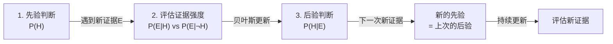
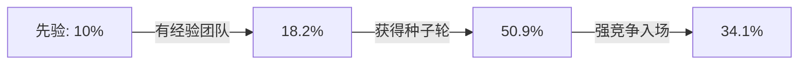
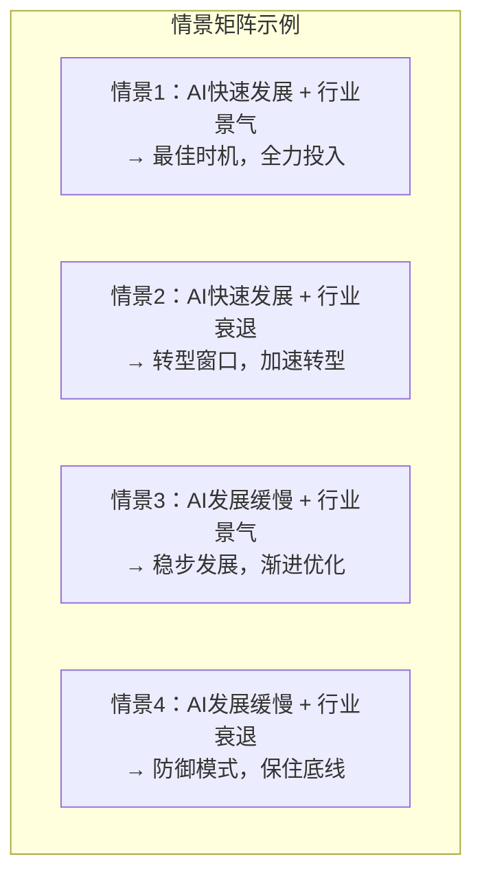

## 七、概率思维与贝叶斯推理

世界本质上是不确定的。明天的股价、一次面试的结果、一段关系的走向——这些事情没有确定答案，但它们的概率分布是可以被估计、被量化、被用来指导决策的。概率思维就是将这种"不确定性"从模糊的焦虑转化为可操作的决策框架。而贝叶斯推理，则是这套框架中最强大的核心引擎——它告诉你，面对新信息时，你的信念应该如何理性地更新。

本节将从概率思维的底层认知模型出发，逐步深入贝叶斯定理的数学原理与直觉理解，然后扩展到基础比率、期望值、尾部风险、概率校准和情景规划等完整知识体系，最终形成一套可直接应用于个人决策的概率思维工具箱。

### 7.1 为什么需要概率思维

#### 7.1.1 人类天生不擅长处理概率

进化赋予人类的直觉系统擅长处理确定性的因果关系（"摸到火→烫→缩手"），却不擅长处理概率性的关联。诺贝尔经济学奖得主丹尼尔·卡尼曼（Daniel Kahneman）在《思考，快与慢》中指出，人类的"系统1"（快速直觉思维）倾向于将概率事件简化为二元判断——"会发生"或"不会发生"——而忽略了中间的灰度地带。

这种认知缺陷在生活中随处可见：

- 一个人听说某航班曾出过事故，就认定"坐飞机很危险"，尽管统计上飞机是最安全的交通工具（事故率约为1/1100万次航班）
- 一个人在新闻中看到某创业公司融资10亿，就高估创业成功概率，忽略了99%的创业公司最终失败
- 一个人被告知某项检测"99%准确"，就认为阳性结果意味着99%的概率患病——这忽略了基础比率的陷阱

#### 7.1.2 确定性思维 vs 概率思维

| 维度 | 确定性思维 | 概率思维 |
|------|-----------|---------|
| 语言模式 | "这件事会发生/不会发生" | "这件事发生的概率是多少？可能的结果有哪些？" |
| 决策方式 | 非黑即白，要么做要么不做 | 评估各结果的概率分布，选择期望效用最高的选项 |
| 面对失败 | "我失败了，说明这条路走不通" | "这次失败了，但成功概率可能仍有30%，值得再试" |
| 面对新信息 | 或者全盘接受，或者完全排斥 | 根据证据强度和可靠性，适度更新判断 |
| 风险态度 | "高风险=高回报"或"远离一切风险" | 量化风险收益比，在期望值和风险承受力之间平衡 |

#### 7.1.3 概率思维的四个核心优势

**第一，准确评估风险与机会。** 概率思维让你不被个别事件的情绪冲击所左右。一次投资亏损不代表策略失败——你需要看的是长期的期望收益和最大回撤概率。一项调查显示，具有概率思维习惯的投资者，其长期年化收益率比情绪化投资者高出约3-5个百分点（来源：行为金融学文献综述）。

**第二，有效应对不确定性。** 确定性思维在面对不确定时会产生焦虑（因为无法得到"是或否"的答案），概率思维则提供了一种操作框架：即使你不知道结果，你也可以估计各结果的概率，进而做出理性选择。

**第三，避免过度自信和过度悲观。** 过度自信的人会将60%概率的事视为"几乎确定"，过度悲观的人会将40%概率的事视为"几乎不可能"。概率校准训练可以系统性地纠正这两种偏差。

**第四，持续更新判断。** 概率思维天然与贝叶斯更新兼容——它鼓励你在获得新证据后调整信念，而不是固守初始判断或被新信息一击推翻。

### 7.2 贝叶斯推理：从直觉到数学

#### 7.2.1 贝叶斯定理的数学表达

贝叶斯定理由英国牧师兼数学家托马斯·贝叶斯（Thomas Bayes, 1702-1761）在18世纪提出，后经法国数学家皮埃尔-西蒙·拉普拉斯（Pierre-Simon Laplace）独立发展和完善。其数学形式如下：

$$P(H|E) = \frac{P(E|H) \times P(H)}{P(E)}$$

四个核心变量的含义：

| 符号 | 名称 | 含义 | 直觉理解 |
|------|------|------|---------|
| P(H) | 先验概率（Prior） | 在获得证据E之前，假设H为真的概率 | "在看到新信息前，你最初怎么想？" |
| P(E\|H) | 似然度（Likelihood） | 如果H为真，观察到证据E的概率 | "如果事情确实如此，看到这个证据有多合理？" |
| P(E) | 边际概率（Evidence） | 无论H真假，观察到证据E的总概率 | "这个证据本身有多常见/罕见？" |
| P(H\|E) | 后验概率（Posterior） | 在观察到证据E之后，H为真的概率 | "看到新信息后，你更新后的判断是什么？" |

其中，P(E) 可以通过全概率公式展开：

$$P(E) = P(E|H) \times P(H) + P(E|\neg H) \times P(\neg H)$$

这里 P(¬H) = 1 - P(H) 是假设H为假的概率，P(E|¬H) 是在H为假的情况下观察到证据E的概率。

#### 7.2.2 直觉理解：贝叶斯更新的三步模型

贝叶斯推理的直觉可以浓缩为三个步骤：

关键直觉：**后验概率与先验概率和似然度的乘积成正比。** 即：

$$P(H|E) \propto P(E|H) \times P(H)$$

这意味着：
- 如果先验概率P(H)很低（H本身就很不可能），即使证据E看起来支持H，后验概率也不会太高——除非证据E在H为真时极有可能出现，而在H为假时极不可能出现
- 如果证据E在H为真和H为假的情况下都同样容易出现（P(E|H) ≈ P(E|¬H)），那么这个证据几乎没有信息量，后验概率≈先验概率

#### 7.2.3 完整计算示例：医学检测的贝叶斯分析

这是贝叶斯定理最经典的应用场景，也是最容易被直觉误导的地方。

**问题设定：**
- 某种罕见疾病的发病率为1%（先验概率P(H) = 0.01）
- 检测的灵敏度（真阳性率）为95%：如果真有病，95%概率检测为阳性（P(E|H) = 0.95）
- 检测的特异度（真阴性率）为90%：如果没病，90%概率检测为阴性（P(E|¬H) = 0.10）

**问题：检测结果为阳性，你实际患病的概率是多少？**

**计算过程：**

第一步：计算分子
$$P(E|H) \times P(H) = 0.95 \times 0.01 = 0.0095$$

第二步：计算分母（全概率）
$$P(E) = P(E|H) \times P(H) + P(E|\neg H) \times P(\neg H)$$
$$= 0.95 \times 0.01 + 0.10 \times 0.99$$
$$= 0.0095 + 0.099 = 0.1085$$

第三步：计算后验概率
$$P(H|E) = \frac{0.0095}{0.1085} \approx 0.0876 \approx 8.8\%$$

**结论：即使检测结果为阳性，你实际患病的概率只有约8.8%，远低于大多数人直觉认为的90%以上。**

为什么会这样？因为疾病的基础比率太低（只有1%），即使检测准确率很高，大量的健康人中仍然有10%会被误判为阳性（假阳性），这些假阳性的数量远远超过真阳性的数量。

用具体数字来理解：假设检测1000人——
- 真正患病的人：1000 × 1% = 10人，其中9.5人检测为阳性
- 健康的人：1000 × 99% = 990人，其中99人检测为阳性（假阳性）
- 总阳性人数：9.5 + 99 = 108.5人
- 真正患病的阳性比例：9.5 / 108.5 ≈ 8.8%

#### 7.2.4 贝叶斯更新的连续过程

现实中的决策很少是"一锤定音"的，贝叶斯推理的真正威力在于它的迭代能力——每一次更新的后验概率，都成为下一次更新的先验概率。

**案例：评估一项新创业项目的可行性**

假设你在评估是否加入一个朋友的创业项目。

**第一轮：先验判断**
基于创业行业的一般成功率（约10%），你的先验概率：P(H) = 0.10

**第二轮：第一次证据——朋友有行业经验**
你的朋友在该行业有8年经验，且上一家公司成功退出。你估计：如果项目真的能成功，创始团队有经验的概率是80%；即使项目会失败，创始团队也可能有经验（因为很多人有经验但仍失败），概率是40%。

$$P(H|E_1) = \frac{0.80 \times 0.10}{0.80 \times 0.10 + 0.40 \times 0.90} = \frac{0.08}{0.08 + 0.36} = \frac{0.08}{0.44} \approx 0.182$$

更新后：成功概率从10%上升到约18%。

**第三轮：第二次证据——已获得种子轮融资**
如果项目真的能成功，获得种子轮融资的概率是70%；如果项目会失败，也有可能拿到种子轮（投资人也会看走眼），概率是15%。

先验变为上一轮的后验0.182：
$$P(H|E_2) = \frac{0.70 \times 0.182}{0.70 \times 0.182 + 0.15 \times 0.818} = \frac{0.1274}{0.1274 + 0.1227} = \frac{0.1274}{0.2501} \approx 0.509$$

更新后：成功概率从18%上升到约51%。

**第四轮：第三次证据——竞争对手已融资5000万**
如果项目能成功，竞争对手大额融资的概率是30%（成功项目不一定有强竞争）；如果项目会失败，竞争对手融资的概率反而可能更高（因为市场热度），概率是60%。

$$P(H|E_3) = \frac{0.30 \times 0.509}{0.30 \times 0.509 + 0.60 \times 0.491} = \frac{0.1527}{0.1527 + 0.2946} = \frac{0.1527}{0.4473} \approx 0.341$$

更新后：成功概率从51%回落到约34%。

这个过程展示了贝叶斯推理的几个关键特征：
1. 每一步的更新幅度取决于证据的强度——强证据引起大更新，弱证据引起小更新
2. 更新方向取决于证据与假设的关系——支持性证据提高概率，反对性证据降低概率
3. 后验概率始终在0和1之间——不会因为某一条证据就跳到极端值

#### 7.2.5 贝叶斯推理的个人应用原则

**原则一：永远从先验出发。** 在评估任何新事物之前，先找到它的基础比率。不要因为一个创业故事"听起来很好"就忽略10%的基础成功率。

**原则二：证据有强弱之分。** 评估证据质量的标准：

| 证据强度 | 特征 | 更新幅度 |
|----------|------|---------|
| 极强证据 | 可重复验证、来源可靠、与假设有强因果关系 | 大幅更新（20-40个百分点） |
| 中等证据 | 有一定可信度、与假设有相关性但非因果 | 适度更新（5-20个百分点） |
| 弱证据 | 个案故事、道听途说、选择性信息 | 微小更新（1-5个百分点） |
| 无信息量 | 在H为真和H为假时都同等可能的证据 | 不更新 |

**原则三：避免锚定效应。** 当你听到第一个数字时（比如"创业成功率30%"），这个数字会成为你的心理锚点。意识到锚点的存在，刻意从多个角度获取先验概率，可以减轻锚定效应。

**原则四：信息来源要独立。** 如果三条"不同"的证据实际上来自同一个源头（比如都引用同一份研究报告），它们的贝叶斯更新力远低于三条真正独立的证据。

### 7.3 基础比率与基准率忽视

#### 7.3.1 什么是基础比率

基础比率（Base Rate）是在没有任何特定个体信息的情况下，某类事件在总体中发生的一般概率。它是贝叶斯推理中"先验概率"的经验来源。

几个重要的基础比率参考：

| 领域 | 基础比率 | 来源 |
|------|---------|------|
| 创业5年存活率 | 约10-15% | 美国劳工统计局 |
| 电影票房盈利比例 | 约20-30% | 好莱坞行业报告 |
| 学术论文被引用超过10次 | 约15% | Scopus数据库 |
| 产品众筹成功交付率 | 约40% | Kickstarter平台数据 |
| 互联网公司IPO概率 | <1% | 风投行业统计 |
| 首次创业成功概率 | 约18% | 据Harvard Business School研究 |
| 第二次创业成功概率 | 约20-25%（比首次略高） | 同上 |

#### 7.3.2 基准率忽视的认知偏差

基准率忽视（Base Rate Neglect）是由卡尼曼和特沃斯基通过一系列经典实验揭示的认知偏差。人们在做判断时，系统性地忽略统计上的基础比率，而过度关注具体的、生动的、个性化的信息。

**经典实验：工程师还是律师？**

卡尼曼和特沃斯基告诉被试："迪克是一个30岁的男性，已婚，无子女。他能力很强，动力十足，未来有望在他的领域取得巨大成功。他深受同事欢迎。"然后让被试判断迪克是工程师还是律师。

实验结果：即使被告知总体中70%是律师、30%是工程师（或反过来），被试的判断几乎完全基于迪克的个性描述，而忽略了先验概率。

**为什么基准率被忽视？**

1. **可得性偏差**：生动的个案信息比抽象的统计数据更容易被想起和使用
2. **代表性偏差**：人们根据迪克的描述"像不像"工程师来做判断，而不是基于概率
3. **信息量幻觉**：个案信息感觉比统计数据更"有信息量"，但实际上恰恰相反

#### 7.3.3 如何在决策中使用基础比率

**第一步：主动寻找基础比率。** 在做任何预测或评估之前，先搜索相关的统计数据。互联网时代，获取基础比率数据并不困难——难的是你有没有这个意识。

**第二步：从基础比率出发进行调整。** 这就是所谓的"锚定与调整"策略——用基础比率作为锚点，然后根据你掌握的具体信息进行适度调整。调整幅度应该与信息的强度成正比。

**第三步：警惕个案故事的诱惑。** 当你听到一个动人的成功故事时，提醒自己：这是从数以万计的失败案例中筛选出来的幸存者。你看到的是分母中的分子，不是全貌。

**第四步：使用参考类别预测法（Reference Class Forecasting）。** 这是由诺贝尔奖得主丹尼尔·卡尼曼和决策科学家伯特·弗拉格（Bent Flyvbjerg）系统化的方法——不要根据你的项目"内部特征"来预测（乐观偏差会主导），而是找到历史上类似项目的实际结果分布，用它作为预测基准。

### 7.4 期望值思维

#### 7.4.1 期望值的数学定义

期望值（Expected Value, EV）是概率思维中将概率和结果量化的最基本工具：

$$EV = \sum_{i=1}^{n} P_i \times V_i$$

其中 P_i 是第 i 种结果的概率，V_i 是第 i 种结果的价值（收益或损失）。

#### 7.4.2 期望值的三个应用层次

**层次一：单次决策的期望值计算**

案例：一项投资——30%概率赚100万，50%概率赚20万，20%概率亏50万。
$$EV = 0.3 \times 100 + 0.5 \times 20 + 0.2 \times (-50) = 30 + 10 - 10 = 30万$$

期望值为正（30万），说明从概率角度看，这项投资是值得考虑的。

**层次二：期望值与风险承受力的权衡**

期望值为正并不意味着你应该无脑投入。你需要考虑两个额外因素：

- **最大回撤**：如果你的总资产是200万，一次可能亏50万（25%的回撤）你能否承受？
- **重复次数**：如果你只能做一次这样的投资，一次亏50万的打击可能是不可承受的；但如果你能做100次这样的投资，长期来看你几乎确定会赚钱（大数定律）。

**层次三：效用函数——期望值的非线性修正**

期望值假设"赚100万的价值"和"赚10万的价值"是线性关系（10倍）。但事实上，对大多数人来说，从0到100万的价值感远大于从900万到1000万的价值感。这就是边际效用递减原理。

丹尼尔·伯努利（Daniel Bernoulli）在1738年就提出了这一点，他建议用对数效用函数替代线性收益：

$$EU = \sum_{i=1}^{n} P_i \times \ln(1 + V_i)$$

这意味着在考虑高风险高收益选项时，你应该用效用函数而非原始收益来计算期望值。

#### 7.4.3 凯利公式：最优下注比例

如果你面对一个正期望值的机会，你应该投入多少？凯利公式（Kelly Criterion）给出了数学上的最优解：

$$f^* = \frac{p \times b - q}{b}$$

其中：
- f* = 最优投入比例（占总资金的百分比）
- p = 获胜概率
- b = 赔率（净收益/投入）
- q = 失败概率（1 - p）

**案例：** 一项投资有60%概率翻倍（b=1），40%概率全部亏损。
$$f^* = \frac{0.60 \times 1 - 0.40}{1} = 0.20$$

凯利公式告诉你：最优策略是投入总资金的20%。投入更多会增加破产风险，投入更少则浪费了正期望值的优势。

实际应用中，许多专业投资者使用"半凯利"（f*/2），因为凯利公式对概率估计的准确性非常敏感——如果你高估了胜率，满仓凯利可能导致灾难性后果。

### 7.5 尾部风险与黑天鹅

#### 7.5.1 黑天鹅事件的三个特征

纳西姆·尼古拉斯·塔勒布（Nassim Nicholas Taleb）在《黑天鹅》中定义了黑天鹅事件的三个特征：

1. **稀有性**：事件超出了常规预期的范围，历史上没有可比的先例
2. **极端影响**：事件一旦发生，影响极其巨大
3. **事后可解释性**：事件发生后，人们会为其找到"合理"的解释，产生"我早就知道"的错觉

#### 7.5.2 尾部风险的数学含义

在统计学中，"尾部"指的是概率分布的两端——那些概率极低但数值极大的事件。以正态分布为例：

- 距离均值1个标准差（±1σ）以内的概率：约68%
- 距离均值2个标准差（±2σ）以内的概率：约95%
- 距离均值3个标准差（±3σ）以内的概率：约99.7%
- 距离均值4个标准差（±4σ）以外的概率：约0.006%

问题在于：金融市场和许多现实系统的分布并不是正态的，它们的尾部比正态分布"肥"得多——极端事件发生的频率远高于正态分布的预测。2008年金融危机中，多个金融市场出现了"6个标准差"以上的波动，如果按正态分布计算，这种事件的概率小到宇宙年龄内不可能发生一次——但它确实发生了。

#### 7.5.3 杠铃策略

塔勒布提出的杠铃策略（Barbell Strategy）是应对尾部风险的核心方法：

**核心思想**：不要把资源放在"中间地带"（看似安全但其实暴露于尾部风险的资产），而是将大部分资源放在极度安全的地方，小部分放在极度激进的地方。

| 资源分配 | 位置 | 作用 |
|---------|------|------|
| 80-90% | 极度安全（国债、现金、保险） | 保护底线，确保不会因极端事件而破产 |
| 10-20% | 极度激进（高风险投资、创业尝试） | 享受正向黑天鹅的收益，损失有限 |

**个人应用中的杠铃策略**：
- **财务杠铃**：80%资金在低风险资产（货币基金、国债），20%在高风险高回报资产（创业、天使投资、加密货币）
- **职业杠铃**：主业保持稳定收入来源（体制内工作、稳定公司），副业探索高潜力方向（自媒体、副业项目）
- **学习杠铃**：花大部分时间打磨核心硬技能（编程、写作），小部分时间探索完全不同的领域（艺术、哲学、心理学）

#### 7.5.4 防御尾部风险的四重防线

1. **冗余性**：保持财务缓冲（至少6个月生活费的紧急备用金）、技能冗余（不止一种赚钱能力）、人脉冗余（不依赖单一社交圈）
2. **可选性**：创造低成本试错的机会——投入有限，但上行空间巨大。读书、写博客、参加行业活动，都是低成本获取"选择权"的方式
3. **反脆弱性**：设计让波动对你有利的生活结构。比如将固定工资改为"低底薪+高提成"，你就在构建一个从波动中受益的收入结构
4. **避免单一故障点**：不把所有收入来源绑定在一家公司、一个行业、一种技能上

### 7.6 概率校准

#### 7.6.1 什么是概率校准

概率校准（Calibration）衡量的是你的主观概率判断与实际频率之间的吻合程度。一个校准良好的人，当他声称"70%的把握"时，他所做出的这类判断中，确实有约70%是正确的。

**校准良好的标志：**

| 你说的话 | 实际命中率应接近 |
|---------|----------------|
| "几乎确定"（95%+） | ≥ 95% |
| "很可能"（75-90%） | 约 80% |
| "大概率"（60-75%） | 约 65% |
| "不太确定"（40-60%） | 约 50% |
| "不太可能"（10-25%） | 约 15% |
| "几乎不可能"（<5%） | ≤ 5% |

#### 7.6.2 校准偏差的两种常见模式

**过度自信（Overconfidence）**：最常见的校准偏差。当你认为"80%把握"时，实际正确率可能只有60%。这在专家身上尤其严重——研究表明，气象学家和赛马赔率制定者是校准最好的人群（因为他们每天收到大量反馈），而医生和投资经理的校准往往很差。

**过度谦虚（Underconfidence）**：较少见，但在某些安全敏感领域可能出现——人们为了避免承担责任，会系统性地低估自己判断的准确性。

#### 7.6.3 如何系统性地提高概率校准

**方法一：预测日志法**

准备一个预测日志（可以是电子表格），记录你的每一个概率性判断：

日期: 2024-06-15
预测: 本季度项目将按时交付
概率: 70%
理由: 目前进度完成65%，团队状态良好
实际结果: [待填写]

定期（每月/每季度）回顾：把你所有的"70%"预测拿出来，看看实际命中率是否接近70%。如果不是，调整你未来使用"70%"这个数字时的语境。

**方法二：二分校准测试**

在网上找到校准测试（如Metaculus、Good Judgment Project等平台），做大量的二选一判断题，然后检查你的信心水平与正确率的对应关系。每天花5分钟做10道题，一个月后你的校准会显著改善。

**方法三：参考类别法**

每次做概率判断时，强迫自己回答："历史上类似情况的实际结果分布是什么？"这会自动将你的判断锚定在合理的区间。

**方法四：极端值压缩**

如果你估计某件事的概率是99%或1%，问问自己："我真的有足够的信息来排除那1%或99%的可能性吗？"通常，将99%压缩到95%，将1%扩展到5%，会让你更接近真实的校准。

### 7.7 反事实思维与情景规划

#### 7.7.1 反事实思维

反事实思维（Counterfactual Thinking）是指系统地思考"如果当时做了不同的选择，结果会怎样？"这种思维不是为了后悔，而是为了理解因果结构和优化未来决策。

**向上反事实 vs 向下反事实**：
- **向上反事实**（"如果我当时……结果会更好"）：产生遗憾感，但能激发改进的动力
- **向下反事实**（"如果我当时……结果会更糟"）：产生庆幸感，能提升满意度和感恩心态

**反事实思维的实操框架——"三个替代路径"法**：

面对任何重大决策的结果，问自己三个问题：
1. 如果我做了完全相反的选择，会发生什么？
2. 如果关键变量（时间、市场、政策）不同，结果会怎样？
3. 如果我拥有现在的信息再做一次选择，我会怎么做？

第三个问题最重要——它揭示的是你的决策过程是否有系统性缺陷，还是仅仅是信息不足导致的。

#### 7.7.2 情景规划

情景规划（Scenario Planning）是一种系统化地思考多种未来可能性的工具，最早由兰德公司和壳牌石油在20世纪60-70年代发展成熟。

**情景规划的四步法：**

**第一步：识别关键不确定因素。** 找出影响你未来2-5年的最核心的2-3个不确定变量。比如：AI技术的发展速度、你所在行业的景气周期、你的健康状况。

**第二步：构建情景矩阵。** 将2个核心变量放在X轴和Y轴上，形成2×2=4个情景：

**第三步：为每个情景制定策略。** 不需要为每个情景准备一套完整的行动计划，但要确保你的主策略在所有四个情景下都不会导致灾难性后果。如果某个策略只在一个情景下最优但在另一个情景下致命，它就不是一个好策略。

**第四步：设置"信号灯"指标。** 为每个情景设定2-3个可观察的先兆指标。当这些指标开始出现时，你就知道某个情景正在变为现实，需要提前切换到对应的策略。

**个人应用模板：**

【我的情景规划 - 职业发展】
时间范围：未来3年

核心不确定因素：
1. 我所在行业的技术变革速度（快/慢）
2. 我个人技能的成长曲线（陡/平）

情景A（快变革 + 快成长）：
  策略：跳槽到行业领军公司，或考虑创业
  先兆指标：行业出现新的头部公司、薪资大幅上涨
  需要准备：人脉网络、简历更新、行业情报

情景B（快变革 + 慢成长）：
  策略：全力投入学习，考虑转行
  先兆指标：岗位需求减少、新技术替代旧技术
  需要准备：在线课程、副业尝试、财务缓冲

情景C（慢变革 + 快成长）：
  策略：深耕当前领域，争取晋升
  先兆指标：公司扩张、行业内薪资上涨
  需要准备：项目管理能力、领导力提升

情景D（慢变革 + 慢成长）：
  策略：维持稳定，发展副业收入
  先兆指标：行业增速放缓、薪资停滞
  需要准备：副业技能、投资理财、生活成本控制

### 7.8 常见误区与纠偏

#### 7.8.1 五个概率思维的典型错误

**错误一：赌徒谬误（Gambler's Fallacy）**

认为独立事件之间存在"平衡机制"。比如连续抛了5次正面，就认为下一次"更可能是"反面。实际上，对于独立事件，每次的概率都是一样的——硬币没有记忆。

**纠偏**：区分独立事件和非独立事件。硬币抛掷、彩票开奖是独立的；但股票市场的均值回归、人口统计趋势是有记忆的。

**错误二：合取谬误（Conjunction Fallacy）**

认为"同时发生多个事件"比"只发生其中一个事件"更可能。经典案例——"琳达问题"：琳达31岁，直率聪明，关心社会正义。问"琳达是银行出纳员"和"琳达是银行出纳员且是女权主义者"哪个更可能？大多数人选后者，但根据概率论，P(A且B) ≤ P(A)永远成立。

**纠偏**：记住概率的合取规则——任何额外条件只会降低概率，不会增加概率。越具体的描述，概率越低。

**错误三：忽视条件概率的互换**

P(检测阳性|有病) ≠ P(有病|检测阳性)。这两个数字可以相差巨大（如7.2.3节中的例子）。人们系统性地将两者混淆，这叫做"检察官谬误"。

**纠偏**：任何时候看到一个条件概率，都问自己："这是P(A|B)还是P(B|A)？它们一样吗？"

**错误四：样本量忽视**

掷硬币3次全是正面的概率是12.5%（完全正常），掷硬币100次全是正面的概率约10⁻³⁰（几乎不可能）。同样，基于3个客户反馈得出"产品很受欢迎"的结论，与基于3000个客户反馈得出的结论，可靠性天差地别。

**纠偏**：对任何统计结论，第一个问题应该是"样本量是多少？"。

**错误五：幸存者偏差（Survivorship Bias）**

只看到成功案例而忽略失败案例。读了10本成功企业家的自传，你可能得出"冒险创业是最佳策略"的结论——但你没有读到那1000个失败创业者的沉默。

**纠偏**：在做任何基于"成功案例"的决策之前，问自己："我看到的是全部样本，还是被筛选过的样本？失败者在哪里？"

### 7.9 概率思维的日常训练

概率思维是一种可以通过练习系统性提升的认知能力。以下是具体的训练方案：

#### 7.9.1 每日概率校准练习（5分钟）

每天花5分钟对当天发生的事件做概率预测，并记录在预测日志中：
- "今天下班后能按时到家的概率？"（记录，次日验证）
- "这个月项目进度能完成80%的概率？"（记录，月末验证）
- "今年年底之前会涨薪的概率？"（记录，年底验证）

#### 7.9.2 贝叶斯更新习惯

当遇到任何新信息时，养成三个问题的习惯：
1. "在看到这个信息之前，我的判断是什么？"（找先验）
2. "如果我的判断是对的，看到这个信息的可能性有多大？如果我的判断是错的呢？"（评估似然比）
3. "综合来看，我应该如何调整我的判断？"（计算后验）

#### 7.9.3 费米估计练习

费米估计（Fermi Estimation）是培养数量级直觉的绝佳方式：
- "我们城市有多少个理发店？"
- "一个普通大学生四年总共花多少钱？"
- "全国每天有多少外卖订单？"

这些问题不需要精确答案，关键训练的是分解问题、估算基础比率、快速验证数量级的能力。

#### 7.9.4 阅读清单

| 书名 | 作者 | 核心内容 |
|------|------|---------|
| 《思考，快与慢》 | 丹尼尔·卡尼曼 | 认知偏差的全面梳理，系统1和系统2 |
| 《黑天鹅》 | 纳西姆·塔勒布 | 极端事件、肥尾分布、反脆弱性 |
| 《随机漫步的傻瓜》 | 纳西姆·塔勒布 | 概率思维在金融中的应用 |
| 《对赌》 | 安妮·杜克 | 将决策视为下注，概率校准训练 |
| 《超预测》 | 菲利普·泰洛克 | 超级预测者的校准方法和预测技巧 |
| 《信号与噪声》 | 内特·希尔 | 概率预测的实践应用 |
| 《赤裸裸的统计学》 | 查尔斯·惠伦 | 统计学基础的通俗讲解 |
| 《贝叶斯的博弈》 | 黄黎原 | 贝叶斯推理的直觉理解与应用 |

***
