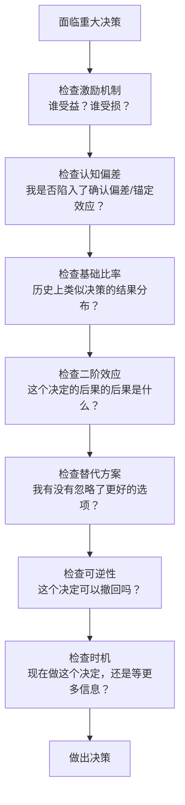
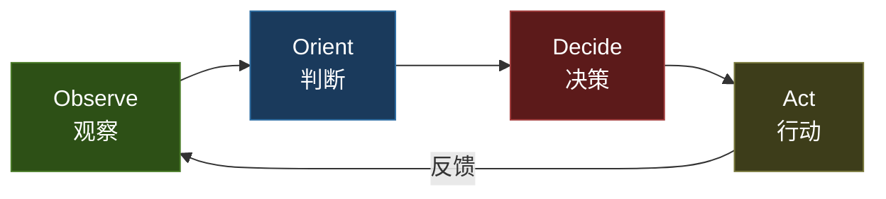
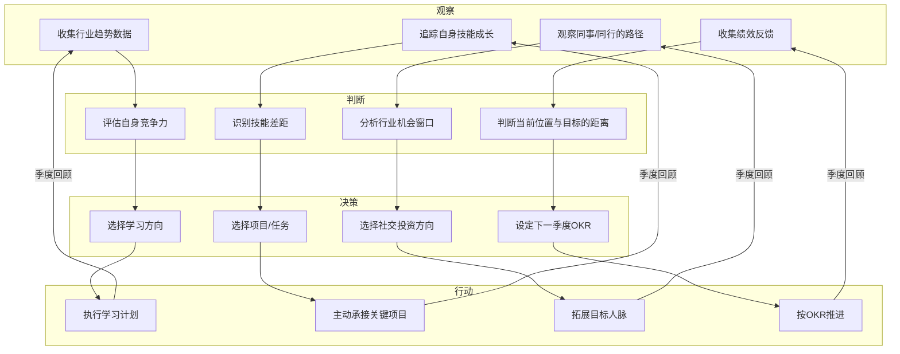
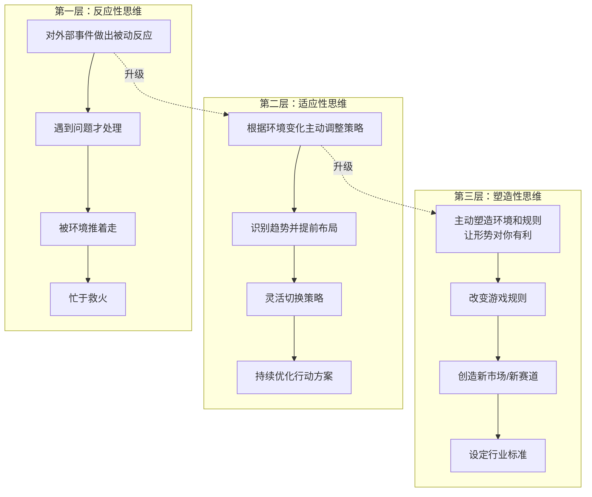
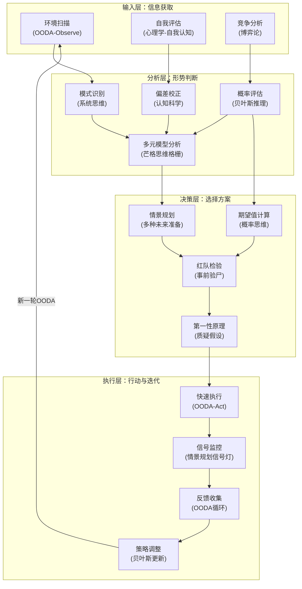

## 八、战略思维的整合框架

前面七节分别探讨了战略思维的本质、军事战略、商业战略、博弈论、系统思维、认知科学和概率思维——每一块都是一把锋利的刀。但现实中面对复杂决策时，你不可能只用一把刀。真正的战略高手不是精通某一个框架，而是能在不同框架之间自由切换、融会贯通，形成一套属于自己的"思维操作系统"。

本节就是前面所有理论的整合点。我们将构建三个核心框架——多元思维模型、OODA循环和红队思维——并在此基础上建立一个完整的个人战略决策系统。

### 8.1 多元思维模型：查理·芒格的思维格栅

#### 8.1.1 什么是多元思维模型

查理·芒格（Charlie Munger, 1924-2023）是伯克希尔·哈撒韦公司的副董事长，也是沃伦·巴菲特最重要的合伙人。芒格在投资界的地位不仅来自于他的财务成就，更来自于他提出的"多元思维模型"（Multiple Mental Models）方法论——一种跨学科的思维整合框架。

芒格的核心观点可以用一句话概括：**"如果你手里只有锤子，所有东西看起来都像钉子。"** 这就是所谓的"锤子综合征"（Man with a Hammer Syndrome）——当一个人只掌握一种思维工具时，他会倾向于用这种工具去解决所有问题，即使它完全不适用。

芒格认为，真正有效的思维不是依赖单一学科的框架，而是从多个学科借用"大道理"（big ideas），形成一个"思维模型格栅"（latticework of mental models）。就像物理学中光的波粒二象性——你不能只用波动理论或只用粒子理论来理解光，你需要两种模型才能看到全貌。

#### 8.1.2 八大学科的核心思维模型

以下八个学科提供了日常决策中最常用的思维模型。每个模型不是抽象概念，而是一个可以直接用于分析问题的"思维镜头"。

**一、数学：量化思维的基础**

数学提供的是精确化、结构化思考的能力。三个最实用的数学概念：

| 概念 | 原理 | 个人应用场景 |
|------|------|-------------|
| 复利效应 | A = P(1+r)^n，微小的持续增长在时间作用下产生巨大累积 | 技能积累：每天进步1%，一年后提升37倍；理财：年化10%的投资，7年翻倍 |
| 概率与期望值 | EV = ΣP×V，用概率加权而非确定性思维做决策 | 评估跳槽机会：计算各结果的概率和收益，而非只看"最可能"的场景 |
| 组合数学 | C(n,k) = n!/(k!(n-k)!)，理解可能性空间的大小 | 评估"巧合"是否真的巧合：100人中至少两人生日相同的概率高达99.8% |

实操建议：不必成为数学家，但要养成"算一算"的习惯。当你面临一个重大决策时，花10分钟用简单的概率和期望值计算来量化你的判断，往往能发现直觉中的漏洞。

**二、物理学：理解约束与临界点**

物理学教你认识到世界存在不可违反的物理约束，以及"量变到质变"的临界现象。

| 概念 | 原理 | 个人应用场景 |
|------|------|-------------|
| 临界质量 | 核裂变需要达到最低质量才能自持链式反应 | 任何事业都有"起飞门槛"：粉丝量破10万后增速加快、技能积累到一定深度后产生复合效应 |
| 惯性 | 物体保持运动状态不变的倾向 | 习惯的双面性：好习惯让你不费力地持续进步，坏习惯需要巨大能量才能改变 |
| 熵增定律 | 封闭系统的无序度总是增加 | 组织、项目、技能如果不定期维护和更新，必然走向混乱和退化 |

个人决策中的"临界点"思维：当你觉得自己"已经很努力但没有成果"时，很可能是还没有突破临界质量。此时放弃等于在距离成功最近的时刻退出。反过来，如果你想改变一个坏习惯，重点不是渐进调整，而是寻找那个能触发"相变"的关键杠杆点。

**三、生物学：适应与进化**

生物学揭示了一个残酷的事实：存活下来的不是最强的物种，也不是最聪明的物种，而是最能适应变化的物种。

| 概念 | 原理 | 个人应用场景 |
|------|------|-------------|
| 自然选择 | 适应环境的特征被保留，不适应的被淘汰 | 职业选择要关注行业趋势：选择正在上升的生态系统，而非已经成熟的存量市场 |
| 生态位 | 每个物种占据独特的生态位，减少直接竞争 | 个人定位：找到你的"生态位"——你独有的技能组合，而非在红海中与所有人竞争 |
| 冗余性 | 生物系统普遍存在的冗余设计（两个肾、两条腿） | 职业安全：至少有两种可以变现的技能，不依赖单一收入来源 |

**四、心理学：理解人性的底层代码**

心理学是所有决策分析的基础——因为决策是人做的，而人有系统性的认知偏差。

| 概念 | 原理 | 个人应用场景 |
|------|------|-------------|
| 损失厌恶 | 失去100元的痛苦是获得100元快乐的2-2.5倍 | 理解为什么你害怕跳槽（损失确定性）远胜于渴望新机会（获得可能性） |
| 激励机制 | 人的行为由激励驱动，而非由期望驱动 | 设计自己的"奖励系统"来维持动力；理解他人行为时先看他们的激励结构 |
| 社会认同 | 在不确定时，人们倾向于参照他人行为做决策 | 解释从众行为、流行趋势、以及为什么"大家都这么做"不等于"这么做是对的" |

**五、经济学：理解资源的稀缺性与配置**

经济学的核心信条是：资源是稀缺的，你做的每一个选择都意味着放弃了另一个选择。

| 概念 | 原理 | 个人应用场景 |
|------|------|-------------|
| 机会成本 | 选择A的真正成本是放弃B的最大价值 | "读研究生值不值？"——不仅看学费，还要看2年时间本可以创造的价值 |
| 边际效用递减 | 每增加一单位消费带来的满足感递减 | 第1杯咖啡值10元，第5杯可能只值2元。学会在边际效用=边际成本时停止 |
| 比较优势 | 即使你什么都比别人强，专注于你相对最强的领域仍然最优 | 不要什么都自己做，将低比较优势的任务外包或协作 |

**六、系统思维：看到整体而非局部**

系统思维（详见第五节）的核心贡献是让你看到事物之间的反馈关系和非线性效应。

| 概念 | 原理 | 个人应用场景 |
|------|------|-------------|
| 正反馈回路 | 输出增强输入，形成自我强化循环 | 学习→信心→更努力学习→更好成绩→更强信心（良性循环）；焦虑→逃避→更焦虑（恶性循环） |
| 杠杆点 | 系统中影响力最大的关键节点 | 找到你人生中的2-3个"杠杆点"——投入少量精力能产生巨大改变的地方 |
| 延迟效应 | 原因和结果之间存在时间差 | 健身3个月才看到效果，学习新技能6个月才能变现——耐心是策略，不是性格 |

**七、博弈论：理解互动中的最优策略**

博弈论（详见第四节）告诉你，在多人互动的环境中，最优策略取决于对方可能做什么。

| 概念 | 原理 | 个人应用场景 |
|------|------|-------------|
| 纳什均衡 | 没有人能通过单方面改变策略获益的稳定状态 | 理解"内卷"本质：每个人都在加班是纳什均衡，单方面不加班会吃亏 |
| 重复博弈 | 无限重复博弈中合作策略可以稳定存在 | 长期关系（同事、合作伙伴）中，"以牙还牙"比"永远合作"更有效 |
| 信号理论 | 行动比言语更有信号价值 | 学历、证书、项目经验是"昂贵信号"，比口头承诺更能证明能力 |

**八、工程学：将理论转化为可靠的系统**

工程学的精髓是"让东西可靠地工作"——这是从理论到实操的最后一公里。

| 概念 | 原理 | 个人应用场景 |
|------|------|-------------|
| 冗余设计 | 关键系统需要备份 | 技能冗余（多一种变现能力）、财务冗余（6个月紧急基金）、人脉冗余（不依赖单一圈子） |
| 安全边际 | 设计承载力超过预期最大负荷 | 投资时留足安全边际；时间规划留20%缓冲；收入预期打8折做预算 |
| 故障模式分析 | 预先分析系统可能如何失败 | 对任何计划进行"事前验尸"——假设它已经失败，倒推最可能的失败原因 |

#### 8.1.3 如何构建你的思维格栅

**第一步：从"最小可用模型集"开始。** 不需要一次掌握所有模型。从以下五个最通用的模型开始，它们覆盖了80%的日常决策场景：

1. **机会成本**（经济学）——做任何选择前，问"我放弃的最有价值的替代方案是什么？"
2. **损失厌恶**（心理学）——做决策时，识别你是否因为害怕损失而拒绝了更好的机会
3. **正反馈/负反馈回路**（系统思维）——分析你生活中哪些循环在帮助你，哪些在伤害你
4. **期望值**（数学/概率）——用概率和收益的乘积来评估选项，而非用"最可能发生什么"
5. **二阶效应**（系统思维）——不只考虑决策的直接后果，还考虑后果的后果

**第二步：用"模型套用"练习强化。** 每周找一个现实问题（新闻事件、工作困境、个人决策），尝试用至少三个不同学科的模型来分析它。记录下每个模型揭示了什么不同角度。

【思维模型套用练习模板】
问题：_________________________________________

模型1（____学科）：_____________________________
→ 这个模型告诉我：_____________________________

模型2（____学科）：_____________________________
→ 这个模型告诉我：_____________________________

模型3（____学科）：_____________________________
→ 这个模型告诉我：_____________________________

综合判断：______________________________________

**第三步：建立"模型失效"意识。** 任何模型都有适用边界。牛顿力学在接近光速时失效，经济学的"理性人假设"在情绪决策时失效。时刻问自己："我正在使用的这个模型，在当前场景下还成立吗？" 这种元认知能力是区分高手和初学者的关键标志。

#### 8.1.4 芒格的"检查清单"方法

芒格在做每一个重大投资决策时，都会使用一份心理模型检查清单（Checklist），系统性地排除错误。这个方法可以直接移植到个人决策中：

**检查清单使用指南：**

| 检查项 | 核心问题 | 常见陷阱 |
|--------|---------|---------|
| 激励机制 | 这个决定涉及的人，他们的激励结构是什么？ | 忽略代理问题：房产中介激励你买房，不是激励你买到最合适的房 |
| 认知偏差 | 我是否受确认偏差、锚定效应、可得性偏差影响？ | 只搜索支持自己观点的信息，忽略反面证据 |
| 基础比率 | 类似事情的历史成功率是多少？ | 被个案故事打动，忽略统计基准 |
| 二阶效应 | 这个决定的连锁反应是什么？ | 只看直接结果，忽略间接和长期影响 |
| 替代方案 | 是否有更好的选择被我忽略了？ | 沉没成本让你坚持当前路径，拒绝探索新选项 |
| 可逆性 | 如果这个决定是错的，我可以多快纠正？ | 对不可逆决策投入不足的分析，对可逆决策过度纠结 |
| 时机 | 现在是做这个决定的正确时机吗？ | 过早决策（信息不足）或过晚决策（错过窗口） |

### 8.2 OODA循环：约翰·博伊德的决策引擎

#### 8.2.1 OODA循环的起源与核心思想

OODA循环由美国空军战略家约翰·博伊德（John Boyd, 1927-1997）提出。博伊德是越战时期最杰出的军事战略思想家之一，他通过研究空战格斗发现：在一对一空战中，获胜的不是飞机性能更好的飞行员，而是能在更短时间内完成"观察-判断-决策-行动"循环的飞行员。

博伊德将这个发现提炼为OODA循环（Observe-Orient-Decide-Act），并将它的应用范围从空战扩展到所有竞争性决策场景。

**核心战略优势：你的OODA循环比对手更快、更准确，你就赢了。** 这不仅适用于战场——在职场竞争、商业决策、甚至个人成长中，能够更快地观察现实、更准确地理解形势、更果断地做出决策并执行的人，总是占据优势。

#### 8.2.2 四个阶段详解

**阶段一：Observe（观察）——收集高质量信息**

观察不是被动地"看"，而是主动地、有目的地收集与决策相关的信息。

| 观察维度 | 关注内容 | 常见错误 |
|----------|---------|---------|
| 环境信息 | 市场趋势、行业动态、政策变化、技术发展 | 信息茧房：只看自己想看的信息源 |
| 竞争信息 | 竞争对手的动向、优劣势、可能的战略意图 | 过度关注直接竞争者，忽略跨界替代者 |
| 自身信息 | 自己的资源、能力、状态、进度 | 自我认知偏差——高估能力或低估资源 |
| 反馈信息 | 上一轮行动的实际效果、与预期的差异 | 忽略负面反馈，只收集正面确认 |

**实操工具——"观察日志"模板：**

【每日观察日志】
日期：____________

行业/市场信号：
- 发生了什么？_______________________________
- 这意味着什么？_____________________________
- 与我的计划有关吗？_________________________

竞争环境变化：
- 谁在做什么？________________________________
- 对我有什么影响？____________________________

自身状态检查：
- 我的计划执行到哪里了？______________________
- 与预期有什么偏差？_________________________
- 我的精力/情绪状态如何？_____________________

**阶段二：Orient（判断）——形成对形势的理解**

这是OODA循环中最重要的阶段，也是博伊德认为最被低估的阶段。观察只是收集原始数据，判断是将数据转化为对形势的理解。

博伊德将"判断"描述为一个持续的过程，受四个因素影响：

1. **文化传统**：你成长的文化环境塑造了你看世界的基本框架
2. **遗传基因**：你的先天认知倾向影响你的信息处理方式
3. **过往经验**：你过去成功和失败的模式识别能力
4. **新信息分析**：你对当前新收集信息的分析和整合能力

**判断阶段的核心任务：**

| 任务 | 具体操作 | 输出 |
|------|---------|------|
| 模式识别 | 从观察数据中发现规律、趋势、异常 | "这看起来像是……的模式" |
| 因果分析 | 理解事件之间的因果关系 | "A导致B，因为……" |
| 假设检验 | 对你的初步判断进行反面检验 | "如果我的判断是错的，最可能的原因是什么？" |
| 情境评估 | 综合判断当前处于什么"态势" | "我们现在处于……的阶段" |

**判断阶段的常见陷阱：**

- **确认偏差**：只寻找支持你已有判断的证据。纠偏方法：主动搜索至少3条反对你判断的证据
- **模式幻觉**：在随机数据中看到不存在的模式。纠偏方法：问"这个模式在多大程度上可能只是巧合？"
- **锚定效应**：被第一个接触到的信息锚定判断。纠偏方法：从多个独立来源获取信息，刻意设定不同的初始假设

**阶段三：Decide（决策）——选择行动方案**

基于判断阶段的分析，选择具体的行动方案。决策阶段的关键不是"做出完美选择"，而是"在当前信息条件下做出最佳选择并准备根据新信息调整"。

**决策质量的三个评估维度：**

| 维度 | 定义 | 自检问题 |
|------|------|---------|
| 过程质量 | 决策过程是否系统化、信息是否充分 | "我是否考虑了足够的替代方案？" |
| 时机质量 | 决策是否在正确的时机做出 | "如果我多等一周获取更多信息，结果会更好吗？" |
| 承诺质量 | 决策后是否给予足够资源和决心去执行 | "我是否为这个决定分配了足够的资源？" |

**阶段四：Act（行动）——执行并收集反馈**

行动阶段不是"闭眼执行"，而是"带着传感器执行"——在执行的同时持续收集反馈，为下一轮OODA循环的"观察"阶段提供输入。

行动阶段的执行原则：

1. **小步快跑**：将大决策拆解为小步骤，每一步都有明确的反馈信号
2. **快速迭代**：宁可快速执行一个80分的方案并迭代，也不要等到100分才行动
3. **信号监控**：在执行前就设定好"成功信号"和"失败信号"——当失败信号出现时，果断调整而非坚持

#### 8.2.3 加速OODA循环的个人策略

**策略一：缩短观察阶段——建立高效信息获取系统**

| 信息类型 | 获取方式 | 频率 |
|----------|---------|------|
| 行业宏观趋势 | 订阅3-5个高质量行业 newsletter | 每周 |
| 竞争动态 | 设置关键词Google Alert、关注竞品社交媒体 | 每天 |
| 自身进度 | 使用OKR/看板工具追踪目标进展 | 每天 |
| 反馈收集 | 定期向信任的人征求反馈 | 每月 |

**策略二：预设判断框架——"如果-那么"预案**

在信息充足时（而非紧急时刻）预先制定判断框架：

【预设判断框架模板】
场景：转行/跳槽决策

如果 行业增速连续两个季度下降超过20%：
  → 判断：行业可能进入下行周期
  → 决策：启动技能储备和外部机会探索

如果 当前公司连续两个季度未兑现承诺：
  → 判断：公司可能面临经营困难
  → 决策：更新简历，启动被动求职

如果 我的核心技能市场需求增长超过30%：
  → 判断：当前是提升议价能力的好时机
  → 决策：主动争取加薪或评估外部机会

**策略三：降低决策摩擦——将常见决策模板化**

日常生活中80%的决策是重复的或类似的。将这些决策模板化，可以大幅缩短OODA循环：

| 决策类型 | 模板化方法 | 节省时间 |
|----------|-----------|---------|
| 日程安排 | 设定固定时间块，相同类型事务集中处理 | 每天30-60分钟 |
| 信息筛选 | 设定信息筛选标准（与当前目标的相关性打分） | 每天15-30分钟 |
| 购买决策 | 设定价格阈值和决策规则（如"100元以下直接买，1000元以上研究一周"） | 每次5-15分钟 |

#### 8.2.4 OODA循环在个人成长中的应用

**职业发展OODA循环示例：**

### 8.3 红队思维：主动对抗自己的盲区

#### 8.3.1 什么是红队思维

"红队"（Red Team）概念源于军事演习。在美军的作战推演中，"蓝军"代表己方，"红军"代表敌方。红军的任务是竭尽全力模拟敌方的思维方式和行动策略，以此来检验蓝军计划的弱点。

将这个概念移植到个人决策中：**红队思维就是主动站在你自己的对立面，系统性地攻击你的计划、假设和判断。**

为什么这很重要？因为人类大脑天生不擅长自我批评。确认偏差让我们倾向于寻找支持自己判断的证据，而忽略反面信息。红队思维是对抗这种天生缺陷的制度化方法。

#### 8.3.2 事前验尸（Pre-Mortem）：最重要的红队工具

"事前验尸"是由心理学家加里·克莱因（Gary Klein）提出的决策工具，后来被丹尼尔·卡尼曼推荐为"减少决策偏差的最有效方法之一"。

**与"事后验尸"的区别：**
- 事后验尸：项目失败后分析原因——有信息但已无法改变结果
- 事前验尸：在决策前假设已经失败，倒推原因——有改变结果的机会

**事前验尸的标准流程（20-30分钟）：**

**第一步：写下你的计划。** 用一两段话清晰描述你打算做什么、期望达到什么结果。

**第二步：假设计划已经彻底失败。** 告诉自己："假设现在是6个月后/1年后，这个计划已经完全失败了。结果远不如预期。"

**第三步：独立列出失败原因。** 如果有多人参与，每个人独立写下他们认为最可能导致失败的原因（5分钟）。关键是独立——不要相互影响。

**第四步：汇总并分类。** 将所有原因汇总，按照出现频率和严重程度排序。通常会发现几个"共识性"的高风险因素。

**第五步：制定针对性防御措施。** 对排名前3-5的失败原因，制定具体的预防措施或监控指标。

**事前验尸模板：**

【事前验尸分析表】
计划名称：____________________________________
分析日期：____________________________________

第1步：计划描述
______________________________________________
______________________________________________

第2步：假设现在是____（时间），这个计划已经失败。
结果是：______________________________________

第3步：最可能导致失败的原因（至少列出5条）
1. ___________________________________________
2. ___________________________________________
3. ___________________________________________
4. ___________________________________________
5. ___________________________________________

第4步：按可能性×严重度排序
高风险：_______________________________________
中风险：_______________________________________
低风险：_______________________________________

第5步：针对性防御措施
风险1 → 预防措施：___________________________
风险2 → 预防措施：___________________________
风险3 → 预防措施：___________________________

第6步：设定"预警信号"
如果出现____________信号，说明风险1正在发生
如果出现____________信号，说明风险2正在发生

#### 8.3.3 魔鬼代言人（Devil's Advocate）制度

魔鬼代言人是天主教会在册封圣人时设立的制度——专门有人负责论证候选人"为什么不应该被封圣"。这个制度的目的是通过制度化的反对声音来防止群体决策中的盲点。

**个人应用方法：**

1. **指定一个"魔鬼代言人"**：找一个你信任的、有批判性思维能力的朋友，在你做出重大决策前听取他们的反对意见。约定好规则：他们的任务就是挑毛病，你不能因此生气。

2. **自我魔鬼代言人练习**：在没有外部帮助时，用以下对话框架自我挑战：

【自我魔鬼代言人对话框】

我的计划：_______________________________

正方（支持这个计划的理由）：
1. _______________________________________
2. _______________________________________
3. _______________________________________

反方（反对这个计划的理由——假装你是一个想证明这个计划会失败的人）：
1. _______________________________________
2. _______________________________________
3. _______________________________________

反方最有力的一条论据是：____________________
我对这条论据的回应是：______________________
这个回应足够有力吗？ [是/否/需要更多研究]

3. **"钢铁人"练习**：不仅要找自己计划的弱点，还要为你反对的观点构建最强版本的论证（Steelmanning，相对于"稻草人"谬误）。如果你无法为你反对的立场构建一个有说服力的论证，说明你可能还没有真正理解这个议题。

#### 8.3.4 对立面证据收集法

这是红队思维在信息收集层面的应用。具体操作：

**"五个反对理由"练习：** 当你对某件事形成判断时（比如"这个行业前景很好"），强迫自己找到至少5个支持相反观点的证据或论证。如果找不到5个，说明你的信息收集存在系统性偏差。

**"反转假设"练习：** 将你的核心假设反转，然后搜索支持反转假设的证据。例如：

| 你的假设 | 反转假设 | 搜索方向 |
|----------|---------|---------|
| "AI会继续快速发展" | "AI发展会遇到重大瓶颈" | 搜索AI scaling law的限制、能源约束、数据瓶颈相关研究 |
| "我的行业前景光明" | "我的行业可能在5年内被颠覆" | 搜索行业内被替代的案例、新技术威胁、政策风险 |
| "这个人值得合作" | "这个人可能是不可靠的" | 搜索他的历史记录、口碑、过往合作案例 |

### 8.4 第一性原理：穿透表象的深度思考

#### 8.4.1 什么是第一性原理

第一性原理（First Principles Thinking）源自亚里士多德的哲学思想，被伊隆·马斯克（Elon Musk）在商业领域发扬光大。其核心思想是：**将问题拆解到最基础的事实和物理定律层面，从那里开始重新推理，而不是基于类比或既有经验做判断。**

马斯克在解释SpaceX的火箭成本时用了一个经典案例：当时市场上一枚火箭的发射成本约为6500万美元。大多数人基于类比思维会认为"火箭就是这么贵"。但马斯克用第一性原理分析：火箭的原材料（铝合金、碳纤维、钛、燃料等）成本只有约200万美元。成本之所以高，是因为中间环节——研发、制造、供应链、利润率的层层叠加。如果能简化这些环节，火箭成本可以降低到原来的1/10。

**类比思维 vs 第一性原理：**

| 维度 | 类比思维 | 第一性原理 |
|------|---------|-----------|
| 思考方式 | "别人怎么做的，我也怎么做" | "抛开别人的做法，最优解是什么？" |
| 优势 | 快速、低风险、容易执行 | 可能发现根本性的创新机会 |
| 劣势 | 受限于既有模式，难以突破 | 耗时、高风险、需要深度专业知识 |
| 适用场景 | 环境稳定、竞争格局成熟时 | 环境剧变、既有模式明显不合理时 |

#### 8.4.2 第一性原理的实操三步法

**第一步：识别并质疑假设。** 列出你当前问题中所有"理所当然"的假设。对每一个假设问："这个假设是基于事实，还是基于惯例？"

**第二步：拆解到基本事实。** 将问题拆解到最基本、不可再分的事实层面。这些事实应该是可验证的——物理定律、数学关系、已确认的数据。

**第三步：从基本事实重新构建。** 不参考任何既有方案，从基本事实出发重新推理可能的解决方案。

【第一性原理分析模板】
问题：为什么___________________这么贵/这么难/这么慢？

第1步：列出"理所当然"的假设
- 假设A：_____________________________________
- 假设B：_____________________________________
- 假设C：_____________________________________

第2步：拆解到基本事实
- 事实1：_____________________________________
- 事实2：_____________________________________
- 事实3：_____________________________________

第3步：从基本事实重新推理
- 如果只基于这些事实，最优解是_______________
- 与当前做法的差异是：_______________________
- 这个差异说明了什么机会：____________________

#### 8.4.3 第一性原理的适用边界

第一性原理不是万能的。它在以下场景最有效：

- **技术领域**：物理定律和工程约束是客观的，第一性原理推理有坚实基础
- **成本分析**：当市场价格明显高于原材料成本时，中间环节是优化空间
- **流程优化**：当"一直这么做"成为唯一理由时，第一性原理可以打破惯性

在以下场景，类比思维可能更有效：

- **人际关系**：人的情感和社交规则不是物理定律，类比和经验更重要
- **成熟领域**：在已经有大量实践验证的领域，"站在巨人肩膀上"比"从头推理"更高效
- **时间压力大时**：第一性原理需要深度思考时间，紧急决策时类比更快

### 8.5 战略思维的层次：从反应到塑造

#### 8.5.1 三个层次的思维模式

战略思维可以按照主动性程度分为三个层次。大多数人停留在第一层，少数人达到第二层，极少数人能做到第三层。

**第一层：反应性思维——被环境驱动**

反应性思维的典型特征：

- 只在问题出现后才去应对，没有预见和预防
- 决策依据是"什么最紧急"而非"什么最重要"
- 经常感到被事情推着走，缺乏掌控感
- 日程被别人的需求填满，没有自己的战略时间

如果你发现自己每天都在"救火"，说明你被困在了反应性思维的循环中。

**第二层：适应性思维——主动跟随变化**

适应性思维的典型特征：

- 能够识别环境变化的趋势信号，并提前做出调整
- 有自己的目标和计划，但会根据环境反馈灵活调整策略
- 定期复盘和反思，不断优化决策过程
- 在不确定性中能够做出合理判断（概率思维和贝叶斯更新的应用）

达到这一层的关键能力：信息敏感度（OODA循环的观察和判断能力）、灵活应变力（快速调整策略的能力）、自省能力（识别自身偏差的能力）。

**第三层：塑造性思维——改变游戏规则**

塑造性思维的典型特征：

- 不满足于适应现有环境，而是主动改变环境和规则
- 通过创造新标准、新平台、新生态来获得结构性优势
- 拥有长期视野，愿意在短期内承受损失以换取长期的战略位置
- 能够影响他人的决策和行为，而不仅仅是优化自己的决策

历史上塑造性思维的经典案例：

| 人物/组织 | 塑造行为 | 战略效果 |
|-----------|---------|---------|
| 亨利·福特 | 不是造更好的马车，而是创造汽车流水线 | 重新定义了个人交通 |
| 苹果公司 | 不是做更好的手机，而是创造App Store生态 | 从硬件公司变成平台公司 |
| 孙子 | 不是在既有战场上比拼，而是写《孙子兵法》改变了战略思维范式 | 影响了2500年的军事和商业战略 |

**如何从第二层升级到第三层：**

1. **从"怎么赢"转向"怎么定义比赛"**：不只思考如何在现有竞争中获胜，而是思考能否创造一个新的竞争维度
2. **从"个人优化"转向"系统设计"**：不只是优化自己的行为，而是设计一个让更多人受益的系统/平台/标准
3. **从"短期回报"转向"长期位置"**：愿意在短期内"亏钱"来建立长期的结构性优势
4. **从"信息消费者"转向"信息生产者"**：不只是获取和分析信息，而是创造和传播信息来影响他人

### 8.6 情景规划：为多种未来做准备

#### 8.6.1 情景规划的起源

情景规划（Scenario Planning）最早由美国空军在冷战时期使用，后来被壳牌石油公司在1970年代发展为商业战略工具。壳牌通过情景规划成功预见了1973年石油危机，使其在竞争对手措手不及时保持了稳定运营。

情景规划的核心思想不是预测未来（这是不可能的），而是**系统性地思考多种可能的未来，并为每种未来做好准备**。

#### 8.6.2 四步情景规划法

**第一步：识别关键不确定性**

列出影响你未来2-5年的所有不确定因素，然后筛选出影响力最大、不确定性最高的2-3个。

【关键不确定性筛选矩阵】

             低不确定性        高不确定性
高影响力     → 纳入规划基础    → 核心情景变量 ★
低影响力     → 可以忽略        → 关注但不重点投入

**第二步：构建情景矩阵**

取两个最关键的不确定性变量作为X轴和Y轴，形成2×2=4个情景。为每个情景取一个生动的名字——这有助于记忆和讨论。

**第三步：为每个情景编写"故事"**

不是干巴巴的标签，而是一段200-300字的叙述，描述在那个情景下你的生活/工作/环境是什么样子。这能帮助你真正"感受到"那个未来。

**第四步：制定策略和信号灯**

| 情景 | 策略 | 先兆信号 | 触发行动 |
|------|------|---------|---------|
| 情景A（最优） | 全力投入，抓住窗口 | 行业指数上涨>15%、关键政策落地 | 加大投资/学习/社交投入 |
| 情景B（次优） | 稳步推进，保持灵活 | 行业指数稳定、竞争格局未变 | 维持当前节奏，储备能力 |
| 情景C（不利） | 防守为主，保存实力 | 行业指数下降>10%、头部企业裁员 | 削减开支、探索替代方向 |
| 情景D（危机） | 紧急应变，保护底线 | 行业出现颠覆性变化、核心技能过时 | 启动应急计划、考虑转型 |

### 8.7 构建你的个人战略决策系统

#### 8.7.1 整合框架全景图

将前面所有理论整合为一个完整的个人战略决策系统：

#### 8.7.2 个人战略决策清单

面对重大决策时，按以下清单逐项检查。这不是一次性使用，而是一个可以反复迭代的循环工具：

【个人战略决策清单 v1.0】

一、信息收集（观察阶段）
□ 我是否从多个独立来源收集了信息？
□ 我是否关注了反面信息？
□ 我是否了解了相关基础比率？
□ 我是否收集了利益相关方的视角？

二、形势分析（判断阶段）
□ 我是否用至少3个不同的思维模型分析了这个问题？
□ 我是否识别了可能的认知偏差？
□ 我是否考虑了二阶/三阶效应？
□ 我是否用了贝叶斯更新来整合新信息？

三、方案评估（决策阶段）
□ 我是否考虑了足够多的替代方案？
□ 我是否计算了每个方案的期望值和风险？
□ 我是否做了事前验尸分析？
□ 我是否用第一性原理质疑了关键假设？
□ 我是否做了情景规划，考虑了多种未来可能？

四、执行监控（行动阶段）
□ 我是否设定了明确的反馈信号？
□ 我是否有定期复盘的计划？
□ 我是否准备了"如果判断错误"的备用方案？
□ 我的OODA循环是否足够快，能及时响应变化？

#### 8.7.3 常见整合失误与纠正

| 错误模式 | 具体表现 | 纠正方法 |
|----------|---------|---------|
| 只用一种框架 | 所有问题都用SWOT分析，或都用博弈论 | 强制使用至少3个不同学科的模型 |
| 框架冲突时混乱 | 系统思维告诉你"等待"，博弈论告诉你"先动" | 在框架冲突时，回到你的核心目标和价值观做判断 |
| 过度分析 | 无穷无尽的分析，永远不行动 | 设定分析的时间边界——"我给自己2天做分析，第3天做决定" |
| 忽略直觉 | 完全依赖框架和数据，忽略有经验支撑的直觉 | 直觉是多年模式识别的压缩输出；当直觉与分析冲突时，先记录下来，事后验证哪个更准 |
| 框架套用僵化 | 生搬硬套，不考虑具体场景的特殊性 | 每次使用框架后问"这个框架在当前场景下的局限性是什么？" |

### 8.8 从理论到本能：内化路径

#### 8.8.1 内化的四个阶段

将战略思维从"知识"变成"本能"需要经历四个阶段：

| 阶段 | 状态 | 持续时间 | 特征 |
|------|------|---------|------|
| 1. 无意识无能力 | 不知道自己不知道 | - | 凭直觉和情绪做决策 |
| 2. 有意识有能力 | 知道该怎么做，但需要刻意努力 | 1-3个月 | 读了很多理论，但使用时需要刻意调用 |
| 3. 有意识有能力 | 能够熟练使用，但仍需要提醒 | 3-12个月 | 面对决策时能自动想到框架，但有时会忘记 |
| 4. 无意识有能力 | 框架内化为本能反应 | 1年以上 | 战略思维成为思考的默认模式 |

#### 8.8.2 加速内化的三个练习

**练习一：每日复盘（10分钟）**

每天花10分钟回顾当天的一个决策：

今天的决策：____________________________
我用了什么框架？________________________
结果如何？______________________________
如果重来一次，我会怎么做？________________
下次遇到类似情况，我记住什么？____________

**练习二：每周"思维模型挑战"**

每周选一个你感兴趣或困扰你的问题，用至少3个不同学科的思维模型来分析它。将分析过程写下来（写作是最好的思考工具）。

**练习三：每月"战略复盘"**

每个月花1-2小时做一次深度战略复盘：

1. 回顾本月的目标完成情况
2. 分析偏差原因（用贝叶斯推理更新你的能力估计）
3. 用情景规划审视下一月的策略
4. 更新你的个人战略决策清单

#### 8.8.3 推荐的学习路径

```mermaid
graph LR
    subgraph "入门（第1-2周）"
        B1["读完本节内容"]
        B2["掌握5个核心模型"]
        B3["开始每日复盘"]
    end
    
    subgraph "进阶（第1-3个月）"
        I1["完整阅读《穷查理宝典》"]
        I2["练习事前验尸（每周至少1次）"]
        I3["建立预测日志，训练概率校准"]
        I4["每次重大决策使用决策清单"]
    end
    
    subgraph "精通（3-12个月）"
        A1["建立完整的个人战略决策系统"]
        A2["能自如切换多个思维模型"]
        A3["从反应性思维升级到塑造性思维"]
        A4["帮助他人建立战略思维框架"]
    end
    
    B1 --> B2 --> B3
    B3 --> I1
    I1 --> I2 --> I3 --> I4
    I4 --> A1
    A1 --> A2 --> A3 --> A4
```

### 8.9 本节小结

本节作为"基础理论"板块的终章，将前面七个理论整合为一个可操作的战略思维框架：

| 框架 | 核心功能 | 解决的问题 |
|------|---------|-----------|
| 多元思维模型 | 跨学科整合视角 | 避免"锤子综合征"，用多把刀切割问题 |
| OODA循环 | 快速决策与迭代引擎 | 在竞争环境中保持速度和灵活性优势 |
| 红队思维 | 主动对抗自身盲区 | 防止确认偏差和过度自信导致的决策失误 |
| 第一性原理 | 穿透表象的深度分析 | 在"人人都这么做"时发现真正的创新机会 |
| 战略层次模型 | 从被动到主动的升级路径 | 从"被事情推着走"升级到"主动塑造环境" |
| 情景规划 | 为不确定性做多手准备 | 不预测未来，但为多种未来做好准备 |

**核心行动项：**

1. 从8.1.3节的"最小可用模型集"开始，先掌握5个最通用的思维模型
2. 从今天开始，对每一个重大决策使用8.7.2节的"个人战略决策清单"
3. 每周做一次"事前验尸"分析（8.3.2节），持续3个月后评估效果
4. 每月做一次战略复盘，评估你处于"反应-适应-塑造"的哪个层次

> 下一步：阅读 [09-本节小结](../_index.md) 来回顾基础理论板块的全部要点，或进入 [具体方案](../../_index.md) 将理论转化为行动计划。
