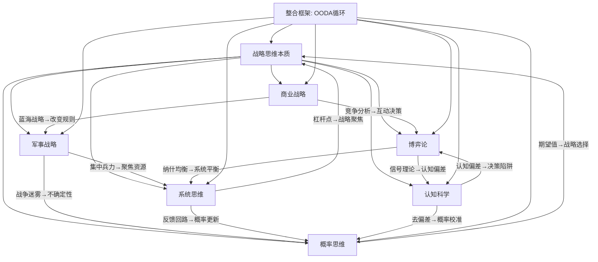

## 本节小结：基础理论全景回顾与知识整合

> "智慧不是知道所有答案，而是知道哪些问题值得问。"——约翰·博伊德

基础理论板块的八个章节，从战略思维的本质定义出发，跨越军事战略、商业战略、博弈论、系统思维、认知科学和概率思维六大理论体系，最终汇聚为一套战略思维的整合框架。这八个章节不是孤立的知识模块，而是一个**层层递进、相互支撑的思维操作系统**。本小结将从三个维度进行整合：回顾每个理论体系的核心精髓，揭示理论之间的隐藏逻辑线，以及提炼可直接转化为行动的思维原则。

---

### 一、七大理论体系的核心精髓

#### 1.1 战略思维的本质：做正确的事

战略思维的本质不是"做更多的事"，而是**在资源有限的条件下做出最优选择**。它包含六个核心特征：

| 特征 | 含义 | 个人应用 |
|------|------|----------|
| 全局性 | 看到整体而非局部 | 不只关注当前工作，还要看到行业趋势、个人定位、能力缺口的全貌 |
| 长远性 | 考虑3-10年的影响 | 选择赛道时评估长期增长空间，而非只看起薪 |
| 取舍性 | 明确"不做什么" | 拒绝与核心目标不一致的机会，即使它看起来很有吸引力 |
| 动态性 | 持续调整而非一成不变 | 每季度审视战略假设，当环境变化时勇于修正方向 |
| 竞争性 | 考虑他人的策略和反应 | 在谈判、求职、创业中预判对手的行动 |
| 资源整合性 | 将分散的资源集中于关键点 | 把时间、精力、金钱、人脉集中投入2-3个核心领域 |

战略思维最深刻的洞察来自迈克尔·波特："战略的本质是选择不做什么。"这不是一句口号，而是资源稀缺性的必然推论——你的时间和精力是有限的，每选择做一件事，就等于选择不做另外十件事。机会成本是战略思维的底层货币。

#### 1.2 军事战略：千年博弈智慧的提炼

军事战略之所以对个人发展有指导价值，是因为战争和个人发展共享五个关键特征：高度不确定性、资源约束、竞争压力、决策代价极高、时机不可逆。在这些极端条件下锤炼出的战略原则，比温和环境中的理论更加深刻和可靠。

军事战略的核心贡献可以提炼为三个层次：

**道——战略哲学层面**

- **孙子兵法的"先胜后战"**：不打没有把握的仗。个人应用是在做重大决策前，先确保自己处于有利位置——积累足够的能力、资源和信息，再行动。盲目冒进和消极等待都是战略失败。
- **克劳塞维茨的"战争迷雾"**：信息永远不完整，等待完美信息等于放弃行动。个人应用是在70%信息时就做决策，边执行边修正，而非等到100%确定再动。
- **利德尔·哈特的"间接路线"**：正面硬刚往往代价最高。个人应用是当正面竞争无法取胜时，寻找迂回路径——差异化定位、蓝海策略、降维打击。

**法——战略方法层面**

- **集中优势兵力**：在决定性的时间和地点投入压倒性资源。个人应用是识别你人生中的"关键战役"（决定职业走向的选择、关键技能的突破），然后集中全部精力攻克它。
- **知己知彼**：信息优势是一切战略的基础。个人应用是在求职、谈判、投资前，花足够时间做信息收集和分析。
- **灵活应变**：没有计划能在接触敌人后完全按预定执行。个人应用是制定计划时留出30%的弹性空间，为意外情况准备预案。

**术——战术技巧层面**

- **声东击西**：用表面行动掩护真实意图。在商业竞争中，对手看到的是你的公开行为，而你的真正优势可能在另一个维度悄悄建立。
- **以逸待劳**：选择对你有利的战场和时机。个人应用是在精力最充沛的时段处理最重要的事，在你有优势的领域展开竞争。

#### 1.3 商业战略：竞争分析与价值创造的科学

20世纪下半叶以来，商业战略理论从经验主义进化为科学分析。虽然源于企业管理，但其底层逻辑——**如何在竞争环境中识别机会、构建优势、实现持续增长**——同样适用于个人战略规划。

**六大核心理论的个人应用价值**：

| 理论 | 核心问题 | 个人应用转化 |
|------|----------|-------------|
| 波特五力模型 | 行业竞争强度由什么决定？ | 评估你所在领域的竞争格局：进入门槛高不高？替代威胁大不大？买方（雇主/客户）议价能力强不强？ |
| 三大竞争战略 | 如何在竞争中获胜？ | 确定你的个人竞争策略：成本领先（效率最高）、差异化（独特价值）还是聚焦（细分领域专家）？ |
| 蓝海战略 | 如何避开竞争？ | 寻找竞争较少的职业赛道，用"剔除-减少-增加-创造"四步框架重新定义你的价值主张 |
| 颠覆式创新 | 新进入者如何颠覆在位者？ | 警惕被新技术颠覆，主动学习颠覆性技能（如AI） |
| 核心竞争力 | 什么是真正的优势？ | 用VRIO框架评估能力：有价值（Valuable）、稀缺（Rare）、难以模仿（Inimitable）、有组织支撑（Organized） |
| 平台战略 | 如何利用网络效应？ | 从"自己做事"转向"搭建平台"——建立个人品牌、社群、内容资产，让网络效应为你工作 |

商业战略对个人最大的启发是：**不要只做执行者，要做价值创造者**。执行者的价值是线性增长的（做一件活收一份钱），价值创造者的价值是指数增长的（一次创造，多次变现）。

#### 1.4 博弈论：理解互动中的最优策略

博弈论的核心问题是：**当你不知道别人会怎么做时，你应该怎么做？** 这个问题贯穿个人生活的方方面面——薪资谈判、职业选择、人际关系、商业竞争。

**博弈论的三层核心知识**：

**第一层：经典博弈模型**

- **囚徒困境**：个体理性导致集体非理性。个人应用是理解为什么"每个人都为自己好"往往导致"所有人一起变差"——环境污染、军备竞赛、职场内卷都是囚徒困境的现实版本。
- **重复博弈**：一次博弈和多次博弈的最优策略完全不同。在一次性互动中（如一次性交易），背叛可能是最优的；但在重复互动中（如长期合作），"以牙还牙"策略（先合作，然后模仿对方上一次的行为）被证明是最稳健的长期策略。
- **信号理论**：行动比言语更可信。在求职和社交中，你投入时间、金钱和精力做的事情（如持续学习、考取认证、建立作品集）比简历上的自夸更有说服力。

**第二层：核心解概念**

- **纳什均衡**：没有人能通过单方面改变策略而获益的状态。理解纳什均衡能帮你预测在给定规则下，各方的行为会趋向什么稳定状态。
- **混合策略**：当确定性策略容易被预测和利用时，加入随机性反而是最优的。个人应用是在职业发展中不要让对手完全预测你的下一步行动。

**第三层：博弈结构的设计**

博弈论最高级的应用不是"在给定规则下选择最优策略"，而是**改变博弈规则本身**。个人应用是：如果你在当前游戏中处于劣势，不要试图在不利规则下挣扎，而是换一个游戏——转行、迁移、创造新赛道。

#### 1.5 系统思维：看到全貌与动态

系统思维是战略思维的核心引擎。它帮助我们看到事物之间的相互联系和动态变化，而不是孤立地、静态地看待问题。

**系统思维的核心概念矩阵**：

| 概念 | 定义 | 个人应用 |
|------|------|----------|
| 反馈回路 | 系统输出反过来影响输入 | 正反馈：能力提升→自信增强→更多机会→能力进一步提升；负反馈：疲劳→效率下降→加班→更疲劳 |
| 延迟效应 | 行动的结果不会立即显现 | 学习新技能可能6-12个月后才看到职业回报，提前知道就不会因短期无效果而放弃 |
| 杠杆点 | 系统中影响力最大的节点 | 找到你人生中"四两拨千斤"的关键干预点——可能是一个关键技能、一段关键关系、或一个关键决策 |
| 涌现 | 整体表现出部分不具备的特性 | 把多个"普通"技能组合起来，可能产生"稀缺"的复合价值 |
| 系统边界 | 决定哪些因素在系统内、哪些在系统外 | 分析问题时，先定义系统边界，避免"什么都管"导致注意力分散 |

系统思维对个人最大的价值是：**从"头痛医头"的线性思维，转向"找到根因"的结构化思维**。问题的表象和根因往往不在同一个层面——收入低可能不是因为不够努力，而是赛道选择有误；人际关系差可能不是因为不会社交，而是缺乏深度价值交换的能力。

#### 1.6 认知科学：认识你的思维局限

认知科学揭示了一个关键事实：**你的大脑不是一台完美的推理机器，而是一个充满捷径和偏差的信息处理器**。诺贝尔经济学奖得主丹尼尔·卡尼曼提出的"双系统思维模型"，是理解人类决策局限性的核心框架。

**系统1（快速直觉）vs 系统2（慢速理性）**：

系统1以毫秒级速度完成判断，不需要主观努力，但容易受认知偏差影响。系统2进行深度分析和逻辑推理，准确但消耗大量认知能量，且运行缓慢。大多数决策错误源于：**用系统1处理了本该用系统2的复杂问题**。

**十大核心认知偏差的速查表**：

| 偏差 | 表现 | 防御策略 |
|------|------|----------|
| 锚定效应 | 被第一个接触到的数字牵着走 | 在评估前先建立自己的独立基准 |
| 确认偏差 | 只看支持自己观点的证据 | 主动寻找反对意见，指定"魔鬼代言人" |
| 损失厌恶 | 对损失的敏感度是收益的2倍 | 用"如果不做会损失什么"重新框架问题 |
| 沉没成本谬误 | 因为已投入而不愿放弃 | 决策时只看未来收益，忽略已投入成本 |
| 可得性偏差 | 用印象深刻的事件代替概率判断 | 查看统计数据，而非依赖直觉印象 |
| 从众效应 | 别人做了所以我也做 | 问自己："如果没有人做这件事，我会做吗？" |
| 光环效应 | 因为某个优点而全面高估 | 分维度独立评估，避免一好遮百丑 |
| 幸存者偏差 | 只看到成功案例 | 主动关注失败案例和"沉默的大多数" |
| 过度自信 | 高估自己判断的准确性 | 用校准练习训练概率估计的准确性 |
| 框架效应 | 同一问题的不同表述导致不同决策 | 用多种方式重新描述问题，观察判断是否变化 |

认知科学的最终目标不是"消除偏差"（这不可能），而是**建立外部结构来约束内在偏差**——决策日记、事前验尸、红队思维、决策委员会，都是用"系统2的制度设计"来弥补"系统1的系统性缺陷"。

#### 1.7 概率思维：拥抱不确定性

世界本质上是不确定的。概率思维就是将不确定性从模糊的焦虑转化为可操作的决策框架。

**概率思维的四层递进**：

**第一层：从确定性到概率性**
停止问"这件事会不会发生"，开始问"这件事发生的概率是多少"。这个看似简单的语言转换，根本性地改变了你的决策方式——从非黑即白的二元判断，转向连续光谱的概率分布。

**第二层：基础比率的力量**
在评估任何事件时，先看"这类事件的整体概率是多少"。例如，创业成功率约为1-5%，创业公司最终上市的概率不到0.1%。知道了基础比率，你就不会被个别成功故事冲昏头脑。

**第三层：贝叶斯更新**
贝叶斯定理的核心思想是：**根据新证据不断修正你的信念**。公式本身很简单：

$$P(H|E) = \frac{P(E|H) \times P(H)}{P(E)}$$

翻译成人话：看到新证据后，你对假设的信心 = 假设为真时出现该证据的概率 × 你之前的信心 ÷ 该证据出现的总概率。关键实践是：每获得新信息时，有意识地更新你的概率估计，而非固守最初判断。

**第四层：期望值决策**
任何决策的期望值 = 各可能结果的概率 × 该结果的价值。期望值思维告诉你：即使一件事成功率只有10%，但如果成功回报是投入的50倍，它的期望值仍然是正的——值得一试。这就是为什么"小赌注、高上限"的策略往往优于"全部投入、不留退路"的做法。

---

### 二、理论之间的隐藏逻辑线

这七个理论体系不是并列关系，而是形成了一张相互支撑的网络。理解它们之间的连接，才能真正将知识内化为能力。

**三条核心逻辑线**：

**逻辑线一：不确定性贯穿始终**
军事战略面对"战争迷雾"，商业战略面对"市场不确定性"，博弈论面对"对手行为的不确定性"，概率思维则提供了处理不确定性的数学工具。整条线索的进阶路径是：承认不确定→量化不确定→在不确定中做最优决策。

**逻辑线二：认知局限是所有理论的共同敌人**
认知偏差导致战略判断失误（军事）、竞争分析偏差（商业）、博弈策略错误（博弈论）、系统盲点（系统思维）、概率误判（概率思维）。认知科学不是独立的知识模块，而是渗透在每一个理论体系中的"修正因子"。

**逻辑线三：从"适应规则"到"设计规则"**
初学者学习在给定规则下做最优决策（博弈论的纳什均衡），进阶者学习识别和利用系统中的杠杆点（系统思维），高手则学习改变规则本身（蓝海战略、改变博弈结构）。战略思维的最高层次不是适应环境，而是塑造环境。

---

### 三、从理论到行动：九条思维原则

将七大理论体系提炼为九条可直接指导行动的思维原则：

#### 原则一：先胜后战

> 来源：孙子兵法

在做重大决策前，先确保自己处于有利位置。不要在没有准备的情况下盲目行动，也不要因为焦虑而急于求成。具体操作：在求职前先积累作品集，在创业前先验证需求，在投资前先学习基础知识。行动的时机不是"越早越好"，而是"准备好了再出发"。

#### 原则二：聚焦关键少数

> 来源：二八法则 + 军事战略的"集中兵力"

识别你人生中投入产出比最高的20%的行动，集中80%的资源投入。具体操作：用"如果只能做一件事"测试，砍掉次要目标，保留不超过3个核心目标。分散精力是战略失败最常见的原因。

#### 原则三：以终为始

> 来源：系统思维的"目标导向"

先定义你想要的最终状态，再倒推实现路径。具体操作：用"墓志铭练习"确定人生愿景，然后逐层分解为10年目标→3年目标→年度OKR→季度里程碑→月度计划→周计划→日行动。没有终点的奔跑只是原地打转。

#### 原则四：拥抱不确定性

> 来源：概率思维 + 克劳塞维茨的"战争迷雾"

停止追求确定性，开始管理不确定性。具体操作：为每个重大决策估算成功概率和期望值，在70%信息时做决策而非等100%，为关键假设准备Plan B。完美信息是幻觉，及时行动才是现实。

#### 原则五：系统性思考

> 来源：系统思维

看到事物之间的联系和反馈，而非孤立地看待问题。具体操作：在分析问题时画出因果关系图，识别正反馈和负反馈回路，找到杠杆点。收入低可能不是"不够努力"的线性问题，而是"赛道选择"的结构问题。

#### 原则六：尊重对手

> 来源：博弈论

你的决策不是在真空中做出的——其他人也在思考和行动。具体操作：在谈判、竞争、合作中，先分析对方的可能策略和反应，再选择你的行动。以牙还牙策略在长期关系中最稳健：先善意合作，但对背叛及时回应。

#### 原则七：认识自己

> 来源：认知科学

你的大脑会系统性地欺骗你。具体操作：建立决策日记追踪偏差模式，在重大决策前做"事前验尸"，找信任的人做"魔鬼代言人"。最危险的不是你不知道的事，而是你以为自己知道但实际上被偏差扭曲了的事。

#### 原则八：间接路线

> 来源：利德尔·哈特 + 蓝海战略

正面硬刚往往代价最高，迂回路径常常更有效。具体操作：当正面竞争无法取胜时，寻找差异化定位，创造新的价值维度。不要在对手最强的领域与其竞争，而要在对手忽视的领域建立优势。

#### 原则九：迭代进化

> 来源：OODA循环 + 概率思维的贝叶斯更新

好的战略不是一次性制定的，而是在行动中不断修正的。具体操作：建立OODA循环（观察→判断→决策→行动），每季度做一次战略回顾，根据新信息更新你的判断和计划。计划的价值不在于它的准确性，而在于它提供了一个可以修正的起点。

---

### 四、理论体系的适用场景速查

在面对具体问题时，哪些理论最有用？以下速查表帮你快速定位：

| 你面对的问题 | 最相关的理论 | 核心工具/方法 |
|-------------|------------|-------------|
| 不知道人生方向 | 战略思维本质 | 人生轮评估、愿景声明、价值观排序 |
| 在两个选项间纠结 | 博弈论 + 概率思维 | 决策矩阵、期望值计算、贝叶斯更新 |
| 工作效率低 | 系统思维 + 认知科学 | 反馈回路分析、深度工作、环境设计 |
| 行业在变化，不知如何应对 | 商业战略 + 军事战略 | PEST分析、颠覆式创新评估、间接路线 |
| 和别人谈判/竞争 | 博弈论 + 认知科学 | 纳什均衡分析、锚定效应防御、信号理论 |
| 做了决定总后悔 | 认知科学 + 概率思维 | 事前验尸、决策日记、概率校准 |
| 努力但没有进步 | 系统思维 | 因果回路图、杠杆点识别、瓶颈分析 |
| 面临重大转型 | 军事战略 + 商业战略 | 知己知彼分析、蓝海战略、核心竞争力评估 |

---

### 五、下一步：从"知道"到"做到"

基础理论板块建立了思维框架，但它只是**"道"**——理论层面的智慧。接下来的"具体方案"板块将把这些理论转化为**"法术器"**——可执行的规划框架、具体的行动策略和即用的决策工具。

理论和实践之间的桥梁是**刻意练习**。以下是三个最低门槛的启动动作：

1. **今天**：选择你当前面临的一个重大决策，用"事前验尸"方法分析（假设这个决策已经失败，倒推可能的原因）。耗时15分钟。
2. **本周**：画一张你当前人生领域的因果关系图（至少5个因素），识别一个正反馈回路和一个负反馈回路。耗时30分钟。
3. **本月**：建立决策日记，记录你做的每一个重要决策的背景、选项、推理过程和结果。每天5分钟，持续30天后回顾偏差模式。

> 下一步：阅读 [具体方案](../../_index.md) 板块，将理论转化为可执行的人生规划方案。
