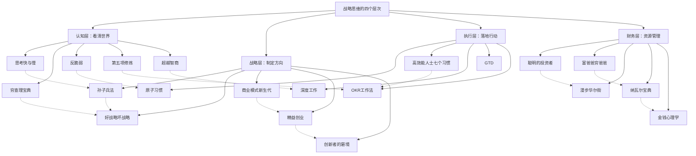
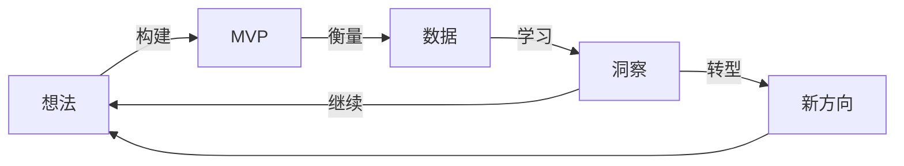
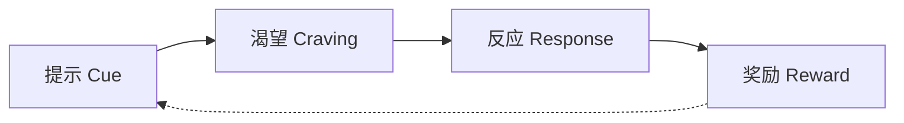
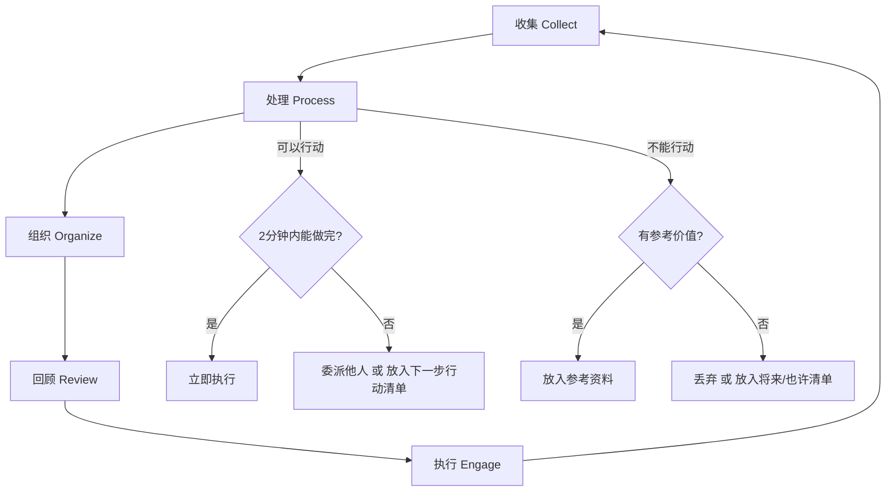

## 一、战略思维经典书籍20本详解

### 1.1 为什么是这20本书

市面上关于"思维""战略""效率"的书籍成千上万，但真正能改变你认知框架的书屈指可数。本节精选的20本书不是随意罗列，而是经过以下筛选标准：

**选书标准**：

| 维度 | 标准 | 说明 |
|------|------|------|
| 经典性 | 出版5年以上仍被反复引用 | 排除"畅销一时"的速食读物 |
| 系统性 | 提供完整的思维框架而非零散技巧 | 能构建认知体系而非仅收集观点 |
| 实操性 | 有可迁移的方法论 | 读完能立刻用在工作和生活中 |
| 跨域性 | 思想可跨界应用 | 不局限于单一领域 |
| 可读性 | 普通读者可入门 | 排除纯学术论文式写作 |

**20本书的内在逻辑**：

四层之间的关系是递进的：**认知层**决定你能否看清现实（不自我欺骗），**战略层**决定你选择什么方向（不做错误的事），**执行层**决定你能否把战略变成结果（把对的事做好），**财务层**决定你的战略是否有资源支撑（让成果产生复利）。缺少任何一层，战略思维都是不完整的。

---

### 1.2 阅读路线图

不同基础的读者应该有不同的阅读顺序。以下是三条推荐路线：

**零基础路线（从0到1建立战略思维）**：

| 阶段 | 书目 | 目标 | 预计时间 |
|------|------|------|----------|
| 第1阶段 | 《原子习惯》→《高效能人士的七个习惯》 | 先建立执行力基础 | 4-6周 |
| 第2阶段 | 《思考，快与慢》→《超越智商》 | 理解自己的认知局限 | 6-8周 |
| 第3阶段 | 《好战略，坏战略》→《孙子兵法》 | 建立战略判断力 | 4-6周 |
| 第4阶段 | 《富爸爸穷爸爸》→《金钱心理学》 | 建立财务意识 | 3-4周 |

**进阶路线（已有一定基础，追求体系化）**：

| 阶段 | 书目 | 目标 | 预计时间 |
|------|------|------|----------|
| 第1阶段 | 《穷查理宝典》→《反脆弱》 | 升级思维模型 | 6-8周 |
| 第2阶段 | 《第五项修炼》→《创新者的窘境》 | 理解系统和颠覆 | 6-8周 |
| 第3阶段 | 《精益创业》→《商业模式新生代》 | 掌握创新方法论 | 4-6周 |
| 第4阶段 | 《聪明的投资者》→《漫步华尔街》 | 建立投资体系 | 6-8周 |

**高手路线（追求深度整合）**：

按"认知→战略→执行→财务"的完整路径，从第1本读到第20本。每读完一本，用思维导图画出该书的核心框架，然后与之前读过的书做交叉对比。重点不是读得快，而是每读完一本就用在实际决策中验证。

**优先级建议**：如果时间有限，以下5本是"必读中的必读"：

1. **《思考，快与慢》**——理解认知偏差是一切决策的基础
2. **《好战略，坏战略》**——区分真正的战略和自欺欺人的愿望清单
3. **《原子习惯》**——没有执行力，再好的战略都是空谈
4. **《纳瓦尔宝典》**——浓缩了财富创造和人生哲学的精华
5. **《反脆弱》**——在不确定时代最重要的生存法则

---

### 1.3 认知与思维类（5本）

认知层是战略思维的地基。如果连现实都看不清，后面的战略、执行、财务都是空中楼阁。这5本书解决的核心问题是：**你的大脑有哪些系统性Bug？如何修补它们？**

#### 1.3.1 《思考，快与慢》——丹尼尔·卡尼曼

**作者背景**：丹尼尔·卡尼曼（Daniel Kahneman），2002年诺贝尔经济学奖得主——注意，他不是经济学家，而是心理学家。这是诺贝尔经济学奖第一次颁给心理学研究者，因为他彻底改变了经济学对"理性人"假设的认知。他与合作者阿莫斯·特沃斯基（Amos Tversky）共同开创了行为经济学领域。

**核心框架——双系统理论**：

卡尼曼将人类思维分为两个系统：

| 维度 | 系统1（快思考） | 系统2（慢思考） |
|------|-----------------|-----------------|
| 运行方式 | 自动、无意识、快速 | 刻意、有意识、缓慢 |
| 能量消耗 | 低 | 高 |
| 典型场景 | 识别面孔、开车走熟路、读简单句子 | 计算17×24、填税表、比较两台洗衣机的性价比 |
| 优势 | 效率极高，处理日常事务毫不费力 | 能处理复杂问题，能进行逻辑推理 |
| 劣势 | 容易被表面信息误导，产生系统性偏差 | 懒惰，能不出动就不出动，容易被系统1带偏 |
| 错误模式 | 替代、锚定、可得性启发 | 认知放松时退化为系统1 |

**关键认知偏差详解**：

**锚定效应**（Anchoring Effect）：人们对某个数值的估计会受到先前接触到的无关数字的影响。经典实验：让两组人估计联合国中非洲国家的比例。在估计之前，先转一个幸运转盘——一组转到10，另一组转到65。结果转到10的那组平均估计25%，转到65的那组平均估计45%。一个完全随机的数字就能锚定你的判断。**实操应对**：在谈判、定价、做预算时，先意识到锚点的存在，然后主动设定对你有利的锚点。

**可得性启发**（Availability Heuristic）：人们倾向于根据"能多容易想到相关例子"来判断某件事的概率。比如人们普遍高估飞机失事的概率（因为新闻报道印象深刻），低估糖尿病的致死率（因为缺乏戏剧性）。**实操应对**：在做概率判断时，不要依赖"感觉"，而是去找数据。

**损失厌恶**（Loss Aversion）：失去100元带来的痛苦大约是得到100元带来的快乐的2倍。这导致人们在面对损失时变得冒险（"反正要亏了，不如赌一把"），面对收益时变得保守（"先落袋为安"）。**实操应对**：在做投资决策时，问自己："如果我现在没有这个仓位，我会以当前价格买入吗？"如果答案是不会，那就应该卖出。

**前景理论**（Prospect Theory）：卡尼曼最核心的学术贡献。人们评估得失的参照点不是"绝对值"，而是"相对于某个参照点的变化"。这意味着同样客观的结果，不同的表述方式会导致完全不同的决策——这就是"框架效应"。

**阅读建议**：这本书厚且有学术性（约500页）。建议分三轮读：第一轮通读第1-5部分（核心理论），跳过脚注和实验细节；第二轮精读重点章节，做笔记；第三轮选读第6-7部分（高级话题）。配合卡尼曼的TED演讲《经验与记忆之谜》效果更好。

**与其他书的关联**：这本书与《超越智商》是姊妹篇——前者告诉你"Bug在哪"，后者告诉你"怎么修"。与《金钱心理学》也有直接关联，后者用大量案例展示了认知偏差在投资中的具体表现。

#### 1.3.2 《穷查理宝典》——查理·芒格

**作者背景**：查理·芒格（Charlie Munger），沃伦·巴菲特长达半个多世纪的合伙人。伯克希尔·哈撒韦公司的副董事长。芒格不是职业作家，这本书是他的演讲稿、文章和评论的合集，由彼得·考夫曼编辑整理。

**核心思想——多元思维模型**：

芒格最重要的贡献不是任何单一的投资技巧，而是一种思维方式：**不要只用一个学科的锤子去敲所有钉子**。他主张从多个学科（物理学、生物学、心理学、经济学、数学、工程学等）中提取最核心的思维模型，建立一个"思维模型格栅"（Mental Models Lattice）。

芒格经常引用的跨学科模型包括：

| 学科 | 模型 | 应用场景 |
|------|------|----------|
| 数学 | 复利效应、排列组合、概率论 | 投资决策、长期规划 |
| 物理学 | 临界质量、杠杆原理 | 判断何时突破、如何借力 |
| 生物学 | 进化论、适者生存 | 理解市场竞争、组织演化 |
| 心理学 | 激励偏见、社会认同、损失厌恶 | 理解人的行为动机 |
| 工程学 | 冗余备份、断裂点 | 系统设计、风险管理 |
| 化学/物理 | 临界质量 | 理解量变到质变的转折点 |

**人类误判心理学——25种心理倾向**：

这是芒格最著名的演讲之一，列出了25种导致人类做出错误判断的心理倾向。以下是最常用的几种：

1. **激励偏见**：永远不要低估激励的力量。如果你想改变一个人的行为，先改变他的激励结构。"如果你想知道为什么某人会有某种行为，先看看他的激励是什么。"
2. **社会认同**：人们倾向于模仿周围人的行为，尤其在不确定的时候。这就是为什么"别人都在做"是如此强大的说服理由——也是如此危险的决策陷阱。
3. **否认现实**：人们倾向于拒绝接受不愉快的现实。芒格说："面对现实吧，无论你喜欢不喜欢。"
4. **权威偏见**：人们倾向于服从权威，即使权威的指令明显不合理。

**逆向思维**（Inversion）：芒格最常用的思维工具之一。不是问"怎样才能成功"，而是问"怎样一定会失败"，然后避免那些会导致失败的做法。他说："反过来想，总是反过来想。"比如，不要问"怎样才能婚姻幸福"，而是问"怎样一定会让婚姻不幸"——然后避免那些做法。

**检查清单**（Checklist）：芒格和巴菲特做投资决策时使用检查清单，飞行员起飞前使用检查清单，外科医生手术前使用检查清单。检查清单的价值在于：它不是因为你不够聪明，而是因为即使最聪明的人也会犯低级错误。

**阅读建议**：重点阅读三部分：（1）"人类误判心理学"演讲（核心中的核心）；（2）"论学院派经济学"演讲；（3）芒格在每日期刊公司年会上的问答。这本书适合放在床头反复翻阅，每次都能发现新的启发。

**实操应用**：在做任何重大决策之前，做一个"芒格式检查清单"：（1）我是否被激励结构误导了？（2）我是否只是在跟随人群？（3）我是否在否认不愉快的事实？（4）如果反过来想，什么会导致最坏的结果？

#### 1.3.3 《反脆弱》——纳西姆·塔勒布

**作者背景**：纳西姆·塔勒布（Nassim Nicholas Taleb），黎巴嫩裔美国人，前华尔街交易员、数学家、哲学家。他最著名的著作是《黑天鹅》（2007年出版），在2008年金融危机后被奉为先知。《反脆弱》是他的"不确定性"系列的第三本（前两本是《随机漫步的傻瓜》和《黑天鹅》）。

**核心概念——三态框架**：

塔勒布将世间万物分为三种状态：

| 状态 | 面对波动/压力时的反应 | 举例 |
|------|----------------------|------|
| **脆弱**（Fragile） | 受损、崩溃 | 玻璃杯、过度优化的供应链、单一收入来源 |
| **强韧**（Robust） | 不受影响 | 石头、多元化投资组合、有存款的人 |
| **反脆弱**（Antifragile） | 变得更强 | 人体肌肉（压力→增长）、免疫系统、创业精神 |

大多数人在追求"强韧"（不出事），但真正有优势的是"反脆弱"——不仅不出事，还能从波动中获益。

**杠铃策略**（Barbell Strategy）：这是《反脆弱》中最具操作性的概念。不要把所有鸡蛋放在"中等风险"的篮子里（看似安全，实则脆弱），而是采用极端组合：**85-90%放在极度保守的资产/策略上 + 10-15%放在极度激进的资产/策略上**。

具体应用：

| 领域 | 保守端（90%） | 激进端（10%） |
|------|--------------|--------------|
| 投资 | 国债、定期存款 | 早期创业公司股权、加密货币 |
| 职业 | 稳定的工作收入 | 副业、高风险创业项目 |
| 学习 | 扎实的基础学科 | 前沿领域、跨界探索 |
| 健康 | 日常运动、健康饮食 | 极限挑战（马拉松、攀岩） |

杠铃策略的精髓是：**即使激进端全部亏损，你也不会致命；但一旦激进端成功，收益可能是10倍甚至100倍**。这就是反脆弱的数学基础——有限的下行空间 + 无限的上行空间。

**林迪效应**（Lindy Effect）：对于不会自然消亡的事物（如技术、书籍、思想），它的预期寿命与它已经存在的时间成正比。一本已经流传了2000年的书（如《孙子兵法》），预期还会再流传2000年。一本刚出版的畅销书，可能5年后就被遗忘。**实操应用**：选择学习材料时，优先选择已经被时间验证的经典。

**选择权**（Optionality）：反脆弱的核心机制是"选择权"——拥有选择权意味着你有权利但没有义务去做某件事。在下行风险有限的情况下，选择权越多越好。读书、建立广泛的人脉、学习多种技能，都是在积累选择权。

**阅读建议**：塔勒布的写作风格独特——夹杂着自传、哲学思考、数学推导和对学术界的尖锐批评，有些读者会觉得啰嗦。建议抓住核心框架（三态、杠铃、林迪、选择权），跳过那些与你无关的学术争论。

#### 1.3.4 《第五项修炼》——彼得·圣吉

**作者背景**：彼得·圣吉（Peter Senge），MIT斯隆管理学院教授，学习型组织理论的创始人。这本书1990年出版后，被《哈佛商业评论》评为"过去75年来最具影响力的管理学书籍之一"。

**核心框架——五项修炼**：

| 修炼 | 定义 | 核心问题 |
|------|------|----------|
| 自我超越 | 不断学习和突破自我的能力 | 我如何持续成长？ |
| 心智模式 | 对世界的内在假设和认知框架 | 我的假设是否正确？ |
| 共同愿景 | 团队成员共享的目标和方向 | 我们想去哪里？ |
| 团队学习 | 通过对话和讨论实现集体智慧 | 如何一起思考？ |
| 系统思考 | 看到事物之间的相互关系和动态变化 | 什么在驱动整个系统？ |

**系统思考的核心概念**：

**反馈回路**：系统中最重要的结构。分为两种：
- **正反馈回路**（增强回路）：一个变化导致更多的同方向变化。比如"越有钱→投资越多→赚得越多→更有钱"。也叫"滚雪球效应"。正反馈回路是增长的引擎，但也可能导致崩溃（如银行挤兑）。
- **负反馈回路**（调节回路）：一个变化导致反方向的调整。比如"体温升高→出汗→体温降低"。负反馈回路是稳定的来源。

**延迟效应**：系统中的因果关系往往不是即时的，而是有时间延迟的。你今天开始锻炼，3个月后才能看到明显效果；你今天开始存钱，10年后才能感受到复利的威力。延迟效应是大多数人放弃的原因——他们在结果到来之前就放弃了。

**杠杆点**（Leverage Point）：系统中"牵一发而动全身"的位置。找到杠杆点，用很小的力气就能产生很大的效果。圣吉引用系统动力学家多内拉·梅多斯的理论，列出了12个杠杆点，从低到高排列。最高级别的杠杆点是"超越范式"——改变整个系统的思维框架。

**系统基模**（System Archetypes）：圣吉总结了若干种反复出现的系统结构模式，最常见的是"增长极限"——一个正反馈回路在增长过程中触发了一个负反馈回路，导致增长停滞甚至衰退。比如公司快速增长→管理复杂度上升→效率下降→增长放缓。

**阅读建议**：这本书的核心在第5部分"系统思考"，建议先读这部分，再回过头读其他四章。书中的"啤酒游戏"案例非常经典，一定要认真读。语言有些学术化，可以搭配《系统之美》（德内拉·梅多斯）作为补充阅读。

#### 1.3.5 《超越智商》——基思·斯坦诺维奇

**作者背景**：基思·斯坦诺维奇（Keith Stanovich），多伦多大学心理学教授，"理性思维"研究的先驱。他最著名的贡献是创造了"Dysrationalia"（理性障碍）这个术语——描述智商高但理性思维能力差的人。

**核心问题——智商≠理性**：

传统智商测试衡量的是认知能力（处理速度、工作记忆、逻辑推理），但一个人的认知能力再强，如果不会正确使用，结果可能和低智商一样糟糕。斯坦诺维奇提出了**理性思维三重心智模型**：

| 心智层次 | 功能 | 类比 |
|----------|------|------|
| 自主心智 | 自动化、快速、无意识的加工 | 系统1（卡尼曼的快思考） |
| 算法心智 | 传统智力测试衡量的能力 | CPU的计算能力 |
| 反省心智 | 监控和修正思维过程的元认知 | 操作系统——决定CPU运行什么程序 |

关键洞察：**反省心智决定了算法心智的使用方式**。一个人可能有强大的"CPU"（算法心智），但如果"操作系统"（反省心智）不做正确调度，强大的CPU可能被浪费在错误的问题上。

**认知吝啬者**（Cognitive Miser）：人类大脑倾向于用最少的认知资源来处理问题——能用简单策略就不用复杂策略，能用直觉就不动用分析。这是进化的结果（节省能量），但在现代社会中经常导致错误判断。

**思维倾向**（Thinking Dispositions）：斯坦诺维奇发现，理性思维能力强的人通常有以下思维倾向：
- **对证据的需求**：不轻易接受未经验证的断言
- **对模糊性的容忍**：不急于在信息不足时做判断
- **对冲动的控制**：能延迟满足，等待更多信息
- **开放性思维**：愿意考虑与自己观点相反的证据

**去偏技术**（Debiasing）：减少认知偏差的具体方法：
1. **考虑对立面**（Consider the Opposite）：在做出判断之前，强迫自己思考"如果我的判断是错的，最可能的原因是什么？"
2. **预先验尸**（Pre-mortem）：想象你的决策已经失败了，然后倒推失败的原因。
3. **概率思维**：用具体的百分比代替模糊的"可能""大概"。不要说"这个项目大概会成功"，而是说"我估计有60%的成功概率，因为……"
4. **基准率思维**：在做判断时，先考虑基准率（这类事情的平均成功率是多少），再根据具体信息做调整。

**阅读建议**：比《思考，快与慢》更聚焦于"如何改善"。如果读《思考，快与慢》是"看病"，读《超越智商》就是"吃药"。建议两本配合阅读。

---

### 1.4 战略与执行类（5本）

认知层解决"看清现实"的问题，战略层解决"选择方向"的问题。这5本书的核心问题是：**如何制定真正有效的战略？如何理解竞争和创新的底层逻辑？**

#### 1.4.1 《孙子兵法》——孙武

**作者背景**：孙武，春秋末期齐国人，后为吴国将领。《孙子兵法》成书约在公元前515年至公元前512年间，是世界上最早的系统性军事理论著作，被翻译成数十种语言。不仅影响了军事领域，更被广泛应用于商业竞争、谈判、个人战略等领域。

**为什么2500年前的军事著作在今天依然有价值？**

因为《孙子兵法》不是教你怎么排兵布阵（战术层面），而是教你怎么思考战争（战略层面）。战略层面的原则具有跨时代的普适性。

**核心战略原则详解**：

**知己知彼**：这不只是"了解对手"那么简单。孙子的原话是"知彼知己，百战不殆；不知彼而知己，一胜一负；不知彼不知己，每战必殆。"这里有三个层次：（1）了解对手和自己——保证不败；（2）只了解自己——一半概率；（3）都不了解——必败。"知己"往往比"知彼"更难——人最难看清的是自己。

**不战而屈人之兵**：最高明的战略不是打赢战斗，而是不战就赢。原文："百战百胜，非善之善者也；不战而屈人之兵，善之善者也。"在商业中，这意味着：最高明的竞争不是打败对手，而是让竞争变得不必要——通过创造新品类、建立壁垒、形成联盟等方式。

**避实击虚**：不要攻击对手的强处，而是攻击对手的弱处。在个人战略中，这意味着：不要在你最弱的领域和最强的人竞争，而是找到你的差异化优势。

**势与节**："势"是积累势能，"节"是选择释放势能的时机。弓拉满是"势"，松手放箭是"节"。很多人的问题是：要么势能不够就想出手（准备不足），要么势能已经足够却犹豫不决（错失时机）。

**阅读建议**：推荐华杉的《华杉讲透孙子兵法》——逐句翻译+商业案例解读，比直接读原文容易理解得多。也可以配合宫玉振的《善战者说》——从军事战略角度解读商业竞争。

**与《好战略，坏战略》的关联**：鲁梅尔特在《好战略，坏战略》中提出的"杠杆效应"和"集中资源于关键点"，与《孙子兵法》的"避实击虚""集中兵力"是完全相通的。两本书的底层逻辑一致。

#### 1.4.2 《好战略，坏战略》——理查德·鲁梅尔特

**作者背景**：理查德·鲁梅尔特（Richard Rumelt），UCLA安德森管理学院教授，被《经济学人》称为"战略家中的战略家"。他花了几十年研究为什么大多数企业和个人的"战略"实际上是无效的。

**坏战略的四个特征**：

鲁梅尔特指出，大多数人以为自己有战略，实际上只有"坏战略"。坏战略有四个典型特征：

1. **空话**（Fluff）：用华丽的术语包装的废话。比如"我们的战略是利用核心竞争力实现协同效应"——这句话翻译成人话就是"我们要用我们擅长的东西做好事情"。它没有提供任何信息。

2. **不能面对挑战**（Failure to Face the Challenge）：战略必须从诊断问题开始。如果你不能准确描述你面临的挑战，你就不可能制定好战略。很多企业把"战略"写成了"愿望清单"——"我们要增长20%""我们要成为行业第一"——这些是目标，不是战略。

3. **把目标当战略**（Mistaking Goals for Strategy）：这是最常见的错误。"我们的战略是提供优质客户服务"——这不是战略，这是愿望。战略是回答"怎么做到"，而不是"做到什么"。

4. **糟糕的战略目标**（Bad Strategic Objectives）：战略目标要么太多（面面俱到等于没有重点），要么不解决关键问题（避重就轻）。

**好战略的核心——杠杆效应**：

好战略的核心是找到**杠杆点**——一个关键支点，集中资源在上面，产生不成比例的效果。好战略的三个组成部分：

1. **诊断**（Diagnosis）：识别挑战的本质。不是罗列问题，而是找到最关键的那个"结"——解开它，其他问题会迎刃而解。
2. **指导方针**（Guiding Policy）：为应对诊断出的挑战而制定的总体方法。它排除了其他可能的方法，集中了行动方向。
3. **连贯行动**（Coherent Actions）：一系列相互协调、相互支持的具体行动。不是一堆互不相关的活动，而是围绕指导方针组织起来的协同行动。

**实操应用**：用"诊断→指导方针→连贯行动"的框架来审视你的个人年度规划：
- **诊断**：你面临的最大挑战是什么？（不是最大的愿望，而是最大的障碍）
- **指导方针**：你选择用什么总体方法来应对这个挑战？
- **连贯行动**：为了执行这个指导方针，你需要采取哪些相互支持的具体行动？

#### 1.4.3 《商业模式新生代》——亚历山大·奥斯特瓦尔德

**作者背景**：亚历山大·奥斯特瓦尔德（Alexander Osterwalder），瑞士学者和企业家，商业模式画布（Business Model Canvas）的发明者。这本书采用了一种独特的"视觉化"写作方式——整本书就像一本大画册。

**商业模式画布——9个要素**：

商业模式画布将任何商业模式分解为9个相互关联的要素：

┌──────────────┬──────────────┬──────────────┬──────────────┐
│   关键合作    │   关键活动    │              │   客户关系    │
│   伙伴        │              │   价值主张    │              │
│              │              │              ├──────────────┤
├──────────────┼──────────────┤              │   渠道通路    │
│   核心资源    │              │              │              │
│              │              │              │              │
├──────────────┴──────────────┼──────────────┼──────────────┤
│         成本结构            │              │   收入来源    │
│                            │              │              │
└────────────────────────────┴──────────────┴──────────────┘

**将商业模式画布用于个人发展**：

这个框架不仅适用于企业，也可以用来分析你自己的"个人商业模式"：

| 要素 | 企业含义 | 个人应用 |
|------|----------|----------|
| 价值主张 | 为客户提供的价值 | 你能为雇主/客户解决什么问题？ |
| 客户细分 | 目标客户群体 | 谁是你的"客户"？（雇主、用户、合作伙伴） |
| 渠道通路 | 如何触达客户 | 你如何被目标客户发现？（作品集、社交媒体、人脉） |
| 客户关系 | 与客户的关系类型 | 你与"客户"的关系是怎样的？ |
| 收入来源 | 如何赚钱 | 你的收入来源有哪些？（工资、投资、副业） |
| 核心资源 | 运营所需资源 | 你的核心竞争力是什么？（技能、经验、人脉、资金） |
| 关键活动 | 最重要的活动 | 你每天应该把时间花在哪里？ |
| 关键合作伙伴 | 重要合作关系 | 谁是你的关键合作伙伴？ |
| 成本结构 | 运营成本 | 你的时间和金钱成本结构是怎样的？ |

**阅读建议**：这本书图文并茂，2-3小时就能读完。但"读完"不等于"会用"。建议用商业模式画布分析至少3个案例：一个你熟悉的公司、一个你正在做的项目、你自己的职业生涯。

#### 1.4.4 《精益创业》——埃里克·莱斯

**作者背景**：埃里克·莱斯（Eric Ries），硅谷创业者和作家，精益创业运动的发起人。他深受丰田精益生产方式和史蒂夫·布兰克的客户开发理论影响。

**核心框架——构建-衡量-学习循环**：

精益创业的核心是一个持续循环：

**最小可行产品**（MVP, Minimum Viable Product）：MVP不是"尽可能简陋的产品"，而是"能让你用最少的努力获得最多经过验证的认知的产品"。MVP的目的不是交付产品，而是验证假设。

MVP的常见形式：

| 形式 | 适用场景 | 举例 |
|------|----------|------|
| 落地页MVP | 验证是否有需求 | 先建一个产品介绍页面，看有没有人注册 |
| 视频MVP | 验证产品概念 | Dropbox最初的MVP就是一个演示视频 |
| 人工模拟MVP | 验证核心流程 | Zappos创始人先去实体店拍照，有人下单后亲自去买 |
| 单一功能MVP | 验证核心价值 | 早期的Twitter只有140字发帖功能 |

**验证式学习**（Validated Learning）：每次迭代的目标不是"做出更多功能"，而是"验证（或推翻）一个关键假设"。如果你做了一个月的工作，但没有验证任何关键假设，那这一个月的工作就是浪费。

**转型**（Pivot）：当数据表明当前方向不可行时，果断调整方向。转型不是失败，而是基于数据的理性决策。Instagram最初是一个签到应用Burbn，发现用户最喜欢照片分享功能后转型为照片社交应用。

**创新核算**（Innovation Accounting）：传统财务指标（收入、利润）不适合衡量早期创业项目。创新核算使用三个阶段：（1）建立基准线（用MVP收集真实数据）；（2）调整引擎（每次迭代改进关键指标）；（3）转型还是坚持（如果改进速度达不到预期，考虑转型）。

**将精益创业思维应用于个人发展**：

不要等到"完全准备好"才行动。想学写作？先写10篇文章发出去，看反馈。想创业？先用业余时间做一个MVP验证需求。想转行？先用3个月做兼职项目测试新领域的可行性。把人生当作一系列"精益实验"，每次实验的成本有限，但认知收益巨大。

#### 1.4.5 《创新者的窘境》——克莱顿·克里斯坦森

**作者背景**：克莱顿·克里斯坦森（Clayton Christensen），哈佛商学院教授，"破坏性创新"理论的创始人。被《经济学人》评为"最具影响力的商业思想家"。2020年去世，但他的理论至今仍是理解行业变革的核心框架。

**核心理论——破坏性创新**：

克里斯坦森发现了一个令人困惑的现象：**管理良好的大公司往往会失败，不是因为它们做得不好，而是因为它们做得太好**。原因是：

| 维度 | 延续性创新 | 破坏性创新 |
|------|-----------|-----------|
| 定义 | 在现有技术轨道上做更好的产品 | 用不同的技术/商业模式，提供"够用就好"的替代方案 |
| 初期表现 | 性能更好，价格更高 | 性能较差，价格更低 |
| 目标客户 | 现有主流客户（高端） | 被忽视的低端客户或新市场 |
| 大公司反应 | 积极投入（利润丰厚） | 不屑一顾（市场太小、利润太低） |
| 长期结果 | 持续改进 | 逐步提升到"够用"水平，然后颠覆主流市场 |

**经典案例**：

- **硬盘行业**：从14英寸→8英寸→5.25英寸→3.5英寸→2.5英寸→1.8英寸。每一次缩小都由新公司推动，因为每一代更小的硬盘在初期性能都不如上一代，大公司看不上。
- **钢铁行业**：小型钢厂（如纽柯钢铁）从钢筋市场起步（最低端），大钢厂主动放弃这个低利润市场。小型钢厂逐步向上攀登，最终进入板材市场，颠覆了传统大型钢厂。
- **数码相机**：早期数码相机画质远不如胶片相机，柯达等胶片巨头不屑一顾。当数码相机画质"够用"时，胶片行业已经来不及转型。

**资源-流程-价值观框架**（RPV Framework）：为什么大公司难以应对破坏性创新？不是因为缺乏技术或资金，而是因为它们的资源、流程和价值观都是为延续性创新优化的：
- **资源**：最优秀的人才被分配到服务现有大客户的项目上
- **流程**：现有流程要求精确的市场分析和高额回报，但破坏性创新初期无法提供这些
- **价值观**：公司文化奖励服务大客户、追求高利润，不奖励探索小市场

**对个人的警示**：不要成为"被颠覆的那个人"。定期审视你的职业方向：你掌握的技能是否可能被新技术（如AI）替代？你的"延续性改进"是否在一条即将被颠覆的轨道上？

---

### 1.5 目标与执行类（5本）

有了认知和战略，还需要强大的执行力来落地。这5本书解决的核心问题是：**如何把战略变成每天的行动？如何管理注意力和时间？如何持续高效地执行？**

#### 1.5.1 《原子习惯》——詹姆斯·克利尔

**作者背景**：詹姆斯·克利尔（James Clear），习惯研究专家、作家和演讲者。他本人在高中时遭遇严重的棒球受伤，通过微小的习惯改变逐步恢复，最终成为大学棒球明星，后来成为习惯研究领域的知名作家。

**核心框架——习惯四步法**：

所有习惯都可以分解为四个步骤：

**行为改变的三个层次**：

| 层次 | 内容 | 举例 |
|------|------|------|
| 结果层 | 你想要什么 | 我想减掉10斤 |
| 流程层 | 你怎么做 | 我每天运动30分钟 |
| 身份层 | 你相信什么 | 我是一个热爱运动的人 |

大多数人试图从结果层改变（设定目标），少数人从流程层改变（建立习惯），但最持久的改变来自**身份层**——先改变"我是谁"，行为自然会跟着改变。不要说"我要戒烟"（结果层），而要说"我不抽烟的人"（身份层）。

**四大定律——建立好习惯、打破坏习惯**：

| 步骤 | 建立好习惯 | 打破坏习惯 |
|------|-----------|-----------|
| 提示 | 让它显而易见 | 让它看不见 |
| 渴望 | 让它有吸引力 | 让它没有吸引力 |
| 反应 | 让它简单易行 | 让它难以执行 |
| 奖励 | 让它令人满足 | 让它令人痛苦 |

**关键实操技巧**：

**习惯叠加**（Habit Stacking）：将新习惯绑定到已有的习惯上。公式是："在我做完[已有习惯]之后，我会做[新习惯]"。比如："在我倒完早上的咖啡之后，我会做10分钟冥想。"

**两分钟规则**（Two-Minute Rule）：任何新习惯的开始版本不应该超过2分钟。想建立读书习惯？先从"每天读一页"开始。想建立跑步习惯？先从"每天穿上跑鞋出门"开始。关键是**先建立身份认同**（"我是一个读书的人"），然后再逐步增加强度。

**环境设计**：不要依赖意志力，而是重新设计环境。想少吃零食？不要在家里放零食。想多喝水？在桌上放一个水杯。想多读书？把书放在枕头旁边。环境是塑造行为的隐形力量。

**阅读建议**：实操性极强，每个章节都有具体的行动建议。建议边读边实践，一次只改变一个习惯。不要试图一次应用所有技巧——这本身就违反了书中的原则。

#### 1.5.2 《高效能人士的七个习惯》——史蒂芬·柯维

**作者背景**：史蒂芬·柯维（Stephen Covey），管理学大师，杨百翰大学博士。这本书自1989年出版以来，全球销量超过4000万册，是个人管理领域最具影响力的书籍之一。

**核心框架——七个习惯的三阶段**：

| 阶段 | 习惯 | 含义 | 核心原则 |
|------|------|------|----------|
| **依赖期→独立期** | 习惯1：积极主动 | 为自己的人生负责 | 在刺激和回应之间，有选择的自由 |
| | 习惯2：以终为始 | 明确人生方向 | 先想清楚终点，再开始行动 |
| | 习惯3：要事第一 | 做最重要的事情 | 区分重要和紧急 |
| **独立期→互赖期** | 习惯4：双赢思维 | 寻求互利的解决方案 | 不是"我赢你输"，而是"我们都赢" |
| | 习惯5：知彼解己 | 先理解别人，再寻求被理解 | 倾听是为了理解，而不是为了回应 |
| | 习惯6：统合综效 | 创造1+1>2的效果 | 尊重差异，利用差异 |
| **持续更新** | 习惯7：不断更新 | 在四个维度持续磨练 | 身体、精神、智力、社会/情感 |

**最核心的两个概念**：

**影响圈与关注圈**：关注圈是你关心但无法控制的事情（天气、经济形势、他人的看法），影响圈是你能实际控制的事情（你的行为、态度、选择）。高效能人士把精力集中在影响圈——做自己能做的事，而不是抱怨自己无法改变的事。

**时间管理矩阵**：

| | 紧急 | 不紧急 |
|---|------|--------|
| **重要** | 第一象限：危机、截止日期 | **第二象限：预防、规划、学习、关系建设** |
| **不重要** | 第三象限：某些电话、会议、邮件 | 第四象限：琐事、消遣 |

大多数人把时间花在第一象限（紧急且重要）和第三象限（紧急但不重要），而**第二象限（重要但不紧急）才是高效能的源泉**。第二象限的活动——提前规划、学习新技能、维护重要关系——不会催你去做，但做了会让你的人生发生质变。

**阅读建议**：不要试图一次掌握七个习惯。建议分三个阶段：第一个月专注习惯1-3（个人领域的成功），第二个月专注习惯4-6（公众领域的成功），第三个月实践习惯7（自我更新）。柯维说"花4周养成一个习惯"，所以给自己足够的时间。

#### 1.5.3 《深度工作》——卡尔·纽波特

**作者背景**：卡尔·纽波特（Cal Newport），乔治城大学计算机科学教授，同时也是多本畅销书的作者。他的研究兴趣包括分布式系统理论和知识工作中的生产力。

**核心概念——深度工作vs浅层工作**：

| 维度 | 深度工作 | 浅层工作 |
|------|----------|----------|
| 定义 | 在无干扰状态下进行的高认知要求的专业活动 | 逻辑要求不高、往往在干扰下完成的认知要求不高的任务 |
| 例子 | 写代码、写报告、做研究、战略思考 | 回复邮件、参加无明确议程的会议、整理文件 |
| 价值 | 创造难以替代的价值 | 容易被替代，不创造核心价值 |
| 特征 | 需要长时间集中注意力 | 可以被打断，不需要深度思考 |
| 状态 | 心流（Flow） | 多任务切换 |

**深度工作的经济学逻辑**：

纽波特提出了两个概念来解释为什么深度工作越来越有价值：

1. **深度工作假设**（Deep Work Hypothesis）：在知识经济中，两种人会越来越有价值——（1）能快速掌握复杂事物的人；（2）能在质量和速度方面达到精英水平的人。这两种能力都依赖于深度工作。

2. **注意力残留**（Attention Residue）：当你从任务A切换到任务B时，你的注意力不会完全转移——一部分注意力仍然"残留"在任务A上。频繁切换任务会导致注意力残留累积，严重降低认知表现。

**四种深度工作哲学**：

| 哲学 | 适用人群 | 做法 | 代表人物 |
|------|----------|------|----------|
| 修道院式 | 独立工作者 | 几乎完全排除浅层工作 | 作家、数学家 |
| 双模式 | 有明确深度工作项目的人 | 一段时间完全深度，一段时间正常 | 卡尔·荣格 |
| 节律式 | 上班族 | 每天固定时间做深度工作 | 大多数人最适合 |
| 记者式 | 日程不规律的人 | 随时切换到深度工作 | 需要训练，不建议新手 |

**实操建议**：
- 确定你最重要的深度工作项目
- 每天安排2-4小时不被打断的深度工作时间
- 关闭所有通知（手机静音、退出聊天工具）
- 设定明确的产出目标（"今天写完第一章"而不是"今天写几个小时"）
- 建立"收工仪式"——深度工作结束后，花15分钟处理浅层事务

#### 1.5.4 《Getting Things Done》（GTD）——大卫·艾伦

**作者背景**：大卫·艾伦（David Allen），效率管理专家，GTD方法论的创始人。他曾为美国国防部、世界银行等机构提供效率咨询。GTD被《财富》杂志称为"过去十年最具影响力的商业理念之一"。

**核心问题——开放回路**：

艾伦发现，人们之所以感到压力和焦虑，是因为大脑中存在大量"开放回路"（Open Loops）——未完成的承诺、未决定的事项、未处理的信息。大脑会不断提醒你这些开放回路，消耗认知资源，即使你没有在主动思考它们。

**GTD五步工作流**：

**收集**（Collect）：把大脑中所有的"开放回路"清空到一个可靠的外部系统中。用笔记本、App、录音笔——任何你能信任的工具。关键是**不要遗漏任何一件**。

**处理**（Process）：对收集到的每一条信息，问一个问题："这件事需要采取行动吗？"如果不需要：丢弃、存档、或放入"将来/也许"清单。如果需要：问"2分钟内能做完吗？"如果能，立即做。如果不能，委派给别人或放入"下一步行动"清单。

**组织**（Organize）：将待办事项按项目和情境组织：
- **项目清单**：所有需要多步才能完成的事情（"项目"的定义就是"任何需要一个以上行动才能完成的期望结果"）
- **情境清单**：按"在哪里/用什么工具可以执行"来分类（如@电脑、@电话、@外出、@办公室）
- **日历**：只放"确定日期/时间"的事项
- **等待清单**：委派给别人的事项

**回顾**（Review）：每周做一次"每周回顾"——这是GTD系统的心脏。每周回顾包括：清空所有收件箱、检查项目进度、更新情境清单、审视"将来/也许"清单。

**执行**（Engage）：在任何时刻，根据当前情境、可用时间、精力水平和优先级来选择执行哪项任务。

**阅读建议**：这本书的方法论比较系统，初学者可能会被细节淹没。建议先搭建一个最简单的系统（收集→处理→每周回顾），运行2周后再逐步完善。

#### 1.5.5 《OKR工作法》——克里斯蒂娜·沃特克

**作者背景**：克里斯蒂娜·沃特克（Christina Wodtke），斯坦福大学教授、LinkedIn前首席产品经理。她有丰富的产品管理经验，将OKR方法论从硅谷带到了更广泛的读者面前。

**什么是OKR**：

OKR = Objective（目标）+ Key Results（关键结果）

- **Objective**：你想要达成的方向，应该是鼓舞人心的、定性的
- **Key Results**：衡量是否达成目标的可量化指标，通常每个O有3-5个KR

示例：

| 目标（O） | 关键结果（KR） |
|-----------|----------------|
| 建立可持续的副业收入 | KR1：Q2结束前上线付费产品 |
| | KR2：月收入达到5000元 |
| | KR3：付费用户数达到100人 |
| | KR4：用户满意度（NPS）≥40 |

**OKR与KPI的区别**：

| 维度 | OKR | KPI |
|------|-----|-----|
| 目的 | 推动突破性增长和变革 | 衡量日常运营的稳定性 |
| 设定方式 | 自下而上+自上而下 | 自上而下分配 |
| 目标难度 | 设定为"有挑战性的"（完成70%即为优秀） | 设定为"应该达成的"（100%完成是预期） |
| 调整频率 | 季度调整 | 年度调整 |
| 与绩效的关系 | 通常不直接挂钩 | 直接影响绩效考核和奖金 |

**OKR的四个关键实践**：

1. **聚焦**：每个季度只设定3-5个OKR。如果所有事情都是重点，那就没有重点。
2. **对齐**：确保团队OKR和个人OKR相互支持，而不是相互矛盾。
3. **追踪**：每周检查OKR进度，使用"信心指数"（1-10分）评估每个KR的完成信心。
4. **复盘**：每季度末做OKR复盘——达成的KR有什么成功经验？未达成的KR出了什么问题？

**将OKR应用于个人年度规划**：

| 周期 | 活动 |
|------|------|
| 年初 | 设定年度愿景和3-5个年度OKR |
| 每季度 | 设定季度OKR，与年度目标对齐 |
| 每周 | 检查OKR进度，调整本周行动计划 |
| 每季度末 | 复盘季度OKR，提取经验教训 |
| 年末 | 年度复盘，规划下一年 |

---

### 1.6 财务与投资类（5本）

财务层是战略思维的最后拼图——再好的战略，如果没有资源支撑也无法落地。这5本书解决的核心问题是：**如何理解金钱的本质？如何让钱为你工作？如何避免投资中的心理陷阱？**

#### 1.6.1 《聪明的投资者》——本杰明·格雷厄姆

**作者背景**：本杰明·格雷厄姆（Benjamin Graham），被誉为"价值投资之父"，哥伦比亚大学商学院教授。沃伦·巴菲特是他的学生，称这本书为"有史以来最伟大的投资著作"。这本书1949年首次出版，至今仍是投资领域的基石。

**核心概念详解**：

**安全边际**（Margin of Safety）：这是格雷厄姆投资哲学的核心。安全边际是指资产的内在价值与市场价格之间的差额。比如，你分析一只股票的内在价值是100元，市场价格是70元，那么安全边际就是30%。安全边际的作用是为你的分析错误留出缓冲——即使你高估了内在价值，只要安全边际足够大，你仍然不太可能亏损。

**市场先生**（Mr. Market）：格雷厄姆用了一个精彩的比喻来描述市场。想象你有一个合伙人叫"市场先生"，他每天都会给你一个报价，要买你的股份或卖他的股份给你。市场先生情绪极不稳定——有时极度乐观（报价远高于内在价值），有时极度悲观（报价远低于内在价值）。关键是：**你可以选择忽略他**。不要被市场先生的情绪左右，只在他报出极端价格时才与他交易。

**防御型投资者vs进取型投资者**：

| 维度 | 防御型投资者 | 进取型投资者 |
|------|------------|------------|
| 投入时间 | 最少 | 大量 |
| 策略 | 买入并持有低成本指数基金 | 主动选择个股 |
| 预期收益 | 市场平均收益 | 略高于市场平均 |
| 适合人群 | 大多数普通人 | 愿意投入时间研究的人 |
| 格雷厄姆的建议 | 50%股票+50%债券的比例 | 深入研究后再投资 |

**阅读建议**：重点读第8章（投资者与市场波动——"市场先生"的出处）和第20章（安全边际的概念）。建议读有杰森·茨威格注释的版本，注释将格雷厄姆的理念与当代市场做了很好的对接。

#### 1.6.2 《富爸爸穷爸爸》——罗伯特·清崎

**作者背景**：罗伯特·清崎（Robert Kiyosaki），日裔美国人，企业家和投资者。这本书以他自己的两位"父亲"——亲生父亲（穷爸爸，高学历公务员）和好友的父亲（富爸爸，没读完八年级的企业家）——的不同财务观念为线索，讲述财务教育的核心理念。

**核心理念——现金流象限**：

清崎提出了ESBI象限模型：

| 象限 | 含义 | 特征 | 收入方式 |
|------|------|------|----------|
| E（Employee） | 雇员 | 为别人工作 | 工资 |
| S（Self-employed） | 自雇者 | 为自己工作 | 自己的劳动 |
| B（Business owner） | 企业主 | 建立系统，让别人为你工作 | 系统产生的利润 |
| I（Investor） | 投资者 | 让钱为你工作 | 投资回报 |

清崎的核心观点是：大多数人停留在E和S象限，用时间换钱；真正的财务自由需要进入B和I象限，建立能产生被动收入的系统。

**资产vs负债**：

清崎对"资产"和"负债"的定义非常简单：
- **资产**：能把钱放进你口袋的东西（产生现金流的房产、股票、债券、知识产权）
- **负债**：从你口袋里拿走钱的东西（自住房贷款、车贷、信用卡债务）

他特别指出：**你住的房子不是资产，而是负债**——因为它每月都在从你口袋里掏钱（房贷、物业费、维修费），而没有把钱放进来。

**阅读建议**：这本书的理念性大于实操性。它的价值在于帮你建立正确的财务观念，但具体的投资方法需要从其他书籍（如《聪明的投资者》《漫步华尔街》）中学习。警惕书中的"创业致富"建议——清崎自己的创业经历并不都值得模仿。

#### 1.6.3 《漫步华尔街》——伯顿·马尔基尔

**作者背景**：伯顿·马尔基尔（Burton Malkiel），普斯顿大学经济学教授，前华尔街证券分析师。这本书自1973年首次出版以来，已经更新了12个版本，是投资领域最畅销的书籍之一。

**核心结论——随机漫步理论**：

马尔基尔用大量数据和研究证明：**短期股票价格的变动是随机的，没有人能持续预测短期走势**。这意味着：
- 技术分析（看图表预测走势）在长期内不可靠
- 大多数主动管理基金的表现不如低成本指数基金
- 华尔街的"专家"的选股能力不比猴子掷飞镖好多少

**为什么指数基金是最优选择**：

| 投资方式 | 年化管理费 | 10年累计成本（10万本金） | 长期表现 |
|----------|-----------|------------------------|----------|
| 主动管理基金 | 1.5% | 约1.6万 | 70-80%跑输市场 |
| 指数基金 | 0.03-0.2% | 约300-2000 | 跟踪市场，减去费用 |

**生命周期投资策略**：

马尔基尔建议根据年龄调整资产配置。一个常用的经验法则是：**股票占比 = 110 - 你的年龄**。比如30岁时，70%股票+30%债券；60岁时，50%股票+50%债券。

**阅读建议**：这本书既能帮你建立正确的投资观念，又能帮你避免常见的投资陷阱（追涨杀跌、过度交易、迷信专家）。适合所有投资者，不论经验水平。

#### 1.6.4 《纳瓦尔宝典》——埃里克·乔根森

**作者背景**：这本书不是纳瓦尔·拉维坎特（Naval Ravikant）自己写的，而是埃里克·乔根森从纳瓦尔的推文、播客和访谈中整理出来的。纳瓦尔是AngelList的联合创始人，早期投资了Twitter、Uber等公司，被称为"硅谷的哲学家"。

**核心概念——财富创造公式**：

纳瓦尔认为，创造财富需要三个要素的组合：

**1. 专属知识**（Specific Knowledge）：那些你天生擅长、社会也需要、不容易被培训出来的知识。它不是通过上课或读书学来的，而是在实践中自然习得的。找到你的专属知识——问自己："什么事情对我来说像玩一样，对别人却像工作？"

**2. 杠杆**（Leverage）：把你的产出放大。纳瓦尔列出了四种杠杆：

| 杠杆类型 | 特征 | 举例 |
|----------|------|------|
| 劳动力 | 需要管理人 | 雇佣员工 |
| 资本 | 需要获得信任 | 用别人的钱投资 |
| 代码 | 不需要许可，边际成本为零 | 写软件、建网站 |
| 媒体 | 不需要许可，边际成本为零 | 写博客、录播客、做视频 |

纳瓦尔特别强调**代码和媒体**——它们不需要任何人的许可，你可以在睡觉时也在为你工作。一个程序员写的代码可以同时为100万人服务；一个播客可以在10年后仍然被收听。

**3. 判断力**（Judgment）：在不确定性中做出正确决策的能力。判断力来自经验、反思和对底层原理的理解。

**复利思维**：不只是金钱的复利——知识、技能、关系、信誉都有复利效应。在选择职业时，问自己："这份工作是否让我的知识和技能产生复利？"

**幸福是一种技能**：纳瓦尔认为幸福不是外在条件的结果，而是一种可以通过练习获得的内在状态。他的幸福公式：**幸福 = 现实 - 期望**。减少期望、活在当下、培养冥想习惯。

**阅读建议**：篇幅不长（约200页），信息密度极高。建议边读边做笔记，每一段都值得深思。这本书适合反复阅读——每次阅读，不同的人生阶段会有不同的感悟。

#### 1.6.5 《金钱心理学》——摩根·豪泽尔

**作者背景**：摩根·豪泽尔（Morgan Housel），风险投资公司Collaborative Fund的合伙人，前《华尔街日报》和《华尔街见闻》专栏作家。他擅长用故事来解释复杂的金融概念。

**核心论点——投资成功的关键是行为，不是智商**：

豪泽尔认为，投资业绩的最大决定因素不是你的智商、信息优势或投资技巧，而是你的**行为**——你是否能在恐惧时保持冷静，在贪婪时保持克制，在长期中保持一致。

**关键概念详解**：

**复利的真正威力**：巴菲特99%的财富是在50岁之后赚到的。如果他在30岁退休，他的资产只有今天的0.01%。复利的力量在于：**时间越长，后期的增长越惊人**。但大多数人无法坚持足够长的时间——他们在短期波动中被吓跑了。

**尾部事件**（Tail Events）：在投资中，绝大多数的回报来自极少数的"尾部事件"——那些极小概率但极大影响的事件。沃伦·巴菲特的投资生涯中，绝大多数投资是平庸的，但少数几次（如可口可乐、苹果）贡献了绝大部分回报。**实操应用**：不要因为某项投资表现不好就气馁，也不要因为某项投资表现好就过度自信。接受"大多数结果是平庸的，只有少数是卓越的"这个事实。

**足够原则**（The Psychology of Enough）：很多人在已经"足够"之后继续追求"更多"，最终因为过度冒险而失去一切。伯纳德·麦道夫的投资者、2008年金融危机中爆仓的对冲基金经理——他们都已经足够富有，但"足够"对他们来说不够。**知道什么时候该说"够了"，是一种智慧。**

**容错空间**（Room for Error）：为错误留出空间。在投资中，这意味着不要满仓、不要上杠杆、保持现金储备。在人生中，这意味着不要把所有鸡蛋放在一个篮子里，保持多元化的收入来源和技能储备。

**长期主义**：真正的长期主义不是"持有某项资产很长时间"，而是"在长期内保持一致的行为模式"。它意味着不被短期波动影响决策，不在恐慌中卖出，不在贪婪中追高。

**阅读建议**：每章都是独立的故事，阅读门槛很低，但洞察力很强。适合在投资前、投资中、投资后反复阅读。每一章都可以独立理解，也可以从头到尾系统阅读。

---

### 1.7 20本书的交叉对比

为了帮助你建立知识之间的联系，以下表格展示了20本书之间的关键关联：

| 对比维度 | 书A | 书B | 关联点 |
|----------|-----|-----|--------|
| 认知偏差 | 《思考，快与慢》 | 《超越智商》 | 前者描述Bug，后者提供修复方法 |
| 思维模型 | 《穷查理宝典》 | 《思考，快与慢》 | 芒格的心理倾向清单与卡尼曼的认知偏差高度重叠 |
| 不确定性 | 《反脆弱》 | 《第五项修炼》 | 前者强调从不确定中获益，后者用系统思维理解不确定 |
| 战略制定 | 《孙子兵法》 | 《好战略，坏战略》 | 核心逻辑一致：集中资源、避实击虚 |
| 创新方法 | 《精益创业》 | 《创新者的窘境》 | 前者告诉你怎么创新，后者告诉你为什么大公司创新不了 |
| 商业思维 | 《商业模式新生代》 | 《精益创业》 | 画布定义"做什么"，精益定义"怎么验证" |
| 习惯与效率 | 《原子习惯》 | 《深度工作》 | 前者建立微观习惯，后者建立宏观工作模式 |
| 时间管理 | 《GTD》 | 《OKR工作法》 | 前者管日常执行，后者管战略方向 |
| 个人效能 | 《高效能人士七个习惯》 | 《原子习惯》 | 柯维提供框架，克利尔提供执行方法 |
| 投资理念 | 《聪明的投资者》 | 《漫步华尔街》 | 前者是价值投资，后者是被动投资——两种互补策略 |
| 财务观念 | 《富爸爸穷爸爸》 | 《纳瓦尔宝典》 | 前者启蒙财务意识，后者提供财富创造框架 |
| 行为与金钱 | 《金钱心理学》 | 《富爸爸穷爸爸》 | 前者强调行为心理，后者强调观念转变 |

---

### 1.8 常见阅读误区

**误区一：只读不实践**

"读了很多书，但生活没有改变"——这不是书的问题，是阅读方式的问题。每一本书都有可操作的建议，关键是读完后**立刻选一个行动项开始执行**。读完《原子习惯》？今天就开始应用两分钟规则。读完《GTD》？今天就做第一次大脑清空。

**误区二：追求读完数量**

读50本书不如把5本书读透。每一本经典书籍都值得至少读两遍——第一遍理解框架，第二遍深入细节并结合实践。查理·芒格说："我这辈子遇到的聪明人，没有不每天阅读的——没有，一个都没有。"

**误区三：只读某一类书**

只读成功学会让你变得盲目乐观，只读心理学会让你变得过度分析。这20本书的分类本身就是一种平衡——认知、战略、执行、财务四个维度缺一不可。如果你发现自己总是读某一类书，刻意选择其他类别来补充。

**误区四：把书中的方法论当作万能药**

没有一本书的方法论能解决所有问题。GTD不能帮你做战略决策，精益创业不能帮你管理日常时间。关键是理解每本书的核心适用场景，然后根据实际情况灵活运用。

**误区五：忽略经典，追逐新书**

塔勒布的"林迪效应"在这里很适用——一本已经流传了几十年的书（如《聪明的投资者》《孙子兵法》），大概率比一本今年出版的畅销书更有价值。经典之所以成为经典，是因为它们经过了时间的检验。

---

### 1.9 如何构建你的个人知识体系

读完20本书后，你的目标不是"记住了20本书的内容"，而是**建立一个属于自己的思维框架体系**。以下是具体方法：

**第一步：提取每本书的核心模型**

为每本书画一个"一句话模型"卡片：

| 书名 | 一句话核心模型 |
|------|---------------|
| 《思考，快与慢》 | 大脑有两个系统，快系统高效但容易犯错 |
| 《穷查理宝典》 | 用多学科的思维模型来分析问题 |
| 《反脆弱》 | 用杠铃策略在不确定中获益 |
| ... | ... |

**第二步：建立模型之间的联系**

用思维导图将20本书的核心模型连接起来。你会发现，很多模型之间存在深层联系——比如"安全边际"（格雷厄姆）和"容错空间"（豪泽尔）本质上是同一个概念。

**第三步：在实际决策中调用模型**

遇到重大决策时，有意识地调用相关模型：
- 做职业选择时：调用"破坏性创新""反脆弱""杠杆策略"
- 做投资决策时：调用"安全边际""市场先生""足够原则"
- 养成新习惯时：调用"原子习惯四步法""深度工作""GTD"
- 制定年度规划时：调用"OKR""好战略坏战略""精益创业"

**第四步：持续迭代你的知识体系**

每读一本新书，问自己：这本书的核心模型是什么？它和我已有的哪些模型有联系？它挑战了我哪些既有认知？然后更新你的模型库。

---

### 1.10 延伸阅读推荐

这20本书是战略思维的核心书单，但如果你想进一步扩展，以下是每类的延伸阅读：

| 类别 | 核心书目 | 延伸阅读 |
|------|----------|----------|
| 认知思维 | 思考快与慢、穷查理宝典 | 《影响力》（罗伯特·西奥迪尼）、《助推》（理查德·塞勒）、《清醒思考的艺术》（罗尔夫·多贝里） |
| 战略管理 | 孙子兵法、好战略坏战略 | 《竞争战略》（迈克尔·波特）、《蓝海战略》（W·钱·金）、《战略的本质》（马丁·里维斯） |
| 创新与创业 | 精益创业、创新者的窘境 | 《从0到1》（彼得·蒂尔）、《四步创业法》（史蒂夫·布兰克）、《跨越鸿沟》（杰弗里·摩尔） |
| 习惯与效率 | 原子习惯、深度工作 | 《掌控习惯》配套练习册、《心流》（米哈里·契克森米哈赖）、《刻意练习》（安德斯·艾利克森） |
| 投资理财 | 聪明的投资者、漫步华尔街 | 《巴菲特致股东的信》、《投资最重要的事》（霍华德·马克斯）、《指数基金投资指南》（银行螺丝钉） |

***

