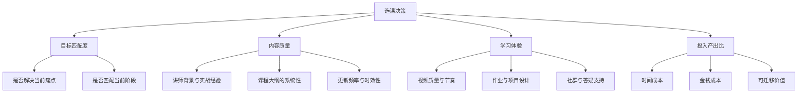
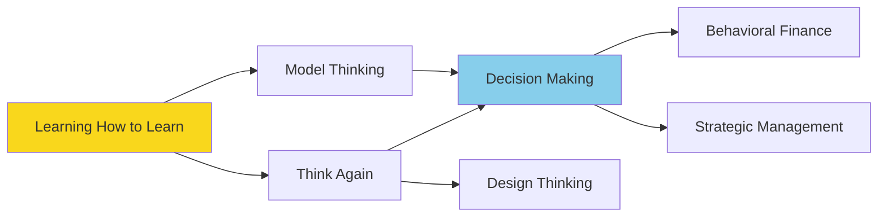
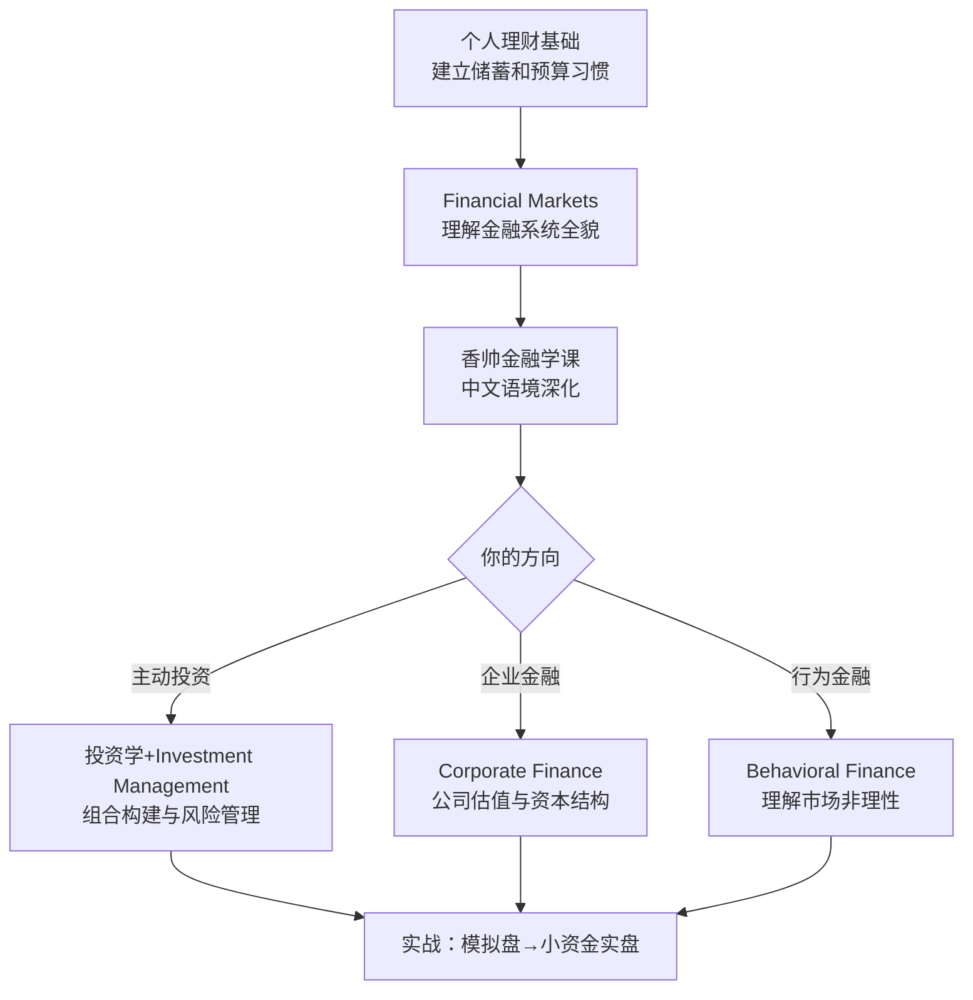

## 二、在线课程推荐

在线课程是个人提升体系中性价比最高的投资之一。一本好书 50 元，一门精品课程 200-400 元，但课程提供的**结构化知识路径 + 名师讲解 + 社群互动 + 作业反馈**是单纯阅读无法替代的。问题在于：全球课程平台数以万计，如何选到真正值得投入时间和金钱的课程？

### 2.1 选课方法论：四维评估框架

在推荐具体课程之前，先建立一套选课标准。盲目跟风"爆款课"是在线学习最常见的陷阱——一门课程火，不代表适合你当前的阶段。

#### 四维评估模型

**维度一：目标匹配度（权重 40%）**

选课前先回答三个问题：
1. **我当前的水平是什么？** 零基础选入门课，有经验选进阶课。选太简单的浪费时间，选太难的容易放弃。
2. **我要解决什么问题？** "想学投资"太模糊，"想搞懂指数基金定投的实操流程"才具体。
3. **学完能做什么？** 如果说不清楚学完后的具体产出，说明课程目标不明确。

**维度二：内容质量（权重 30%）**

- **讲师背景**：学术头衔不如实战经验重要。教投资的老师自己有没有真金白银的投资记录？教编程的老师有没有工业级项目经验？
- **大纲系统性**：好的课程大纲像一本书的目录，逻辑递进、不跳跃。警惕"什么都讲一点"的拼盘课。
- **时效性**：技术类课程超过 2 年未更新基本过时；思维类课程经典性更强，5 年内的都可以接受。

**维度三：学习体验（权重 20%）**

- 视频制作质量影响学习意愿，但不是决定性因素
- **作业和项目**是检验学习效果的核心——纯视频灌输的课程遗忘率极高
- 有 TA（助教）答疑或学习社群的课程完成率高 2-3 倍

**维度四：投入产出比（权重 10%）**

- Coursera/edX 可以免费旁听，付费拿证书
- 得到/极客时间等中文平台一般 199-399 元，终身有效
- 计算每小时学习成本：课程价格 ÷ 预计学习时长

### 2.2 主流平台横向对比

选课之前先选平台。不同平台的定位、价格体系、学习体验差异很大。

| 平台 | 定位 | 语言 | 价格区间 | 证书认可度 | 核心优势 | 主要短板 |
|------|------|------|----------|-----------|---------|---------|
| Coursera | 名校系统课程 | 英文为主 | 免费旁听/订阅 $59/月 | 高（名校背书） | 课程体系完整、可获学位 | 英文门槛、部分课程偏学术 |
| edX | 名校开放课程 | 英文为主 | 免费旁听/$50-300/课 | 高 | MIT/Harvard 品牌、严谨 | 英文门槛、互动较少 |
| 中国大学MOOC | 国内高校课程 | 中文 | 免费 | 中 | 中文友好、高校资源 | 部分课程质量参差不齐 |
| 得到 | 知识付费精品课 | 中文 | ¥199-499 | 低（无官方证书） | 名师精讲、中文原创 | 价格不低、偏通识 |
| 极客时间 | 技术专业课 | 中文 | ¥68-399 | 低 | 技术深度强、工程师视角 | 偏后端/技术方向 |
| 优达学城 | 职业纳米学位 | 中文/英文 | ¥1000-5000+ | 中高 | 项目驱动、企业合作 | 价格高 |
| B站 | 免费教程 | 中文 | 免费 | 无 | 资源丰富、社区活跃 | 不系统、质量不一 |
| YouTube | 全球教程 | 英文为主 | 免费 | 无 | 最大的免费学习库 | 英文门槛、碎片化 |

**选择建议**：
- **英语好 + 想系统学** → Coursera/edX，性价比极高
- **英语一般 + 想学中文内容** → 得到/中国大学MOOC/极客时间
- **想转行技术岗** → 优达学城纳米学位（有项目作品集）
- **预算为零** → B站 + YouTube + Coursera 旁听

### 2.3 思维与决策类课程

思维类课程的价值不在于记住多少模型，而在于**训练你用多元视角看问题的习惯**。这类课程学完不会立刻"变聪明"，但会在 3-6 个月后明显感受到决策质量的提升。

#### 核心课程推荐

**第一梯队：必修级**

| 课程名称 | 开设机构/讲师 | 平台 | 主要内容 | 适合人群 | 学习时长 | 费用 |
|---------|-------------|------|---------|---------|---------|------|
| Learning How to Learn | Barbara Oakley（加州大学圣地亚哥分校） | Coursera | 高效学习方法、克服拖延、记忆机制、组块化思维 | 所有人——这应该是你的第一门课 | 4周/每周3-4小时 | 免费旁听 |
| Model Thinking | Scott Page（密歇根大学） | Coursera | 博弈论、网络模型、线性/非线性模型等 20+ 思维模型 | 希望建立系统思维框架的人 | 10周/每周4-5小时 | 免费旁听 |
| Think Again: Reasoning and Argumentation | Duke University | Coursera | 逻辑推理、论证分析、认知偏误识别 | 需要提升批判性思维的人 | 12周/每周3-4小时 | 免费旁听 |

**Learning How to Learn 深度解读**：这门课全球学习者超过 300 万，是 Coursera 历史上最受欢迎的课程。核心概念包括：
- **专注模式 vs 发散模式**：大脑在高度集中和放松漫游时使用不同的神经网络，两种模式交替才能深度理解
- **组块化（Chunking）**：将零散信息打包成有意义的单元，是所有高手的共同特征
- **间隔重复 vs 集中突击**：分散练习的效果是集中练习的 2-3 倍
- **睡眠对学习的作用**：睡眠时大脑清除代谢毒素、巩固记忆，熬夜学习是反效率的

这门课应该作为所有后续学习的"元课程"——先学会怎么学，再开始学具体内容。

**第二梯队：专题深入**

| 课程名称 | 开设机构 | 平台 | 主要内容 | 适合人群 |
|---------|---------|------|---------|---------|
| Decision Making and Scoring | 哥伦比亚大学 | Coursera | 决策树、多准则决策、评分模型 | 管理者、需要做复杂决策的人 |
| Behavioral Finance | 杜克大学 | Coursera | 前景理论、心理账户、过度自信等行为偏误 | 投资者、金融从业者 |
| Design Thinking for Innovation | 弗吉尼亚大学 | Coursera | 同理心地图、原型测试、快速迭代 | 产品经理、创业者 |
| Critical Thinking & Problem Solving | 罗切斯特理工学院 | edX | 结构化问题分析、根因分析、方案评估 | 所有人 |
| The Science of Decision Making | 格罗宁根大学 | edX | 决策神经科学、双系统理论、启发式 | 对决策心理学感兴趣的人 |
| Strategic Management | 哥本哈根商学院 | edX | 竞争分析、资源基础观、动态能力 | 管理者、创业者 |

#### 学习路径建议

### 2.4 财务与投资类课程

投资类课程的核心价值不是教你"买什么"，而是帮你建立**理解金融系统运作的底层逻辑**。很多人亏钱不是因为不够聪明，而是因为缺乏基本的金融素养。

#### 国际平台课程

| 课程名称 | 开设机构/讲师 | 平台 | 核心内容 | 适合人群 | 学习时长 |
|---------|-------------|------|---------|---------|---------|
| Financial Markets | 罗伯特·席勒（耶鲁大学） | Coursera | 金融市场全景：股票、债券、衍生品、房地产、行为金融 | 所有投资者——诺贝尔奖得主亲授 | 7周/每周3-5小时 |
| Financial Planning for Young Adults | 伊利诺伊大学 | Coursera | 预算管理、信用评分、保险、退休规划 | 20-35岁理财入门者 | 4周/每周2-3小时 |
| Investment Management | 日内瓦大学 | Coursera | 投资组合构建、风险管理、绩效评估 | 有一定基础想进阶的投资者 | 5周/每周3-4小时 |
| Corporate Finance | 宾夕法尼亚大学沃顿商学院 | Coursera | 公司估值、资本结构、并购 | 想理解企业金融决策的人 | 6周/每周4-5小时 |

**Financial Markets 课程重点**：席勒教授的这门课不仅讲金融知识，更强调**金融的社会功能**——金融系统如何配置风险、如何服务实体经济。理解这个宏观视角，比单纯学技术分析有用得多。课程涵盖：
- 资产定价的基本原理（现金流折现、风险溢价）
- 股票市场的微观结构（做市商、订单簿、流动性）
- 衍生品的本质（期权、期货不是赌博工具，是风险管理工具）
- 行为金融学的实证发现（动量效应、均值回归、情绪周期）

#### 中文平台课程

| 课程名称 | 平台/讲师 | 核心内容 | 适合人群 | 价格 |
|---------|----------|---------|---------|------|
| 《个人理财基础》 | 中国大学MOOC（多所高校） | 储蓄、保险、基金、税务基础 | 理财零基础 | 免费 |
| 《投资学》 | 中国大学MOOC（中央财经大学） | 资产组合理论、CAPM、因子模型 | 有一定基础的投资者 | 免费 |
| 《财务分析与决策》 | 得到/清华经管 | 三张财务报表分析、财务比率、估值方法 | 管理者、投资者 | ¥299 |
| 《香帅的北大金融学课》 | 得到/唐涯 | 金融学全景：银行、证券、保险、房地产 | 想建立金融通识的职场人 | ¥399 |
| 《陈志武的金融课》 | 得到/陈志武 | 金融的本质、金融与社会 | 对金融哲学感兴趣的人 | ¥399 |

#### 投资学习路径

**关键提醒**：任何课程都不能替代实战。学完理论后，用小资金（比如 5000 元）做真实投资，亏损的教训比课堂上学到的深刻 10 倍。但切记：**先学后投，边学边投，永远不借钱投资**。

### 2.5 职业发展与管理类课程

职业发展类课程分为两条线：**个人成长线**（认知升级、习惯养成）和**管理能力线**（带团队、做决策）。25-30 岁重点在个人成长线，30+ 逐步加入管理线。

#### 中文知识付费精品课（得到 App）

得到是国内知识付费平台中内容质量最稳定的。以下课程经过市场验证，口碑和实用性都经过考验：

| 课程名称 | 主讲人 | 核心内容 | 学习价值 | 价格 | 学习建议 |
|---------|--------|---------|---------|------|---------|
| 《宁向东的管理学课》 | 宁向东（清华经管教授） | 计划、组织、领导、控制四大管理职能；激励理论、组织行为 | 中国语境下最系统的管理学入门课，比读 MBA 教材高效 | ¥399 | 适合带团队 1-3 年的中层管理者 |
| 《吴军·硅谷来信》 | 吴军（前 Google/腾讯高管） | 职业规划、认知升级、技术趋势、人生态度 | 跨界视野极强，不仅谈职业更谈人生格局 | ¥299 | 适合 25-40 岁所有职场人 |
| 《刘润·5分钟商学院》 | 刘润（前微软战略合作总监） | 商业模式、营销、管理、财务等商业通识 | 碎片化学习的典范，每篇 5 分钟一个商业概念 | ¥399 | 适合想建立商业思维的非商科背景人士 |
| 《万维钢·精英日课》 | 万维钢（物理学家/科学作家） | 科学思维、理性决策、前沿研究解读 | 帮你建立"用证据说话"的思维习惯 | ¥365/年 | 适合想提升认知水平的知识工作者 |
| 《熊逸讲透资治通鉴》 | 熊逸（历史作家） | 以《资治通鉴》为线索的管理智慧与人性洞察 | 历史是最好的管理案例库 | ¥399 | 适合想从历史中提炼决策智慧的人 |

**得到课程学习技巧**：
1. **不要囤课**：一次只开一门，跟完再开下一门。同时开 3 门以上的完成率不到 10%
2. **二倍速听 + 做笔记**：正常语速容易走神，二倍速反而更专注。听完一章合上手机，用自己的话复述要点
3. **每篇写一句感想**：哪怕只写"这个观点颠覆了我的认知：XXX"，也能把被动接收变成主动思考
4. **利用留言区**：得到的高质量留言区是隐藏的宝藏，很多学员的补充案例比课程本身还有价值

#### 播客：最低成本的终身学习方式

播客是被严重低估的学习渠道。免费、可碎片化收听、内容更新快、嘉宾质量高。以下是经过筛选的高质量中文播客：

**商业与投资类**

| 播客名称 | 主持人 | 核心内容 | 推荐理由 |
|---------|--------|---------|---------|
| 《知行小酒馆》 | 有知有行团队 | 投资理财、生活方式、消费观 | 最接地气的投资播客，不贩卖焦虑，强调长期主义 |
| 《硅谷101》 | 泓君 | 科技行业深度访谈、商业趋势 | 嘉宾级别高（创业者/投资人），信息密度大 |
| 《疯投圈》 | 黄海、Rio | 消费品、零售、品牌投资分析 | 对消费品行业有深度洞察，适合想了解消费赛道的人 |
| 《商业就是这样》 | 商业周刊团队 | 商业现象解读、行业分析 | 轻松易懂，每期 30-40 分钟讲透一个商业话题 |

**思维与成长类**

| 播客名称 | 主持人 | 核心内容 | 推荐理由 |
|---------|--------|---------|---------|
| 《得意忘形》 | 张潇雨 | 哲学、心理学、自我认知、创造力 | 中文播客中思考深度天花板，适合深夜独处时听 |
| 《声东击西》 | 徐涛、Tina | 科技、社会、文化交叉议题 | 视角独特，常带来意想不到的启发 |
| 《纳瓦尔宝典解读》系列 | 多位创作者 | 财富创造、幸福哲学、杠杆思维 | 虽然原著是英文，但中文解读版本更贴近本土语境 |

**播客学习技巧**：
- 通勤/做饭/运动时听，把碎片时间变成学习时间
- 听到好的观点立刻记到手机备忘录，否则 24 小时内遗忘 70%
- 定期回听经典单集——第一次听和第二次听的收获完全不同

### 2.6 技能提升类课程

技能课与知识课的最大区别：**技能课必须动手练**。看完 100 小时视频不如自己写 10 行代码。以下推荐侧重"有项目实践"的课程。

#### 编程与数据

| 课程名称 | 平台/机构 | 核心内容 | 适合人群 | 学习时长 | 费用 |
|---------|----------|---------|---------|---------|------|
| CS50: Introduction to Computer Science | 哈佛大学（edX） | C/Python/SQL/JS/Web 全栈入门，计算机科学思维 | 编程零基础——公认的编程第一课 | 12周/每周10-15小时 | 免费旁听 |
| Python for Everybody | 密歇根大学（Coursera） | Python 基础、数据结构、网络爬虫、数据库 | 零基础学 Python 的最佳入口 | 5门课/共20周 | 免费旁听 |
| 100 Days of Code | Udemy（Angela Yu） | Python/Web开发/自动化/数据科学/机器学习实战 | 喜欢项目驱动学习的人 | 100天/每天1-2小时 | ¥100-200 |
| 数据分析纳米学位 | 优达学城 | Excel/SQL/Python/Tableau/数据可视化 | 想转行数据分析的人 | 4个月/每周10小时 | ¥3000+ |
| fast.ai Practical Deep Learning | fast.ai | 从零到实践的深度学习课程 | 有 Python 基础想学 AI 的人 | 7周/每周5-10小时 | 免费 |

**CS50 为什么是编程第一课**：David Malan 教授的 CS50 是全球最受欢迎的计算机入门课，每年 800+ 哈佛学生选修。它不是教你某个语言的语法，而是教你**计算思维**——如何把现实问题抽象成计算机能处理的形式。课程从最底层的二进制讲起，逐步构建到 Web 应用，让你理解"技术栈每一层在做什么"。即使你以后不写代码，这种思维方式也极其有价值。

**给非程序员的建议**：如果你不是要转行做程序员，学 Python + 数据分析就够了。Python 的自动化能力能帮你省下大量重复劳动（Excel 批量处理、文件整理、数据清洗），这个投入产出比极高。

#### 沟通与表达

| 课程名称 | 平台/讲师 | 核心内容 | 适合人群 | 费用 |
|---------|----------|---------|---------|------|
| Introduction to Public Speaking | 华盛顿大学（Coursera） | 演讲结构、肢体语言、说服技巧 | 所有需要公开表达的人 | 免费旁听 |
| 高效沟通 | 中国大学MOOC | 倾听、反馈、冲突管理、跨文化沟通 | 职场沟通有困难的人 | 免费 |
| 演讲与口才 | 中国大学MOOC | 公众演讲、即兴表达、辩论技巧 | 需要提升表达能力的人 | 免费 |
| 《超级沟通力》 | 极客时间 | 结构化表达、汇报技巧、会议发言 | 互联网/科技行业从业者 | ¥129 |

#### 设计与创意

| 课程名称 | 平台 | 核心内容 | 适合人群 | 费用 |
|---------|------|---------|---------|------|
| Google UX Design Certificate | Coursera | 用户研究、线框图、原型、可用性测试 | 想了解 UX 设计的人 | 订阅制 |
| Fundamentals of Graphic Design | 加州艺术学院（Coursera） | 排版、色彩、构图、品牌设计基础 | 需要基础设计能力的人 | 免费旁听 |
| UI/UX 设计入门 | B站（多UP主） | Figma/Sketch 工具使用、界面设计 | 零基础学 UI 设计 | 免费 |

### 2.7 学习策略：如何真正完成一门课

选好课只是开始。在线课程的平均完成率不到 15%——这意味着 10 个人报名，只有 1-2 个人真正学完。以下是经过验证的高完成率策略。

#### 完课五步法

**第一步：开课前做准备（30 分钟）**
- 在日历中规划学习时间（固定时段，比如每天早上 7:00-7:45）
- 准备好笔记本（纸质或数字均可）
- 浏览完整课程大纲，标记最感兴趣的 3 个章节

**第二步：前 72 小时决定成败**
- 报名后 72 小时内必须完成第一课，否则完成率暴跌到 5% 以下
- 第一课哪怕只看 10 分钟，也要打破"还没开始"的心理障碍

**第三步：建立学习仪式感**
- 固定时间、固定地点、固定触发器（比如"泡一杯咖啡后开始"）
- 手机静音或使用 Forest 等专注 App
- 每次学习 25-45 分钟（番茄钟），中间休息 5 分钟

**第四步：主动学习而非被动观看**
- 看视频时随时暂停，用自己的话复述刚才的内容
- 做课程提供的所有作业和测验，不要跳过
- 学完一个模块后，写一段 100 字的学习总结发到朋友圈或学习社群

**第五步：学以致用**
- 学完后 72 小时内至少做一次应用（写文章、做项目、教别人）
- 费曼技巧：如果你不能用简单的话给别人讲明白，说明你还没真正理解

#### 常见误区与纠正

| 误区 | 为什么是错的 | 正确做法 |
|------|-------------|---------|
| 同时开 5 门课 | 多任务切换增加认知负荷，每门都学不深 | 一次只开 1-2 门，跟完再开下一门 |
| 只看视频不做作业 | 被动观看的记忆留存率只有 20%，主动练习可达 75% | 每个练习都做，哪怕觉得简单 |
| 追求 2 倍速刷完 | 速度过快导致浅层加工，看似学完实则什么都没留下 | 1.25-1.5 倍速为宜，重要内容正常速度反复听 |
| 收藏=学了 | 收藏夹里躺着 100 门课，没有一门开始过 | 每月最多收藏 3 门，收藏后 72 小时内必须开始 |
| 只学不输出 | 输入和输出失衡，知识无法内化 | 学完就写、就讲、就用 |
| 追求证书而非能力 | 证书只是一张纸，真正的能力体现在你能不能解决问题 | 把精力放在项目实践上，证书是副产品 |

### 2.8 免费学习资源精选

不是所有好内容都需要付费。以下资源完全免费，质量不亚于付费课程：

| 资源 | 类型 | 内容范围 | 推荐理由 |
|------|------|---------|---------|
| MIT OpenCourseWare | 大学课程 | 全学科 | MIT 的几乎所有课程资料免费开放 |
| Khan Academy | 教学视频 | 数学、科学、经济学、计算机 | 从零基础到高级，讲解极其清晰 |
| freeCodeCamp | 交互式课程 | Web 开发、Python、数据分析 | 全免费、项目驱动、有认证 |
| B站 | 视频教程 | 万能 | 搜索"XXX 教程"几乎都能找到免费版本 |
| YouTube | 视频教程 | 万能 | 英文世界最大的免费学习库 |
| 各大学公开课 | 视频课程 | 全学科 | 北大、清华、复旦等均有公开课 |

### 2.9 课程投入规划建议

学习是一辈子的事，但不需要一口气花钱。以下是一个分阶段的课程投资计划：

**第一阶段：免费试水（0-3 个月）**
- 从 Coursera 旁听 + B站免费教程开始
- 目标：确认自己的兴趣方向和学习习惯
- 预算：0 元

**第二阶段：精准投入（3-12 个月）**
- 确定 1-2 个核心方向后，投入 500-1500 元购买精品课程
- 优先选择有项目实践和社群支持的课程
- 预算：500-1500 元/年

**第三阶段：持续进化（1 年以后）**
- 根据职业发展需要选择进阶课程或认证项目
- 考虑优达学城纳米学位或 Coursera 专项课程
- 预算：2000-5000 元/年

**总原则**：课程费用控制在年收入的 1-3% 是合理的。年收入 10 万的人花 1000-3000 元学习完全值得——这可能是回报率最高的投资。

***
