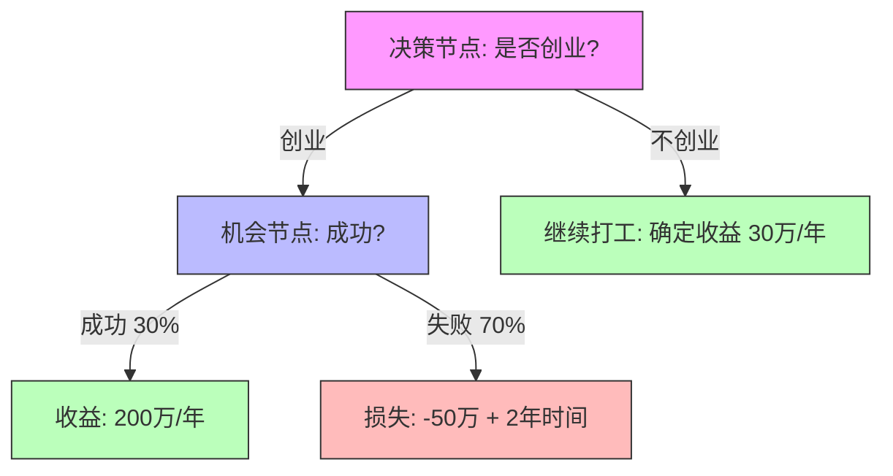
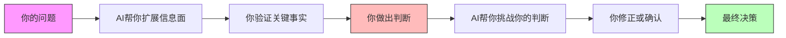

## 三、决策工具与软件

工具的价值不在于工具本身，而在于它帮你执行了什么思维过程。本节将决策工具分为两大类：**决策分析工具**（帮你做出更好的选择）和**执行支撑工具**（帮你把决策落地为行动）。两者缺一不可——光会分析不执行是空想，光会执行不分析是蛮干。

### 3.1 决策分析工具：帮你做出更好的选择

#### 3.1.1 决策矩阵（加权评分法）

决策矩阵是最实用的量化决策工具，核心思想是：**把主观感受变成可比较的数字**。

**适用场景**：面临2个以上选项，需要综合考虑多个因素时——比如选offer、选城市定居、选技术方案、选供应商。

**操作步骤**：

1. **列出所有备选方案**（横轴）
2. **列出所有评估维度**（纵轴），如薪资、发展空间、生活成本、通勤时间
3. **为每个维度赋权重**（0-10），反映该维度对你的重要程度
4. **为每个方案在每个维度上打分**（1-10）
5. **加权求和**，得分最高的方案即为推荐选择

**示例：选择工作Offer**

| 评估维度 | 权重 | Offer A（大厂） | Offer B（创业公司） | Offer C（外企） |
|---------|------|----------------|-------------------|----------------|
| 薪资待遇 | 9 | 8（72） | 6（54） | 9（81） |
| 发展空间 | 8 | 6（48） | 9（72） | 5（40） |
| 工作生活平衡 | 7 | 4（28） | 3（21） | 8（56） |
| 技术成长 | 8 | 8（64） | 9（72） | 6（48） |
| 稳定性 | 6 | 8（48） | 3（18） | 7（42） |
| 城市偏好 | 5 | 7（35） | 7（35） | 4（20） |
| **加权总分** | — | **295** | **272** | **287** |

从上表可以看出，即使创业公司的发展空间和技术成长得分最高，但因为稳定性和工作生活平衡拖了后腿，最终大厂以微弱优势胜出。**这就是决策矩阵的价值——它逼你直面每个维度的真实感受，而不是被某个闪光点一叶障目。**

**关键细节**：

- **权重设定是核心**。权重不同，结论可能完全不同。建议先用"强制排序法"确定权重：把所有维度两两对比，选出更重要的那个，最后统计每个维度"赢"的次数作为权重。
- **分数要拉开差距**。如果所有方案在某个维度上都打7-8分，说明你没有认真区分差异，这个维度实际上对区分方案没有帮助。
- **敏感性分析很重要**。把权重最高的2-3个维度的权重上下浮动20%，看结论是否翻转。如果翻转了，说明你的决策在这个区间内本质上是摇摆的，需要更多信息来打破平衡。

**工具实现**：

- **Excel / Google Sheets**：最灵活，用`SUMPRODUCT`函数一行搞定加权求和。模板搜索"decision matrix template"。
- **专门工具**：[Decision Matrix Analysis](https://www.mindtools.com/aunm65x/decision-matrix-analysis)（MindTools 在线版）、[Coggle](https://coggle.it)（可视化决策树）。

#### 3.1.2 决策树

决策树适用于**序列化决策**——当你的选择会触发一系列后续事件，而这些事件有不同的概率和收益时。

**适用场景**：是否跳槽（考虑试用期不过的风险）、是否创业（考虑失败的概率）、投资选择（考虑市场波动）、是否考研（考虑考不上和读完后的就业）。

**基本结构**：



**期望值计算**：

- 创业期望值 = 0.3 × 200 + 0.7 × (-50) = 60 - 35 = **25万/年**
- 不创业期望值 = **30万/年**

单从期望值看，不创业更优。但如果你的风险承受能力很强（即使失败也不影响基本生活），而且对创业有强烈热情，那25万和30万的差距可能不足以阻止你——**这就是为什么期望值只是参考，不是答案。**

**工具实现**：

- **Lucidchart**：拖拽式决策树绘制，支持团队协作，免费版可画3个文档。
- **Draw.io（diagrams.net）**：完全免费，支持离线使用，导出格式丰富，是画决策树的首选免费工具。
- **Python + graphviz**：适合需要程序化生成决策树的场景。

```python
# 用 Python 计算决策树期望值
def expected_value(outcomes):
    """outcomes: list of (probability, payoff) tuples"""
    return sum(p * v for p, v in outcomes)

创业 = expected_value([(0.3, 200), (0.7, -50)])
不创业 = 30
print(f"创业期望值: {创业}万, 不创业: {不创业}万")
print(f"差额: {创业 - 不创业}万")
```

#### 3.1.3 贝叶斯思维工具

贝叶斯思维的核心是：**根据新证据不断更新你的判断概率**。这在信息不完整的决策中极其重要。

**核心公式**：后验概率 = (似然度 × 先验概率) / 证据概率

**实际应用示例——判断一个创业想法是否靠谱**：

1. **先验概率**：你认为这个方向成功的概率是多少？（参考行业数据：中国创业公司5年存活率约7%）
2. **收集证据**：你做了市场调研、竞品分析、MVP测试
3. **更新概率**：每收集一条新证据，调整你的概率估计

| 证据 | 对成功概率的影响 | 更新后的概率估计 |
|------|----------------|----------------|
| 先验（行业基准） | — | 7% |
| 找到了明确的目标用户痛点 | +15% | 22% |
| 竞品分析发现市场空白 | +10% | 32% |
| MVP测试用户反馈积极 | +20% | 52% |
| 找到了有经验的合伙人 | +10% | 62% |
| 获得了天使投资意向 | +8% | 70% |

**工具实现**：

- **Spreadsheets**：建一个贝叶斯更新表格，每行一条新证据，自动计算后验概率。
- **Squiggle**（[squiggle语言](https://www.squiggle-language.com/)）：专门为概率估算设计的编程语言，适合做复杂的不确定性建模。
- **Guesstimate**（[getguesstimate.com](https://www.getguesstimate.com/)）：在线蒙特卡洛模拟工具，用概率分布代替点估计，直觉式的界面。

#### 3.1.4 SWOT / PEST / 五力分析框架

这些经典框架不是"工具软件"，但它们是决策的**思维操作系统**，有专门的软件支撑它们的执行。

**SWOT分析**（优势-劣势-机会-威胁）：

适用于：个人职业选择、项目评估、产品定位。

|  | 正面因素 | 负面因素 |
|--|---------|---------|
| **内部** | **S（优势）**：你有什么别人没有的？技能、资源、人脉、经验 | **W（劣势）**：你的短板在哪？资金、经验、能力、时间 |
| **外部** | **O（机会）**：外部环境有什么利好？政策、趋势、市场需求 | **T（威胁）**：外部有什么风险？竞争、政策变化、技术替代 |

**关键陷阱**：很多人做SWOT只是列清单，没有后续动作。正确的做法是：

- **SO策略**：如何用优势抓住机会？（进攻型）
- **WO策略**：如何弥补劣势以利用机会？（改进型）
- **ST策略**：如何用优势应对威胁？（防御型）
- **WT策略**：如何避免劣势遇上威胁？（规避型）

**PEST分析**（政治-经济-社会-技术）：

适用于：重大人生决策前评估宏观环境——比如是否移民、是否进入某个行业、是否在某个城市长期发展。

**Porter五力分析**：

适用于：评估某个行业或职业赛道的吸引力——现有竞争者、潜在进入者、替代品威胁、买方议价能力、供方议价能力。

**工具实现**：

- **Miro / FigJam**：内置SWOT模板，拖拽式操作，适合头脑风暴阶段。
- **Canva**：有大量SWOT/PEST的视觉化模板，适合做展示用的分析图。
- **Notion**：用数据库做SWOT的结构化记录，方便后续追踪和更新。

### 3.2 知识管理与思考工具

决策质量取决于你拥有多少高质量的信息和知识。以下工具帮你建立长期的个人知识体系，让每一次决策都站在之前所有思考的肩膀上。

#### 3.2.1 思维导图工具

**XMind**

- **核心能力**：支持思维导图、鱼骨图、矩阵图、时间线等8种图表类型
- **决策相关用法**：用思维导图拆解决策的各个因素，用鱼骨图分析问题根因，用矩阵图做方案对比
- **价格**：免费版支持基础导图功能；Pro版约¥388/年，解锁更多图表类型和导出格式
- **平台**：Windows / macOS / Linux / iOS / Android
- **推荐指数**：★★★★★

**MindNode**（Mac/iOS 专属）

- **核心能力**：界面极简优雅，上手零门槛，支持快速输入模式（按回车自动创建同级节点）
- **决策相关用法**：快速头脑风暴，把脑中零散的想法结构化
- **价格**：订阅约¥98/年，也有买断制
- **推荐指数**：★★★★☆（仅限 Apple 生态用户）

**选择建议**：如果你需要在多平台使用或需要丰富的图表类型，选 XMind；如果你是纯 Apple 用户且追求极简体验，选 MindNode。如果只是偶尔使用，两者免费版都够用。

#### 3.2.2 个人知识管理系统

**Notion**

Notion 不只是一个笔记工具，它是一个**可编程的个人数据库**。对于决策支撑来说，它的核心价值在于：

- **决策日志模板**：记录每次重大决策的背景、选项、分析过程、最终选择和结果回顾。长期积累后，你能发现自己的决策模式——是过于保守还是过于激进？在哪些维度上判断力最强？
- **目标追踪数据库**：用看板视图追踪年度目标进度，用日历视图管理关键节点
- **关系型数据库**：把目标、任务、决策、知识关联起来，形成完整的个人操作系统

**价格**：免费版已足够个人使用（无限页面、无限块），Pro版约$8/月增加文件上传和协作功能。

**推荐指数**：★★★★★

**Obsidian**

Obsidian 的核心哲学是**本地优先、纯文本、双向链接**。对于决策支撑来说：

- **双向链接**：当你在"跳槽决策"笔记中提到某个公司，Obsidian 会自动建立反向链接。三个月后你在看这家公司时，能直接看到当初的决策分析。
- **图谱视图**：可视化你所有笔记之间的关联，帮你发现隐藏的知识联系——比如你可能发现"职业规划"和"城市选择"笔记通过"互联网行业薪资"这个节点相连。
- **插件生态**：社区插件超过1000个，决策相关的包括 Excalidraw（手绘决策树）、Dataview（结构化查询）、Templater（决策模板自动化）。
- **数据安全**：所有数据存储在本地 Markdown 文件中，不依赖任何云服务，永远属于你。

**价格**：个人使用完全免费。同步服务$4/月（也可用 iCloud/Dropbox/坚果云免费同步）。

**推荐指数**：★★★★★

**Notion vs Obsidian 选择指南**：

| 维度 | Notion | Obsidian |
|------|--------|----------|
| 数据存储 | 云端 | 本地 |
| 学习曲线 | 低 | 中等 |
| 协作能力 | 强 | 弱 |
| 离线使用 | 有限 | 完全支持 |
| 自定义能力 | 中等（数据库） | 极强（插件+代码） |
| 适合场景 | 团队协作、项目管理 | 个人深度思考、长期知识积累 |
| 数据可迁移性 | 导出有损 | 纯 Markdown，随时迁移 |

**我的建议**：如果你同时需要项目管理和知识管理，可以两者搭配使用——Notion 管项目和协作，Obsidian 管思考和知识。不要纠结选哪个，先用起来再说。

#### 3.2.3 流程图与可视化工具

**Lucidchart**

- **核心能力**：专业级流程图、决策树、UML图、组织架构图
- **决策相关用法**：绘制完整的决策流程图，把"如果...那么..."的逻辑可视化
- **价格**：免费版限3个文档；个人版约$7.95/月
- **推荐指数**：★★★★☆

**Draw.io（diagrams.net）**

- **核心能力**：功能与 Lucidchart 相当，但**完全免费、无限制**
- **决策相关用法**：同上，且支持离线使用和直接保存到 GitHub/Google Drive
- **价格**：完全免费
- **推荐指数**：★★★★★（性价比之王）

**ProcessOn**（国产）

- **核心能力**：流程图、思维导图、UML图，中文界面和模板生态
- **决策相关用法**：内置大量中文模板，搜索"决策"即可找到决策树、SWOT等模板
- **价格**：免费版限制9个文件；会员约¥159/年
- **推荐指数**：★★★★☆（适合需要中文模板生态的用户）

### 3.3 目标管理与执行追踪工具

做出决策只是第一步，把决策变成行动才是真正的挑战。以下工具帮你将决策结果分解为可执行的任务，并持续追踪进度。

#### 3.3.1 任务管理工具

**Todoist**

- **核心能力**：自然语言输入任务（"每周一上午9点回顾周目标"自动识别为重复任务）、项目和标签体系、优先级、看板视图
- **决策相关用法**：把决策结果分解为具体行动项，设置关键节点的提醒
- **价格**：免费版支持5个活动项目、每项目5人协作；Pro版约$4/月，解锁标签、提醒、无限项目
- **平台**：全平台（Windows / macOS / Linux / iOS / Android / Web / 浏览器插件）
- **推荐指数**：★★★★★

**滴答清单**（国产替代）

- **核心能力**：与 Todoist 功能对标的国产工具，额外支持番茄钟、习惯打卡、日历视图
- **决策相关用法**：任务管理 + 习惯追踪一体化，比如决策"每天运动30分钟"后直接设为习惯打卡
- **价格**：免费版功能丰富；高级版约¥139/年
- **推荐指数**：★★★★★（国内用户首选，服务器在国内，同步更快）

**Microsoft To Do**（免费替代）

- **核心能力**：微软出品，与 Outlook 深度集成，"我的一天"功能帮你聚焦当日最重要的事
- **价格**：完全免费
- **推荐指数**：★★★★☆（适合已用微软生态的用户）

#### 3.3.2 日历与时间块工具

**Google Calendar**

- **核心能力**：多日历叠加、共享日历、与 Gmail 自动关联、时间块规划
- **决策相关用法**：用**时间块法**（Time Blocking）为决策相关的行动预留专门的时间段。比如"每周六上午9-11点：学习投资知识"，把它当成和客户会议一样不可取消的约定。
- **价格**：完全免费
- **推荐指数**：★★★★★

**Fantastical**（Apple 生态）

- **核心能力**：自然语言输入事件（"明天下午3点和张三在星巴克讨论项目"）、天气集成、多日历聚合
- **价格**：约$4.75/月（年付）
- **推荐指数**：★★★★☆（Apple 用户的高级选择）

#### 3.3.3 专注力工具

深度执行决策计划需要专注力。以下工具帮你对抗分心：

**Forest（专注森林）**

- **原理**：设定专注时长后种下一棵虚拟树，中途离开 app 树就会枯死。累计的专注时间可以兑换在现实中种真树（与 Trees for the Future 合作）。
- **价格**：约¥12（一次性购买，iOS）；Android 免费版有广告
- **推荐指数**：★★★★☆

**番茄 Todo**

- **原理**：基于番茄工作法（25分钟专注 + 5分钟休息），内置待办管理和数据统计
- **亮点**：可设置"严格模式"，在番茄钟期间屏蔽其他 app
- **价格**：免费版够用
- **推荐指数**：★★★★☆

**专注力工具的正确用法**：不要把它当成自律的替代品。工具只是帮你降低启动阻力——真正重要的是在专注时段内做**对的事**。先用决策分析工具确定"什么是对的事"，再用专注工具确保你在做。

### 3.4 财务决策工具

大多数人生重大决策都涉及财务因素。以下工具帮你建立财务数据基础，让涉及钱的决策有据可依。

#### 3.4.1 记账工具

**随手记**

- **核心能力**：多账户管理、预算设置、账单提醒、数据报表
- **适合人群**：需要全面财务管理的用户
- **价格**：免费版够用；VIP约¥68/年
- **推荐指数**：★★★★☆

**钱迹**

- **核心能力**：极简记账，专注于"快记一笔"的体验，自动识别支付宝/微信账单
- **适合人群**：只想简单记账、不需要复杂功能的用户
- **价格**：免费版够用；高级版约¥30/年
- **推荐指数**：★★★★★（极简主义者的首选）

**记账的决策价值**：连续记账3个月后，你能回答这些关键决策问题——

- 我的真实生活成本是多少？（跳槽谈薪的基础）
- 我的消费结构合理吗？（储蓄率够不够支撑我的中长期目标）
- 如果收入减少30%，哪些支出可以砍？（抗风险能力评估）
- 我离财务自由还差多少？（需要多少被动收入才能覆盖支出）

#### 3.4.2 投资研究工具

**雪球**

- **核心能力**：股票/基金行情、投资者社区、组合追踪、财报数据
- **适合人群**：有一定基础的股票投资者
- **决策相关用法**：在做投资决策前，用雪球搜索目标标的的深度分析文章，看多空双方的论据
- **价格**：免费
- **推荐指数**：★★★★☆

**且慢**

- **核心能力**：基金投资策略、智能定投、组合跟投
- **适合人群**：基金投资者、不想花太多时间研究个股的用户
- **决策相关用法**：选择与你风险偏好匹配的策略组合，避免追涨杀跌的情绪化决策
- **价格**：免费（基金交易有申购费）
- **推荐指数**：★★★★☆

**理杏仁**

- **核心能力**：专业级公司财务数据查询，支持PE/PB/ROE等关键指标的历史走势
- **适合人群**：需要做基本面分析的投资者
- **决策相关用法**：在决定买入某只股票前，查看其历史估值区间，判断当前是否处于合理价位
- **价格**：基础功能免费；高级功能约¥198/年
- **推荐指数**：★★★★☆

#### 3.4.3 电子表格：决策分析的瑞士军刀

**Excel / Google Sheets / WPS表格**

电子表格是决策分析最通用的工具，因为它足够灵活——你可以用它做决策矩阵、财务模型、蒙特卡洛模拟、敏感性分析，几乎不受限制。

**决策相关的实用模板**：

| 模板类型 | 用途 | 关键公式/功能 |
|---------|------|-------------|
| 决策矩阵 | 多方案多维度对比 | `SUMPRODUCT`（加权求和） |
| 财务仪表盘 | 资产负债、收支、投资追踪 | 数据透视表、图表 |
| 退休计算器 | 计算财务自由所需时间 | `FV`、`PV`、`PMT` 函数 |
| 租买决策 | 买房 vs 租房的长期成本对比 | `NPV`（净现值）、现金流折现 |
| 敏感性分析 | 改变一个变量看结果如何变化 | 数据表（What-If Analysis） |
| 蒙特卡洛模拟 | 用随机模拟评估不确定性 | `RAND` + 大量迭代 + 直方图 |

**推荐指数**：★★★★★（必须掌握基础操作）

### 3.5 AI 辅助决策工具

2024年以来，AI工具正在深刻改变决策的方式。它们不是替你做决定，而是帮你更快地收集信息、分析数据、发现盲点。

#### 3.5.1 通用大模型（对话式决策助手）

**ChatGPT / Claude / 通义千问 / 文心一言**

- **决策相关用法**：
  - **信息收集**："帮我对比深圳和杭州的互联网行业薪资水平、生活成本、落户政策"
  - **假设挑战**："我打算辞职创业，以下是我的计划，请你扮演一个理性的投资人，指出这个计划的漏洞"
  - **方案生成**："我的预算是30万，想在3年内买房，请给我3种不同的财务规划方案"
  - **角色模拟**："假设你是我的职业导师，我的背景是...，你会建议我怎么选择？"

- **使用注意**：
  - AI 的知识有截止日期，实时数据（股价、政策）需要你自己补充
  - AI 倾向于给出"平衡"的回答，你需要明确要求它给出倾向性判断
  - **最重要的用法不是问AI"我该怎么做"，而是让AI帮你发现你没想到的角度**

- **推荐指数**：★★★★★

#### 3.5.2 专业 AI 分析工具

**Perplexity AI**

- **核心能力**：AI搜索引擎，回答附带来源引用，适合快速收集决策所需的背景信息
- **价格**：免费版每天有次数限制；Pro版约$20/月
- **推荐指数**：★★★★★（信息收集首选）

**NotebookLM**（Google）

- **核心能力**：上传你的决策相关资料（PDF、网页、笔记），AI基于你的资料回答问题
- **决策相关用法**：把你想去的几家公司的资料、行业报告全部上传，让AI帮你做交叉分析
- **价格**：免费
- **推荐指数**：★★★★☆

#### 3.5.3 AI 工具在决策中的正确使用姿势



**核心原则**：AI 是参谋，不是司令。它可以帮你看到更多信息、更多角度，但最终拍板的必须是你——因为只有你了解自己的价值观、情感需求和真实处境。

### 3.6 财务计算专用工具

#### 3.6.1 复利与投资计算器

**Investing.com 复利计算器**

- **用途**：计算定投、复利增长的长期收益，帮你理解"时间的力量"
- **关键场景**：每月定投2000元，年化8%，30年后是多少？答案是约300万（本金仅72万）

**Bankrate / NerdWallet**（英文）

- **用途**：房贷计算器、退休规划计算器、投资回报计算器
- **优势**：计算模型专业，支持通胀调整

**国内替代**：

- **支付宝-理财-计算器**：房贷、养老金、教育金计算
- **招商银行 App**：内置多种理财计算器

### 3.7 工具选型决策指南

面对这么多工具，你不需要全部使用。以下是按使用场景的推荐组合：

#### 3.7.1 按决策类型选工具

| 决策类型 | 推荐工具组合 | 理由 |
|---------|------------|------|
| 日常小决策（吃什么、买哪个） | AI 对话 + 直觉 | 快速决策比完美决策更重要 |
| 职业选择 | 决策矩阵（Excel）+ 思维导图（XMind）+ AI 对话 | 需要量化对比 + 结构化思考 + 信息收集 |
| 投资决策 | 记账工具 + Excel财务模型 + 雪球/理杏仁 | 先了解自己的财务状况，再做投资 |
| 创业/重大转型 | 决策树 + 贝叶斯更新 + SWOT分析 + AI 挑战 | 概率思维 + 框架分析 + 外部视角 |
| 团队/家庭决策 | Miro白板 + Notion协作 + 决策矩阵 | 需要可视化 + 协作记录 + 量化共识 |

#### 3.7.2 按预算选工具

**零预算方案**：

- 思维导图：Draw.io（免费）
- 知识管理：Obsidian（免费）
- 任务管理：滴答清单免费版 / Microsoft To Do
- 决策分析：Google Sheets（免费）
- AI 助手：通义千问 / 文心一言（免费）
- 记账：钱迹免费版

**百元/年方案**：

- 以上全部 + XMind Pro（¥388/年）或 Todoist Pro（$48/年）
- 约 ¥500-800/年覆盖所有核心需求

**不限预算方案**：

- 以上全部 + Notion Pro + ChatGPT Plus + Lucidchart
- 重点不在花钱多少，在于**坚持使用**

#### 3.7.3 常见误区

**误区一：工具越多越好**

事实是：工具越多，维护成本越高，注意力越分散。大多数人需要的核心工具不超过5个。先精通2-3个，再按需扩展。

**误区二：换了新工具就能改变习惯**

如果你用纸笔都记不住待办，换到 Notion 也不会变好。工具是放大器——它放大的是你已有的习惯。先建立习惯，再用工具提效。

**误区三：只收藏工具不使用**

收藏了一堆"XX神器推荐"的文章，注册了十个账号，然后？然后就没有然后了。**今天就选一个工具，开始记录你的第一个决策日志。**

**误区四：过度优化工具配置**

花3小时配置 Notion 模板、调 Obsidian 主题、对比各种 GTD 工具——然后3小时过去了，一个任务都没执行。这叫**生产性拖延**（Productive Procrastination）。工具配置应该是"够用就停"，把时间花在真正的决策和执行上。

### 3.8 快速行动清单

1. **今天**：选一个任务管理工具（Todoist 或滴答清单），把你当前最重要的3个目标分解为本周的行动项
2. **本周**：用决策矩阵分析你当前面临的一个选择（哪怕很小的也行），体验量化决策的过程
3. **本月**：建立你的决策日志（用 Notion 或 Obsidian），记录本月做过的2-3个决定和当时的思考过程
4. **持续**：每月回顾决策日志，看看你的决策质量是否在提升——哪些判断对了，哪些错了，为什么
